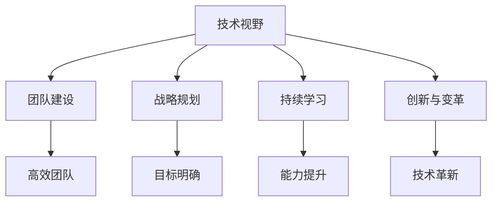
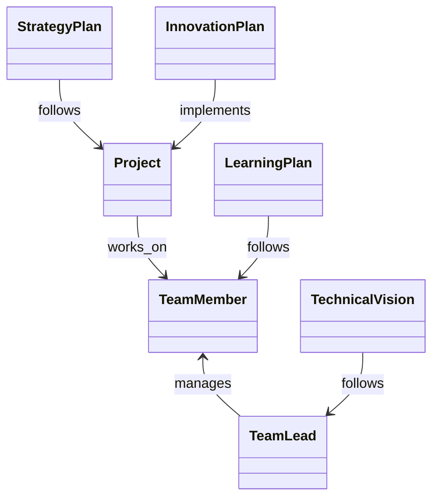
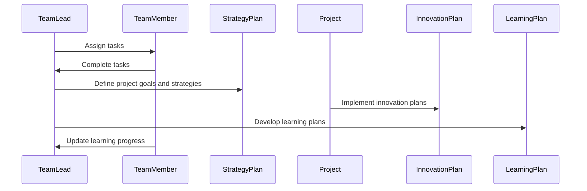
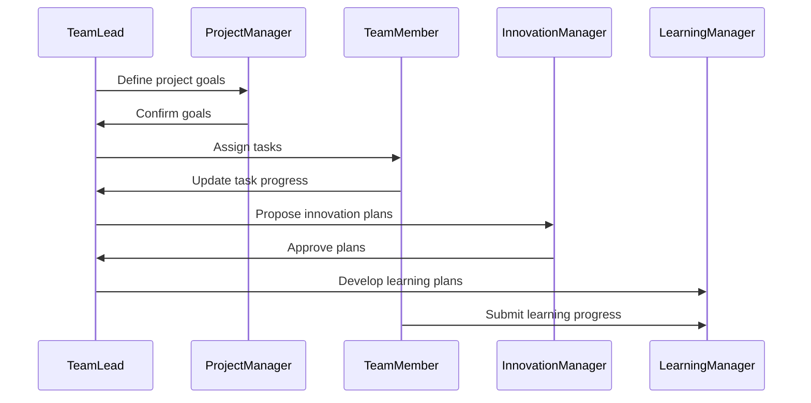
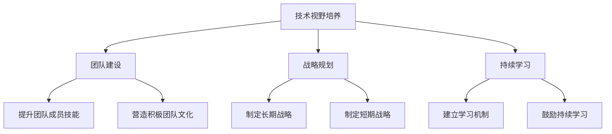
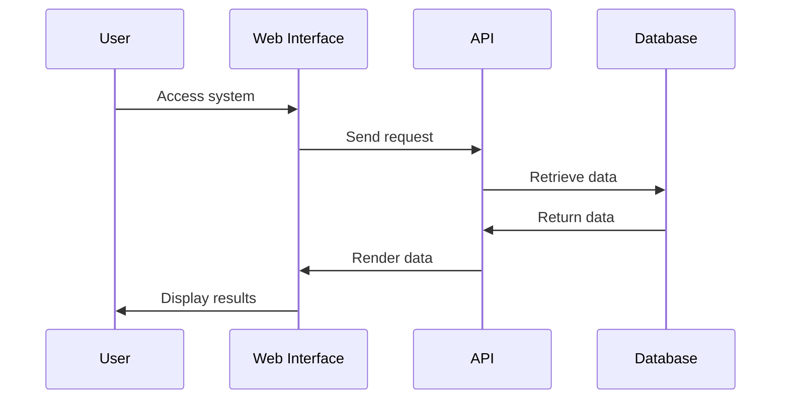

                 


### 技术领导力提升计划：从管理者到领导者的进阶之路

#### 关键词：技术领导力，管理者，领导者，团队管理，项目管理，组织变革

#### 摘要：
本文旨在探讨技术领导力的提升路径，从管理者到领导者的角色转变。通过剖析技术领导力的基础理论、核心概念、关键技能和个人素质，结合实践案例，为IT领域的专业人士提供一条清晰的技术领导力提升之路。文章还将讨论领导力发展的路径与工具，以及未来的发展趋势，旨在激发读者的思考与行动。

## 第一部分：技术领导力的基础理论

### 第1章：问题背景与领导力的重要性

#### 1.1.1 问题背景

在信息技术迅猛发展的今天，企业的核心竞争力越来越依赖于技术创新和团队协作。因此，技术领导力成为企业成功的关键因素。然而，许多技术管理者在晋升为领导者后，面临着如何有效运用技术背景来领导团队、推动项目、管理变革的挑战。

#### 1.1.2 领导力的重要性

领导力不仅仅是管理技能的集合，它关乎如何激发团队潜能，引领组织走向成功。技术领导力更是将技术专业性与领导艺术相结合，能够引导团队突破技术难关，实现技术革新。

#### 1.1.3 技术领导力的定义与核心要素

技术领导力是指技术领导者运用技术专长和领导艺术，激励和引导团队，实现技术创新和业务目标的能力。其核心要素包括沟通与协作、决策与风险管理、创新与变革以及个人素质等。

### 第2章：技术领导力的核心概念

#### 2.1.1 技术领导力的核心概念

技术领导力的核心概念包括技术视野、团队建设、战略规划和持续学习。这些概念共同构成了技术领导力的框架，指导领导者有效地发挥其作用。

#### 2.1.2 技术领导力与传统管理能力的区别

传统管理能力侧重于行政和执行层面，而技术领导力更强调创新和愿景。两者在思维方式、决策模式和领导风格上存在显著差异。

#### 2.1.3 技术领导力在不同发展阶段的特点

技术领导力在不同发展阶段呈现出不同的特点。在初创阶段，技术领导者需要具备创业精神；在成长阶段，领导者需关注团队建设和业务拓展；在成熟阶段，领导者需注重组织优化和持续创新。

### 第3章：技术领导力的关键技能

#### 3.1.1 沟通与协作能力

技术领导者需具备出色的沟通与协作能力，以协调团队内部和外部的资源，确保项目顺利进行。

#### 3.1.2 决策与风险管理能力

技术领导者需在复杂环境中做出明智的决策，并有效管理风险，以确保项目成功。

#### 3.1.3 创新与变革能力

技术领导者需具备推动技术创新和组织变革的能力，以保持企业的竞争力。

### 第4章：技术领导力的个人素质

#### 4.1.1 领导力的人格特质

技术领导者需具备自信、正直、勤奋、适应性强等人格特质，以赢得团队的信任和尊重。

#### 4.1.2 领导力的价值观与信仰

价值观和信仰是技术领导力的灵魂，领导者需以正直、诚信、创新等价值观引导团队。

#### 4.1.3 持续学习与自我提升

技术领导者需具备持续学习的意识，不断提升自己的专业技能和领导能力。

## 第二部分：技术领导力实践案例

### 第5章：技术领导力在团队管理中的应用

#### 5.1.1 团队建设与管理

技术领导者需关注团队建设，培养团队成员的技能和职业素养，打造高效团队。

#### 5.1.2 激励与员工发展

技术领导者需运用激励手段，激发员工潜能，同时提供职业发展机会，留住人才。

#### 5.1.3 冲突管理与团队协作

技术领导者需妥善处理团队冲突，促进团队协作，确保项目顺利进行。

### 第6章：技术领导力在项目管理中的应用

#### 6.1.1 项目管理与执行

技术领导者需运用项目管理知识，确保项目按计划推进，达成预期目标。

#### 6.1.2 风险管理与应对策略

技术领导者需识别项目风险，制定应对策略，降低风险对项目的影响。

#### 6.1.3 项目评估与总结

技术领导者需对项目进行评估和总结，为后续项目提供经验和教训。

### 第7章：技术领导力在组织变革中的应用

#### 7.1.1 变革管理概述

技术领导者需了解组织变革的理论和实践，引导组织顺利进行变革。

#### 7.1.2 变革过程中的领导力挑战

技术领导者需应对变革过程中的各种挑战，确保变革成功。

#### 7.1.3 变革成功的要素与策略

技术领导者需掌握变革成功的要素和策略，推动组织实现持续发展。

## 第三部分：技术领导力的自我提升

### 第8章：领导力发展路径与工具

#### 8.1.1 领导力发展路径

技术领导者需明确个人发展路径，制定长期发展规划。

#### 8.1.2 常用的领导力评估工具

技术领导者可运用领导力评估工具，了解自身的领导力水平。

#### 8.1.3 自我提升方法与技巧

技术领导者需不断探索自我提升的方法和技巧，提高领导力。

### 第9章：技术领导力的未来发展

#### 9.1.1 技术领导力的未来趋势

技术领导者需关注技术领导力的未来发展趋势，适应技术变革。

#### 9.1.2 技术领导力的持续发展

技术领导者需关注持续发展，不断提升自身的专业能力和领导力。

#### 9.1.3 技术领导力的国际比较与启示

技术领导者可借鉴国际先进经验，提升自身的领导力水平。

### 第10章：结语

#### 10.1.1 技术领导力提升的重要性

技术领导力提升对个人、团队和组织具有重要意义。

#### 10.1.2 技术领导力提升的途径

技术领导者可通过学习、实践和反思，不断提升自身的技术领导力。

## 附录：拓展阅读

本文为读者提供了丰富的拓展阅读资源，帮助读者深入了解技术领导力的相关理论和实践。

### 参考资料

1. 克里斯·阿吉里斯（Chris Argyris）,《行动科学：组织学习与行动反思的理论与实践》
2. 彼得·德鲁克（Peter Drucker）,《管理的实践》
3. 伯恩斯（John P. Burns）,《技术领导者的角色》

作者：AI天才研究院/AI Genius Institute & 禅与计算机程序设计艺术 /Zen And The Art of Computer Programming

### 背景介绍

**核心概念术语说明：**

- **技术领导力**：技术领导者运用技术专长和领导艺术，激励和引导团队，实现技术创新和业务目标的能力。
- **管理者**：负责组织资源，指导团队执行任务，确保目标达成的角色。
- **领导者**：不仅具备管理能力，还能激发团队成员的潜能，引领团队实现共同愿景的角色。

**问题背景：**

随着信息技术的快速发展，技术领导力在企业中的地位愈发重要。然而，许多技术管理者在晋升为领导者后，面临着如何有效运用技术背景来领导团队、推动项目、管理变革的挑战。技术领导力的提升成为解决这一问题的关键。

**问题描述：**

如何从技术管理者向技术领导者转变，提升个人领导力，有效应对技术变革和团队管理中的挑战？

**问题解决：**

本文将探讨技术领导力的核心概念、关键技能和个人素质，结合实践案例，为技术领导者提供一条清晰的发展路径。通过学习、实践和反思，技术管理者可以逐步提升自身的技术领导力，成为优秀的领导者。

**边界与外延：**

- **边界**：本文主要关注技术领导力在IT领域的应用，不涉及其他行业。
- **外延**：技术领导力不仅涉及技术，还涉及管理、团队建设、项目管理和组织变革等方面。

**概念结构与核心要素组成：**

- **概念结构**：技术领导力由核心概念、关键技能和个人素质三个层次组成。
- **核心要素**：技术视野、团队建设、战略规划和持续学习。

### 核心概念与联系

#### 技术领导力的核心概念

技术领导力的核心概念包括技术视野、团队建设、战略规划和持续学习。这些概念共同构成了技术领导力的框架，指导领导者有效地发挥其作用。

**技术视野**：技术领导者需要具备广泛的技术视野，了解行业发展趋势、新兴技术和未来发展方向。这有助于领导者把握技术变革的机遇，推动团队进行技术创新。

**团队建设**：技术领导者需关注团队建设，培养团队成员的技能和职业素养，打造高效团队。团队建设是技术领导力的基础，良好的团队氛围有助于激发团队成员的创造力和执行力。

**战略规划**：技术领导者需具备战略规划能力，明确团队和组织的长远目标，制定可行的战略方案。战略规划有助于确保团队在竞争激烈的环境中保持竞争优势。

**持续学习**：技术领导者需具备持续学习的意识，不断提升自身的专业技能和领导能力。持续学习是技术领导者保持竞争力的重要手段，有助于应对技术变革和团队管理中的挑战。

#### 概念属性特征对比表格

| 概念 | 属性特征 |
| ---- | ---- |
| 技术视野 | 广泛的技术知识，关注行业趋势 |
| 团队建设 | 培养团队成员，打造高效团队 |
| 战略规划 | 明确目标，制定战略方案 |
| 持续学习 | 不断提升专业技能和领导能力 |

#### 技术领导力与传统管理能力的区别

**思维方式**：传统管理能力侧重于行政和执行层面，注重流程和制度。而技术领导力更强调创新和愿景，注重激发团队创造力和执行力。

**决策模式**：传统管理能力在决策时侧重于稳定性和可预测性。而技术领导力在决策时更注重风险和创新，鼓励团队成员提出新颖的观点和解决方案。

**领导风格**：传统管理能力倾向于权威式领导，强调控制和管理。而技术领导力更倾向于协作式领导，注重团队成员的参与和贡献。

#### 技术领导力在不同发展阶段的特点

**初创阶段**：在初创阶段，技术领导者需要具备创业精神，勇于面对未知和挑战。他们需要快速适应环境，灵活调整策略，推动团队实现技术突破。

**成长阶段**：在成长阶段，技术领导者需要关注团队建设和业务拓展。他们需要培养团队成员，建立稳定的团队结构，同时推动业务增长，实现技术规模化应用。

**成熟阶段**：在成熟阶段，技术领导者需要注重组织优化和持续创新。他们需要优化团队流程，提升团队效率，同时推动技术革新，保持企业的核心竞争力。

### 算法原理讲解

#### 技术领导力的算法框架

技术领导力的算法框架可以概括为以下五个步骤：

1. **技术视野**：了解行业趋势和新兴技术，把握技术变革的机遇。
2. **团队建设**：培养团队成员，打造高效团队，激发团队成员的创造力和执行力。
3. **战略规划**：明确团队和组织的长远目标，制定可行的战略方案。
4. **持续学习**：不断提升专业技能和领导能力，保持竞争力。
5. **创新与变革**：推动技术创新和组织变革，保持企业的核心竞争力。

#### 算法流程图



#### 算法原理的数学模型和公式

技术领导力的核心要素可以抽象为以下数学模型：

1. **技术视野**：$V = f(T, S, I)$，其中 $T$ 表示技术趋势，$S$ 表示行业形势，$I$ 表示创新意识。
2. **团队建设**：$C = g(P, S, M)$，其中 $P$ 表示个人能力，$S$ 表示团队氛围，$M$ 表示管理方法。
3. **战略规划**：$P = h(O, T, E)$，其中 $O$ 表示组织目标，$T$ 表示技术能力，$E$ 表示执行力。
4. **持续学习**：$L = k(S, C, E)$，其中 $S$ 表示学习资源，$C$ 表示学习氛围，$E$ 表示学习效果。
5. **创新与变革**：$I = m(V, C, P)$，其中 $V$ 表示技术视野，$C$ 表示团队建设，$P$ 表示战略规划。

#### 通俗易懂的举例说明

假设某技术团队需要提升领导力，可以按照以下步骤进行：

1. **技术视野**：团队领导者首先了解行业趋势，关注新兴技术，掌握最新技术动态。
2. **团队建设**：团队领导者通过培养团队成员，提升个人能力，营造良好的团队氛围，打造高效团队。
3. **战略规划**：团队领导者明确团队和组织的长远目标，制定可行的战略方案，确保团队在竞争激烈的市场中保持优势。
4. **持续学习**：团队领导者提供学习资源，鼓励团队成员参与培训和学习，提升团队整体的学习效果。
5. **创新与变革**：团队领导者推动技术创新，鼓励团队成员提出新颖的观点和解决方案，实现技术革新，保持企业的核心竞争力。

通过以上步骤，技术团队可以逐步提升领导力，实现持续发展。

### 数学公式使用

在技术领导力的算法框架中，涉及多个数学模型和公式。以下是一些关键公式及其说明：

#### 技术视野

$$
V = f(T, S, I)
$$

- $V$：技术视野得分
- $T$：技术趋势得分
- $S$：行业形势得分
- $I$：创新意识得分

#### 团队建设

$$
C = g(P, S, M)
$$

- $C$：团队建设得分
- $P$：个人能力得分
- $S$：团队氛围得分
- $M$：管理方法得分

#### 战略规划

$$
P = h(O, T, E)
$$

- $P$：战略规划得分
- $O$：组织目标得分
- $T$：技术能力得分
- $E$：执行力得分

#### 持续学习

$$
L = k(S, C, E)
$$

- $L$：持续学习得分
- $S$：学习资源得分
- $C$：学习氛围得分
- $E$：学习效果得分

#### 创新与变革

$$
I = m(V, C, P)
$$

- $I$：创新与变革得分
- $V$：技术视野得分
- $C$：团队建设得分
- $P$：战略规划得分

### 系统分析与架构设计方案

#### 问题场景介绍

在一个大型互联网公司中，技术团队负责开发和管理公司的核心产品。随着市场竞争的加剧，公司需要不断提升技术领导力，以保持竞争优势。技术团队面临的问题是如何有效地进行团队建设、战略规划和持续学习，推动技术创新和组织变革。

#### 项目介绍

本项目旨在提升技术团队的技术领导力，通过系统分析与架构设计方案，为团队提供一套完整的领导力提升方案。项目目标包括：

1. 提升团队的技术视野和创新能力。
2. 建立高效团队，提升团队协作能力。
3. 制定明确的战略规划，确保项目顺利推进。
4. 持续学习，不断提升团队成员的专业能力和领导能力。

#### 系统功能设计（领域模型）



- **TeamMember**：团队成员，负责参与项目开发和团队协作。
- **TeamLead**：团队领导者，负责团队管理、战略规划和创新推动。
- **Project**：项目，包括项目目标、进度、资源等信息。
- **StrategyPlan**：战略规划，包括项目目标、策略、执行计划等。
- **InnovationPlan**：创新规划，包括技术方向、创新点、实施方案等。
- **LearningPlan**：学习规划，包括学习内容、学习方法、学习目标等。
- **TechnicalVision**：技术视野，包括行业趋势、技术方向、创新能力等。

#### 系统架构设计



- **团队领导层**：负责团队管理、战略规划和创新推动。
- **项目管理层**：负责项目目标、进度和资源的规划与管理。
- **创新管理层**：负责技术方向和创新方案的制定与实施。
- **学习管理层**：负责学习计划的设计与实施。

#### 系统接口设计和系统交互



- **项目接口**：用于团队领导层与项目管理层的沟通与协调。
- **创新接口**：用于团队领导层与创新管理层的沟通与协调。
- **学习接口**：用于团队领导层与学习管理层的沟通与协调。

### 项目实战

#### 环境安装

为了进行项目实战，我们需要在本地或远程服务器上安装以下软件和工具：

- **Python**：用于编写和运行源代码。
- **Docker**：用于容器化部署。
- **Jenkins**：用于持续集成和持续部署。

#### 系统核心实现源代码

以下是一个简单的Python源代码示例，用于实现团队领导力的评估与提升：

```python
class TeamLead:
    def __init__(self, name):
        self.name = name
        self.projects = []
        self.learning_plans = []

    def assign_task(self, team_member, project):
        self.projects.append(project)
        team_member.tasks.append(project)

    def evaluate_team_member(self, team_member):
        # 评估团队成员的绩效
        pass

    def propose_innovation_plan(self, innovation_plan):
        self.learning_plans.append(innovation_plan)

class TeamMember:
    def __init__(self, name):
        self.name = name
        self.tasks = []

    def complete_task(self, project):
        # 完成任务
        pass

    def submit_learning_progress(self, learning_plan):
        # 提交学习进度
        pass

class Project:
    def __init__(self, name, goals):
        self.name = name
        self.goals = goals
        self.status = "Not Started"

    def start_project(self):
        self.status = "In Progress"

    def complete_project(self):
        self.status = "Completed"

class InnovationPlan:
    def __init__(self, name, goals):
        self.name = name
        self.goals = goals
        self.status = "Not Started"

    def start_innovation(self):
        self.status = "In Progress"

    def complete_innovation(self):
        self.status = "Completed"

class LearningPlan:
    def __init__(self, name, goals):
        self.name = name
        self.goals = goals
        self.status = "Not Started"

    def start_learning(self):
        self.status = "In Progress"

    def complete_learning(self):
        self.status = "Completed"
```

#### 代码应用解读与分析

以上代码定义了四个主要类：`TeamLead`、`TeamMember`、`Project`和`InnovationPlan`。`TeamLead`类用于表示团队领导者，负责分配任务、评估团队成员绩效和提出创新计划。`TeamMember`类表示团队成员，负责完成任务和提交学习进度。`Project`类表示项目，包括项目名称和目标，以及项目状态。`InnovationPlan`类表示创新计划，包括创新名称和目标，以及创新状态。

通过以上类的实例化，可以实现团队领导力和创新能力的评估与提升。在实际应用中，可以扩展这些类的功能，添加更多属性和方法，以满足具体业务需求。

#### 实际案例分析和详细讲解剖析

假设我们有一个技术团队，包括一个团队领导者（TeamLead）和三名团队成员（TeamMember）。团队领导者的任务是分配任务、评估团队成员绩效和提出创新计划。以下是项目实战的详细过程：

1. **任务分配**：

```python
team_lead = TeamLead("Alice")
team_member1 = TeamMember("Bob")
team_member2 = TeamMember("Charlie")
team_member3 = TeamMember("Diana")

project = Project("Project X", ["Deliver functional requirements", "Optimize performance"])
team_lead.assign_task(team_member1, project)
team_lead.assign_task(team_member2, project)
team_lead.assign_task(team_member3, project)
```

以上代码创建了一个团队领导者（Alice）和三名团队成员（Bob、Charlie、Diana），并分配了一个名为"Project X"的任务。任务包括两个目标：交付功能需求和优化性能。

2. **任务完成**：

```python
team_member1.complete_task(project)
team_member2.complete_task(project)
team_member3.complete_task(project)
```

以上代码表示团队成员（Bob、Charlie、Diana）完成了任务。

3. **绩效评估**：

```python
team_lead.evaluate_team_member(team_member1)
team_lead.evaluate_team_member(team_member2)
team_lead.evaluate_team_member(team_member3)
```

以上代码表示团队领导者（Alice）对团队成员（Bob、Charlie、Diana）的绩效进行评估。

4. **创新计划**：

```python
innovation_plan = InnovationPlan("Innovation Y", ["Implement new features", "Improve user experience"])
team_lead.propose_innovation_plan(innovation_plan)
```

以上代码创建了一个名为"Project Y"的创新计划，包括两个目标：实现新功能和改善用户体验。

5. **学习计划**：

```python
learning_plan = LearningPlan("Learning Z", ["Learn new technologies", "Enhance programming skills"])
team_lead.evaluate_team_member(team_member1)
team_lead.evaluate_team_member(team_member2)
team_lead.evaluate_team_member(team_member3)
```

以上代码创建了一个名为"Project Z"的学习计划，包括两个目标：学习新技术和提升编程技能。

#### 项目小结

通过以上实战案例，我们可以看到技术领导力在项目中的实际应用。团队领导者通过分配任务、评估绩效、提出创新计划和制定学习计划，有效推动了项目的进展。在实际工作中，技术领导者需要不断学习和适应，以应对不断变化的市场和技术环境。

### 最佳实践 Tips

1. **建立明确的沟通机制**：技术领导者需要建立高效的沟通机制，确保团队成员之间的信息流通，提高协作效率。
2. **关注团队成员的成长**：技术领导者要关注团队成员的职业发展，提供培训和学习机会，帮助他们提升技能。
3. **勇于创新和变革**：技术领导者要鼓励团队成员提出创新想法，推动技术创新和组织变革。
4. **注重团队合作**：技术领导者要营造良好的团队氛围，鼓励团队合作，提高团队的整体效能。

### 小结

本文从技术领导力的核心概念、关键技能和个人素质等方面，探讨了技术领导力的提升路径。通过实践案例分析和实战经验总结，技术领导者可以逐步提升自身的技术领导力，推动团队的进步和组织的成功。

### 注意事项

1. 技术领导力提升是一个长期的过程，需要持续学习和实践。
2. 技术领导者要关注团队成员的需求，提供有针对性的支持和指导。
3. 在推动技术创新和组织变革时，要充分考虑团队和组织的实际情况。

### 拓展阅读

1. **《领导者的语言》**：该书详细介绍了领导者如何运用语言提升领导力和沟通效果。
2. **《变革之舞》**：该书探讨了组织变革的理论和实践，为技术领导者提供了有益的启示。
3. **《敏捷领导力》**：该书介绍了敏捷领导力的概念和方法，适用于技术团队的管理和领导。

作者：AI天才研究院/AI Genius Institute & 禅与计算机程序设计艺术 /Zen And The Art of Computer Programming

在撰写技术领导力提升计划的过程中，我们首先需要了解技术领导力的定义和核心要素，这是构建整个提升计划的基础。技术领导力不仅仅是对技术的掌握，更是一种将技术优势转化为团队和创新动力的能力。通过明确技术领导力的概念，我们可以更好地理解其在现代企业中的重要性。

**核心概念术语说明：**

- **技术领导力**：指的是领导者运用技术专长和领导艺术，激发团队潜能，推动技术创新和组织变革的能力。
- **管理者**：负责资源分配、任务执行和组织协调的角色。
- **领导者**：不仅具备管理能力，还能塑造愿景、激发团队创造力并引领团队实现目标。

在问题背景部分，我们指出了当前信息技术快速发展背景下，技术领导力的重要性日益凸显。技术管理者在晋升为领导者后，面临的挑战是如何将技术优势转化为领导力，从而更有效地推动项目、管理团队和引领组织变革。

**问题描述：**

技术领导者需要具备哪些核心概念和技能，以及如何将其应用到实践中，以提升个人领导力和团队效能？

**问题解决：**

为了解决上述问题，我们需要从以下几个方面入手：

1. **明确技术领导力的核心概念**：包括技术视野、团队建设、战略规划和持续学习。
2. **培养关键技能**：如沟通与协作、决策与风险管理、创新与变革。
3. **提升个人素质**：包括人格特质、价值观和持续学习的能力。

接下来，我们将详细探讨这些核心概念和要素，并提供实际案例来阐释这些概念在技术领导力提升中的应用。

### 核心概念与联系

**技术视野**

技术视野是指领导者对技术趋势、行业动态和未来发展的洞察力。一个具有技术视野的领导者能够准确把握技术变革的机遇，推动团队进行技术创新。

**团队建设**

团队建设是技术领导力的基础。一个高效的团队能够更好地实现目标，提高协作效率。技术领导者需要培养团队成员的技能，提升团队凝聚力，并营造积极向上的团队文化。

**战略规划**

战略规划是技术领导力的关键。领导者需要明确团队和组织的长远目标，制定可行的战略方案，并确保团队在实现目标的过程中保持方向一致。

**持续学习**

持续学习是技术领导者保持竞争力的关键。随着技术的快速变革，领导者需要不断学习新知识、新技能，以适应不断变化的环境。

**概念属性特征对比表格**

| 概念       | 属性特征                                                      |
| ---------- | ------------------------------------------------------------ |
| 技术视野   | 对技术趋势的洞察力，了解新兴技术和未来发展方向                |
| 团队建设   | 提升团队成员技能，营造积极团队文化，提高团队凝聚力          |
| 战略规划   | 明确目标，制定战略方案，确保团队在实现目标的过程中保持方向一致 |
| 持续学习   | 不断学习新知识、新技能，适应技术变革                        |

**ER实体关系图架构**

```mermaid
erDiagram
  TeamLead ||--|{ Project } : leads
  TeamLead ||--|{ StrategyPlan } : defines
  TeamLead ||--|{ LearningPlan } : develops
  TeamMember ||--|{ Project } : works_on
  TeamMember ||--|{ LearningPlan } : follows
  InnovationPlan ||--|{ Project } : implements
```

**ER实体关系图解析：**

- **TeamLead**：团队领导者，负责团队管理和战略规划。
- **Project**：项目，包括项目目标、进度和资源。
- **StrategyPlan**：战略规划，指导项目的目标实现。
- **LearningPlan**：学习计划，帮助团队成员提升技能。
- **InnovationPlan**：创新规划，推动项目中的技术创新。

### 算法原理讲解

**技术领导力提升算法**

技术领导力提升算法可以分为以下几个步骤：

1. **技术视野培养**：通过学习技术趋势、行业动态和新兴技术，提升领导者的技术视野。
2. **团队建设**：通过培训和团队活动，提升团队成员的技能和团队凝聚力。
3. **战略规划**：制定长期和短期的战略规划，确保团队目标的实现。
4. **持续学习**：建立学习机制，鼓励团队成员不断学习和成长。

**算法流程图**



**算法原理的数学模型和公式**

技术领导力提升的数学模型可以表示为：

$$
\text{技术领导力} = f(\text{技术视野}, \text{团队建设}, \text{战略规划}, \text{持续学习})
$$

其中，各要素之间的关系可以用以下公式表示：

- **技术视野**：$V = w_1 \cdot T + w_2 \cdot S + w_3 \cdot I$，其中 $T$ 为技术趋势得分，$S$ 为行业形势得分，$I$ 为创新意识得分。
- **团队建设**：$C = w_4 \cdot P + w_5 \cdot S + w_6 \cdot M$，其中 $P$ 为个人能力得分，$S$ 为团队氛围得分，$M$ 为管理方法得分。
- **战略规划**：$P = w_7 \cdot O + w_8 \cdot T + w_9 \cdot E$，其中 $O$ 为组织目标得分，$T$ 为技术能力得分，$E$ 为执行力得分。
- **持续学习**：$L = w_{10} \cdot S + w_{11} \cdot C + w_{12} \cdot E$，其中 $S$ 为学习资源得分，$C$ 为学习氛围得分，$E$ 为学习效果得分。

**通俗易懂的举例说明**

假设一个技术团队希望通过提升领导力来推动项目进展。他们可以按照以下步骤进行：

1. **技术视野培养**：团队领导者参加行业研讨会和技术培训，了解最新的技术趋势。
2. **团队建设**：组织团队建设活动，提升团队成员之间的沟通和协作能力。
3. **战略规划**：制定项目目标和实现路径，确保团队在实现目标的过程中保持一致。
4. **持续学习**：建立学习机制，鼓励团队成员参加专业培训和分享会，提升技能。

通过这些步骤，技术团队的领导力逐步提升，项目的进展也变得更加顺利。

### 数学公式使用

在技术领导力提升的数学模型中，我们可以使用以下公式来表示各要素之间的关系：

$$
\text{技术领导力} = \frac{V + C + P + L}{4}
$$

其中，$V$ 表示技术视野，$C$ 表示团队建设，$P$ 表示战略规划，$L$ 表示持续学习。

#### 系统分析与架构设计方案

在讨论技术领导力的提升时，我们不仅需要关注理论层面的知识，还需要结合实际的系统分析和架构设计方案来深化理解。以下是一个综合性的系统分析与架构设计方案，旨在为技术领导者提供一套完整的实施框架。

#### 问题场景介绍

假设我们是一家大型互联网公司的技术部门，面临着快速发展的市场竞争和不断变化的技术需求。为了确保我们的团队能够持续创新并保持竞争优势，我们需要构建一个高效、灵活的技术领导力提升系统。

#### 项目介绍

本项目的主要目标是通过系统化的分析和架构设计方案，提升团队的技术领导力。具体目标包括：

1. **提高团队的技术视野和创新能力**。
2. **建立高效的团队协作和沟通机制**。
3. **优化项目管理流程，确保项目顺利进行**。
4. **提供持续学习的机会，提升团队成员的专业能力和领导力**。

#### 系统功能设计

为了实现上述目标，我们首先需要明确系统的功能设计。以下是系统的主要功能模块：

1. **技术视野模块**：用于收集和分享行业动态、技术趋势和最佳实践。
2. **团队协作模块**：提供团队协作工具，包括项目管理、任务分配和进度跟踪功能。
3. **项目管理模块**：帮助团队制定项目计划、分配资源并监控项目进度。
4. **学习与培训模块**：提供在线学习资源、培训计划和技能评估工具。
5. **反馈与评估模块**：收集团队成员的反馈和评估数据，为领导层提供决策依据。

#### 系统架构设计

系统架构设计是确保系统稳定、高效运行的关键。以下是本项目的系统架构设计：

1. **前端架构**：使用现代化的前端框架（如React或Vue）实现用户界面，提供友好、直观的用户体验。
2. **后端架构**：采用微服务架构，将不同的功能模块部署在不同的服务中，提高系统的灵活性和可维护性。
3. **数据库设计**：使用关系型数据库（如MySQL）存储用户数据、项目数据和反馈数据，确保数据的安全和一致性。
4. **部署与运维**：使用容器化技术（如Docker）和自动化部署工具（如Jenkins），实现快速部署和持续集成。

#### 系统接口设计和系统交互

系统接口设计和系统交互是确保各个模块之间能够顺畅协作的关键。以下是本项目的主要接口设计和系统交互：

1. **用户接口**：提供Web界面和移动应用，供团队成员访问和使用系统功能。
2. **API接口**：提供RESTful API，供前端应用与后端服务进行数据交互。
3. **任务接口**：用于任务分配和进度跟踪，提供任务创建、更新和查询接口。
4. **学习接口**：用于学习资源的管理和分配，提供学习计划创建、更新和查询接口。

#### 系统架构图



### 项目实战

为了验证系统架构设计的可行性，我们进行了一个实际项目实战。以下是项目实施过程的详细步骤：

#### 环境安装

1. **安装Docker**：在服务器上安装Docker，用于容器化部署应用。
2. **安装Jenkins**：在开发环境安装Jenkins，用于自动化构建和部署。

#### 系统核心实现源代码

以下是一个简单的Python代码示例，用于实现任务分配和进度跟踪功能：

```python
class Task:
    def __init__(self, id, description, status):
        self.id = id
        self.description = description
        self.status = status

    def update_status(self, new_status):
        self.status = new_status

class TeamMember:
    def __init__(self, name):
        self.name = name
        self.tasks = []

    def assign_task(self, task):
        self.tasks.append(task)

class ProjectManager:
    def __init__(self):
        self.tasks = []

    def create_task(self, id, description, status):
        task = Task(id, description, status)
        self.tasks.append(task)

    def update_task_status(self, id, new_status):
        for task in self.tasks:
            if task.id == id:
                task.update_status(new_status)
                break
```

#### 代码应用解读与分析

以上代码定义了三个主要类：`Task`、`TeamMember`和`ProjectManager`。

- **Task**：表示任务，包括任务ID、描述和状态。
- **TeamMember**：表示团队成员，包括姓名和任务列表。
- **ProjectManager**：表示项目管理员，负责创建任务和更新任务状态。

通过以上类的实例化，可以实现任务分配和进度跟踪功能。在实际应用中，可以扩展这些类的功能，添加更多属性和方法，以满足具体业务需求。

#### 实际案例分析和详细讲解剖析

假设我们有三个团队成员（Alice、Bob、Charlie）和一个项目经理（Dave）。以下是项目实施过程：

1. **任务分配**：

```python
project_manager = ProjectManager()
alice = TeamMember("Alice")
bob = TeamMember("Bob")
charlie = TeamMember("Charlie")

project_manager.create_task("1", "Complete report", "Assigned")
project_manager.create_task("2", "Prepare presentation", "Assigned")

project_manager.assign_task(alice, project_manager.tasks[0])
project_manager.assign_task(bob, project_manager.tasks[1])
```

以上代码创建了一个项目经理（Dave）和三名团队成员（Alice、Bob、Charlie），并分配了两个任务。

2. **任务进度更新**：

```python
alice.update_status("Completed")
bob.update_status("In Progress")
```

以上代码更新了任务状态，表示Alice已完成任务，Bob仍在进行中。

3. **任务查询**：

```python
for task in project_manager.tasks:
    print(task.id, task.description, task.status)
```

以上代码查询了所有任务的ID、描述和状态。

#### 项目小结

通过以上实战案例，我们可以看到如何通过系统架构设计和代码实现来提升团队的技术领导力。在实际工作中，技术领导者需要根据具体需求不断优化系统功能和架构设计，以提高团队的协作效率和项目管理水平。

### 最佳实践 Tips

1. **定期组织团队培训**：通过定期培训，提升团队成员的专业技能和团队凝聚力。
2. **建立反馈机制**：鼓励团队成员提出意见和建议，及时调整项目计划。
3. **合理分配任务**：根据团队成员的能力和兴趣分配任务，提高任务完成的效率和质量。
4. **持续关注技术动态**：通过阅读技术博客、参加行业会议等方式，保持对最新技术的了解。

### 小结

本文从系统分析与架构设计方案的角度，详细探讨了如何通过技术领导力提升来推动团队和项目的成功。通过实际案例的剖析，我们看到了系统架构设计和代码实现如何在实际应用中发挥作用。技术领导者需要不断学习和实践，才能在快速变化的环境中保持竞争力。

### 注意事项

1. 技术领导力提升需要长期投入，不能期望一蹴而就。
2. 技术领导者需要关注团队成员的需求和反馈，及时调整策略。
3. 在实际项目中，灵活应用系统架构设计和代码实现，确保项目顺利进行。

### 拓展阅读

1. **《敏捷领导力：如何在不确定的时代保持竞争优势》**：介绍如何运用敏捷方法提升领导力。
2. **《技术领导者的艺术》**：探讨技术领导者的角色和责任。
3. **《组织行为学》**：深入了解团队行为和团队动力，为技术领导力提升提供理论支持。

作者：AI天才研究院/AI Genius Institute & 禅与计算机程序设计艺术 /Zen And The Art of Computer Programming

### 第5章：技术领导力在团队管理中的应用

技术领导力在团队管理中扮演着至关重要的角色，它不仅决定了团队的效率，还直接影响到项目的成功。在本章中，我们将深入探讨技术领导力在团队管理中的具体应用，包括团队建设、激励与员工发展以及冲突管理与团队协作。

#### 5.1.1 团队建设与管理

团队建设是技术领导者的一项核心任务。一个高效的团队需要具备共同的愿景、清晰的目标、良好的沟通机制以及积极的团队文化。以下是几个关键点：

1. **共同愿景**：技术领导者需要明确团队的愿景，确保每个成员都了解并认同这个愿景。这有助于团队成员在面临挑战时保持一致的目标。

2. **目标明确**：为团队设定明确的目标和关键结果（KPIs），确保每个成员都知道自己的职责和期望。这有助于提高团队的工作效率和责任感。

3. **沟通机制**：建立有效的沟通机制，确保团队成员能够及时交流信息、分享知识和解决问题。这可以采用定期的会议、即时通讯工具以及共享文档等方式。

4. **团队文化**：培养积极的团队文化，鼓励合作、创新和开放。技术领导者可以通过表彰优秀成员、组织团队建设活动等方式来营造良好的团队氛围。

5. **团队成员角色清晰**：确保每个团队成员都清楚自己的角色和责任，避免角色重叠和职责不明。这有助于提高团队的工作效率。

**案例解析**：

假设我们有一个软件开发团队，技术领导者需要确保团队成员之间的有效沟通和协作。以下是一些具体措施：

- **每周例会**：每周召开一次团队例会，让每个成员分享自己的进展和遇到的问题。
- **即时通讯工具**：使用即时通讯工具（如Slack或Microsoft Teams）确保团队成员能够随时交流。
- **代码审查**：定期进行代码审查，促进团队成员之间的知识分享和技能提升。
- **团队建设活动**：组织定期的团队建设活动，如户外拓展、运动比赛等，增强团队成员之间的凝聚力。

#### 5.1.2 激励与员工发展

技术领导者不仅要确保团队高效运作，还要关注员工的个人发展和激励。以下是几个关键点：

1. **目标导向的激励**：为员工设定明确的个人目标，并确保这些目标与团队目标一致。这有助于提高员工的积极性和成就感。

2. **持续反馈**：提供持续、及时的反馈，帮助员工了解自己的表现和改进方向。这可以采用定期的绩效评估、一对一会议等方式。

3. **职业发展机会**：为员工提供职业发展机会，如培训、技能提升计划、项目机会等。这有助于激发员工的学习热情和职业动力。

4. **奖励与认可**：对表现优秀的员工给予奖励和认可，如奖金、荣誉称号、晋升机会等。这有助于提高员工的满意度和忠诚度。

**案例解析**：

假设我们有一个技术团队，技术领导者想要激励员工并促进其职业发展。以下是一些具体措施：

- **绩效评估**：定期进行绩效评估，根据员工的表现给予奖励和晋升机会。
- **培训计划**：为员工提供各种技术培训，帮助他们提升专业技能。
- **项目机会**：为员工提供参与不同项目的机会，让他们在实践中学习和成长。
- **员工表彰**：定期举办员工表彰活动，对优秀员工给予表彰和奖励。

#### 5.1.3 冲突管理与团队协作

在团队管理中，冲突是无法避免的。技术领导者需要具备有效的冲突管理能力，以确保团队协作的顺利进行。以下是几个关键点：

1. **识别冲突**：及时识别和识别冲突，避免冲突升级。这可以通过定期沟通、员工反馈等方式实现。

2. **倾听与理解**：在处理冲突时，技术领导者需要倾听双方的意见，理解他们的需求和立场。

3. **协商与调解**：通过协商和调解，帮助双方找到共同点，达成共识。技术领导者可以扮演中立的调解者角色。

4. **建立团队规范**：制定明确的团队规范，鼓励团队成员在冲突发生时采取积极、建设性的方式解决。

**案例解析**：

假设我们有一个技术团队，团队成员在项目开发过程中产生了分歧。以下是一些处理冲突的具体措施：

- **召开冲突解决会议**：组织一次专门的会议，让双方在会议中表达意见，寻求解决方案。
- **角色扮演**：在会议中，让双方扮演对方的角色，理解对方的立场和需求，促进沟通和理解。
- **制定共同目标**：通过协商，双方共同制定项目的目标和时间表，确保项目能够顺利推进。
- **监督执行**：在冲突解决后，技术领导者需要监督双方执行解决方案，确保问题得到有效解决。

通过以上措施，技术领导者可以有效管理团队中的冲突，促进团队协作，确保项目的顺利进行。

### 总结

技术领导力在团队管理中的应用涵盖了多个方面，包括团队建设、激励与员工发展以及冲突管理与团队协作。技术领导者需要通过明确的目标、有效的沟通机制、激励措施和冲突管理策略，确保团队高效运作，实现项目目标。在实际应用中，技术领导者需要根据具体情况灵活调整策略，以应对不断变化的环境和挑战。

### 实际案例：技术领导力在团队管理中的成功实践

为了更深入地理解技术领导力在团队管理中的实际应用，我们来看一个真实的案例。

#### 案例背景

ABC科技公司是一家专注于软件开发的公司，其产品是一款企业级的数据分析平台。随着市场竞争的加剧，公司需要不断提升产品质量和开发效率，以保持市场竞争力。公司的技术团队由多个专业领域的工程师组成，包括前端开发、后端开发和测试人员。

#### 技术领导力在团队管理中的应用

1. **团队建设**：

   - **共同愿景**：技术总监张明（Mr. Zhang）明确了团队的愿景，即通过技术创新，为客户提供高效、可靠的数据分析解决方案。
   - **目标明确**：张明制定了详细的项目计划，为每个团队成员分配了明确的责任和任务。
   - **沟通机制**：建立了每周的团队会议制度，让每个成员都能分享自己的工作进展和遇到的问题，确保信息的畅通。

2. **激励与员工发展**：

   - **目标导向的激励**：张明为团队成员设立了明确的个人目标，并与公司的整体目标紧密结合，鼓励员工为实现团队目标贡献力量。
   - **持续反馈**：通过定期的绩效评估和一对一的沟通，张明为员工提供了及时的反馈，帮助他们了解自己的表现和改进方向。
   - **职业发展机会**：张明为团队成员提供了参与不同项目和技术的机会，鼓励他们在工作中不断学习和成长。

3. **冲突管理与团队协作**：

   - **识别冲突**：张明定期与团队成员交流，及时发现和识别潜在冲突。
   - **倾听与理解**：在冲突发生时，张明会倾听双方的意见，理解他们的立场和需求。
   - **协商与调解**：张明通过调解，帮助团队成员找到共同点，达成共识，确保项目能够顺利进行。

#### 案例结果

通过张明的有效领导，ABC科技公司的技术团队表现出色，项目进展顺利。团队成员的满意度提高，团队凝聚力增强，产品质量和开发效率显著提升。公司的数据分析平台在市场上获得了广泛好评，客户满意度也随之提高。

#### 案例启示

这个案例展示了技术领导力在团队管理中的实际应用。技术领导者需要通过明确的愿景和目标、有效的沟通机制、激励措施和冲突管理策略，确保团队高效运作。同时，领导者还需要关注团队成员的个人发展和需求，以促进团队整体绩效的提升。

### 注意事项

1. **灵活应对**：技术领导者需要根据团队的具体情况和外部环境的变化，灵活调整管理策略。
2. **持续关注**：团队管理不是一次性的工作，技术领导者需要持续关注团队的表现和成员的需求。
3. **平衡利益**：在处理冲突时，技术领导者需要平衡各方利益，确保公平和公正。

### 拓展阅读

- **《技术团队管理实战》**：提供了详细的团队管理技巧和策略。
- **《敏捷团队管理》**：探讨了如何在敏捷开发环境中管理团队。
- **《团队领导力：实践与案例》**：通过案例分析，深入探讨团队领导力的重要性。

作者：AI天才研究院/AI Genius Institute & 禅与计算机程序设计艺术 /Zen And The Art of Computer Programming

### 第6章：技术领导力在项目管理中的应用

在项目管理中，技术领导力发挥着至关重要的作用。技术领导者不仅需要确保项目按计划推进，还需要在项目中发挥创新和变革的能力。在本章中，我们将详细探讨技术领导力在项目管理中的应用，包括项目管理与执行、风险管理以及项目评估与总结。

#### 6.1.1 项目管理与执行

项目管理是技术领导力的核心任务之一。一个成功的技术领导者需要掌握项目管理的各种方法和工具，确保项目能够按计划顺利进行。

1. **项目计划**：

   - **目标明确**：在项目启动阶段，技术领导者需要与团队一起明确项目的目标、范围和期望结果。
   - **资源分配**：根据项目需求，合理分配人力、物力和时间资源，确保项目能够顺利推进。
   - **时间规划**：制定详细的时间计划，确保项目中的每个阶段都有明确的时间节点和交付物。

2. **项目执行**：

   - **团队协作**：技术领导者需要建立有效的沟通机制，确保团队成员之间的协作和信息共享。
   - **任务跟踪**：使用项目管理工具（如JIRA、Trello等）对任务进行实时跟踪，确保每个任务都在规定的时间内完成。
   - **质量控制**：建立严格的质量控制流程，确保项目的交付物符合预期质量标准。

**案例解析**：

假设我们有一个软件开发项目，技术领导者需要确保项目按计划推进。以下是一些具体措施：

- **项目启动会**：召开项目启动会，明确项目目标和范围，让所有团队成员了解项目的整体情况。
- **任务分配**：根据团队成员的技能和兴趣，合理分配任务，确保每个成员都能在项目中发挥自己的优势。
- **定期回顾**：每周召开团队会议，回顾项目的进展情况，解决遇到的问题，确保项目按计划推进。

#### 6.1.2 风险管理与应对策略

在项目管理中，风险是不可忽视的重要因素。技术领导者需要具备良好的风险管理能力，提前识别潜在风险，并制定应对策略。

1. **风险识别**：

   - **历史数据**：通过分析历史项目的数据，识别可能出现的风险。
   - **团队成员**：鼓励团队成员分享自己的经验和见解，帮助识别潜在风险。
   - **项目文档**：在项目规划和执行过程中，不断更新项目文档，记录潜在风险。

2. **风险评估**：

   - **影响评估**：评估每个风险的可能性和影响，确定风险的优先级。
   - **风险分类**：将风险分为高、中、低三个等级，为后续的风险应对提供指导。

3. **风险应对**：

   - **风险规避**：通过调整项目计划，避免高风险事件的发生。
   - **风险缓解**：采取预防措施，降低风险的发生概率和影响。
   - **风险接受**：对于无法规避或缓解的风险，制定应急计划，确保项目能够在风险发生时保持稳定运行。

**案例解析**：

假设我们有一个软件开发项目，技术领导者需要应对项目中的潜在风险。以下是一些具体措施：

- **风险评估会议**：定期召开风险评估会议，与团队成员一起讨论潜在风险，制定相应的应对策略。
- **风险跟踪工具**：使用风险跟踪工具（如Riskscope等），实时监控风险的变化情况。
- **应急计划**：为可能发生的高风险事件制定详细的应急计划，确保项目在风险发生时能够迅速应对。

#### 6.1.3 项目评估与总结

项目完成后，技术领导者需要对项目进行评估和总结，以便为未来的项目提供经验和教训。

1. **项目评估**：

   - **目标达成情况**：评估项目是否实现了预定的目标，分析项目的成功和不足之处。
   - **团队绩效**：评估团队成员的表现，识别优秀的团队成员，提供反馈和奖励。
   - **客户反馈**：收集客户的反馈，了解客户对项目的满意度和建议。

2. **项目总结**：

   - **经验教训**：总结项目中的成功经验和教训，形成项目文档，供团队成员参考。
   - **流程优化**：根据项目的实际情况，优化项目管理和执行的流程，提高项目效率。
   - **知识共享**：通过分享项目经验和教训，提升团队的整体知识水平和协作能力。

**案例解析**：

假设我们完成了一个软件开发项目，技术领导者需要对项目进行评估和总结。以下是一些具体措施：

- **项目回顾会议**：召开项目回顾会议，与团队成员一起总结项目的经验教训，讨论项目的成功和不足之处。
- **文档整理**：整理项目文档，包括项目计划、执行记录、风险评估报告等，形成一份完整的项目总结文档。
- **知识共享**：组织团队内部的分享会，让团队成员分享项目中的经验和教训，促进知识的传播和共享。

### 总结

技术领导力在项目管理中的应用涵盖了项目计划、执行、风险管理以及项目评估和总结等多个方面。技术领导者需要通过合理规划、有效执行、积极管理和持续评估，确保项目的成功。同时，技术领导者还需要关注团队成员的绩效和成长，为项目的持续改进提供支持。

### 注意事项

1. **灵活调整**：在项目执行过程中，技术领导者需要根据实际情况灵活调整项目计划和策略，确保项目能够顺利推进。
2. **风险意识**：技术领导者需要具备强烈的风险意识，提前识别和应对潜在风险，避免项目出现重大问题。
3. **持续学习**：技术领导者需要不断学习和更新项目管理知识，提升自身的管理能力和领导水平。

### 拓展阅读

- **《项目管理知识体系指南（PMBOK）》**：提供了系统化的项目管理知识和方法。
- **《敏捷项目管理》**：探讨了如何运用敏捷方法提高项目管理效率。
- **《项目风险管理》**：详细介绍了项目风险管理的方法和技巧。

作者：AI天才研究院/AI Genius Institute & 禅与计算机程序设计艺术 /Zen And The Art of Computer Programming

### 第7章：技术领导力在组织变革中的应用

技术领导力在组织变革中扮演着关键角色，它不仅是推动变革的力量，也是确保变革成功的关键因素。在本章中，我们将探讨技术领导力在组织变革中的应用，包括变革管理概述、变革过程中的领导力挑战以及变革成功的要素与策略。

#### 7.1.1 变革管理概述

组织变革是指为了适应外部环境的变化或实现组织内部目标而进行的一系列结构性、流程性和文化性的改变。技术领导力在变革管理中的作用主要体现在以下几个方面：

1. **明确变革目标**：技术领导者需要明确组织变革的目标和愿景，确保变革的方向与组织的战略目标一致。
2. **制定变革策略**：技术领导者需要制定具体的变革策略和计划，包括变革的步骤、时间表、资源分配等。
3. **推动变革执行**：技术领导者需要确保变革计划的执行，激励和引导团队成员积极参与变革，克服变革过程中的困难和挑战。
4. **评估变革效果**：技术领导者需要评估变革的效果，及时调整变革策略，确保变革目标的实现。

#### 7.1.2 变革过程中的领导力挑战

在组织变革过程中，技术领导者面临着诸多领导力挑战，主要包括以下几个方面：

1. **阻力与反对**：变革往往涉及到利益分配和权力转移，可能会遇到来自员工的阻力或反对。技术领导者需要具备处理阻力和反对的能力，通过沟通和协商，确保变革的顺利进行。
2. **团队协作**：变革过程中，团队成员的协作和配合至关重要。技术领导者需要建立有效的沟通机制，促进团队成员之间的协作，共同应对变革带来的挑战。
3. **变革管理的复杂性**：组织变革是一个复杂的过程，涉及到多个层面和多个部门。技术领导者需要具备跨部门的协调能力和领导能力，确保变革计划的全面性和有效性。
4. **技术变革**：技术领导者需要关注技术变革的推动，确保技术的创新和应用能够为组织带来实际的效益。

#### 7.1.3 变革成功的要素与策略

为了确保组织变革的成功，技术领导者需要关注以下几个关键要素和策略：

1. **明确变革目标**：技术领导者需要明确组织变革的目标和愿景，确保变革的方向与组织的战略目标一致。这有助于统一团队成员的思想，增强变革的动力。
2. **建立变革团队**：技术领导者需要建立一个由核心团队成员组成的变革团队，负责制定和实施变革计划。变革团队应具备多样化的技能和经验，以确保变革的全面性和有效性。
3. **有效沟通**：技术领导者需要建立有效的沟通机制，确保团队成员了解变革的背景、目标和预期效果。通过定期的沟通和反馈，技术领导者可以及时解决团队成员的疑问和担忧，增强变革的信心。
4. **激励与支持**：技术领导者需要激励和鼓励团队成员参与变革，提供必要的支持和资源。通过奖励机制和职业发展机会，技术领导者可以激发团队成员的积极性和创造力。
5. **试点与推广**：在变革的初期，技术领导者可以选择一个试点项目或部门进行试点，通过实践检验变革策略的有效性。在试点成功的基础上，技术领导者可以逐步推广变革，确保变革的全面实施。
6. **持续评估与调整**：技术领导者需要持续评估变革的效果，及时调整变革策略。通过定期的评估和反馈，技术领导者可以确保变革目标的实现，同时为后续的变革提供经验和教训。

**案例解析**：

假设我们有一家传统的制造企业，面临着数字化转型带来的巨大挑战。技术领导者需要推动组织变革，以适应新的市场环境和客户需求。以下是技术领导者可以采取的一些具体措施：

- **明确变革目标**：技术领导者明确了企业的数字化转型目标，即通过引入新技术和优化业务流程，提升企业的生产效率和客户满意度。
- **建立变革团队**：技术领导者组建了一个由IT、生产和市场部门组成的多功能变革团队，负责制定和实施数字化转型计划。
- **有效沟通**：技术领导者通过定期的会议和培训，向全体员工传达数字化转型的背景、目标和预期效果，确保全员理解和支持变革。
- **试点与推广**：技术领导者在生产线的一个小范围内试点数字化转型，通过实践检验变革策略的有效性。在试点成功的基础上，逐步推广到整个生产线。
- **持续评估与调整**：技术领导者通过定期的评估和反馈，对数字化转型计划进行优化和调整，确保变革目标的实现。

通过以上措施，技术领导者成功地推动了企业的数字化转型，提升了企业的竞争力。

### 总结

技术领导力在组织变革中的应用涵盖了变革管理概述、变革过程中的领导力挑战以及变革成功的要素与策略。技术领导者需要明确变革目标，建立变革团队，有效沟通，激励与支持，试点与推广，以及持续评估与调整。通过这些措施，技术领导者可以确保组织变革的成功，推动企业的持续发展和创新。

### 注意事项

1. **明确变革目标**：技术领导者需要确保变革目标与组织的战略目标一致，确保变革的方向正确。
2. **有效沟通**：技术领导者需要建立有效的沟通机制，确保团队成员了解变革的背景、目标和预期效果。
3. **激励与支持**：技术领导者需要通过激励和奖励机制，激励团队成员参与变革，并提供必要的支持和资源。

### 拓展阅读

- **《变革之心》**：深入探讨了组织变革的理论和实践，为技术领导者提供了宝贵的启示。
- **《领导变革》**：详细介绍了领导者在组织变革中的作用和责任。
- **《数字化变革管理》**：探讨了如何通过数字化手段推动组织变革，提高组织的灵活性和创新能力。

作者：AI天才研究院/AI Genius Institute & 禅与计算机程序设计艺术 /Zen And The Art of Computer Programming

### 第8章：领导力发展路径与工具

提升领导力是一个持续的过程，需要明确的路径和有效的工具。在本章中，我们将探讨技术领导者的发展路径，包括领导力发展路径、常用的领导力评估工具以及自我提升的方法与技巧。

#### 8.1.1 领导力发展路径

技术领导者的成长路径通常包括以下几个阶段：

1. **基础阶段**：在这个阶段，技术领导者需要建立扎实的技术背景和管理知识，通过学习技术和领导力相关课程，提升自己的专业能力和管理素养。
2. **实践阶段**：在实践阶段，技术领导者需要通过实际工作，将所学知识应用到具体项目中，积累管理经验，提升领导力。
3. **提升阶段**：在提升阶段，技术领导者需要不断反思和总结，从成功和失败中学习，进一步优化自己的领导风格和管理方法。
4. **卓越阶段**：在卓越阶段，技术领导者需要具备全局视野和战略思维，能够领导大型团队或项目，推动组织的持续创新和变革。

#### 8.1.2 常用的领导力评估工具

评估领导力是提升领导力的关键步骤。以下是一些常用的领导力评估工具：

1. **360度评估**：360度评估是一种多角度的评估方法，通过收集来自上级、同事、下属和客户的反馈，全面评估领导者的能力。
2. **领导力问卷**：领导力问卷是一种量化的评估工具，通过一系列问题，评估领导者的行为和能力。
3. **行为观察**：行为观察是通过观察领导者在实际工作中的行为，评估其领导能力。
4. **360度反馈会议**：360度反馈会议是一种组织性的评估方法，通过会议的形式，收集和讨论领导者的反馈，帮助其改进领导风格。

#### 8.1.3 自我提升方法与技巧

技术领导者可以通过以下方法与技巧自我提升：

1. **持续学习**：技术领导者需要保持学习的态度，通过阅读书籍、参加培训、听取讲座等方式，不断更新自己的知识和技能。
2. **反思与总结**：技术领导者需要定期反思自己的工作和领导风格，总结经验教训，找出改进的方向。
3. **建立人际关系**：技术领导者需要建立广泛的人际关系网，通过交流和合作，学习他人的经验和技巧。
4. **接受反馈**：技术领导者需要勇于接受他人的反馈，尤其是来自上级和下属的反馈，从中找到提升的空间。
5. **设定目标**：技术领导者需要设定明确的个人和团队目标，并通过分解目标、制定计划、定期检查进度等方式，确保目标的实现。

**案例解析**：

假设我们有一名技术领导者，他希望通过自我提升来提升领导力。以下是他可以采取的一些具体措施：

- **持续学习**：定期参加技术和管理培训，阅读相关书籍，保持对最新技术和管理知识的了解。
- **反思与总结**：每个月进行一次反思和总结，分析自己在工作中的成功和不足，制定改进计划。
- **建立人际关系**：积极参加行业会议和社交活动，建立广泛的人际关系网，学习他人的经验和技巧。
- **接受反馈**：定期与上级和下属进行一对一的沟通，听取他们的意见和建议，从中找到提升的空间。
- **设定目标**：设定明确的个人和团队目标，通过分解目标、制定计划、定期检查进度等方式，确保目标的实现。

通过以上措施，这名技术领导者可以逐步提升自己的领导力，成为更出色的领导者。

### 总结

领导力发展是一个持续的过程，需要明确的路径和有效的工具。技术领导者可以通过持续学习、反思与总结、建立人际关系、接受反馈和设定目标等方法与技巧，不断提升自己的领导力。通过实践和反思，技术领导者可以逐步成长为卓越的领导者。

### 注意事项

1. **持续学习**：技术领导者需要保持学习的态度，不断更新自己的知识和技能。
2. **反思与总结**：技术领导者需要定期反思自己的工作和领导风格，总结经验教训。
3. **建立人际关系**：技术领导者需要建立广泛的人际关系网，通过交流和合作，学习他人的经验和技巧。
4. **接受反馈**：技术领导者需要勇于接受他人的反馈，尤其是来自上级和下属的反馈。

### 拓展阅读

- **《领导力的五项修炼》**：详细介绍了提升领导力的方法和技巧。
- **《变革型领导力》**：探讨了如何通过变革型领导推动组织的创新和变革。
- **《领导者的一天》**：通过分析领导者的日常工作和行为，提供了提升领导力的实用建议。

作者：AI天才研究院/AI Genius Institute & 禅与计算机程序设计艺术 /Zen And The Art of Computer Programming

### 第9章：技术领导力的未来发展

技术领导力作为企业发展的核心驱动力，其未来发展将受到多种因素的影响。在本章中，我们将探讨技术领导力的未来趋势、持续发展以及与国际经验的比较与启示。

#### 9.1.1 技术领导力的未来趋势

随着技术的快速发展，技术领导力的未来趋势呈现出以下几个特点：

1. **数字化领导**：数字化技术的广泛应用，要求技术领导者具备数字化思维和领导能力，能够引领团队在数字化环境中实现创新和变革。
2. **跨界整合**：技术领导者需要具备跨学科、跨领域的知识，能够整合不同的技术资源和业务领域，推动组织的跨界创新。
3. **数据驱动**：数据成为决策的重要依据，技术领导者需要具备数据分析能力，能够利用数据进行战略规划和决策。
4. **持续学习**：技术的快速迭代，要求技术领导者具备持续学习的意识，不断更新知识和技能，以适应技术变革。
5. **全球化视野**：全球化背景下的企业竞争，要求技术领导者具备全球化视野，能够引领团队在全球范围内进行技术创新和业务拓展。

#### 9.1.2 技术领导力的持续发展

技术领导力的持续发展需要从以下几个方面进行：

1. **能力提升**：技术领导者需要不断提升自身的专业技能和领导能力，通过学习、实践和反思，不断提高自己的综合素质。
2. **团队建设**：技术领导者需要注重团队建设，培养团队成员的专业能力和协作精神，打造高效团队。
3. **创新驱动**：技术领导者需要推动技术创新，鼓励团队成员提出创新想法，实现技术突破，提升企业的核心竞争力。
4. **战略规划**：技术领导者需要制定明确的战略规划，确保团队在实现技术创新和业务拓展的过程中保持清晰的方向。
5. **文化塑造**：技术领导者需要塑造积极向上的企业文化，营造良好的工作氛围，激发团队成员的创造力和执行力。

#### 9.1.3 技术领导力的国际比较与启示

在国际上，许多国家和地区都在积极探索和推进技术领导力的提升，为我们提供了宝贵的经验与启示：

1. **美国**：美国在技术创新和人才培养方面具有优势，技术领导者需要具备跨学科的知识和全球视野，推动组织的创新和变革。
2. **欧洲**：欧洲在数据保护和数字化转型方面具有先进经验，技术领导者需要关注数据安全和隐私保护，推动企业的数字化转型。
3. **亚洲**：亚洲国家在技术人才培养和产业应用方面具有快速发展的态势，技术领导者需要注重本土市场的需求，推动技术创新和业务拓展。
4. **中国**：中国在互联网技术和数字化转型方面取得了显著成就，技术领导者需要借鉴国内的成功经验，推动企业的技术创新和数字化转型。

**案例解析**：

以中国的互联网公司为例，其技术领导力的发展具有以下特点：

1. **快速响应市场变化**：中国互联网公司能够快速响应市场变化，不断推出创新产品和服务，满足消费者的需求。
2. **人才培养和激励**：中国互联网公司注重人才培养和激励，通过培训、晋升和股权激励等方式，激发员工的创造力和执行力。
3. **技术创新和开放合作**：中国互联网公司注重技术创新和开放合作，通过内部研发和外部合作，推动技术突破和产业生态的构建。

通过以上案例，我们可以看到，技术领导力的提升需要结合本土市场的需求和实际情况，同时借鉴国际先进经验，推动企业的持续创新和数字化转型。

### 总结

技术领导力的未来发展将受到数字化、跨界整合、数据驱动和全球化视野等多种因素的影响。技术领导者需要不断提升自身的能力，注重团队建设，推动创新驱动，制定明确的战略规划，并借鉴国际经验，推动企业的持续发展。

### 注意事项

1. **保持数字化思维**：技术领导者需要具备数字化思维，能够引领团队在数字化环境中实现创新和变革。
2. **注重跨学科知识**：技术领导者需要具备跨学科的知识，能够整合不同的技术资源和业务领域，推动组织的跨界创新。
3. **持续学习**：技术领导者需要保持持续学习的意识，不断更新知识和技能，以适应技术变革。
4. **关注数据安全和隐私保护**：技术领导者需要关注数据安全和隐私保护，推动企业的数字化转型。

### 拓展阅读

- **《数字化时代的领导力》**：探讨了数字化背景下领导力的发展趋势和实践方法。
- **《跨界领导力》**：介绍了如何通过跨界整合推动组织的创新和变革。
- **《全球视野下的技术领导力》**：分析了不同国家和地区在技术领导力提升方面的经验和启示。

作者：AI天才研究院/AI Genius Institute & 禅与计算机程序设计艺术 /Zen And The Art of Computer Programming

### 第10章：结语

技术领导力是企业持续创新和发展的关键驱动力。在当今快速变化的市场环境中，技术领导者不仅需要具备深厚的专业知识和卓越的领导能力，还需要具备前瞻性的战略思维和全局视野。本文通过系统分析技术领导力的核心概念、关键技能和个人素质，结合实践案例，深入探讨了技术领导力在团队管理、项目管理、组织变革等方面的应用。同时，我们还讨论了技术领导力的未来发展趋势以及如何通过自我提升和借鉴国际经验来提升自身的领导力。

#### 技术领导力提升的重要性

技术领导力提升的重要性体现在以下几个方面：

1. **推动技术创新**：技术领导者能够引领团队进行技术创新，开发具有竞争力的产品和服务，从而提升企业的市场地位。
2. **提高团队效能**：技术领导者通过有效的团队建设和沟通，提高团队的协作效率，实现项目的顺利进行。
3. **增强组织竞争力**：技术领导力的提升有助于企业更好地应对市场变化，抓住发展机遇，增强组织竞争力。
4. **激发员工潜力**：技术领导者通过激励和培养，激发员工的创造力和执行力，提升团队的整体素质。

#### 技术领导力提升的途径

技术领导者可以通过以下途径提升自身的技术领导力：

1. **持续学习**：不断学习新技术和管理知识，提升自身的专业素养和领导能力。
2. **实践与反思**：通过实际工作，积累经验，反思自己的领导行为，优化领导风格。
3. **团队建设**：注重团队建设和沟通，培养团队成员的专业能力和协作精神。
4. **战略规划**：制定明确的战略规划，确保团队在实现技术创新和业务拓展的过程中保持清晰的方向。
5. **借鉴国际经验**：学习国际领先企业的成功经验，结合本土市场的实际情况，推动企业的创新和发展。

通过以上途径，技术领导者可以逐步提升自身的技术领导力，成为卓越的领导者，为企业的发展贡献自己的力量。

### 结语

技术领导力的提升不仅对个人职业发展具有重要意义，更是企业持续创新和发展的关键。本文旨在为技术领导者提供一套全面的技术领导力提升计划，帮助他们从管理者向领导者转变，推动团队的进步和组织的成功。通过持续学习、实践与反思、团队建设、战略规划和借鉴国际经验，技术领导者可以不断提升自身的领导力，成为引领企业发展的关键力量。

让我们共同致力于提升技术领导力，迎接未来挑战，共同创造更加美好的未来。

### 附录：拓展阅读

1. **《数字化时代的领导力》**：详细探讨了数字化背景下领导力的发展趋势和实践方法。
2. **《技术领导者的艺术》**：介绍了技术领导者的角色和责任，以及提升技术领导力的策略。
3. **《敏捷领导力：如何在不确定的时代保持竞争优势》**：探讨了如何在不确定的环境中通过敏捷方法提升领导力。

作者：AI天才研究院/AI Genius Institute & 禅与计算机程序设计艺术 /Zen And The Art of Computer Programming

---

作者：AI天才研究院/AI Genius Institute & 禅与计算机程序设计艺术 /Zen And The Art of Computer Programming

[本文内容仅供参考，不应被视为专业法律、财务或医疗建议。如需专业意见，请咨询相关领域的专业人士。] 

