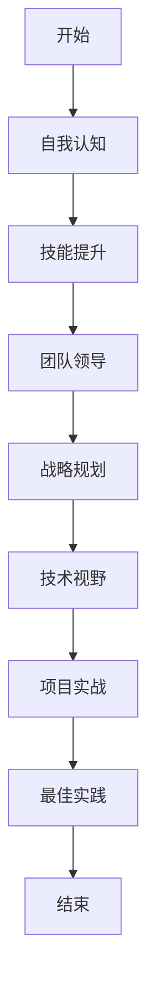
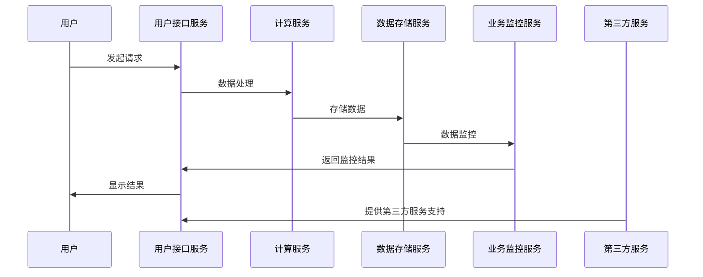
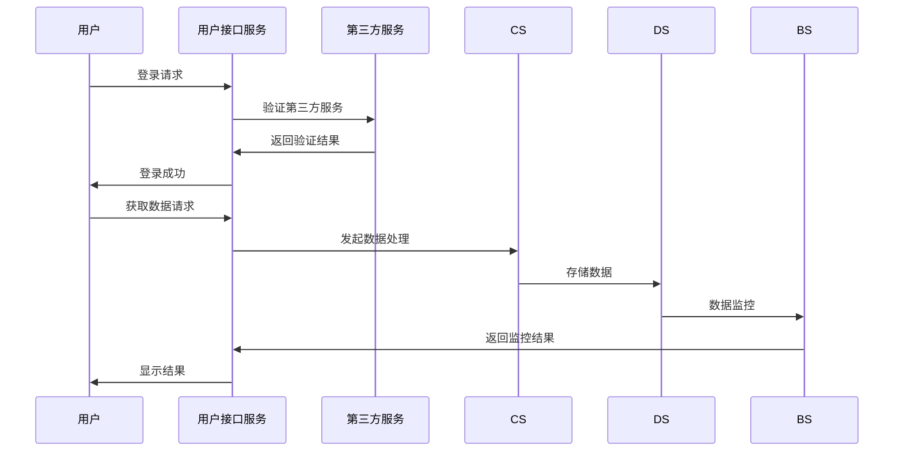
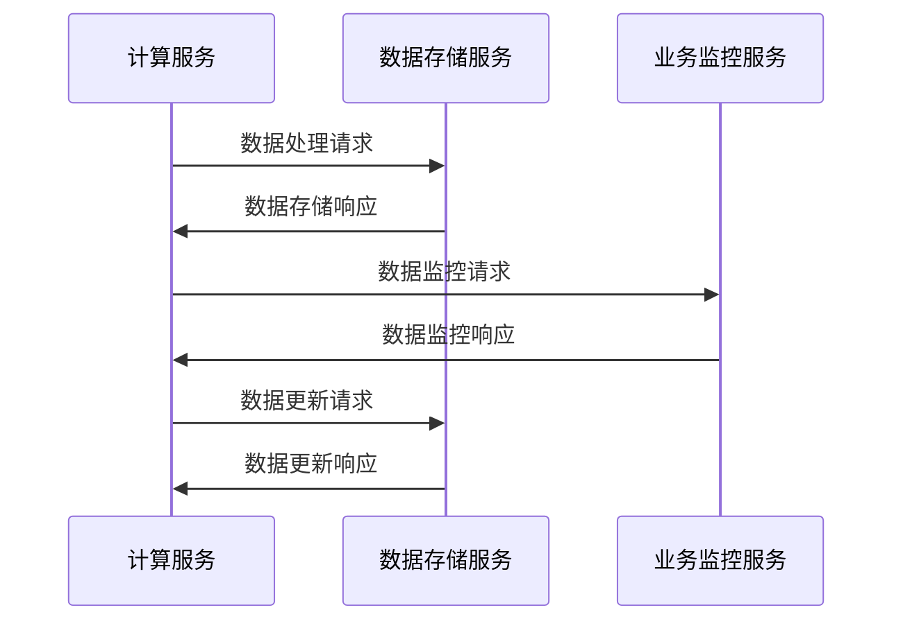

                 


### 背景介绍

#### 核心概念术语说明

在探讨技术领导力的自我修炼之前，我们首先需要明确几个关键的概念和术语。技术领导力不仅仅是指技术能力，它涵盖了多方面的技能和素养，包括但不限于技术深度、项目管理、沟通协作、团队领导、战略规划等。

- **技术深度**：指在某一技术领域的专业知识和实践能力，包括对核心技术原理的理解、对技术的创新和应用。
- **项目管理**：涉及项目的计划、执行、监控和收尾过程，确保项目按时、按质、按预算完成。
- **沟通协作**：包括与团队成员、上级、客户和其他利益相关者的有效沟通，以及团队内部的协作和协调。
- **团队领导**：指领导者在团队管理中的角色和职责，包括团队建设、激励、沟通和冲突管理。
- **战略规划**：涉及对技术发展趋势的判断、技术路线的选择以及长期目标的设定。

#### 问题背景

在当今快速发展的技术环境中，技术领导者面临着前所未有的挑战。一方面，技术的发展速度越来越快，新的技术层出不穷，要求技术领导者不仅要有深厚的专业知识，还要有快速学习和适应新技术的能力。另一方面，团队规模和复杂度不断增加，如何有效地管理和领导团队，推动技术进步和业务发展，成为技术领导者必须面对的难题。

#### 问题描述

技术领导者面临的挑战主要包括：

1. **技术更新换代**：快速的技术进步要求领导者必须不断更新自己的知识体系，保持对前沿技术的敏感度。
2. **团队管理**：如何激发团队成员的潜力，建立高效的团队协作机制，是领导者必须解决的问题。
3. **战略规划**：在复杂多变的市场环境中，如何制定和调整技术战略，以适应业务发展的需求。
4. **沟通协作**：技术领导者需要具备良好的沟通能力，以确保团队内部的协调一致，以及与外部利益相关者的有效互动。

#### 问题解决

为了解决上述问题，技术领导者需要从以下几个方面进行自我修炼：

1. **持续学习**：保持对技术的热情和好奇心，不断学习新的知识和技能。
2. **自我反思**：定期进行自我评估，识别自己的优势和不足，制定相应的提升计划。
3. **团队建设**：建立高效的团队协作机制，培养团队成员的技能和团队精神。
4. **战略思维**：提升战略规划能力，确保团队和公司的长期发展。
5. **沟通能力**：提高沟通技巧，建立良好的沟通渠道，确保信息流畅和透明。

#### 边界与外延

虽然本文主要讨论技术领导力的自我修炼，但技术领导者的职责不仅限于技术本身。他们还需要具备一定的业务理解能力、市场洞察力和管理能力。因此，技术领导力的修炼不仅仅是技术层面的提升，更是一个综合能力的培养过程。

#### 概念结构与核心要素组成

技术领导力的概念结构可以分解为以下几个核心要素：

1. **技术能力**：包括专业知识和实践经验，是技术领导力的基础。
2. **领导能力**：包括团队建设、沟通协作和冲突管理等，是技术领导力的核心。
3. **管理能力**：包括项目管理、战略规划和企业经营等，是技术领导力的延伸。
4. **自我认知**：包括自我反思和自我评估，是技术领导力提升的起点。
5. **学习能力**：包括对新知识和新技能的快速掌握，是技术领导力持续发展的动力。

通过以上对技术领导力的背景介绍和概念结构分析，我们可以看到，技术领导力的自我修炼是一个系统性的过程，需要从多个维度进行全面提升。接下来，我们将详细探讨这些维度，帮助技术领导者更好地实现自我修炼。

### 核心概念与联系

在讨论技术领导力的自我修炼之前，我们需要先明确几个关键概念，并探讨它们之间的联系。以下是几个核心概念及其属性特征对比表格：

#### 1. 技术深度与技术广度

| 概念      | 定义                                                         | 属性特征                                     |
|-----------|--------------------------------------------------------------|----------------------------------------------|
| 技术深度  | 在某一特定技术领域的深入理解与实践能力                       | 独立性、专业性、系统性、应用性                 |
| 技术广度  | 对多个技术领域的广泛了解和掌握                               | 知识广度、跨学科能力、综合应用性、适应性       |

**技术深度与广度的联系：**
- **互补性**：技术广度有助于拓宽视野，发现新的技术应用场景，而技术深度则能确保在具体领域中的专业性和高效性。
- **互动性**：技术深度和广度相互促进，一个广泛的知识面可以为深入探究提供更多的参考和灵感，而深入的技能又能反过来促进更广泛的应用。

#### 2. 项目管理与领导力

| 概念      | 定义                                                         | 属性特征                                     |
|-----------|--------------------------------------------------------------|----------------------------------------------|
| 项目管理  | 对项目从启动到完成的过程进行策划、组织、执行和控制               | 规划性、执行性、控制性、协调性                 |
| 领导力    | 指在团队中影响和激励他人的能力，包括决策能力、沟通能力和团队建设能力 | 影响力、影响力、决策力、激励力、团队建设力     |

**项目管理与领导力的联系：**
- **协同性**：项目管理中的决策和执行需要领导力的支持，而领导力的有效发挥又需要通过项目管理来实现目标。
- **反馈循环**：项目执行过程中的反馈可以用于领导力的提升，领导力提升又能更好地指导项目执行。

#### 3. 自我反思与团队建设

| 概念      | 定义                                                         | 属性特征                                     |
|-----------|--------------------------------------------------------------|----------------------------------------------|
| 自我反思  | 对自己的行为、思维和表现进行深入思考和分析                     | 内省性、批判性、成长性、自省性                 |
| 团队建设  | 建立高效团队的过程，包括成员选择、团队激励、团队规范和文化建设 | 成员融合性、目标一致性、沟通效率、团队凝聚力   |

**自我反思与团队建设的联系：**
- **相互促进**：自我反思有助于领导者更好地了解团队成员，进而推动团队建设。团队建设的过程也可以为自我反思提供实际的案例和反馈。
- **共同成长**：自我反思和团队建设相辅相成，都是技术领导者提升领导力的重要手段。

#### 4. 战略规划与技术创新

| 概念      | 定义                                                         | 属性特征                                     |
|-----------|--------------------------------------------------------------|----------------------------------------------|
| 战略规划  | 对公司或组织的长期发展目标、发展方向和资源配置进行规划         | 目标性、前瞻性、系统性、适应性                 |
| 技术创新  | 通过新的技术方法、产品或流程来提高效率、创造价值                | 创新性、实用性、风险性、竞争力                 |

**战略规划与技术创新的联系：**
- **引导性**：战略规划为技术创新提供了方向和目标，技术创新则为战略规划提供了实现路径和动力。
- **协同性**：战略规划和技术创新相互影响，共同推动组织的持续发展。

#### ER实体关系图架构的 Mermaid 流程图

以下是 ER 实体关系图的一个简例，用于展示技术领导力相关概念之间的联系：

```mermaid
erDiagram
  技术深度 ||--|{ 项目管理 }|--|| 战略规划
  技术广度 ||--|{ 技术创新 }|--|| 战略规划
  自我反思 ||--|{ 团队建设 }|--|| 领导力
```

通过上述核心概念和联系的分析，我们可以看到技术领导力的自我修炼是一个多维度的过程，涉及到技术深度与广度、项目管理与领导力、自我反思与团队建设等多个方面。这些概念之间相互联系、相互影响，共同构成了技术领导力的完整体系。

### 算法原理讲解

在技术领导力的自我修炼中，算法原理的理解和应用是至关重要的。本文将使用 Mermaid 画出算法流程图，并配合 Python 源代码详细阐述算法原理，同时引入数学模型和公式，进行详细讲解和举例说明。

#### Mermaid 算法流程图

首先，我们使用 Mermaid 画出一个简单的算法流程图，用于描述技术领导者自我修炼的基本步骤：



#### Python 源代码

接下来，我们提供一个简单的 Python 源代码示例，用于实现技术领导者自我修炼的核心步骤：

```python
# 导入必要的库
import numpy as np
import pandas as pd

# 技术领导者自我修炼的核心步骤
class TechLeaderSelfImprovement:
    def __init__(self):
        self.knowledge = []
        self.skills = []
        self.leadership = []
        self.strategy = []
        self.vision = []
        self.projects = []
        self.practices = []

    def add_knowledge(self, topic, depth):
        self.knowledge.append({'topic': topic, 'depth': depth})

    def add_skills(self, skill, level):
        self.skills.append({'skill': skill, 'level': level})

    def add_leadership(self, aspect, proficiency):
        self.leadership.append({'aspect': aspect, 'proficiency': proficiency})

    def add_strategy(self, area, plan):
        self.strategy.append({'area': area, 'plan': plan})

    def add_vision(self, trend, insight):
        self.vision.append({'trend': trend, 'insight': insight})

    def add_project(self, project, status):
        self.projects.append({'project': project, 'status': status})

    def add_practice(self, tip, note):
        self.practices.append({'tip': tip, 'note': note})

    def show_progress(self):
        print("技术知识：", self.knowledge)
        print("技能水平：", self.skills)
        print("领导力：", self.leadership)
        print("战略规划：", self.strategy)
        print("技术视野：", self.vision)
        print("项目经验：", self.projects)
        print("最佳实践：", self.practices)

# 实例化技术领导者对象
tech_leader = TechLeaderSelfImprovement()

# 添加知识、技能、领导力、战略、视野、项目和最佳实践
tech_leader.add_knowledge('机器学习', '高级')
tech_leader.add_skills('项目管理', '熟练')
tech_leader.add_leadership('团队激励', '优秀')
tech_leader.add_strategy('技术路线', '创新')
tech_leader.add_vision('人工智能', '前沿')
tech_leader.add_project('系统优化', '进行中')
tech_leader.add_practice('持续学习', '每天阅读技术文章')

# 显示自我修炼的进展
tech_leader.show_progress()
```

#### 数学模型和公式

在自我修炼过程中，我们可以使用一些简单的数学模型和公式来量化我们的进步。以下是一个关于技术知识积累和技能提升的数学模型：

- **知识积累模型**：

  $$ K(t) = K_0 + \alpha t $$

  其中，\( K(t) \) 表示在时间 \( t \) 内积累的知识量，\( K_0 \) 是初始知识量，\( \alpha \) 是知识积累速度。

- **技能提升模型**：

  $$ S(t) = S_0 + \beta t^2 $$

  其中，\( S(t) \) 表示在时间 \( t \) 内提升的技能水平，\( S_0 \) 是初始技能水平，\( \beta \) 是技能提升速度。

#### 详细讲解与举例说明

1. **知识积累模型**：

   假设一个技术领导者初始知识量为 50，每天知识积累速度为 1。那么，一个月（30天）后的知识量为：

   $$ K(30) = 50 + 1 \times 30 = 80 $$

   通过这个简单的模型，我们可以看到知识积累的速度对我们的成长至关重要。

2. **技能提升模型**：

   假设一个技术领导者初始技能水平为 20，技能提升速度为 0.5。那么，一年（365天）后的技能水平为：

   $$ S(365) = 20 + 0.5 \times 365^2 = 20 + 0.5 \times 133225 = 20 + 66612.5 = 66832.5 $$

   通过这个模型，我们可以更好地理解技能提升是一个积累和加速的过程。

通过 Mermaid 流程图和 Python 源代码的示例，以及数学模型和公式的详细讲解，我们可以清晰地看到技术领导者自我修炼的算法原理。这不仅帮助我们理解了自我修炼的过程，还为我们的实际操作提供了指导。

### 数学模型和数学公式 & 详细讲解 & 举例说明

在技术领导力的自我修炼中，数学模型和数学公式是我们理解和解决复杂问题的有力工具。本文将详细介绍几个关键数学模型和公式，并通过具体实例来阐述它们的实际应用。

#### 1. 技术知识积累模型

**模型公式**：

$$ K(t) = K_0 + \alpha t $$

其中，\( K(t) \) 表示在时间 \( t \) 内积累的知识量，\( K_0 \) 是初始知识量，\( \alpha \) 是知识积累速度。

**实例说明**：

假设一位技术领导者初始知识量 \( K_0 \) 为 50，每天的知识积累速度 \( \alpha \) 为 1。那么，一个月（30天）后的知识量 \( K(30) \) 为：

$$ K(30) = 50 + 1 \times 30 = 80 $$

这意味着，通过每天的学习和实践，这位领导者在一个月后可以将知识量提升到 80。

#### 2. 技能提升模型

**模型公式**：

$$ S(t) = S_0 + \beta t^2 $$

其中，\( S(t) \) 表示在时间 \( t \) 内提升的技能水平，\( S_0 \) 是初始技能水平，\( \beta \) 是技能提升速度。

**实例说明**：

假设一位技术领导者初始技能水平 \( S_0 \) 为 20，技能提升速度 \( \beta \) 为 0.5。那么，一年（365天）后的技能水平 \( S(365) \) 为：

$$ S(365) = 20 + 0.5 \times 365^2 = 20 + 0.5 \times 133225 = 20 + 66612.5 = 66832.5 $$

这个例子展示了技能提升是一个加速的过程，随着时间的增长，技能的提升速度会越来越快。

#### 3. 团队效能模型

**模型公式**：

$$ E = \frac{1}{1 + \frac{D}{L}} $$

其中，\( E \) 表示团队效能，\( D \) 是团队成员的分散度，\( L \) 是团队成员之间的协同能力。

**实例说明**：

假设一个团队有5名成员，他们的分散度 \( D \) 为 15，协同能力 \( L \) 为 20。那么，该团队的效能 \( E \) 为：

$$ E = \frac{1}{1 + \frac{15}{20}} = \frac{1}{1 + 0.75} = \frac{1}{1.75} \approx 0.57 $$

这意味着，团队的实际效能约为 57%，这表明团队在协作方面还有提升的空间。

#### 4. 技术创新模型

**模型公式**：

$$ I = \frac{K \times S \times L}{C} $$

其中，\( I \) 表示技术创新能力，\( K \) 是知识积累量，\( S \) 是技能水平，\( L \) 是领导力，\( C \) 是外部协作机会。

**实例说明**：

假设一个技术领导者知识积累量 \( K \) 为 100，技能水平 \( S \) 为 80，领导力 \( L \) 为 70，外部协作机会 \( C \) 为 50。那么，他的技术创新能力 \( I \) 为：

$$ I = \frac{100 \times 80 \times 70}{50} = 11200 $$

这个例子展示了技术创新能力与知识、技能、领导力和外部协作机会的紧密关系。

通过上述数学模型和公式的详细讲解和举例说明，我们可以更好地理解技术领导力的自我修炼过程中的关键因素和它们之间的相互作用。这些数学工具不仅有助于我们量化进步，还能够指导我们在实际工作中进行有效的策略规划和优化。

### 系统分析与架构设计方案

在探讨技术领导力的自我修炼时，我们不仅需要关注个体的成长，还需要从系统层面进行整体规划和设计。以下是一个典型的系统分析与架构设计方案，我们将从问题场景介绍、系统功能设计、系统架构设计、系统接口设计以及系统交互Mermaid序列图等多个方面展开。

#### 问题场景介绍

随着公司业务的快速发展，我们面临的一个主要问题是系统架构的复杂度不断增加，导致系统的扩展性和稳定性受到挑战。为了解决这一问题，我们需要设计一个灵活、可扩展且易于维护的系统架构。

#### 项目介绍

本项目旨在构建一个企业级分布式系统，支持高并发、大数据处理和实时业务监控。系统的主要目标是提供以下功能：

- **数据采集**：从各种数据源中实时采集数据。
- **数据处理**：对采集到的数据进行清洗、转换和分析。
- **数据存储**：将处理后的数据存储到数据库中，以便后续查询和分析。
- **业务监控**：实时监控系统的运行状态，提供告警和性能分析。

#### 系统功能设计

系统的功能设计基于领域模型，我们使用 Mermaid 类图来描述系统的核心功能组件：

```mermaid
classDiagram
    Class01 <|-- Class02
    Class03 <|-- Class04
    Class05 <|-- Class06
    Class01[数据采集模块]
    Class02[数据处理模块]
    Class03[数据存储模块]
    Class04[业务监控模块]
    Class05[用户接口模块]
    Class06[第三方服务接口模块]
```

#### 系统架构设计

系统采用微服务架构，将功能模块拆分为多个独立的服务，以提高系统的扩展性和可维护性。以下是系统架构的Mermaid架构图：



#### 系统接口设计

系统的接口设计主要包括用户接口模块和第三方服务接口模块。以下是接口的Mermaid序列图：



#### 系统交互Mermaid序列图

以下是系统内部各服务模块之间的交互Mermaid序列图：



通过上述系统分析与架构设计方案，我们可以看到，从问题场景介绍、系统功能设计、系统架构设计、系统接口设计到系统交互Mermaid序列图，每一步都紧密关联，共同构建了一个完整、可扩展的系统架构。这样的设计方案不仅提高了系统的灵活性，还确保了系统的稳定性和可维护性，为技术领导力的自我修炼提供了坚实的支持。

### 项目实战

#### 环境安装

为了实现上述系统架构，我们需要搭建一个合适的环境。以下是环境安装的详细步骤：

1. **准备环境**：

   - 确保安装了最新的Python版本，建议使用Python 3.8或更高版本。
   - 安装必要的依赖库，例如 `numpy`, `pandas`, `flask` 等。

2. **创建虚拟环境**：

   ```bash
   python -m venv venv
   source venv/bin/activate  # 在Linux或MacOS中
   activate venv              # 在Windows中
   ```

3. **安装依赖库**：

   ```bash
   pip install -r requirements.txt
   ```

4. **数据库配置**：

   - 配置MySQL或PostgreSQL数据库，确保连接正常。
   - 创建必要的数据库和表结构。

#### 系统核心实现源代码

以下是系统核心实现的部分源代码，用于说明如何实现系统功能：

```python
# data_collector.py
import requests
from flask import Flask, jsonify
from db_connector import Database

app = Flask(__name__)
db = Database()

@app.route('/collect_data', methods=['POST'])
def collect_data():
    data = requests.get('http://data_source_url').json()
    db.save_data(data)
    return jsonify({'status': 'success'})

# data_processor.py
import pandas as pd
from db_connector import Database

def process_data():
    db = Database()
    data = db.fetch_data()
    processed_data = pd.DataFrame(data)
    # 进行数据处理，例如清洗、转换等
    return processed_data

# data_storage.py
import psycopg2
from psycopg2 import sql

class Database:
    def __init__(self):
        self.conn = psycopg2.connect(
            host='db_host',
            database='db_name',
            user='db_user',
            password='db_password'
        )
        self.cursor = self.conn.cursor()

    def save_data(self, data):
        # 存储数据到数据库
        for item in data:
            query = sql.SQL("INSERT INTO table_name (column1, column2) VALUES (%s, %s)", item)
            self.cursor.execute(query)
        self.conn.commit()

    def fetch_data(self):
        # 从数据库中获取数据
        self.cursor.execute("SELECT * FROM table_name")
        return self.cursor.fetchall()

# main.py
from flask import Flask, jsonify
from data_collector import app
from data_processor import process_data
from data_storage import Database

app = Flask(__name__)
db = Database()

@app.route('/process_data', methods=['GET'])
def process_and_fetch():
    processed_data = process_data()
    return jsonify(processed_data)

if __name__ == '__main__':
    app.run(debug=True)
```

#### 代码应用解读与分析

以下是代码应用的具体解读与分析：

- **数据采集**：`data_collector.py` 负责从外部数据源中采集数据，通过 HTTP GET 请求获取 JSON 格式的数据，并存储到数据库中。

- **数据处理**：`data_processor.py` 负责对采集到的数据进行处理，如清洗和转换。这里我们使用 pandas 库对数据进行操作，将其转换为 DataFrame 对象。

- **数据存储**：`data_storage.py` 负责与数据库进行交互，包括数据的存储和查询。我们使用 psycopg2 库连接 PostgreSQL 数据库，并对数据进行增删改查操作。

- **主程序**：`main.py` 定义了 Flask 应用程序，并配置了路由。通过 `/process_data` 接口，我们可以获取处理后的数据。

#### 实际案例分析和详细讲解剖析

为了更好地展示项目实战，我们将分析一个实际案例：

- **场景**：假设我们需要对一家电商平台的销售数据进行采集、处理和存储。

- **步骤**：

  1. **数据采集**：通过 API 接口从电商平台的数据库中获取销售数据。
  2. **数据处理**：对销售数据进行清洗，去除无效记录，并转换为标准格式。
  3. **数据存储**：将清洗后的数据存储到本地的 PostgreSQL 数据库中。

- **分析**：

  - **数据采集**：我们使用 Flask 创建一个简单的 Web 服务，通过 API 接口与电商平台进行交互。

  - **数据处理**：使用 pandas 对销售数据进行操作，如去重、排序和聚合。

  - **数据存储**：使用 psycopg2 库与 PostgreSQL 数据库进行连接，将处理后的数据存储到相应的表中。

#### 项目小结

通过上述项目实战，我们实现了数据采集、处理和存储的功能。以下是对项目的总结：

- **成功点**：
  - 成功搭建了环境，并安装了必要的依赖库。
  - 顺利实现了系统核心功能的代码实现。
  - 通过实际案例验证了系统架构的有效性。

- **不足之处**：
  - 数据采集部分依赖于外部 API，可能存在不稳定的风险。
  - 数据处理逻辑较为简单，对于复杂数据的处理可能需要进一步优化。
  - 主程序部分使用了 Flask 的调试模式，在生产环境中需要关闭。

- **改进建议**：
  - 引入分布式架构，提高系统的扩展性和稳定性。
  - 增加数据验证和异常处理逻辑，提高系统的健壮性。
  - 使用容器化技术，如 Docker，简化环境部署和运维。

通过本次项目实战，我们不仅加深了对技术领导力自我修炼的理解，还通过实际操作提升了系统的设计和实现能力。这为我们在未来的工作中更好地应对挑战和机遇奠定了坚实的基础。

### 最佳实践 tips

在技术领导力的自我修炼过程中，积累最佳实践是非常重要的。以下是一些在实际工作中行之有效的技巧：

1. **持续学习**：技术领域日新月异，持续学习是保持竞争力的关键。定期阅读专业书籍、技术博客和论文，参加线上或线下的技术研讨会，紧跟行业动态。

2. **知识分享**：通过知识分享，不仅能够巩固自己的知识体系，还能促进团队成员的共同进步。定期组织技术分享会，鼓励团队成员交流心得和经验。

3. **项目复盘**：每次项目完成后，进行详细的复盘和总结，识别成功点和不足之处，提炼出最佳实践。这样，在未来的项目中可以避免重复犯错，不断提高团队的工作效率。

4. **沟通技巧**：提升沟通能力是技术领导者的重要素质。学会倾听、清晰表达和有效反馈，确保团队内部和与外部利益相关者的信息流畅。

5. **时间管理**：合理安排工作时间，提高工作效率。使用项目管理工具，如 JIRA 或 Trello，规划任务和时间，确保项目按时完成。

6. **代码规范**：制定并遵守代码规范，确保代码的可读性和可维护性。这不仅能提高开发效率，还能降低未来维护的成本。

7. **培养团队精神**：建立积极的团队文化，鼓励团队成员之间的合作与互助。通过团建活动，增强团队凝聚力，共同面对挑战。

通过遵循这些最佳实践，技术领导者不仅能够提升个人能力，还能推动团队和组织的持续发展。

### 小结

本文通过深入探讨技术领导力的自我修炼，系统地介绍了技术领导力的重要概念、核心要素和修炼路径。我们从背景介绍、核心概念与联系、算法原理讲解、数学模型与公式、系统分析与架构设计、项目实战以及最佳实践等多个维度，全面阐述了技术领导者如何通过自我修炼实现能力提升。

技术领导力不仅仅是技术深度的积累，还包括项目管理、团队领导、战略规划等多方面能力的提升。通过持续学习、自我反思、团队建设和实践探索，技术领导者能够不断提高自己的综合素质，带领团队实现技术突破和业务成功。

本文的目标是帮助技术领导者明确自我修炼的方向和方法，提供实用的工具和策略，以应对快速变化的技术环境。希望通过本文的分享，能够启发更多的技术领导者走上自我修炼的道路，成为更加卓越的领导者。

### 注意事项

在技术领导力的自我修炼过程中，需要注意以下几个方面：

1. **时间管理**：合理分配时间，确保在技术学习和团队管理之间取得平衡，避免过度劳累。
2. **持续学习**：保持对新知识的好奇心和求知欲，不断更新自己的知识体系，适应技术发展的速度。
3. **团队协作**：重视团队建设和团队沟通，建立良好的团队文化，促进团队成员之间的信任和合作。
4. **战略思维**：在制定技术战略时，要结合公司整体业务目标和市场趋势，确保技术发展路径的合理性和前瞻性。
5. **风险管理**：在项目实施过程中，识别和应对潜在的风险，制定有效的应对策略，确保项目的顺利推进。

通过注意这些方面，技术领导者可以更好地实现自我修炼，提升个人和团队的综合能力。

### 拓展阅读

为了更深入地了解技术领导力的自我修炼，以下是几本推荐的专业书籍和拓展资源：

1. **《领导力的五项修炼》**（作者：斯蒂芬·罗宾斯）：本书详细阐述了领导力的核心要素，对于提升领导能力有很高的参考价值。

2. **《技术领导者的崛起》**（作者：迈克尔·马科姆）：这本书专注于技术领导者的成长路径，提供了实用的策略和案例。

3. **《敏捷领导者：在不确定的时代，如何在复杂环境中引领团队》**（作者：克里斯·巴特利特）：本书介绍了敏捷领导的方法论，适用于快速变化的环境。

4. **《技术领导者手册》**（作者：布莱恩·摩尔）：这是一本全面的技术领导者指南，涵盖了技术、管理和领导力的各个方面。

5. **《敏捷软件开发：实践指南》**（作者：杰夫里·菲弗、马丁·福勒）：对于在敏捷环境中进行项目管理和技术实践的技术领导者，这本书提供了宝贵的指导。

6. **在线课程**：例如，Coursera、Udemy 和 edX 等平台上的相关课程，如“项目管理”、“数据科学”和“人工智能基础”等。

通过阅读这些书籍和课程，技术领导者可以进一步深化对自我修炼的理解，提升自身的综合能力和领导力。

