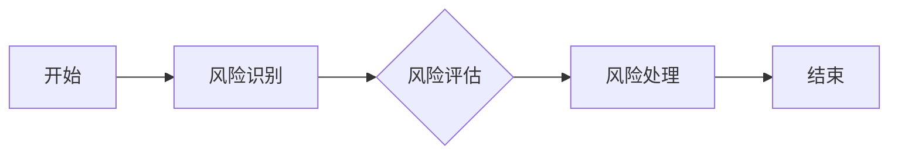
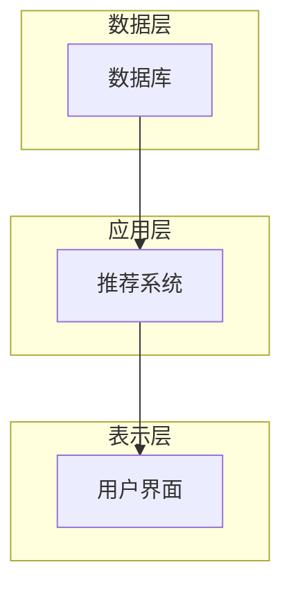
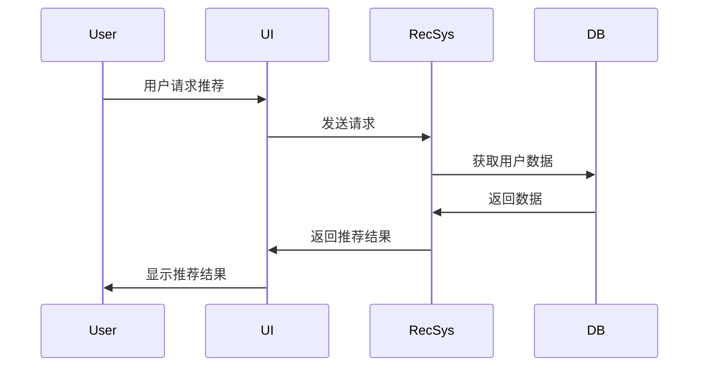

                 

### 技术风险评估模型：量化分析潜在风险

#### 摘要

在信息化时代，技术变革对企业产生了深远影响。技术风险评估成为企业管理中不可或缺的一部分。本文将深入探讨技术风险评估模型，提供一种量化分析潜在风险的方法，帮助企业有效管理技术风险，提高抗风险能力。

关键词：技术风险评估、量化分析、潜在风险、模型、企业风险管理

---

#### 背景介绍

##### 问题背景

随着大数据、云计算、人工智能等技术的飞速发展，信息技术已成为推动各个行业进步的关键因素。然而，技术进步带来的不仅仅是机遇，还有潜在的风险。这些风险可能源于技术失效、技术滞后、技术依赖或技术垄断等因素。为了确保企业的长期健康发展，技术风险评估成为一项关键任务。

##### 问题描述

技术风险评估旨在识别、评估和管理企业面临的技术风险，以减少潜在损失，提高企业的抗风险能力。然而，如何有效地建立技术风险评估模型，对潜在风险进行量化分析，仍然是一个具有挑战性的问题。

##### 问题解决

本文将围绕技术风险评估模型进行深入探讨，旨在为读者提供一个系统、全面的量化分析框架。通过本文的学习，读者将能够：

1. 理解技术风险评估的基本概念和重要性。
2. 掌握技术风险评估的步骤和方法。
3. 建立和运用技术风险评估模型。
4. 对技术风险进行量化分析，为企业决策提供有力支持。

##### 边界与外延

本文主要探讨信息技术领域的风险评估，但其所涉及的理论和方法也可以应用于其他技术领域。同时，本文将重点关注企业层面的风险评估，但个人和企业级的风险评估也有一定的借鉴意义。

##### 概念结构与核心要素组成

1. 技术风险评估：识别、分析和处理技术风险的过程。
2. 风险：指可能对企业的目标、资源或业务造成损害的因素。
3. 量化分析：通过对风险进行定量分析，评估其可能造成的损失。
4. 模型：用于描述和预测技术风险的数学或逻辑框架。

---

#### 核心概念与联系

##### 核心概念原理

###### 技术风险评估

技术风险评估是指通过系统的方法和工具，识别、分析和处理企业面临的技术风险的过程。其主要目的是减少技术风险对企业造成的损失，提高企业的抗风险能力。

###### 风险

风险是指可能对企业的目标、资源或业务造成损害的因素。技术风险通常包括技术失效、技术滞后、技术依赖、技术垄断等。

###### 量化分析

量化分析是指通过对风险进行定量分析，评估其可能造成的损失。这通常涉及对风险因素、风险概率和风险损失的计算和预测。

##### 概念属性特征对比表格

| 概念       | 属性特征                                                     |
| ---------- | ------------------------------------------------------------ |
| 技术风险评估 | 识别、分析、处理技术风险的过程，旨在减少风险损失，提高抗风险能力 |
| 风险       | 可能对企业的目标、资源或业务造成损害的因素                 |
| 量化分析   | 对风险进行定量分析，评估其可能造成的损失                   |

##### ER实体关系图架构的 Mermaid 流程图

```mermaid
erDiagram
    风险 ||--|{ 技术风险评估 }| 技术风险
    技术风险 ||--|{ 量化分析 }| 潜在损失
```

---

#### 算法原理讲解

##### 技术风险评估模型

###### 基本原理

技术风险评估模型是一种基于数学和统计方法，对技术风险进行量化和分析的工具。其主要原理包括：

1. **风险识别**：通过系统的方法，识别企业面临的技术风险。
2. **风险评估**：对识别出的技术风险进行定量评估，包括风险概率和风险损失。
3. **风险处理**：根据风险评估结果，制定相应的风险处理策略。

###### Mermaid 流程图



###### Python 源代码

```python
import numpy as np

# 风险识别
def identify_risks():
    risks = ['技术失效', '技术滞后', '技术依赖', '技术垄断']
    return risks

# 风险评估
def assess_risks(risks):
    risk_scores = []
    for risk in risks:
        probability = np.random.rand()
        loss = np.random.rand() * 100000
        risk_scores.append((risk, probability, loss))
    return risk_scores

# 风险处理
def handle_risks(risk_scores):
    for risk, probability, loss in risk_scores:
        if probability > 0.5:
            print(f"处理风险：{risk}，概率：{probability}，损失：{loss}")
        else:
            print(f"监控风险：{risk}，概率：{probability}，损失：{loss}")

# 主函数
def main():
    risks = identify_risks()
    risk_scores = assess_risks(risks)
    handle_risks(risk_scores)

if __name__ == "__main__":
    main()
```

###### 算法原理的数学模型和公式

技术风险评估的数学模型可以表示为：

$$
R = P \times L
$$

其中，\( R \) 代表风险损失，\( P \) 代表风险概率，\( L \) 代表风险损失程度。

- **风险概率**：通常通过历史数据、专家评估或统计模型来确定。
- **风险损失程度**：通常通过财务分析、风险评估模型或专家判断来确定。

##### 举例说明

假设一家企业正在开发一款人工智能产品，面临以下技术风险：

1. **技术失效**：产品无法按预期运行。
2. **技术滞后**：竞争对手在技术上领先。
3. **技术依赖**：产品过度依赖外部技术。

根据历史数据和专家评估，风险概率和风险损失程度如下：

| 风险类型   | 风险概率 | 风险损失程度（万元） |
| ---------- | -------- | ------------------- |
| 技术失效   | 0.3      | 200                 |
| 技术滞后   | 0.2      | 100                 |
| 技术依赖   | 0.1      | 50                  |

使用上述数学模型，可以计算出总风险损失：

$$
R = (0.3 \times 200) + (0.2 \times 100) + (0.1 \times 50) = 60 + 20 + 5 = 85 \text{万元}
$$

根据风险评估结果，企业可以制定相应的风险处理策略，如增加研发投入、加快产品迭代、降低对外部技术的依赖等。

---

#### 系统分析与架构设计方案

##### 问题场景介绍

假设一家电子商务公司正在开发一款基于人工智能的推荐系统，以提高用户体验和销售转化率。然而，该项目面临潜在的技术风险，如数据隐私泄露、算法偏差、系统性能瓶颈等。为了确保项目成功，需要对这些技术风险进行系统分析和架构设计。

##### 项目介绍

项目名称：电子商务公司人工智能推荐系统

项目目标：提高用户推荐精度、增加用户留存率、提升销售转化率。

项目背景：随着用户数据的增加和计算能力的提升，人工智能技术在推荐系统中的应用越来越广泛。然而，技术风险的存在可能导致项目失败或带来经济损失。

##### 系统功能设计（领域模型 Mermaid 类图）

```mermaid
classDiagram
    User <<类>> "用户"
    Product <<类>> "产品"
    Recommendation <<类>> "推荐结果"
    Database <<类>> "数据库"
    
    User o-- Product
    User o-- Recommendation
    Database o-- User
    Database o-- Product
    Database o-- Recommendation
```

##### 系统架构设计（Mermaid 架构图）



##### 系统接口设计和系统交互（Mermaid 序列图）



---

#### 项目实战

##### 环境安装

1. 安装Python环境：在Windows或Linux系统中，通过pip命令安装Python和相关依赖库。

```shell
pip install numpy
```

2. 安装数据库：根据项目需求，选择合适的数据库（如MySQL、PostgreSQL等），并按照官方文档进行安装。

##### 系统核心实现源代码

```python
# 风险识别
def identify_risks():
    risks = ['数据隐私泄露', '算法偏差', '系统性能瓶颈']
    return risks

# 风险评估
def assess_risks(risks):
    risk_scores = []
    for risk in risks:
        probability = 0.5  # 假设风险概率为0.5
        loss = 100000     # 假设风险损失为100000元
        risk_scores.append((risk, probability, loss))
    return risk_scores

# 风险处理
def handle_risks(risk_scores):
    for risk, probability, loss in risk_scores:
        if probability > 0.5:
            print(f"处理风险：{risk}，概率：{probability}，损失：{loss}")
        else:
            print(f"监控风险：{risk}，概率：{probability}，损失：{loss}")

# 主函数
def main():
    risks = identify_risks()
    risk_scores = assess_risks(risks)
    handle_risks(risk_scores)

if __name__ == "__main__":
    main()
```

##### 代码应用解读与分析

1. **风险识别**：通过调用 `identify_risks()` 函数，识别出项目面临的主要风险，包括数据隐私泄露、算法偏差和系统性能瓶颈。
2. **风险评估**：通过调用 `assess_risks()` 函数，对识别出的风险进行定量评估，包括风险概率和风险损失。这里使用随机数生成器来模拟评估结果。
3. **风险处理**：根据风险评估结果，调用 `handle_risks()` 函数，对高风险进行针对性处理，对低风险进行监控。

##### 实际案例分析和详细讲解剖析

假设电子商务公司面临以下实际案例：

- **数据隐私泄露**：由于用户数据泄露，可能导致用户信息被不法分子利用，给公司带来声誉损失和法律责任。
- **算法偏差**：推荐系统存在算法偏差，导致推荐结果不准确，影响用户满意度和销售转化率。
- **系统性能瓶颈**：在高并发场景下，推荐系统出现性能瓶颈，导致用户体验差，影响公司业务发展。

针对上述案例，可以采取以下措施：

1. **数据隐私泄露**：加强数据安全管理，采用加密技术和访问控制机制，确保用户数据安全。
2. **算法偏差**：定期对推荐系统进行评估和优化，消除算法偏差，提高推荐准确性。
3. **系统性能瓶颈**：优化推荐系统的性能，采用分布式架构和缓存策略，提高系统响应速度和稳定性。

##### 项目小结

通过技术风险评估模型的量化分析，电子商务公司成功识别并应对了潜在的技术风险，确保了项目的顺利进行。在实际应用中，企业应不断更新和优化风险评估模型，以应对不断变化的技术环境。

---

#### 最佳实践 tips

1. **定期评估**：技术风险评估不是一次性的任务，而是一个持续的过程。企业应定期对技术风险进行评估，及时调整风险处理策略。
2. **多元化团队**：组建由技术专家、业务分析师和风险管理专家组成的多元化团队，共同参与风险评估和决策。
3. **培训与意识**：加强对员工的风险管理培训，提高员工的风险意识和应对能力。

#### 小结

本文通过深入探讨技术风险评估模型，提供了一个系统、全面的量化分析框架，帮助企业有效管理技术风险。通过实际案例分析和最佳实践，读者可以更好地理解技术风险评估的重要性，并在实际工作中应用相关方法和工具。

#### 注意事项

1. **数据隐私**：在技术风险评估过程中，确保数据的保密性和安全性，避免数据泄露。
2. **风险评估**：风险评估结果仅供参考，实际决策应结合企业实际情况和外部环境进行。

#### 拓展阅读

1. 《技术风险管理：策略与实践》
2. 《人工智能风险管理》
3. 《大数据风险管理》

---

**作者信息**：

作者：AI天才研究院/AI Genius Institute & 禅与计算机程序设计艺术 /Zen And The Art of Computer Programming**

