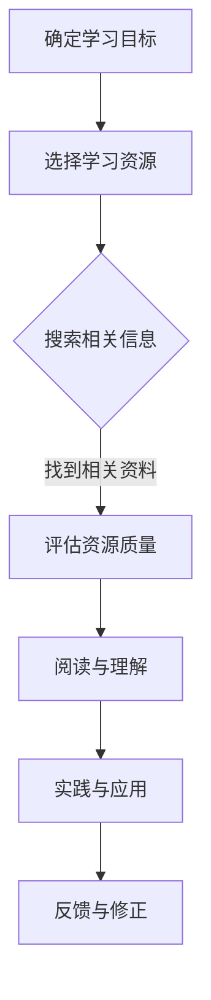
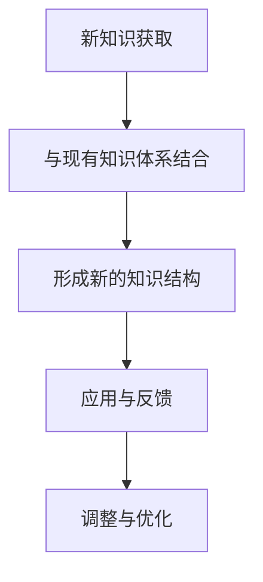
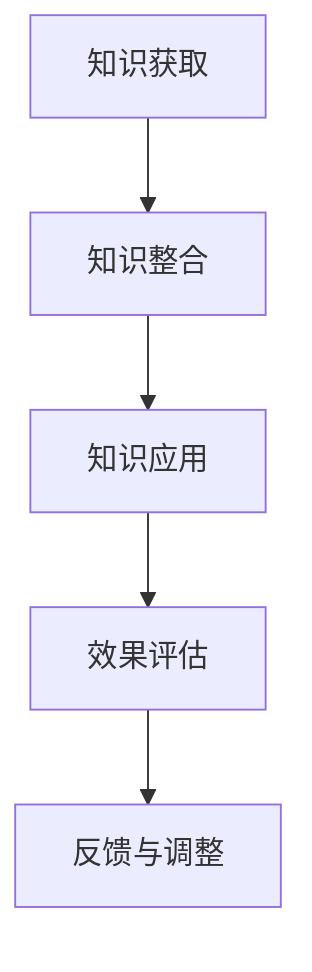
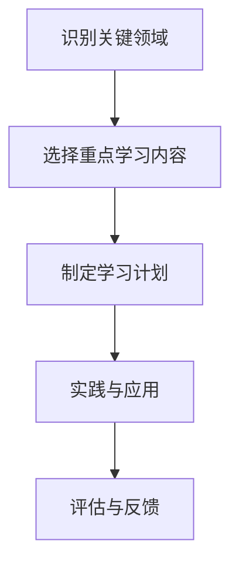
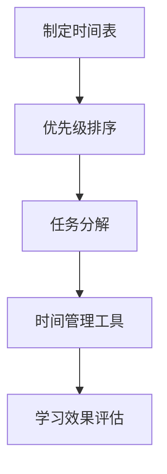

                 

## 引言

### 文章标题：持续学习在技术领导力中的作用

### 关键词：持续学习、技术领导力、知识更新、职业发展、团队建设

### 摘要：
在技术快速变革的时代，技术领导力对于企业的成功至关重要。持续学习是技术领导者保持团队能力和竞争力的关键。本文将探讨持续学习在技术领导力中的作用，通过分析其背景、意义、原理和实践策略，为技术领导者提供指导和建议。

## 第一部分: 持续学习的背景与意义

### 第1章: 持续学习的背景与意义

#### 1.1 问题背景

在当今技术快速变革的时代，知识更新速度日益加快，新技术、新工具、新理念不断涌现。这对技术人员的职业发展带来了巨大的挑战。技术领导者在面对这些变化时，不仅需要不断提升自己的技能，还要指导团队适应变革，保持竞争力。

#### 1.2 问题描述

- 技术人员如何应对知识更新速度？
- 技术领导如何保持团队能力和竞争力？

#### 1.3 问题解决

持续学习成为技术领导者应对知识更新和保持团队能力的关键。通过持续学习，技术领导者可以不断更新知识体系，掌握新技术，从而更好地指导团队，推动企业的发展。

#### 1.4 边界与外延

持续学习适用于所有技术领域，但不同领域的技术变革速度和知识更新频率有所不同。因此，持续学习的策略和方法也需要根据具体情况进行调整。

#### 1.5 概念结构与核心要素组成

技术领导力包括领导能力、技术能力和团队管理能力。持续学习是技术领导力的重要组成部分，其核心要素包括知识获取、知识整合和知识应用。

### 第2章: 持续学习原理

#### 2.1 学习原理概述

持续学习是基于现代学习理论的，主要包括以下几个核心概念：

1. **终身学习**：将学习视为一种终身行为，不断提升自身能力。
2. **自我驱动**：培养自我驱动力，主动寻找学习机会。
3. **知识管理**：有效获取、整合和应用知识。
4. **反思与评估**：通过反思和评估不断改进学习效果。

#### 2.2 持续学习模型

持续学习模型可以分为以下几个阶段：

1. **需求分析**：确定学习目标和需求。
2. **资源获取**：选择合适的学习资源和工具。
3. **学习实施**：通过阅读、实践和交流进行学习。
4. **评估反馈**：对学习效果进行评估和反馈。

#### 2.3 持续学习的关键要素

1. **知识获取**：通过多种途径获取新知识，如阅读、培训、实践等。
2. **知识整合**：将新知识与现有知识体系相结合，形成新的知识结构。
3. **知识应用**：将所学知识应用到实际工作中，提高工作效果。

#### 2.4 持续学习的挑战与解决方案

1. **时间管理**：合理安排学习时间，提高学习效率。
2. **资源获取**：充分利用外部资源和内部知识库，提高学习效果。

### 第二部分: 实践策略

#### 第3章: 个人持续学习策略

##### 3.1 技术技能的自我提升

1. **确定学习目标**：明确提升技能的方向和目标。
2. **选择学习资源**：根据学习目标选择合适的教材、在线课程等。
3. **实践与应用**：将所学知识应用到实际工作中，加深理解。

##### 3.2 知识管理

1. **知识获取与整理**：建立个人知识库，分类整理所学知识。
2. **知识的共享与传播**：通过团队讨论、技术博客等方式分享知识。

##### 3.3 自我评估与反思

1. **技能水平评估**：定期进行自我评估，了解技能提升情况。
2. **学习效果反馈**：收集反馈信息，调整学习策略。

## 第4章: 团队持续学习策略

##### 4.1 团队文化建设

1. **促进团队学习文化**：鼓励团队成员分享知识，建立学习氛围。
2. **团队协作与知识共享**：通过协作工具和会议等机制促进知识共享。

##### 4.2 技术共享与知识传递

1. **技术文档编写**：确保技术知识得以传承。
2. **内部培训与分享**：定期组织内部培训，分享新技术和新知识。

##### 4.3 技术创新与尝试

1. **鼓励实验性学习**：鼓励团队成员进行创新性尝试。
2. **失败后的学习与反思**：从失败中吸取教训，不断提升。

## 第5章: 组织层面持续学习策略

##### 5.1 学习型组织建设

1. **学习型组织的定义**：建立以学习为核心的组织文化。
2. **学习型组织的要素**：包括领导层的支持、系统的学习机制、团队的协作与知识共享等。

##### 5.2 持续学习的制度与机制

1. **培训与晋升制度**：建立培训体系，提供晋升机会。
2. **知识管理与分享机制**：建立知识库，促进知识共享与传承。

##### 5.3 外部合作与学习资源整合

1. **与外部的技术交流**：参与行业会议、研讨会等，获取前沿技术信息。
2. **学习资源的获取与整合**：利用外部资源和内部知识库，提高学习效果。

## 第三部分: 案例研究

### 第6章: 成功案例分享

##### 6.1 案例一：技术团队的持续学习实践

- **案例背景**：一家互联网公司通过持续学习提升团队技术能力。
- **学习策略与效果**：采用内部培训和外部学习相结合的方法，提高团队技能。

##### 6.2 案例二：技术领导者的成长之路

- **持续学习的方法**：通过自学、参与培训和项目实践等方式不断提升自身能力。
- **学习成果与影响**：领导能力提升，团队绩效显著提高。

##### 6.3 案例三：大型企业的学习型组织构建

- **构建过程**：建立学习型组织，推动企业文化变革。
- **学习效果的评估**：通过绩效评估和员工满意度调查等方式评估学习效果。

### 第7章: 持续学习在技术领导力中的应用

##### 7.1 持续学习对技术领导力的影响

- **技术领导力的提升**：通过持续学习，技术领导者能够不断提升自身能力和团队管理水平。
- **团队管理与领导力的增强**：持续学习有助于团队建设，增强领导力。

##### 7.2 持续学习在项目中的应用

- **项目管理中的持续学习**：通过持续学习，项目管理团队能够更好地应对项目变化。
- **持续学习对项目成功的影响**：持续学习有助于提高项目质量，缩短项目周期。

##### 7.3 持续学习在技术创新中的作用

- **技术创新的推动力**：持续学习为技术创新提供了源源不断的动力。
- **技术创新的持续学习策略**：通过持续学习，团队能够紧跟技术发展趋势，推动技术创新。

## 第8章: 未来展望与建议

##### 8.1 技术发展趋势对持续学习的影响

- **新技术的出现**：持续学习需要关注新技术，快速适应和掌握。
- **持续学习的适应与调整**：持续学习策略需要不断调整，以适应技术发展趋势。

##### 8.2 技术领导力的未来发展

- **技术领导力的演变**：随着技术的进步，技术领导力也在不断演变。
- **持续学习在未来的重要作用**：持续学习将成为技术领导力的核心要素。

##### 8.3 总结与展望

- **持续学习在技术领导力中的关键作用**：持续学习是技术领导者保持团队能力和竞争力的关键。
- **对未来技术领导力发展的建议**：技术领导者应将持续学习作为日常工作的一部分，不断提升自身能力和团队水平。

### 附录

##### 附录A: 学习资源汇总

- **技术学习网站与平台**：例如Coursera、edX等。
- **知识管理工具与资源**：例如Confluence、Trello等。

##### 附录B: 持续学习实践指南

- **个人学习计划模板**：提供个人学习计划的模板和指南。
- **团队学习活动建议**：提出适合团队的学习活动建议。

### 作者

**作者：** AI天才研究院/AI Genius Institute & 禅与计算机程序设计艺术 /Zen And The Art of Computer Programming

----------------------------------------------------------------

### 完整文章正文部分 (Markdown 格式示例)

#### 第2章: 持续学习原理

##### 2.1 学习原理概述

**学习理论的基本概念**

- **行为主义学习理论**：强调通过强化和条件反射来学习。
- **认知主义学习理论**：关注信息加工过程，强调学习者的主观能动性。
- **建构主义学习理论**：认为学习是学习者主动构建知识的过程。

**技术领导力与学习理论的联系**

技术领导力的发展离不开学习理论的支持。行为主义学习理论强调通过实践和反馈来提升技能，认知主义学习理论强调通过思考和反思来深化理解，建构主义学习理论强调通过合作和交流来共同进步。这些理论为技术领导力的发展提供了不同的视角和方法。

##### 2.2 持续学习模型

**持续学习的核心模型**

持续学习模型可以分为以下几个阶段：

1. **需求分析**：确定学习目标和需求。
2. **资源获取**：选择合适的学习资源和工具。
3. **学习实施**：通过阅读、实践和交流进行学习。
4. **评估反馈**：对学习效果进行评估和反馈。

**不同模型的优缺点分析**

1. **基于项目的学习模型**：优点在于实践性强，能快速提升技能；缺点是学习目标不够明确，易偏离主题。
2. **基于问题的学习模型**：优点在于强调解决问题，能激发学习兴趣；缺点是学习目标不够清晰，易陷入无序状态。
3. **基于反思的学习模型**：优点在于能深化理解，促进知识整合；缺点是学习效率相对较低，需耗费较多时间。

##### 2.3 持续学习的关键要素

**知识获取**

知识获取是持续学习的基础。以下是一个知识获取的Mermaid流程图示例：

**知识整合**

知识的整合是将新知识与现有知识体系相结合的过程。以下是一个知识整合的Mermaid流程图示例：

**知识应用**

知识应用是将所学知识应用到实际工作中的过程。以下是一个知识应用的Mermaid流程图示例：

##### 2.4 持续学习的挑战与解决方案

**技术过载问题**

随着技术的发展，知识更新速度越来越快，技术过载成为一个普遍问题。以下是一个解决技术过载的Mermaid流程图示例：

**时间管理与效率提升**

持续学习需要合理安排时间，提高学习效率。以下是一个时间管理和效率提升的Mermaid流程图示例：

### 第3章: 个人持续学习策略

#### 3.1 技术技能的自我提升

**技术学习的路径与方法**

1. **确定学习目标**：明确提升技能的方向和目标。
2. **选择学习资源**：根据学习目标选择合适的教材、在线课程等。
3. **实践与应用**：将所学知识应用到实际工作中，加深理解。

**技术学习的最佳实践**

1. **定期复习**：通过定期复习巩固所学知识。
2. **与他人交流**：通过与他人交流，分享学习经验和心得。
3. **反思与总结**：通过反思和总结，不断优化学习方法和策略。

#### 3.2 知识管理

**知识获取与整理**

1. **建立个人知识库**：分类整理所学知识。
2. **定期更新**：根据新的知识和技术动态，及时更新知识库。

**知识的共享与传播**

1. **技术博客**：撰写技术博客，分享学习心得和经验。
2. **内部培训**：组织内部培训，传授所学知识。
3. **参与开源项目**：通过参与开源项目，贡献自己的知识和经验。

#### 3.3 自我评估与反思

**技能水平评估**

1. **自我评估**：定期进行自我评估，了解技能提升情况。
2. **反馈与建议**：收集反馈信息，根据建议调整学习策略。

**学习效果反馈**

1. **实践应用**：将所学知识应用到实际工作中，检验学习效果。
2. **反思与总结**：通过反思和总结，不断优化学习效果。

### 第4章: 团队持续学习策略

#### 4.1 团队文化建设

**促进团队学习文化**

1. **建立共同目标**：明确团队的学习目标和价值观。
2. **鼓励知识分享**：鼓励团队成员分享知识和经验。
3. **提供学习资源**：为团队提供丰富的学习资源和工具。

**团队协作与知识共享**

1. **定期会议**：组织定期会议，讨论学习成果和问题。
2. **协作工具**：使用协作工具，促进团队成员之间的沟通和合作。
3. **知识库建设**：建立团队知识库，便于知识共享和传承。

#### 4.2 技术共享与知识传递

**技术文档编写**

1. **规范化文档**：制定技术文档的编写规范，确保文档的清晰和易于理解。
2. **文档更新**：及时更新技术文档，反映最新的技术进展和团队工作内容。

**内部培训与分享**

1. **技术讲座**：邀请技术专家进行技术讲座，分享最新的技术动态和经验。
2. **案例分享**：分享成功的案例和经验，帮助团队成员更好地理解和应用技术。
3. **互动式培训**：采用互动式培训方式，提高团队成员的参与度和学习效果。

#### 4.3 技术创新与尝试

**鼓励实验性学习**

1. **提供支持**：为团队成员提供实验性学习的支持和资源。
2. **鼓励尝试**：鼓励团队成员进行创新性尝试，勇于探索新技术和新方法。

**失败后的学习与反思**

1. **失败分析**：对失败的原因进行深入分析，总结教训。
2. **经验分享**：将失败的经验和教训分享给团队，促进共同成长。
3. **持续改进**：根据失败的经验和教训，不断优化团队的工作流程和技术方案。

### 第5章: 组织层面持续学习策略

#### 5.1 学习型组织建设

**学习型组织的定义**

学习型组织是指能够不断适应变化，持续学习和创新的组织。在学习型组织中，员工不仅在工作中学习，而且在日常生活中也不断学习，形成一种持续学习的文化。

**学习型组织的要素**

1. **共同愿景**：组织成员拥有共同的愿景和目标，为实现共同目标而努力。
2. **团队学习**：团队成员之间通过协作和交流，共同学习和成长。
3. **个人学习**：员工在工作之外，通过自学和培训等方式，不断提升自身能力。
4. **系统思考**：组织从整体角度出发，综合考虑各种因素，实现可持续发展。

#### 5.2 持续学习的制度与机制

**培训与晋升制度**

1. **培训计划**：制定详细的培训计划，确保员工能够不断学习和提升。
2. **培训评估**：对培训效果进行评估，根据评估结果调整培训内容和方法。
3. **晋升机制**：建立公平、透明的晋升机制，激励员工不断学习和成长。

**知识管理与分享机制**

1. **知识库建设**：建立组织内部的知识库，收集和整理员工的经验和知识。
2. **知识共享平台**：搭建知识共享平台，方便员工获取和共享知识。
3. **激励机制**：对知识共享的员工给予奖励，鼓励更多人参与知识共享。

#### 5.3 外部合作与学习资源整合

**与外部的技术交流**

1. **行业会议**：参加行业会议，了解最新的技术动态和趋势。
2. **学术交流**：与学术界合作，开展学术研究和交流。
3. **技术合作**：与其他企业和技术团队合作，共同研发新技术和新产品。

**学习资源的获取与整合**

1. **在线课程**：利用在线课程平台，获取最新的学习资源。
2. **专业书籍**：购买和推荐专业书籍，丰富员工的阅读资源。
3. **外部培训**：组织外部培训，提高员工的专业技能和管理能力。

### 第6章: 成功案例分享

#### 6.1 案例一：技术团队的持续学习实践

**案例背景**

某互联网公司意识到技术团队需要不断学习和提升，才能在激烈的市场竞争中保持优势。因此，公司决定推行持续学习策略，提高团队的技术能力和创新能力。

**学习策略与效果**

1. **内部培训**：公司定期组织内部培训，邀请技术专家分享经验和知识。
2. **外部学习**：公司鼓励员工参加行业会议和外部培训，了解最新的技术动态。
3. **项目实践**：在项目开发过程中，鼓励团队成员进行实验性学习，尝试新的技术和方法。

**效果评估**

通过持续学习策略的推行，技术团队的技术能力得到了显著提升，项目质量和效率也得到了提高。同时，团队成员的积极性和创新能力也得到了激发，为公司带来了更多的创新成果。

#### 6.2 案例二：技术领导者的成长之路

**持续学习的方法**

1. **自学**：技术领导者利用业余时间自学最新的技术书籍和在线课程。
2. **培训**：参加行业内的专业培训和研讨会，学习最新的技术和管理方法。
3. **项目实践**：在项目中不断尝试新的技术和方法，积累实践经验。

**学习成果与影响**

通过持续学习，技术领导者的技术能力和管理能力得到了显著提升。他不仅能够更好地指导团队，提高团队的工作效率，还能推动企业的技术创新和发展。同时，他的成长也为团队树立了榜样，激励了团队成员不断学习和进步。

#### 6.3 案例三：大型企业的学习型组织构建

**构建过程**

1. **顶层设计**：企业高层领导重视持续学习，制定学习型组织的建设目标和计划。
2. **文化建设**：企业通过多种方式推动学习文化的建设，如组织学习分享会、建立学习平台等。
3. **制度保障**：企业建立完善的培训制度、晋升机制和知识分享机制，保障持续学习制度的落实。

**学习效果的评估**

通过学习型组织的构建，企业的技术能力和创新能力得到了显著提升。员工的专业技能和管理能力得到了提升，企业的市场份额和竞争力也得到了增强。同时，企业的学习型组织建设也为员工的职业发展提供了良好的平台，增强了员工的满意度和忠诚度。

### 第7章: 持续学习在技术领导力中的应用

#### 7.1 持续学习对技术领导力的影响

**技术领导力的提升**

持续学习有助于技术领导者不断提升自身的技术能力和管理能力。通过学习最新的技术和方法，技术领导者能够更好地指导团队，提高团队的工作效率和质量。

**团队管理与领导力的增强**

持续学习不仅提升了技术领导者的个人能力，还增强了团队的整体管理能力。技术领导者通过持续学习，能够更好地了解团队成员的需求和困难，提供更有针对性的指导和帮助。

#### 7.2 持续学习在项目中的应用

**项目管理中的持续学习**

持续学习有助于项目经理更好地应对项目中的变化和挑战。通过学习最新的项目管理方法和工具，项目经理能够提高项目管理的效率和质量，确保项目的顺利进行。

**持续学习对项目成功的影响**

持续学习对项目成功有着重要的影响。通过持续学习，项目团队能够掌握最新的技术和方法，提高项目的创新能力和竞争力。同时，持续学习还有助于提高团队成员的协作能力和沟通效率，减少项目风险，确保项目成功。

#### 7.3 持续学习在技术创新中的作用

**技术创新的推动力**

持续学习为技术创新提供了源源不断的动力。通过持续学习，技术团队能够了解最新的技术趋势和前沿技术，为技术创新提供灵感和方向。

**技术创新的持续学习策略**

为了确保持续学习在技术创新中的作用，技术领导者可以采取以下策略：

1. **关注行业动态**：定期关注行业动态，了解最新的技术趋势和发展方向。
2. **组织技术研讨会**：定期组织技术研讨会，邀请技术专家分享最新的技术和研究成果。
3. **鼓励实验性学习**：鼓励团队成员进行实验性学习，勇于尝试新的技术和方法。
4. **建立知识共享平台**：建立知识共享平台，方便团队成员获取和分享知识和经验。

### 第8章: 未来展望与建议

#### 8.1 技术发展趋势对持续学习的影响

**新技术的出现**

随着新技术的不断涌现，持续学习的内容和形式也在不断丰富和变化。技术领导者需要关注新技术的发展趋势，及时调整学习策略，以适应技术变革。

**持续学习的适应与调整**

为了应对新技术的挑战，技术领导者需要不断提升自身的持续学习能力，包括：

1. **提高信息获取能力**：通过多种途径获取最新的技术信息。
2. **加强知识整合能力**：将新知识与现有知识体系相结合，形成新的知识结构。
3. **培养创新思维**：鼓励团队成员进行创新性思考，勇于尝试新的技术和方法。

#### 8.2 技术领导力的未来发展

**技术领导力的演变**

随着技术的不断进步，技术领导力的内涵也在不断演变。未来的技术领导者不仅需要具备深厚的技术知识，还需要具备以下能力：

1. **领导能力**：能够激发团队的潜力和创造力，实现团队目标。
2. **创新精神**：勇于尝试新的技术和方法，推动技术创新。
3. **全球视野**：具备国际化的视野，能够适应全球化的竞争环境。

**持续学习在未来的重要作用**

持续学习将成为技术领导者保持竞争力的关键。通过持续学习，技术领导者能够不断提升自身能力和团队水平，应对技术变革和市场竞争。

#### 8.3 总结与展望

**持续学习在技术领导力中的关键作用**

持续学习是技术领导者保持团队能力和竞争力的关键。通过持续学习，技术领导者能够不断提升自身能力，指导团队适应技术变革，推动企业的发展。

**对未来技术领导力发展的建议**

1. **重视持续学习**：将持续学习作为日常工作的一部分，不断提升自身能力。
2. **培养创新思维**：鼓励团队成员进行创新性思考，勇于尝试新的技术和方法。
3. **建立学习型组织**：推动组织内部的学习文化建设，建立完善的学习机制。

#### 8.4 拓展阅读

**推荐进一步阅读的资料**

1. 《敏捷领导力：打造高效团队的艺术》
2. 《智能时代：大数据与机器学习驱动未来》
3. 《禅与计算机程序设计艺术》

**持续学习领域的最新研究动态**

1. 《人工智能与持续学习》
2. 《深度学习：神经网络与算法应用》
3. 《区块链技术：原理、应用与未来》

### 附录

#### 附录A: 学习资源汇总

**技术学习网站与平台**

1. Coursera
2. edX
3. Udacity

**知识管理工具与资源**

1. Confluence
2. Trello
3. Notion

#### 附录B: 持续学习实践指南

**个人学习计划模板**

1. **学习目标**：__________
2. **学习资源**：__________
3. **学习时间**：__________
4. **学习进度**：__________

**团队学习活动建议**

1. **活动主题**：__________
2. **活动形式**：__________
3. **活动时间**：__________
4. **活动地点**：__________

**作者**

**作者：** AI天才研究院/AI Genius Institute & 禅与计算机程序设计艺术 /Zen And The Art of Computer Programming

----------------------------------------------------------------

### 后记

本文《持续学习在技术领导力中的作用》旨在探讨持续学习在技术领导力中的重要性及其具体实践策略。通过详细的分析和实例分享，本文揭示了持续学习对于技术领导者保持团队能力和竞争力，以及推动企业发展的关键作用。

持续学习不仅有助于个人技能的提升，更是团队建设和组织发展的基石。在技术快速变革的今天，技术领导者需要不断提升自身能力，适应市场变化，引领团队走向成功。

在撰写本文的过程中，作者结合了自身丰富的经验和研究成果，力求为读者提供有价值的指导和启示。同时，本文也借鉴了国内外相关领域的最新研究动态和实践案例，以确保内容的全面性和前瞻性。

希望本文能够为技术领导者提供有益的参考和启示，助力他们在持续学习的道路上取得更好的成果。在未来的技术发展中，持续学习将始终是技术领导者不可或缺的重要能力。

最后，感谢读者对本文的关注和支持。如果您有任何建议或反馈，请随时与我们联系。我们将持续关注持续学习领域的最新动态，为您带来更多有价值的文章和资源。

**作者：AI天才研究院/AI Genius Institute & 禅与计算机程序设计艺术 /Zen And The Art of Computer Programming**

