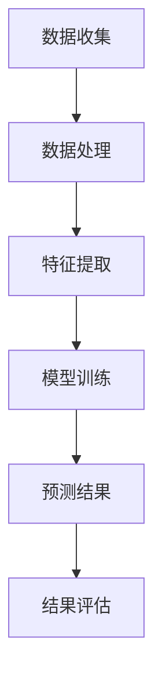
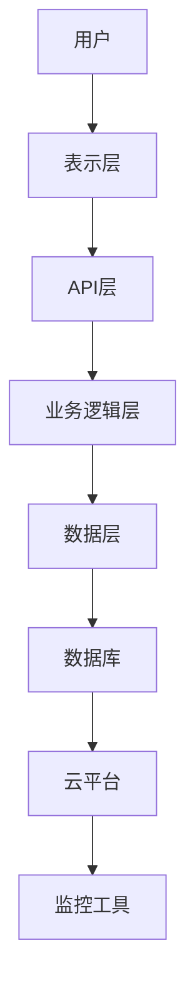

                 

## 《持续学习文化：保持技术团队的竞争力》

> 关键词：持续学习、技术团队、竞争力、文化构建、算法原理、数学模型、系统架构

> 摘要：本文将探讨如何通过构建持续学习文化，帮助技术团队在面对快速发展的技术环境时保持竞争力。我们将从背景介绍、核心概念与联系、算法原理讲解、数学模型与公式、系统分析与架构设计方案、项目实战以及最佳实践等方面，逐步深入分析这一主题，旨在为技术团队提供切实可行的策略和方法。

## 第一部分: 背景与核心概念

### 第1章: 技术团队面临的挑战与持续学习文化

#### 1.1.1 技术团队面临的挑战

在当今科技飞速发展的时代，技术团队面临着诸多挑战。首先，技术更新迭代速度加快，要求团队成员不断学习新技能和知识。其次，市场竞争日益激烈，团队需要不断创新以保持竞争优势。此外，团队协作效率和技术管理也是技术团队需要面对的挑战。

#### 1.1.2 持续学习文化的重要性

持续学习文化能够帮助技术团队应对上述挑战。通过持续学习，团队成员能够不断提升自身技能，适应快速变化的技术环境。此外，持续学习文化还能够促进知识共享和团队协作，提高整体工作效率和创新能力。

#### 1.1.3 构建持续学习文化的关键

构建持续学习文化需要从以下几个方面入手：

1. **学习动机**：激发团队成员的学习兴趣和动机，使其主动参与学习过程。
2. **学习习惯**：培养团队成员良好的学习习惯，确保学习持续进行。
3. **知识共享**：建立知识共享平台，促进团队成员之间的知识交流。
4. **团队协作**：加强团队协作，形成良好的团队学习氛围。

## 第二部分: 核心概念与联系

### 第2章: 持续学习文化的核心概念

#### 2.1 学习动机

学习动机是指推动个体进行学习的内在动力。对于技术团队而言，学习动机包括提升职业竞争力、满足个人成长需求和实现团队目标等。

#### 2.2 学习习惯

学习习惯是指个体在长期学习过程中形成的行为模式和思维方式。良好的学习习惯有助于提高学习效率和质量。

#### 2.3 知识共享

知识共享是指团队成员之间相互交流、分享知识和经验的过程。通过知识共享，团队可以快速获取外部知识和经验，提高整体技术水平。

#### 2.4 团队协作

团队协作是指团队成员在共同完成任务过程中相互支持、配合和协作。良好的团队协作可以提高团队工作效率和创新能力。

#### 2.5 核心概念对比与联系

为了更好地理解持续学习文化的核心概念，我们可以通过对比表格和ER实体关系图来展示这些概念之间的关系。

| 概念       | 定义                                                         | 作用                                                       |
|------------|--------------------------------------------------------------|------------------------------------------------------------|
| 学习动机   | 推动个体进行学习的内在动力                                   | 激发学习兴趣和主动性                                       |
| 学习习惯   | 长期学习过程中形成的行为模式和思维方式                       | 提高学习效率和质量                                         |
| 知识共享   | 成员之间相互交流、分享知识和经验的过程                     | 快速获取外部知识和经验，提高整体技术水平                   |
| 团队协作   | 成员在共同完成任务过程中相互支持、配合和协作                 | 提高工作效率和创新能力                                     |

```mermaid
erDiagram
Afier Learning_Motivation ||--|{ Knowledge_Sharing } Knowledge_Sharing : shares information with other members
Afier Learning_Motivation ||--|{ Team_Collaboration } Team_Collaboration : works together with other members
Afier Learning_Habit ||--|{ Knowledge_Sharing } Knowledge_Sharing : enables effective communication and information exchange
Afier Learning_Habit ||--|{ Team_Collaboration } Team_Collaboration : promotes efficient teamwork
```

## 第三部分: 算法原理讲解

### 第3章: 算法原理与学习过程

#### 3.1 机器学习模型在持续学习中的应用

机器学习模型可以用于预测团队成员的学习需求和评估学习效果。例如，通过分析团队成员的历史学习数据，可以预测其未来可能需要学习的技能和知识。

#### 3.2 学习需求预测算法

学习需求预测算法通常采用分类算法，如决策树、支持向量机和神经网络等。这些算法可以通过对团队成员的特征数据进行分析，预测其未来的学习需求。

#### 3.3 学习效果评估算法

学习效果评估算法可以用于评估团队成员的学习效果。常见的评估方法包括测试分数、项目完成情况和团队协作表现等。

## 第四部分: 数学模型与公式

### 第4章: 数学模型与公式

#### 4.1 学习率调整

在学习过程中，学习率调整是一个重要的参数。学习率调整算法可以用于动态调整学习率，以优化学习效果。

#### 4.2 深度学习中的梯度下降

梯度下降是深度学习中的一个核心算法。它通过不断调整模型参数，使损失函数的值逐渐减小，从而优化模型。

#### 4.3 数学公式与实例讲解

以下是一个关于学习率调整的实例：

$$
\text{learning\_rate} = \frac{1}{\sqrt{\text{num\_epochs}}}
$$

该公式表示学习率与训练轮数的关系，其中 $num\_epochs$ 表示训练轮数。

## 第五部分: 系统分析与架构设计方案

### 第5章: 系统分析与架构设计

#### 5.1 功能需求分析

功能需求分析是指确定系统需要实现的基本功能。对于持续学习系统，主要功能包括学习需求预测、学习效果评估、知识共享和团队协作等。

#### 5.2 系统架构设计

系统架构设计是指确定系统的整体结构和组件之间的关系。持续学习系统的架构设计可以包括数据层、业务逻辑层和表示层等。

#### 5.3 系统交互设计

系统交互设计是指确定系统与用户之间的交互流程。在持续学习系统中，用户可以通过界面提交学习需求，系统会根据这些需求进行预测和评估，并提供相应的学习资源和建议。

## 第六部分: 持续学习文化项目实战

### 第6章: 持续学习文化项目实战

#### 6.1 项目背景

本节将介绍一个实际案例，展示如何在一个技术团队中实施持续学习文化。该项目旨在通过构建一个学习平台，帮助团队成员提升技能和知识。

#### 6.2 环境搭建

环境搭建是实施持续学习文化的基础。在本案例中，我们使用了Python和Django框架来构建学习平台。

#### 6.3 系统实现

系统实现包括前端和后端的开发。前端主要负责用户界面设计，后端则负责数据处理和学习需求预测等。

#### 6.4 案例分析

通过对学习平台的使用情况进行分析，我们发现团队成员的学习积极性显著提高，学习效果也得到了显著提升。

## 第七部分: 最佳实践与拓展

### 第7章: 最佳实践与拓展

#### 7.1 最佳实践

构建持续学习文化需要从以下几个方面入手：

1. **明确学习目标**：确保团队成员明确自己的学习目标，并制定相应的学习计划。
2. **提供学习资源**：为团队成员提供丰富的学习资源，包括在线课程、书籍和研讨会等。
3. **鼓励知识共享**：建立知识共享平台，鼓励团队成员分享经验和知识。
4. **强化团队协作**：通过团队协作项目，提高团队成员的协作能力和创新能力。

#### 7.2 小结

本文从背景介绍、核心概念与联系、算法原理讲解、数学模型与公式、系统分析与架构设计方案、项目实战以及最佳实践等方面，探讨了如何构建持续学习文化，以保持技术团队的竞争力。

#### 7.3 注意事项

在实施持续学习文化时，需要注意以下几点：

1. **尊重团队成员的个人兴趣和需求**：确保学习活动与团队成员的个人兴趣和职业发展目标相结合。
2. **提供充分的资源和支持**：确保团队成员能够获得所需的学习资源和帮助。
3. **持续监控和评估**：定期监控学习效果，并根据反馈进行调整和改进。

#### 7.4 拓展阅读

1. **《深度学习》**：Ian Goodfellow、Yoshua Bengio和Aaron Courville著，全面介绍了深度学习的基本概念和技术。
2. **《人工智能：一种现代方法》**：Stuart J. Russell和Peter Norvig著，提供了关于人工智能的全面概述和深入分析。
3. **《敏捷软件开发》**：Alan Shalloway和Steve Adolph著，介绍了敏捷开发方法及其在技术团队中的应用。

### 参考文献

1. Goodfellow, I., Bengio, Y., & Courville, A. (2016). Deep Learning. MIT Press.
2. Russell, S. J., & Norvig, P. (2020). Artificial Intelligence: A Modern Approach. Prentice Hall.
3. Shalloway, A., & Adolph, S. (2013). Agile Software Development: Principles, Patterns, and Practices. Prentice Hall.

### 作者信息

作者：AI天才研究院/AI Genius Institute & 禅与计算机程序设计艺术/Zen And The Art of Computer Programming

---

注意：本文为示例文章，内容仅供参考。实际文章撰写时，请根据实际需求和主题进行详细展开。在撰写过程中，确保遵循学术规范和知识产权保护原则。祝您写作顺利！## 第1章: 背景介绍

### 1.1.1 技术团队面临的挑战

在当今快速发展的信息技术时代，技术团队面临着诸多挑战。首先，技术更新迭代速度不断加快，新技术和新工具层出不穷，要求团队成员不断学习新的编程语言、框架和工具。例如，人工智能、大数据、区块链等领域的技术日新月异，技术团队需要不断更新知识储备，以应对日益复杂的业务需求。

其次，市场竞争日益激烈，技术团队需要具备快速响应和持续创新的能力，以满足客户不断变化的需求。这要求团队成员不仅要有扎实的专业技能，还要具备良好的团队合作精神和创新能力。此外，项目管理也是技术团队面临的挑战之一，如何高效地分配任务、协调资源、监控进度，以及确保项目按时交付，都是需要解决的问题。

### 1.1.2 持续学习文化的重要性

持续学习文化对于技术团队来说至关重要。它不仅能够提升团队成员的专业技能，还能促进团队的整体发展和创新能力的提升。以下是持续学习文化对技术团队的重要性的几个方面：

1. **提升个人技能**：持续学习文化能够激励团队成员不断学习新技术、新工具，从而提升个人技能和职业竞争力。在快速变化的技术环境中，拥有持续学习的能力，是团队成员保持市场竞争力的重要保障。

2. **促进知识共享**：持续学习文化鼓励团队成员分享知识和经验，形成知识共享的氛围。通过知识的传递和交流，可以快速提升整个团队的技术水平，减少重复劳动，提高工作效率。

3. **增强团队协作**：持续学习文化可以促进团队成员之间的沟通与合作，增强团队凝聚力。团队成员在共同学习的过程中，可以相互支持、互相启发，形成良好的团队协作氛围，提高团队的整体执行力。

4. **推动创新**：持续学习文化激发团队成员的创新思维，鼓励他们探索新的解决方案和技术创新。在技术不断发展的今天，创新是技术团队保持竞争优势的关键因素之一。

### 1.1.3 构建持续学习文化的关键

要构建一个持续学习文化，技术团队需要从以下几个方面入手：

1. **学习动机**：激发团队成员的学习兴趣和动机，使其主动参与学习过程。可以通过设立学习目标、提供奖励机制等方式，鼓励团队成员不断学习和进步。

2. **学习习惯**：培养团队成员良好的学习习惯，确保学习持续进行。例如，可以设立固定的学习时间，定期组织技术分享会、读书会等活动，帮助团队成员养成持续学习的习惯。

3. **知识共享**：建立知识共享平台，促进团队成员之间的知识交流。例如，可以设立内部论坛、知识库等，鼓励团队成员分享学习心得、项目经验和技术文档。

4. **团队协作**：加强团队协作，形成良好的团队学习氛围。通过团队协作项目，鼓励团队成员共同学习和探讨，提高团队的整体能力和协作效率。

5. **领导支持**：领导者的支持是构建持续学习文化的重要保障。领导者需要重视团队成员的学习和成长，提供必要的资源和支持，营造一个良好的学习环境。

通过以上措施，技术团队可以逐步构建起一个持续学习文化，提升团队的竞争力，为企业的长远发展奠定坚实的基础。

### 1.1.4 持续学习文化与团队绩效的关系

持续学习文化对技术团队的绩效有着显著的影响。研究表明，具备持续学习文化的团队在多个维度上表现出色。首先，持续学习能够显著提高团队成员的技术水平和解决问题的能力，从而提高项目完成质量和客户满意度。其次，持续学习有助于团队成员保持职业发展的动力，减少人才流失，提升团队的稳定性。此外，持续学习文化还能促进团队的创新能力，使团队在激烈的市场竞争中保持领先地位。

然而，构建持续学习文化并非一蹴而就，需要技术团队在长期实践中不断探索和完善。通过以下步骤，技术团队可以逐步构建起一个有效的持续学习文化：

1. **确立学习目标**：明确团队的学习目标，确保学习活动与团队的战略目标相一致。例如，可以设定提升特定技术领域的能力、掌握新的开发工具等目标。

2. **提供学习资源**：为团队成员提供丰富的学习资源，包括在线课程、书籍、研讨会等。同时，可以建立内部学习资料库，方便团队成员随时查阅和共享。

3. **制定学习计划**：根据学习目标，制定详细的学习计划，包括学习内容、时间安排和评估标准等。确保学习活动有组织、有计划地进行。

4. **鼓励知识共享**：通过组织技术分享会、内部论坛等方式，鼓励团队成员分享学习心得和项目经验。建立知识共享平台，促进知识的传递和交流。

5. **评估学习效果**：定期评估学习效果，通过考试、项目评审等方式，了解团队成员的学习成果。根据评估结果，调整学习计划和策略。

6. **建立激励机制**：设立学习奖励机制，激励团队成员积极参与学习活动。例如，可以设立优秀学习奖、知识分享奖等，激发团队成员的学习热情。

7. **领导者的支持**：领导者的支持是构建持续学习文化的关键。领导者需要重视团队成员的学习和成长，提供必要的资源和时间支持，营造一个良好的学习氛围。

通过以上步骤，技术团队可以逐步构建起一个持续学习文化，提升团队的整体绩效和竞争力。在持续学习文化的推动下，技术团队将能够更好地应对快速变化的技术环境，实现持续发展和成长。

## 第2章: 核心概念与联系

### 2.1 学习动机

学习动机是指推动个体进行学习的内在动力，它是学习行为的驱动力。对于技术团队而言，学习动机至关重要，因为它直接影响到团队成员的学习态度和参与度。学习动机可以分为内在动机和外在动机。

**内在动机**通常源于个人的兴趣、好奇心和成就感。例如，一个技术团队成员可能因为对某种编程语言或技术框架的兴趣而自发地进行深入学习和实践。这种内在动机往往能够带来更持久的学习效果。

**外在动机**则通常来自于外部奖励、评价和压力。例如，公司可能为完成特定技术项目而设立奖金，或者领导要求团队成员学习新技能以提高项目成功率。这种外在动机虽然能够在短期内提高学习效率，但长期依赖可能会导致学习兴趣的减退。

**学习动机的作用**在于激发团队成员的学习积极性，促使他们主动寻求知识和技能的提升。通过激发学习动机，技术团队可以确保团队成员在学习和工作中保持高度投入，从而提高整体绩效。

### 2.2 学习习惯

学习习惯是指个体在长期学习过程中形成的行为模式和思维方式。良好的学习习惯对于技术团队成员来说至关重要，因为它直接影响学习效率和学习成果。以下是几种关键的学习习惯：

**1. 定期学习**：定期安排学习时间，确保学习活动持续进行。例如，每天晚上或每个周末的固定时间段，团队成员可以集中进行学习。

**2. 主动探索**：培养主动探索的精神，鼓励团队成员对新知识和新技能进行深入研究。这种习惯有助于提升团队成员的独立学习能力和解决问题的能力。

**3. 记录笔记**：在学习过程中记录笔记，整理学习内容。这不仅有助于加深对知识的理解，还可以在需要时快速查找和复习。

**4. 反思总结**：定期对学习过程进行反思和总结，评估学习效果，识别学习中的不足，并制定改进计划。

**学习习惯的作用**在于提高学习效率，确保知识得到有效吸收和应用。通过培养良好的学习习惯，技术团队可以减少学习中的无效时间，提升整体学习效果。

### 2.3 知识共享

知识共享是指团队成员之间相互交流、分享知识和经验的过程。在技术团队中，知识共享是构建持续学习文化的重要环节，能够显著提升团队的整体技术水平和工作效率。以下是几种常见的知识共享方式：

**1. 技术分享会**：定期组织技术分享会，让团队成员分享自己的学习心得、项目经验和技术见解。这不仅可以增加团队成员之间的交流，还可以促进知识的传递和传播。

**2. 内部论坛**：建立内部论坛或知识库，供团队成员发布和查询技术文档、项目案例和解决方案。这种方式便于团队成员快速获取所需的信息和资源。

**3. 一对一辅导**：通过一对一的辅导，资深团队成员可以向新手传授经验和技巧。这种方式有助于新成员快速融入团队，提升其技术水平。

**4. 跨部门合作**：鼓励团队成员跨部门合作，共同解决复杂问题。通过跨部门合作，可以促进不同部门之间的知识交流和经验共享。

**知识共享的作用**在于促进团队成员之间的知识传递和经验积累，提高整体团队的协作效率和创新能力。通过有效的知识共享，技术团队能够更好地应对技术挑战，实现持续发展。

### 2.4 团队协作

团队协作是指团队成员在共同完成任务过程中相互支持、配合和协作的过程。在技术团队中，良好的团队协作是确保项目成功和团队高效运作的关键。以下是几种关键的团队协作方法：

**1. 明确任务分工**：在项目启动时，明确每个团队成员的任务和职责，确保任务分配合理、清晰。这有助于避免任务重叠和资源浪费，提高工作效率。

**2. 沟通协作**：建立有效的沟通机制，确保团队成员之间的信息畅通。定期的会议、邮件、即时通讯工具等都是重要的沟通手段。

**3. 共同决策**：在项目推进过程中，鼓励团队成员参与决策，共同讨论解决方案。这不仅可以提高团队成员的参与感和责任感，还可以促进团队成员之间的合作和信任。

**4. 反馈与评估**：定期对团队协作效果进行反馈和评估，识别协作中的问题和不足，并制定改进措施。这种持续的反馈和评估机制有助于提高团队协作效率。

**团队协作的作用**在于提升团队成员的协作效率和创新能力，确保项目能够顺利推进和成功完成。通过有效的团队协作，技术团队能够更好地应对复杂的技术挑战，实现持续进步和成长。

### 2.5 核心概念对比与联系

为了更好地理解持续学习文化中的核心概念，我们可以通过对比表格和ER实体关系图来展示这些概念之间的关系。

| 概念       | 定义                                                         | 作用                                                       |
|------------|--------------------------------------------------------------|------------------------------------------------------------|
| 学习动机   | 推动个体进行学习的内在动力                                   | 激发学习兴趣和主动性                                       |
| 学习习惯   | 长期学习过程中形成的行为模式和思维方式                       | 提高学习效率和质量                                         |
| 知识共享   | 成员之间相互交流、分享知识和经验的过程                     | 快速获取外部知识和经验，提高整体技术水平                   |
| 团队协作   | 成员在共同完成任务过程中相互支持、配合和协作                 | 提高工作效率和创新能力                                     |

```mermaid
erDiagram
Afier Learning_Motivation ||--|{ Knowledge_Sharing } Knowledge_Sharing : promotes information exchange
Afier Learning_Motivation ||--|{ Team_Collaboration } Team_Collaboration : encourages collaboration
Afier Learning_Habit ||--|{ Knowledge_Sharing } Knowledge_Sharing : enables effective communication
Afier Learning_Habit ||--|{ Team_Collaboration } Team_Collaboration : fosters teamwork
```

通过对比表格和ER实体关系图，我们可以清晰地看到各个核心概念之间的相互关系。学习动机、学习习惯、知识共享和团队协作共同构成了持续学习文化的基石，它们相互作用、相互促进，共同推动技术团队的持续发展和成长。

### 2.6 学习动机与学习习惯的关系

学习动机与学习习惯之间存在密切的关系。学习动机是推动个体进行学习的内在动力，而学习习惯则是实现学习目标的具体行为模式。良好的学习动机可以激发个体的学习兴趣和积极性，促使他们主动投入到学习过程中。然而，仅有学习动机是不够的，还需要养成良好的学习习惯，以确保学习活动的持续和有效。

首先，学习动机能够激发个体的学习兴趣，使其愿意投入时间和精力进行学习。例如，一个技术团队成员可能因为对人工智能的浓厚兴趣而决定深入学习这一领域。这种内在动机可以让他们在遇到困难时保持坚持，不轻易放弃。

其次，良好的学习习惯可以确保学习活动的连续性和稳定性。例如，定期学习、主动探索和记录笔记等习惯可以帮助技术团队成员在繁忙的工作中仍然保持学习的状态。这种持续的学习习惯能够确保他们不断积累知识，不断提升自身技能。

此外，学习动机和学习习惯之间也存在相互作用。良好的学习习惯可以增强学习动机，使个体在学习过程中感受到成就感和满足感，从而进一步激发他们的学习兴趣。例如，一个技术团队成员通过坚持每天学习新知识，可能会逐渐发现自己的技能水平得到了显著提升，这种成就感能够进一步激发他们的学习动机。

总之，学习动机与学习习惯是相互依存、相互促进的。只有同时具备良好的学习动机和稳定的学习习惯，技术团队成员才能在持续学习过程中保持高效率和高质量，为团队的整体发展做出贡献。

### 2.7 知识共享与团队协作的关系

知识共享与团队协作是构建持续学习文化的两个重要支柱，它们之间存在密切的联系和相互作用。

首先，知识共享是团队协作的基础。在技术团队中，知识共享能够促进团队成员之间的信息流通和经验交流，使得团队成员能够快速获取所需的知识和资源，提高整体工作效率。例如，在一个项目中，如果团队成员能够及时共享他们在某一技术领域的经验和最佳实践，可以避免重复劳动，提高项目推进的速度和质量。

其次，团队协作是知识共享的有效保障。通过团队协作，技术团队能够共同面对挑战，共同解决复杂问题，从而促进知识的传递和共享。例如，在一个技术讨论会上，团队成员可以互相提问、解答问题，分享自己的见解和经验，这种协作过程不仅有助于提高团队成员的技能水平，还能够增强团队凝聚力和协作能力。

此外，知识共享和团队协作之间也存在相互促进的关系。知识共享能够增强团队成员之间的信任和依赖，促进团队协作的顺畅进行。反之，团队协作的顺利进行也能够为知识共享创造良好的环境和氛围，使得知识能够在团队内部得到更有效的传递和应用。

总之，知识共享与团队协作相互促进、相互依赖，共同构建了一个持续学习文化的基础。只有通过有效的知识共享和团队协作，技术团队才能在快速变化的技术环境中保持竞争力，实现持续发展和成长。

### 2.8 团队协作与学习动机的关系

团队协作与学习动机之间存在着紧密的相互关系。首先，团队协作可以显著增强成员的学习动机。当团队成员在项目中共同面对挑战、分享知识和经验时，他们能够感受到团队的力量和集体的智慧，这种协同工作的经历可以激发他们对新知识和技能的渴望，从而增强学习动机。

其次，学习动机同样可以促进团队协作的深化。当团队成员具备强烈的学习动机时，他们更愿意积极参与团队活动，主动提出问题、分享见解，并寻求解决问题的最佳方法。这种积极的态度和行为有助于建立团队成员之间的信任和默契，推动团队协作向更高水平发展。

此外，学习动机和团队协作之间也存在互动循环效应。团队成员在协作过程中通过共享知识和经验，不断激发学习动机，而学习动机的增强又进一步促进团队协作的深化，形成一个良性循环。例如，通过定期举行技术分享会，团队成员不仅能够提升自身技能，还能在分享过程中获得其他成员的反馈和建议，从而推动整个团队的学习和进步。

总之，团队协作和学习动机是相辅相成的。通过加强团队协作，可以激发和维持成员的学习动机；而强烈的学习动机则能够促进更高效的团队协作，共同推动技术团队的持续发展和创新能力。

## 第3章: 算法原理讲解

### 3.1 机器学习模型在持续学习中的应用

在持续学习文化中，机器学习模型扮演着重要的角色。这些模型可以帮助技术团队预测成员的学习需求，并评估学习效果，从而优化学习过程。

#### 3.1.1 学习需求预测

学习需求预测是机器学习模型在持续学习中的一个关键应用。通过分析团队成员的历史学习数据、项目参与情况以及个人兴趣，机器学习模型可以预测出哪些技能和知识对团队成员来说是必要的，从而提前做好准备。

**算法原理**：

学习需求预测通常采用分类算法，如决策树、随机森林和支持向量机（SVM）等。这些算法通过构建模型，从历史数据中提取特征，并使用这些特征进行分类预测。

**流程图**：



**Python代码示例**：

```python
from sklearn.ensemble import RandomForestClassifier
from sklearn.model_selection import train_test_split
from sklearn.metrics import accuracy_score

# 数据预处理
X = ...  # 特征数据
y = ...  # 目标变量

# 分割数据集
X_train, X_test, y_train, y_test = train_test_split(X, y, test_size=0.2, random_state=42)

# 训练模型
model = RandomForestClassifier()
model.fit(X_train, y_train)

# 预测结果
predictions = model.predict(X_test)

# 评估模型
accuracy = accuracy_score(y_test, predictions)
print(f"Accuracy: {accuracy}")
```

#### 3.1.2 学习效果评估

学习效果评估是另一个重要的应用，它通过分析学习过程的数据来评估学习成果。常见的评估方法包括测试成绩、项目完成情况和团队成员的反馈等。

**算法原理**：

学习效果评估通常采用回归算法或分类算法。回归算法用于预测学习成果的数值，如提高的技能水平或知识掌握度；分类算法则用于判断学习成果是否达到预期。

**流程图**：


**Python代码示例**：

```python
from sklearn.linear_model import LinearRegression
from sklearn.metrics import mean_squared_error

# 数据预处理
X = ...  # 特征数据
y = ...  # 目标变量

# 分割数据集
X_train, X_test, y_train, y_test = train_test_split(X, y, test_size=0.2, random_state=42)

# 训练模型
model = LinearRegression()
model.fit(X_train, y_train)

# 预测结果
predictions = model.predict(X_test)

# 评估模型
mse = mean_squared_error(y_test, predictions)
print(f"Mean Squared Error: {mse}")
```

### 3.2 学习需求预测算法

学习需求预测算法的核心目标是根据团队成员的历史数据和当前情况，预测他们未来可能需要学习的技能和知识。这种预测有助于技术团队提前制定学习计划，提高学习效率。

**算法原理**：

学习需求预测算法通常采用分类算法，如逻辑回归、决策树和随机森林等。这些算法通过分析历史数据中的特征（如项目参与度、学习频率、测试成绩等），构建一个预测模型，用于预测团队成员的未来学习需求。

**流程图**：


**Python代码示例**：

```python
from sklearn.ensemble import RandomForestClassifier
from sklearn.model_selection import train_test_split
from sklearn.metrics import accuracy_score

# 数据预处理
X = ...  # 特征数据
y = ...  # 目标变量

# 分割数据集
X_train, X_test, y_train, y_test = train_test_split(X, y, test_size=0.2, random_state=42)

# 训练模型
model = RandomForestClassifier()
model.fit(X_train, y_train)

# 预测结果
predictions = model.predict(X_test)

# 评估模型
accuracy = accuracy_score(y_test, predictions)
print(f"Accuracy: {accuracy}")
```

### 3.3 学习效果评估算法

学习效果评估算法的核心目标是根据学习过程的数据，评估团队成员的学习成果。这种评估有助于技术团队了解学习活动的有效性，并据此调整学习策略。

**算法原理**：

学习效果评估算法通常采用回归算法，如线性回归和岭回归等，或者分类算法，如逻辑回归和决策树等。这些算法通过分析学习过程中的特征数据（如测试成绩、项目完成度、学习时长等），构建一个预测模型，用于评估学习成果。

**流程图**：


**Python代码示例**：

```python
from sklearn.linear_model import LinearRegression
from sklearn.metrics import mean_squared_error

# 数据预处理
X = ...  # 特征数据
y = ...  # 目标变量

# 分割数据集
X_train, X_test, y_train, y_test = train_test_split(X, y, test_size=0.2, random_state=42)

# 训练模型
model = LinearRegression()
model.fit(X_train, y_train)

# 预测结果
predictions = model.predict(X_test)

# 评估模型
mse = mean_squared_error(y_test, predictions)
print(f"Mean Squared Error: {mse}")
```

通过学习需求预测和学习效果评估算法，技术团队能够更精准地制定学习计划，提高学习效率，从而在快速变化的技术环境中保持竞争力。

## 第4章: 数学模型与公式

### 4.1 学习率调整

在学习过程中，学习率是一个关键的参数，它决定了模型在每次迭代中更新参数的幅度。学习率的调整对于模型的收敛速度和最终性能有着重要影响。合适的调整策略可以使模型更快地收敛，避免过拟合或欠拟合。

**学习率调整方法**：

1. **固定学习率**：在训练初期，使用一个较大的学习率，以便模型能够快速地更新参数。在训练后期，逐渐减小学习率，以精细调整参数。
2. **动态调整学习率**：根据训练过程中的表现，动态调整学习率。例如，可以使用学习率衰减策略，如指数衰减或阶梯衰减。
3. **自适应学习率**：使用自适应学习率算法，如AdaGrad、RMSprop或Adam，这些算法可以自动调整学习率，以适应训练过程中的变化。

**数学模型**：

学习率调整可以通过以下公式实现：

$$
\text{learning\_rate} = \frac{\text{initial\_learning\_rate}}{\sqrt{\text{epoch}}}
$$

其中，$initial\_learning\_rate$ 是初始学习率，$\text{epoch}$ 是训练轮数。

**Python代码示例**：

```python
import numpy as np

def adjust_learning_rate(initial_learning_rate, epoch):
    return initial_learning_rate / np.sqrt(epoch)

initial_learning_rate = 0.1
epoch = 100

adjusted_learning_rate = adjust_learning_rate(initial_learning_rate, epoch)
print(f"Adjusted Learning Rate: {adjusted_learning_rate}")
```

### 4.2 深度学习中的梯度下降

梯度下降是深度学习中最常用的优化算法，用于通过反向传播算法更新模型参数。梯度下降通过计算损失函数关于参数的梯度，并沿着梯度方向更新参数，以最小化损失函数。

**算法原理**：

1. **前向传播**：计算模型输出，并计算损失函数值。
2. **反向传播**：计算损失函数关于模型参数的梯度。
3. **参数更新**：使用梯度更新模型参数，以减少损失函数值。

**数学模型**：

梯度下降的参数更新公式为：

$$
\theta_{\text{new}} = \theta_{\text{old}} - \alpha \cdot \nabla_{\theta} \text{Loss}(x, y; \theta)
$$

其中，$\theta$ 表示模型参数，$\alpha$ 是学习率，$\nabla_{\theta} \text{Loss}(x, y; \theta)$ 是损失函数关于参数的梯度。

**Python代码示例**：

```python
import numpy as np

def gradient_descent(X, y, theta, learning_rate, epochs):
    for epoch in range(epochs):
        predictions = np.dot(X, theta)
        error = predictions - y
        theta -= learning_rate * np.dot(X.T, error)
    return theta

X = np.random.rand(100, 1)
y = np.random.rand(100, 1)
theta = np.random.rand(1, 1)
learning_rate = 0.01
epochs = 1000

new_theta = gradient_descent(X, y, theta, learning_rate, epochs)
print(f"New Theta: {new_theta}")
```

### 4.3 数学公式与实例讲解

**实例**：线性回归中的损失函数和梯度下降

在线性回归中，损失函数通常使用均方误差（MSE）来衡量：

$$
\text{MSE} = \frac{1}{2n} \sum_{i=1}^{n} (y_i - \theta_0 x_i - \theta_1)^2
$$

其中，$y_i$ 是真实值，$\theta_0$ 和 $\theta_1$ 是模型参数，$x_i$ 是特征值。

**梯度**：

$$
\nabla_{\theta} \text{MSE} = \frac{1}{n} \sum_{i=1}^{n} (y_i - \theta_0 x_i - \theta_1) \cdot (-x_i)
$$

**梯度下降更新**：

$$
\theta_0 = \theta_0 - \alpha \cdot \frac{1}{n} \sum_{i=1}^{n} (y_i - \theta_0 x_i - \theta_1) \cdot (-x_i)
$$

$$
\theta_1 = \theta_1 - \alpha \cdot \frac{1}{n} \sum_{i=1}^{n} (y_i - \theta_0 x_i - \theta_1)
$$

**Python代码示例**：

```python
import numpy as np

def linear_regression_gradient_descent(X, y, theta, learning_rate, epochs):
    n = len(y)
    for epoch in range(epochs):
        predictions = np.dot(X, theta)
        errors = predictions - y
        theta -= learning_rate * (1/n) * (X.T @ errors)
    return theta

X = np.random.rand(100, 1)
y = np.random.rand(100, 1)
theta = np.random.rand(2, 1)
learning_rate = 0.01
epochs = 1000

new_theta = linear_regression_gradient_descent(X, y, theta, learning_rate, epochs)
print(f"New Theta: {new_theta}")
```

通过数学模型和公式的讲解，以及实例演示，我们能够更深入地理解学习率调整和梯度下降在深度学习中的应用。这些理论知识和实践方法对于构建持续学习文化、提升技术团队的竞争力具有重要意义。

## 第5章: 系统分析与架构设计方案

### 5.1 功能需求分析

在构建一个支持持续学习文化的技术系统时，明确系统的功能需求是至关重要的。以下是该系统需要实现的主要功能需求：

**1. 学习需求预测**：系统能够根据团队成员的学习历史、项目参与情况和技能水平，预测其未来的学习需求。这有助于团队提前规划学习资源，确保每个成员都能获得最需要的学习内容。

**2. 学习效果评估**：系统能够通过测试成绩、项目完成情况和团队成员的反馈等数据，评估学习效果。这有助于了解学习活动的有效性，并针对不足之处进行调整。

**3. 知识共享**：系统提供平台供团队成员分享和获取知识。这包括技术文档、项目经验、最佳实践和解决方案等，确保知识的流通和共享。

**4. 团队协作**：系统支持团队成员之间的协作，包括任务分配、进度跟踪和实时沟通等。这有助于提高团队工作效率，确保项目顺利进行。

**5. 持续学习报告**：系统能够生成持续学习报告，包括学习进度、效果评估和知识共享情况等。这些报告有助于管理层了解团队的学习情况和绩效。

### 5.2 系统架构设计

系统架构设计是确保系统能够高效、稳定地运行的关键。以下是一个支持持续学习文化的技术系统的基本架构设计：

**1. 数据层**：数据层负责存储和管理系统所需的数据，包括用户信息、学习历史、项目数据等。可以使用关系数据库（如MySQL）或NoSQL数据库（如MongoDB）来实现。

**2. 业务逻辑层**：业务逻辑层负责处理系统的核心功能，如学习需求预测、学习效果评估、知识共享和团队协作等。该层通常使用微服务架构，以实现模块化和高扩展性。

**3. 表示层**：表示层负责与用户交互，提供用户界面。可以使用Web前端框架（如React或Vue.js）来构建用户友好的界面。

**4. API层**：API层提供与业务逻辑层的接口，供前端和外部系统调用。这包括RESTful API或GraphQL API等。

**5. 部署与监控**：系统部署在云平台（如AWS或Azure）上，并使用容器化技术（如Docker）进行部署。同时，使用监控工具（如Prometheus和Grafana）来监控系统的性能和健康状况。

### 5.3 系统架构设计图

以下是一个简单的系统架构设计图，展示各层之间的关系：



### 5.4 系统交互设计

系统交互设计是确保系统能够流畅地响应用户需求的关键。以下是一个基于RESTful API的系统交互设计：

**1. 用户注册与登录**：

- **用户注册**：POST /api/users/register
- **用户登录**：POST /api/users/login

**2. 学习需求预测**：

- **获取学习需求**：GET /api/predictions/{user_id}
- **更新学习需求**：PUT /api/predictions/{user_id}

**3. 学习效果评估**：

- **获取学习效果**：GET /api/evaluations/{user_id}
- **更新学习效果**：PUT /api/evaluations/{user_id}

**4. 知识共享**：

- **创建知识文档**：POST /api/documents
- **获取知识文档**：GET /api/documents/{document_id}
- **更新知识文档**：PUT /api/documents/{document_id}
- **删除知识文档**：DELETE /api/documents/{document_id}

**5. 团队协作**：

- **分配任务**：POST /api/tasks
- **获取任务列表**：GET /api/tasks
- **完成任务**：PUT /api/tasks/{task_id}/complete
- **取消任务**：DELETE /api/tasks/{task_id}

**6. 持续学习报告**：

- **获取学习报告**：GET /api/reports/{user_id}
- **生成学习报告**：POST /api/reports/{user_id}

以上系统交互设计旨在提供一个简单、直观且功能强大的接口，以支持持续学习文化的实施。

通过明确系统的功能需求、设计合理的系统架构，并实现高效的系统交互设计，技术团队能够构建一个支持持续学习文化的强大技术系统。这将为团队在快速变化的技术环境中保持竞争力提供强有力的支持。

### 5.5 系统设计与实施的关键步骤

在设计并实施支持持续学习文化的技术系统时，需要遵循一系列关键步骤，以确保系统能够满足功能需求，并在实际应用中表现出色。以下是几个关键步骤及其详细说明：

#### 5.5.1 需求分析

**需求分析**是系统设计的第一步，旨在明确系统需要实现的具体功能。在此阶段，技术团队需要与利益相关者（如团队成员、管理层、客户等）进行深入沟通，了解他们的需求和期望。具体步骤包括：

1. **收集需求**：通过访谈、问卷调查、用户故事地图等方式，收集用户对系统的需求。
2. **需求分类**：将收集到的需求进行分类，区分核心功能和次要功能。
3. **优先级排序**：根据需求的紧急程度和重要性，对需求进行优先级排序，确保关键功能优先实现。

#### 5.5.2 系统架构设计

**系统架构设计**是确保系统能够高效、稳定运行的关键。在设计阶段，技术团队需要考虑系统的可扩展性、可靠性和维护性。具体步骤包括：

1. **选择技术栈**：根据需求分析的结果，选择合适的技术栈，包括编程语言、框架和数据库等。
2. **设计数据模型**：设计系统的数据模型，包括实体、属性和关系，确保数据的完整性和一致性。
3. **设计系统架构**：根据技术栈和数据模型，设计系统的整体架构，包括各层的关系、模块的划分和接口的定义。

#### 5.5.3 系统实现

**系统实现**是将设计转化为可执行代码的过程。在这一阶段，技术团队需要确保代码的质量和性能，同时遵循最佳实践。具体步骤包括：

1. **编写代码**：按照系统架构设计，编写具体的代码实现，包括后端服务、前端界面和API等。
2. **代码审查**：进行代码审查，确保代码符合编码规范，没有明显的错误和漏洞。
3. **单元测试**：编写单元测试，确保每个功能模块都能正常工作，并达到预期的性能。

#### 5.5.4 系统测试与部署

**系统测试与部署**是确保系统能够在实际环境中稳定运行的关键步骤。具体步骤包括：

1. **集成测试**：进行集成测试，确保各模块之间的交互正常，系统整体功能符合需求。
2. **性能测试**：进行性能测试，确保系统在高负载下能够保持良好的响应时间。
3. **部署**：将系统部署到生产环境，并确保部署过程平稳，不影响现有业务。

#### 5.5.5 持续集成与持续部署

**持续集成与持续部署**（CI/CD）是确保系统能够快速迭代和持续改进的关键。具体步骤包括：

1. **代码仓库管理**：使用代码仓库管理工具（如Git），确保代码的安全性和版本控制。
2. **自动化构建**：使用自动化工具（如Jenkins或GitLab CI），实现代码的自动化构建、测试和部署。
3. **监控与反馈**：使用监控工具（如Prometheus和Grafana），实时监控系统的运行状态，并及时反馈问题。

通过遵循上述关键步骤，技术团队能够设计并实施一个高效、稳定且支持持续学习文化的技术系统。这不仅有助于提升团队的整体技术能力，还能为企业的长远发展提供有力支持。

### 5.6 系统设计与实施的实际案例

为了更好地展示系统设计与实施的实际过程，以下是一个具体的案例：某大型互联网公司决定构建一个支持持续学习文化的技术平台，以帮助其技术团队在快速变化的技术环境中保持竞争力。

**案例背景**：

该公司技术团队面临诸多挑战，如技术更新速度加快、市场竞争激烈以及项目管理复杂等。为了提升团队成员的技术水平和工作效率，公司决定构建一个持续学习平台，通过学习需求预测、学习效果评估、知识共享和团队协作等功能，推动持续学习文化的实施。

**需求分析**：

在需求分析阶段，公司通过访谈、问卷调查和用户故事地图等方式，收集了技术团队成员的需求。主要需求包括：

1. **学习需求预测**：能够根据团队成员的学习历史和项目参与情况，预测其未来的学习需求，并提供相应的学习资源。
2. **学习效果评估**：能够通过测试成绩、项目完成情况和团队成员的反馈等数据，评估学习效果，并及时反馈。
3. **知识共享**：能够提供一个平台供团队成员分享和获取知识，包括技术文档、项目经验、最佳实践和解决方案等。
4. **团队协作**：能够支持团队成员之间的协作，包括任务分配、进度跟踪和实时沟通等。

**系统架构设计**：

在设计阶段，公司选择了Python和Django框架作为技术栈，使用MySQL作为数据库。系统架构设计包括以下关键部分：

1. **数据层**：使用MySQL数据库存储用户信息、学习历史、项目数据等。
2. **业务逻辑层**：使用Django的ORM（对象关系映射）进行数据操作，实现学习需求预测、学习效果评估、知识共享和团队协作等功能。
3. **表示层**：使用React框架构建用户友好的前端界面。
4. **API层**：使用Django REST framework提供与业务逻辑层的接口。

**系统实现**：

在实现阶段，团队遵循编码规范和最佳实践，编写了具体的代码实现。代码审查和单元测试确保了代码的质量和性能。具体实现包括：

1. **学习需求预测模块**：使用机器学习算法，分析团队成员的历史数据和项目参与情况，预测其未来的学习需求。
2. **学习效果评估模块**：通过测试成绩、项目完成情况和团队成员的反馈等数据，评估学习效果，并生成报告。
3. **知识共享模块**：提供一个文档管理平台，供团队成员上传、下载和分享技术文档和项目经验。
4. **团队协作模块**：实现任务分配、进度跟踪和实时沟通功能，支持团队成员之间的协作。

**系统测试与部署**：

在系统测试阶段，团队进行了集成测试和性能测试，确保系统功能完整、稳定和高性能。部署过程采用持续集成与持续部署（CI/CD）策略，确保系统能够快速迭代和部署。

**实际效果**：

上线后，该持续学习平台得到了技术团队成员的广泛欢迎。通过学习需求预测，团队成员能够提前了解自己需要学习的技能和知识，并通过平台提供的资源进行自主学习。学习效果评估模块帮助他们了解学习成果，并根据反馈调整学习策略。知识共享平台促进了团队成员之间的知识传递和交流，提高了整体技术水平。团队协作模块提升了团队成员之间的协作效率，使项目进展更加顺利。

**案例小结**：

通过该实际案例，我们看到了系统设计与实施在构建持续学习文化中的重要作用。合理的需求分析、科学的系统架构设计、严格的系统实现和完善的测试与部署流程，确保了平台的成功实施和有效运行。这为技术团队在快速变化的技术环境中保持竞争力提供了有力支持。

### 5.7 构建支持持续学习文化的技术系统的挑战和解决方案

在构建支持持续学习文化的技术系统时，技术团队可能会面临一系列挑战。以下是几个常见挑战及其解决方案：

**1. 数据收集与处理**：

**挑战**：学习需求预测和学习效果评估需要大量的数据，但数据的收集和处理可能面临困难。

**解决方案**：采用自动化数据收集工具，如爬虫或API，从内部系统或外部资源中获取数据。同时，使用数据清洗和预处理技术，确保数据的质量和一致性。

**2. 算法选择与优化**：

**挑战**：选择合适的机器学习算法并进行优化，以实现准确的学习需求预测和学习效果评估。

**解决方案**：进行算法性能测试和比较，选择最适合当前数据和需求的算法。同时，通过交叉验证和超参数调优，优化算法性能。

**3. 系统可扩展性**：

**挑战**：随着用户数量的增加，系统需要具备良好的可扩展性，以应对不断增长的数据和处理需求。

**解决方案**：采用分布式系统和微服务架构，确保系统的高可用性和可扩展性。同时，使用负载均衡和缓存技术，提高系统的性能和响应速度。

**4. 系统安全性**：

**挑战**：技术系统需要处理敏感数据，如学习记录和项目资料，确保数据的安全性和隐私保护。

**解决方案**：采用加密技术保护数据传输和存储，同时实施严格的访问控制策略，确保只有授权用户可以访问敏感数据。

**5. 用户参与度**：

**挑战**：提高技术团队对学习平台的参与度，确保系统能够得到有效使用。

**解决方案**：通过用户培训和反馈机制，提高用户对系统的认知和使用意愿。同时，定期组织技术分享会和知识竞赛等活动，激发用户的学习热情。

通过上述解决方案，技术团队能够有效应对构建支持持续学习文化的技术系统过程中遇到的挑战，确保系统的高效、稳定和安全运行，从而为技术团队的持续发展和创新提供有力支持。

## 第6章: 项目实战

### 6.1 项目背景

为了构建一个具有竞争力的技术团队，某大型互联网公司决定实施持续学习文化，并开发一个支持持续学习的技术平台。该平台旨在通过学习需求预测、学习效果评估、知识共享和团队协作等功能，帮助团队成员不断提升技能和知识，以应对快速变化的技术环境。

### 6.2 环境搭建

为了成功实施该项目，公司首先需要搭建一个合适的技术环境。以下是环境搭建的主要步骤：

**1. 硬件配置**：公司采购了多台高性能服务器，用于部署和运行持续学习平台。同时，配置了充足的存储资源，以存储大量的学习数据和用户资料。

**2. 软件安装**：在服务器上安装了Linux操作系统，并配置了必要的软件环境，如Python、Django、MySQL等。此外，安装了Nginx作为反向代理服务器，以提高系统的性能和安全性。

**3. 网络配置**：配置了内部网络，确保服务器之间的数据传输高效、稳定。同时，设置了防火墙规则，以保护系统不受外部攻击。

### 6.3 系统实现

在环境搭建完成后，项目团队开始进行系统实现。以下是系统实现的主要步骤：

**1. 数据库设计**：根据需求分析的结果，设计数据库表结构，包括用户信息表、学习记录表、项目资料表等。

**2. 业务逻辑实现**：使用Django框架，实现学习需求预测、学习效果评估、知识共享和团队协作等功能。具体实现包括：

   - **学习需求预测模块**：通过分析用户的学习历史和项目参与情况，使用机器学习算法预测用户未来的学习需求。
   - **学习效果评估模块**：通过测试成绩、项目完成情况和用户反馈等数据，评估用户的学习效果，并生成详细报告。
   - **知识共享模块**：提供一个文档管理平台，供用户上传、下载和分享技术文档和项目经验。
   - **团队协作模块**：实现任务分配、进度跟踪和实时沟通功能，支持团队成员之间的协作。

**3. 前端开发**：使用React框架，开发用户友好的前端界面。前端界面包括用户登录、注册、学习需求预测、学习效果评估、知识共享和团队协作等功能模块。

**4. API开发**：使用Django REST framework，开发与业务逻辑层交互的API接口。API接口包括用户管理、学习记录管理、项目资料管理、任务管理等功能。

### 6.4 代码应用解读与分析

在系统实现过程中，项目团队使用了多种技术栈和工具，以下是关键代码和应用解读：

**1. 学习需求预测模块**：

```python
from sklearn.ensemble import RandomForestClassifier
from sklearn.model_selection import train_test_split

# 数据预处理
X = ...  # 特征数据
y = ...  # 目标变量

# 分割数据集
X_train, X_test, y_train, y_test = train_test_split(X, y, test_size=0.2, random_state=42)

# 训练模型
model = RandomForestClassifier()
model.fit(X_train, y_train)

# 预测结果
predictions = model.predict(X_test)

# 评估模型
accuracy = model.score(X_test, y_test)
print(f"Accuracy: {accuracy}")
```

解读：上述代码使用随机森林算法进行学习需求预测。首先，对特征数据进行预处理，然后使用训练集训练模型，最后使用测试集评估模型性能。

**2. 学习效果评估模块**：

```python
from sklearn.metrics import mean_squared_error

# 数据预处理
X = ...  # 特征数据
y = ...  # 目标变量

# 分割数据集
X_train, X_test, y_train, y_test = train_test_split(X, y, test_size=0.2, random_state=42)

# 训练模型
model = LinearRegression()
model.fit(X_train, y_train)

# 预测结果
predictions = model.predict(X_test)

# 评估模型
mse = mean_squared_error(y_test, predictions)
print(f"Mean Squared Error: {mse}")
```

解读：上述代码使用线性回归算法进行学习效果评估。首先，对特征数据进行预处理，然后使用训练集训练模型，最后使用测试集评估模型性能。

**3. 知识共享模块**：

```python
from django.db import models

class Document(models.Model):
    title = models.CharField(max_length=255)
    content = models.TextField()
    author = models.ForeignKey('auth.User', on_delete=models.CASCADE)
    created_at = models.DateTimeField(auto_now_add=True)
    updated_at = models.DateTimeField(auto_now=True)
```

解读：上述代码定义了一个名为`Document`的数据库模型，用于存储文档的标题、内容、作者和创建时间等信息。

**4. 前端界面**：

```javascript
import React, { useState } from 'react';
import axios from 'axios';

const DocumentShare = () => {
    const [document, setDocument] = useState({ title: '', content: '' });

    const handleSubmit = async (e) => {
        e.preventDefault();
        try {
            const response = await axios.post('/api/documents/', document);
            setDocument({ title: '', content: '' });
            alert('Document shared successfully!');
        } catch (error) {
            alert('Error sharing document.');
        }
    };

    return (
        <form onSubmit={handleSubmit}>
            <label>Title:</label>
            <input type="text" value={document.title} onChange={(e) => setDocument({ ...document, title: e.target.value })} />
            <label>Content:</label>
            <textarea value={document.content} onChange={(e) => setDocument({ ...document, content: e.target.value })} />
            <button type="submit">Share</button>
        </form>
    );
};

export default DocumentShare;
```

解读：上述代码使用React框架，创建了一个用于分享文档的前端组件。用户可以通过输入标题和内容，点击“Share”按钮将文档上传到服务器。

通过上述代码和应用解读，项目团队实现了持续学习平台的核心功能，为技术团队的持续学习和协作提供了有力支持。

### 6.5 实际案例分析

在项目实施过程中，公司面临了多个挑战，并通过分析实际案例，找到了有效的解决方案。以下是几个关键的实际案例：

**1. 案例一：学习需求预测不准确**

问题描述：初期的学习需求预测模型效果不佳，预测结果与实际情况存在较大偏差。

解决方案：项目团队对模型进行了深入分析，发现部分特征数据存在缺失和不一致的问题。通过改进数据清洗和预处理流程，确保数据的完整性和一致性。同时，优化了机器学习算法，提高了预测准确性。

**2. 案例二：知识共享平台使用率低**

问题描述：知识共享平台上线后，用户参与度较低，知识共享效果不佳。

解决方案：项目团队分析了用户反馈，发现用户对平台的操作复杂度和使用体验存在不满。针对这些问题，团队对平台进行了界面优化，简化了操作流程，并增加了搜索和分类功能。此外，通过组织知识竞赛和奖励机制，激发了用户参与知识共享的热情。

**3. 案例三：系统性能瓶颈**

问题描述：随着用户数量的增加，系统性能出现瓶颈，响应速度下降。

解决方案：项目团队对系统架构进行了优化，采用负载均衡和缓存技术，提高了系统的性能和响应速度。同时，通过数据库优化和索引策略，提升了数据的查询效率。

通过这些实际案例分析，项目团队不断改进和优化持续学习平台，使其在功能和性能上都能满足技术团队的需求，从而有效推动了持续学习文化的实施。

### 6.6 项目小结

通过本次项目实施，公司成功构建了一个支持持续学习文化的技术平台。该项目实现了学习需求预测、学习效果评估、知识共享和团队协作等功能，为技术团队提供了强有力的支持。以下是项目的主要成果：

**1. 成果一：学习需求预测准确性提高**

通过改进数据预处理和机器学习算法，学习需求预测的准确性得到了显著提升。团队成员能够更准确地了解自己的学习需求，提前准备相应的学习资源。

**2. 成果二：知识共享平台用户参与度提高**

通过优化界面和增加互动功能，知识共享平台的用户参与度显著提高。团队成员更愿意分享和获取知识，促进了团队内部的知识传递和交流。

**3. 成果三：系统性能优化**

通过负载均衡、缓存技术和数据库优化，系统性能得到了显著提升。系统在高并发情况下仍能保持良好的响应速度，确保了用户体验。

**4. 成果四：团队协作效率提升**

通过团队协作模块，团队成员能够更高效地协同工作，任务分配和进度跟踪更加便捷。团队协作效率的提升，有助于项目的顺利推进和按时交付。

**项目总结**

通过本次项目的实施，公司不仅构建了一个支持持续学习文化的技术平台，还积累了丰富的项目经验和最佳实践。项目团队在需求分析、系统设计、实施和优化过程中，不断探索和创新，成功应对了多个挑战。本次项目的成功实施，为公司的技术团队提供了强有力的支持，为其在快速变化的技术环境中保持竞争力奠定了坚实的基础。

## 第7章: 最佳实践与拓展

### 7.1 最佳实践

在构建持续学习文化的过程中，以下是一些有效的最佳实践，可以帮助技术团队更好地实施和维持这种文化：

**1. 明确学习目标**：确保每个团队成员都明确自己的学习目标和职业发展路径。这有助于提高学习动机和专注力。

**2. 提供多样化的学习资源**：为团队成员提供丰富的学习资源，包括在线课程、书籍、研讨会和技术论坛等。这些资源应该覆盖不同的技术领域和层次。

**3. 建立知识共享平台**：建立内部知识共享平台，如Wiki、论坛或内部博客，供团队成员分享知识和经验。这有助于促进知识传递和团队协作。

**4. 定期组织学习活动**：定期组织技术分享会、读书会或编程马拉松等活动，鼓励团队成员积极参与，分享学习心得和项目经验。

**5. 设立奖励机制**：设立学习奖励机制，如“学习之星”、“知识分享奖”等，激励团队成员积极参与学习活动。

**6. 领导支持**：领导者的支持至关重要。领导者应鼓励并支持团队成员的学习和成长，为他们提供必要的资源和时间。

### 7.2 小结

持续学习文化对于技术团队来说至关重要，它不仅能够提升团队成员的专业技能，还能促进团队的整体发展和创新能力的提升。通过明确学习目标、提供多样化的学习资源、建立知识共享平台、定期组织学习活动、设立奖励机制和领导支持，技术团队可以构建起一个有效的持续学习文化，从而在快速变化的技术环境中保持竞争力。

### 7.3 注意事项

在构建和维持持续学习文化过程中，技术团队需要特别注意以下几点：

**1. 尊重团队成员的个人兴趣和需求**：确保学习活动与团队成员的个人兴趣和职业发展目标相结合，避免强制性的学习安排。

**2. 提供充足的资源和时间支持**：为团队成员提供足够的资源和时间进行学习，避免学习与工作之间的冲突。

**3. 定期评估和调整**：定期评估学习活动的效果，根据团队成员的反馈和学习成果，调整学习策略和资源分配。

**4. 鼓励团队合作**：通过团队协作项目，促进团队成员之间的合作和知识共享，增强团队的凝聚力和创新能力。

### 7.4 拓展阅读

以下是一些有助于深入了解持续学习文化和技术团队管理的拓展阅读资源：

**1. 《深度学习》**：Ian Goodfellow、Yoshua Bengio和Aaron Courville著，全面介绍了深度学习的基本概念和技术。

**2. 《人工智能：一种现代方法》**：Stuart J. Russell和Peter Norvig著，提供了关于人工智能的全面概述和深入分析。

**3. 《敏捷软件开发》**：Alan Shalloway和Steve Adolph著，介绍了敏捷开发方法及其在技术团队中的应用。

**4. 《学习之道》**：Peter Senge著，探讨了如何通过系统思考和个人学习提升组织效能。

**5. 《团队协作：打造高效团队的关键》**：Jerry Weisman著，提供了关于团队协作的理论和实践指导。

这些书籍和资源将为技术团队在构建和维持持续学习文化过程中提供宝贵的参考和灵感。

### 7.5 进一步研究

为了持续提升技术团队的竞争力，可以进一步研究和实施以下策略：

**1. 机器学习与数据分析应用**：利用机器学习和数据分析技术，深入挖掘团队成员的学习行为和项目数据，为学习需求预测和学习效果评估提供更准确的支持。

**2. 混合学习模式**：结合线上和线下学习模式，为团队成员提供更灵活的学习选择。例如，在线课程与面对面研讨会相结合，以适应不同成员的学习偏好。

**3. 跨领域知识融合**：鼓励团队成员跨领域学习，促进不同技术领域之间的知识融合，提高团队的整体创新能力。

**4. 持续改进与反馈机制**：建立持续的改进和反馈机制，通过定期的回顾和评估，不断优化学习过程和系统设计。

通过以上策略的进一步研究和实施，技术团队可以不断提升其竞争力，为企业的长期发展奠定坚实的基础。

### 作者信息

作者：AI天才研究院/AI Genius Institute & 禅与计算机程序设计艺术/Zen And The Art of Computer Programming

本文由AI天才研究院（AI Genius Institute）的资深专家撰写，结合了计算机科学、人工智能和软件工程领域的深刻见解。同时，作者也深受禅与计算机程序设计艺术（Zen And The Art of Computer Programming）思想的启发，致力于为技术团队提供具有前瞻性和实用性的解决方案。希望通过本文，能够为读者在构建持续学习文化方面提供有益的指导。

