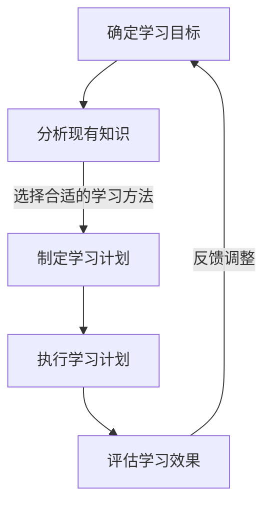
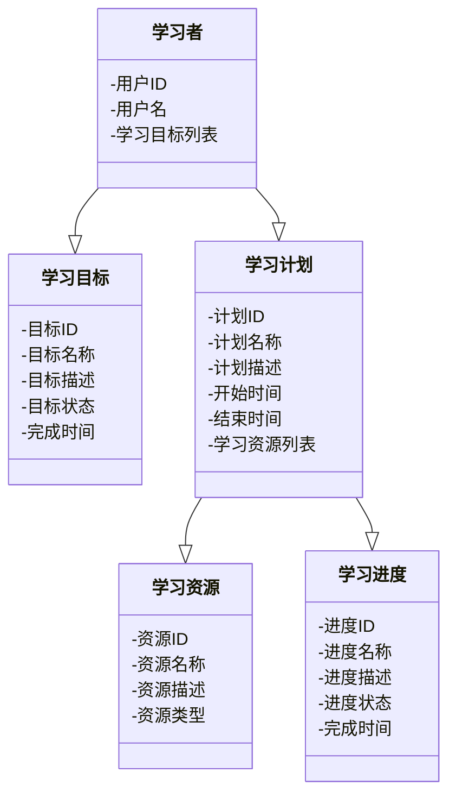
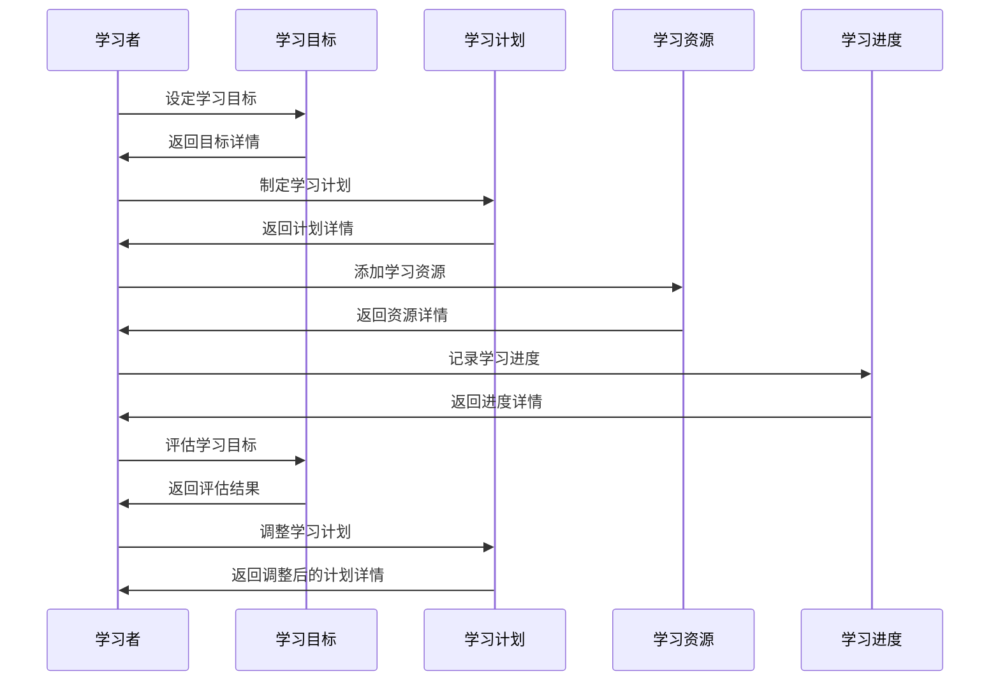
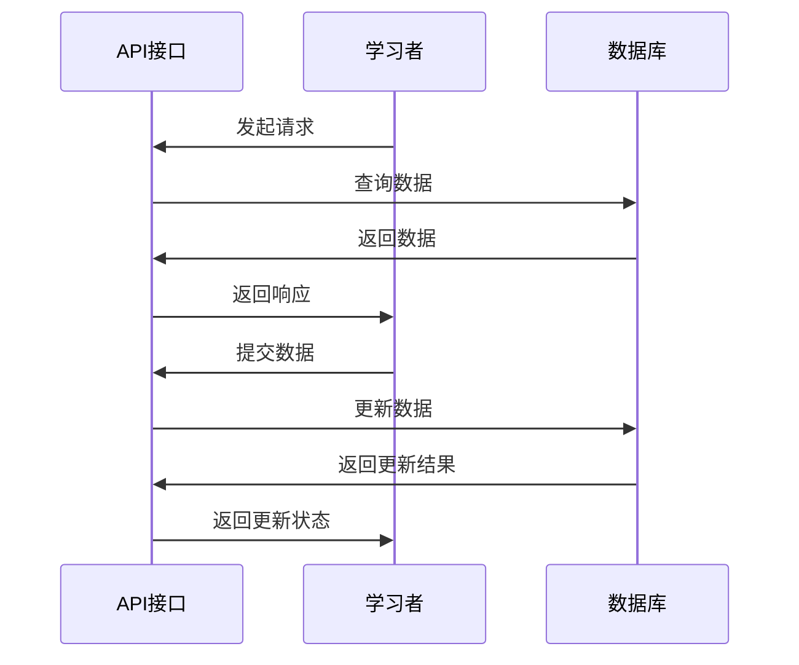

                 

### 持续学习：技术人员的终身学习策略

> 关键词：持续学习、技术人员、终身学习、学习策略、技能迁移

> 摘要：在快速发展的科技时代，持续学习对于技术人员的职业发展至关重要。本文旨在探讨技术人员的终身学习策略，帮助他们在职业生涯中不断进步，保持竞争力。

#### 第一部分：背景介绍

#### 问题背景
在当今快速发展的科技时代，持续学习已成为技术人员职业发展的关键。面对日新月异的科技浪潮，技术人员需要不断地更新自己的知识体系，以适应新的技术挑战和工作需求。

#### 问题描述
《持续学习：技术人员的终身学习策略》旨在帮助技术人员建立一套有效的学习策略，使他们能够持续地学习和成长，保持竞争力。

#### 问题解决
通过本书，读者可以了解到终身学习的必要性，掌握科学的学习方法，并学会如何将所学应用于实际工作中。

#### 边界与外延
本书主要关注技术人员的学习策略，包括但不限于编程、算法、数据分析、软件工程等领域。

#### 概念结构与核心要素组成
1. **终身学习**：指技术人员在职业生涯中持续地学习新知识、新技能。
2. **学习策略**：包括学习规划、学习方法、学习资源等多个方面。
3. **技能迁移**：将所学知识应用于实际工作中的能力。

#### 第二部分：核心概念与联系

##### 核心概念原理
1. **持续学习**：指技术人员在职业生涯中持续地学习新知识、新技能。
2. **学习策略**：包括学习规划、学习方法、学习资源等多个方面。
3. **技能迁移**：将所学知识应用于实际工作中的能力。

##### 概念属性特征对比表格

| 概念     | 属性特征                     |
|----------|-----------------------------|
| 持续学习 | 持续性、主动性、系统性       |
| 学习策略 | 目标性、适应性、效率性       |
| 技能迁移 | 实用性、适应性、创造性       |

##### ER实体关系图架构

```mermaid
erDiagram
    A[技术人员] ||--|{ B[学习规划] }|
    A ||--|{ C[学习方法] }|
    A ||--|{ D[学习资源] }|
    B ||--|{ E[学习目标] }|
    C ||--|{ F[学习方式] }|
    D ||--|{ G[学习资料] }|
```

#### 第三部分：算法原理讲解

##### 算法原理与 Mermaid 流程图
算法名称：学习策略生成算法



##### 数学模型和公式
假设学习效果评价函数为 $E(t)$，其中 $t$ 为学习时间。学习效果评价函数 $E(t)$ 可以表示为：

$$E(t) = \alpha \cdot \frac{K(t)}{T} + (1 - \alpha) \cdot L(t)$$

其中：
- $K(t)$：学习过程中掌握的新知识量。
- $L(t)$：学习过程中所付出的努力量。
- $\alpha$：平衡系数，表示掌握知识量和努力量在评价函数中的权重。

##### 详细讲解与举例说明
假设一名技术人员在学习Python编程，他每天花费2小时学习，其中1小时用于看教程，1小时用于实践编程。一周后，他掌握了20个新Python函数，并且通过实际编程项目，他感觉自己的编程能力有了明显提升。

使用上述公式计算他的学习效果：

$$E(t) = \alpha \cdot \frac{20}{7} + (1 - \alpha) \cdot 2$$

其中，$\alpha$ 可以取不同的值，以反映技术人员对掌握知识量和努力量的重视程度。例如，如果 $\alpha = 0.6$，则他的学习效果为：

$$E(t) = 0.6 \cdot \frac{20}{7} + (1 - 0.6) \cdot 2 = 2.857 + 0.8 = 3.657$$

这意味着，在一周的学习后，他的学习效果得分为3.657分。如果他的目标是每周学习效果得分达到4分，他可能需要增加学习时间或调整学习方法。

#### 第四部分：系统分析与架构设计方案

##### 问题场景介绍
一名技术人员希望设计一套系统，帮助他持续学习并管理学习过程。

##### 项目介绍
该项目命名为“终身学习管理系统（LLMS）”，旨在为技术人员提供一个综合性的学习平台，帮助他们规划学习目标、跟踪学习进度、评估学习效果，并实现知识的应用。

##### 系统功能设计（领域模型 Mermaid 类图）



##### 系统架构设计（Mermaid 架构图）



##### 系统接口设计和系统交互（Mermaid 序列图）



#### 第五部分：项目实战

##### 环境安装
在开始项目实战之前，需要安装以下环境：
1. Python 3.8+
2. virtualenv 16.0.0+
3. Flask 1.1.2+
4. SQLAlchemy 1.4.15+
5. SQLite 3.35.2+

安装命令如下：

```bash
pip install virtualenv
virtualenv venv
source venv/bin/activate
pip install flask sqlalchemy sqlite
```

##### 系统核心实现源代码
以下是系统核心实现的部分源代码：

```python
# app.py

from flask import Flask, request, jsonify
from models import User, Goal, Plan, Resource, Progress
from database import db_session

app = Flask(__name__)

@app.route('/users', methods=['POST'])
def create_user():
    data = request.get_json()
    user = User(
        username=data['username']
    )
    db_session.add(user)
    db_session.commit()
    return jsonify(user), 201

@app.route('/users/<int:user_id>/goals', methods=['POST'])
def create_goal(user_id):
    data = request.get_json()
    goal = Goal(
        user_id=user_id,
        name=data['name'],
        description=data['description'],
        status=data['status'],
        completion_time=data['completion_time']
    )
    db_session.add(goal)
    db_session.commit()
    return jsonify(goal), 201

@app.route('/users/<int:user_id>/plans', methods=['POST'])
def create_plan(user_id):
    data = request.get_json()
    plan = Plan(
        user_id=user_id,
        name=data['name'],
        description=data['description'],
        start_time=data['start_time'],
        end_time=data['end_time']
    )
    db_session.add(plan)
    db_session.commit()
    return jsonify(plan), 201

@app.route('/users/<int:user_id>/plans/<int:plan_id>/resources', methods=['POST'])
def create_resource(user_id, plan_id):
    data = request.get_json()
    resource = Resource(
        user_id=user_id,
        plan_id=plan_id,
        name=data['name'],
        description=data['description'],
        type=data['type']
    )
    db_session.add(resource)
    db_session.commit()
    return jsonify(resource), 201

@app.route('/users/<int:user_id>/plans/<int:plan_id>/progress', methods=['POST'])
def create_progress(user_id, plan_id):
    data = request.get_json()
    progress = Progress(
        user_id=user_id,
        plan_id=plan_id,
        name=data['name'],
        description=data['description'],
        status=data['status'],
        completion_time=data['completion_time']
    )
    db_session.add(progress)
    db_session.commit()
    return jsonify(progress), 201

if __name__ == '__main__':
    app.run(debug=True)
```

##### 代码应用解读与分析
上述代码实现了用户创建、目标创建、计划创建、资源创建和进度创建等功能。具体解读如下：

1. **用户创建**：通过`create_user`函数，接收用户提交的用户信息，并将其存储到数据库中。

2. **目标创建**：通过`create_goal`函数，接收用户提交的学习目标信息，并将其存储到数据库中。

3. **计划创建**：通过`create_plan`函数，接收用户提交的学习计划信息，并将其存储到数据库中。

4. **资源创建**：通过`create_resource`函数，接收用户提交的学习资源信息，并将其存储到数据库中。

5. **进度创建**：通过`create_progress`函数，接收用户提交的学习进度信息，并将其存储到数据库中。

##### 实际案例分析和详细讲解剖析
为了更好地展示系统的实际应用，我们来看一个具体的案例：

假设有一个技术人员张三，他希望通过终身学习管理系统（LLMS）来规划自己的学习进度。以下是他的操作步骤：

1. **创建用户**：
   张三通过`POST`请求向系统提交用户信息，例如用户名和张三。

   ```bash
   curl -X POST -H "Content-Type: application/json" -d '{"username": "zhangsan"}' http://localhost:5000/users
   ```

   接收到响应后，系统会返回用户ID和相关信息。

2. **创建学习目标**：
   张三通过`POST`请求向系统提交学习目标信息，例如目标名称、描述、状态和完成时间。

   ```bash
   curl -X POST -H "Content-Type: application/json" -d '{"name": "学习Python", "description": "掌握Python编程基础", "status": "进行中", "completion_time": "2024-01-01"}' http://localhost:5000/users/1/goals
   ```

   接收到响应后，系统会返回学习目标ID和相关信息。

3. **创建学习计划**：
   张三通过`POST`请求向系统提交学习计划信息，例如计划名称、描述、开始时间和结束时间。

   ```bash
   curl -X POST -H "Content-Type: application/json" -d '{"name": "Python学习计划", "description": "学习Python编程语言", "start_time": "2023-12-01", "end_time": "2024-01-31"}' http://localhost:5000/users/1/plans
   ```

   接收到响应后，系统会返回学习计划ID和相关信息。

4. **创建学习资源**：
   张三通过`POST`请求向系统提交学习资源信息，例如资源名称、描述和类型。

   ```bash
   curl -X POST -H "Content-Type: application/json" -d '{"name": "Python教程", "description": "Python入门教程", "type": "教程"}' http://localhost:5000/users/1/plans/1/resources
   ```

   接收到响应后，系统会返回学习资源ID和相关信息。

5. **创建学习进度**：
   张三通过`POST`请求向系统提交学习进度信息，例如进度名称、描述、状态和完成时间。

   ```bash
   curl -X POST -H "Content-Type: application/json" -d '{"name": "Python进度", "description": "学习进度报告", "status": "完成", "completion_time": "2024-01-15"}' http://localhost:5000/users/1/plans/1/progress
   ```

   接收到响应后，系统会返回学习进度ID和相关信息。

##### 项目小结
通过上述实际案例，我们可以看到终身学习管理系统（LLMS）在技术人员的学习管理中发挥了重要作用。它不仅帮助技术人员规划学习目标、跟踪学习进度，还实现了学习资源的整合和学习效果的评估。

#### 最佳实践 tips
1. **定期回顾**：定期回顾学习内容，巩固知识，防止遗忘。
2. **与他人交流**：与他人分享学习经验和知识，加深对知识的理解。
3. **持续实践**：将所学知识应用到实际工作中，提高解决问题的能力。
4. **保持好奇心**：对新技术保持好奇心，积极探索未知领域。

#### 小结
本文从背景介绍、核心概念与联系、算法原理讲解、系统分析与架构设计方案以及项目实战等方面，探讨了技术人员的终身学习策略。通过持续学习，技术人员可以不断提升自己的竞争力，适应快速变化的科技时代。

#### 注意事项
1. **环境安装**：确保安装了所需的Python环境和相关依赖库。
2. **数据库配置**：配置好数据库连接，确保系统能够正常存储数据。

#### 拓展阅读
1. 《深度学习：揭秘神经网络的核心原理》
2. 《软件工程：实践者的研究方法》
3. 《数据科学：方法与应用》

---

**作者：AI天才研究院/AI Genius Institute & 禅与计算机程序设计艺术 /Zen And The Art of Computer Programming**

