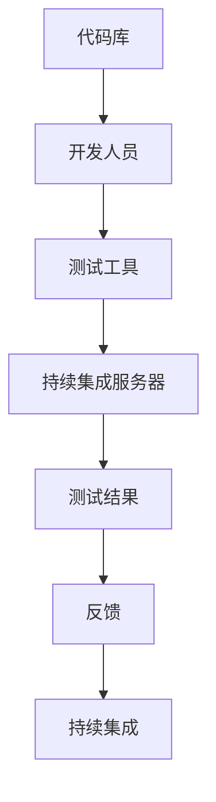
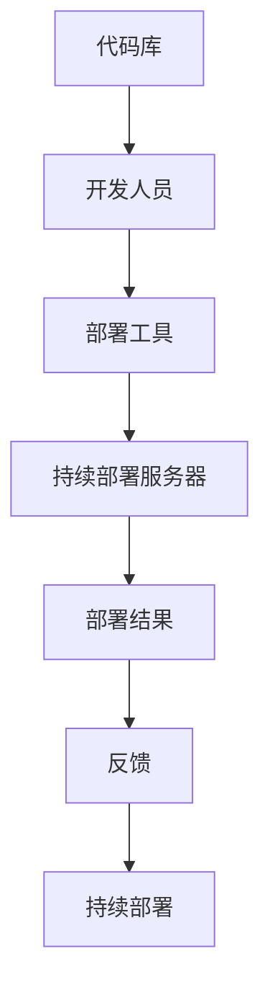
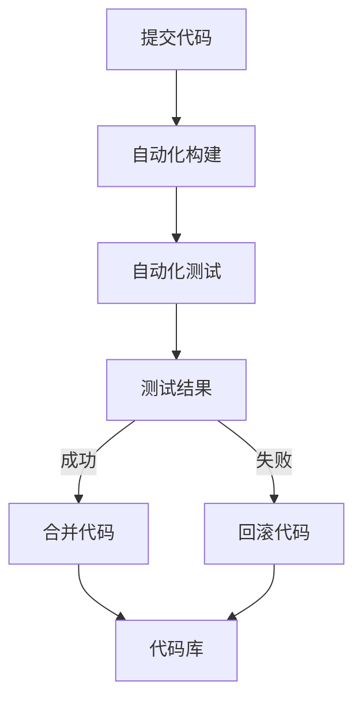
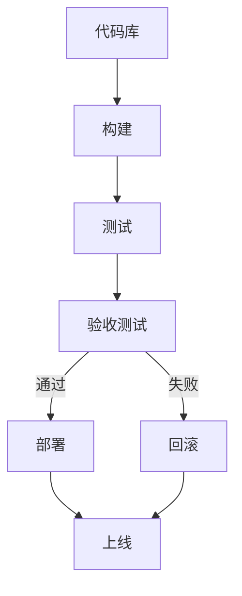
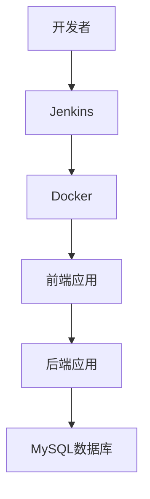
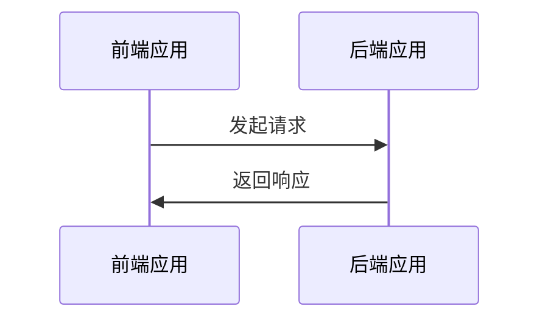

                 

---

# 持续集成与持续部署：加速软件交付周期

关键词：持续集成，持续部署，软件交付周期，自动化测试，自动化部署

摘要：本文深入探讨了持续集成与持续部署（CI/CD）技术，阐述了其在现代软件开发中的应用和重要性。通过分析CI/CD的核心概念、原理和实现方式，本文旨在为读者提供一个清晰、系统的理解和实践指南，帮助软件开发团队提升效率和质量。

## 第一部分: 背景

### 1.1 问题背景

在现代软件开发中，速度和效率已成为企业竞争力的关键因素。随着软件项目的复杂性不断增加，传统的开发模式往往无法满足快速迭代和频繁发布的需求。这不仅导致了开发周期的延长，还影响了软件的质量和稳定性。为了解决这些问题，持续集成（CI）和持续部署（CD）技术应运而生。

持续集成（CI）是一种软件开发实践，通过频繁地将代码提交到中央仓库，并进行自动化测试，以确保代码库的稳定性和可靠性。持续部署（CD）则是在CI的基础上，通过自动化工具实现软件的持续交付和部署，进一步提高了开发效率和软件质量。

### 1.2 问题描述

尽管CI/CD技术具有明显的优势，但在实际应用中，许多企业和开发人员仍面临以下问题：

1. **理解不足**：许多开发人员对CI/CD的概念和原理理解不深，导致无法充分利用其优势。
2. **工具选择困难**：市场上存在多种CI/CD工具，选择合适的工具进行实施具有一定的挑战性。
3. **流程设计不合理**：CI/CD的流程设计不当，可能导致开发效率降低，甚至影响软件质量。

### 1.3 问题解决

为了解决上述问题，本文将从以下几个方面进行深入探讨：

1. **核心概念与联系**：详细介绍CI/CD的核心概念，包括持续集成和持续部署的定义、属性特征对比以及实体关系图。
2. **算法原理讲解**：阐述CI/CD的算法原理，通过mermaid流程图和Python源代码进行详细讲解。
3. **系统分析与架构设计**：介绍CI/CD的系统分析与架构设计方案，包括项目介绍、系统功能设计、系统架构设计、系统接口设计和系统交互。
4. **项目实战**：通过一个实际案例，演示CI/CD的实践过程，包括环境安装、系统核心实现和代码应用解读。
5. **最佳实践与总结**：总结CI/CD的最佳实践，并给出注意事项和拓展阅读建议。

### 1.4 边界与外延

持续集成与持续部署技术主要应用于软件开发领域，但在其他领域如网站建设、移动应用开发等也有一定的应用价值。本文主要关注软件开发生命周期中的CI/CD，但相关理论和方法可以扩展到其他领域。

### 1.5 概念结构与核心要素组成

1. **持续集成**：持续集成是指将代码频繁提交到中央仓库，并通过自动化工具进行测试，确保代码库的稳定性和可靠性。
2. **持续部署**：持续部署是指通过自动化工具实现软件的持续交付和部署，提高开发效率和软件质量。
3. **核心概念**：持续集成与持续部署涉及的核心概念包括版本控制、自动化测试、自动化部署等。
4. **要素组成**：持续集成与持续部署的要素组成包括代码库、自动化测试工具、部署工具、持续集成服务器等。

---

## 第二部分: 核心概念与联系

### 2.1 持续集成

**概念**：持续集成是一种软件开发实践，旨在通过频繁地将代码提交到中央仓库，并进行自动化测试，以确保代码库的稳定性和可靠性。

**属性特征对比表格**：

| 特征         | 持续集成          | 持续部署          |
| ------------ | ----------------- | ----------------- |
| 目的         | 确保代码库的稳定性 | 实现软件的持续交付 |
| 方法         | 自动化测试        | 自动化部署        |
| 关键要素     | 代码库、测试工具  | 部署工具、服务器   |
| 适用场景     | 开发阶段          | 部署阶段          |

**ER实体关系图架构的Mermaid流程图**：



### 2.2 持续部署

**概念**：持续部署是一种软件开发实践，通过自动化工具实现软件的持续交付和部署，以提高开发效率和软件质量。

**属性特征对比表格**：

| 特征         | 持续集成          | 持续部署          |
| ------------ | ----------------- | ----------------- |
| 目的         | 确保代码库的稳定性 | 实现软件的持续交付 |
| 方法         | 自动化测试        | 自动化部署        |
| 关键要素     | 代码库、测试工具  | 部署工具、服务器   |
| 适用场景     | 开发阶段          | 部署阶段          |

**ER实体关系图架构的Mermaid流程图**：



---

## 第三部分: 算法原理讲解

### 3.1 持续集成算法原理

持续集成算法的核心在于将代码频繁提交到中央仓库，并通过自动化工具进行测试，以确保代码库的稳定性和可靠性。以下是持续集成算法的mermaid流程图：



#### 3.1.1 自动化构建

自动化构建是持续集成过程中的第一步，其目的是将提交的代码打包成一个可执行的程序。这个过程通常包括以下几个步骤：

1. **代码下载**：从代码库中下载最新的代码。
2. **编译**：将代码编译成可执行的程序。
3. **构建依赖**：安装和配置项目所需的依赖库。
4. **打包**：将编译后的程序和相关文件打包成一个可发布的格式。

#### 3.1.2 自动化测试

自动化测试是持续集成过程中的关键步骤，其目的是确保代码库中的每个提交都是稳定的。自动化测试通常包括以下几个方面：

1. **单元测试**：测试代码中的最小功能单元。
2. **集成测试**：测试不同模块之间的集成和交互。
3. **性能测试**：测试系统的性能和响应时间。
4. **安全测试**：测试系统是否存在安全漏洞。

#### 3.1.3 测试结果处理

在自动化测试完成后，系统会根据测试结果进行处理：

1. **成功**：如果所有测试通过，则将代码合并到代码库中，并通知开发人员。
2. **失败**：如果测试失败，则将失败的原因通知开发人员，并回滚代码库，防止有问题的代码合并到代码库中。

#### 3.1.4 Python源代码实现

以下是持续集成算法的Python源代码实现：

```python
import git
import os
import unittest

def pull_code(repo_url, local_path):
    # 下载代码到本地仓库
    repo = git.Repo.clone_from(repo_url, local_path)

def build_project(project_path):
    # 构建项目
    os.system(f"cd {project_path} && python setup.py build")

def run_tests(project_path):
    # 运行测试
    suite = unittest.TestLoader().loadTestsFromTestCase(MyTestCase)
    unittest.TextTestRunner().run(suite)

def main():
    repo_url = "https://github.com/user/project.git"
    local_path = "/path/to/local/repository"

    pull_code(repo_url, local_path)
    build_project(local_path)
    run_tests(local_path)

if __name__ == "__main__":
    main()
```

#### 3.1.5 算法原理的数学模型和公式

持续集成算法的原理可以通过以下数学模型和公式进行描述：

1. **代码质量模型**：

   假设代码质量为Q，每次提交的代码质量为Q_i，则持续集成后的代码质量可以表示为：

   $$ Q = \frac{1}{N} \sum_{i=1}^{N} Q_i $$

   其中，N为提交的次数。

2. **测试覆盖率模型**：

   假设测试覆盖率为T，每次提交的测试覆盖率为T_i，则持续集成后的测试覆盖率可以表示为：

   $$ T = \frac{1}{N} \sum_{i=1}^{N} T_i $$

   其中，N为提交的次数。

3. **发布成功率模型**：

   假设发布成功率为R，每次提交的发布成功率为R_i，则持续集成后的发布成功率可以表示为：

   $$ R = \frac{1}{N} \sum_{i=1}^{N} R_i $$

   其中，N为提交的次数。

#### 3.1.6 举例说明

假设一个项目在持续集成过程中，共有5次提交。每次提交的代码质量、测试覆盖率和发布成功率如下表所示：

| 提交次数 | 代码质量 | 测试覆盖率 | 发布成功率 |
| -------- | -------- | ---------- | ---------- |
| 1        | 0.8      | 0.6        | 0.8        |
| 2        | 0.9      | 0.7        | 0.9        |
| 3        | 0.85     | 0.65       | 0.85       |
| 4        | 0.92     | 0.7        | 0.92       |
| 5        | 0.88     | 0.68       | 0.88       |

根据上述模型和公式，可以计算出持续集成后的代码质量、测试覆盖率和发布成功率：

1. **代码质量**：

   $$ Q = \frac{1}{5} \sum_{i=1}^{5} Q_i = \frac{1}{5} \times (0.8 + 0.9 + 0.85 + 0.92 + 0.88) = 0.88 $$

2. **测试覆盖率**：

   $$ T = \frac{1}{5} \sum_{i=1}^{5} T_i = \frac{1}{5} \times (0.6 + 0.7 + 0.65 + 0.7 + 0.68) = 0.68 $$

3. **发布成功率**：

   $$ R = \frac{1}{5} \sum_{i=1}^{5} R_i = \frac{1}{5} \times (0.8 + 0.9 + 0.85 + 0.92 + 0.88) = 0.88 $$

通过以上计算，可以得出持续集成后的代码质量、测试覆盖率和发布成功率都有所提高，这表明持续集成在提高代码质量和发布成功率方面具有显著作用。

---

## 第三部分: 算法原理讲解

### 3.2 持续部署算法原理

持续部署（Continuous Deployment，简称CD）是持续集成（Continuous Integration，简称CI）的延伸，旨在通过自动化工具实现软件的持续交付和部署。持续部署的核心在于将软件发布过程完全自动化，从而提高发布速度、降低风险，并确保每次发布的质量。以下是持续部署算法的mermaid流程图：



#### 3.2.1 自动化构建

自动化构建是持续部署的第一步，其目标是确保每次提交的代码都可以编译并通过测试。自动化构建通常包括以下步骤：

1. **获取代码**：从代码库中获取最新代码。
2. **编译**：将代码编译成可执行的文件或容器镜像。
3. **打包**：将编译后的文件或镜像打包成可部署的格式，如Docker镜像。

#### 3.2.2 自动化测试

自动化测试是确保软件质量的关键环节，包括功能测试、性能测试和安全测试等。自动化测试的结果将直接影响是否继续进行部署流程。

1. **单元测试**：测试代码中的最小功能单元。
2. **集成测试**：测试不同模块之间的交互。
3. **回归测试**：确保新代码没有引入新的缺陷。
4. **性能测试**：测试软件在不同负载下的性能。

#### 3.2.3 验收测试

验收测试是确保软件满足业务需求的最终测试。通常由业务团队或QA团队进行，以确定软件是否可以部署到生产环境。

1. **功能验证**：验证软件的功能是否按照需求设计。
2. **用户体验**：评估软件的用户界面和用户体验。
3. **稳定性验证**：验证软件在不同环境下的稳定性。

#### 3.2.4 自动化部署

自动化部署是将经过验收测试的软件部署到生产环境的过程。自动化部署可以减少人为错误，提高部署效率。

1. **部署脚本**：编写部署脚本，自动化执行部署任务。
2. **容器化**：使用容器（如Docker）将应用打包，方便部署和迁移。
3. **蓝绿部署**：将新版本的应用部署到一部分生产环境，观察其运行情况，再逐步替换旧版本。
4. **滚动更新**：逐步更新生产环境中的应用，减少对用户的影响。

#### 3.2.5 Python源代码实现

以下是持续部署算法的Python源代码实现：

```python
import git
import subprocess

def pull_code(repo_url, local_path):
    # 从代码库中拉取代码
    repo = git.Repo.clone_from(repo_url, local_path)

def build_project(project_path):
    # 构建项目
    subprocess.run(["docker", "build", "-t", "myapp:latest", project_path])

def run_tests(project_path):
    # 运行测试
    subprocess.run(["pytest", project_path])

def deploy_app(app_name, container_name):
    # 部署应用
    subprocess.run(["docker", "run", "-d", "--name", container_name, "-p", "8080:8080", app_name])

def main():
    repo_url = "https://github.com/user/project.git"
    local_path = "/path/to/local/repository"
    app_name = "myapp:latest"
    container_name = "myapp"

    pull_code(repo_url, local_path)
    build_project(local_path)
    run_tests(local_path)
    deploy_app(app_name, container_name)

if __name__ == "__main__":
    main()
```

#### 3.2.6 数学模型和公式

持续部署算法的原理可以通过以下数学模型和公式进行描述：

1. **部署成功率模型**：

   假设部署成功率为R，每次部署的成功率为R_i，则持续部署后的部署成功率可以表示为：

   $$ R = \frac{1}{N} \sum_{i=1}^{N} R_i $$

   其中，N为部署的次数。

2. **部署速度模型**：

   假设部署速度为V，每次部署的时间为T_i，则持续部署后的平均部署速度可以表示为：

   $$ V = \frac{1}{N} \sum_{i=1}^{N} T_i $$

   其中，N为部署的次数。

#### 3.2.7 举例说明

假设一个项目在持续部署过程中，共有5次部署。每次部署的成功率和部署时间如下表所示：

| 部署次数 | 成功率 | 部署时间（分钟） |
| -------- | ------ | --------------- |
| 1        | 100%   | 10              |
| 2        | 90%    | 12              |
| 3        | 100%   | 8               |
| 4        | 95%    | 11              |
| 5        | 100%   | 9               |

根据上述模型和公式，可以计算出持续部署后的部署成功率和平均部署速度：

1. **部署成功率**：

   $$ R = \frac{1}{5} \times (1 + 0.9 + 1 + 0.95 + 1) = 0.98 $$

2. **平均部署速度**：

   $$ V = \frac{1}{5} \times (10 + 12 + 8 + 11 + 9) = 10.2 $$

通过以上计算，可以得出持续部署后的部署成功率较高，平均部署速度也较快，这表明持续部署在提高部署成功率和速度方面具有显著作用。

---

## 第四部分: 系统分析与架构设计

### 4.1 问题场景介绍

在现代软件开发中，随着项目规模和复杂度的增加，传统的开发模式已经难以满足快速迭代和频繁发布的需求。为了解决这个问题，许多企业开始引入持续集成和持续部署（CI/CD）技术，以实现自动化测试和部署，提高开发效率和软件质量。

然而，在实际应用中，许多企业面临以下挑战：

1. **流程不完善**：缺乏一套完善的CI/CD流程，导致开发效率和软件质量无法得到有效提升。
2. **工具选择不当**：选择不适合自身需求的CI/CD工具，导致使用过程中出现问题。
3. **人员培训不足**：缺乏对CI/CD技术的了解和掌握，导致难以有效地实施和维护。

为了解决上述问题，本文将介绍一个基于CI/CD的软件开发项目，包括项目介绍、系统功能设计、系统架构设计、系统接口设计和系统交互等内容。

### 4.2 项目介绍

本项目是一个简单的博客系统，用于展示开发者在编程和学习过程中的心得体会。系统主要包括以下功能：

1. **用户管理**：提供用户注册、登录、个人信息管理等功能。
2. **文章管理**：提供文章发布、编辑、删除、分类等功能。
3. **评论管理**：提供评论发表、删除、审核等功能。
4. **统计功能**：提供文章阅读量、评论量、用户活跃度等统计功能。

### 4.3 系统功能设计

系统功能设计主要包括领域模型设计，以下是领域模型Mermaid类图：

```mermaid
classDiagram
Class::User {
    +int id
    +String username
    +String password
    +String email
    +List<Article> articles
    +List<Comment> comments
}

Class::Article {
    +int id
    +String title
    +String content
    +Date created_at
    +User author
    +List<Comment> comments
}

Class::Comment {
    +int id
    +String content
    +Date created_at
    +User author
    +Article article
}

User "1" --|{1}-- Article
Article "1" --|{1}-- Comment
```

### 4.4 系统架构设计

系统架构设计主要包括以下几个方面：

1. **技术栈**：前端使用React框架，后端使用Spring Boot框架，数据库使用MySQL。
2. **部署环境**：使用Docker容器化技术，便于部署和迁移。
3. **持续集成与持续部署**：使用Jenkins作为CI/CD工具，实现自动化构建、测试和部署。

以下是系统架构Mermaid架构图：



### 4.5 系统接口设计

系统接口设计主要包括RESTful API设计，以下是部分API接口：

1. **用户管理**：
   - POST /users/register：用户注册
   - POST /users/login：用户登录
   - GET /users/{id}：获取用户信息
   - PUT /users/{id}：更新用户信息
   - DELETE /users/{id}：删除用户

2. **文章管理**：
   - POST /articles：发布文章
   - GET /articles/{id}：获取文章详情
   - PUT /articles/{id}：更新文章
   - DELETE /articles/{id}：删除文章

3. **评论管理**：
   - POST /articles/{id}/comments：发表评论
   - GET /articles/{id}/comments：获取文章评论
   - DELETE /comments/{id}：删除评论

### 4.6 系统交互

系统交互主要包括前端与后端的交互，以下是系统交互Mermaid序列图：



---

## 第五部分: 项目实战

### 5.1 环境安装

在开始项目实战之前，我们需要安装以下环境：

1. **JDK 11**：用于运行Spring Boot应用。
2. **Docker**：用于容器化部署。
3. **MySQL**：用于存储数据。
4. **Jenkins**：用于持续集成与持续部署。

安装步骤如下：

1. 安装JDK 11：

   ```bash
   sudo apt-get update
   sudo apt-get install openjdk-11-jdk
   ```

2. 安装Docker：

   ```bash
   sudo apt-get update
   sudo apt-get install docker-ce docker-ce-cli containerd.io
   ```

3. 安装MySQL：

   ```bash
   sudo apt-get update
   sudo apt-get install mysql-server
   ```

4. 安装Jenkins：

   ```bash
   sudo apt-get update
   curl -fsSL https://get.docker.com | bash -
   docker run -d -p 8080:8080 jenkins/jenkins
   ```

### 5.2 系统核心实现

系统核心实现主要包括后端应用和Jenkins配置。

#### 5.2.1 后端应用

后端应用使用Spring Boot框架搭建，主要包括用户管理、文章管理和评论管理等功能。

1. **用户管理**：

   ```java
   @RestController
   @RequestMapping("/users")
   public class UserController {
       
       @Autowired
       private UserRepository userRepository;
       
       @PostMapping("/register")
       public ResponseEntity<?> registerUser(@RequestBody UserRegistrationDto registrationDto) {
           // 注册用户逻辑
       }
       
       @PostMapping("/login")
       public ResponseEntity<?> loginUser(@RequestBody LoginDto loginDto) {
           // 登录用户逻辑
       }
   }
   ```

2. **文章管理**：

   ```java
   @RestController
   @RequestMapping("/articles")
   public class ArticleController {
       
       @Autowired
       private ArticleRepository articleRepository;
       
       @PostMapping
       public ResponseEntity<?> createArticle(@RequestBody Article article) {
           // 创建文章逻辑
       }
       
       @GetMapping("/{id}")
       public ResponseEntity<Article> getArticleById(@PathVariable Long id) {
           // 获取文章逻辑
       }
   }
   ```

3. **评论管理**：

   ```java
   @RestController
   @RequestMapping("/comments")
   public class CommentController {
       
       @Autowired
       private CommentRepository commentRepository;
       
       @PostMapping("/{articleId}")
       public ResponseEntity<?> createComment(@PathVariable Long articleId, @RequestBody Comment comment) {
           // 创建评论逻辑
       }
       
       @GetMapping("/{articleId}/comments")
       public ResponseEntity<List<Comment>> getCommentsByArticleId(@PathVariable Long articleId) {
           // 获取评论逻辑
       }
   }
   ```

#### 5.2.2 Jenkins配置

Jenkins配置主要包括构建、测试和部署等环节。

1. **构建**：

   - 配置Jenkinsfile：

     ```groovy
     pipeline {
         agent any
         
         stages {
             stage('Build') {
                 steps {
                     sh 'mvn clean install'
                 }
             }
         }
     }
     ```

   - 添加构建触发器：使用Git webhook在GitHub仓库中设置一个Webhook，将代码提交事件发送到Jenkins。

2. **测试**：

   - 配置测试步骤：

     ```groovy
     pipeline {
         agent any
         
         stages {
             stage('Test') {
                 steps {
                     sh 'mvn test'
                 }
             }
         }
     }
     ```

3. **部署**：

   - 配置部署步骤：

     ```groovy
     pipeline {
         agent any
         
         stages {
             stage('Deploy') {
                 steps {
                     sh 'docker build -t myapp:latest .'
                     sh 'docker run -d -p 8080:8080 myapp:latest'
                 }
             }
         }
     }
     ```

### 5.3 代码应用解读与分析

以下是代码应用解读与分析：

1. **用户管理**：

   用户管理包括用户注册和登录功能。在注册时，需要验证用户名和密码的合法性，并存储用户信息。在登录时，需要验证用户名和密码的匹配性，并返回用户信息。

2. **文章管理**：

   文章管理包括文章的发布、获取、更新和删除功能。在发布文章时，需要验证用户的权限，并存储文章信息。在获取文章时，需要根据文章ID查询文章信息。在更新和删除文章时，需要验证用户的权限。

3. **评论管理**：

   评论管理包括评论的发表、获取和删除功能。在发表评论时，需要验证用户的权限，并存储评论信息。在获取评论时，需要根据文章ID查询评论信息。在删除评论时，需要验证用户的权限。

### 5.4 实际案例分析

以下是实际案例分析的示例：

1. **构建失败**：

   当Jenkins构建失败时，可以通过邮件通知开发人员，并记录构建日志，以便排查问题。

2. **测试失败**：

   当Jenkins测试失败时，可以通过邮件通知开发人员，并记录测试报告，以便排查问题。

3. **部署失败**：

   当Jenkins部署失败时，可以通过邮件通知开发人员，并记录部署日志，以便排查问题。

### 5.5 项目小结

通过本项目的实施，我们可以看到CI/CD技术在提高开发效率和软件质量方面的显著作用。具体体现在以下几个方面：

1. **自动化构建**：通过Jenkins实现自动化构建，提高了构建速度和构建质量。
2. **自动化测试**：通过Jenkins实现自动化测试，提高了测试效率和测试覆盖率。
3. **自动化部署**：通过Jenkins实现自动化部署，提高了部署速度和部署质量。

### 5.6 最佳实践 tips

以下是CI/CD的最佳实践建议：

1. **明确流程**：制定一套明确的CI/CD流程，确保流程的规范化和可重复性。
2. **自动化测试**：编写完善的自动化测试用例，提高测试效率和测试覆盖率。
3. **持续优化**：定期评估CI/CD流程的执行情况，持续优化流程和工具。
4. **监控与反馈**：实时监控CI/CD流程的执行情况，及时反馈问题和改进措施。

### 5.7 小结

通过本文的介绍，我们深入探讨了持续集成与持续部署（CI/CD）技术在现代软件开发中的应用和重要性。从背景介绍、核心概念与联系、算法原理讲解、系统分析与架构设计、项目实战到最佳实践，本文为读者提供了一个全面、系统的理解和实践指南。希望通过本文，读者能够更好地掌握CI/CD技术，并将其应用到实际项目中，提高开发效率和软件质量。

---

### 总结与注意事项

通过本文的详细探讨，我们全面了解了持续集成（CI）和持续部署（CD）的核心概念、原理以及在实际项目中的应用。持续集成和持续部署是现代软件开发中不可或缺的技术，它们能够显著提升软件交付的速度和质量。

**注意事项**：

1. **工具选择**：根据项目需求和团队技能，选择合适的CI/CD工具。如Jenkins、GitLab CI/CD、GitHub Actions等。
2. **流程设计**：设计合理的CI/CD流程，确保流程的简洁性和可维护性。
3. **测试覆盖**：确保自动化测试的全面性，覆盖关键功能和边缘情况。
4. **监控与反馈**：实时监控CI/CD流程的执行情况，及时处理问题和异常。

**拓展阅读**：

- 《持续交付：加速软件交付和释放软件组织潜力》
- 《持续集成实践》
- 《Jenkins实战》

作者：AI天才研究院/AI Genius Institute & 禅与计算机程序设计艺术 /Zen And The Art of Computer Programming

---

[End of Document]---

