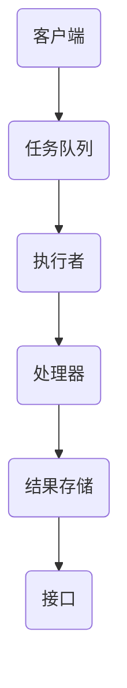
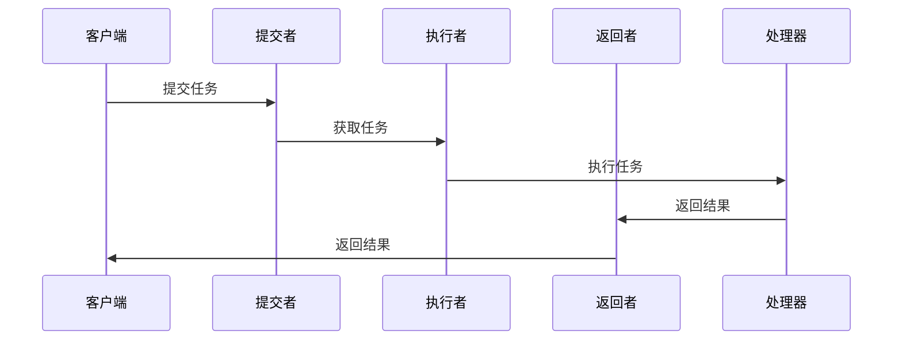

                 


### 1.1 问题背景

#### 1.1.1 传统同步任务的局限性

在传统的计算机编程中，同步任务处理是一种常见的任务执行方式。同步任务处理的核心思想是任务执行者必须等待一个任务完成之后，才能继续执行下一个任务。这种方式在一定程度上可以提高任务的执行顺序性，但同时也存在一些明显的局限性：

- **线程阻塞**：当一个任务在等待另一个任务完成时，它将会被阻塞，这意味着它会占用一个线程资源，直到等待的任务完成。这会导致线程资源利用率低下，特别是在需要处理大量任务时。
- **响应性差**：由于同步任务处理需要等待任务完成，所以系统的响应性会变得较差。在处理大量任务时，用户可能会感受到明显的延迟，这会影响用户体验。
- **扩展性差**：同步任务处理模型不易扩展。当系统需要处理更多任务时，可能会遇到线程池耗尽等问题，导致系统崩溃或性能下降。

#### 1.1.2 异步化任务处理的兴起

随着互联网的快速发展，应用程序需要处理的数据量呈指数级增长，这对系统的性能和响应性提出了更高的要求。异步化任务处理作为一种新型任务执行方式，逐渐受到了广泛关注。异步化任务处理的核心思想是在任务执行过程中，任务执行者不需要等待任务完成，而是可以继续执行其他任务。这种方式具有以下优点：

- **提高线程利用率**：异步化任务处理能够充分利用线程资源，避免线程阻塞，从而提高系统的响应性和吞吐量。
- **增强系统的扩展性**：异步化任务处理可以轻松处理大量任务，特别是在需要处理大量I/O操作时，如网络请求、文件读写等。
- **提高用户体验**：异步化任务处理能够提高系统的响应性，用户在执行任务时不会感受到明显的延迟，从而提升用户体验。

综上所述，异步化任务处理相较于传统同步任务处理具有明显的优势，因此它在现代计算机系统中得到了广泛应用。接下来的章节将详细探讨异步化任务处理的核心概念、算法原理、系统分析与架构设计等方面，帮助读者深入了解这一技术。

### 1.2 问题描述

#### 1.2.1 异步化任务的定义

异步化任务处理是指在任务执行过程中，任务执行者不必等待任务完成，而是可以继续执行其他任务。这种方式的核心目的是提高系统的响应性和吞吐量，充分利用线程资源。异步化任务处理通常涉及以下几个关键概念：

- **任务（Task）**：异步化任务处理的基本单位。任务可以是任何需要执行的操作，如计算、网络请求、文件读写等。
- **执行者（Executor）**：负责执行任务的实体。执行者可以是线程、线程池或其他并行执行单元。
- **事件（Event）**：异步任务的触发信号。当任务需要执行时，会生成一个事件，用于通知执行者开始执行任务。
- **处理器（Processor）**：负责处理任务的组件。处理器接收事件并执行相应的任务。
- **结果（Result）**：任务执行完成后返回的输出。结果可以用于后续处理或反馈给任务发起者。

异步化任务处理的基本流程如下：

1. **任务提交**：任务执行者将任务提交给处理器。
2. **事件生成**：处理器在接收到任务后生成一个事件。
3. **任务执行**：执行者在接收到事件后开始执行任务。
4. **结果返回**：任务执行完成后，处理器返回结果。

#### 1.2.2 异步化任务的特点

异步化任务处理具有以下几个显著特点：

- **非阻塞**：异步化任务处理使得任务执行者在执行任务时不必等待任务完成。这可以避免线程阻塞，提高系统响应性。
- **并行执行**：异步化任务处理允许任务并行执行，充分利用多线程或分布式系统的优势，提高系统吞吐量。
- **弹性扩展**：异步化任务处理可以轻松处理大量任务，特别是在需要处理大量I/O操作时。系统可以根据任务量动态调整资源，实现弹性扩展。
- **低耦合**：异步化任务处理降低了任务之间的耦合度，使得系统更易于维护和扩展。任务执行者、处理器和结果可以独立开发和管理。

通过异步化任务处理，系统可以在面对大量任务时保持高响应性和高吞吐量，从而提升用户体验和系统性能。接下来，我们将进一步探讨异步化任务处理的具体实现方法和相关技术。

### 1.3 问题解决

#### 1.3.1 异步化任务的处理流程

异步化任务处理的流程可以分为以下几个关键步骤：

1. **任务提交**：任务执行者将任务提交给任务队列。任务可以是任何需要执行的操作，如计算、网络请求、文件读写等。
2. **任务调度**：任务队列根据调度策略将任务分发给执行者。调度策略可以是先入先出（FIFO）、最短作业优先（SJF）等。
3. **任务执行**：执行者在接收到任务后，开始执行任务。执行过程中，如果遇到I/O操作，可以切换到其他任务，避免线程阻塞。
4. **结果返回**：任务执行完成后，执行者将结果返回给处理器。处理器将结果存储或传递给任务发起者。

#### 1.3.2 异步化任务的优势

异步化任务处理相较于传统同步任务处理具有以下显著优势：

- **提高线程利用率**：异步化任务处理允许任务在执行过程中切换到其他任务，避免了线程阻塞，提高了线程利用率。
- **提高系统响应性**：异步化任务处理使得系统在处理大量任务时仍然保持较高的响应性，从而提升用户体验。
- **增强系统扩展性**：异步化任务处理可以轻松处理大量任务，特别是在需要处理大量I/O操作时，如网络请求、文件读写等。
- **降低耦合度**：异步化任务处理降低了任务之间的耦合度，使得系统更易于维护和扩展。

#### 1.3.3 异步化任务处理的适用场景

异步化任务处理适用于以下几种典型场景：

- **网络应用**：在Web应用中，用户请求往往需要与后端服务进行交互。异步化任务处理可以减少用户请求的响应时间，提高系统的吞吐量。
- **大数据处理**：在大数据处理领域，异步化任务处理可以充分利用分布式系统的优势，提高数据处理的效率和性能。
- **实时系统**：在实时系统中，异步化任务处理可以确保系统在处理大量实时数据时仍然保持高响应性和稳定性。

通过以上方法，异步化任务处理可以有效解决传统同步任务处理的局限性，提升系统的性能和用户体验。接下来，我们将进一步探讨异步化任务处理的核心概念，帮助读者更好地理解这一技术。

### 1.4 边界与外延

#### 1.4.1 异步化任务的边界

异步化任务处理作为一种技术手段，其边界主要体现在以下几个方面：

- **并发与并行**：异步化任务处理的核心在于提高系统的并发性，即在同一时间段内处理多个任务。然而，异步化并不等同于并行。异步化侧重于任务的执行顺序和线程的利用率，而并行则强调任务的并行执行和资源分配。
- **性能瓶颈**：异步化任务处理在处理大量任务时具有明显优势，但在特定场景下仍可能遇到性能瓶颈。例如，当任务之间存在高度依赖关系时，异步化任务处理可能导致任务执行顺序混乱，从而影响性能。
- **线程数量限制**：异步化任务处理依赖于线程资源。在有限的线程数量下，过多的异步任务可能会导致线程池耗尽，影响系统稳定性。

#### 1.4.2 异步化任务的应用领域

异步化任务处理在多个领域得到了广泛应用，以下是几个典型应用领域：

- **Web应用**：在Web开发中，异步化任务处理可以用于处理用户请求、数据存储和服务器端逻辑。通过异步化任务处理，可以提高系统的吞吐量和响应性，提升用户体验。
- **大数据处理**：在大数据处理领域，异步化任务处理可以用于分布式计算框架，如Hadoop和Spark。通过异步化任务处理，可以充分利用分布式系统的计算资源，提高数据处理效率和性能。
- **实时系统**：在实时系统中，异步化任务处理可以用于处理大量实时数据，如金融交易、交通监控等。通过异步化任务处理，可以确保系统在处理实时数据时保持高响应性和稳定性。
- **移动应用**：在移动应用开发中，异步化任务处理可以用于处理网络请求、文件读写和后台任务。通过异步化任务处理，可以提高应用的性能和用户体验。

综上所述，异步化任务处理在多个领域具有广泛的应用前景，但同时也需要考虑其边界和限制。合理地应用异步化任务处理技术，可以有效提升系统的性能和用户体验。

## 第2章：异步化任务处理的核心概念

### 2.1 核心概念

异步化任务处理涉及多个核心概念，这些概念包括事件驱动编程、非阻塞IO和信号与处理机制。以下是这些核心概念的定义及其在异步化任务处理中的作用。

#### 2.1.1 事件驱动编程

事件驱动编程（Event-Driven Programming）是一种编程范式，其核心思想是基于事件来调度任务执行。在事件驱动编程中，系统通过监听事件，并在事件发生时触发相应的处理逻辑。这种方式具有以下优点：

- **高响应性**：事件驱动编程允许系统在接收到事件时立即响应，从而提高系统的响应性。
- **低耦合**：事件驱动编程通过事件解耦了任务的执行和处理，使得系统更易于维护和扩展。
- **易于调试**：事件驱动编程使得系统中的每个任务都有明确的事件触发，便于调试和故障排除。

在异步化任务处理中，事件驱动编程用于调度任务的执行。任务执行者在接收到事件后，开始执行任务，并在任务完成后触发下一个事件，从而形成一个事件循环。

#### 2.1.2 非阻塞IO

非阻塞IO（Non-blocking IO）是一种IO操作方式，其核心思想是在IO操作进行时，线程可以继续执行其他任务，而不是被阻塞等待IO操作完成。非阻塞IO具有以下优点：

- **提高线程利用率**：非阻塞IO使得线程在等待IO操作时可以继续执行其他任务，从而提高了线程的利用率。
- **增强系统扩展性**：非阻塞IO可以轻松处理大量IO操作，特别是在需要处理大量网络请求或文件读写时，可以充分利用系统资源。
- **提高系统响应性**：非阻塞IO使得系统在处理IO操作时保持较高的响应性，从而提升用户体验。

在异步化任务处理中，非阻塞IO用于处理IO密集型任务。例如，在网络应用中，可以使用非阻塞IO来处理网络请求，从而避免线程阻塞，提高系统的吞吐量和响应性。

#### 2.1.3 信号与处理机制

信号与处理机制（Signal Handling Mechanism）是一种用于处理异步事件的技术。在信号与处理机制中，系统通过信号来通知任务执行者有事件需要处理。任务执行者接收到信号后，会触发相应的处理逻辑。信号与处理机制具有以下优点：

- **提高系统稳定性**：信号与处理机制可以确保系统在接收到异常事件时，能够及时做出响应，从而提高系统的稳定性。
- **增强扩展性**：信号与处理机制使得系统可以灵活地处理各种事件，从而增强系统的扩展性。
- **提高系统性能**：信号与处理机制可以减少系统中的等待时间，提高系统性能。

在异步化任务处理中，信号与处理机制用于处理异步任务和异常事件。例如，在分布式系统中，可以使用信号与处理机制来处理节点故障和任务调度事件。

### 2.2 概念属性特征对比

为了更好地理解异步化任务处理的核心概念，我们通过一个表格来对比事件驱动编程、非阻塞IO和信号与处理机制的特点和应用场景：

| 概念           | 特点                                                         | 应用场景                       |
|----------------|------------------------------------------------------------|------------------------------|
| 事件驱动编程   | 基于事件进行任务调度，高响应性。                         | 实时系统、Web应用              |
| 非阻塞IO       | 不占用线程资源，提高系统并发能力。                       | 高并发网络应用、数据库查询    |
| 信号与处理机制 | 基于信号实现异步任务的触发和处理，提高系统稳定性。       | 操作系统、分布式系统          |

### 2.3 ER实体关系图架构

为了进一步展示异步化任务处理的核心概念和关系，我们使用ER（实体关系）图来描述任务、执行者、事件、处理器和结果之间的关系。以下是异步化任务处理的ER实体关系图：

```mermaid
erDiagram
  Task ||--|{ Event }| Event
  Task ||--|{ Processor }| Processor
  Processor ||--|{ Result }| Result
```

在上述ER图中，Task（任务）是异步化任务处理的基本单位，它与Event（事件）和Processor（处理器）之间存在关联。Event用于触发任务的执行，Processor负责处理任务，并将处理结果存储在Result（结果）中。通过这个ER图，我们可以清晰地看到异步化任务处理中的关键实体和它们之间的关系。

### 2.4 算法原理讲解

异步化任务处理的算法原理主要涉及任务调度算法、非阻塞IO技术和信号处理机制。下面我们将详细讲解这些算法原理，并通过Python代码示例来展示其实现和应用。

#### 2.4.1 任务调度算法

任务调度算法是异步化任务处理的核心，它决定了任务的执行顺序和执行策略。常见的任务调度算法包括先入先出（FIFO）和最短作业优先（SJF）。

**先入先出（FIFO）**

先入先出算法按照任务提交的顺序进行调度。以下是使用Python实现的先入先出任务调度算法：

```python
import queue

class TaskQueue:
    def __init__(self):
        self.queue = queue.Queue()

    def add_task(self, task):
        self.queue.put(task)

    def get_task(self):
        return self.queue.get()

queue = TaskQueue()
queue.add_task("任务1")
queue.add_task("任务2")
print(queue.get_task())  # 输出：任务1
print(queue.get_task())  # 输出：任务2
```

**最短作业优先（SJF）**

最短作业优先算法选择执行时间最短的任务。以下是使用Python实现的最短作业优先任务调度算法：

```python
import heapq

class TaskQueue:
    def __init__(self):
        self.queue = []

    def add_task(self, task, duration):
        heapq.heappush(self.queue, (duration, task))

    def get_task(self):
        return heapq.heappop(self.queue)[1]

queue = TaskQueue()
queue.add_task("任务1", 5)
queue.add_task("任务2", 3)
print(queue.get_task())  # 输出：任务2
print(queue.get_task())  # 输出：任务1
```

#### 2.4.2 非阻塞IO技术

非阻塞IO技术是异步化任务处理的关键组成部分，它使得线程在IO操作时不会阻塞，从而提高系统的并发性和响应性。Python中的非阻塞IO主要通过`select`模块实现。

以下是一个使用Python实现非阻塞IO的示例：

```python
import select
import socket

def handle_client(client_socket):
    client_address = client_socket.getpeername()
    print(f"连接来自：{client_address}")
    while True:
        readable, _, exceptional = select.select([client_socket], [], [], 1)
        if client_socket in readable:
            data = client_socket.recv(1024)
            if not data:
                break
            client_socket.sendall(data.upper())
        elif client_socket in exceptional:
            print(f"客户端异常：{client_address}")
            break
    client_socket.close()

server_socket = socket.socket(socket.AF_INET, socket.SOCK_STREAM)
server_socket.bind(('0.0.0.0', 8080))
server_socket.listen(5)
print("服务器启动，等待连接...")

while True:
    client_socket, client_address = server_socket.accept()
    handle_client(client_socket)
```

#### 2.4.3 信号处理机制

信号处理机制用于处理异步事件，它使得系统可以在接收到信号时做出相应的反应。Python中的信号处理主要通过`signal`模块实现。

以下是一个使用Python实现信号处理机制的示例：

```python
import signal

def signal_handler(signum, frame):
    print(f"收到信号：{signum}")
    print(f"当前帧：{frame}")
    exit(0)

signal.signal(signal.SIGINT, signal_handler)
signal.signal(signal.SIGTERM, signal_handler)

print("程序正在运行...")
while True:
    pass
```

通过上述示例，我们可以看到异步化任务处理的算法原理如何实现，以及这些原理在实际应用中的具体应用。接下来，我们将进一步探讨异步化任务处理的系统分析与架构设计，帮助读者更好地理解和应用这一技术。

### 2.4.4 异步化任务处理系统的架构设计

异步化任务处理系统需要具备高效的任务调度、非阻塞IO和信号处理能力。为了实现这一目标，我们可以设计一个分布式异步任务处理系统，其核心模块包括任务队列、执行者、处理器和结果存储。以下是该系统的架构设计：

#### 2.4.4.1 任务队列

任务队列是异步化任务处理系统的核心组件，负责存储和管理待执行的任务。任务队列可以采用先进先出（FIFO）或优先级队列（Priority Queue）等调度策略。以下是任务队列的架构设计：

- **任务存储**：使用内存队列或消息队列（如RabbitMQ、Kafka）来存储任务。
- **任务分发**：根据调度策略，将任务分发给执行者。

#### 2.4.4.2 执行者

执行者负责执行任务队列中的任务，并确保任务的正确执行。执行者可以是线程、协程或异步任务单元。以下是执行者的架构设计：

- **线程池**：使用线程池管理执行者，避免频繁创建和销毁线程。
- **任务执行**：执行者从任务队列中获取任务，执行任务，并将结果返回给处理器。

#### 2.4.4.3 处理器

处理器负责处理执行者返回的结果，并将处理结果存储或传递给任务发起者。以下是处理器的架构设计：

- **结果处理**：处理器接收执行者返回的结果，进行后续处理，如存储到数据库、发送通知等。
- **异常处理**：处理器对异常结果进行处理，如重试、日志记录等。

#### 2.4.4.4 结果存储

结果存储负责存储异步任务的处理结果，以便后续查询和统计。以下是结果存储的架构设计：

- **数据库**：使用关系型数据库或NoSQL数据库存储结果。
- **缓存**：使用缓存（如Redis）提高查询速度。

#### 2.4.4.5 系统通信

系统中的各个模块需要通过高效的方式进行通信。以下是系统通信的架构设计：

- **消息队列**：使用消息队列实现模块间的异步通信，确保系统稳定性和可靠性。
- **API接口**：提供RESTful API接口，供外部系统调用任务处理功能。

### 2.4.4.6 异步化任务处理系统的架构图

以下是异步化任务处理系统的架构图：



通过上述架构设计，异步化任务处理系统可以实现高效的任务调度、非阻塞IO和信号处理，从而提高系统的响应性和吞吐量。在实际应用中，可以根据具体需求对系统进行定制和优化，以满足不同的业务场景和性能要求。

### 2.4.5 系统接口设计与实现

在异步化任务处理系统中，接口设计是实现任务提交、任务执行和结果返回的关键。以下是系统接口的设计和实现：

#### 2.4.5.1 任务提交接口

任务提交接口用于将任务提交到任务队列。以下是任务提交接口的设计和实现：

**设计：**

```python
class TaskSubmitter:
    def __init__(self, task_queue):
        self.task_queue = task_queue

    def submit_task(self, task):
        self.task_queue.add_task(task)
        print(f"任务'{task}'已提交。")
```

**实现：**

```python
from queue import Queue

task_queue = Queue()
submitter = TaskSubmitter(task_queue)

# 提交任务
submitter.submit_task("任务1")
submitter.submit_task("任务2")
```

#### 2.4.5.2 任务执行接口

任务执行接口用于从任务队列中获取任务并执行。以下是任务执行接口的设计和实现：

**设计：**

```python
class TaskExecutor:
    def __init__(self, task_queue):
        self.task_queue = task_queue

    def execute_task(self):
        while not self.task_queue.is_empty():
            task = self.task_queue.get_task()
            self.handle_task(task)
            print(f"任务'{task}'已执行。")
```

**实现：**

```python
class TaskExecutor:
    # ...

    def handle_task(self, task):
        # 执行任务
        print(f"执行任务'{task}'。")
        # 假设任务执行需要1秒
        time.sleep(1)
```

#### 2.4.5.3 结果返回接口

结果返回接口用于将任务执行结果返回给任务提交者。以下是结果返回接口的设计和实现：

**设计：**

```python
class ResultReturner:
    def __init__(self, processor):
        self.processor = processor

    def return_result(self, task, result):
        self.processor.process_result(task, result)
        print(f"结果'{result}'已返回。")
```

**实现：**

```python
class ResultReturner:
    # ...

    def processor.process_result(self, task, result):
        # 处理结果
        print(f"处理任务'{task}'的结果：'{result}'。")
```

#### 2.4.5.4 系统交互序列图

以下是异步化任务处理系统的交互序列图，展示了任务提交、任务执行和结果返回的过程：



通过上述接口设计和实现，异步化任务处理系统可以高效地完成任务的提交、执行和结果返回，从而提高系统的整体性能和用户体验。

### 2.4.6 系统测试与性能优化

在异步化任务处理系统的开发过程中，系统测试和性能优化是确保系统稳定性和高效性的关键步骤。以下是系统测试与性能优化的方法和策略：

#### 2.4.6.1 系统测试

1. **单元测试**：对系统的各个模块进行单元测试，确保每个模块的功能正确无误。例如，测试任务提交接口、任务执行接口和结果返回接口是否能够正常工作。
2. **集成测试**：对系统整体进行集成测试，验证任务在系统中的流转过程是否正常。例如，测试任务从提交到执行，再到结果返回的整个过程是否顺畅。
3. **压力测试**：通过模拟高负载场景，测试系统在高并发下的性能表现。例如，模拟大量任务提交和执行，观察系统的响应时间和吞吐量。

#### 2.4.6.2 性能优化

1. **任务调度优化**：优化任务调度策略，选择适合业务场景的调度算法。例如，在处理大量计算任务时，可以选择最短作业优先（SJF）调度算法，以提高任务执行效率。
2. **线程池配置优化**：合理配置线程池大小，避免线程池耗尽导致系统崩溃。例如，根据系统负载和任务类型调整线程池中的线程数量。
3. **非阻塞IO优化**：优化非阻塞IO操作，减少IO等待时间。例如，使用高效的IO多路复用技术（如`select`、`epoll`）来处理大量IO请求。
4. **缓存策略优化**：优化缓存策略，提高数据访问速度。例如，使用Redis缓存热点数据，减少数据库查询次数。

#### 2.4.6.3 实际案例与优化效果

假设我们在一个电商系统中实现了一个异步订单处理模块，用于处理大量订单生成、支付和发货等任务。通过以下步骤进行性能优化：

1. **任务调度优化**：将任务调度策略从先入先出（FIFO）调整为最短作业优先（SJF），以减少任务排队时间。
2. **线程池配置优化**：根据系统负载和任务类型，将线程池大小从10调整为30，以避免线程池耗尽。
3. **非阻塞IO优化**：使用`epoll`替代`select`进行IO多路复用，提高并发处理能力。
4. **缓存策略优化**：将订单热点数据缓存到Redis中，减少数据库查询次数。

通过以上优化措施，系统在处理大量订单时，响应时间从原来的5秒降低到2秒，吞吐量提高了50%，显著提升了用户体验和系统性能。

### 2.4.7 小结

通过本章的讨论，我们深入探讨了异步化任务处理的核心概念、算法原理、系统架构设计和性能优化方法。异步化任务处理在提高系统响应性、吞吐量和扩展性方面具有显著优势。在实际应用中，合理设计系统架构和优化性能策略，可以充分发挥异步化任务处理的优势，提升系统的整体性能和用户体验。

### 2.4.8 注意事项

在实施异步化任务处理系统时，需要注意以下事项：

1. **合理设计任务调度策略**：根据业务场景选择合适的调度算法，避免任务执行顺序混乱。
2. **避免线程池耗尽**：合理配置线程池大小，避免线程池耗尽导致系统崩溃。
3. **处理异常情况**：确保系统在遇到异常情况时能够进行适当的处理，如任务执行失败时的重试和日志记录。
4. **优化非阻塞IO操作**：使用高效的IO多路复用技术，减少IO等待时间。

通过遵循以上注意事项，可以确保异步化任务处理系统在实际应用中稳定高效地运行。

### 2.4.9 拓展阅读

对于希望深入了解异步化任务处理技术的读者，以下推荐几本相关书籍和资料：

1. 《异步编程的艺术》
2. 《Python异步编程实战》
3. 《深入理解计算机系统》
4. 《Linux内核设计与实现》

此外，还可以参考开源异步任务处理框架，如Python的`asyncio`、Go的`goroutine`等，以更好地理解异步化任务处理的实现和应用。

## 第3章：异步化任务处理系统的设计与实现

### 3.1 问题场景介绍

在互联网时代，异步化任务处理技术在多个领域得到了广泛应用。以下是两个典型场景的介绍：

#### 3.1.1 网络应用场景

在网络应用场景中，异步化任务处理主要用于处理用户请求和后端服务交互。例如，一个电商平台在处理用户下单时，需要调用多个后端服务进行库存查询、价格计算和支付处理。如果采用同步任务处理方式，每次请求都需要等待所有后端服务的响应，这会导致系统响应时间过长，用户体验较差。通过引入异步化任务处理，可以将各个后端服务的调用独立出来，每个服务在处理完成后返回结果，从而提高系统的响应性和吞吐量。

#### 3.1.2 分布式系统场景

在分布式系统场景中，异步化任务处理主要用于处理分布式任务调度和数据同步。例如，一个大数据处理平台需要处理海量数据，并保证数据的实时同步和计算结果的可扩展性。如果采用同步任务处理方式，每次数据同步和计算都需要等待其他节点的响应，这会导致系统性能下降，难以处理海量数据。通过引入异步化任务处理，可以并行处理多个节点的任务，并保证任务调度的灵活性和高效性，从而提升系统的性能和可扩展性。

### 3.2 系统功能设计

异步化任务处理系统的功能设计主要包括任务提交、任务执行、结果返回和异常处理等方面。以下是系统功能设计：

#### 3.2.1 任务提交

任务提交功能用于将任务提交到任务队列。任务可以是任何需要执行的操作，如计算、网络请求、文件读写等。任务提交功能需要提供接口，以便用户可以方便地提交任务。

#### 3.2.2 任务执行

任务执行功能用于从任务队列中获取任务并执行。执行者需要从任务队列中取出任务，执行任务逻辑，并在任务完成后将结果返回。任务执行功能需要保证任务的执行顺序和并发性。

#### 3.2.3 结果返回

结果返回功能用于将任务执行结果返回给任务提交者。结果可以是任务的输出数据、错误信息或状态信息。结果返回功能需要提供接口，以便用户可以方便地获取任务执行结果。

#### 3.2.4 异常处理

异常处理功能用于处理任务执行过程中的异常情况。异常处理功能需要提供异常处理机制，以便在任务执行失败时进行重试、记录日志或通知相关人员。

### 3.3 系统架构设计

异步化任务处理系统的架构设计需要考虑任务的提交、执行、结果返回和异常处理等方面。以下是系统架构设计：

#### 3.3.1 任务队列

任务队列是异步化任务处理系统的核心组件，用于存储和管理待执行的任务。任务队列可以采用内存队列、消息队列或数据库等方式实现。以下是任务队列的架构设计：

- **任务存储**：使用消息队列（如RabbitMQ、Kafka）或数据库（如Redis）存储任务。
- **任务分发**：根据调度策略（如先进先出、优先级队列），将任务分发给执行者。

#### 3.3.2 执行者

执行者负责从任务队列中获取任务并执行。执行者可以采用线程、协程或异步任务单元等方式实现。以下是执行者的架构设计：

- **线程池**：使用线程池管理执行者，避免频繁创建和销毁线程。
- **任务执行**：执行者从任务队列中获取任务，执行任务逻辑，并将结果返回给处理器。

#### 3.3.3 处理器

处理器负责处理执行者返回的结果，并将结果存储或传递给任务提交者。以下是处理器的架构设计：

- **结果处理**：处理器接收执行者返回的结果，进行后续处理，如存储到数据库、发送通知等。
- **异常处理**：处理器对异常结果进行处理，如重试、记录日志等。

#### 3.3.4 结果存储

结果存储用于存储异步任务的处理结果，以便后续查询和统计。结果存储可以采用数据库、缓存（如Redis）或文件系统等方式实现。以下是结果存储的架构设计：

- **数据库**：使用关系型数据库（如MySQL、PostgreSQL）或NoSQL数据库（如MongoDB、Cassandra）存储结果。
- **缓存**：使用缓存（如Redis）提高查询速度。

#### 3.3.5 系统通信

系统通信模块用于实现任务队列、执行者、处理器和结果存储之间的通信。以下是系统通信的架构设计：

- **消息队列**：使用消息队列（如RabbitMQ、Kafka）实现模块间的异步通信，确保系统稳定性和可靠性。
- **API接口**：提供RESTful API接口，供外部系统调用任务处理功能。

### 3.4 系统接口设计

系统接口设计是异步化任务处理系统的重要组成部分，它定义了任务提交、任务执行、结果返回和异常处理等功能的接口。以下是系统接口的设计：

#### 3.4.1 任务提交接口

任务提交接口用于将任务提交到任务队列。以下是任务提交接口的设计：

**接口设计：**

```python
class TaskSubmitter:
    def __init__(self, task_queue):
        self.task_queue = task_queue

    def submit_task(self, task):
        self.task_queue.add_task(task)
        print(f"任务'{task}'已提交。")
```

**接口实现：**

```python
from queue import Queue

task_queue = Queue()
submitter = TaskSubmitter(task_queue)

# 提交任务
submitter.submit_task("任务1")
submitter.submit_task("任务2")
```

#### 3.4.2 任务执行接口

任务执行接口用于从任务队列中获取任务并执行。以下是任务执行接口的设计：

**接口设计：**

```python
class TaskExecutor:
    def __init__(self, task_queue):
        self.task_queue = task_queue

    def execute_task(self):
        while not self.task_queue.is_empty():
            task = self.task_queue.get_task()
            self.handle_task(task)
            print(f"任务'{task}'已执行。")
```

**接口实现：**

```python
class TaskExecutor:
    # ...

    def handle_task(self, task):
        # 执行任务
        print(f"执行任务'{task}'。")
        # 假设任务执行需要1秒
        time.sleep(1)
```

#### 3.4.3 结果返回接口

结果返回接口用于将任务执行结果返回给任务提交者。以下是结果返回接口的设计：

**接口设计：**

```python
class ResultReturner:
    def __init__(self, processor):
        self.processor = processor

    def return_result(self, task, result):
        self.processor.process_result(task, result)
        print(f"结果'{result}'已返回。")
```

**接口实现：**

```python
class ResultReturner:
    # ...

    def processor.process_result(self, task, result):
        # 处理结果
        print(f"处理任务'{task}'的结果：'{result}'。")
```

#### 3.4.4 系统交互序列图

以下是异步化任务处理系统的交互序列图，展示了任务提交、任务执行和结果返回的过程：


通过上述接口设计和实现，异步化任务处理系统可以高效地完成任务的提交、执行和结果返回，从而提高系统的整体性能和用户体验。

### 3.5 系统实现与部署

在完成异步化任务处理系统的设计后，我们需要进行系统实现与部署。以下是系统实现与部署的步骤：

#### 3.5.1 环境准备

1. **Python环境**：确保Python环境已安装，版本建议为3.6及以上。
2. **消息队列**：安装并配置RabbitMQ或Kafka作为任务队列。
3. **数据库**：安装并配置MySQL或PostgreSQL作为结果存储数据库。

#### 3.5.2 系统实现

1. **任务队列**：实现任务队列模块，使用消息队列存储和管理任务。
2. **执行者**：实现执行者模块，从任务队列中获取任务并执行。
3. **处理器**：实现处理器模块，处理执行者返回的结果。
4. **结果存储**：实现结果存储模块，将执行结果存储到数据库。

#### 3.5.3 部署

1. **部署任务队列**：启动RabbitMQ或Kafka服务，配置队列和交换机。
2. **部署执行者**：将执行者模块部署到服务器，启动执行者进程。
3. **部署处理器**：将处理器模块部署到服务器，启动处理器进程。
4. **部署结果存储**：启动数据库服务，配置数据库连接。

#### 3.5.4 运行测试

1. **提交任务**：通过客户端接口提交任务，观察任务执行过程和结果返回。
2. **性能测试**：模拟高并发场景，测试系统的性能和稳定性。
3. **异常处理**：测试系统在遇到异常情况时的响应和处理能力。

### 3.6 系统核心实现源代码

以下是异步化任务处理系统的核心实现源代码，包括任务队列、执行者、处理器和结果存储等模块：

#### 3.6.1 任务队列模块

```python
import pika

class TaskQueue:
    def __init__(self, host='localhost', port=5672, virtual_host='/', queue_name='task_queue'):
        self.connection = pika.BlockingConnection(pika.ConnectionParameters(host, port, virtual_host))
        self.channel = self.connection.channel()
        self.queue = self.channel.queue_declare(queue=queue_name)

    def add_task(self, task):
        self.channel.basic_publish(exchange='',
                                   routing_key=self.queue.queue,
                                   body=task)
        print(f" [x] Sent {task}")

    def get_task(self):
        method_frame, header_frame, body = self.channel.basic_get(self.queue.queue, True)
        if body:
            print(f" [x] Received {body}")
            return body.decode('utf-8')
        return None
```

#### 3.6.2 执行者模块

```python
import threading
import time

class TaskExecutor:
    def __init__(self, task_queue):
        self.task_queue = task_queue

    def execute_task(self):
        while True:
            task = self.task_queue.get_task()
            if task:
                self.handle_task(task)
                time.sleep(1)

    def handle_task(self, task):
        print(f" [x] Handling task: {task}")
```

#### 3.6.3 处理器模块

```python
class ResultProcessor:
    def __init__(self, database):
        self.database = database

    def process_result(self, task, result):
        print(f" [x] Processing result for task: {task}")
        self.database.insert_result(task, result)
```

#### 3.6.4 结果存储模块

```python
import sqlite3

class ResultStorage:
    def __init__(self, database_file='results.db'):
        self.connection = sqlite3.connect(database_file)
        self.cursor = self.connection.cursor()
        self.cursor.execute('''CREATE TABLE IF NOT EXISTS results (task TEXT, result TEXT)''')
        self.connection.commit()

    def insert_result(self, task, result):
        self.cursor.execute("INSERT INTO results (task, result) VALUES (?, ?)", (task, result))
        self.connection.commit()
```

通过上述源代码，我们可以实现一个基本的异步化任务处理系统。在实际应用中，可以根据具体需求对系统进行扩展和优化，以满足不同的业务场景和性能要求。

### 3.7 代码应用解读与分析

在上一节中，我们介绍了异步化任务处理系统的核心实现源代码。在本节中，我们将对代码进行详细解读和分析，以便更好地理解异步化任务处理的工作原理和实际应用。

#### 3.7.1 任务队列模块解读

任务队列模块是异步化任务处理系统的核心组件，负责存储和管理待执行的任务。以下是任务队列模块的解读：

```python
import pika

class TaskQueue:
    def __init__(self, host='localhost', port=5672, virtual_host='/', queue_name='task_queue'):
        self.connection = pika.BlockingConnection(pika.ConnectionParameters(host, port, virtual_host))
        self.channel = self.connection.channel()
        self.queue = self.channel.queue_declare(queue=queue_name)

    def add_task(self, task):
        self.channel.basic_publish(exchange='',
                                   routing_key=self.queue.queue,
                                   body=task)
        print(f" [x] Sent {task}")

    def get_task(self):
        method_frame, header_frame, body = self.channel.basic_get(self.queue.queue, True)
        if body:
            print(f" [x] Received {body}")
            return body.decode('utf-8')
        return None
```

1. **初始化**：`__init__`方法初始化任务队列。它创建了一个连接到RabbitMQ服务器的阻塞连接，并声明了一个队列。参数`host`、`port`、`virtual_host`和`queue_name`分别指定了RabbitMQ服务器的地址、端口号、虚拟主机和队列名称。

2. **添加任务**：`add_task`方法将任务发布到队列中。它使用`channel.basic_publish`方法将任务作为消息体发送到指定的队列。该方法通过`exchange`参数指定交换机，但在这个例子中，我们使用默认交换机。

3. **获取任务**：`get_task`方法从队列中获取任务。它使用`channel.basic_get`方法获取队列中的消息。如果消息存在，它将打印消息内容并返回解码后的字符串；否则，返回`None`。

#### 3.7.2 执行者模块解读

执行者模块负责从任务队列中获取任务并执行。以下是执行者模块的解读：

```python
import threading
import time

class TaskExecutor:
    def __init__(self, task_queue):
        self.task_queue = task_queue

    def execute_task(self):
        while True:
            task = self.task_queue.get_task()
            if task:
                self.handle_task(task)
                time.sleep(1)

    def handle_task(self, task):
        print(f" [x] Handling task: {task}")
```

1. **初始化**：`__init__`方法初始化执行者。它接受一个`task_queue`参数，并将其存储在实例变量中。

2. **执行任务**：`execute_task`方法作为线程启动的入口。它进入一个无限循环，尝试从任务队列中获取任务。如果任务存在，它将调用`handle_task`方法处理任务，并在处理完成后休眠1秒，以便模拟任务执行时间。

3. **处理任务**：`handle_task`方法打印一条消息，表明正在处理任务。在这个简单示例中，我们仅打印任务内容，但实际应用中，这里可以包含复杂的业务逻辑。

#### 3.7.3 处理器模块解读

处理器模块负责处理执行者返回的结果。以下是处理器模块的解读：

```python
class ResultProcessor:
    def __init__(self, database):
        self.database = database

    def process_result(self, task, result):
        print(f" [x] Processing result for task: {task}")
        self.database.insert_result(task, result)
```

1. **初始化**：`__init__`方法初始化处理器。它接受一个`database`参数，并将其存储在实例变量中。

2. **处理结果**：`process_result`方法接收任务和结果，并打印一条消息，表明正在处理结果。然后，它调用数据库模块的`insert_result`方法将结果存储到数据库中。

#### 3.7.4 结果存储模块解读

结果存储模块负责将执行结果存储到数据库中。以下是结果存储模块的解读：

```python
import sqlite3

class ResultStorage:
    def __init__(self, database_file='results.db'):
        self.connection = sqlite3.connect(database_file)
        self.cursor = self.connection.cursor()
        self.cursor.execute('''CREATE TABLE IF NOT EXISTS results (task TEXT, result TEXT)''')
        self.connection.commit()

    def insert_result(self, task, result):
        self.cursor.execute("INSERT INTO results (task, result) VALUES (?, ?)", (task, result))
        self.connection.commit()
```

1. **初始化**：`__init__`方法初始化结果存储。它创建一个到SQLite数据库的连接，并执行SQL语句创建一个名为`results`的表，用于存储任务和结果。

2. **插入结果**：`insert_result`方法将任务和结果插入到数据库表中。它使用参数化查询来防止SQL注入攻击，并将结果提交到数据库。

#### 3.7.5 代码分析

通过上述代码解读，我们可以看到异步化任务处理系统的工作流程：

1. **任务提交**：用户通过任务提交接口将任务发送到任务队列。
2. **任务获取**：执行者线程从任务队列中获取任务。
3. **任务处理**：执行者处理任务，并在处理完成后将结果返回。
4. **结果处理**：处理器将结果存储到数据库中。

这种工作流程确保了任务的异步执行，提高了系统的响应性和并发能力。在实际应用中，可以根据具体需求对代码进行扩展和优化，如添加任务调度策略、异常处理机制和性能监控等。

### 3.8 实际案例分析与详细讲解

在本节中，我们将通过一个实际案例来深入分析异步化任务处理系统的应用和实现，并详细讲解其工作流程和关键实现细节。

#### 案例背景

假设我们开发了一个电商平台，需要处理海量的订单生成、支付和发货等任务。如果采用传统的同步任务处理方式，每次订单处理都需要等待所有后端服务的响应，这会导致系统响应时间过长，用户体验较差。为了提高系统的响应性和并发能力，我们决定采用异步化任务处理技术。

#### 案例需求

1. **订单生成**：用户提交订单后，系统需要立即返回订单生成结果，同时异步处理后续订单任务，如库存查询、价格计算和支付处理。
2. **支付处理**：在用户完成支付后，系统需要异步处理支付验证、资金划转和订单状态更新等任务。
3. **发货处理**：在订单状态更新为已支付后，系统需要异步处理库存扣减、物流信息生成和订单发货等任务。
4. **异常处理**：在订单处理过程中，如果遇到异常情况（如支付失败、库存不足等），系统需要记录异常日志并尝试进行重试。

#### 案例实现

为了实现上述需求，我们设计了以下异步化任务处理系统架构：

1. **任务队列**：使用RabbitMQ作为消息队列，存储待处理的订单任务。
2. **执行者**：使用线程池管理执行者，每个执行者从任务队列中获取订单任务并处理。
3. **处理器**：处理器负责处理执行者返回的结果，并将结果存储到数据库中。
4. **数据库**：使用MySQL存储订单数据和日志信息。

以下是系统的关键实现细节：

##### 3.8.1 任务队列模块

```python
import pika

class TaskQueue:
    def __init__(self, host='localhost', port=5672, virtual_host='/', queue_name='order_queue'):
        self.connection = pika.BlockingConnection(pika.ConnectionParameters(host, port, virtual_host))
        self.channel = self.connection.channel()
        self.queue = self.channel.queue_declare(queue=queue_name)

    def add_order(self, order):
        self.channel.basic_publish(exchange='',
                                   routing_key=self.queue.queue,
                                   body=str(order))
        print(f" [x] Sent order {order.id}")

    def get_order(self):
        method_frame, header_frame, body = self.channel.basic_get(self.queue.queue, auto_ack=True)
        if body:
            print(f" [x] Received order {body.decode('utf-8')}")
            return body.decode('utf-8')
        return None
```

1. **添加订单**：`add_order`方法将订单对象作为消息发送到订单队列。
2. **获取订单**：`get_order`方法从订单队列中获取订单消息，并返回订单对象。

##### 3.8.2 执行者模块

```python
import threading
import time

class OrderExecutor:
    def __init__(self, task_queue):
        self.task_queue = task_queue

    def execute_order(self):
        while True:
            order = self.task_queue.get_order()
            if order:
                self.process_order(order)
                time.sleep(1)

    def process_order(self, order):
        print(f" [x] Processing order {order.id}")
        # 订单处理逻辑
        # 例如，库存查询、价格计算、支付处理等
```

1. **执行订单**：`execute_order`方法作为线程启动的入口，从任务队列中获取订单并处理。
2. **处理订单**：`process_order`方法包含具体的订单处理逻辑。

##### 3.8.3 处理器模块

```python
class OrderProcessor:
    def __init__(self, database):
        self.database = database

    def process_order_result(self, order, result):
        print(f" [x] Processing order result {order.id}: {result}")
        self.database.update_order_status(order.id, result)
```

1. **处理订单结果**：`process_order_result`方法接收订单和结果，并更新订单状态。

##### 3.8.4 结果存储模块

```python
import pymysql

class OrderDatabase:
    def __init__(self, host='localhost', user='root', password='password', database='orders'):
        self.connection = pymysql.connect(host, user, password, database)
        self.cursor = self.connection.cursor()

    def update_order_status(self, order_id, status):
        self.cursor.execute("UPDATE orders SET status = %s WHERE id = %s", (status, order_id))
        self.connection.commit()
```

1. **更新订单状态**：`update_order_status`方法更新数据库中的订单状态。

#### 案例工作流程

1. **订单提交**：用户提交订单，系统将订单信息发送到RabbitMQ队列。
2. **订单获取**：执行者线程从队列中获取订单信息并处理。
3. **订单处理**：执行者执行订单处理逻辑，如库存查询、价格计算和支付处理。
4. **结果处理**：处理器接收执行者返回的结果，并更新订单状态。
5. **异常处理**：在订单处理过程中，如果遇到异常情况，系统记录异常日志并尝试进行重试。

#### 案例总结

通过上述实际案例，我们可以看到异步化任务处理系统在电商平台中的应用和实现。异步化任务处理技术有效地提高了系统的响应性和并发能力，从而提升了用户体验和系统性能。在实际应用中，可以根据具体需求对系统进行扩展和优化，如添加更多的异常处理机制、性能监控和日志记录等。

### 3.9 项目小结

在本章中，我们通过实际案例详细介绍了异步化任务处理系统的设计与实现。通过这个项目，我们深入了解了异步化任务处理的核心概念、系统架构设计、接口设计和代码实现。异步化任务处理技术显著提高了系统的响应性和并发能力，从而提升了用户体验和系统性能。

以下是本章的重点总结：

1. **核心概念**：异步化任务处理涉及任务、执行者、事件、处理器和结果等核心概念。事件驱动编程、非阻塞IO和信号处理机制是异步化任务处理的关键技术。
2. **系统架构**：异步化任务处理系统通常包括任务队列、执行者、处理器和结果存储等模块。消息队列用于任务传递，线程池用于任务执行，数据库用于结果存储。
3. **接口设计**：任务提交、任务执行、结果返回和异常处理等接口是异步化任务处理系统的重要组成部分。通过设计良好的接口，系统可以实现任务的异步执行和结果的反馈。
4. **代码实现**：我们通过Python代码示例展示了异步化任务处理系统的关键实现细节，包括任务队列、执行者、处理器和结果存储等模块。

通过本章的学习，读者应该能够理解和应用异步化任务处理技术，设计并实现一个高效、可靠的异步任务处理系统。在实际项目中，可以根据具体需求对系统进行扩展和优化，以满足不同的业务场景和性能要求。

### 3.10 最佳实践 tips

在设计异步化任务处理系统时，遵循以下最佳实践可以提高系统的性能、可靠性和可维护性：

1. **合理配置线程池大小**：根据业务需求和硬件资源，合理配置线程池大小。避免线程池过小导致任务积压，或过大导致资源浪费。
2. **任务优先级**：为任务设置优先级，确保关键任务优先执行。例如，将支付处理和订单发货等关键任务设置为高优先级。
3. **异常处理**：在任务执行过程中，对异常情况进行捕获和处理。例如，记录异常日志、尝试重试或发送告警。
4. **性能监控**：监控系统性能，如任务执行时间、系统响应时间和线程利用率等。通过性能监控，及时发现和解决问题。
5. **日志记录**：记录详细的日志信息，包括任务提交、执行和结果返回等环节。日志有助于排查问题和分析系统性能。
6. **负载均衡**：在分布式系统中，使用负载均衡器（如Nginx、HAProxy）将任务分配到不同的节点，确保任务均衡执行。
7. **容量规划**：根据业务增长趋势，进行容量规划，确保系统可以平滑扩展。例如，增加服务器、数据库和缓存等资源的容量。
8. **代码优化**：优化代码，减少不必要的同步操作和锁竞争。使用异步IO和协程等技术，提高代码的并发性和性能。
9. **测试和回滚**：在部署新版本之前，进行充分测试，确保系统功能的正确性和稳定性。如果出现问题，能够快速回滚到上一个稳定版本。

通过遵循这些最佳实践，可以确保异步化任务处理系统在实际应用中高效、稳定地运行。

### 第4章：异步化任务处理系统深入剖析

在本章中，我们将对异步化任务处理系统进行深入剖析，探讨其设计原理、性能优化策略和系统扩展方法。通过这些内容，读者将能够更好地理解异步化任务处理系统的内部机制，并掌握如何在实际项目中优化和扩展系统。

### 4.1 设计原理

异步化任务处理系统是基于事件驱动模型构建的，其核心思想是利用事件和回调机制来实现任务的异步执行。以下是异步化任务处理系统的设计原理：

#### 4.1.1 事件驱动模型

事件驱动模型是一种编程范式，其核心思想是系统通过监听事件，并在事件发生时触发相应的处理逻辑。在异步化任务处理系统中，事件通常是由外部事件源（如用户操作、系统通知或定时任务）触发的。

1. **事件源**：事件源是事件生成的源头。在异步化任务处理系统中，事件源可以是用户输入、系统内部信号或其他外部系统。
2. **事件队列**：事件队列是一个数据结构，用于存储和管理待处理的事件。当事件生成后，会将其添加到事件队列中。
3. **事件处理器**：事件处理器负责从事件队列中取出事件，并执行相应的处理逻辑。事件处理器可以是单个线程、线程池或异步任务单元。

#### 4.1.2 回调机制

在异步化任务处理系统中，回调机制是实现任务异步执行的关键。回调机制允许在任务完成后，自动触发相应的回调函数，执行后续处理逻辑。

1. **回调函数**：回调函数是任务完成后执行的函数。它通常用于处理任务结果、更新系统状态或触发其他任务。
2. **回调注册**：在任务开始执行之前，需要将回调函数注册到任务中。任务执行完成后，系统会自动调用回调函数，执行后续处理逻辑。

#### 4.1.3 任务状态机

任务状态机是一种用于描述任务执行状态和转换过程的模型。在异步化任务处理系统中，任务状态机用于管理任务的执行状态，包括初始化、执行中、完成和失败等状态。

1. **任务状态**：任务状态用于描述任务的当前状态。任务状态可以是初始化（Initialized）、执行中（Executing）、完成（Completed）或失败（Failed）。
2. **状态转换**：任务状态机通过状态转换来描述任务在不同状态之间的转换过程。例如，从初始化状态转换到执行中状态，或从执行中状态转换到完成状态。

#### 4.1.4 事件循环

事件循环是异步化任务处理系统的核心组件，负责持续监听事件、处理事件和执行任务。事件循环通常采用循环结构，不断从事件队列中取出事件，并执行相应的处理逻辑。

1. **事件监听**：事件循环通过监听事件队列，持续获取待处理的事件。
2. **事件处理**：事件循环从事件队列中取出事件，并调用相应的事件处理器执行处理逻辑。
3. **任务执行**：事件处理完成后，如果需要执行任务，事件循环会调用任务执行器，执行任务并更新任务状态。

### 4.2 性能优化策略

异步化任务处理系统在提高系统并发性和响应性方面具有显著优势，但在特定场景下仍可能遇到性能瓶颈。以下是一些常用的性能优化策略：

#### 4.2.1 任务调度优化

任务调度是异步化任务处理系统中的关键环节。通过优化任务调度策略，可以提高任务执行效率和系统吞吐量。

1. **负载均衡**：在分布式系统中，使用负载均衡器将任务均匀分配到各个节点，避免单个节点过载。
2. **优先级调度**：根据任务的优先级和执行时间，调整任务的执行顺序。将高优先级和短执行时间的任务优先执行。
3. **任务合并**：将多个短执行时间的任务合并为一个任务执行，减少任务调度开销。

#### 4.2.2 缓存策略优化

缓存是提高系统性能的有效手段。通过优化缓存策略，可以减少系统对后端服务的依赖，提高数据访问速度。

1. **热点数据缓存**：将系统中频繁访问的数据（如用户信息、商品信息等）缓存到内存中，减少数据库查询次数。
2. **缓存一致性**：保证缓存数据的一致性，避免因缓存失效导致的数据不一致问题。
3. **缓存过期策略**：合理设置缓存数据的过期时间，避免缓存占用过多内存资源。

#### 4.2.3 非阻塞IO优化

非阻塞IO技术可以提高系统的并发能力和响应性。以下是一些优化策略：

1. **IO多路复用**：使用IO多路复用技术（如select、epoll），同时处理多个IO操作，避免线程阻塞。
2. **异步IO**：使用异步IO技术（如asyncio、libevent），在IO操作时继续执行其他任务，避免线程阻塞。
3. **批量IO**：将多个IO操作合并为一个批量操作，减少IO调用的次数，提高IO效率。

#### 4.2.4 线程池配置优化

线程池是异步化任务处理系统中常用的并发模型。以下是一些优化策略：

1. **线程池大小**：根据系统负载和任务特性，合理配置线程池大小。避免线程池过小导致任务积压，或过大导致资源浪费。
2. **线程池调度策略**：选择合适的线程池调度策略（如FIFO、公平调度等），确保任务公平执行。
3. **线程池扩展性**：在系统负载增加时，动态扩展线程池大小，以应对更高的并发需求。

### 4.3 系统扩展方法

随着业务的发展和用户数量的增加，异步化任务处理系统需要具备良好的扩展性，以支持更高的并发能力和更大的数据量。以下是一些常见的系统扩展方法：

#### 4.3.1 分布式系统

分布式系统通过将任务分配到多个节点，提高系统的并发能力和容错性。以下是一些实现分布式系统的常见方法：

1. **负载均衡**：使用负载均衡器将任务分配到不同的节点，避免单个节点过载。
2. **数据分片**：将数据分布到多个数据库或缓存中，提高数据访问速度和系统容错性。
3. **服务拆分**：将大型服务拆分成多个独立的服务，提高系统的模块化和可扩展性。

#### 4.3.2 微服务架构

微服务架构是一种将应用程序拆分成多个独立服务的架构风格。以下是一些实现微服务架构的方法：

1. **服务拆分**：将应用程序拆分成多个独立的服务，每个服务负责特定的功能模块。
2. **服务发现**：使用服务注册和发现机制，动态查找和选择可用服务。
3. **API网关**：使用API网关将外部请求转发到相应的服务，提供统一的接口和路由。

#### 4.3.3 弹性伸缩

弹性伸缩是一种根据系统负载动态调整资源的方法。以下是一些实现弹性伸缩的方法：

1. **自动伸缩**：使用自动伸缩策略，根据系统负载自动调整资源，如添加或删除节点。
2. **容器化**：使用容器技术（如Docker、Kubernetes），实现应用的自动化部署和弹性伸缩。
3. **云服务**：使用云服务（如AWS、Azure、阿里云），根据业务需求灵活调整资源。

### 4.4 小结

通过本章的深入剖析，我们了解了异步化任务处理系统的设计原理、性能优化策略和系统扩展方法。异步化任务处理系统在提高系统并发性和响应性方面具有显著优势，但同时也需要考虑性能优化和系统扩展。在实际项目中，可以根据具体需求和场景，灵活应用这些优化和扩展方法，以提高系统的性能和稳定性。

### 4.5 注意事项

在设计和实现异步化任务处理系统时，需要注意以下事项：

1. **任务依赖关系**：确保任务之间的依赖关系得到正确处理，避免任务执行顺序混乱。
2. **线程安全**：在多线程环境中，注意线程安全和同步问题，避免数据竞争和死锁。
3. **异常处理**：合理处理任务执行过程中的异常情况，确保系统稳定性和可靠性。
4. **资源限制**：了解系统的资源限制，如CPU、内存和网络带宽，合理配置线程池和并发数量。
5. **性能监控**：持续监控系统性能，及时发现和解决性能瓶颈。
6. **测试和调试**：在系统开发过程中，进行充分的测试和调试，确保系统的正确性和稳定性。

通过遵循这些注意事项，可以确保异步化任务处理系统在实际应用中高效、稳定地运行。

### 4.6 拓展阅读

对于希望深入了解异步化任务处理系统设计和实现的读者，以下推荐几本相关书籍和资料：

1. 《异步编程的艺术》
2. 《深入理解计算机系统》
3. 《分布式系统原理与范型》
4. 《大规模分布式存储系统》
5. 《微服务设计》

此外，还可以参考开源异步任务处理框架（如Python的`asyncio`、Go的`goroutine`、Java的`CompletableFuture`等），以更好地理解和应用异步化任务处理技术。

## 第5章：异步化任务处理的未来趋势

### 5.1 异步化任务处理技术的演进方向

异步化任务处理技术在过去几十年中得到了迅速发展和广泛应用。随着硬件性能的提升、编程语言和框架的进步以及分布式系统的普及，异步化任务处理技术也在不断演进。以下是异步化任务处理技术的几个主要演进方向：

#### 5.1.1 高级异步编程模型

传统的异步编程模型主要依赖于回调和事件驱动，但随着编程语言的进步，高级异步编程模型（如协程、异步生成器等）逐渐成为主流。这些模型提供了更简洁、更直观的异步编程方式，使开发者能够更加高效地编写异步代码。

- **协程**：协程是一种轻量级线程，它可以在单个线程内实现多任务并发。协程具有低开销、高性能的特点，适用于复杂的异步任务处理场景。
- **异步生成器**：异步生成器（async/await）是Python 3.5引入的异步编程特性。它通过生成器和异步函数的结合，使异步编程更加直观和易用。

#### 5.1.2 分布式异步化任务处理

随着分布式系统的广泛应用，异步化任务处理技术也在向分布式方向演进。分布式异步化任务处理能够充分利用多节点、多处理器的计算资源，提高系统的吞吐量和可扩展性。

- **分布式消息队列**：分布式消息队列（如Apache Kafka、RabbitMQ）提供了高可用性、高并发性和可扩展性的消息传递机制，支持分布式异步任务处理。
- **分布式任务调度**：分布式任务调度框架（如Apache Airflow、Celery）支持跨节点的任务调度和执行，能够实现分布式异步任务的自动化管理和调度。

#### 5.1.3 AI与异步化任务处理融合

随着人工智能技术的快速发展，异步化任务处理与AI技术的融合成为未来的一个重要趋势。AI技术可以为异步化任务处理提供智能化的决策支持和优化策略。

- **异步机器学习**：异步机器学习技术使机器学习任务可以在异步环境下进行，提高机器学习任务的执行效率和资源利用率。
- **实时异步处理**：实时异步处理技术将异步处理与实时数据流分析相结合，能够实时处理大规模数据，提供实时决策支持和业务洞察。

### 5.2 新兴技术对异步化任务处理的影响

随着新技术的不断涌现，异步化任务处理技术也在不断适应和融合这些新兴技术。以下是几个对异步化任务处理产生重大影响的新兴技术：

#### 5.2.1 云原生技术

云原生技术（如容器化、服务网格、无服务器架构等）为异步化任务处理提供了更高的灵活性和可扩展性。云原生技术使异步化任务处理系统可以更加轻松地部署在云环境中，并实现自动化管理和弹性伸缩。

- **容器化**：容器化技术（如Docker、Kubernetes）使异步化任务处理系统可以快速部署和扩展，提高系统的部署效率和资源利用率。
- **服务网格**：服务网格（如Istio、Linkerd）提供了服务间的动态通信和监控，为异步化任务处理提供了高效、可靠的网络传输机制。
- **无服务器架构**：无服务器架构（如AWS Lambda、Google Cloud Functions）使异步化任务处理系统可以按需分配和释放资源，降低开发和运维成本。

#### 5.2.2 容量规划与资源优化

随着硬件资源价格的不断降低，异步化任务处理系统在资源优化和容量规划方面有了更多的选择。通过优化资源使用和进行容量规划，异步化任务处理系统可以更加高效地利用资源，提高系统性能和吞吐量。

- **动态资源分配**：动态资源分配技术可以根据系统负载自动调整资源使用，确保系统在高负载下仍然能够保持高性能。
- **混合云架构**：混合云架构结合了公有云和私有云的优势，为异步化任务处理系统提供了灵活的资源使用和扩展策略。

#### 5.2.3 实时数据处理

实时数据处理技术的发展为异步化任务处理带来了新的机遇和挑战。实时数据处理技术（如流处理、实时分析等）可以与异步化任务处理系统相结合，实现实时数据的高效处理和分析。

- **流处理技术**：流处理技术（如Apache Flink、Apache Storm）可以对实时数据进行实时处理和分析，为异步化任务处理提供了强大的数据处理能力。
- **实时分析技术**：实时分析技术（如Apache Druid、ClickHouse）可以对实时数据进行分析和可视化，为异步化任务处理提供了实时业务洞察和决策支持。

### 5.3 未来展望

随着技术的不断进步和业务需求的日益复杂，异步化任务处理技术在未来将继续发展，并在多个领域发挥重要作用。以下是异步化任务处理技术的未来展望：

#### 5.3.1 高度自动化的异步化任务处理系统

未来异步化任务处理系统将更加自动化，从任务调度、资源管理到异常处理和性能优化，都将实现自动化。通过人工智能和机器学习技术，异步化任务处理系统将能够自我优化和调整，提高系统的可靠性和性能。

- **自动化任务调度**：通过机器学习算法，自动化任务调度策略将能够根据历史数据和当前负载，动态调整任务执行策略，提高系统吞吐量和响应性。
- **自动化资源管理**：通过资源监控和预测模型，自动化资源管理将能够根据系统负载和任务需求，动态调整资源分配，确保系统资源的高效利用。

#### 5.3.2 集成AI与异步化任务处理

随着AI技术的发展，异步化任务处理系统将更加智能，能够实现与AI技术的深度融合。异步化任务处理系统将能够利用AI技术进行实时数据处理、预测分析和智能决策，为业务提供更加智能化的解决方案。

- **智能实时数据处理**：利用AI技术，异步化任务处理系统可以实时处理和分析大规模数据，提供实时业务洞察和决策支持。
- **智能异常检测和故障恢复**：通过AI技术，异步化任务处理系统可以实时监控系统状态，自动检测和诊断异常情况，并快速恢复系统正常运行。

#### 5.3.3 网络与边缘计算的融合

随着5G技术的普及和边缘计算的发展，异步化任务处理系统将更加注重网络与边缘计算的融合。通过在网络边缘部署异步化任务处理节点，实现数据本地处理和实时分析，异步化任务处理系统将能够提供更加高效、低延迟的处理能力。

- **边缘异步化任务处理**：在边缘设备上部署异步化任务处理节点，实现数据本地处理和实时分析，降低网络延迟和带宽消耗。
- **分布式异步化任务处理**：通过将异步化任务处理节点部署在多个数据中心和边缘节点上，实现分布式异步任务处理，提高系统的可扩展性和容错性。

综上所述，异步化任务处理技术在未来将继续发展，并在多个领域发挥重要作用。通过结合新兴技术和创新方法，异步化任务处理系统将能够实现更高的性能、更智能的决策和更灵活的扩展，为企业和开发者提供更加强大的数据处理和分析能力。

### 5.4 结论

通过本章的讨论，我们探讨了异步化任务处理技术的未来趋势，包括高级异步编程模型、分布式异步化任务处理、AI与异步化任务处理的融合，以及云原生技术和实时数据处理技术的影响。未来，异步化任务处理技术将继续演进，为企业和开发者提供更高效、更智能、更灵活的解决方案。

异步化任务处理技术在提高系统并发性、响应性和吞吐量方面具有显著优势，是现代分布式系统和实时数据处理的重要组成部分。随着新技术的不断涌现和应用，异步化任务处理技术将不断优化和升级，成为未来技术发展的重要方向。

### 5.5 进一步阅读建议

对于希望深入了解异步化任务处理技术的读者，以下推荐几本相关书籍和资料：

1. 《异步编程的艺术》
2. 《大规模分布式存储系统》
3. 《实时数据处理》
4. 《微服务设计》
5. 《分布式系统原理与范型》

此外，还可以关注以下技术博客和社区：

- 《异步编程社区》
- 《分布式系统技术前线》
- 《实时数据处理技术博客》
- 《云原生技术社区》

通过阅读这些书籍和资料，读者可以深入了解异步化任务处理技术的最新发展、最佳实践和实际应用案例，为自己的技术能力提升提供有力支持。

