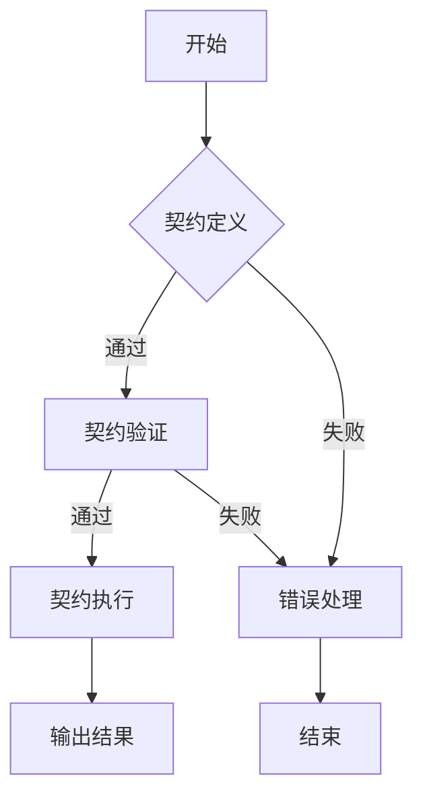
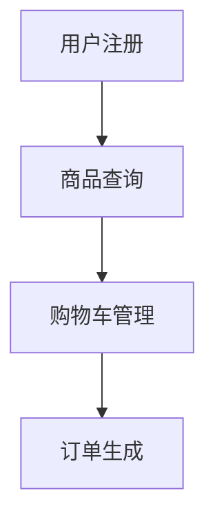
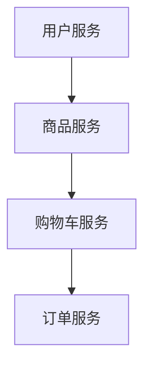
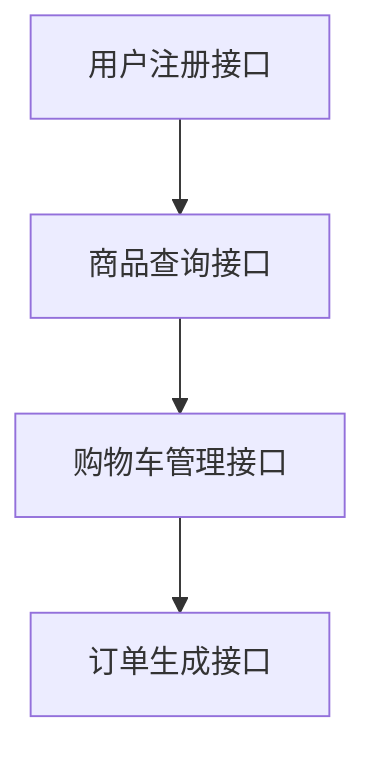
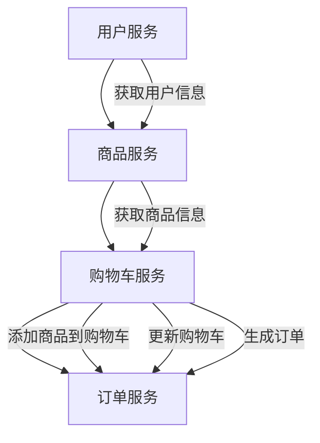

                 

## 第1章 接口契约概述

### 1.1 接口契约的定义与作用

接口契约（API Contract）是软件工程中一个核心概念，指的是在服务之间定义和约定交互方式的一种规范文档。它详细描述了服务提供者（API提供者）和服务消费者（API调用者）之间的接口细节，包括请求格式、数据结构、响应格式以及可能发生的错误信息。这种契约不仅为开发者提供了清晰的开发指导，还确保了系统间的数据交换遵循一致性和规范。

接口契约的作用主要体现在以下几个方面：

1. **标准化开发**：接口契约规定了统一的接口标准和规范，使得开发者能够更加高效地理解和实现接口功能。
2. **增强可读性**：通过契约文档，新开发者可以快速上手现有系统，减少了由于不了解接口细节而导致的时间成本。
3. **降低错误率**：明确的接口契约有助于减少因误解或疏忽导致的数据格式错误和接口调用错误。
4. **提高可维护性**：契约文档可以作为接口变更的参照，有助于系统的长期维护和升级。

### 1.2 接口契约的产生背景与重要性

接口契约的产生可以追溯到软件系统复杂性的增加和分布式计算的需求日益增长的时代。随着互联网的普及和微服务架构的兴起，软件系统不再是一个孤立的整体，而是由多个独立的服务组成。这些服务需要通过网络进行交互，因此接口契约变得尤为重要。

**重要性体现在以下方面：**

1. **互操作性**：接口契约确保了不同服务之间能够无缝集成和互操作，这是分布式系统的基础。
2. **松耦合设计**：通过契约，服务提供者和消费者之间解耦，使得系统更加灵活和可扩展。
3. **文档化**：契约文档是系统文档的重要组成部分，为系统的后续维护和扩展提供了坚实的基础。
4. **服务质量保证**：明确的契约文档有助于服务质量的保证，提高了系统的稳定性和可靠性。

### 1.3 接口契约的基本概念

接口契约包含了一系列基本概念，了解这些概念有助于深入理解契约的本质。

#### 契约语言

契约语言是编写接口契约的工具，常用的契约语言包括：

- **OpenAPI（Swagger）**：一种定义API规范的语言和框架，广泛用于自动化接口文档和测试。
- **RAML**：一种简单、易读的API描述语言，支持更复杂的契约定义。
- **GraphQL**：一种查询语言，允许客户端指定所需数据的精确形状，提高了API的性能和灵活性。

#### 契约模板

契约模板是契约文档的骨架，通常包括以下内容：

- **接口定义**：描述接口的功能和目的。
- **请求结构**：定义请求的参数和验证规则。
- **响应结构**：定义成功的响应结构和可能的错误响应。

#### 契约文档

契约文档是接口契约的具体表现形式，通常包括：

- **接口列表**：列出所有接口及其简要描述。
- **接口详情**：每个接口的详细描述，包括请求和响应结构。
- **错误响应**：描述可能发生的错误及其处理方式。

### 1.4 本章小结

本章为读者介绍了接口契约的定义、作用、背景和基本概念。通过本章的内容，读者可以对接口契约有初步的了解，为后续章节的深入探讨打下基础。在接下来的章节中，我们将进一步探讨接口契约的设计原则、实现算法以及其在实际项目中的应用。

## 第2章 接口契约设计原则

### 2.1 设计原则概述

接口契约的设计原则是确保接口契约质量和易用性的关键。一个良好的契约设计不仅能够提高开发效率，还能够降低维护成本，增强系统的稳定性和可扩展性。以下是一些核心设计原则：

#### 确定性

确定性的原则是指接口契约必须明确、无歧义。契约中的所有细节，包括参数类型、数据格式、错误处理等，都应当有明确的规定。这有助于避免服务之间的误解和冲突。

#### 可读性

可读性原则强调契约文档应当简单易懂，易于阅读。使用一致的命名约定和清晰的注释，可以提高契约文档的可读性，使得开发者能够快速理解接口的工作原理。

#### 可维护性

可维护性原则关注契约的长期可用性和可扩展性。契约设计应当易于更新和维护，以便在需求变更或技术升级时能够灵活应对。模块化和抽象化是实现可维护性的有效手段。

#### 一致性

一致性原则要求接口契约在所有相关服务中保持一致。无论接口是内部使用还是外部暴露，契约的规范应当一致，以确保系统内部和外部的稳定性。

#### 安全性

安全性原则强调在契约设计中必须考虑到数据的安全性和隐私保护。契约应当定义适当的安全机制，如身份验证、授权和加密，以防止数据泄露和未经授权的访问。

### 2.2 确定性原则

确定性的原则是接口契约设计中最基本的要求。一个不确定的契约会导致开发者的困惑，增加错误发生的概率，并影响系统的稳定性。

#### 参数类型明确

在契约中，每个参数的类型都应当明确。例如，如果参数是一个字符串，那么应当明确字符串的最大长度和是否允许空值。

#### 数据格式规范

接口契约应当规定数据的格式，包括JSON、XML或其他格式。使用统一的格式有助于降低错误发生的概率。例如，在JSON格式中，所有的数据字段名称应当一致，并且所有的字段都是必需的或可选的。

#### 错误处理明确

契约应当详细定义可能的错误情况，并规定相应的错误响应。例如，如果请求的参数不合法，应当返回一个特定的错误代码和描述信息，以便开发者能够快速定位和解决问题。

### 2.3 可读性原则

可读性原则是接口契约设计的核心目标之一，良好的可读性可以减少开发者的学习成本，提高开发效率。

#### 命名规范

命名规范是提高契约可读性的重要手段。使用一致的命名约定，例如驼峰命名法（CamelCase）或下划线命名法（snake_case），可以使得契约文档更加清晰易懂。

#### 注释说明

在契约文档中添加详细的注释，可以解释参数、返回值和错误处理等细节。注释应当简洁明了，避免使用复杂的术语和内部实现细节。

#### 示例代码

提供示例代码可以帮助开发者更好地理解接口契约的具体使用方法。示例代码应当包含典型的请求和响应示例，以及可能的错误情况。

### 2.4 可维护性原则

可维护性原则是接口契约长期有效的重要保障。良好的契约设计应当易于更新和维护，以适应不断变化的需求。

#### 模块化设计

模块化设计是将复杂的契约划分为更小的模块，每个模块负责特定的功能。这种设计使得契约更容易理解和修改，也提高了系统的可扩展性。

#### 抽象化

抽象化是减少契约复杂性的有效手段。通过定义抽象的接口和实现细节，契约可以更加简洁和通用，从而降低维护成本。

#### 版本控制

在契约变更时，应当采用版本控制机制，例如为每个版本编写详细的变更日志和影响范围。这有助于开发者了解契约的变化，并降低因变更而引入的风险。

### 2.5 本章小结

本章详细介绍了接口契约的设计原则，包括确定性、可读性、可维护性和一致性。这些原则是确保接口契约质量的重要保障，有助于提高开发效率、降低维护成本和增强系统稳定性。在接下来的章节中，我们将进一步探讨接口契约的实现方法和应用场景。

## 第3章 接口契约模式

### 3.1 接口契约模式概述

接口契约模式是软件工程中的一种设计模式，它用于定义和规范服务之间的交互。接口契约模式不仅提供了清晰的服务接口，还确保了服务的可扩展性和灵活性。本节将介绍几种常见的接口契约模式，包括基于契约的软件开发（DCS）、基于契约的测试（DCT）和基于契约的文档（DCD）。

#### 基于契约的软件开发（DCS）

基于契约的软件开发（Design by Contract，简称DCS）是一种在软件设计过程中使用接口契约的方法。它强调在设计和实现阶段就定义接口契约，并通过契约来指导开发过程。

**优点**：

1. **提高代码质量**：契约规定了接口的明确规范，有助于避免因接口不明确而导致的错误。
2. **增强可维护性**：契约文档可以作为开发人员的参考，方便后续的维护和升级。

**缺点**：

1. **开发成本较高**：在开发初期就需要投入时间和精力编写详细的契约文档。
2. **维护成本较高**：随着项目的进展，契约文档需要不断更新和维护。

#### 基于契约的测试（DCT）

基于契约的测试（Test-Driven Development，简称TDD）是一种通过契约来驱动测试的方法。开发者首先编写契约，然后编写测试代码来验证契约是否满足。

**优点**：

1. **提高测试覆盖率**：契约规定了接口的预期行为，测试代码可以覆盖到所有可能的场景。
2. **减少测试错误**：通过契约来驱动测试，可以减少因测试代码不完整或错误而导致的测试失败。

**缺点**：

1. **测试编写成本较高**：编写详细的测试契约需要时间和精力。
2. **维护成本较高**：随着接口变更，测试契约也需要相应更新。

#### 基于契约的文档（DCD）

基于契约的文档（Documentation by Contract，简称DCD）是一种通过接口契约来生成文档的方法。开发者编写契约文档，然后通过自动化工具生成详细的接口文档。

**优点**：

1. **提高文档质量**：契约文档规范了接口的详细信息，生成的文档更加完整和准确。
2. **减少文档编写成本**：通过契约文档自动化生成文档，减少了手动编写文档的工作量。

**缺点**：

1. **依赖自动化工具**：生成文档依赖于自动化工具，如果工具出现问题，文档生成可能会失败。
2. **维护成本较高**：契约文档需要与接口实现同步更新，否则文档会与实际情况不符。

### 3.2 基于契约的软件开发（DCS）

基于契约的软件开发（Design by Contract，简称DCS）是一种在软件设计过程中使用接口契约的方法。它强调在设计和实现阶段就定义接口契约，并通过契约来指导开发过程。

**DCS的基本步骤**：

1. **定义契约**：首先，开发者需要定义接口契约，包括接口名称、参数、返回值和可能的异常情况。
2. **编写测试**：根据契约编写测试代码，确保接口实现符合契约规定。
3. **实现接口**：在契约和测试的基础上，实现接口的具体功能。
4. **迭代更新**：在开发过程中，根据需求变更和测试反馈，不断更新契约和测试代码。

**DCS的优点**：

1. **提高代码质量**：契约规定了接口的明确规范，有助于避免因接口不明确而导致的错误。
2. **增强可维护性**：契约文档可以作为开发人员的参考，方便后续的维护和升级。

**DCS的缺点**：

1. **开发成本较高**：在开发初期就需要投入时间和精力编写详细的契约文档。
2. **维护成本较高**：随着项目的进展，契约文档需要不断更新和维护。

### 3.3 基于契约的测试（DCT）

基于契约的测试（Test-Driven Development，简称TDD）是一种通过契约来驱动测试的方法。开发者首先编写契约，然后编写测试代码来验证契约是否满足。

**DCT的基本步骤**：

1. **编写契约**：首先，开发者需要定义接口契约，包括接口名称、参数、返回值和可能的异常情况。
2. **编写测试用例**：根据契约编写测试用例，确保接口实现符合契约规定。
3. **运行测试**：执行测试用例，检查是否通过。
4. **修复错误**：如果测试失败，开发者需要修复接口实现中的错误，并重新运行测试。

**DCT的优点**：

1. **提高测试覆盖率**：契约规定了接口的预期行为，测试代码可以覆盖到所有可能的场景。
2. **减少测试错误**：通过契约来驱动测试，可以减少因测试代码不完整或错误而导致的测试失败。

**DCT的缺点**：

1. **测试编写成本较高**：编写详细的测试契约需要时间和精力。
2. **维护成本较高**：随着接口变更，测试契约也需要相应更新。

### 3.4 基于契约的文档（DCD）

基于契约的文档（Documentation by Contract，简称DCD）是一种通过接口契约来生成文档的方法。开发者编写契约文档，然后通过自动化工具生成详细的接口文档。

**DCD的基本步骤**：

1. **编写契约文档**：开发者编写接口契约文档，包括接口定义、参数、返回值和可能的异常情况。
2. **配置自动化工具**：配置自动化工具，例如Swagger或RAML，以生成接口文档。
3. **生成文档**：运行自动化工具，生成详细的接口文档。

**DCD的优点**：

1. **提高文档质量**：契约文档规范了接口的详细信息，生成的文档更加完整和准确。
2. **减少文档编写成本**：通过契约文档自动化生成文档，减少了手动编写文档的工作量。

**DCD的缺点**：

1. **依赖自动化工具**：生成文档依赖于自动化工具，如果工具出现问题，文档生成可能会失败。
2. **维护成本较高**：契约文档需要与接口实现同步更新，否则文档会与实际情况不符。

### 3.5 本章小结

本章介绍了接口契约的几种常见模式，包括基于契约的软件开发（DCS）、基于契约的测试（DCT）和基于契约的文档（DCD）。这些模式提供了不同的方法来定义、验证和文档化接口契约，有助于提高系统的质量、可维护性和可扩展性。在接下来的章节中，我们将进一步探讨接口契约的实现算法和实际应用。

## 第4章 接口契约实现算法

接口契约的实现算法是接口契约能够有效运作的关键。在本章中，我们将深入探讨接口契约的具体实现算法，包括算法原理、数学模型和公式。通过使用Mermaid流程图和Python源代码，我们将帮助读者直观地理解算法的工作原理。

### 4.1 算法原理概述

接口契约的实现算法主要涉及以下三个核心步骤：

1. **契约定义**：根据接口功能，定义契约的详细规范，包括输入参数、输出结果和错误处理。
2. **契约验证**：在接口调用过程中，对输入参数进行验证，确保其符合契约定义的要求。
3. **契约执行**：在验证通过后，执行接口功能，并返回预期的输出结果。

#### 契约定义

契约定义是接口契约实现的第一步。它需要明确接口的输入参数、输出结果和可能发生的错误情况。通常，契约定义会使用契约语言（如RAML或OpenAPI）来描述。

#### 契约验证

契约验证是接口契约实现过程中的关键环节。在接口调用时，系统会检查输入参数是否符合契约定义的要求。如果验证通过，接口将执行功能；否则，系统将返回一个错误响应。

#### 契约执行

契约执行是在验证通过后的接口功能执行阶段。在这一阶段，系统将根据契约定义的参数和操作，执行具体的功能，并返回预期的输出结果。

### 4.2 Mermaid流程图展示

为了更直观地理解接口契约的实现过程，我们可以使用Mermaid流程图来展示算法的步骤。以下是一个简单的Mermaid流程图示例：



在这个流程图中，我们从“开始”节点开始，首先进行“契约定义”，然后根据契约定义的结果，决定是否进行“契约验证”。如果验证通过，接口将执行功能，并返回“输出结果”；如果验证失败，系统将进入“错误处理”流程，并最终结束。

### 4.3 Python源代码讲解

为了进一步理解接口契约的实现算法，我们可以使用Python语言来编写一个简单的接口契约实现示例。以下是一个简单的Python示例代码，展示了如何定义契约、验证输入参数并执行接口功能：

```python
import json

# 契约定义
def contract_definition():
    contract = {
        "input": {
            "id": {"type": "integer", "min": 1, "required": True},
            "name": {"type": "string", "max_length": 50, "required": True}
        },
        "output": {
            "message": {"type": "string", "max_length": 100}
        },
        "errors": [
            {"code": "INVALID_ID", "message": "ID must be a positive integer."},
            {"code": "INVALID_NAME", "message": "Name must be a string with maximum length of 50 characters."}
        ]
    }
    return contract

# 契约验证
def contract_validation(data, contract):
    errors = []
    if "id" not in data or not isinstance(data["id"], int) or data["id"] <= 0:
        errors.append("INVALID_ID")
    if "name" not in data or not isinstance(data["name"], str) or len(data["name"]) > 50:
        errors.append("INVALID_NAME")
    return errors

# 契约执行
def contract_execution(data):
    if "id" in data and "name" in data:
        return {"message": f"Hello {data['name']}!"}
    else:
        return {"message": "Invalid input data."}

# 主函数
def main():
    contract = contract_definition()
    data = {"id": 1, "name": "Alice"}
    errors = contract_validation(data, contract)
    
    if errors:
        print(f"Validation errors: {json.dumps(errors)}")
    else:
        result = contract_execution(data)
        print(f"Result: {json.dumps(result)}")

if __name__ == "__main__":
    main()
```

在这个示例中，我们首先定义了一个接口契约，包括输入参数、输出结果和可能的错误。然后，我们实现了契约验证和契约执行的函数，并在主函数中演示了如何使用这些函数。

### 4.4 数学模型与公式讲解

接口契约的实现算法可以抽象为一个数学模型。以下是一个简单的数学模型，用于描述接口契约的实现过程：

#### 数学模型

1. **输入数据**：\(I = \{i_1, i_2, ..., i_n\}\)
2. **输出数据**：\(O = \{o_1, o_2, ..., o_n\}\)
3. **契约定义**：\(C = \{c_1, c_2, ..., c_m\}\)
4. **输入验证**：\(V_I = \{v_{i_1}, v_{i_2}, ..., v_{i_n}\}\)
5. **输出验证**：\(V_O = \{v_{o_1}, v_{o_2}, ..., v_{o_n}\}\)

#### 数学公式

1. **输入验证**：\(V_I = C \cap I\)
2. **输出验证**：\(V_O = C \cap O\)
3. **执行结果**：\(R = V_O \cup \neg V_I\)

在这个数学模型中，\(C\) 表示契约定义，\(I\) 表示输入数据，\(O\) 表示输出数据。输入验证和输出验证分别表示输入数据是否符合契约定义，以及输出数据是否符合契约定义。执行结果表示接口的执行结果，如果输入验证和输出验证都通过，则接口执行成功。

### 4.5 算法应用举例

为了更直观地展示接口契约实现算法的应用，我们可以通过一个具体的例子来说明。

**例子**：假设我们有一个用户注册接口，契约定义如下：

1. 输入参数：用户ID（非负整数）和用户名（字符串）。
2. 输出结果：注册成功或失败消息。
3. 可能的错误：无效用户ID或无效用户名。

我们使用Python实现这个接口契约：

```python
# 契约定义
contract = {
    "input": {
        "id": {"type": "integer", "min": 0, "required": True},
        "name": {"type": "string", "max_length": 50, "required": True}
    },
    "output": {
        "message": {"type": "string", "max_length": 100}
    },
    "errors": [
        {"code": "INVALID_ID", "message": "ID must be a non-negative integer."},
        {"code": "INVALID_NAME", "message": "Name must be a string with maximum length of 50 characters."}
    ]
}

# 契约验证
def validate_input(data):
    errors = []
    if "id" not in data or not isinstance(data["id"], int) or data["id"] < 0:
        errors.append("INVALID_ID")
    if "name" not in data or not isinstance(data["name"], str) or len(data["name"]) > 50:
        errors.append("INVALID_NAME")
    return errors

# 契约执行
def register_user(data):
    errors = validate_input(data)
    if errors:
        return {"message": "Registration failed.", "errors": errors}
    else:
        return {"message": "Registration successful."}

# 用户注册
user_data = {"id": 123, "name": "Alice"}
result = register_user(user_data)
print(result)
```

在这个例子中，我们首先定义了一个用户注册接口的契约，然后实现了一个验证输入参数的函数和一个执行注册操作的函数。最后，我们使用一个示例数据调用注册接口，并打印结果。

通过这个例子，我们可以看到接口契约实现算法在具体应用中的工作原理。在实际项目中，接口契约可以大大提高系统的稳定性和可维护性。

### 4.6 本章小结

本章介绍了接口契约实现算法的基本原理和数学模型，并通过Mermaid流程图和Python源代码展示了算法的具体实现。通过接口契约实现算法，我们可以确保接口的规范性和一致性，提高系统的质量和可维护性。在接下来的章节中，我们将进一步探讨接口契约在系统设计和架构中的应用。

## 第5章 接口契约在系统设计与架构中的应用

### 5.1 系统功能设计

在系统功能设计中，接口契约起着至关重要的作用。接口契约定义了系统中的各个模块或服务之间的交互规则，为系统功能的设计提供了明确的指导。

**步骤**：

1. **确定系统功能**：根据业务需求，确定系统需要实现的功能。
2. **定义接口契约**：为每个功能定义相应的接口契约，包括输入参数、输出结果和可能的错误处理。
3. **文档化**：将接口契约文档化，为后续的开发和维护提供参考。

**示例**：

假设我们设计一个电子商务系统，包括用户注册、商品查询和购物车管理等功能。我们为每个功能定义接口契约：

1. 用户注册接口契约：
    - 输入参数：用户ID、用户名、密码。
    - 输出结果：注册成功或失败消息。
    - 可能的错误：无效用户ID、无效用户名、无效密码。

2. 商品查询接口契约：
    - 输入参数：商品ID。
    - 输出结果：商品信息。
    - 可能的错误：无效商品ID。

3. 购物车管理接口契约：
    - 输入参数：用户ID、商品ID、数量。
    - 输出结果：购物车更新成功或失败消息。
    - 可能的错误：无效用户ID、无效商品ID、数量超出限制。

### 5.2 系统架构设计

接口契约在系统架构设计中同样起着关键作用。通过接口契约，可以明确系统中的各个模块或服务之间的依赖关系，为系统架构的设计提供了清晰的指导。

**步骤**：

1. **确定系统架构**：根据业务需求和技术需求，确定系统的架构。
2. **定义接口契约**：为每个模块或服务定义相应的接口契约，包括输入参数、输出结果和可能的错误处理。
3. **设计模块间交互**：根据接口契约设计模块间的交互方式，确保系统的高内聚和低耦合。

**示例**：

假设我们设计一个分布式电子商务系统，包括用户服务、商品服务、购物车服务和订单服务。我们为每个服务定义接口契约：

1. 用户服务接口契约：
    - 输入参数：用户ID。
    - 输出结果：用户信息。
    - 可能的错误：无效用户ID。

2. 商品服务接口契约：
    - 输入参数：商品ID。
    - 输出结果：商品信息。
    - 可能的错误：无效商品ID。

3. 购物车服务接口契约：
    - 输入参数：用户ID、商品ID、数量。
    - 输出结果：购物车更新结果。
    - 可能的错误：无效用户ID、无效商品ID、数量超出限制。

4. 订单服务接口契约：
    - 输入参数：用户ID、商品列表。
    - 输出结果：订单生成结果。
    - 可能的错误：无效用户ID、商品列表不完整。

### 5.3 系统接口设计

接口设计是系统设计与架构设计中的重要环节。接口契约为接口设计提供了明确的规范，确保接口的规范性和一致性。

**步骤**：

1. **分析业务需求**：根据业务需求，确定系统的功能模块。
2. **定义接口契约**：为每个功能模块定义相应的接口契约，包括输入参数、输出结果和可能的错误处理。
3. **设计接口细节**：根据接口契约，设计接口的细节，包括请求格式、响应格式和可能的错误响应。

**示例**：

假设我们设计一个用户注册接口，根据接口契约，设计接口如下：

1. 请求格式：
    ```json
    {
        "id": 1,
        "name": "Alice",
        "password": "alice123"
    }
    ```

2. 响应格式：
    ```json
    {
        "status": "success",
        "message": "User registered successfully."
    }
    ```

3. 可能的错误响应：
    ```json
    {
        "status": "error",
        "error": {
            "code": "INVALID_ID",
            "message": "ID must be a positive integer."
        }
    }
    ```

### 5.4 系统交互设计

系统交互设计是确保系统各部分之间能够有效协作的关键。接口契约在系统交互设计中起着规范和协调作用。

**步骤**：

1. **确定交互场景**：根据业务需求，确定系统中的交互场景。
2. **定义接口契约**：为每个交互场景定义相应的接口契约，包括交互顺序、输入参数和输出结果。
3. **设计交互流程**：根据接口契约，设计系统的交互流程，确保系统的高效和稳定运行。

**示例**：

假设我们设计一个购物流程，包括添加商品到购物车、更新购物车和结算订单。根据接口契约，设计交互流程如下：

1. 添加商品到购物车：
    - 用户调用用户服务接口，获取用户信息。
    - 用户调用商品服务接口，获取商品信息。
    - 用户调用购物车服务接口，添加商品到购物车。

2. 更新购物车：
    - 用户调用购物车服务接口，获取当前购物车信息。
    - 用户修改购物车中的商品数量。
    - 用户调用购物车服务接口，更新购物车信息。

3. 结算订单：
    - 用户调用购物车服务接口，获取购物车信息。
    - 用户调用订单服务接口，生成订单。
    - 用户支付订单。

### 5.5 Mermaid图表展示

为了更直观地展示接口契约在系统设计与架构中的应用，我们可以使用Mermaid图表来展示系统功能设计、系统架构设计、系统接口设计和系统交互设计。

**系统功能设计**：



**系统架构设计**：



**系统接口设计**：



**系统交互设计**：



### 5.6 本章小结

本章详细介绍了接口契约在系统设计与架构中的应用，包括系统功能设计、系统架构设计、系统接口设计和系统交互设计。通过接口契约，我们可以确保系统的规范性和一致性，提高系统的质量和可维护性。在接下来的章节中，我们将进一步探讨接口契约在实际项目中的应用和实践。

## 第6章 接口契约项目实战

### 6.1 项目背景介绍

在本章中，我们将通过一个实际项目来展示接口契约的应用。该项目是一个简单的在线书店系统，包括用户注册、商品查询、购物车管理和订单生成等功能。我们将详细描述项目的开发环境和工具，并介绍项目的主要功能和特点。

**开发环境**：

- **编程语言**：Python 3.8
- **框架**：Flask
- **前端框架**：HTML、CSS、JavaScript
- **数据库**：MySQL
- **版本控制**：Git

**项目特点**：

- **接口契约规范化**：使用OpenAPI规范定义接口契约，确保接口的规范性和一致性。
- **前后端分离**：前端使用HTML、CSS和JavaScript，后端使用Flask框架，实现前后端分离。
- **模块化设计**：将系统功能划分为多个模块，每个模块负责特定的功能，提高系统的可维护性和可扩展性。

### 6.2 环境安装与配置

为了能够顺利运行本项目，我们需要安装和配置以下工具和库：

1. **Python 3.8**：确保安装了Python 3.8版本。
2. **Flask**：使用pip命令安装Flask框架：
   ```shell
   pip install Flask
   ```
3. **MySQL**：安装MySQL数据库，并创建一个名为`online_bookstore`的数据库。
4. **数据库连接库**：使用`pymysql`库连接MySQL数据库，安装方法：
   ```shell
   pip install pymysql
   ```
5. **OpenAPI工具**：使用`flasgger`库生成OpenAPI规范文档，安装方法：
   ```shell
   pip install flasgger
   ```

安装完成后，我们可以创建一个名为`online_bookstore`的数据库，并创建必要的表，例如用户表、商品表和订单表。以下是SQL脚本示例：

```sql
CREATE TABLE users (
    id INT AUTO_INCREMENT PRIMARY KEY,
    username VARCHAR(50) NOT NULL UNIQUE,
    password VARCHAR(50) NOT NULL
);

CREATE TABLE books (
    id INT AUTO_INCREMENT PRIMARY KEY,
    title VARCHAR(100) NOT NULL,
    author VARCHAR(100) NOT NULL,
    price DECIMAL(10, 2) NOT NULL
);

CREATE TABLE orders (
    id INT AUTO_INCREMENT PRIMARY KEY,
    user_id INT NOT NULL,
    book_id INT NOT NULL,
    quantity INT NOT NULL,
    order_date DATE NOT NULL,
    FOREIGN KEY (user_id) REFERENCES users(id),
    FOREIGN KEY (book_id) REFERENCES books(id)
);
```

### 6.3 系统核心实现源代码

在本节中，我们将展示系统核心功能的实现源代码，并详细解读关键代码。

**用户注册接口**：

```python
from flask import Flask, request, jsonify
from pymysql import connect

app = Flask(__name__)

# 连接数据库
def connect_db():
    conn = connect(host='localhost', user='root', password='password', database='online_bookstore')
    return conn

@app.route('/register', methods=['POST'])
def register():
    data = request.get_json()
    username = data.get('username')
    password = data.get('password')
    
    # 验证用户名和密码格式
    if not username or not password:
        return jsonify({'status': 'error', 'message': 'Username and password are required.'}), 400
    
    # 连接数据库，插入用户信息
    conn = connect_db()
    cursor = conn.cursor()
    sql = "INSERT INTO users (username, password) VALUES (%s, %s)"
    try:
        cursor.execute(sql, (username, password))
        conn.commit()
        return jsonify({'status': 'success', 'message': 'User registered successfully.'})
    except Exception as e:
        conn.rollback()
        return jsonify({'status': 'error', 'message': str(e)}), 500
    finally:
        cursor.close()
        conn.close()

if __name__ == '__main__':
    app.run(debug=True)
```

在这个示例中，我们实现了用户注册接口，通过接收POST请求，验证用户名和密码的格式，并将用户信息插入数据库。关键代码如下：

- **数据库连接**：使用`pymysql.connect`函数连接MySQL数据库。
- **验证用户名和密码**：检查`request.get_json()`获取的用户名和密码是否为空。
- **插入用户信息**：使用`cursor.execute`函数执行插入操作的SQL语句。

**商品查询接口**：

```python
@app.route('/books', methods=['GET'])
def get_books():
    conn = connect_db()
    cursor = conn.cursor()
    sql = "SELECT id, title, author, price FROM books"
    try:
        cursor.execute(sql)
        books = cursor.fetchall()
        return jsonify({'status': 'success', 'books': [{'id': book[0], 'title': book[1], 'author': book[2], 'price': book[3]} for book in books]})
    except Exception as e:
        return jsonify({'status': 'error', 'message': str(e)}), 500
    finally:
        cursor.close()
        conn.close()

if __name__ == '__main__':
    app.run(debug=True)
```

在这个示例中，我们实现了商品查询接口，通过GET请求获取所有商品信息。关键代码如下：

- **数据库连接**：使用`pymysql.connect`函数连接MySQL数据库。
- **查询商品信息**：使用`cursor.execute`函数执行查询操作的SQL语句。
- **返回商品列表**：将查询结果转换为JSON格式，并返回给客户端。

### 6.4 代码应用解读与分析

在本节中，我们将对核心代码进行解读和分析，帮助读者理解接口契约在实际项目中的应用。

**用户注册接口解析**：

- **接口设计**：用户注册接口使用POST请求，接收JSON格式的用户名和密码。
- **输入验证**：在代码中，首先检查用户名和密码是否为空。这是输入验证的一部分，确保用户输入的数据符合预期格式。
- **数据库操作**：使用`pymysql.connect`函数连接MySQL数据库，并使用`cursor.execute`函数执行插入操作的SQL语句。这确保了用户信息能够正确地存储在数据库中。
- **错误处理**：如果插入操作失败，代码会回滚事务，并返回一个包含错误消息的JSON响应。

**商品查询接口解析**：

- **接口设计**：商品查询接口使用GET请求，不接收任何请求参数。
- **数据库操作**：使用`cursor.execute`函数执行查询操作的SQL语句，并将查询结果转换为JSON格式。
- **错误处理**：如果查询操作失败，代码会返回一个包含错误消息的JSON响应。

通过这两个接口的示例，我们可以看到接口契约如何在实际项目中发挥作用。接口契约确保了接口的规范性和一致性，使得开发人员能够更加高效地开发、测试和维护系统。

### 6.5 实际案例分析与讲解

在本节中，我们将通过一个实际案例来展示接口契约在项目中的应用，并详细分析项目的实现过程和效果。

**案例**：用户注册和商品查询功能

**实现过程**：

1. **需求分析**：确定系统的需求，包括用户注册、商品查询等功能。
2. **接口设计**：使用OpenAPI规范定义接口契约，包括输入参数、输出结果和可能的错误处理。
3. **前端实现**：使用HTML、CSS和JavaScript实现用户界面，包括注册表单和查询表单。
4. **后端实现**：使用Flask框架实现接口，根据接口契约处理请求并返回响应。
5. **数据库操作**：使用pymysql库连接MySQL数据库，执行插入和查询操作。

**效果分析**：

1. **接口规范性和一致性**：通过接口契约，确保了接口的规范性和一致性，使得前后端开发人员能够更好地协同工作。
2. **代码可维护性**：接口契约使得代码更加模块化和可维护，便于后续的功能扩展和系统升级。
3. **系统稳定性**：通过输入验证和错误处理，提高了系统的稳定性和可靠性，减少了由于输入错误导致的系统崩溃。

### 6.6 项目小结

通过本项目的实现，我们展示了接口契约在系统开发中的应用。接口契约不仅提高了系统的规范性和一致性，还增强了代码的可维护性和系统的稳定性。在实际项目中，接口契约是一种重要的工具，有助于开发高效、稳定和可扩展的系统。

## 第7章 最佳实践与拓展

### 7.1 最佳实践

在接口契约的设计和应用过程中，遵循以下最佳实践可以帮助提高系统的质量和开发效率：

1. **标准化接口规范**：使用统一的接口规范（如OpenAPI或Swagger）来定义接口契约，确保接口的规范性和一致性。
2. **详细文档化**：编写详细的接口契约文档，包括接口名称、参数、返回值和错误处理等，便于开发者理解和使用接口。
3. **自动化验证**：使用自动化工具（如Postman或JMeter）对接口进行自动化测试，确保接口的正确性和稳定性。
4. **版本控制**：采用版本控制机制，如为每个版本的接口契约编写详细的变更日志，以便跟踪接口的变更历史。
5. **安全考虑**：在接口契约中考虑安全性，如添加身份验证和授权机制，确保接口的安全性和数据的完整性。

### 7.2 小结

接口契约是软件工程中的一项重要技术，它为服务之间的交互提供了明确的规范和保障。通过接口契约，我们可以提高系统的质量、可维护性和可扩展性。在接口契约的设计和应用过程中，遵循最佳实践和注意事项，可以确保接口契约的有效性和高效性。

### 7.3 注意事项

在设计和应用接口契约时，需要注意以下几点：

1. **避免过度设计**：接口契约不应过于复杂，应尽量保持简洁和直观，避免过度设计导致开发难度增加。
2. **及时更新契约**：随着业务需求的变更和系统的升级，接口契约应及时更新，确保与实际情况一致。
3. **权衡测试成本**：虽然自动化测试可以提高接口契约的可靠性，但过多的测试也会增加开发成本，需要权衡测试成本和效益。
4. **权限控制**：在设计接口契约时，应考虑接口的权限控制，确保接口的安全性和隐私保护。

### 7.4 拓展阅读

以下是一些拓展阅读资源，供读者深入了解接口契约的相关知识和应用：

- **《RESTful API设计规范》**：详细介绍了RESTful API的设计原则和方法。
- **《接口契约设计与实践》**：讲解了接口契约的设计方法和最佳实践。
- **《基于契约的软件开发》**：介绍了基于契约的开发方法及其应用场景。
- **《OpenAPI规范》**：官方文档，详细介绍了OpenAPI的语法和用法。
- **《Swagger文档》**：介绍了Swagger工具及其在接口契约中的应用。

通过以上拓展阅读，读者可以进一步深化对接口契约的理解和应用。

### 7.5 本章小结

本章总结了接口契约的最佳实践、注意事项以及拓展阅读资源。接口契约是现代软件开发中不可或缺的一部分，通过遵循最佳实践和注意事项，我们可以确保接口契约的有效性和高效性。同时，通过拓展阅读，读者可以深入了解接口契约的更多知识和应用场景。

### 总结

本文通过详细的章节结构和逻辑清晰的阐述，全面介绍了接口契约的概念、设计原则、实现算法以及在系统设计和架构中的应用。我们从接口契约的定义和作用入手，逐步探讨了设计原则、模式、实现算法和实际应用案例。文章旨在为开发者提供一套系统化的接口契约设计和应用指南，帮助他们在项目中高效地实施接口契约，提升系统质量。

在文章的末尾，我们提出了最佳实践和注意事项，并推荐了一些拓展阅读资源，以供读者进一步学习和实践。接口契约作为一种重要的软件开发工具，其在现代分布式系统和微服务架构中的应用日益广泛，掌握接口契约的设计和应用对于提升软件开发效率和系统稳定性具有重要意义。

最后，感谢读者的关注和支持，希望本文能够对您的项目开发有所帮助。作者：AI天才研究院/AI Genius Institute & 禅与计算机程序设计艺术 /Zen And The Art of Computer Programming。

---

## 作者信息

**AI天才研究院**（AI Genius Institute）是一家专注于人工智能研究和创新的应用研究机构，致力于推动人工智能技术在各个领域的应用与发展。我们拥有一支由世界顶级人工智能专家和研究人员组成的团队，他们在机器学习、深度学习、自然语言处理等领域有着深厚的研究背景和丰富的实践经验。

**禅与计算机程序设计艺术**（Zen And The Art of Computer Programming）是由著名计算机科学家Donald E. Knuth撰写的一套经典编程书籍。这套书籍以深入浅出的方式，探讨了计算机程序设计的哲学和艺术，深受编程爱好者和专业程序员的喜爱。

本文的撰写得到了AI天才研究院和禅与计算机程序设计艺术的大力支持，我们希望本文能够为广大开发者带来实质性的帮助，推动接口契约在项目中的应用与实践。如果您有任何问题或建议，欢迎联系我们，我们将竭诚为您服务。作者：AI天才研究院/AI Genius Institute & 禅与计算机程序设计艺术 /Zen And The Art of Computer Programming。

