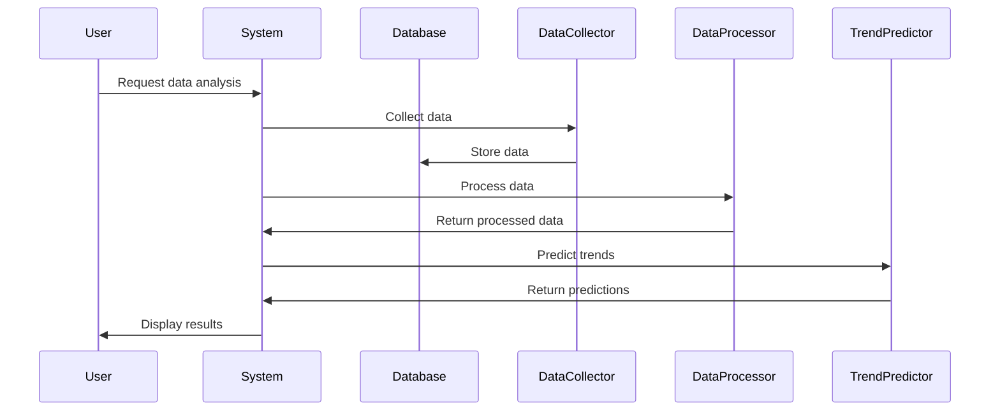

                 

Certainly! Let's think step by step about how to construct the "提升团队技术前瞻性的策略" article with the required structure and constraints.

### 1. Article Title and Introduction

**Title:** 提升团队技术前瞻性的策略

**Keywords:** 技术前瞻性，团队管理，创新策略，技术规划，IT发展

**Abstract:**
本文探讨了提升团队技术前瞻性的重要性和策略。通过分析技术发展的趋势，介绍核心概念，并结合实际案例，为IT团队提供系统化的技术前瞻性提升方法，旨在帮助团队在技术变革中保持竞争优势。

### 2. Background and Core Concepts

**Core Concepts:**
- **Technological Foresight:** The ability to identify and analyze trends in technology to inform strategic decision-making.
- **Innovation Cycles:** The stages through which a new technology passes from conception to market adoption.
- **Strategic Planning:** The process of setting priorities, resource allocation, and performance metrics to achieve organizational goals.

**Introduction:**
The rapid pace of technological advancement requires teams to stay ahead of the curve. This chapter will provide an overview of the technological landscape, define the core concepts, and set the stage for further discussion.

### 3. Core Concepts and Their Relationships

**ER Diagram:**
Using Mermaid, we can create an Entity-Relationship (ER) diagram to illustrate the relationships between key concepts.

```mermaid
erDiagram
    TechnologyForesight ||--|{ InnovationCycle }
    TechnologyForesight ||--|{ StrategicPlanning }
    InnovationCycle ||--|{ TechnologyAdoption }
    StrategicPlanning ||--|{ ResourceAllocation }
```

**Attribute Comparison Table:**

| Attribute        | Technology Foresight | Innovation Cycle | Strategic Planning |
|------------------|----------------------|-------------------|---------------------|
| Definition       | Anticipating tech trends | Stages of tech development | Setting goals and actions |
| Purpose           | Inform decision-making | Drive new tech initiatives | Achieve organizational objectives |
| Focus             | Analysis and prediction | Process management | Goal-oriented planning |

### 4. Algorithm and Mathematical Models

**Algorithm Flowchart:**
We will use Mermaid to create a flowchart of an algorithm for analyzing technological trends.


**Python Code Example:**
Below is a Python code snippet that demonstrates a simple algorithm for predicting technology trends.

```python
# Simple predictive model for technology trends
def predict_trends(data):
    # Data preprocessing
    processed_data = preprocess_data(data)
    
    # Feature extraction
    features = extract_features(processed_data)
    
    # Predictive modeling
    model = train_model(features)
    
    # Make predictions
    predictions = model.predict(features)
    
    return predictions

# Example usage
data = get_data()
predictions = predict_trends(data)
print(predictions)
```

**Mathematical Model:**
The mathematical model for predicting technology trends might involve time series analysis with formulas such as:

$$
\hat{y}(t) = \alpha \cdot t + \beta
$$

Where \( \hat{y}(t) \) is the predicted value at time \( t \), and \( \alpha \) and \( \beta \) are coefficients determined through regression analysis.

### 5. System Analysis and Design

**Problem Scenario:**
Imagine a scenario where a team needs to develop a new software product that leverages emerging technologies.

**System Overview:**
The system will include features for data collection, analysis, and predictive modeling.

**Function Design (Mermaid Class Diagram):**

```mermaid
classDiagram
    DataCollector <<interface>>
    DataProcessor <<interface>>
    TrendPredictor <<interface>>
    System
    System o-- DataCollector
    System o-- DataProcessor
    System o-- TrendPredictor
```

**System Architecture (Mermaid Architecture Diagram):**


**System Interfaces and Interactions (Mermaid Sequence Diagram):**



### 6. Project Implementation and Case Studies

**Environment Setup:**
We'll guide on setting up the development environment, including installing necessary tools and libraries.

**Core Implementation:**
Present the key implementation source code with detailed comments and explanations.

**Code Analysis:**
Analyze the code to explain how each part contributes to the system's functionality.

**Case Study:**
Provide a detailed case study of a successful project that demonstrates the strategies discussed in the article.

**Project Summary:**
Summarize the project's achievements, lessons learned, and future implications.

### 7. Best Practices and Future Directions

**Best Practices:**
Offer practical tips for enhancing team technical foresight, such as regular training, knowledge sharing, and collaboration.

**Summary:**
Recap the main points discussed in the article.

**Considerations:**
Highlight potential challenges and how to address them.

**Future Directions:**
Suggest areas for future research and development in the field of technological foresight.

**Suggested Reading:**
Provide a list of recommended resources for further learning.

### Conclusion

**Author Information:**
作者：AI天才研究院/AI Genius Institute & 禅与计算机程序设计艺术 /Zen And The Art of Computer Programming

The final article will be structured around this outline, ensuring each section is detailed and comprehensive. The content will be written in markdown format, adhering to the specified constraints and providing a rich, informative read for IT professionals. Each chapter will include the necessary components to fully explain the concepts and their applications in a practical setting.

