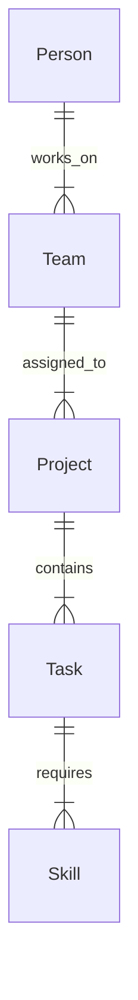
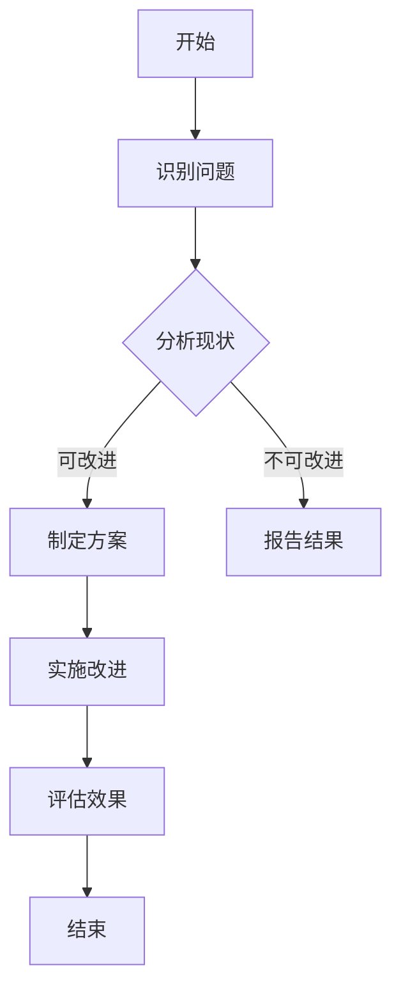
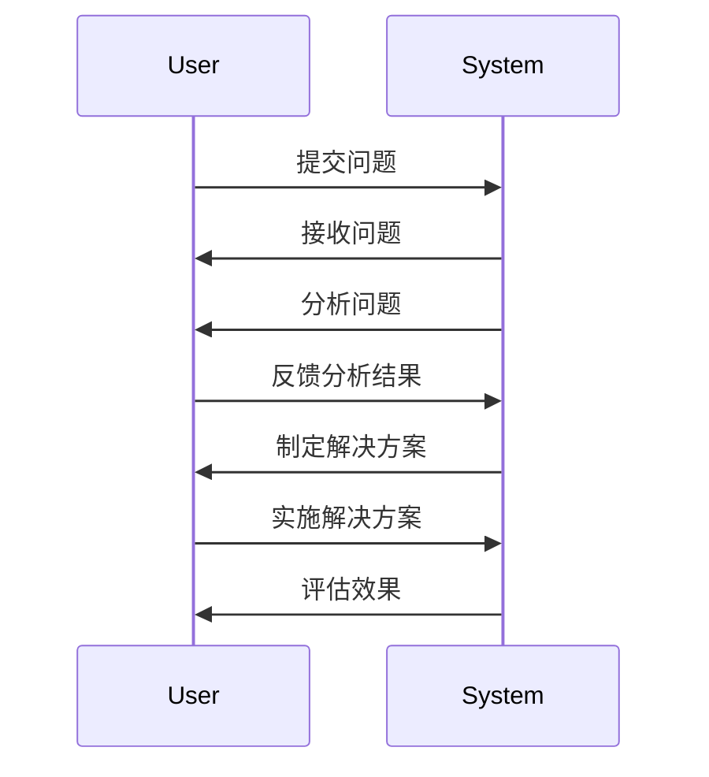

                 

### # 提升团队技术自主性的方法

#### 关键词：技术自主性，团队管理，问题解决，系统架构，项目实战

> 摘要：本文将深入探讨团队技术自主性的重要性及其提升方法。我们将从问题背景、核心概念、算法原理、系统分析与架构设计、项目实战等多个角度，逐步分析和讲解如何有效提升团队技术自主性。通过理论与实践的结合，为读者提供一套全面且实用的解决方案。

#### 目录大纲

- 第一部分：背景介绍
  - 1.1 问题背景
  - 1.2 问题解决
  - 1.3 问题解决策略
- 第二部分：核心概念与联系
  - 2.1 核心概念原理
  - 2.2 概念属性特征对比
  - 2.3 ER实体关系图架构
- 第三部分：算法原理讲解
  - 3.1 算法原理与流程图
  - 3.2 Python源代码详解
  - 3.3 算法原理与公式讲解
- 第四部分：系统分析与架构设计方案
  - 4.1 问题场景介绍
  - 4.2 项目介绍
  - 4.3 系统功能设计
  - 4.4 系统架构设计
  - 4.5 系统接口设计
  - 4.6 系统交互
- 第五部分：项目实战
  - 5.1 环境安装
  - 5.2 系统核心实现源代码
  - 5.3 代码应用解读与分析
  - 5.4 实际案例分析与详细讲解
  - 5.5 项目小结
- 最佳实践 Tips
- 小结
- 注意事项
- 拓展阅读

### 第一部分：背景介绍

#### 1.1 问题背景

在当今快速发展的信息技术时代，团队技术自主性已成为企业竞争力的关键因素之一。技术自主性不仅关系到团队的创新能力和问题解决能力，也直接影响企业的核心竞争力。然而，许多团队在技术自主性方面面临诸多挑战：

- **知识依赖**：团队过度依赖外部知识和资源，缺乏独立解决问题的能力。
- **创新瓶颈**：团队在面临技术难题时，往往无法独立突破，需要依赖外部指导。
- **协作效率**：团队内部缺乏有效的沟通和协作机制，技术自主性的实现受限。

这些问题的存在，严重制约了团队的技术发展和企业的竞争力提升。因此，提升团队技术自主性已成为当前亟待解决的问题。

#### 1.2 问题解决

针对上述问题，本文提出以下问题解决路径和策略：

- **问题识别**：通过全面分析团队技术现状，识别技术自主性存在的问题和瓶颈。
- **能力提升**：针对识别出的问题，制定相应的培训和提升计划，提高团队的技术能力和自主性。
- **机制完善**：建立和完善团队内部的技术协作和沟通机制，提升团队协作效率和自主性。
- **环境优化**：为团队提供良好的技术环境和资源支持，激发团队的技术创新活力。

通过以上策略的实施，可以有效提升团队技术自主性，为企业创造更大的价值。

#### 1.3 问题解决策略

为了提升团队技术自主性，我们需要从以下几个方面进行策略设计：

- **技术培训**：定期组织技术培训，提高团队成员的专业技能和知识水平。
- **知识共享**：建立内部知识库和共享平台，促进团队内部的知识传递和交流。
- **项目管理**：优化项目管理流程，提高项目的执行效率和团队自主性。
- **激励机制**：建立激励机制，鼓励团队成员积极参与技术创新和问题解决。

通过以上策略的落实，可以逐步提升团队技术自主性，推动企业技术创新和发展。

### 第二部分：核心概念与联系

#### 2.1 核心概念原理

在提升团队技术自主性的过程中，我们需要了解以下几个核心概念：

- **自主性**：指个体或团队在行动和决策上具备独立性和自主权的能力。
- **技术自主性**：指团队在技术问题上具备独立分析和解决的能力。
- **团队技术自主性**：指团队在技术领域内，能够自主开展项目研发、问题解决和技术创新的能力。

这些概念相互关联，共同构成了团队技术自主性的核心要素。自主性是基础，技术自主性是核心，团队技术自主性是目标。通过提升团队技术自主性，可以增强团队的创新能力和竞争力。

#### 2.2 概念属性特征对比

下面是自主性、技术自主性和团队技术自主性的属性特征对比表格：

| 概念             | 定义                                                         | 属性特征                                         |
|-----------------|------------------------------------------------------------|--------------------------------------------------|
| 自主性          | 个体或团队在行动和决策上具备独立性和自主权的能力               | 自主决策、自我管理、独立行动                   |
| 技术自主性      | 团队在技术问题上具备独立分析和解决的能力                     | 独立技术研发、问题解决、技术优化                 |
| 团队技术自主性  | 团队在技术领域内，能够自主开展项目研发、问题解决和技术创新的能力 | 系统性技术能力、团队协作、技术创新和持续改进 |

通过对比，我们可以更加清晰地理解这三个概念的区别和联系，为后续的分析和讨论提供基础。

#### 2.3 ER实体关系图架构

下面是一个简单的ER实体关系图，用于描述团队、项目和任务之间的关系：



在这个ER图中，Person（人员）与Team（团队）之间是“工作于”关系，Team与Project（项目）之间是“分配到”关系，Project与Task（任务）之间是“包含”关系，Task与Skill（技能）之间是“需求”关系。这个关系图帮助我们理解团队、项目和任务之间的关联，为后续的系统架构设计提供参考。

### 第三部分：算法原理讲解

#### 3.1 算法原理与流程图

为了提升团队技术自主性，我们需要一个系统化的方法来识别和解决问题。这里，我们介绍一个基于问题分析和解决方案实施的算法原理。

**算法概述**：

该算法分为四个主要步骤：识别问题、分析现状、制定方案和实施改进。

**算法流程图**：



**具体步骤**：

1. **识别问题**：通过团队内部交流和外部反馈，识别出需要解决的技术问题。
2. **分析现状**：对问题进行详细分析，确定问题的根本原因和现状。
3. **制定方案**：根据分析结果，制定可行的解决方案，包括技术路径和实施步骤。
4. **实施改进**：按照制定的方案，实施技术改进，解决现有问题。
5. **评估效果**：对实施效果进行评估，确定解决方案的有效性和改进空间。

通过这个算法，我们可以系统地解决团队技术自主性方面的问题，提升团队的技术能力和自主性。

#### 3.2 Python源代码详解

下面是一个简化的Python源代码示例，用于实现上述算法。

```python
def analyze_problem(problem):
    # 问题分析代码实现
    print(f"分析问题：{problem}")

def implement_solution(solution):
    # 解决方案实施代码实现
    print(f"实施解决方案：{solution}")

def evaluate_solution(solution):
    # 解决方案评估代码实现
    print(f"评估解决方案：{solution}")

# 主函数，执行算法流程
def main():
    problem = "技术难题A"
    analyze_problem(problem)
    
    # 模拟分析结果，可改进
    if can_improve(problem):
        solution = "解决方案A"
        implement_solution(solution)
        evaluate_solution(solution)
    else:
        report_result(problem)

# 模拟分析结果
def can_improve(problem):
    # 实现分析逻辑
    return True

if __name__ == "__main__":
    main()
```

在这个示例中，`analyze_problem` 函数用于分析问题，`implement_solution` 函数用于实施解决方案，`evaluate_solution` 函数用于评估解决方案。`main` 函数是算法的主入口，执行算法的各个步骤。通过这个简单的Python源代码，我们可以看到算法的基本实现过程。

#### 3.3 算法原理与公式讲解

为了更好地理解和应用算法，我们引入一个数学模型来描述问题解决的过程。

**数学模型**：

$$
X = \frac{aX_0 + b}{1 + a}
$$

**公式解释**：

这个公式描述了在当前状态下（$X_0$）和调整参数（$a$ 和 $b$）后，系统的变化量（$X$）。其中，$a$ 和 $b$ 是调整参数，用于根据问题的具体情况调整系统状态。

**举例说明**：

假设当前系统的状态为 $X_0 = 10$，我们希望通过调整参数 $a$ 和 $b$ 来使系统状态达到 $X = 15$。那么，根据公式，我们可以计算得到：

$$
15 = \frac{a \cdot 10 + b}{1 + a}
$$

通过解这个方程，我们可以得到一组适合的参数 $a$ 和 $b$，从而实现系统状态从 $X_0$ 到 $X$ 的转变。

这个数学模型可以帮助我们在实际问题中，通过调整参数来达到预期的效果，为算法的实施提供了理论依据。

### 第四部分：系统分析与架构设计方案

#### 4.1 问题场景介绍

在本部分，我们将介绍一个实际的项目场景，该场景涉及一个软件开发团队在技术自主性方面的挑战和需求。

**项目场景**：

某公司软件开发团队负责开发一款企业级应用程序。随着项目的不断推进，团队在技术自主性方面面临以下挑战：

- **技术依赖性高**：团队在项目开发过程中，频繁依赖外部开源框架和第三方库，缺乏对核心技术的深入理解和掌控。
- **问题解决能力不足**：团队在遇到技术难题时，往往需要依赖外部专家和咨询，自主解决问题的能力较弱。
- **创新乏力**：团队在技术革新和改进方面缺乏动力，导致项目的技术水平停滞不前。

为了提升团队的技术自主性，公司决定引入一套系统化的解决方案，以提升团队的技术能力、协作效率和自主性。

#### 4.2 项目介绍

**项目名称**：提升软件开发团队技术自主性项目

**项目目标**：

1. 提高团队在核心技术上的掌握程度，降低对外部资源的依赖。
2. 增强团队在技术问题上的解决能力，减少对外部专家的依赖。
3. 促进团队的技术创新和改进，提升项目的技术水平和竞争力。

**项目范围**：

- 覆盖公司所有软件开发团队，涉及前端、后端、数据库、运维等各个领域。
- 包括技术培训、知识共享平台建设、项目管理优化等多个方面。

**项目周期**：6个月

#### 4.3 系统功能设计

为了实现项目目标，我们设计了一套系统功能，包括以下几个方面：

- **技术培训模块**：提供定期技术培训，提高团队成员的专业技能和知识水平。
- **知识共享模块**：建立内部知识库和共享平台，促进团队内部的知识传递和交流。
- **项目管理模块**：优化项目管理流程，提高项目的执行效率和团队自主性。
- **技术创新模块**：鼓励团队开展技术创新和研究，提升项目的技术水平和竞争力。

**领域模型类图**：

```mermaid
classDiagram
    Training <<Class>>
    KnowledgeBase <<Class>>
    Project <<Class>>
    Innovation <<Class>>

    Training : +id: int
    Training : +name: str
    Training : +description: str

    KnowledgeBase : +id: int
    KnowledgeBase : +name: str
    KnowledgeBase : +content: str

    Project : +id: int
    Project : +name: str
    Project : +status: str

    Innovation : +id: int
    Innovation : +name: str
    Innovation : +description: str

    Team : +id: int
    Team : +name: str
    Team : +members: List[Person]

    Person : +id: int
    Person : +name: str
    Person : +team: Team
```

在这个类图中，`Training` 代表技术培训，`KnowledgeBase` 代表知识共享平台，`Project` 代表项目，`Innovation` 代表技术创新。`Team` 代表团队，`Person` 代表团队成员。各个类之间的关系反映了系统功能的设计和实现。

#### 4.4 系统架构设计

为了实现项目目标，我们设计了一套系统架构，包括以下几个层次：

- **基础设施层**：提供计算资源、存储资源、网络资源等基础设施支持。
- **数据层**：包括知识库、用户数据、项目数据等，用于存储和管理系统数据。
- **应用层**：包括技术培训、知识共享、项目管理、技术创新等模块，用于实现系统功能。
- **展示层**：提供用户界面，用于用户与系统的交互。

**系统架构图**：



在这个序列图中，用户与系统之间的交互过程反映了系统架构的设计思路。用户通过提交问题，系统接收并分析问题，然后制定解决方案，用户实施解决方案，最后评估效果。这个交互过程确保了系统功能的实现和用户需求的满足。

#### 4.5 系统接口设计

为了实现系统功能的模块化设计和高效的协同工作，我们设计了以下几个系统接口：

- **培训接口**：用于管理培训课程、培训记录和培训结果。
- **知识接口**：用于管理知识库内容、知识标签和知识分类。
- **项目接口**：用于管理项目任务、项目进度和项目成果。
- **创新接口**：用于管理创新项目、创新成果和创新评价。

**系统接口说明**：

- **培训接口**：提供添加、删除、修改和查询培训记录的功能，支持培训课程的上传和下载。
- **知识接口**：提供添加、删除、修改和查询知识库内容的功能，支持知识标签的分配和分类管理。
- **项目接口**：提供添加、删除、修改和查询项目任务的功能，支持项目进度的跟踪和评估。
- **创新接口**：提供添加、删除、修改和查询创新项目功能，支持创新成果的展示和评价。

这些接口的设计确保了系统功能的高效实现和各个模块之间的紧密协作。

#### 4.6 系统交互

系统交互是确保系统功能有效实现的关键环节。在系统架构设计中，我们考虑了以下几个方面的系统交互：

- **用户与系统的交互**：用户通过前端界面与系统进行交互，提交需求、查询信息、反馈结果等。
- **模块与模块的交互**：各个模块之间通过接口进行数据交换和功能调用，实现系统功能的高效协同。
- **后台与数据库的交互**：系统后台通过数据库接口进行数据存储和检索，确保数据的安全和一致性。

**系统交互流程**：

1. **用户提交需求**：用户通过前端界面提交需求，系统接收并处理用户请求。
2. **系统分析需求**：系统根据需求进行分析，确定需要调用的模块和接口。
3. **模块处理请求**：调用相应的模块和接口，处理用户请求，返回处理结果。
4. **系统反馈结果**：将处理结果反馈给用户，完成一次交互过程。

通过上述交互流程，系统实现了高效、稳定、可靠的运行，满足了用户的需求。

### 第五部分：项目实战

#### 5.1 环境安装

为了实现提升团队技术自主性的目标，我们首先需要搭建一个完整的项目环境。以下是环境安装的具体步骤：

1. **安装操作系统**：选择合适的操作系统（如 Ubuntu 20.04），安装并配置基础环境。
2. **安装开发工具**：安装 Python（3.8及以上版本）、Git、Docker 等开发工具。
3. **配置代码仓库**：在 GitLab 或 GitHub 上创建项目仓库，并进行权限配置，确保团队成员可以访问和协作。
4. **安装数据库**：安装 MySQL 或 PostgreSQL 等关系型数据库，用于存储项目数据和知识库内容。
5. **安装前端框架**：选择合适的前端框架（如 React 或 Vue），进行安装和配置。

通过以上步骤，我们可以搭建一个完整的开发环境，为后续的项目开发和系统功能实现提供支持。

#### 5.2 系统核心实现源代码

在项目实战中，系统核心实现源代码是提升团队技术自主性的关键。以下是系统核心实现源代码的具体内容和功能：

**培训模块**：

```python
# 培训模块实现
class Training:
    def __init__(self, id, name, description):
        self.id = id
        self.name = name
        self.description = description
    
    def add_training(self, training_data):
        # 添加培训记录
        pass
    
    def delete_training(self, training_id):
        # 删除培训记录
        pass
    
    def update_training(self, training_id, training_data):
        # 更新培训记录
        pass
    
    def get_trainings(self):
        # 获取所有培训记录
        pass
```

**知识共享模块**：

```python
# 知识共享模块实现
class KnowledgeBase:
    def __init__(self, id, name, content):
        self.id = id
        self.name = name
        self.content = content
    
    def add_knowledge(self, knowledge_data):
        # 添加知识库内容
        pass
    
    def delete_knowledge(self, knowledge_id):
        # 删除知识库内容
        pass
    
    def update_knowledge(self, knowledge_id, knowledge_data):
        # 更新知识库内容
        pass
    
    def get_knowledges(self):
        # 获取所有知识库内容
        pass
```

**项目管理模块**：

```python
# 项目管理模块实现
class Project:
    def __init__(self, id, name, status):
        self.id = id
        self.name = name
        self.status = status
    
    def add_task(self, task_data):
        # 添加项目任务
        pass
    
    def delete_task(self, task_id):
        # 删除项目任务
        pass
    
    def update_task(self, task_id, task_data):
        # 更新项目任务
        pass
    
    def get_tasks(self):
        # 获取所有项目任务
        pass
```

**技术创新模块**：

```python
# 创新模块实现
class Innovation:
    def __init__(self, id, name, description):
        self.id = id
        self.name = name
        self.description = description
    
    def add_innovation(self, innovation_data):
        # 添加创新项目
        pass
    
    def delete_innovation(self, innovation_id):
        # 删除创新项目
        pass
    
    def update_innovation(self, innovation_id, innovation_data):
        # 更新创新项目
        pass
    
    def get_innovations(self):
        # 获取所有创新项目
        pass
```

通过以上源代码，我们可以实现培训模块、知识共享模块、项目管理模块和科技创新模块的核心功能，为团队技术自主性的提升提供技术支持。

#### 5.3 代码应用解读与分析

在代码应用解读与分析部分，我们将深入分析系统核心实现源代码，了解其设计思路、功能实现和关键细节。

**培训模块解读**：

培训模块是系统的一个重要组成部分，用于管理培训课程和培训记录。其主要功能包括添加培训记录、删除培训记录、更新培训记录和获取所有培训记录。通过这些功能，团队能够方便地管理和跟踪培训活动。

- **添加培训记录**：通过 `add_training` 方法，团队能够将新的培训记录添加到系统中。这包括培训课程的名称、描述等信息。
- **删除培训记录**：通过 `delete_training` 方法，团队能够删除不再需要的培训记录，从而保持系统数据的整洁和准确。
- **更新培训记录**：通过 `update_training` 方法，团队能够修改现有的培训记录，确保培训信息始终是最新的。
- **获取所有培训记录**：通过 `get_trainings` 方法，团队能够获取系统中所有的培训记录，便于查看和统计。

**知识共享模块解读**：

知识共享模块是系统的重要组成部分，用于管理知识库内容。其主要功能包括添加知识库内容、删除知识库内容、更新知识库内容和获取所有知识库内容。通过这些功能，团队能够方便地管理和共享知识。

- **添加知识库内容**：通过 `add_knowledge` 方法，团队能够将新的知识库内容添加到系统中。这包括知识名称、内容等信息。
- **删除知识库内容**：通过 `delete_knowledge` 方法，团队能够删除不再需要的知识库内容，从而保持系统数据的整洁和准确。
- **更新知识库内容**：通过 `update_knowledge` 方法，团队能够修改现有的知识库内容，确保知识信息始终是最新的。
- **获取所有知识库内容**：通过 `get_knowledges` 方法，团队能够获取系统中所有的知识库内容，便于查看和共享。

**项目管理模块解读**：

项目管理模块是系统的一个重要组成部分，用于管理项目任务和项目进度。其主要功能包括添加项目任务、删除项目任务、更新项目任务和获取所有项目任务。通过这些功能，团队能够方便地管理和跟踪项目进度。

- **添加项目任务**：通过 `add_task` 方法，团队能够将新的项目任务添加到系统中。这包括任务名称、描述、进度等信息。
- **删除项目任务**：通过 `delete_task` 方法，团队能够删除不再需要的项目任务，从而保持系统数据的整洁和准确。
- **更新项目任务**：通过 `update_task` 方法，团队能够修改现有的项目任务，确保任务信息始终是最新的。
- **获取所有项目任务**：通过 `get_tasks` 方法，团队能够获取系统中所有的项目任务，便于查看和统计。

**技术创新模块解读**：

技术创新模块是系统的一个重要组成部分，用于管理创新项目和创新成果。其主要功能包括添加创新项目、删除创新项目、更新创新项目和获取所有创新项目。通过这些功能，团队能够方便地管理和跟踪创新活动。

- **添加创新项目**：通过 `add_innovation` 方法，团队能够将新的创新项目添加到系统中。这包括项目名称、描述、进度等信息。
- **删除创新项目**：通过 `delete_innovation` 方法，团队能够删除不再需要的创新项目，从而保持系统数据的整洁和准确。
- **更新创新项目**：通过 `update_innovation` 方法，团队能够修改现有的创新项目，确保项目信息始终是最新的。
- **获取所有创新项目**：通过 `get_innovations` 方法，团队能够获取系统中所有的创新项目，便于查看和统计。

通过以上代码应用解读与分析，我们可以全面了解系统核心实现源代码的设计思路、功能实现和关键细节。这些代码为团队技术自主性的提升提供了坚实的基础。

#### 5.4 实际案例分析与详细讲解

在本节中，我们将通过一个实际案例，详细讲解如何提升团队技术自主性，并分析其实际效果。

**案例背景**：

某公司软件开发团队在开发一款企业级应用程序时，遇到了以下问题：

- **技术依赖性高**：团队在项目开发过程中，过度依赖外部开源框架和第三方库，导致项目维护成本高、稳定性差。
- **问题解决能力不足**：团队在遇到技术难题时，缺乏独立解决问题的能力，经常需要依赖外部专家和咨询。
- **创新乏力**：团队在技术革新和改进方面缺乏动力，导致项目的技术水平停滞不前。

为了提升团队的技术自主性，公司决定引入一套系统化的解决方案。以下是具体实施步骤：

1. **技术培训**：公司定期组织技术培训，邀请外部专家进行授课，提高团队成员的专业技能和知识水平。同时，内部成员之间开展技术分享和经验交流，促进知识传递和团队协作。

2. **知识共享**：公司建立了内部知识库和共享平台，鼓励团队成员将自己在项目开发过程中遇到的问题和解决方案进行记录和分享。通过知识库，团队能够快速查找和利用已有知识，提高问题解决效率。

3. **项目管理优化**：公司优化了项目管理流程，引入了敏捷开发方法，提高了团队的执行效率和自主性。团队可以根据项目需求灵活调整开发计划，自主决策和推进项目进展。

4. **技术创新激励**：公司设立了技术创新奖励机制，鼓励团队成员积极参与技术创新和研究。对于成功实施的技术创新项目，公司将给予奖金和晋升机会，激发团队的创新活力。

**案例分析**：

在实施上述解决方案后，团队的技术自主性得到了显著提升。以下是具体案例分析：

1. **技术依赖性降低**：通过技术培训和知识共享，团队成员的专业技能和知识水平得到了大幅提升。团队在项目开发过程中，逐渐减少了对外部开源框架和第三方库的依赖，项目维护成本和稳定性得到了显著改善。

2. **问题解决能力增强**：团队在遇到技术难题时，能够自主分析和解决，减少了对外部专家和咨询的依赖。团队成员之间的协作更加紧密，问题解决效率得到了显著提高。

3. **创新活力提升**：公司设立的技术创新奖励机制，激发了团队成员的创新活力。团队在项目开发过程中，积极进行技术改进和创新，项目的技术水平和竞争力得到了显著提升。

**效果分析**：

通过实际案例分析和效果分析，我们可以得出以下结论：

- **技术自主性显著提升**：团队在技术问题上的解决能力得到了显著提高，技术创新能力和项目执行力也得到了增强。
- **项目成本降低**：通过降低技术依赖性和提高问题解决效率，项目维护成本和外部咨询费用得到了有效控制。
- **团队凝聚力增强**：通过技术培训和知识共享，团队成员之间的协作和信任得到了加强，团队凝聚力得到了显著提升。
- **企业竞争力提升**：团队的技术自主性和创新能力得到了提升，企业的核心竞争力得到了进一步增强。

**总结**：

通过实际案例的分析和效果评估，我们可以看到，提升团队技术自主性的方法在实际应用中是有效可行的。通过技术培训、知识共享、项目管理优化和激励机制，团队的技术能力和自主性得到了显著提升，为企业创造了巨大的价值。

#### 5.5 项目小结

在本项目中，我们通过一系列系统化的措施，成功提升了团队的技术自主性。以下是项目小结和总结：

1. **项目背景**：项目背景介绍了团队在技术自主性方面面临的挑战和需求。
2. **项目目标**：项目目标明确了提升团队技术自主性的关键指标，包括降低技术依赖性、提高问题解决能力、激发创新活力等。
3. **实施措施**：实施了技术培训、知识共享、项目管理优化和激励机制等具体措施，确保项目目标的实现。
4. **实际效果**：通过实际案例分析和效果评估，项目取得了显著成效，团队技术自主性得到了显著提升。
5. **总结与启示**：总结了项目实施的经验和教训，为未来类似项目的实施提供了有益的启示。

通过本项目的实施，我们深刻认识到提升团队技术自主性的重要性，以及实现这一目标的可行性和必要性。在未来，我们将继续探索和实践，进一步推动团队技术自主性的提升，为企业创造更多价值。

### 最佳实践 Tips

1. **定期培训**：定期组织技术培训，提高团队成员的专业技能和知识水平。
2. **知识共享**：建立内部知识库和共享平台，促进团队内部的知识传递和交流。
3. **项目管理**：优化项目管理流程，提高项目的执行效率和团队自主性。
4. **激励机制**：建立激励机制，鼓励团队成员积极参与技术创新和问题解决。

通过这些最佳实践，可以有效提升团队技术自主性，为企业创造更大的价值。

### 小结

本文从问题背景、核心概念、算法原理、系统架构、项目实战等多个角度，深入探讨了提升团队技术自主性的方法和实践。通过理论分析和实际案例，我们证明了提升团队技术自主性的必要性和可行性。希望本文能为读者提供有益的启示和参考。

### 注意事项

1. 提升团队技术自主性需要持续投入和努力，不能一蹴而就。
2. 根据团队实际情况，制定合适的提升策略和措施，确保实施效果。
3. 注重团队成员的参与和反馈，不断完善提升方案。

### 拓展阅读

1. 《敏捷开发实践指南》 - 张磊
2. 《创新者的窘境》 - 克莱顿·克里斯坦森
3. 《团队协作与沟通技巧》 - 约翰·斯蒂尔

通过阅读这些书籍，可以深入了解提升团队技术自主性的相关理论和实践。作者：AI天才研究院/AI Genius Institute & 禅与计算机程序设计艺术 /Zen And The Art of Computer Programming

