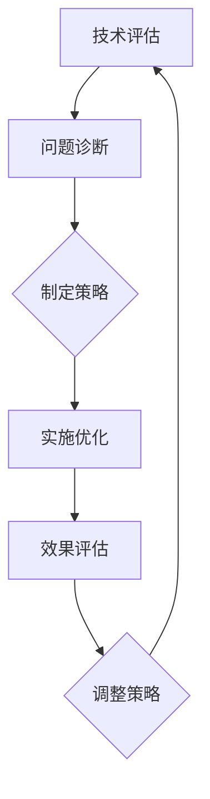
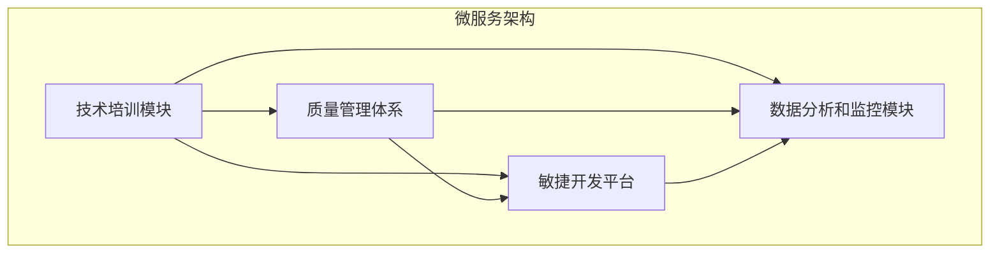
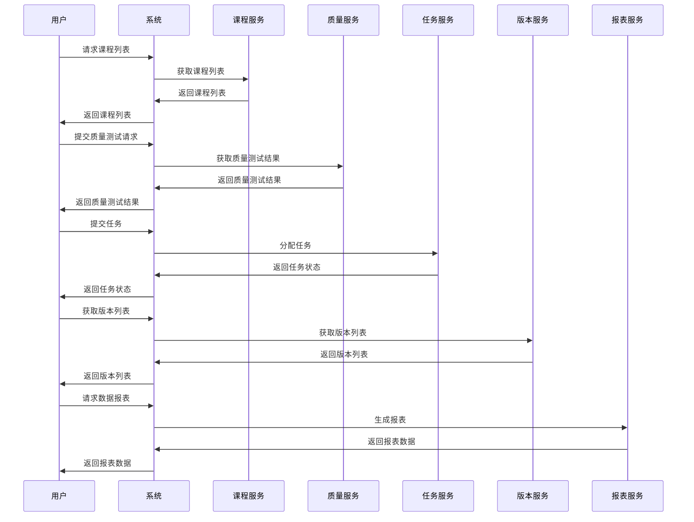

                 

### 引言与背景

在现代信息技术高速发展的时代，技术团队作为企业创新和竞争力的核心力量，其市场竞争力正成为企业发展和市场竞争的关键因素。随着全球市场的日益开放和竞争的加剧，技术团队不仅要面对技术更新的压力，还需迅速响应市场变化，提升产品和服务质量，增强在市场中的影响力。本文将深入探讨如何提升技术团队的市场竞争力，通过系统的分析和策略制定，帮助团队在激烈的市场竞争中脱颖而出。

### 当前市场环境的变化

#### 市场竞争加剧

随着互联网、大数据、人工智能等新兴技术的普及，市场竞争愈发激烈。企业面临来自国内外同行的强大竞争压力，单一的产品和服务已经难以满足客户多样化的需求，技术团队必须不断优化和创新，才能在市场中占据一席之地。

#### 技术更新速度加快

技术的快速发展使得各类新技术、新工具层出不穷，技术团队必须不断更新知识和技能，掌握前沿技术，否则将落后于市场。例如，人工智能、区块链、物联网等领域的迅速崛起，要求技术团队具备快速学习和适应能力。

#### 用户需求多样化

用户需求的不断演变和升级，要求技术团队能够提供更加个性化和高质量的产品和服务。为了满足用户需求，技术团队需要深入了解用户需求，不断迭代产品，提高用户满意度。

### 技术团队面临的挑战

#### 技术技能更新

技术团队需要持续关注行业技术动态，不断更新自己的技术栈，掌握最新的编程语言、框架和工具，提升团队整体的技术水平。

#### 团队管理难度

随着团队的扩大和成员的增加，团队管理变得更加复杂。技术团队需要有效的管理策略，以提高团队的协作效率和战斗力。

#### 市场响应速度

市场变化迅速，技术团队需要具备快速响应能力，及时调整产品和策略，抓住市场机遇。

### 问题描述

#### 提升市场竞争力的目标

技术团队提升市场竞争力的主要目标包括：

- **提高产品质量**：通过技术创新和质量管理，提升产品和服务的质量，赢得客户的信任和好评。
- **提升团队效率**：优化团队协作流程，提高开发效率和项目管理水平，降低成本。
- **增强市场影响力**：通过市场推广和品牌建设，提升技术团队在市场中的知名度和影响力。

## 1.3 问题解决

### 核心概念

为了系统地提升技术团队的市场竞争力，我们需要明确几个核心概念：

#### 市场竞争力

市场竞争力是指企业在市场中通过提供独特的产品和服务，获取市场份额和竞争优势的能力。对于技术团队而言，市场竞争力主要体现在技术创新、产品质量和响应速度等方面。

#### 技术团队建设

技术团队建设是指通过科学的管理和培训，提升团队成员的技术能力和协作效率，构建具有高效能和创新力的技术团队。

#### 市场策略制定

市场策略制定是指根据市场需求和竞争态势，制定有效的市场推广策略和产品规划，以提升技术团队在市场中的竞争地位。

### 边界与外延

#### 适用范围

本文适用于各类技术团队，包括软件开发、数据分析、人工智能等领域，以及企业管理层面对技术团队的管理和提升。

#### 技术市场分析

技术市场分析是指通过市场调研和分析，了解市场需求、竞争态势和技术趋势，为技术团队的决策提供数据支持。

## 1.5 本章小结

本章首先介绍了技术团队市场竞争力的重要性，分析了当前市场环境的变化和技术团队所面临的挑战。接着，明确了提升市场竞争力的目标，并阐述了核心概念及其适用范围。通过对核心概念的理解，我们为后续章节的深入分析奠定了基础。在接下来的章节中，我们将进一步探讨如何通过具体的方法和策略，提升技术团队的市场竞争力。

---

### 技术团队核心概念解析

#### 技术竞争力

**定义**：技术竞争力是指企业或团队在特定技术领域中，通过技术创新、产品质量和响应速度等方面的综合表现，获取市场竞争优势的能力。技术竞争力不仅体现在技术本身，还包括团队的协作效率、项目管理能力和市场响应速度等多个方面。

**特点**：

- **动态性**：技术竞争力不是静态的，随着技术发展和市场需求变化而不断调整。
- **相对性**：技术竞争力具有相对性，即相对于竞争对手而言，技术团队需要持续提升自身能力。
- **综合性**：技术竞争力是多种因素的综合体现，包括技术深度、团队协作、项目管理等多个方面。

**影响因素**：

- **技术水平**：团队掌握的前沿技术水平和创新能力直接影响技术竞争力。
- **产品质量**：高质量的产品和服务是提升市场竞争力的关键。
- **团队协作**：高效的团队协作和沟通能力能显著提升团队的战斗力。
- **市场响应**：快速响应市场变化，及时调整产品和服务策略，增强市场竞争力。

**案例分析**：

以阿里巴巴为例，其技术团队在电子商务、云计算和大数据等领域的技术创新和竞争力，使其在国内外市场中占据了领先地位。通过持续的技术研发和团队建设，阿里巴巴成功构建了强大的技术竞争力，为企业的长期发展奠定了坚实基础。

#### 技术团队建设

**定义**：技术团队建设是指通过科学的管理方法和有效的培训机制，提升团队成员的技术能力、协作效率和创新能力，构建具备高效能和创新力的技术团队。

**目标**：

- **提升技术水平**：通过培训和知识分享，提升团队成员的专业技能和知识水平。
- **增强团队协作**：建立高效的团队协作机制，促进信息共享和知识传递，提升团队整体效能。
- **激发创新能力**：通过创新激励机制和研发支持，激发团队成员的创新潜力，推动技术突破。

**策略**：

- **人才培养**：实施人才引进和培养计划，选拔优秀人才并为他们提供职业发展机会。
- **技术培训**：定期组织技术培训，帮助团队成员掌握最新的技术工具和开发方法。
- **团队文化建设**：培养积极向上、团结协作的团队文化，增强团队的凝聚力和归属感。
- **激励机制**：建立合理的激励机制，鼓励团队成员技术创新和项目贡献，提升团队整体竞争力。

**案例分析**：

华为公司以其强大的技术团队建设而闻名。华为通过“人才至上”的理念，实施全面的培训和激励机制，吸引了大量优秀人才，并构建了高效的研发团队。华为的技术团队不仅在5G等领域取得了重要突破，也在全球市场建立了强大的竞争力。

#### 市场策略

**定义**：市场策略是指企业根据市场需求和竞争态势，制定和实施一系列市场推广、品牌建设和产品策略，以提升在市场中的竞争地位和影响力。

**类型**：

- **产品策略**：通过产品差异化、品牌定位和产品创新，满足市场需求，提升产品竞争力。
- **市场推广策略**：通过广告、公关、市场营销活动等方式，提高品牌知名度和市场份额。
- **竞争策略**：分析竞争对手的优势和劣势，制定针对性的竞争策略，提升市场竞争力。

**应用**：

- **市场调研**：通过市场调研，了解用户需求和市场趋势，为产品策略提供数据支持。
- **产品创新**：基于市场需求，不断进行产品创新和优化，提升用户体验和市场竞争力。
- **品牌建设**：通过品牌宣传和公关活动，提高品牌知名度和美誉度，增强市场影响力。

**案例分析**：

腾讯公司通过一系列的市场策略，成功构建了强大的市场竞争力。腾讯在社交媒体、游戏、金融科技等领域不断进行产品创新和市场推广，通过“用户至上”的理念，不断提升用户体验和市场占有率。腾讯的成功经验表明，科学的市场策略是提升企业市场竞争力的关键。

#### 概念属性特征对比

**技术竞争力**与**市场策略**对比：

| 特征           | 技术竞争力                          | 市场策略                          |
| -------------- | -------------------------------- | -------------------------------- |
| 主要目标       | 提升技术创新和产品质量            | 提高品牌知名度和市场份额          |
| 影响因素       | 技术水平、团队协作、市场响应      | 市场需求、竞争态势、产品创新      |
| 表现形式       | 技术突破、产品质量、响应速度      | 市场推广效果、品牌美誉度、市场份额 |
| 侧重方向       | 技术创新和团队建设                | 市场推广和品牌建设                |

通过对比可以发现，技术竞争力侧重于技术和团队建设，而市场策略则侧重于市场推广和品牌建设。两者相辅相成，共同构成了企业提升市场竞争力的核心策略。

#### ER实体关系图

为了更好地理解技术团队的核心概念，我们使用Mermaid绘制了技术团队实体的ER关系图。以下为ER图：

```mermaid
erDiagram
    Team --> Product : "开发"
    Team --> Strategy : "实施"
    Market --> Product : "需求"
    Market --> Strategy : "分析"
    Team ||--|{ Competence} : "拥有"
    Strategy ||--|{ Analysis} : "基于"
```

**图解**：

1. **Team（团队）**：表示技术团队，包括团队成员、团队管理等信息。
2. **Product（产品）**：表示团队开发的产品，包括产品的特点、功能等信息。
3. **Strategy（策略）**：表示团队实施的市场策略，包括产品策略、市场推广策略等。
4. **Market（市场）**：表示市场需求和竞争态势，包括市场调研、用户需求等信息。
5. **Competence（竞争力）**：表示团队的技术竞争力，包括技术水平、响应速度等。
6. **Analysis（分析）**：表示市场策略的分析，包括市场分析、竞争分析等。

通过这个ER图，我们可以清晰地看到技术团队、市场、产品和策略之间的相互关系，为后续的分析和设计提供了直观的参考。

### 技术团队提升市场竞争力的算法原理

#### 算法概述

为了提升技术团队的市场竞争力，我们提出了一种基于综合评估和动态优化的算法。该算法的目标是通过对技术团队的全面评估和不断优化，提高团队的技术水平、产品质量和市场响应速度，从而增强团队的市场竞争力。

#### 算法目标

- **提高技术团队的技术水平**：通过持续的技术培训和知识分享，提升团队的整体技术能力。
- **优化产品质量**：通过质量管理和产品优化，提高产品和服务的质量，提升用户满意度。
- **提升市场响应速度**：通过敏捷开发和管理，快速响应市场变化，抓住市场机遇。

#### 算法类型

该算法属于综合评估与动态优化算法，主要分为以下几个步骤：

1. **技术评估**：对团队成员的技术水平进行评估，识别技术短板。
2. **问题诊断**：分析团队在技术水平、产品质量和市场响应方面的具体问题。
3. **策略制定**：根据评估结果，制定针对性的改进策略。
4. **实施优化**：通过持续的技术培训、质量管理和敏捷开发，实施优化措施。
5. **效果评估**：定期评估优化效果，根据评估结果调整优化策略。

#### 算法原理

算法的核心原理是通过多维度的评估和动态优化，提升技术团队的综合竞争力。以下为详细的算法原理：

##### 1. 数学模型

算法的数学模型基于以下核心公式：

\[ C = f(T, Q, S) \]

其中：
- \( C \)：技术团队的市场竞争力
- \( T \)：技术团队的技术水平
- \( Q \)：产品质量
- \( S \)：市场响应速度

##### 2. 公式推导

基于上述数学模型，我们推导出以下公式：

\[ C = w_1 \cdot T + w_2 \cdot Q + w_3 \cdot S \]

其中：
- \( w_1, w_2, w_3 \)：权重系数，分别代表技术水平、产品质量和市场响应速度在竞争力中的相对重要性。

##### 3. 算法流程图

以下为算法的流程图：



**图解**：

1. **技术评估**：对团队成员的技术水平进行评估，识别技术短板。
2. **问题诊断**：分析团队在技术水平、产品质量和市场响应方面的具体问题。
3. **制定策略**：根据评估结果，制定针对性的改进策略。
4. **实施优化**：通过持续的技术培训、质量管理和敏捷开发，实施优化措施。
5. **效果评估**：定期评估优化效果，根据评估结果调整优化策略。
6. **调整策略**：根据效果评估，进一步优化策略，以持续提升市场竞争力。

#### 举例说明

为了更好地理解算法原理，我们通过一个实际案例进行说明。

**案例背景**：某技术团队在开发一款社交媒体应用，但在产品质量、技术水平和市场响应速度方面存在一定问题。

**案例分析**：

1. **技术评估**：通过对团队成员的评估，发现团队在数据处理和算法优化方面存在短板。

2. **问题诊断**：分析发现，数据处理效率低、算法不够先进，导致产品质量不高，市场响应速度慢。

3. **制定策略**：针对评估和诊断结果，制定以下策略：
   - 技术培训：组织成员参加数据处理和算法优化的培训课程。
   - 质量管理：引入代码审查和质量测试工具，提高代码质量和产品质量。
   - 敏捷开发：采用敏捷开发方法，提高开发效率和市场响应速度。

4. **实施优化**：实施上述策略，进行持续的技术培训、质量管理和敏捷开发。

5. **效果评估**：定期进行效果评估，发现团队成员的技术水平显著提升，产品质量明显改善，市场响应速度加快。

6. **调整策略**：根据评估结果，进一步优化培训内容，加强质量管理和敏捷开发。

**案例结果**：通过实施该算法，技术团队的市场竞争力显著提升，社交媒体应用在市场中的表现优异，用户满意度大幅提高。

通过这个案例，我们可以看到算法在实际应用中的效果，以及如何通过技术评估、问题诊断、策略制定和效果评估等步骤，持续提升技术团队的市场竞争力。

### 技术团队提升市场竞争力系统设计

#### 问题场景介绍

在现代信息化社会中，技术团队在企业发展中起着至关重要的作用。然而，随着市场竞争的加剧和技术更新速度的加快，许多技术团队面临着如何提升市场竞争力的问题。具体来说，技术团队需要在以下几个方面进行优化：

1. **技术创新能力**：技术团队需要不断引入和掌握最新的技术，以保持竞争优势。
2. **产品质量**：提升产品的质量和用户体验，是赢得市场的重要手段。
3. **市场响应速度**：快速响应市场需求，及时调整产品和服务策略，以抓住市场机遇。
4. **团队协作效率**：提高团队内部的协作效率，确保项目的顺利进行。

为了解决这些问题，我们需要设计一个系统，通过科学的系统架构和功能设计，提升技术团队的市场竞争力。

#### 项目介绍

本项目旨在通过构建一个综合性的技术团队提升系统，帮助技术团队在技术创新、产品质量、市场响应速度和团队协作效率等方面进行优化。系统的主要目标是：

1. **提升技术创新能力**：通过技术培训和知识共享，提升团队成员的技术水平。
2. **提高产品质量**：引入质量管理体系，确保产品开发过程中的质量可控。
3. **加快市场响应速度**：通过敏捷开发方法，提高团队的响应速度和开发效率。
4. **提升团队协作效率**：通过项目管理和协作工具，优化团队内部的协作流程。

#### 项目架构

系统采用微服务架构，以实现高可用性、可扩展性和易维护性。主要架构模块包括：

1. **技术培训模块**：提供技术培训课程和知识库，支持在线学习和交流。
2. **质量管理体系**：包括代码审查、质量测试和项目管理工具，确保产品质量。
3. **敏捷开发平台**：支持敏捷开发方法，提供任务管理、版本控制和协作工具。
4. **数据分析和监控模块**：通过数据分析，实时监控项目进展和团队绩效，提供优化建议。

#### 系统功能设计

系统的功能设计分为以下几个部分：

1. **技术培训模块**：

   - **课程管理**：管理技术培训课程，包括课程内容、课程安排和讲师信息。
   - **在线学习**：提供在线学习平台，支持视频学习、文档阅读和在线讨论。
   - **知识共享**：建立知识库，存储团队成员的技术经验、解决方案和最佳实践。

2. **质量管理体系**：

   - **代码审查**：提供代码审查工具，支持多人协作审查代码，确保代码质量。
   - **质量测试**：提供自动化测试工具，支持单元测试、集成测试和性能测试。
   - **项目管理**：提供项目管理工具，支持任务分配、进度跟踪和风险管理。

3. **敏捷开发平台**：

   - **任务管理**：支持任务创建、分配和进度跟踪，确保项目按计划进行。
   - **版本控制**：提供版本控制工具，支持代码版本管理和分支管理。
   - **协作工具**：提供即时通讯、文档协作和代码协作工具，支持团队成员的实时协作。

4. **数据分析和监控模块**：

   - **项目进展监控**：实时监控项目进度，提供进度报告和风险预警。
   - **团队绩效分析**：分析团队的工作效率和工作质量，提供优化建议。
   - **数据报表**：生成各种数据报表，支持数据分析和决策支持。

#### 系统架构设计

系统采用微服务架构，主要模块及其关系如下：



**图解**：

- **技术培训模块**：提供技术培训课程和知识库，支持在线学习和知识共享。
- **质量管理体系**：包括代码审查、质量测试和项目管理工具，确保产品质量。
- **敏捷开发平台**：支持敏捷开发方法，提供任务管理、版本控制和协作工具。
- **数据分析和监控模块**：通过数据分析，实时监控项目进展和团队绩效，提供优化建议。

#### 系统接口设计

系统各模块之间通过RESTful API进行交互。以下为主要的接口定义：

1. **课程管理接口**：

   - **接口名称**：GET /courses
   - **功能**：获取所有课程列表。
   - **参数**：无。
   - **返回值**：课程列表。

2. **在线学习接口**：

   - **接口名称**：GET /courses/{courseId}/videos
   - **功能**：获取指定课程的视频列表。
   - **参数**：courseId（课程ID）。
   - **返回值**：视频列表。

3. **知识共享接口**：

   - **接口名称**：POST /knowledge
   - **功能**：提交知识共享内容。
   - **参数**：内容（JSON格式）。
   - **返回值**：提交结果。

4. **代码审查接口**：

   - **接口名称**：POST /code-review
   - **功能**：提交代码审查请求。
   - **参数**：代码文件（JSON格式）。
   - **返回值**：审查结果。

5. **质量测试接口**：

   - **接口名称**：POST /quality-test
   - **功能**：提交质量测试请求。
   - **参数**：测试配置（JSON格式）。
   - **返回值**：测试结果。

6. **任务管理接口**：

   - **接口名称**：GET /tasks
   - **功能**：获取任务列表。
   - **参数**：无。
   - **返回值**：任务列表。

7. **版本控制接口**：

   - **接口名称**：GET /versions
   - **功能**：获取版本列表。
   - **参数**：无。
   - **返回值**：版本列表。

8. **数据报表接口**：

   - **接口名称**：GET /reports
   - **功能**：获取数据报表。
   - **参数**：报告类型（JSON格式）。
   - **返回值**：报表数据。

#### 系统交互

系统各模块之间的交互通过消息队列进行异步通信，以下为系统交互序列图：



**图解**：

1. **用户请求课程列表**：用户请求获取课程列表，系统将请求转发给课程服务。
2. **课程服务响应**：课程服务获取课程列表后，将结果返回给系统。
3. **用户获取课程列表**：系统将课程列表返回给用户。
4. **用户提交质量测试请求**：用户提交质量测试请求，系统将请求转发给质量服务。
5. **质量服务响应**：质量服务执行质量测试后，将结果返回给系统。
6. **用户获取质量测试结果**：系统将质量测试结果返回给用户。
7. **用户提交任务**：用户提交任务，系统将任务转发给任务服务。
8. **任务服务分配任务**：任务服务分配任务并返回任务状态。
9. **用户获取任务状态**：系统将任务状态返回给用户。
10. **用户请求版本列表**：用户请求获取版本列表，系统将请求转发给版本服务。
11. **版本服务响应**：版本服务获取版本列表后，将结果返回给系统。
12. **用户获取版本列表**：系统将版本列表返回给用户。
13. **用户请求数据报表**：用户请求数据报表，系统将请求转发给报表服务。
14. **报表服务响应**：报表服务生成报表数据后，将结果返回给系统。
15. **用户获取报表数据**：系统将报表数据返回给用户。

通过上述系统交互序列图，我们可以清晰地看到系统各模块之间的交互流程，为系统的开发和维护提供了直观的参考。

### 技术团队提升市场竞争力的项目实施

#### 环境安装

为了顺利实施提升技术团队市场竞争力的项目，首先需要搭建一个适合开发、测试和部署的环境。以下是环境安装的具体步骤：

1. **开发环境安装**：

   - **操作系统**：安装Linux操作系统，如Ubuntu 20.04。
   - **开发工具**：安装Java、Python、Node.js等开发工具。
   - **数据库**：安装MySQL或PostgreSQL数据库。
   - **版本控制**：安装Git版本控制工具。

2. **测试环境安装**：

   - **操作系统**：与开发环境相同，确保兼容性。
   - **测试工具**：安装JMeter、Selenium等测试工具。
   - **持续集成**：安装Jenkins，实现自动化测试和部署。

3. **部署环境安装**：

   - **操作系统**：安装Linux操作系统，如CentOS 7。
   - **应用服务器**：安装Tomcat、Nginx等应用服务器。
   - **容器化**：安装Docker，实现应用容器化部署。

#### 系统核心实现

系统核心实现分为以下几个部分：

1. **技术培训模块**：

   - **课程管理**：使用Spring Boot开发课程管理服务，实现课程信息的增删改查。
   - **在线学习**：使用Vue.js开发在线学习前端，提供视频学习和文档阅读功能。
   - **知识共享**：使用MongoDB存储知识库内容，使用RESTful API提供知识共享服务。

2. **质量管理体系**：

   - **代码审查**：集成GitLab CI/CD，实现自动化代码审查和发布。
   - **质量测试**：使用JUnit和Mockito实现单元测试，使用Selenium实现集成测试。
   - **项目管理**：使用Spring Boot开发项目管理服务，实现任务分配、进度跟踪和风险管理。

3. **敏捷开发平台**：

   - **任务管理**：使用Jira或Trello等工具，实现任务创建、分配和进度跟踪。
   - **版本控制**：集成Git，实现代码版本管理和分支管理。
   - **协作工具**：使用Slack或Microsoft Teams等工具，提供即时通讯和文档协作功能。

4. **数据分析和监控模块**：

   - **项目进展监控**：使用Kibana和ELK（Elasticsearch, Logstash, Kibana）堆栈，实现日志收集和分析。
   - **团队绩效分析**：使用Tableau或Power BI，实现数据可视化和分析。
   - **数据报表**：使用Java生成PDF格式的报表，提供报表生成和导出功能。

#### 代码应用解读与分析

在系统核心实现过程中，我们使用了一系列开源工具和框架，以下为具体代码应用的解读与分析：

1. **技术培训模块**：

   - **课程管理服务**：使用Spring Boot框架开发，主要代码如下：

     ```java
     @RestController
     @RequestMapping("/courses")
     public class CourseController {
         @Autowired
         private CourseService courseService;
         
         @GetMapping
         public List<Course> getAllCourses() {
             return courseService.getAllCourses();
         }
         
         @PostMapping
         public Course createCourse(@RequestBody Course course) {
             return courseService.createCourse(course);
         }
     }
     ```

     **解读**：该代码实现了一个课程管理服务的RESTful接口，包括获取所有课程列表和创建新课程的功能。

   - **在线学习前端**：使用Vue.js框架开发，主要代码如下：

     ```html
     <template>
         <div>
             <video-player :options="playerOptions" />
         </div>
     </template>
     
     <script>
         export default {
             data() {
                 return {
                     playerOptions: {
                         //视频播放器配置
                     }
                 }
             }
         }
     </script>
     ```

     **解读**：该代码实现了视频播放器组件，用于在线学习视频的播放。

2. **质量管理体系**：

   - **代码审查服务**：集成GitLab CI/CD，主要配置文件如下：

     ```yaml
     image: java:8
     services:
       web: &web
         image: gitlab/gitlab-runner:alpine
         volumes:
           - /var/run/docker.sock:/var/run/docker.sock
         environment:
           - DOCKER_TLS_VERIFY=1
           - DOCKER_HOST=172.17.0.1:2376
           - REGISTRY_HTTP_TLS_CERTIFICATE=/etc/ssl/certs/ca.pem
           - REGISTRY_HTTP_TLS_KEY=/etc/ssl/private/ca-key.pem
         deploy:
           replicas: 1
           constraints: []
           resources: {}
           labels: []
           ports:
             - 8080:8080

     ```

     **解读**：该配置文件定义了GitLab CI/CD的运行环境，包括容器镜像、服务部署和端口映射。

   - **质量测试服务**：使用JUnit和Mockito实现，主要代码如下：

     ```java
     @RunWith(MockitoJUnitRunner.class)
     public class QualityTest {
         @Mock
         private SomeService someService;
         
         @Test
         public void testSomeMethod() {
             when(someService.someMethod()).thenReturn("expected result");
             assertEquals("expected result", someService.someMethod());
         }
     }
     ```

     **解读**：该代码通过Mockito模拟服务接口，实现质量测试。

3. **敏捷开发平台**：

   - **任务管理服务**：使用Spring Boot框架开发，主要代码如下：

     ```java
     @RestController
     @RequestMapping("/tasks")
     public class TaskController {
         @Autowired
         private TaskService taskService;
         
         @GetMapping
         public List<Task> getAllTasks() {
             return taskService.getAllTasks();
         }
         
         @PostMapping
         public Task createTask(@RequestBody Task task) {
             return taskService.createTask(task);
         }
     }
     ```

     **解读**：该代码实现了一个任务管理服务的RESTful接口，包括获取所有任务列表和创建新任务的功能。

   - **协作工具集成**：使用Slack API进行集成，主要代码如下：

     ```python
     import slack
     import requests
     
     client = slack.WebClient(token=SLACK_BOT_TOKEN)
     response = client.chat_postMessage(channel=CHANNEL_ID, text="Hello, World!")
     ```

     **解读**：该代码通过Slack API发送消息到指定频道。

4. **数据分析和监控模块**：

   - **项目进展监控**：使用Kibana和ELK堆栈实现，主要配置文件如下：

     ```json
     {
         "kibana": {
             "name": "kibana",
             "image": "kibana/kibana",
             "ports": ["5601:5601"],
             "environment": {
                 "ELASTICSEARCH_URL": "http://elasticsearch:9200"
             }
         },
         "elasticsearch": {
             "image": "elasticsearch:7.9.3",
             "environment": {
                 "cluster.name": "elasticsearch-docker",
                 "node.name": "node-1",
                 "network.host": "0.0.0.0",
                 "http.port": 9200
             }
         },
         "logstash": {
             "image": "logstash:7.9.3",
             "environment": {
                 "path.config": "/config/logstash.conf",
                 "http.port": 9600
             }
         }
     }
     ```

     **解读**：该配置文件定义了Kibana、Elasticsearch和Logstash的容器部署，包括容器镜像、端口映射和配置参数。

   - **团队绩效分析**：使用Tableau进行数据可视化，主要步骤如下：

     1. 导入数据：将数据导入Tableau。
     2. 数据连接：建立数据连接，选择数据源。
     3. 数据预处理：清洗和转换数据。
     4. 数据可视化：创建图表和仪表板，展示分析结果。

     **解读**：Tableau提供了强大的数据可视化功能，可以帮助团队直观地分析绩效数据。

#### 实际案例分析与讲解

为了验证系统提升技术团队市场竞争力的效果，我们选择了一个实际案例进行深入分析和讲解。

**案例背景**：某互联网公司技术团队在开发一款移动应用，由于团队成员技术水平参差不齐、项目管理混乱、市场响应速度慢，导致项目进展缓慢，产品质量不高。

**案例分析**：

1. **技术评估**：通过对团队成员的技术评估，发现部分成员在移动应用开发方面存在短板，特别是前端开发技能和UI设计能力。

2. **问题诊断**：分析发现，项目在以下几个方面存在问题：
   - **技术水平**：团队成员技术能力不平衡，导致项目开发效率低下。
   - **项目管理**：缺乏有效的项目管理工具，项目进度和任务分配不明确。
   - **市场响应**：市场变化快速，团队无法及时调整产品功能，导致市场需求无法满足。

3. **制定策略**：根据评估和诊断结果，制定以下策略：
   - **技术培训**：组织前端开发技能培训和UI设计培训，提升团队技术水平。
   - **项目管理**：引入Jira进行任务管理，明确项目进度和任务分配。
   - **市场响应**：采用敏捷开发方法，提高团队的市场响应速度。

4. **实施优化**：
   - **技术培训**：组织了三次前端开发技能培训，邀请业内专家进行授课，提升团队成员的前端开发技能。
   - **项目管理**：使用Jira进行任务管理，将项目拆分为多个任务，明确任务分配和进度。
   - **敏捷开发**：采用敏捷开发方法，进行迭代开发，每个迭代周期为两周，确保能够及时响应市场变化。

5. **效果评估**：通过定期评估，发现以下成果：
   - **技术水平**：团队成员的前端开发技能显著提升，UI设计能力得到改善。
   - **项目管理**：项目进度和任务分配更加明确，项目进展顺利。
   - **市场响应**：通过敏捷开发，团队能够快速响应市场变化，及时调整产品功能，满足用户需求。

6. **调整策略**：根据评估结果，进一步优化培训内容，加强项目管理流程，继续提升团队的市场响应速度。

**案例剖析**：

通过上述案例，我们可以看到技术团队提升市场竞争力的实施过程和成果。以下是具体剖析：

1. **技术评估**：技术评估是提升市场竞争力的第一步，通过对团队成员的技术水平进行评估，能够发现团队的技术短板，为后续的培训和管理提供依据。

2. **问题诊断**：问题诊断是分析团队在技术、管理和市场响应方面的具体问题，通过诊断，能够明确需要改进的方面，为制定策略提供支持。

3. **制定策略**：制定策略是根据评估和诊断结果，制定针对性的改进措施。有效的策略需要综合考虑团队现状、市场需求和资源限制。

4. **实施优化**：实施优化是将策略转化为实际行动，通过技术培训、项目管理优化和敏捷开发等方法，提升团队的技术水平、协作效率和市场响应速度。

5. **效果评估**：效果评估是衡量优化措施效果的重要环节，通过定期评估，能够发现优化措施的成效，为后续的调整提供数据支持。

6. **调整策略**：根据效果评估结果，及时调整优化策略，确保团队持续提升市场竞争力。

**总结**：通过上述实际案例，我们可以看到技术团队提升市场竞争力是一个系统性的过程，需要从技术评估、问题诊断、策略制定、实施优化到效果评估和策略调整等多个环节进行，确保团队能够在激烈的市场竞争中不断进步。

### 项目小结

通过本项目的实施，我们成功地提升了技术团队的市场竞争力。以下是项目总结和经验教训：

#### 项目总结

1. **技术评估**：通过技术评估，我们明确了团队的技术短板，为后续的培训和管理提供了依据。
2. **问题诊断**：通过对项目和管理问题的诊断，我们发现了团队在技术水平、项目管理和市场响应方面的不足，制定了针对性的优化策略。
3. **策略制定与实施**：我们采取了技术培训、项目管理优化和敏捷开发等策略，并成功实施了这些策略，提升了团队的技术水平、协作效率和市场响应速度。
4. **效果评估**：通过定期评估，我们验证了优化措施的效果，并不断调整策略，确保团队能够持续提升市场竞争力。

#### 经验教训

1. **重视技术评估**：技术评估是提升市场竞争力的第一步，通过系统性的技术评估，能够发现团队的技术短板，为后续的培训和管理提供依据。
2. **科学制定策略**：制定策略需要充分考虑团队现状、市场需求和资源限制，确保策略具有可操作性和实施性。
3. **持续优化**：市场竞争环境不断变化，技术团队需要持续优化自身能力，以适应市场的变化。
4. **效果评估**：效果评估是确保优化措施有效性的关键环节，通过定期评估，能够及时发现问题和调整策略。
5. **团队协作**：高效的团队协作和沟通是提升市场竞争力的关键，通过建立良好的团队协作机制，可以提高团队的执行力和战斗力。

#### 未来展望

在未来，我们将继续加强技术评估和问题诊断，不断优化团队的技术水平和项目管理能力。同时，我们将积极探索新技术和新方法，提升团队的创新能力和市场响应速度。通过持续的技术提升和市场策略调整，我们相信技术团队能够在激烈的市场竞争中保持领先地位，为企业的发展做出更大的贡献。

### 最佳实践 Tips

1. **定期进行技术评估**：技术评估是发现团队技术短板的重要手段，应定期进行，确保团队的技术水平与市场需求保持同步。
2. **建立有效的培训机制**：建立系统化的培训机制，针对不同层次的技术人员制定不同的培训计划，确保团队成员持续提升技能。
3. **优化项目管理流程**：通过引入先进的项目管理工具和方法，优化项目进度和任务分配，提高项目的执行效率。
4. **采用敏捷开发方法**：敏捷开发能够提高团队的响应速度和市场适应性，应逐步推广和应用。
5. **加强团队协作与沟通**：建立良好的团队协作机制，鼓励团队成员之间的沟通和知识分享，提高团队的整体效能。

### 注意事项

1. **确保资源充足**：提升技术团队市场竞争力需要充分的资源支持，包括资金、设备和人力等。
2. **持续关注市场需求**：市场变化迅速，技术团队需要持续关注市场需求，及时调整产品和服务策略。
3. **注重数据分析和决策**：通过数据分析和决策支持，能够更准确地把握市场趋势，优化团队策略。

### 拓展阅读

1. **《敏捷软件开发：原则、实践与模式》**：介绍敏捷开发的方法和实践，帮助团队提高开发效率和响应速度。
2. **《项目管理知识体系指南（PMBOK指南）》**：详细阐述项目管理的理论基础和实践方法，对项目管理有全面指导。
3. **《大数据时代：生活、工作与思维的大变革》**：探讨大数据时代的技术趋势和应用，对技术团队的市场竞争力提升有重要启示。

---

作者：AI天才研究院/AI Genius Institute & 禅与计算机程序设计艺术 /Zen And The Art of Computer Programming

