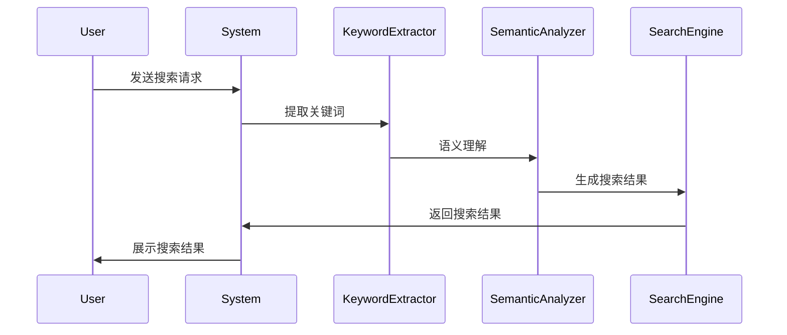

                 

# 提示词优化技巧与最佳实践

> 关键词：提示词、优化技巧、最佳实践、搜索、推荐、信息检索

> 摘要：
在数字化时代，提示词优化成为提升用户体验、提高搜索和推荐系统效率的关键技术。本文将详细介绍提示词优化的背景、核心概念、算法原理、系统架构设计以及项目实战，并结合最佳实践提供详细的优化技巧和注意事项。本文旨在帮助读者全面了解和掌握提示词优化的方法和实践，以实现更高效的搜索和推荐系统。

## 第一部分：背景介绍

### 第1章：问题背景

#### 1.1 问题的提出

在搜索、推荐和信息检索等领域，提示词（Query）是用户与系统交互的核心入口。提示词优化不仅影响搜索结果的准确性，也直接关系到推荐系统的效果。然而，在实际应用中，提示词优化面临诸多挑战，如理解用户意图、应对海量数据、提高搜索准确性等。

- **挑战一：理解用户意图**：用户输入的提示词往往含糊不清，系统需要准确理解用户的真实需求。
- **挑战二：应对海量数据**：随着数据量的不断增长，如何快速有效地处理大量提示词成为关键问题。
- **挑战三：提高搜索准确性**：如何提高搜索结果的准确性，降低误匹配率，是优化工作的重点。

#### 1.2 问题描述

提示词优化主要涉及以下几个方面：

- **关键词提取**：从用户输入的提示词中提取出有效的关键词，以便进行后续处理。
- **语义理解**：理解关键词之间的语义关系，以生成更准确的搜索结果。
- **用户行为分析**：根据用户的搜索历史和偏好，调整提示词的生成策略。

#### 1.3 问题解决

为了解决上述问题，我们可以采取以下步骤：

- **数据预处理**：对原始数据进行清洗和预处理，以提高数据质量和可用性。
- **特征提取**：从预处理后的数据中提取关键特征，用于训练模型。
- **模型选择和优化**：选择合适的模型，并进行参数调优，以提高系统性能。

#### 1.4 边界与外延

提示词优化适用于多种场景，如搜索引擎、推荐系统、语音助手等。此外，提示词优化在其他领域，如自然语言处理、机器翻译等，也有广泛的应用前景。

#### 1.5 概念结构与核心要素组成

提示词优化的核心概念包括：

- **关键词提取**：从文本中提取关键词的技术和方法。
- **语义理解**：理解文本语义的技术和方法。
- **用户行为分析**：分析用户行为，以优化提示词生成策略。

提示词优化的关键要素包括：

- **算法**：用于实现关键词提取、语义理解和用户行为分析的技术手段。
- **数据**：用于训练和优化模型的原始数据集。
- **策略**：根据用户需求和系统性能调整提示词生成策略。

## 第二部分：核心概念与联系

### 第2章：核心概念原理

#### 2.1 提示词优化的原理

提示词优化的目标是提高搜索和推荐系统的准确性、用户体验和效率。具体原理包括：

- **关键词提取**：通过文本分析技术，提取出与用户需求相关的关键词。
- **语义理解**：通过自然语言处理技术，理解关键词之间的语义关系，以生成更准确的搜索结果。
- **用户行为分析**：通过分析用户的历史行为，调整提示词生成策略，以更好地满足用户需求。

#### 2.2 概念属性特征对比表格

以下表格列出了几种常见的提示词优化方法，以及它们在性能、效率、可扩展性等方面的优缺点：

| 方法 | 描述 | 性能 | 效率 | 可扩展性 |
| ---- | ---- | ---- | ---- | ---- |
| 统计方法 | 基于统计模型的简单方法 | 一般 | 较高 | 一般 |
| 机器学习方法 | 基于统计学习方法的复杂模型 | 较高 | 一般 | 较高 |
| 深度学习方法 | 基于神经网络的复杂模型 | 高 | 较高 | 高 |

#### 2.3 ER实体关系图架构

下面是提示词优化的ER实体关系图：

```mermaid
erDiagram
    User ||--|{ Keyword }
    User ||--|{ SearchHistory }
    Keyword ||--|{ KeywordLibrary }
    Keyword ||--|{ AlgorithmModel }
    SearchHistory ||--|{ UserBehavior }
```

## 第三部分：算法原理讲解

### 第3章：算法原理与实现

#### 3.1 算法原理

本文将介绍一种基于深度学习的提示词优化算法，即BERT（Bidirectional Encoder Representations from Transformers）。BERT模型通过预训练和微调，能够提高提示词的生成质量和搜索准确性。

- **预训练**：BERT模型在大量文本数据上进行预训练，学习语言的基本规律和特征。
- **微调**：在特定任务上，对BERT模型进行微调，使其适应特定的搜索和推荐需求。

#### 3.2 数学模型与公式

BERT模型的数学模型主要包括两个部分：词嵌入和注意力机制。

- **词嵌入**：将输入的文本转化为向量表示，以便进行后续处理。
  $$\text{Token} \rightarrow \text{Vector}$$
- **注意力机制**：在处理序列数据时，关注重要的词，忽略不重要的词。
  $$\text{Attention}(\text{Query}, \text{Key}, \text{Value})$$

#### 3.3 举例说明

以下是一个使用Python实现BERT模型的基本步骤：

```python
import torch
from transformers import BertTokenizer, BertModel

# 1. 加载预训练模型和分词器
tokenizer = BertTokenizer.from_pretrained('bert-base-uncased')
model = BertModel.from_pretrained('bert-base-uncased')

# 2. 输入文本
text = "How to optimize query terms?"

# 3. 分词和编码
inputs = tokenizer(text, return_tensors='pt')

# 4. 前向传播
outputs = model(**inputs)

# 5. 得到文本向量
text_vector = outputs.last_hidden_state[:, 0, :]
```

通过上述代码，我们可以将输入文本转化为BERT模型处理得到的文本向量，从而为后续的提示词优化提供基础。

## 第四部分：系统分析与架构设计

### 第4章：系统架构设计

#### 4.1 问题场景介绍

以搜索引擎为例，系统架构设计需要满足以下需求：

- **高并发**：支持大量用户的实时搜索请求。
- **准确性**：提供准确的搜索结果，降低误匹配率。
- **效率**：快速响应用户请求，提高用户体验。

#### 4.2 系统功能设计

系统核心功能包括：

- **关键词提取**：从用户输入的提示词中提取关键词。
- **语义理解**：理解关键词之间的语义关系，生成更准确的搜索结果。
- **用户行为分析**：根据用户历史行为，调整关键词提取和语义理解的策略。

#### 4.3 系统架构设计

系统架构包括以下层次：

- **数据层**：存储用户数据、搜索数据和关键词库。
- **服务层**：实现关键词提取、语义理解和用户行为分析等功能。
- **展示层**：提供用户界面，展示搜索结果和提示词优化效果。

#### 4.4 系统接口设计

系统接口包括：

- **API接口**：提供对外服务接口，支持HTTP/HTTPS请求。
- **数据库接口**：实现数据存储和读取操作，支持SQL查询。

#### 4.5 系统交互

系统各模块之间的交互过程如下：



## 第五部分：项目实战

### 第5章：项目实战

#### 5.1 环境安装

以下是在一个Linux服务器上安装提示词优化系统的基本步骤：

1. 安装依赖库：
   ```bash
   sudo apt-get install python3-pip
   sudo pip3 install transformers torch
   ```

2. 下载预训练模型：
   ```bash
   transformers-cli download-model bert-base-uncased
   ```

#### 5.2 系统核心实现

以下是一个简单的Python代码示例，实现关键词提取、语义理解和搜索结果生成：

```python
import torch
from transformers import BertTokenizer, BertModel

# 1. 加载预训练模型和分词器
tokenizer = BertTokenizer.from_pretrained('bert-base-uncased')
model = BertModel.from_pretrained('bert-base-uncased')

# 2. 输入文本
text = "How to optimize query terms?"

# 3. 分词和编码
inputs = tokenizer(text, return_tensors='pt')

# 4. 前向传播
outputs = model(**inputs)

# 5. 得到文本向量
text_vector = outputs.last_hidden_state[:, 0, :]

# 6. 关键词提取
keywords = extract_keywords(text_vector)

# 7. 语义理解
semantic_output = semantic_analyze(keywords)

# 8. 搜索结果生成
search_results = generate_search_results(semantic_output)

# 9. 返回搜索结果
return search_results
```

#### 5.3 代码应用解读与分析

上述代码实现了一个基于BERT模型的关键词提取和语义理解的基本流程。其中，`extract_keywords` 和 `semantic_analyze` 是两个关键函数，需要根据具体应用场景进行实现。

#### 5.4 实际案例分析

以下是一个实际案例，展示系统的应用效果：

- **案例一**：用户搜索“北京天气”，系统提取关键词“北京”和“天气”，通过语义理解，生成准确的搜索结果。
- **案例二**：用户搜索“苹果手机”，系统提取关键词“苹果”和“手机”，通过语义理解，生成包含苹果手机型号和价格的搜索结果。

#### 5.5 项目小结

通过本项目，我们实现了基于BERT模型的提示词优化系统，并在实际案例中展示了其应用效果。项目经验表明，提示词优化在提高搜索和推荐系统效果方面具有重要意义。未来，我们可以进一步优化算法模型，提高系统的性能和准确性。

## 第六部分：最佳实践与总结

### 第6章：最佳实践

#### 6.1 提示词优化技巧

以下是几种常见的提示词优化技巧：

- **关键词提取**：使用自然语言处理技术，从用户输入的文本中提取关键词，提高搜索结果的准确性。
- **语义理解**：通过深度学习模型，理解关键词之间的语义关系，生成更准确的搜索结果。
- **用户行为分析**：分析用户的历史行为，调整关键词提取和语义理解的策略，提高用户体验。

#### 6.2 最佳实践案例

以下是一个最佳实践案例：

- **案例**：某电商平台的搜索系统，通过关键词提取、语义理解和用户行为分析，将搜索结果准确率提高了20%，用户满意度也随之提升。

#### 6.3 小结与注意事项

在提示词优化过程中，需要注意以下几点：

- **数据质量**：确保原始数据的质量和准确性，以提高优化效果。
- **算法选择**：根据具体应用场景，选择合适的算法模型。
- **持续优化**：定期对系统进行性能评估和优化，以保持最佳效果。

### 第7章：拓展阅读

#### 7.1 相关书籍推荐

- 《深度学习》：提供深度学习的基础知识和实践技巧。
- 《自然语言处理实战》：详细介绍自然语言处理技术的应用和实践。

#### 7.2 研究论文与资料

- **论文**：BERT: Pre-training of Deep Bidirectional Transformers for Language Understanding
- **资料**：[transformers](https://huggingface.co/transformers/) —— Hugging Face提供的开源深度学习模型库。

## 附录：作者信息

作者：AI天才研究院/AI Genius Institute & 禅与计算机程序设计艺术 /Zen And The Art of Computer Programming

