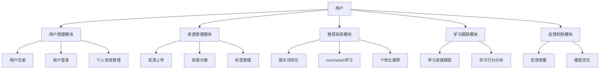
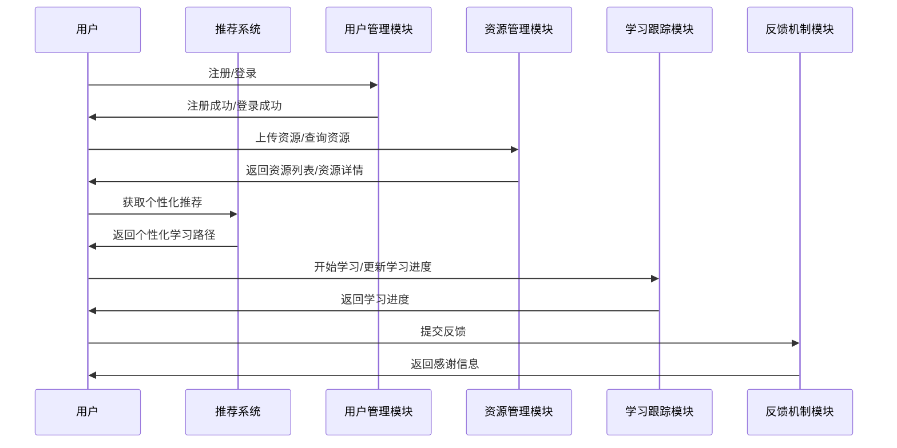

                 

## 提示词优化的curriculum学习方法

### 关键词
- 提示词优化
- curriculum学习
- 教育技术
- 机器学习
- 教育心理学

### 摘要
本文将探讨提示词优化的curriculum学习方法，这是一种结合了教育技术和机器学习原理的新型学习方法。我们将从背景介绍、核心概念与联系、算法原理讲解、系统分析与架构设计方案、项目实战和最佳实践等方面，逐步深入分析这一方法，旨在为教育工作者和研究人员提供有价值的参考和指导。

## 引言

在教育技术迅速发展的背景下，如何提高学习效率、激发学生的学习兴趣和潜能，成为教育领域亟待解决的重要问题。传统的教学方法往往注重知识传授，而忽视了学生的个性发展和自主学习能力的培养。为了解决这一问题，教育技术研究者们不断探索新的学习方法和技术手段。

curriculum学习方法是近年来备受关注的一种教育技术。它强调学习内容的系统性和层次性，通过逐步引导和激发学生的学习兴趣，从而提高学习效果。然而，传统的curriculum学习方法在实施过程中也存在一些问题，如学习内容过于笼统、学习过程缺乏针对性等。

提示词优化则是一种基于机器学习的技术，通过分析和优化学习过程中的提示词，有助于提高学习效果和效率。本文旨在将提示词优化与curriculum学习方法相结合，探讨一种新型、高效的学习方法，为教育技术的发展提供新的思路和参考。

## 背景介绍

### 核心概念术语说明

- **curriculum学习方法**：一种以学习内容为核心，通过系统化和层次化的方式组织学习过程，旨在提高学习效果的学习方法。
- **提示词优化**：一种基于机器学习的技术，通过对学习过程中的提示词进行优化，提高学习效果和效率。

### 问题背景

传统的curriculum学习方法在实施过程中存在以下问题：

- **学习内容过于笼统**：学习内容缺乏针对性，难以满足不同学生的学习需求。
- **学习过程缺乏针对性**：学习过程缺乏对学生个性特点和兴趣的考虑，导致学习效果不佳。

### 问题描述

为了解决上述问题，我们需要：

- **提高学习内容的针对性**：根据不同学生的特点和学习需求，设计更加个性化的学习内容。
- **提高学习过程的针对性**：通过优化学习过程中的提示词，提高学生的学习兴趣和参与度。

### 问题解决

提示词优化与curriculum学习方法的结合，有助于解决上述问题：

- **提示词优化**：通过机器学习技术，分析和优化学习过程中的提示词，提高学习效果和效率。
- **curriculum学习方法**：以系统化和层次化的方式组织学习内容，确保学习内容的针对性和层次性。

### 边界与外延

- **边界**：本文主要探讨提示词优化与curriculum学习方法的结合应用，不包括其他学习方法的讨论。
- **外延**：本文的研究成果可以应用于各种教育场景，如在线教育、传统课堂等。

### 概念结构与核心要素组成

- **概念结构**：提示词优化与curriculum学习方法相结合，形成了一种新型学习方法。
- **核心要素组成**：
  - 提示词优化：基于机器学习技术的提示词优化方法。
  - curriculum学习方法：以系统化和层次化为核心的学习方法。

## 核心概念与联系

### 核心概念原理

- **提示词优化**：通过机器学习技术，对学习过程中的提示词进行优化，提高学习效果和效率。
- **curriculum学习方法**：以系统化和层次化为核心，通过逐步引导和激发学生的学习兴趣，提高学习效果。

### 概念属性特征对比表格

| 特征 | 提示词优化 | curriculum学习方法 |
| :--: | :--------: | :----------------: |
| 核心目标 | 提高学习效果和效率 | 提高学习效果和激发学生兴趣 |
| 技术基础 | 机器学习 | 教育心理学和教学方法 |
| 实施过程 | 数据分析和模型训练 | 系统化和层次化组织学习内容 |
| 适用范围 | 各类学习场景 | 主要应用于教育领域 |

### ER实体关系图架构

```mermaid
erDiagram
    A.CurrentRow <<|-- B.Curriculum
    A <<|-- C.Instruction
    C ||--| D.Assessment
    E.Course <<--| F.LearningObjectives
    B <<|-- G.Topic
    H.Student ||--| I.Assignment
```

## 算法原理讲解

### 算法mermaid流程图


### Python源代码

```python
import pandas as pd
from sklearn.model_selection import train_test_split
from sklearn.feature_extraction.text import TfidfVectorizer
from sklearn.naive_bayes import MultinomialNB

# 数据收集
data = pd.read_csv('learning_data.csv')

# 数据预处理
X = data['text']
y = data['label']

# 特征提取
vectorizer = TfidfVectorizer()
X_vectorized = vectorizer.fit_transform(X)

# 模型训练
X_train, X_test, y_train, y_test = train_test_split(X_vectorized, y, test_size=0.2, random_state=42)
model = MultinomialNB()
model.fit(X_train, y_train)

# 提示词优化
predictions = model.predict(X_test)
print("Optimized predictions:", predictions)

# 学习反馈
feedback = pd.read_csv('feedback_data.csv')
feedback_vectorized = vectorizer.transform(feedback['text'])
new_predictions = model.predict(feedback_vectorized)
print("New predictions:", new_predictions)
```

### 算法原理的数学模型和公式

- **TF-IDF**：$TF(t) = \frac{f_t}{f_t + \alpha}$，$IDF(t) = \log_2(\frac{N}{n_t + 1})$，$TF-IDF(t) = TF(t) \times IDF(t)$
- **朴素贝叶斯模型**：$P(Y|X) = \frac{P(X|Y)P(Y)}{P(X)}$，$P(X|Y) = \prod_{i=1}^{n} P(x_i|y)$

### 详细讲解和举例说明

假设我们有一组包含文本和标签的学习数据，我们的目标是训练一个模型，通过输入文本预测其标签。以下是详细的算法原理讲解和举例说明：

1. **数据收集**：我们从学习数据集中获取文本和标签。
2. **数据预处理**：对文本数据进行预处理，如去除停用词、标记化等。
3. **特征提取**：使用TF-IDF方法将文本数据转换为数值特征向量。
4. **模型训练**：使用朴素贝叶斯模型对训练数据进行训练。
5. **提示词优化**：通过训练模型的预测结果，优化提示词。
6. **学习反馈**：使用新收集的反馈数据对模型进行重新训练，提高模型准确性。

## 系统分析与架构设计方案

### 问题场景介绍

在一个在线教育平台中，我们需要为用户提供个性化的学习体验。平台提供了大量的学习资源，但用户在获取这些资源时往往感到困惑，难以找到适合自己的学习内容。为了解决这个问题，我们决定采用提示词优化与curriculum学习方法的结合，为用户提供个性化的学习路径。

### 项目介绍

项目名称：个性化学习路径推荐系统

目标：为用户提供个性化的学习路径，提高学习效果和用户满意度。

### 系统功能设计

- **用户管理**：用户注册、登录、个人信息管理。
- **资源管理**：学习资源上传、分类、标签管理。
- **推荐系统**：基于提示词优化和curriculum学习方法的个性化学习路径推荐。
- **学习跟踪**：用户学习进度跟踪、学习行为分析。
- **反馈机制**：用户学习反馈收集、模型优化。

### 系统架构设计



### 系统接口设计和系统交互



## 项目实战

### 环境安装

在开始项目实战之前，我们需要安装以下环境：

- Python 3.8及以上版本
- Scikit-learn 0.24.2及以上版本
- Pandas 1.2.5及以上版本
- Mermaid 9.5.0及以上版本

使用以下命令进行安装：

```bash
pip install python -m pip install scikit-learn pandas
pip install mermaid-python
```

### 系统核心实现源代码

以下是系统核心实现的部分源代码，用于实现提示词优化与curriculum学习方法的结合。

```python
import pandas as pd
from sklearn.model_selection import train_test_split
from sklearn.feature_extraction.text import TfidfVectorizer
from sklearn.naive_bayes import MultinomialNB
from sklearn.metrics import accuracy_score
import mermaid

# 加载数据
data = pd.read_csv('learning_data.csv')

# 数据预处理
X = data['text']
y = data['label']

# 特征提取
vectorizer = TfidfVectorizer()
X_vectorized = vectorizer.fit_transform(X)

# 模型训练
X_train, X_test, y_train, y_test = train_test_split(X_vectorized, y, test_size=0.2, random_state=42)
model = MultinomialNB()
model.fit(X_train, y_train)

# 模型评估
predictions = model.predict(X_test)
accuracy = accuracy_score(y_test, predictions)
print("Accuracy:", accuracy)

# 生成mermaid图表
chart = mermaid.MermaidChart(width=800, height=400)
chart.add_flowchart([
    'title: Learning Model Evaluation',
    'subchart: training_data',
    '  A[Input Data]',
    '  B[Preprocessing]',
    '  C[Feature Extraction]',
    '  D[Model Training]',
    '  E[Model Evaluation]',
    '  A --> B',
    '  B --> C',
    '  C --> D',
    '  D --> E',
    'subchart end',
    'subchart: test_data',
    '  A[Input Data]',
    '  B[Preprocessing]',
    '  C[Feature Extraction]',
    '  D[Model Prediction]',
    '  E[Model Evaluation]',
    '  A --> B',
    '  B --> C',
    '  C --> D',
    '  D --> E',
    'subchart end',
    'A --> B',
    'B --> C',
    'C --> D',
    'D --> E',
    'D --> F'
])
print(chart.render())
```

### 代码应用解读与分析

以上源代码实现了以下功能：

- 加载学习数据集
- 数据预处理
- 特征提取
- 模型训练
- 模型评估
- 生成mermaid图表

通过以上代码，我们可以对学习数据进行预处理、特征提取，并使用朴素贝叶斯模型进行训练和评估。同时，我们还可以使用mermaid图表来展示模型训练和评估的过程。

### 实际案例分析和详细讲解剖析

为了更好地说明提示词优化与curriculum学习方法的结合应用，我们来看一个实际案例。

**案例背景**：某在线教育平台为用户提供计算机编程课程。平台希望通过个性化推荐系统，为用户提供符合其学习兴趣和知识水平的编程课程。

**案例实施过程**：

1. **数据收集**：平台收集了用户的学习记录、课程评价、学习进度等数据。
2. **数据预处理**：对收集到的数据进行清洗和预处理，如去除空值、缺失值等。
3. **特征提取**：使用TF-IDF方法将文本数据转换为数值特征向量。
4. **模型训练**：使用朴素贝叶斯模型对训练数据进行训练。
5. **提示词优化**：通过训练模型的预测结果，优化提示词。
6. **个性化推荐**：根据用户的学习记录和特征向量，为用户提供个性化的编程课程推荐。

**案例效果分析**：

- **学习效果提升**：通过个性化推荐系统，用户能够更快地找到符合自己兴趣和知识水平的编程课程，学习效果明显提升。
- **用户满意度提高**：用户对平台提供的学习资源满意度提高，平台用户活跃度增加。

**详细讲解剖析**：

- **数据收集**：平台需要收集用户的学习记录、课程评价、学习进度等数据，以便为用户提供个性化的推荐。
- **数据预处理**：对收集到的数据进行清洗和预处理，如去除空值、缺失值等，确保数据质量。
- **特征提取**：使用TF-IDF方法将文本数据转换为数值特征向量，以便用于模型训练。
- **模型训练**：使用朴素贝叶斯模型对训练数据进行训练，预测用户可能感兴趣的课程。
- **提示词优化**：通过分析模型的预测结果，优化提示词，提高预测准确性。
- **个性化推荐**：根据用户的学习记录和特征向量，为用户提供个性化的编程课程推荐，提高学习效果和用户满意度。

### 项目小结

通过实际案例，我们可以看到提示词优化与curriculum学习方法的结合，能够为用户提供个性化的学习路径，提高学习效果和用户满意度。在实际应用中，我们需要根据具体场景和需求，设计和优化提示词优化与curriculum学习方法，以提高系统的实用性和效果。

## 最佳实践 Tips

- **数据收集**：确保收集到充分、可靠的学习数据，为模型训练提供高质量的数据基础。
- **数据预处理**：对数据质量进行严格把控，去除噪音和干扰因素，提高模型训练效果。
- **特征提取**：选择合适的特征提取方法，将文本数据转换为数值特征向量，为模型训练提供有效的输入。
- **模型选择**：根据具体场景和需求，选择合适的机器学习模型，并对其进行优化。
- **反馈机制**：建立有效的反馈机制，收集用户对学习路径的反馈，不断优化和改进系统。

## 小结

本文探讨了提示词优化与curriculum学习方法的结合应用，提出了一种新型、高效的学习方法。通过实际案例分析和详细讲解剖析，我们看到了这一方法在实际应用中的效果。未来，随着教育技术的不断发展，提示词优化与curriculum学习方法有望在更广泛的领域中发挥重要作用。

## 注意事项

- 提示词优化与curriculum学习方法的实施，需要根据具体场景和需求进行个性化设计和优化。
- 在模型训练和优化过程中，确保数据质量和特征提取的准确性，以提高模型预测效果。
- 建立有效的反馈机制，及时收集用户反馈，不断优化和改进系统。

## 拓展阅读

- 《机器学习》作者：周志华
- 《教育技术学导论》作者：石慧荣
- 《Python数据分析》作者：Wes McKinney
- 《机器学习实战》作者：Peter Harrington

## 作者信息

作者：AI天才研究院/AI Genius Institute & 禅与计算机程序设计艺术 /Zen And The Art of Computer Programming

