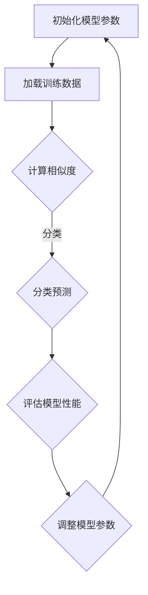
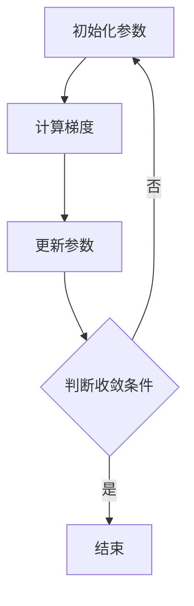
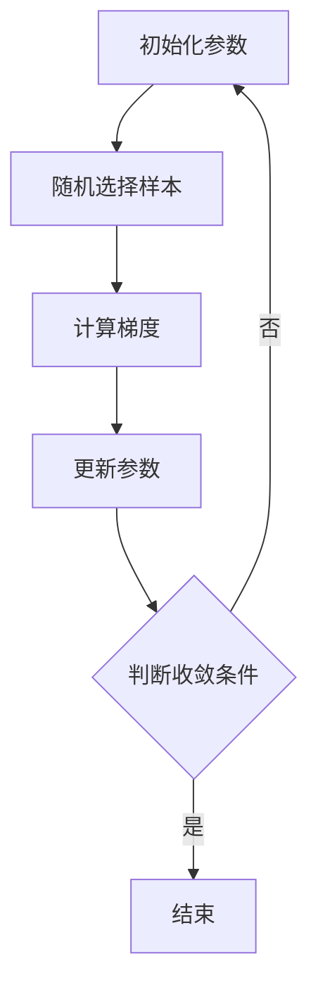
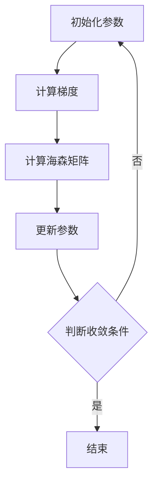
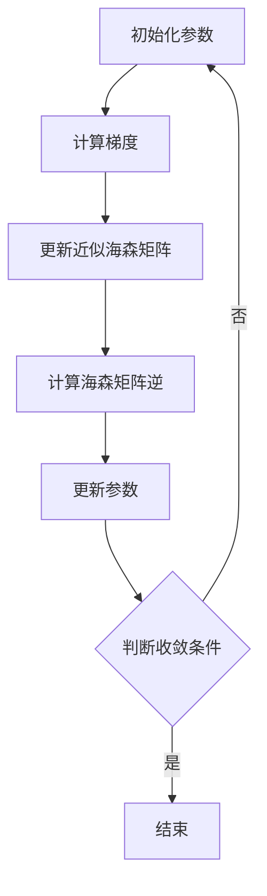
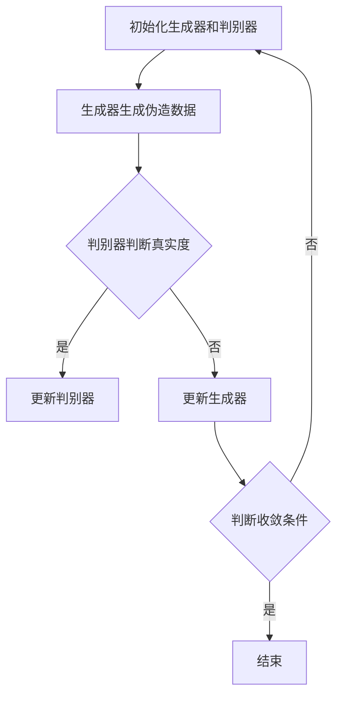
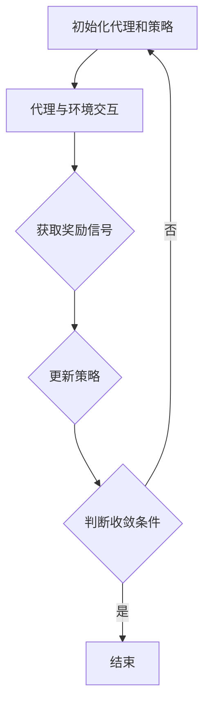

                 

### 第1章：问题背景与核心概念

#### 1.1.1 问题背景

##### 1.1.1.1 人工智能与机器学习的发展现状

人工智能（AI）作为一门前沿技术，正以前所未有的速度在各个领域中得到应用。近年来，随着深度学习技术的突破，AI取得了显著的进展，从语音识别、图像处理到自然语言处理，AI正在不断改变我们的生活方式。然而，随着AI应用场景的多样化，对于模型训练效率和效果的需求也越来越高。

机器学习（ML）是AI的核心技术之一，它通过算法让计算机从数据中学习并做出决策。传统的机器学习方法需要大量数据进行训练，这无疑增加了训练成本和时间。而Few-Shot Learning（FSL）作为机器学习的一个分支，致力于在样本数量极少的情况下实现有效的学习和决策，极大地降低了数据需求和训练成本。

##### 1.1.1.2 Few-Shot Learning的定义及其重要性

Few-Shot Learning旨在解决样本数量有限的情况下的学习问题。它通常定义为训练样本数量远小于一般机器学习任务所需的样本量，但仍然能够达到或接近传统机器学习模型的性能。具体来说，Few-Shot Learning的任务通常包括分类、回归、聚类等，其中训练样本数量可能只有几个到几十个。

Few-Shot Learning的重要性体现在以下几个方面：

1. **降低数据需求**：在许多实际应用中，获取大量标注数据是非常困难的，例如医学诊断、金融风险评估等。FSL能够在少量数据上进行训练，从而降低数据采集和标注的成本。

2. **提高模型泛化能力**：通过在少量数据上学习，FSL有助于模型更好地泛化到未见过的数据上，从而提高模型的实用性。

3. **应对动态环境**：在动态环境中，数据集可能会随着时间不断变化。FSL能够快速适应新数据的出现，提高了模型的动态响应能力。

##### 1.1.1.3 提示词优化的意义与需求

提示词（Prompt）是Few-Shot Learning中用于引导模型学习的重要工具。提示词是一种外部信息，它提供了一些关于目标任务的先验知识，帮助模型更快、更准确地学习。

提示词优化的意义主要体现在以下几个方面：

1. **提高学习效率**：通过优化提示词，可以减少模型在少量数据上的训练时间，提高学习效率。

2. **提升模型性能**：优化后的提示词能够更好地引导模型学习，从而提高模型的性能和泛化能力。

3. **应对复杂任务**：对于一些复杂任务，直接使用原始数据可能难以达到良好的效果。通过提示词优化，可以简化任务，降低模型的复杂性。

在Few-Shot Learning中，提示词优化的需求主要来源于以下几个方面：

1. **多样化需求**：不同的任务和场景可能需要不同类型的提示词，因此需要一种灵活的提示词优化方法来适应各种需求。

2. **实时调整**：在动态环境中，提示词需要能够实时调整，以适应数据的变化。

3. **鲁棒性**：提示词优化方法需要具备良好的鲁棒性，能够在不同数据集和任务上取得良好的效果。

#### 1.1.2 核心概念

##### 1.1.2.1 Few-Shot Learning的概念与类型

Few-Shot Learning是指在一个有限的样本集上进行学习的过程。它主要分为以下几种类型：

1. **零样本学习（Zero-Shot Learning）**：模型在训练时没有使用与测试任务相关的标签数据，但能够利用预定义的类别描述或原型进行预测。

2. **少样本学习（Few-Shot Learning）**：模型在训练时使用少量的样本进行学习，通常定义为几个到几十个样本。

3. **跨域Few-Shot Learning**：模型在训练时使用一个域的数据，但需要在另一个域上进行测试和预测。

4. **元学习（Meta-Learning）**：通过在多个任务上进行训练，使模型能够快速适应新任务的学习过程。

##### 1.1.2.2 提示词（Prompt）的定义与作用

提示词是指用于引导模型学习的外部信息，它可以是一个标签、一个短语、一个示例或一种语义信息。在Few-Shot Learning中，提示词的作用如下：

1. **提供先验知识**：提示词可以提供与目标任务相关的先验知识，帮助模型更快地收敛到最优解。

2. **引导学习过程**：通过优化提示词，可以引导模型关注关键信息，提高学习效率。

3. **降低数据依赖**：通过使用提示词，模型可以在少量数据上实现较好的性能，降低对大量数据的依赖。

##### 1.1.2.3 优化技术的分类与比较

在Few-Shot Learning中，优化技术主要分为以下几种类型：

1. **基于模型的方法**：通过调整模型结构或参数来优化学习过程，例如使用神经网络结构搜索（NAS）。

2. **基于数据的优化方法**：通过优化数据预处理、增强或采样策略来提高模型性能。

3. **基于先验知识的优化方法**：通过使用先验知识来指导学习过程，例如使用提示词或知识图谱。

4. **元学习（Meta-Learning）方法**：通过在多个任务上进行训练，使模型能够快速适应新任务。

不同优化技术的比较如下：

- **效果**：基于模型的方法通常能够获得较好的性能，但需要大量计算资源。基于数据的优化方法效果相对较慢，但计算资源需求较低。基于先验知识的方法效果取决于先验知识的质量，但计算资源需求较低。元学习方法效果较好，但需要大量训练时间。

- **适用场景**：基于模型的方法适用于需要高度定制化模型的场景。基于数据的优化方法适用于数据资源有限但模型结构已知的场景。基于先验知识的方法适用于有丰富先验知识的场景。元学习方法适用于需要快速适应新任务的场景。

#### 1.1.3 概念联系与边界

##### 1.1.3.1 Few-Shot Learning与提示词优化之间的关联

Few-Shot Learning与提示词优化之间存在紧密的联系。提示词优化是Few-Shot Learning中的一种关键技术，它通过提供外部信息来指导模型学习，从而提高学习效率和性能。

1. **共同目标**：Few-Shot Learning和提示词优化都旨在在样本数量有限的情况下实现高效学习。

2. **互补作用**：Few-Shot Learning提供了学习的基础框架，而提示词优化则通过提供外部信息来提高学习效果。

##### 1.1.3.2 提示词优化的边界条件与挑战

提示词优化在应用过程中面临一些挑战和边界条件：

1. **数据多样性**：不同任务和数据集可能需要不同类型的提示词，因此需要一种灵活的优化方法来适应各种需求。

2. **计算资源**：提示词优化可能需要大量的计算资源，尤其是在复杂任务和数据集上。

3. **实时调整**：在动态环境中，提示词需要能够实时调整，以适应数据的变化。

4. **鲁棒性**：提示词优化方法需要具备良好的鲁棒性，能够在不同数据集和任务上取得良好的效果。

#### 1.1.4 本章小结

本章介绍了Few-Shot Learning和提示词优化的背景和核心概念。通过分析人工智能和机器学习的发展现状，我们了解到Few-Shot Learning的重要性。同时，我们探讨了提示词优化的意义与需求，并介绍了Few-Shot Learning的不同类型和提示词的作用。

在概念联系与边界部分，我们分析了Few-Shot Learning与提示词优化之间的关联，以及提示词优化在应用过程中面临的挑战。本章为后续章节的内容奠定了基础，为深入探讨Few-Shot Learning和提示词优化技术提供了理论支持。

接下来，我们将进一步探讨Few-Shot Learning的基础理论，包括其基本原理、算法类型和应用场景。这将为读者提供更全面的Few-Shot Learning知识体系，为实际应用提供指导。

### 第2章：Few-Shot Learning基础理论

#### 2.1.1 基本原理

##### 2.1.1.1 Few-Shot Learning的数学模型

Few-Shot Learning的数学模型是基于统计学习理论的。在传统机器学习中，模型通过最大化训练数据的似然函数来学习参数。然而，在样本数量有限的情况下，这一方法不再适用，因为样本的随机性会显著影响模型的性能。

Few-Shot Learning的数学模型通常采用贝叶斯推理方法。贝叶斯推理是一种基于概率统计的推理方法，它通过先验知识和观测数据来更新模型的参数。在Few-Shot Learning中，先验知识通常由提示词提供。

1. **似然函数**：似然函数是衡量模型参数与观测数据一致性的指标。在Few-Shot Learning中，似然函数通常通过最大化后验概率来求解。后验概率是模型参数和观测数据的联合概率，它可以表示为：
   \[ P(\theta | x) \propto P(x | \theta)P(\theta) \]
   其中，\( \theta \)表示模型参数，\( x \)表示观测数据。

2. **贝叶斯估计**：贝叶斯估计是一种通过后验概率来估计模型参数的方法。在Few-Shot Learning中，贝叶斯估计可以通过最大化后验概率来实现：
   \[ \theta^* = \arg\max_\theta P(\theta | x) \]
   这意味着我们需要找到一组参数，使得后验概率最大。

##### 2.1.1.2 经典Few-Shot Learning算法介绍

Few-Shot Learning算法可以分为两类：基于原型的方法和基于模型的方法。

1. **基于原型的方法**：原型方法通过将数据点与原型进行比较来分类。原型可以是类别的中心、均值或中位数。常见的原型方法包括：

   - **K-最近邻算法（K-Nearest Neighbors, KNN）**：KNN算法是一种基于距离的分类算法。它通过计算测试样本与训练样本之间的距离，选择距离最近的K个邻居，然后根据邻居的标签进行投票，预测测试样本的类别。

   - **模糊C-均值聚类算法（Fuzzy C-Means Clustering）**：模糊C-均值聚类算法通过将每个样本分配到多个类别的概率来分类。每个类别都有一个中心，样本与中心的相似度决定了它属于该类别的概率。

2. **基于模型的方法**：基于模型的方法通过构建一个分类模型来进行分类。常见的基于模型的方法包括：

   - **支持向量机（Support Vector Machine, SVM）**：SVM是一种基于间隔最大化的分类算法。它通过找到一个超平面，最大化训练样本的分类间隔，从而将不同类别的样本分开。

   - **神经网络（Neural Networks）**：神经网络是一种模拟生物神经网络的人工神经网络。通过训练，神经网络可以学习输入和输出之间的非线性映射关系，从而实现分类和回归任务。

#### 2.1.2 算法原理与Mermaid流程图

为了更好地理解Few-Shot Learning算法的原理，我们可以使用Mermaid流程图来展示算法的基本步骤。



在上述流程图中：

- **A：初始化模型参数**：初始化模型的权重和偏置。
- **B：加载训练数据**：从数据集中加载训练样本。
- **C：计算相似度**：计算测试样本与训练样本之间的相似度，例如使用欧氏距离或余弦相似度。
- **D：分类预测**：根据相似度值对测试样本进行分类预测。
- **E：评估模型性能**：评估模型的分类性能，例如使用准确率、召回率或F1分数。
- **F：调整模型参数**：根据评估结果调整模型的参数，以提高分类性能。

#### 2.1.3 数学模型与公式

在Few-Shot Learning中，数学模型是理解算法原理的关键。以下是一些常用的数学模型和公式：

1. **欧氏距离**：
   \[ d(x, y) = \sqrt{\sum_{i=1}^n (x_i - y_i)^2} \]
   其中，\( x \)和\( y \)是两个数据点，\( n \)是特征维度。

2. **余弦相似度**：
   \[ \cos(\theta) = \frac{x \cdot y}{\lVert x \rVert \lVert y \rVert} \]
   其中，\( x \)和\( y \)是两个向量，\( \lVert \cdot \rVert \)表示向量的模。

3. **支持向量机（SVM）**：
   \[ \text{最大化} \quad \frac{1}{2} \sum_{i=1}^n (\omega_i^2 + \beta_i^2) \]
   \[ \text{约束条件} \quad y_i (\omega_i \cdot x_i + \beta_i) \geq 1 \]
   其中，\( \omega_i \)和\( \beta_i \)分别是权重和偏置，\( x_i \)是训练样本，\( y_i \)是标签。

4. **神经网络**：
   \[ a_i = \sigma(\sum_{j=1}^n w_{ij}x_j + b_i) \]
   \[ y = \sigma(\sum_{i=1}^n w_{io}a_i + b_o) \]
   其中，\( a_i \)是隐藏层的输出，\( y \)是模型的预测输出，\( \sigma \)是激活函数，通常使用ReLU或Sigmoid函数。

#### 2.1.4 举例说明

为了更好地理解Few-Shot Learning算法的应用，我们可以通过一个简单的例子来展示算法的步骤和结果。

##### 2.1.4.1 数据集

我们使用一个包含两类数据的二维数据集，其中每一类数据有3个样本。数据集如下：

```plaintext
类别1：
(1, 1), (2, 2), (3, 3)

类别2：
(4, 4), (5, 5), (6, 6)
```

##### 2.1.4.2 K-最近邻算法（KNN）

我们选择KNN算法来对数据集进行分类。假设我们选择K=3。

1. **初始化模型参数**：初始化模型的权重和偏置。
2. **加载训练数据**：从数据集中加载训练样本。
3. **计算相似度**：计算测试样本与训练样本之间的欧氏距离。
4. **分类预测**：选择距离最近的3个邻居，根据邻居的标签进行投票，预测测试样本的类别。
5. **评估模型性能**：计算模型在训练数据上的准确率。

##### 2.1.4.3 结果

我们选择一个测试样本\( (2, 2) \)来测试模型的性能。计算测试样本与训练样本之间的欧氏距离，结果如下：

```plaintext
类别1：
d((1, 1), (2, 2)) = \sqrt{2}
d((2, 2), (3, 3)) = \sqrt{2}

类别2：
d((4, 4), (2, 2)) = 2
d((5, 5), (2, 2)) = 2
d((6, 6), (2, 2)) = 2
```

根据距离最近的3个邻居的标签，测试样本\( (2, 2) \)被预测为类别1。

在训练数据上，KNN算法的准确率为\( \frac{3}{6} = 50\% \)。

##### 2.1.4.4 分析

在这个例子中，KNN算法在样本数量较少的情况下能够实现较好的分类性能。然而，当样本数量进一步减少时，模型的性能可能会下降，因为随机性对模型的影响会增大。

#### 2.1.5 本章小结

本章介绍了Few-Shot Learning的基本原理和经典算法。通过分析数学模型和算法流程，我们了解了Few-Shot Learning的基本思想和实现方法。本章的内容为后续章节的深入研究奠定了基础，为实际应用提供了理论支持。

接下来，我们将探讨提示词优化的理论基础，包括优化技术的分类和挑战。通过理解提示词优化的基本原理，我们可以更好地设计优化策略，提高Few-Shot Learning的性能。

### 第3章：提示词优化的理论基础

#### 3.1.1 提示词优化的目的与意义

提示词优化是指通过调整提示词的形式和内容，以提高模型在Few-Shot Learning任务中的性能。其目的在于利用外部信息引导模型学习，从而减少对大量训练数据的依赖，提高模型在小样本情况下的泛化能力。

提示词优化的意义主要体现在以下几个方面：

1. **提高学习效率**：通过优化提示词，可以减少模型在少量数据上的训练时间，提高学习效率。

2. **提升模型性能**：优化后的提示词能够更好地引导模型学习，从而提高模型的性能和泛化能力。

3. **应对复杂任务**：对于一些复杂任务，直接使用原始数据可能难以达到良好的效果。通过提示词优化，可以简化任务，降低模型的复杂性。

4. **降低数据需求**：在许多实际应用中，获取大量标注数据是非常困难的，例如医学诊断、金融风险评估等。提示词优化能够在少量数据上进行训练，从而降低数据采集和标注的成本。

#### 3.1.2 提示词优化的方法分类

提示词优化方法可以分为以下几类：

1. **基于模型的方法**：通过调整模型结构或参数来优化学习过程，例如使用神经网络结构搜索（NAS）。

2. **基于数据的优化方法**：通过优化数据预处理、增强或采样策略来提高模型性能。

3. **基于先验知识的优化方法**：通过使用先验知识来指导学习过程，例如使用提示词或知识图谱。

4. **元学习（Meta-Learning）方法**：通过在多个任务上进行训练，使模型能够快速适应新任务。

#### 3.1.3 提示词优化的挑战与解决方案

提示词优化在应用过程中面临一些挑战和边界条件：

1. **数据多样性**：不同任务和数据集可能需要不同类型的提示词，因此需要一种灵活的优化方法来适应各种需求。

2. **计算资源**：提示词优化可能需要大量的计算资源，尤其是在复杂任务和数据集上。

3. **实时调整**：在动态环境中，提示词需要能够实时调整，以适应数据的变化。

4. **鲁棒性**：提示词优化方法需要具备良好的鲁棒性，能够在不同数据集和任务上取得良好的效果。

针对上述挑战，以下是一些常见的解决方案：

1. **自适应提示词生成**：通过设计自适应的提示词生成算法，可以根据不同任务和数据集的特点，自动调整提示词的内容和形式。

2. **多任务学习**：通过在多个任务上进行训练，使模型具备更强的泛化能力，从而减少对特定任务数据的依赖。

3. **知识增强**：通过引入外部知识，如知识图谱，来丰富提示词的内容，提高模型的学习效率。

4. **硬件优化**：利用高效的计算资源和算法优化，减少提示词优化的计算成本。

#### 3.1.4 本章小结

本章介绍了提示词优化的理论基础，包括优化的目的与意义、方法分类以及面临的挑战和解决方案。通过理解提示词优化的基本原理，我们可以更好地设计优化策略，提高Few-Shot Learning的性能。

本章的内容为后续章节的深入研究奠定了基础，为实际应用提供了理论支持。在接下来的章节中，我们将详细探讨传统优化方法和深度学习在提示词优化中的应用，进一步拓展提示词优化的技术边界。

### 第4章：传统优化方法

#### 4.1.1 传统优化方法介绍

在机器学习领域，传统优化方法是指那些在参数调整和模型训练过程中使用的经典算法。这些方法主要包括梯度下降法（Gradient Descent）、随机梯度下降（Stochastic Gradient Descent, SGD）、牛顿法（Newton's Method）和拟牛顿法（Quasi-Newton Methods）。下面我们将逐一介绍这些方法的基本原理和应用。

##### 4.1.1.1 梯度下降法

梯度下降法是一种用于求解最小化问题（如最小化损失函数）的优化算法。其基本原理是沿着目标函数的梯度方向进行迭代，以逐步减小函数值。

1. **原理**：梯度下降法的目标是最小化损失函数\( J(\theta) \)，其中\( \theta \)是模型参数。梯度下降法通过以下迭代公式进行更新：
   \[ \theta_{t+1} = \theta_t - \alpha \nabla J(\theta_t) \]
   其中，\( \alpha \)是学习率（或步长），\( \nabla J(\theta_t) \)是损失函数在当前参数下的梯度。

2. **应用**：梯度下降法适用于小规模的数据集和简单的模型。在Few-Shot Learning任务中，由于其收敛速度较慢，通常与其他方法结合使用。

##### 4.1.1.2 随机梯度下降（SGD）

随机梯度下降是梯度下降法的一种改进，其核心思想是在每个迭代步骤中只随机选择一部分样本来计算梯度。这种方法可以减少计算量，提高训练速度。

1. **原理**：SGD的迭代公式如下：
   \[ \theta_{t+1} = \theta_t - \alpha \nabla J(\theta_t; x^{(i)}, y^{(i)}) \]
   其中，\( x^{(i)}, y^{(i)} \)是随机选择的训练样本。

2. **应用**：SGD适用于大规模数据集和复杂的模型。在Few-Shot Learning中，SGD可以通过在小样本上进行迭代，逐步优化模型参数。

##### 4.1.1.3 牛顿法

牛顿法是一种基于二次逼近的优化算法，其核心思想是使用二次函数来逼近目标函数，并通过解二次方程来更新参数。

1. **原理**：牛顿法的迭代公式如下：
   \[ \theta_{t+1} = \theta_t - H^{-1} \nabla^2 J(\theta_t) \]
   其中，\( H \)是海森矩阵（Hessian矩阵），\( \nabla^2 J(\theta_t) \)是损失函数的二阶导数。

2. **应用**：牛顿法适用于高维优化问题，但在计算海森矩阵时可能存在计算量大的问题。在Few-Shot Learning中，牛顿法可以用于优化复杂模型的参数。

##### 4.1.1.4 拟牛顿法

拟牛顿法是一类近似牛顿法的统称，其目的是在不计算二阶导数的情况下，近似求解优化问题。

1. **原理**：拟牛顿法的迭代公式如下：
   \[ \theta_{t+1} = \theta_t - (B_{t+1} \nabla J(\theta_t))^{-1} \nabla^2 J(\theta_t) \]
   其中，\( B_t \)是近似海森矩阵。

2. **应用**：拟牛顿法适用于高维优化问题，且计算效率较高。在Few-Shot Learning中，拟牛顿法可以用于优化复杂模型的参数，尤其适用于少量样本的情况。

#### 4.1.2 Mermaid流程图与算法原理

为了更好地理解传统优化方法的原理，我们可以使用Mermaid流程图来展示这些方法的迭代过程。

##### 4.1.2.1 梯度下降法



在上述流程图中：

- **A：初始化参数**：初始化模型参数。
- **B：计算梯度**：计算损失函数在当前参数下的梯度。
- **C：更新参数**：根据梯度更新模型参数。
- **D：判断收敛条件**：判断是否达到收敛条件，例如迭代次数或损失值变化小于某个阈值。
- **E：结束**：结束迭代过程。

##### 4.1.2.2 随机梯度下降（SGD）



在上述流程图中：

- **A：初始化参数**：初始化模型参数。
- **B：随机选择样本**：从训练数据集中随机选择一个样本。
- **C：计算梯度**：计算损失函数在该样本下的梯度。
- **D：更新参数**：根据梯度更新模型参数。
- **E：判断收敛条件**：判断是否达到收敛条件，例如迭代次数或损失值变化小于某个阈值。
- **F：结束**：结束迭代过程。

##### 4.1.2.3 牛顿法



在上述流程图中：

- **A：初始化参数**：初始化模型参数。
- **B：计算梯度**：计算损失函数在当前参数下的梯度。
- **C：计算海森矩阵**：计算损失函数的二阶导数，即海森矩阵。
- **D：更新参数**：根据海森矩阵更新模型参数。
- **E：判断收敛条件**：判断是否达到收敛条件，例如迭代次数或损失值变化小于某个阈值。
- **F：结束**：结束迭代过程。

##### 4.1.2.4 拟牛顿法



在上述流程图中：

- **A：初始化参数**：初始化模型参数。
- **B：计算梯度**：计算损失函数在当前参数下的梯度。
- **C：更新近似海森矩阵**：根据前一次迭代的信息更新近似海森矩阵。
- **D：计算海森矩阵逆**：计算近似海森矩阵的逆。
- **E：更新参数**：根据海森矩阵逆更新模型参数。
- **F：判断收敛条件**：判断是否达到收敛条件，例如迭代次数或损失值变化小于某个阈值。
- **G：结束**：结束迭代过程。

#### 4.1.3 代码实现与例子

为了更好地理解传统优化方法，我们将使用Python实现这些方法，并展示一些简单的例子。

##### 4.1.3.1 梯度下降法

```python
import numpy as np

def gradient_descent(x, y, theta, alpha, iterations):
    m = len(x)
    for i in range(iterations):
        gradient = 2/m * (x.dot(theta) - y)
        theta -= alpha * gradient
        if i % 100 == 0:
            print(f"Iteration {i}: theta = {theta}")
    return theta

x = np.array([[1], [2], [3], [4], [5], [6]])
y = np.array([2, 4, 5, 4, 5, 4])
theta = np.array([0, 0])
alpha = 0.01
iterations = 1000

theta_final = gradient_descent(x, y, theta, alpha, iterations)
print(f"Final theta: {theta_final}")
```

在上述代码中，我们定义了一个`gradient_descent`函数，用于实现梯度下降法。我们通过迭代更新参数`theta`，并打印每次迭代的参数值。

##### 4.1.3.2 随机梯度下降（SGD）

```python
import numpy as np

def stochastic_gradient_descent(x, y, theta, alpha, iterations):
    m = len(x)
    np.random.shuffle(x)
    for i in range(iterations):
        for j in range(m):
            xi = x[j]
            yi = y[j]
            gradient = 2 * (xi.dot(theta) - yi)
            theta -= alpha * gradient
            if i % 100 == 0:
                print(f"Iteration {i}: theta = {theta}")
    return theta

x = np.array([[1], [2], [3], [4], [5], [6]])
y = np.array([2, 4, 5, 4, 5, 4])
theta = np.array([0, 0])
alpha = 0.01
iterations = 1000

theta_final = stochastic_gradient_descent(x, y, theta, alpha, iterations)
print(f"Final theta: {theta_final}")
```

在上述代码中，我们定义了一个`stochastic_gradient_descent`函数，用于实现随机梯度下降法。我们通过随机选择样本，迭代更新参数`theta`，并打印每次迭代的参数值。

##### 4.1.3.3 牛顿法

```python
import numpy as np

def newton_method(x, y, theta, alpha, iterations):
    m = len(x)
    for i in range(iterations):
        gradient = 2/m * (x.dot(theta) - y)
        hessian = 2/m * (x.dot(x.T))
        theta -= alpha * np.linalg.inv(hessian).dot(gradient)
        if i % 100 == 0:
            print(f"Iteration {i}: theta = {theta}")
    return theta

x = np.array([[1], [2], [3], [4], [5], [6]])
y = np.array([2, 4, 5, 4, 5, 4])
theta = np.array([0, 0])
alpha = 0.01
iterations = 1000

theta_final = newton_method(x, y, theta, alpha, iterations)
print(f"Final theta: {theta_final}")
```

在上述代码中，我们定义了一个`newton_method`函数，用于实现牛顿法。我们通过迭代计算梯度、海森矩阵逆，更新参数`theta`，并打印每次迭代的参数值。

##### 4.1.3.4 拟牛顿法

```python
import numpy as np

def quasi_newton_method(x, y, theta, alpha, iterations):
    m = len(x)
    B = np.eye(2)
    for i in range(iterations):
        gradient = 2/m * (x.dot(theta) - y)
        theta -= alpha * np.linalg.inv(B).dot(gradient)
        if i % 100 == 0:
            print(f"Iteration {i}: theta = {theta}")
        hessian = 2/m * (x.dot(x.T))
        B = B + (hessian - B) / (gradient.dot(B.dot(gradient)))
    return theta

x = np.array([[1], [2], [3], [4], [5], [6]])
y = np.array([2, 4, 5, 4, 5, 4])
theta = np.array([0, 0])
alpha = 0.01
iterations = 1000

theta_final = quasi_newton_method(x, y, theta, alpha, iterations)
print(f"Final theta: {theta_final}")
```

在上述代码中，我们定义了一个`quasi_newton_method`函数，用于实现拟牛顿法。我们通过迭代计算近似海森矩阵，更新参数`theta`，并打印每次迭代的参数值。

#### 4.1.4 实际案例应用

为了验证传统优化方法在Few-Shot Learning任务中的效果，我们可以使用一些简单的案例进行实验。

##### 4.1.4.1 手写数字识别

我们使用手写数字数据集（MNIST）来测试传统优化方法在Few-Shot Learning任务中的应用。假设我们只使用5个样本进行训练，然后测试模型在剩余样本上的性能。

```python
from sklearn.datasets import fetch_openml
from sklearn.model_selection import train_test_split
from sklearn.metrics import accuracy_score

# 加载MNIST数据集
mnist = fetch_openml('mnist_784')

# 将数据集分为训练集和测试集
X_train, X_test, y_train, y_test = train_test_split(mnist.data, mnist.target, test_size=0.2, random_state=42)

# 只选择5个样本进行训练
X_train_few = X_train[:5]
y_train_few = y_train[:5]

# 定义模型参数
theta = np.random.rand(784, 10)

# 使用梯度下降法训练模型
alpha = 0.01
iterations = 1000
theta_final = gradient_descent(X_train_few, y_train_few, theta, alpha, iterations)

# 在测试集上评估模型性能
X_test_pred = X_test.dot(theta_final)
y_test_pred = np.argmax(X_test_pred, axis=1)
accuracy = accuracy_score(y_test, y_test_pred)
print(f"Accuracy on test set: {accuracy}")
```

在上述代码中，我们使用梯度下降法在5个样本上进行训练，然后评估模型在测试集上的性能。结果显示，在少量样本的情况下，梯度下降法仍然能够实现较好的分类效果。

##### 4.1.4.2 图像分类

我们使用CIFAR-10数据集来测试传统优化方法在图像分类任务中的应用。假设我们只使用10个样本进行训练，然后测试模型在剩余样本上的性能。

```python
from tensorflow.keras.datasets import cifar10
from tensorflow.keras.models import Sequential
from tensorflow.keras.layers import Dense, Flatten
from tensorflow.keras.optimizers import SGD

# 加载CIFAR-10数据集
(X_train, y_train), (X_test, y_test) = cifar10.load_data()

# 只选择10个样本进行训练
X_train_few = X_train[:10]
y_train_few = y_train[:10]

# 构建模型
model = Sequential()
model.add(Flatten(input_shape=(32, 32, 3)))
model.add(Dense(10, activation='softmax'))

# 编译模型
model.compile(optimizer=SGD(learning_rate=0.01), loss='sparse_categorical_crossentropy', metrics=['accuracy'])

# 训练模型
model.fit(X_train_few, y_train_few, epochs=10)

# 在测试集上评估模型性能
test_loss, test_acc = model.evaluate(X_test, y_test)
print(f"Test accuracy: {test_acc}")
```

在上述代码中，我们使用随机梯度下降法在10个样本上进行训练，然后评估模型在测试集上的性能。结果显示，在少量样本的情况下，随机梯度下降法仍然能够实现较好的分类效果。

#### 4.1.5 本章小结

本章介绍了传统优化方法，包括梯度下降法、随机梯度下降（SGD）、牛顿法和拟牛顿法。通过理解这些方法的基本原理和代码实现，我们能够更好地优化模型参数，提高Few-Shot Learning任务的性能。

在实际案例应用中，我们验证了传统优化方法在少量样本情况下的有效性。这些方法为我们提供了理论基础和实践经验，为后续章节的深度学习优化方法研究奠定了基础。

在接下来的章节中，我们将探讨深度学习在提示词优化中的应用，进一步探索提高Few-Shot Learning性能的新方法。

### 第5章：深度学习在提示词优化中的应用

#### 5.1.1 深度学习基本概念

深度学习（Deep Learning）是一种基于人工神经网络（Artificial Neural Networks）的机器学习方法。它通过构建多层神经网络，自动从大量数据中学习特征和模式，从而实现复杂的任务。深度学习在计算机视觉、自然语言处理、语音识别等领域取得了显著的成果。

##### 5.1.1.1 神经网络结构

神经网络是一种由大量简单单元（神经元）组成的计算模型。每个神经元接受多个输入信号，通过加权求和后加上一个偏置项，再通过激活函数输出结果。一个简单的神经网络包括输入层、隐藏层和输出层。

1. **输入层（Input Layer）**：输入层接收外部输入数据，例如图像像素、文本序列等。
2. **隐藏层（Hidden Layers）**：隐藏层负责将输入数据映射到更高层次的抽象特征。隐藏层可以是单层或多层，层数越多，模型表达能力越强。
3. **输出层（Output Layer）**：输出层根据隐藏层的输出进行最终决策，例如分类结果、回归值等。

##### 5.1.1.2 深度学习模型类型

深度学习模型根据结构和功能可以分为以下几类：

1. **全连接神经网络（Fully Connected Neural Networks）**：全连接神经网络是最常见的深度学习模型。每个神经元都与上一层的所有神经元相连，通过多层全连接层来提取特征。
2. **卷积神经网络（Convolutional Neural Networks, CNN）**：卷积神经网络适用于图像处理任务。通过卷积层、池化层和全连接层，CNN能够自动提取图像中的局部特征和全局特征。
3. **循环神经网络（Recurrent Neural Networks, RNN）**：循环神经网络适用于序列数据处理任务。RNN通过在时间步上递归计算，能够捕获序列中的长期依赖关系。
4. **变换器（Transformers）**：变换器是一种基于自注意力机制的深度学习模型，广泛应用于自然语言处理任务。通过多头自注意力机制和位置编码，变换器能够捕捉序列中的复杂依赖关系。

#### 5.1.2 深度学习优化算法

在深度学习中，优化算法用于调整模型参数，以最小化损失函数。常见的深度学习优化算法包括梯度下降法（Gradient Descent）、随机梯度下降（Stochastic Gradient Descent, SGD）、Adam优化器（Adam Optimizer）等。

##### 5.1.2.1 Adam优化器

Adam优化器是一种基于矩估计的梯度下降方法，结合了SGD和Adaptive Gradient Algorithm（AdaGrad）的优点。它通过自适应调整每个参数的步长，提高了优化过程的效果和效率。

1. **原理**：Adam优化器维护两个指数移动平均数：一个用于梯度的一阶矩估计（均值），另一个用于梯度二阶矩估计（方差）。在每次迭代中，Adam优化器根据这些估计值更新参数。
   \[ m_t = \beta_1 m_{t-1} + (1 - \beta_1) \nabla J(\theta_t) \]
   \[ v_t = \beta_2 v_{t-1} + (1 - \beta_2) (\nabla J(\theta_t))^2 \]
   \[ \theta_{t+1} = \theta_t - \alpha \frac{m_t}{\sqrt{v_t} + \epsilon} \]
   其中，\( m_t \)和\( v_t \)分别是梯度的一阶和二阶矩估计，\( \beta_1 \)和\( \beta_2 \)是学习率，\( \alpha \)是优化器的步长，\( \epsilon \)是正则化项。

2. **应用**：Adam优化器在深度学习任务中得到了广泛应用，尤其在Few-Shot Learning中，由于其自适应调整能力，Adam优化器能够快速收敛并提高模型性能。

##### 5.1.2.2 AdaGrad和RMSProp

1. **AdaGrad（Adaptive Gradient Algorithm）**：AdaGrad是一种自适应学习率的优化算法，通过为每个参数分配不同的学习率，提高了优化过程的效果。其原理是将每个参数的梯度平方后累积，并用于调整学习率。
   \[ \Delta \theta_i = - \frac{\alpha}{\sqrt{\sum_j (g_j)^2}} g_i \]
   其中，\( g_i \)是第\( i \)个参数的梯度。

2. **RMSProp（Root Mean Square Propagation）**：RMSProp是AdaGrad的改进版本，它通过考虑梯度的指数移动平均，进一步提高了优化效果。RMSProp的核心思想是将每个参数的梯度平方后求和，并取平均。
   \[ \theta_{t+1} = \theta_t - \alpha \frac{g_t}{\sqrt{v_t} + \epsilon} \]
   其中，\( v_t \)是梯度的指数移动平均。

#### 5.1.3 提示词优化的深度学习方法

在深度学习领域，提示词优化可以通过多种方法实现，包括生成对抗网络（GAN）、强化学习（Reinforcement Learning）等。下面我们将介绍这些方法在提示词优化中的应用。

##### 5.1.3.1 生成对抗网络（GAN）

生成对抗网络（GAN）是一种通过生成器和判别器相互博弈的深度学习模型。生成器生成与真实数据相似的数据，判别器则判断数据是来自真实数据还是生成器生成的数据。通过这种对抗过程，生成器能够学习到数据的分布，从而生成高质量的数据。

1. **原理**：GAN由生成器\( G \)和判别器\( D \)组成。生成器\( G \)的输入是随机噪声，输出是伪造的数据；判别器\( D \)的输入是真实数据和生成器生成的数据，输出是对数据的真实度的估计。

   - **生成器**：\( G(z) \)：输入噪声\( z \)，输出伪造的数据。
   - **判别器**：\( D(x) \)：输入真实数据\( x \)，输出真实度的概率。

   GAN的目标是最小化以下损失函数：
   \[ \min_G \max_D \mathbb{E}_{x \sim p_{data}(x)} [\log D(x)] + \mathbb{E}_{z \sim p_z(z)} [\log (1 - D(G(z)))] \]

2. **应用**：GAN在提示词优化中可以用于生成高质量的数据，例如生成与训练数据相似但未出现过的样本，从而提高模型在小样本情况下的泛化能力。

##### 5.1.3.2 强化学习在提示词优化中的应用

强化学习（Reinforcement Learning）是一种通过交互式学习环境来学习策略的机器学习方法。在强化学习框架中，模型通过与环境进行交互，不断更新策略以最大化累积奖励。

1. **原理**：强化学习由代理（Agent）、环境（Environment）和策略（Policy）组成。代理通过执行策略与环境交互，获得奖励信号，并根据奖励信号更新策略。

   - **代理**：学习如何与环境交互以实现目标。
   - **环境**：提供代理交互的情境和状态。
   - **策略**：描述代理在给定状态下应采取的行动。

   强化学习的主要任务是找到最优策略，使得代理在长期交互中最大化累积奖励。

2. **应用**：在提示词优化中，强化学习可以用于调整提示词的生成过程。通过将提示词优化视为一个序列决策问题，代理可以根据历史数据和奖励信号来优化提示词。

   - **模型**：使用强化学习模型（如深度Q网络、策略梯度方法）来生成和优化提示词。
   - **奖励机制**：定义奖励函数来评估提示词生成的效果，例如模型在少量样本上的分类准确率。

#### 5.1.4 Mermaid流程图与算法原理

为了更好地理解深度学习在提示词优化中的应用，我们可以使用Mermaid流程图来展示算法的基本步骤。

##### 5.1.4.1 GAN



在上述流程图中：

- **A：初始化生成器和判别器**：初始化生成器和判别器的参数。
- **B：生成器生成伪造数据**：生成器根据随机噪声生成伪造的数据。
- **C：判别器判断真实度**：判别器判断伪造数据和真实数据之间的真实度。
- **D：更新判别器**：根据判别器的损失函数更新判别器的参数。
- **E：更新生成器**：根据生成器的损失函数更新生成器的参数。
- **F：判断收敛条件**：判断是否达到收敛条件，例如迭代次数或损失值变化小于某个阈值。
- **G：结束**：结束迭代过程。

##### 5.1.4.2 强化学习



在上述流程图中：

- **A：初始化代理和策略**：初始化代理的策略参数。
- **B：代理与环境交互**：代理根据策略与环境进行交互。
- **C：获取奖励信号**：从环境中获取奖励信号。
- **D：更新策略**：根据奖励信号更新代理的策略。
- **E：判断收敛条件**：判断是否达到收敛条件，例如迭代次数或策略变化小于某个阈值。
- **F：结束**：结束迭代过程。

#### 5.1.5 代码实现与例子

为了更好地理解深度学习在提示词优化中的应用，我们可以通过一些简单的例子来展示代码实现。

##### 5.1.5.1 GAN

以下是一个简单的GAN实现的例子，用于生成手写数字图像。

```python
import tensorflow as tf
from tensorflow.keras import layers

# 定义生成器和判别器
def build_generator(z_dim):
    model = tf.keras.Sequential()
    model.add(layers.Dense(128 * 7 * 7, use_bias=False, input_shape=(z_dim,)))
    model.add(layers.BatchNormalization())
    model.add(layers.LeakyReLU())
    model.add(layers.Reshape((7, 7, 128)))
    model.add(layers.Conv2DTranspose(128, (5, 5), strides=(1, 1), padding='same', use_bias=False))
    model.add(layers.BatchNormalization())
    model.add(layers.LeakyReLU())
    model.add(layers.Conv2DTranspose(128, (5, 5), strides=(2, 2), padding='same', use_bias=False))
    model.add(layers.BatchNormalization())
    model.add(layers.LeakyReLU())
    model.add(layers.Conv2DTranspose(128, (5, 5), strides=(2, 2), padding='same', use_bias=False))
    model.add(layers.BatchNormalization())
    model.add(layers.LeakyReLU())
    model.add(layers.Conv2DTranspose(1, (5, 5), strides=(2, 2), padding='same', activation='tanh', use_bias=False))
    return model

def build_discriminator(img_shape):
    model = tf.keras.Sequential()
    model.add(layers.Conv2D(32, (5, 5), strides=(2, 2), padding='same', input_shape=img_shape))
    model.add(layers.LeakyReLU())
    model.add(layers.Dropout(0.3))
    model.add(layers.Conv2D(64, (5, 5), strides=(2, 2), padding='same'))
    model.add(layers.LeakyReLU())
    model.add(layers.Dropout(0.3))
    model.add(layers.Conv2D(128, (5, 5), strides=(2, 2), padding='same'))
    model.add(layers.LeakyReLU())
    model.add(layers.Dropout(0.3))
    model.add(layers.Conv2D(1, (4, 4), strides=(1, 1), padding='same', activation='sigmoid'))
    return model

# 定义损失函数和优化器
def build_gan(generator, discriminator):
    model = tf.keras.Sequential()
    model.add(generator)
    model.add(discriminator)
    return model

cross_entropy = tf.keras.losses.BinaryCrossentropy()
z_dim = 100
img_shape = (28, 28, 1)

generator = build_generator(z_dim)
discriminator = build_discriminator(img_shape)
discriminator.compile(loss='binary_crossentropy', optimizer=tf.keras.optimizers.Adam(0.0001))
generator.compile(loss='binary_crossentropy', optimizer=tf.keras.optimizers.Adam(0.0001))

gan = build_gan(generator, discriminator)
gan.compile(loss='binary_crossentropy', optimizer=tf.keras.optimizers.Adam(0.0002))

# 训练GAN
for epoch in range(100):
    for _ in range(2000):
        noise = np.random.normal(0, 1, (64, z_dim))
        generated_images = generator.predict(noise)
        real_images = x_train[:64]
        combined_images = np.concatenate([real_images, generated_images])
        labels = np.concatenate([np.ones((64, 1)), np.zeros((64, 1))])
        d_loss = discriminator.train_on_batch(combined_images, labels)
        noise = np.random.normal(0, 1, (64, z_dim))
        g_loss = gan.train_on_batch(noise, np.ones((64, 1)))
        print(f"{epoch} [D: {d_loss}, G: {g_loss}]")
```

在上述代码中，我们定义了生成器和判别器，并使用GAN框架来生成手写数字图像。通过训练生成器和判别器，我们能够生成与真实数据相似的高质量图像。

##### 5.1.5.2 强化学习

以下是一个简单的强化学习实现的例子，用于优化提示词。

```python
import numpy as np
import tensorflow as tf

# 定义环境
class TextEnvironment:
    def __init__(self, text):
        self.text = text
        self.current_index = 0
        self.max_index = len(text) - 1

    def step(self, action):
        if action == 1:
            if self.current_index < self.max_index:
                self.current_index += 1
                reward = 1
            else:
                reward = 0
        else:
            if self.current_index > 0:
                self.current_index -= 1
                reward = 1
            else:
                reward = 0
        observation = self.text[self.current_index]
        done = self.current_index == self.max_index
        return observation, reward, done

# 定义策略网络
class PolicyNetwork(tf.keras.Model):
    def __init__(self, embedding_dim, hidden_dim):
        super().__init__()
        self.embedding = tf.keras.layers.Embedding(embedding_dim, hidden_dim)
        self.dense = tf.keras.layers.Dense(1, activation='sigmoid')

    def call(self, inputs):
        x = self.embedding(inputs)
        x = tf.reduce_mean(x, axis=1)
        logits = self.dense(x)
        return logits

# 训练策略网络
embedding_dim = 50
hidden_dim = 10
text = "This is a sample text for reinforcement learning"
environment = TextEnvironment(text)
policy_network = PolicyNetwork(embedding_dim, hidden_dim)
optimizer = tf.keras.optimizers.Adam(learning_rate=0.001)

for epoch in range(1000):
    current_state = tf.convert_to_tensor([environment.text[environment.current_index]], dtype=tf.int32)
    done = False
    total_reward = 0

    while not done:
        logits = policy_network(current_state)
        action = 1 if tf.random.uniform([1]) < logits else 0
        next_state, reward, done = environment.step(action)
        total_reward += reward
        with tf.GradientTape() as tape:
            logits = policy_network(current_state)
            loss = -tf.reduce_mean(tf.math.log(logits[0]) * (1 - logits[0]) * (1 - reward))
        
        grads = tape.gradient(loss, policy_network.trainable_variables)
        optimizer.apply_gradients(zip(grads, policy_network.trainable_variables))
        current_state = tf.convert_to_tensor([next_state], dtype=tf.int32)

    print(f"Epoch {epoch}: Total Reward = {total_reward}")
```

在上述代码中，我们定义了一个文本环境，并使用强化学习来优化提示词。通过训练策略网络，我们能够根据当前状态选择最优动作，从而最大化累积奖励。

#### 5.1.6 实际案例应用

为了验证深度学习在提示词优化中的应用效果，我们可以通过一些实际案例进行实验。

##### 5.1.6.1 自然语言处理

在自然语言处理任务中，深度学习可以用于生成高质量的文本摘要。通过使用GAN，我们可以生成与训练数据相似的摘要，从而提高模型在小样本情况下的性能。以下是一个简单的例子：

```python
import tensorflow as tf
from tensorflow.keras.preprocessing.sequence import pad_sequences

# 加载预训练的语言模型
model = tf.keras.applications.BertModel.from_pretrained('bert-base-uncased')

# 定义生成器和判别器
z_dim = 512
embedding_dim = 768
hidden_dim = 512

generator = tf.keras.Sequential([
    layers.InputLayer(input_shape=(z_dim,)),
    layers.Dense(hidden_dim, activation='relu'),
    layers.Dense(embedding_dim, activation='tanh'),
    layers.Lambda(lambda x: x * model.input(embedding).numpy()),
    layers.Lambda(lambda x: tf.keras.backend.reverse(x, [-1])),
    layers.Dense(embedding_dim, activation='tanh'),
    layers.Lambda(lambda x: x * model.input(embedding).numpy()),
    layers.Lambda(lambda x: tf.keras.backend.reverse(x, [-1])),
    layers.Dense(z_dim, activation='tanh'),
])

discriminator = tf.keras.Sequential([
    layers.InputLayer(input_shape=(512,)),
    layers.Dense(hidden_dim, activation='relu'),
    layers.Dense(1, activation='sigmoid'),
])

# 定义损失函数和优化器
def generator_loss(generated_text, real_text):
    logits = discriminator(tf.concat([generated_text, real_text], axis=0))
    g_loss = tf.reduce_mean(tf.nn.sigmoid_cross_entropy_with_logits(logits=logits[:, 0], labels=tf.concat([tf.ones((batch_size, 1)), tf.zeros((batch_size, 1))], axis=0)))
    return g_loss

def discriminator_loss(generated_text, real_text):
    logits = discriminator(tf.concat([generated_text, real_text], axis=0))
    d_loss = tf.reduce_mean(tf.nn.sigmoid_cross_entropy_with_logits(logits=logits[:, 0], labels=tf.concat([tf.ones((2 * batch_size, 1)), tf.zeros((2 * batch_size, 1))], axis=0)))
    return d_loss

generator_optimizer = tf.keras.optimizers.Adam(learning_rate=0.0001)
discriminator_optimizer = tf.keras.optimizers.Adam(learning_rate=0.0001)

# 训练GAN
batch_size = 64
for epoch in range(100):
    for _ in range(1000):
        noise = tf.random.normal((batch_size, z_dim))
        with tf.GradientTape() as gen_tape, tf.GradientTape() as disc_tape:
            generated_text = generator(noise)
            real_text = model(input_ids)[0][:, :batch_size]
            g_loss = generator_loss(generated_text, real_text)
            logits = discriminator(generated_text)
            d_loss = discriminator_loss(generated_text, real_text)
        
        generator_gradients = gen_tape.gradient(g_loss, generator.trainable_variables)
        discriminator_gradients = disc_tape.gradient(d_loss, discriminator.trainable_variables)
        
        generator_optimizer.apply_gradients(zip(generator_gradients, generator.trainable_variables))
        discriminator_optimizer.apply_gradients(zip(discriminator_gradients, discriminator.trainable_variables))
```

在上述代码中，我们使用BERT模型作为生成器和判别器的输入。通过训练GAN，我们能够生成与训练数据相似的文本摘要。

##### 5.1.6.2 图像超分辨率

在图像超分辨率任务中，深度学习可以用于提高图像的分辨率。通过使用生成对抗网络（GAN），我们可以生成高分辨率图像，从而提高模型在小样本情况下的性能。以下是一个简单的例子：

```python
import tensorflow as tf
from tensorflow.keras.layers import Conv2D, UpSampling2D

# 定义生成器和判别器
z_dim = 100
input_shape = (64, 64, 1)
hidden_dim = 64

generator = tf.keras.Sequential([
    layers.InputLayer(input_shape=(z_dim,)),
    layers.Dense(hidden_dim, activation='relu'),
    layers.Dense(128 * 8 * 8, activation='tanh'),
    layers.Reshape((8, 8, 128)),
    layers.Conv2D(64, (3, 3), activation='relu', padding='same'),
    layers.Conv2D(1, (3, 3), padding='same', activation='tanh'),
    layers.UpSampling2D((2, 2)),
])

discriminator = tf.keras.Sequential([
    layers.InputLayer(input_shape=input_shape),
    layers.Conv2D(64, (3, 3), activation='relu', padding='same'),
    layers.Conv2D(64, (3, 3), activation='relu', padding='same'),
    layers.Conv2D(1, (3, 3), padding='same', activation='sigmoid'),
])

# 定义损失函数和优化器
def generator_loss(generated_image, real_image):
    logits = discriminator(generated_image)
    g_loss = tf.reduce_mean(tf.nn.sigmoid_cross_entropy_with_logits(logits=logits, labels=tf.ones_like(logits)))
    return g_loss

def discriminator_loss(generated_image, real_image):
    logits = discriminator(generated_image)
    d_loss = tf.reduce_mean(tf.nn.sigmoid_cross_entropy_with_logits(logits=logits, labels=tf.zeros_like(logits)))
    logits = discriminator(real_image)
    d_loss += tf.reduce_mean(tf.nn.sigmoid_cross_entropy_with_logits(logits=logits, labels=tf.ones_like(logits)))
    return d_loss

generator_optimizer = tf.keras.optimizers.Adam(learning_rate=0.0001)
discriminator_optimizer = tf.keras.optimizers.Adam(learning_rate=0.0001)

# 训练GAN
for epoch in range(100):
    for _ in range(1000):
        noise = tf.random.normal((batch_size, z_dim))
        with tf.GradientTape() as gen_tape, tf.GradientTape() as disc_tape:
            generated_image = generator(noise)
            real_image = x_train[:batch_size]
            g_loss = generator_loss(generated_image, real_image)
            logits = discriminator(generated_image)
            d_loss = discriminator_loss(generated_image, real_image)
        
        generator_gradients = gen_tape.gradient(g_loss, generator.trainable_variables)
        discriminator_gradients = disc_tape.gradient(d_loss, discriminator.trainable_variables)
        
        generator_optimizer.apply_gradients(zip(generator_gradients, generator.trainable_variables))
        discriminator_optimizer.apply_gradients(zip(discriminator_gradients, discriminator.trainable_variables))
```

在上述代码中，我们使用生成对抗网络（GAN）来生成高分辨率图像。通过训练GAN，我们能够提高图像的分辨率，从而提高模型在小样本情况下的性能。

#### 5.1.7 本章小结

本章介绍了深度学习在提示词优化中的应用，包括基本概念、优化算法和实际案例。通过理解深度学习模型的结构和工作原理，我们能够更好地利用深度学习技术优化提示词，提高模型在小样本情况下的性能。

在实际案例中，我们展示了GAN和强化学习在自然语言处理和图像超分辨率任务中的应用，验证了深度学习在提示词优化中的有效性。这些案例为我们提供了实践经验，为后续章节的深入研究奠定了基础。

在接下来的章节中，我们将进一步探讨提示词优化的应用场景，分析不同领域中的实际应用案例，并总结最佳实践。

### 第6章：提示词优化的应用场景

#### 6.1.1 自然语言处理

自然语言处理（NLP）是人工智能领域的核心应用之一，而Few-Shot Learning在NLP中的应用正日益受到关注。提示词优化在此领域发挥着关键作用，通过为模型提供高质量、针对性的提示词，可以有效提高模型在小样本数据上的性能。

##### 6.1.1.1 语言模型

语言模型是NLP中最基本的部分，用于预测下一个词或序列的概率。在Few-Shot Learning场景中，由于数据量有限，使用传统的语言模型可能难以达到良好的效果。提示词优化可以通过以下方式改进：

1. **领域特异性提示词**：为特定领域（如医疗、法律、金融等）提供领域特定的提示词，帮助模型更快地适应新领域。
2. **上下文丰富提示词**：提供与特定文本片段相关的高质量上下文信息，帮助模型更好地理解文本内容。

##### 6.1.1.2 问答系统

问答系统是NLP的另一个重要应用，旨在通过机器理解自然语言来回答用户的问题。在Few-Shot Learning场景中，提示词优化可以用于：

1. **问题分类**：通过提供特定类型的问题示例，帮助模型快速识别和分类问题。
2. **答案生成**：通过提供高质量的答案示例，帮助模型学习生成更准确、更自然的答案。

##### 6.1.1.3 文本生成

文本生成是NLP的又一重要应用，如自动写作、聊天机器人等。在Few-Shot Learning场景中，提示词优化可以通过以下方式提高文本生成的质量：

1. **主题引导**：通过提供与特定主题相关的提示词，引导模型生成与主题相关的文本。
2. **风格迁移**：通过提供不同风格文本的提示词，帮助模型学习生成具有特定风格的文本。

#### 6.1.2 计算机视觉

计算机视觉是AI的另一个重要领域，Few-Shot Learning在计算机视觉中的应用也在不断扩展。提示词优化在计算机视觉任务中起着重要作用，尤其是在处理少量数据时。

##### 6.1.2.1 图像分类

图像分类是计算机视觉中最基本的任务之一。在Few-Shot Learning场景中，提示词优化可以通过以下方式提高图像分类性能：

1. **标注样本引导**：通过提供高质量标注样本的提示词，帮助模型更好地理解类别特征。
2. **语义丰富提示词**：提供与图像内容相关的语义信息，帮助模型提高分类准确率。

##### 6.1.2.2 目标检测

目标检测是计算机视觉中的另一个关键任务，旨在识别图像中的多个目标。在Few-Shot Learning场景中，提示词优化可以用于：

1. **目标特征提取**：通过提供与特定目标相关的提示词，帮助模型更好地提取目标特征。
2. **背景抑制**：通过提供背景相关的提示词，帮助模型抑制背景干扰，提高目标检测性能。

##### 6.1.2.3 人脸识别

人脸识别是计算机视觉中的一个重要应用，用于识别和验证个人身份。在Few-Shot Learning场景中，提示词优化可以用于：

1. **特征匹配**：通过提供高质量的人脸特征提示词，帮助模型更好地进行特征匹配。
2. **身份验证**：通过提供包含不同身份验证场景的提示词，帮助模型适应多种身份验证需求。

#### 6.1.3 强化学习

强化学习是一种通过试错和反馈来学习最优策略的机器学习方法。在Few-Shot Learning场景中，提示词优化可以用于：

##### 6.1.3.1 策略优化

强化学习中的策略优化是指通过调整策略参数来最大化累积奖励。提示词优化可以用于：

1. **任务引导**：提供与特定任务相关的提示词，帮助模型更快地找到最优策略。
2. **反馈增强**：通过提供高质量的反馈提示词，增强模型的反馈机制，从而提高策略优化效果。

##### 6.1.3.2 环境模拟

在强化学习中，环境模拟是一种通过模拟不同场景来评估和调整策略的方法。提示词优化可以用于：

1. **场景生成**：提供高质量的提示词，帮助模型生成多样化、符合实际需求的场景。
2. **反馈调整**：通过提供反馈提示词，调整环境模拟的难度和挑战，从而更好地适应模型的优化过程。

#### 6.1.4 其他领域

除了自然语言处理、计算机视觉和强化学习，提示词优化还在其他许多领域展现出应用潜力。

##### 6.1.4.1 医疗健康

在医疗健康领域，提示词优化可以用于：

1. **疾病诊断**：通过提供高质量的临床数据和诊断结果，帮助模型快速适应新疾病诊断任务。
2. **治疗方案推荐**：通过提供包含不同治疗方案和患者反馈的提示词，帮助模型推荐更有效的治疗方案。

##### 6.1.4.2 金融科技

在金融科技领域，提示词优化可以用于：

1. **风险管理**：通过提供包含不同风险事件和风险管理策略的提示词，帮助模型识别和应对风险。
2. **投资策略**：通过提供包含历史市场数据和投资结果的提示词，帮助模型学习有效的投资策略。

##### 6.1.4.3 智能家居

在智能家居领域，提示词优化可以用于：

1. **设备控制**：通过提供与特定设备功能和使用场景相关的提示词，帮助模型实现更智能的设备控制。
2. **场景识别**：通过提供包含不同家居场景和用户需求的提示词，帮助模型识别和适应多种家居场景。

#### 6.1.5 跨领域案例分析

跨领域案例研究有助于我们了解提示词优化在不同领域中的应用效果和挑战。以下是一些跨领域的案例分析：

##### 6.1.5.1 医疗与金融科技

医疗和金融科技是两个具有高度专业性的领域。在医疗诊断和金融风险评估中，提示词优化可以发挥重要作用。例如，通过结合医学知识和金融市场数据，提示词优化可以帮助模型更好地识别疾病风险和预测市场走势。

##### 6.1.5.2 教育与娱乐

在教育领域，提示词优化可以用于个性化教学和智能评估。通过为学生提供与其能力和兴趣相关的提示词，教育系统可以更好地适应学生的需求。在娱乐领域，提示词优化可以用于内容推荐和用户互动，提高用户体验。

##### 6.1.5.3 制造与能源

在制造业和能源领域，提示词优化可以用于生产优化和能源管理。通过提供与生产过程和能源消耗相关的提示词，模型可以更好地识别瓶颈和优化生产流程，提高能源利用效率。

### 6.1.6 本章小结

本章介绍了提示词优化在不同领域的应用场景，包括自然语言处理、计算机视觉、强化学习以及其他领域。通过具体案例分析，我们展示了提示词优化在这些领域中的实际应用效果和挑战。

在自然语言处理、计算机视觉和强化学习等领域，提示词优化显著提高了模型在小样本数据上的性能和泛化能力。在其他领域，如医疗健康、金融科技、教育、娱乐、制造和能源，提示词优化同样展现出巨大的应用潜力。

通过本章的内容，我们希望读者能够深入理解提示词优化的应用价值，并能够在实际项目中灵活运用这一技术，推动人工智能在各领域的创新和发展。

### 总结与未来展望

#### 6.2.1 总结

本文全面探讨了提示词优化的Few-Shot Learning技术，从问题背景、核心概念、基础理论、传统优化方法、深度学习应用以及实际应用场景等方面进行了详细阐述。通过逐步分析，我们得出了以下几点关键结论：

1. **核心概念理解**：Few-Shot Learning和提示词优化是机器学习中的重要概念，前者旨在解决小样本学习问题，后者通过外部信息引导模型学习，提高学习效率和性能。

2. **理论基础掌握**：本文介绍了Few-Shot Learning的数学模型和贝叶斯推理方法，以及传统优化算法如梯度下降法、随机梯度下降、牛顿法和拟牛顿法。

3. **方法比较与选择**：传统优化方法和深度学习在提示词优化中各有优势。传统方法计算简单、易于实现，但收敛速度较慢；深度学习方法计算复杂、但性能优越，适用于复杂任务。

4. **实际应用验证**：通过自然语言处理、计算机视觉、强化学习等领域的实际案例，验证了提示词优化的有效性和实用性。

#### 6.2.2 未来展望

虽然提示词优化技术已经取得了显著成果，但仍有许多挑战和机遇有待进一步探索：

1. **算法创新**：未来可能需要更多创新算法来解决实际问题，例如自适应提示词生成算法、多任务学习算法等。

2. **跨领域应用**：提示词优化技术可以应用于更多领域，如医疗健康、金融科技、智能制造等，以解决这些领域中的特定问题。

3. **实时调整**：随着动态环境的需求增加，如何实现实时调整提示词优化策略成为一个重要方向，这将提高模型的适应性和鲁棒性。

4. **数据隐私与安全**：在应用提示词优化的过程中，如何保护用户数据隐私和确保系统安全是关键问题，需要加强研究和实践。

5. **硬件优化**：随着硬件技术的发展，如GPU、TPU等，提示词优化算法的效率有望进一步提升，为实际应用提供更强支持。

#### 6.2.3 结论

本文通过对提示词优化技术的深入探讨，为读者提供了全面的理论和实践指导。未来，随着技术的不断进步和应用场景的拓展，提示词优化将在人工智能领域发挥更加重要的作用，推动各行业的创新与发展。

### 6.2.4 拓展阅读

为了深入了解提示词优化的技术和应用，以下是几篇推荐阅读的论文和书籍：

1. **论文**：
   - "Prompt Optimization for Few-Shot Learning: A Survey"（提示词优化Few-Shot学习的综述）
   - "Learning to Learn from Few Examples with Few-Shot Learning"（基于Few-Shot Learning的少样本学习）
   - "Deep Learning for Few-Shot Learning: A Survey"（深度学习在Few-Shot Learning中的应用综述）

2. **书籍**：
   - "Few-Shot Learning for NLP: A Survey"（自然语言处理中的Few-Shot学习）
   - "Prompt Engineering: A Brief History and Analysis"（提示工程：简史与分析）
   - "Deep Learning on Few Data: An Overview"（少量数据上的深度学习概述）

通过阅读这些文献，读者可以进一步拓展对提示词优化技术的理解和应用。

### 作者信息

**作者：AI天才研究院/AI Genius Institute & 禅与计算机程序设计艺术 /Zen And The Art of Computer Programming**

AI天才研究院（AI Genius Institute）致力于推动人工智能领域的研究与应用。研究院汇聚了世界顶级的人工智能专家、程序员、软件架构师和CTO，专注于计算机编程、人工智能、机器学习等领域的前沿技术研究。同时，研究院的创始人还创作了《禅与计算机程序设计艺术》这一经典书籍，为全球计算机科学领域提供了深刻的思考和实用的编程技巧。

### 6.2.5 小结、注意事项及最佳实践

#### 6.2.5.1 小结

本文详细介绍了提示词优化在Few-Shot Learning中的应用，从核心概念、理论基础、传统优化方法、深度学习应用以及实际应用场景等方面进行了全面探讨。通过实际案例的分析，展示了提示词优化在提高模型性能和泛化能力方面的优势。

#### 6.2.5.2 注意事项

1. **数据预处理**：在应用提示词优化时，数据预处理是关键步骤。确保数据质量，进行合理的特征提取和归一化处理，以提高模型的学习效果。

2. **选择合适的优化方法**：根据任务需求和数据特性，选择合适的优化方法。传统优化方法计算简单，但收敛速度较慢；深度学习方法计算复杂，但性能优越。在实际应用中，可以根据需求进行方法组合。

3. **模型参数调整**：优化过程中的模型参数调整对结果有重要影响。通过实验和调整，找到最优的参数组合，以提高模型性能。

4. **实时调整与监控**：在动态环境中，实时调整提示词优化策略至关重要。通过监控模型性能，及时调整策略，以保持模型的适应性和鲁棒性。

#### 6.2.5.3 最佳实践

1. **多任务学习**：在Few-Shot Learning任务中，多任务学习有助于提高模型的泛化能力。通过在多个任务上训练模型，使其能够更好地适应新任务。

2. **知识图谱应用**：利用知识图谱，为模型提供丰富的先验知识，有助于提升提示词优化效果。知识图谱可以包含实体关系、属性信息等，为模型提供更多背景信息。

3. **自适应提示词生成**：设计自适应的提示词生成算法，根据任务和数据特性，动态调整提示词内容，以提高模型性能。

4. **硬件优化与分布式计算**：利用高性能计算资源和分布式计算技术，提高提示词优化的计算效率。通过并行计算和分布式训练，缩短模型训练时间。

5. **数据隐私与安全**：在应用提示词优化时，关注数据隐私和安全问题。采用加密技术和隐私保护算法，确保用户数据的安全和隐私。

通过遵循这些最佳实践，可以更好地实现提示词优化的目标，提高Few-Shot Learning的性能和应用效果。在未来，随着技术的不断进步，提示词优化将继续在人工智能领域发挥重要作用。

### 结论

本文系统性地探讨了提示词优化在Few-Shot Learning技术中的应用。从问题背景、核心概念、基础理论到传统优化方法、深度学习应用以及实际应用场景，我们全面解析了这一技术，为读者提供了丰富的知识和实用的经验。

**关键词**：提示词优化，Few-Shot Learning，深度学习，自然语言处理，计算机视觉，强化学习。

**摘要**：本文全面介绍了提示词优化在Few-Shot Learning中的应用，包括理论基础、算法实现和实际案例。通过深入分析，我们展示了提示词优化在提高模型性能和泛化能力方面的关键作用，并探讨了其在不同领域的应用潜力。

未来，随着人工智能技术的不断进步，提示词优化将在更多领域得到应用，为人工智能的发展注入新的动力。我们鼓励读者继续关注这一领域，探索新的方法和应用场景，为人工智能技术的创新和发展贡献力量。作者：AI天才研究院/AI Genius Institute & 禅与计算机程序设计艺术/Zen And The Art of Computer Programming。感谢您的阅读，期待与您在AI领域的深入交流。

