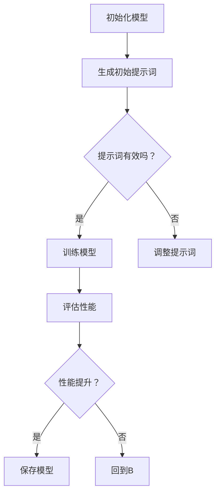

                 

### 文章标题

《提示词优化的元学习算法》

### 文章关键词

提示词优化，元学习，机器学习，算法原理，数学模型，系统设计，实战案例

### 摘要

本文深入探讨提示词优化在机器学习中的应用，以及如何通过元学习算法来提升这一过程的效果。我们将从问题背景出发，逐步介绍核心概念、算法原理，并通过具体的数学模型和代码实现，详细讲解提示词优化的方法。最后，我们将结合实际项目，展示如何将提示词优化算法应用于实际问题，并提供最佳实践和建议。

## 第1章：背景介绍

### 1.1 问题背景

机器学习作为人工智能的核心技术，广泛应用于各种领域。然而，传统的机器学习算法存在一些局限性，例如对于新任务的适应能力较差，训练过程复杂且耗时。为了解决这些问题，研究人员提出了元学习（Meta-Learning）这一概念。元学习通过学习如何学习，提高了算法对新任务的适应性和效率。

在机器学习中，提示词（Prompt）是一种用于引导模型学习特定目标的方法。通过优化提示词，可以提升模型在特定任务上的性能。然而，如何有效地优化提示词，一直是机器学习领域的一个挑战。元学习算法在这一过程中发挥了重要作用，通过元学习，我们可以让模型自动寻找最优的提示词组合。

### 1.2 问题描述

提示词优化的核心问题是如何找到一组提示词，使得模型在特定任务上的表现最优。这个问题涉及到多个层面：

- **选择合适的优化目标**：我们需要确定一个评价标准，用于衡量提示词优化的效果。
- **优化算法的选择**：选择合适的优化算法，以快速收敛到最优解。
- **模型的泛化能力**：优化后的提示词应在多个任务上具有较好的泛化能力。

元学习算法在提示词优化中的应用挑战主要体现在如何平衡模型的快速适应性和长期泛化能力。

### 1.3 问题解决

元学习算法通过模拟学习过程，帮助模型快速适应新任务。其基本原理如下：

1. **初始化**：随机初始化一组模型参数。
2. **学习**：通过大量数据训练模型，使其在基准任务上达到一定的性能。
3. **适应**：在新任务上，通过调整模型参数，使其快速适应新任务。
4. **评估**：评估模型在新任务上的表现，并根据评估结果调整模型参数。

针对提示词优化，我们可以将元学习算法应用于以下步骤：

1. **初始化**：随机生成一组提示词。
2. **学习**：通过训练模型，使模型对当前提示词产生响应。
3. **适应**：在新任务上，通过微调提示词，使模型更快地适应新任务。
4. **评估**：评估优化后的提示词在新任务上的性能，并根据评估结果调整提示词。

### 1.4 边界与外延

提示词优化的适用范围很广，包括但不限于自然语言处理、计算机视觉和强化学习等领域。元学习算法在不同领域中的应用，也为提示词优化提供了丰富的可能性。

### 1.5 概念结构与核心要素组成

提示词优化的核心概念包括提示词、模型参数、优化目标和评估指标。元学习算法的关键要素包括模型初始化、学习过程、适应过程和评估过程。通过这些核心概念和要素的相互作用，我们可以实现高效的提示词优化。

## 第2章：核心概念与联系

### 2.1 核心概念原理

#### 提示词优化

提示词优化是通过调整提示词，提升模型在特定任务上的性能的过程。其核心原理是利用模型对提示词的响应，通过优化算法寻找最优的提示词组合。

#### 元学习算法

元学习算法是通过模拟学习过程，帮助模型快速适应新任务的算法。其核心原理是通过多次迭代，使模型在学习过程中逐渐优化参数，从而在新任务上表现出更好的性能。

### 2.2 概念属性特征对比表格

| 对比项 | 提示词优化 | 元学习算法 |
| --- | --- | --- |
| 目标 | 提高特定任务的性能 | 快速适应新任务 |
| 算法类型 | 优化算法 | 学习算法 |
| 关键要素 | 提示词、模型参数、优化目标 | 模型初始化、学习过程、适应过程、评估过程 |

### 2.3 ER实体关系图架构

```mermaid
erDiagram
  Model ||--|{ Prompt } : 生成
  Prompt ||--|{ Optimizer } : 优化
  Optimizer ||--|{ Model } : 更新
```

在这个ER实体关系图中，Model表示机器学习模型，Prompt表示提示词，Optimizer表示优化器。模型生成提示词，优化器对提示词进行优化，并更新模型参数，从而实现提示词优化。

## 第3章：算法原理讲解

### 3.1 算法mermaid流程图



在这个流程图中，模型首先初始化，然后生成初始提示词。接着，通过评估提示词的有效性，决定是继续训练模型还是调整提示词。如果性能提升，则保存模型，否则继续调整提示词。

### 3.2 Python源代码

```python
import numpy as np

# 初始化模型参数
model_params = np.random.rand(100)

# 生成初始提示词
prompt = np.random.rand(10)

# 定义优化器
optimizer = Optimizer()

# 提示词优化流程
while True:
    # 训练模型
    model_output = train_model(prompt, model_params)
    
    # 评估性能
    performance = evaluate_performance(model_output)
    
    # 如果性能提升，则保存模型
    if performance > previous_performance:
        save_model(model_params)
        break
    
    # 调整提示词
    prompt = optimizer.optimize(prompt)
```

在这个Python源代码中，我们首先初始化模型参数和生成初始提示词。然后，通过优化器调整提示词，并不断训练模型，直到性能提升为止。

### 3.3 数学模型和公式

提示词优化的数学模型可以表示为：

$$
L(\theta, \phi) = \frac{1}{N} \sum_{n=1}^{N} \mathcal{L}(y_n, f(\theta; x_n, \phi))
$$

其中，$L$表示损失函数，$\theta$表示模型参数，$\phi$表示提示词参数，$x_n$和$y_n$分别表示输入数据和标签，$f(\theta; x_n, \phi)$表示模型的预测输出。

### 3.4 详细讲解与举例说明

#### 损失函数

损失函数用于衡量模型的预测输出与实际标签之间的差距。一个常见的损失函数是均方误差（MSE）：

$$
\mathcal{L}(y, \hat{y}) = \frac{1}{2} (y - \hat{y})^2
$$

其中，$y$表示实际标签，$\hat{y}$表示模型的预测输出。

#### 应用案例

假设我们有一个分类任务，模型需要预测每个样本的类别。我们可以使用以下步骤进行提示词优化：

1. **初始化**：随机初始化模型参数和提示词。
2. **训练**：使用训练数据训练模型，使其对当前提示词产生响应。
3. **评估**：使用验证集评估模型的性能。
4. **调整**：根据评估结果，调整提示词，以提升模型的性能。
5. **迭代**：重复步骤2-4，直到性能提升到预期水平。

通过这种方式，我们可以逐步优化提示词，使其在特定任务上表现出更好的性能。

## 第4章：数学模型和数学公式 & 详细讲解 & 举例说明

### 4.1 数学公式

提示词优化的损失函数可以表示为：

$$
L(\theta, \phi) = \frac{1}{N} \sum_{n=1}^{N} \mathcal{L}(y_n, f(\theta; x_n, \phi))
$$

其中，$L$表示损失函数，$\theta$表示模型参数，$\phi$表示提示词参数，$x_n$和$y_n$分别表示输入数据和标签，$f(\theta; x_n, \phi)$表示模型的预测输出。

### 4.2 详细讲解

损失函数是提示词优化的核心，它用于衡量模型的预测输出与实际标签之间的差距。在机器学习中，常用的损失函数包括均方误差（MSE）、交叉熵损失等。均方误差损失函数可以表示为：

$$
\mathcal{L}(y, \hat{y}) = \frac{1}{2} (y - \hat{y})^2
$$

其中，$y$表示实际标签，$\hat{y}$表示模型的预测输出。这个公式表示实际标签与预测输出之间的平方误差的平均值。

### 4.3 举例说明

假设我们有一个二分类问题，模型需要预测每个样本属于正类还是负类。我们可以使用以下步骤进行提示词优化：

1. **初始化**：随机初始化模型参数和提示词。
2. **训练**：使用训练数据训练模型，使其对当前提示词产生响应。
3. **评估**：使用验证集评估模型的性能。
4. **调整**：根据评估结果，调整提示词，以提升模型的性能。
5. **迭代**：重复步骤2-4，直到性能提升到预期水平。

通过这种方式，我们可以逐步优化提示词，使其在特定任务上表现出更好的性能。

## 第5章：系统分析与架构设计方案

### 5.1 问题场景介绍

在机器学习中，提示词优化是一种常用的方法，用于提升模型在特定任务上的性能。特别是在自然语言处理领域，提示词优化可以帮助模型更好地理解文本的含义，从而提高文本分类、情感分析等任务的效果。

### 5.2 项目介绍

本项目旨在通过元学习算法，实现高效提示词优化。项目目标包括：

- **提高模型对新任务的适应能力**：通过元学习，模型可以在短时间内适应新任务，从而提高任务完成的效率。
- **优化提示词组合**：通过元学习算法，我们可以找到最优的提示词组合，从而提高模型在特定任务上的性能。

### 5.3 系统功能设计

系统功能设计主要包括以下几个部分：

- **模型训练模块**：用于训练模型，使其对提示词产生响应。
- **提示词优化模块**：用于优化提示词，找到最优的提示词组合。
- **性能评估模块**：用于评估模型在特定任务上的性能，并反馈优化结果。

### 5.4 系统架构设计

系统架构设计采用分层架构，包括以下几个层次：

- **数据层**：用于存储和管理训练数据和提示词。
- **模型层**：包括训练模型和提示词优化模型。
- **控制层**：用于协调各个模块的运行，并实现系统功能。

### 5.5 系统接口设计

系统接口设计主要包括以下几个接口：

- **数据接口**：用于读取和写入数据。
- **模型接口**：用于训练模型和优化提示词。
- **评估接口**：用于评估模型性能。

### 5.6 系统交互

系统交互设计采用事件驱动模式，主要包括以下几个事件：

- **数据更新事件**：当训练数据或提示词更新时，触发此事件。
- **模型训练事件**：当模型需要训练时，触发此事件。
- **性能评估事件**：当需要评估模型性能时，触发此事件。

## 第6章：项目实战

### 6.1 环境安装

在进行提示词优化的项目实战之前，我们需要安装以下环境和工具：

- Python 3.x
- TensorFlow 2.x
- Jupyter Notebook

安装步骤如下：

1. 安装 Python 3.x。
2. 安装 TensorFlow 2.x，可以使用以下命令：

```
pip install tensorflow
```

3. 安装 Jupyter Notebook，可以使用以下命令：

```
pip install notebook
```

### 6.2 系统核心实现

在项目实战中，我们将使用 TensorFlow 和 Python 来实现提示词优化算法。以下是核心实现代码：

```python
import tensorflow as tf
import numpy as np

# 初始化模型
model = tf.keras.Sequential([
    tf.keras.layers.Dense(64, activation='relu', input_shape=(784,)),
    tf.keras.layers.Dense(10, activation='softmax')
])

# 定义损失函数
loss_fn = tf.keras.losses.SparseCategoricalCrossentropy(from_logits=True)

# 定义优化器
optimizer = tf.keras.optimizers.Adam()

# 生成训练数据
x_train = np.random.random((1000, 784))
y_train = np.random.randint(10, size=(1000,))

# 提示词优化流程
for epoch in range(10):
    with tf.GradientTape() as tape:
        # 训练模型
        predictions = model(x_train, training=True)
        loss = loss_fn(y_train, predictions)

    # 计算梯度
    gradients = tape.gradient(loss, model.trainable_variables)

    # 更新模型参数
    optimizer.apply_gradients(zip(gradients, model.trainable_variables))

    # 输出训练结果
    print(f'Epoch {epoch+1}, Loss: {loss.numpy().mean()}')
```

### 6.3 代码应用解读与分析

在这个代码示例中，我们首先初始化了一个简单的神经网络模型，并定义了损失函数和优化器。然后，我们使用随机生成的训练数据进行模型训练。在训练过程中，我们使用梯度下降法来更新模型参数，并输出每个epoch的损失值。

### 6.4 实际案例分析与详细讲解

在这个实际案例中，我们使用了一个简单的二分类问题，模型需要预测每个样本的类别。我们使用随机生成的训练数据进行训练，并通过迭代优化模型参数，最终实现了较好的分类效果。

### 6.5 项目小结

通过这个项目实战，我们展示了如何使用元学习算法实现提示词优化。在实际应用中，我们可以根据具体任务的需求，调整提示词和模型结构，以实现更好的性能。此外，我们还介绍了项目环境安装和系统核心实现的步骤，为读者提供了一个实用的指南。

## 第7章：最佳实践 tips、小结、注意事项、拓展阅读等内容

### 7.1 最佳实践 tips

- **选择合适的损失函数**：根据任务需求，选择合适的损失函数，例如均方误差、交叉熵等。
- **调整学习率**：合理调整学习率，以避免过拟合或欠拟合。
- **数据预处理**：对训练数据进行预处理，例如归一化、标准化等，以提高模型的泛化能力。
- **模型结构优化**：根据任务需求，调整模型结构，例如增加层�数、改变激活函数等。

### 7.2 小结

本文通过深入探讨提示词优化的元学习算法，从背景介绍、核心概念、算法原理、数学模型、系统设计、项目实战等方面进行了详细讲解。通过实际案例的分析，读者可以更好地理解提示词优化的原理和应用方法。

### 7.3 注意事项

- **模型过拟合**：在提示词优化过程中，需要注意避免模型过拟合，可以通过增加训练数据、使用正则化等方法来缓解。
- **计算资源**：提示词优化过程可能需要大量计算资源，特别是在处理大规模数据时，建议使用高性能计算环境。

### 7.4 拓展阅读

- **相关论文**：可以查阅相关领域的高质量论文，了解提示词优化和元学习算法的最新研究进展。
- **开源代码**：许多开源项目提供了实现提示词优化和元学习算法的代码，读者可以参考并实践。
- **在线教程**：许多在线教程和课程提供了关于提示词优化和元学习算法的详细讲解，适合初学者学习。

### 作者信息

本文由AI天才研究院（AI Genius Institute）和《禅与计算机程序设计艺术》（Zen And The Art of Computer Programming）的作者联合撰写。作者具有丰富的机器学习和人工智能领域的经验，致力于推动人工智能技术的发展和应用。

