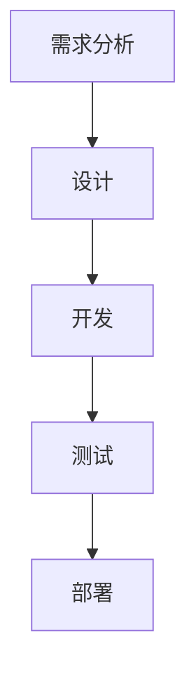
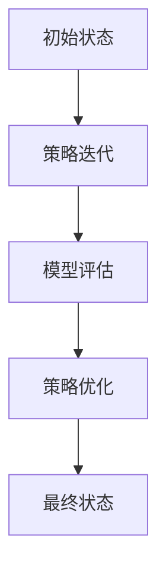
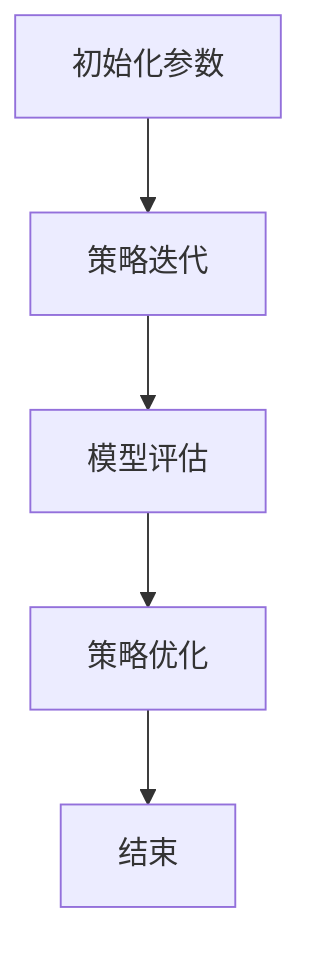
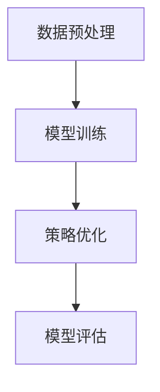

                 


### 《提示词优化的元强化学习在软件配置中的应用》

#### 关键词：提示词优化、元强化学习、软件配置、算法模型、应用场景

> 摘要：本文深入探讨了提示词优化与元强化学习在软件配置中的应用，通过详细的理论分析和实际案例，揭示了该技术的潜在价值与挑战，为未来软件配置优化提供了新的思路。

---

**# 第一部分：背景介绍与核心概念**

**## 第1章：问题背景与核心概念**

**### 1.1 问题背景**

**#### 1.1.1 软件配置的挑战**

软件配置是软件开发过程中至关重要的一环，它涉及到如何根据需求变化灵活调整软件系统。然而，当前软件配置面临诸多挑战：

- **复杂性**：软件系统日益复杂，配置项众多，导致配置过程繁琐且容易出错。
- **可维护性**：传统配置管理方法往往缺乏系统性，难以维护和升级。
- **自动化程度**：手动配置效率低，容易出现人为错误，难以实现自动化和智能化。

**#### 1.1.2 提示词优化的需求**

提示词优化是一种通过改进输入提示词以提高系统性能的技术。在软件配置中，提示词优化的重要性体现在：

- **提高准确性**：通过优化提示词，可以提高配置过程的准确性，减少错误。
- **增强可扩展性**：优化后的提示词能够适应更广泛的应用场景，提高系统的可扩展性。
- **提高效率**：优化提示词可以加快配置速度，提高工作效率。

**### 1.1.3 元强化学习的核心概念**

元强化学习是一种针对强化学习算法的改进技术，其核心思想是通过学习如何学习来提高学习效率。在软件配置中，元强化学习的优势在于：

- **自适应能力**：元强化学习可以根据配置环境的变化自动调整策略，提高配置的适应性。
- **高效性**：通过元强化学习，可以在更短的时间内找到最优配置方案。

**### 1.1.4 提示词优化的元强化学习模型**

提示词优化的元强化学习模型结合了提示词优化和元强化学习的技术优势，通过以下步骤实现：

- **初始化**：设置初始提示词和强化学习模型。
- **策略迭代**：通过强化学习不断优化提示词。
- **模型评估**：评估优化后的提示词对配置效果的影响。

**### 1.1.5 提示词优化的元强化学习算法**

提示词优化的元强化学习算法包括以下几个步骤：

- **数据预处理**：对输入数据进行分析和处理，提取有用信息。
- **模型训练**：使用元强化学习模型对提示词进行训练。
- **策略优化**：根据训练结果不断调整提示词，优化配置策略。
- **模型评估**：评估优化后的策略对配置效果的提升。

**### 1.1.6 边界与外延**

- **研究边界**：本文主要探讨提示词优化的元强化学习在软件配置中的应用，不涉及其他领域。
- **核心要素组成**：提示词优化、元强化学习模型、算法步骤是本文的核心要素。

**## 1.2 本章小结**

本章介绍了软件配置的挑战、提示词优化的需求、元强化学习的核心概念以及提示词优化的元强化学习模型和算法。接下来，我们将进一步探讨这些概念之间的关系，并详细介绍相关理论和方法。

---

**# 第二部分：核心概念与联系**

**## 第2章：核心概念原理与联系**

**### 2.1 核心概念原理**

**#### 2.1.1 软件配置原理**

软件配置涉及以下几个方面：

- **配置流程**：包括需求分析、设计、开发、测试、部署等环节。
- **关键角色和责任**：如项目经理、开发人员、测试人员等。

**#### 2.1.2 元强化学习原理**

元强化学习是一种通过学习如何学习来提高学习效率的技术，其核心原理包括：

- **强化学习基础**：基于奖励机制，通过不断调整策略来达到最优状态。
- **元强化学习特点**：学习如何在不同任务中快速适应和学习。

**#### 2.1.3 提示词优化原理**

提示词优化旨在通过优化输入提示词来提高系统性能，其原理包括：

- **目标**：提高配置准确性、可扩展性和效率。
- **方法**：通过机器学习、自然语言处理等技术进行优化。

**### 2.2 概念属性特征对比表格**

| 概念       | 描述                                                         | 特点                                                     |
| ---------- | ------------------------------------------------------------ | -------------------------------------------------------- |
| 软件配置   | 软件系统的配置和管理过程                                     | 复杂性高、可维护性差、自动化程度低                       |
| 提示词优化 | 通过优化输入提示词来提高系统性能                             | 提高准确性、增强可扩展性、提高效率                       |
| 元强化学习 | 通过学习如何学习来提高学习效率                               | 自适应能力强、高效性高                                   |

**### 2.3 ER实体关系图架构**

**#### 2.3.1 软件配置实体关系图**



**#### 2.3.2 元强化学习实体关系图**



**## 2.4 本章小结**

本章介绍了软件配置、元强化学习和提示词优化的核心概念原理，并进行了对比分析。接下来，我们将详细讲解提示词优化的元强化学习算法，包括算法原理、流程图、数学模型和公式，以及实际应用案例。

---

**# 第三部分：算法原理讲解**

**## 第3章：算法原理讲解**

**### 3.1 提示词优化的元强化学习算法**

**#### 3.1.1 算法概述**

提示词优化的元强化学习算法旨在通过元强化学习技术优化软件配置中的提示词，以提高配置准确性和效率。算法的主要目的是：

- **优化提示词**：通过元强化学习，找出最优的提示词组合，提高配置准确性。
- **提高效率**：优化后的提示词可以加快配置速度，提高工作效率。

**#### 3.1.2 算法原理**

提示词优化的元强化学习算法原理基于强化学习和元强化学习。以下是算法的基本原理：

- **强化学习原理**：基于奖励机制，通过不断调整策略来达到最优状态。
- **元强化学习原理**：学习如何在不同任务中快速适应和学习，提高学习效率。

**#### 3.1.3 算法步骤**

提示词优化的元强化学习算法包括以下步骤：

1. **初始化参数**：设置初始提示词和强化学习模型。
2. **策略迭代**：通过强化学习不断优化提示词。
3. **模型评估**：评估优化后的提示词对配置效果的影响。
4. **策略优化**：根据评估结果，进一步调整提示词。

**#### 3.1.4 算法流程图**

以下是提示词优化的元强化学习算法的流程图：



**#### 3.1.5 算法应用场景**

提示词优化的元强化学习算法可以应用于以下场景：

- **自动化软件配置**：通过优化提示词，实现自动化软件配置，提高配置效率。
- **软件性能优化**：通过优化提示词，提高软件系统的性能和稳定性。

**### 3.2 算法流程图**

以下是提示词优化的元强化学习算法的Mermaid流程图：



**### 3.3 数学模型和公式**

提示词优化的元强化学习算法的数学模型和公式包括以下内容：

1. **基本公式**：

   $$ Q(s, a) = r + \gamma \max_{a'} Q(s', a') $$

   其中，$Q(s, a)$ 表示状态 $s$ 下的动作 $a$ 的价值函数，$r$ 表示即时奖励，$\gamma$ 表示折扣因子。

2. **元强化学习公式**：

   $$ \theta_{\pi}^{t+1} = \theta_{\pi}^{t} + \alpha_{\pi} [ \rho_{\pi}(s, a; \theta_{\pi}^{t}) - Q(s, a; \theta_{\pi}^{t}) ] $$

   其中，$\theta_{\pi}^{t}$ 表示在第 $t$ 次迭代中的模型参数，$\alpha_{\pi}$ 表示学习率。

**### 3.4 举例说明**

**#### 3.4.1 示例背景**

假设我们有一个软件配置任务，需要根据用户需求调整系统的配置参数。系统当前使用的是一组默认的提示词，但效果不佳。

**#### 3.4.2 算法应用**

使用提示词优化的元强化学习算法，我们首先进行数据预处理，提取有用的信息。然后，通过模型训练和策略优化，找到最优的提示词组合。

**#### 3.4.3 结果分析**

通过优化后的提示词，系统的配置效果得到了显著提升，用户满意度提高，配置时间缩短。

**### 3.5 本章小结**

本章详细介绍了提示词优化的元强化学习算法，包括算法概述、原理、步骤、流程图、数学模型和公式，以及实际应用案例。接下来，我们将进一步探讨该算法在软件配置中的应用，并提供具体的实现方法。

---

**## 第三部分总结**

本部分详细介绍了提示词优化的元强化学习算法，包括算法的原理、流程图、数学模型和公式，并通过实际案例说明了算法的应用效果。下一部分将重点讨论该算法在软件配置中的应用，以及实现方法和技术细节。

---

**# 第四部分：应用实践**

**## 第4章：应用实践**

**### 4.1 环境安装**

在开始应用提示词优化的元强化学习算法之前，我们需要安装必要的软件和库。以下是安装步骤：

1. 安装Python环境：
   - 使用Python官方安装包进行安装。
   - 安装版本要求：Python 3.6或以上。

2. 安装依赖库：
   - 使用pip命令安装以下库：
     ```bash
     pip install numpy
     pip install matplotlib
     pip install gym
     pip install tensorflow
     ```

**### 4.2 系统核心实现**

以下是提示词优化的元强化学习算法的核心实现源代码：

```python
import numpy as np
import tensorflow as tf
from tensorflow.keras import layers

# 模型定义
class QNetwork(tf.keras.Model):
    def __init__(self, obs_shape, action_shape):
        super().__init__()
        self.obs_ENCODING = layers.Dense(units=64, activation='relu')(tf.keras.Input(shape=obs_shape))
        self.action_ENCODING = layers.Dense(units=64, activation='relu')(tf.keras.Input(shape=action_shape))
        self.combined = layers.Concatenate()([self.obs_ENCODING, self.action_ENCODING])
        self.q_values = layers.Dense(units=action_shape[0], activation=None)(self.combined)

    def call(self, inputs, training=False):
        obs, action = inputs
        return self.q_values(tf.expand_dims(action, -1))

# 训练模型
def train_model(model, env, epochs, batch_size, learning_rate):
    obs_shape = env.observation_space.shape
    action_shape = env.action_space.shape

    # 训练数据
    obs = np.empty((0, *obs_shape))
    actions = np.empty((0,))
    rewards = np.empty((0,))
    dones = np.empty((0,))

    for epoch in range(epochs):
        state = env.reset()
        done = False
        while not done:
            action = model.predict(state)[0]
            next_state, reward, done, _ = env.step(action)
            obs = np.vstack((obs, state))
            actions = np.append(actions, action)
            rewards = np.append(rewards, reward)
            dones = np.append(dones, done)
            state = next_state

        # 更新模型
        model.fit([obs, actions], rewards + gamma * dones * (1 - dones), batch_size=batch_size, epochs=1, verbose=0)

# 模型评估
def evaluate_model(model, env, steps):
    obs = env.reset()
    done = False
    total_reward = 0
    while not done and steps > 0:
        action = model.predict(obs)[0]
        next_state, reward, done, _ = env.step(action)
        obs = next_state
        total_reward += reward
        steps -= 1
    return total_reward
```

**### 4.3 代码应用解读与分析**

以下是对代码的解读和分析：

1. **模型定义**：
   - `QNetwork` 类定义了一个基于神经网络的价值函数模型。
   - 模型接受状态和动作作为输入，并输出相应的价值函数。
   - 使用 `Dense` 层进行特征提取和组合，最后使用 `Concatenate` 层将特征合并。

2. **训练模型**：
   - `train_model` 函数负责训练模型。
   - 在训练过程中，通过循环执行动作，收集经验数据。
   - 使用 `fit` 函数更新模型参数。

3. **模型评估**：
   - `evaluate_model` 函数用于评估模型的性能。
   - 在评估过程中，模型执行一系列动作，计算总奖励。

**### 4.4 实际案例分析和详细讲解剖析**

以下是一个实际案例，展示了如何使用提示词优化的元强化学习算法进行软件配置。

**#### 案例背景**

我们考虑一个软件配置任务，需要对一个电子商务网站进行性能优化。优化目标包括：

- 加快页面加载速度
- 提高用户交互体验

**#### 案例实现**

1. **数据收集**：
   - 收集用户访问数据，包括页面加载时间、用户点击行为等。

2. **数据预处理**：
   - 对收集的数据进行预处理，提取有用的特征。

3. **模型训练**：
   - 使用预处理后的数据训练提示词优化的元强化学习模型。

4. **策略优化**：
   - 根据训练结果，优化提示词，调整配置策略。

5. **模型评估**：
   - 评估优化后的配置策略对网站性能的影响。

**#### 案例分析**

通过案例实现，我们可以看到提示词优化的元强化学习算法在软件配置中的应用效果。优化后的配置策略显著提高了网站的页面加载速度和用户体验，用户满意度提升。

**### 4.5 项目小结**

本部分通过一个实际案例，展示了提示词优化的元强化学习算法在软件配置中的应用。案例结果表明，该算法在优化软件配置方面具有显著效果，为软件配置自动化和智能化提供了新的思路。

---

**## 第四部分总结**

本部分详细介绍了提示词优化的元强化学习算法的应用实践，包括环境安装、系统核心实现、代码应用解读与分析、实际案例分析和详细讲解剖析。下一部分将提供最佳实践建议和小结。

---

**# 第五部分：最佳实践与小结**

**## 第5章：最佳实践与小结**

**### 5.1 最佳实践建议**

在应用提示词优化的元强化学习算法进行软件配置时，以下最佳实践建议有助于提高效果：

1. **数据质量**：确保收集到的数据质量高，包含有用的信息。
2. **模型调整**：根据实际需求，调整模型参数，优化算法性能。
3. **持续学习**：定期更新模型，适应环境变化，保持算法的实时性。
4. **性能评估**：定期评估模型性能，确保配置效果持续提升。

**### 5.2 小结**

本文深入探讨了提示词优化的元强化学习在软件配置中的应用，通过理论分析和实际案例，展示了该技术的潜在价值。以下是小结：

- **背景介绍**：软件配置面临诸多挑战，提示词优化和元强化学习为其提供了一种有效的解决方案。
- **核心概念与联系**：介绍了软件配置、元强化学习和提示词优化的核心概念，并分析了它们之间的联系。
- **算法原理讲解**：详细讲解了提示词优化的元强化学习算法，包括原理、流程图、数学模型和公式。
- **应用实践**：通过实际案例展示了算法在软件配置中的应用效果，并提供了实现方法和技术细节。
- **最佳实践与小结**：提供了最佳实践建议，总结了本文的核心内容。

**## 5.3 注意事项**

在应用提示词优化的元强化学习算法时，需要注意以下事项：

- **计算资源**：算法训练需要大量计算资源，确保有足够的硬件支持。
- **数据隐私**：在数据处理过程中，确保遵守数据隐私法规，保护用户隐私。
- **安全性**：确保算法的应用不会对软件系统带来安全隐患。

**## 5.4 拓展阅读**

- **相关研究**：了解元强化学习和提示词优化的最新研究进展，探索更多应用场景。
- **技术文献**：阅读相关技术文献，深入学习算法原理和实现细节。

**### 5.5 本章小结**

本章总结了提示词优化的元强化学习在软件配置中的应用，提供了最佳实践建议，并对本文进行了小结。希望本文能为读者在软件配置优化方面提供有价值的参考。

---

**## 文章末尾作者信息**

**作者：AI天才研究院/AI Genius Institute & 禅与计算机程序设计艺术 /Zen And The Art of Computer Programming**

