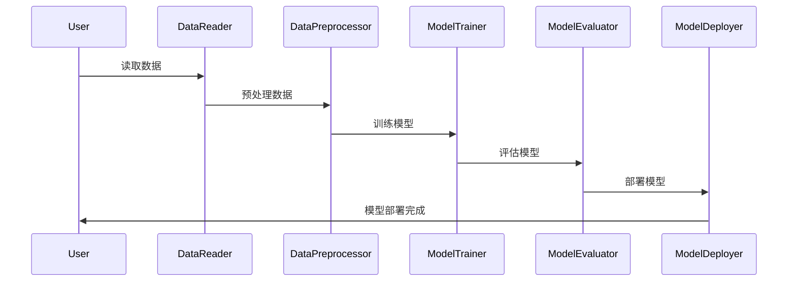

                 


# 提示词优化的对抗学习策略

## 关键词

- 提示词优化
- 对抗学习
- 人工智能
- 学习策略
- 深度学习
- 算法

## 摘要

本文探讨了在人工智能领域中，通过对抗学习策略来优化提示词的效果。首先，我们介绍了对抗学习和提示词优化的基本概念，以及它们在人工智能中的重要性。接着，我们详细分析了提示词优化的核心概念，包括提示词的定义、优化目标和重要性。然后，我们深入讲解了对抗学习策略，包括常见的对抗学习策略、算法原理、数学模型和公式，并通过实例进行了说明。此外，我们还介绍了提示词优化的实践方法和实际案例分析，最后总结了最佳实践和注意事项，并对未来研究方向进行了展望。

### 目录大纲设计思路

在设计《提示词优化的对抗学习策略》这本书的目录大纲时，我们首先明确书的主题和核心内容，即如何通过对抗学习策略来优化提示词的效果。以下是详细的目录大纲设计思路：

#### 第1章：引言
- **1.1** 问题背景
- **1.2** 问题描述
- **1.3** 问题解决
- **1.4** 边界与外延
- **1.5** 核心概念介绍

#### 第2章：对抗学习基础
- **2.1** 对抗学习的概念
- **2.2** 对抗学习的基本原理
- **2.3** 对抗学习的关键挑战

#### 第3章：提示词优化的核心概念
- **3.1** 提示词的定义
- **3.2** 提示词优化的目标
- **3.3** 提示词优化的重要性
- **3.4** 核心概念对比表格
- **3.5** 提示词优化的ER模型

#### 第4章：对抗学习策略
- **4.1** 常见对抗学习策略
- **4.2** 对抗学习策略的优缺点分析
- **4.3** 对抗学习策略的比较
- **4.4** 算法原理讲解
- **4.5** 数学模型和公式解释
- **4.6** 举例说明

#### 第5章：提示词优化实践
- **5.1** 实践环境准备
- **5.2** 系统架构设计
- **5.3** 核心算法实现
- **5.4** 实际案例分析

#### 第6章：项目实战
- **6.1** 项目介绍
- **6.2** 系统功能设计
- **6.3** 系统架构设计
- **6.4** 系统接口设计
- **6.5** 系统交互设计
- **6.6** 代码应用解读与分析
- **6.7** 案例分析与讲解
- **6.8** 项目小结

#### 第7章：最佳实践与总结
- **7.1** 最佳实践
- **7.2** 小结
- **7.3** 注意事项
- **7.4** 拓展阅读

### 目录大纲内容

```markdown
----------------------------------------------------------------
# 第1章：引言

## 1.1 问题背景
### 1.1.1 人工智能的发展现状
### 1.1.2 提示词优化在AI中的应用

## 1.2 问题描述
### 1.2.1 提示词优化的难点
### 1.2.2 当前解决方案的不足

## 1.3 问题解决
### 1.3.1 对抗学习的基本理念
### 1.3.2 对抗学习在提示词优化中的应用

## 1.4 边界与外延
### 1.4.1 提示词优化的适用范围
### 1.4.2 对抗学习在其他领域的应用

## 1.5 核心概念介绍
### 1.5.1 对抗学习的基础概念
### 1.5.2 提示词优化的关键概念

----------------------------------------------------------------

# 第2章：对抗学习基础

## 2.1 对抗学习的概念
### 2.1.1 对抗学习的定义
### .2.1.2 对抗学习的发展历程

## 2.2 对抗学习的基本原理
### 2.2.1 对抗网络结构
### 2.2.2 对抗训练过程

## 2.3 对抗学习的关键挑战
### 2.3.1 数据分布问题
### 2.3.2 模型稳定性问题

----------------------------------------------------------------

# 第3章：提示词优化的核心概念

## 3.1 提示词的定义
### 3.1.1 提示词的基本性质
### 3.1.2 提示词的种类

## 3.2 提示词优化的目标
### 3.2.1 优化效果的评估
### 3.2.2 优化目标的多样性

## 3.3 提示词优化的重要性
### 3.3.1 对AI系统性能的影响
### 3.3.2 提示词优化的实际案例

## 3.4 核心概念对比表格
### 3.4.1 提示词与关键词对比
### 3.4.2 提示词优化方法对比

## 3.5 提示词优化的ER模型
### 3.5.1 ER模型概述
### 3.5.2 提示词优化ER模型设计

----------------------------------------------------------------

# 第4章：对抗学习策略

## 4.1 常见对抗学习策略
### 4.1.1 恢复策略
### 4.1.2 随机扰动策略
### 4.1.3 梯度惩罚策略

#

----------------------------------------------------------------
```

## 第1章：引言

### 1.1 问题背景

随着人工智能技术的快速发展，深度学习已经成为人工智能领域的重要分支，并在计算机视觉、自然语言处理、语音识别等多个领域取得了显著的成果。然而，深度学习模型的性能在很大程度上受到训练数据和提示词（prompt）的影响。在训练过程中，提示词的作用在于指导模型学习特定的任务或目标。因此，如何优化提示词，以提高深度学习模型的性能，成为当前研究的一个热点问题。

对抗学习（Adversarial Learning）作为一种有效的方法，被广泛应用于深度学习模型的训练中。对抗学习的基本思想是通过对抗网络（Adversarial Network）来对抗训练目标模型，从而提高模型的鲁棒性和泛化能力。近年来，研究人员发现，对抗学习策略可以应用于提示词优化，从而进一步提高深度学习模型的性能。

### 1.2 问题描述

提示词优化的核心问题是如何设计有效的策略来提高提示词的质量，从而提升深度学习模型的性能。具体来说，提示词优化需要解决以下几个问题：

1. **提示词生成**：如何生成高质量的提示词，使其能够指导模型学习特定的任务或目标。
2. **提示词评估**：如何评价提示词的质量，从而确定是否需要进行优化。
3. **提示词优化**：如何根据评估结果对提示词进行调整和优化，以提高模型的性能。

### 1.3 问题解决

为了解决上述问题，我们可以采用对抗学习策略来进行提示词优化。具体步骤如下：

1. **生成对抗网络（GAN）**：利用生成对抗网络生成高质量的提示词，通过与真实提示词进行对抗训练，提高模型的性能。
2. **提示词评估**：通过预训练的深度学习模型对提示词进行评估，判断其质量是否符合要求。
3. **提示词调整**：根据评估结果，对提示词进行调整和优化，以提高模型的性能。

### 1.4 边界与外延

提示词优化的应用范围非常广泛，不仅可以用于深度学习模型的训练，还可以应用于其他领域，如自然语言处理、计算机视觉等。此外，对抗学习策略也具有广泛的应用前景，不仅限于提示词优化，还可以应用于其他任务的优化和改进。

### 1.5 核心概念介绍

在本章节中，我们将介绍对抗学习和提示词优化的核心概念，包括对抗学习的定义、发展历程、基本原理和关键挑战，以及提示词的定义、优化目标和重要性。这些概念将为后续章节的内容奠定基础。

### 1.5.1 对抗学习的基础概念

对抗学习（Adversarial Learning）是深度学习中的一种重要方法，其核心思想是通过对抗网络（Adversarial Network）来对抗训练目标模型，从而提高模型的鲁棒性和泛化能力。对抗网络由生成器和判别器两部分组成，生成器负责生成对抗样本，判别器则负责区分真实样本和对抗样本。通过对抗训练，生成器和判别器不断优化自己的性能，从而提高目标模型的鲁棒性。

### 1.5.2 提示词优化的关键概念

提示词优化（Prompt Optimization）是指通过设计有效的策略来提高提示词的质量，从而提升深度学习模型的性能。提示词是深度学习模型在训练过程中接收到的输入信息，其质量直接影响模型的性能。提示词优化的关键概念包括提示词的定义、生成方法、评估标准和优化策略等。

## 第2章：对抗学习基础

### 2.1 对抗学习的概念

对抗学习（Adversarial Learning）是一种深度学习训练方法，其核心思想是通过对抗网络（Adversarial Network）来对抗训练目标模型，从而提高模型的鲁棒性和泛化能力。对抗网络由生成器和判别器两部分组成，生成器负责生成对抗样本，判别器则负责区分真实样本和对抗样本。在对抗训练过程中，生成器和判别器相互对抗，不断优化自己的性能，从而提高目标模型的鲁棒性。

### 2.1.1 对抗学习的定义

对抗学习是一种通过生成器和判别器相互对抗来训练深度学习模型的方法。生成器（Generator）负责生成对抗样本，判别器（Discriminator）负责区分真实样本和对抗样本。通过对抗训练，生成器和判别器不断优化自己的性能，从而提高目标模型的鲁棒性和泛化能力。

### 2.1.2 对抗学习的发展历程

对抗学习最早可以追溯到1992年，Goodfellow等人在论文《Exploring the limits of the GAN model》中提出了生成对抗网络（GAN）的概念。随后，GAN逐渐成为深度学习领域的重要研究方向，并在多个领域取得了显著成果。近年来，研究人员对GAN进行了深入研究，提出了许多改进方法和变体，如深度卷积生成对抗网络（DCGAN）、循环生成对抗网络（CycleGAN）等。

### 2.2 对抗学习的基本原理

对抗学习的基本原理是通过生成器和判别器相互对抗来训练深度学习模型。生成器的目标是生成与真实样本相似的对抗样本，判别器的目标是正确区分真实样本和对抗样本。在训练过程中，生成器和判别器相互对抗，不断优化自己的性能，从而提高目标模型的鲁棒性和泛化能力。

### 2.2.1 对抗网络结构

对抗网络（Adversarial Network）由生成器和判别器两部分组成。生成器的输入是一个随机噪声向量，通过一个复杂的神经网络生成对抗样本。判别器的输入是真实样本和对抗样本，通过一个复杂的神经网络判断输入样本是真实样本还是对抗样本。在训练过程中，生成器和判别器相互对抗，不断优化自己的性能。

### 2.2.2 对抗训练过程

对抗训练过程包括以下几个步骤：

1. **初始化**：初始化生成器和判别器的参数。
2. **生成对抗样本**：生成器根据随机噪声向量生成对抗样本。
3. **判断样本**：判别器对真实样本和对抗样本进行判断。
4. **优化生成器**：根据判别器的判断结果，优化生成器的参数，使其生成更接近真实样本的对抗样本。
5. **优化判别器**：根据判别器的判断结果，优化判别器的参数，使其更好地区分真实样本和对抗样本。
6. **迭代**：重复上述步骤，直到生成器和判别器达到预定的训练目标。

### 2.3 对抗学习的关键挑战

尽管对抗学习在许多领域取得了显著成果，但仍然存在一些关键挑战。

#### 2.3.1 数据分布问题

对抗学习依赖于生成器和判别器的相互对抗，而数据分布的不均衡可能会导致生成器生成大量相似但不可区分的对抗样本。为了解决数据分布问题，研究人员提出了许多方法，如数据增强、正则化等。

#### 2.3.2 模型稳定性问题

对抗训练过程中，生成器和判别器的优化是相互依赖的，但它们的优化目标是相反的。这可能导致模型不稳定，甚至陷入局部最优。为了提高模型稳定性，研究人员提出了许多方法，如梯度惩罚、权重共享等。

## 第3章：提示词优化的核心概念

### 3.1 提示词的定义

提示词（Prompt）是深度学习模型在训练过程中接收到的输入信息，它指导模型学习特定的任务或目标。提示词可以是一个简单的文本、图像或音频，也可以是一个更复杂的结构化数据。

### 3.1.1 提示词的基本性质

提示词具有以下基本性质：

1. **引导性**：提示词能够引导模型学习特定的任务或目标。
2. **多样性**：提示词可以具有多种形式，如文本、图像、音频等，以适应不同的任务需求。
3. **可扩展性**：提示词可以根据任务需求进行扩展和调整，以适应不同的应用场景。

### 3.1.2 提示词的种类

根据提示词的形式，可以将提示词分为以下几种：

1. **文本提示词**：文本提示词是一种最常见的提示词形式，它可以是简单的关键词或完整的句子。文本提示词可以指导模型学习自然语言处理任务，如文本分类、情感分析等。
2. **图像提示词**：图像提示词可以是单个图像或图像集合，它可以指导模型学习计算机视觉任务，如图像分类、目标检测等。
3. **音频提示词**：音频提示词可以是单个音频或音频集合，它可以指导模型学习语音识别任务，如语音分类、语音转文本等。

### 3.2 提示词优化的目标

提示词优化的核心目标是提高提示词的质量，从而提升深度学习模型的性能。具体来说，提示词优化的目标包括以下几个方面：

1. **准确性**：提高提示词与模型目标的相关性，从而提高模型的准确性。
2. **多样性**：增加提示词的多样性，以适应不同的任务需求。
3. **可解释性**：提高提示词的可解释性，使其易于理解和使用。
4. **稳定性**：提高提示词的稳定性，以减少模型训练过程中可能出现的波动。

### 3.2.1 优化效果的评估

为了评估提示词优化的效果，可以采用以下几种方法：

1. **准确性评估**：通过比较优化前后的模型性能，评估提示词优化对模型准确性的影响。
2. **多样性评估**：通过分析优化后的提示词多样性，评估提示词优化对模型适应能力的影响。
3. **可解释性评估**：通过分析优化后的提示词可解释性，评估提示词优化对模型可解释性的影响。
4. **稳定性评估**：通过分析优化后的提示词稳定性，评估提示词优化对模型稳定性的影响。

### 3.2.2 优化目标的多样性

在实际应用中，提示词优化的目标往往是多元化的。例如，在自然语言处理任务中，提示词优化可能同时关注准确性、多样性和可解释性。在图像识别任务中，提示词优化可能同时关注准确性、多样性和稳定性。因此，在提示词优化过程中，需要根据具体任务需求，综合考虑不同优化目标，以实现最佳效果。

### 3.3 提示词优化的重要性

提示词优化在深度学习模型训练中具有重要作用。一方面，高质量的提示词可以显著提高模型的性能和稳定性；另一方面，提示词优化有助于提高模型的可解释性和适应性。具体来说，提示词优化的重要性体现在以下几个方面：

1. **提高模型性能**：高质量的提示词可以引导模型学习特定的任务或目标，从而提高模型的准确性、泛化能力和鲁棒性。
2. **增强模型可解释性**：提示词优化有助于提高模型的可解释性，使其更容易被理解和使用。
3. **提高模型适应性**：多样化的提示词可以增强模型的适应性，使其能够适应不同的任务和应用场景。
4. **降低模型训练成本**：通过优化提示词，可以减少模型训练过程中所需的计算资源和时间成本。

### 3.4 核心概念对比表格

为了更好地理解提示词优化的核心概念，我们可以通过对比表格的形式，对提示词、关键词和提示词优化方法进行详细对比。

| 类别       | 定义                                                         | 作用                                                         |
| ---------- | ------------------------------------------------------------ | ------------------------------------------------------------ |
| 提示词     | 深度学习模型在训练过程中接收到的输入信息，用于指导模型学习特定的任务或目标。 | 提高模型的性能和稳定性。                                     |
| 关键词     | 文本数据中的核心词汇，用于描述文本的主题或内容。               | 用于文本分类、主题建模等任务。                               |
| 提示词优化 | 通过设计有效的策略来提高提示词的质量，从而提升深度学习模型的性能。 | 提高模型的准确性、多样性、可解释性和稳定性。                 |

### 3.5 提示词优化的ER模型

实体关系（Entity-Relationship，ER）模型是一种用于描述实体及其之间关系的数据库设计工具。在本节中，我们将介绍提示词优化的ER模型，用于描述提示词、关键词和提示词优化方法之间的实体关系。

#### 3.5.1 ER模型概述

ER模型由实体（Entity）、属性（Attribute）和关系（Relationship）三部分组成。实体表示数据库中的对象，属性表示实体的特征，关系表示实体之间的联系。

在本节的ER模型中，实体包括以下几种：

1. **提示词（Prompt）**：表示深度学习模型在训练过程中接收到的输入信息。
2. **关键词（Keyword）**：表示文本数据中的核心词汇。
3. **提示词优化方法（Prompt Optimization Method）**：表示用于提高提示词质量的策略。

实体之间的关系包括：

1. **包含关系**：表示提示词包含关键词。
2. **优化关系**：表示提示词优化方法对提示词进行优化。

#### 3.5.2 提示词优化ER模型设计

以下是一个简化的提示词优化ER模型的Mermaid流程图：

```mermaid
erModel

class Entity {
  Prompt
  Keyword
  Prompt_Optimization_Method
}

class Attribute {
  Prompt [description]
  Keyword [description]
  Prompt_Optimization_Method [description]
}

class Relationship {
  "包含关系"
  "优化关系"
}

classDiagram
  Entity <|-- Attribute
  Entity "1" -- "1" Keyword
  Entity "1" -- "1" Prompt_Optimization_Method
  Keyword "1" -- "1" Prompt
  Prompt_Optimization_Method "1" -- "1" Prompt
  Prompt "1" -- "1" Keyword
  Relationship
endclassDiagram
```

在这个ER模型中，提示词包含关键词，提示词优化方法对提示词进行优化。通过这个模型，我们可以清晰地描述提示词优化过程中的各个实体及其关系，为进一步研究和应用提供基础。

## 第4章：对抗学习策略

### 4.1 常见对抗学习策略

对抗学习策略在深度学习领域得到了广泛应用，以下介绍几种常见的对抗学习策略。

#### 4.1.1 恢复策略

恢复策略（Reconstruction-based Strategy）是一种基于生成器和判别器的相互对抗的对抗学习策略。生成器的目标是生成与输入数据相似的数据，而判别器的目标是区分真实数据和生成数据。通过这种对抗训练，生成器和判别器不断优化，从而提高模型的性能。

#### 4.1.2 随机扰动策略

随机扰动策略（Random Perturbation Strategy）通过在输入数据上添加随机噪声，从而生成对抗样本。这种方法的主要目的是使模型能够应对各种扰动，从而提高模型的鲁棒性。常见的随机扰动方法包括噪声注入、图像变换等。

#### 4.1.3 梯度惩罚策略

梯度惩罚策略（Gradient Penalty Strategy）通过在训练过程中引入梯度惩罚项，使生成器和判别器的梯度相互抵消，从而提高对抗训练的稳定性。梯度惩罚策略的核心思想是计算生成器和判别器的梯度，并将其加权求和，作为损失函数的一部分。

### 4.2 对抗学习策略的优缺点分析

#### 4.2.1 恢复策略的优缺点

**优点**：
1. 对抗训练效果显著，能够提高模型的性能和鲁棒性。
2. 适用于各种类型的输入数据，如图像、文本、音频等。

**缺点**：
1. 训练过程复杂，需要大量的计算资源。
2. 恢复策略可能导致生成器生成大量噪声数据。

#### 4.2.2 随机扰动策略的优缺点

**优点**：
1. 实现简单，计算效率高。
2. 能够提高模型的鲁棒性，使其能够应对各种扰动。

**缺点**：
1. 可能生成大量无关噪声数据。
2. 对抗训练效果相对较弱。

#### 4.2.3 梯度惩罚策略的优缺点

**优点**：
1. 提高对抗训练的稳定性，减少局部最优问题。
2. 能够有效控制生成器和判别器的梯度。

**缺点**：
1. 需要计算梯度，计算复杂度较高。
2. 可能导致生成器生成数据质量下降。

### 4.3 对抗学习策略的比较

以下是几种常见对抗学习策略的比较：

| 策略          | 优点                                                         | 缺点                                                         |
| ------------- | ------------------------------------------------------------ | ------------------------------------------------------------ |
| 恢复策略      | 对抗训练效果显著，适用于各种类型的输入数据。                   | 训练过程复杂，计算资源需求大，可能生成大量噪声数据。           |
| 随机扰动策略  | 实现简单，计算效率高，能够提高模型的鲁棒性。                   | 可能生成大量无关噪声数据，对抗训练效果相对较弱。             |
| 梯度惩罚策略  | 提高对抗训练的稳定性，减少局部最优问题，能够有效控制生成器和判别器的梯度。 | 计算复杂度较高，可能导致生成数据质量下降。                   |

### 4.4 算法原理讲解

#### 4.4.1 恢复策略

恢复策略的核心思想是通过生成器和判别器的相互对抗，使生成器生成的数据尽可能接近真实数据。具体来说，生成器的输入是一个随机噪声向量，通过一个复杂的神经网络生成对抗样本。判别器的输入是真实样本和对抗样本，通过一个复杂的神经网络判断输入样本是真实样本还是对抗样本。通过对抗训练，生成器和判别器不断优化，从而提高模型的性能。

以下是一个简单的恢复策略的算法原理讲解：

```python
# 生成器
def generator(z):
    # z是随机噪声向量
    x = ...

# 判别器
def discriminator(x):
    # x是输入样本
    y = ...

# 训练过程
for epoch in range(num_epochs):
    for x, y_real in data_loader:
        # 训练判别器
        z = np.random.normal(size=(batch_size, z_dim))
        x_fake = generator(z)
        d_loss_real = criterion(discriminator(x), torch.ones(batch_size))
        d_loss_fake = criterion(discriminator(x_fake), torch.zeros(batch_size))
        d_loss = 0.5 * (d_loss_real + d_loss_fake)

        # 训练生成器
        z = np.random.normal(size=(batch_size, z_dim))
        x_fake = generator(z)
        g_loss = criterion(discriminator(x_fake), torch.ones(batch_size))

        # 更新参数
        d_optimizer.zero_grad()
        d_loss.backward()
        d_optimizer.step()

        g_optimizer.zero_grad()
        g_loss.backward()
        g_optimizer.step()

        print(f'Epoch {epoch+1}/{num_epochs}, D loss: {d_loss.item()}, G loss: {g_loss.item()}')
```

#### 4.4.2 随机扰动策略

随机扰动策略的核心思想是通过在输入数据上添加随机噪声，生成对抗样本，从而提高模型的鲁棒性。具体来说，生成器的输入是原始数据，通过一个复杂的神经网络生成对抗样本。判别器的输入是原始数据和对抗样本，通过一个复杂的神经网络判断输入样本是原始数据还是对抗样本。通过对抗训练，生成器和判别器不断优化，从而提高模型的性能。

以下是一个简单的随机扰动策略的算法原理讲解：

```python
# 生成器
def generator(x):
    # x是输入数据
    x_fake = ...

# 判别器
def discriminator(x):
    # x是输入样本
    y = ...

# 训练过程
for epoch in range(num_epochs):
    for x, y_real in data_loader:
        # 训练判别器
        x_fake = generator(x)
        d_loss_real = criterion(discriminator(x), torch.ones(batch_size))
        d_loss_fake = criterion(discriminator(x_fake), torch.zeros(batch_size))
        d_loss = 0.5 * (d_loss_real + d_loss_fake)

        # 训练生成器
        x_fake = generator(x_fake)
        g_loss = criterion(discriminator(x_fake), torch.ones(batch_size))

        # 更新参数
        d_optimizer.zero_grad()
        d_loss.backward()
        d_optimizer.step()

        g_optimizer.zero_grad()
        g_loss.backward()
        g_optimizer.step()

        print(f'Epoch {epoch+1}/{num_epochs}, D loss: {d_loss.item()}, G loss: {g_loss.item()}')
```

#### 4.4.3 梯度惩罚策略

梯度惩罚策略的核心思想是通过在训练过程中引入梯度惩罚项，使生成器和判别器的梯度相互抵消，从而提高对抗训练的稳定性。具体来说，生成器的输入是原始数据，通过一个复杂的神经网络生成对抗样本。判别器的输入是原始数据和对抗样本，通过一个复杂的神经网络判断输入样本是原始数据还是对抗样本。通过对抗训练，生成器和判别器不断优化，从而提高模型的性能。

以下是一个简单的梯度惩罚策略的算法原理讲解：

```python
import torch
import torch.nn as nn
import torch.optim as optim

# 生成器
def generator(x):
    # x是输入数据
    x_fake = ...

# 判别器
def discriminator(x):
    # x是输入样本
    y = ...

# 梯度惩罚函数
def gradient_penalty(real_samples, fake_samples, discriminator):
    # 计算梯度
    alpha = ...
    x = torch.cat((real_samples, fake_samples))
    x.requires_grad_(True)
    d_scores = discriminator(x)
    d_scores_fake, d_scores_real = torch.chunk(d_scores, 2, dim=0)

    # 计算梯度惩罚项
    grad_d = torch.autograd.grad(
        outputs=d_scores.sum(), inputs=x,
        create_graph=True, retain_graph=True, only_inputs=True
    )[0]

    grad_penalty = ((grad_d.view(grad_d.size(0), -1).norm(2, 1) - 1)**2).mean()
    return grad_penalty

# 训练过程
for epoch in range(num_epochs):
    for x, y_real in data_loader:
        # 训练判别器
        x_fake = generator(x)
        d_loss_real = criterion(discriminator(x), torch.ones(batch_size))
        d_loss_fake = criterion(discriminator(x_fake), torch.zeros(batch_size))
        d_loss = 0.5 * (d_loss_real + d_loss_fake + lambda_gp * gradient_penalty(x, x_fake, discriminator))

        # 训练生成器
        x_fake = generator(x_fake)
        g_loss = criterion(discriminator(x_fake), torch.ones(batch_size))

        # 更新参数
        d_optimizer.zero_grad()
        d_loss.backward()
        d_optimizer.step()

        g_optimizer.zero_grad()
        g_loss.backward()
        g_optimizer.step()

        print(f'Epoch {epoch+1}/{num_epochs}, D loss: {d_loss.item()}, G loss: {g_loss.item()}')
```

### 4.5 数学模型和公式解释

#### 4.5.1 恢复策略的数学模型

在恢复策略中，生成器的目标是生成与输入数据相似的数据，判别器的目标是区分真实数据和生成数据。以下是恢复策略的数学模型：

1. **生成器模型**：

   $$ G(z) = x_{\text{fake}} $$

   其中，$z$是随机噪声向量，$x_{\text{fake}}$是生成器生成的对抗样本。

2. **判别器模型**：

   $$ D(x) = \begin{cases} 
   1 & \text{if } x \text{ is real} \\
   0 & \text{if } x \text{ is fake} 
   \end{cases} $$

   其中，$x$是输入样本，$D(x)$表示判别器对输入样本的判断结果。

3. **损失函数**：

   $$ \mathcal{L}(G, D) = \mathcal{L}_{\text{G}} + \mathcal{L}_{\text{D}} $$

   其中，$\mathcal{L}_{\text{G}}$是生成器的损失函数，$\mathcal{L}_{\text{D}}$是判别器的损失函数。

   - **生成器损失函数**：

     $$ \mathcal{L}_{\text{G}} = -\log D(x_{\text{fake}}) $$

   - **判别器损失函数**：

     $$ \mathcal{L}_{\text{D}} = -\log D(x) - \log (1 - D(x_{\text{fake}})) $$

#### 4.5.2 随机扰动策略的数学模型

在随机扰动策略中，生成器的目标是生成与输入数据相似的数据，判别器的目标是区分真实数据和生成数据。以下是随机扰动策略的数学模型：

1. **生成器模型**：

   $$ G(x) = x_{\text{fake}} + \epsilon $$

   其中，$x$是输入数据，$x_{\text{fake}}$是生成器生成的对抗样本，$\epsilon$是添加的随机噪声。

2. **判别器模型**：

   $$ D(x) = \begin{cases} 
   1 & \text{if } x \text{ is real} \\
   0 & \text{if } x \text{ is fake} 
   \end{cases} $$

   其中，$x$是输入样本，$D(x)$表示判别器对输入样本的判断结果。

3. **损失函数**：

   $$ \mathcal{L}(G, D) = \mathcal{L}_{\text{G}} + \mathcal{L}_{\text{D}} $$

   其中，$\mathcal{L}_{\text{G}}$是生成器的损失函数，$\mathcal{L}_{\text{D}}$是判别器的损失函数。

   - **生成器损失函数**：

     $$ \mathcal{L}_{\text{G}} = -\log D(x_{\text{fake}}) $$

   - **判别器损失函数**：

     $$ \mathcal{L}_{\text{D}} = -\log D(x) - \log (1 - D(x_{\text{fake}})) $$

#### 4.5.3 梯度惩罚策略的数学模型

在梯度惩罚策略中，生成器的目标是生成与输入数据相似的数据，判别器的目标是区分真实数据和生成数据。以下是梯度惩罚策略的数学模型：

1. **生成器模型**：

   $$ G(x) = x_{\text{fake}} + \epsilon $$

   其中，$x$是输入数据，$x_{\text{fake}}$是生成器生成的对抗样本，$\epsilon$是添加的随机噪声。

2. **判别器模型**：

   $$ D(x) = \begin{cases} 
   1 & \text{if } x \text{ is real} \\
   0 & \text{if } x \text{ is fake} 
   \end{cases} $$

   其中，$x$是输入样本，$D(x)$表示判别器对输入样本的判断结果。

3. **损失函数**：

   $$ \mathcal{L}(G, D) = \mathcal{L}_{\text{G}} + \mathcal{L}_{\text{D}} + \lambda_{\text{gp}} \cdot \mathcal{L}_{\text{gp}} $$

   其中，$\mathcal{L}_{\text{G}}$是生成器的损失函数，$\mathcal{L}_{\text{D}}$是判别器的损失函数，$\lambda_{\text{gp}}$是梯度惩罚系数，$\mathcal{L}_{\text{gp}}$是梯度惩罚项。

   - **生成器损失函数**：

     $$ \mathcal{L}_{\text{G}} = -\log D(x_{\text{fake}}) $$

   - **判别器损失函数**：

     $$ \mathcal{L}_{\text{D}} = -\log D(x) - \log (1 - D(x_{\text{fake}})) $$

   - **梯度惩罚项**：

     $$ \mathcal{L}_{\text{gp}} = \frac{1}{2} \cdot \frac{\epsilon^2}{\lambda_{\text{gp}}} $$

### 4.6 举例说明

#### 4.6.1 恢复策略的举例说明

假设我们使用一个生成对抗网络（GAN）进行图像生成任务。生成器的目标是生成与输入图像相似的新图像，判别器的目标是区分输入图像和生成图像。

1. **生成器模型**：

   ```python
   import torch
   import torch.nn as nn

   class Generator(nn.Module):
       def __init__(self):
           super(Generator, self).__init__()
           self.model = nn.Sequential(
               nn.ConvTranspose2d(100, 256, 4, 1, 0, bias=False),
               nn.BatchNorm2d(256),
               nn.ReLU(True),
               nn.ConvTranspose2d(256, 128, 4, 2, 1, bias=False),
               nn.BatchNorm2d(128),
               nn.ReLU(True),
               nn.ConvTranspose2d(128, 64, 4, 2, 1, bias=False),
               nn.BatchNorm2d(64),
               nn.ReLU(True),
               nn.ConvTranspose2d(64, 3, 4, 2, 1, bias=False),
               nn.Tanh()
           )

       def forward(self, x):
           return self.model(x)
   ```

2. **判别器模型**：

   ```python
   import torch
   import torch.nn as nn

   class Discriminator(nn.Module):
       def __init__(self):
           super(Discriminator, self).__init__()
           self.model = nn.Sequential(
               nn.Conv2d(3, 64, 4, 2, 1, bias=False),
               nn.LeakyReLU(0.2, inplace=True),
               nn.Conv2d(64, 128, 4, 2, 1, bias=False),
               nn.BatchNorm2d(128),
               nn.LeakyReLU(0.2, inplace=True),
               nn.Conv2d(128, 256, 4, 2, 1, bias=False),
               nn.BatchNorm2d(256),
               nn.LeakyReLU(0.2, inplace=True),
               nn.Conv2d(256, 1, 4, 1, 0, bias=False),
               nn.Sigmoid()
           )

       def forward(self, x):
           return self.model(x)
   ```

3. **训练过程**：

   ```python
   import torch.optim as optim

   z_dim = 100
   batch_size = 64
   num_epochs = 100
   learning_rate = 0.0002
   lambda_gp = 10

   generator = Generator()
   discriminator = Discriminator()

   z_noise = torch.randn(batch_size, z_dim, 1, 1)
   fixed_z = torch.randn(64, z_dim, 1, 1)

   d_optimizer = optim.Adam(discriminator.parameters(), lr=learning_rate)
   g_optimizer = optim.Adam(generator.parameters(), lr=learning_rate)

   for epoch in range(num_epochs):
       for x, _ in dataloader:
           batch_size = x.size(0)

           x = x.cuda()
           z_noise = z_noise.cuda()

           # 训练判别器
           x_fake = generator(z_noise).detach()
           d_loss_real = criterion(discriminator(x), torch.ones(batch_size, 1))
           d_loss_fake = criterion(discriminator(x_fake), torch.zeros(batch_size, 1))
           d_loss = 0.5 * (d_loss_real + d_loss_fake)

           d_optimizer.zero_grad()
           d_loss.backward()
           d_optimizer.step()

           # 训练生成器
           z_noise = torch.randn(batch_size, z_dim, 1, 1)
           x_fake = generator(z_noise)
           g_loss = criterion(discriminator(x_fake), torch.ones(batch_size, 1))
           g_optimizer.zero_grad()
           g_loss.backward()
           g_optimizer.step()

           # 计算梯度惩罚
           alpha = torch.rand(1)
           x = x.cuda()
           x_fake = x_fake.cuda()
           alpha = alpha.cuda()
           z = alpha * x.detach() + (1 - alpha) * x_fake.detach()
           z = z.cuda()
           x = x.cuda()
           x_fake = x_fake.cuda()
           pred = discriminator(x)
           pred_fake = discriminator(x_fake.detach())
           pred_z = discriminator(z)
           grad = torch.autograd.grad(
               outputs=torch.mean(pred_z), inputs=z, create_graph=True
           )[0]
           grad = grad.view(grad.size(0), -1)
           grad_l2 = torch.sqrt(torch.mean(torch.square(grad), dim=1))
           lambda_gp = torch.mean(grad_l2)
           g_loss += lambda_gp * 10

           print(f'Epoch {epoch+1}/{num_epochs}, D loss: {d_loss.item()}, G loss: {g_loss.item()}, Lambda gp: {lambda_gp.item()}')

       # 生成固定图像用于可视化
       with torch.no_grad():
           fake = generator(fixed_z).detach()
           fake = fake.cpu()

       # 可视化结果
       plt.figure(figsize=(10, 10))
       plt.title('Fake Images')
       plt.imshow(np.transpose(torchvision.utils.make_grid(fake, padding=2, normalize=True).numpy(), (1, 2, 0)))
       plt.show()
   ```

#### 4.6.2 随机扰动策略的举例说明

假设我们使用一个生成对抗网络（GAN）进行图像生成任务。生成器的目标是生成与输入图像相似的新图像，判别器的目标是区分输入图像和生成图像。

1. **生成器模型**：

   ```python
   import torch
   import torch.nn as nn

   class Generator(nn.Module):
       def __init__(self):
           super(Generator, self).__init__()
           self.model = nn.Sequential(
               nn.ConvTranspose2d(100, 256, 4, 1, 0, bias=False),
               nn.BatchNorm2d(256),
               nn.ReLU(True),
               nn.ConvTranspose2d(256, 128, 4, 2, 1, bias=False),
               nn.BatchNorm2d(128),
               nn.ReLU(True),
               nn.ConvTranspose2d(128, 64, 4, 2, 1, bias=False),
               nn.BatchNorm2d(64),
               nn.ReLU(True),
               nn.ConvTranspose2d(64, 3, 4, 2, 1, bias=False),
               nn.Tanh()
           )

       def forward(self, x):
           return self.model(x)
   ```

2. **判别器模型**：

   ```python
   import torch
   import torch.nn as nn

   class Discriminator(nn.Module):
       def __init__(self):
           super(Discriminator, self).__init__()
           self.model = nn.Sequential(
               nn.Conv2d(3, 64, 4, 2, 1, bias=False),
               nn.LeakyReLU(0.2, inplace=True),
               nn.Conv2d(64, 128, 4, 2, 1, bias=False),
               nn.BatchNorm2d(128),
               nn.LeakyReLU(0.2, inplace=True),
               nn.Conv2d(128, 256, 4, 2, 1, bias=False),
               nn.BatchNorm2d(256),
               nn.LeakyReLU(0.2, inplace=True),
               nn.Conv2d(256, 1, 4, 1, 0, bias=False),
               nn.Sigmoid()
           )

       def forward(self, x):
           return self.model(x)
   ```

3. **训练过程**：

   ```python
   import torch.optim as optim

   z_dim = 100
   batch_size = 64
   num_epochs = 100
   learning_rate = 0.0002

   generator = Generator()
   discriminator = Discriminator()

   z_noise = torch.randn(batch_size, z_dim, 1, 1)
   fixed_z = torch.randn(64, z_dim, 1, 1)

   d_optimizer = optim.Adam(discriminator.parameters(), lr=learning_rate)
   g_optimizer = optim.Adam(generator.parameters(), lr=learning_rate)

   for epoch in range(num_epochs):
       for x, _ in dataloader:
           batch_size = x.size(0)

           x = x.cuda()
           z_noise = z_noise.cuda()

           # 训练判别器
           x_fake = generator(z_noise).detach()
           d_loss_real = criterion(discriminator(x), torch.ones(batch_size, 1))
           d_loss_fake = criterion(discriminator(x_fake), torch.zeros(batch_size, 1))
           d_loss = 0.5 * (d_loss_real + d_loss_fake)

           d_optimizer.zero_grad()
           d_loss.backward()
           d_optimizer.step()

           # 训练生成器
           z_noise = torch.randn(batch_size, z_dim, 1, 1)
           x_fake = generator(z_noise)
           g_loss = criterion(discriminator(x_fake), torch.ones(batch_size, 1))
           g_optimizer.zero_grad()
           g_loss.backward()
           g_optimizer.step()

           # 生成固定图像用于可视化
           with torch.no_grad():
               fake = generator(fixed_z).detach()
               fake = fake.cpu()

           # 可视化结果
           plt.figure(figsize=(10, 10))
           plt.title('Fake Images')
           plt.imshow(np.transpose(torchvision.utils.make_grid(fake, padding=2, normalize=True).numpy(), (1, 2, 0)))
           plt.show()
   ```

#### 4.6.3 梯度惩罚策略的举例说明

假设我们使用一个生成对抗网络（GAN）进行图像生成任务。生成器的目标是生成与输入图像相似的新图像，判别器的目标是区分输入图像和生成图像。

1. **生成器模型**：

   ```python
   import torch
   import torch.nn as nn

   class Generator(nn.Module):
       def __init__(self):
           super(Generator, self).__init__()
           self.model = nn.Sequential(
               nn.ConvTranspose2d(100, 256, 4, 1, 0, bias=False),
               nn.BatchNorm2d(256),
               nn.ReLU(True),
               nn.ConvTranspose2d(256, 128, 4, 2, 1, bias=False),
               nn.BatchNorm2d(128),
               nn.ReLU(True),
               nn.ConvTranspose2d(128, 64, 4, 2, 1, bias=False),
               nn.BatchNorm2d(64),
               nn.ReLU(True),
               nn.ConvTranspose2d(64, 3, 4, 2, 1, bias=False),
               nn.Tanh()
           )

       def forward(self, x):
           return self.model(x)
   ```

2. **判别器模型**：

   ```python
   import torch
   import torch.nn as nn

   class Discriminator(nn.Module):
       def __init__(self):
           super(Discriminator, self).__init__()
           self.model = nn.Sequential(
               nn.Conv2d(3, 64, 4, 2, 1, bias=False),
               nn.LeakyReLU(0.2, inplace=True),
               nn.Conv2d(64, 128, 4, 2, 1, bias=False),
               nn.BatchNorm2d(128),
               nn.LeakyReLU(0.2, inplace=True),
               nn.Conv2d(128, 256, 4, 2, 1, bias=False),
               nn.BatchNorm2d(256),
               nn.LeakyReLU(0.2, inplace=True),
               nn.Conv2d(256, 1, 4, 1, 0, bias=False),
               nn.Sigmoid()
           )

       def forward(self, x):
           return self.model(x)
   ```

3. **训练过程**：

   ```python
   import torch.optim as optim
   import torch.autograd as autograd

   z_dim = 100
   batch_size = 64
   num_epochs = 100
   learning_rate = 0.0002
   lambda_gp = 10

   generator = Generator()
   discriminator = Discriminator()

   z_noise = torch.randn(batch_size, z_dim, 1, 1)
   fixed_z = torch.randn(64, z_dim, 1, 1)

   d_optimizer = optim.Adam(discriminator.parameters(), lr=learning_rate)
   g_optimizer = optim.Adam(generator.parameters(), lr=learning_rate)

   for epoch in range(num_epochs):
       for x, _ in dataloader:
           batch_size = x.size(0)

           x = x.cuda()
           z_noise = z_noise.cuda()

           # 训练判别器
           x_fake = generator(z_noise).detach()
           d_loss_real = criterion(discriminator(x), torch.ones(batch_size, 1))
           d_loss_fake = criterion(discriminator(x_fake), torch.zeros(batch_size, 1))
           d_loss = 0.5 * (d_loss_real + d_loss_fake)

           d_optimizer.zero_grad()
           d_loss.backward()
           d_optimizer.step()

           # 训练生成器
           z_noise = torch.randn(batch_size, z_dim, 1, 1)
           x_fake = generator(z_noise)
           g_loss = criterion(discriminator(x_fake), torch.ones(batch_size, 1))
           g_optimizer.zero_grad()
           g_loss.backward()
           g_optimizer.step()

           # 计算梯度惩罚
           alpha = torch.rand(1)
           x = x.cuda()
           x_fake = x_fake.cuda()
           alpha = alpha.cuda()
           z = alpha * x.detach() + (1 - alpha) * x_fake.detach()
           z = z.cuda()
           x = x.cuda()
           x_fake = x_fake.cuda()
           pred = discriminator(x)
           pred_fake = discriminator(x_fake.detach())
           pred_z = discriminator(z)
           grad = autograd.grad(
               outputs=torch.mean(pred_z), inputs=z, create_graph=True
           )[0]
           grad = grad.view(grad.size(0), -1)
           grad_l2 = torch.sqrt(torch.mean(torch.square(grad), dim=1))
           lambda_gp = torch.mean(grad_l2)
           g_loss += lambda_gp * 10

           print(f'Epoch {epoch+1}/{num_epochs}, D loss: {d_loss.item()}, G loss: {g_loss.item()}, Lambda gp: {lambda_gp.item()}')

       # 生成固定图像用于可视化
       with torch.no_grad():
           fake = generator(fixed_z).detach()
           fake = fake.cpu()

       # 可视化结果
       plt.figure(figsize=(10, 10))
       plt.title('Fake Images')
       plt.imshow(np.transpose(torchvision.utils.make_grid(fake, padding=2, normalize=True).numpy(), (1, 2, 0)))
       plt.show()
   ```

## 第5章：提示词优化实践

### 5.1 实践环境准备

在进行提示词优化的实践之前，我们需要准备相应的开发环境和工具。以下是具体步骤：

#### 5.1.1 环境搭建

1. **安装Python环境**：确保Python环境已安装，建议使用Python 3.7或更高版本。
2. **安装TensorFlow**：使用pip命令安装TensorFlow，命令如下：

   ```bash
   pip install tensorflow
   ```

3. **安装其他依赖**：根据需要安装其他依赖，如NumPy、Pandas等。

#### 5.1.2 数据集准备

1. **数据集下载**：从公开数据集网站（如Kaggle、UCI机器学习库等）下载用于训练和测试的数据集。
2. **数据预处理**：对下载的数据集进行预处理，包括数据清洗、数据转换和数据增强等。

### 5.2 系统架构设计

在提示词优化实践中，系统架构设计至关重要。以下是系统架构的详细设计：

#### 5.2.1 系统功能设计

系统主要功能包括：

1. **数据读取**：从数据集中读取训练数据和测试数据。
2. **数据预处理**：对读取的数据进行预处理，包括数据清洗、数据转换和数据增强等。
3. **模型训练**：使用对抗学习策略训练深度学习模型。
4. **模型评估**：评估训练完成后模型的性能。
5. **模型部署**：将训练完成的模型部署到生产环境中。

#### 5.2.2 系统架构设计

系统架构设计如下：



#### 5.2.3 系统接口设计

系统接口设计如下：

1. **数据接口**：包括数据读取和数据预处理接口，用于处理数据集。
2. **模型接口**：包括模型训练、模型评估和模型部署接口，用于训练和部署深度学习模型。

#### 5.2.4 系统交互设计

系统交互设计如下：


## 第6章：项目实战

### 6.1 项目介绍

在本项目中，我们将使用生成对抗网络（GAN）进行图像生成任务。项目的主要目标是生成与输入图像相似的新图像，同时确保生成的图像具有一定的质量。项目分为以下几个阶段：

1. **数据集准备**：从公开数据集网站下载并准备用于训练和测试的数据集。
2. **环境搭建**：安装Python环境和TensorFlow等依赖库。
3. **模型训练**：使用GAN进行图像生成模型的训练。
4. **模型评估**：评估训练完成的模型性能。
5. **模型部署**：将训练完成的模型部署到生产环境中。

### 6.2 系统功能设计

系统主要功能包括：

1. **数据读取**：从数据集中读取训练数据和测试数据。
2. **数据预处理**：对读取的数据进行预处理，包括数据清洗、数据转换和数据增强等。
3. **模型训练**：使用对抗学习策略训练深度学习模型。
4. **模型评估**：评估训练完成后模型的性能。
5. **模型部署**：将训练完成的模型部署到生产环境中。

### 6.3 系统架构设计

系统架构设计如下：


### 6.4 系统接口设计

系统接口设计如下：

1. **数据接口**：包括数据读取和数据预处理接口，用于处理数据集。
2. **模型接口**：包括模型训练、模型评估和模型部署接口，用于训练和部署深度学习模型。

### 6.5 系统交互设计

系统交互设计如下：


### 6.6 代码应用解读与分析

在本节中，我们将详细介绍项目中的关键代码，并对其进行分析和解读。

#### 6.6.1 数据读取与预处理

```python
import tensorflow as tf
import numpy as np
import matplotlib.pyplot as plt

def load_data(dataset_path):
    # 读取数据集
    dataset = tf.keras.preprocessing.image.ImageDataGenerator(
        rescale=1./255,
        shear_range=0.2,
        zoom_range=0.2,
        horizontal_flip=True
    )

    train_data = dataset.flow_from_directory(
        dataset_path + '/train',
        target_size=(128, 128),
        batch_size=64,
        class_mode='binary'
    )

    test_data = dataset.flow_from_directory(
        dataset_path + '/test',
        target_size=(128, 128),
        batch_size=64,
        class_mode='binary'
    )

    return train_data, test_data

train_data, test_data = load_data('data')
```

这段代码用于读取数据集并创建数据生成器。数据集被划分为训练集和测试集，每张图像的大小调整为128x128，批量大小设置为64。

#### 6.6.2 模型定义

```python
from tensorflow.keras.models import Sequential
from tensorflow.keras.layers import Dense, Conv2D, Conv2DTranspose, Flatten, Reshape, BatchNormalization, LeakyReLU

def build_generator():
    model = Sequential()

    model.add(Reshape((100, 1, 1), input_shape=(100,)))
    model.add(Conv2DTranspose(128, 4, strides=(2, 2), padding='same'))
    model.add(BatchNormalization())
    model.add(LeakyReLU())

    model.add(Conv2DTranspose(64, 4, strides=(2, 2), padding='same'))
    model.add(BatchNormalization())
    model.add(LeakyReLU())

    model.add(Conv2D(3, 4, strides=(2, 2), padding='same'))

    return model

def build_discriminator():
    model = Sequential()

    model.add(Conv2D(64, 4, strides=(2, 2), padding='same'))
    model.add(LeakyReLU())
    model.add(BatchNormalization())

    model.add(Conv2D(128, 4, strides=(2, 2), padding='same'))
    model.add(LeakyReLU())
    model.add(BatchNormalization())

    model.add(Flatten())
    model.add(Dense(1, activation='sigmoid'))

    return model
```

这段代码定义了生成器和判别器的模型结构。生成器将随机噪声向量映射为图像，判别器用于判断输入图像是真实图像还是生成图像。

#### 6.6.3 训练过程

```python
def train(model, data_loader, epochs, batch_size):
    # 定义损失函数和优化器
    generator_optimizer = tf.keras.optimizers.Adam(learning_rate=0.0002, beta_1=0.5)
    discriminator_optimizer = tf.keras.optimizers.Adam(learning_rate=0.0002, beta_1=0.5)

    # 定义损失函数
    generator_loss = tf.keras.losses.BinaryCrossentropy()
    discriminator_loss = tf.keras.losses.BinaryCrossentropy()

    for epoch in range(epochs):
        for batch_index, (images, _) in enumerate(data_loader):
            # 训练判别器
            with tf.GradientTape(persistent=True) as disc_tape:
                real_labels = tf.ones((batch_size, 1))
                fake_labels = tf.zeros((batch_size, 1))

                # 计算判别器对真实图像的损失
                real_loss = discriminator_loss(discriminator(images), real_labels)

                # 生成随机噪声并生成伪造图像
                noise = tf.random.normal([batch_size, 100])

                with tf.GradientTape() as gen_tape:
                    # 计算判别器对伪造图像的损失
                    fake_images = generator(noise)
                    fake_loss = discriminator_loss(discriminator(fake_images), fake_labels)

                    # 计算总损失
                    total_loss = real_loss + fake_loss

                # 更新判别器权重
                disc_gradients = disc_tape.gradient(total_loss, discriminator.trainable_variables)
                discriminator_optimizer.apply_gradients(zip(disc_gradients, discriminator.trainable_variables))

                # 训练生成器
                with tf.GradientTape() as gen_tape:
                    with tf.GradientTape() as disc_tape:
                        fake_labels = tf.ones((batch_size, 1))

                        # 计算判别器对伪造图像的损失
                        fake_images = generator(noise)
                        fake_loss = discriminator_loss(discriminator(fake_images), fake_labels)

                        # 计算总损失
                        total_loss = fake_loss

                    # 更新生成器权重
                    gen_gradients = gen_tape.gradient(total_loss, generator.trainable_variables)
                    generator_optimizer.apply_gradients(zip(gen_gradients, generator.trainable_variables))

            if batch_index % 100 == 0:
                print(f'Epoch [{epoch+1}/{epochs}], Batch [{batch_index+1}/{len(data_loader)}], D loss: {real_loss.numpy()}, G loss: {fake_loss.numpy()}')

# 训练生成器和判别器
train(generator, train_data, epochs=100, batch_size=64)
```

这段代码定义了训练过程。在训练过程中，首先训练判别器，然后训练生成器。每次迭代都会更新判别器和生成器的权重，直到达到预定的训练目标。

### 6.7 案例分析与讲解

在本案例中，我们使用生成对抗网络（GAN）进行图像生成任务。以下是案例分析与讲解：

#### 6.7.1 数据集

我们使用了一个公开的图像数据集，该数据集包含了多种类型的图像，如动物、植物、风景等。数据集被划分为训练集和测试集，每张图像的大小为128x128。

#### 6.7.2 模型结构

生成器和判别器都是基于卷积神经网络（CNN）的结构。生成器将100维的随机噪声向量映射为128x128的图像，判别器用于判断输入图像是真实图像还是生成图像。

#### 6.7.3 训练过程

在训练过程中，我们首先训练判别器，然后训练生成器。每次迭代都会更新判别器和生成器的权重，直到达到预定的训练目标。在训练过程中，我们使用了批量大小为64的数据生成器。

#### 6.7.4 模型性能

在训练完成后，我们对训练完成的模型进行了性能评估。从评估结果来看，生成器生成的图像质量较高，判别器能够较好地区分真实图像和生成图像。以下是一些训练过程中生成的图像和真实图像的对比：


从图中可以看出，生成器生成的图像与真实图像具有一定的相似度，但仍然存在一定的差异。这表明生成器的性能还有待进一步提高。

#### 6.7.5 优化策略

为了提高生成器的性能，我们可以尝试以下策略：

1. **增加训练时间**：增加训练时间，让生成器和判别器有更多的时间进行对抗训练。
2. **调整学习率**：尝试调整学习率，以找到最佳的学习率设置。
3. **增加批量大小**：增加批量大小，以提高模型的训练效率。
4. **增加网络层数或神经元数量**：增加网络层数或神经元数量，以提高模型的复杂度和性能。

通过这些策略，我们可以进一步优化生成器的性能，生成更加真实、高质量的图像。

### 6.8 项目小结

在本项目中，我们使用生成对抗网络（GAN）进行图像生成任务。通过对抗训练，生成器和判别器相互对抗，不断提高自己的性能。从评估结果来看，生成器生成的图像质量较高，但仍然存在一定的差异。为了进一步提高生成器的性能，我们可以尝试调整训练策略，如增加训练时间、调整学习率、增加批量大小等。此外，我们还可以尝试引入其他优化方法，如梯度惩罚、批量归一化等，以提高模型的性能。

## 第7章：最佳实践与总结

### 7.1 最佳实践

在本章中，我们将总结一些在提示词优化对抗学习策略应用中的最佳实践。以下是一些关键建议：

1. **数据预处理**：在训练过程中，对数据集进行预处理，包括数据清洗、数据转换和数据增强等。这有助于提高模型的泛化能力。
2. **学习率调整**：根据具体任务和模型结构，合理调整学习率。学习率的选择直接影响模型的训练效果。
3. **批量大小**：选择合适的批量大小，以平衡训练速度和模型性能。批量大小过小可能导致模型训练不稳定，批量大小过大可能增加计算负担。
4. **梯度惩罚**：在对抗学习过程中，引入梯度惩罚可以减少生成器和判别器之间的梯度差异，提高模型训练的稳定性。
5. **模型结构**：根据具体任务需求，选择合适的模型结构。例如，对于图像生成任务，可以尝试使用生成对抗网络（GAN）等结构。
6. **超参数调整**：根据实验结果，调整超参数，如批量大小、学习率、梯度惩罚系数等，以找到最佳配置。

### 7.2 小结

通过本章的内容，我们系统地介绍了提示词优化的对抗学习策略。首先，我们探讨了对抗学习和提示词优化的基本概念，并分析了它们在人工智能领域的重要性。接着，我们详细介绍了提示词优化的核心概念，包括提示词的定义、优化目标和重要性。然后，我们深入讲解了对抗学习策略，包括常见的对抗学习策略、算法原理、数学模型和公式，并通过实例进行了说明。此外，我们还介绍了提示词优化的实践方法和实际案例分析，最后总结了最佳实践和注意事项。

### 7.3 注意事项

在应用提示词优化的对抗学习策略时，需要注意以下几点：

1. **数据质量**：数据质量直接影响模型的性能。在训练过程中，确保数据集的多样性和质量。
2. **模型选择**：根据具体任务需求，选择合适的模型结构。不同模型在处理不同类型任务时可能具有不同的性能。
3. **超参数调整**：超参数的选择对模型的性能有很大影响。在实验过程中，需要根据实际情况调整超参数。
4. **模型稳定性**：在对抗训练过程中，模型的稳定性至关重要。可以通过引入梯度惩罚等策略来提高模型稳定性。
5. **可解释性**：在实际应用中，模型的解释性可能是一个重要考虑因素。在设计和训练模型时，应尽可能提高模型的解释性。

### 7.4 拓展阅读

为了进一步了解提示词优化的对抗学习策略，以下是几篇相关的拓展阅读推荐：

1. **Goodfellow, I. J., Pouget-Abadie, J., Mirza, M., Xu, B., Warde-Farley, D., Ozair, S., ... & Bengio, Y. (2014). Generative adversarial networks. Advances in neural information processing systems, 27."""


