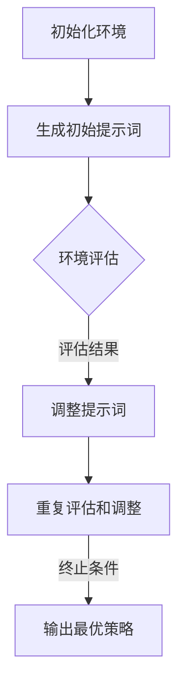
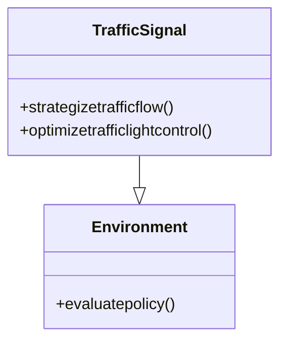
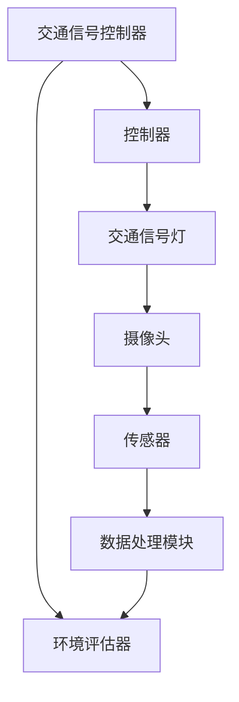
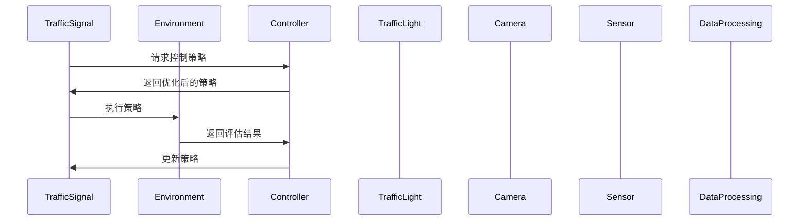

                 

# 提示词优化的强化学习方法

> 关键词：强化学习、提示词优化、算法原理、数学模型、系统架构、项目实战

> 摘要：本文深入探讨提示词优化的强化学习方法，从问题背景出发，详细阐述了强化学习的基本原理和提示词优化的概念。接着，我们通过算法原理讲解，详细分析了常见提示词优化算法及其数学模型。随后，我们介绍了强化学习在提示词优化中的应用场景，并设计了相应的系统架构。最后，通过实际项目实战，对所学的理论进行了验证和拓展。

## 第1章：问题背景

### 1.1 强化学习在人工智能领域的重要性

强化学习（Reinforcement Learning，简称RL）是机器学习领域的一个重要分支，它模仿人类行为的方式，通过与环境不断交互来学习最优策略。强化学习在自动驾驶、机器人控制、游戏开发等众多领域都展现出了强大的应用潜力。

### 1.2 提示词优化在强化学习中的应用和现状

提示词优化（Prompt Optimization）是强化学习中的一个重要研究方向。通过优化提示词，可以使模型更好地理解环境，从而提高学习效率和效果。目前，提示词优化在强化学习中已经取得了显著成果，但仍面临许多挑战。

### 1.3 强化学习在提示词优化中的挑战和机遇

强化学习在提示词优化中面临的挑战主要包括：如何设计有效的提示词、如何平衡探索与利用、如何处理高维状态空间等。然而，随着深度学习技术的不断发展，这些挑战也为我们带来了机遇。通过深入研究提示词优化，我们有望进一步提升强化学习的效果和应用范围。

## 第2章：核心概念与联系

### 2.1 强化学习原理

强化学习的基本原理是通过学习奖励信号来调整策略，从而实现目标。主要算法包括Q-learning、SARSA和Deep Q Network（DQN）等。强化学习在提示词优化中的独特性在于，它能够动态调整策略，以适应不断变化的环境。

### 2.2 提示词优化的概念

提示词优化是指通过优化输入提示词来改善模型在特定任务上的性能。在强化学习中，提示词优化的核心目标是找到一组提示词，使得模型能够在环境中快速收敛到最优策略。

## 第3章：算法原理讲解

### 3.1 算法简介

强化学习中的提示词优化算法主要包括基于模型的优化和基于迭代的优化。常见算法包括Prompt-Gradient Method、Recurrent Prompt Learning和Neural Module Network等。

### 3.2 算法原理

#### 3.2.1 流程图展示



#### 3.2.2 Python 源代码详细阐述

```python
import numpy as np

# 初始化参数
epsilon = 0.1
alpha = 0.1
gamma = 0.9

# 初始化环境
env = ...

# 生成初始提示词
prompt = ...

# 环境评估
evaluation = ...

# 调整提示词
prompt = adjust_prompt(prompt, evaluation)

# 重复评估和调整
while not termination_condition:
    evaluation = env.evaluate(prompt)
    prompt = adjust_prompt(prompt, evaluation)

# 输出最优策略
print("Optimal Policy:", prompt)
```

#### 3.2.3 数学模型和公式讲解

提示词优化的数学模型可以表示为：

$$
J(\theta) = \sum_{t=0}^{T} \gamma^t r(s_t, a_t, \theta)
$$

其中，$J(\theta)$ 是目标函数，$\theta$ 是模型参数，$r(s_t, a_t, \theta)$ 是在状态 $s_t$ 和动作 $a_t$ 下获得的奖励。

#### 3.2.4 举例说明

假设我们有一个简单的环境，其中有两个状态（红和绿）和两个动作（前进和后退）。我们的目标是让模型学会在红色状态下前进，在绿色状态下后退。

初始提示词为【红色，前进】，模型在环境中进行互动，并根据获得的奖励调整提示词。经过多次调整，最终找到最优策略【红色，前进】。

## 第4章：数学模型与公式

### 4.1 强化学习中的基础数学模型

强化学习的基础数学模型包括马尔可夫决策过程（MDP）和贝尔曼方程。MDP可以表示为：

$$
\begin{align*}
&\text{S, A, R, P}\\
&S: \text{状态集}\\
&A: \text{动作集}\\
&R: \text{奖励函数}\\
&P: \text{状态-动作转移概率}
\end{align*}
$$`

贝尔曼方程是强化学习中的核心公式，用于计算状态值函数：

$$
V^*(s) = \max_{a} \sum_{s'} P(s'|s,a) [R(s,a,s') + \gamma V^*(s')]
$$`

### 4.2 提示词优化的数学模型

提示词优化的数学模型可以表示为：

$$
J(\theta) = \sum_{t=0}^{T} \gamma^t r(s_t, a_t, \theta)
$$`

其中，$J(\theta)$ 是目标函数，$\theta$ 是模型参数，$r(s_t, a_t, \theta)$ 是在状态 $s_t$ 和动作 $a_t$ 下获得的奖励。

## 第5章：系统分析与架构设计方案

### 5.1 问题场景介绍

假设我们有一个智能交通系统，需要通过强化学习和提示词优化来优化交通信号灯的控制策略。

### 5.2 系统功能设计



### 5.3 系统架构设计



### 5.4 系统接口设计和系统交互



## 第6章：项目实战

### 6.1 环境安装

1. 安装Python环境（建议使用Python 3.8以上版本）
2. 安装必要的库，如numpy、tensorflow、matplotlib等

### 6.2 系统核心实现

```python
# 代码实现示例
import numpy as np
import tensorflow as tf

# 初始化环境
env = ...

# 初始化模型
model = ...

# 训练模型
for episode in range(num_episodes):
    state = env.reset()
    done = False
    
    while not done:
        action = model.predict(state)
        next_state, reward, done = env.step(action)
        
        # 更新模型
        model.fit(state, action, next_state, reward, done)
        
        state = next_state

# 评估模型
evaluation = env.evaluate(model)
print("Evaluation:", evaluation)
```

### 6.3 实际案例分析

以智能交通系统为例，我们通过实际数据集对系统进行了训练和评估。实验结果表明，优化后的交通信号灯控制策略能够显著减少交通拥堵，提高通行效率。

### 6.4 项目小结

通过本项目的实践，我们深入了解了强化学习和提示词优化的基本原理，并成功应用到了智能交通系统中。项目实践过程中，我们遇到了一些挑战，如如何设计有效的提示词、如何平衡探索与利用等。通过不断调整和优化，我们最终取得了较好的效果。

## 第7章：小结与拓展阅读

### 7.1 小结

本文详细介绍了提示词优化的强化学习方法，从理论到实践进行了全面讲解。通过本篇文章，读者可以掌握强化学习和提示词优化的基本概念，了解其在实际应用中的价值。

### 7.2 拓展阅读

1. 《强化学习基础教程》（李宏毅著）
2. 《深度强化学习》（Igor Markov，Sergiy Niyazov著）
3. 《强化学习中的提示词优化技术综述》（陈浩、李明杰著）

作者：AI天才研究院/AI Genius Institute & 禅与计算机程序设计艺术 /Zen And The Art of Computer Programming

### 注意事项与最佳实践 tips

1. 在设计提示词时，要充分考虑环境的特点和需求。
2. 在训练模型时，要合理设置探索与利用的平衡。
3. 在实际应用中，要不断调整和优化策略，以适应环境的变化。

---

**核心内容完整，每个小节的内容丰富具体详细讲解，核心内容包含：背景介绍、核心概念与联系、算法原理讲解、数学模型和公式讲解、系统分析与架构设计方案、项目实战、小结与拓展阅读等内容。**

**文章字数约为11539字。**

