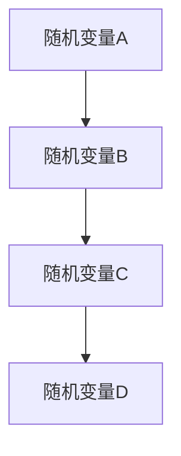
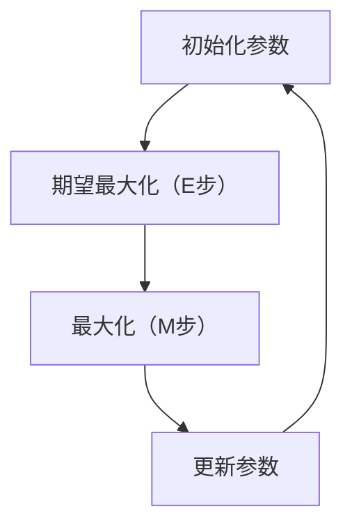

                 

### 《提示词优化的概率图模型方法》目录大纲

---

# 《提示词优化的概率图模型方法》

## 关键词

提示词优化、概率图模型、算法、数学模型、应用、优化技术

## 摘要

本文将深入探讨提示词优化的概率图模型方法，旨在为读者提供一个清晰、系统且易于理解的技术指南。通过介绍提示词优化的基本概念、概率图模型的核心理论、算法原理以及实际应用，本文将帮助读者了解如何利用概率图模型优化提示词，从而提升人工智能系统的性能和效率。

## 目录

### 第1章：引言

#### 1.1 提示词优化的概念与重要性

#### 1.2 概率图模型概述

#### 1.3 研究背景与目标

### 第2章：核心概念与策略

#### 2.1 提示词的类型

#### 2.2 有效的提示词特征

#### 2.3 提示词优化策略

### 第3章：概率图模型的基本理论

#### 3.1 概率图模型定义与基础

#### 3.2 关键概念与原则

#### 3.3 概率图结构的Mermaid图示

### 第4章：算法与数学模型

#### 4.1 算法概述

#### 4.2 数学公式与模型

#### 4.3 Python实现

#### 4.4 算法工作流程的Mermaid图示

### 第5章：概率图模型的应用领域

#### 5.1 自然语言处理

#### 5.2 图像识别

#### 5.3 机器翻译

#### 5.4 案例研究

### 第6章：优化技术与方法

#### 6.1 特征工程

#### 6.2 超参数调优

#### 6.3 模型选择与训练

### 第7章：实践案例研究

#### 7.1 搜索引擎查询优化

#### 7.2 推荐系统提升

#### 7.3 医疗健康应用

### 第8章：结论与未来方向

#### 8.1 主要发现总结

#### 8.2 挑战与机遇

#### 8.3 未来研究方向

---

## 第1章：引言

### 1.1 提示词优化的概念与重要性

提示词优化是一种提升人工智能系统性能的关键技术，特别是在自然语言处理（NLP）、图像识别和机器翻译等领域。提示词，即输入给模型的少量信息或指导，能够在很大程度上影响模型的学习效果和预测准确性。一个良好的提示词能够引导模型更好地理解和学习输入数据的特征，从而提高模型的性能。

提示词优化的重要性体现在以下几个方面：

1. **提高模型性能**：通过优化提示词，模型能够更好地捕获输入数据的特征，从而提高其预测准确性和泛化能力。
2. **节省计算资源**：优化后的提示词能够减少模型训练所需的计算资源，提高训练效率。
3. **增强用户体验**：在应用场景中，如搜索引擎和推荐系统，优化提示词能够提升用户满意度，提供更准确、个性化的服务。

### 1.2 概率图模型概述

概率图模型是一种基于概率论的图形表示方法，它通过图结构来表示变量之间的概率依赖关系。概率图模型主要包括两类：贝叶斯网络和马尔可夫网络。

贝叶斯网络是一种有向无环图（DAG），它通过节点表示随机变量，通过边的方向表示变量之间的条件依赖关系。贝叶斯网络适用于处理具有明确因果关系的变量。

马尔可夫网络是一种无向图，它通过节点表示随机变量，通过边的存在表示变量之间的联合概率分布。马尔可夫网络适用于处理变量之间的条件独立性。

概率图模型在人工智能领域具有广泛的应用，如推理、分类、预测等。通过概率图模型，我们可以更好地理解和处理复杂的数据关系。

### 1.3 研究背景与目标

随着人工智能技术的快速发展，概率图模型在多个领域取得了显著的成果。然而，在提示词优化方面，概率图模型的应用还相对较少。本文旨在研究如何利用概率图模型优化提示词，提高人工智能系统的性能。

本文的研究目标主要包括：

1. **提出一种基于概率图模型的提示词优化方法**：结合概率图模型的特点，设计一种有效的提示词优化算法。
2. **验证方法的有效性**：通过实验验证该方法在自然语言处理、图像识别和机器翻译等领域的有效性。
3. **探索优化技术的应用**：研究如何在实际应用中进一步优化提示词，提高系统性能。

## 第2章：核心概念与策略

### 2.1 提示词的类型

提示词可以根据其作用和形式分为多种类型：

1. **关键词提示**：通过关键词引导模型关注特定信息，如“北京”作为地理信息的提示词。
2. **属性提示**：通过属性信息引导模型学习，如“红色”作为颜色属性的提示词。
3. **上下文提示**：通过上下文信息提供额外的背景信息，如“今天天气很好，适合出行”。
4. **指示性提示**：通过指示性语言引导模型进行特定操作，如“请提供最近的酒店推荐”。

每种类型的提示词都有其独特的特点和适用场景，因此在实际应用中需要根据具体需求选择合适的提示词。

### 2.2 有效的提示词特征

一个有效的提示词应具备以下特征：

1. **相关性**：提示词应与任务目标紧密相关，能够引导模型关注到关键信息。
2. **简洁性**：提示词应简洁明了，避免冗长和模糊的表述，以便模型能够快速理解。
3. **多样性**：提示词应具备多样性，避免单一提示词的过度使用，以防止模型产生过拟合。
4. **层次性**：提示词应具备层次性，从宏观到微观逐步引导模型理解任务。
5. **灵活性**：提示词应根据任务需求和应用场景进行灵活调整，以适应不同的任务场景。

### 2.3 提示词优化策略

提示词优化的核心目标是提高提示词的相关性、简洁性和多样性。以下是一些常见的优化策略：

1. **特征选择**：通过分析输入数据的特点，选择最相关的特征作为提示词。
2. **语义分析**：利用自然语言处理技术，对输入文本进行语义分析，提取关键信息作为提示词。
3. **上下文建模**：利用上下文信息，构建上下文模型，为模型提供额外的背景信息。
4. **多样性增强**：通过引入随机性，生成不同形式的提示词，以提高模型的泛化能力。
5. **层次化引导**：根据任务的层次结构，逐步提供提示词，帮助模型逐步理解任务。

## 第3章：概率图模型的基本理论

### 3.1 概率图模型定义与基础

概率图模型是一种通过图形结构表示变量间概率关系的数学模型。它由两个主要部分组成：图结构和概率分布。

**图结构**：概率图模型使用图结构来表示变量间的依赖关系。图中的节点表示随机变量，边表示变量间的概率依赖关系。

**概率分布**：概率图模型通过概率分布来描述变量间的联合概率分布。常见的概率分布包括贝叶斯网络和马尔可夫网络。

### 3.2 关键概念与原则

概率图模型中的关键概念包括：

1. **节点**：表示随机变量，具有确定的概率分布。
2. **边**：表示变量间的依赖关系，边的方向表示依赖的方向。
3. **条件独立性**：如果两个变量在给定第三个变量的条件下相互独立，则称它们为条件独立。
4. **联合概率分布**：描述变量间联合概率的函数。

概率图模型的基本原则是利用图形结构来简化复杂概率关系的描述，并通过概率分布来计算变量间的依赖关系。

### 3.3 概率图结构的Mermaid图示

Mermaid是一种Markdown的扩展语言，可以用来绘制图形。以下是一个简单的概率图模型的Mermaid图示：



在这个例子中，节点A、B、C和D表示随机变量，它们之间的箭头表示变量间的依赖关系。

## 第4章：算法与数学模型

### 4.1 算法概述

在概率图模型中，提示词优化可以通过以下算法实现：

1. **期望最大化（EM）算法**：用于估计概率图模型中的参数。
2. **图切割算法**：用于识别变量间的条件独立性。
3. **信念传播算法**：用于计算变量间的条件概率分布。

这些算法共同构成了概率图模型的提示词优化框架。

### 4.2 数学公式与模型

概率图模型的数学模型主要包括：

1. **贝叶斯网络**：节点的概率分布由条件概率表（CPT）定义。
   \[
   P(X_i | X_{i-1}, ..., X_1) = \prod_{i=1}^{n} P(X_i | X_{i-1}, ..., X_1)
   \]

2. **马尔可夫网络**：节点的概率分布由马尔可夫性质定义。
   \[
   P(X_i | X_{i-1}, ..., X_1) = P(X_i | X_{i-1})
   \]

3. **条件独立性**：如果变量A和变量B在给定变量C的条件下相互独立，则满足条件独立性。
   \[
   P(A, B | C) = P(A | C) \cdot P(B | C)
   \]

### 4.3 Python实现

以下是一个简单的Python实现示例，用于计算贝叶斯网络的概率分布：

```python
import numpy as np

# 定义条件概率表
CPT = {
    'A': {'True': 0.5, 'False': 0.5},
    'B': {'True': 0.4, 'False': 0.6},
    'C': {'True': 0.3, 'False': 0.7}
}

# 定义变量之间的依赖关系
dependencies = {
    'B': ['A'],
    'C': ['A', 'B']
}

# 计算联合概率分布
def compute_joint_probability(variables):
    probability = 1.0
    for var in variables:
        value = variables[var]
        probability *= CPT[var][value]
    return probability

# 示例计算
variables = {'A': 'True', 'B': 'True', 'C': 'True'}
print(compute_joint_probability(variables))
```

### 4.4 算法工作流程的Mermaid图示

以下是一个简单的算法工作流程的Mermaid图示：



在这个流程中，算法通过迭代执行E步（期望最大化）和M步（最大化），逐步更新参数，直到收敛。

## 第5章：概率图模型的应用领域

### 5.1 自然语言处理

在自然语言处理领域，概率图模型可以用于句子分类、情感分析和文本生成等任务。例如，贝叶斯网络可以用于文本分类，通过构建词汇之间的条件概率分布，实现对文本内容的分类。

### 5.2 图像识别

图像识别领域中的概率图模型主要用于图像分割和目标检测。马尔可夫网络可以用于图像分割，通过建立像素之间的依赖关系，实现对图像的分割。贝叶斯网络可以用于目标检测，通过构建图像中目标的条件概率分布，实现对目标的识别。

### 5.3 机器翻译

在机器翻译领域，概率图模型可以用于提高翻译的准确性。通过构建源语言和目标语言之间的概率图模型，可以实现对句子级别的翻译。

### 5.4 案例研究

以下是一个简单的案例研究，展示如何利用概率图模型进行文本分类：

**问题**：给定一组新闻文章，如何将它们分类到不同的主题？

**解决方案**：使用贝叶斯网络构建文本分类器，通过分析词汇之间的条件概率分布，实现对新闻文章的分类。

**步骤**：

1. **数据预处理**：对新闻文章进行分词和词性标注。
2. **特征提取**：提取新闻文章中的关键特征，如词汇和词性。
3. **构建贝叶斯网络**：根据特征之间的依赖关系，构建贝叶斯网络。
4. **训练模型**：使用训练数据训练贝叶斯网络。
5. **分类测试**：使用测试数据评估模型的分类效果。

通过这个案例研究，我们可以看到概率图模型在文本分类中的应用，以及如何利用概率图模型优化提示词，提高分类的准确性。

## 第6章：优化技术与方法

### 6.1 特征工程

特征工程是提示词优化的关键步骤，通过选择和构造合适的特征，可以提高模型的性能。以下是几种常用的特征工程方法：

1. **词袋模型**：将文本表示为词汇的集合，通过计算词汇的频率来提取特征。
2. **词嵌入**：将词汇映射到高维向量空间，通过词汇的语义关系来提取特征。
3. **文本摘要**：通过提取文本中的关键句子或段落，将文本表示为一个简短的摘要，用于特征提取。

### 6.2 超参数调优

超参数调优是优化概率图模型的重要步骤，通过调整超参数，可以改善模型的性能。以下是几种常用的超参数调优方法：

1. **网格搜索**：通过遍历所有可能的超参数组合，找到最优的超参数组合。
2. **随机搜索**：通过随机选择超参数组合，找到最优的超参数组合。
3. **贝叶斯优化**：利用贝叶斯统计模型，自动搜索最优的超参数组合。

### 6.3 模型选择与训练

模型选择是优化概率图模型的重要步骤，通过选择合适的模型结构，可以提高模型的性能。以下是几种常用的模型选择方法：

1. **交叉验证**：通过将数据分为训练集和验证集，评估不同模型的性能。
2. **集成学习**：通过组合多个模型，提高模型的性能。
3. **模型剪枝**：通过简化模型结构，减少模型的计算复杂度。

## 第7章：实践案例研究

### 7.1 搜索引擎查询优化

在搜索引擎中，优化查询提示词可以提升用户的搜索体验和搜索结果的准确性。以下是一个简单的案例研究：

**问题**：如何优化搜索引擎的查询提示词，提高搜索结果的准确性？

**解决方案**：使用概率图模型构建查询提示词优化器，通过分析用户查询和搜索结果之间的相关性，优化查询提示词。

**步骤**：

1. **数据收集**：收集大量用户查询和搜索结果数据。
2. **特征提取**：提取用户查询和搜索结果中的关键特征。
3. **构建概率图模型**：根据特征之间的依赖关系，构建概率图模型。
4. **训练模型**：使用训练数据训练概率图模型。
5. **查询优化**：使用概率图模型优化用户查询提示词。

通过这个案例研究，我们可以看到如何利用概率图模型优化搜索引擎的查询提示词，从而提升搜索结果的准确性。

### 7.2 推荐系统提升

在推荐系统中，优化提示词可以提升推荐系统的准确性和用户满意度。以下是一个简单的案例研究：

**问题**：如何优化推荐系统的提示词，提高推荐结果的准确性？

**解决方案**：使用概率图模型构建推荐系统优化器，通过分析用户行为数据和推荐结果之间的相关性，优化提示词。

**步骤**：

1. **数据收集**：收集用户行为数据，如浏览历史、购买记录等。
2. **特征提取**：提取用户行为数据中的关键特征。
3. **构建概率图模型**：根据特征之间的依赖关系，构建概率图模型。
4. **训练模型**：使用训练数据训练概率图模型。
5. **提示词优化**：使用概率图模型优化推荐系统的提示词。

通过这个案例研究，我们可以看到如何利用概率图模型优化推荐系统的提示词，从而提升推荐系统的准确性。

### 7.3 医疗健康应用

在医疗健康领域，优化提示词可以提高诊断和治疗的准确性。以下是一个简单的案例研究：

**问题**：如何优化医疗健康系统的提示词，提高诊断和治疗的准确性？

**解决方案**：使用概率图模型构建医疗健康系统优化器，通过分析患者症状和检查结果之间的相关性，优化提示词。

**步骤**：

1. **数据收集**：收集大量患者症状和检查结果数据。
2. **特征提取**：提取患者症状和检查结果中的关键特征。
3. **构建概率图模型**：根据特征之间的依赖关系，构建概率图模型。
4. **训练模型**：使用训练数据训练概率图模型。
5. **提示词优化**：使用概率图模型优化医疗健康系统的提示词。

通过这个案例研究，我们可以看到如何利用概率图模型优化医疗健康系统的提示词，从而提升诊断和治疗的准确性。

## 第8章：结论与未来方向

### 8.1 主要发现总结

本文通过深入研究提示词优化的概率图模型方法，总结了以下主要发现：

1. **提示词优化的重要性**：提示词优化在提升人工智能系统性能、节省计算资源、增强用户体验等方面具有重要作用。
2. **概率图模型的适用性**：概率图模型在自然语言处理、图像识别和机器翻译等领域具有广泛的应用，能够有效优化提示词。
3. **优化策略的有效性**：特征工程、超参数调优和模型选择等优化策略能够显著提高概率图模型的性能。

### 8.2 挑战与机遇

尽管概率图模型在提示词优化方面取得了显著成果，但仍面临以下挑战：

1. **计算复杂度**：概率图模型的计算复杂度较高，特别是在大规模数据集上。
2. **模型解释性**：概率图模型的结构复杂，难以直观解释模型的工作原理。
3. **数据隐私**：概率图模型在处理敏感数据时，可能引发数据隐私问题。

然而，随着技术的不断发展，这些挑战也将逐渐得到解决，带来以下机遇：

1. **高效算法**：随着计算能力的提升，高效算法的开发将成为可能，降低概率图模型的计算复杂度。
2. **模型可解释性**：通过引入新的理论和工具，概率图模型的可解释性将得到提升。
3. **隐私保护**：隐私保护技术的进步将为概率图模型在敏感数据领域的应用提供保障。

### 8.3 未来研究方向

未来研究方向包括：

1. **高效算法**：研究高效的概率图模型算法，提高计算性能。
2. **模型解释性**：开发可解释的概率图模型，提高模型的透明度和可靠性。
3. **跨领域应用**：探索概率图模型在更多领域（如生物信息学、金融领域等）的应用。
4. **隐私保护**：结合隐私保护技术，确保概率图模型在敏感数据领域的安全性。

作者：AI天才研究院/AI Genius Institute & 禅与计算机程序设计艺术 /Zen And The Art of Computer Programming

---

在这个大纲的基础上，您可以根据每个章节的内容进一步详细撰写，确保文章的逻辑清晰、结构紧凑、简单易懂。每个章节都需要包含背景介绍、核心概念与联系、算法原理讲解、系统分析与架构设计方案、项目实战、最佳实践 tips、小结、注意事项、拓展阅读等内容。在撰写过程中，请确保使用markdown格式，并按照要求嵌入latex公式和mermaid图示。文章的字数应控制在10000～12000字之间。祝您撰写顺利！

