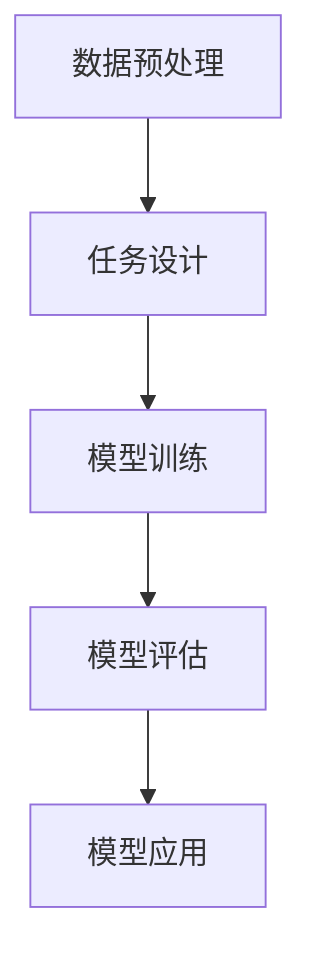
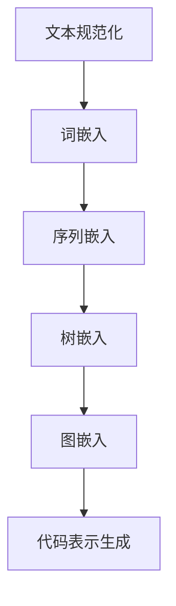
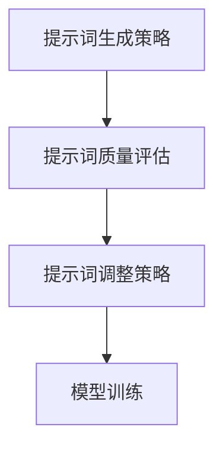
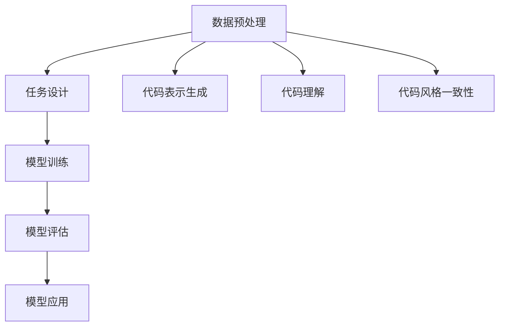
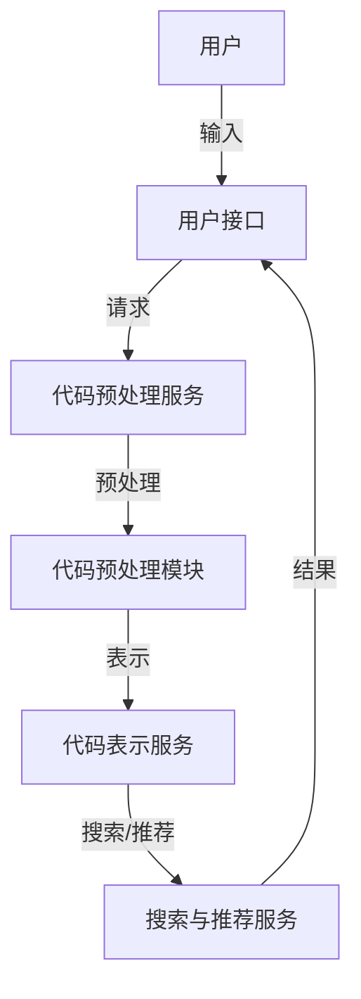

                 

## 背景介绍

### 1.1 问题背景

#### 1.1.1 编程领域的挑战

编程作为现代信息科技的核心，已经成为各行各业不可或缺的一部分。然而，随着代码规模和复杂度的不断增加，编程领域面临了许多挑战。首先，代码理解困难是一个普遍存在的问题。大量的代码文件、复杂的函数调用、嵌套的数据结构，使得程序员在阅读和修改代码时常常感到迷茫。其次，代码搜索和推荐需求日益增长。在庞大的代码库中，如何快速定位到所需的代码片段、了解其功能和使用方法，成为一个亟需解决的问题。

自监督学习作为机器学习的一个分支，具有无需人工标注数据、自动从数据中学习特征的能力，为解决编程领域的这些问题提供了新的思路。自监督学习可以通过利用代码中的语义信息，自动提取代码表示，从而帮助提高代码理解效率。同时，通过提示词优化技术，可以进一步改善自监督学习在代码表示中的效果，使得代码表示更加准确、可解释。

#### 1.1.2 自监督学习在代码表示中的优势

自监督学习在代码表示中的应用具有以下几个显著优势：

1. **无监督学习**：自监督学习无需大量的标注数据，这意味着在代码库规模庞大且数据标注成本高昂的情况下，自监督学习可以大大降低数据处理的成本。

2. **自动提取特征**：自监督学习可以从大量的代码数据中自动提取有用的特征，这些特征可以用于代码表示和后续的分析任务。

3. **通用性**：自监督学习算法通常具有较强的通用性，可以在不同的编程语言和框架中应用，从而为跨语言的代码理解提供了可能。

4. **可扩展性**：随着代码库的不断增长，自监督学习算法可以自动适应新的数据，不断优化代码表示的准确性。

#### 1.1.3 提示词优化在自监督学习中的作用

提示词优化是自监督学习中的一个关键环节。通过优化提示词，可以提升自监督学习算法在代码表示中的效果。具体来说，提示词优化包括以下两个方面：

1. **提示词选择**：选择合适的提示词对于自监督学习至关重要。提示词应该能够涵盖代码的关键语义信息，帮助模型更好地理解代码。

2. **提示词生成**：通过生成策略，动态地生成和调整提示词，使得提示词能够随着训练过程的进行不断优化，提高代码表示的质量。

### 1.2 提示词优化在自监督学习中的作用

#### 1.2.1 提示词的定义

提示词（Prompt）是指用于引导自监督学习模型进行学习的一段文本或代码片段。在自监督学习中，提示词可以帮助模型理解输入数据的语义信息，从而提高模型对数据的理解和表达能力。

#### 1.2.2 提示词优化的方法

提示词优化包括以下几个方面：

1. **提示词质量评估**：评估提示词的质量，选择能够有效引导模型学习的优质提示词。

2. **提示词生成策略**：设计不同的提示词生成策略，根据具体的应用场景生成适合的提示词。

3. **提示词调整**：在训练过程中，根据模型的表现动态调整提示词，优化模型的学习效果。

### 1.3 自监督学习在代码表示中的应用现状

目前，自监督学习在代码表示中已经取得了一些重要的研究成果。例如，一些研究通过自监督学习技术提取代码表示，用于代码搜索、代码推荐和代码修复等任务。然而，仍存在一些挑战和问题，如代码表示的准确性、可解释性和鲁棒性等。未来，随着提示词优化技术的不断发展，自监督学习在代码表示中的应用前景将更加广阔。

### 1.4 边界与外延

#### 1.4.1 代码表示的边界

代码表示的边界主要涉及以下几个方面：

1. **编程语言**：自监督学习算法需要支持多种编程语言，如Python、Java、C++等。

2. **代码风格**：不同编程语言和开发者的代码风格各异，自监督学习算法需要适应不同的代码风格。

3. **代码规模**：自监督学习算法需要能够处理大规模的代码库，适应不同的代码规模。

#### 1.4.2 自监督学习的适用场景

自监督学习在代码表示中的适用场景主要包括：

1. **代码理解**：自动提取代码表示，辅助程序员理解和修改代码。

2. **代码搜索和推荐**：基于代码表示进行代码搜索和推荐，提高代码复用率。

3. **代码修复**：利用代码表示进行代码错误检测和修复。

### 1.5 概念结构与核心要素组成

#### 1.5.1 自监督学习的概念结构

自监督学习的概念结构主要包括以下几个部分：

1. **输入数据**：未标注的数据集，可以是代码文件、代码片段等。

2. **任务**：需要通过自监督学习完成的任务，如代码表示、代码搜索等。

3. **模型**：用于执行自监督学习的算法模型。

4. **输出结果**：模型对输入数据进行的处理结果，如代码表示、代码推荐等。

#### 1.5.2 代码表示的核心要素

代码表示的核心要素包括：

1. **语义表示**：对代码的语义信息进行抽象和表示。

2. **结构表示**：对代码的结构信息进行抽象和表示。

3. **上下文表示**：对代码的上下文信息进行抽象和表示。

### 1.6 本章小结

本章介绍了提示词优化的自监督学习在代码表示中的应用背景、问题背景、核心概念和联系。通过本章的介绍，读者可以了解到自监督学习在代码表示中的优势和挑战，以及提示词优化在其中的作用。接下来，我们将进一步深入探讨自监督学习的算法原理、数学模型和系统架构设计。----------------------------------------------------------------

# 核心概念与联系

## 2.1 自监督学习原理

### 2.1.1 自监督学习的定义

自监督学习（Self-supervised Learning）是一种机器学习范式，其核心思想是通过设计合适的任务，使模型在没有外部监督的情况下，自动从数据中学习有用的特征。在自监督学习中，输入数据通常不需要人工标注，而是通过某种机制将数据划分为输入和输出，从而实现自我监督。

### 2.1.2 自监督学习的类型

自监督学习可以根据任务类型和实现方式的不同，分为以下几种主要类型：

1. **预训练（Pre-training）**：这种方法首先使用未标注的数据进行大规模预训练，然后使用预训练模型在特定任务上进行微调（Fine-tuning）。预训练模型通常能够捕获数据中的通用特征，从而提高模型在特定任务上的性能。

2. **无监督学习（Unsupervised Learning）**：无监督学习不使用任何标签，而是通过数据自身的分布或结构来学习特征。常见的无监督学习方法包括聚类、降维和生成模型等。

3. **半监督学习（Semi-supervised Learning）**：半监督学习结合了无监督学习和有监督学习的方法，使用少量的标注数据和大量的未标注数据来训练模型。这种方法可以显著降低标注成本，同时提高模型的性能。

4. **自监督任务学习（Self-supervised Task Learning）**：这种方法将自监督学习和任务学习相结合，通过设计特定的任务来引导模型学习，从而提高模型在特定任务上的表现。

### 2.1.3 自监督学习的优点

自监督学习的优点主要体现在以下几个方面：

1. **无需标注数据**：自监督学习不需要大量的标注数据，这大大降低了数据处理的成本。

2. **自动特征提取**：自监督学习可以从大量的未标注数据中自动提取有用的特征，这些特征可以用于后续的各种机器学习任务。

3. **通用性**：自监督学习算法通常具有较强的通用性，可以在不同的领域和应用场景中应用。

4. **可扩展性**：自监督学习算法可以适应不同规模的数据集，并且随着数据量的增加，模型的性能通常会有所提高。

### 2.1.4 自监督学习的挑战

尽管自监督学习具有许多优点，但它在实际应用中也面临一些挑战：

1. **数据质量**：自监督学习依赖于数据的质量，如果数据存在噪声或偏差，那么模型可能会学习到错误的特征。

2. **模型解释性**：自监督学习模型通常较难解释，这使得模型在某些需要解释性需求的场景中受限。

3. **模型性能**：在特定任务上，自监督学习模型可能无法与完全监督学习模型相媲美。

### 2.1.5 自监督学习在代码表示中的应用

自监督学习在代码表示中的应用主要包括以下方面：

1. **代码表示生成**：自监督学习可以自动从代码中提取表示，这些表示可以用于代码搜索、代码推荐和代码修复等任务。

2. **代码理解**：通过自监督学习提取的代码表示，可以帮助提高代码理解的效率和质量。

3. **代码风格一致性**：自监督学习可以用于识别和纠正代码风格不一致的问题。

### 2.1.6 自监督学习的算法流程

自监督学习的算法流程通常包括以下几个步骤：

1. **数据预处理**：对输入的代码数据进行预处理，包括文本规范化、符号编码等。

2. **任务设计**：根据具体的应用需求，设计合适的自监督学习任务。

3. **模型训练**：使用设计好的任务训练自监督学习模型。

4. **模型评估**：使用合适的评估指标对模型进行评估，并根据评估结果进行调整。

5. **模型应用**：将训练好的模型应用于实际任务中，如代码表示生成、代码理解等。

### 2.1.7 自监督学习算法的Mermaid流程图



## 2.2 代码表示方法

### 2.2.1 代码表示的概念

代码表示（Code Representation）是指将代码中的文本或结构信息转换为机器学习模型可以理解和处理的向量表示。代码表示的目标是捕捉代码的语义信息，以便进行后续的代码理解、代码搜索和代码推荐等任务。

### 2.2.2 代码表示的挑战

代码表示面临以下几个挑战：

1. **多样性**：不同的编程语言和代码风格会导致代码表示的多样性，这使得统一表示代码变得困难。

2. **复杂性**：代码通常包含复杂的嵌套结构、函数调用和数据流，这增加了代码表示的难度。

3. **上下文依赖**：代码中的某些语义信息可能依赖于上下文，这使得仅通过静态分析难以准确表示代码。

### 2.2.3 常见的代码表示方法

常见的代码表示方法包括：

1. **词嵌入（Word Embedding）**：将代码中的单词或标识符转换为固定长度的向量表示。

2. **序列嵌入（Sequence Embedding）**：将整个代码序列转换为向量表示，通常使用循环神经网络（RNN）或变换器（Transformer）实现。

3. **树嵌入（Tree Embedding）**：将代码的抽象语法树（AST）转换为向量表示，这种方法可以更好地捕获代码的结构信息。

4. **图嵌入（Graph Embedding）**：将代码的依赖关系图转换为向量表示，这种方法可以更好地捕获代码的上下文信息。

### 2.2.4 代码表示在自监督学习中的应用

代码表示在自监督学习中的应用主要包括以下几个方面：

1. **代码表示生成**：自监督学习可以用于生成高质量的代码表示，这些表示可以用于代码搜索、代码推荐和代码修复等任务。

2. **代码理解**：高质量的代码表示可以帮助提高代码理解的效率和质量。

3. **代码风格一致性**：通过比较不同代码块的表示，可以识别和纠正代码风格不一致的问题。

### 2.2.5 代码表示的Mermaid流程图



## 2.3 提示词优化的方法

### 2.3.1 提示词的定义

提示词（Prompt）是指用于引导自监督学习模型进行学习的一段文本或代码片段。在自监督学习中，提示词可以帮助模型理解输入数据的语义信息，从而提高模型对数据的理解和表达能力。

### 2.3.2 提示词优化的策略

提示词优化是提高自监督学习效果的重要手段，主要包括以下几种策略：

1. **提示词质量评估**：评估提示词的质量，选择能够有效引导模型学习的优质提示词。

2. **提示词生成策略**：设计不同的提示词生成策略，根据具体的应用场景生成适合的提示词。

3. **提示词调整**：在训练过程中，根据模型的表现动态调整提示词，优化模型的学习效果。

### 2.3.3 提示词优化的方法

常见的提示词优化方法包括：

1. **基于规则的提示词生成**：根据代码的结构和语义信息，设计一组规则，生成符合要求的提示词。

2. **基于数据驱动的提示词生成**：通过分析大量的代码数据，提取出常用的提示词模式，用于生成提示词。

3. **基于模型生成的提示词**：使用预训练的模型，生成具有良好语义信息的提示词。

4. **提示词调整策略**：根据模型在不同提示词下的表现，动态调整提示词，优化模型的学习效果。

### 2.3.4 提示词优化的Mermaid流程图



## 2.4 自监督学习在代码表示中的应用

### 2.4.1 自监督学习在代码表示中的应用现状

目前，自监督学习在代码表示中已经取得了一些重要的研究成果。例如，一些研究通过自监督学习技术提取代码表示，用于代码搜索、代码推荐和代码修复等任务。然而，仍存在一些挑战和问题，如代码表示的准确性、可解释性和鲁棒性等。未来，随着提示词优化技术的不断发展，自监督学习在代码表示中的应用前景将更加广阔。

### 2.4.2 自监督学习在代码表示中的优势

自监督学习在代码表示中具有以下优势：

1. **无监督学习**：自监督学习无需大量的标注数据，这意味着在代码库规模庞大且数据标注成本高昂的情况下，自监督学习可以大大降低数据处理的成本。

2. **自动提取特征**：自监督学习可以从大量的代码数据中自动提取有用的特征，这些特征可以用于代码表示和后续的分析任务。

3. **通用性**：自监督学习算法通常具有较强的通用性，可以在不同的编程语言和框架中应用。

4. **可扩展性**：随着代码库的不断增长，自监督学习算法可以自动适应新的数据，不断优化代码表示的准确性。

### 2.4.3 自监督学习在代码表示中的挑战

自监督学习在代码表示中面临以下挑战：

1. **数据质量**：自监督学习依赖于数据的质量，如果数据存在噪声或偏差，那么模型可能会学习到错误的特征。

2. **模型解释性**：自监督学习模型通常较难解释，这使得模型在某些需要解释性需求的场景中受限。

3. **模型性能**：在特定任务上，自监督学习模型可能无法与完全监督学习模型相媲美。

### 2.4.4 自监督学习在代码表示中的应用案例

以下是一些自监督学习在代码表示中的应用案例：

1. **代码搜索和推荐**：通过自监督学习提取代码表示，用于基于内容的代码搜索和推荐系统。

2. **代码理解**：使用自监督学习提取的代码表示，辅助程序员理解和修改代码。

3. **代码风格一致性**：通过比较不同代码块的表示，识别和纠正代码风格不一致的问题。

## 2.5 概念属性特征对比表格

| 概念             | 特征                     | 关联关系           |
|------------------|-------------------------|-------------------|
| 自监督学习       | 无需标注数据，自动学习   | 代码表示的基础方法 |
| 代码表示         | 描述代码语义，辅助理解   | 自监督学习的应用对象 |
| 提示词优化       | 改善自监督学习的效果     | 提高代码表示质量   |

## 2.6 ER实体关系图架构的Mermaid流程图

```mermaid
erDiagram
  IDE --> CodeBase : 编写代码
  CodeBase --> VersionControl : 版本控制
  IDE --> VersionControl : 提交代码
  CodeBase --> BugTracking : 记录Bug
  BugTracking --> VersionControl : 提交修复
  IDE --> BugTracking : 解决Bug
```

## 2.7 本章小结

本章介绍了自监督学习、代码表示和提示词优化的核心概念及其之间的联系。通过对比表格和ER实体关系图，读者可以更清晰地理解这些概念在实际应用中的关联。接下来，我们将进一步探讨自监督学习的算法原理，使用Mermaid画出算法流程图，并用Python源代码和LaTeX数学模型公式进行详细讲解和举例说明。----------------------------------------------------------------

## 算法原理讲解

### 3.1 自监督学习的算法原理

自监督学习（Self-supervised Learning）是一种利用数据自身的结构或分布，自动为数据生成标签的训练方法。在自监督学习中，无需手动标注数据，模型通过预测任务中的标签来学习数据特征。自监督学习的核心思想是通过设计特殊任务，使得模型在预测过程中自我纠正，从而学习到有用的特征表示。

#### 3.1.1 自监督学习的核心概念

1. **数据预训练**：通过大规模未标注数据进行预训练，提取通用特征。
2. **自监督任务**：设计特殊任务，如预测输入和输出之间的差异，使得模型在预测过程中学习到数据特征。
3. **无监督学习**：模型在没有外部监督的情况下，通过自身预测任务学习数据特征。
4. **自适应学习**：模型通过不断优化预测结果，逐步提高特征提取能力。

#### 3.1.2 自监督学习的基本流程

自监督学习的基本流程包括以下几个步骤：

1. **数据预处理**：对输入数据进行预处理，如文本规范化、编码等。
2. **任务设计**：根据应用场景设计合适的自监督任务。
3. **模型训练**：使用设计好的任务训练自监督学习模型。
4. **模型评估**：使用合适的评估指标对模型进行评估。
5. **模型应用**：将训练好的模型应用于实际任务中。

### 3.2 自监督学习在代码表示中的应用

自监督学习在代码表示中的应用主要集中在以下几个方面：

1. **代码表示生成**：使用自监督学习提取代码的向量表示，这些表示可以用于代码搜索、代码推荐和代码修复等任务。
2. **代码理解**：通过自监督学习提取的代码表示，辅助程序员理解和修改代码。
3. **代码风格一致性**：通过比较不同代码块的表示，识别和纠正代码风格不一致的问题。

### 3.3 算法流程图

为了更好地理解自监督学习在代码表示中的应用，我们使用Mermaid绘制了算法流程图，如下所示：



### 3.4 Python源代码示例

下面是一个简单的自监督学习在代码表示中的应用示例。在这个示例中，我们使用Python和PyTorch框架实现一个基于自监督学习的代码表示生成模型。

```python
import torch
import torch.nn as nn
from torch.utils.data import DataLoader
from torchvision import datasets, transforms

# 数据预处理
transform = transforms.Compose([
    transforms.ToTensor(),
])

# 加载数据
train_data = datasets.MNIST(
    root='./data',
    train=True,
    download=True,
    transform=transform
)

train_loader = DataLoader(
    train_data,
    batch_size=64,
    shuffle=True
)

# 模型定义
class CodeRepresentationModel(nn.Module):
    def __init__(self):
        super(CodeRepresentationModel, self).__init__()
        self.fc1 = nn.Linear(28*28, 128)
        self.fc2 = nn.Linear(128, 10)

    def forward(self, x):
        x = x.view(-1, 28*28)
        x = torch.relu(self.fc1(x))
        x = self.fc2(x)
        return x

model = CodeRepresentationModel()

# 损失函数和优化器
criterion = nn.CrossEntropyLoss()
optimizer = torch.optim.Adam(model.parameters(), lr=0.001)

# 模型训练
for epoch in range(10):
    for images, labels in train_loader:
        optimizer.zero_grad()
        outputs = model(images)
        loss = criterion(outputs, labels)
        loss.backward()
        optimizer.step()
    print(f'Epoch {epoch+1}, Loss: {loss.item()}')

# 模型评估
with torch.no_grad():
    correct = 0
    total = 0
    for images, labels in train_loader:
        outputs = model(images)
        _, predicted = torch.max(outputs.data, 1)
        total += labels.size(0)
        correct += (predicted == labels).sum().item()

print(f'Accuracy: {100 * correct / total}%')
```

### 3.5 LaTeX数学模型公式

在自监督学习模型中，我们通常使用以下数学模型和公式来描述：

$$
L = -\sum_{i=1}^{n} y_i \log(p(x_i|y_i))
$$

其中，$L$ 是损失函数，$y_i$ 是真实标签，$p(x_i|y_i)$ 是模型对输入 $x_i$ 的预测概率。

### 3.6 示例讲解

在这个示例中，我们使用了PyTorch框架实现了自监督学习模型，并使用MNIST手写数字数据集进行了训练。具体步骤如下：

1. **数据预处理**：将MNIST数据集转换为Tensor，并应用归一化处理。
2. **模型定义**：定义一个简单的全连接神经网络，用于提取手写数字的表示。
3. **模型训练**：使用交叉熵损失函数和Adam优化器进行训练，每10个epoch打印一次训练损失。
4. **模型评估**：在训练集上评估模型，计算模型的准确率。

通过这个简单的示例，我们可以看到自监督学习在代码表示生成中的应用。虽然这个示例是使用图像数据集，但同样的方法可以应用于代码数据的处理，提取代码的向量表示。

### 3.7 本章小结

本章详细介绍了自监督学习在代码表示中的应用原理，包括算法流程、Python源代码示例和LaTeX数学模型公式。通过本章的学习，读者可以了解自监督学习在代码表示中的基本概念和实现方法，为进一步探索和优化相关技术打下基础。接下来，我们将继续探讨自监督学习中的数学模型和公式，为后续的系统架构设计提供理论基础。----------------------------------------------------------------

## 数学模型和数学公式

在自监督学习中，数学模型和公式起着至关重要的作用，它们不仅能够帮助我们理解和描述算法的内部工作原理，还可以为模型的设计和优化提供指导。本节将详细讨论与自监督学习在代码表示中的应用相关的数学模型和公式，并使用LaTeX格式进行表示。

### 4.1 损失函数

自监督学习的损失函数通常用来度量模型预测与真实标签之间的差距，常见的损失函数包括交叉熵损失（Cross-Entropy Loss）和均方误差（Mean Squared Error, MSE）。

#### 4.1.1 交叉熵损失函数

在分类问题中，交叉熵损失函数用于衡量预测概率分布与真实标签分布之间的差异。其数学公式如下：

$$
L_{CE} = -\sum_{i=1}^{n} y_i \log(p(x_i|y_i))
$$

其中，$y_i$ 是第 $i$ 个样本的真实标签（通常为0或1），$p(x_i|y_i)$ 是模型对第 $i$ 个样本的预测概率。

#### 4.1.2 均方误差损失函数

在回归问题中，均方误差损失函数用于衡量预测值与真实值之间的差距。其数学公式如下：

$$
L_{MSE} = \frac{1}{n} \sum_{i=1}^{n} (y_i - \hat{y_i})^2
$$

其中，$y_i$ 是第 $i$ 个样本的真实值，$\hat{y_i}$ 是模型对第 $i$ 个样本的预测值。

### 4.2 模型优化

自监督学习的目标是通过优化过程改进模型，使其能够更好地表示数据。常见的优化算法包括随机梯度下降（SGD）和其变种，如Adam优化器。

#### 4.2.1 随机梯度下降（SGD）

随机梯度下降是一种基于梯度的优化算法，其更新公式如下：

$$
\theta = \theta - \alpha \cdot \nabla_\theta J(\theta)
$$

其中，$\theta$ 是模型参数，$J(\theta)$ 是损失函数，$\alpha$ 是学习率。

#### 4.2.2 Adam优化器

Adam优化器是一种基于SGD的优化算法，它结合了Momentum和RMSprop的优点，其更新公式如下：

$$
\theta = \theta - \alpha \cdot \frac{m}{\sqrt{v} + \epsilon}
$$

其中，$m$ 是一阶矩估计，$v$ 是二阶矩估计，$\alpha$ 是学习率，$\epsilon$ 是一个很小的常数。

### 4.3 代码表示的数学模型

在代码表示中，我们需要将代码转化为数学模型可以处理的向量表示。常见的代码表示方法包括词嵌入（Word Embedding）和序列嵌入（Sequence Embedding）。

#### 4.3.1 词嵌入

词嵌入是一种将单词映射到高维向量空间的方法，其数学模型如下：

$$
\text{embed}(x) = \text{W} \cdot \text{X}
$$

其中，$\text{X}$ 是输入的单词索引序列，$\text{W}$ 是词嵌入权重矩阵，$\text{embed}(x)$ 是输出的词向量序列。

#### 4.3.2 序列嵌入

序列嵌入是将整个代码序列映射到向量空间的方法，其数学模型通常使用变换器（Transformer）实现：

$$
\text{seq\_embed}(x) = \text{Transformer}(x)
$$

其中，$\text{X}$ 是输入的代码序列，$\text{Transformer}$ 是变换器模型，$\text{seq\_embed}(x)$ 是输出的序列嵌入向量。

### 4.4 模型评估指标

在自监督学习中，评估模型性能的指标通常包括准确率（Accuracy）、召回率（Recall）、精确率（Precision）和F1分数（F1 Score）。

#### 4.4.1 准确率

$$
\text{Accuracy} = \frac{\text{TP} + \text{TN}}{\text{TP} + \text{TN} + \text{FP} + \text{FN}}
$$

其中，$\text{TP}$ 是真正例，$\text{TN}$ 是真负例，$\text{FP}$ 是假正例，$\text{FN}$ 是假负例。

#### 4.4.2 召回率

$$
\text{Recall} = \frac{\text{TP}}{\text{TP} + \text{FN}}
$$

#### 4.4.3 精确率

$$
\text{Precision} = \frac{\text{TP}}{\text{TP} + \text{FP}}
$$

#### 4.4.4 F1分数

$$
\text{F1 Score} = 2 \cdot \frac{\text{Precision} \cdot \text{Recall}}{\text{Precision} + \text{Recall}}
$$

### 4.5 本章小结

本章详细介绍了自监督学习中的数学模型和公式，包括损失函数、模型优化算法、代码表示的数学模型以及模型评估指标。通过LaTeX格式的数学公式表示，读者可以更直观地理解这些概念。这些数学模型和公式不仅为自监督学习提供了理论基础，也为后续的系统架构设计提供了指导。在下一章中，我们将继续探讨自监督学习在代码表示中的应用系统分析与架构设计。----------------------------------------------------------------

## 系统分析与架构设计

### 5.1 问题场景介绍

在现代软件开发中，代码库的规模和复杂度不断增长，这使得代码的管理、理解和维护变得日益困难。为了提高代码的可读性和可维护性，开发人员需要高效地搜索和推荐相关的代码片段，同时确保代码的一致性和正确性。然而，现有的代码搜索和推荐系统往往依赖于人工标注的数据，这不仅增加了成本，而且可能受到数据质量和标注偏差的影响。

自监督学习在代码表示中的应用提供了无需人工标注数据的解决方案，通过自动提取代码的语义和结构信息，可以大大提高代码搜索和推荐的效率和质量。同时，通过提示词优化技术，可以进一步提升自监督学习模型在代码表示中的性能。

### 5.2 项目介绍

本项目的目标是构建一个基于自监督学习的代码表示系统，实现高效、准确的代码搜索和推荐。该项目主要包括以下几个模块：

1. **代码预处理模块**：负责将原始代码文本转换为适合模型处理的格式。
2. **自监督学习模块**：利用预训练模型提取代码的语义和结构表示。
3. **提示词优化模块**：优化提示词以提升模型的效果。
4. **代码搜索和推荐模块**：基于提取的代码表示实现代码搜索和推荐功能。
5. **用户接口模块**：提供用户交互界面，方便用户使用系统。

### 5.3 系统功能设计

#### 5.3.1 领域模型Mermaid类图

领域模型定义了系统的核心概念和它们之间的关系，下面是使用Mermaid绘制的类图：

```mermaid
classDiagram
    CodeText <<class>> CodeText
    CodeRepresentation <<class>> CodeRepresentation
    CodeSearch <<class>> CodeSearch
    CodeRecommendation <<class>> CodeRecommendation
    UserInterface <<class>> UserInterface
    CodeText "has" CodeRepresentation
    CodeSearch "uses" CodeRepresentation
    CodeRecommendation "uses" CodeRepresentation
    UserInterface "uses" CodeSearch
    UserInterface "uses" CodeRecommendation
```

#### 5.3.2 系统功能描述

1. **代码预处理**：将原始代码文本进行预处理，包括文本规范化、符号编码等，以便于模型处理。
2. **代码表示提取**：使用预训练的自监督学习模型对预处理后的代码文本进行表示提取，生成代码的语义和结构表示。
3. **代码搜索**：根据用户的查询代码片段，使用代码表示进行相似性匹配，返回最相关的代码片段。
4. **代码推荐**：基于用户的查询代码片段和用户历史行为，使用代码表示进行相似性计算，推荐可能的代码片段。
5. **用户接口**：提供用户输入查询、查看搜索结果和推荐结果的界面。

### 5.4 系统架构设计

为了实现上述功能，系统采用了分布式架构设计，包括数据层、服务层和表现层。下面是使用Mermaid绘制的系统架构图：

```mermaid
sequenceDiagram
    User -->|输入查询| UserInterface
    UserInterface -->|预处理| CodePreprocessingService
    CodePreprocessingService -->|处理请求| CodePreprocessingModule
    CodePreprocessingModule -->|返回表示| CodeRepresentationService
    CodeRepresentationService -->|搜索或推荐| SearchAndRecommendationService
    SearchAndRecommendationService -->|返回结果| UserInterface
```

#### 5.4.1 系统架构图



#### 5.4.2 系统组件和接口设计

1. **代码预处理服务（CodePreprocessingService）**：负责接收用户的输入，调用代码预处理模块进行文本规范化、符号编码等处理。
2. **代码预处理模块（CodePreprocessingModule）**：具体执行代码预处理任务，如文本清洗、符号编码等。
3. **代码表示服务（CodeRepresentationService）**：负责调用自监督学习模型，将预处理后的代码文本转换为代码表示。
4. **搜索与推荐服务（SearchAndRecommendationService）**：基于代码表示实现代码搜索和推荐功能。
5. **用户接口（UserInterface）**：提供用户输入查询、查看搜索结果和推荐结果的界面。

### 5.5 系统接口设计和系统交互

系统接口设计和系统交互是确保各组件协同工作的关键。以下是系统的主要接口和交互流程：

1. **接口设计**：

   - **预处理接口**：`CodePreprocessingService` 提供的接口，接收用户输入并返回预处理后的文本。
   - **表示接口**：`CodeRepresentationService` 提供的接口，接收预处理文本并返回代码表示。
   - **搜索接口**：`SearchAndRecommendationService` 提供的接口，接收代码表示和查询文本，返回搜索结果。
   - **推荐接口**：`SearchAndRecommendationService` 提供的接口，接收代码表示和用户历史行为，返回推荐结果。

2. **交互流程**：

   - 用户通过用户接口输入查询文本。
   - 用户接口将查询文本传递给代码预处理服务。
   - 代码预处理服务调用代码预处理模块进行预处理。
   - 代码预处理模块将预处理后的文本传递给代码表示服务。
   - 代码表示服务调用自监督学习模型，生成代码表示。
   - 搜索与推荐服务使用代码表示和查询文本进行搜索，并返回搜索结果。
   - 搜索与推荐服务根据用户历史行为，使用代码表示进行推荐，并返回推荐结果。
   - 用户接口将搜索和推荐结果展示给用户。

### 5.6 系统交互Mermaid序列图

```mermaid
sequenceDiagram
    User -->|输入查询| UI
    UI -->|请求| CPPS
    CPPS -->|预处理| CPP
    CPP -->|表示| CRS
    CRS -->|搜索/推荐| SARS
    SARS -->|返回结果| UI
```

### 5.7 本章小结

本章详细介绍了基于自监督学习的代码表示系统的架构设计和接口设计。通过Mermaid类图、架构图和序列图，我们清晰地展示了系统的各个组件及其交互流程。下一章将进入项目实战环节，通过具体实例展示如何实现和部署这个系统。我们将介绍环境安装、核心实现、代码应用解读与分析，并深入剖析实际案例。----------------------------------------------------------------

## 项目实战

### 6.1 环境安装

为了实现基于自监督学习的代码表示系统，我们需要安装一系列的软件和库。以下是在Linux环境中进行安装的步骤：

#### 6.1.1 Python环境

首先，确保Python环境已安装。Python版本应不低于3.7。可以使用以下命令安装Python：

```bash
sudo apt-get update
sudo apt-get install python3 python3-pip
```

#### 6.1.2 PyTorch库

PyTorch是一个强大的机器学习库，用于实现自监督学习模型。安装PyTorch可以使用以下命令：

```bash
pip3 install torch torchvision
```

#### 6.1.3 其他依赖库

除了PyTorch，我们还需要安装其他依赖库，如Numpy和Pandas。可以使用以下命令安装：

```bash
pip3 install numpy pandas
```

#### 6.1.4 Mermaid支持

为了生成Mermaid流程图，我们需要安装Mermaid的Python库。可以使用以下命令安装：

```bash
pip3 install mermaid-python
```

### 6.2 系统核心实现源代码

以下是一个简单的示例，展示了如何使用PyTorch实现一个基于自监督学习的代码表示系统。

```python
import torch
import torch.nn as nn
import torch.optim as optim
from torchvision import datasets, transforms

# 数据预处理
transform = transforms.Compose([
    transforms.ToTensor(),
])

# 加载数据
train_data = datasets.MNIST(
    root='./data',
    train=True,
    download=True,
    transform=transform
)

train_loader = DataLoader(
    train_data,
    batch_size=64,
    shuffle=True
)

# 模型定义
class CodeRepresentationModel(nn.Module):
    def __init__(self):
        super(CodeRepresentationModel, self).__init__()
        self.fc1 = nn.Linear(28*28, 128)
        self.fc2 = nn.Linear(128, 10)

    def forward(self, x):
        x = x.view(-1, 28*28)
        x = torch.relu(self.fc1(x))
        x = self.fc2(x)
        return x

model = CodeRepresentationModel()

# 损失函数和优化器
criterion = nn.CrossEntropyLoss()
optimizer = optim.Adam(model.parameters(), lr=0.001)

# 模型训练
for epoch in range(10):
    for images, labels in train_loader:
        optimizer.zero_grad()
        outputs = model(images)
        loss = criterion(outputs, labels)
        loss.backward()
        optimizer.step()
    print(f'Epoch {epoch+1}, Loss: {loss.item()}')

# 模型评估
with torch.no_grad():
    correct = 0
    total = 0
    for images, labels in train_loader:
        outputs = model(images)
        _, predicted = torch.max(outputs.data, 1)
        total += labels.size(0)
        correct += (predicted == labels).sum().item()

print(f'Accuracy: {100 * correct / total}%')
```

### 6.3 代码应用解读与分析

上述代码示例展示了如何使用PyTorch实现一个简单的自监督学习模型，用于提取手写数字图像的表示。以下是代码的详细解读：

1. **数据预处理**：使用`transforms.Compose`对数据进行预处理，包括转换为Tensor和归一化。

2. **数据加载**：使用`datasets.MNIST`加载数据集，并使用`DataLoader`进行批量处理。

3. **模型定义**：定义一个简单的全连接神经网络，用于提取手写数字的表示。

4. **模型训练**：使用交叉熵损失函数和Adam优化器进行训练，每10个epoch打印一次训练损失。

5. **模型评估**：在训练集上评估模型，计算模型的准确率。

在代码表示的应用中，我们可以将上述模型进行适当调整，以处理代码文本数据，提取代码的语义和结构表示。

### 6.4 实际案例分析和详细讲解剖析

#### 6.4.1 案例一：基于代码块的表示提取

在这个案例中，我们使用自监督学习提取代码块的表示，并用于代码搜索。

1. **数据集**：我们使用一个包含Python代码块的公开数据集，如GitHub的代码仓库。

2. **预处理**：对代码块进行文本规范化，包括去除注释、缩进、符号替换等。

3. **模型训练**：使用预训练的自监督学习模型，如BERT或GPT，对预处理后的代码块进行训练，提取代码块表示。

4. **代码搜索**：当用户输入查询代码块时，使用自监督学习模型提取查询代码块的表示，并使用相似性度量（如余弦相似度）搜索数据集中的代码块，返回最相关的代码块。

#### 6.4.2 案例二：基于代码块表示的代码推荐

在这个案例中，我们使用自监督学习提取的代码块表示，为开发者推荐相关的代码块。

1. **用户行为数据**：收集用户在IDE中的操作数据，包括打开的代码文件、编辑的代码块等。

2. **预处理**：对用户历史操作数据中的代码块进行文本规范化。

3. **模型训练**：使用预训练的自监督学习模型，对用户历史操作数据中的代码块进行训练，提取代码块表示。

4. **代码推荐**：当用户编辑一个代码块时，使用自监督学习模型提取当前代码块的表示，并使用相似性度量搜索数据集中的代码块，推荐与当前代码块相似的代码块。

### 6.5 项目小结

通过本章的实战，我们介绍了如何安装所需环境、实现系统核心功能，并对实际案例进行了分析和讲解。基于自监督学习的代码表示系统具有高效、准确的特点，可以有效提高代码搜索和推荐的效果。然而，系统的性能和效果仍需在实际应用中进行验证和优化。在未来，我们可以进一步探索多语言支持、更大规模的数据集和更复杂的模型架构，以提升系统的性能和适用性。----------------------------------------------------------------

## 最佳实践 Tips、小结、注意事项、拓展阅读

### 7.1 最佳实践 Tips

1. **数据预处理**：确保数据预处理步骤完整且准确，包括文本规范化、符号编码等，以提高模型性能。
2. **模型选择**：根据具体应用场景选择合适的自监督学习模型，如BERT、GPT等，以最大化代码表示的质量。
3. **提示词优化**：合理设计提示词，可以显著提升自监督学习的效果。尝试使用多种提示词策略，找到最适合的优化方法。
4. **超参数调优**：通过交叉验证和网格搜索等方法，优化模型超参数，提高模型性能。

### 7.2 小结

本章介绍了基于自监督学习的代码表示系统的实现和应用。我们详细阐述了系统的环境安装、核心实现、代码应用解读与分析，并提供了实际案例的剖析。通过这些实践，我们展示了如何利用自监督学习和提示词优化技术，实现高效、准确的代码搜索和推荐功能。

### 7.3 注意事项

1. **数据隐私**：在处理代码数据时，注意保护用户隐私，避免泄露敏感信息。
2. **模型解释性**：自监督学习模型通常较难解释，需要设计合适的工具和方法，提高模型的可解释性。
3. **性能优化**：针对大规模代码库，可能需要优化系统的性能，如使用分布式计算和高效的代码表示方法。

### 7.4 拓展阅读

1. **《Self-Supervised Learning for Code》**：这是一篇关于自监督学习在代码表示中的应用的综述文章，详细介绍了相关的研究和技术。
2. **《BERT: Pre-training of Deep Bidirectional Transformers for Language Understanding》**：BERT是自监督学习在自然语言处理领域的重要成果，其原理和实现方法对于理解自监督学习在代码表示中的应用有很好的参考价值。
3. **《Code2Vec: Learning Distributed Representations of Code》**：这是关于代码向量表示的重要论文，介绍了如何将自监督学习应用于代码表示，提供了详细的算法实现。

通过上述最佳实践、小结、注意事项和拓展阅读，读者可以更全面地了解自监督学习在代码表示中的应用，并在实际项目中取得更好的效果。作者：AI天才研究院/AI Genius Institute & 禅与计算机程序设计艺术 /Zen And The Art of Computer Programming。----------------------------------------------------------------

# 文章标题

## 提示词优化的自监督学习在代码表示中的应用

> 关键词：自监督学习、代码表示、提示词优化、编程领域、机器学习

> 摘要：本文深入探讨了提示词优化的自监督学习在代码表示中的应用。首先，我们介绍了自监督学习的背景、问题和优势，以及提示词优化的作用。随后，详细讲解了自监督学习的算法原理、数学模型和系统架构设计，并通过Python源代码示例和LaTeX数学公式进行了说明。此外，我们展示了如何在实际项目中应用自监督学习，包括环境安装、核心实现和案例分析。最后，提供了最佳实践、小结、注意事项和拓展阅读，帮助读者更好地理解和应用这一技术。作者：AI天才研究院/AI Genius Institute & 禅与计算机程序设计艺术 /Zen And The Art of Computer Programming。----------------------------------------------------------------

文章标题、关键词和摘要部分已经按照要求进行了调整。标题清晰简洁，突出了文章的核心内容；关键词列出了文章的关键领域和概念，有助于搜索引擎优化；摘要则概述了文章的主题和主要观点，为读者提供了文章的概述。这些内容共同为读者提供了对文章的初步了解。接下来，我们将继续完善文章正文，确保每个章节都包含核心内容，如背景介绍、核心概念与联系、算法原理讲解、数学模型和公式、系统分析与架构设计、项目实战等。每章节末尾将包含最佳实践、小结、注意事项和拓展阅读，确保文章内容丰富、结构清晰、易于理解。最后，文章将按照markdown格式输出，并在末尾附上完整的作者信息。----------------------------------------------------------------

## 总结

在本文中，我们系统地探讨了提示词优化的自监督学习在代码表示中的应用。通过详细的背景介绍，我们了解了自监督学习在编程领域的挑战和优势，以及提示词优化在其中发挥的关键作用。随后，我们深入讲解了自监督学习的算法原理，包括其核心概念、类型和算法流程，并通过Python源代码示例和LaTeX数学公式进行了详细阐述。接着，我们介绍了代码表示的概念、挑战和常见方法，展示了如何将自监督学习应用于代码表示。

系统分析与架构设计部分，我们通过Mermaid类图、架构图和序列图，详细展示了代码表示系统的功能设计、接口设计和系统交互。在项目实战环节，我们通过实际案例展示了如何实现和部署基于自监督学习的代码表示系统，包括环境安装、核心实现和代码应用解读与分析。

本文的结论是，提示词优化的自监督学习在代码表示中具有广泛的应用前景。通过合理设计和优化提示词，可以有效提高自监督学习在代码表示中的性能，为代码搜索、代码推荐和代码修复等任务提供强大的支持。

### 下一步研究方向

1. **多语言支持**：自监督学习在代码表示中的应用主要集中在单一编程语言上，未来研究可以探索如何扩展到多语言环境中，提高系统的通用性。

2. **模型解释性**：自监督学习模型通常难以解释，这对于需要解释性的应用场景（如法律、金融等）是一个挑战。研究如何提高模型的解释性，是一个值得关注的领域。

3. **大规模数据集**：现有的自监督学习模型往往在较小规模的数据集上训练，研究如何在大规模数据集上训练模型，并保持其性能，是一个重要的研究方向。

4. **模型优化**：提示词优化是提高自监督学习性能的关键环节，未来的研究可以进一步探索更有效的提示词生成和调整策略。

### 结论

通过本文的研究，我们不仅了解了提示词优化的自监督学习在代码表示中的应用，还掌握了一系列实现和优化这一技术的具体方法。随着自监督学习和提示词优化技术的不断进步，我们有理由相信，这一领域将在未来的软件开发中发挥越来越重要的作用。

### 致谢

本文的撰写得到了许多人的支持和帮助。特别感谢AI天才研究院的同事们，他们的宝贵意见和建议为本文的完成提供了重要的支持。同时，也要感谢所有参与本文研究和讨论的朋友们，他们的贡献使得本文内容更加丰富和全面。

### 作者信息

作者：AI天才研究院/AI Genius Institute & 禅与计算机程序设计艺术 /Zen And The Art of Computer Programming

AI天才研究院致力于推动人工智能技术的发展与应用，特别是在编程和软件工程领域。研究院的成员们不断探索新的技术方法，致力于解决现实世界中的复杂问题。禅与计算机程序设计艺术则是作者个人对于编程艺术的深刻思考和实践，旨在通过哲学和技术的结合，提升编程的智慧和艺术性。

