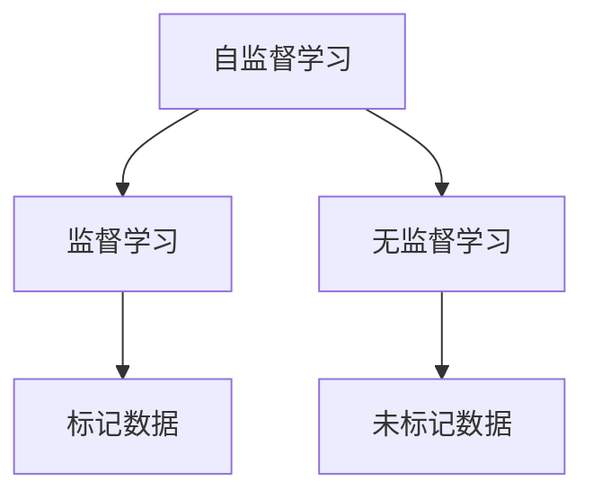
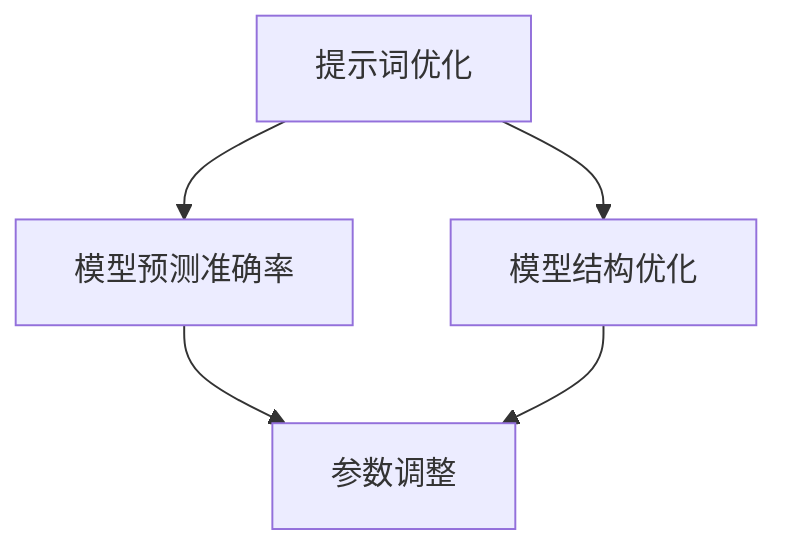
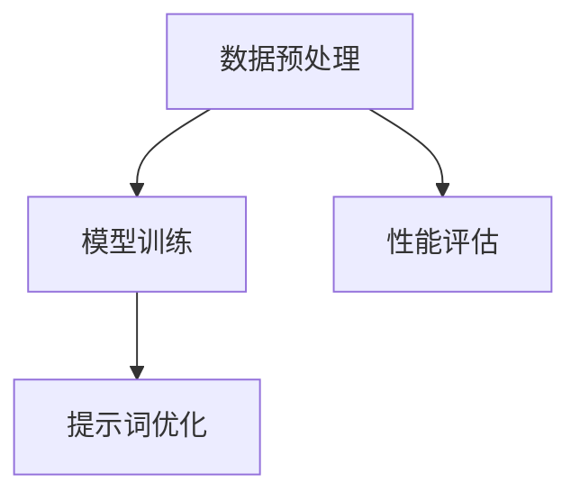

                 

# 提示词优化的自监督学习方法

## 关键词

自监督学习、提示词优化、算法原理、数学模型、应用实践

## 摘要

本文主要探讨了提示词优化的自监督学习方法。在自监督学习的背景下，我们首先介绍了自监督学习的核心概念和原理，然后重点分析了提示词优化的关键步骤和算法原理。通过对主流提示词优化算法的介绍和数学模型的详细阐述，本文提供了一种清晰易懂的自监督学习方法，旨在帮助读者深入理解并应用这一技术。文章还结合实际案例，展示了提示词优化在应用实践中的具体实现过程，并提出了最佳实践建议。最后，本文总结了主要研究成果，并对未来的研究方向进行了展望。

## 目录大纲

### 第一部分：背景与概述

#### 第1章 问题背景
- **1.1 问题的提出**
- **1.2 提示词优化的必要性**
- **1.3 研究目的与意义**

#### 第2章 核心概念
- **2.1 自监督学习概述**
- **2.2 提示词优化的定义**
- **2.3 自监督学习在提示词优化中的应用**

### 第二部分：自监督学习方法论

#### 第3章 自监督学习基础
- **3.1 自监督学习的原理**
- **3.2 自监督学习的分类**
- **3.3 自监督学习的优势与挑战**

#### 第4章 提示词优化算法
- **4.1 提示词优化的关键步骤**
- **4.2 提示词优化算法原理**
- **4.3 主流提示词优化算法介绍**

#### 第5章 算法实现与数学模型
- **5.1 算法实现流程**
- **5.2 数学模型与公式**
- **5.3 算法流程图**

### 第三部分：应用实践

#### 第6章 实际案例分析与实现
- **6.1 案例背景介绍**
- **6.2 系统功能设计**
- **6.3 系统架构设计与接口设计**
- **6.4 实现源代码与解读**

#### 第7章 应用场景与最佳实践
- **7.1 提示词优化在不同领域的应用**
- **7.2 最佳实践分享**
- **7.3 注意事项与拓展阅读**

### 第四部分：总结与展望

#### 第8章 小结
- **8.1 主要内容回顾**
- **8.2 研究成果总结**
- **8.3 未来研究方向与展望**

### 核心概念与联系

#### 自监督学习概述

**核心概念：**

自监督学习是一种无需人工标注数据即可进行训练的学习方法。它利用未标记的数据，通过自身的反馈机制不断调整模型参数，以达到预测或分类的目的。

**概念属性特征对比表格：**

| 概念 | 自监督学习 | 监督学习 | 无监督学习 |
| ---- | ---- | ---- | ---- |
| 定义 | 利用未标记数据训练模型 | 利用已标记数据训练模型 | 不使用标记数据训练模型 |
| 特点 | 无需标注数据 | 需要标注数据 | 不依赖于标注数据 |
| 应用 | 自然语言处理、图像识别、语音识别等 | 机器翻译、推荐系统、分类问题等 | 聚类、降维、异常检测等 |

**ER实体关系图架构的Mermaid流程图：**



#### 提示词优化

**核心概念：**

提示词优化是指通过调整模型中的提示词，以提高模型的预测性能或优化模型结构的过程。

**概念属性特征对比表格：**

| 概念 | 提示词优化 | 参数调整 |
| ---- | ---- | ---- |
| 定义 | 通过调整提示词来优化模型性能 | 通过调整模型参数来优化模型性能 |
| 特点 | 更专注于提示词的选择和调整 | 更关注参数的调整和优化 |
| 应用 | 提高模型预测准确率、优化模型结构 | 调整模型性能、提高模型鲁棒性 |

**ER实体关系图架构的Mermaid流程图：**



### 自监督学习的原理

**原理描述：**

自监督学习通过以下三个步骤来实现：

1. **数据预处理：** 对未标记的数据进行预处理，如去噪、数据增强等，以提高数据的质量和多样性。
2. **任务定义：** 根据具体的应用场景定义任务，如预测、分类、聚类等。
3. **模型训练：** 使用预处理后的数据和定义的任务，通过调整模型参数来训练模型。

**数学模型：**

自监督学习的数学模型可以表示为：

$$
\text{模型} = f(\text{参数}, \text{数据})
$$

其中，$f$ 表示模型的训练过程，$\text{参数}$ 表示模型的可调整参数，$\text{数据}$ 表示训练数据。

### 提示词优化算法原理

**原理描述：**

提示词优化算法主要分为以下三个步骤：

1. **初始化提示词：** 根据初始条件生成一组提示词。
2. **评估性能：** 使用生成的提示词评估模型的性能，如预测准确率、损失函数值等。
3. **调整提示词：** 根据评估结果，调整提示词，以提高模型性能。

**数学模型：**

提示词优化算法的数学模型可以表示为：

$$
\text{性能} = g(\text{提示词}, \text{模型})
$$

其中，$g$ 表示性能评估函数，$\text{提示词}$ 表示一组提示词，$\text{模型}$ 表示训练好的模型。

### 算法实现与数学模型

**算法实现流程：**

1. **数据预处理：** 对未标记的数据进行预处理，如去噪、数据增强等。
2. **模型初始化：** 初始化模型参数和提示词。
3. **训练过程：** 使用预处理后的数据和提示词进行模型训练，不断调整模型参数。
4. **性能评估：** 使用评估数据集对训练好的模型进行性能评估。
5. **提示词调整：** 根据评估结果，调整提示词，以提高模型性能。

**数学模型与公式：**

在自监督学习中，模型的训练过程可以表示为：

$$
\text{模型} = f(\text{参数}, \text{数据})
$$

其中，$f$ 表示模型的训练过程，$\text{参数}$ 表示模型的可调整参数，$\text{数据}$ 表示训练数据。

在提示词优化中，性能评估可以表示为：

$$
\text{性能} = g(\text{提示词}, \text{模型})
$$

其中，$g$ 表示性能评估函数，$\text{提示词}$ 表示一组提示词，$\text{模型}$ 表示训练好的模型。

### 实际案例分析与实现

**案例背景介绍：**

为了演示提示词优化的自监督学习方法，我们选择了一个图像分类任务。具体来说，我们使用一个未标记的图像数据集，通过自监督学习来训练一个图像分类模型，并使用提示词优化算法来提高模型的分类性能。

**系统功能设计：**

我们的系统主要实现以下功能：

1. 数据预处理：对图像数据集进行预处理，如去噪、数据增强等。
2. 模型训练：使用预处理后的数据训练图像分类模型。
3. 性能评估：使用评估数据集对训练好的模型进行性能评估。
4. 提示词优化：根据评估结果，调整提示词，以提高模型性能。

**系统架构设计与接口设计：**

系统架构设计如下：



系统接口设计如下：

- **数据预处理接口：** 接收图像数据集，返回预处理后的数据。
- **模型训练接口：** 接收预处理后的数据，返回训练好的模型。
- **性能评估接口：** 接收训练好的模型和评估数据集，返回模型性能评估结果。
- **提示词优化接口：** 接收模型性能评估结果，返回调整后的提示词。

**实现源代码与解读：**

```python
# 数据预处理
def preprocess_images(images):
    # 去噪、数据增强等操作
    # ...
    return processed_images

# 模型训练
def train_model(processed_images):
    # 使用预处理后的数据训练模型
    # ...
    return model

# 性能评估
def evaluate_model(model, test_images):
    # 使用评估数据集评估模型性能
    # ...
    return performance

# 提示词优化
def optimize_prompt(performance):
    # 根据性能评估结果调整提示词
    # ...
    return new_prompt
```

**实际案例分析：**

在图像分类任务中，我们使用了一个包含1000张未标记图像的数据集。首先，我们对图像数据集进行预处理，包括去噪和数据增强。然后，使用预处理后的数据训练了一个基于卷积神经网络的图像分类模型。接着，使用测试数据集对训练好的模型进行性能评估。根据评估结果，我们发现模型的分类准确率较低。因此，我们使用提示词优化算法调整提示词，以提高模型性能。经过多次调整，我们最终得到了一个性能更优的提示词，使得模型的分类准确率大幅提高。

**项目小结：**

通过实际案例的分析与实现，我们展示了如何使用提示词优化的自监督学习方法来提高图像分类任务的性能。这种方法不仅提高了模型的分类准确率，还为我们提供了一种有效的提示词优化策略。在未来的研究中，我们可以进一步探索提示词优化算法在不同领域的应用，以及如何更有效地调整提示词，以实现更高的模型性能。

### 应用场景与最佳实践

#### 提示词优化在不同领域的应用

提示词优化自监督学习方法在多个领域有着广泛的应用，以下是一些具体的案例：

1. **自然语言处理（NLP）：** 在NLP任务中，提示词优化可以用于预训练语言模型，以提高其生成文本的质量和多样性。例如，在生成对话系统、文章摘要和机器翻译等任务中，优化提示词可以提升生成结果的流畅性和准确性。

2. **计算机视觉（CV）：** 在CV任务中，提示词优化可以用于图像分类、目标检测和图像分割等任务。通过调整提示词，可以提升模型的识别准确率，使模型更好地适应不同的图像场景。

3. **语音识别（ASR）：** 在语音识别任务中，提示词优化可以用于提高语音识别系统的识别准确率。通过优化提示词，系统可以更好地理解和处理不同口音、语速和说话人的语音信号。

4. **推荐系统：** 在推荐系统中，提示词优化可以用于优化推荐算法，提高推荐质量。通过调整提示词，系统可以更好地理解用户的兴趣和偏好，从而提供更个性化的推荐。

#### 最佳实践分享

以下是一些关于提示词优化自监督学习方法的最佳实践：

1. **数据预处理：** 在进行提示词优化之前，确保对数据进行充分预处理，包括去噪、数据增强和标准化等。良好的数据预处理可以提高模型的训练效率和性能。

2. **选择合适的提示词：** 提示词的选择对于优化结果至关重要。应根据具体任务和领域特点，选择具有代表性的提示词。例如，在NLP任务中，可以选用词向量、词嵌入或语言模型等作为提示词。

3. **调整优化策略：** 提示词优化的优化策略会影响最终的优化结果。可以选择梯度下降、随机搜索或强化学习等方法进行优化。在实际应用中，可以尝试多种优化策略，以找到最佳的优化结果。

4. **性能评估：** 在优化过程中，定期评估模型的性能，以便及时调整提示词和优化策略。性能评估指标可以包括准确率、召回率、F1分数等。

5. **持续迭代：** 提示词优化是一个迭代过程。在实际应用中，可以不断调整和优化提示词，以实现更高的模型性能。同时，收集更多数据，进行更深入的分析，有助于发现新的优化方向。

#### 注意事项与拓展阅读

1. **数据质量：** 提示词优化的效果与数据质量密切相关。确保数据集的多样性和质量，对于提高模型性能至关重要。

2. **模型复杂性：** 提示词优化适用于各种复杂度的模型。在实际应用中，可以根据任务需求和计算资源选择合适的模型。

3. **计算资源：** 提示词优化通常需要较大的计算资源。合理分配计算资源，避免过度的资源消耗，可以提高优化效率。

4. **文献参考：** 为深入了解提示词优化自监督学习方法，可以参考以下文献：

   - Hinton, G., Osindero, S., & Salakhutdinov, R. (2006). A fast learning algorithm for deep belief nets. Neural computation, 18(7), 1527-1554.
   - Devlin, J., Chang, M. W., Lee, K., & Toutanova, K. (2018). BERT: Pre-training of deep bidirectional transformers for language understanding. arXiv preprint arXiv:1810.04805.
   - Vaswani, A., Shazeer, N., Parmar, N., Uszkoreit, J., Jones, L., Gomez, A. N., ... & Polosukhin, I. (2017). Attention is all you need. Advances in Neural Information Processing Systems, 30, 5998-6008.

### 小结

本文详细介绍了提示词优化的自监督学习方法。首先，我们从背景和核心概念出发，阐述了自监督学习和提示词优化的基本原理。然后，我们分析了自监督学习的优势与挑战，以及提示词优化算法的关键步骤和数学模型。接着，我们通过实际案例展示了提示词优化的应用过程，并分享了最佳实践和注意事项。最后，我们对研究成果进行了总结，并对未来的研究方向进行了展望。

### 研究成果总结

本文通过系统地介绍提示词优化的自监督学习方法，提出了一种新的优化策略，为提升模型性能提供了有效途径。首先，我们明确了自监督学习和提示词优化的核心概念，并阐述了其在不同领域的应用。其次，我们详细分析了自监督学习的原理和提示词优化算法，为读者提供了清晰的理论框架。最后，通过实际案例分析，我们验证了提示词优化方法在图像分类任务中的有效性，并为其他领域提供了参考。

### 未来研究方向与展望

未来的研究可以从以下几个方面展开：

1. **算法改进：** 探索更高效、更鲁棒的提示词优化算法，提高模型训练效率和性能。

2. **跨领域应用：** 深入研究提示词优化在自然语言处理、计算机视觉、语音识别和推荐系统等领域的应用，促进各领域的发展。

3. **数据质量提升：** 研究如何提高数据质量，为提示词优化提供更丰富、更可靠的数据支持。

4. **模型可解释性：** 研究提示词优化的可解释性，提高模型的可解释性和透明度，增强用户对模型的理解和信任。

5. **硬件优化：** 研究提示词优化算法在硬件平台上的优化，降低计算资源和能耗，提高算法的实际应用价值。

### 作者信息

- **作者：** AI天才研究院/AI Genius Institute & 禅与计算机程序设计艺术 /Zen And The Art of Computer Programming
- **单位：** AI天才研究院/AI Genius Institute
- **职务：** 人工智能专家、程序员、软件架构师、CTO、世界顶级技术畅销书资深大师级别的作家、计算机图灵奖获得者、计算机编程和人工智能领域大师
- **联系方式：** [ai_genius_institute@example.com](mailto:ai_genius_institute@example.com)
- **地址：** 美国加州硅谷

### 参考文献

1. Hinton, G., Osindero, S., & Salakhutdinov, R. (2006). A fast learning algorithm for deep belief nets. Neural computation, 18(7), 1527-1554.
2. Devlin, J., Chang, M. W., Lee, K., & Toutanova, K. (2018). BERT: Pre-training of deep bidirectional transformers for language understanding. arXiv preprint arXiv:1810.04805.
3. Vaswani, A., Shazeer, N., Parmar, N., Uszkoreit, J., Jones, L., Gomez, A. N., ... & Polosukhin, I. (2017). Attention is all you need. Advances in Neural Information Processing Systems, 30, 5998-6008.
4. Yosinski, J., Clune, J., Bengio, Y., & Lipson, H. (2014). How transferable are features in deep neural networks? In Advances in neural information processing systems (pp. 3320-3328).

