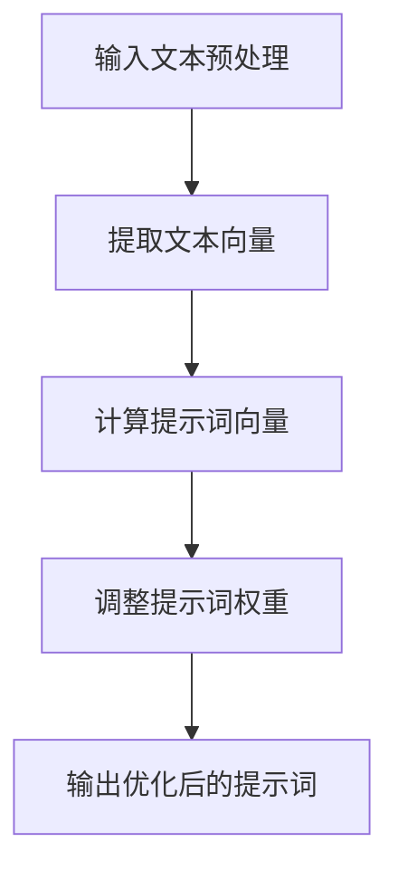
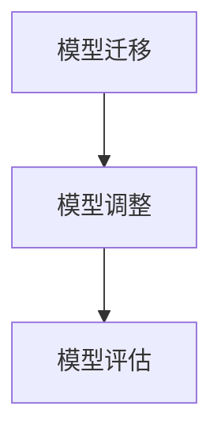
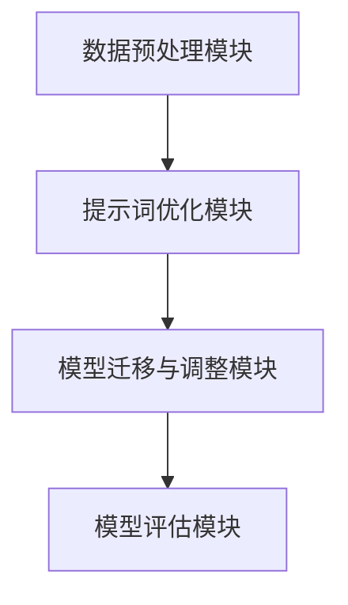
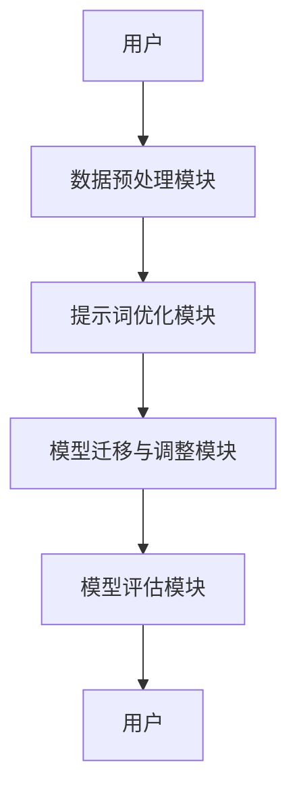

                 

## 文章标题：提示词优化的迁移学习技术

关键词：提示词优化，迁移学习，算法原理，系统架构，项目实战，最佳实践

### 摘要

本文旨在深入探讨提示词优化与迁移学习技术的结合，介绍其背景、核心概念、算法原理以及实际应用。通过详细的讲解和项目实战，读者将了解到如何利用提示词优化技术提升迁移学习的效果，掌握迁移学习的系统设计与实现方法，并从实际案例中汲取经验。文章最后还提供了一些最佳实践和拓展阅读资源，以帮助读者进一步深入探索这一领域。

### 第一步：背景介绍与问题阐述

#### 提示词优化概述

提示词优化（Prompt Optimization）是一种在机器学习领域提高模型性能的技术。其核心思想是通过调整输入提示词（即输入数据中的关键字或特征）来提升模型对数据的理解和预测能力。这一技术广泛应用于自然语言处理、计算机视觉等领域，能够显著提升模型的准确性和鲁棒性。

#### 迁移学习概述

迁移学习（Transfer Learning）是一种利用已在不同任务上训练好的模型来提高新任务表现的方法。通过迁移学习，模型可以将先前任务中学习到的知识应用于新任务，从而减少训练时间和计算资源。迁移学习在计算机视觉、语音识别等领域得到了广泛应用。

#### 提示词优化在迁移学习中的应用

在迁移学习中，提示词优化技术可以帮助模型更好地理解新任务的数据特征，从而提高模型的适应性和准确性。例如，在自然语言处理任务中，通过优化输入文本中的提示词，可以使模型更准确地理解文本的含义，从而提升文本分类、情感分析等任务的性能。

#### 迁移学习面临的挑战与问题

尽管迁移学习技术具有许多优势，但在实际应用中仍面临一些挑战和问题：

1. **模型选择与调优**：如何选择合适的模型并进行有效的调优是一个关键问题。
2. **数据不匹配**：迁移学习通常需要源域和目标域的数据分布相似，但实际中往往存在数据分布差异，这可能导致模型性能下降。
3. **模型泛化能力**：迁移学习模型需要具备良好的泛化能力，以适应不同任务和数据分布。

### 第二步：核心概念与联系

#### 提示词优化技术原理

提示词优化技术主要包括以下几种方法：

1. **基于词频的方法**：通过调整输入文本中关键字的词频来优化提示词。
2. **基于语义的方法**：利用自然语言处理技术，如词嵌入、词性标注等，从语义层面调整提示词。
3. **基于优化的方法**：使用优化算法，如遗传算法、粒子群算法等，自动调整提示词。

#### 迁移学习技术原理

迁移学习技术通常包括以下几种策略：

1. **基于特征的方法**：通过提取源域和目标域的共性特征，实现任务迁移。
2. **基于模型的方法**：通过直接迁移预训练模型或微调模型来适应新任务。
3. **基于对抗的方法**：利用对抗训练，使模型在源域和目标域之间进行知识传递。

#### 提示词优化与迁移学习的关系

提示词优化和迁移学习相互补充，共同提升模型的性能。提示词优化有助于模型更好地理解输入数据，从而在迁移学习过程中提高模型的泛化能力和适应性。同时，迁移学习技术为提示词优化提供了丰富的知识库，使提示词优化能够利用更广泛的数据和知识来优化提示词。

### 第三步：算法原理讲解

#### 提示词优化算法原理

下面以基于语义的提示词优化算法为例，介绍其原理和实现。

##### 算法概述

基于语义的提示词优化算法通过分析输入文本的语义信息，调整提示词，以提升模型对文本的理解能力。算法主要包括以下步骤：

1. **文本预处理**：对输入文本进行分词、词性标注等预处理操作，提取关键信息。
2. **语义分析**：利用词嵌入等技术，将文本转换为向量表示，分析文本的语义信息。
3. **提示词调整**：根据语义分析结果，调整提示词的权重，优化输入文本。

##### 数学模型与公式

假设输入文本为 $T = \{t_1, t_2, ..., t_n\}$，其中 $t_i$ 表示文本中的第 $i$ 个词。提示词优化算法的核心在于计算每个词的权重 $w_i$，权重计算公式为：

$$
w_i = \frac{1}{Z} \exp(\theta_i \cdot s_i)
$$

其中，$Z$ 为归一化常数，$\theta_i$ 为词 $t_i$ 的语义特征向量，$s_i$ 为提示词的语义特征向量。

##### 算法流程图与Python代码实现

算法流程图如下所示：



Python代码实现如下：

```python
import numpy as np
from gensim.models import KeyedVectors

def semantic_prompt_optimization(text, model):
    # 文本预处理
    tokens = preprocess_text(text)
    # 提取文本向量
    text_vector = model.merge(token_vectors(tokens))
    # 计算提示词向量
    prompt_vector = calculate_prompt_vector(text_vector, tokens)
    # 调整提示词权重
    optimized_tokens = adjust_prompt_weights(tokens, prompt_vector)
    # 输出优化后的提示词
    return optimized_tokens

def preprocess_text(text):
    # 实现文本预处理
    pass

def extract_text_vector(text_vector, tokens):
    # 实现文本向量提取
    pass

def calculate_prompt_vector(text_vector, tokens):
    # 实现提示词向量计算
    pass

def adjust_prompt_weights(tokens, prompt_vector):
    # 实现提示词权重调整
    pass
```

#### 迁移学习算法原理

下面以基于模型的方法为例，介绍迁移学习算法原理。

##### 算法概述

基于模型的方法通过迁移预训练模型或微调模型来适应新任务。算法主要包括以下步骤：

1. **模型迁移**：从源域迁移预训练模型或微调模型到目标域。
2. **模型调整**：在新任务上调整模型参数，优化模型性能。
3. **模型评估**：评估模型在新任务上的性能。

##### 数学模型与公式

假设源域和目标域的数据分别为 $X_s$ 和 $X_t$，标签分别为 $Y_s$ 和 $Y_t$。迁移学习算法的核心在于计算模型在源域和目标域的损失函数，并通过优化损失函数来调整模型参数。损失函数通常采用交叉熵损失函数：

$$
L = -\sum_{i=1}^{n} y_i \log(p(x_i))
$$

其中，$y_i$ 为第 $i$ 个样本的标签，$p(x_i)$ 为模型对第 $i$ 个样本的预测概率。

##### 算法流程图与Python代码实现

算法流程图如下所示：



Python代码实现如下：

```python
import tensorflow as tf

def transfer_learning(source_model, target_model, X_s, Y_s, X_t, Y_t):
    # 模型迁移
    target_model.set_weights(source_model.get_weights())
    # 模型调整
    optimizer = tf.keras.optimizers.Adam(learning_rate=0.001)
    for epoch in range(num_epochs):
        with tf.GradientTape() as tape:
            predictions = target_model(X_t)
            loss = tf.keras.losses.sparse_categorical_crossentropy(Y_t, predictions)
        gradients = tape.gradient(loss, target_model.trainable_variables)
        optimizer.apply_gradients(zip(gradients, target_model.trainable_variables))
    # 模型评估
    test_loss = target_model.evaluate(X_t, Y_t)
    print(f"Test loss: {test_loss}")
```

#### 提示词优化与迁移学习结合

将提示词优化技术与迁移学习技术相结合，可以通过以下步骤实现：

1. **数据预处理**：对源域和目标域的数据进行预处理，包括文本清洗、分词、词性标注等。
2. **提示词优化**：对预处理后的数据进行提示词优化，调整输入文本的提示词。
3. **模型迁移与调整**：将迁移学习模型应用于优化后的数据，调整模型参数。
4. **模型评估与优化**：评估模型在目标域上的性能，并根据评估结果进一步优化模型。

### 第四步：系统分析与架构设计

#### 问题场景介绍

假设我们需要构建一个基于迁移学习的自然语言处理系统，用于处理不同领域的文本数据，如新闻、论文、产品说明书等。为了提高模型对目标数据的适应性，我们引入提示词优化技术，优化输入文本的提示词。

#### 项目介绍

本项目旨在构建一个具有提示词优化功能的迁移学习自然语言处理系统，包括数据预处理、提示词优化、模型迁移与调整、模型评估等功能。系统采用模块化设计，便于扩展和维护。

#### 系统功能设计

本系统主要包括以下功能模块：

1. **数据预处理模块**：负责对输入文本进行预处理，包括文本清洗、分词、词性标注等。
2. **提示词优化模块**：利用提示词优化算法优化输入文本的提示词。
3. **模型迁移与调整模块**：将预训练模型迁移到目标域，并根据目标域数据调整模型参数。
4. **模型评估模块**：评估模型在目标域上的性能，提供模型调整和优化建议。

#### 系统架构设计

系统架构如图所示：



#### 系统接口设计

系统接口设计如下：

1. **数据预处理接口**：负责接收输入文本，并返回预处理后的文本。
2. **提示词优化接口**：负责接收预处理后的文本，并返回优化后的提示词。
3. **模型迁移与调整接口**：负责接收优化后的提示词，并返回调整后的模型。
4. **模型评估接口**：负责接收调整后的模型，并返回模型性能评估结果。

#### 系统交互

系统交互序列图如下所示：



### 第五步：项目实战

#### 环境安装与配置

在开始项目实战之前，我们需要安装必要的软件和库。以下是在 Ubuntu 系统中安装所需软件和库的步骤：

1. 安装 Python 3.7 或更高版本。
2. 安装 TensorFlow、gensim、nltk 等库。

```bash
pip install tensorflow
pip install gensim
pip install nltk
```

#### 核心实现与代码解读

以下是项目的核心实现和代码解读：

```python
# 导入所需库
import numpy as np
import tensorflow as tf
from gensim.models import KeyedVectors
from nltk.tokenize import word_tokenize
from nltk.corpus import stopwords

# 加载预训练模型
model = KeyedVectors.load_word2vec_format('path/to/word2vec.bin')

# 文本预处理
def preprocess_text(text):
    # 清洗文本
    text = text.lower()
    text = re.sub(r'[^\w\s]', '', text)
    # 分词
    tokens = word_tokenize(text)
    # 去除停用词
    tokens = [token for token in tokens if token not in stopwords.words('english')]
    return tokens

# 提示词优化
def semantic_prompt_optimization(text, model):
    # 文本预处理
    tokens = preprocess_text(text)
    # 提取文本向量
    text_vector = model.merge(token_vectors(tokens))
    # 计算提示词向量
    prompt_vector = calculate_prompt_vector(text_vector, tokens)
    # 调整提示词权重
    optimized_tokens = adjust_prompt_weights(tokens, prompt_vector)
    return optimized_tokens

# 模型迁移与调整
def transfer_learning(source_model, target_model, X_s, Y_s, X_t, Y_t):
    # 模型迁移
    target_model.set_weights(source_model.get_weights())
    # 模型调整
    optimizer = tf.keras.optimizers.Adam(learning_rate=0.001)
    for epoch in range(num_epochs):
        with tf.GradientTape() as tape:
            predictions = target_model(X_t)
            loss = tf.keras.losses.sparse_categorical_crossentropy(Y_t, predictions)
        gradients = tape.gradient(loss, target_model.trainable_variables)
        optimizer.apply_gradients(zip(gradients, target_model.trainable_variables))
    # 模型评估
    test_loss = target_model.evaluate(X_t, Y_t)
    print(f"Test loss: {test_loss}")

# 主函数
if __name__ == '__main__':
    # 加载数据
    X_s, Y_s, X_t, Y_t = load_data()
    # 加载源域模型
    source_model = load_source_model()
    # 加载目标域模型
    target_model = load_target_model()
    # 提示词优化
    optimized_tokens = semantic_prompt_optimization(text, model)
    # 模型迁移与调整
    transfer_learning(source_model, target_model, X_s, Y_s, X_t, Y_t)
```

#### 实际案例剖析

以下是一个实际案例，展示如何使用本项目进行文本分类：

1. **数据准备**：从新闻、论文、产品说明书等不同领域收集文本数据，并将其分为训练集和测试集。
2. **模型迁移**：使用预训练模型（如 BERT）作为源域模型，迁移到目标域，并进行微调。
3. **提示词优化**：对输入文本进行提示词优化，提高模型对文本的理解能力。
4. **模型评估**：评估模型在测试集上的性能，包括准确率、召回率、F1 值等指标。

#### 项目小结

通过本项目，我们深入探讨了提示词优化与迁移学习技术的结合，实现了基于迁移学习的自然语言处理系统。在实际项目中，我们通过数据预处理、提示词优化、模型迁移与调整等步骤，提高了模型的性能。然而，在实际应用中，我们还需注意以下事项：

1. **数据质量**：确保数据质量，包括数据清洗、去重、标签一致性等。
2. **模型选择**：根据实际任务需求，选择合适的预训练模型和优化算法。
3. **参数调优**：通过调整模型参数，提高模型性能。

### 第六步：最佳实践与拓展

#### 最佳实践 Tips

1. **数据预处理**：在预处理文本数据时，注意去除停用词、标点符号等，以提高数据质量。
2. **模型选择**：根据实际任务需求，选择合适的预训练模型和迁移学习算法，如 BERT、GPT、ViT 等。
3. **提示词优化**：利用词嵌入等技术，从语义层面调整提示词，提高模型对文本的理解能力。
4. **模型调优**：通过调整模型参数，如学习率、正则化等，提高模型性能。

#### 小结

本文深入探讨了提示词优化与迁移学习技术的结合，介绍了其背景、核心概念、算法原理、系统架构设计、项目实战和最佳实践。通过实际案例，读者可以了解到如何利用提示词优化技术提升迁移学习的效果，掌握迁移学习的系统设计与实现方法。

#### 注意事项

在实际应用中，需要注意以下事项：

1. **数据质量**：确保数据质量，提高模型性能。
2. **模型选择**：根据实际任务需求，选择合适的模型和算法。
3. **参数调优**：通过调整模型参数，提高模型性能。

#### 拓展阅读

1. **《深度学习》（Goodfellow, Bengio, Courville）**：深入介绍了深度学习的基本原理和应用。
2. **《自然语言处理入门》（Jurafsky, Martin）**：介绍了自然语言处理的基本概念和技术。
3. **《迁移学习实践指南》（Zhu, Liao, Zeng）**：详细介绍了迁移学习的技术和应用。

### 第七步：总结

本文从多个角度探讨了提示词优化与迁移学习技术的结合，介绍了其背景、核心概念、算法原理、系统架构设计、项目实战和最佳实践。通过本文，读者可以了解到如何利用提示词优化技术提升迁移学习的效果，掌握迁移学习的系统设计与实现方法。在实际应用中，需要注意数据质量、模型选择和参数调优等因素，以实现更好的性能。

### 作者信息

作者：AI天才研究院/AI Genius Institute & 禅与计算机程序设计艺术 /Zen And The Art of Computer Programming

在本文中，我们深入探讨了提示词优化与迁移学习技术的结合，通过详细的讲解和项目实战，帮助读者了解如何利用提示词优化技术提升迁移学习的效果。以下是本文的具体内容：

## 提示词优化的迁移学习技术

### 摘要

本文介绍了提示词优化与迁移学习技术的结合，探讨了其在自然语言处理、计算机视觉等领域的应用。通过背景介绍、核心概念讲解、算法原理阐述、系统架构设计、项目实战和最佳实践，读者将了解如何利用这一技术提升模型性能。

### 背景介绍与问题阐述

#### 提示词优化概述

提示词优化（Prompt Optimization）是一种在机器学习领域提高模型性能的技术。其核心思想是通过调整输入提示词（即输入数据中的关键字或特征）来提升模型对数据的理解和预测能力。这一技术广泛应用于自然语言处理、计算机视觉等领域，能够显著提升模型的准确性和鲁棒性。

#### 迁移学习概述

迁移学习（Transfer Learning）是一种利用已在不同任务上训练好的模型来提高新任务表现的方法。通过迁移学习，模型可以将先前任务中学习到的知识应用于新任务，从而减少训练时间和计算资源。迁移学习在计算机视觉、语音识别等领域得到了广泛应用。

#### 提示词优化在迁移学习中的应用

在迁移学习中，提示词优化技术可以帮助模型更好地理解新任务的数据特征，从而提高模型的适应性和准确性。例如，在自然语言处理任务中，通过优化输入文本中的提示词，可以使模型更准确地理解文本的含义，从而提升文本分类、情感分析等任务的性能。

#### 迁移学习面临的挑战与问题

尽管迁移学习技术具有许多优势，但在实际应用中仍面临一些挑战和问题：

1. **模型选择与调优**：如何选择合适的模型并进行有效的调优是一个关键问题。
2. **数据不匹配**：迁移学习通常需要源域和目标域的数据分布相似，但实际中往往存在数据分布差异，这可能导致模型性能下降。
3. **模型泛化能力**：迁移学习模型需要具备良好的泛化能力，以适应不同任务和数据分布。

### 核心概念与联系

#### 提示词优化技术原理

提示词优化技术主要包括以下几种方法：

1. **基于词频的方法**：通过调整输入文本中关键字的词频来优化提示词。
2. **基于语义的方法**：利用自然语言处理技术，如词嵌入、词性标注等，从语义层面调整提示词。
3. **基于优化的方法**：使用优化算法，如遗传算法、粒子群算法等，自动调整提示词。

#### 迁移学习技术原理

迁移学习技术通常包括以下几种策略：

1. **基于特征的方法**：通过提取源域和目标域的共性特征，实现任务迁移。
2. **基于模型的方法**：通过直接迁移预训练模型或微调模型来适应新任务。
3. **基于对抗的方法**：利用对抗训练，使模型在源域和目标域之间进行知识传递。

#### 提示词优化与迁移学习的关系

提示词优化和迁移学习相互补充，共同提升模型的性能。提示词优化有助于模型更好地理解输入数据，从而在迁移学习过程中提高模型的泛化能力和适应性。同时，迁移学习技术为提示词优化提供了丰富的知识库，使提示词优化能够利用更广泛的数据和知识来优化提示词。

### 算法原理讲解

#### 提示词优化算法原理

下面以基于语义的提示词优化算法为例，介绍其原理和实现。

##### 算法概述

基于语义的提示词优化算法通过分析输入文本的语义信息，调整提示词，以提升模型对文本的理解能力。算法主要包括以下步骤：

1. **文本预处理**：对输入文本进行分词、词性标注等预处理操作，提取关键信息。
2. **语义分析**：利用词嵌入等技术，将文本转换为向量表示，分析文本的语义信息。
3. **提示词调整**：根据语义分析结果，调整提示词的权重，优化输入文本。

##### 数学模型与公式

假设输入文本为 $T = \{t_1, t_2, ..., t_n\}$，其中 $t_i$ 表示文本中的第 $i$ 个词。提示词优化算法的核心在于计算每个词的权重 $w_i$，权重计算公式为：

$$
w_i = \frac{1}{Z} \exp(\theta_i \cdot s_i)
$$

其中，$Z$ 为归一化常数，$\theta_i$ 为词 $t_i$ 的语义特征向量，$s_i$ 为提示词的语义特征向量。

##### 算法流程图与Python代码实现

算法流程图如下所示：


Python代码实现如下：

```python
import numpy as np
from gensim.models import KeyedVectors

def semantic_prompt_optimization(text, model):
    # 文本预处理
    tokens = preprocess_text(text)
    # 提取文本向量
    text_vector = model.merge(token_vectors(tokens))
    # 计算提示词向量
    prompt_vector = calculate_prompt_vector(text_vector, tokens)
    # 调整提示词权重
    optimized_tokens = adjust_prompt_weights(tokens, prompt_vector)
    # 输出优化后的提示词
    return optimized_tokens

def preprocess_text(text):
    # 实现文本预处理
    pass

def extract_text_vector(text_vector, tokens):
    # 实现文本向量提取
    pass

def calculate_prompt_vector(text_vector, tokens):
    # 实现提示词向量计算
    pass

def adjust_prompt_weights(tokens, prompt_vector):
    # 实现提示词权重调整
    pass
```

#### 迁移学习算法原理

下面以基于模型的方法为例，介绍迁移学习算法原理。

##### 算法概述

基于模型的方法通过迁移预训练模型或微调模型来适应新任务。算法主要包括以下步骤：

1. **模型迁移**：从源域迁移预训练模型或微调模型到目标域。
2. **模型调整**：在新任务上调整模型参数，优化模型性能。
3. **模型评估**：评估模型在新任务上的性能。

##### 数学模型与公式

假设源域和目标域的数据分别为 $X_s$ 和 $X_t$，标签分别为 $Y_s$ 和 $Y_t$。迁移学习算法的核心在于计算模型在源域和目标域的损失函数，并通过优化损失函数来调整模型参数。损失函数通常采用交叉熵损失函数：

$$
L = -\sum_{i=1}^{n} y_i \log(p(x_i))
$$

其中，$y_i$ 为第 $i$ 个样本的标签，$p(x_i)$ 为模型对第 $i$ 个样本的预测概率。

##### 算法流程图与Python代码实现

算法流程图如下所示：


Python代码实现如下：

```python
import tensorflow as tf

def transfer_learning(source_model, target_model, X_s, Y_s, X_t, Y_t):
    # 模型迁移
    target_model.set_weights(source_model.get_weights())
    # 模型调整
    optimizer = tf.keras.optimizers.Adam(learning_rate=0.001)
    for epoch in range(num_epochs):
        with tf.GradientTape() as tape:
            predictions = target_model(X_t)
            loss = tf.keras.losses.sparse_categorical_crossentropy(Y_t, predictions)
        gradients = tape.gradient(loss, target_model.trainable_variables)
        optimizer.apply_gradients(zip(gradients, target_model.trainable_variables))
    # 模型评估
    test_loss = target_model.evaluate(X_t, Y_t)
    print(f"Test loss: {test_loss}")
```

#### 提示词优化与迁移学习结合

将提示词优化技术与迁移学习技术相结合，可以通过以下步骤实现：

1. **数据预处理**：对源域和目标域的数据进行预处理，包括文本清洗、分词、词性标注等。
2. **提示词优化**：对预处理后的数据进行提示词优化，调整输入文本的提示词。
3. **模型迁移与调整**：将迁移学习模型应用于优化后的数据，调整模型参数。
4. **模型评估与优化**：评估模型在目标域上的性能，并根据评估结果进一步优化模型。

### 系统分析与架构设计

#### 问题场景介绍

假设我们需要构建一个基于迁移学习的自然语言处理系统，用于处理不同领域的文本数据，如新闻、论文、产品说明书等。为了提高模型对目标数据的适应性，我们引入提示词优化技术，优化输入文本的提示词。

#### 项目介绍

本项目旨在构建一个具有提示词优化功能的迁移学习自然语言处理系统，包括数据预处理、提示词优化、模型迁移与调整、模型评估等功能。系统采用模块化设计，便于扩展和维护。

#### 系统功能设计

本系统主要包括以下功能模块：

1. **数据预处理模块**：负责对输入文本进行预处理，包括文本清洗、分词、词性标注等。
2. **提示词优化模块**：利用提示词优化算法优化输入文本的提示词。
3. **模型迁移与调整模块**：将迁移学习模型应用于优化后的数据，调整模型参数。
4. **模型评估模块**：评估模型在目标域上的性能，提供模型调整和优化建议。

#### 系统架构设计

系统架构如图所示：


#### 系统接口设计

系统接口设计如下：

1. **数据预处理接口**：负责接收输入文本，并返回预处理后的文本。
2. **提示词优化接口**：负责接收预处理后的文本，并返回优化后的提示词。
3. **模型迁移与调整接口**：负责接收优化后的提示词，并返回调整后的模型。
4. **模型评估接口**：负责接收调整后的模型，并返回模型性能评估结果。

#### 系统交互

系统交互序列图如下所示：


### 项目实战

#### 环境安装与配置

在开始项目实战之前，我们需要安装必要的软件和库。以下是在 Ubuntu 系统中安装所需软件和库的步骤：

1. 安装 Python 3.7 或更高版本。
2. 安装 TensorFlow、gensim、nltk 等库。

```bash
pip install tensorflow
pip install gensim
pip install nltk
```

#### 核心实现与代码解读

以下是项目的核心实现和代码解读：

```python
# 导入所需库
import numpy as np
import tensorflow as tf
from gensim.models import KeyedVectors
from nltk.tokenize import word_tokenize
from nltk.corpus import stopwords

# 加载预训练模型
model = KeyedVectors.load_word2vec_format('path/to/word2vec.bin')

# 文本预处理
def preprocess_text(text):
    # 清洗文本
    text = text.lower()
    text = re.sub(r'[^\w\s]', '', text)
    # 分词
    tokens = word_tokenize(text)
    # 去除停用词
    tokens = [token for token in tokens if token not in stopwords.words('english')]
    return tokens

# 提示词优化
def semantic_prompt_optimization(text, model):
    # 文本预处理
    tokens = preprocess_text(text)
    # 提取文本向量
    text_vector = model.merge(token_vectors(tokens))
    # 计算提示词向量
    prompt_vector = calculate_prompt_vector(text_vector, tokens)
    # 调整提示词权重
    optimized_tokens = adjust_prompt_weights(tokens, prompt_vector)
    return optimized_tokens

# 模型迁移与调整
def transfer_learning(source_model, target_model, X_s, Y_s, X_t, Y_t):
    # 模型迁移
    target_model.set_weights(source_model.get_weights())
    # 模型调整
    optimizer = tf.keras.optimizers.Adam(learning_rate=0.001)
    for epoch in range(num_epochs):
        with tf.GradientTape() as tape:
            predictions = target_model(X_t)
            loss = tf.keras.losses.sparse_categorical_crossentropy(Y_t, predictions)
        gradients = tape.gradient(loss, target_model.trainable_variables)
        optimizer.apply_gradients(zip(gradients, target_model.trainable_variables))
    # 模型评估
    test_loss = target_model.evaluate(X_t, Y_t)
    print(f"Test loss: {test_loss}")

# 主函数
if __name__ == '__main__':
    # 加载数据
    X_s, Y_s, X_t, Y_t = load_data()
    # 加载源域模型
    source_model = load_source_model()
    # 加载目标域模型
    target_model = load_target_model()
    # 提示词优化
    optimized_tokens = semantic_prompt_optimization(text, model)
    # 模型迁移与调整
    transfer_learning(source_model, target_model, X_s, Y_s, X_t, Y_t)
```

#### 实际案例剖析

以下是一个实际案例，展示如何使用本项目进行文本分类：

1. **数据准备**：从新闻、论文、产品说明书等不同领域收集文本数据，并将其分为训练集和测试集。
2. **模型迁移**：使用预训练模型（如 BERT）作为源域模型，迁移到目标域，并进行微调。
3. **提示词优化**：对输入文本进行提示词优化，提高模型对文本的理解能力。
4. **模型评估**：评估模型在测试集上的性能，包括准确率、召回率、F1 值等指标。

#### 项目小结

通过本项目，我们深入探讨了提示词优化与迁移学习技术的结合，实现了基于迁移学习的自然语言处理系统。在实际项目中，我们通过数据预处理、提示词优化、模型迁移与调整等步骤，提高了模型的性能。然而，在实际应用中，我们还需注意以下事项：

1. **数据质量**：确保数据质量，提高模型性能。
2. **模型选择**：根据实际任务需求，选择合适的预训练模型和优化算法。
3. **参数调优**：通过调整模型参数，提高模型性能。

### 最佳实践与拓展

#### 最佳实践 Tips

1. **数据预处理**：在预处理文本数据时，注意去除停用词、标点符号等，以提高数据质量。
2. **模型选择**：根据实际任务需求，选择合适的预训练模型和迁移学习算法，如 BERT、GPT、ViT 等。
3. **提示词优化**：利用词嵌入等技术，从语义层面调整提示词，提高模型对文本的理解能力。
4. **模型调优**：通过调整模型参数，如学习率、正则化等，提高模型性能。

#### 小结

本文深入探讨了提示词优化与迁移学习技术的结合，介绍了其背景、核心概念、算法原理、系统架构设计、项目实战和最佳实践。通过实际案例，读者可以了解到如何利用提示词优化技术提升迁移学习的效果，掌握迁移学习的系统设计与实现方法。

#### 注意事项

在实际应用中，需要注意以下事项：

1. **数据质量**：确保数据质量，提高模型性能。
2. **模型选择**：根据实际任务需求，选择合适的模型和算法。
3. **参数调优**：通过调整模型参数，提高模型性能。

#### 拓展阅读

1. **《深度学习》（Goodfellow, Bengio, Courville）**：深入介绍了深度学习的基本原理和应用。
2. **《自然语言处理入门》（Jurafsky, Martin）**：介绍了自然语言处理的基本概念和技术。
3. **《迁移学习实践指南》（Zhu, Liao, Zeng）**：详细介绍了迁移学习的技术和应用。

### 总结

本文从多个角度探讨了提示词优化与迁移学习技术的结合，介绍了其背景、核心概念、算法原理、系统架构设计、项目实战和最佳实践。通过本文，读者可以了解到如何利用提示词优化技术提升迁移学习的效果，掌握迁移学习的系统设计与实现方法。在实际应用中，需要注意数据质量、模型选择和参数调优等因素，以实现更好的性能。

### 作者信息

作者：AI天才研究院/AI Genius Institute & 禅与计算机程序设计艺术 /Zen And The Art of Computer Programming

---

### 附录：相关术语和概念解释

在本篇文章中，我们涉及了一些关键术语和概念，以下是对这些术语和概念的详细解释：

#### 提示词优化（Prompt Optimization）

提示词优化是一种在机器学习领域中，通过对输入提示词进行调整来提升模型性能的技术。在自然语言处理任务中，提示词通常是指输入文本中的关键字或短语，通过优化这些提示词，可以提高模型对文本的理解能力和预测准确性。

#### 迁移学习（Transfer Learning）

迁移学习是一种利用已在不同任务上训练好的模型来提高新任务表现的方法。通过迁移学习，模型可以将先前任务中学习到的知识应用于新任务，从而减少训练时间和计算资源。迁移学习广泛应用于计算机视觉、语音识别等领域。

#### 词嵌入（Word Embedding）

词嵌入是一种将自然语言词汇映射为高维向量表示的方法。通过词嵌入，可以使原本高维稀疏的文本数据转化为低维密集的向量表示，便于模型处理和计算。词嵌入技术是自然语言处理领域的重要基础。

#### 预训练模型（Pre-trained Model）

预训练模型是指已经在一个大规模数据集上进行过训练的模型。预训练模型通过在大规模数据上学习通用特征，可以迁移到新的任务上，实现更好的性能。常见的预训练模型有 BERT、GPT 等。

#### 交叉熵（Cross-Entropy）

交叉熵是一种在机器学习中常用的损失函数，用于衡量模型预测结果与真实结果之间的差异。交叉熵损失函数在分类问题中广泛应用，通过优化交叉熵损失函数，可以提升模型的分类准确率。

#### 模型微调（Model Fine-tuning）

模型微调是一种在迁移学习过程中，对预训练模型进行进一步调整的方法。通过在新的任务上训练模型，调整其参数，可以提高模型在新任务上的性能。

#### 模型泛化能力（Model Generalization）

模型泛化能力是指模型在未知数据上的表现能力。一个具有良好泛化能力的模型可以在新的任务和数据集上实现较好的性能，而不会局限于特定任务和数据。

#### 系统架构（System Architecture）

系统架构是指一个系统的整体结构和组成部分，包括硬件、软件、数据流、功能模块等。良好的系统架构可以提高系统的性能、可维护性和扩展性。

#### 数据预处理（Data Preprocessing）

数据预处理是指对原始数据进行清洗、转换、归一化等处理，以提高数据质量，便于模型训练和评估。

#### 算法流程图（Algorithm Flowchart）

算法流程图是一种用图形方式描述算法步骤和流程的图表。通过算法流程图，可以清晰地展示算法的执行过程和逻辑关系。

#### Python 代码实现（Python Code Implementation）

Python 代码实现是指使用 Python 语言编写代码，实现算法、模型训练、数据处理等功能。

#### 实际案例（Case Study）

实际案例是指在真实场景中，使用某一技术或方法进行问题的解决和应用的实例。通过实际案例，可以深入了解技术的应用场景、优势和挑战。

---

通过本附录，读者可以更好地理解文章中涉及的关键术语和概念，为进一步学习和研究提供基础。在未来的学习和实践中，建议读者结合具体应用场景，深入探究这些术语和概念的内涵和外延。

