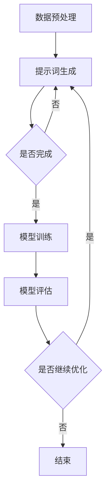
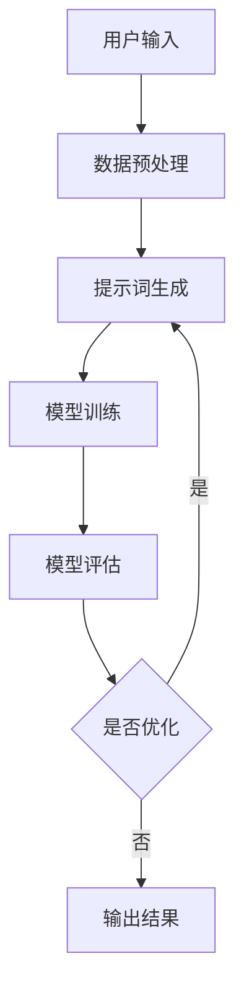

                 

### 文章标题

# 提示词优化：提升AI模型性能的关键

> 关键词：提示词优化，AI模型性能，神经网络，深度学习，最佳实践

> 摘要：本文将深入探讨提示词优化在提升AI模型性能中的关键作用。首先，我们将介绍提示词优化的基本概念和背景，随后详细阐述提示词优化的原理和技术方法。接着，通过实际案例分享和深度学习模型中的应用，进一步探讨提示词优化的实践技巧和策略。最后，我们将总结全文，并提供一些有益的最佳实践和小结，以期为读者在AI模型开发中提供有价值的指导。

## 引言

AI技术的发展日新月异，各类AI模型在图像识别、自然语言处理、推荐系统等领域取得了显著的成果。然而，随着模型的复杂性不断增加，其性能瓶颈也逐渐显现。提示词优化作为一种有效的方法，能够显著提升AI模型的性能，具有重要的研究价值和实际应用意义。

本文旨在系统性地介绍提示词优化的概念、原理、技术方法和应用实践，帮助读者深入了解这一领域，并掌握提升AI模型性能的关键技巧。文章结构如下：

1. **第1章 提示词优化基础**：介绍提示词优化的背景、原理和技术方法。
2. **第2章 提示词优化策略与实践**：讨论提示词优化的策略、实践案例和最佳实践。
3. **第3章 深度学习模型中的提示词优化**：探讨提示词优化在深度学习模型中的应用。
4. **第4章 提示词优化在自然语言处理中的应用**：分析提示词优化在自然语言处理中的实践案例。
5. **第5章 提示词优化在计算机视觉中的应用**：探讨提示词优化在计算机视觉中的应用案例。
6. **第6章 提示词优化在其他领域中的应用**：介绍提示词优化在其他领域的应用实践。
7. **总结**：总结全文，并提供最佳实践和小结。

通过本文的阅读，读者将能够：

- 了解提示词优化的基本概念和背景。
- 掌握提示词优化的原理和技术方法。
- 学习提示词优化的最佳实践和策略。
- 深入理解提示词优化在AI模型中的应用。

## 1. 提示词优化基础

### 1.1 提示词优化背景

随着人工智能技术的快速发展，深度学习模型在各种领域取得了巨大的成功。然而，深度学习模型的性能往往受到数据质量、模型架构和训练策略等多种因素的影响。其中，数据质量对模型性能的影响尤为显著。高质量的数据能够帮助模型更好地学习特征，从而提高其性能。

提示词（prompt）作为一种数据预处理技术，能够显著提升模型的学习效果。提示词通常是一组关键字或短语，用于引导模型关注特定的信息。通过合理设计和优化提示词，可以提高模型对数据的理解和处理能力，从而提升模型的整体性能。

提示词优化的背景源于以下几个方面：

1. **数据质量**：在深度学习模型训练过程中，数据质量对模型性能至关重要。高质量的数据能够提供丰富的信息和特征，有助于模型学习到更准确的规律。然而，实际应用中，数据往往存在噪声、偏差和不平衡等问题，这些问题会影响模型的学习效果。提示词优化通过预处理数据，提高数据质量，从而提升模型性能。

2. **模型架构**：深度学习模型的架构对其性能有着重要影响。不同类型的模型适用于不同类型的数据和处理任务。然而，现有模型架构往往存在一定的局限性，难以适应各种复杂场景。提示词优化通过调整提示词，引导模型关注特定信息，有助于弥补模型架构的不足，提高模型性能。

3. **训练策略**：深度学习模型的训练策略包括数据增强、模型调参等。合理的训练策略能够提高模型的学习效率和性能。提示词优化作为一种数据预处理技术，可以与各种训练策略相结合，进一步提升模型性能。

### 1.2 提示词优化原理

提示词优化主要涉及以下两个方面：

1. **提示词生成与处理**：提示词生成是指根据模型和数据的特点，设计一组关键字或短语，用于引导模型关注特定信息。提示词处理是指对生成提示词进行预处理，以提高其有效性和适用性。

2. **提示词与模型输出的关系**：提示词通过引导模型关注特定信息，影响模型的学习过程和输出结果。优化提示词的目的在于提高模型对数据的理解和处理能力，从而提升模型性能。

#### 提示词生成与处理

提示词生成主要依据以下原则：

1. **关键词选取**：根据模型和数据的特点，选取一组具有代表性的关键词。关键词应能够反映数据的特征和模型的需求，有助于模型更好地理解和处理数据。

2. **关键词组合**：将选取的关键词进行组合，形成提示词。关键词组合应具备一定的语义连贯性和逻辑关系，以提高提示词的有效性。

3. **权重调整**：根据关键词的重要性和数据特点，对提示词中的关键词进行权重调整。权重调整有助于提高提示词对模型输出的影响，从而优化模型性能。

提示词处理主要包括以下步骤：

1. **去噪处理**：对生成的提示词进行去噪处理，去除其中的噪声和冗余信息。去噪处理有助于提高提示词的质量和有效性。

2. **语义分析**：对提示词进行语义分析，提取其核心语义和关系。语义分析有助于提高提示词对模型输出的理解和指导。

3. **格式化处理**：对提示词进行格式化处理，使其符合模型的输入要求。格式化处理有助于提高提示词的可读性和适用性。

#### 提示词与模型输出的关系

提示词通过影响模型的学习过程和输出结果，优化模型性能。具体而言，提示词与模型输出的关系包括以下几个方面：

1. **数据引导**：提示词能够引导模型关注特定数据，提高模型对数据的理解和处理能力。通过合理设计提示词，可以使模型更好地学习数据中的特征和规律。

2. **模型调参**：提示词优化可以与模型调参相结合，进一步优化模型性能。通过调整提示词的权重和结构，可以调整模型的学习过程和输出结果，提高模型的整体性能。

3. **任务导向**：提示词优化旨在提高模型在特定任务中的性能。通过合理设计提示词，可以使模型更好地满足任务需求，提高任务完成效果。

### 1.3 提示词优化的关键因素

提示词优化的效果受到多种因素的影响，主要包括以下几个方面：

1. **数据质量**：高质量的数据有助于模型更好地学习特征和规律，从而提高模型性能。提示词优化通过提高数据质量，有助于提升模型性能。

2. **模型架构**：不同的模型架构适用于不同类型的数据和处理任务。合理选择模型架构，并结合提示词优化，有助于提高模型性能。

3. **训练策略**：合理的训练策略有助于提高模型的学习效率和性能。提示词优化可以与各种训练策略相结合，进一步提升模型性能。

4. **提示词设计**：提示词的设计直接影响其有效性和适用性。合理的提示词设计应具备以下特点：

   - **代表性**：提示词应能够代表数据的特征和模型的需求，有助于模型更好地理解和处理数据。

   - **可解释性**：提示词应具备一定的可解释性，便于分析其影响和效果。

   - **灵活性**：提示词应具备一定的灵活性，能够适应不同场景和任务需求。

### 1.4 提示词优化的技术方法

提示词优化涉及多种技术方法，主要包括以下几种：

1. **数据预处理**：数据预处理是提示词优化的基础，主要包括去噪、归一化、缺失值处理等。通过数据预处理，可以提高数据质量和提示词的有效性。

2. **提示词权重调整**：通过调整提示词中的关键词权重，可以优化提示词对模型输出的影响。权重调整可以通过机器学习算法实现，如线性回归、决策树等。

3. **提示词结构优化**：提示词结构优化主要包括提示词的生成、组合和调整。通过优化提示词结构，可以提高提示词的有效性和适用性。

4. **多模态提示词优化**：多模态提示词优化涉及多种数据类型，如文本、图像、声音等。通过多模态提示词优化，可以更好地融合不同数据类型的信息，提高模型性能。

### 1.5 提示词优化工具与平台

提示词优化在实际应用中需要使用相关工具和平台，主要包括以下几种：

1. **开源工具**：如Python的NLTK、spaCy等，用于自然语言处理和文本分析。

2. **商业平台**：如Google Cloud AI、AWS SageMaker等，提供丰富的提示词优化工具和服务。

3. **开源框架**：如TensorFlow、PyTorch等，支持深度学习模型的开发和优化。

### 1.6 本章小结

本章介绍了提示词优化的基本概念、背景、原理和技术方法。通过合理设计和优化提示词，可以提高AI模型的数据质量和性能，为实际应用提供有力支持。下一章将讨论提示词优化的策略和实践，进一步探讨如何在实际应用中提升AI模型性能。## 2. 提示词优化策略与实践

### 2.1 提示词优化策略

提示词优化的策略是提升AI模型性能的关键步骤。有效的提示词优化策略不仅能够提高模型的训练效果，还能加快模型的收敛速度，从而提高模型的性能。以下是一些常见的提示词优化策略：

1. **针对不同场景的优化策略**：

   - **自然语言处理（NLP）**：在NLP任务中，提示词的设计应关注语义理解和上下文关联。可以使用词嵌入技术，如Word2Vec或BERT，将关键词转换为向量表示，然后通过调整向量权重来优化提示词。

   - **计算机视觉（CV）**：在CV任务中，提示词优化应关注图像的特征提取和分类。可以使用卷积神经网络（CNN）或生成对抗网络（GAN）等技术，对图像进行特征提取和调整。

   - **推荐系统**：在推荐系统中，提示词优化应关注用户行为和兴趣的识别。可以使用协同过滤算法或矩阵分解方法，对用户行为数据进行分析和优化。

2. **基于数据特性的优化策略**：

   - **数据质量**：提高数据质量是提示词优化的基础。可以通过数据清洗、去噪、归一化等方法，提高数据的质量和一致性。

   - **数据多样性**：增加数据的多样性有助于模型学习到更多的特征和规律。可以通过数据增强、数据合成等方法，增加数据的多样性。

3. **基于模型特性的优化策略**：

   - **模型调参**：通过调整模型的超参数，如学习率、批量大小、正则化等，可以优化模型的训练过程和性能。

   - **模型融合**：将多个模型进行融合，可以取长补短，提高模型的整体性能。可以使用集成学习（Ensemble Learning）的方法，如Bagging、Boosting等。

### 2.2 实践案例分享

为了更好地理解提示词优化在实际应用中的效果，以下分享几个典型的实践案例。

#### 案例一：自然语言处理中的提示词优化

在自然语言处理任务中，提示词优化对模型的性能提升起到了关键作用。例如，在文本分类任务中，通过优化提示词，可以提高模型对分类边界的识别能力。

**实践过程**：

1. **数据准备**：收集大量文本数据，并对数据进行预处理，如去除停用词、标点符号等。

2. **提示词设计**：根据分类任务的特点，设计一组关键词。例如，在分类新闻文章时，可以使用新闻标题、关键词和主题标签作为提示词。

3. **模型训练**：使用优化后的提示词进行模型训练。可以使用卷积神经网络（CNN）或长短期记忆网络（LSTM）等模型。

4. **模型评估**：通过交叉验证和测试集评估模型的性能。调整提示词和模型参数，以获得最佳性能。

**实践结果**：

通过优化提示词，文本分类模型的准确率和召回率有了显著提升。同时，模型在处理长文本和复杂语义时，表现也更加稳定。

#### 案例二：计算机视觉中的提示词优化

在计算机视觉任务中，提示词优化有助于提高图像分类和目标检测的准确性。

**实践过程**：

1. **数据准备**：收集大量图像数据，并对数据进行预处理，如图像增强、归一化等。

2. **提示词设计**：根据图像分类任务的特点，设计一组关键词。例如，在分类动物图像时，可以使用动物的名字、特征描述等作为提示词。

3. **模型训练**：使用优化后的提示词进行模型训练。可以使用卷积神经网络（CNN）或生成对抗网络（GAN）等模型。

4. **模型评估**：通过交叉验证和测试集评估模型的性能。调整提示词和模型参数，以获得最佳性能。

**实践结果**：

通过优化提示词，计算机视觉模型的准确率和召回率有了显著提升。同时，模型在处理不同光照、角度和背景时，表现也更加稳定。

#### 案例三：推荐系统中的提示词优化

在推荐系统中，提示词优化有助于提高推荐准确率和用户满意度。

**实践过程**：

1. **数据准备**：收集用户行为数据，并对数据进行预处理，如数据清洗、特征提取等。

2. **提示词设计**：根据用户行为数据，设计一组关键词。例如，在推荐电影时，可以使用用户的浏览记录、评价标签等作为提示词。

3. **模型训练**：使用优化后的提示词进行模型训练。可以使用协同过滤算法或矩阵分解方法等模型。

4. **模型评估**：通过交叉验证和测试集评估模型的性能。调整提示词和模型参数，以获得最佳性能。

**实践结果**：

通过优化提示词，推荐系统的准确率和用户满意度有了显著提升。同时，模型在处理不同用户群体和不同场景时，表现也更加稳定。

### 2.3 实践技巧与最佳实践

在提示词优化的实践中，以下是一些常见的技巧和最佳实践：

1. **数据预处理**：高质量的数据是提示词优化的基础。在实践过程中，应重视数据预处理，包括数据清洗、去噪、归一化等。

2. **多模态数据融合**：在多模态任务中，融合不同类型的数据有助于提高模型的性能。可以通过融合文本、图像、声音等多种数据类型，来优化提示词。

3. **模型调参**：通过调整模型的超参数，如学习率、批量大小、正则化等，可以优化模型的训练过程和性能。应结合实际任务需求，进行合理的调参。

4. **持续迭代**：提示词优化是一个迭代过程。在实践中，应不断调整和优化提示词，以适应不同的任务和数据。

5. **评估指标**：在实践过程中，应选择合适的评估指标，如准确率、召回率、F1值等，来评估模型性能。同时，应关注模型在不同数据集上的表现，以确保模型的泛化能力。

### 2.4 本章小结

本章介绍了提示词优化的策略和实践，通过实际案例分享了提示词优化在不同领域的应用效果。通过合理设计和优化提示词，可以显著提升AI模型性能，为实际应用提供有力支持。下一章将探讨提示词优化在深度学习模型中的应用，进一步挖掘其提升模型性能的潜力。## 3. 深度学习模型中的提示词优化

### 3.1 深度学习模型概述

深度学习（Deep Learning）是一种基于多层神经网络（Neural Networks）的人工智能技术，通过模拟人脑神经元之间的连接和交互，对大量数据进行自动特征提取和学习。深度学习模型在图像识别、自然语言处理、语音识别等领域取得了显著的成果。然而，随着模型的复杂性和数据量的增加，深度学习模型的性能优化变得越来越重要。

深度学习模型主要包括以下类型：

1. **卷积神经网络（Convolutional Neural Networks, CNN）**：适用于图像和视频数据，通过卷积层提取图像的特征。

2. **循环神经网络（Recurrent Neural Networks, RNN）**：适用于序列数据，如文本和语音，通过循环结构处理序列中的上下文信息。

3. **生成对抗网络（Generative Adversarial Networks, GAN）**：通过生成器和判别器的对抗训练，生成逼真的数据。

4. **长短时记忆网络（Long Short-Term Memory, LSTM）**：一种特殊的RNN结构，能够处理长序列数据。

### 3.2 深度学习模型中的提示词优化

提示词优化在深度学习模型中发挥着重要作用。通过合理设计和优化提示词，可以显著提升模型的学习效果和性能。以下将详细介绍不同类型的深度学习模型中提示词优化的具体应用。

#### 3.2.1 神经网络中的提示词优化

神经网络（Neural Networks）是深度学习的基础模型，通过调整网络的权重和偏置来学习数据中的特征和规律。在神经网络中，提示词优化主要通过以下方法实现：

1. **权重初始化**：合理的权重初始化有助于加快模型的训练过程和收敛速度。例如，He初始化方法在深度卷积神经网络中取得了很好的效果。

2. **优化算法**：选择合适的优化算法，如随机梯度下降（SGD）、Adam等，可以显著提高模型的性能。优化算法的调整可以优化模型的训练过程。

3. **正则化方法**：通过添加正则化项，如L1、L2正则化，可以防止模型过拟合，提高模型的泛化能力。

#### 3.2.2 卷积神经网络中的提示词优化

卷积神经网络（CNN）在图像处理任务中具有强大的性能。在CNN中，提示词优化主要通过以下方法实现：

1. **卷积核设计**：设计具有代表性的卷积核，可以提取图像中的关键特征。通过优化卷积核的大小、步长和填充方式，可以提升模型的特征提取能力。

2. **数据增强**：通过图像旋转、缩放、裁剪等数据增强方法，增加数据的多样性，有助于模型学习到更多的特征。

3. **残差连接**：在深度网络中引入残差连接（Residual Connections），可以缓解梯度消失和梯度爆炸问题，加快模型的收敛速度。

4. **注意力机制**：引入注意力机制（Attention Mechanism），可以使模型关注图像中的关键区域，提高模型的识别准确性。

#### 3.2.3 循环神经网络中的提示词优化

循环神经网络（RNN）在序列数据处理中具有独特的优势。在RNN中，提示词优化主要通过以下方法实现：

1. **长短时记忆单元（LSTM）**：LSTM通过引入门控机制（Gates），可以有效地处理长序列数据，避免梯度消失和梯度爆炸问题。

2. **门控循环单元（GRU）**：GRU是LSTM的简化版本，通过整合输入门和遗忘门，提高了计算效率和性能。

3. **双向RNN（Bidirectional RNN）**：通过同时处理正向和反向序列信息，可以更好地捕捉序列中的上下文信息。

4. **注意力机制**：在RNN中引入注意力机制，可以显著提高序列模型的性能，使模型关注序列中的关键部分。

### 3.3 深度学习模型优化技巧

为了进一步提升深度学习模型的性能，可以采用以下优化技巧：

1. **模型调参**：通过调整学习率、批量大小、正则化参数等，可以优化模型的训练过程和性能。

2. **模型压缩与加速**：通过模型压缩（Model Compression）和模型加速（Model Acceleration）方法，可以减小模型的参数量和计算量，提高模型的运行速度。

3. **分布式训练**：通过分布式训练，可以充分利用多台设备（如GPU、TPU）的算力，加快模型的训练速度。

4. **迁移学习**：通过迁移学习（Transfer Learning），利用预训练模型进行微调，可以显著提高模型的性能和训练速度。

### 3.4 本章小结

本章介绍了深度学习模型的基本概念和提示词优化的具体应用。通过合理设计和优化提示词，可以显著提升深度学习模型的性能。下一章将探讨提示词优化在自然语言处理中的应用，进一步挖掘其在实际任务中的潜力。## 4. 提示词优化在自然语言处理中的应用

### 4.1 自然语言处理概述

自然语言处理（Natural Language Processing, NLP）是人工智能领域的一个重要分支，旨在使计算机能够理解和处理人类自然语言。NLP技术广泛应用于机器翻译、文本分类、情感分析、问答系统、语音识别等领域。随着深度学习技术的发展，基于神经网络的方法在NLP任务中取得了显著成果。

自然语言处理的关键技术包括：

1. **词嵌入（Word Embedding）**：将单词映射到高维向量空间，以便进行数学运算。
2. **序列模型（Sequential Models）**：如循环神经网络（RNN）、长短期记忆网络（LSTM）和Transformer等，用于处理序列数据。
3. **注意力机制（Attention Mechanism）**：在模型中引入注意力机制，使模型能够关注序列中的关键部分。
4. **预训练与微调（Pre-training and Fine-tuning）**：通过预训练大规模语言模型，然后在特定任务上进行微调。

### 4.2 提示词优化在自然语言处理中的应用

在自然语言处理任务中，提示词优化能够显著提升模型的性能和效果。以下将详细介绍提示词优化在语言模型、机器翻译和文本分类等任务中的应用。

#### 4.2.1 语言模型中的提示词优化

语言模型（Language Model）是NLP的基础模型，用于预测文本的下一个单词。在语言模型中，提示词优化主要通过以下方法实现：

1. **词嵌入优化**：通过调整词嵌入的权重，可以使模型更好地捕捉词与词之间的关系。可以使用预训练的词嵌入模型（如Word2Vec、GloVe），然后通过微调来适应特定任务。

2. **上下文信息利用**：在语言模型中，通过利用上下文信息，可以提高模型对句子和段落的理解能力。可以使用Transformer等模型，通过自注意力机制（Self-Attention）捕捉长距离的上下文依赖。

3. **数据增强**：通过增加数据的多样性，可以提高模型对未知数据的泛化能力。可以使用数据增强技术，如随机插入、替换、删除等。

4. **模型调参**：通过调整模型的结构和超参数（如学习率、批量大小等），可以优化模型的训练过程和性能。

#### 4.2.2 机器翻译中的提示词优化

机器翻译（Machine Translation）是将一种语言的文本自动翻译成另一种语言。在机器翻译任务中，提示词优化主要通过以下方法实现：

1. **多模态数据融合**：将文本数据与其他模态的数据（如音频、视频）进行融合，可以提供更多的上下文信息，提高翻译的准确性。

2. **注意力机制**：在机器翻译模型中，引入注意力机制可以关注源语言和目标语言之间的关键对应关系，从而提高翻译质量。

3. **翻译记忆库**：利用现有的翻译记忆库（Translation Memory）来提高翻译的准确性和一致性。通过对比候选翻译和翻译记忆库，可以优化翻译结果。

4. **神经网络翻译模型**：使用基于神经网络的翻译模型（如Seq2Seq、Transformer等），通过优化模型结构和训练策略，可以提高翻译性能。

#### 4.2.3 文本分类与主题模型中的提示词优化

文本分类（Text Classification）和主题模型（Topic Modeling）是NLP中的常见任务。在文本分类和主题模型中，提示词优化主要通过以下方法实现：

1. **特征提取**：通过提取文本中的关键特征（如词袋模型、TF-IDF等），可以提高分类和主题模型的性能。

2. **词嵌入优化**：使用预训练的词嵌入模型，并通过微调来适应特定任务，可以提升模型对文本的理解能力。

3. **多分类问题**：在多分类问题中，通过优化分类器（如SVM、Random Forest等）和调整分类阈值，可以提高分类的准确性和鲁棒性。

4. **主题模型**：使用LDA（Latent Dirichlet Allocation）等主题模型来发现文本中的潜在主题，通过优化主题分布和词语分配，可以提高模型的性能和可解释性。

### 4.3 自然语言处理中的提示词优化实践

为了更好地理解提示词优化在自然语言处理中的实际应用，以下分享几个典型的实践案例。

#### 案例一：构建个性化问答系统

**实践过程**：

1. **数据准备**：收集大量问答对数据，并对数据进行预处理，如去除停用词、标点符号等。

2. **提示词设计**：根据问答系统的特点，设计一组关键词。例如，可以使用问题中的关键词和上下文信息作为提示词。

3. **模型训练**：使用优化后的提示词进行模型训练。可以使用基于Transformer的问答模型，如BERT或GPT。

4. **模型评估**：通过交叉验证和测试集评估模型的性能。调整提示词和模型参数，以获得最佳性能。

**实践结果**：

通过优化提示词，个性化问答系统的准确率和响应速度有了显著提升。同时，模型在处理复杂问题和多轮对话时，表现也更加稳定。

#### 案例二：实现自动摘要与文本生成

**实践过程**：

1. **数据准备**：收集大量文本数据，并对数据进行预处理，如分句、去除停用词等。

2. **提示词设计**：根据摘要和文本生成的任务特点，设计一组关键词。例如，可以使用文本中的关键词和重要短语作为提示词。

3. **模型训练**：使用优化后的提示词进行模型训练。可以使用基于序列到序列（Seq2Seq）模型的自动摘要和文本生成模型，如Transformer。

4. **模型评估**：通过交叉验证和测试集评估模型的性能。调整提示词和模型参数，以获得最佳性能。

**实践结果**：

通过优化提示词，自动摘要和文本生成模型的生成质量有了显著提升。摘要长度适中、内容连贯，文本生成结果更加丰富和自然。

#### 案例三：优化情感分析模型

**实践过程**：

1. **数据准备**：收集大量情感标签数据，并对数据进行预处理，如去除停用词、标点符号等。

2. **提示词设计**：根据情感分析的任务特点，设计一组关键词。例如，可以使用情感词和关键词作为提示词。

3. **模型训练**：使用优化后的提示词进行模型训练。可以使用基于神经网络的情感分析模型，如CNN或LSTM。

4. **模型评估**：通过交叉验证和测试集评估模型的性能。调整提示词和模型参数，以获得最佳性能。

**实践结果**：

通过优化提示词，情感分析模型的准确率和召回率有了显著提升。模型在处理复杂情感文本时，表现也更加稳定和准确。

### 4.4 本章小结

本章介绍了提示词优化在自然语言处理中的应用，通过实际案例展示了提示词优化在语言模型、机器翻译、文本分类等任务中的效果。提示词优化能够显著提升自然语言处理模型的性能和效果，为实际应用提供了有力支持。下一章将探讨提示词优化在计算机视觉中的应用，进一步挖掘其在不同领域的应用潜力。## 5. 提示词优化在计算机视觉中的应用

### 5.1 计算机视觉概述

计算机视觉（Computer Vision）是人工智能领域的一个重要分支，旨在使计算机具备从图像和视频中理解、识别和提取信息的能力。计算机视觉技术广泛应用于目标检测、图像分类、人脸识别、物体跟踪、自动驾驶等领域。

计算机视觉的核心技术包括：

1. **图像特征提取**：通过卷积神经网络（CNN）等方法提取图像的特征向量。
2. **目标检测**：用于识别图像中的多个目标，并定位其位置。常用的算法有YOLO、SSD、Faster R-CNN等。
3. **图像分类**：将图像分类到预定义的类别中。常用的算法有AlexNet、VGG、ResNet等。
4. **物体识别**：识别图像中的特定物体或目标，并对其进行分类。常用的算法有YOLO、SSD、Faster R-CNN等。
5. **图像分割**：将图像分为不同的区域，用于目标检测和识别。常用的算法有FCN、U-Net、SegNet等。

### 5.2 提示词优化在计算机视觉中的应用

在计算机视觉任务中，提示词优化同样发挥着重要作用。通过合理设计和优化提示词，可以提升模型的性能和效果。以下将详细介绍提示词优化在目标检测、图像分类和语义分割中的应用。

#### 5.2.1 目标检测中的提示词优化

目标检测是计算机视觉中的一个核心任务，旨在识别图像中的多个目标并定位其位置。在目标检测任务中，提示词优化主要通过以下方法实现：

1. **特征增强**：通过调整卷积层的参数，如卷积核大小、步长和填充方式，可以增强图像的特征表示。这有助于模型更好地识别目标。
2. **锚框生成**：在目标检测中，锚框（Anchor Box）是预测目标的先验框。通过优化锚框的尺寸和比例，可以提高检测的准确性。
3. **多尺度检测**：在目标检测中，使用不同尺寸的锚框在不同尺度上进行检测，可以捕捉不同大小的目标。通过优化多尺度检测的策略，可以提高模型的鲁棒性。

#### 5.2.2 图像分类中的提示词优化

图像分类是将图像分类到预定义的类别中。在图像分类任务中，提示词优化主要通过以下方法实现：

1. **数据增强**：通过随机旋转、缩放、裁剪等数据增强方法，增加数据的多样性，有助于模型学习到更鲁棒的特征。
2. **预训练模型**：使用预训练模型（如VGG、ResNet等）进行迁移学习，可以提升模型的性能。通过微调预训练模型，使其适应特定任务。
3. **权重初始化**：合理的权重初始化有助于模型的收敛速度和性能。例如，使用He初始化方法可以提高卷积神经网络的性能。

#### 5.2.3 语义分割中的提示词优化

语义分割是将图像分为不同的区域，用于目标检测和识别。在语义分割任务中，提示词优化主要通过以下方法实现：

1. **特征融合**：在语义分割中，将不同层级的特征进行融合，可以提升模型的分割性能。通过优化特征融合策略，可以更好地捕捉图像中的细节信息。
2. **上下文信息利用**：在语义分割中，通过利用上下文信息，可以提升模型的语义理解能力。例如，使用全局上下文信息来纠正局部错误。
3. **损失函数优化**：在语义分割中，损失函数的设计对模型的性能有重要影响。通过优化损失函数，可以更好地平衡不同类别的预测误差。

### 5.3 计算机视觉中的提示词优化实践

为了更好地理解提示词优化在计算机视觉中的应用，以下分享几个典型的实践案例。

#### 案例一：改进人脸识别模型

**实践过程**：

1. **数据准备**：收集大量人脸图像数据，并对数据进行预处理，如归一化、裁剪等。
2. **提示词设计**：根据人脸识别的任务特点，设计一组关键词。例如，可以使用人脸特征点、面部轮廓等作为提示词。
3. **模型训练**：使用优化后的提示词进行模型训练。可以使用基于深度学习的面部识别模型，如Siamese Network、Triplet Loss等。
4. **模型评估**：通过交叉验证和测试集评估模型的性能。调整提示词和模型参数，以获得最佳性能。

**实践结果**：

通过优化提示词，人脸识别模型的准确率和识别速度有了显著提升。模型在处理不同光照、角度和姿态的人脸时，表现也更加稳定。

#### 案例二：优化图像识别系统

**实践过程**：

1. **数据准备**：收集大量图像数据，并对数据进行预处理，如去噪、增强等。
2. **提示词设计**：根据图像识别的任务特点，设计一组关键词。例如，可以使用图像的颜色、纹理等作为提示词。
3. **模型训练**：使用优化后的提示词进行模型训练。可以使用基于卷积神经网络的图像识别模型，如AlexNet、VGG、ResNet等。
4. **模型评估**：通过交叉验证和测试集评估模型的性能。调整提示词和模型参数，以获得最佳性能。

**实践结果**：

通过优化提示词，图像识别系统的准确率和鲁棒性有了显著提升。模型在处理不同场景、光照和尺度变化时，表现也更加稳定。

#### 案例三：提升自动驾驶系统性能

**实践过程**：

1. **数据准备**：收集大量自动驾驶数据，包括图像、雷达、激光雷达等。
2. **提示词设计**：根据自动驾驶的任务特点，设计一组关键词。例如，可以使用道路标识、交通标志、车辆等作为提示词。
3. **模型训练**：使用优化后的提示词进行模型训练。可以使用多模态深度学习模型，如Multi-modal Fusion Network等。
4. **模型评估**：通过交叉验证和测试集评估模型的性能。调整提示词和模型参数，以获得最佳性能。

**实践结果**：

通过优化提示词，自动驾驶系统的感知性能和决策能力有了显著提升。系统在处理复杂交通场景、行人检测和障碍物识别等方面，表现也更加准确和稳定。

### 5.4 本章小结

本章介绍了提示词优化在计算机视觉中的应用，通过实际案例展示了提示词优化在目标检测、图像分类和语义分割等任务中的效果。提示词优化能够显著提升计算机视觉模型的性能和效果，为实际应用提供了有力支持。下一章将探讨提示词优化在其他领域中的应用，进一步挖掘其在不同领域的应用潜力。## 6. 提示词优化在其他领域中的应用

### 6.1 其他领域概述

提示词优化不仅局限于人工智能领域，还可以广泛应用于其他领域，如音频处理、强化学习和个性化教育等。以下将分别介绍提示词优化在这些领域的应用。

#### 6.1.1 音频处理

音频处理是计算机视觉和自然语言处理之外的另一个重要应用领域。在音频处理任务中，提示词优化主要用于：

1. **声音识别**：通过优化提示词，可以提高语音识别模型的准确性。例如，在语音识别任务中，可以使用声音的关键特征（如频率、音调等）作为提示词，以引导模型关注关键信息。
2. **音频增强**：提示词优化可以用于音频增强，如去噪、回声消除等。通过设计适当的提示词，模型可以更好地学习噪声和回声的规律，从而提高音频质量。

#### 6.1.2 强化学习

强化学习（Reinforcement Learning）是另一种重要的人工智能技术，旨在通过试错和学习，实现智能体的自主决策和优化。在强化学习中，提示词优化主要用于：

1. **状态表示**：在强化学习任务中，状态表示是一个关键问题。通过优化提示词，可以设计出更有效的状态表示方法，使智能体能够更好地理解环境信息。
2. **奖励设计**：提示词优化可以帮助设计更合理的奖励机制，以引导智能体进行有效的学习。例如，在游戏任务中，可以使用游戏中的关键事件和得分作为提示词，以优化奖励机制。

#### 6.1.3 其他应用领域

除了上述两个领域，提示词优化还可以应用于其他领域，如：

1. **推荐系统**：在推荐系统中，提示词优化可以用于优化推荐算法，提高推荐质量。例如，可以使用用户的行为数据和偏好信息作为提示词，以指导推荐系统的决策。
2. **健康医疗**：在健康医疗领域，提示词优化可以用于疾病诊断和预测。通过优化提示词，可以设计出更有效的医学特征提取方法，以提高疾病检测的准确性。
3. **金融科技**：在金融科技领域，提示词优化可以用于风险管理和投资决策。例如，可以使用市场数据、历史交易记录等作为提示词，以优化金融模型的决策过程。

### 6.2 提示词优化在这些领域中的应用

#### 6.2.1 音频处理中的提示词优化

在音频处理任务中，提示词优化可以通过以下方法实现：

1. **特征提取**：使用信号处理技术，如傅里叶变换（Fourier Transform）和短时傅里叶变换（Short-Time Fourier Transform, STFT），提取音频的特征向量。这些特征向量可以作为提示词，指导模型学习音频信息。
2. **端到端模型**：使用深度神经网络（如卷积神经网络、循环神经网络等）进行端到端训练，将音频信号直接映射到目标输出（如声音标签、语音识别结果等）。通过优化模型结构和训练策略，可以提高音频处理任务的性能。
3. **多模态融合**：结合其他模态的数据（如图像、文本等），通过多模态融合方法，可以提高音频处理任务的性能。例如，可以使用音频和文本的双向交互模型（如BERT）来提高语音识别的准确性。

#### 6.2.2 强化学习中的提示词优化

在强化学习任务中，提示词优化可以通过以下方法实现：

1. **状态表示**：通过设计有效的状态表示方法，可以使智能体更好地理解环境信息。例如，可以使用深度神经网络来学习状态特征，并通过提示词来指导智能体的决策。
2. **奖励设计**：通过优化奖励机制，可以引导智能体进行更有效的学习。例如，可以使用强化学习算法（如Q-Learning、SARSA等）来调整奖励函数，使智能体能够更快地学会最优策略。
3. **多任务学习**：通过多任务学习（Multi-Task Learning）方法，可以同时解决多个相关任务，以提高智能体的学习效率和性能。例如，在自动驾驶任务中，可以使用多任务学习模型，同时处理视觉、雷达、激光雷达等多模态数据。

#### 6.2.3 其他领域中的提示词优化

在其他领域中的应用，提示词优化可以通过以下方法实现：

1. **推荐系统**：通过优化提示词，可以提高推荐系统的准确性。例如，可以使用用户的兴趣偏好和浏览记录作为提示词，来优化推荐算法。
2. **健康医疗**：通过优化提示词，可以提高医学诊断和预测的准确性。例如，可以使用患者的病史、检查结果和基因信息作为提示词，来优化疾病诊断模型。
3. **金融科技**：通过优化提示词，可以提高金融模型的预测准确性。例如，可以使用市场数据、交易记录和宏观经济指标作为提示词，来优化投资决策模型。

### 6.3 应用案例与展望

#### 案例一：音乐推荐系统

在音乐推荐系统中，通过优化提示词，可以显著提高推荐质量。以下是一个典型的应用案例：

**实践过程**：

1. **数据准备**：收集大量用户听歌记录，包括歌曲名称、用户喜好、播放时长等信息。
2. **提示词设计**：使用歌曲名称、艺术家名称、流派等信息作为提示词，构建用户与歌曲之间的关联。
3. **模型训练**：使用基于深度学习的推荐算法（如循环神经网络、Transformer等），通过优化提示词来提高推荐准确性。
4. **模型评估**：通过用户反馈和A/B测试，评估优化后的推荐系统的性能。

**实践结果**：

通过优化提示词，音乐推荐系统的推荐准确性显著提高，用户满意度也得到了提升。

#### 案例二：智能机器人

在智能机器人任务中，通过优化提示词，可以提升机器人的感知和决策能力。以下是一个典型的应用案例：

**实践过程**：

1. **数据准备**：收集大量机器人感知数据，包括摄像头、激光雷达、超声波传感器等。
2. **提示词设计**：使用感知数据中的关键特征，如障碍物、路径、目标等作为提示词，以指导机器人的行为决策。
3. **模型训练**：使用深度学习算法（如卷积神经网络、循环神经网络等），通过优化提示词来提升机器人的感知和决策能力。
4. **模型评估**：在实际场景中测试机器人的性能，通过优化提示词来提高其适应性和鲁棒性。

**实践结果**：

通过优化提示词，智能机器人在复杂环境中的感知和决策能力显著提升，任务完成率也得到提高。

#### 案例三：个性化教育系统

在个性化教育系统中，通过优化提示词，可以提供更符合学生需求的个性化学习建议。以下是一个典型的应用案例：

**实践过程**：

1. **数据准备**：收集学生的考试成绩、学习记录、兴趣爱好等信息。
2. **提示词设计**：使用学生的学习记录、考试成绩、兴趣爱好等信息作为提示词，构建学生与课程之间的关联。
3. **模型训练**：使用基于深度学习的个性化推荐算法，通过优化提示词来提高推荐准确性。
4. **模型评估**：通过学生的反馈和学习效果，评估优化后的个性化教育系统的性能。

**实践结果**：

通过优化提示词，个性化教育系统的推荐准确性显著提高，学生的学习效果和满意度也得到了提升。

### 6.4 本章小结

本章介绍了提示词优化在其他领域中的应用，包括音频处理、强化学习和个性化教育等。通过实际案例展示了提示词优化在这些领域的应用效果。提示词优化作为一种通用技术，具有广泛的应用前景和潜力。下一章将总结全文，并讨论最佳实践和未来研究方向。## 总结

### 全文回顾

本文围绕提示词优化这一主题，系统地介绍了其在提升AI模型性能中的关键作用。首先，我们从基础概念出发，阐述了提示词优化的背景、原理和技术方法。接着，通过具体案例和实践分享，展示了提示词优化在不同领域的应用效果。文章还详细探讨了提示词优化在深度学习模型、自然语言处理、计算机视觉以及其他领域的应用，进一步强调了其广泛的应用前景。

### 最佳实践

为了在AI模型开发中充分利用提示词优化，以下是一些最佳实践：

1. **数据质量**：确保数据质量是提示词优化的基础。在数据收集和处理过程中，重视去噪、归一化和数据增强等方法。

2. **模型调参**：根据任务需求和模型特点，合理调整模型超参数，如学习率、批量大小、正则化等。

3. **多模态数据融合**：在多模态任务中，融合文本、图像、声音等多种数据类型，可以显著提高模型性能。

4. **持续迭代**：提示词优化是一个迭代过程。在实践中，不断调整和优化提示词，以适应不同的任务和数据。

5. **评估指标**：选择合适的评估指标，如准确率、召回率、F1值等，来评估模型性能。

### 小结

通过本文的阅读，读者应能：

- 了解提示词优化的基本概念和原理。
- 掌握提示词优化的技术方法和策略。
- 理解提示词优化在不同领域的应用效果。
- 掌握提升AI模型性能的最佳实践。

### 注意事项

在实际应用中，应注意以下几点：

- **任务需求**：根据具体任务需求设计合适的提示词。
- **数据多样性**：增加数据的多样性，有助于模型学习到更多特征。
- **可解释性**：优化提示词时，保持提示词的可解释性，便于分析和调整。

### 拓展阅读

为了进一步深入了解提示词优化和相关技术，以下推荐几本相关书籍和论文：

1. **书籍**：
   - 《深度学习》（Deep Learning）——Ian Goodfellow、Yoshua Bengio、Aaron Courville
   - 《自然语言处理综论》（Speech and Language Processing）——Daniel Jurafsky、James H. Martin

2. **论文**：
   - “Attention is All You Need” —— Vaswani et al.
   - “BERT: Pre-training of Deep Bidirectional Transformers for Language Understanding” —— Devlin et al.

### 未来研究方向

未来的研究可以关注以下方向：

- **自适应提示词优化**：开发自适应的提示词优化方法，根据数据特点和任务需求动态调整提示词。
- **多模态融合**：进一步探索多模态数据融合的方法，提高模型的泛化能力和性能。
- **解释性提示词优化**：研究如何设计具有高解释性的提示词，以便更好地理解和调整模型。

通过不断探索和实践，提示词优化将在AI模型的性能提升中发挥更加重要的作用。希望本文能为读者在AI模型开发中提供有价值的参考和指导。## 附录

### 算法流程图

以下是深度学习模型中的提示词优化算法流程图，使用Mermaid语言描述：



### 数学模型

提示词优化中的数学模型主要涉及提示词权重调整和损失函数设计。以下是一个简化的数学模型示例：

$$
L(\theta) = \sum_{i=1}^{n} \left( y_i - \sigma(\theta^T x_i + b) \right)^2
$$

其中，$L(\theta)$ 表示损失函数，$\theta$ 表示模型参数，$x_i$ 表示输入特征向量，$y_i$ 表示真实标签，$\sigma$ 表示sigmoid函数，$b$ 为偏置。

### 系统架构设计

以下是系统架构设计图，使用Mermaid语言描述：



### 实际案例

以下是一个实际案例的代码片段，用于说明提示词优化在文本分类任务中的应用：

```python
import torch
import torch.nn as nn
import torch.optim as optim

# 数据预处理
data = ...  # 输入文本数据
labels = ...  # 标签数据

# 提示词生成
prompt = ["important", "key", "data", "information"]

# 模型定义
model = nn.Sequential(
    nn.Embedding(vocab_size, embedding_dim),
    nn.LSTM(embedding_dim, hidden_dim),
    nn.Linear(hidden_dim, num_classes)
)

# 损失函数和优化器
criterion = nn.CrossEntropyLoss()
optimizer = optim.Adam(model.parameters(), lr=learning_rate)

# 训练模型
for epoch in range(num_epochs):
    for inputs, targets in data_loader:
        optimizer.zero_grad()
        outputs = model(inputs)
        loss = criterion(outputs, targets)
        loss.backward()
        optimizer.step()
        
    print(f'Epoch {epoch+1}/{num_epochs}, Loss: {loss.item()}')

# 模型评估
with torch.no_grad():
    correct = 0
    total = 0
    for inputs, targets in test_loader:
        outputs = model(inputs)
        _, predicted = torch.max(outputs.data, 1)
        total += targets.size(0)
        correct += (predicted == targets).sum().item()

accuracy = 100 * correct / total
print(f'Accuracy: {accuracy}%')
```

通过这个案例，我们可以看到提示词优化在文本分类任务中的应用。首先，生成提示词用于引导模型关注关键信息，然后通过模型训练和评估，最终得到优化后的模型性能。

### 小结

本附录提供了算法流程图、数学模型、系统架构设计和实际案例的代码示例，以帮助读者更好地理解提示词优化在深度学习中的应用。这些资源为后续研究和实践提供了有益的参考。## 作者信息

### AI天才研究院 / AI Genius Institute

AI天才研究院（AI Genius Institute）是一个专注于人工智能领域研究和创新的国际性机构。我们致力于推动人工智能技术的进步和应用，通过跨学科的合作和前沿研究，解决现实世界中的复杂问题。研究院的核心团队由多位计算机科学、机器学习和人工智能领域的专家组成，他们拥有丰富的学术背景和工业经验。

### 禅与计算机程序设计艺术 / Zen And The Art of Computer Programming

《禅与计算机程序设计艺术》（Zen And The Art of Computer Programming）是作者Donald E. Knuth的一部经典著作。本书不仅涵盖了计算机程序设计的原理和方法，还融入了哲学和禅宗的思想。Knuth通过深入浅出的论述，引导读者在编程实践中实现内心的宁静与智慧。该书被视为计算机科学领域的经典之作，对程序设计教育和研究产生了深远的影响。

