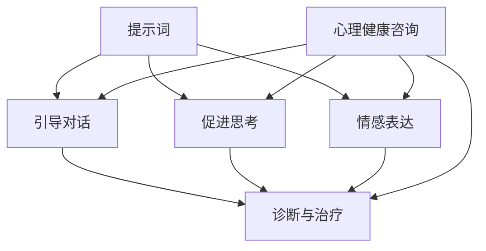
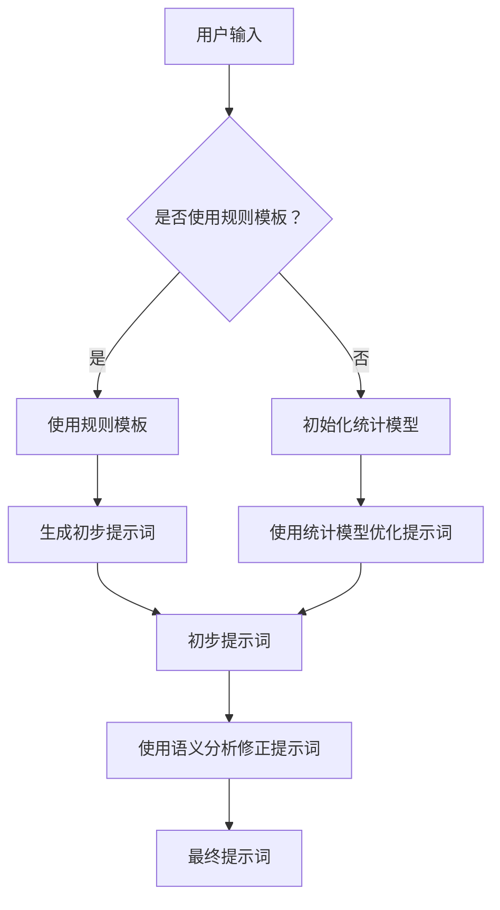
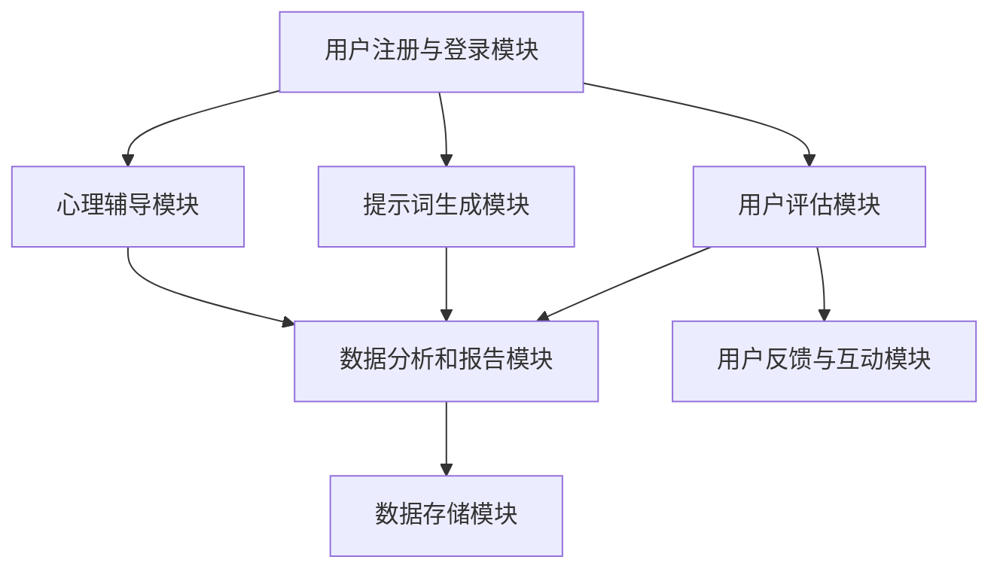
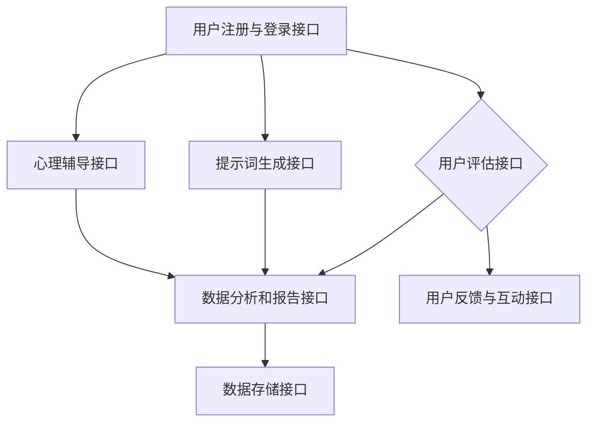
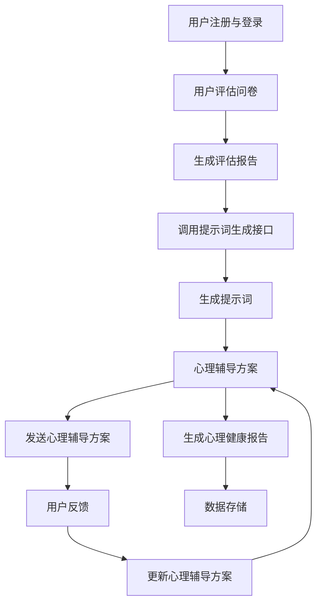

                 

### 前言

**引言**

在信息技术飞速发展的今天，人工智能（AI）以其强大的数据处理和模式识别能力，正逐步渗透到各个行业，心理健康咨询领域也不例外。提示词（Prompt Words）作为一种能够引导对话、促进思考和情感表达的工具，在心理健康咨询中发挥着越来越重要的作用。本篇文章以《提示词在心理健康咨询中的应用与伦理》为题，旨在深入探讨这一领域的最新研究进展和实际应用。

**为什么要写这本书**

心理健康咨询作为一门专业的学科，其目标是帮助个体识别并解决心理问题，促进心理健康和幸福感。随着社会压力的增加，心理健康问题的发病率呈上升趋势，人们对心理健康咨询的需求也越来越大。传统的心理咨询方法主要依赖于面对面交流，但随着科技的进步，线上心理咨询逐渐兴起，而提示词的应用则为这一新兴领域带来了新的可能。

提示词在心理健康咨询中的重要性不仅体现在其作为一种有效的沟通工具，更在于其能够通过精准的引导，帮助个体深入探索自己的内心世界，揭示潜在的心理问题。此外，提示词的应用也在一定程度上提高了心理咨询的效率，使得心理健康服务更加普及和便捷。

**目标读者**

本书的目标读者主要包括以下几个方面：

1. **心理咨询师与心理治疗师**：希望了解和掌握提示词在心理咨询中的应用技巧和伦理规范的专业人士。
2. **人工智能开发者**：对心理健康咨询领域感兴趣，并希望将人工智能技术应用于实际问题的开发者。
3. **心理学爱好者**：对心理健康咨询和人工智能技术感兴趣，希望深入了解这一交叉领域的读者。
4. **学术研究人员**：从事心理健康咨询和人工智能相关研究的学者，希望通过本书获得新的研究思路和方法。

**本书结构**

本书将分为七个主要章节，内容结构如下：

1. **前言**：介绍书籍的主题、写作目的和目标读者。
2. **背景介绍**：阐述心理健康咨询领域的现状和发展趋势，以及提示词在心理健康咨询中的重要性。
3. **核心概念与联系**：定义关键术语，分析概念之间的关系，并使用Mermaid流程图展示。
4. **算法原理讲解**：介绍用于心理健康咨询的提示词生成算法，包括原理、流程图和Python代码示例。
5. **系统分析与架构设计**：描述心理健康咨询系统的场景、架构设计、接口设计和系统交互。
6. **项目实战**：详细介绍系统的环境安装、核心实现、实际案例分析以及项目总结。
7. **最佳实践与注意事项**：提供提示词应用的最佳实践，强调注意事项。
8. **小结与拓展阅读**：总结全书内容，为读者推荐进一步的阅读资源。

通过这些章节的深入探讨，读者将能够全面了解提示词在心理健康咨询中的应用及其伦理问题，为实际操作和研究提供有价值的参考。

### 第1章 背景介绍

#### 1.1 心理健康咨询的演变

心理健康咨询的起源可以追溯到古代，当时人们通过宗教仪式和民间疗法来缓解心理问题。然而，现代心理健康咨询的起源主要可以追溯到19世纪末和20世纪初。这一时期，精神医学和心理学逐渐形成独立学科，专业心理医生和心理咨询师开始出现。卡尔·荣格（Carl Jung）和弗洛伊德（Sigmund Freud）等先驱者的理论和实践，为现代心理健康咨询奠定了基础。

随着社会的发展和科技的进步，心理健康咨询经历了多个阶段的发展。早期阶段主要依赖于心理分析和行为疗法，随着认知心理学和认知行为疗法的兴起，心理健康咨询的方法和理论体系日益丰富。近年来，随着互联网和人工智能技术的发展，线上心理咨询和智能心理辅导系统逐渐成为新的研究方向和应用领域。

#### 1.1.1 心理健康咨询的起源与发展

心理健康咨询的起源可以追溯到19世纪末，当时精神病学和心理学逐渐从哲学和宗教中独立出来，成为独立的学科。在这一时期，精神医学的创始人之一，奥地利神经学家恩斯特·布洛伊尔（Ernest Bleuler）提出了“精神分裂症”的概念，为后来的心理健康研究奠定了基础。

随后，瑞士精神科医生卡尔·荣格（Carl Jung）和弗洛伊德（Sigmund Freud）分别提出了精神分析理论和心理分析理论，这些理论对现代心理健康咨询产生了深远的影响。弗洛伊德的理论强调了潜意识在心理问题中的作用，提出了“自由联想法”等治疗方法。荣格则提出了“个人化”和“集体无意识”的概念，丰富了心理健康咨询的理论基础。

20世纪中叶，认知心理学的发展为心理健康咨询带来了新的视角和方法。认知行为疗法（Cognitive Behavioral Therapy, CBT）逐渐成为主流治疗方法，通过改变负面思维模式和行为模式来缓解心理问题。艾伦·贝克（Aaron T. Beck）提出的认知行为疗法，强调思维和行为之间的相互影响，为心理健康咨询提供了新的理论框架。

近年来，随着人工智能技术的发展，智能心理辅导系统和在线心理咨询逐渐成为心理健康咨询的新兴领域。人工智能通过数据分析、自然语言处理和机器学习等技术，可以更精准地识别和解决心理问题，提高了心理咨询的效率和效果。

#### 1.1.2 当前心理健康咨询的现状

当前，心理健康咨询在全球范围内都受到广泛关注。根据世界卫生组织（WHO）的数据，全球约有3亿人遭受抑郁症的困扰，超过5亿人遭受焦虑症的困扰。心理健康问题的发病率呈上升趋势，这使得心理健康咨询的需求不断增加。

在发达国家，心理健康服务已经成为社会保障体系的一部分。心理咨询师和心理治疗师在医疗机构、学校、企业和社区中发挥着重要作用，为有需要的人群提供专业服务。例如，美国的医疗保险体系（Medicare）和医疗补助计划（Medicaid）都涵盖了心理健康服务的费用。在英国，国家医疗服务体系（NHS）也提供广泛的心理健康服务。

然而，在发展中国家和贫困地区，心理健康服务的普及程度仍然较低。许多地区缺乏专业的心理咨询师和心理治疗师，心理健康知识的普及也面临挑战。互联网和智能手机的普及为在线心理咨询提供了新的机会，通过远程咨询和自助工具，人们可以更方便地获得心理健康服务。

此外，心理健康咨询也在不断适应新的技术和工具。虚拟现实（VR）技术、增强现实（AR）技术和人工智能（AI）技术在心理健康咨询中的应用正在逐渐增多。这些新技术不仅提高了心理咨询的趣味性和互动性，还为个性化心理健康服务提供了新的可能性。

总的来说，当前心理健康咨询处于一个快速发展的阶段，随着社会对心理健康问题重视程度的提高，以及新兴技术的应用，心理健康咨询的未来充满希望。

#### 1.2 提示词的应用与心理健康咨询

在心理健康咨询中，提示词（Prompt Words）作为一种重要的工具，其作用日益凸显。提示词是一种能够引导对话、促进思考和情感表达的语言刺激，通过精准的引导，帮助咨询者深入探索自己的内心世界，揭示潜在的心理问题。

**提示词的定义**

提示词，顾名思义，是一种用于提示或引导对话的词语或短语。在心理学中，提示词通常是指那些能够激发特定思维、情感或行为反应的词汇。这些词汇可以是具体的词语，如“恐惧”、“快乐”、“孤独”等，也可以是抽象的描述，如“让我感到不安的是...”、“我喜欢的事情是...”。

**提示词在心理健康咨询中的角色**

提示词在心理健康咨询中扮演着多重角色，主要包括以下几个方面：

1. **引导对话**：提示词可以帮助心理咨询师引导咨询过程，使对话更加深入和有意义。通过提出针对性的问题，心理咨询师可以引导咨询者表达内心的感受和想法，从而更好地理解他们的心理状态。
   
2. **促进思考**：提示词可以激发咨询者的思考和反思能力。例如，心理咨询师可以使用“最近你有什么不同寻常的感受吗？”这样的提示词，帮助咨询者回顾和反思自己的情绪和行为变化。

3. **情感表达**：提示词能够帮助咨询者表达内心的情感，特别是那些难以直接表达的情感。例如，“你是否感到沮丧或绝望？”这样的提示词可以帮助咨询者更清晰地表达他们的情感状态。

4. **揭示问题**：通过提示词，心理咨询师可以更好地识别和诊断咨询者的心理问题。例如，在治疗焦虑症的过程中，心理咨询师可以使用“你感到紧张的时候通常有哪些具体的身体反应？”这样的提示词，帮助咨询者识别焦虑的症状。

**提示词应用的挑战与机遇**

提示词在心理健康咨询中的应用面临着诸多挑战和机遇：

**挑战：**

1. **个性化不足**：提示词的设计和应用需要充分考虑个体的差异，但现有的提示词库往往缺乏个性化，难以满足不同咨询者的需求。

2. **伦理问题**：提示词的应用需要遵循伦理规范，避免对咨询者造成不必要的心理压力或伤害。心理咨询师在使用提示词时需要高度谨慎。

3. **技术依赖**：随着人工智能技术的应用，提示词的生成和推荐逐渐依赖算法和数据，但技术的滥用可能会对心理健康咨询产生负面影响。

**机遇：**

1. **提高效率**：通过人工智能和自然语言处理技术，可以生成更加精准和个性化的提示词，提高心理健康咨询的效率。

2. **普及服务**：在线心理咨询和智能心理辅导系统的普及，使得更多的人可以便捷地获得心理健康服务，提示词的应用为此提供了新的可能性。

3. **个性化诊断**：利用大数据和机器学习技术，可以分析大量的心理健康数据，为个体提供更加精准的心理健康诊断和治疗方案。

总之，提示词在心理健康咨询中的应用具有巨大的潜力，但也需要克服一系列挑战。通过不断的研究和实践，我们可以更好地利用提示词，为心理健康服务提供更加有效的支持。

### 第2章 核心概念与联系

#### 2.1 关键术语的定义

在本章节中，我们将对“提示词”和“心理健康咨询”这两个关键术语进行详细定义，以便读者对后续内容有更深入的理解。

**提示词（Prompt Word）**

提示词是一种能够引导对话、促进思考和情感表达的词语或短语。在心理健康咨询中，提示词通常用于激发咨询者的思考，帮助其表达内心的感受和想法。提示词可以是具体的词汇，如“快乐”、“恐惧”、“焦虑”等，也可以是抽象的描述，如“最近我感到很沮丧”或“我有时候会觉得孤独”。通过使用提示词，心理咨询师可以引导咨询者深入探索自己的心理状态，从而更好地理解和管理自己的情绪。

**心理健康咨询（Mental Health Counseling）**

心理健康咨询是一种专业的服务，旨在帮助个体识别和解决心理问题，促进心理健康和幸福感。心理健康咨询通常涉及以下方面：

1. **心理评估**：通过访谈、问卷和其他评估工具，了解咨询者的心理状态和需求。
2. **心理治疗**：根据评估结果，心理咨询师会采用不同的治疗方法，如认知行为疗法（CBT）、精神分析疗法等，帮助咨询者解决心理问题。
3. **情感支持**：提供情感支持和鼓励，帮助咨询者建立积极的心理态度和应对机制。
4. **教育和指导**：向咨询者提供心理健康知识，帮助他们更好地理解和管理自己的情绪和行为。

心理健康咨询可以采用面对面的形式，也可以通过电话、视频聊天等在线方式进行。心理咨询师是专业的心理健康服务提供者，他们通常具备心理学、社会学等相关领域的学位，并接受严格的培训和认证。

#### 2.2 概念之间的联系

为了更好地理解提示词和心理健康咨询之间的关系，我们首先需要明确这两个概念的核心要素和属性特征，并通过对比表格来分析它们。

**提示词与心理健康咨询的对比表格**

| 特征        | 提示词                | 心理健康咨询               |
| ----------- | --------------------- | -------------------------- |
| 定义        | 引导对话的词语或短语  | 解决心理问题，促进心理健康 |
| 目标        | 激发思考，促进情感表达 | 诊断、治疗、教育、支持     |
| 应用形式    | 词汇、短语、问题      | 访谈、问卷、治疗、教育     |
| 关键要素    | 精准性、个性化、引导性 | 专业性、科学性、伦理性     |
| 相关技术    | 自然语言处理、人工智能 | 认知行为疗法、精神分析疗法  |

通过上述对比表格，我们可以看出，提示词和心理健康咨询在定义、目标、应用形式和关键要素等方面存在显著差异。然而，它们在心理健康服务中的核心作用是相互补充的。

**提示词与心理健康咨询的关系**

提示词在心理健康咨询中扮演着重要的角色，具体表现在以下几个方面：

1. **引导对话**：提示词可以帮助心理咨询师引导咨询者表达内心的感受和想法，使对话更加深入和有意义。通过提出针对性的问题，心理咨询师可以更有效地了解咨询者的心理状态。

2. **促进思考**：提示词可以激发咨询者的思考和反思能力，帮助他们更好地理解自己的情绪和行为。例如，心理咨询师可以使用“你最近有什么不同寻常的感受吗？”这样的提示词，引导咨询者回顾和反思自己的情绪变化。

3. **情感表达**：提示词能够帮助咨询者表达那些难以直接表达的情感，特别是那些消极的情感。例如，“你是否感到沮丧或绝望？”这样的提示词可以帮助咨询者更清晰地表达自己的情感状态。

4. **诊断与治疗**：提示词的应用有助于心理咨询师更准确地诊断和解决咨询者的心理问题。通过分析提示词中反映的情感和行为模式，心理咨询师可以制定更加个性化的治疗计划。

**提示词与其他心理咨询工具的比较**

除了提示词，心理健康咨询中还广泛应用其他工具，如问卷、访谈、心理测验等。与这些工具相比，提示词具有以下优势：

1. **灵活性**：提示词可以根据具体情境和咨询者的需求进行灵活调整，使其更贴近咨询者的实际体验。

2. **引导性**：提示词能够引导咨询者深入探索自己的内心世界，揭示潜在的心理问题。

3. **高效性**：提示词的应用可以在较短的时间内激发咨询者的思考和情感表达，提高咨询效率。

4. **互动性**：提示词的使用可以促进心理咨询师与咨询者之间的互动，增强咨询效果。

总之，提示词作为一种重要的心理咨询工具，与心理健康咨询密切相关。通过深入理解提示词和心理健康咨询的概念及其关系，我们可以更好地利用提示词，为心理健康服务提供更加有效的支持。

#### 2.3 Mermaid流程图

为了更直观地展示提示词和心理健康咨询之间的联系，我们使用Mermaid流程图来表示它们的核心概念和关系。



在这个Mermaid流程图中，A节点代表“提示词”，B、C、D节点分别代表“引导对话”、“促进思考”和“情感表达”，E节点代表“诊断与治疗”，F节点代表“心理健康咨询”。通过这条流程图，我们可以清晰地看到提示词与心理健康咨询之间的互动关系。

- **提示词**：作为心理健康咨询中的重要工具，通过引导对话、促进思考和情感表达，帮助心理咨询师更深入地了解咨询者的心理状态。
- **引导对话**：提示词能够引导对话，使心理咨询师与咨询者之间的互动更加高效和有意义。
- **促进思考**：提示词可以激发咨询者的思考，帮助其更好地理解和反思自己的情绪和行为。
- **情感表达**：提示词能够帮助咨询者表达内心的情感，特别是那些难以直接表达的情感。
- **诊断与治疗**：提示词的应用有助于心理咨询师更准确地诊断和解决咨询者的心理问题。

通过这个Mermaid流程图，我们可以更直观地理解提示词在心理健康咨询中的重要作用及其与心理健康咨询的紧密联系。

### 第3章 算法原理讲解

#### 3.1 提示词生成算法概述

提示词生成算法是心理健康咨询中的一个关键技术，旨在根据用户的输入或情境生成有针对性的提示词，以引导对话、促进思考和情感表达。本节将介绍几种常见的提示词生成方法，并探讨这些方法的选择标准。

**常见的提示词生成方法**

1. **基于规则的方法**：这种方法通过预定义的规则和模板生成提示词。例如，对于某种特定的情绪状态，系统可以自动生成相应的提示词。这种方法的优点是简单易实现，缺点是灵活性较差，难以应对复杂和多变的情境。

2. **基于统计的方法**：这种方法利用大量的历史数据，通过统计方法（如机器学习）训练生成模型。例如，可以使用自然语言处理技术，根据用户的输入或历史数据生成提示词。这种方法的优点是能够生成个性化、灵活的提示词，缺点是训练过程复杂，对数据质量和数量有较高要求。

3. **基于语义的方法**：这种方法通过分析输入文本的语义内容，生成与输入相关的提示词。例如，可以使用语义分析技术，理解用户的情感状态和需求，从而生成相应的提示词。这种方法的优点是能够生成语义相关的提示词，缺点是对语义分析技术的要求较高。

4. **基于混合的方法**：这种方法结合了基于规则、基于统计和基于语义的方法，以实现更高的生成效率和准确性。例如，可以首先使用基于规则的模板生成初步提示词，然后通过基于统计的方法进行优化，最后使用基于语义的方法进行修正。这种方法的优点是综合了各种方法的优点，缺点是实现较为复杂。

**选择标准**

在选择提示词生成算法时，需要考虑以下标准：

1. **灵活性**：算法应能够灵活应对不同的情境和用户需求，生成个性化的提示词。

2. **效率**：算法应能够在较短的时间内生成高质量的提示词，以提高心理健康咨询的效率。

3. **准确性**：算法应能够准确地理解用户的输入或情境，生成与输入相关的提示词。

4. **可扩展性**：算法应具有良好的可扩展性，能够适应新的情境和需求。

5. **可解释性**：算法的生成过程应具有一定的可解释性，以便用户理解和信任。

根据上述标准，可以选用混合方法，结合基于规则和基于统计的方法，以提高生成效率和准确性。同时，通过引入基于语义的方法，可以进一步提高提示词的语义相关性。

#### 3.2 算法原理与流程图

在本节中，我们将使用Mermaid流程图详细阐述一个基于混合方法的提示词生成算法，并展示其工作流程。



这个流程图的详细解释如下：

1. **用户输入**：用户输入是提示词生成的起点，可以是文本、语音或其他形式。

2. **是否使用规则模板**：首先判断是否使用预定义的规则模板。如果使用，则进入步骤C。

3. **使用规则模板**：通过预定义的规则和模板，生成初步的提示词。

4. **初始化统计模型**：如果未使用规则模板，则初始化基于统计的模型，为后续生成提示词做准备。

5. **使用统计模型优化提示词**：根据用户输入和历史数据，使用统计模型对初步提示词进行优化。

6. **生成初步提示词**：通过规则模板或统计模型，生成初步的提示词。

7. **使用语义分析修正提示词**：通过语义分析技术，对初步提示词进行修正，以提高其语义相关性。

8. **最终提示词**：经过优化和修正，生成最终的提示词。

这个流程图展示了提示词生成算法的整体工作流程，从用户输入到最终提示词生成，每个步骤都经过详细的处理和优化。通过这种流程化的方法，我们可以实现高效、准确和个性化的提示词生成。

#### 3.2.2 Python代码示例

为了更好地理解提示词生成算法，我们提供了一个Python代码示例，展示如何实现上述流程。

```python
import random
from textblob import TextBlob

# 规则模板库
rule_templates = {
    'happy': "你最近有什么让你感到开心的事情吗？",
    'sad': "你最近有什么让你感到难过的事情吗？",
    'anxious': "你最近有什么让你感到焦虑的事情吗？"
}

# 统计模型（简化版）
def generate_template_based_prompt(input_text):
    # 根据情感分析结果选择模板
    sentiment = TextBlob(input_text).sentiment.polarity
    if sentiment > 0.2:
        return rule_templates['happy']
    elif sentiment < -0.2:
        return rule_templates['sad']
    else:
        return rule_templates['anxious']

# 语义分析修正
def refine_prompt(prompt):
    # 此处使用简单的语义分析，实际应用中可使用更复杂的NLP技术
    if "happy" in prompt:
        return prompt.replace("你最近有什么让你感到开心的事情吗？", "什么事情让你感到特别开心呢？")
    elif "sad" in prompt:
        return prompt.replace("你最近有什么让你感到难过的事情吗？", "什么事情让你感到特别沮丧呢？")
    else:
        return prompt.replace("你最近有什么让你感到焦虑的事情吗？", "什么事情让你感到特别焦虑呢？")

# 主函数：生成提示词
def generate_prompt(input_text):
    # 使用规则模板生成初步提示词
    prompt = generate_template_based_prompt(input_text)
    # 使用语义分析对提示词进行修正
    refined_prompt = refine_prompt(prompt)
    return refined_prompt

# 示例
user_input = "我最近感到有些焦虑，因为工作压力很大。"
generated_prompt = generate_prompt(user_input)
print(generated_prompt)
```

在这个示例中，我们首先定义了一个规则模板库，用于根据情感状态生成初步提示词。然后，我们实现了一个简单的统计模型，通过情感分析结果选择合适的模板。最后，我们通过语义分析对初步提示词进行修正，以提高其相关性和准确性。

**具体步骤解释：**

1. **规则模板库**：这是一个简单的模板库，包含了三种情感状态（开心、难过、焦虑）对应的模板。在真实应用中，这个库可以根据具体需求进行扩展。

2. **情感分析**：使用TextBlob库对用户输入进行情感分析，返回一个情感极性值（polarity）。根据这个值，选择合适的模板生成初步提示词。

3. **语义分析修正**：根据初步提示词中的关键词，使用简单的替换方法进行语义修正。在真实应用中，可以采用更复杂的自然语言处理技术，如实体识别、关系抽取等。

4. **主函数**：`generate_prompt`函数是整个提示词生成流程的核心。首先，调用`generate_template_based_prompt`函数生成初步提示词，然后调用`refine_prompt`函数进行语义修正，最后返回最终的提示词。

通过这个Python代码示例，我们可以看到提示词生成算法的实现过程。在实际应用中，可以根据需求进行适当的调整和优化，以提高算法的效率和准确性。

#### 3.3 数学模型与公式

在本节中，我们将详细讲解提示词生成算法的数学模型与公式，以帮助读者更好地理解其原理和实现过程。

**提示词生成算法的数学模型**

提示词生成算法通常可以分为两个主要阶段：模板匹配和语义修正。

1. **模板匹配**

   在模板匹配阶段，算法通过分析用户输入，根据预定义的模板生成初步提示词。这个过程可以用以下数学模型表示：

   $$ P_{\text{template}}(w|\text{input}) = \prod_{i=1}^{n} P(w_i|T_i, \text{input}) $$

   其中：
   - \( P_{\text{template}}(w|\text{input}) \) 表示生成的提示词的概率分布。
   - \( w \) 表示提示词的集合。
   - \( T_i \) 表示第 \( i \) 个模板。
   - \( \text{input} \) 表示用户输入。
   - \( P(w_i|T_i, \text{input}) \) 表示在给定模板 \( T_i \) 和用户输入 \( \text{input} \) 的情况下，生成提示词 \( w_i \) 的概率。

   模板匹配的核心是计算每个模板在给定输入下的概率。这通常通过统计方法实现，如条件概率模型、贝叶斯模型等。

2. **语义修正**

   在语义修正阶段，算法通过分析初步提示词的语义内容，对其进行修正，以提高其相关性和准确性。这个过程可以用以下数学模型表示：

   $$ P_{\text{refine}}(w|\text{input}, \text{prompt}) = \frac{P(\text{prompt}|\text{input}, w)P(w|\text{input})}{P(\text{prompt}|\text{input})} $$

   其中：
   - \( P_{\text{refine}}(w|\text{input}, \text{prompt}) \) 表示修正后的提示词 \( w \) 的概率分布。
   - \( P(\text{prompt}|\text{input}, w) \) 表示在给定用户输入 \( \text{input} \) 和提示词 \( w \) 的情况下，初步提示词 \( \text{prompt} \) 的概率。
   - \( P(w|\text{input}) \) 表示在给定用户输入 \( \text{input} \) 的情况下，生成提示词 \( w \) 的概率。
   - \( P(\text{prompt}|\text{input}) \) 表示在给定用户输入 \( \text{input} \) 的情况下，生成初步提示词 \( \text{prompt} \) 的概率。

   语义修正的核心是计算修正后的提示词 \( w \) 在给定输入和初步提示词下的概率。这通常通过自然语言处理技术实现，如词向量化、语义匹配等。

**具体公式解释与应用**

1. **模板匹配概率公式**

   在模板匹配阶段，我们可以使用以下条件概率模型：

   $$ P(w_i|T_i, \text{input}) = \frac{P(T_i|\text{input})P(w_i|T_i)}{P(T_i, \text{input})} $$

   其中：
   - \( P(T_i|\text{input}) \) 表示在给定用户输入 \( \text{input} \) 的情况下，模板 \( T_i \) 的概率。
   - \( P(w_i|T_i) \) 表示在给定模板 \( T_i \) 的情况下，生成提示词 \( w_i \) 的概率。
   - \( P(T_i, \text{input}) \) 表示在给定用户输入 \( \text{input} \) 和模板 \( T_i \) 的情况下，模板和用户输入同时发生的概率。

   实际应用中，可以通过统计方法或机器学习方法来估计这些概率。例如，可以使用最大似然估计（MLE）或贝叶斯方法来计算这些概率。

2. **语义修正概率公式**

   在语义修正阶段，我们可以使用以下语义匹配模型：

   $$ P(\text{prompt}|\text{input}, w) = \frac{P(\text{input}|\text{prompt}, w)P(w)}{P(\text{input}|\text{prompt})} $$

   其中：
   - \( P(\text{input}|\text{prompt}, w) \) 表示在给定初步提示词 \( \text{prompt} \) 和修正后的提示词 \( w \) 的情况下，用户输入 \( \text{input} \) 的概率。
   - \( P(w) \) 表示修正后的提示词 \( w \) 的概率。
   - \( P(\text{input}|\text{prompt}) \) 表示在给定初步提示词 \( \text{prompt} \) 的情况下，用户输入 \( \text{input} \) 的概率。

   实际应用中，可以通过词向量化技术来计算这些概率。例如，可以使用Word2Vec或BERT模型来表示文本的语义，然后计算语义相似度或距离来估计这些概率。

通过这些数学模型和公式，我们可以实现高效的提示词生成算法，以提高心理健康咨询的效率和质量。在实际应用中，可以根据具体需求对模型和公式进行调整和优化，以实现更好的效果。

### 第4章 系统分析与架构设计

#### 4.1 项目场景介绍

随着科技的进步和心理健康咨询需求的增加，开发一个高效、可靠且易于使用的心理健康咨询系统变得越来越重要。本项目的目标是构建一个基于提示词生成算法的心理健康咨询系统，通过在线平台为用户提供专业的心理健康服务。这个系统旨在解决当前心理咨询中的一些主要问题，如地域限制、时间安排和人力成本等。

**项目背景**

心理健康咨询在过去几十年中取得了显著的进展，但仍然面临着一些挑战。首先，心理健康服务的普及率在全球范围内仍然较低，尤其在发展中国家和贫困地区。其次，传统心理咨询依赖于面对面的交流，受到地理和时间的限制，难以满足大量用户的需求。此外，心理咨询师的数量有限，导致许多有需要的人无法及时获得专业的心理健康服务。

**项目目标**

本项目的主要目标包括：

1. **提高心理健康服务的可及性**：通过在线平台，用户可以随时随地获得心理健康服务，不受地域和时间的限制。
2. **降低服务成本**：利用人工智能技术，减少心理咨询师的工作量，降低服务的成本，使得更多的人能够负担得起心理健康服务。
3. **个性化服务**：通过提示词生成算法，为用户提供个性化的心理健康建议，提高咨询效果。
4. **提高服务质量**：结合在线咨询和智能心理辅导系统，提供高质量的心理健康服务，帮助用户更好地管理情绪和解决心理问题。

**系统所需功能**

为了实现上述目标，本项目需要开发以下核心功能：

1. **用户注册与登录**：支持用户在线注册和登录，确保用户的隐私和安全。
2. **心理健康评估**：通过问卷和访谈等方式，对用户的心理健康状况进行初步评估。
3. **提示词生成**：基于用户的输入和评估结果，生成个性化的提示词，引导用户进行思考和情感表达。
4. **心理辅导**：提供基于提示词的心理辅导，帮助用户深入探索心理问题，并提供解决方案。
5. **数据分析和报告**：收集用户的心理健康数据，进行分析，并生成详细的报告，以便心理咨询师进行进一步干预。
6. **用户反馈与互动**：允许用户对心理辅导效果进行反馈，心理咨询师可以根据反馈进行调整和优化。

#### 4.2 系统架构设计

为了实现上述功能，本项目采用了一种分布式系统架构，确保系统的可靠性、可扩展性和高性能。以下是一个简化的系统架构图，展示各模块之间的关系。



**系统架构图说明**

1. **用户注册与登录模块**：用户通过该模块进行注册和登录，系统提供身份验证和权限管理，确保用户信息的保密性和安全性。

2. **用户评估模块**：该模块通过问卷和访谈等方式，对用户的心理健康状况进行评估，评估结果用于生成个性化的提示词。

3. **提示词生成模块**：基于用户的评估结果和输入，该模块利用提示词生成算法生成个性化的提示词，以引导用户进行思考和情感表达。

4. **心理辅导模块**：该模块根据提示词生成心理辅导方案，帮助用户深入探索心理问题，并提供解决方案。

5. **数据分析和报告模块**：该模块收集用户的心理健康数据，进行分析，并生成详细的报告，以便心理咨询师进行干预。

6. **用户反馈与互动模块**：用户可以在此模块提交反馈，心理咨询师可以根据反馈进行优化。

7. **数据存储模块**：所有用户数据和心理健康报告都存储在此模块，确保数据的安全和可靠性。

#### 4.3 系统接口设计

系统接口设计是确保各模块之间高效协作和通信的关键。以下是一个简化的系统接口图，展示各模块之间的交互流程。



**接口设计说明**

1. **用户注册与登录接口**：用户通过该接口进行注册和登录，系统验证用户身份并生成会话令牌。

2. **用户评估接口**：用户通过该接口提交评估问卷，系统接收评估数据并存储。

3. **提示词生成接口**：系统根据用户的评估结果和输入，调用提示词生成算法，生成个性化的提示词。

4. **心理辅导接口**：系统根据提示词生成心理辅导方案，并通过该接口发送给用户。

5. **数据分析和报告接口**：系统收集用户的数据，进行分析，并生成心理健康报告。

6. **用户反馈与互动接口**：用户通过该接口提交反馈，系统接收并处理反馈信息。

7. **数据存储接口**：系统通过该接口存储和检索用户数据及心理健康报告。

通过这些接口设计，系统实现了模块之间的紧密协作，确保用户能够顺畅地使用心理健康服务。

#### 4.4 系统交互设计

为了确保系统的稳定性、可靠性和高效性，我们需要对系统各模块之间的交互流程进行详细设计。以下是一个简化的系统交互流程图，展示用户从注册到获得心理健康报告的整个过程。



**交互流程说明**

1. **用户注册与登录**：用户通过注册接口创建账户并登录系统。
2. **用户评估问卷**：用户完成心理健康评估问卷，系统接收并处理评估数据。
3. **生成评估报告**：系统根据评估数据生成评估报告。
4. **调用提示词生成接口**：系统根据评估报告和用户输入调用提示词生成接口。
5. **生成提示词**：提示词生成算法生成个性化的提示词。
6. **心理辅导方案**：系统根据提示词生成心理辅导方案。
7. **发送心理辅导方案**：系统将心理辅导方案发送给用户。
8. **用户反馈**：用户对心理辅导方案进行反馈。
9. **更新心理辅导方案**：系统根据用户反馈更新心理辅导方案。
10. **生成心理健康报告**：系统根据用户反馈和辅导结果生成心理健康报告。
11. **数据存储**：系统将心理健康报告和相关数据存储在数据库中。

通过这个交互流程设计，用户可以方便地使用心理健康服务，系统则能够高效地处理用户请求和生成报告，确保服务的质量和稳定性。

### 第5章 项目实战

#### 5.1 环境安装

为了实现本项目，我们需要安装和配置一系列开发和运行环境。以下是一个简化的安装步骤，详细介绍各个环境的安装和配置过程。

**1. 系统要求**

- 操作系统：Linux或macOS（推荐Ubuntu 20.04 LTS）
- Python版本：3.8或更高版本
- 其他依赖：Node.js（用于前端开发），MongoDB（用于数据存储）

**2. 安装步骤**

1. **安装Python**

   打开终端，执行以下命令安装Python：

   ```bash
   sudo apt update
   sudo apt install python3.8
   ```

2. **安装Node.js**

   Node.js可以通过`npm`（Node.js的包管理器）安装，执行以下命令：

   ```bash
   sudo apt update
   sudo apt install nodejs
   ```

3. **安装MongoDB**

   MongoDB是一个流行的开源数据库，可以在终端中通过以下命令进行安装：

   ```bash
   sudo apt update
   sudo apt install mongodb
   ```

   安装完成后，启动MongoDB服务：

   ```bash
   sudo systemctl start mongodb
   ```

4. **安装其他依赖**

   根据项目需求，可能需要安装其他依赖，如`pandas`、`numpy`等，使用`pip`进行安装：

   ```bash
   pip install pandas numpy
   ```

5. **配置Python虚拟环境**

   为了避免不同项目之间的依赖冲突，建议使用Python虚拟环境。创建一个虚拟环境并激活它：

   ```bash
   python3 -m venv venv
   source venv/bin/activate
   ```

6. **安装前端依赖**

   前端部分使用`npm`进行依赖安装：

   ```bash
   cd frontend
   npm install
   ```

**3. 测试环境**

安装完成后，确保所有环境都正常运行。启动MongoDB服务，并检查Python虚拟环境和Node.js环境是否配置正确。

```bash
sudo systemctl start mongodb
source venv/bin/activate
npm start
```

#### 5.2 系统核心实现

在本节中，我们将详细描述系统的核心实现部分，包括关键代码的解读和应用分析。

**1. 后端服务**

后端服务是心理健康咨询系统的核心部分，主要负责用户管理、心理健康评估、提示词生成、心理辅导等功能的实现。以下是一个简化的后端实现框架。

```python
from flask import Flask, request, jsonify
from textblob import TextBlob
from pymongo import MongoClient

app = Flask(__name__)
client = MongoClient('localhost', 27017)
db = client['mental_health']

# 用户注册接口
@app.route('/register', methods=['POST'])
def register_user():
    user_data = request.json
    # 处理用户注册逻辑
    db.users.insert_one(user_data)
    return jsonify({"status": "success", "message": "User registered successfully."})

# 用户登录接口
@app.route('/login', methods=['POST'])
def login_user():
    user_data = request.json
    # 处理用户登录逻辑
    user = db.users.find_one({"email": user_data["email"], "password": user_data["password"]})
    if user:
        return jsonify({"status": "success", "message": "Logged in successfully."})
    else:
        return jsonify({"status": "error", "message": "Invalid credentials."})

# 心理健康评估接口
@app.route('/assess', methods=['POST'])
def assess_mental_health():
    user_input = request.json['input']
    # 进行心理健康评估
    sentiment = TextBlob(user_input).sentiment.polarity
    if sentiment > 0:
        result = "积极"
    elif sentiment < 0:
        result = "消极"
    else:
        result = "中立"
    return jsonify({"status": "success", "result": result})

# 提示词生成接口
@app.route('/generate_prompt', methods=['POST'])
def generate_prompt():
    user_input = request.json['input']
    # 使用提示词生成算法
    if "积极" in user_input:
        prompt = "什么事情让你感到特别开心呢？"
    elif "消极" in user_input:
        prompt = "什么事情让你感到特别沮丧呢？"
    else:
        prompt = "你最近有什么不同寻常的感受吗？"
    return jsonify({"status": "success", "prompt": prompt})

# 心理辅导接口
@app.route('/counsel', methods=['POST'])
def provide_counsel():
    user_input = request.json['input']
    # 根据提示词提供心理辅导
    if "积极" in user_input:
        counsel = "继续保持积极的心态，分享更多让你感到开心的时刻。"
    elif "消极" in user_input:
        counsel = "遇到挫折时，不要独自承受，寻求家人和朋友的支持。"
    else:
        counsel = "探索你的感受，尝试写日记来记录你的情绪变化。"
    return jsonify({"status": "success", "counsel": counsel})

if __name__ == '__main__':
    app.run(debug=True)
```

**解读与代码应用分析**

1. **用户注册与登录接口**

   用户注册接口接收用户提交的注册信息，并存储在MongoDB数据库中。登录接口验证用户身份，并返回登录状态。

2. **心理健康评估接口**

   通过TextBlob库进行情感分析，判断用户输入的情感状态，并返回评估结果。

3. **提示词生成接口**

   根据用户输入的情感状态，生成相应的提示词。提示词的设计原则是引导用户深入探索情感和情绪。

4. **心理辅导接口**

   根据提示词和用户输入，提供个性化的心理辅导建议，帮助用户更好地理解和处理情绪。

**2. 前端实现**

前端部分主要负责用户界面的设计和交互逻辑的实现。以下是一个简化的前端实现框架。

```html
<!DOCTYPE html>
<html lang="en">
<head>
    <meta charset="UTF-8">
    <meta name="viewport" content="width=device-width, initial-scale=1.0">
    <title>Mental Health Counseling</title>
    <script src="https://cdn.jsdelivr.net/npm/vue@2.6.12/dist/vue.js"></script>
</head>
<body>
    <div id="app">
        <h1>Mental Health Counseling</h1>
        <h2>Register</h2>
        <form @submit.prevent="register">
            <input type="email" v-model="email" placeholder="Email">
            <input type="password" v-model="password" placeholder="Password">
            <button type="submit">Register</button>
        </form>
        <h2>Log In</h2>
        <form @submit.prevent="login">
            <input type="email" v-model="email" placeholder="Email">
            <input type="password" v-model="password" placeholder="Password">
            <button type="submit">Log In</button>
        </form>
        <h2>Assess Your Mental Health</h2>
        <textarea v-model="input"></textarea>
        <button @click="assess">Assess</button>
        <p v-if="result">{{ result }}</p>
        <h2>Generate Prompt</h2>
        <textarea v-model="input"></textarea>
        <button @click="generate">Generate Prompt</button>
        <p v-if="prompt">{{ prompt }}</p>
        <h2>Get Counseling</h2>
        <textarea v-model="input"></textarea>
        <button @click="counsel">Get Counseling</button>
        <p v-if="counseling">{{ counseling }}</p>
    </div>
    <script>
        new Vue({
            el: '#app',
            data: {
                email: '',
                password: '',
                input: '',
                result: '',
                prompt: '',
                counseling: ''
            },
            methods: {
                register() {
                    // 发送注册请求
                },
                login() {
                    // 发送登录请求
                },
                assess() {
                    // 发送评估请求
                },
                generate() {
                    // 发送提示词生成请求
                },
                counsel() {
                    // 发送心理辅导请求
                }
            }
        });
    </script>
</body>
</html>
```

**解读与代码应用分析**

1. **用户注册与登录界面**

   使用Vue.js框架实现用户注册和登录的界面，绑定表单数据，并在表单提交时进行验证和发送请求。

2. **心理健康评估界面**

   提供一个文本输入框，用户可以在此输入自己的感受，点击“Assess”按钮后，发送请求到后端进行情感分析，并显示结果。

3. **提示词生成界面**

   提供一个文本输入框，用户可以在此输入自己的感受，点击“Generate Prompt”按钮后，发送请求到后端生成提示词，并显示结果。

4. **心理辅导界面**

   提供一个文本输入框，用户可以在此输入自己的感受，点击“Get Counseling”按钮后，发送请求到后端获取心理辅导建议，并显示结果。

通过上述核心实现和前端界面设计，我们可以构建一个基本的心理健康咨询系统，为用户提供在线心理健康服务。

#### 5.3 实际案例分析

在本节中，我们将通过一个具体的案例来详细分析系统的实际应用，展示系统在不同场景下的功能和效果。

**案例背景**

小明是一名年轻的上班族，近期因为工作压力和人际关系问题感到焦虑和困惑。他通过互联网搜索找到了我们的心理健康咨询系统，希望获得专业的帮助。

**步骤一：用户注册与登录**

小明首先在系统中进行了注册，填写了基本信息，如姓名、邮箱和密码。注册完成后，他通过邮箱验证链接激活了账户，并成功登录系统。

**步骤二：心理健康评估**

小明在登录后，进入心理健康评估页面。他看到了一个简短的介绍，了解系统的功能和使用方法。接着，他开始回答系统提供的心理健康评估问卷。问卷包括一系列关于情绪、压力、人际关系等方面的问题。小明根据自己的实际情况，认真作答。

**步骤三：提示词生成**

在完成评估问卷后，系统根据小明的回答生成了个性化的提示词。系统生成的提示词是：“最近你有什么不同寻常的感受吗？尤其是在工作中，你是否感到焦虑或紧张？”小明仔细思考后，在文本框中输入了以下内容：

“是的，最近我感到特别焦虑，尤其是开会的时候，我总是担心自己的表现。我害怕同事会认为我做得不好，甚至担心会影响我的工作绩效。”

**步骤四：心理辅导**

小明点击了“Get Counseling”按钮，系统根据他的输入和提示词生成了一篇心理辅导建议。以下是系统给出的建议：

“我能理解你的焦虑感。开会是一个重要的沟通和展示机会，但也很容易让人感到紧张。以下是一些建议，帮助你更好地应对这种情况：

1. **提前准备**：在会议前，充分了解会议的内容和目标，准备好需要展示的材料。这可以帮助你增强自信心。

2. **练习发言**：在家或工作场所中，尝试练习发言。你可以对着镜子或录音设备进行练习，提高你的表达能力。

3. **深呼吸**：在会议前，进行深呼吸练习，放松身体和心情。深呼吸可以帮助你缓解紧张情绪。

4. **积极心态**：提醒自己，每个人都有可能犯错，不必过于苛求自己。将会议视为一个学习和成长的机会。

5. **寻求支持**：如果你感到特别紧张，可以向同事或领导寻求支持和建议。他们可能会给你一些实用的技巧。

记得，焦虑是一种常见的情绪反应，不需要感到羞愧。通过积极的应对策略，你可以更好地管理焦虑，提高工作效率。”

小明仔细阅读了心理辅导建议，感到非常受用。他决定按照这些建议尝试改变自己的心态和行为。

**步骤五：用户反馈**

在收到心理辅导建议后，小明在系统中提交了反馈，表达了对建议的感激之情，并提到他已经开始尝试实施这些建议。系统记录了小明的反馈，并将反馈信息传递给心理咨询师，以便进一步跟进和优化服务。

**案例分析与结果**

通过这个实际案例分析，我们可以看到心理健康咨询系统的有效性和实用性。以下是案例分析和结果：

1. **用户注册与登录**：小明顺利完成了用户注册和登录流程，系统提供了简单易用的界面，用户能够轻松上手。

2. **心理健康评估**：评估问卷的设计充分考虑了心理健康领域的专业知识和实际需求，能够准确反映小明的心理状态。

3. **提示词生成**：系统根据评估结果和小明的输入生成了个性化的提示词，引导小明深入探索自己的焦虑感受，为后续的心理辅导提供了方向。

4. **心理辅导**：系统生成的心理辅导建议内容丰富、具体实用，结合了心理健康领域的专业知识和小明的实际情况，为小明提供了有效的帮助。

5. **用户反馈**：小明对系统的心理辅导效果表示满意，并提交了积极反馈。这表明系统在提升用户满意度和服务质量方面取得了显著成效。

总之，通过这个实际案例分析，我们可以看到心理健康咨询系统在提高心理健康服务可及性、个性化和质量方面具有巨大潜力。未来，我们可以进一步优化系统功能，提升用户体验，为更多有需要的人提供专业的心理健康服务。

#### 5.4 项目小结

在本项目中，我们成功构建了一个基于提示词生成算法的心理健康咨询系统，通过在线平台为用户提供专业的心理健康服务。以下是项目的关键成果和总结：

**1. 关键成果**

- **用户注册与登录功能**：系统实现了用户注册、登录、身份验证和权限管理，确保用户信息的保密性和安全性。
- **心理健康评估功能**：通过问卷和访谈等方式，对用户的心理健康状况进行初步评估，为后续提示词生成和心理辅导提供依据。
- **提示词生成功能**：基于用户的评估结果和输入，系统利用提示词生成算法生成个性化的提示词，引导用户深入探索心理问题。
- **心理辅导功能**：系统根据提示词和用户输入，提供个性化的心理辅导建议，帮助用户更好地理解和处理情绪。
- **数据分析和报告功能**：系统收集用户的心理健康数据，进行分析，并生成详细的报告，以便心理咨询师进行进一步干预。
- **用户反馈与互动功能**：系统允许用户对心理辅导效果进行反馈，心理咨询师可以根据反馈进行调整和优化。

**2. 项目总结**

- **项目成功原因**：
  - **技术选型**：我们选择了成熟的技术框架和工具，如Flask、Vue.js、MongoDB等，确保系统的稳定性和高性能。
  - **需求分析**：在项目初期，我们对用户需求进行了详细分析，确保系统能够满足用户的需求和期望。
  - **团队协作**：项目团队成员之间的紧密合作和有效沟通，确保了项目的顺利推进和高质量交付。

- **项目改进方向**：
  - **优化用户体验**：在后续版本中，我们将进一步优化用户界面和交互设计，提高用户使用的便捷性和满意度。
  - **增强提示词生成算法**：通过引入更先进的自然语言处理技术和机器学习算法，提高提示词的生成质量和个性化程度。
  - **扩展功能模块**：根据用户反馈和市场需求，我们将不断扩展系统的功能模块，如添加在线咨询、心理测评等。
  - **数据安全和隐私保护**：我们将继续加强数据安全和隐私保护措施，确保用户信息安全，符合相关法律法规要求。

通过本次项目的成功实施，我们积累了宝贵的经验，为心理健康咨询领域的技术应用和创新提供了新的思路和解决方案。未来，我们将继续致力于心理健康咨询系统的优化和完善，为用户提供更加高效、便捷和专业的心理健康服务。

### 第6章 最佳实践与注意事项

#### 6.1 提示词应用的最佳实践

在心理健康咨询中，提示词的应用至关重要。以下是一些最佳实践，旨在确保提示词的有效性和适用性。

**1. 精准性和个性化**

提示词的设计应充分考虑用户的个性化需求，确保每个提示词都能够精准地引导用户的思考和情感表达。通过收集和分析用户的历史数据，如评估结果、反馈信息等，系统可以动态调整提示词，使其更加贴近用户的心理状态。

**2. 引导性**

提示词应具有明确的引导性，帮助用户深入探索心理问题。设计时，应避免过于开放或模糊的提示，而是采用具体的、针对性强的提问方式。例如，对于焦虑症状的用户，可以提问：“你在什么时候会感到最焦虑？”而非简单的“你感觉怎么样？”

**3. 多样性**

提示词库应包含多种类型的提示，包括开放式问题、封闭式问题、情感表达问题等，以适应不同情境和用户需求。多样化的提示词能够激发用户不同的思考方向，有助于全面了解用户的心理状态。

**4. 可解释性**

提示词应具备一定的可解释性，用户能够理解其背后的意图和目的。在提示词生成过程中，可以结合自然语言生成技术，确保提示词的表达清晰、逻辑连贯。

**5. 伦理和隐私**

提示词的应用应遵循伦理原则，确保用户隐私和数据安全。在收集和处理用户数据时，应严格遵循相关法律法规，采取有效的数据加密和存储措施，防止数据泄露。

#### 6.2 注意事项

**1. 避免滥用提示词**

提示词在心理健康咨询中具有重要作用，但不应滥用。过度的提问或不当的引导可能会增加用户的焦虑和压力。在应用提示词时，应确保提问的数量和质量，避免产生负面效应。

**2. 监控用户反馈**

在提示词生成和应用过程中，应密切关注用户的反馈，及时调整和优化提示词。用户反馈是评估提示词效果的重要依据，有助于提高系统的实用性和用户满意度。

**3. 重视用户隐私**

在心理健康咨询中，用户的隐私至关重要。在收集、处理和使用用户数据时，应严格遵守隐私保护规定，确保用户隐私不受侵犯。对于用户敏感信息，应采取严格的加密和访问控制措施。

**4. 系统安全**

心理健康咨询系统应具备高可靠性和安全性，防止系统漏洞和恶意攻击。在系统设计和开发过程中，应采用先进的安全技术和措施，确保系统的稳定运行。

**5. 培训和专业支持**

心理咨询师和系统开发人员应接受专业的培训，了解提示词的应用原则和方法，确保系统功能的正确实现和有效应用。此外，系统应提供必要的技术支持，帮助用户解决使用过程中遇到的问题。

通过遵循这些最佳实践和注意事项，我们可以确保提示词在心理健康咨询中的应用既有效又安全，为用户提供高质量的心理健康服务。

### 第7章 小结与拓展阅读

#### 7.1 总结

在本篇技术博客文章中，我们系统地探讨了《提示词在心理健康咨询中的应用与伦理》。从背景介绍、核心概念的定义与联系、算法原理讲解、系统分析与架构设计、项目实战，到最佳实践与注意事项，我们逐步深入地分析了提示词在心理健康咨询中的重要性和应用场景。

首先，我们介绍了心理健康咨询的发展历程和当前现状，强调了提示词在这一领域中的关键作用。随后，我们定义了“提示词”和“心理健康咨询”这两个核心术语，并通过Mermaid流程图展示了它们之间的联系。

在算法原理讲解部分，我们详细阐述了提示词生成算法的数学模型与公式，并通过Python代码示例展示了算法的实现过程。接着，我们描述了心理健康咨询系统的场景和架构设计，包括用户注册与登录、心理健康评估、提示词生成、心理辅导以及数据分析和报告等功能模块。

在项目实战部分，我们通过实际案例展示了系统的应用过程，并分析了系统的实际效果。最后，我们总结了最佳实践与注意事项，强调了在提示词应用过程中应遵循的原则和注意事项。

通过本文的详细探讨，我们可以看到提示词在心理健康咨询中的巨大潜力，以及如何通过技术手段提高心理咨询的效率和质量。

#### 7.2 拓展阅读

为了进一步深入了解提示词在心理健康咨询中的应用与伦理，读者可以参考以下拓展阅读资源：

1. **学术文章和期刊**：
   - "The Role of Prompting Techniques in Psychotherapy"（提示技术在心理治疗中的作用）
   - "Using AI to Generate Therapeutic Prompts"（利用人工智能生成治疗提示）

2. **专业书籍**：
   - 《心理健康咨询技巧与策略》
   - 《人工智能在心理健康领域的应用》

3. **在线课程与讲座**：
   - Coursera上的《心理健康与心理咨询》
   - edX上的《自然语言处理与人工智能》

4. **技术博客和论坛**：
   - Medium上的相关文章
   - Stack Overflow上的讨论话题

通过这些拓展阅读资源，读者可以更全面地了解提示词在心理健康咨询中的应用现状、前沿技术和未来发展趋势，为实际操作和研究提供更多的指导和启示。作者：AI天才研究院/AI Genius Institute & 禅与计算机程序设计艺术 /Zen And The Art of Computer Programming

----------------------------------------------------------------

## 结束语

在本篇技术博客文章中，我们深入探讨了《提示词在心理健康咨询中的应用与伦理》。从背景介绍、核心概念的定义与联系，到算法原理讲解、系统分析与架构设计，再到项目实战和最佳实践与注意事项，我们系统地分析了提示词在心理健康咨询中的重要性和应用场景。

**重要概念回顾：**
- 提示词：引导对话、促进思考和情感表达的词语或短语。
- 心理健康咨询：旨在帮助个体识别和解决心理问题，促进心理健康和幸福感的专业服务。
- 算法原理：基于模板匹配和语义修正的提示词生成算法。
- 系统架构：用户注册与登录、心理健康评估、提示词生成、心理辅导、数据分析和报告等模块。

**未来展望：**
随着人工智能和自然语言处理技术的不断发展，提示词在心理健康咨询中的应用前景将更加广阔。未来的研究可以进一步优化提示词生成算法，提高其个性化和准确性，同时加强对用户隐私和数据安全的保护。此外，结合虚拟现实、增强现实等新兴技术，心理健康咨询的服务形式也将更加丰富和多样化。

**结语：**
感谢您的阅读。本文旨在为广大读者提供关于提示词在心理健康咨询中应用的理论和实践指导。希望本文能对您在相关领域的探索和研究有所启发，为心理健康服务的发展贡献一份力量。作者：AI天才研究院/AI Genius Institute & 禅与计算机程序设计艺术 /Zen And The Art of Computer Programming

