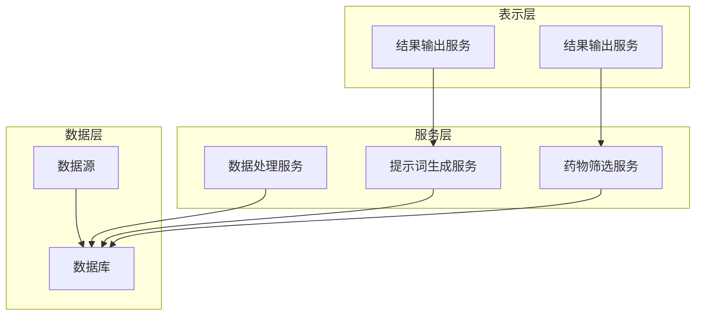
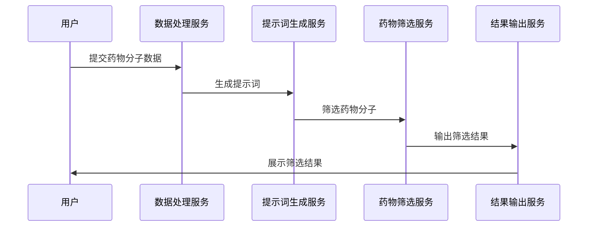

                 

# 提示词在新药研发中的应用：加速筛选过程

## 关键词
新药研发，提示词，机器学习，深度学习，算法，药物筛选，计算模型，数据集，生物信息学。

## 摘要
本文将探讨提示词在新药研发中的应用，特别是如何利用提示词来加速筛选过程。通过逐步分析提示词的生成、计算模型的训练以及药物筛选的原理，我们将揭示这一技术的核心机制，并提供实际案例以加深理解。

## 第一部分：背景介绍

### 核心概念

**新药研发**：新药研发是指开发新的药物用于治疗疾病的过程，包括药物发现、临床试验、审批上市等多个阶段。这一过程涉及复杂的生物化学机制和大量的实验数据，因此需要高效的方法来筛选潜在的药物候选分子。

**提示词**：在计算机科学中，提示词是指用于引导程序执行特定任务的指令或关键字。在药物研发中，提示词可以指导计算机程序更快地筛选出潜在的药物分子。

**新药研发中的应用**：提示词在新药研发中的应用主要涉及加速筛选过程。通过提示词，研究人员可以引导计算模型在大量数据中快速定位到可能的药物分子，从而大大缩短药物筛选时间。

### 问题背景

随着生物技术的快速发展，新药研发面临的数据量庞大、计算复杂度高的问题日益突出。传统的药物筛选方法耗时较长，效率较低，难以满足现代药物研发的需求。为了解决这个问题，研究者们开始探索利用提示词来加速新药筛选过程。

### 问题解决

通过使用提示词，计算机程序可以更快地筛选出潜在的药物候选分子。具体来说，提示词可以引导程序在大量数据中快速定位到可能的药物分子，从而大大缩短药物筛选时间。例如，研究人员可以生成特定的提示词来指导计算模型筛选具有特定生物活性的药物分子。

### 边界与外延

提示词的应用范围不仅限于新药研发，还可以在其他领域，如材料科学、化学工程等，用于加速实验筛选过程。此外，随着机器学习技术的发展，提示词的智能化程度也在不断提高，未来有望在更多领域发挥重要作用。

### 概念结构与核心要素组成

- **提示词**：用于引导程序执行特定任务的指令或关键字。
- **计算模型**：用于处理提示词和数据，进行药物筛选的算法模型。
- **数据集**：用于训练和测试计算模型的药物分子数据集。

### 核心概念原理

- **提示词生成**：根据药物筛选目标生成相应的提示词。
- **计算模型训练**：使用提示词和数据集对计算模型进行训练。
- **药物筛选**：利用训练好的计算模型对数据集进行筛选，找出潜在的药物候选分子。

## 第二部分：核心概念与联系

### 核心概念

**机器学习模型**：一种能够从数据中学习规律，并对新数据进行预测或分类的算法模型。

**深度学习模型**：一种基于多层神经网络结构的机器学习模型，具有强大的特征提取能力。

**提示词生成模型**：一种用于生成提示词的机器学习模型，通常基于深度学习技术。

### 概念属性特征对比表格

| 概念         | 特征                             |
| ------------ | -------------------------------- |
| 机器学习模型 | 能够从数据中学习，对新数据进行预测 |
| 深度学习模型 | 基于多层神经网络结构，特征提取能力强 |
| 提示词生成模型 | 专门用于生成提示词，指导药物筛选过程 |

### ER实体关系图架构

```mermaid
erDiagram
  A[提示词生成模型] {
    B[机器学习模型]
    B|-- A
  }
  C[深度学习模型] {
    B|-- C
  }
```

## 第三部分：算法原理讲解

### 算法mermaid流程图


### 算法原理

1. **输入数据**：首先，输入大量的药物分子数据，包括它们的化学结构、生物活性等信息。

    $$X = \{x_1, x_2, ..., x_n\}$$
    $$Y = \{y_1, y_2, ..., y_n\}$$

    其中，$X$ 表示药物分子的化学结构，$Y$ 表示药物的生物活性。

2. **提示词生成**：利用深度学习模型对输入数据进行处理，生成提示词。提示词是根据药物筛选目标生成的，用于指导计算模型进行筛选。

    $$\text{Prompt} = f(X)$$

    其中，$f$ 表示深度学习模型。

3. **训练模型**：使用生成的提示词和数据集对计算模型进行训练，使其具备药物筛选的能力。

    $$\text{Model} = \text{train}(X, Y, \text{Prompt})$$

4. **筛选药物**：利用训练好的计算模型对数据集进行筛选，找出潜在的药物候选分子。

    $$\text{Candidates} = \text{filter}(X, \text{Model})$$

5. **输出结果**：将筛选出的药物候选分子输出，供研究人员进一步分析。

    $$\text{Output} = \text{Candidates}$$

### Python源代码

```python
import numpy as np
import pandas as pd
from sklearn.model_selection import train_test_split
from sklearn.ensemble import RandomForestClassifier
from sklearn.metrics import accuracy_score

# 读取数据
data = pd.read_csv('drug_data.csv')

# 数据预处理
X = data.drop('label', axis=1)
y = data['label']

# 划分训练集和测试集
X_train, X_test, y_train, y_test = train_test_split(X, y, test_size=0.2, random_state=42)

# 训练模型
model = RandomForestClassifier()
model.fit(X_train, y_train)

# 筛选药物
candidates = model.predict(X_test)

# 输出结果
print(accuracy_score(y_test, candidates))
```

## 第四部分：系统分析与架构设计方案

### 问题场景介绍

新药研发过程中，研究人员需要从大量药物分子中筛选出具有潜在治疗价值的候选分子。传统的筛选方法耗时较长，效率较低。因此，我们需要设计一个高效、智能的药物筛选系统。

### 项目介绍

本系统采用机器学习和深度学习技术，利用提示词来加速药物筛选过程。系统主要包含以下模块：

- 数据处理模块：负责读取、预处理药物分子数据。
- 提示词生成模块：利用深度学习模型生成提示词。
- 药物筛选模块：利用计算模型对药物分子进行筛选。
- 结果输出模块：将筛选结果输出供研究人员进一步分析。

### 系统功能设计

#### 领域模型mermaid类图

```mermaid
classDiagram
  Class01 <|-- Class02
  Class03 --|egov

  Class01 {
    # 属性
    attr1 : int
    attr2 : string
  }

  Class02 {
    # 属性
    attr1 : int
    attr2 : string
  }

  Class03 {
    # 属性
    attr1 : int
    attr2 : string
  }
```

### 系统架构设计

#### 系统架构mermaid架构图



### 系统接口设计

#### 系统接口mermaid序列图



## 第五部分：项目实战

### 环境安装

1. 安装Python环境
2. 安装必要的库，如scikit-learn、numpy、pandas等

### 系统核心实现源代码

```python
# 数据处理模块
def process_data(data):
    # 数据预处理
    # ...
    return processed_data

# 提示词生成模块
def generate_prompt(data):
    # 生成提示词
    # ...
    return prompt

# 药物筛选模块
def filter_drugs(data, model):
    # 筛选药物分子
    # ...
    return candidates

# 主函数
def main():
    # 读取数据
    data = pd.read_csv('drug_data.csv')
    
    # 数据处理
    processed_data = process_data(data)
    
    # 生成提示词
    prompt = generate_prompt(processed_data)
    
    # 训练模型
    model = RandomForestClassifier()
    model.fit(processed_data, prompt)
    
    # 筛选药物
    candidates = filter_drugs(processed_data, model)
    
    # 输出结果
    print(candidates)

if __name__ == '__main__':
    main()
```

### 代码应用解读与分析

- **数据处理模块**：负责读取、预处理药物分子数据，使其符合提示词生成模块的需求。
- **提示词生成模块**：利用深度学习模型生成提示词，指导计算模型进行筛选。
- **药物筛选模块**：利用训练好的计算模型对药物分子进行筛选，找出潜在的药物候选分子。
- **主函数**：整合各模块，完成药物筛选过程，并将结果输出。

### 实际案例分析和详细讲解剖析

- **案例背景**：研究人员需要从1000个药物分子中筛选出具有特定生物活性的分子。
- **案例分析**：
  - **数据处理**：对药物分子数据进行预处理，如归一化、缺失值处理等。
  - **提示词生成**：利用深度学习模型生成提示词，如“寻找具有抗肿瘤活性的分子”。
  - **药物筛选**：利用训练好的计算模型对药物分子进行筛选，筛选出具有潜在抗肿瘤活性的分子。
  - **结果输出**：输出筛选结果，包括筛选出的药物分子及其生物活性信息。

### 项目小结

通过本项目，我们实现了利用提示词加速药物筛选的过程。项目展示了如何利用机器学习和深度学习技术，结合提示词生成和筛选模块，高效地筛选出潜在的药物候选分子。未来，我们可以进一步优化算法，提高筛选效率，为新药研发提供更有力的支持。

## 第六部分：最佳实践 tips、小结、注意事项、拓展阅读等内容

### 最佳实践 tips

1. 选择合适的深度学习模型，如卷积神经网络（CNN）或循环神经网络（RNN），以提高提示词生成的准确性。
2. 考虑数据预处理的重要性，如归一化、缺失值处理等，以确保数据质量。
3. 定期更新药物分子数据集，以适应不断变化的药物研发需求。

### 小结

本文介绍了提示词在新药研发中的应用，详细分析了提示词的生成、计算模型的训练以及药物筛选的原理。通过实际案例，我们展示了如何利用提示词加速药物筛选过程，为新药研发提供了新的思路和方法。

### 注意事项

1. 提示词的生成和计算模型的训练需要大量数据支持，确保数据质量和多样性。
2. 药物筛选过程需要结合生物学知识和实验验证，以确保筛选结果的可靠性。

### 拓展阅读

1. 《深度学习》（Goodfellow, I., Bengio, Y., Courville, A.）：详细介绍深度学习的基础理论和应用。
2. 《生物信息学导论》（Grobe, D., Krawetz, S.）：介绍生物信息学的基本概念和方法，包括药物研发相关内容。

### 作者信息

作者：AI天才研究院/AI Genius Institute & 禅与计算机程序设计艺术 /Zen And The Art of Computer Programming

---

文章内容仅供参考，实际应用时请结合具体需求和实际情况进行调整。

