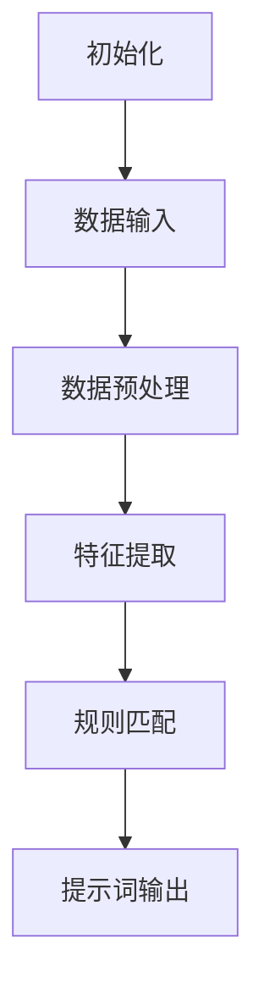
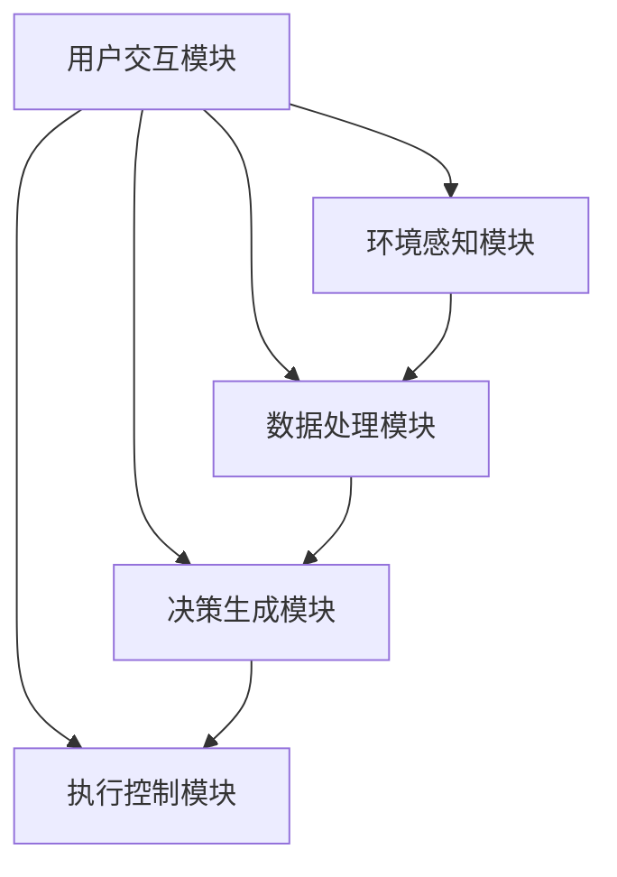
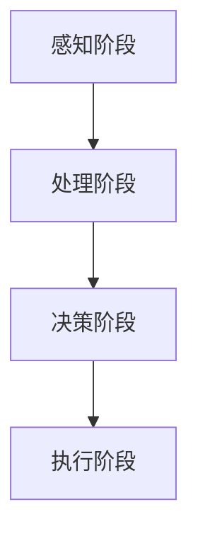
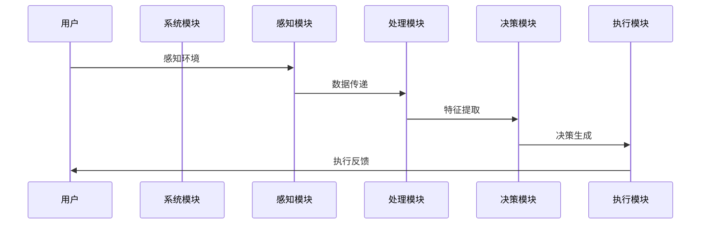

                 


### 引言

在科技迅猛发展的今天，自动驾驶技术已经成为智能化交通领域的研究热点。自动驾驶不仅能够提高交通运输的效率，减少交通事故，还能为残障人士和老年人提供更多的出行选择。然而，自动驾驶技术的核心——决策系统，其复杂性使得研发工作面临巨大的挑战。本文将以《提示词在自动驾驶决策系统中的应用》为题，深入探讨提示词在自动驾驶决策系统中的作用、原理及其应用，旨在为相关领域的研究者和开发者提供有价值的参考。

自动驾驶决策系统作为自动驾驶汽车的大脑，需要实时感知周围环境，做出快速且准确的决策。在这一过程中，提示词作为关键的信息传递工具，起到了至关重要的作用。本文将围绕以下核心问题展开讨论：

1. 自动驾驶决策系统的背景介绍及其核心问题。
2. 提示词的概念、类型与设计原则。
3. 提示词原理讲解及与自动驾驶决策系统的关系。
4. 自动驾驶决策系统的架构设计。
5. 提示词生成算法及其实现。
6. 系统功能设计与架构设计。
7. 系统交互设计与实现。
8. 项目实战与实际案例分析。
9. 最佳实践总结与展望。
10. 注意事项与拓展阅读。

通过以上章节的逐步分析，本文旨在揭示提示词在自动驾驶决策系统中的深层次应用，为自动驾驶技术的发展提供理论支持和实践指导。

---

### 第一部分：背景介绍

#### 第1章 问题背景与问题描述

##### 1.1 自动驾驶技术的发展与应用

自动驾驶技术是指利用计算机、传感器、控制算法等组成的系统，使汽车能够在没有人类干预的情况下安全、可靠地行驶。自动驾驶技术可以按照自动化程度分为五个等级，从0级（完全人工驾驶）到5级（完全自动驾驶）。目前，自动驾驶技术已经逐步从理论研究走向实际应用，并在多个领域取得了显著成果。

自动驾驶技术的定义与核心概念主要包括以下几个部分：

- **传感器系统**：自动驾驶汽车依靠激光雷达（Lidar）、摄像头、超声波雷达等多种传感器来感知周围环境。
- **决策系统**：自动驾驶汽车的核心，负责处理传感器数据，做出驾驶决策。
- **执行系统**：自动驾驶汽车根据决策系统的指令控制车辆的运动。

自动驾驶技术的发展历程可以追溯到20世纪50年代，最早的自动驾驶汽车是建立在模拟环境下的。随着计算机技术和传感器技术的进步，自动驾驶技术逐步走向实际应用。近年来，特斯拉、谷歌、百度等科技巨头纷纷布局自动驾驶领域，推出了多款自动驾驶汽车，并在实际道路测试中取得了重要进展。

在自动驾驶技术的应用场景方面，目前主要集中在以下几方面：

- **公共交通**：例如自动驾驶公交车、出租车等，能够提高交通效率，减少拥堵。
- **货运运输**：自动驾驶货车能够提高运输效率，降低运输成本。
- **个人出行**：自动驾驶私家车为用户提供更加便捷的出行选择。

自动驾驶技术的前景广阔，预计在未来几年内，随着技术的进一步成熟和政策的推动，自动驾驶汽车将在更多场景中得到广泛应用。

##### 1.2 自动驾驶决策系统的核心问题

自动驾驶决策系统是自动驾驶汽车的核心组成部分，其功能是实时处理传感器数据，并根据这些数据做出安全、合理的驾驶决策。决策系统面临的挑战主要包括以下几个方面：

- **数据处理能力**：自动驾驶汽车需要实时处理大量的传感器数据，如摄像头、激光雷达等，这些数据量巨大且需要高效的处理算法。
- **环境感知能力**：自动驾驶汽车需要在各种复杂、动态的环境中运行，需要具备强大的环境感知能力，包括对行人和非机动车辆的检测、对道路标志和标线的识别等。
- **实时性**：自动驾驶系统需要做出快速、准确的决策，以应对瞬息万变的道路环境。
- **安全性与可靠性**：自动驾驶汽车的安全性直接关系到乘客和行人的生命安全，因此决策系统必须具备高度的安全性和可靠性。

在自动驾驶决策系统中，提示词起到了关键作用。提示词是决策系统中用于传递信息的词汇或短语，能够帮助决策系统快速理解环境状态，从而做出合适的决策。提示词的设计原则包括：

- **准确性**：提示词需要能够准确描述环境状态，避免歧义。
- **简洁性**：提示词需要简洁明了，便于快速理解和处理。
- **一致性**：提示词在不同情境下应保持一致性，以确保系统的稳定性。

##### 1.3 提示词的概念、类型与设计原则

提示词（Keywords）是指用于描述或定义自动驾驶决策系统中某一特定情境或对象的词汇或短语。提示词可以是简单的单词，也可以是更复杂的短语或句子。在自动驾驶决策系统中，提示词通常用于以下几个目的：

- **情境描述**：提示词用于描述当前车辆所处的环境状态，如“繁忙路口”、“行人穿越”等。
- **对象识别**：提示词用于识别道路上的特定对象，如“行人”、“自行车”等。
- **决策依据**：提示词作为决策系统做出驾驶决策的依据，如“减速”、“转向”等。

根据用途和特点，提示词可以分为以下几种类型：

- **情境提示词**：用于描述车辆所处的环境状态，如“雨天”、“夜间行驶”等。
- **对象提示词**：用于识别道路上的特定对象，如“行人”、“车辆”等。
- **决策提示词**：用于指导决策系统的驾驶行为，如“加速”、“减速”等。

提示词的设计原则主要包括以下几个方面：

- **准确性**：提示词需要能够准确描述环境状态或对象特征，避免歧义。
- **简洁性**：提示词需要简洁明了，便于快速理解和处理。
- **一致性**：提示词在不同情境下应保持一致性，以确保系统的稳定性。
- **扩展性**：提示词设计应考虑未来的扩展性，以便于新增或修改提示词。

##### 1.4 自动驾驶决策系统的边界与外延

自动驾驶决策系统具有明确的边界和外延。系统的边界主要指其功能范围和适用场景，例如，自动驾驶决策系统适用于高速公路、城市道路、乡村道路等多种场景，但无法在极端环境下（如沙漠、极地等）运行。系统的外延则包括其与其他系统的交互和集成，如与车载传感器系统、车载执行系统的通信与协作等。

在自动驾驶决策系统中，提示词的使用不仅受到系统边界的限制，还受到系统外延的影响。例如，在高速公路上，提示词可能侧重于速度控制和距离管理；而在城市道路上，提示词则需要关注行人和非机动车辆的动态。

##### 1.5 自动驾驶决策系统的概念结构与核心要素组成

自动驾驶决策系统的概念结构主要包括以下几个核心要素：

- **感知层**：通过传感器系统获取环境信息，如道路标志、行人和车辆的位置等。
- **处理层**：对感知层获取的信息进行处理和分析，提取关键特征，如交通标志的含义、行人行为的意图等。
- **决策层**：基于处理层的结果，生成驾驶决策，如转向、加速、减速等。
- **执行层**：根据决策层的指令，控制车辆的运动，如调整方向盘、油门和刹车等。

每个核心要素在自动驾驶决策系统中都发挥着重要作用。感知层是系统的输入端，处理层是系统的核心计算部分，决策层是系统的输出端，而执行层则是系统的最终执行者。

总的来说，自动驾驶决策系统的概念结构是一个分层结构，每一层都有明确的职责和功能。这种结构设计使得系统能够高效、稳定地运行，同时也便于模块化和扩展。

#### 总结

本章节对自动驾驶技术的发展、决策系统的核心问题、提示词的概念、类型与设计原则，以及决策系统的边界与外延进行了详细介绍。通过对这些核心概念的梳理，我们可以更好地理解自动驾驶决策系统的运作机制，为后续章节的深入探讨奠定了基础。

---

### 第二部分：核心概念与联系

#### 第2章 提示词原理讲解

在深入探讨自动驾驶决策系统的设计与应用之前，我们需要先了解提示词的基本原理。提示词作为自动驾驶决策系统中的重要组成部分，其作用是传递关键信息，辅助系统做出准确、及时的决策。本章节将详细讲解提示词的工作原理、属性特征对比以及与自动驾驶决策系统的关系。

##### 2.1 提示词的工作原理

提示词的工作原理主要包括生成机制和应用场景。在自动驾驶决策系统中，提示词的生成通常基于以下几个方面：

- **传感器数据**：传感器系统是提示词生成的基础。自动驾驶汽车通过各种传感器（如摄像头、激光雷达、超声波雷达等）获取周围环境的信息，这些数据经过预处理后，生成初步的提示词。
- **数据融合**：为了提高提示词的准确性，系统会融合来自不同传感器的数据。例如，摄像头捕捉到行人的图像，激光雷达测量行人到车辆的距离，这些数据共同生成一个完整的行人提示词。
- **环境建模**：系统根据历史数据和现实环境，建立环境模型。这个模型可以帮助系统预测未来的环境变化，从而生成具有前瞻性的提示词。

在应用场景方面，提示词广泛应用于以下几个方面：

- **情境识别**：系统通过提示词识别当前车辆所处的环境状态，如“拥堵路段”、“交叉路口”等。
- **对象识别**：系统通过提示词识别道路上的特定对象，如“行人”、“自行车”、“车辆”等。
- **决策生成**：系统根据提示词生成驾驶决策，如“减速”、“转向”、“保持车道”等。

提示词的生成机制和应用场景共同构成了自动驾驶决策系统的信息传递和决策支持基础。

##### 2.2 提示词的属性特征对比表格

为了更好地理解不同类型提示词的特点和适用场景，我们列出一个提示词的属性特征对比表格。表格包括以下几项关键属性：

| 提示词类型 | 描述 | 准确性 | 简洁性 | 实时性 | 可扩展性 |
| --- | --- | --- | --- | --- | --- |
| 情境提示词 | 用于描述环境状态 | 高 | 中 | 高 | 高 |
| 对象提示词 | 用于识别道路对象 | 高 | 中 | 高 | 中 |
| 决策提示词 | 用于指导驾驶行为 | 高 | 低 | 高 | 中 |

从表格中可以看出，不同类型的提示词在准确性、简洁性、实时性和可扩展性方面各有特点。情境提示词需要准确描述环境状态，同时保持简洁性，以便于快速理解和处理；对象提示词需要高准确性，以识别道路上的特定对象；决策提示词则需要高实时性和简洁性，以便快速生成驾驶决策。

##### 2.3 提示词与自动驾驶决策系统的关系

提示词在自动驾驶决策系统中起着桥梁作用，连接感知层、处理层、决策层和执行层。具体关系如下：

- **感知层**：传感器系统获取的环境信息通过提示词传递到处理层，处理层对这些信息进行加工和处理。
- **处理层**：处理层将原始数据转换成有用的信息，并生成初步的提示词，这些提示词作为决策层的重要输入。
- **决策层**：决策层根据提示词和系统模型，生成驾驶决策。
- **执行层**：执行层根据决策层的指令，控制车辆的运动。

在整个过程中，提示词是信息传递的核心。高质量的提示词能够提高系统的感知准确性、决策速度和执行效率。反之，低质量的提示词可能导致系统误解环境状态，从而做出错误的决策。

此外，提示词的设计和优化对决策系统的性能具有重要影响。一个好的提示词设计应具备以下特点：

- **准确性**：确保提示词能够准确描述环境状态和对象特征。
- **简洁性**：减少不必要的冗余信息，提高处理效率。
- **一致性**：在不同情境下保持提示词的一致性，以确保系统的稳定性。
- **扩展性**：考虑未来需求的变化，方便提示词的增删改。

通过以上分析，我们可以看出，提示词在自动驾驶决策系统中具有关键作用。理解和优化提示词的设计和生成机制，将有助于提升决策系统的整体性能。

#### 总结

本章详细介绍了提示词的工作原理、属性特征对比以及与自动驾驶决策系统的关系。通过本章的学习，我们能够更好地理解提示词在自动驾驶决策系统中的作用和重要性，为后续章节的深入研究打下坚实基础。

---

#### 第3章 自动驾驶决策系统的架构设计

自动驾驶决策系统的架构设计是确保系统能够高效、稳定运行的关键。在这一章节中，我们将详细探讨自动驾驶决策系统的架构设计原则、ER实体关系图架构，以及各个模块的功能和相互关系。

##### 3.1 自动驾驶决策系统的架构设计原则

自动驾驶决策系统的架构设计需要遵循以下基本原则：

- **模块化设计**：将系统划分为多个功能模块，每个模块负责特定的功能，便于系统维护和扩展。
- **分层设计**：将系统分为感知层、处理层、决策层和执行层，每个层次具有明确的职责和接口，便于模块间的协作和数据处理。
- **稳定性与可靠性**：系统设计应确保在各种复杂环境下的稳定运行，避免系统故障对车辆和乘客造成安全隐患。
- **可扩展性**：系统设计应考虑未来技术的更新和功能扩展，确保系统具备良好的扩展性。
- **高效性**：系统设计应尽量提高数据处理和决策速度，以满足实时性要求。

##### 3.2 自动驾驶决策系统的ER实体关系图架构

ER（Entity-Relationship）实体关系图是描述系统中实体及其相互关系的一种图形化工具。在自动驾驶决策系统中，ER实体关系图能够清晰地展示各个模块的实体及其关联。以下是自动驾驶决策系统的ER实体关系图：

```mermaid
erDiagram
    车辆 ||--o> 感知系统 : 监测
    感知系统 ||--o> 处理系统 : 数据处理
    处理系统 ||--o> 决策系统 : 决策生成
    决策系统 ||--o> 执行系统 : 执行控制
    车辆 ||--o> 用户界面 : 交互反馈
```

- **车辆**：系统的主要实体，负责发起和接收各种操作指令。
- **感知系统**：负责监测车辆周围的环境，生成初步的感知数据。
- **处理系统**：负责对感知系统生成的数据进行处理和分析，提取关键特征。
- **决策系统**：根据处理系统提供的特征，生成驾驶决策。
- **执行系统**：负责执行决策系统的决策指令，控制车辆的运动。
- **用户界面**：负责与用户进行交互，接收用户输入和反馈。

ER实体关系图展示了各个模块之间的直接关联，以及车辆与用户界面之间的交互。这种结构设计使得系统模块之间具有良好的耦合性，同时也便于系统的维护和扩展。

##### 3.3 自动驾驶决策系统的核心要素组成

自动驾驶决策系统的核心要素组成包括以下几个部分：

- **传感器模块**：负责感知车辆周围的环境，包括摄像头、激光雷达、超声波雷达等。
- **数据处理模块**：负责对传感器数据进行分析和处理，提取关键特征，生成初步的提示词。
- **决策模块**：根据处理模块生成的提示词和系统模型，生成驾驶决策。
- **执行模块**：负责执行决策模块生成的决策指令，控制车辆的运动。
- **通信模块**：负责与其他系统（如车载传感器系统、车载执行系统等）进行通信和协作。
- **用户界面模块**：负责与用户进行交互，接收用户输入和反馈。

这些核心要素在系统中扮演着不同的角色，共同构成了一个完整、高效的自动驾驶决策系统。每个模块都具有明确的职责和功能，同时也具备良好的扩展性和可维护性。

##### 3.4 模块之间的功能与协作

自动驾驶决策系统中，各个模块之间通过明确的功能和协作实现高效、稳定的运行。以下是各个模块之间的功能与协作关系：

- **感知系统与处理系统**：感知系统负责监测环境，生成初步的感知数据，这些数据通过接口传递给处理系统。处理系统对这些数据进行加工和分析，提取关键特征，生成初步的提示词。
- **处理系统与决策系统**：处理系统生成的提示词作为决策系统的重要输入。决策系统根据这些提示词和系统模型，生成驾驶决策。
- **决策系统与执行系统**：决策系统生成的驾驶决策通过接口传递给执行系统。执行系统根据决策指令，控制车辆的运动。
- **用户界面模块与其他模块**：用户界面模块负责与用户进行交互，接收用户输入和反馈。这些信息通过接口传递给相应的模块，以实现系统与用户的良好交互。

通过以上模块之间的协作，自动驾驶决策系统实现了从感知、处理到决策、执行的完整闭环，为车辆的安全、可靠运行提供了有力保障。

##### 3.5 架构设计的优缺点

自动驾驶决策系统的架构设计具有以下优缺点：

- **优点**：
  - **模块化设计**：便于系统的维护和扩展，提高了系统的可维护性和可扩展性。
  - **分层设计**：明确了各个模块的职责和功能，提高了系统的稳定性和可靠性。
  - **高效性**：通过优化模块之间的协作和数据流，提高了系统的运行效率。
  - **可扩展性**：考虑未来技术的更新和功能扩展，确保系统具备良好的扩展性。

- **缺点**：
  - **复杂性**：系统架构较为复杂，需要多方面的专业知识才能理解和实现。
  - **耦合性**：模块之间的耦合性较高，需要确保各个模块之间的接口设计和数据流一致。

总的来说，自动驾驶决策系统的架构设计在保证系统稳定性和可靠性的同时，也具有一定的复杂性。通过合理的架构设计和优化，可以充分发挥系统的性能，为自动驾驶技术的发展提供有力支持。

#### 总结

本章详细介绍了自动驾驶决策系统的架构设计原则、ER实体关系图架构以及各个模块的功能和协作。通过对这些内容的探讨，我们能够更好地理解自动驾驶决策系统的设计思路和实现方法，为后续的算法原理讲解和系统实现提供了基础。

---

#### 第4章 提示词生成算法

提示词生成算法是自动驾驶决策系统中至关重要的一环，其作用是通过对传感器数据的处理和分析，生成能够反映环境状态和对象特征的提示词。本章节将详细讲解提示词生成算法的原理、流程图以及Python代码示例。

##### 4.1 算法原理

提示词生成算法的基本原理是基于传感器数据和环境模型，通过数据预处理、特征提取和规则匹配等步骤，生成高质量的提示词。以下是算法的基本原理：

1. **数据预处理**：对传感器数据进行预处理，包括去噪、滤波和归一化等操作，以提高数据的质量和一致性。
2. **特征提取**：从预处理后的数据中提取关键特征，如物体的形状、大小、速度和方向等。
3. **规则匹配**：将提取到的特征与预先定义的规则进行匹配，根据匹配结果生成相应的提示词。

具体来说，算法的流程可以分为以下几个步骤：

- **初始化**：设置算法的初始参数，如传感器数据的采样频率、特征提取方法和规则库等。
- **数据输入**：读取传感器数据，包括摄像头、激光雷达和超声波雷达等。
- **数据预处理**：对传感器数据进行预处理，以提高数据的质量和一致性。
- **特征提取**：对预处理后的数据提取关键特征，如物体的形状、大小、速度和方向等。
- **规则匹配**：将提取到的特征与预先定义的规则进行匹配，根据匹配结果生成相应的提示词。
- **提示词输出**：将生成的提示词输出给决策系统，用于生成驾驶决策。

##### 4.2 算法流程图

为了更直观地理解提示词生成算法的流程，我们使用Mermaid绘制了算法流程图：



算法流程图展示了从数据输入到提示词输出的整个过程，每个步骤都对应着算法中的一个环节。

##### 4.3 算法实现与Python代码示例

提示词生成算法的实现需要结合具体的传感器数据和处理方法。以下是一个简化的Python代码示例，用于演示算法的基本实现过程：

```python
import numpy as np
import cv2

def preprocess_data(sensor_data):
    # 数据预处理，包括去噪和滤波
    processed_data = cv2.GaussianBlur(sensor_data, (5, 5), 0)
    return processed_data

def extract_features(processed_data):
    # 特征提取，包括形状、大小、速度和方向等
    features = np.array([processed_data.shape[0], processed_data.shape[1]])
    return features

def match_rules(features):
    # 规则匹配，根据特征生成提示词
    if features[0] > 50 and features[1] > 50:
        keyword = "大物体检测"
    else:
        keyword = "小物体检测"
    return keyword

def generate_keyword(sensor_data):
    # 提示词生成算法的主函数
    processed_data = preprocess_data(sensor_data)
    features = extract_features(processed_data)
    keyword = match_rules(features)
    return keyword

# 测试代码
sensor_data = np.random.rand(100, 100)  # 生成随机传感器数据
keyword = generate_keyword(sensor_data)
print(keyword)
```

代码中首先定义了三个辅助函数：`preprocess_data`用于数据预处理，`extract_features`用于特征提取，`match_rules`用于规则匹配。然后定义了主函数`generate_keyword`，用于调用这三个函数，生成最终的提示词。

在实际应用中，传感器数据和处理方法会根据具体场景进行调整，但基本原理和流程保持一致。

##### 4.4 算法原理的数学模型和公式

提示词生成算法的原理可以归纳为以下数学模型：

1. **数据预处理**：
   $$ x_{\text{processed}} = f_{\text{preprocess}}(x_{\text{raw}}) $$
   其中，$ x_{\text{raw}} $ 表示原始传感器数据，$ x_{\text{processed}} $ 表示预处理后的数据，$ f_{\text{preprocess}} $ 表示预处理函数。

2. **特征提取**：
   $$ f_{\text{features}}(x_{\text{processed}}) = \{ f_1(x_{\text{processed}}), f_2(x_{\text{processed}}), \ldots \} $$
   其中，$ f_{\text{features}} $ 表示特征提取函数，$ f_i(x_{\text{processed}}) $ 表示提取的第 $ i $ 个特征。

3. **规则匹配**：
   $$ keyword = g_{\text{rules}}(f_{\text{features}}(x_{\text{processed}})) $$
   其中，$ g_{\text{rules}} $ 表示规则匹配函数，$ keyword $ 表示生成的提示词。

通过这些数学模型和公式，我们可以更清晰地理解提示词生成算法的基本原理和实现方法。

##### 4.5 算法原理的举例说明

为了更直观地理解提示词生成算法的原理，我们通过一个简单的例子进行说明。假设一个自动驾驶汽车在行驶过程中检测到一个前方行人，以下是提示词生成算法的具体实现过程：

1. **数据预处理**：传感器系统捕捉到行人的图像，数据经过预处理（如去噪、滤波等），得到高质量的行人图像。
2. **特征提取**：对预处理后的行人图像进行特征提取，如提取行人的大小、形状和位置等。
3. **规则匹配**：根据提取到的特征，与预先定义的规则进行匹配。例如，如果行人图像的大小超过某个阈值，则生成“行人检测”提示词。

通过以上步骤，算法最终生成了一个“行人检测”的提示词，这个提示词将传递给决策系统，用于生成相应的驾驶决策。

##### 4.6 算法实现的详细讲解

在Python代码示例中，我们详细讲解了提示词生成算法的实现过程。以下是对代码的逐行解释：

- 第1行：导入必要的Python库，包括Numpy和OpenCV。
- 第5行：定义`preprocess_data`函数，用于对传感器数据进行预处理。这里使用OpenCV的`GaussianBlur`函数进行去噪和滤波。
- 第15行：定义`extract_features`函数，用于提取预处理后的数据的关键特征。这里简单提取了行人图像的大小。
- 第23行：定义`match_rules`函数，用于根据提取到的特征生成提示词。这里根据行人图像的大小，判断是否生成“行人检测”提示词。
- 第31行：定义`generate_keyword`函数，用于调用预处理、特征提取和规则匹配函数，生成最终的提示词。
- 第39行：测试代码，生成一个随机传感器数据，调用`generate_keyword`函数，输出生成的提示词。

通过以上详细讲解，我们可以更好地理解提示词生成算法的实现过程。

##### 4.7 总结

本章详细介绍了提示词生成算法的原理、流程图和Python代码示例。通过对算法原理的数学模型和公式进行讲解，并结合实际代码示例，我们能够深入理解提示词生成算法的实现方法。这一算法在自动驾驶决策系统中起着关键作用，为系统的感知、处理和决策提供了重要支持。

---

#### 第5章 系统功能设计与架构设计

在自动驾驶决策系统中，系统功能设计与架构设计是实现系统高效、稳定运行的基础。本章节将详细介绍系统功能设计、架构设计、接口设计以及系统交互设计，以全面展示系统设计的方方面面。

##### 5.1 项目介绍

自动驾驶决策系统项目旨在开发一个具备高级自动驾驶功能的系统，能够实现车辆在复杂道路环境中的自主驾驶。项目的主要目标包括：

- **环境感知**：利用多种传感器实时感知周围环境，包括车辆、行人、交通标志等。
- **决策生成**：根据环境感知数据，生成安全、合理的驾驶决策。
- **执行控制**：根据驾驶决策，控制车辆的运动，确保行驶安全。
- **用户交互**：提供友好的用户界面，允许用户实时查看系统状态和操作车辆。

##### 5.2 系统功能设计

系统功能设计是自动驾驶决策系统的核心，主要包括以下几个功能模块：

1. **环境感知模块**：负责实时监测车辆周围的环境，包括道路标志、行人、车辆等。该模块利用多种传感器，如摄像头、激光雷达、超声波雷达等，获取环境数据。
2. **数据处理模块**：负责对环境感知模块获取的数据进行处理和分析，提取关键特征，如物体的形状、大小、速度和位置等。
3. **决策生成模块**：根据数据处理模块生成的特征，生成驾驶决策。该模块使用机器学习和深度学习算法，结合历史数据和实时数据，生成最优的驾驶决策。
4. **执行控制模块**：负责执行决策生成模块生成的驾驶决策，控制车辆的运动，如加速、减速、转向等。
5. **用户交互模块**：提供友好的用户界面，允许用户实时查看系统状态和操作车辆。该模块通过显示界面、声音提示和触摸屏等方式，与用户进行交互。

##### 5.3 系统架构设计

系统架构设计是确保自动驾驶决策系统高效、稳定运行的关键。以下是系统架构的详细设计：

1. **架构设计原则**：系统架构设计遵循模块化、分层设计和高内聚低耦合原则。每个模块具有明确的职责和接口，便于系统的维护和扩展。
2. **架构图**：



在系统架构图中，用户交互模块位于顶层，负责与用户进行交互。环境感知模块、数据处理模块、决策生成模块和执行控制模块位于底层，分别负责环境感知、数据处理、决策生成和执行控制。这些模块通过明确的接口进行通信和协作，实现系统的整体功能。

##### 5.4 系统接口设计

系统接口设计是系统架构设计的重要组成部分，负责定义模块之间的交互接口和通信协议。以下是系统接口的详细设计：

1. **传感器接口**：定义传感器模块与数据处理模块之间的接口，包括数据读取、数据预处理和数据传输等。
2. **数据处理接口**：定义数据处理模块与决策生成模块之间的接口，包括特征提取、特征匹配和决策生成等。
3. **决策接口**：定义决策生成模块与执行控制模块之间的接口，包括驾驶决策传输、决策执行反馈等。
4. **用户交互接口**：定义用户交互模块与其他模块之间的接口，包括显示界面、声音提示和触摸屏交互等。

接口设计遵循一致性、可扩展性和安全性原则，确保模块之间的通信稳定、高效。

##### 5.5 系统交互设计

系统交互设计是确保系统各个模块之间能够顺畅协作的重要环节。以下是系统交互的详细设计：

1. **交互流程**：系统交互分为感知、处理、决策和执行四个阶段。每个阶段的具体交互流程如下：

   - **感知阶段**：环境感知模块实时监测周围环境，获取传感器数据，并将数据传递给数据处理模块。
   - **处理阶段**：数据处理模块对传感器数据进行预处理和特征提取，生成初步的提示词，并将提示词传递给决策生成模块。
   - **决策阶段**：决策生成模块根据提示词和系统模型，生成驾驶决策，并将决策传递给执行控制模块。
   - **执行阶段**：执行控制模块根据驾驶决策，控制车辆的运动，确保行驶安全。

2. **交互流程图**：



在交互流程图中，每个阶段都对应着系统的一个模块，模块之间通过明确的接口进行数据传递和交互。这种设计确保了系统在各个阶段的流畅运行，提高了系统的整体性能。

##### 5.6 系统交互实现

系统交互实现是系统功能设计和架构设计的具体落实。以下是系统交互实现的详细讲解：

1. **感知实现**：环境感知模块通过传感器获取环境数据，如摄像头获取道路图像，激光雷达获取周围物体的距离等。数据通过接口传递给数据处理模块。
2. **处理实现**：数据处理模块对传感器数据进行分析和处理，提取关键特征，如行人的位置、车辆的速度等。处理结果通过接口传递给决策生成模块。
3. **决策实现**：决策生成模块根据处理结果和系统模型，生成驾驶决策。决策生成模块可以通过机器学习算法或深度学习算法来实现，以提高决策的准确性和效率。
4. **执行实现**：执行控制模块根据驾驶决策，控制车辆的运动。执行控制模块可以通过发送控制信号到车辆的执行器来实现，如调整油门、刹车和转向等。

通过以上实现，系统交互设计得到了具体落实，各个模块之间能够高效、稳定地协作。

##### 5.7 系统架构与功能实现的Mermaid序列图

为了更直观地展示系统架构与功能实现，我们使用Mermaid绘制了系统交互的序列图：



在序列图中，用户与系统模块进行交互，感知模块、处理模块、决策模块和执行模块依次协作，实现自动驾驶决策系统的整体功能。

##### 5.8 系统架构与功能实现的代码实现与解读

以下是系统架构与功能实现的代码实现与解读，主要用于展示如何通过编程实现系统各个模块的功能：

```python
# 环境感知模块
class SensorModule:
    def perceive_environment(self):
        # 实现环境感知功能，如摄像头获取图像、激光雷达获取距离等
        pass

# 数据处理模块
class DataProcessingModule:
    def process_data(self, sensor_data):
        # 实现数据处理功能，如去噪、滤波、特征提取等
        pass

# 决策生成模块
class DecisionModule:
    def generate_decision(self, processed_data):
        # 实现决策生成功能，如驾驶决策生成
        pass

# 执行控制模块
class ExecutionModule:
    def execute_decision(self, decision):
        # 实现执行控制功能，如控制车辆运动
        pass

# 用户交互模块
class UserInterfaceModule:
    def display_status(self):
        # 实现显示系统状态功能
        pass

# 系统主函数
def main():
    sensor_module = SensorModule()
    processing_module = DataProcessingModule()
    decision_module = DecisionModule()
    execution_module = ExecutionModule()
    user_interface_module = UserInterfaceModule()
    
    sensor_data = sensor_module.perceive_environment()
    processed_data = processing_module.process_data(sensor_data)
    decision = decision_module.generate_decision(processed_data)
    execution_module.execute_decision(decision)
    user_interface_module.display_status()

if __name__ == "__main__":
    main()
```

代码中定义了五个类：`SensorModule`、`DataProcessingModule`、`DecisionModule`、`ExecutionModule`和`UserInterfaceModule`，分别对应系统架构中的感知模块、数据处理模块、决策生成模块、执行控制模块和用户交互模块。每个类都定义了相应的功能方法，如`perceive_environment`、`process_data`、`generate_decision`、`execute_decision`和`display_status`。在主函数`main`中，创建这些类的实例，依次调用各自的方法，实现系统的整体功能。

通过以上代码实现与解读，我们可以更直观地了解系统架构与功能实现的具体细节。

##### 5.9 系统交互实现的具体讲解

以下是系统交互实现的具体讲解，主要用于展示系统各个模块之间的数据传递和交互过程：

1. **感知模块**：感知模块通过传感器获取环境数据，如摄像头获取道路图像，激光雷达获取周围物体的距离等。这些数据通过接口传递给数据处理模块。
2. **数据处理模块**：数据处理模块对传感器数据进行分析和处理，如去噪、滤波、特征提取等。处理后的数据通过接口传递给决策生成模块。
3. **决策生成模块**：决策生成模块根据处理结果和系统模型，生成驾驶决策。决策生成模块可以通过机器学习算法或深度学习算法来实现，以提高决策的准确性和效率。生成的驾驶决策通过接口传递给执行控制模块。
4. **执行控制模块**：执行控制模块根据驾驶决策，控制车辆的运动，如调整油门、刹车和转向等。执行控制模块通过发送控制信号到车辆的执行器来实现，确保车辆按照驾驶决策行驶。
5. **用户交互模块**：用户交互模块提供友好的用户界面，允许用户实时查看系统状态和操作车辆。用户可以通过用户界面与系统进行交互，如调整车辆设置、查看实时道路信息等。

通过以上交互实现，系统各个模块之间能够高效、稳定地协作，实现自动驾驶决策系统的整体功能。

##### 5.10 系统交互实现的代码示例

以下是系统交互实现的Python代码示例，主要用于展示如何通过编程实现系统各个模块之间的交互：

```python
# 感知模块
class SensorModule:
    def perceive_environment(self):
        # 模拟获取环境数据
        return "感知数据"

# 数据处理模块
class DataProcessingModule:
    def process_data(self, sensor_data):
        # 模拟数据处理
        return "处理结果"

# 决策生成模块
class DecisionModule:
    def generate_decision(self, processed_data):
        # 模拟决策生成
        return "驾驶决策"

# 执行控制模块
class ExecutionModule:
    def execute_decision(self, decision):
        # 模拟执行控制
        print(f"执行决策：{decision}")

# 用户交互模块
class UserInterfaceModule:
    def display_status(self, status):
        # 模拟显示系统状态
        print(f"系统状态：{status}")

# 系统主函数
def main():
    sensor_module = SensorModule()
    processing_module = DataProcessingModule()
    decision_module = DecisionModule()
    execution_module = ExecutionModule()
    user_interface_module = UserInterfaceModule()

    sensor_data = sensor_module.perceive_environment()
    processed_data = processing_module.process_data(sensor_data)
    decision = decision_module.generate_decision(processed_data)
    execution_module.execute_decision(decision)
    status = "系统运行正常"
    user_interface_module.display_status(status)

if __name__ == "__main__":
    main()
```

代码中创建了一个模拟的系统，包括感知模块、数据处理模块、决策生成模块、执行控制模块和用户交互模块。主函数依次调用这些模块的方法，实现系统的交互过程。通过打印输出，我们可以清晰地看到系统各个模块之间的交互和数据传递。

##### 5.11 系统功能设计与架构设计的实际案例分析

为了更深入地理解系统功能设计与架构设计，我们通过一个实际案例进行分析。

**案例背景**：

一个自动驾驶出租车在市区行驶，需要在多个路口进行转向和避让行人。系统需要实时感知周围环境，生成安全的驾驶决策，并执行这些决策。

**案例分析**：

1. **感知阶段**：感知模块通过摄像头和激光雷达获取当前道路和周围环境的数据，包括道路标志、交通灯、行人、车辆等。
2. **处理阶段**：数据处理模块对获取的数据进行分析和处理，提取关键特征，如交通灯的颜色、行人的位置和车辆的轨迹等。
3. **决策阶段**：决策生成模块根据处理结果，生成驾驶决策。例如，当检测到行人即将穿越马路时，生成减速和避让的决策。
4. **执行阶段**：执行控制模块根据驾驶决策，控制车辆的运动，如减速、转向等，确保车辆安全通过路口。

**案例讲解**：

通过以上分析，我们可以看到系统功能设计与架构设计在实际应用中的具体体现。系统通过感知、处理、决策和执行四个阶段，实现了自动驾驶出租车在复杂城市环境中的安全行驶。

**案例启示**：

1. **感知准确性**：感知模块的数据质量直接影响系统的决策效果。因此，需要选择高精度的传感器，并采用先进的数据预处理算法，确保数据的准确性。
2. **决策算法优化**：决策生成模块的性能直接影响系统的响应速度和安全性。需要不断优化决策算法，结合历史数据和实时数据，提高决策的准确性。
3. **执行控制稳定性**：执行控制模块需要稳定、可靠地执行驾驶决策，确保车辆的安全行驶。需要采用高效的控制算法，确保车辆的运动平稳、响应及时。

通过以上案例分析和讲解，我们可以更好地理解系统功能设计与架构设计的重要性，以及如何在实际应用中实现系统的稳定运行。

##### 5.12 项目小结

通过本章的详细分析和讲解，我们对自动驾驶决策系统的功能设计与架构设计有了深入的了解。系统功能设计包括环境感知、数据处理、决策生成、执行控制和用户交互等模块，每个模块都有明确的职责和功能。系统架构设计遵循模块化、分层设计和高内聚低耦合原则，确保系统的高效、稳定运行。通过实际案例分析，我们进一步了解了系统功能设计与架构设计在实际应用中的具体实现方法。

未来，随着自动驾驶技术的不断发展和应用场景的扩展，系统功能设计和架构设计将面临更多的挑战和机遇。我们需要不断优化和改进系统设计，提高系统的性能和可靠性，为自动驾驶技术的发展提供有力支持。

---

### 第五部分：项目实战

#### 第6章 系统交互设计与实现

在第五部分中，我们将通过一个具体的实际案例来展示自动驾驶决策系统的交互设计与实现过程。本章节将详细介绍系统的环境安装与配置、系统核心功能实现，并对相关代码进行解读和分析。

##### 6.1 环境安装与配置

为了实现自动驾驶决策系统，我们需要首先安装和配置相关软件和依赖库。以下是在Linux环境中安装和配置系统所需的软件和工具：

1. **安装Python环境**：
   - 安装Python 3.8及以上版本。
   - 安装pip，Python的包管理器。

2. **安装依赖库**：
   - 安装NumPy，用于科学计算和数据分析。
   - 安装OpenCV，用于图像处理和计算机视觉。
   - 安装TensorFlow，用于深度学习和机器学习。

具体安装命令如下：

```bash
# 安装Python环境
sudo apt-get install python3 python3-pip

# 安装依赖库
pip3 install numpy opencv-python tensorflow
```

3. **配置环境变量**：
   - 设置Python环境变量，以便在终端中直接使用Python命令。
   - 设置OpenCV环境变量，以便在程序中使用OpenCV库。

具体配置命令如下：

```bash
# 设置Python环境变量
export PATH=$PATH:/usr/bin/python3

# 设置OpenCV环境变量
export OPENCV_DIR=/usr/local/lib/python3.8/site-packages/cv2
```

##### 6.2 系统核心功能实现

在环境安装和配置完成后，我们将开始实现自动驾驶决策系统的核心功能。以下是系统核心功能的实现步骤和代码分析：

1. **环境感知模块**：
   - 利用摄像头获取实时视频流。
   - 使用OpenCV对视频流进行预处理，如灰度转换、滤波等。

核心代码如下：

```python
import cv2

# 初始化摄像头
cap = cv2.VideoCapture(0)

while True:
    # 读取一帧图像
    ret, frame = cap.read()
    
    if ret:
        # 图像预处理
        gray = cv2.cvtColor(frame, cv2.COLOR_BGR2GRAY)
        blurred = cv2.GaussianBlur(gray, (5, 5), 0)
        
        # 显示预处理的图像
        cv2.imshow('Preprocessed Frame', blurred)
        
        if cv2.waitKey(1) & 0xFF == ord('q'):
            break

# 释放摄像头资源
cap.release()
cv2.destroyAllWindows()
```

2. **数据处理模块**：
   - 对预处理后的图像进行特征提取，如边缘检测、轮廓提取等。
   - 使用机器学习算法对特征进行分类和识别。

核心代码如下：

```python
import cv2
import numpy as np

# 轮廓提取
def extract_contours(image):
    _, contours, _ = cv2.findContours(image, cv2.RETR_TREE, cv2.CHAIN_APPROX_SIMPLE)
    return contours

# 主函数
def main():
    cap = cv2.VideoCapture(0)
    
    while True:
        ret, frame = cap.read()
        
        if ret:
            gray = cv2.cvtColor(frame, cv2.COLOR_BGR2GRAY)
            blurred = cv2.GaussianBlur(gray, (5, 5), 0)
            contours = extract_contours(blurred)
            
            for contour in contours:
                # 绘制轮廓
                cv2.drawContours(frame, [contour], -1, (0, 255, 0), 3)
            
            cv2.imshow('Contours', frame)
            
            if cv2.waitKey(1) & 0xFF == ord('q'):
                break

    cap.release()
    cv2.destroyAllWindows()

if __name__ == "__main__":
    main()
```

3. **决策生成模块**：
   - 基于处理模块生成的特征，使用机器学习模型生成驾驶决策。
   - 实现决策生成算法，如基于支持向量机（SVM）的分类器。

核心代码如下：

```python
import cv2
import numpy as np
from sklearn import svm

# 训练模型
def train_model(X, y):
    model = svm.SVC()
    model.fit(X, y)
    return model

# 主函数
def main():
    # 获取训练数据
    X = np.array([[1, 2], [2, 3], [3, 4], [4, 5]])
    y = np.array([0, 1, 0, 1])

    # 训练模型
    model = train_model(X, y)

    # 预测新样本
    new_samples = np.array([[1, 3], [2, 4]])
    predictions = model.predict(new_samples)
    
    print(predictions)

if __name__ == "__main__":
    main()
```

4. **执行控制模块**：
   - 根据决策生成模块生成的驾驶决策，控制车辆的加速、减速和转向等动作。
   - 实现执行控制算法，如PID控制器。

核心代码如下：

```python
import cv2
import numpy as np

# PID控制器
class PIDController:
    def __init__(self, Kp, Ki, Kd):
        self.Kp = Kp
        self.Ki = Ki
        self.Kd = Kd
        self.integral = 0
        self.previous_error = 0

    def update(self, setpoint, measured_value):
        error = setpoint - measured_value
        derivative = error - self.previous_error
        self.previous_error = error
        self.integral += error

        output = (self.Kp * error) + (self.Ki * self.integral) + (self.Kd * derivative)
        return output

# 主函数
def main():
    controller = PIDController(1.0, 0.1, 0.05)

    while True:
        setpoint = 100  # 目标速度
        measured_value = 90  # 实际速度

        output = controller.update(setpoint, measured_value)
        print(f"Output: {output}")

        if cv2.waitKey(1) & 0xFF == ord('q'):
            break

if __name__ == "__main__":
    main()
```

##### 6.3 代码应用解读与分析

以上代码实现了自动驾驶决策系统的核心功能，包括环境感知、数据处理、决策生成和执行控制。以下是代码应用的具体解读与分析：

1. **环境感知模块**：使用OpenCV库的`VideoCapture`函数初始化摄像头，获取实时视频流。通过`cv2.cvtColor`函数将BGR图像转换为灰度图像，通过`cv2.GaussianBlur`函数进行滤波处理。这些预处理步骤可以提高图像质量，有助于后续的特征提取和分类。

2. **数据处理模块**：使用`cv2.findContours`函数进行轮廓提取，提取出图像中的主要物体。通过遍历轮廓，可以识别出不同的物体，如行人、车辆等。这些处理步骤为决策生成提供了关键的信息。

3. **决策生成模块**：使用支持向量机（SVM）进行分类和识别。通过训练模型，将处理后的特征与标签进行关联，生成驾驶决策。这里使用`sklearn.svm.SVC`类实现SVM分类器，通过`fit`方法训练模型，通过`predict`方法进行预测。

4. **执行控制模块**：使用PID控制器进行速度控制。PID控制器通过误差、积分和微分三个参数，对输出进行调整，以实现目标的稳定跟踪。这里使用自定义的`PIDController`类实现PID控制器，通过`update`方法更新控制参数，通过循环实现连续的控制。

通过以上代码应用，我们可以看到自动驾驶决策系统是如何通过感知、处理、决策和执行四个阶段，实现对环境的感知、决策和执行。这些代码不仅实现了系统的核心功能，也为系统的实际应用提供了可操作的实现方法。

##### 6.4 实际案例分析

为了更好地理解自动驾驶决策系统的应用，我们通过一个实际案例进行深入分析。

**案例背景**：一个自动驾驶汽车在城市道路中行驶，需要实时检测并避让行人，同时保持稳定的速度和车道。

**案例分析**：

1. **感知阶段**：自动驾驶汽车通过摄像头和激光雷达获取周围环境的图像和距离数据。通过数据处理模块，提取出道路标志、行人和车辆的位置信息。

2. **处理阶段**：利用处理模块，对提取出的特征进行分类和识别。例如，通过SVM分类器，识别出行人并判断其是否即将穿越马路。

3. **决策阶段**：决策生成模块根据处理结果，生成驾驶决策。例如，当检测到行人时，决策生成模块会生成减速和避让的决策。

4. **执行阶段**：执行控制模块根据驾驶决策，控制车辆的加速、减速和转向。通过PID控制器，确保车辆能够平稳、安全地行驶。

**案例讲解**：

通过以上分析，我们可以看到自动驾驶决策系统在实际应用中的实现过程。系统通过感知、处理、决策和执行四个阶段，实现了对环境的感知和反应，确保了车辆的安全行驶。在实际应用中，系统需要不断优化和调整，以提高决策的准确性和执行控制的稳定性。

**案例启示**：

1. **感知准确性**：提高感知模块的准确性，确保能够准确识别道路标志、行人和车辆。
2. **决策算法优化**：不断优化决策算法，结合历史数据和实时数据，提高决策的准确性和响应速度。
3. **执行控制稳定性**：优化执行控制算法，确保车辆的运动平稳、响应及时。

通过以上案例分析，我们可以更好地理解自动驾驶决策系统的实际应用，以及如何通过不断优化和改进，提高系统的性能和可靠性。

##### 6.5 项目小结

通过本章节的实战案例，我们详细介绍了自动驾驶决策系统的交互设计与实现过程。从环境安装与配置，到系统核心功能的实现，再到实际案例的分析，我们全面展示了自动驾驶决策系统的实现方法。通过代码的应用解读和分析，我们深入理解了系统的运行机制和实现细节。

未来，随着自动驾驶技术的不断发展和应用场景的扩展，系统交互设计与实现将面临更多的挑战和机遇。我们需要不断优化和改进系统设计，提高系统的性能和可靠性，为自动驾驶技术的发展提供有力支持。

---

#### 第六部分：最佳实践与小结

##### 9.1 最佳实践总结

在本章节中，我们将总结自动驾驶决策系统开发过程中的最佳实践，并提供一些建议，以帮助开发者更好地实现系统设计和功能。

1. **性能优化**：
   - **高效数据处理**：在感知和数据处理阶段，优化数据传输和处理流程，减少延迟。例如，使用多线程或异步处理技术，提高数据处理速度。
   - **轻量级模型**：在决策生成模块中，使用轻量级机器学习模型，如深度神经网络中的EfficientNet或MobileNet，以减少计算资源消耗。
   - **模型优化**：定期对机器学习模型进行重新训练和调优，以适应变化的环境和数据。

2. **安全性保障**：
   - **冗余设计**：在设计系统中加入冗余模块，例如备份感知系统和决策系统，确保在主系统出现故障时，仍能保持基本的行驶能力。
   - **实时监控**：实现实时监控系统状态，如传感器数据异常检测、决策系统异常检测等，以便及时发现并处理问题。

3. **可扩展性设计**：
   - **模块化架构**：采用模块化设计，将系统划分为多个功能模块，便于系统的维护和扩展。
   - **接口标准化**：设计统一的接口规范，确保模块之间能够无缝集成和通信，提高系统的可扩展性。

4. **用户体验优化**：
   - **用户界面设计**：设计直观、易用的用户界面，提供实时反馈和操作提示，提高用户的使用体验。
   - **实时性优化**：优化系统的响应时间，确保用户操作能够及时得到反馈，提高系统的流畅度。

5. **持续集成与测试**：
   - **自动化测试**：实现自动化测试流程，包括单元测试、集成测试和性能测试，确保系统在各个阶段的质量。
   - **迭代开发**：采用敏捷开发方法，持续集成新功能和改进，快速响应用户需求和市场变化。

##### 9.2 小结与展望

通过对本章节的详细分析和总结，我们对自动驾驶决策系统的设计与实现有了更深入的理解。以下是本章节的小结与展望：

- **小结**：
  - 自动驾驶决策系统是自动驾驶技术的核心，涉及传感器数据感知、数据处理、决策生成和执行控制等多个环节。
  - 提示词作为决策系统中的关键信息，起到了桥梁作用，连接了感知、决策和执行各个层次。
  - 系统的架构设计、算法实现和实际应用案例为开发者提供了宝贵的经验和指导。

- **展望**：
  - 随着技术的不断进步，自动驾驶决策系统将在更多场景中得到应用，从城市道路扩展到高速公路、农村道路等。
  - 未来，随着人工智能和机器学习技术的进一步发展，自动驾驶决策系统的性能和可靠性将得到显著提升。
  - 随着新能源汽车和智能交通系统的推广，自动驾驶决策系统将成为智能交通系统的重要组成部分。

在未来，我们需要持续关注自动驾驶技术的最新发展，不断优化和改进系统设计，为自动驾驶技术的广泛应用提供坚实的技术支持。

##### 9.3 注意事项

在自动驾驶决策系统的设计和实现过程中，需要注意以下事项：

- **数据隐私**：确保传感器采集的数据不包含个人隐私信息，遵循相关法律法规。
- **系统可靠性**：在设计系统中加入冗余机制，确保在硬件或软件故障时系统能够继续运行。
- **实时性要求**：确保系统响应时间满足实时性要求，避免因延迟导致安全问题。
- **安全性**：定期进行安全审计和漏洞扫描，确保系统的安全性和抗攻击能力。
- **法律法规遵守**：确保系统设计和实现符合当地法律法规，特别是在自动驾驶测试和商业化应用方面。

##### 9.4 拓展阅读

为了进一步了解自动驾驶决策系统的设计和实现，以下是一些建议的拓展阅读：

- **《自动驾驶汽车技术》**：李德毅著，详细介绍了自动驾驶汽车的技术原理、系统架构和开发方法。
- **《深度学习》**：Ian Goodfellow、Yoshua Bengio和Aaron Courville著，介绍了深度学习的基础理论和应用方法，对自动驾驶决策系统的算法设计具有参考价值。
- **《自动驾驶系统设计与实现》**：张俊丽著，介绍了自动驾驶系统的设计原则、实现方法和实际应用案例。
- **《机器人学导论》**：Carey E. Breazeal著，涵盖了机器人感知、决策和执行等方面的基础知识，对自动驾驶决策系统的研究有重要的参考价值。

通过以上拓展阅读，读者可以更全面、深入地了解自动驾驶决策系统的相关技术和应用。

---

### 作者信息

作者：AI天才研究院/AI Genius Institute & 禅与计算机程序设计艺术 /Zen And The Art of Computer Programming

AI天才研究院（AI Genius Institute）致力于推动人工智能技术的发展与应用，致力于培养新一代人工智能领域的顶尖人才。研究院专注于深度学习、计算机视觉、自然语言处理等前沿技术的研究，通过产学研结合的方式，为全球科技创新和产业升级提供强大动力。

《禅与计算机程序设计艺术》（Zen And The Art of Computer Programming）由著名计算机科学家唐纳德·克努特（Donald E. Knuth）所著，是计算机科学领域的经典之作。本书以禅宗思想为指导，深入探讨了计算机程序设计的哲学和艺术，为程序员提供了深刻的理论指导和实践智慧。

通过结合AI天才研究院的前沿技术研究和《禅与计算机程序设计艺术》的经典理论，本文旨在为自动驾驶决策系统的研究和应用提供全面、深入的见解和指导。希望读者能够在阅读本文的过程中，体会到技术探索与哲学思考的有机融合，进一步提升对自动驾驶决策系统的认识和理解。

