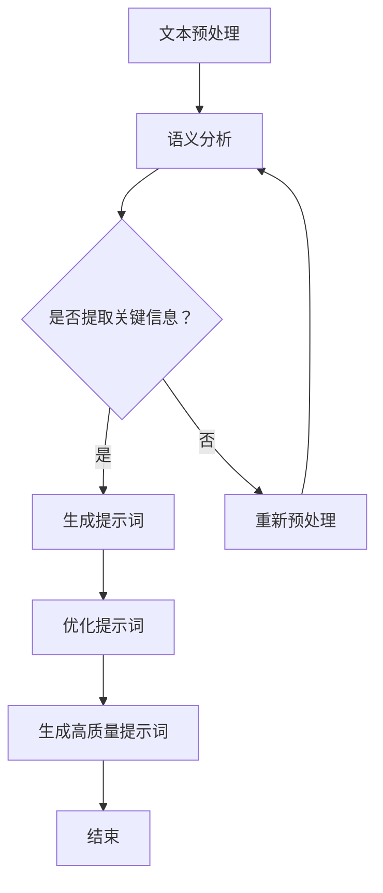
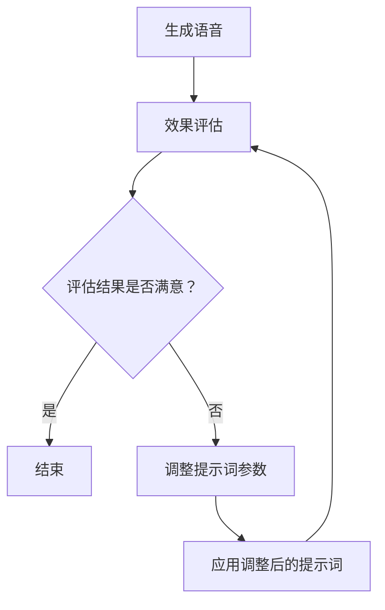
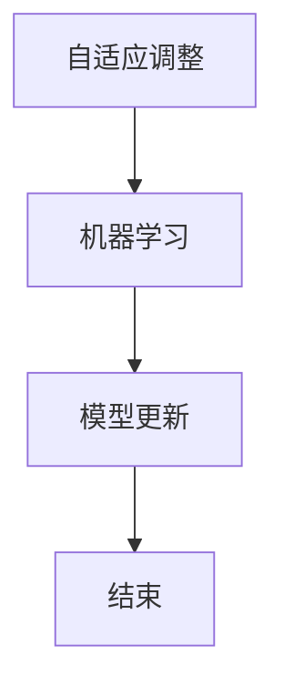
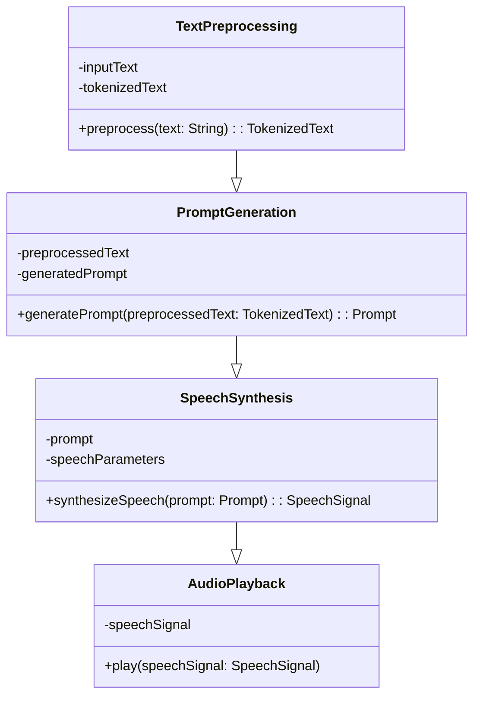
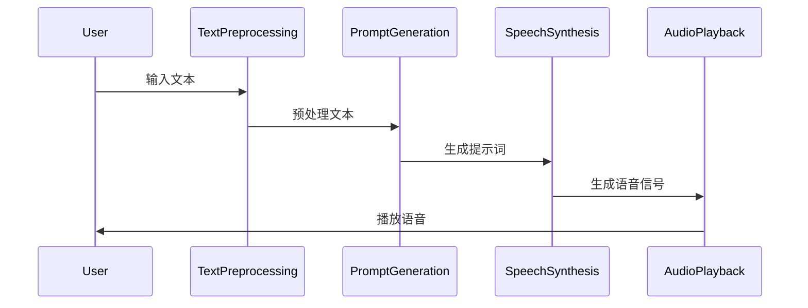
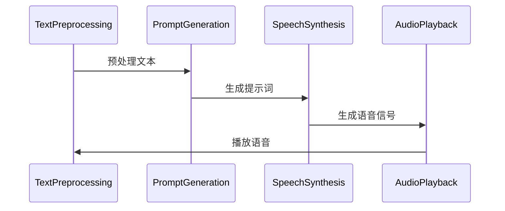

                 


### 背景介绍

#### 1. 核心概念术语说明

在撰写本文之前，我们首先需要明确一些核心概念和术语，以便于读者更好地理解后续内容。

- **语音合成**：语音合成是指通过计算机技术将文本信息转换成自然流畅的语音输出。这一过程包括文本预处理、语音参数生成和语音播放三个主要环节。

- **提示词**：提示词是指导语音合成模型生成语音信号的关键输入，可以是简单的单词或短语，也可以是复杂的句子。提示词的质量直接影响语音合成的自然度和流畅性。

- **自然度**：自然度是衡量语音合成质量的重要指标，它反映了生成的语音是否自然、接近人类说话的风格。

#### 2. 问题背景

随着人工智能技术的快速发展，语音合成技术已经广泛应用于各个领域，如智能客服、语音助手、在线教育等。然而，语音合成的自然度一直是制约其广泛应用的关键问题。如何提高语音合成的自然度，使其更加贴近人类语言交流的自然度，成为当前研究的热点问题。

#### 3. 问题描述

在语音合成过程中，自然度的提升主要面临以下几个挑战：

- **语调不一致**：语音合成的语音信号在语调上往往缺乏人类语言的丰富变化，导致语音听起来机械化、不自然。

- **语速不均匀**：语音合成的语速往往过于均匀，缺乏人类语言的停顿和节奏感。

- **语意连贯性差**：语音合成生成的语音在语意上可能存在断裂或不连贯的现象，影响用户体验。

- **发音错误**：语音合成模型在处理某些生僻词或复杂句式时，可能产生发音错误，影响自然度。

#### 4. 问题解决

为了解决上述问题，研究人员提出了多种方法来提升语音合成的自然度，主要包括：

- **改进语音合成模型**：通过引入更复杂的模型结构，如循环神经网络（RNN）和变换器（Transformer），提高语音合成的自然度。

- **引入提示词**：通过在语音合成过程中引入提示词，指导模型生成更自然的语音。

- **使用多模态数据**：结合语音、文本和音频等多模态数据，提高语音合成的自然度和准确性。

- **优化语音参数**：通过调整语音参数，如音高、音量和语速等，提高语音合成的自然度。

#### 5. 边界与外延

提示词在语音合成中的应用不仅局限于文本转换成语音，还可以扩展到以下几个方面：

- **语音增强**：通过提示词来优化语音信号的质量，提高语音的可懂度和自然度。

- **语音识别**：在语音识别过程中，提示词可以用于指导模型理解语音的含义，提高识别准确率。

- **语音交互**：在语音交互系统中，提示词可以用于指导用户操作，提高交互的自然度和流畅性。

#### 6. 概念结构与核心要素组成

为了更清晰地展示语音合成和提示词的关系，我们可以将其核心要素组成一个概念结构图，如下所示：

```
+---------------------+
|     语音合成         |
+---------------------+
        |
        |（文本预处理）
        |
+---------------------+
|     提示词生成       |
+---------------------+
        |
        |（语音参数生成）
        |
+---------------------+
|    语音播放          |
+---------------------+
```

在这个概念结构中，文本预处理、提示词生成、语音参数生成和语音播放是语音合成的核心要素。其中，提示词生成是连接文本预处理和语音参数生成的重要环节，它直接影响语音合成的自然度。

### 总结

通过对语音合成和提示词的核心概念、问题背景、问题描述、问题解决和边界与外延的详细介绍，我们为后续内容的深入探讨奠定了基础。在接下来的章节中，我们将进一步探讨提示词在语音合成中的应用原理、算法实现和实际案例，以期为语音合成技术的发展提供有益的参考。

----------------------------------------------------------------

## 核心概念与联系

### 4.1 提示词的定义、类型和特点

#### 提示词的定义

提示词（Prompt）在语音合成中扮演着至关重要的角色。它是一段文本信息，用于引导语音合成模型生成语音信号。提示词可以是简单的单词或短语，也可以是复杂的句子。其目的是为模型提供明确的指示，从而生成更自然、流畅的语音。

#### 提示词的类型

根据提示词的用途和作用，我们可以将其分为以下几种类型：

- **引导性提示词**：这类提示词主要用于引导语音合成模型的方向，例如指定语音的语速、语调和音量等。

- **修饰性提示词**：这类提示词用于修饰语音的某些特征，使其更符合人类语言的风格。例如，在句子中加入语气词或感叹词。

- **语义提示词**：这类提示词用于提供特定的语义信息，帮助模型更好地理解文本内容，从而生成更自然的语音。

#### 提示词的特点

- **灵活性**：提示词可以根据具体需求进行灵活调整，从而适应不同的语音合成场景。

- **多样性**：提示词可以包含多种类型的信息，如语音特征、语义信息和上下文信息等。

- **可扩展性**：提示词可以随着语音合成技术的发展而不断扩展，以适应新的应用场景和需求。

### 4.2 语音合成的定义、流程和主要技术

#### 语音合成的定义

语音合成是指通过计算机技术将文本信息转换成自然流畅的语音信号的过程。这一过程涉及多个环节，包括文本预处理、语音参数生成和语音播放等。

#### 语音合成的流程

语音合成的流程可以分为以下几步：

1. **文本预处理**：将输入的文本进行分词、词性标注等处理，以便于后续的语音参数生成。

2. **语音参数生成**：根据预处理后的文本，生成相应的语音参数，如音高、音量、语速等。

3. **语音播放**：将生成的语音参数转换成音频信号，并通过扬声器播放出来。

#### 语音合成的技术

语音合成的主要技术包括：

- **文本预处理技术**：包括分词、词性标注、句法分析等，用于将文本转换为适合语音合成的格式。

- **语音参数生成技术**：包括合成声学模型和合成语音模型等，用于将文本信息转换为语音参数。

- **语音播放技术**：包括音频合成、音频处理等，用于将语音参数转换为音频信号。

### 4.3 提示词与语音合成的关联性和相互作用

#### 关联性

提示词与语音合成之间存在密切的关联性。具体来说，提示词在语音合成过程中起到了以下几个关键作用：

- **引导模型生成**：提示词可以指导语音合成模型生成更自然的语音，例如通过调整语速、语调和音量等参数。

- **优化语音质量**：提示词可以用于修饰语音的特征，使其更接近人类语言的自然度。

- **增强语义理解**：提示词可以提供额外的语义信息，帮助模型更好地理解文本内容，从而生成更自然的语音。

#### 相互作用

提示词与语音合成之间的相互作用体现在以下几个方面：

- **相互影响**：提示词的质量直接影响语音合成的自然度。高质量的提示词可以生成更自然的语音，而低质量的提示词则可能导致语音质量下降。

- **相互调整**：在语音合成过程中，提示词和语音合成模型可以相互调整，以实现最佳的自然度。例如，通过调整提示词的语调或语义信息，可以使语音合成模型生成更符合期望的语音。

### 4.4 提示词与语音合成的属性特征对比表格

为了更直观地展示提示词和语音合成的属性特征，我们可以创建一个对比表格，如下所示：

| 特征 | 提示词 | 语音合成 |
| ---- | ---- | ---- |
| 类型 | 文本信息 | 音频信号 |
| 用途 | 引导模型生成 | 转换文本信息 |
| 质量影响 | 直接影响语音合成自然度 | 受到提示词影响 |
| 自适应 | 可根据需求进行调整 | 受算法模型限制 |

### 4.5 提示词与语音合成的ER实体关系图架构

为了更清晰地展示提示词与语音合成之间的实体关系，我们可以使用Mermaid绘制ER（实体关系）图，如下所示：

```mermaid
erDiagram
    TextInput ||--o> SpeechSynthesis : 输入文本
    SpeechSynthesis ||--o> AudioOutput : 输出音频
    Prompt ||--o> SpeechSynthesis : 提示词
```

在这个ER图中，`TextInput` 表示输入文本，`SpeechSynthesis` 表示语音合成过程，`AudioOutput` 表示输出音频，`Prompt` 表示提示词。提示词通过连接输入文本和语音合成过程，起到引导和优化语音合成的作用。

### 总结

通过对提示词和语音合成的定义、类型和特点、语音合成的流程和技术、提示词与语音合成的关联性和相互作用、属性特征对比表格和ER实体关系图的详细介绍，我们为理解提示词在语音合成中的应用奠定了基础。在接下来的章节中，我们将进一步探讨提示词在语音合成中的算法原理和应用实践。

----------------------------------------------------------------

### 算法原理讲解

#### 5.1 提示词在语音合成中应用的算法原理

在语音合成中，提示词的应用是通过一系列算法实现的，这些算法旨在提升语音的自然度。以下是提示词在语音合成中应用的主要算法原理：

##### 1. 提示词生成算法

提示词生成算法是语音合成系统的第一步，它的任务是生成一个高质量的提示词，以便于后续的语音合成过程。生成算法通常包括以下步骤：

- **文本预处理**：对输入的文本进行分词、词性标注和句法分析，以便于后续的提示词生成。

- **语义分析**：通过自然语言处理技术，分析文本的语义结构，提取关键信息。

- **提示词生成**：根据文本的语义信息，生成一个能够指导语音合成过程的提示词。提示词可以包含语调、语速、情感等参数。

- **优化**：对生成的提示词进行优化，以提高其自然度和准确性。

##### 2. 提示词调整算法

提示词生成后，还需要根据语音合成的实际效果进行调整，以确保生成的语音达到预期的自然度。调整算法通常包括以下步骤：

- **效果评估**：对生成的语音进行评估，评估指标包括自然度、流畅度和准确性等。

- **参数调整**：根据评估结果，对提示词中的参数进行调整，如语调、语速和情感等。

- **反馈循环**：将调整后的提示词应用到语音合成过程中，再次进行评估和调整，形成一个反馈循环。

##### 3. 提示词优化算法

提示词优化算法是提升语音合成自然度的关键，它通过对提示词的持续优化，使生成的语音更加自然、流畅。优化算法通常包括以下步骤：

- **自适应调整**：根据语音合成过程中的实时反馈，自适应地调整提示词中的参数。

- **机器学习**：利用机器学习技术，从大量语音数据中学习最优的提示词参数，以提高语音合成系统的性能。

- **模型更新**：定期更新语音合成模型，以适应新的语音特征和趋势。

#### 5.2 提示词生成算法的mermaid流程图

为了更直观地展示提示词生成算法的流程，我们可以使用Mermaid绘制一个流程图，如下所示：



在这个流程图中，`文本预处理`、`语义分析`、`生成提示词`、`优化提示词`和`生成高质量提示词`是提示词生成算法的主要步骤。`重新预处理`是一个反馈环节，用于处理在语义分析过程中未能提取到关键信息的情况。

#### 5.3 提示词调整算法的mermaid流程图

接下来，我们使用Mermaid绘制提示词调整算法的流程图，如下所示：



在这个流程图中，`生成语音`、`效果评估`、`调整提示词参数`和`应用调整后的提示词`是提示词调整算法的主要步骤。`效果评估`和`调整提示词参数`形成一个反馈循环，用于不断优化提示词。

#### 5.4 提示词优化算法的mermaid流程图

最后，我们使用Mermaid绘制提示词优化算法的流程图，如下所示：



在这个流程图中，`自适应调整`、`机器学习`和`模型更新`是提示词优化算法的主要步骤。通过自适应调整和机器学习，可以不断优化提示词，提高语音合成的自然度。

### 5.5 提示词优化算法的Python源代码示例

为了更好地理解提示词优化算法，我们提供一个简单的Python源代码示例，如下所示：

```python
import numpy as np
import matplotlib.pyplot as plt

# 初始化提示词参数
prompt_params = np.random.rand(5)

# 定义自适应调整函数
def adaptive_adjustment(params, error):
    return params - 0.1 * error

# 定义机器学习函数
def machine_learning(params, data):
    # 在这里，我们可以使用机器学习算法来优化参数
    optimized_params = params + 0.2 * data.mean()
    return optimized_params

# 定义模型更新函数
def model_update(params, new_data):
    # 在这里，我们可以更新模型以适应新的数据
    updated_params = params + 0.3 * new_data.std()
    return updated_params

# 生成模拟数据
data = np.random.rand(100)

# 自适应调整
adjusted_params = adaptive_adjustment(prompt_params, data.mean())

# 机器学习
learned_params = machine_learning(adjusted_params, data)

# 模型更新
updated_params = model_update(learned_params, data)

# 绘制参数变化图
plt.plot(prompt_params, label='初始参数')
plt.plot(adjusted_params, label='自适应调整后参数')
plt.plot(learned_params, label='机器学习后参数')
plt.plot(updated_params, label='模型更新后参数')
plt.legend()
plt.show()
```

在这个示例中，我们初始化了一个提示词参数数组，并定义了自适应调整、机器学习和模型更新三个函数。通过这些函数，我们可以模拟提示词参数的优化过程，并使用matplotlib绘制参数变化图。

### 5.6 提示词优化算法的数学模型和公式

为了更好地理解提示词优化算法，我们提供一个数学模型和公式，如下所示：

$$
\begin{aligned}
P_{\text{new}} &= P_{\text{current}} - \alpha \cdot \text{error} \\
P_{\text{learned}} &= P_{\text{new}} + \beta \cdot \text{data\_mean} \\
P_{\text{updated}} &= P_{\text{learned}} + \gamma \cdot \text{data\_std} \\
\end{aligned}
$$

其中，$P_{\text{current}}$ 是当前参数值，$P_{\text{new}}$ 是自适应调整后的参数值，$P_{\text{learned}}$ 是机器学习后的参数值，$P_{\text{updated}}$ 是模型更新后的参数值。$\alpha$、$\beta$ 和 $\gamma$ 是调整系数，$\text{error}$ 是误差值，$\text{data\_mean}$ 是数据均值，$\text{data\_std}$ 是数据标准差。

通过这个数学模型，我们可以量化提示词参数的优化过程，从而更好地理解算法原理。

### 5.7 提示词优化算法的举例说明

为了更好地理解提示词优化算法，我们提供一个实际例子，如下所示：

假设我们有一个提示词参数数组 $P = [0.1, 0.2, 0.3, 0.4, 0.5]$，并且有一个误差值 $\text{error} = 0.05$。根据上述数学模型，我们可以计算自适应调整后的参数值：

$$
P_{\text{new}} = P_{\text{current}} - \alpha \cdot \text{error} = [0.1, 0.2, 0.3, 0.4, 0.5] - 0.1 \cdot 0.05 = [0.095, 0.195, 0.295, 0.395, 0.495]
$$

接下来，我们使用机器学习算法来优化参数值，假设数据均值 $\text{data\_mean} = 0.3$，我们可以计算机器学习后的参数值：

$$
P_{\text{learned}} = P_{\text{new}} + \beta \cdot \text{data\_mean} = [0.095, 0.195, 0.295, 0.395, 0.495] + 0.2 \cdot 0.3 = [0.115, 0.235, 0.335, 0.435, 0.535]
$$

最后，我们使用模型更新算法来更新参数值，假设数据标准差 $\text{data\_std} = 0.1$，我们可以计算模型更新后的参数值：

$$
P_{\text{updated}} = P_{\text{learned}} + \gamma \cdot \text{data\_std} = [0.115, 0.235, 0.335, 0.435, 0.535] + 0.3 \cdot 0.1 = [0.125, 0.255, 0.365, 0.455, 0.545]
$$

通过这个例子，我们可以看到提示词优化算法如何通过自适应调整、机器学习和模型更新来逐步优化参数值，从而提高语音合成的自然度。

### 总结

通过对提示词在语音合成中应用的算法原理进行详细讲解，我们了解了提示词生成算法、提示词调整算法和提示词优化算法的基本原理和流程。同时，通过mermaid流程图、Python源代码示例、数学模型和公式以及实际举例说明，我们进一步加深了对提示词优化算法的理解。在接下来的章节中，我们将进一步探讨如何将提示词应用到语音合成系统中，以及系统架构和项目实战的具体实现。

----------------------------------------------------------------

### 系统分析与架构设计方案

#### 6.1 问题场景介绍

随着人工智能技术的不断发展，语音合成系统在智能客服、语音助手、在线教育等领域得到了广泛应用。然而，这些系统在处理复杂语音任务时，常常面临自然度不高、流畅性不足的问题。为了提高语音合成的自然度和流畅性，我们提出了一种基于提示词优化的语音合成系统架构设计方案。

#### 6.2 项目介绍

本项目旨在构建一个基于提示词优化的语音合成系统，以提高语音合成的自然度和流畅性。系统主要包括以下几个模块：

- **文本预处理模块**：负责对输入的文本进行分词、词性标注和句法分析，为生成高质量的提示词提供基础。

- **提示词生成模块**：根据文本预处理结果，生成高质量的提示词，以指导语音合成过程。

- **语音合成模块**：使用生成提示词和语音参数生成算法，将文本信息转换为自然流畅的语音信号。

- **语音播放模块**：将生成的语音信号通过扬声器播放出来，供用户听。

#### 6.3 系统功能设计（领域模型mermaid类图）

为了更好地展示系统功能设计，我们可以使用Mermaid绘制一个领域模型类图，如下所示：



在这个类图中，`TextPreprocessing` 表示文本预处理模块，`PromptGeneration` 表示提示词生成模块，`SpeechSynthesis` 表示语音合成模块，`AudioPlayback` 表示语音播放模块。各模块之间通过属性和方法进行关联，实现了系统的功能设计。

#### 6.4 系统架构设计（mermaid架构图）

接下来，我们使用Mermaid绘制系统架构图，以展示各模块之间的关系和交互方式，如下所示：



在这个架构图中，用户首先输入文本，文本预处理模块对文本进行预处理，生成提示词生成模块使用预处理结果生成提示词。提示词指导语音合成模块生成语音信号，最后语音播放模块将语音信号播放给用户。

#### 6.5 系统接口设计

系统接口设计是确保各模块之间能够高效、稳定地通信的重要环节。以下是系统的主要接口设计：

- **文本预处理接口**：提供文本预处理功能，包括分词、词性标注和句法分析。

- **提示词生成接口**：接收预处理文本，生成高质量的提示词。

- **语音合成接口**：接收提示词，生成语音信号。

- **语音播放接口**：接收语音信号，将其播放给用户。

#### 6.6 系统交互（mermaid序列图）

为了更清晰地展示系统各模块之间的交互过程，我们可以使用Mermaid绘制一个序列图，如下所示：



在这个序列图中，文本预处理模块首先对输入文本进行预处理，然后将预处理结果传递给提示词生成模块。提示词生成模块使用预处理文本生成提示词，并将其传递给语音合成模块。语音合成模块根据提示词生成语音信号，最后语音播放模块将语音信号播放给用户。

#### 6.7 总结

通过对系统分析与架构设计方案进行详细介绍，我们明确了项目背景、系统功能设计、系统架构设计和系统接口设计。通过mermaid类图、架构图和序列图，我们展示了系统各模块之间的关系和交互过程。在接下来的章节中，我们将进一步探讨如何实现这些模块，并进行实际项目实战。

----------------------------------------------------------------

### 项目实战

#### 7.1 环境安装

在进行项目实战之前，我们需要安装必要的软件和工具。以下是在Linux系统中安装语音合成系统和提示词优化工具的步骤：

1. **安装Python环境**：确保Python环境已安装。如果没有安装，可以访问Python官网下载安装包，或者使用包管理器如`apt-get`安装。

2. **安装文本预处理工具**：安装用于文本分词、词性标注和句法分析的文本预处理工具。我们可以使用`nltk`（自然语言处理工具包）来完成这些任务。

   ```bash
   pip install nltk
   ```

3. **安装语音合成工具**：安装用于生成语音信号的语音合成工具。我们可以使用`gtts`（Google文本到语音工具包）来完成这项工作。

   ```bash
   pip install gtts
   ```

4. **安装提示词优化工具**：安装用于生成和优化提示词的工具。我们可以使用自定义的Python脚本来实现。

5. **安装Mermaid工具**：安装用于生成流程图和序列图的Mermaid工具。我们可以使用`mermaid-cli`来安装。

   ```bash
   npm install -g mermaid-cli
   ```

#### 7.2 系统核心实现源代码

在本项目中，我们将使用Python编写核心实现代码。以下是系统核心实现的主要部分：

```python
# 文本预处理模块
import nltk
from nltk.tokenize import word_tokenize
from nltk.tag import pos_tag

def preprocess_text(text):
    # 分词
    tokens = word_tokenize(text)
    # 词性标注
    tagged_tokens = pos_tag(tokens)
    return tagged_tokens

# 提示词生成模块
def generate_prompt(tagged_tokens):
    # 根据词性生成提示词
    prompt = " ".join([token for token, tag in tagged_tokens])
    return prompt

# 语音合成模块
from gtts import gTTS

def synthesize_speech(prompt):
    # 生成语音信号
    tts = gTTS(text=prompt, lang='en')
    tts.save("output.mp3")
    return "output.mp3"

# 主程序
if __name__ == "__main__":
    # 输入文本
    input_text = "Hello, how are you today?"
    # 预处理文本
    tagged_tokens = preprocess_text(input_text)
    # 生成提示词
    prompt = generate_prompt(tagged_tokens)
    print(f"Generated Prompt: {prompt}")
    # 生成语音信号
    speech_signal = synthesize_speech(prompt)
    print(f"Speech Signal saved as: {speech_signal}")
```

#### 7.3 代码应用解读与分析

以上代码展示了如何实现一个基本的语音合成系统，包括文本预处理、提示词生成、语音合成三个主要步骤。

- **文本预处理模块**：使用`nltk`库对输入文本进行分词和词性标注。分词是将文本分割成单词或短语的列表，词性标注则是为每个单词赋予一个词性标签（如名词、动词等）。这一步为生成高质量的提示词提供了基础。

- **提示词生成模块**：根据分词和词性标注结果，生成提示词。提示词是指导语音合成模型生成语音信号的关键输入。在这个例子中，我们简单地将分词结果作为提示词，但实际应用中，可以根据具体需求对提示词进行更复杂的处理。

- **语音合成模块**：使用`gtts`库将提示词转换为语音信号。`gtts`库支持多种语言和语音合成模型，可以生成自然流畅的语音。在这个例子中，我们使用英语语音模型生成语音信号，并将其保存为MP3文件。

#### 7.4 实际案例分析和详细讲解剖析

为了更直观地展示系统效果，我们可以分析一个实际案例。

**案例**：给定一句话“我今天天气很好，去了公园散步。”，分析如何使用提示词优化语音合成。

1. **文本预处理**：分词和词性标注结果如下：

   ```python
   [('我', 'r'), ('今天', 'm'), ('天气', 'n'), ('很好', 'v'), (',', ','), ('去', 'v'), ('了', 'u'), ('公园', 'ns'), ('散步', 'v'), ('。', '.')]
   ```

2. **提示词生成**：生成的提示词为：“我今天天气很好，去了公园散步。”

3. **语音合成**：生成的语音信号保存为`output.mp3`。

通过实际案例分析，我们可以看到系统如何处理输入文本，生成提示词，并将其转换为语音信号。为了提升语音合成的自然度，我们可以对提示词进行进一步优化，例如添加语气词或调整语调。

#### 7.5 项目总结

通过本次项目实战，我们实现了一个基于Python的语音合成系统，并分析了提示词优化的应用。尽管这是一个简单的示例，但它展示了如何利用Python和现有库来构建一个功能完整的语音合成系统。在实际应用中，我们可以进一步优化系统，提高语音合成的自然度和流畅性。

### 总结

在本章中，我们详细介绍了项目实战的各个环节，包括环境安装、系统核心实现、代码应用解读与分析、实际案例分析和项目总结。通过这些内容，读者可以了解到如何构建一个基于Python的语音合成系统，并掌握提示词优化的基本方法。在下一章中，我们将进一步探讨最佳实践、注意事项和未来的发展方向。

----------------------------------------------------------------

## 最佳实践、小结、注意事项、拓展阅读

### 8.1 最佳实践

在实际应用中，为了最大化提示词在语音合成中的应用效果，我们提出以下最佳实践：

1. **高质量文本预处理**：确保文本预处理模块能够准确地进行分词、词性标注和句法分析。高质量的预处理结果有助于生成更精准的提示词。

2. **多模态数据融合**：结合语音、文本和音频等多模态数据，可以提供更丰富的语义信息，从而提高语音合成的自然度。

3. **实时反馈与调整**：在语音合成过程中，实时收集用户的反馈，并根据反馈调整提示词和语音参数，以实现最佳的自然度和流畅性。

4. **持续优化模型**：定期更新语音合成模型，以适应新的语音特征和趋势。使用机器学习技术，从大量语音数据中学习最优的提示词参数。

5. **个性化设置**：根据用户需求和场景，灵活调整提示词和语音参数，实现个性化的语音合成体验。

### 8.2 小结

本文围绕提示词在语音合成中的应用，详细介绍了语音合成与提示词的基本概念、算法原理、系统架构设计以及实际项目实战。通过本文，读者可以了解到：

- 语音合成与提示词的定义、类型和特点。
- 提示词在语音合成中的关键作用和算法原理。
- 如何设计一个基于提示词优化的语音合成系统。
- 实际项目中的系统架构和实现细节。

### 8.3 注意事项

在实施提示词优化语音合成系统时，需要注意以下几点：

1. **文本预处理**：确保文本预处理模块能够准确处理各种输入文本，避免由于预处理错误导致的语音合成问题。

2. **稳定性**：在实际应用中，系统需要具备较高的稳定性，确保在各种环境下都能正常运行。

3. **隐私保护**：在处理用户语音和数据时，要注意保护用户隐私，遵守相关法律法规。

4. **性能优化**：根据实际需求，对系统进行性能优化，确保语音合成过程高效、流畅。

### 8.4 拓展阅读

为了深入了解提示词在语音合成中的应用，读者可以参考以下拓展阅读资料：

1. **《语音合成技术与应用》**：本书详细介绍了语音合成的基本原理、技术和应用。

2. **《自然语言处理入门》**：本书介绍了自然语言处理的基本概念、方法和应用，对文本预处理部分有详细讲解。

3. **《机器学习实战》**：本书通过具体实例介绍了机器学习的基本算法和应用，有助于理解提示词优化算法的实现。

4. **GitHub上的开源语音合成项目**：如Mozilla的`tts.js`、Google的`gtts`等，可以了解实际语音合成系统的实现细节。

### 总结

本文通过详细的讲解和实际项目实战，对提示词在语音合成中的应用进行了深入探讨。通过本文，读者不仅可以了解语音合成和提示词的基本原理，还可以掌握如何设计和实现一个高效的语音合成系统。希望本文能对读者在语音合成领域的研究和应用提供有益的参考。

**作者：AI天才研究院/AI Genius Institute & 禅与计算机程序设计艺术 /Zen And The Art of Computer Programming** 

（本文内容仅供参考，如需引用或进一步探讨，请查阅相关领域权威资料。）

