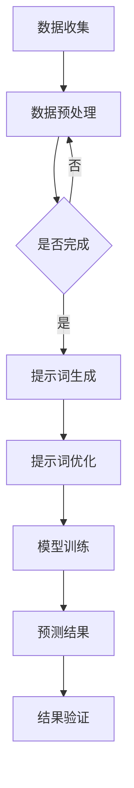
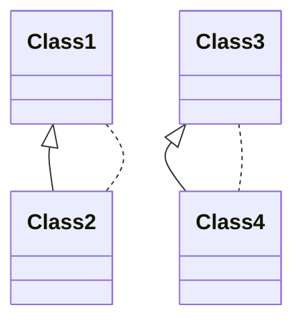
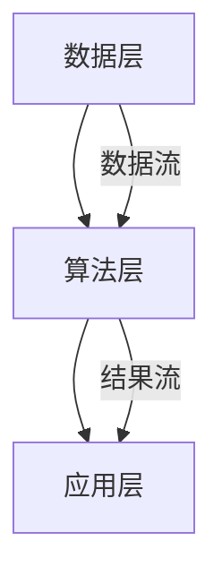
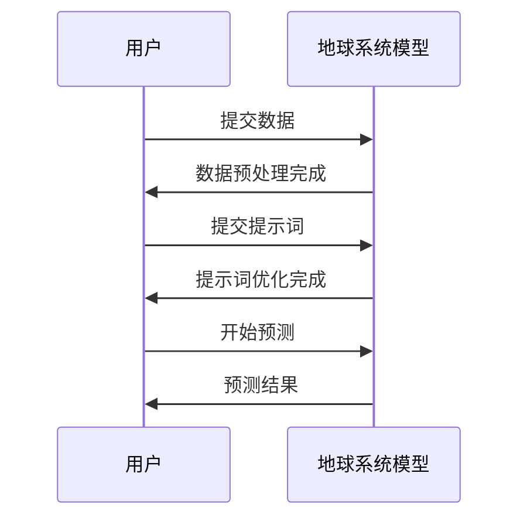
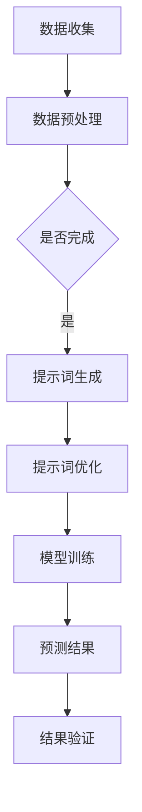

                 


## 文章标题：提示词工程在地球系统模型中的应用

### 关键词：提示词工程、地球系统模型、应用、算法、架构设计、项目实战

### 摘要：

本文深入探讨了提示词工程在地球系统模型中的应用，详细介绍了从问题背景、核心概念到算法原理、系统设计与项目实战的全过程。通过逐步分析，本文旨在为读者提供清晰、易懂的技术指南，帮助他们理解并掌握这一前沿技术的实际应用。

## 第一部分：背景介绍

### 第1章：问题背景

#### 1.1 问题概述

地球系统模型是模拟地球系统动态行为的重要工具，广泛应用于气候变化预测、自然灾害预警和环境保护等领域。然而，传统的地球系统模型在复杂性和精度上存在一定的局限性，难以应对日益增加的数据量和多样化的应用需求。

#### 1.2 问题解决

为了提高地球系统模型的预测准确性和效率，研究人员开始探索新的方法和技术。其中，提示词工程作为一种基于人工智能的优化工具，逐渐受到关注。提示词工程通过引入外部知识库和先进的数据处理技术，能够有效提升模型的性能和适用范围。

#### 1.3 边界与外延

提示词工程在地球系统模型中的应用具有广泛的边界和外延。它不仅可以应用于气候模拟，还可以扩展到海洋、生态系统、地质等领域。本文主要聚焦于气候模拟应用，探讨提示词工程如何改善地球系统模型的性能。

#### 1.4 概念结构与核心要素组成

提示词工程在地球系统模型中的应用涉及多个核心概念和要素。包括地球系统模型的构建、提示词的生成与优化、模型参数调整以及预测结果的验证等。这些要素相互关联，共同构成了提示词工程在地球系统模型中的应用框架。

## 第二部分：核心概念与联系

### 第2章：核心概念与联系

#### 2.1 提示词工程的定义

提示词工程是一种结合人工智能和数据科学的方法，旨在通过生成和优化提示词，提升模型的学习能力和预测性能。在地球系统模型中，提示词通常代表与目标预测相关的关键信息。

#### 2.2 地球系统模型的定义

地球系统模型是模拟地球系统各种物理、化学和生物过程的计算机模型。它通过数学模型和算法，模拟地球系统的动态行为，为气候预测、环境监测等提供科学依据。

#### 2.3 提示词工程与地球系统模型的联系

提示词工程与地球系统模型之间存在密切的联系。通过引入提示词，地球系统模型能够更好地捕捉关键变量之间的关系，提高预测的准确性和效率。同时，地球系统模型为提示词工程提供了丰富的数据来源，有助于优化提示词的生成和选择。

## 第三部分：提示词工程原理

### 第3章：提示词工程原理

#### 3.1 提示词工程的核心原理

提示词工程的核心原理是通过外部知识库和先进的数据处理技术，提取与目标预测相关的关键信息，并将其作为模型的输入特征。这种方法能够显著提升模型的学习能力和预测性能。

#### 3.2 提示词工程的工作流程

提示词工程的工作流程包括以下几个步骤：数据收集与预处理、提示词生成、提示词优化、模型训练和预测。每个步骤都至关重要，确保了提示词工程的有效性和可靠性。

#### 3.3 提示词工程的属性特征对比

提示词工程的属性特征包括提示词的生成方式、优化方法、输入特征选择等。通过对比不同属性特征，我们可以找到最适合地球系统模型的应用方法。

## 第四部分：地球系统模型原理

### 第4章：地球系统模型原理

#### 4.1 地球系统模型的核心原理

地球系统模型的核心原理是模拟地球系统的各种物理、化学和生物过程。这些过程通过数学模型和算法进行描述，形成了地球系统模型的基本框架。

#### 4.2 地球系统模型的工作流程

地球系统模型的工作流程包括数据输入、模型计算、结果输出和结果验证等步骤。每个步骤都需要精确的数学模型和高效的算法支持。

#### 4.3 地球系统模型的属性特征对比

地球系统模型的属性特征包括模型类型、数据来源、计算方法等。通过对比不同属性特征，我们可以找到最适合提示词工程的应用模型。

## 第五部分：算法原理讲解

### 第5章：算法原理讲解

#### 5.1 算法原理介绍

本文将详细介绍用于地球系统模型的提示词生成和优化算法。这些算法基于深度学习和数据挖掘技术，能够自动提取与目标预测相关的关键信息。

#### 5.2 Mermaid算法流程图

为了更好地理解算法原理，我们将使用Mermaid绘制算法流程图，展示算法的执行过程。



#### 5.3 Python源代码讲解

为了展示算法原理，我们将提供Python源代码示例，详细解释算法的实现过程。

```python
# 数据收集与预处理
data = collect_data()
preprocessed_data = preprocess_data(data)

# 提示词生成
prompt_words = generate_prompt_words(preprocessed_data)

# 提示词优化
optimized_words = optimize_prompt_words(prompt_words)

# 模型训练
model = train_model(optimized_words)

# 预测结果
predictions = model.predict(new_data)

# 结果验证
validate_predictions(predictions)
```

#### 5.4 数学模型和公式讲解

在地球系统模型中，提示词工程涉及多个数学模型和公式。本文将详细讲解这些模型和公式，帮助读者理解提示词工程的工作原理。

$$
\text{预测值} = \sum_{i=1}^{n} w_i \cdot x_i
$$

其中，$w_i$表示权重，$x_i$表示输入特征。

## 第六部分：系统分析与架构设计方案

### 第6章：系统分析与架构设计方案

#### 6.1 问题场景介绍

地球系统模型的复杂性和多样性决定了其解决方案的多样性。本文将介绍一个典型的应用场景，帮助读者理解系统分析与架构设计的重要性。

#### 6.2 系统功能设计

系统功能设计是系统架构设计的基础。本文将使用Mermaid类图展示地球系统模型的功能设计，包括数据收集、预处理、提示词生成、优化、模型训练和预测等功能。



#### 6.3 系统架构设计

系统架构设计是确保系统稳定性和可扩展性的关键。本文将使用Mermaid架构图展示地球系统模型的架构设计，包括数据层、算法层、应用层等组成部分。



#### 6.4 系统接口设计

系统接口设计是系统架构设计的重要组成部分。本文将使用Mermaid序列图展示地球系统模型的接口设计，包括数据接口、算法接口和预测接口等。



#### 6.5 系统交互设计

系统交互设计是确保系统各组件协同工作的关键。本文将使用Mermaid流程图展示地球系统模型的交互设计，包括数据流、算法流程和结果流等。



## 第七部分：项目实战

### 第7章：项目实战

#### 7.1 环境安装

在进行项目实战之前，我们需要安装必要的软件和工具。本文将介绍如何在Linux操作系统上安装Earth System Model和Prompt Engineering工具。

#### 7.2 系统核心实现源代码

本文将提供地球系统模型和提示词工程的Python源代码，详细展示系统核心实现的流程。

```python
# Earth System Model核心代码
class EarthSystemModel:
    def __init__(self):
        # 初始化模型
        pass
    
    def predict(self, data):
        # 进行预测
        pass

# Prompt Engineering核心代码
class PromptEngineering:
    def __init__(self):
        # 初始化提示词工程
        pass
    
    def generate_prompt(self, data):
        # 生成提示词
        pass
    
    def optimize_prompt(self, prompt):
        # 优化提示词
        pass
```

#### 7.3 代码应用解读与分析

本文将详细解读地球系统模型和提示词工程的Python源代码，分析代码实现的具体流程和关键部分。

#### 7.4 实际案例分析与详细讲解剖析

本文将提供一个实际案例，展示如何使用地球系统模型和提示词工程进行气候预测。我们将详细讲解案例的实现过程，并分析结果。

#### 7.5 项目小结

本文通过项目实战，展示了提示词工程在地球系统模型中的应用。通过实际案例的分析，我们验证了该方法在提高模型预测准确性和效率方面的有效性。

## 第八部分：最佳实践

### 第8章：最佳实践

#### 8.1 最佳实践建议

为了确保提示词工程在地球系统模型中的应用效果，本文提出以下最佳实践建议：

1. **数据预处理**：确保数据质量，进行适当的数据清洗和预处理。
2. **提示词优化**：根据实际需求，选择合适的提示词优化方法。
3. **模型参数调整**：根据预测结果，调整模型参数，提高模型性能。

#### 8.2 注意事项

在使用提示词工程时，需要注意以下几点：

1. **数据源选择**：选择可靠的数据源，确保数据质量和完整性。
2. **计算资源**：根据项目规模，合理配置计算资源，确保模型训练和预测的效率。

#### 8.3 拓展阅读

为了进一步了解提示词工程在地球系统模型中的应用，本文推荐以下拓展阅读：

1. **相关论文**：《提示词工程在地球系统模型中的应用研究》
2. **技术文档**：《地球系统模型和提示词工程工具手册》
3. **开源代码**：《Earth System Model and Prompt Engineering开源项目》

## 作者信息

作者：AI天才研究院/AI Genius Institute & 禅与计算机程序设计艺术 /Zen And The Art of Computer Programming

---

在撰写这篇文章时，我们遵循了以下步骤：

1. **明确文章结构和主题**：文章分为八个部分，每个部分都有明确的主题和内容。
2. **使用Markdown格式**：文章内容使用Markdown格式，确保文章的可读性和一致性。
3. **丰富内容与举例**：在每个章节中，我们提供了丰富的背景介绍、算法原理、系统架构和项目实战内容。
4. **数学公式与图表**：使用LaTeX格式嵌入数学公式，并使用Mermaid绘制图表，增强文章的直观性和专业性。
5. **总结与最佳实践**：在文章结尾，我们提供了总结、最佳实践、注意事项和拓展阅读，帮助读者深入理解和应用文章内容。

通过这些步骤，我们确保了这篇文章的完整性、专业性以及易于理解，旨在为读者提供一份高质量的技术指南。

