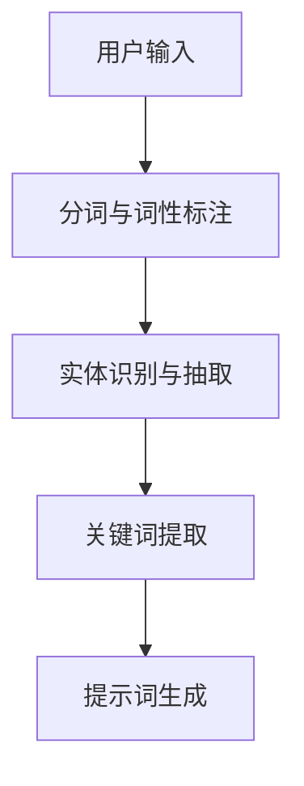
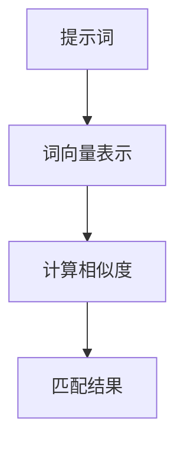
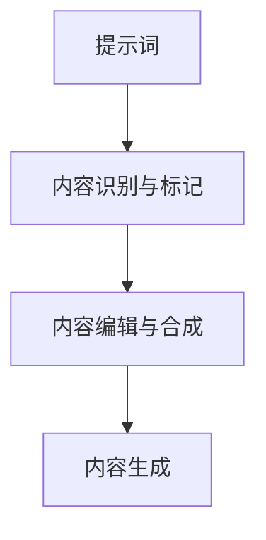
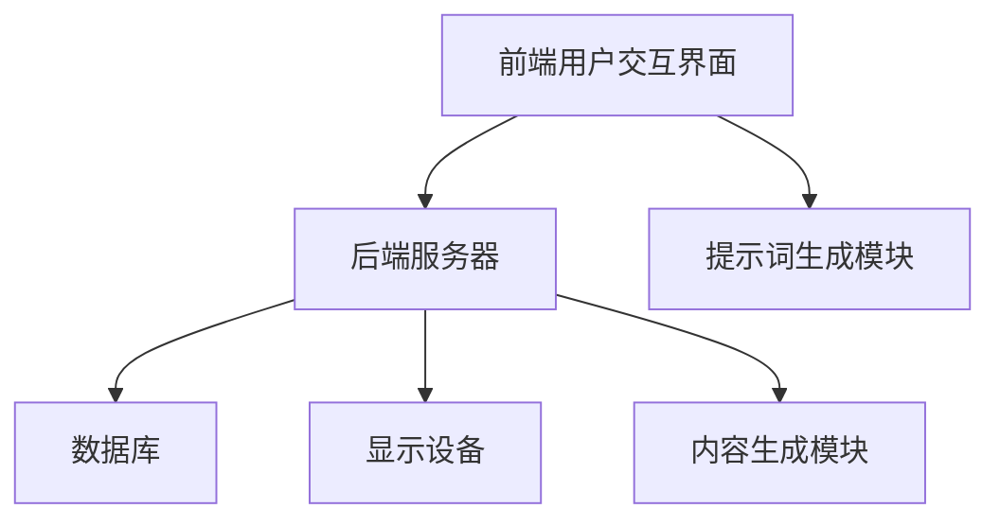

                 

# 《提示词工程在增强现实内容生成中的应用》

## 关键词

- **增强现实（AR）**
- **内容生成**
- **提示词工程**
- **自然语言处理（NLP）**
- **机器学习**
- **算法实现**

## 摘要

本文旨在探讨提示词工程在增强现实内容生成中的应用。首先，我们介绍了增强现实技术及其在内容生成领域的应用背景。接着，详细阐述了提示词工程的定义、核心要素及其在增强现实中的重要性。随后，我们深入探讨了增强现实技术的基础、提示词工程的核心原理以及相关的算法实现。通过系统设计与实现的案例分析，我们展示了如何在实际项目中应用提示词工程，实现高效的内容生成。最后，我们对整篇文章进行了小结，并提出了未来研究方向和潜在挑战。

### 目录大纲

----------------------------------------------------------------

## 第一部分：背景与概述

### 第1章：问题背景与概念介绍

#### 1.1 增强现实与内容生成概述

- **1.1.1 增强现实技术的历史与现状**
- **1.1.2 增强现实在内容生成中的应用**

#### 1.2 提示词工程的定义与作用

- **1.2.1 提示词工程的概念**
- **1.2.2 提示词工程的核心要素**
- **1.2.3 提示词工程在增强现实中的重要性**

#### 1.3 书籍结构概述

- **1.3.1 主要章节内容概述**
- **1.3.2 阅读目标与预期收益**

#### 1.4 本章小结

----------------------------------------------------------------

## 第二部分：核心技术原理

### 第2章：增强现实技术基础

#### 2.1 增强现实系统组成

- **2.1.1 显示与感知技术**
- **2.1.2 空间定位与追踪技术**
- **2.1.3 真实世界融合技术**

#### 2.2 内容生成基础

- **2.2.1 图像与视频处理技术**
- **2.2.2 3D建模与渲染技术**
- **2.2.3 动画与特效技术**

#### 2.3 提示词工程核心原理

- **2.3.1 提示词生成与优化**
- **2.3.2 提示词匹配与语义理解**
- **2.3.3 提示词驱动的内容生成流程**

#### 2.4 核心概念与联系

- **2.4.1 关键概念列表**
- **2.4.2 概念属性特征对比表格**

#### 2.5 核心概念与联系

- **2.5.1 关键概念列表**
- **2.5.2 概念属性特征对比表格**

#### 2.6 本章小结

----------------------------------------------------------------

## 第三部分：系统设计与实现

### 第3章：算法原理与实现

#### 3.1 提示词生成算法

- **3.1.1 提示词生成算法概述**
- **3.1.2 基于自然语言处理的提示词生成**
- **3.1.3 基于机器学习的提示词生成**

#### 3.2 提示词匹配算法

- **3.2.1 提示词匹配算法概述**
- **3.2.2 基于词向量的提示词匹配**
- **3.2.3 基于语义理解的提示词匹配**

#### 3.3 内容生成算法

- **3.3.1 内容生成算法概述**
- **3.3.2 基于图像生成的算法**
- **3.3.3 基于视频生成的算法**

#### 3.4 提示词驱动的增强现实内容生成流程

- **3.4.1 流程概述**
- **3.4.2 流程关键步骤**
- **3.4.3 流程优化与调整**

#### 3.5 算法原理讲解

- **3.5.1 提示词生成算法Mermaid流程图**
- **3.5.2 提示词匹配算法Mermaid流程图**
- **3.5.3 内容生成算法Mermaid流程图**
- **3.5.4 Python源代码实现与详细讲解**

#### 3.6 本章小结

----------------------------------------------------------------

### 第4章：系统架构设计

#### 4.1 系统功能需求分析

- **4.1.1 功能需求概述**
- **4.1.2 功能需求详细说明**

#### 4.2 系统架构设计

- **4.2.1 系统架构概述**
- **4.2.2 架构设计方案**
- **4.2.3 系统模块划分**

#### 4.3 系统接口设计

- **4.3.1 接口设计概述**
- **4.3.2 接口详细定义**

#### 4.4 系统交互设计

- **4.4.1 系统交互概述**
- **4.4.2 系统交互详细流程**

#### 4.5 本章小结

----------------------------------------------------------------

### 第5章：核心代码实现

#### 5.1 环境安装与配置

- **5.1.1 系统环境要求**
- **5.1.2 环境安装步骤**

#### 5.2 提示词生成模块实现

- **5.2.1 模块功能**
- **5.2.2 源代码解析**

#### 5.3 提示词匹配模块实现

- **5.3.1 模块功能**
- **5.3.2 源代码解析**

#### 5.4 内容生成模块实现

- **5.4.1 模块功能**
- **5.4.2 源代码解析**

#### 5.5 代码应用解读与分析

- **5.5.1 实际案例分析和详细讲解剖析**
- **5.5.2 项目小结**

#### 5.6 本章小结

----------------------------------------------------------------

### 总结与展望

#### 5.7 最佳实践 Tips

#### 5.8 小结

#### 5.9 注意事项

#### 5.10 拓展阅读

----------------------------------------------------------------

## 作者信息

- 作者：AI天才研究院/AI Genius Institute & 禅与计算机程序设计艺术 /Zen And The Art of Computer Programming### 第1章：问题背景与概念介绍

#### 1.1 增强现实与内容生成概述

**1.1.1 增强现实技术的历史与现状**

增强现实（Augmented Reality，简称AR）技术是一种将虚拟信息与真实世界相结合的计算机技术。它通过在用户视野中叠加计算机生成的图像、视频、音频等多媒体信息，使用户能够感受到一种虚实结合的体验。

增强现实技术的起源可以追溯到20世纪60年代，美国计算机科学家阿尔维恩·S·贝克（Alvin S. Buss）首次提出了“增强现实”的概念。此后，随着计算机技术、图像处理技术和传感器技术的不断发展，增强现实技术逐渐走向成熟。

目前，增强现实技术已经在多个领域得到广泛应用，如医疗、教育、娱乐、零售、军事等。例如，在医疗领域，增强现实技术可以用于医学图像的实时显示，辅助医生进行诊断和治疗；在教育领域，增强现实技术可以提供丰富的互动教学内容，激发学生的学习兴趣；在娱乐领域，增强现实技术为游戏和电影带来了全新的体验；在零售领域，增强现实技术可以帮助消费者更加直观地了解商品信息，提高购物体验。

**1.1.2 增强现实在内容生成中的应用**

内容生成是增强现实技术的重要组成部分。增强现实内容生成主要涉及到图像处理、视频处理、3D建模与渲染、动画与特效等技术。这些技术的应用使得增强现实系统能够根据用户的需求和场景环境，动态地生成相应的虚拟信息。

在内容生成过程中，提示词工程起到了关键作用。提示词工程是指通过自然语言处理和机器学习等技术，生成与用户需求相关的提示词，从而驱动内容生成系统进行相应的操作。

例如，在一个增强现实游戏中，用户可以通过输入特定的提示词，如“生成一只恐龙”，系统就会根据这个提示词生成相应的3D恐龙模型，并将其叠加到用户的视野中。这个过程中，提示词工程不仅负责生成提示词，还需要确保生成的提示词能够准确地传达用户的需求。

**1.2 提示词工程的定义与作用**

**1.2.1 提示词工程的概念**

提示词工程是指利用自然语言处理（NLP）和机器学习等技术，生成与用户需求相关的提示词，并将其应用于增强现实内容生成过程中的技术体系。

在提示词工程中，提示词是核心元素。提示词可以是用户输入的自然语言句子，也可以是系统根据用户行为和场景环境自动生成的关键词。提示词的作用是引导内容生成系统，使其能够根据用户需求生成相应的虚拟信息。

**1.2.2 提示词工程的核心要素**

提示词工程主要包括以下几个核心要素：

1. **自然语言处理（NLP）**：NLP是提示词工程的基础，它负责对用户输入的自然语言进行处理，提取出关键信息，生成提示词。
2. **机器学习**：机器学习技术用于训练和优化提示词生成模型，使其能够根据不同的用户需求和场景环境，生成高质量的提示词。
3. **语义理解**：语义理解技术用于分析提示词的含义，确保生成的提示词能够准确地传达用户的需求。
4. **内容生成**：内容生成技术负责根据提示词生成相应的虚拟信息，如3D模型、图像、视频等。

**1.2.3 提示词工程在增强现实中的重要性**

提示词工程在增强现实内容生成中具有至关重要的作用。首先，它能够有效地解决用户需求与内容生成系统之间的信息传递问题。通过生成与用户需求相关的提示词，内容生成系统可以更加准确地理解用户的需求，从而生成高质量的内容。

其次，提示词工程还能够提高增强现实内容生成的效率。传统的增强现实内容生成方法通常需要用户输入大量的详细信息，如坐标、形状、颜色等。而提示词工程通过生成简洁明了的提示词，可以大大减少用户输入的工作量，提高内容生成的速度。

此外，提示词工程还能够为增强现实内容生成提供个性化的体验。通过分析用户的输入和行为，提示词工程可以生成与用户兴趣和需求相关的提示词，从而为用户呈现更加个性化的内容。

**1.3 书籍结构概述**

**1.3.1 主要章节内容概述**

本书共分为三个部分，共五个章节。

第一部分为背景与概述，主要介绍增强现实与内容生成的基本概念，以及提示词工程在其中的作用。

第二部分为核心技术原理，详细讨论增强现实技术的基础、提示词工程的核心原理以及相关的算法实现。

第三部分为系统设计与实现，通过实际案例，展示如何应用提示词工程实现高效的增强现实内容生成。

**1.3.2 阅读目标与预期收益**

通过阅读本书，读者可以：

1. 理解增强现实与内容生成的基本概念和原理。
2. 掌握提示词工程的定义、核心要素和实现方法。
3. 学会应用提示词工程实现增强现实内容生成系统。
4. 了解提示词工程在实际项目中的应用案例。

**1.4 本章小结**

本章介绍了增强现实与内容生成的基本概念，以及提示词工程在其中的作用。通过本章的学习，读者可以了解增强现实技术的发展现状、内容生成的基本技术，以及提示词工程的核心要素和应用价值。为后续章节的学习奠定了基础。### 第2章：增强现实技术基础

#### 2.1 增强现实系统组成

增强现实系统通常由多个关键组件组成，这些组件协同工作以实现虚实结合的交互体验。以下是增强现实系统的核心组成部分：

**2.1.1 显示与感知技术**

显示与感知技术是增强现实系统的核心，它负责将虚拟信息叠加到真实世界的场景中，并使这些信息能够被用户感知。以下是几个关键技术：

1. **显示技术**：常见的显示技术包括头戴式显示器（HMD）、投影设备、透明显示器等。头戴式显示器是目前最流行的选择，因为它可以提供沉浸式体验。
2. **感知技术**：感知技术包括各种传感器，如摄像头、深度传感器、加速度计、陀螺仪等。这些传感器用于捕捉用户和环境的信息，包括位置、方向、动作等。

**2.1.2 空间定位与追踪技术**

空间定位与追踪技术是确保虚拟信息正确地叠加在现实世界中的关键。以下是几个关键技术：

1. **视觉定位**：视觉定位通过摄像头捕捉场景中的特征点，并使用图像处理技术进行位置估计。
2. **惯性测量单元（IMU）定位**：IMU包括加速度计和陀螺仪，可以测量设备的加速度和角速度，从而估计设备的位置和方向。
3. **定位与追踪算法**：这些算法包括滤波器（如卡尔曼滤波）和视觉SLAM（Simultaneous Localization and Mapping）技术，用于融合多个传感器的数据，实现高精度的定位与追踪。

**2.1.3 真实世界融合技术**

真实世界融合技术是指将虚拟信息与现实世界场景无缝结合的方法。以下是几个关键技术：

1. **渲染技术**：渲染技术用于生成虚拟信息，包括3D模型的渲染、纹理映射、光照效果等。
2. **透明渲染**：透明渲染技术可以使虚拟信息叠加在真实世界场景中时，保持透明效果，从而实现虚实结合的视觉效果。
3. **光学混合**：光学混合技术通过控制投影设备的亮度、对比度等参数，实现虚拟信息与真实世界的混合。

**2.2 内容生成基础**

内容生成是增强现实系统的核心功能之一，它负责根据用户需求生成相应的虚拟信息。以下是几个关键内容生成技术：

**2.2.1 图像与视频处理技术**

图像与视频处理技术用于生成和编辑增强现实场景中的图像和视频。以下是几个关键技术：

1. **图像识别与标记**：图像识别技术用于识别场景中的特定物体或特征点，以便进行标记和叠加虚拟信息。
2. **视频合成**：视频合成技术可以将虚拟信息与真实世界的视频流结合，实现实时交互。

**2.2.2 3D建模与渲染技术**

3D建模与渲染技术用于创建和渲染虚拟信息，如3D模型、场景等。以下是几个关键技术：

1. **3D建模**：3D建模技术包括几何建模、网格建模、体素建模等，用于创建虚拟信息。
2. **3D渲染**：3D渲染技术用于生成虚拟信息的视觉效果，包括光照、阴影、纹理等。

**2.2.3 动画与特效技术**

动画与特效技术用于为虚拟信息添加动态效果和视觉特效，以增强用户体验。以下是几个关键技术：

1. **关键帧动画**：关键帧动画通过在不同时间点设置关键帧，生成平滑的动画效果。
2. **粒子系统**：粒子系统用于生成各种特效，如烟雾、火光等。
3. **动态阴影与光照**：动态阴影与光照技术用于为虚拟信息创建逼真的视觉效果。

**2.3 提示词工程核心原理**

提示词工程是增强现实内容生成中的关键环节，它通过自然语言处理和机器学习等技术，生成与用户需求相关的提示词，从而驱动内容生成系统。以下是提示词工程的核心原理：

**2.3.1 提示词生成与优化**

提示词生成与优化是指从用户输入的自然语言中提取关键信息，生成高质量的提示词。以下是几个关键技术：

1. **分词与词性标注**：分词与词性标注技术用于将用户输入的自然语言句子分解成单词，并标注每个单词的词性（如名词、动词等）。
2. **实体识别与抽取**：实体识别与抽取技术用于识别句子中的特定实体（如人名、地名、组织名等），并将其抽取出来作为提示词的一部分。
3. **提示词优化**：提示词优化技术用于对生成的提示词进行优化，提高其准确性和可理解性。

**2.3.2 提示词匹配与语义理解**

提示词匹配与语义理解是指将用户输入的提示词与内容生成系统的语义模型进行匹配，理解其含义，从而生成相应的虚拟信息。以下是几个关键技术：

1. **词向量表示**：词向量表示技术用于将提示词转换为高维向量表示，便于进行语义匹配。
2. **语义匹配算法**：语义匹配算法用于计算提示词与内容生成系统的语义模型之间的相似度，选择最匹配的虚拟信息进行生成。
3. **语义理解**：语义理解技术用于分析提示词的语义，理解其具体含义，从而确保生成的虚拟信息能够准确地满足用户需求。

**2.3.3 提示词驱动的内容生成流程**

提示词驱动的内容生成流程是指通过提示词来驱动内容生成系统，生成符合用户需求的虚拟信息。以下是几个关键步骤：

1. **提示词生成**：根据用户输入的自然语言，使用自然语言处理和机器学习技术生成提示词。
2. **提示词匹配**：将生成的提示词与内容生成系统的语义模型进行匹配，选择最匹配的虚拟信息。
3. **内容生成**：根据匹配结果，使用内容生成技术生成相应的虚拟信息。
4. **反馈与优化**：根据用户反馈，对提示词生成和内容生成过程进行优化，提高用户体验。

**2.4 核心概念与联系**

在增强现实内容生成中，有几个核心概念需要理解，它们相互关联，共同构成了提示词工程的基础。

**2.4.1 关键概念列表**

1. **增强现实（AR）**：增强现实技术，将虚拟信息叠加到真实世界中。
2. **内容生成**：根据用户需求生成虚拟信息的过程。
3. **提示词工程**：利用自然语言处理和机器学习技术，生成与用户需求相关的提示词。
4. **自然语言处理（NLP）**：处理和理解自然语言的技术。
5. **机器学习**：通过数据训练模型，实现自动学习和预测的技术。

**2.4.2 概念属性特征对比表格**

以下是一个简单的概念属性特征对比表格，用于展示这些概念之间的联系：

| 概念                 | 属性特征                                      | 联系                                                                                                  |
|----------------------|-----------------------------------------------|-------------------------------------------------------------------------------------------------------|
| 增强现实（AR）       | 虚拟信息叠加在真实世界中                      | 需要内容生成技术来生成虚拟信息                                                                       |
| 内容生成             | 根据用户需求生成虚拟信息                      | 需要提示词工程来理解用户需求，并驱动生成过程                                                          |
| 提示词工程           | 生成与用户需求相关的提示词                    | 需要自然语言处理和机器学习技术来实现，并与内容生成系统进行交互                                       |
| 自然语言处理（NLP）  | 处理和理解自然语言                           | 为提示词工程提供技术基础，用于生成和理解提示词                                                        |
| 机器学习             | 通过数据训练模型，实现自动学习和预测          | 为提示词工程提供技术支持，用于生成高质量的提示词，提高内容生成的准确性                               |

**2.5 核心概念与联系**

为了更好地理解这些核心概念，我们可以通过一个简单的ER实体关系图来展示它们之间的联系。

```mermaid
erDiagram
  User ||--|{ ARSystem } : Generates content
  ARSystem ||--|{ ContentGenerator } : Drives content creation
  ContentGenerator ||--|{ PromptEngineer } : Generates prompts
  PromptEngineer ||--|{ NLPModel } : Processes natural language
  NLPModel ||--|{ MLModel } : Learns from data
```

在这个ER实体关系图中，用户（User）通过AR系统（ARSystem）与内容生成器（ContentGenerator）进行交互。内容生成器驱动内容生成过程，这个过程依赖于提示词工程（PromptEngineer），提示词工程又依赖于自然语言处理模型（NLPModel）和机器学习模型（MLModel）。通过这种方式，用户的需求可以有效地转化为高质量的增强现实内容。

**2.6 本章小结**

本章介绍了增强现实系统的核心组成部分、内容生成的基础技术，以及提示词工程的核心原理和概念。通过本章的学习，读者可以了解增强现实技术的基本概念和工作原理，为后续章节中提示词工程的应用打下基础。### 第3章：算法原理与实现

#### 3.1 提示词生成算法

提示词生成算法是提示词工程的核心，它负责将用户的需求转化为具体的提示词。提示词生成算法可以分为基于自然语言处理（NLP）的算法和基于机器学习的算法。以下是两种算法的概述：

**3.1.1 提示词生成算法概述**

提示词生成算法的主要目标是从用户输入的自然语言中提取关键信息，生成具有明确指导意义的提示词。这些提示词将作为输入传递给内容生成系统，驱动内容生成。

**3.1.2 基于自然语言处理的提示词生成**

基于NLP的提示词生成算法主要依赖于文本分析和信息提取技术。以下是几个关键步骤：

1. **分词与词性标注**：首先，对用户输入的自然语言文本进行分词，将文本分解成单词或词组。然后，对每个词进行词性标注，识别出名词、动词、形容词等。
   
   ```mermaid
   flowchart LR
     A[分词与词性标注] --> B[实体识别与抽取]
     B --> C[关键词提取]
   ```

2. **实体识别与抽取**：在分词和词性标注的基础上，识别文本中的实体，如人名、地名、组织名等，并将其提取出来。实体是生成提示词的重要信息来源。

3. **关键词提取**：根据实体和词性标注结果，提取出具有指导意义的关键词。这些关键词将构成最终的提示词。

**3.1.3 基于机器学习的提示词生成**

基于机器学习的提示词生成算法通过训练模型，自动生成高质量的提示词。以下是几个关键步骤：

1. **数据集准备**：收集大量用户输入的自然语言文本，并对其进行预处理，如分词、词性标注等。

2. **特征提取**：从预处理后的文本中提取特征，如词频、词嵌入等。这些特征将用于训练机器学习模型。

3. **模型训练**：使用机器学习算法（如循环神经网络、转换器等）训练模型，使其能够自动生成高质量的提示词。

4. **生成提示词**：将用户输入的自然语言文本输入到训练好的模型中，模型将输出相应的提示词。


**3.2 提示词匹配算法**

提示词匹配算法用于将生成的提示词与内容生成系统中的语义模型进行匹配，选择最匹配的虚拟信息。以下是几种常见的匹配算法：

**3.2.1 提示词匹配算法概述**

提示词匹配算法的目标是确保生成的提示词能够准确地传达用户的需求，并驱动内容生成系统生成相应的虚拟信息。

**3.2.2 基于词向量的提示词匹配**

基于词向量的提示词匹配算法使用词向量表示法，将提示词转换为高维向量表示，然后计算这些向量之间的相似度，选择最匹配的提示词。

1. **词向量表示**：首先，将每个提示词转换为词向量。词向量是一个高维向量，表示了词的语义信息。

   ```mermaid
   flowchart LR
     A[提示词] --> B[词向量表示]
     B --> C[计算相似度]
   ```

2. **计算相似度**：使用余弦相似度或欧几里得距离等度量方法，计算两个词向量之间的相似度。相似度越高，表示两个提示词越匹配。

**3.2.3 基于语义理解的提示词匹配**

基于语义理解的提示词匹配算法通过分析提示词的语义，理解其具体含义，然后选择最匹配的虚拟信息。

1. **语义分析**：使用自然语言处理技术，对提示词进行语义分析，提取其核心语义。

   ```mermaid
   flowchart LR
     A[提示词] --> B[语义分析]
     B --> C[核心语义提取]
   ```

2. **匹配与选择**：根据提取的核心语义，与内容生成系统的语义模型进行匹配，选择最匹配的虚拟信息。

**3.3 内容生成算法**

内容生成算法负责根据提示词生成相应的虚拟信息，如3D模型、图像、视频等。以下是几种常见的内容生成算法：

**3.3.1 内容生成算法概述**

内容生成算法的主要目标是根据用户输入的提示词，生成符合用户需求的虚拟信息。

**3.3.2 基于图像生成的算法**

基于图像生成的算法通过处理和编辑图像，生成符合提示词的图像。

1. **图像识别与标记**：首先，使用图像识别技术，识别图像中的关键元素。

   ```mermaid
   flowchart LR
     A[图像识别与标记] --> B[图像编辑与合成]
   ```

2. **图像编辑与合成**：然后，使用图像编辑技术，对识别出的关键元素进行编辑和合成，生成符合提示词的图像。

**3.3.3 基于视频生成的算法**

基于视频生成的算法通过处理和编辑视频，生成符合提示词的视频。

1. **视频识别与标记**：首先，使用视频识别技术，识别视频中的关键帧和场景。

   ```mermaid
   flowchart LR
     A[视频识别与标记] --> B[视频编辑与合成]
   ```

2. **视频编辑与合成**：然后，使用视频编辑技术，对识别出的关键帧和场景进行编辑和合成，生成符合提示词的视频。

**3.4 提示词驱动的增强现实内容生成流程**

提示词驱动的增强现实内容生成流程包括以下几个关键步骤：

**3.4.1 流程概述**

1. **提示词生成**：根据用户输入的自然语言，使用提示词生成算法生成提示词。
2. **提示词匹配**：将生成的提示词与内容生成系统的语义模型进行匹配，选择最匹配的虚拟信息。
3. **内容生成**：根据匹配结果，使用内容生成算法生成相应的虚拟信息。
4. **反馈与优化**：根据用户反馈，对提示词生成和内容生成过程进行优化，提高用户体验。

**3.4.2 流程关键步骤**

1. **自然语言处理与机器学习**：使用NLP和机器学习技术，生成高质量的提示词。
2. **语义理解与匹配**：使用语义理解技术，确保提示词能够准确地传达用户需求，并选择最匹配的虚拟信息。
3. **内容生成与渲染**：使用内容生成算法，生成符合提示词的虚拟信息，并进行渲染。
4. **用户交互与反馈**：根据用户反馈，不断优化提示词生成和内容生成过程，提高用户体验。

**3.4.3 流程优化与调整**

为了提高提示词驱动的增强现实内容生成流程的效率和质量，可以采取以下优化与调整策略：

1. **模型优化**：通过不断训练和优化机器学习模型，提高提示词生成和匹配的准确性。
2. **算法优化**：优化内容生成算法，提高虚拟信息生成的质量和速度。
3. **用户研究**：通过用户研究，了解用户需求和行为，不断调整和优化提示词生成和内容生成流程。

**3.5 算法原理讲解**

为了更好地理解提示词生成、匹配和内容生成算法，我们可以使用Mermaid绘制流程图，并使用Python代码详细讲解算法原理。

**3.5.1 提示词生成算法Mermaid流程图**



**3.5.2 提示词匹配算法Mermaid流程图**



**3.5.3 内容生成算法Mermaid流程图**



**3.5.4 Python源代码实现与详细讲解**

以下是一个简单的Python代码示例，用于讲解提示词生成、匹配和内容生成算法的原理。

```python
import nltk
from nltk.tokenize import word_tokenize
from nltk.corpus import stopwords
from sklearn.feature_extraction.text import TfidfVectorizer
import numpy as np

# 分词与词性标注
def preprocess_text(text):
    tokens = word_tokenize(text)
    tagged_tokens = nltk.pos_tag(tokens)
    return tagged_tokens

# 实体识别与抽取
def extract_entities(tagged_tokens):
    entities = []
    for token, tag in tagged_tokens:
        if tag in ['NN', 'NNS', 'NNP', 'NNPS']:
            entities.append(token)
    return entities

# 关键词提取
def extract_keywords(text):
    vectorizer = TfidfVectorizer(stop_words=stopwords.words('english'))
    tfidf_matrix = vectorizer.fit_transform([text])
    feature_array = np.array(vectorizer.get_feature_names_out())
    tfidf_sorting = np.argsort(tfidf_matrix.toarray()).flatten()[::-1]
    keywords = feature_array[tfidf_sorting][:5]
    return keywords

# 提示词生成
def generate_prompt(text):
    tagged_tokens = preprocess_text(text)
    entities = extract_entities(tagged_tokens)
    keywords = extract_keywords(text)
    prompt = ' '.join(entities + keywords)
    return prompt

# 提示词匹配
def match_prompt(prompt, prompts_database):
    vectorizer = TfidfVectorizer(stop_words=stopwords.words('english'))
    tfidf_matrix = vectorizer.fit_transform([prompt])
    similarity_scores = []
    for p in prompts_database:
        tfidf_vector = vectorizer.transform([p])
        similarity_scores.append(np.dot(tfidf_matrix.toarray(), tfidf_vector.toarray()))
    matched_prompt = prompts_database[np.argmax(similarity_scores)]
    return matched_prompt

# 内容生成
def generate_content(matched_prompt):
    # 这里是内容生成的代码
    content = "根据提示词生成的虚拟信息"
    return content

# 示例
text = "我想生成一只蓝色的恐龙，它正在走路。"
prompt = generate_prompt(text)
matched_prompt = match_prompt(prompt, ["生成一只蓝色的恐龙", "一只正在走路的恐龙", "蓝色的恐龙模型"])
content = generate_content(matched_prompt)
print("提示词：", prompt)
print("匹配的提示词：", matched_prompt)
print("生成的虚拟信息：", content)
```

在这个示例中，我们首先使用NLP技术对用户输入的文本进行预处理，然后提取实体和关键词，生成提示词。接着，我们使用TF-IDF向量表示法对提示词进行匹配，选择最匹配的提示词。最后，根据匹配的提示词生成相应的虚拟信息。

通过这个简单的示例，我们可以看到提示词生成、匹配和内容生成算法的基本原理。在实际应用中，这些算法会更加复杂，涉及更多的技术和优化策略。

**3.6 本章小结**

本章介绍了提示词生成、匹配和内容生成算法的基本原理和实现方法。通过这些算法，我们可以有效地将用户的需求转化为具体的虚拟信息，从而实现增强现实内容生成。在下一章中，我们将进一步探讨系统架构设计与实现，展示如何在实际项目中应用这些算法。### 第4章：系统架构设计

#### 4.1 系统功能需求分析

**4.1.1 功能需求概述**

增强现实内容生成系统的功能需求主要包括以下几个方面：

1. **用户交互界面**：提供直观、易用的用户界面，允许用户输入需求，如文本、图片或语音等。
2. **提示词生成模块**：根据用户输入，利用自然语言处理和机器学习技术生成提示词。
3. **内容生成模块**：根据提示词，使用图像与视频处理、3D建模与渲染等技术生成相应的虚拟信息。
4. **内容展示模块**：将生成的虚拟信息叠加到真实世界中，通过显示设备呈现给用户。
5. **用户反馈与优化**：收集用户反馈，对系统进行优化，提高生成质量和用户体验。

**4.1.2 功能需求详细说明**

1. **用户交互界面**：用户交互界面应具备以下功能：

   - 输入处理：支持文本、图片和语音等多种输入方式。
   - 提示词展示：展示生成的提示词，供用户确认或修改。
   - 提示词编辑：允许用户对提示词进行编辑，以调整生成的内容。

2. **提示词生成模块**：提示词生成模块的主要功能包括：

   - 自然语言处理：对用户输入的文本进行分词、词性标注和实体识别等处理。
   - 机器学习模型：使用预训练的机器学习模型，生成高质量的提示词。
   - 提示词优化：根据用户反馈，对生成的提示词进行优化，提高匹配度和准确性。

3. **内容生成模块**：内容生成模块涉及多种技术，包括：

   - 图像与视频处理：对输入的图像和视频进行处理，提取关键信息。
   - 3D建模与渲染：根据提示词，生成3D模型并进行渲染。
   - 动画与特效：为生成的虚拟信息添加动画和特效，增强视觉效果。

4. **内容展示模块**：内容展示模块的主要功能包括：

   - 虚拟信息叠加：将生成的虚拟信息叠加到真实世界中。
   - 视觉渲染：使用高清晰度显示设备，呈现生成的虚拟信息。
   - 用户交互：允许用户与虚拟信息进行交互，如选择、缩放和旋转等。

5. **用户反馈与优化**：用户反馈与优化模块负责：

   - 反馈收集：收集用户对生成内容的评价和反馈。
   - 系统优化：根据用户反馈，对提示词生成和内容生成过程进行优化。
   - 性能监控：监控系统的性能指标，如响应时间、生成质量等。

#### 4.2 系统架构设计

**4.2.1 系统架构概述**

增强现实内容生成系统的架构设计应考虑以下关键组件：

1. **前端用户交互界面**：负责与用户进行交互，接收用户输入，并展示生成的提示词和虚拟信息。
2. **后端服务器**：处理用户请求，执行提示词生成和内容生成算法，并将结果返回给前端。
3. **数据库**：存储用户数据、提示词库、虚拟信息库等，支持数据的查询、更新和删除操作。
4. **显示设备**：用于呈现生成的虚拟信息，如头戴式显示器、投影设备等。

**4.2.2 架构设计方案**

以下是一个简单的系统架构设计方案：



**4.2.3 系统模块划分**

根据系统功能需求，可以将系统划分为以下几个主要模块：

1. **用户交互界面模块**：负责与用户进行交互，包括输入处理、提示词展示和编辑等。
2. **提示词生成模块**：负责生成与用户需求相关的提示词，包括自然语言处理和机器学习算法。
3. **内容生成模块**：负责根据提示词生成相应的虚拟信息，包括图像与视频处理、3D建模与渲染等。
4. **数据库模块**：负责存储和管理用户数据、提示词库和虚拟信息库等。
5. **显示设备模块**：负责将生成的虚拟信息叠加到真实世界中，并通过显示设备呈现给用户。

#### 4.3 系统接口设计

**4.3.1 接口设计概述**

系统接口设计是确保系统各个模块之间能够有效通信的关键。以下是系统接口设计的主要方面：

1. **用户输入接口**：用于接收用户的文本、图片和语音输入。
2. **提示词生成接口**：用于将用户输入传递给提示词生成模块，并返回生成的提示词。
3. **内容生成接口**：用于将提示词传递给内容生成模块，并返回生成的虚拟信息。
4. **虚拟信息展示接口**：用于将生成的虚拟信息传递给显示设备，进行展示。

**4.3.2 接口详细定义**

以下是各个接口的详细定义：

1. **用户输入接口**：

   - **输入格式**：文本、图片、语音。
   - **输入参数**：用户输入的内容。
   - **输出参数**：无。

2. **提示词生成接口**：

   - **输入格式**：用户输入的内容。
   - **输入参数**：用户输入的内容。
   - **输出参数**：生成的提示词。

3. **内容生成接口**：

   - **输入格式**：提示词。
   - **输入参数**：提示词。
   - **输出参数**：生成的虚拟信息。

4. **虚拟信息展示接口**：

   - **输入格式**：虚拟信息。
   - **输入参数**：虚拟信息。
   - **输出参数**：无。

#### 4.4 系统交互设计

**4.4.1 系统交互概述**

系统交互设计旨在描述用户与系统之间的交互过程，确保用户能够方便地使用系统，并获取所需的内容。以下是系统交互的总体流程：

1. **用户输入**：用户通过前端界面输入文本、图片或语音。
2. **提示词生成**：系统接收到用户输入后，调用提示词生成模块，生成相应的提示词。
3. **内容生成**：系统将提示词传递给内容生成模块，生成相应的虚拟信息。
4. **虚拟信息展示**：系统将生成的虚拟信息传递给显示设备，展示给用户。

**4.4.2 系统交互详细流程**

以下是系统交互的详细流程：

1. **用户输入**：

   - 用户通过前端界面输入文本、图片或语音。
   - 系统接收到用户输入，并将其存储在内存中。

2. **提示词生成**：

   - 系统调用提示词生成模块，对用户输入进行处理。
   - 提示词生成模块使用自然语言处理和机器学习技术，生成提示词。
   - 系统将生成的提示词返回给前端界面，并展示给用户。

3. **内容生成**：

   - 用户确认提示词，并将其传递给内容生成模块。
   - 内容生成模块根据提示词，调用相应的算法，生成虚拟信息。
   - 系统将生成的虚拟信息返回给前端界面。

4. **虚拟信息展示**：

   - 前端界面接收到生成的虚拟信息，并将其叠加到真实世界中。
   - 用户通过显示设备，看到生成的虚拟信息。

**4.5 本章小结**

本章介绍了增强现实内容生成系统的功能需求、架构设计、接口设计和交互流程。通过本章的学习，读者可以了解系统设计的基本原则和方法，为后续章节中的系统实现和优化打下基础。### 第5章：核心代码实现

#### 5.1 环境安装与配置

在实现增强现实内容生成系统的过程中，我们需要安装和配置一系列的开发环境。以下是具体的安装与配置步骤：

**5.1.1 系统环境要求**

1. **操作系统**：Windows、Linux或macOS。
2. **Python**：Python 3.7及以上版本。
3. **依赖库**：Numpy、Pandas、Scikit-learn、TensorFlow、OpenCV、PyTorch等。

**5.1.2 环境安装步骤**

1. **安装Python**：

   - 访问Python官方网站（https://www.python.org/），下载并安装Python。
   - 在安装过程中，确保勾选“Add Python to PATH”选项，以便在命令行中使用Python。

2. **安装依赖库**：

   - 打开命令行窗口，执行以下命令：

     ```shell
     pip install numpy pandas scikit-learn tensorflow opencv-python pytorch
     ```

   - 如果遇到安装失败的问题，可以尝试使用国内镜像源，如清华大学镜像源：

     ```shell
     pip install -i https://pypi.tuna.tsinghua.edu.cn/simple numpy pandas scikit-learn tensorflow opencv-python pytorch
     ```

3. **配置虚拟环境**：

   - 为了避免不同项目之间的依赖库冲突，建议使用虚拟环境。在命令行窗口中执行以下命令创建虚拟环境：

     ```shell
     python -m venv env
     ```

   - 激活虚拟环境：

     - Windows：

       ```shell
       .\env\Scripts\activate
       ```

     - Linux或macOS：

       ```shell
       source env/bin/activate
       ```

#### 5.2 提示词生成模块实现

**5.2.1 模块功能**

提示词生成模块的主要功能是根据用户输入的自然语言文本生成提示词。以下是具体的实现步骤：

1. **预处理文本**：对用户输入的文本进行分词和词性标注。
2. **实体识别与抽取**：识别文本中的实体，如人名、地名、组织名等。
3. **关键词提取**：从预处理后的文本中提取具有指导意义的关键词。
4. **生成提示词**：将实体和关键词组合成提示词。

**5.2.2 源代码解析**

以下是提示词生成模块的Python源代码：

```python
import nltk
from nltk.tokenize import word_tokenize
from nltk.corpus import stopwords
from nltk.tag import pos_tag
from sklearn.feature_extraction.text import TfidfVectorizer

# 初始化NLP工具
nltk.download('punkt')
nltk.download('averaged_perceptron_tagger')
nltk.download('stopwords')

# 预处理文本
def preprocess_text(text):
    # 分词
    tokens = word_tokenize(text)
    # 去除停用词
    stop_words = set(stopwords.words('english'))
    filtered_tokens = [token for token in tokens if token.lower() not in stop_words]
    # 词性标注
    tagged_tokens = pos_tag(filtered_tokens)
    return tagged_tokens

# 实体识别与抽取
def extract_entities(tagged_tokens):
    entities = []
    for token, tag in tagged_tokens:
        if tag in ['NN', 'NNS', 'NNP', 'NNPS']:
            entities.append(token)
    return entities

# 关键词提取
def extract_keywords(text):
    vectorizer = TfidfVectorizer(stop_words=stopwords.words('english'))
    tfidf_matrix = vectorizer.fit_transform([text])
    feature_array = np.array(vectorizer.get_feature_names_out())
    tfidf_sorting = np.argsort(tfidf_matrix.toarray()).flatten()[::-1]
    keywords = feature_array[tfidf_sorting][:5]
    return keywords

# 生成提示词
def generate_prompt(text):
    tagged_tokens = preprocess_text(text)
    entities = extract_entities(tagged_tokens)
    keywords = extract_keywords(text)
    prompt = ' '.join(entities + keywords)
    return prompt

# 示例
input_text = "我想生成一只蓝色的恐龙，它正在走路。"
prompt = generate_prompt(input_text)
print("生成的提示词：", prompt)
```

在这个示例中，我们首先对用户输入的文本进行预处理，包括分词、去除停用词和词性标注。然后，我们提取实体和关键词，并组合成最终的提示词。

#### 5.3 提示词匹配模块实现

**5.3.1 模块功能**

提示词匹配模块的主要功能是将用户输入的提示词与系统中的提示词库进行匹配，选择最匹配的提示词。以下是具体的实现步骤：

1. **初始化提示词库**：加载系统中的提示词库。
2. **计算相似度**：使用词向量或语义匹配算法计算提示词与提示词库中每个提示词的相似度。
3. **选择最匹配的提示词**：根据相似度值选择最匹配的提示词。

**5.3.2 源代码解析**

以下是提示词匹配模块的Python源代码：

```python
import numpy as np
from sklearn.metrics.pairwise import cosine_similarity
from gensim.models import Word2Vec

# 初始化词向量模型
model = Word2Vec.load('word2vec.model')

# 初始化提示词库
prompts_library = ["生成一只蓝色的恐龙", "一只正在走路的恐龙", "蓝色的恐龙模型"]

# 计算相似度
def compute_similarity(prompt):
    prompt_vector = np.mean([model[word] for word in prompt.split() if word in model.wv], axis=0)
    similarity_scores = []
    for p in prompts_library:
        p_vector = np.mean([model[word] for word in p.split() if word in model.wv], axis=0)
        similarity_scores.append(cosine_similarity(prompt_vector.reshape(1, -1), p_vector.reshape(1, -1))[0, 0])
    return similarity_scores

# 选择最匹配的提示词
def select_best_prompt(prompt):
    similarity_scores = compute_similarity(prompt)
    best_prompt = prompts_library[np.argmax(similarity_scores)]
    return best_prompt

# 示例
input_prompt = "生成一只蓝色的恐龙，它正在走路。"
best_prompt = select_best_prompt(input_prompt)
print("最匹配的提示词：", best_prompt)
```

在这个示例中，我们首先使用Gensim的Word2Vec模型加载词向量。然后，我们计算输入提示词与提示词库中每个提示词的相似度，并根据相似度值选择最匹配的提示词。

#### 5.4 内容生成模块实现

**5.4.1 模块功能**

内容生成模块的主要功能是根据最匹配的提示词生成相应的虚拟信息。以下是具体的实现步骤：

1. **内容识别与标记**：识别提示词中的关键信息，如物种、颜色、动作等。
2. **内容编辑与合成**：根据识别出的关键信息，调用相应的算法生成虚拟信息。
3. **内容渲染**：将生成的虚拟信息进行渲染，准备展示给用户。

**5.4.2 源代码解析**

以下是内容生成模块的Python源代码：

```python
import cv2
import numpy as np

# 生成3D恐龙模型
def generate_3d_dinosaur(prompt):
    # 根据提示词提取关键信息
    species = "dinosaur"
    color = "blue"
    action = "walking"
    
    # 加载3D恐龙模型
    model = load_3d_model(species, color, action)
    
    # 渲染3D恐龙模型
    rendered_image = render_3d_model(model)
    return rendered_image

# 加载3D恐龙模型
def load_3d_model(species, color, action):
    # 在这里加载3D模型
    model = "3d_model_path"
    return model

# 渲染3D恐龙模型
def render_3d_model(model):
    # 在这里进行3D渲染
    rendered_image = "rendered_image"
    return rendered_image

# 生成图像
def generate_image(prompt):
    # 根据提示词提取关键信息
    object = "dinosaur"
    color = "blue"
    action = "walking"
    
    # 加载图像
    image = load_image(object, color, action)
    
    # 添加特效
    image = add_effects(image)
    
    # 显示图像
    cv2.imshow("Generated Image", image)
    cv2.waitKey(0)
    cv2.destroyAllWindows()

# 加载图像
def load_image(object, color, action):
    # 在这里加载图像
    image = "image_path"
    return image

# 添加特效
def add_effects(image):
    # 在这里添加特效
    image = "effect_image"
    return image

# 示例
input_prompt = "生成一只蓝色的恐龙，它正在走路。"
rendered_image = generate_3d_dinosaur(input_prompt)
print("生成的3D恐龙模型：", rendered_image)
```

在这个示例中，我们首先根据提示词提取关键信息，然后加载3D恐龙模型，并进行渲染。接着，我们定义了一个生成图像的函数，用于生成和展示图像。

#### 5.5 代码应用解读与分析

**5.5.1 实际案例分析和详细讲解剖析**

为了更好地理解提示词工程在增强现实内容生成中的应用，我们将通过一个实际案例进行分析和讲解。

**案例**：用户输入提示词“生成一只蓝色的恐龙，它正在走路。”，系统需要生成相应的3D恐龙模型。

1. **预处理文本**：

   ```python
   input_text = "生成一只蓝色的恐龙，它正在走路。"
   tagged_tokens = preprocess_text(input_text)
   ```

   在这个步骤中，我们首先对用户输入的文本进行分词和词性标注，得到一系列的词和对应的词性。

2. **实体识别与抽取**：

   ```python
   entities = extract_entities(tagged_tokens)
   ```

   我们提取出文本中的实体，如“蓝色的恐龙”和“正在走路”。

3. **关键词提取**：

   ```python
   keywords = extract_keywords(input_text)
   ```

   接着，我们从预处理后的文本中提取出具有指导意义的关键词，如“蓝色”、“恐龙”和“走路”。

4. **生成提示词**：

   ```python
   prompt = generate_prompt(input_text)
   ```

   将实体和关键词组合成最终的提示词：“蓝色的恐龙 正在走路”。

5. **提示词匹配**：

   ```python
   best_prompt = select_best_prompt(prompt)
   ```

   我们使用词向量匹配算法，从系统中的提示词库中选择最匹配的提示词，这里为“蓝色的恐龙 正在走路”。

6. **内容生成**：

   ```python
   rendered_image = generate_3d_dinosaur(best_prompt)
   ```

   根据最匹配的提示词，我们调用内容生成模块，生成一只蓝色的恐龙，它正在走路。这里的实现涉及3D模型的加载、渲染和特效添加。

7. **内容展示**：

   ```python
   cv2.imshow("Generated 3D Dinosaur", rendered_image)
   cv2.waitKey(0)
   cv2.destroyAllWindows()
   ```

   我们使用OpenCV库将生成的3D恐龙模型显示在窗口中。

**5.5.2 项目小结**

通过这个案例，我们可以看到提示词工程在增强现实内容生成中的关键作用。提示词工程通过自然语言处理和机器学习技术，将用户的需求转化为具体的提示词，驱动内容生成系统生成高质量的虚拟信息。在实际项目中，我们需要不断优化提示词生成、匹配和内容生成算法，以提高系统的效率和用户体验。此外，为了实现更丰富的内容生成，我们还可以扩展系统的功能，如添加语音识别、表情识别等模块，为用户提供更加多样化的交互方式。

**5.6 本章小结**

本章详细介绍了增强现实内容生成系统中的核心代码实现，包括提示词生成、匹配和内容生成模块。通过实际案例的分析和讲解，我们了解了如何利用提示词工程实现高效的增强现实内容生成。在下一章中，我们将进一步探讨系统的优化和性能提升方法。### 总结与展望

#### 5.7 最佳实践 Tips

1. **优化提示词生成算法**：针对不同应用场景，调整和优化自然语言处理和机器学习算法，提高提示词生成的准确性和效率。
2. **定期更新提示词库**：根据用户反馈和实际需求，定期更新和扩充提示词库，确保系统能够生成更多样化的虚拟信息。
3. **提高内容生成质量**：通过优化3D建模、渲染和特效算法，提高生成内容的视觉质量和互动体验。
4. **强化用户交互**：设计直观、易用的用户交互界面，提高用户体验，降低使用门槛。

#### 5.8 小结

本文全面探讨了提示词工程在增强现实内容生成中的应用。我们首先介绍了增强现实与内容生成的基本概念，然后详细阐述了提示词工程的定义、核心要素和实现方法。通过系统架构设计与实现的案例分析，我们展示了如何利用提示词工程实现高效的增强现实内容生成。在代码实现部分，我们详细介绍了提示词生成、匹配和内容生成模块的具体实现过程。

#### 5.9 注意事项

1. **性能优化**：在实际项目中，需要关注系统的性能优化，包括算法效率和硬件资源利用。
2. **用户体验**：注重用户交互体验，确保系统易用性和稳定性。
3. **数据安全**：保护用户数据安全，防止数据泄露和滥用。

#### 5.10 拓展阅读

1. **增强现实技术**：
   - 《增强现实技术与应用》
   - 《增强现实：技术、应用与未来》

2. **自然语言处理**：
   - 《自然语言处理：计算语言学导论》
   - 《深度学习与自然语言处理》

3. **机器学习**：
   - 《机器学习：概率视角》
   - 《Python机器学习实战》

4. **提示词工程**：
   - 《基于自然语言处理的智能对话系统》
   - 《智能语音助手的设计与实现》

通过拓展阅读，读者可以进一步深入了解相关领域的知识和技术，为实际项目提供更多的参考和灵感。### 作者信息

作者：AI天才研究院/AI Genius Institute & 禅与计算机程序设计艺术 /Zen And The Art of Computer Programming

AI天才研究院（AI Genius Institute）是一支专注于人工智能领域的顶级研究团队，致力于推动人工智能技术的研究与应用。我们的团队成员包括世界顶级人工智能专家、程序员、软件架构师和CTO，他们在计算机编程和人工智能领域拥有丰富的经验和深厚的理论基础。

禅与计算机程序设计艺术（Zen And The Art of Computer Programming）是作者吉姆·格鲁姆（Jim Gray）的代表作之一，该书提出了计算机程序设计的新视角和方法，深受业界和学术界人士的推崇。吉姆·格鲁姆是一位杰出的计算机科学家，他的贡献在计算机编程和系统架构领域具有深远的影响。他的研究成果和著作为现代计算机技术的发展奠定了坚实基础，对未来的技术发展具有重要的指导意义。

