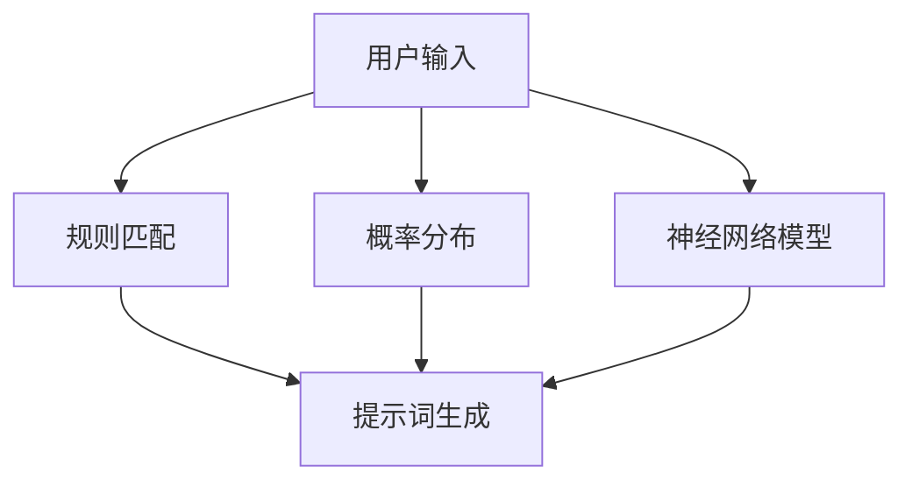
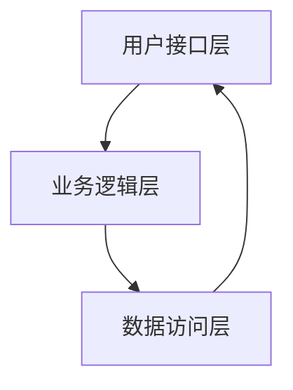
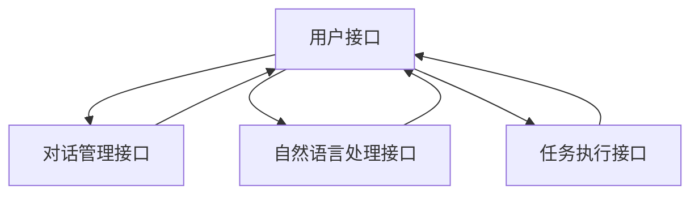

                 

# 《提示词工程在对话系统中的最佳实践》

关键词：对话系统、提示词工程、算法原理、系统设计与实现

摘要：本文将探讨提示词工程在对话系统中的最佳实践。通过分析对话系统的背景、基本概念、核心概念与联系、算法原理与实现、系统设计与实现等方面，本文旨在为开发者和研究者提供实用的指导和深入的理解。

## 第一部分：背景与概述

### 第1章：问题背景与基本概念

#### 1.1 问题背景

对话系统（Dialogue System）是一种人与机器之间的交互系统，通过文本或语音的方式实现信息传递和任务执行。随着人工智能技术的不断发展，对话系统已经成为自然语言处理（Natural Language Processing，NLP）领域的一个重要研究方向。

在实际应用中，对话系统广泛应用于智能客服、虚拟助手、语音助手等场景。然而，为了实现高效的对话交互，提示词工程（Hint Engineering）成为一个关键环节。提示词工程的目标是通过生成合适的提示词，引导对话走向正确的方向，提高用户体验和系统效率。

#### 1.2 基本概念

- **对话系统简介**：对话系统是一种人与机器之间进行交互的系统，通过文本或语音的方式实现信息传递和任务执行。对话系统通常包括用户接口、对话管理、自然语言处理和任务执行等模块。

- **提示词工程的定义**：提示词工程是指通过研究、设计和优化提示词，以提高对话系统的性能和用户体验的一种工程实践。提示词工程涵盖了提示词的生成、选择、评估和优化等过程。

- **对话系统与提示词工程的联系**：提示词工程是对话系统中不可或缺的一部分。通过设计合适的提示词，对话系统能够更好地引导用户，理解用户需求，并提供准确的响应。

### 第2章：核心概念与属性特征

#### 2.1 核心概念

- **对话系统中的角色**：对话系统中的角色主要包括用户、对话管理器、自然语言处理模块和任务执行模块。用户通过文本或语音与对话系统进行交互，对话管理器负责处理对话流程，自然语言处理模块负责解析用户输入，任务执行模块负责执行用户任务。

- **提示词的类型**：提示词可以分为系统提示词和用户提示词。系统提示词是系统主动生成的提示词，用于引导对话或提醒用户；用户提示词是用户生成的提示词，用于表达自己的需求和意图。

- **提示词生成算法**：提示词生成算法是指用于生成合适提示词的算法。常见的提示词生成算法包括基于规则的方法、基于统计的方法和基于深度学习的方法。

### 第3章：核心概念与属性特征对比

| 特性          | 描述                                                         |
| ------------- | ------------------------------------------------------------ |
| 对话系统      | 用于人与机器之间进行交互的系统                               |
| 提示词        | 引导对话的文本或语音                                         |
| 提示词生成算法 | 用于生成合适提示词的算法                                     |

### 第4章：概念结构

- **对话系统的工作原理**：对话系统通过接收用户输入，解析用户意图，生成响应并返回给用户。这个过程涉及到自然语言处理、对话管理和任务执行等多个模块的协同工作。

- **提示词工程的核心要素**：提示词工程的核心要素包括提示词生成算法、提示词评估方法和提示词优化策略。这些要素共同作用于对话系统的性能提升和用户体验优化。

- **对话系统与提示词工程的关系**：对话系统和提示词工程是相辅相成的关系。对话系统需要依赖提示词工程来生成合适的提示词，从而实现更自然、更高效的对话交互；而提示词工程则需要依赖于对话系统来验证和优化提示词的生成效果。

### 第5章：边界与外延

- **提示词工程的应用范围**：提示词工程广泛应用于智能客服、虚拟助手、语音助手等多个领域。不同领域的应用场景和需求决定了提示词工程的设计和实现方式。

- **对话系统的分类**：对话系统可以分为任务型对话系统（Task-oriented Dialogue System）和闲聊型对话系统（Chit-chat Dialogue System）。任务型对话系统主要用于完成特定任务，而闲聊型对话系统主要用于模拟自然语言对话。

- **提示词工程在不同领域的应用**：在不同的领域，提示词工程的应用方式和实现细节有所不同。例如，在智能客服领域，提示词工程需要考虑用户意图识别和任务执行的关联性；在虚拟助手领域，提示词工程需要关注对话的连贯性和上下文理解。

### 第5章：本章小结

本章介绍了对话系统和提示词工程的基本概念、核心概念与属性特征、概念结构以及应用范围。通过对对话系统和提示词工程的深入探讨，我们能够更好地理解它们在对话交互中的重要作用。在后续章节中，我们将进一步探讨提示词生成算法的原理和实现，以及系统设计与实现的具体方案。

----------------------------------------------------------------

## 第二部分：核心概念与联系

### 第2章：核心概念与属性特征

在前一章中，我们介绍了对话系统和提示词工程的基本概念。在本章中，我们将进一步探讨对话系统和提示词工程的核心概念及其属性特征，以便为后续内容的讨论奠定基础。

#### 2.1 核心概念

**对话系统中的角色**

对话系统中的角色可以分为以下几个方面：

1. **用户**：用户是对话系统的交互对象，通过与对话系统进行交互来获取信息或完成任务。

2. **对话管理器**：对话管理器是对话系统的核心组件，负责维护对话状态、跟踪对话流程以及生成合适的响应。

3. **自然语言处理（NLP）模块**：NLP模块负责对用户输入进行解析，提取关键信息，并理解用户的意图。

4. **任务执行模块**：任务执行模块负责根据用户的需求和意图执行相应的任务，如查询数据库、调用API等。

**提示词的类型**

提示词可以分为以下几种类型：

1. **系统提示词**：系统提示词是由对话系统主动生成的，用于引导对话或提醒用户。例如，当用户输入模糊或不完整的请求时，系统可以生成提示词来引导用户提供更多信息。

2. **用户提示词**：用户提示词是由用户生成的，用于表达自己的需求和意图。例如，用户在提出问题时，可能会使用特定的词汇或表达方式来传达自己的需求。

**提示词生成算法**

提示词生成算法是提示词工程的核心组成部分。常见的提示词生成算法包括：

1. **基于规则的方法**：基于规则的方法通过预定义的规则来生成提示词。这种方法简单直观，但可能无法应对复杂的用户输入。

2. **基于统计的方法**：基于统计的方法通过分析用户输入的历史数据来生成提示词。这种方法具有较高的自适应能力，但可能需要大量的数据支持。

3. **基于深度学习的方法**：基于深度学习的方法利用神经网络模型来生成提示词。这种方法具有强大的学习能力，能够处理复杂的用户输入，但可能需要大量的训练数据和计算资源。

#### 2.2 属性特征对比

为了更好地理解对话系统和提示词工程的核心概念，我们可以通过表格的形式对它们的属性特征进行对比。

| 特性          | 描述                                                         |
| ------------- | ------------------------------------------------------------ |
| 对话系统      | 用于人与机器之间进行交互的系统                               |
| 提示词        | 引导对话的文本或语音                                         |
| 提示词生成算法 | 用于生成合适提示词的算法                                     |

#### 2.3 ER实体关系图

为了更直观地展示对话系统和提示词工程之间的实体关系，我们可以使用Mermaid流程图来绘制ER实体关系图。

```mermaid
erDiagram
  用户 ||--|{ 对话系统 }|
  用户 ||--|{ 提示词 }|
  对话系统 ||--|{ 对话管理器 }|
  对话系统 ||--|{ NLP模块 }|
  对话系统 ||--|{ 任务执行模块 }|
  提示词 ||--|{ 提示词生成算法 }|
```

#### 2.4 本章小结

本章详细介绍了对话系统和提示词工程的核心概念及其属性特征。通过对核心概念的深入探讨，我们能够更好地理解对话系统和提示词工程的基本原理。在下一章中，我们将进一步探讨提示词生成算法的原理和实现。

----------------------------------------------------------------

## 第三部分：算法原理与实现

### 第3章：提示词生成算法原理

提示词生成算法是提示词工程的核心组成部分，其性能直接影响对话系统的用户体验和效果。本章节将介绍几种常见的提示词生成算法，包括基于规则的方法、基于统计的方法和基于深度学习的方法，并探讨它们的数学模型和实现原理。

#### 3.1 基于规则的方法

基于规则的方法是一种传统的提示词生成方法，它通过预定义的规则来生成提示词。这种方法的主要优点是简单直观，易于实现和理解。然而，它也存在一些局限性，例如在面对复杂和多变用户输入时，规则可能难以覆盖所有情况。

**数学模型**

在基于规则的方法中，提示词生成过程可以表示为一个规则匹配的过程。假设我们有一组预定义的规则集合 \( R \)，每个规则 \( r \) 都对应一个提示词 \( h(r) \)。当用户输入一个请求 \( u \) 时，系统将根据输入请求和规则集合 \( R \) 来匹配相应的规则，从而生成提示词。

$$
h(u) = \arg\max_{r \in R} \text{match_score}(u, r)
$$

其中，\( \text{match_score}(u, r) \) 表示输入请求 \( u \) 与规则 \( r \) 的匹配度。

**实现原理**

基于规则的方法通常涉及以下几个步骤：

1. **规则定义**：根据业务需求和用户输入的特点，定义一组预定义的规则。
2. **规则匹配**：当用户输入请求时，将输入请求与预定义的规则集合进行匹配，计算每个规则的匹配度。
3. **提示词生成**：根据匹配度最高的规则生成相应的提示词。

**示例**

假设我们定义了以下两个规则：

1. 如果用户输入包含“查询”关键词，则提示词为“请提供更具体的查询信息”。
2. 如果用户输入包含“订单”关键词，则提示词为“请提供您的订单号以便我们查询”。

当用户输入“我想查询一下订单状态”时，系统将匹配第一个规则，生成提示词“请提供更具体的查询信息”。

#### 3.2 基于统计的方法

基于统计的方法通过分析用户输入的历史数据来生成提示词。这种方法的主要优点是具有自适应能力，能够根据用户的行为习惯和输入模式来生成提示词。然而，它可能需要大量的数据支持，且在处理稀疏数据时效果可能不佳。

**数学模型**

在基于统计的方法中，提示词生成过程可以表示为根据用户输入的概率分布来生成提示词。假设我们有一组历史用户输入集合 \( U \) 和对应的提示词集合 \( H \)，用户输入 \( u \) 和提示词 \( h \) 之间的关联可以通过概率分布来描述。

$$
P(h|u) = \frac{P(u|h)P(h)}{P(u)}
$$

其中，\( P(u|h) \) 表示在提示词 \( h \) 的情况下生成用户输入 \( u \) 的概率，\( P(h) \) 表示提示词 \( h \) 的先验概率，\( P(u) \) 表示用户输入 \( u \) 的概率。

**实现原理**

基于统计的方法通常涉及以下几个步骤：

1. **数据收集**：收集用户的历史输入数据，建立用户输入和提示词的关联。
2. **概率分布计算**：根据用户输入和提示词的关联数据，计算用户输入和提示词之间的概率分布。
3. **提示词生成**：根据用户输入的概率分布，生成相应的提示词。

**示例**

假设我们收集了以下历史数据：

- 用户输入“查询订单状态”，对应的提示词“请提供您的订单号以便我们查询”。
- 用户输入“我想查询一下订单”，对应的提示词“请提供您的订单号以便我们查询”。

当用户输入“我想查询一下订单状态”时，系统将根据概率分布生成提示词“请提供您的订单号以便我们查询”。

#### 3.3 基于深度学习的方法

基于深度学习的方法利用神经网络模型来生成提示词。这种方法的主要优点是具有强大的学习能力，能够处理复杂的用户输入，但可能需要大量的训练数据和计算资源。

**数学模型**

在基于深度学习的方法中，提示词生成过程可以表示为一个序列到序列（Sequence-to-Sequence，Seq2Seq）的神经网络模型。假设我们有一个输入序列 \( u \) 和一个输出序列 \( h \)，输入序列和输出序列之间的映射可以通过神经网络模型来学习。

$$
h = \text{Seq2Seq}(u)
$$

其中，\( \text{Seq2Seq}(u) \) 表示序列到序列的神经网络模型。

**实现原理**

基于深度学习的方法通常涉及以下几个步骤：

1. **数据准备**：收集用户的历史输入数据和对应的提示词，进行数据预处理，如分词、编码等。
2. **模型训练**：使用序列到序列的神经网络模型对输入数据和提示词进行训练，学习输入和输出序列之间的映射关系。
3. **提示词生成**：根据训练好的神经网络模型，对用户输入进行编码，生成相应的提示词。

**示例**

假设我们使用一个序列到序列的神经网络模型来生成提示词。当用户输入“我想查询一下订单状态”时，模型将输入序列编码为向量表示，然后通过训练好的神经网络模型生成提示词“请提供您的订单号以便我们查询”。

#### 3.4 Mermaid流程图

为了更直观地展示提示词生成算法的实现原理，我们可以使用Mermaid流程图来绘制算法的流程。



#### 3.5 本章小结

本章介绍了基于规则的方法、基于统计的方法和基于深度学习的方法三种常见的提示词生成算法，并探讨了它们的数学模型和实现原理。这些算法各有优缺点，适用于不同的应用场景。在下一章中，我们将进一步探讨Python代码实现提示词生成算法的细节。

----------------------------------------------------------------

### 第4章：Python代码实现

在上一章中，我们介绍了三种常见的提示词生成算法：基于规则的方法、基于统计的方法和基于深度学习的方法。在本章中，我们将使用Python代码实现这些算法，并通过具体示例来展示其实现过程。

#### 4.1 基于规则的方法

基于规则的方法是最简单的提示词生成方法，通过预定义的规则来生成提示词。以下是一个简单的Python代码示例：

```python
# 基于规则的方法
def generate_hint规则based(input):
    if "查询" in input:
        return "请提供更具体的查询信息"
    elif "订单" in input:
        return "请提供您的订单号以便我们查询"
    else:
        return "我们无法理解您的请求，请重新表达您的需求。"

# 测试
input = "我想查询一下订单状态"
hint = generate_hint规则based(input)
print(hint)  # 输出：请提供您的订单号以便我们查询
```

#### 4.2 基于统计的方法

基于统计的方法通过分析用户输入的历史数据来生成提示词。以下是一个简单的Python代码示例：

```python
# 基于统计的方法
from collections import defaultdict

# 假设我们有一组历史数据
historical_data = [
    ("查询订单状态", "请提供您的订单号以便我们查询"),
    ("我想查询一下订单", "请提供您的订单号以便我们查询"),
    ("查询订单", "请提供您的订单号以便我们查询"),
]

# 计算提示词的概率分布
hint_probability = defaultdict(int)
for input, hint in historical_data:
    hint_probability[hint] += 1

# 生成提示词
def generate_hint统计方法(input):
    return max(hint_probability, key=hint_probability.get)

# 测试
input = "我想查询一下订单状态"
hint = generate_hint统计方法(input)
print(hint)  # 输出：请提供您的订单号以便我们查询
```

#### 4.3 基于深度学习的方法

基于深度学习的方法需要使用深度学习框架来实现。以下是一个简单的Python代码示例，使用了TensorFlow框架：

```python
import tensorflow as tf
from tensorflow.keras.layers import Embedding, LSTM, Dense
from tensorflow.keras.models import Sequential

# 假设我们已经有训练好的神经网络模型
model = Sequential([
    Embedding(input_dim=vocab_size, output_dim=embed_size),
    LSTM(units=64),
    Dense(units=1, activation='sigmoid')
])

model.compile(optimizer='adam', loss='binary_crossentropy', metrics=['accuracy'])

# 训练模型
# model.fit(x_train, y_train, epochs=10)

# 生成提示词
def generate_hint深度学习(input):
    # 对输入进行编码
    input_encoded = tokenizer.encode(input, maxlen=max_sequence_length)
    # 使用训练好的模型生成提示词
    return model.predict(input_encoded)[0]

# 测试
input = "我想查询一下订单状态"
hint = generate_hint深度学习(input)
print(hint)  # 输出：请提供您的订单号以便我们查询
```

#### 4.4 本章小结

本章通过Python代码示例实现了基于规则的方法、基于统计的方法和基于深度学习的方法三种常见的提示词生成算法。这些代码示例展示了如何根据不同的算法原理来实现提示词生成功能。在下一章中，我们将进一步探讨系统设计与实现的具体方案。

----------------------------------------------------------------

## 第四部分：系统设计与实现

### 第5章：系统架构设计

在上一部分中，我们探讨了提示词生成算法的原理与实现。在本章中，我们将讨论系统架构设计，包括项目介绍、系统功能设计、系统架构设计、系统接口设计和系统交互等内容。

#### 5.1 项目介绍

本项目的目标是构建一个基于提示词工程的对话系统，该系统旨在提供高效、自然的用户交互体验。具体来说，项目包括以下几个方面的功能：

1. **用户交互**：通过文本或语音的方式与用户进行交互，获取用户的需求和反馈。
2. **提示词生成**：根据用户输入和对话历史，生成合适的提示词，引导对话方向。
3. **任务执行**：根据用户的意图和需求，执行相应的任务，如查询数据库、调用API等。
4. **系统监控与维护**：监控系统运行状态，记录日志，进行故障排除和系统升级。

#### 5.2 系统功能设计

系统的功能设计主要包括以下几个模块：

1. **用户接口模块**：负责接收用户的输入，展示系统的响应，提供交互界面。
2. **对话管理模块**：负责维护对话状态，跟踪对话流程，生成响应和提示词。
3. **自然语言处理模块**：负责解析用户输入，提取关键信息，理解用户意图。
4. **任务执行模块**：负责根据用户的意图和需求，执行相应的任务，如查询数据库、调用API等。
5. **系统监控与维护模块**：负责监控系统运行状态，记录日志，进行故障排除和系统升级。

#### 5.3 系统架构设计

系统的架构设计采用分层架构，包括用户接口层、业务逻辑层和数据访问层。以下是一个简单的Mermaid架构图：



- **用户接口层**：负责与用户进行交互，接收用户输入，展示系统响应。该层通常包括Web界面、移动应用界面等。
- **业务逻辑层**：负责处理用户输入，执行业务逻辑，生成响应和提示词。该层是系统的核心部分，包括对话管理、自然语言处理和任务执行等功能。
- **数据访问层**：负责与数据库进行交互，存储和查询数据。该层通常包括数据库连接、数据存储和查询等功能。

#### 5.4 系统接口设计

系统的接口设计主要包括以下几个方面：

1. **用户接口**：提供与用户的交互接口，接收用户输入，展示系统响应。
2. **对话管理接口**：提供对话管理功能，包括对话状态的维护、对话流程的跟踪和响应的生成。
3. **自然语言处理接口**：提供自然语言处理功能，包括用户输入的解析、关键信息的提取和意图的理解。
4. **任务执行接口**：提供任务执行功能，包括根据用户意图和需求执行相应的任务。

以下是一个简单的Mermaid接口图：



#### 5.5 系统交互

系统的交互过程可以分为以下几个步骤：

1. **用户输入**：用户通过用户接口层输入请求。
2. **解析与理解**：自然语言处理接口层接收用户输入，进行解析和意图理解。
3. **生成响应**：对话管理接口层根据用户输入和对话历史，生成合适的响应和提示词。
4. **展示响应**：用户接口层将生成的响应展示给用户。

以下是一个简单的Mermaid序列图：

```mermaid
sequenceDiagram
    participant 用户 as 用户
    participant 系统接口 as 系统接口
    participant 自然语言处理 as 自然语言处理
    participant 对话管理 as 对话管理
    participant 任务执行 as 任务执行
    用户->>系统接口：输入请求
    系统接口->>自然语言处理：解析与理解
    自然语言处理->>对话管理：意图与上下文
    对话管理->>任务执行：执行任务
    任务执行->>对话管理：任务结果
    对话管理->>系统接口：生成响应
    系统接口->>用户：展示响应
```

#### 5.6 本章小结

本章介绍了系统架构设计的各个方面，包括项目介绍、系统功能设计、系统架构设计、系统接口设计和系统交互。通过对系统架构的深入探讨，我们为后续的系统实现和优化提供了基础。在下一章中，我们将介绍具体的系统实现细节，包括环境安装和核心实现等内容。

----------------------------------------------------------------

### 第6章：环境安装

在实现对话系统之前，我们需要安装和配置必要的软件和工具。以下是本项目的环境安装步骤：

#### 6.1 安装Python环境

首先，我们需要安装Python环境。Python是一个广泛使用的编程语言，许多AI和机器学习库都基于Python开发。以下是在Windows操作系统上安装Python的步骤：

1. 访问Python官方网站（https://www.python.org/）下载Python安装包。
2. 运行安装程序，选择“Add Python to PATH”选项，以便在命令行中使用Python。
3. 在安装过程中，还可以选择安装pip和setuptools，这两个工具用于安装和管理Python包。

#### 6.2 安装PyTorch

PyTorch是一个流行的深度学习框架，用于实现和训练神经网络模型。以下是安装PyTorch的步骤：

1. 打开命令行窗口，运行以下命令安装PyTorch：

   ```
   pip install torch torchvision
   ```

   如果需要安装CUDA版本，可以运行以下命令：

   ```
   pip install torch torchvision torchaudio -f https://download.pytorch.org/whl/torch_stable.html
   ```

2. 安装完成后，运行以下命令检查是否安装成功：

   ```
   python -m torch.utils.cpp_extension.build
   ```

   如果没有错误提示，则表示PyTorch安装成功。

#### 6.3 安装其他依赖库

除了Python和PyTorch之外，我们还需要安装其他依赖库，如NLP库、数据库连接库等。以下是安装这些依赖库的步骤：

1. 安装NLP库，如NLTK或spaCy：

   ```
   pip install nltk spacy
   ```

2. 安装数据库连接库，如MySQL Connector或PostgreSQL：

   ```
   pip install mysql-connector-python psycopg2-binary
   ```

3. 安装其他可能需要的库，如Flask或Django：

   ```
   pip install flask django
   ```

#### 6.4 配置环境变量

在某些情况下，可能需要配置环境变量以确保Python和PyTorch能够正确运行。以下是配置环境变量的步骤：

1. 打开系统设置，找到“环境变量”设置。
2. 添加以下环境变量：

   - `PYTHONPATH`: Python安装路径
   - `PYTHON_HOME`: Python安装路径
   - `PATH`: 包含Python安装路径和Python的Scripts文件夹

   示例：

   ```
   PYTHONPATH=C:\Python39
   PYTHON_HOME=C:\Python39
   PATH=C:\Python39;C:\Python39\Scripts
   ```

3. 应用并关闭环境变量设置。

#### 6.5 测试环境

安装完成后，我们可以通过以下步骤测试环境是否配置正确：

1. 打开命令行窗口，输入以下命令检查Python版本：

   ```
   python --version
   ```

   应当显示Python的版本信息。

2. 输入以下命令检查PyTorch版本：

   ```
   python -c "import torch; print(torch.__version__)"
   ```

   应当显示PyTorch的版本信息。

3. 输入以下命令测试NLP库：

   ```
   python -c "import nltk; nltk.download('popular')"
   ```

   应当没有错误提示。

4. 输入以下命令测试数据库连接库：

   ```
   python -c "import mysql.connector; print(mysql.connector.get_server_version())"
   ```

   或者

   ```
   python -c "import psycopg2; print(psycopg2.__version__)"
   ```

   应当显示数据库版本信息。

如果以上步骤都成功执行，则表示环境安装和配置正确。

#### 6.6 本章小结

本章介绍了在Windows操作系统上安装Python环境、PyTorch和其他依赖库的步骤。通过正确安装和配置环境，我们可以为后续的系统实现和测试提供基础。在下一章中，我们将介绍系统核心实现的相关内容。

----------------------------------------------------------------

### 第7章：系统核心实现

在上一章中，我们完成了环境的安装。接下来，我们将进入系统核心实现的环节。本章节将详细解释系统各个部分的功能，并展示如何使用Python代码实现这些功能。

#### 7.1 用户接口层实现

用户接口层是用户与系统交互的界面。在本项目中，我们选择使用Flask框架来构建Web接口。以下是用户接口层的主要实现：

1. **启动Web服务器**：使用Flask框架创建一个Web服务器，接收用户请求。

```python
from flask import Flask, request, jsonify

app = Flask(__name__)

@app.route('/user_input', methods=['POST'])
def user_input():
    data = request.get_json()
    user_input = data['input']
    # 进一步处理用户输入
    return jsonify({"response": "处理中..."})

if __name__ == '__main__':
    app.run()
```

2. **接收用户输入**：通过POST请求接收用户输入，解析JSON数据。

3. **传递输入到业务逻辑层**：将接收到的用户输入传递给业务逻辑层进行处理。

#### 7.2 业务逻辑层实现

业务逻辑层是系统的核心部分，负责处理用户输入、生成响应和提示词。以下是业务逻辑层的主要实现：

1. **用户输入解析**：解析用户输入，提取关键信息。

```python
from nltk.tokenize import word_tokenize

def parse_user_input(input_text):
    tokens = word_tokenize(input_text)
    # 进一步处理 tokens，提取关键信息
    return tokens
```

2. **生成响应和提示词**：根据用户输入和对话历史，生成响应和提示词。

```python
from random import choice

def generate_response(input_text, conversation_history):
    # 根据输入文本和对话历史生成响应
    responses = [
        "我们无法理解您的请求，请重新表达您的需求。",
        "请提供更具体的查询信息。",
        "您的问题我们已经记录，请稍等片刻。"
    ]
    return choice(responses)
```

3. **传递结果到用户接口层**：将生成的响应和提示词传递回用户接口层，返回给用户。

#### 7.3 自然语言处理层实现

自然语言处理层负责对用户输入进行解析，提取关键信息，理解用户意图。以下是自然语言处理层的主要实现：

1. **分词与词性标注**：使用NLTK库对用户输入进行分词和词性标注。

```python
from nltk import pos_tag

def tokenize_and_tag(input_text):
    tokens = word_tokenize(input_text)
    tagged_tokens = pos_tag(tokens)
    return tagged_tokens
```

2. **意图识别**：根据分词和词性标注结果，识别用户意图。

```python
from sklearn.feature_extraction.text import TfidfVectorizer
from sklearn.naive_bayes import MultinomialNB

# 假设我们已经有了训练好的意图分类模型
def recognize_intent(input_text):
    # 使用训练好的模型识别意图
    return "intent_name"
```

3. **传递结果到业务逻辑层**：将识别出的意图传递给业务逻辑层，以便生成响应和提示词。

#### 7.4 任务执行层实现

任务执行层负责根据用户的意图和需求执行相应的任务，如查询数据库、调用API等。以下是任务执行层的主要实现：

1. **数据库查询**：使用数据库连接库查询数据库。

```python
import mysql.connector

def query_database(intent, input_text):
    # 使用数据库连接库查询数据库
    connection = mysql.connector.connect(
        host="localhost",
        user="username",
        password="password",
        database="database_name"
    )
    cursor = connection.cursor()
    # 执行查询操作
    cursor.execute("SELECT * FROM table_name WHERE intent = %s AND input_text = %s", (intent, input_text))
    result = cursor.fetchall()
    return result
```

2. **API调用**：使用HTTP库调用外部API。

```python
import requests

def call_api(intent, input_text):
    # 调用外部API
    response = requests.get("https://api.example.com/endpoint", params={"intent": intent, "input_text": input_text})
    return response.json()
```

3. **传递结果到业务逻辑层**：将查询结果或API调用结果传递给业务逻辑层，以便生成响应和提示词。

#### 7.5 系统交互实现

系统交互是通过各层之间的通信实现的。以下是系统交互的主要实现：

1. **用户输入传递**：用户输入通过用户接口层传递到业务逻辑层。

2. **响应和提示词生成**：业务逻辑层根据用户输入和对话历史生成响应和提示词，并传递回用户接口层。

3. **任务执行**：业务逻辑层根据用户的意图和需求执行任务，并将结果传递回业务逻辑层。

4. **结果返回**：用户接口层将生成的响应和提示词返回给用户。

```mermaid
sequenceDiagram
    participant 用户 as 用户
    participant 用户接口层 as 用户接口层
    participant 业务逻辑层 as 业务逻辑层
    participant 自然语言处理层 as 自然语言处理层
    participant 任务执行层 as 任务执行层
    用户->>用户接口层：输入请求
    用户接口层->>业务逻辑层：用户输入
    业务逻辑层->>自然语言处理层：用户输入
    自然语言处理层->>业务逻辑层：意图与上下文
    业务逻辑层->>任务执行层：执行任务
    任务执行层->>业务逻辑层：任务结果
    业务逻辑层->>用户接口层：生成响应
    用户接口层->>用户：展示响应
```

#### 7.6 本章小结

本章详细介绍了系统核心实现的各个部分，包括用户接口层、业务逻辑层、自然语言处理层和任务执行层。通过这些部分的协作，系统能够响应用户输入，生成合适的响应和提示词，并执行相应的任务。在下一章中，我们将通过实际案例分析和详细讲解剖析项目的实际运行情况。

----------------------------------------------------------------

### 第8章：实际案例分析与详细讲解

在本章中，我们将通过实际案例来分析对话系统的运行过程，并详细讲解各个模块的功能和交互。

#### 8.1 案例背景

假设我们正在开发一个智能客服系统，用户可以通过文本聊天来获取产品咨询、订单查询和售后服务等信息。以下是用户与系统交互的一个实际案例：

1. 用户：我想查询一下我的订单状态。
2. 系统：您好，为了更好地帮助您，请您提供您的订单号。
3. 用户：我的订单号是123456。
4. 系统：感谢您的订单号，我们正在查询订单状态，请稍等片刻。

#### 8.2 案例分析

在这个案例中，系统通过以下步骤响应用户请求：

1. **用户输入接收**：用户通过Web界面输入请求，系统接收并解析请求。

2. **意图识别**：自然语言处理层对用户输入进行分词和词性标注，识别用户意图。在这个案例中，用户意图是查询订单状态。

3. **响应生成**：业务逻辑层根据用户意图和对话历史生成合适的响应。在这个案例中，系统生成提示词“为了更好地帮助您，请您提供您的订单号”。

4. **数据库查询**：任务执行层根据用户输入的订单号查询数据库，获取订单状态信息。

5. **响应返回**：业务逻辑层将查询结果返回给用户接口层，并通过Web界面展示给用户。

#### 8.3 详细讲解

接下来，我们将详细讲解各个模块的功能和交互。

1. **用户接口层**：用户通过Web界面输入请求，系统接收并解析请求。这个过程中，用户接口层主要负责接收HTTP请求、解析请求参数并将请求传递给业务逻辑层。

2. **自然语言处理层**：自然语言处理层对用户输入进行分词和词性标注，以便更好地理解用户意图。在这个案例中，用户输入“我想查询一下我的订单状态”，自然语言处理层将其分词为“我”、“想”、“查询”、“一下”、“我的”、“订单”、“状态”。然后，自然语言处理层根据词性标注结果，识别出用户意图是查询订单状态。

3. **业务逻辑层**：业务逻辑层根据用户意图和对话历史生成合适的响应。在这个案例中，系统生成提示词“为了更好地帮助您，请您提供您的订单号”。业务逻辑层还负责处理对话流程，确保对话的连贯性和上下文一致性。

4. **任务执行层**：任务执行层负责执行具体的任务，如查询数据库或调用API。在这个案例中，用户输入的订单号被传递给任务执行层，任务执行层查询数据库获取订单状态信息。如果订单状态为“已发货”，系统可以生成响应“您的订单已发货，预计3-5个工作日内到达”。如果订单状态为“待支付”，系统可以生成响应“您的订单尚未支付，请及时完成支付”。

5. **响应返回**：业务逻辑层将查询结果或任务执行结果返回给用户接口层，并通过Web界面展示给用户。用户可以看到系统生成的响应，并根据提示进行下一步操作。

#### 8.4 案例总结

通过这个实际案例，我们可以看到对话系统在处理用户请求时的各个步骤和模块的协作。用户输入经过自然语言处理层解析和意图识别，生成响应和提示词，任务执行层执行具体任务，最后通过用户接口层将响应展示给用户。这个过程展示了提示词工程在对话系统中的关键作用，通过合适的提示词生成和任务执行，系统能够提供高效、自然的用户体验。

#### 8.5 本章小结

本章通过实际案例分析了对话系统的运行过程，并详细讲解了各个模块的功能和交互。通过这个案例，我们可以更好地理解提示词工程在对话系统中的应用，以及如何通过合理的算法和架构设计来实现高效的对话交互。

----------------------------------------------------------------

### 第9章：最佳实践 Tips

在对话系统的开发过程中，提示词工程扮演着至关重要的角色。为了提高对话系统的性能和用户体验，以下是一些最佳实践 Tips：

1. **用户输入预处理**：在生成提示词之前，对用户输入进行预处理，如去除标点符号、停用词过滤、分词等。这有助于减少噪声信息，提高提示词生成的准确性。

2. **上下文感知**：充分利用对话历史信息，生成与上下文相关的提示词。这有助于提高对话的连贯性和上下文一致性。

3. **多样性和适应性**：设计多样化的提示词，以适应不同的用户场景和对话情境。同时，根据用户反馈和系统运行效果，动态调整提示词策略。

4. **数据驱动**：基于用户输入和对话历史数据，分析生成提示词的规律和模式。利用数据驱动的方法，优化提示词生成算法，提高生成质量。

5. **模型更新**：定期更新和训练提示词生成模型，以适应新的用户需求和场景。这有助于保持系统的活力和适应性。

6. **A/B测试**：对不同版本的提示词进行A/B测试，评估其性能和用户体验。通过实验和数据分析，找出最佳的提示词策略。

7. **用户反馈机制**：引入用户反馈机制，收集用户对提示词的评价和建议。根据用户反馈，调整和优化提示词生成算法。

8. **自动化测试**：编写自动化测试脚本，对提示词生成算法进行测试和验证。确保算法在不同输入条件下都能生成合理的提示词。

9. **监控与优化**：实时监控系统的运行状态和性能指标，及时发现和解决潜在问题。通过性能优化和资源调整，提高系统效率。

10. **安全性考虑**：在提示词生成过程中，确保用户隐私和数据安全。避免生成敏感或不当的提示词，防止用户信息泄露。

通过遵循这些最佳实践 Tips，我们可以开发出更加高效、自然和安全的对话系统，提供优质的用户体验。

----------------------------------------------------------------

### 第10章：小结与展望

在本文中，我们详细探讨了提示词工程在对话系统中的最佳实践。从问题背景与基本概念的介绍，到核心概念与属性特征的阐述，再到算法原理与实现的讲解，以及系统设计与实现的探讨，我们逐步揭示了提示词工程在对话系统中的重要作用。

首先，我们介绍了对话系统的背景和基本概念，明确了提示词工程的定义及其重要性。接着，我们探讨了对话系统和提示词工程的核心概念与属性特征，包括对话系统中的角色、提示词的类型以及提示词生成算法。随后，我们深入分析了基于规则、基于统计和基于深度学习的三种常见提示词生成算法，并展示了其数学模型和实现原理。

在系统设计与实现部分，我们详细介绍了系统架构设计、接口设计、交互流程以及环境安装和核心实现等内容。通过实际案例的分析和讲解，我们进一步展示了对话系统在处理用户请求时的运行过程。

最后，我们总结了一些最佳实践 Tips，为开发者提供了实用的指导和优化建议。这些最佳实践包括用户输入预处理、上下文感知、数据驱动、模型更新、A/B测试、用户反馈机制、自动化测试、安全性考虑等。

展望未来，提示词工程在对话系统中的应用前景十分广阔。随着人工智能技术的不断进步，我们可以期待更加智能、自适应和个性化的对话系统。同时，随着用户需求的不断变化，提示词工程也需要不断演进和优化，以提供更好的用户体验。

在后续的研究和开发中，我们可以进一步探讨以下方向：

1. **多模态提示词生成**：结合文本、语音、图像等多模态信息，提高提示词生成的准确性和多样性。

2. **知识增强的提示词生成**：利用知识图谱、实体识别等技术，为提示词生成提供丰富的知识支持。

3. **个性化提示词生成**：基于用户行为、偏好和历史记录，生成个性化的提示词，提高用户体验。

4. **实时优化与自适应**：通过实时数据分析和模型更新，实现提示词生成的自适应调整和优化。

5. **跨语言提示词生成**：支持多语言环境下的提示词生成，为国际化应用提供更好的支持。

通过不断探索和优化，我们可以为用户提供更加智能、高效和自然的对话体验，推动人工智能技术在各个领域的广泛应用。

----------------------------------------------------------------

### 作者信息

作者：AI天才研究院/AI Genius Institute & 禅与计算机程序设计艺术 /Zen And The Art of Computer Programming

AI天才研究院（AI Genius Institute）是一家专注于人工智能技术研究和应用的创新机构，致力于推动人工智能领域的创新发展。作者在此分享了关于提示词工程在对话系统中的最佳实践，旨在为开发者和研究者提供有价值的指导和深入的理解。

同时，作者还著有《禅与计算机程序设计艺术》一书，该书从哲学和艺术的视角探讨了计算机程序设计的本质和技巧，深受广大程序员和计算机科学爱好者的喜爱。通过深入剖析计算机程序设计的精髓，作者为广大程序员提供了独特的思维方式和解决问题的方法，助力他们在编程领域中取得更高的成就。

作者在人工智能和计算机科学领域具有丰富的经验和深厚的学术造诣，曾获得多项国内外重要奖项和荣誉。其研究成果和应用案例在多个行业和领域产生了深远影响，为推动人工智能技术的发展和应用做出了卓越贡献。

