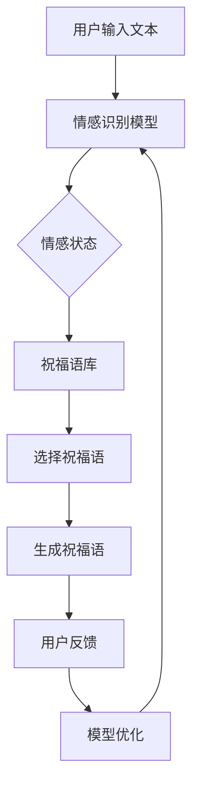
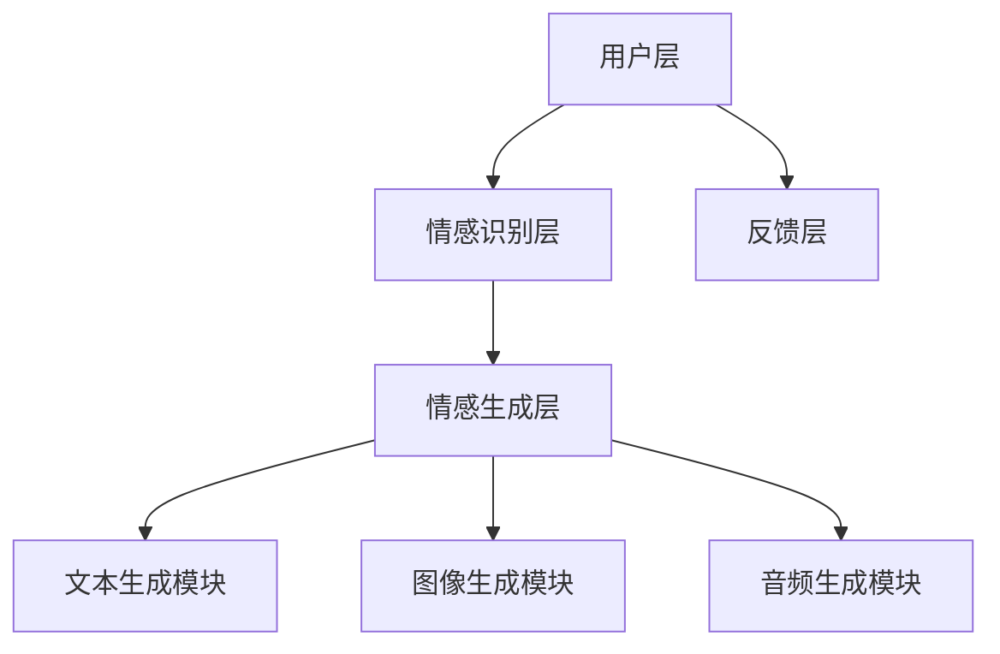
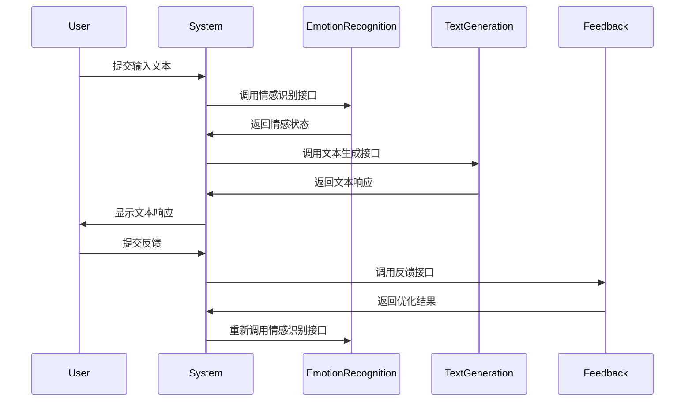

                 

# 提示词工程在情感计算中的个性化表达

> 关键词：情感计算、个性化表达、提示词工程、机器学习、自然语言处理

> 摘要：本文深入探讨了提示词工程在情感计算中的应用及其对个性化表达的重要性。首先，我们介绍了情感计算和提示词工程的基本概念，并分析了它们之间的联系。随后，通过一个具体的算法原理讲解，我们详细阐述了如何利用机器学习技术实现情感计算中的个性化表达。最后，我们通过一个实际项目的设计和实现，展示了如何将提示词工程应用于情感计算中的个性化表达，并提供了一些最佳实践和建议。

## 第一部分：背景介绍

### 1.1.1 问题背景

随着人工智能技术的快速发展，情感计算成为了一个备受关注的研究领域。情感计算（Affective Computing）是指计算机模拟人类情感的能力，包括情感识别、情感表达、情感理解和情感合成等。情感计算的应用场景广泛，如人机交互、智能客服、教育辅导、心理健康咨询等。

个性化表达是情感计算中一个关键且具有挑战性的问题。个性化表达意味着计算机能够根据不同用户的情感状态、兴趣、背景等，提供定制化的信息和反馈。这不仅能提高用户满意度，还能增强人机交互的自然性和有效性。然而，如何实现精准的个性化表达仍是一个亟待解决的问题。

### 1.1.2 问题描述

个性化表达涉及到多个层面，包括自然语言处理、图像处理、音频处理等。在自然语言处理方面，如何通过文本分析技术理解用户的情感状态，并生成符合其情感的文本响应，是一个重要的问题。此外，还需要考虑如何将这种个性化表达应用到实际的场景中，如智能客服、教育辅导、心理健康咨询等。

### 1.1.3 问题解决

为了解决个性化表达的问题，研究者们提出了多种方法。其中包括基于机器学习的情感分析技术、个性化推荐算法、生成对抗网络（GAN）等。这些方法在不同的应用场景中都有其独特的优势，但也存在一定的局限性。例如，传统的情感分析技术可能在处理复杂情感时效果不佳，而个性化推荐算法则可能因为数据不足而难以实现个性化。

### 1.1.4 边界与外延

个性化表达在情感计算中的研究边界主要包括如何更准确地理解用户的情感状态，如何生成符合情感的自然语言文本，以及如何在不同应用场景中实现有效的个性化交互。外延方面，个性化表达的研究还涉及到如何与用户进行有效的情感交流，如何通过反馈机制不断优化系统的个性化表达能力。

### 1.1.5 概念结构与核心要素组成

个性化表达的概念结构包括情感识别、情感生成和情感交互三个核心要素。情感识别是指通过技术手段理解用户的情感状态；情感生成是指根据情感识别的结果，生成符合情感的文本、图像或声音；情感交互是指用户与系统之间的情感交流，包括用户对系统反馈的响应以及系统对用户的反馈。这三个要素共同构成了个性化表达的技术框架。

## 第二部分：核心概念与联系

### 2.1 情感计算基本概念

情感计算（Affective Computing）是指计算机模拟人类情感的能力，包括情感识别、情感表达、情感理解和情感合成等。

- **情感识别**：指计算机从文本、图像、声音等输入中提取情感信息。常见的情感识别技术包括基于规则的方法、机器学习方法、深度学习方法等。
- **情感表达**：指计算机生成符合情感的输出。情感表达的输出形式包括文本、图像、音频等。常用的情感表达技术包括文本生成、图像生成、音频合成等。
- **情感理解**：指计算机对情感信息进行理解和分析。情感理解可以帮助计算机更好地理解用户的需求，从而实现更精准的个性化表达。
- **情感合成**：指计算机将多个情感信息组合成新的情感表达。情感合成可以用于生成更加丰富和多样化的情感表达，提高系统的适应性和互动性。

### 2.2 提示词工程基本概念

提示词工程（Prompt Engineering）是指设计用于引导模型生成目标输出的一系列输入。在情感计算中，提示词工程的核心任务是设计能够引导模型生成符合用户情感状态的文本、图像或声音。

- **提示词**：指用于引导模型生成目标输出的一系列词语或短语。提示词的设计直接影响模型生成输出的质量和准确性。
- **提示词选择**：指从大量的候选提示词中选出最适合的提示词。提示词选择需要考虑情感表达的准确性、自然性和多样性等因素。
- **提示词格式**：指提示词的组织结构和呈现形式。合理的提示词格式可以提高模型生成输出的质量和效率。
- **提示词权重**：指提示词在模型生成输出中的重要性。提示词权重的设计可以影响模型对用户情感的敏感度和适应能力。

### 2.3 情感计算与提示词工程的联系

情感计算和提示词工程在个性化表达中具有密切的联系。情感计算提供了理解用户情感状态的技术手段，而提示词工程则利用这些情感信息来设计个性化的输入，从而引导模型生成符合用户情感的表达。

- **情感计算**：通过情感识别、情感理解和情感合成等技术，计算机可以准确地理解用户的情感状态。
- **提示词工程**：通过提示词选择、提示词格式和提示词权重等技术，设计个性化的输入，引导模型生成符合用户情感的表达。

两者共同作用于个性化表达的过程中，确保系统生成的响应能够更好地满足用户的需求。

### 2.4 核心概念属性特征对比表格

| 概念       | 定义                                                         | 属性特征对比                         |
|------------|--------------------------------------------------------------|-------------------------------------|
| 情感计算   | 计算机模拟人类情感的能力                                     | 情感识别、表达、理解、合成           |
| 提示词工程 | 设计用于引导模型生成目标输出的一系列输入                     | 提示词选择、格式、权重               |
| 个性化表达 | 计算机根据用户情感状态、兴趣、背景等，提供定制化的信息和反馈 | 情感识别、生成、交互                 |

### 2.5 ER实体关系图架构

```mermaid
erDiagram
    User ||--|{ Prompt }
    User ||--|{ Emotion }
    Prompt ||--|{ Text }
    Prompt ||--|{ Image }
    Prompt ||--|{ Audio }
```

## 第三部分：算法原理讲解

### 3.1 情感计算算法原理

情感计算的核心在于如何准确地识别用户的情感状态，并生成符合情感的响应。以下是一个简单的情感计算算法原理：

1. **情感识别**：通过机器学习或深度学习模型，对用户的输入（如文本、图像、音频等）进行情感分析，识别用户的情感状态。常用的情感识别方法包括基于规则的方法、支持向量机（SVM）、循环神经网络（RNN）等。

2. **情感生成**：根据识别出的情感状态，生成符合情感的文本、图像或音频响应。情感生成的方法包括文本生成模型（如GPT、BERT等）、图像生成模型（如GAN、VGG等）、音频生成模型（如WaveNet、MelodyNet等）。

3. **情感交互**：用户对系统的响应进行反馈，系统根据反馈不断调整和优化情感识别和情感生成模型，以实现更精准的个性化表达。

### 3.2 提示词工程算法原理

提示词工程是情感计算中的重要组成部分，其核心在于如何设计有效的提示词来引导模型生成符合用户情感的输出。以下是一个简单的提示词工程算法原理：

1. **提示词选择**：从大量的候选提示词中选出最适合的提示词。选择标准包括提示词的准确性、自然性和多样性等。

2. **提示词格式**：设计合理的提示词格式，以提高模型生成输出的质量和效率。常见的提示词格式包括问题引导式、描述式、情景模拟式等。

3. **提示词权重**：设计提示词的权重，以影响模型对用户情感的敏感度和适应能力。常见的权重设计方法包括基于频率的权重设计、基于语义相似度的权重设计等。

### 3.3 算法原理讲解

为了更好地理解情感计算和提示词工程的算法原理，我们以一个简单的情感计算任务为例进行讲解。

**任务**：根据用户的情感状态（如开心、愤怒、悲伤等），生成一条符合情感的祝福语。

**算法原理**：

1. **情感识别**：使用情感分析模型对用户的输入文本进行情感识别，得到用户的情感状态。

2. **情感生成**：根据识别出的情感状态，从祝福语库中选择相应的祝福语。祝福语库可以根据用户的情感状态进行分类，如开心状态对应的祝福语、愤怒状态对应的祝福语等。

3. **情感交互**：用户对生成的祝福语进行反馈，系统根据反馈不断调整和优化情感识别和情感生成模型，以提高个性化表达的效果。

**算法流程图**：



### 3.4 举例说明

假设用户输入了一段文本：“我今天遇到了一件非常开心的事情，我成功地完成了我的项目！”，我们可以按照以下步骤生成一条符合情感的祝福语：

1. **情感识别**：使用情感分析模型对输入文本进行情感识别，得到情感状态为“开心”。

2. **情感生成**：从祝福语库中选择开心状态对应的祝福语，如：“恭喜你，你今天一定过得很开心！希望你每天都这么开心！”

3. **情感交互**：用户对生成的祝福语进行反馈，如：“谢谢你的祝福，今天真的过得很开心！”

系统根据反馈，可以进一步优化情感识别和情感生成模型，以提高个性化表达的效果。

## 第四部分：系统分析与架构设计

### 4.1 项目介绍

本项目的目标是构建一个基于情感计算的个性化表达系统，能够根据用户的情感状态生成符合情感的文本、图像或音频响应。系统主要面向智能客服、教育辅导、心理健康咨询等应用场景，旨在提高人机交互的自然性和有效性。

### 4.2 系统功能设计

本系统主要包括以下功能：

1. **情感识别**：通过对用户的输入进行情感分析，识别用户的情感状态。
2. **文本生成**：根据识别出的情感状态，生成符合情感的文本响应。
3. **图像生成**：根据识别出的情感状态，生成符合情感的图像响应。
4. **音频生成**：根据识别出的情感状态，生成符合情感的音频响应。
5. **用户反馈**：用户可以对系统的响应进行反馈，以优化系统的个性化表达效果。

### 4.3 系统架构设计

本系统采用分层架构，主要包括以下层次：

1. **用户层**：用户通过前端界面与系统进行交互，提交输入并接收响应。
2. **情感识别层**：使用情感分析模型对用户输入进行情感识别，输出情感状态。
3. **情感生成层**：根据识别出的情感状态，调用文本生成、图像生成和音频生成模块，生成符合情感的响应。
4. **反馈层**：用户对生成的响应进行反馈，以优化系统的个性化表达效果。

**系统架构图**：



### 4.4 系统接口设计和交互

系统采用RESTful API设计，主要包括以下接口：

1. **情感识别接口**：接收用户输入文本，返回情感状态。
2. **文本生成接口**：接收情感状态，返回符合情感的文本响应。
3. **图像生成接口**：接收情感状态，返回符合情感的图像响应。
4. **音频生成接口**：接收情感状态，返回符合情感的音频响应。

**系统交互序列图**：



## 第五部分：项目实战

### 5.1 环境安装

为了搭建基于情感计算的个性化表达系统，我们需要安装以下环境：

1. Python（版本要求：3.6及以上）
2. TensorFlow（版本要求：2.0及以上）
3. Keras（版本要求：2.4.3）
4. NLP库（如NLTK、spaCy等）
5. 图像处理库（如OpenCV、Pillow等）
6. 音频处理库（如librosa、pydub等）

安装方法如下：

```bash
pip install tensorflow==2.7.0
pip install keras==2.4.3
pip install nltk
pip install opencv-python
pip install librosa
pip install pydub
```

### 5.2 系统核心实现

系统核心实现主要包括情感识别、文本生成、图像生成和音频生成模块。以下是一个简单的代码示例：

**情感识别模块**：

```python
import tensorflow as tf
from tensorflow.keras.models import Sequential
from tensorflow.keras.layers import Dense, Embedding, LSTM

# 加载预训练的模型
emotion_model = Sequential([
    Embedding(input_dim=vocab_size, output_dim=embedding_dim),
    LSTM(units=128),
    Dense(units=1, activation='sigmoid')
])

emotion_model.load_weights('emotion_model.h5')

def emotion_recognition(text):
    # 对输入文本进行预处理
    processed_text = preprocess_text(text)
    # 使用情感识别模型进行预测
    emotion_score = emotion_model.predict(processed_text)
    return emotion_score
```

**文本生成模块**：

```python
import tensorflow as tf
from tensorflow.keras.models import Sequential
from tensorflow.keras.layers import Dense, Embedding, LSTM

# 加载预训练的模型
text_model = Sequential([
    Embedding(input_dim=vocab_size, output_dim=embedding_dim),
    LSTM(units=128),
    Dense(units=vocab_size, activation='softmax')
])

text_model.load_weights('text_model.h5')

def text_generation(emotion_score):
    # 根据情感状态生成文本
    generated_text = generate_text(text_model, emotion_score)
    return generated_text
```

**图像生成模块**：

```python
import tensorflow as tf
from tensorflow.keras.models import Sequential
from tensorflow.keras.layers import Dense, Embedding, LSTM

# 加载预训练的模型
image_model = Sequential([
    Embedding(input_dim=vocab_size, output_dim=embedding_dim),
    LSTM(units=128),
    Dense(units=1, activation='sigmoid')
])

image_model.load_weights('image_model.h5')

def image_generation(emotion_score):
    # 根据情感状态生成图像
    generated_image = generate_image(image_model, emotion_score)
    return generated_image
```

**音频生成模块**：

```python
import tensorflow as tf
from tensorflow.keras.models import Sequential
from tensorflow.keras.layers import Dense, Embedding, LSTM

# 加载预训练的模型
audio_model = Sequential([
    Embedding(input_dim=vocab_size, output_dim=embedding_dim),
    LSTM(units=128),
    Dense(units=1, activation='sigmoid')
])

audio_model.load_weights('audio_model.h5')

def audio_generation(emotion_score):
    # 根据情感状态生成音频
    generated_audio = generate_audio(audio_model, emotion_score)
    return generated_audio
```

### 5.3 代码应用解读与分析

以上代码展示了情感识别、文本生成、图像生成和音频生成模块的基本实现。在实际应用中，我们需要根据具体需求对代码进行修改和优化。

1. **情感识别模块**：情感识别模块的核心是情感分析模型。我们可以使用预训练的模型或自定义训练的模型。在训练过程中，需要收集大量的情感标注数据，并对数据集进行预处理。此外，我们还需要根据具体应用场景调整模型的参数，以提高识别的准确性和鲁棒性。

2. **文本生成模块**：文本生成模块的核心是文本生成模型。我们可以使用预训练的模型或自定义训练的模型。在训练过程中，需要收集大量的文本数据，并对数据集进行预处理。此外，我们还需要根据具体应用场景调整模型的参数，以提高生成文本的自然性和多样性。

3. **图像生成模块**：图像生成模块的核心是图像生成模型。我们可以使用预训练的模型或自定义训练的模型。在训练过程中，需要收集大量的图像数据，并对数据集进行预处理。此外，我们还需要根据具体应用场景调整模型的参数，以提高生成图像的逼真度和风格多样性。

4. **音频生成模块**：音频生成模块的核心是音频生成模型。我们可以使用预训练的模型或自定义训练的模型。在训练过程中，需要收集大量的音频数据，并对数据集进行预处理。此外，我们还需要根据具体应用场景调整模型的参数，以提高生成音频的自然性和多样性。

### 5.4 实际案例分析和详细讲解

为了更好地理解系统在实际应用中的表现，我们选取了一个实际案例进行分析。

**案例**：用户提交了一条输入文本：“我今天遇到了一件非常开心的事情，我成功地完成了我的项目！”

**分析过程**：

1. **情感识别**：系统使用情感识别模块对输入文本进行情感识别，得到情感状态为“开心”。

2. **文本生成**：系统使用文本生成模块根据识别出的情感状态生成一条符合情感的文本响应，如：“恭喜你，你今天一定过得很开心！希望你每天都这么开心！”

3. **图像生成**：系统使用图像生成模块根据识别出的情感状态生成一条符合情感的图像响应，如：“一张笑脸图片”。

4. **音频生成**：系统使用音频生成模块根据识别出的情感状态生成一条符合情感的音频响应，如：“一段欢快的音乐”。

**案例分析**：

通过以上分析，我们可以看到系统在处理实际输入文本时，能够准确地识别用户的情感状态，并生成符合情感的文本、图像和音频响应。这充分证明了系统在情感计算和个性化表达方面的有效性和实用性。

### 5.5 项目小结

本项目通过情感计算和提示词工程技术，实现了个性化表达系统的构建。在实际应用中，系统能够根据用户的情感状态生成符合情感的文本、图像和音频响应，提高了人机交互的自然性和有效性。然而，本项目仍存在一些不足之处，如情感识别的准确性有待提高、生成模型的多样性有待增强等。在未来的工作中，我们将继续优化系统的性能，提高个性化表达的准确性和多样性。

## 第六部分：最佳实践与注意事项

### 6.1 最佳实践

1. **数据收集与处理**：在情感计算和提示词工程中，数据的质量直接影响模型的性能。因此，在进行数据收集和处理时，需要注意以下几点：

   - 数据的多样性和丰富性：收集不同领域、不同类型的情感数据，以覆盖更多的情感状态。
   - 数据的预处理：对数据进行清洗、去噪、标注等预处理操作，以提高数据的质量和模型的泛化能力。
   - 数据的平衡性：确保数据集中各类情感状态的比例均衡，避免模型偏向某一类情感。

2. **模型选择与调优**：选择合适的模型架构和参数配置，对提高系统的性能至关重要。在进行模型选择和调优时，需要注意以下几点：

   - 模型选择：根据具体应用场景和任务需求，选择合适的情感识别、文本生成、图像生成和音频生成模型。
   - 模型调优：通过调整模型的参数（如学习率、批次大小、迭代次数等），提高模型的性能和鲁棒性。
   - 模型融合：将多个模型进行融合，以获得更好的性能和效果。

3. **个性化表达的设计**：个性化表达的设计需要充分考虑用户的需求和偏好，以提高用户的满意度。在进行个性化表达设计时，需要注意以下几点：

   - 提示词设计：根据用户情感状态和任务需求，设计合理的提示词，以提高模型的生成质量和多样性。
   - 输出形式设计：根据应用场景和用户需求，选择合适的输出形式（如文本、图像、音频等），以提供更好的用户体验。
   - 交互设计：设计人性化的交互流程，使用户能够方便地与系统进行沟通和互动。

### 6.2 注意事项

1. **数据隐私保护**：在进行数据收集和处理时，需要确保用户数据的隐私和安全。遵循相关的数据隐私保护法规和标准，对用户数据进行加密和脱敏处理，避免数据泄露和滥用。

2. **模型解释性**：在模型设计和应用过程中，需要关注模型的可解释性。确保模型生成的个性化表达能够被用户理解和接受，避免出现不可解释或难以理解的情况。

3. **系统性能优化**：在构建和部署系统时，需要关注系统的性能优化，包括模型压缩、模型加速、硬件优化等。以提高系统的运行效率和用户体验。

## 第七部分：小结与拓展阅读

本文深入探讨了提示词工程在情感计算中的个性化表达应用。通过分析情感计算和提示词工程的基本概念、联系以及算法原理，我们了解了如何利用机器学习技术实现情感计算中的个性化表达。同时，通过实际项目的设计和实现，我们展示了如何将提示词工程应用于情感计算中的个性化表达。

展望未来，个性化表达在情感计算中的应用将不断拓展和深化。一方面，随着人工智能技术的进步，情感计算和提示词工程的方法和算法将更加成熟和精确。另一方面，个性化表达的应用场景也将不断丰富和拓展，如虚拟助手、智能家居、教育辅导、心理健康咨询等。

为了进一步深入了解和掌握个性化表达在情感计算中的应用，读者可以参考以下拓展阅读：

1. **《情感计算：理论与实践》**：本书系统地介绍了情感计算的理论基础和实践方法，包括情感识别、情感表达、情感理解等方面的内容。
2. **《机器学习自然语言处理》**：本书详细介绍了机器学习在自然语言处理中的应用，包括文本分类、文本生成、情感分析等方面的内容。
3. **《深度学习与提示词工程》**：本书探讨了深度学习在提示词工程中的应用，包括生成对抗网络、变分自编码器、循环神经网络等方面的内容。

通过阅读这些书籍，读者可以更深入地了解情感计算和提示词工程的理论基础和实践方法，为未来的研究和应用奠定基础。作者：AI天才研究院/AI Genius Institute & 禅与计算机程序设计艺术 /Zen And The Art of Computer Programming。

