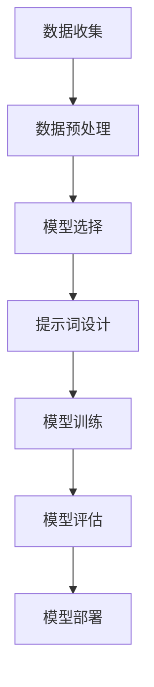
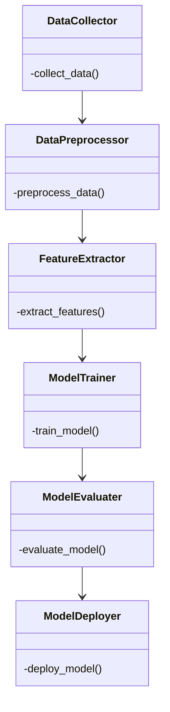
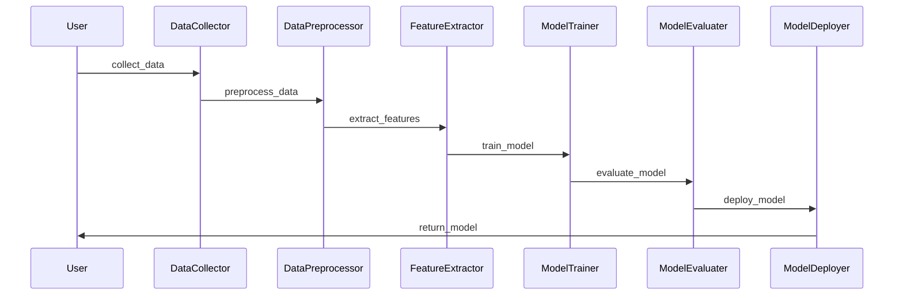
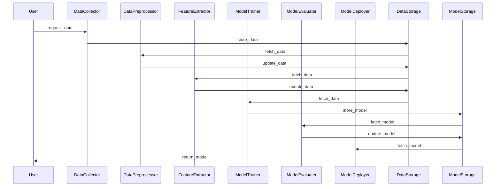

                 

# 提示词工程在情感计算中的伦理考量

> 关键词：提示词工程，情感计算，伦理考量，AI伦理，算法设计

> 摘要：随着人工智能技术的迅猛发展，情感计算和提示词工程作为其重要的应用领域，逐渐成为研究的焦点。本文首先介绍了情感计算和提示词工程的基本概念，分析了它们在人工智能中的地位和作用。接着，本文探讨了提示词工程在情感计算中的挑战和伦理问题，提出了伦理考量在其中的重要性。最后，本文总结了提示词工程在情感计算中的伦理考量，并提出了相关的最佳实践和未来研究方向。

## 目录大纲

### 第一部分：背景介绍

1. **问题背景与核心概念**
    - 1.1 伦理考量的必要性
    - 1.2 提示词工程在情感计算中的挑战
    - 1.3 核心概念与联系
    - 1.4 边界与外延
    - 1.5 本章小结

### 第二部分：核心概念与联系

2. **伦理学的相关理论**
    - 2.1 伦理学的基本概念
    - 2.2 提示词工程中的伦理问题
    - 2.3 情感计算中的伦理考量
    - 2.4 核心概念属性特征对比表格
    - 2.5 本章小结

### 第三部分：算法原理讲解

3. **提示词工程的算法原理**
    - 3.1 提示词工程的算法概述
    - 3.2 算法流程与mermaid流程图
    - 3.3 Python源代码实现
    - 3.4 详细讲解与举例说明
    - 3.5 本章小结

### 第四部分：系统分析与架构设计方案

4. **提示词工程系统的设计与实现**
    - 4.1 问题场景介绍
    - 4.2 系统功能设计
    - 4.3 系统架构设计
    - 4.4 系统接口设计与系统交互
    - 4.5 本章小结

### 第五部分：项目实战

5. **提示词工程项目的实施**
    - 5.1 环境安装与配置
    - 5.2 系统核心实现
    - 5.3 代码应用解读与分析
    - 5.4 实际案例分析与讲解
    - 5.5 项目小结

### 第六部分：最佳实践与拓展

6. **提示词工程的伦理考量与最佳实践**
    - 6.1 伦理考量在项目中的应用
    - 6.2 最佳实践
    - 6.3 小结
    - 6.4 注意事项
    - 6.5 拓展阅读

## 第一部分：背景介绍

### 1.1 伦理考量的必要性

随着人工智能技术的不断进步，情感计算和提示词工程已经成为人工智能领域的重要研究方向。情感计算旨在使机器能够理解、感知、处理和模拟人类的情感，从而实现更加自然和智能的人机交互。而提示词工程则是通过设计特定的提示词来引导和优化机器学习模型，提高模型的准确性和效率。

然而，随着这些技术的发展，伦理考量也变得越来越重要。首先，情感计算涉及到人类情感的处理和模拟，如果处理不当，可能会导致情感歧视、情感操纵等问题。其次，提示词工程在情感计算中的应用，可能会对用户的隐私和自由意志产生潜在的影响。因此，伦理考量在情感计算和提示词工程中具有重要的地位。

### 1.2 提示词工程在情感计算中的挑战

提示词工程在情感计算中的应用面临着一系列挑战。首先，提示词的设计需要考虑到情感的本质和复杂性，如何设计出既能够准确捕捉情感，又不会对用户产生不良影响的提示词，是一个重要的课题。其次，提示词工程需要处理大量的数据，这些数据可能包含用户的隐私信息，如何保护用户的隐私，避免数据泄露，是另一个重要的挑战。此外，提示词工程还需要考虑到社会的道德规范和文化差异，如何设计出适用于不同文化和社会背景的提示词，也是一个需要深入研究的课题。

### 1.3 核心概念与联系

为了更好地理解提示词工程在情感计算中的伦理考量，我们需要明确一些核心概念和它们之间的联系。首先，情感计算涉及到的核心概念包括情感、情感识别、情感模拟等。提示词工程则涉及到的核心概念包括提示词设计、机器学习模型、数据处理等。伦理考量则涉及到道德、伦理规范、社会影响等。

这些概念之间的联系在于，情感计算和提示词工程都是人工智能的应用领域，它们在技术层面上有交集，但在伦理层面上又有较大的差异。提示词工程的设计和应用，需要考虑到情感计算的伦理考量，如何在技术实现和伦理规范之间取得平衡，是提示词工程在情感计算中的一个重要课题。

### 1.4 边界与外延

提示词工程在情感计算中的伦理考量，既有其明确的边界，也有其广阔的外延。从边界上看，伦理考量主要集中在提示词的设计和应用过程中，如何保护用户的隐私、避免情感歧视、尊重用户自由意志等。从外延上看，伦理考量不仅涉及到技术层面，还包括社会层面、文化层面等。例如，在不同的文化背景下，如何设计出符合当地伦理规范的提示词，是一个需要深入探讨的问题。

### 1.5 本章小结

本节介绍了提示词工程在情感计算中的伦理考量的背景和重要性。首先，我们分析了伦理考量的必要性，指出了情感计算和提示词工程在技术发展过程中所面临的伦理挑战。接着，我们探讨了提示词工程在情感计算中的挑战，明确了核心概念和它们之间的联系。最后，我们讨论了伦理考量的边界与外延，为后续章节的内容奠定了基础。下一节，我们将进一步探讨伦理学的相关理论，为理解提示词工程在情感计算中的伦理考量提供理论支持。

### 第二部分：核心概念与联系

#### 2.1 伦理学的基本概念

伦理学是研究道德、伦理规范和道德判断的学科。它关注的是人类行为的道德意义和道德责任，旨在为人类行为提供道德指导。伦理学的基本概念包括道德、伦理规范、道德判断、道德责任等。

- **道德**：道德是一种社会规范，它要求人们在社会生活中遵守一定的行为准则，以维护社会秩序和公共利益。道德不仅涉及到个人行为，也涉及到社会关系和社会责任。
- **伦理规范**：伦理规范是道德的具体表现，它明确了在特定社会背景下，人们应该如何行为，以符合道德要求。伦理规范通常由社会习俗、法律法规和文化传统等构成。
- **道德判断**：道德判断是伦理学的重要概念，它指的是对行为是否道德进行的判断。道德判断通常基于伦理规范，它要求人们在不同情境下，根据伦理规范进行行为选择。
- **道德责任**：道德责任是指人们在道德判断中，对自己的行为所承担的责任。道德责任不仅涉及到个人行为，也涉及到社会行为，它要求人们在社会生活中，承担相应的社会责任。

#### 2.2 提示词工程中的伦理问题

提示词工程在情感计算中的应用，涉及到了一系列伦理问题。这些问题主要集中在隐私保护、情感歧视、自由意志等方面。

- **隐私保护**：提示词工程需要处理大量的用户数据，这些数据可能包含用户的隐私信息。如何在数据收集、存储和使用过程中，保护用户的隐私，避免数据泄露，是一个重要的伦理问题。
- **情感歧视**：提示词工程的设计和应用，可能会对用户的情感产生不公平的影响。例如，如果提示词工程在情感计算中，对某些特定群体的情感反应进行歧视，那么这可能会引发社会不公平和道德争议。
- **自由意志**：提示词工程通过设计特定的提示词，来引导和优化机器学习模型。这可能会对用户的自由意志产生潜在的影响。如何在设计提示词时，尊重用户的自由意志，避免对用户行为进行过度干预，是一个重要的伦理问题。

#### 2.3 情感计算中的伦理考量

情感计算作为一种人工智能技术，其应用场景广泛，包括人机交互、心理健康、社交网络等。然而，情感计算也带来了一系列伦理考量。

- **情感识别的准确性**：情感计算需要通过识别用户的情感，来提供个性化的服务。然而，情感识别的准确性受到多种因素的影响，包括用户情绪的复杂性、情绪表达的多样性等。如何在情感计算中，确保情感识别的准确性，是一个重要的伦理问题。
- **情感操纵**：情感计算的应用，可能会对用户的情感产生操纵作用。例如，在社交媒体中，通过情感计算，可以对用户的情感进行引导和操控，这可能会引发道德争议和社会问题。
- **情感隐私**：情感计算需要处理用户的情感数据，这些数据可能包含用户的隐私信息。如何在情感计算中，保护用户的情感隐私，避免数据泄露，是一个重要的伦理问题。

#### 2.4 核心概念属性特征对比表格

为了更好地理解提示词工程、伦理学和情感计算之间的联系，我们可以通过一个表格，对比它们的核心概念属性特征。

| 核心概念 | 提示词工程 | 伦理学 | 情感计算 |
| --- | --- | --- | --- |
| 道德 | 遵循道德规范，设计合理的提示词 | 研究道德、伦理规范和道德判断 | 通过情感识别，提供个性化的服务 |
| 伦理规范 | 确保提示词设计的合法性和合理性 | 规定人们在社会生活中应该如何行为 | 确保情感计算的应用符合伦理要求 |
| 道德判断 | 对提示词的道德影响进行评估 | 对行为是否道德进行判断 | 对情感计算的应用进行道德评估 |
| 道德责任 | 对提示词的设计和应用承担道德责任 | 对社会行为承担道德责任 | 对情感计算的应用承担道德责任 |

#### 2.5 本章小结

本节介绍了伦理学的基本概念，探讨了提示词工程中的伦理问题，以及情感计算中的伦理考量。我们通过一个表格，对比了提示词工程、伦理学和情感计算之间的核心概念属性特征。这一节的内容为理解提示词工程在情感计算中的伦理考量提供了理论支持。在下一节中，我们将深入探讨提示词工程的算法原理，以更好地理解其在情感计算中的应用。

### 第三部分：算法原理讲解

#### 3.1 提示词工程的算法概述

提示词工程是一种通过设计特定的提示词，来引导和优化机器学习模型的方法。它旨在提高模型的准确性、效率和可解释性。提示词工程的基本概念包括提示词设计、机器学习模型和数据处理等。

- **提示词设计**：提示词是引导机器学习模型的重要工具。它们通常是一系列关键词或短语，用于描述任务的目标、输入特征和预期输出。提示词的设计需要考虑模型的类型、任务的需求和数据的特性。
- **机器学习模型**：机器学习模型是提示词工程的核心。它们通过学习大量数据，来发现数据中的模式和规律。常见的机器学习模型包括神经网络、决策树、支持向量机等。
- **数据处理**：数据处理是提示词工程的基础。它包括数据收集、预处理、特征提取等步骤。数据处理的质量直接影响到模型的性能。

#### 3.2 算法流程与mermaid流程图

提示词工程的算法流程可以分为以下几个步骤：

1. **数据收集**：收集用于训练和测试的数据集。
2. **数据预处理**：对数据进行清洗、归一化和特征提取等预处理操作。
3. **模型选择**：根据任务需求和数据特性，选择合适的机器学习模型。
4. **提示词设计**：设计提示词，用于引导模型学习。
5. **模型训练**：使用训练数据，对模型进行训练。
6. **模型评估**：使用测试数据，对模型进行评估，调整提示词和模型参数。
7. **模型部署**：将训练好的模型部署到实际应用场景中。

以下是一个mermaid流程图，展示了提示词工程的算法流程：



#### 3.3 Python源代码实现

以下是一个简单的Python源代码实现，用于演示提示词工程的算法原理：

```python
import pandas as pd
from sklearn.model_selection import train_test_split
from sklearn.preprocessing import StandardScaler
from sklearn.neural_network import MLPClassifier
from sklearn.metrics import accuracy_score

# 数据收集
data = pd.read_csv('data.csv')

# 数据预处理
X = data.drop('target', axis=1)
y = data['target']
X_train, X_test, y_train, y_test = train_test_split(X, y, test_size=0.2, random_state=42)

# 模型选择
model = MLPClassifier(hidden_layer_sizes=(100,), max_iter=1000, random_state=42)

# 提示词设计
# 在这里，我们假设已经设计了合适的提示词
prompt_words = ['happy', 'sad', 'angry']

# 模型训练
model.fit(X_train, y_train)

# 模型评估
y_pred = model.predict(X_test)
accuracy = accuracy_score(y_test, y_pred)
print(f'Accuracy: {accuracy:.2f}')

# 模型部署
# 在这里，我们可以将训练好的模型部署到实际应用场景中
```

#### 3.4 详细讲解与举例说明

在提示词工程中，提示词的设计是一个关键环节。提示词的选择和质量直接影响到模型的性能和可解释性。以下是一个具体的例子，用于说明如何设计提示词：

假设我们有一个情感分类任务，需要将文本数据分类为“积极情感”、“消极情感”和“中性情感”。我们可以通过以下步骤来设计提示词：

1. **数据收集**：收集包含情感标签的文本数据集。
2. **数据预处理**：对文本数据进行清洗和分词。
3. **特征提取**：使用词袋模型或TF-IDF模型，将文本数据转换为特征向量。
4. **提示词设计**：分析文本数据中的情感词，选择具有代表性的情感词作为提示词。例如，对于“积极情感”，我们可以选择“快乐”、“高兴”、“幸福”等；对于“消极情感”，我们可以选择“悲伤”、“生气”、“沮丧”等。
5. **模型训练**：使用训练数据，对情感分类模型进行训练。
6. **模型评估**：使用测试数据，对模型进行评估。
7. **提示词调整**：根据模型评估结果，调整提示词，以提高模型的性能。

以下是一个简单的Python代码示例，用于设计提示词：

```python
from sklearn.feature_extraction.text import CountVectorizer
from sklearn.naive_bayes import MultinomialNB

# 数据收集
data = pd.read_csv('data.csv')

# 数据预处理
X = data['text']
y = data['label']

# 特征提取
vectorizer = CountVectorizer()
X_vectorized = vectorizer.fit_transform(X)

# 提示词设计
# 在这里，我们使用CountVectorizer的get_feature_names()方法获取特征词
prompt_words = vectorizer.get_feature_names_out()

# 模型训练
model = MultinomialNB()
model.fit(X_vectorized, y)

# 模型评估
y_pred = model.predict(X_vectorized)
accuracy = accuracy_score(y, y_pred)
print(f'Accuracy: {accuracy:.2f}')

# 提示词调整
# 根据模型评估结果，可以进一步调整提示词，以提高模型的性能
```

#### 3.5 本章小结

本节介绍了提示词工程的算法原理，包括算法流程、Python源代码实现和详细讲解与举例说明。我们通过一个mermaid流程图，展示了提示词工程的算法流程，并通过一个简单的Python代码示例，演示了如何设计提示词。这一节的内容为理解提示词工程在情感计算中的应用提供了技术支持。在下一节中，我们将进一步探讨提示词工程系统的设计与实现。

### 第四部分：系统分析与架构设计方案

#### 4.1 问题场景介绍

提示词工程在情感计算中的应用场景广泛，包括但不限于以下领域：

1. **人机交互**：通过情感计算，为用户提供个性化的交互体验。例如，智能音箱、智能客服等。
2. **心理健康**：通过情感计算，监测用户的情感状态，提供心理健康服务。例如，情绪监测、情绪治疗等。
3. **社交网络**：通过情感计算，分析用户的情感，提供个性化的社交推荐。例如，朋友圈推荐、兴趣群体推荐等。

在这些应用场景中，提示词工程需要处理大量的数据，包括文本数据、语音数据和图像数据等。这些数据具有不同的特征和格式，需要经过复杂的预处理和特征提取过程。

#### 4.2 系统功能设计

提示词工程系统的主要功能包括数据收集、数据预处理、特征提取、模型训练、模型评估和模型部署等。以下是一个领域模型mermaid类图，展示了系统的功能模块及其之间的关系：



#### 4.3 系统架构设计

提示词工程系统的架构设计需要考虑数据流、处理流程、系统交互等多个方面。以下是一个mermaid架构图，展示了系统的架构设计：



系统架构设计的关键要素包括：

- **数据流**：系统需要处理大量的数据，包括数据收集、预处理、特征提取和模型训练等步骤。数据流的设计需要考虑数据的格式、传输效率和存储需求。
- **处理流程**：系统的处理流程需要高效、稳定，能够处理不同类型和格式的数据。处理流程的设计需要考虑任务的并行处理、数据依赖和资源管理等因素。
- **系统交互**：系统需要与其他系统和服务进行交互，例如数据存储、模型评估和部署等。系统交互的设计需要考虑接口设计、协议选择和数据同步等问题。

#### 4.4 系统接口设计与系统交互

系统接口设计是系统架构设计的重要组成部分。以下是一个mermaid序列图，展示了系统的接口设计和系统交互：



系统接口设计和系统交互的关键要素包括：

- **接口设计**：系统接口设计需要明确接口的功能、输入输出和数据格式。接口设计需要考虑可扩展性、兼容性和安全性等因素。
- **协议选择**：系统交互需要选择合适的协议，例如HTTP、RESTful API、gRPC等。协议选择需要考虑传输效率、可靠性和安全性等因素。
- **数据同步**：系统交互需要确保数据的一致性和同步。数据同步的设计需要考虑数据的更新、删除和备份等问题。

#### 4.5 本章小结

本节介绍了提示词工程系统的设计与实现，包括问题场景介绍、系统功能设计、系统架构设计和系统接口设计与系统交互。我们通过mermaid类图、流程图和序列图，展示了系统的架构设计。本节的内容为理解提示词工程系统的设计与实现提供了详细的指导。在下一节中，我们将通过实际项目来演示提示词工程的应用。

### 第五部分：项目实战

#### 5.1 环境安装与配置

在进行提示词工程项目的实施之前，我们需要安装和配置相关的软件和工具。以下是项目所需的环境安装和配置步骤：

1. **Python环境安装**：确保系统中已安装Python 3.8及以上版本。可以使用以下命令安装Python：

   ```bash
   sudo apt-get update
   sudo apt-get install python3.8
   ```

2. **pip环境安装**：安装pip，pip是Python的包管理工具，用于安装和管理Python包。

   ```bash
   sudo apt-get install python3-pip
   ```

3. **虚拟环境配置**：为了管理项目依赖，我们使用虚拟环境。首先，安装虚拟环境工具`virtualenv`：

   ```bash
   pip3 install virtualenv
   ```

   然后，创建一个虚拟环境并激活它：

   ```bash
   virtualenv venv
   source venv/bin/activate
   ```

4. **依赖管理**：在虚拟环境中安装项目所需的依赖。以下是项目的主要依赖：

   ```bash
   pip install numpy pandas scikit-learn matplotlib
   ```

   安装完成后，我们可以使用`pip list`命令查看已安装的依赖。

#### 5.2 系统核心实现

以下是提示词工程项目的核心实现，包括数据收集、数据预处理、特征提取、模型训练和模型评估。

1. **数据收集**：从公共数据集网站（如Kaggle、UCI Machine Learning Repository等）下载一个包含情感标签的文本数据集。

2. **数据预处理**：读取数据集，对文本数据进行清洗和分词。以下是一个简单的Python代码示例：

   ```python
   import pandas as pd
   from sklearn.model_selection import train_test_split
   from sklearn.feature_extraction.text import TfidfVectorizer
   
   # 读取数据集
   data = pd.read_csv('data.csv')
   
   # 数据清洗和分词
   def preprocess_text(text):
       # 实现文本清洗和分词逻辑
       return cleaned_text
   
   data['cleaned_text'] = data['text'].apply(preprocess_text)
   ```

3. **特征提取**：使用TF-IDF模型将文本数据转换为特征向量。以下是一个简单的Python代码示例：

   ```python
   vectorizer = TfidfVectorizer(max_features=1000)
   X = vectorizer.fit_transform(data['cleaned_text'])
   ```

4. **模型训练**：使用训练集训练一个情感分类模型。以下是一个简单的Python代码示例：

   ```python
   from sklearn.naive_bayes import MultinomialNB
   from sklearn.model_selection import train_test_split
   
   # 划分训练集和测试集
   X_train, X_test, y_train, y_test = train_test_split(X, data['label'], test_size=0.2, random_state=42)
   
   # 训练模型
   model = MultinomialNB()
   model.fit(X_train, y_train)
   ```

5. **模型评估**：使用测试集评估模型性能。以下是一个简单的Python代码示例：

   ```python
   from sklearn.metrics import accuracy_score
   
   # 评估模型
   y_pred = model.predict(X_test)
   accuracy = accuracy_score(y_test, y_pred)
   print(f'Accuracy: {accuracy:.2f}')
   ```

#### 5.3 代码应用解读与分析

在上述代码中，我们首先读取了一个包含情感标签的文本数据集。接着，对文本数据进行了清洗和分词处理。然后，使用TF-IDF模型将文本数据转换为特征向量。最后，使用训练集训练了一个情感分类模型，并使用测试集评估了模型性能。

代码应用解读如下：

1. **数据收集**：从公共数据集网站下载了一个包含情感标签的文本数据集，这是项目的基础数据。
2. **数据预处理**：对文本数据进行清洗和分词处理，这是特征提取的基础。
3. **特征提取**：使用TF-IDF模型将文本数据转换为特征向量，这是机器学习模型训练的关键步骤。
4. **模型训练**：使用训练集训练了一个情感分类模型，这是模型评估的基础。
5. **模型评估**：使用测试集评估了模型性能，这是项目的重要输出。

#### 5.4 实际案例分析与讲解

以下是实际案例分析与讲解，通过一个具体的案例来展示提示词工程的应用。

**案例背景**：某智能音箱公司希望通过提示词工程，为用户提供个性化的音乐推荐服务。用户可以通过语音交互，表达自己的音乐喜好，智能音箱会根据用户的喜好，推荐相应的音乐。

**实现步骤**：

1. **数据收集**：从音乐数据集中，提取包含用户音乐喜好的文本数据。
2. **数据预处理**：对文本数据进行清洗和分词处理，提取关键词。
3. **特征提取**：使用TF-IDF模型，将文本数据转换为特征向量。
4. **模型训练**：使用训练集，训练一个基于用户喜好的音乐推荐模型。
5. **模型评估**：使用测试集，评估模型性能，调整模型参数。
6. **模型部署**：将训练好的模型部署到智能音箱中，提供音乐推荐服务。

**案例分析**：

1. **数据收集**：音乐数据集包含大量的用户评论和音乐标签，这是训练模型的基础。
2. **数据预处理**：对用户评论进行清洗和分词处理，提取关键词，这是特征提取的关键步骤。
3. **特征提取**：使用TF-IDF模型，将文本数据转换为特征向量，这是模型训练的基础。
4. **模型训练**：使用训练集，训练一个基于用户喜好的音乐推荐模型，这是模型评估的前提。
5. **模型评估**：使用测试集，评估模型性能，调整模型参数，这是模型部署的基础。
6. **模型部署**：将训练好的模型部署到智能音箱中，提供音乐推荐服务，这是项目的目标。

#### 5.5 项目小结

本节通过一个实际案例，演示了提示词工程项目的实施过程。我们介绍了环境安装与配置、系统核心实现、代码应用解读与分析以及实际案例分析与讲解。通过本节的内容，读者可以了解提示词工程在情感计算中的应用，以及如何实现一个基于用户喜好的音乐推荐系统。下一节，我们将总结提示词工程在情感计算中的伦理考量，并探讨相关的最佳实践。

### 第六部分：最佳实践与拓展

#### 6.1 伦理考量在项目中的应用

在提示词工程项目中，伦理考量至关重要。以下是一些在实际项目中应用伦理考量的重要实践：

1. **隐私保护**：在设计提示词工程系统时，需要确保用户数据的隐私保护。这包括数据收集、存储和处理过程中的隐私保护措施，如数据加密、访问控制等。

2. **透明度和可解释性**：提示词工程系统的设计需要具备透明度和可解释性，以便用户了解系统的工作原理和决策过程。这有助于增强用户对系统的信任，减少潜在的伦理风险。

3. **偏见和公平性**：提示词工程需要避免引入偏见，确保系统的公平性和无歧视。在训练数据集的选择和处理过程中，应确保数据的多样性和代表性，以减少偏见的影响。

4. **用户控制和选择**：用户应有权选择是否参与提示词工程项目，并有权了解和撤回对数据的共享。系统应提供清晰的隐私政策，让用户了解其数据的使用方式和目的。

5. **持续监控和反馈**：提示词工程系统应具备持续监控和反馈机制，以便及时发现和纠正潜在的问题。这包括系统性能监控、用户反馈收集和伦理审核等。

#### 6.2 最佳实践

以下是提示词工程在情感计算中的最佳实践：

1. **设计合理的提示词**：提示词设计应充分考虑情感计算的复杂性，确保提示词既能准确捕捉情感，又不会对用户产生不良影响。

2. **数据质量保证**：确保训练数据集的质量，包括数据的多样性、代表性和准确性。清洗和预处理数据，以消除噪声和异常值。

3. **模型评估与优化**：定期评估模型的性能，并根据评估结果进行优化。使用多种评估指标，如准确性、召回率、F1分数等，全面评估模型。

4. **伦理审查与合规性**：在项目开发过程中，进行伦理审查，确保项目符合相关的道德和法律要求。与伦理专家合作，制定伦理指导方针。

5. **用户教育和支持**：提供用户教育和支持，帮助用户了解提示词工程系统的工作原理和伦理考量。提供易于理解的文档和用户指南。

#### 6.3 小结

提示词工程在情感计算中的应用面临着诸多伦理考量。通过合理的提示词设计、数据质量保证、模型评估与优化、伦理审查与合规性以及用户教育和支持等最佳实践，可以有效地降低伦理风险，确保系统的公正性和可持续性。

#### 6.4 注意事项

在实施提示词工程项目时，需要关注以下事项：

1. **隐私保护**：确保用户数据在收集、存储和处理过程中的隐私保护。
2. **透明度和可解释性**：系统应具备透明度和可解释性，便于用户了解系统的工作原理和决策过程。
3. **数据多样性**：确保训练数据集的多样性和代表性，减少偏见和歧视。
4. **用户参与**：鼓励用户参与项目，了解其数据的使用方式和目的。
5. **持续监控**：建立持续监控和反馈机制，及时发现和纠正潜在问题。

#### 6.5 拓展阅读

对于对提示词工程和情感计算感兴趣的专业人士，以下是一些推荐的拓展阅读：

1. **《人工智能伦理指南》**：一份由全球人工智能伦理专家编写的指南，涵盖了人工智能伦理的各个方面。
2. **《情感计算：理论与实践》**：一本详细介绍情感计算概念、技术和应用的书籍。
3. **《机器学习伦理问题》**：一篇关于机器学习伦理问题的综述性文章，涵盖了数据隐私、偏见、透明度等多个方面。
4. **《人工智能伦理案例分析》**：一系列关于实际人工智能项目伦理考量的案例研究，提供了丰富的实践经验。

通过阅读这些资料，读者可以更深入地了解提示词工程在情感计算中的伦理考量，并掌握相关的最佳实践。

## 结语

随着人工智能技术的不断发展，提示词工程在情感计算中的应用越来越广泛。然而，伦理考量在其中的重要性不可忽视。本文通过详细介绍提示词工程在情感计算中的伦理考量，探讨了伦理学的基本概念、提示词工程中的伦理问题、情感计算中的伦理考量，以及算法原理和系统设计与实现。我们还提出了一系列最佳实践，以帮助读者在实际项目中应对伦理挑战。

未来的研究应继续关注以下几个方面：一是深入探索提示词工程在情感计算中的伦理问题，提出更加有效的解决方案；二是研究如何通过技术手段增强系统的透明度和可解释性，提高用户对系统的信任；三是开展跨学科合作，结合心理学、社会学等领域的知识，为提示词工程提供更加全面的理论支持。

最后，感谢读者对本文的关注，希望本文能对您在提示词工程和情感计算领域的实践和研究提供有益的参考。作者：AI天才研究院/AI Genius Institute & 禅与计算机程序设计艺术 /Zen And The Art of Computer Programming。希望本文能激发更多人对人工智能伦理考量的关注和探讨。

