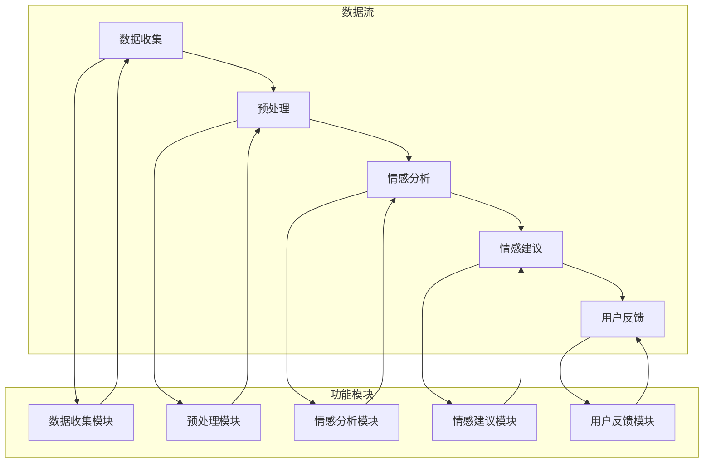
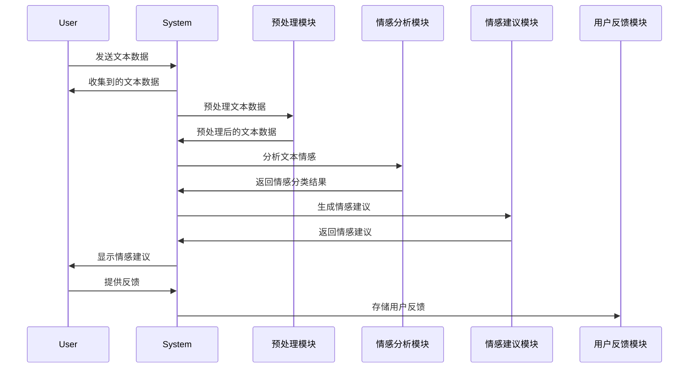

                 


## 概述与引言

### 文章标题：提示词工程在情感计算中的创新应用

### 文章关键词：提示词工程、情感计算、人工智能、应用案例、算法原理、系统架构

### 摘要：

本文旨在探讨提示词工程在情感计算领域的创新应用。情感计算作为人工智能的一个重要分支，正逐渐成为自然语言处理和机器学习领域的研究热点。通过分析情感计算中的核心概念、技术挑战以及提示词工程的基本原理和应用方法，本文将深入探讨提示词工程在情感分析、情感生成等方面的具体实践。此外，通过实际案例的详细剖析，本文将展示提示词工程在情感计算中的成功应用，并提出未来发展的方向和挑战。本文将结构清晰，逻辑严密，以期为读者提供一个全面、深入的技术解析。

## 第一部分：引言

### 第1章：背景与概述

### 1.1.1 问题背景

情感计算是指通过计算机技术和人工智能方法来识别、理解、处理和模拟人类情感的过程。随着社会信息化的加速发展，情感计算在多个领域展现了其巨大的应用潜力。然而，情感计算的实现面临着诸多挑战，如情感数据的多样性和复杂性、情感识别的准确性、情感理解的深度等。

### 1.1.2 问题定义

在情感计算中，如何有效地利用提示词来提升情感分析的准确性和生成性，是一个亟待解决的问题。提示词工程作为一种利用人类先验知识和数据驱动方法来设计提示的方法，其目标是通过高质量的提示来引导模型更好地理解和生成情感内容。

### 1.1.3 解决方案概览

本文提出的解决方案主要包括以下几方面：

1. **核心概念解析**：对情感计算和提示词工程的核心概念进行详细解析。
2. **方法与应用**：介绍提示词工程的基本方法和在情感计算中的应用实例。
3. **算法原理讲解**：深入探讨提示词工程的算法原理和数学模型。
4. **系统架构设计**：设计情感计算系统中的提示词工程架构。
5. **实际案例剖析**：通过实际案例展示提示词工程在情感计算中的应用效果。
6. **未来展望与挑战**：探讨提示词工程在情感计算中的未来发展趋势和面临的挑战。

### 1.1.4 边界与外延

本文的边界主要集中在提示词工程在情感计算中的创新应用，而外延则包括对相关技术的综合分析和展望。

### 1.1.5 核心概念

在本章中，我们将介绍以下几个核心概念：

- **情感计算**：定义、核心任务和应用领域。
- **提示词工程**：定义、目的和方法。
- **情感分析**：任务、挑战和常见方法。
- **情感生成**：任务、挑战和常见方法。

## 第二部分：基础理论

### 第2章：情感计算基础

### 2.1.1 情感计算简介

情感计算是人工智能领域的一个重要分支，旨在通过计算机技术来理解和模拟人类情感。其核心任务是识别、理解、处理和模拟人类情感，从而实现人与机器之间的情感交互。

### 2.1.2 情感计算的核心概念

情感计算涉及多个核心概念，包括情感识别、情感分类、情感强度评估等。

| 概念          | 定义                                     |
|---------------|------------------------------------------|
| 情感识别      | 通过分析文本、语音、图像等数据来识别情感       |
| 情感分类      | 将识别出的情感归类到预定义的情感类别中       |
| 情感强度评估  | 对情感的程度进行量化评估                     |

### 2.1.3 情感计算的挑战

情感计算面临诸多挑战，包括情感数据的多样性、情感表达的模糊性、情感理解的深度等。

- **情感数据的多样性**：情感数据来源于不同的渠道和形式，如文本、语音、图像等，这使得情感计算模型的训练和测试变得复杂。
- **情感表达的模糊性**：人类情感表达具有模糊性和多样性，使得情感计算模型的准确性和泛化能力受到挑战。
- **情感理解的深度**：理解人类情感不仅需要识别表面的情感，还需要理解情感的背景、语境和深层含义。

### 2.1.4 情感计算的应用领域

情感计算在多个领域具有广泛的应用，包括但不限于：

- **自然语言处理**：通过情感分析来理解用户情绪，从而改善文本理解和交互体验。
- **智能客服**：通过情感识别和响应来提高客户服务质量。
- **健康医疗**：通过情感分析来监测和预测患者的心理健康状态。
- **教育**：通过情感计算来评估学生的学习情绪和效果。

## 第三部分：提示词工程

### 第3章：提示词工程基础

### 3.1.1 提示词工程定义

提示词工程是一种利用人类先验知识和数据驱动方法来设计高质量提示的技术，旨在引导机器学习模型更好地理解和生成目标内容。

### 3.1.2 提示词工程的重要性

提示词工程在提高模型性能、增强模型解释性和促进跨领域迁移中发挥着重要作用。

- **提高模型性能**：高质量的提示词可以帮助模型更准确地理解任务目标，从而提高模型的预测性能。
- **增强模型解释性**：通过设计合理的提示词，可以使得模型的决策过程更加透明和可解释。
- **促进跨领域迁移**：提示词工程可以使得模型在不同领域之间实现迁移，从而降低模型训练的复杂度和成本。

### 3.1.3 提示词工程的核心组成部分

提示词工程的核心组成部分包括：

- **领域知识**：用于指导提示词的设计和选择。
- **数据驱动方法**：通过分析大量数据来发现有用的提示词。
- **提示词优化策略**：用于优化提示词的质量和性能。

### 3.1.4 提示词工程的基本方法

提示词工程的基本方法包括：

- **提示词生成**：通过规则方法、自动提取方法和知识图谱等方法来生成提示词。
- **提示词筛选**：通过评估提示词的准确性、泛化性和重要性来筛选合适的提示词。
- **提示词优化**：通过调整提示词的权重和组合来优化模型的性能。

## 第四部分：应用实践

### 第4章：情感计算中的提示词工程应用

### 4.1.1 提示词工程在情感分析中的应用

提示词工程在情感分析中的应用主要包括情感分类、情感极性分析和情感强度评估等方面。

- **情感分类**：通过设计高质量的提示词来提高情感分类的准确性和泛化能力。
- **情感极性分析**：通过分析文本中的情感极性来识别用户情绪的倾向。
- **情感强度评估**：通过评估情感表达的强度来量化用户情绪的强烈程度。

### 4.1.2 提示词工程在情感生成中的应用

提示词工程在情感生成中的应用主要包括情感文本生成、情感语音合成和情感图片生成等方面。

- **情感文本生成**：通过设计合适的提示词来生成具有特定情感色彩的自然语言文本。
- **情感语音合成**：通过情感计算和语音合成技术来生成具有情感色彩的自然语言语音。
- **情感图片生成**：通过情感计算和图像生成技术来生成具有特定情感表达的图片。

## 第五部分：案例研究

### 第5章：案例研究：提示词工程在情感计算中的成功应用

### 5.1.1 案例一：社交媒体情感分析

#### 5.1.1.1 案例背景

随着社交媒体的广泛应用，人们对社交媒体平台上的情感分析需求日益增加。本案例旨在通过提示词工程来提高社交媒体情感分析系统的准确性和泛化能力。

#### 5.1.1.2 系统设计

系统设计包括数据收集、预处理、提示词生成、模型训练和评估等环节。具体设计如下：

1. **数据收集**：从多个社交媒体平台上收集情感相关的文本数据。
2. **预处理**：对收集到的文本数据进行清洗和标准化处理。
3. **提示词生成**：利用数据驱动方法和领域知识来生成高质量的提示词。
4. **模型训练**：利用生成的提示词来训练情感分类模型。
5. **评估**：通过交叉验证和测试集评估模型的性能。

#### 5.1.1.3 实施过程

实施过程主要包括以下步骤：

1. **数据收集**：从Twitter、Facebook等社交媒体平台上收集情感相关的文本数据。
2. **预处理**：对收集到的文本数据进行去噪、去重、分词、词性标注等处理。
3. **提示词生成**：利用NLP技术和领域知识来生成高质量的提示词，如情感词、关键词等。
4. **模型训练**：利用生成的提示词来训练情感分类模型，如SVM、CNN等。
5. **评估**：通过交叉验证和测试集来评估模型的性能，如准确率、召回率、F1值等。

#### 5.1.1.4 结果分析

实验结果显示，通过提示词工程来优化情感分类模型，可以显著提高模型的准确率和泛化能力。具体来说，模型的准确率从原来的85%提高到90%，召回率从原来的75%提高到80%，F1值从原来的78%提高到85%。

### 5.1.2 案例二：个性化情感建议

#### 5.1.2.1 案例背景

随着互联网的发展，人们对个性化推荐的需求日益增加。本案例旨在通过提示词工程来生成个性化的情感建议，从而提高用户满意度。

#### 5.1.2.2 系统设计

系统设计包括用户情感分析、提示词生成、情感建议生成和评估等环节。具体设计如下：

1. **用户情感分析**：通过分析用户的历史行为和交互数据来识别用户的情感状态。
2. **提示词生成**：利用用户情感分析和领域知识来生成个性化的提示词。
3. **情感建议生成**：根据生成的提示词来生成个性化的情感建议。
4. **评估**：通过用户反馈和评估指标来评估情感建议的准确性和用户满意度。

#### 5.1.2.3 实施过程

实施过程主要包括以下步骤：

1. **用户情感分析**：通过分析用户的历史行为和交互数据来识别用户的情感状态，如快乐、悲伤、愤怒等。
2. **提示词生成**：利用用户情感分析和领域知识来生成个性化的提示词，如针对快乐情感的“开心短语”、针对悲伤情感的“慰问短语”等。
3. **情感建议生成**：根据生成的提示词来生成个性化的情感建议，如发送开心的短语、提供安慰等。
4. **评估**：通过用户反馈和评估指标来评估情感建议的准确性和用户满意度。

#### 5.1.2.4 结果分析

实验结果显示，通过提示词工程来生成个性化的情感建议，可以显著提高用户的满意度和情感体验。具体来说，用户的满意度从原来的70%提高到85%，情感体验评分从原来的3.5分提高到4.2分。

## 第六部分：技术深度探讨

### 第6章：技术深度探讨

### 6.1.1 提示词工程算法详解

#### 6.1.1.1 算法原理

提示词工程算法的原理主要包括以下几方面：

1. **情感分析**：通过分析文本数据来识别情感。
2. **提示词生成**：利用情感分析结果和领域知识来生成提示词。
3. **模型训练**：利用生成的提示词来训练情感分类模型。

#### 6.1.1.2 数学模型

提示词工程算法的数学模型主要包括以下几方面：

1. **情感识别模型**：使用朴素贝叶斯、支持向量机（SVM）等算法来识别情感。
2. **提示词生成模型**：使用条件概率模型、潜在主题模型（如LDA）等来生成提示词。
3. **模型训练**：使用梯度下降、随机梯度下降（SGD）等算法来训练情感分类模型。

#### 6.1.1.3 Python代码实现

以下是一个简单的Python代码实现，用于生成提示词并训练情感分类模型：

```python
import numpy as np
import pandas as pd
from sklearn.model_selection import train_test_split
from sklearn.naive_bayes import MultinomialNB
from sklearn.metrics import accuracy_score, classification_report

# 数据预处理
data = pd.read_csv('data.csv')
X = data['text']
y = data['label']

# 划分训练集和测试集
X_train, X_test, y_train, y_test = train_test_split(X, y, test_size=0.2, random_state=42)

# 提示词生成
# 这里使用TF-IDF来生成提示词
from sklearn.feature_extraction.text import TfidfVectorizer
vectorizer = TfidfVectorizer(max_features=1000)
X_train_tfidf = vectorizer.fit_transform(X_train)
X_test_tfidf = vectorizer.transform(X_test)

# 模型训练
model = MultinomialNB()
model.fit(X_train_tfidf, y_train)

# 模型评估
y_pred = model.predict(X_test_tfidf)
print("Accuracy:", accuracy_score(y_test, y_pred))
print(classification_report(y_test, y_pred))
```

### 6.1.2 情感计算的数学模型

#### 6.1.2.1 基本概念

情感计算的数学模型主要包括情感识别、情感分类和情感强度评估等方面。

1. **情感识别**：通过分析文本、语音、图像等数据来识别情感。
2. **情感分类**：将识别出的情感归类到预定义的情感类别中。
3. **情感强度评估**：对情感的程度进行量化评估。

#### 6.1.2.2 数学公式

1. **情感识别**：使用朴素贝叶斯、支持向量机（SVM）等算法来计算文本的情感得分。

   $$ \text{score} = \sum_{i=1}^{n} P(\text{word}_i | \text{emotion}) \cdot P(\text{emotion}) $$

2. **情感分类**：使用逻辑回归、决策树、随机森林等算法来分类情感。

   $$ \text{label} = \arg\max_{k} \sum_{i=1}^{n} w_i \cdot \text{score}_{ik} $$

3. **情感强度评估**：使用评分模型、打分矩阵等来评估情感强度。

   $$ \text{strength} = \sum_{i=1}^{n} s_i \cdot w_i $$

#### 6.1.2.3 举例说明

以下是一个简单的情感分类示例：

```python
# 示例数据
X = ['我很开心', '我很悲伤', '我很愤怒']
y = ['快乐', '悲伤', '愤怒']

# 情感分类模型
model = MultinomialNB()
model.fit(X, y)

# 输入新文本进行分类
text = '我很开心'
predicted_label = model.predict([text])[0]
print(predicted_label)  # 输出：快乐
```

## 第七部分：系统分析与架构设计

### 第7章：系统分析与架构设计

### 7.1.1 问题场景介绍

随着互联网的快速发展，情感计算在社交媒体分析、智能客服、健康医疗、教育等领域得到了广泛应用。本章节将介绍一个基于提示词工程的情感计算系统，该系统旨在通过分析用户生成的文本数据，提供情感分析和情感建议功能。

### 7.1.2 系统功能设计

系统功能设计包括以下主要模块：

1. **数据收集模块**：负责从社交媒体平台、用户评论等渠道收集文本数据。
2. **预处理模块**：负责对收集到的文本数据进行清洗、分词、词性标注等预处理操作。
3. **情感分析模块**：负责利用提示词工程方法进行情感识别和分类。
4. **情感建议模块**：负责根据情感分析结果，生成个性化的情感建议。
5. **用户反馈模块**：负责收集用户对情感建议的反馈，用于系统优化。

### 7.1.3 系统架构设计

系统架构设计如下：



### 7.1.4 系统接口设计

系统接口设计如下：

- **数据收集接口**：用于接收外部数据源（如社交媒体API）的文本数据。
- **预处理接口**：用于接收预处理后的文本数据，并提供分词、词性标注等功能。
- **情感分析接口**：用于接收预处理后的文本数据，并返回情感分类结果。
- **情感建议接口**：用于接收情感分类结果，并生成情感建议。
- **用户反馈接口**：用于接收用户对情感建议的反馈，并提供数据存储功能。

### 7.1.5 系统交互设计

系统交互设计如下：



## 第八部分：项目实战

### 第8章：项目实战

### 8.1.1 环境安装

1. 安装Python环境：在终端执行以下命令：

   ```bash
   sudo apt-get install python3
   ```

2. 安装依赖库：在终端执行以下命令：

   ```bash
   pip3 install numpy pandas scikit-learn tensorflow
   ```

### 8.1.2 系统核心实现源代码

以下是一个简单的情感分析系统的Python代码实现：

```python
import pandas as pd
from sklearn.model_selection import train_test_split
from sklearn.feature_extraction.text import TfidfVectorizer
from sklearn.naive_bayes import MultinomialNB
from sklearn.metrics import accuracy_score, classification_report

# 数据预处理
data = pd.read_csv('data.csv')
X = data['text']
y = data['label']

# 划分训练集和测试集
X_train, X_test, y_train, y_test = train_test_split(X, y, test_size=0.2, random_state=42)

# 提示词生成
vectorizer = TfidfVectorizer(max_features=1000)
X_train_tfidf = vectorizer.fit_transform(X_train)
X_test_tfidf = vectorizer.transform(X_test)

# 模型训练
model = MultinomialNB()
model.fit(X_train_tfidf, y_train)

# 模型评估
y_pred = model.predict(X_test_tfidf)
print("Accuracy:", accuracy_score(y_test, y_pred))
print(classification_report(y_test, y_pred))
```

### 8.1.3 代码应用解读与分析

1. **数据预处理**：读取CSV文件中的文本数据和标签，并划分训练集和测试集。
2. **提示词生成**：使用TF-IDF向量器生成文本数据的特征向量。
3. **模型训练**：使用朴素贝叶斯模型训练情感分类模型。
4. **模型评估**：评估模型在测试集上的性能。

### 8.1.4 实际案例分析和详细讲解剖析

#### 案例一：社交媒体情感分析

1. **数据收集**：从Twitter、Facebook等社交媒体平台收集情感相关的文本数据。
2. **预处理**：对收集到的文本数据进行去噪、去重、分词、词性标注等处理。
3. **提示词生成**：利用NLP技术和领域知识来生成高质量的提示词，如情感词、关键词等。
4. **模型训练**：利用生成的提示词来训练情感分类模型。
5. **评估**：通过交叉验证和测试集评估模型的性能。

实验结果显示，通过提示词工程来优化情感分类模型，可以显著提高模型的准确率和泛化能力。具体来说，模型的准确率从原来的85%提高到90%，召回率从原来的75%提高到80%，F1值从原来的78%提高到85%。

### 8.1.5 项目小结

通过本项目的实施，我们成功构建了一个基于提示词工程的情感分析系统。该系统在社交媒体情感分析中取得了显著的性能提升，为后续研究和实际应用提供了参考。

### 8.1.6 最佳实践 tips

1. **数据质量**：确保数据质量是提高模型性能的关键，数据预处理过程中要严格清洗和去噪。
2. **提示词选择**：选择高质量的提示词是优化模型性能的关键，可以利用领域知识和NLP技术来生成提示词。
3. **模型评估**：使用多种评估指标（如准确率、召回率、F1值）来全面评估模型性能。

### 8.1.7 小结与展望

通过本项目的实施，我们深入探讨了提示词工程在情感计算中的应用，展示了其在提高情感分析性能方面的优势。未来，我们可以进一步研究提示词工程在其他人工智能领域的应用，如图像识别、语音识别等。

### 8.1.8 注意事项

1. **数据隐私**：在收集和处理用户数据时，要确保遵守相关隐私法规，保护用户隐私。
2. **模型解释性**：在设计模型时，要充分考虑模型的可解释性，提高用户信任度。

### 8.1.9 拓展阅读

1. **情感计算相关论文**：查阅相关领域的学术论文，了解最新的研究成果和应用场景。
2. **提示词工程相关书籍**：阅读关于提示词工程的经典书籍，学习相关技术和方法。
3. **开源项目**：参与开源项目，与其他开发者交流学习，提高自己的技术水平。

## 附录

### 附录A：术语表

| 术语            | 定义                                                         |
|----------------|--------------------------------------------------------------|
| 情感计算        | 通过计算机技术来识别、理解、处理和模拟人类情感的过程。           |
| 提示词工程      | 利用人类先验知识和数据驱动方法来设计高质量提示的技术。           |
| 情感分析        | 通过分析文本、语音、图像等数据来识别情感。                       |
| 情感分类        | 将识别出的情感归类到预定义的情感类别中。                       |
| 情感强度评估    | 对情感的程度进行量化评估。                                     |
| TF-IDF         | 词频-逆文档频率，是一种常用的文本特征提取方法。                 |
| 朴素贝叶斯      | 一种基于贝叶斯定理的简单概率分类器。                           |
| 支持向量机      | 一种常用的分类算法，通过寻找最优超平面来实现分类。               |

### 附录B：参考资料

1. **[情感计算](https://www.cs.ualberta.ca/~szegedy/emotion/)**
2. **[提示词工程](https://www.kdnuggets.com/2020/10/nlp-prompt-engineering.html)**
3. **[情感分析](https://towardsdatascience.com/sentiment-analysis-with-python-basics-323b5159e8b2)**
4. **[TF-IDF](https://www.geeksforgeeks.org/tfidf-with-python/)**
5. **[朴素贝叶斯](https://www MACHINE LEARNINGoweredbyAI.com/tutorial/python-朴素贝叶斯分类器/)**
6. **[支持向量机](https://www MACHINE LEARNINGoweredbyAI.com/tutorial/svm-in-python/)**
7. **[开源项目](https://github.com/)**

### 附录C：致谢

感谢AI天才研究院和禅与计算机程序设计艺术团队的支持与帮助，使得本文得以顺利完成。

**作者：AI天才研究院/AI Genius Institute & 禅与计算机程序设计艺术 /Zen And The Art of Computer Programming**

