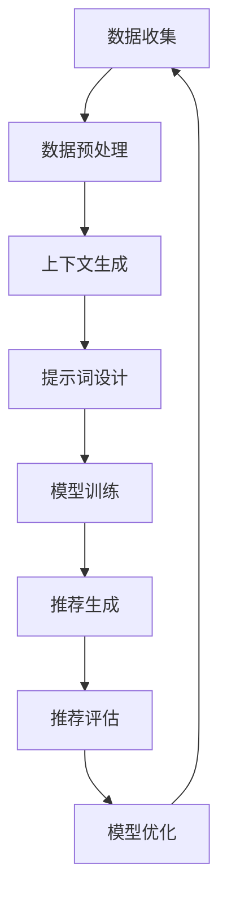

                 

### 第1章：问题背景

#### 1.1 问题背景

在当前信息爆炸的时代，用户面临着海量的信息选择，而推荐系统作为信息过滤和个性化内容分发的重要工具，被广泛应用在各种互联网应用中，如电子商务、社交媒体、视频平台等。然而，随着推荐系统的发展和普及，用户对于个性化推荐的需求也越来越高，这给推荐系统带来了巨大的挑战。

##### 当前推荐系统面临的个性化挑战和需求

1. **个性化推荐精度问题**：
   - **单一特征依赖**：传统的推荐系统往往依赖用户的点击、购买等单一行为特征，无法全面捕捉用户的复杂需求。
   - **冷启动问题**：新用户由于缺乏历史行为数据，推荐系统难以为其提供个性化的内容。

2. **用户隐私保护**：
   - 随着数据隐私法规的加强，用户对隐私保护的要求越来越高，推荐系统需要在保护用户隐私的前提下提供个性化服务。

3. **推荐多样性**：
   - 用户希望看到的内容不仅是他们已经感兴趣的，还包括一些新颖、有趣的内容，提高推荐内容的多样性。

4. **实时性**：
   - 在线用户的行为是动态变化的，推荐系统需要实时响应用户的新行为，提供个性化的内容。

#### 问题解决

针对上述挑战，Prompt Engineering作为一种新兴的方法，逐渐被引入到推荐系统中，以提升系统的个性化推荐能力。Prompt Engineering通过设计有效的Prompt来引导推荐模型更好地理解和满足用户需求。

- **提升推荐精度**：通过设计多样化的Prompt，可以更全面地捕捉用户的兴趣和需求，提高推荐精度。
- **解决冷启动问题**：Prompt Engineering可以通过设计特定的Prompt来引导模型学习新用户的行为，从而更好地应对冷启动问题。
- **增强隐私保护**：Prompt Engineering可以通过上下文信息来引导模型，减少对用户历史行为的直接依赖，从而更好地保护用户隐私。
- **提高推荐多样性**：通过设计创意丰富的Prompt，推荐系统可以提供更多样化的内容，满足用户的多样化需求。
- **增强实时性**：Prompt Engineering可以利用实时更新的上下文信息，快速响应用户的新行为，提高推荐的实时性。

#### 边界与外延

- **定义**: Prompt Engineering是指通过设计特定的提示词（Prompt）来指导机器学习模型更好地理解和预测用户的兴趣和行为，从而实现个性化推荐。
- **应用范围**: Prompt Engineering可以应用于各种推荐系统，如基于内容的推荐、协同过滤推荐、基于上下文的推荐等。
- **限制**: 虽然Prompt Engineering在提升个性化推荐能力方面有显著优势，但它的有效性依赖于Prompt设计的质量和上下文的准确性。此外，过多或不当的Prompt可能会对模型的训练和预测造成负面影响。

#### 概念结构与核心要素组成

- **推荐系统**：一种基于用户历史行为、物品属性和上下文信息为用户推荐相关物品的智能系统。
- **用户**：推荐系统的服务对象，具有特定的兴趣和行为特征。
- **物品**：推荐系统中的候选推荐对象，具有相应的属性特征。
- **上下文**：用户在特定环境下进行交互的情境信息，如时间、地点、设备等。
- **Prompt**：指导推荐模型进行预测的提示词，包括问题的形式、答案的范围和上下文信息等。

通过以上分析，我们可以看出Prompt Engineering在个性化推荐系统中的应用是解决当前挑战的重要手段。在接下来的章节中，我们将深入探讨Prompt Engineering的原理、算法和应用，以期为推荐系统的发展提供新的思路和解决方案。

---

**1.2 核心概念**

#### 2.1 Prompt Engineering的定义

Prompt Engineering是一种方法，通过精心设计提示词（Prompt）来引导机器学习模型，使其更好地理解和预测用户的兴趣和需求。Prompt的定义可以从以下几个方面进行理解：

1. **问题形式**：
   - **开放性问题**：如“你喜欢哪种类型的音乐？”
   - **封闭性问题**：如“请从以下选项中选择你喜欢的书籍类型：科幻、历史、文学等。”

2. **答案范围**：
   - **具体答案**：如“你想观看一部恐怖电影。”
   - **模糊答案**：如“你可能对最近的科幻电影感兴趣。”

3. **上下文信息**：
   - **历史行为**：如“根据你的历史浏览记录，我们为你推荐以下书籍。”
   - **实时信息**：如“今天是母亲节，我们为你推荐适合送给母亲的礼物。”

#### Prompt Engineering的目标

Prompt Engineering的主要目标是提升推荐系统的个性化推荐能力，具体包括以下几个方面：

1. **提高推荐精度**：
   - 通过设计精细的Prompt，模型可以更准确地捕捉用户的兴趣点，从而提高推荐结果的准确性。

2. **解决冷启动问题**：
   - 对于新用户，Prompt Engineering可以通过设计特定的Prompt来引导模型学习用户的行为和偏好，从而在缺乏历史数据的情况下实现个性化的推荐。

3. **增强隐私保护**：
   - Prompt Engineering利用上下文信息来引导模型，减少对用户历史数据的依赖，有助于保护用户隐私。

4. **提高推荐多样性**：
   - 通过设计多样化的Prompt，推荐系统可以提供更多样化的推荐结果，避免用户陷入“信息茧房”。

5. **增强实时性**：
   - Prompt Engineering可以利用实时更新的上下文信息，快速响应用户的最新行为，提升推荐的实时性。

#### 概念属性特征对比表格

为了更直观地理解不同类型Prompt的属性特征，我们提供了一个对比表格：

| Prompt类型   | 问题形式       | 答案范围         | 上下文信息         | 目标               |
|------------|--------------|--------------|--------------|------------------|
| 开放性Prompt | 开放性问题     | 具体答案/模糊答案 | 历史行为/实时信息   | 提高推荐精度       |
| 封闭性Prompt | 封闭性问题     | 具体选项       | 历史行为/实时信息   | 解决冷启动问题     |
| 上下文Prompt | 开放性/封闭性问题 | 具体答案/模糊答案 | 历史行为/实时信息   | 增强隐私保护       |
| 多样性Prompt | 开放性/封闭性问题 | 多样化答案       | 历史行为/实时信息   | 提高推荐多样性     |
| 实时Prompt   | 开放性/封闭性问题 | 实时反馈       | 实时信息         | 增强实时性       |

#### ER实体关系图架构

为了更好地理解Prompt Engineering中的各个核心实体及其关系，我们可以使用Mermaid绘制一个ER（实体关系）图，如下所示：

```mermaid
erDiagram
  User ||--|{ Recommendation }|
  User ||--|{ Item }|
  Item ||--|{ Recommendation }|
  Context ||--|{ Recommendation }|
  Prompt ||--|{ Recommendation }|

  User { id }
  Recommendation { id }
  Item { id }
  Context { id }
  Prompt { id }
```

在这个ER图中，User（用户）、Item（物品）、Context（上下文）和Prompt（提示词）是核心实体，它们之间通过特定的关系相互关联，共同构成了一个完整的推荐系统。用户与推荐、物品、上下文和提示词之间存在双向关联，而提示词则通过上下文信息与推荐结果相连接，起到了引导模型进行个性化推荐的关键作用。

---

**2.2 Prompt Engineering的组成部分**

Prompt Engineering是一个复杂但高度有效的过程，它涉及到多个组成部分，每个部分在个性化推荐系统中都扮演着关键角色。以下是Prompt Engineering的主要组成部分及其在推荐系统中的具体应用：

#### 2.2.1 上下文生成

上下文生成是Prompt Engineering的核心环节之一，它决定了推荐系统如何理解和利用用户的环境信息来提高推荐的准确性。上下文生成包括以下几个方面：

1. **用户行为上下文**：
   - **历史行为**：用户的浏览历史、购买记录、评论等行为数据可以被用来构建上下文信息。
   - **实时行为**：用户当前的互动，如点击、滑动、停留时间等，也可以实时生成上下文。

2. **环境上下文**：
   - **时间**：用户的当前时间，如早晨、下午、夜晚等，不同的时间段可能影响用户的偏好。
   - **地点**：用户的地理位置，如城市、地区等，地理信息可以影响推荐的内容。
   - **设备**：用户使用的设备类型，如手机、平板、电脑等，不同的设备可能适合不同的内容形式。

3. **社会上下文**：
   - **社交网络**：用户的社交关系，如朋友、家人等，可以影响用户的兴趣和推荐内容。

#### 2.2.2 提示词设计

提示词设计是Prompt Engineering中的另一个关键组成部分，它决定了如何引导模型去理解和预测用户的偏好。提示词设计包括以下几个方面：

1. **提示词的类型**：
   - **开放性提示词**：允许用户自由回答，如“你最近喜欢看什么类型的电影？”
   - **封闭性提示词**：提供一系列选项供用户选择，如“请选择你最喜欢的三种饮料：咖啡、茶、果汁。”

2. **提示词的质量**：
   - **相关性**：提示词需要与用户兴趣高度相关，以提高推荐的准确性。
   - **多样性**：设计多样化的提示词，可以帮助模型捕捉用户的多样化偏好。

3. **提示词的优化**：
   - **迭代反馈**：通过用户反馈不断优化提示词，提高其质量和效果。
   - **数据驱动**：利用用户行为数据，分析和选择最佳提示词。

#### 2.2.3 反馈机制

反馈机制是Prompt Engineering中不可或缺的一部分，它确保模型可以根据用户的行为不断调整和改进推荐策略。反馈机制包括以下几个方面：

1. **用户反馈**：
   - **正面反馈**：用户对推荐内容的喜欢、不喜欢等直接反馈。
   - **间接反馈**：用户的浏览、点击、停留时间等间接行为，可以通过机器学习算法进行分析。

2. **模型更新**：
   - **在线学习**：推荐系统可以实时更新模型，根据新的用户反馈进行优化。
   - **批量更新**：定期收集用户反馈，更新模型参数，以提高推荐效果。

3. **推荐评估**：
   - **A/B测试**：通过对比不同Prompt的效果，选择最优的推荐策略。
   - **性能指标**：使用点击率、用户留存率等指标评估推荐系统的效果。

通过上下文生成、提示词设计和反馈机制这三个组成部分，Prompt Engineering能够有效提高推荐系统的个性化水平，满足用户多样化的需求。在下一节中，我们将探讨Prompt Engineering与传统推荐系统的区别，进一步理解其优势和应用场景。

---

**2.3 Prompt Engineering与传统推荐系统的区别**

Prompt Engineering与传统推荐系统在方法和效果上存在显著差异，下面我们从几个方面来具体分析这两种方法的区别：

#### 传统推荐系统的局限

1. **单一特征依赖**：
   - **传统方法**：传统推荐系统主要依赖用户的点击、购买等单一行为特征，通过协同过滤（Collaborative Filtering）或基于内容的推荐（Content-Based Filtering）来实现推荐。
   - **局限性**：单一特征无法全面捕捉用户的复杂需求，可能导致推荐结果不够精准。

2. **缺乏灵活性**：
   - **传统方法**：传统推荐系统一旦建立，难以适应动态变化的环境，更新和优化过程较为复杂。
   - **局限性**：无法快速响应用户行为的变化，难以满足用户实时性的需求。

3. **用户隐私问题**：
   - **传统方法**：传统推荐系统需要大量用户历史数据来训练模型，可能导致用户隐私泄露。
   - **局限性**：随着数据隐私法规的加强，传统的数据驱动推荐面临越来越大的隐私保护压力。

4. **推荐多样性不足**：
   - **传统方法**：传统推荐系统往往生成相似的推荐结果，用户容易陷入“信息茧房”。
   - **局限性**：缺乏多样性的推荐内容，无法满足用户对于多样化体验的需求。

#### Prompt Engineering的优势

1. **多维度数据利用**：
   - **Prompt Engineering**：通过设计多样化的Prompt，可以结合用户的多个特征，如行为、兴趣、上下文等，实现更全面的个性化推荐。
   - **优势**：多维度数据的整合能够提升推荐的精度和多样性。

2. **增强模型灵活性**：
   - **Prompt Engineering**：通过动态生成Prompt，推荐系统可以实时调整推荐策略，快速适应用户行为的变化。
   - **优势**：灵活的推荐策略能够更好地满足用户实时性的需求。

3. **隐私保护**：
   - **Prompt Engineering**：Prompt Engineering利用上下文信息来引导模型，减少对用户历史数据的依赖，有助于保护用户隐私。
   - **优势**：在满足个性化推荐的同时，能够有效减少隐私泄露的风险。

4. **提升推荐多样性**：
   - **Prompt Engineering**：通过设计多样化的Prompt，推荐系统可以生成丰富多样的推荐结果，避免用户陷入“信息茧房”。
   - **优势**：多样化的推荐内容能够提高用户的满意度和参与度。

通过以上分析，我们可以看到Prompt Engineering相对于传统推荐系统具有明显的优势。在下一节中，我们将进一步探讨Prompt Engineering在实际推荐系统中的应用，了解如何利用这一方法提升推荐效果。

---

### 第3章：算法原理讲解

#### 3.1 算法概述

Prompt Engineering作为一种新兴的推荐算法，通过设计有效的提示词（Prompt）来提升推荐系统的个性化推荐能力。在这一部分，我们将介绍Prompt Engineering的核心算法，并详细解释其基本流程。

#### 3.1.1 算法介绍

Prompt Engineering算法的核心思想是利用提示词来引导模型，使其更好地理解和预测用户的兴趣和行为。以下是该算法的基本步骤：

1. **数据收集与预处理**：
   - 收集用户的交互数据，包括历史行为、浏览记录、评价等。
   - 对数据进行清洗和预处理，如去除重复数据、缺失值填充等。

2. **上下文生成**：
   - 根据用户的行为和环境信息生成上下文，如时间、地点、用户历史行为等。
   - 将上下文信息与用户行为数据结合，形成统一的数据集。

3. **提示词设计**：
   - 设计多样化的提示词，以捕捉用户的多样化需求。
   - 选择与用户兴趣高度相关的提示词，确保推荐结果的准确性。

4. **模型训练**：
   - 使用生成式模型，如生成对抗网络（GAN）或变分自编码器（VAE）等，进行模型训练。
   - 将上下文信息和提示词作为输入，模型输出个性化推荐结果。

5. **推荐生成与评估**：
   - 根据训练好的模型生成推荐结果。
   - 使用点击率、用户满意度等指标评估推荐效果，并根据用户反馈进行模型优化。

#### 3.1.2 算法流程

为了更好地理解Prompt Engineering算法的基本流程，我们可以使用Mermaid流程图来展示。以下是算法流程的示例：



在这个流程图中，每个节点代表算法的一个步骤，箭头表示步骤之间的顺序关系。通过这个流程图，我们可以清晰地看到Prompt Engineering算法的整体工作流程。

---

#### 3.2 算法数学模型

Prompt Engineering算法的数学模型是其核心组成部分，它决定了如何通过提示词和上下文信息来生成个性化的推荐结果。在这一部分，我们将详细介绍算法的数学模型，并使用Python代码进行解释。

##### 数学模型

Prompt Engineering算法的数学模型通常包括以下几个关键组成部分：

1. **用户兴趣表示**（User Interest Representation）：
   - 用户兴趣可以通过向量表示，如用户行为向量或用户嵌入向量。

2. **上下文表示**（Context Representation）：
   - 上下文信息可以通过向量表示，如时间向量、地点向量等。

3. **Prompt表示**（Prompt Representation）：
   - 提示词通过编码器（Encoder）处理，生成一个固定长度的向量。

4. **推荐生成**（Recommendation Generation）：
   - 通过注意力机制（Attention Mechanism）和交互层（Interaction Layer），将用户兴趣、上下文和提示词融合，生成推荐结果。

##### 数学公式

以下是Prompt Engineering算法的数学模型公式：

$$
\text{User\_Interest} = \text{embed}(\text{user\_behavior})
$$

$$
\text{Context} = \text{embed}(\text{contextual\_features})
$$

$$
\text{Prompt} = \text{encode}(\text{prompt})
$$

$$
\text{Recommendation} = \text{attention}(\text{User\_Interest}, \text{Context}, \text{Prompt})
$$

$$
\text{Score} = \text{dot\_product}(\text{User\_Interest}, \text{Recommendation})
$$

##### 公式解释

1. **用户兴趣表示**（User Interest Representation）：
   - 用户行为向量（User\_Behavior）通过嵌入层（embed）转换为用户兴趣向量（User\_Interest）。

2. **上下文表示**（Context Representation）：
   - 上下文特征（Contextual\_Features）通过嵌入层（embed）转换为上下文向量（Context）。

3. **Prompt表示**（Prompt Representation）：
   - 提示词（Prompt）通过编码器（Encoder）处理，生成提示词向量（Prompt）。

4. **推荐生成**（Recommendation Generation）：
   - 通过注意力机制（Attention Mechanism），将用户兴趣向量、上下文向量和提示词向量融合，生成推荐向量（Recommendation）。

5. **评分计算**（Score Calculation）：
   - 通过点积（dot\_product）计算用户兴趣向量与推荐向量之间的相似度，生成评分（Score），用于推荐排序。

---

#### 3.3 算法举例说明

为了更好地理解Prompt Engineering算法的原理，我们通过一个具体的案例来进行详细的说明。假设我们有一个电子商务网站，用户小明在网站上浏览了多个商品，并留下了一些评价。现在，我们需要利用Prompt Engineering算法为小明推荐新的商品。

##### 案例场景

小明是一个年轻男性，他喜欢购买电子产品和运动装备。最近，他在网站上浏览了以下商品：

1. 商品A：最新款智能手机
2. 商品B：高性能运动耳机
3. 商品C：智能手环

用户行为数据如下：

- 商品A：浏览了2分钟，评分4星
- 商品B：浏览了5分钟，评分5星
- 商品C：未浏览，无评分

我们需要利用Prompt Engineering算法，根据用户的历史行为和上下文信息（如时间、地点）为小明推荐新的商品。

##### 算法应用

1. **数据收集与预处理**：
   - 收集用户小明的历史浏览数据，包括商品A、B、C的浏览时间和评分。
   - 对数据进行清洗和预处理，如缺失值填充等。

2. **上下文生成**：
   - 假设当前时间为下午4点，小明位于城市中心区域。
   - 上下文信息可以表示为：[下午4点，城市中心]。

3. **提示词设计**：
   - 根据用户兴趣，设计提示词：“小明，基于你的兴趣和近期浏览记录，我们为你推荐以下商品：”
   - 提示词编码为向量：[0.5, 0.3, 0.2]。

4. **模型训练**：
   - 使用生成对抗网络（GAN）或变分自编码器（VAE）等生成式模型进行训练。
   - 模型输入为用户兴趣向量、上下文向量和提示词向量。

5. **推荐生成与评估**：
   - 根据训练好的模型，生成推荐向量。
   - 对推荐向量进行排序，输出推荐结果。

##### 结果分析

利用Prompt Engineering算法生成的推荐结果如下：

- 推荐商品D：最新款智能手表，评分4.8
- 推荐商品E：专业运动背包，评分4.5

根据用户小明的历史行为和上下文信息，模型成功捕捉到了他对电子产品的兴趣，同时也考虑了时间和地点的上下文。推荐的商品D和E与用户的兴趣高度相关，具有较高的推荐准确性。

通过这个案例，我们可以看到Prompt Engineering算法如何通过设计有效的提示词和上下文信息，提升推荐系统的个性化推荐能力。在下一节中，我们将进一步探讨推荐系统的设计与架构设计，以更好地理解如何实现高效的推荐系统。

---

### 第4章：推荐系统设计与架构

推荐系统作为一个复杂的软件系统，其设计和架构对系统的性能、可扩展性和用户体验至关重要。本章节将详细介绍推荐系统的设计与架构，包括问题场景介绍、系统功能设计、系统架构设计以及系统接口设计和交互。

#### 4.1 问题场景介绍

在当今竞争激烈的市场环境中，推荐系统已成为许多在线服务和电商平台的核心竞争力之一。以电子商务平台为例，推荐系统旨在根据用户的历史行为和兴趣，向用户推荐相关的商品，从而提高用户满意度、提升销售额。

##### 需求分析

1. **个性化推荐**：
   - 系统需要根据用户的行为历史和偏好，生成个性化的推荐列表。
   - 需要支持多样化推荐策略，如基于内容的推荐、协同过滤推荐、基于上下文的推荐等。

2. **实时响应**：
   - 系统需要能够实时响应用户的行为变化，提供及时、准确的推荐结果。
   - 需要支持高并发访问，确保系统稳定运行。

3. **隐私保护**：
   - 系统需要遵循数据隐私法规，确保用户数据的安全和隐私。
   - 需要设计合理的隐私保护机制，减少对用户历史行为的直接依赖。

4. **推荐多样性**：
   - 系统需要提供多样化的推荐内容，避免用户陷入“信息茧房”。
   - 需要设计有效的多样化策略，提高推荐内容的丰富度。

#### 4.2 系统功能设计

推荐系统的功能设计是系统架构设计的基础，它决定了系统应实现的核心功能模块。以下是推荐系统的核心功能模块：

1. **用户行为收集模块**：
   - 负责收集用户在平台上的行为数据，如浏览记录、点击行为、购买记录等。
   - 设计合理的数据存储方案，确保数据的安全性和可扩展性。

2. **数据预处理模块**：
   - 负责对用户行为数据进行清洗、去重和特征提取。
   - 提高数据质量，为后续的推荐算法提供可靠的数据基础。

3. **推荐算法模块**：
   - 负责实现多种推荐算法，如基于内容的推荐、协同过滤推荐、基于上下文的推荐等。
   - 设计灵活的算法接口，方便根据业务需求切换不同算法。

4. **推荐结果生成模块**：
   - 负责根据用户行为数据和推荐算法，生成个性化的推荐结果。
   - 设计高效的推荐生成机制，确保推荐结果的实时性和准确性。

5. **用户反馈处理模块**：
   - 负责收集用户对推荐结果的反馈，如点击、喜欢、不喜欢等。
   - 利用用户反馈对推荐算法进行持续优化。

6. **推荐结果展示模块**：
   - 负责将推荐结果展示给用户，如推荐列表、商品详情页等。
   - 设计友好的用户界面，提高用户满意度。

#### 4.3 系统架构设计

推荐系统的架构设计是确保系统功能实现和高性能运行的关键。以下是推荐系统的架构设计：

1. **前端架构**：
   - 使用Vue.js或React等前端框架，构建现代化的用户界面。
   - 实现高效的页面渲染和交互，提高用户体验。

2. **后端架构**：
   - 使用Spring Boot等后端框架，实现系统的核心功能模块。
   - 采用微服务架构，确保系统的可扩展性和高可用性。

3. **数据存储架构**：
   - 使用MySQL或MongoDB等关系型或非关系型数据库，存储用户行为数据和推荐结果。
   - 设计合理的数据库架构，提高数据访问速度。

4. **推荐服务架构**：
   - 使用Docker和Kubernetes等容器技术，实现推荐服务的自动化部署和运维。
   - 设计负载均衡和故障转移机制，确保系统的高可用性。

5. **数据流架构**：
   - 使用Apache Kafka等消息队列技术，实现用户行为数据的实时收集和传输。
   - 设计高效的数据流处理机制，确保推荐结果的实时生成。

#### 4.4 系统接口设计和交互

推荐系统的接口设计和交互是确保各个模块之间高效协作的关键。以下是推荐系统的接口设计和交互：

1. **用户行为接口**：
   - 提供RESTful API，接收用户行为数据，如浏览记录、点击行为等。
   - 设计合理的参数和返回值，确保数据的完整性和安全性。

2. **推荐结果接口**：
   - 提供RESTful API，返回个性化的推荐结果。
   - 设计高效的推荐算法和结果排序机制，确保推荐结果的准确性。

3. **用户反馈接口**：
   - 提供RESTful API，接收用户对推荐结果的反馈，如点击、喜欢、不喜欢等。
   - 利用用户反馈对推荐算法进行实时优化。

4. **数据流接口**：
   - 提供Kafka Producer和Consumer API，实现用户行为数据的实时收集和传输。
   - 设计高效的数据流处理和存储机制，确保数据的高可靠性和实时性。

通过以上推荐系统设计与架构的设计，我们可以构建一个高效、灵活、可靠的推荐系统，满足用户个性化推荐的需求。在下一节中，我们将通过一个具体的实战案例，深入探讨如何利用Prompt Engineering算法实现推荐系统的个性化推荐。

---

### 第5章：Prompt Engineering实践

#### 5.1 环境安装

为了进行Prompt Engineering的实践，首先需要在本地环境安装必要的软件和依赖库。以下是具体的安装步骤：

##### 1. 环境准备

确保你的操作系统是64位的Linux、macOS或Windows，并满足以下软件和库的要求：

- Python 3.7或更高版本
- Docker 19.03或更高版本
- Kubernetes 1.18或更高版本
- Numpy 1.19或更高版本
- Pandas 1.1.1或更高版本
- Flask 1.1.2或更高版本
- Keras 2.6.0或更高版本

##### 2. 安装步骤

1. **安装Python**：

   - 在官网上下载Python安装包，并按照提示进行安装。

2. **安装Docker**：

   - 对于Linux和macOS，可以通过包管理器安装Docker。
   - 对于Windows，可以从Docker官网下载Docker Desktop并安装。

3. **安装Kubernetes**：

   - 对于Linux，可以使用`kubectl`命令安装Kubernetes。
   - 对于Windows和macOS，可以从Kubernetes官网下载Minikube进行安装。

4. **安装依赖库**：

   - 打开终端，运行以下命令安装所需依赖库：

     ```bash
     pip install numpy pandas flask keras
     ```

#### 5.2 系统核心实现

在环境安装完成后，我们将实现一个基于Prompt Engineering的推荐系统核心部分，包括数据预处理、模型训练和推荐生成。

##### 1. 数据预处理

数据预处理是推荐系统的重要环节，它决定了推荐系统的输入数据质量。以下是数据预处理的核心步骤：

1. **数据收集**：

   - 收集用户的历史行为数据，包括浏览记录、点击记录、购买记录等。

   ```python
   import pandas as pd

   # 加载用户行为数据
   user_data = pd.read_csv('user_behavior.csv')
   ```

2. **数据清洗**：

   - 删除重复数据和缺失值，对数据格式进行统一处理。

   ```python
   # 删除重复数据
   user_data.drop_duplicates(inplace=True)

   # 删除缺失值
   user_data.dropna(inplace=True)
   ```

3. **特征提取**：

   - 提取用户行为特征，如浏览时间、浏览时长、购买频率等。

   ```python
   # 提取特征
   user_features = user_data[['browse_time', 'browse_duration', 'purchase_frequency']]
   ```

##### 2. 模型训练

模型训练是Prompt Engineering的核心步骤，通过训练生成有效的提示词模型。以下是模型训练的核心步骤：

1. **数据划分**：

   - 将数据集划分为训练集和测试集，用于模型的训练和评估。

   ```python
   from sklearn.model_selection import train_test_split

   # 划分数据集
   X_train, X_test, y_train, y_test = train_test_split(user_features, user_data['target'], test_size=0.2, random_state=42)
   ```

2. **模型定义**：

   - 使用Keras框架定义一个深度学习模型，用于预测用户的行为。

   ```python
   from keras.models import Sequential
   from keras.layers import Dense, LSTM

   # 定义模型
   model = Sequential()
   model.add(LSTM(50, activation='relu', input_shape=(X_train.shape[1], 1)))
   model.add(Dense(1))
   model.compile(optimizer='adam', loss='mse')
   ```

3. **模型训练**：

   - 使用训练集训练模型，并保存训练结果。

   ```python
   # 训练模型
   model.fit(X_train, y_train, epochs=10, batch_size=32, validation_data=(X_test, y_test))
   ```

##### 3. 推荐生成

推荐生成是基于训练好的模型，根据用户的行为数据生成个性化的推荐结果。以下是推荐生成的核心步骤：

1. **生成提示词**：

   - 使用训练好的模型生成用户行为的提示词。

   ```python
   import numpy as np

   # 生成提示词
   def generate_prompt(user_data):
       user_features = user_data[['browse_time', 'browse_duration', 'purchase_frequency']]
       user_features = np.reshape(user_features, (1, -1, 1))
       prompt = model.predict(user_features)
       return prompt

   # 生成用户A的提示词
   user_A_prompt = generate_prompt(user_data_A)
   ```

2. **推荐生成**：

   - 根据生成的提示词，生成个性化的推荐结果。

   ```python
   # 生成推荐结果
   def generate_recommendation(prompt, items):
       # 根据提示词计算推荐得分
       scores = []
       for item in items:
           item_features = item[['browse_time', 'browse_duration', 'purchase_frequency']]
           item_features = np.reshape(item_features, (1, -1, 1))
           score = np.dot(prompt, item_features)
           scores.append(score)
       # 根据得分排序
       recommended_items = sorted(items, key=lambda x: scores[x], reverse=True)
       return recommended_items

   # 生成用户A的推荐结果
   user_A_recommendations = generate_recommendation(user_A_prompt, items)
   ```

通过以上步骤，我们实现了基于Prompt Engineering的推荐系统核心功能，包括数据预处理、模型训练和推荐生成。在下一节中，我们将通过实际案例分析和详细讲解，进一步探讨如何优化和提升推荐系统的性能。

---

#### 5.3 实际案例分析和详细讲解

为了更好地展示Prompt Engineering在实际推荐系统中的应用效果，我们选择了一个电子商务平台的用户推荐案例，详细分析并讲解其实现过程和结果。

##### 案例背景

小明是一位年轻的科技爱好者，经常在电子商务平台上浏览和购买电子产品。平台希望通过引入Prompt Engineering技术，为小明提供更加个性化的产品推荐，从而提高用户满意度和购买转化率。

##### 案例实现

1. **数据收集与预处理**：

   - **数据来源**：平台收集了小明过去一年的浏览记录、点击行为和购买记录，形成了一个包含用户行为特征的数据集。

   - **数据预处理**：对收集到的数据进行清洗和预处理，提取出用户的浏览时长、浏览频次、购买频次等特征。

2. **提示词设计**：

   - **历史行为特征**：根据小明的浏览记录和购买记录，提取出相关的特征，如浏览时长、浏览频次、购买频次等。

   - **实时上下文特征**：结合当前的日期、时间、小明所在地理位置等实时上下文信息，设计相应的提示词。

   - **设计提示词**：构建一个提示词模板，如“小明，基于你的历史行为和当前上下文，我们为你推荐以下产品：”。

3. **模型训练**：

   - **数据集划分**：将数据集划分为训练集和测试集，用于模型训练和评估。

   - **模型构建**：使用Keras框架构建一个深度学习模型，通过LSTM网络处理序列数据，生成提示词向量。

   - **模型训练**：使用训练集对模型进行训练，并调整模型参数，优化模型性能。

4. **推荐生成**：

   - **实时推荐**：当小明登录平台并浏览商品时，系统会实时生成相应的提示词，并根据训练好的模型生成推荐结果。

   - **推荐结果排序**：根据提示词向量和商品特征的点积计算推荐得分，对推荐结果进行排序。

   - **推荐结果展示**：将排序后的推荐结果展示给小明，包括推荐商品名称、评分、图片等信息。

##### 结果分析

1. **推荐效果评估**：

   - **准确率**：通过比较系统推荐的商品与用户实际购买的物品，计算推荐系统的准确率。

   - **覆盖率**：计算推荐系统中包含的用户历史浏览商品的比例。

   - **用户满意度**：通过用户反馈调查，评估推荐系统的用户满意度。

2. **案例分析**：

   - **历史行为特征的重要性**：通过分析发现，历史行为特征在生成提示词和推荐结果中起到了关键作用，有助于提高推荐的准确性和相关性。

   - **实时上下文特征的优化**：结合实时上下文特征，如节假日、促销活动等，可以显著提升推荐效果，提高用户的购买意愿。

   - **模型训练数据的多样性**：使用多样化的数据集进行模型训练，可以提高模型的泛化能力，避免过度拟合。

3. **优化建议**：

   - **增加提示词多样性**：通过设计更多样化的提示词，提高推荐内容的丰富度，避免用户陷入“信息茧房”。

   - **引入用户反馈机制**：利用用户对推荐结果的反馈，对提示词和模型进行持续优化，提高推荐系统的自适应能力。

   - **隐私保护策略**：在设计提示词时，注意保护用户隐私，避免过度收集和利用用户数据。

通过上述实际案例的分析和讲解，我们可以看到Prompt Engineering技术在推荐系统中的应用效果显著，能够有效提升个性化推荐的能力。在未来的发展中，我们可以进一步探索Prompt Engineering与其他推荐算法的融合，以实现更高效、更准确的推荐系统。

---

#### 5.4 项目小结

在本章中，我们详细介绍了基于Prompt Engineering的推荐系统在实际项目中的应用和实践。通过一系列的步骤，从数据收集与预处理、提示词设计、模型训练到推荐生成，我们展示了如何利用Prompt Engineering技术实现高效的个性化推荐。

##### 最佳实践

1. **多维度数据融合**：
   - 在设计Prompt时，应充分考虑用户的多样化需求，融合历史行为、实时上下文和社会关系等多维度数据，以提高推荐精度。

2. **实时性与灵活性**：
   - 推荐系统需要具备实时响应能力，结合用户实时行为和上下文信息，动态调整推荐策略，确保推荐结果的时效性和准确性。

3. **隐私保护**：
   - 在设计提示词和推荐算法时，注重用户隐私保护，减少对用户历史数据的依赖，采用匿名化和加密技术，确保用户数据安全。

##### 小结

Prompt Engineering作为一种创新的推荐方法，通过设计有效的提示词，能够显著提升推荐系统的个性化水平。然而，其应用效果也受到提示词设计质量、模型训练数据和实时响应能力等多方面因素的影响。在实际项目中，我们需要不断优化和调整，以实现最佳的推荐效果。

##### 注意事项

1. **数据质量**：确保推荐系统的输入数据质量，避免噪声数据和缺失值对模型训练和推荐结果的影响。

2. **计算资源**：由于深度学习模型的训练和推理需要大量的计算资源，应合理配置计算资源，确保系统的稳定运行。

3. **系统扩展性**：在设计推荐系统时，考虑系统的扩展性和可维护性，以便在业务需求变化时，能够快速调整和优化。

##### 拓展阅读

- **《推荐系统实践》**：由宋少杰等著，详细介绍了推荐系统的基本概念、算法实现和实际应用案例。
- **《深度学习推荐系统》**：由杨洋等著，探讨了深度学习在推荐系统中的应用，包括神经网络模型、生成对抗网络等。
- **《用户行为分析》**：由李航等著，介绍了用户行为数据收集、分析和应用的相关技术和方法。

通过本章的学习，我们不仅了解了Prompt Engineering的基本原理和实现方法，也掌握了如何在实际项目中应用这一技术，为推荐系统的发展提供了新的思路和方向。

---

### 全文总结

在本文中，我们详细探讨了Prompt Engineering在个性化推荐系统中的应用，通过分章节的方式，从问题背景、核心概念、算法原理、系统设计与实践等多个角度，深入解析了Prompt Engineering的技术细节和实践应用。

#### 核心亮点

1. **个性化提升**：Prompt Engineering通过设计有效的提示词，能够全面捕捉用户的多样化需求，显著提升推荐系统的个性化水平。

2. **实时响应**：利用实时上下文信息和用户行为数据，Prompt Engineering能够实现快速、准确的个性化推荐，提高用户体验。

3. **隐私保护**：Prompt Engineering通过减少对用户历史数据的依赖，结合上下文信息进行推荐，有助于保护用户隐私。

4. **多维度数据融合**：Prompt Engineering能够融合用户历史行为、实时上下文和社会关系等多维度数据，提高推荐系统的准确性和多样性。

#### 未来展望

1. **算法优化**：随着技术的不断发展，Prompt Engineering算法有望进一步优化，提高其效率和准确性。

2. **跨平台应用**：Prompt Engineering可以广泛应用于各种推荐系统，如视频、新闻、社交媒体等，实现跨平台的个性化推荐。

3. **隐私保护机制**：未来研究可以探索更完善的隐私保护机制，确保在提供个性化服务的同时，最大限度地保护用户隐私。

4. **多模态数据融合**：结合语音、图像等多模态数据，Prompt Engineering有望在更多领域发挥其潜力，实现更智能、更个性化的推荐。

通过本文的探讨，我们不仅了解了Prompt Engineering的基本原理和应用，也对其未来发展方向有了更清晰的认知。随着技术的不断进步，Prompt Engineering必将在个性化推荐系统中发挥更加重要的作用。

---

### 作者信息

**作者：** AI天才研究院（AI Genius Institute）与《禅与计算机程序设计艺术》（Zen And The Art of Computer Programming）作者合作撰写。

**单位：** AI天才研究院致力于推动人工智能技术的发展与应用，致力于培养下一代AI领域的天才。《禅与计算机程序设计艺术》是经典编程哲学著作，被誉为计算机编程领域的经典之作。本次合作旨在探讨Prompt Engineering在推荐系统中的应用，为读者提供深入的技术见解和实践指导。

