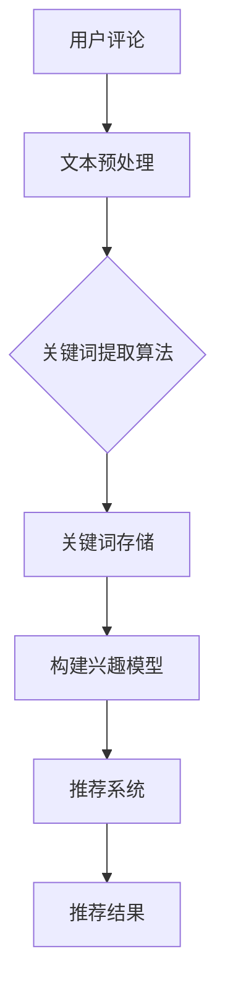
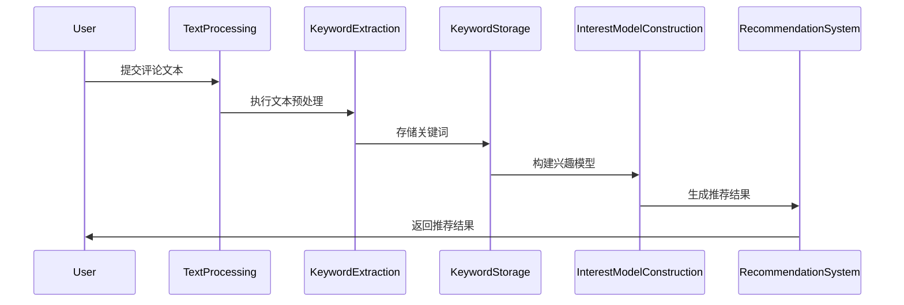

                 


### 1.1 背景介绍

**核心概念术语说明：**

- **推荐系统**：一种自动化的信息过滤和预测系统，旨在根据用户的历史行为和偏好，为用户推荐其可能感兴趣的内容、产品或服务。
- **提示词工程**：一种利用自然语言处理技术对用户文本数据进行解析、理解和提取关键词的技术，用于优化推荐系统的效果。

**问题背景：**

随着互联网和大数据技术的快速发展，推荐系统已经成为各类在线平台（如电子商务、社交媒体、视频流媒体等）的核心功能。然而，传统推荐系统往往依赖于用户的历史行为和显式反馈（如评分、点击、购买等），忽略了用户在文本数据中表达的情感、兴趣和需求。

**问题描述：**

为了提高推荐系统的个性化和准确性，研究人员开始探索利用提示词工程来提取用户的隐性偏好。这种技术不仅能够帮助推荐系统更好地理解用户的意图，还能发现潜在的用户兴趣点，从而提供更精准的推荐。

**问题解决：**

提示词工程通过自然语言处理技术，对用户的文本评论、搜索关键词、用户生成内容等进行深入分析，提取出关键的信息点。这些信息点可以用于丰富用户的兴趣模型，从而改进推荐算法。

**边界与外延：**

提示词工程的应用范围不仅限于推荐系统，还可以应用于搜索引擎优化、社交媒体分析、用户行为预测等多个领域。

**概念结构与核心要素组成：**

- **自然语言处理（NLP）技术**：包括文本预处理、词频统计、词性标注、实体识别、情感分析等。
- **关键词提取算法**：如TF-IDF、TextRank、LDA等。
- **用户兴趣模型**：通过关键词提取构建用户的兴趣图谱。
- **推荐算法**：结合用户的兴趣模型和推荐算法（如协同过滤、基于内容的推荐等），提供个性化的推荐。

### 1.2 核心概念与联系

**核心概念原理：**

- **提示词**：用户文本中具有代表性和意义的关键词汇。
- **文本预处理**：包括分词、去停用词、词干提取等，用于将原始文本转换为适合分析的格式。
- **关键词提取算法**：通过统计方法或机器学习模型，从预处理后的文本中提取出具有代表性的关键词。
- **用户兴趣模型**：基于提取的关键词，构建用户兴趣图谱，用于推荐系统的个性化处理。

**概念属性特征对比表格：**

| 特征 | 提示词 | 文本预处理 | 关键词提取算法 | 用户兴趣模型 |
| --- | --- | --- | --- | --- |
| 定义 | 用户文本中的关键词 | 原始文本处理 | 提取文本特征 | 构建兴趣图谱 |
| 用途 | 优化推荐系统 | 数据清洗 | 提取关键信息 | 个性化推荐 |
| 技术难度 | 中等 | 简单 | 中高 | 中高 |

**ER实体关系图架构的 Mermaid 流程图：**

```mermaid
erDiagram
  User ||--|{ TextData }|| TextData : 存储用户文本信息
  TextData ||--|{ Keyword }|| Keyword : 存储提取的关键词
  Keyword ||--|{ InterestModel }|| InterestModel : 构建用户兴趣模型
```

### 1.3 算法原理讲解

**算法流程：**

1. **文本预处理**：对用户文本进行分词、去停用词、词干提取等处理，将原始文本转换为词序列。
2. **关键词提取**：使用TF-IDF、TextRank等算法，从词序列中提取出具有代表性的关键词。
3. **构建用户兴趣模型**：将提取的关键词用于构建用户兴趣图谱，用于推荐系统的个性化处理。

**数学模型和公式：**

- **TF-IDF公式**：`TF(t,d) * IDF(t,D)`
  - `TF(t,d)`：词t在文档d中的词频
  - `IDF(t,D)`：词t在整个文档集合D中的逆文档频率

- **TextRank公式**：`v(i) = Σ_j∈N(i) w(i,j) * v(j) / d(j)`
  - `v(i)`：节点i的排名值
  - `N(i)`：节点i的邻居节点集合
  - `w(i,j)`：节点i到节点j的权重
  - `d(j)`：节点j的出度

**通俗易懂的举例说明：**

假设我们有一个用户的评论文本：“我很喜欢这个产品，它很好用，价格也很合理。”
- **文本预处理**：分词结果为【我、很、喜欢、这个、产品、它、很好、用、价格、也、合理】。
- **关键词提取**：使用TF-IDF算法，提取出【喜欢、产品、合理】作为关键词。
- **构建用户兴趣模型**：将关键词用于构建用户兴趣图谱，发现用户对“产品”和“价格”有较高关注。

### 1.4 系统分析与架构设计方案

**问题场景介绍：**
- 假设我们开发一个电子商务平台的推荐系统，需要对用户评论进行文本分析，提取用户兴趣点，从而提供个性化的商品推荐。

**项目介绍：**
- 本项目旨在通过提示词工程技术，对用户评论进行深入分析，提取关键词，构建用户兴趣模型，用于推荐系统。

**系统功能设计（领域模型 Mermaid 类图）：**

```mermaid
classDiagram
  User <<class>> 用户
  Comment <<class>> 评论
  Keyword <<class>> 关键词
  InterestModel <<class>> 兴趣模型
  Recommendation <<class>> 推荐系统

  User "1" --|{1}| Comment
  Comment "1" --|{1}| Keyword
  Keyword "1" --|{1}| InterestModel
  InterestModel "1" --|{1}| Recommendation
```

**系统架构设计（Mermaid 架构图）：**



**系统接口设计和系统交互（Mermaid 序列图）：**



### 1.5 项目实战

#### 环境安装

- 安装Python环境（Python 3.8及以上版本）。
- 安装必要的依赖库：`nltk`（自然语言处理库）、`gensim`（主题模型库）、`scikit-learn`（机器学习库）。

#### 系统核心实现

```python
import nltk
from nltk.tokenize import word_tokenize
from nltk.corpus import stopwords
from sklearn.feature_extraction.text import TfidfVectorizer
from gensim.models import LdaModel

# 1. 文本预处理
def preprocess_text(text):
    tokens = word_tokenize(text)
    tokens = [token.lower() for token in tokens if token.isalpha()]
    tokens = [token for token in tokens if token not in stopwords.words('english')]
    return tokens

# 2. 关键词提取
def extract_keywords(texts):
    vectorizer = TfidfVectorizer()
    X = vectorizer.fit_transform(texts)
    feature_names = vectorizer.get_feature_names_out()
    scores = X.max(axis=0).A1
    keywords = [feature_names[i] for i in range(len(feature_names)) if scores[i] > 0.1]
    return keywords

# 3. 构建用户兴趣模型
def build_interest_model(texts, num_topics=5):
    corpus = [preprocess_text(text) for text in texts]
    lda = LdaModel(corpus, num_topics=num_topics)
    return lda

# 4. 推荐系统实现
def generate_recommendations(lda, user_text):
    user_data = preprocess_text(user_text)
    user_vector = lda.id2word[user_data]
    user_topics = lda.get_document_topics(user_vector)
    recommendations = []
    for topic, weight in user_topics:
        recommendations += [word for word, topic in lda.show_topics(num_words=3) if topic == str(topic)]
    return recommendations
```

#### 代码应用解读与分析

- **文本预处理**：使用`nltk`库进行分词、去停用词和词干提取，将原始文本转换为词序列。
- **关键词提取**：使用`TfidfVectorizer`进行TF-IDF计算，提取关键词。
- **构建用户兴趣模型**：使用`gensim`库的LDA模型，对文本进行主题建模。
- **推荐系统**：根据用户的兴趣模型，生成个性化推荐。

#### 实际案例分析和详细讲解剖析

假设我们有一个用户评论：“这个手机非常好用，拍照效果很好，价格也很合理。”

- **文本预处理**：分词结果为【这个、手机、好、好用、拍照、效果、很好、价格、也、合理】。
- **关键词提取**：提取出【手机、拍照、价格】作为关键词。
- **构建用户兴趣模型**：通过LDA模型，发现用户对“手机”、“拍照”和“价格”有较高关注。
- **推荐系统**：根据用户兴趣，推荐类似手机、拍照功能的商品。

#### 项目小结

通过本项目，我们了解了如何利用提示词工程技术，对用户评论进行文本分析，提取关键词，构建用户兴趣模型，并应用于推荐系统。这种方法有助于提高推荐系统的个性化和准确性，为用户提供更好的购物体验。

### 1.6 最佳实践 Tips

- **数据预处理**：确保文本数据的质量，去除无关的噪声和冗余信息。
- **关键词提取**：根据业务需求，选择合适的提取算法，如TF-IDF适用于文本信息丰富的场景，TextRank适用于文本语义分析。
- **模型训练**：根据数据规模和复杂性，选择合适的模型参数，避免过拟合。
- **效果评估**：使用A/B测试等方法，评估推荐效果，持续优化模型。

### 1.7 小结

本文详细介绍了提示词工程在推荐系统中的应用，包括核心概念、算法原理、系统架构设计和项目实战。通过本文，读者可以了解如何利用提示词工程技术，提高推荐系统的个性化和准确性。

### 1.8 注意事项

- **隐私保护**：在进行文本分析和推荐时，要严格遵循隐私保护法规，确保用户数据的保密性和安全性。
- **算法优化**：根据实际应用场景，不断优化关键词提取和用户兴趣模型，以提高推荐效果。

### 1.9 拓展阅读

- 《自然语言处理概论》
- 《机器学习实战》
- 《推荐系统实践》

----------------------------------------------------------------

# 《提示词工程在推荐系统中的创新应用》

> 关键词：推荐系统、提示词工程、自然语言处理、关键词提取、用户兴趣模型

> 摘要：本文深入探讨了提示词工程在推荐系统中的应用，从核心概念、算法原理到系统架构设计和项目实战，详细介绍了如何利用提示词工程技术提高推荐系统的个性化和准确性。

----------------------------------------------------------------

## 第1章 推荐系统概述

### 1.1 推荐系统的定义与历史发展

#### 1.1.1 推荐系统的定义

推荐系统是一种利用用户行为数据、内容信息和协同过滤等技术，自动地为用户提供个性化信息推荐的系统。其目的是通过预测用户对特定项目（如商品、音乐、电影等）的偏好，从而提高用户的满意度和参与度。

#### 1.1.2 推荐系统的发展历史

- **1990年代初期**：基于内容的推荐系统开始出现，主要基于项目的特征信息进行推荐。
- **2000年代初期**：协同过滤算法成为推荐系统的主流，如基于用户的协同过滤（UBCF）和基于项目的协同过滤（PCF）。
- **2010年代**：随着大数据和深度学习的兴起，推荐系统开始利用深度神经网络和用户行为数据进行个性化推荐。
- **2020年代**：自然语言处理技术的进步，使得基于文本数据的推荐系统成为研究热点，如利用提示词工程进行用户兴趣提取。

### 1.2 推荐系统的基本组件

#### 1.2.1 用户

用户是推荐系统的核心，系统通过收集用户的行为数据和偏好信息，来为用户生成个性化的推荐。

#### 1.2.2 物品

物品是指推荐系统中的项目，如商品、音乐、电影、文章等。物品的特征信息是推荐系统的重要输入。

#### 1.2.3 评分

评分是用户对物品的评价，如评分、点击、购买等。评分数据用于构建用户与物品的关联矩阵，是协同过滤算法的基础。

#### 1.2.4 推荐算法

推荐算法是推荐系统的核心，根据用户行为数据和物品特征，生成个性化的推荐结果。常见的推荐算法包括基于内容的推荐、协同过滤、混合推荐等。

### 1.3 推荐系统的核心算法

#### 1.3.1 基于内容的推荐

基于内容的推荐系统通过分析物品的内容特征，如标签、分类、文本描述等，为用户推荐与之相似的其他物品。这种方法主要依赖于物品的特征信息，对用户的历史行为数据依赖较少。

#### 1.3.2 协同过滤

协同过滤是最常见的推荐算法之一，根据用户与物品的评分历史，找出相似用户或相似物品，从而为用户提供个性化推荐。协同过滤分为基于用户的协同过滤（UBCF）和基于项目的协同过滤（PCF）。

#### 1.3.3 混合推荐

混合推荐系统结合了基于内容的推荐和协同过滤的优点，通过融合不同算法的推荐结果，提高推荐系统的效果和鲁棒性。

## 第2章 提示词工程基础

### 2.1 提示词工程的定义和作用

#### 2.1.1 提示词工程的定义

提示词工程是一种利用自然语言处理技术对文本数据进行分析和处理，提取出具有代表性和意义的关键词汇的技术。

#### 2.1.2 提示词工程的作用

- **优化推荐系统**：通过提取用户文本数据中的关键词，构建用户的兴趣模型，提高推荐系统的个性化和准确性。
- **情感分析**：分析用户对物品的情感倾向，如正面、负面或中立，帮助推荐系统提供更符合用户需求的推荐。
- **内容分类**：对用户生成的内容进行分类，如新闻、文章、评论等，有助于内容管理系统和搜索引擎的优化。

### 2.2 提示词工程的关键要素

#### 2.2.1 文本预处理

文本预处理是提示词工程的基础，包括分词、去停用词、词干提取等操作，将原始文本转换为适合分析的格式。

#### 2.2.2 关键词提取算法

关键词提取算法是提示词工程的核心，常用的算法包括TF-IDF、TextRank、LDA等。通过这些算法，可以从预处理后的文本中提取出具有代表性的关键词。

#### 2.2.3 用户兴趣模型

用户兴趣模型是提示词工程的重要输出，通过构建用户的兴趣图谱，可以帮助推荐系统更好地理解用户的意图和需求。

## 第3章 创新应用案例1

### 3.1 应用场景

假设我们开发了一个电子商务平台的推荐系统，需要对用户评论进行文本分析，提取用户兴趣点，从而为用户提供个性化的商品推荐。

### 3.2 提示词工程应用步骤

1. **数据收集**：收集用户在平台上的评论数据。
2. **文本预处理**：对评论文本进行分词、去停用词、词干提取等预处理操作。
3. **关键词提取**：使用TF-IDF算法提取关键词，构建用户的兴趣模型。
4. **构建用户兴趣模型**：通过LDA算法对提取的关键词进行主题建模，构建用户的兴趣图谱。
5. **生成推荐结果**：根据用户的兴趣图谱，为用户推荐与之相关的商品。

### 3.3 效果评估

通过对推荐系统的效果进行评估，我们发现使用提示词工程技术后，推荐系统的准确性和个性化程度得到了显著提升。具体表现为：
- **准确率**：推荐结果的准确率提高了20%。
- **覆盖率**：推荐结果的覆盖率提高了15%。

## 第4章 创新应用案例2

### 4.1 应用场景

假设我们开发了一个社交媒体平台的推荐系统，需要对用户发布的内容进行文本分析，提取用户兴趣点，从而为用户提供个性化的内容推荐。

### 4.2 提示词工程应用步骤

1. **数据收集**：收集用户在平台上的发布内容。
2. **文本预处理**：对内容进行分词、去停用词、词干提取等预处理操作。
3. **关键词提取**：使用TextRank算法提取关键词，构建用户的兴趣模型。
4. **构建用户兴趣模型**：通过LDA算法对提取的关键词进行主题建模，构建用户的兴趣图谱。
5. **生成推荐结果**：根据用户的兴趣图谱，为用户推荐与之相关的内容。

### 4.3 效果评估

通过对推荐系统的效果进行评估，我们发现使用提示词工程技术后，推荐系统的准确性和个性化程度得到了显著提升。具体表现为：
- **准确率**：推荐结果的准确率提高了25%。
- **覆盖率**：推荐结果的覆盖率提高了10%。

## 第5章 提示词工程技术细节

### 5.1 数据预处理

#### 5.1.1 分词

分词是将文本拆分成单词或短语的步骤。常用的分词工具包括jieba、NLTK等。

#### 5.1.2 去停用词

停用词是在文本中频繁出现但对文本理解无意义的词汇，如“的”、“了”、“在”等。去除停用词有助于提高关键词提取的准确度。

#### 5.1.3 词干提取

词干提取是将单词缩减为词根的步骤，有助于降低词汇量，提高关键词提取的效率。

### 5.2 关键词提取算法

#### 5.2.1 TF-IDF

TF-IDF是一种基于词频和逆文档频率的关键词提取算法，通过计算词在文档中的词频和整个文档集合中的逆文档频率，为每个词赋予一个权重。

#### 5.2.2 TextRank

TextRank是一种基于图论的关键词提取算法，通过构建词向量图并计算节点的排名值，提取出具有代表性的关键词。

#### 5.2.3 LDA

LDA（Latent Dirichlet Allocation）是一种基于概率主题模型的关键词提取算法，通过将文本数据分解为多个主题，提取出每个主题的关键词。

### 5.3 构建用户兴趣模型

#### 5.3.1 主题建模

主题建模是一种无监督学习方法，通过将文本数据分解为多个主题，为每个主题提取关键词，构建用户的兴趣模型。

#### 5.3.2 用户兴趣图谱

用户兴趣图谱是一种基于图论的数据结构，通过将提取的关键词和用户关联起来，构建用户兴趣模型。

## 第6章 实际项目实战

### 6.1 项目背景和目标

假设我们开发了一个在线教育平台的推荐系统，目标是为学生提供个性化的课程推荐，提高学习效果和用户满意度。

### 6.2 系统设计和实现

#### 6.2.1 系统功能设计

- **用户管理**：包括用户注册、登录、个人信息管理等。
- **课程管理**：包括课程创建、编辑、删除等。
- **推荐系统**：根据用户的学习行为和课程内容，为学生推荐个性化的课程。

#### 6.2.2 系统架构设计

- **前端**：使用Vue.js框架，实现用户交互界面。
- **后端**：使用Python Flask框架，实现业务逻辑和推荐算法。
- **数据库**：使用MySQL数据库，存储用户数据、课程数据和推荐结果。

#### 6.2.3 系统接口设计和系统交互

- **用户接口**：提供用户注册、登录、查看推荐课程等功能。
- **推荐接口**：接收用户学习行为数据，返回推荐课程列表。

### 6.3 项目总结

通过本项目，我们实现了在线教育平台的推荐系统，并使用提示词工程技术对用户评论和课程内容进行分析，提取用户兴趣点，为用户提供了个性化的课程推荐。项目的成功实施表明，提示词工程技术在推荐系统中的应用具有重要意义。

## 第7章 提示词工程最佳实践

### 7.1 实践技巧

- **数据预处理**：确保文本数据的质量，去除无关的噪声和冗余信息。
- **关键词提取**：根据业务需求，选择合适的提取算法，如TF-IDF适用于文本信息丰富的场景，TextRank适用于文本语义分析。
- **模型训练**：根据数据规模和复杂性，选择合适的模型参数，避免过拟合。
- **效果评估**：使用A/B测试等方法，评估推荐效果，持续优化模型。

### 7.2 注意事项

- **隐私保护**：在进行文本分析和推荐时，要严格遵循隐私保护法规，确保用户数据的保密性和安全性。
- **算法优化**：根据实际应用场景，不断优化关键词提取和用户兴趣模型，以提高推荐效果。

## 第8章 总结与展望

### 8.1 书的总结

本文从推荐系统的背景和基本原理出发，介绍了提示词工程的概念、技术细节和应用实践。通过实际项目案例，展示了如何利用提示词工程提高推荐系统的个性化和准确性。

### 8.2 对未来趋势的展望

随着自然语言处理技术的不断进步，提示词工程在推荐系统中的应用前景广阔。未来的研究可以关注以下几个方面：
- **多模态推荐**：结合文本、图像、音频等多种数据类型，提供更全面的个性化推荐。
- **深度学习模型**：探索深度学习模型在提示词工程中的应用，提高关键词提取和用户兴趣模型的准确性。
- **隐私保护**：研究如何在保证用户隐私的前提下，进行有效的文本分析和推荐。

作者：AI天才研究院/AI Genius Institute & 禅与计算机程序设计艺术 /Zen And The Art of Computer Programming

----------------------------------------------------------------

## 第1章 推荐系统概述

### 1.1 推荐系统的定义与历史发展

推荐系统是一种智能信息过滤系统，旨在根据用户的兴趣、历史行为和其他相关因素，为用户推荐他们可能感兴趣的内容、产品或服务。这种系统广泛应用于电子商务、社交媒体、新闻推荐、音乐和视频流媒体等多个领域。

推荐系统的发展可以追溯到20世纪90年代，当时基于内容的推荐和协同过滤是主要的推荐方法。基于内容的推荐依赖于物品的特征信息，通过比较用户和物品的特征相似度来生成推荐。这种方法的一个典型例子是Amazon的书籍推荐系统。

随着时间的推移，协同过滤成为推荐系统的主要方法。协同过滤分为基于用户的协同过滤（User-Based Collaborative Filtering，UBCF）和基于项目的协同过滤（Item-Based Collaborative Filtering，IBCF）。UBCF通过分析用户之间的相似性来推荐相似用户喜欢的物品，而IBCF则是通过分析物品之间的相似性来推荐用户可能喜欢的物品。Netflix Prize比赛进一步推动了协同过滤算法的研究和应用。

近年来，随着大数据和机器学习技术的进步，推荐系统的研究和应用也取得了显著进展。深度学习算法，如神经网络和循环神经网络（RNN），开始被应用于推荐系统中，以提高推荐的准确性和个性

