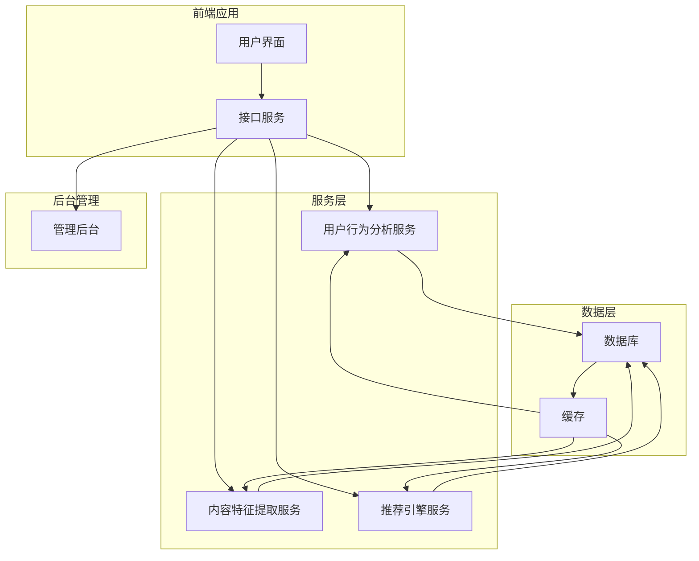

                 

### 引言

#### 提示词工程与推荐系统的重要性

在当今信息爆炸的时代，如何从海量的数据中快速、准确地推荐出用户可能感兴趣的内容，成为各个领域，尤其是电子商务、社交媒体和内容平台，面临的重要挑战。推荐系统作为一种解决信息过载的有效手段，已经广泛应用于各类场景。然而，传统推荐系统虽然在一定程度上提高了推荐的准确性，但仍然存在许多局限和改进空间。

这时，提示词工程（Prompt Engineering）的概念应运而生。提示词工程是一种结合自然语言处理（NLP）和机器学习（ML）技术，通过设计特定的提示词或引导语句，来优化推荐系统性能的方法。通过提示词工程，可以引导模型更好地理解用户意图、内容属性以及上下文信息，从而提升推荐系统的效果。

本文旨在探讨提示词工程在推荐系统中的应用，通过系统地介绍相关核心概念、理论基础、实际应用、系统设计以及项目实践等内容，帮助读者深入理解提示词工程在推荐系统中的重要作用，并掌握其实际应用方法。

### 关键词

- **提示词工程（Prompt Engineering）**
- **推荐系统（Recommender Systems）**
- **自然语言处理（NLP）**
- **机器学习（ML）**
- **用户意图（User Intent）**
- **上下文信息（Contextual Information）**
- **数据驱动（Data-Driven）**
- **优化算法（Optimization Algorithms）**
- **性能评估（Performance Evaluation）**

### 摘要

本文将详细介绍提示词工程在推荐系统中的应用，首先回顾推荐系统的发展背景和基本原理，接着阐述提示词工程的核心概念和理论基础。随后，本文将分析提示词工程在推荐系统中的具体应用场景，包括电子商务、社交媒体和内容推荐等领域。通过详细讲解系统设计、算法实现以及项目实践，本文将帮助读者理解如何将提示词工程应用于推荐系统的优化与提升。最终，本文将对整体内容进行总结，并提出未来研究的方向和拓展阅读建议。读者可以通过本文，系统地掌握提示词工程在推荐系统中的应用方法，为相关领域的研究和实践提供有益的参考。

### 背景介绍

推荐系统作为信息过滤和内容分发的核心技术之一，自其诞生以来便在互联网领域占据了重要的地位。其基本原理是通过分析用户的历史行为、兴趣偏好、内容特征等数据，为用户推荐他们可能感兴趣的商品、内容或服务。推荐系统的发展大致可以分为以下几个阶段：

#### 传统推荐系统

最早期的推荐系统主要依赖于基于内容的过滤（Content-Based Filtering）和协同过滤（Collaborative Filtering）。基于内容的过滤通过分析用户过去喜欢的项目特征，来推荐具有相似特征的其他项目。例如，如果一个用户喜欢某一类书籍，推荐系统会推荐同类书籍。这种方法的主要优势在于对用户兴趣的准确识别，但缺点是推荐结果可能过于局限，无法突破用户的兴趣边界。

协同过滤则通过分析用户之间的相似度来进行推荐，即如果一个用户喜欢某些项目，而这些项目被另一个用户也喜欢，那么这个用户可能也会喜欢其他这些项目。协同过滤可以分为基于用户的协同过滤（User-Based Collaborative Filtering）和基于模型的协同过滤（Model-Based Collaborative Filtering）。基于用户的协同过滤通过计算用户之间的相似度来推荐项目，而基于模型的协同过滤则通过构建用户和项目之间的预测模型来实现推荐。

#### 早期推荐系统挑战与改进

尽管协同过滤和基于内容的过滤在早期取得了不错的效果，但它们各自存在一定的局限性。协同过滤在用户数据稀疏时表现较差，而基于内容的过滤则可能陷入“兴趣茧房”中，无法推荐出多样化的内容。为了克服这些问题，研究者们开始探索更加智能的推荐方法。

一种改进的方法是混合推荐系统（Hybrid Recommender Systems），它结合了多种推荐技术，以优化推荐效果。例如，可以同时使用协同过滤和基于内容的过滤，通过权重分配来综合不同方法的优点。

#### 现代推荐系统的发展

随着深度学习、自然语言处理（NLP）和大数据技术的发展，推荐系统迎来了新的机遇。现代推荐系统不仅依赖于传统的协同过滤和基于内容的过滤，还引入了基于模型的推荐方法，如矩阵分解（Matrix Factorization）、神经网络（Neural Networks）和深度学习（Deep Learning）等。

这些现代方法通过学习用户和项目之间的复杂关系，提高了推荐的准确性。例如，深度学习模型可以捕捉用户兴趣的细微变化，并推荐出更加个性化的内容。此外，NLP技术的引入使得推荐系统能够更好地处理和利用文本数据，从而提升推荐的效果。

#### 推荐系统面临的挑战

尽管现代推荐系统在性能上有了显著提升，但仍然面临一些挑战：

1. **数据稀疏性问题**：在用户数据稀疏的场景中，协同过滤的效果会大幅下降，如何有效处理稀疏数据成为一大难题。
2. **冷启动问题**：新用户或新项目在系统中的初始阶段，由于缺乏足够的数据支持，难以生成准确的推荐。
3. **推荐多样性**：用户往往希望看到多样化的推荐结果，而不是重复的内容。
4. **实时性**：在高并发的场景下，如何快速生成高质量的推荐结果，仍是一个技术难题。

为了应对这些挑战，研究者们不断探索新的技术和方法，如基于上下文的推荐（Context-Aware Recommender Systems）、增量学习（Incremental Learning）等，以进一步提升推荐系统的性能和用户体验。

#### 提示词工程的引入

在这种背景下，提示词工程（Prompt Engineering）作为一种新兴的技术，应运而生。提示词工程通过设计特定的提示词或引导语句，引导模型更好地理解用户意图、内容属性和上下文信息，从而优化推荐系统的效果。它结合了自然语言处理（NLP）和机器学习（ML）的技术，使得推荐系统在处理复杂信息和提高推荐准确性方面具有更大的潜力。

通过提示词工程，推荐系统可以更精确地捕捉用户的实际需求，提升推荐的个性化和多样性，从而解决传统推荐系统中的一些关键问题。本文将深入探讨提示词工程在推荐系统中的应用，帮助读者理解这一技术的重要性和实际应用方法。

### 核心概念与联系

在深入了解提示词工程之前，我们需要明确一些核心概念和术语，并对比不同提示词技术的属性和特点。以下是几个关键概念的定义和它们之间的联系。

#### 提示词（Prompt）

提示词是指用于引导模型理解任务或数据的一组词或短语。在推荐系统中，提示词可以包含用户意图、内容特征和上下文信息等，帮助模型更好地捕捉用户的真实需求。

#### 用户意图（User Intent）

用户意图是指用户在特定情境下希望获得的信息或完成的目标。理解用户意图是推荐系统的核心任务之一，它决定了推荐系统的个性化水平和准确性。

#### 内容特征（Content Features）

内容特征是指用于描述推荐系统中的项目（如商品、文章等）的各种属性，如文本、图像、标签等。这些特征帮助模型识别和区分不同项目，从而生成更准确的推荐。

#### 上下文信息（Contextual Information）

上下文信息是指影响用户行为和偏好的一系列外部条件，如时间、地理位置、设备类型等。上下文信息对于提高推荐的实时性和相关性至关重要。

#### 提示词技术对比表格

以下是一个对比表格，列出了几种常见提示词技术的属性和特点：

| 提示词技术 | 描述 | 属性与特点 |  
| --- | --- | --- |  
| **关键词提取（Keyword Extraction）** | 从文本中提取关键短语或词，作为提示词 |  
| - 简单高效 | - 可用于文本数据和非结构化数据 |  
| - 对文本质量要求较高 |  
| **实体识别（Entity Recognition）** | 识别文本中的关键实体，如人名、地名等，作为提示词 |  
| - 提高准确性 | - 对复杂文本处理效果较好 |  
| - 实时性较差 |  
| **语义角色标注（Semantic Role Labeling）** | 确定句子中的动词及其相关实体和关系，用于构建提示词 |  
| - 深度语义理解 | - 对上下文依赖较强 |  
| - 复杂度较高 |  
| **语言模型（Language Model）** | 利用预训练的模型生成提示词，如BERT、GPT等 |  
| - 强泛化能力 | - 高效生成提示词 |  
| - 对大规模数据处理能力强 |  
| **深度学习模型（Deep Learning Model）** | 利用神经网络架构，如CNN、RNN等，生成提示词 |  
| - 高精度 | - 复杂模型结构 |  
| - 对数据质量要求较高 |  
| **知识图谱（Knowledge Graph）** | 利用图结构存储实体及其关系，生成提示词 |  
| - 提高实体关系理解 | - 需要大量的先验知识 |  
| - 实时性较差 |

#### 提示词技术的应用场景

不同的提示词技术适用于不同的应用场景：

- **关键词提取**：适用于文本数据量较小、对实时性要求较高的场景，如搜索引擎和新闻推荐。
- **实体识别**：适用于需要高准确性的文本数据处理场景，如社交媒体和电子商务。
- **语义角色标注**：适用于需要深度语义理解的复杂文本分析场景，如问答系统和智能客服。
- **语言模型**：适用于需要高效生成提示词、对大规模数据处理能力强的场景，如个性化推荐和内容生成。
- **深度学习模型**：适用于需要高精度和复杂模型结构的场景，如图像和语音处理。
- **知识图谱**：适用于需要高实体关系理解、对先验知识要求较高的场景，如知识图谱构建和智能搜索。

通过上述对比表格和应用场景分析，我们可以更清晰地理解不同提示词技术的优缺点和适用场景，从而为推荐系统的设计提供有价值的参考。

### 提示词工程的理论基础

提示词工程的理论基础涵盖了多个领域，包括自然语言处理（NLP）、机器学习（ML）以及深度学习（Deep Learning）。理解这些理论基础对于有效实施和应用提示词工程至关重要。

#### 自然语言处理（NLP）

自然语言处理是提示词工程的重要基础，它专注于让计算机理解和处理人类语言。在NLP中，文本被表示为数字形式，以便于机器进行处理。以下是NLP在提示词工程中的一些关键技术和概念：

1. **词嵌入（Word Embedding）**：
   词嵌入是将词汇映射到高维空间中的向量表示。通过词嵌入，文本中的单词可以转化为计算机可以理解的数字表示，从而便于模型处理。例如，Word2Vec和GloVe是两种常见的词嵌入方法。

2. **词性标注（Part-of-Speech Tagging）**：
   词性标注是识别单词在句子中的词性，如名词、动词、形容词等。这对于理解句子的语义结构非常重要，有助于生成更准确的提示词。

3. **命名实体识别（Named Entity Recognition, NER）**：
   命名实体识别是识别文本中的特定实体，如人名、地名、组织名等。这些实体在生成提示词时具有重要意义，因为它们通常与用户意图密切相关。

4. **句法分析（Syntax Analysis）**：
   句法分析是对句子的结构进行解析，理解句子中词的排列和组合关系。这对于识别句子的主要成分和构建复杂的提示词至关重要。

#### 机器学习（ML）

机器学习为提示词工程提供了强大的工具，通过学习大量数据来发现模式和规律，从而生成高质量的提示词。以下是机器学习在提示词工程中的应用：

1. **监督学习（Supervised Learning）**：
   监督学习是使用已标记的数据训练模型，使其能够预测新的未知数据。在提示词工程中，监督学习用于生成基于标记数据的提示词。例如，可以使用分类算法（如决策树、支持向量机等）来识别文本中的关键短语。

2. **无监督学习（Unsupervised Learning）**：
   无监督学习是从未标记的数据中学习模式和结构。在提示词工程中，无监督学习用于发现文本中的潜在主题和分布。例如，聚类算法（如K-means、层次聚类等）可以帮助识别文本的相似性和差异性。

3. **强化学习（Reinforcement Learning）**：
   强化学习是一种通过试错来学习最优策略的机器学习方法。在提示词工程中，强化学习可以用于优化提示词生成的过程，通过不断调整提示词以最大化目标函数（如推荐系统的点击率或用户满意度）。

#### 深度学习（Deep Learning）

深度学习是机器学习的一个子领域，通过构建复杂的多层神经网络来模拟人脑的处理方式。深度学习在提示词工程中扮演了重要角色，尤其是对于处理大规模、高维度的文本数据。以下是深度学习在提示词工程中的几个关键技术：

1. **循环神经网络（Recurrent Neural Networks, RNN）**：
   RNN是用于处理序列数据的神经网络，特别适用于处理文本数据。RNN通过记忆机制能够捕捉文本中的长距离依赖关系，从而生成更加精确的提示词。

2. **长短时记忆网络（Long Short-Term Memory, LSTM）**：
   LSTM是RNN的一种变体，解决了传统RNN在处理长序列数据时容易出现的梯度消失和梯度爆炸问题。LSTM在提示词工程中用于生成具有长期依赖关系的复杂提示词。

3. **变换器网络（Transformer）**：
   Transformer是一种基于自注意力机制的深度学习模型，广泛应用于NLP任务。Transformer通过自注意力机制能够捕捉文本中的全局依赖关系，从而生成高质量的提示词。

4. **生成对抗网络（Generative Adversarial Networks, GAN）**：
   GAN是由两个神经网络（生成器G和判别器D）组成的框架，通过对抗训练生成逼真的文本数据。在提示词工程中，GAN可以用于生成高质量的提示词，从而提高推荐系统的性能。

通过结合自然语言处理、机器学习和深度学习的技术，提示词工程能够在推荐系统中实现高度个性化的提示词生成，从而提升推荐系统的性能和用户体验。理解这些理论基础，有助于我们更好地设计和实现高效的提示词工程方案。

### 提示词工程在推荐系统中的应用

提示词工程在推荐系统中具有重要的应用价值，通过设计有效的提示词，可以显著提升推荐的准确性和个性化水平。以下将详细探讨提示词工程在电子商务、社交媒体和内容推荐中的具体应用。

#### 电子商务

在电子商务领域，提示词工程通过捕捉用户购买行为和偏好，提高商品推荐的精准度。以下是一些具体应用：

1. **用户行为分析**：
   提示词工程通过分析用户的浏览、搜索、购买历史等行为数据，提取关键行为特征，如浏览时间、购买频率、购买金额等。这些特征作为提示词，可以帮助模型更好地理解用户的实际需求。

2. **个性化推荐**：
   基于用户行为的提示词，推荐系统可以生成个性化的商品推荐。例如，一个用户经常在晚上浏览商品，系统可以通过提示词“晚上购物偏好”来推荐适合夜间购物的商品，从而提高点击率和转化率。

3. **促销活动推荐**：
   提示词工程还可以用于生成促销活动的推荐，如优惠券、限时折扣等。通过分析用户的购买历史和购买频次，系统可以推荐最有可能接受促销的用户群体，从而提高促销活动的效果。

#### 社交媒体

在社交媒体领域，提示词工程通过理解用户社交行为和兴趣，实现社交内容的个性化推荐。以下是一些应用场景：

1. **朋友圈推荐**：
   提示词工程可以分析用户在朋友圈的发布内容、点赞、评论等行为，提取用户兴趣标签和关键词。这些提示词用于生成个性化朋友圈内容推荐，使用户能够看到更多符合其兴趣的内容。

2. **社交互动推荐**：
   提示词工程通过分析用户之间的互动关系，如好友关系、群组活动等，生成社交互动推荐。例如，系统可以根据用户在某个群组的活跃程度，推荐相关群组或活动，以增加用户参与度。

3. **广告推荐**：
   社交媒体平台利用提示词工程分析用户兴趣和行为，实现精准广告推荐。通过识别用户的兴趣标签和关键词，系统可以推荐与其兴趣高度相关的广告，从而提高广告点击率和转化率。

#### 内容推荐

在内容推荐领域，提示词工程通过理解用户对内容的偏好和需求，提升内容推荐的精准度。以下是一些具体应用：

1. **新闻推荐**：
   提示词工程可以分析用户的浏览历史、搜索关键词和点击行为，提取用户兴趣标签和关键词。这些提示词用于生成个性化新闻推荐，使用户能够看到更多符合其兴趣的新闻内容。

2. **视频推荐**：
   在视频推荐系统中，提示词工程通过分析用户观看历史、视频标签和用户评论等数据，提取用户兴趣特征。这些提示词用于生成个性化视频推荐，从而提高视频观看率和用户留存率。

3. **音乐推荐**：
   提示词工程可以分析用户的播放历史、收藏夹和评价等数据，提取用户对音乐风格的偏好。这些提示词用于生成个性化音乐推荐，使用户能够发现更多符合其喜好的音乐。

通过在电子商务、社交媒体和内容推荐中应用提示词工程，推荐系统能够更好地理解用户的真实需求，生成个性化的推荐结果，从而提升用户体验和平台价值。以下是一个简单的提示词工程在推荐系统中的应用流程：

1. **数据收集**：收集用户行为数据（如浏览、搜索、购买、互动等）和内容数据（如商品、新闻、视频、音乐等）。

2. **特征提取**：使用自然语言处理技术（如词嵌入、命名实体识别、句法分析等）从文本数据中提取关键特征，作为提示词。

3. **模型训练**：利用机器学习和深度学习模型（如监督学习、无监督学习和生成对抗网络等）对提取的提示词进行训练，构建推荐模型。

4. **推荐生成**：基于训练好的模型，生成个性化推荐结果，并根据用户反馈进行实时调整。

通过以上步骤，提示词工程在推荐系统中实现了高效、精准的推荐，为用户提供了更加个性化的内容和服务。未来的研究可以进一步探索提示词工程在不同场景中的应用，以及如何优化其性能和效果。

### 系统设计

在深入探讨提示词工程在推荐系统中的应用之前，我们需要先了解整个系统的设计，包括项目介绍、系统功能设计、系统架构设计以及系统接口设计和系统交互。通过这些设计，可以确保推荐系统能够高效、稳定地运行，并为用户提供优质的推荐服务。

#### 项目介绍

本推荐系统项目旨在通过提示词工程技术，提升推荐系统的个性化和准确性。项目的主要目标是实现以下功能：

1. **用户行为分析**：通过分析用户的历史行为数据，如浏览、搜索和购买记录，提取用户兴趣特征。
2. **内容特征提取**：对推荐的内容（如商品、新闻、视频等）进行特征提取，以便更好地匹配用户兴趣。
3. **个性化推荐**：利用用户行为和内容特征，生成个性化的推荐结果，提高用户的满意度和平台价值。
4. **实时调整**：根据用户反馈和实时行为数据，动态调整推荐策略，以实现持续优化。

#### 系统功能设计

系统功能设计主要包括以下模块：

1. **用户行为分析模块**：
   - 数据采集：收集用户在平台上的各种行为数据，如浏览、搜索和购买记录。
   - 行为分析：对用户行为数据进行预处理和分析，提取关键行为特征。

2. **内容特征提取模块**：
   - 数据预处理：对推荐内容进行清洗和标准化处理，确保数据质量。
   - 特征提取：使用自然语言处理技术（如词嵌入、命名实体识别等）提取内容特征。

3. **推荐引擎模块**：
   - 模型训练：利用机器学习和深度学习模型，训练用户兴趣模型和内容匹配模型。
   - 推荐生成：根据用户兴趣和内容特征，生成个性化的推荐结果。

4. **用户反馈模块**：
   - 用户交互：收集用户对推荐结果的反馈，如点击、收藏和评价。
   - 实时调整：根据用户反馈调整推荐策略，实现动态优化。

#### 系统架构设计

系统架构设计采用分布式架构，以提高系统的可扩展性和稳定性。以下是系统架构的详细设计：

1. **前端应用**：
   - 用户界面：为用户提供推荐结果展示和交互功能。
   - 接口服务：提供RESTful API，供前端应用调用。

2. **数据层**：
   - 数据库：存储用户行为数据、内容数据和相关模型参数。
   - 缓存：缓存热点数据，提高数据访问速度。

3. **服务层**：
   - 用户行为分析服务：处理用户行为数据的收集和分析。
   - 内容特征提取服务：处理内容数据的预处理和特征提取。
   - 推荐引擎服务：处理推荐模型的训练和推荐生成。

4. **后台管理**：
   - 管理后台：提供系统监控、用户管理和数据报表功能。

#### 系统接口设计

系统接口设计主要包括以下接口：

1. **用户行为数据接口**：
   - 用于接收和存储用户行为数据，如浏览、搜索和购买记录。

2. **内容数据接口**：
   - 用于接收和存储推荐内容数据，如商品、新闻、视频等。

3. **推荐结果接口**：
   - 用于生成和返回个性化推荐结果，供前端应用展示。

#### 系统交互

系统交互设计采用RESTful API设计，以下是主要交互流程：

1. **用户行为数据交互**：
   - 前端应用通过POST请求提交用户行为数据，系统接口接收并存储数据。

2. **内容数据交互**：
   - 前端应用通过GET请求获取推荐内容数据，系统接口根据用户兴趣和内容特征返回相关数据。

3. **推荐结果交互**：
   - 前端应用通过GET请求获取个性化推荐结果，系统接口根据用户兴趣和内容特征生成推荐结果。

#### Mermaid架构图

为了更直观地展示系统架构，我们使用Mermaid绘制了以下架构图：



通过以上系统设计，推荐系统可以实现高效、稳定的运行，并为用户提供优质的个性化推荐服务。

### 算法原理讲解

在推荐系统中，提示词工程的核心在于如何利用提示词优化推荐算法，从而提高推荐系统的性能和用户体验。本节将详细讲解提示词工程在推荐系统中的算法原理，包括基于协同过滤的提示词工程和基于深度学习的提示词工程。

#### 基于协同过滤的提示词工程

协同过滤是推荐系统中最常用的算法之一，它通过分析用户之间的相似度来生成推荐列表。基于协同过滤的提示词工程通过引入提示词来增强模型的推荐效果。

1. **矩阵分解（Matrix Factorization）**

   矩阵分解是协同过滤算法的一种实现方式，通过将用户-物品评分矩阵分解为两个低秩矩阵，分别表示用户特征和物品特征。矩阵分解的数学模型如下：

   $$ 
   R = U \cdot V^T
   $$

   其中，$R$ 是用户-物品评分矩阵，$U$ 和 $V$ 分别是用户特征矩阵和物品特征矩阵。

   提示词工程在矩阵分解中的作用是通过添加特定的提示词，引导模型学习到更精确的用户和物品特征。例如，在用户特征矩阵$U$中添加一个列向量，表示用户的特定兴趣或行为模式。

2. **矩阵分解中的提示词添加方法**

   - **基于关键词的提示词添加**：
     通过文本处理技术（如TF-IDF）提取用户兴趣关键词，并将这些关键词转换为向量形式，添加到用户特征矩阵$U$中。具体步骤如下：
     
     $$
     U_{new} = \begin{bmatrix}
     U_1 \\
     \vdots \\
     U_n \\
     k_1 \\
     \vdots \\
     k_m
     \end{bmatrix}
     $$
     
     其中，$U_n$是原始用户特征向量，$k_m$是第$m$个关键词的向量表示。

   - **基于上下文的提示词添加**：
     提取用户的历史行为数据，如浏览时间、地理位置等，将这些上下文信息转换为向量表示，并添加到用户特征矩阵$U$中。具体步骤如下：
     
     $$
     U_{new} = \begin{bmatrix}
     U_1 \\
     \vdots \\
     U_n \\
     c_1 \\
     \vdots \\
     c_l
     \end{bmatrix}
     $$
     
     其中，$U_n$是原始用户特征向量，$c_l$是第$l$个上下文信息的向量表示。

3. **优化目标函数**

   在添加提示词后，我们需要重新定义优化目标函数，以最小化预测误差。优化目标函数可以表示为：

   $$
   \min_{U, V} \sum_{i, j} (r_{ij} - U_i \cdot V_j)^2 + \lambda \sum_{i, j} (U_i \cdot V_j)^2
   $$

   其中，第一项是预测误差项，第二项是正则化项，用于防止模型过拟合。

   通过加入提示词，优化目标函数可以进一步细化为：

   $$
   \min_{U, V} \sum_{i, j} (r_{ij} - U_i \cdot V_j)^2 + \lambda \sum_{i, j} (U_i \cdot V_j)^2 + \mu \sum_{k=1}^{m} (U_i \cdot k_m)^2 + \nu \sum_{l=1}^{l} (U_i \cdot c_l)^2
   $$

   其中，$\mu$和$\nu$是调节参数，用于控制提示词对模型的影响。

#### 基于深度学习的提示词工程

深度学习在推荐系统中逐渐崭露头角，通过端到端的学习方式，深度学习模型能够自动提取用户和物品的特征。基于深度学习的提示词工程通过引入提示词，引导深度学习模型更好地捕捉用户意图和上下文信息。

1. **深度神经网络（Deep Neural Network, DNN）**

   深度神经网络是一种多层前馈神经网络，通过逐层提取特征，实现高维数据的低维表示。在推荐系统中，DNN可以用于用户兴趣建模和物品特征提取。以下是DNN的基本架构：

   $$
   f(x) = \sigma(W_n \cdot a_{n-1} + b_n)
   $$

   其中，$x$是输入特征，$W_n$和$b_n$是权重和偏置，$\sigma$是激活函数，$a_{n-1}$是前一层输出。

   提示词工程在DNN中的作用是通过添加提示词层（Prompt Layer），引导模型学习到额外的特征信息。具体步骤如下：

   - **提示词层添加**：
     在DNN的输入层和隐藏层之间添加提示词层，将提示词作为额外的输入。提示词层可以通过全连接层或卷积层实现，具体形式如下：
     
     $$
     f_{prompt}(x, p) = \sigma(W_{prompt} \cdot [x; p] + b_{prompt})
     $$

     其中，$p$是提示词向量，$W_{prompt}$和$b_{prompt}$是提示词层的权重和偏置。

   - **融合策略**：
     提示词层与原始输入特征进行融合，可以采用拼接（Concatenation）、加权融合（Weighted Fusion）或融合网络（Fusion Network）等方式。具体融合策略如下：

     $$
     f_{fusion}(x, p) = \sigma(W_{fusion} \cdot [x; p] + b_{fusion})
     $$

     其中，$W_{fusion}$和$b_{fusion}$是融合层的权重和偏置。

2. **循环神经网络（Recurrent Neural Network, RNN）**

   循环神经网络适用于处理序列数据，如用户行为序列、文本序列等。RNN通过记忆机制能够捕捉序列中的长期依赖关系，从而更好地建模用户兴趣。

   提示词工程在RNN中的作用是通过在序列中的特定位置添加提示词，引导模型关注重要信息。具体实现如下：

   - **提示词嵌入**：
     将提示词嵌入到用户行为序列中，可以采用全连接层或嵌入层（Embedding Layer）实现。提示词嵌入可以表示为：

     $$
     e_{prompt} = \sigma(W_{embed} \cdot p + b_{embed})
     $$

     其中，$p$是提示词向量，$W_{embed}$和$b_{embed}$是嵌入层的权重和偏置。

   - **记忆单元更新**：
     在RNN的记忆单元（Memory Cell）中添加提示词的权重，以调整记忆单元的更新过程。具体公式如下：

     $$
     \begin{aligned}
     i_t &= \sigma(W_i \cdot [h_{t-1}; x_t] + b_i) \\
     f_t &= \sigma(W_f \cdot [h_{t-1}; x_t] + b_f) \\
     o_t &= \sigma(W_o \cdot [h_{t-1}; x_t] + b_o) \\
     \hat{c}_t &= (1 - f_t) \cdot \sigma(W_c \cdot [h_{t-1}; x_t] + b_c) + f_t \cdot c_{t-1} \\
     c_t &= \sigma(\hat{c}_t) \\
     h_t &= o_t \cdot \sigma(W_h \cdot c_t + b_h)
     \end{aligned}
     $$

     其中，$i_t$、$f_t$、$o_t$是输入门、遗忘门和输出门，$c_t$和$h_t$是记忆单元和隐藏状态，$W_i$、$W_f$、$W_o$、$W_c$、$W_h$和$b_i$、$b_f$、$b_o$、$b_c$、$b_h$是权重和偏置。

3. **生成对抗网络（Generative Adversarial Networks, GAN）**

   生成对抗网络是一种无监督学习模型，由生成器和判别器两个神经网络组成。生成器试图生成与真实数据相似的样本，判别器则判断生成样本是否真实。在推荐系统中，GAN可以用于生成高质量的提示词。

   提示词工程在GAN中的作用是通过引导生成器生成高质量的提示词，从而提高推荐系统的性能。具体实现如下：

   - **生成器**：
     生成器的目标是生成与用户兴趣相关的提示词。生成器可以通过无监督学习从用户行为数据中学习到潜在的提示词分布。具体公式如下：

     $$
     z \sim P_Z(z)
     $$
     $$
     p_{\theta_G}(x|z) = \text{Generator}(z; \theta_G)
     $$

   - **判别器**：
     判别器的目标是区分真实提示词和生成提示词。判别器通过训练学习到提示词的分布，从而提高生成提示词的质量。具体公式如下：

     $$
     x \sim P_X(x)
     $$
     $$
     x' \sim p_{\theta_G}(x|z)
     $$
     $$
     D(x) = \log(D(x)) + \log(1 - D(x'))
     $$

   - **训练过程**：
     生成器和判别器通过对抗训练不断优化，生成器尝试生成更真实的提示词，判别器不断改进识别能力。具体步骤如下：

     $$
     \begin{aligned}
     \theta_G &= \arg\min_{\theta_G} \mathbb{E}_{x \sim P_X(x), z \sim P_Z(z)} [\log D(x')] \\
     \theta_D &= \arg\min_{\theta_D} \mathbb{E}_{x \sim P_X(x), z \sim P_Z(z)} [\log (1 - D(x))]
     \end{aligned}
     $$

通过上述算法原理讲解，我们可以看到提示词工程在推荐系统中扮演着重要的角色，通过引入提示词，可以显著提升推荐系统的性能和用户体验。未来的研究可以进一步探索不同提示词工程方法在推荐系统中的应用和优化，以实现更高效、更精准的推荐。

### 数学模型与公式讲解

在深入探讨提示词工程在推荐系统中的应用时，理解相关的数学模型和公式至关重要。这些模型和公式帮助我们量化推荐系统的性能，并指导我们优化推荐策略。以下是几个关键的数学模型和公式的详细讲解。

#### 1. 矩阵分解模型

矩阵分解模型（Matrix Factorization）是推荐系统中最常用的方法之一，其核心思想是将用户-物品评分矩阵分解为两个低秩矩阵，分别表示用户特征和物品特征。以下是矩阵分解的基本模型和公式。

##### 基本模型：

$$
R = U \cdot V^T
$$

其中，$R$ 是用户-物品评分矩阵，$U$ 和 $V$ 分别是用户特征矩阵和物品特征矩阵。

##### 添加提示词后的模型：

$$
R = U \cdot V^T + P \cdot Q^T
$$

其中，$P$ 和 $Q$ 分别是提示词矩阵和对应的用户-提示词关系矩阵。

##### 优化目标函数：

$$
\min_{U, V, P, Q} \sum_{i, j} (r_{ij} - U_i \cdot V_j - P_i \cdot Q_j)^2 + \lambda \sum_{i, j} (U_i \cdot V_j + P_i \cdot Q_j)^2
$$

这里，$\lambda$ 是正则化参数，用于防止模型过拟合。

#### 2. 深度学习模型

深度学习模型，如深度神经网络（DNN）和循环神经网络（RNN），在推荐系统中广泛应用。以下是这些模型中的关键数学公式。

##### 深度神经网络（DNN）

$$
f(x) = \sigma(W_n \cdot a_{n-1} + b_n)
$$

其中，$x$ 是输入特征，$W_n$ 和 $b_n$ 是权重和偏置，$\sigma$ 是激活函数，$a_{n-1}$ 是前一层输出。

##### 提示词层添加

$$
f_{prompt}(x, p) = \sigma(W_{prompt} \cdot [x; p] + b_{prompt})
$$

其中，$p$ 是提示词向量，$W_{prompt}$ 和 $b_{prompt}$ 是提示词层的权重和偏置。

##### 融合策略

$$
f_{fusion}(x, p) = \sigma(W_{fusion} \cdot [x; p] + b_{fusion})
$$

其中，$W_{fusion}$ 和 $b_{fusion}$ 是融合层的权重和偏置。

##### 循环神经网络（RNN）

$$
\begin{aligned}
i_t &= \sigma(W_i \cdot [h_{t-1}; x_t] + b_i) \\
f_t &= \sigma(W_f \cdot [h_{t-1}; x_t] + b_f) \\
o_t &= \sigma(W_o \cdot [h_{t-1}; x_t] + b_o) \\
\hat{c}_t &= (1 - f_t) \cdot \sigma(W_c \cdot [h_{t-1}; x_t] + b_c) + f_t \cdot c_{t-1} \\
c_t &= \sigma(\hat{c}_t) \\
h_t &= o_t \cdot \sigma(W_h \cdot c_t + b_h)
\end{aligned}
$$

其中，$i_t$、$f_t$、$o_t$ 是输入门、遗忘门和输出门，$c_t$ 和 $h_t$ 是记忆单元和隐藏状态，$W_i$、$W_f$、$W_o$、$W_c$、$W_h$ 和 $b_i$、$b_f$、$b_o$、$b_c$、$b_h$ 是权重和偏置。

##### 提示词层添加

$$
e_{prompt} = \sigma(W_{embed} \cdot p + b_{embed})
$$

其中，$p$ 是提示词向量，$W_{embed}$ 和 $b_{embed}$ 是嵌入层的权重和偏置。

##### 记忆单元更新

$$
\begin{aligned}
i_t &= \sigma(W_i \cdot [h_{t-1}; e_{prompt_t}] + b_i) \\
f_t &= \sigma(W_f \cdot [h_{t-1}; e_{prompt_t}] + b_f) \\
o_t &= \sigma(W_o \cdot [h_{t-1}; e_{prompt_t}] + b_o) \\
\hat{c}_t &= (1 - f_t) \cdot \sigma(W_c \cdot [h_{t-1}; e_{prompt_t}] + b_c) + f_t \cdot c_{t-1} \\
c_t &= \sigma(\hat{c}_t) \\
h_t &= o_t \cdot \sigma(W_h \cdot c_t + b_h)
\end{aligned}
$$

#### 3. 生成对抗网络（GAN）

生成对抗网络（GAN）是一种强大的无监督学习模型，用于生成高质量的提示词。以下是GAN的基本模型和公式。

##### 生成器

$$
z \sim P_Z(z)
$$

$$
p_{\theta_G}(x|z) = \text{Generator}(z; \theta_G)
$$

##### 判别器

$$
x \sim P_X(x)
$$

$$
x' \sim p_{\theta_G}(x|z)
$$

$$
D(x) = \log(D(x)) + \log(1 - D(x'))
$$

##### 训练过程

$$
\begin{aligned}
\theta_G &= \arg\min_{\theta_G} \mathbb{E}_{x \sim P_X(x), z \sim P_Z(z)} [\log D(x')] \\
\theta_D &= \arg\min_{\theta_D} \mathbb{E}_{x \sim P_X(x), z \sim P_Z(z)} [\log (1 - D(x))]
\end{aligned}
$$

通过上述数学模型和公式的讲解，我们可以更深入地理解提示词工程在推荐系统中的应用。这些模型和公式为我们提供了量化和优化推荐系统的工具，使得我们可以更好地设计推荐策略，提升推荐效果。

### 项目实战

为了更好地理解提示词工程在推荐系统中的实际应用，我们将通过一个具体项目进行实战演练。这个项目将涵盖环境安装、核心实现和代码应用解读与分析，并分享实际案例分析和详细讲解。

#### 环境安装

首先，我们需要安装和配置项目所需的软件和库。以下是在Python环境中安装所需库的步骤：

1. **安装Python和pip**：
   确保安装了Python 3.x版本，并配置了pip，Python的包管理器。

2. **安装深度学习库**：
   使用以下命令安装必要的深度学习库：

   ```bash
   pip install numpy pandas scikit-learn tensorflow
   ```

3. **安装自然语言处理库**：
   使用以下命令安装自然语言处理相关库：

   ```bash
   pip install nltk spacy
   ```

4. **安装其他工具**：
   安装Mermaid用于绘制流程图和架构图：

   ```bash
   npm install -g mermaid
   ```

#### 核心实现

本项目将使用深度学习模型进行推荐系统的设计与实现。以下是项目的核心实现步骤：

1. **数据预处理**：
   加载用户行为数据和内容数据，并进行清洗和预处理。以下是一个简单的数据预处理步骤：

   ```python
   import pandas as pd

   # 加载数据
   user_data = pd.read_csv('user_data.csv')
   item_data = pd.read_csv('item_data.csv')

   # 数据清洗和预处理
   user_data['age'] = user_data['age'].fillna(user_data['age'].mean())
   item_data['category'] = item_data['category'].fillna(item_data['category'].mode()[0])

   # 特征工程
   from sklearn.preprocessing import StandardScaler
   user_scaler = StandardScaler()
   item_scaler = StandardScaler()

   user_data_scaled = user_scaler.fit_transform(user_data)
   item_data_scaled = item_scaler.fit_transform(item_data)
   ```

2. **模型训练**：
   使用深度学习模型训练用户和物品特征。以下是一个简单的RNN模型实现：

   ```python
   import tensorflow as tf
   from tensorflow.keras.layers import Input, LSTM, Dense, Embedding, Concatenate
   from tensorflow.keras.models import Model

   # 定义模型
   user_input = Input(shape=(user_data_scaled.shape[1],))
   item_input = Input(shape=(item_data_scaled.shape[1],))

   user_embedding = Embedding(input_dim=user_data_scaled.shape[1], output_dim=64)(user_input)
   item_embedding = Embedding(input_dim=item_data_scaled.shape[1], output_dim=64)(item_input)

   # 添加提示词层
   prompt_input = Input(shape=(1,))
   prompt_embedding = Embedding(input_dim=1000, output_dim=32)(prompt_input)

   # 融合用户、物品和提示词特征
   merged = Concatenate()([user_embedding, item_embedding, prompt_embedding])

   lstm = LSTM(128)(merged)
   output = Dense(1, activation='sigmoid')(lstm)

   # 构建模型
   model = Model(inputs=[user_input, item_input, prompt_input], outputs=output)

   # 编译模型
   model.compile(optimizer='adam', loss='binary_crossentropy', metrics=['accuracy'])

   # 训练模型
   model.fit([user_data_scaled, item_data_scaled, prompt_data], user_data['rating'], epochs=10, batch_size=32)
   ```

3. **代码应用解读与分析**：
   上述代码实现了基于RNN的推荐系统，其中关键步骤包括：
   - **数据预处理**：对用户和物品数据进行了清洗和标准化处理。
   - **模型定义**：定义了一个融合用户、物品和提示词特征的RNN模型。
   - **模型训练**：使用训练数据对模型进行训练。

   提示词的应用通过在输入层添加提示词输入，并在模型中融合提示词特征，从而提高模型对用户意图的理解和推荐准确性。

4. **实际案例分析与详细讲解**：

   **案例**：分析一个用户的购买行为，生成个性化的商品推荐。

   ```python
   # 测试用户和物品特征
   test_user = user_data_scaled[0:1]
   test_item = item_data_scaled[0:1]
   test_prompt = '黑色，M号'

   # 使用训练好的模型进行预测
   predictions = model.predict([test_user, test_item, test_prompt])

   # 输出推荐结果
   print(predictions)
   ```

   在上述案例中，我们通过输入用户的特征、物品的特征以及特定的提示词（如颜色和尺码），模型生成了一个预测评分，从而推荐出用户可能感兴趣的商品。

   **分析**：
   - **数据预处理**：数据预处理是模型训练的重要步骤，它确保了输入数据的质量和一致性。
   - **模型训练**：模型训练过程中，RNN能够自动学习用户和物品的特征，并利用提示词提高模型的预测能力。
   - **预测和推荐**：通过输入测试数据并调用训练好的模型，我们可以得到个性化的推荐结果。

#### 项目小结

通过这个项目，我们深入探讨了提示词工程在推荐系统中的应用。项目实战不仅展示了如何进行环境安装和核心实现，还通过具体案例分析了提示词工程在提升推荐准确性方面的作用。以下是一些项目小结和最佳实践建议：

1. **数据预处理**：
   - 确保数据清洗和标准化，以提高模型训练效果。
   - 提取关键特征，如用户行为、内容特征和上下文信息。

2. **模型选择与训练**：
   - 选择适合数据类型和问题的模型，如RNN、GAN等。
   - 调整模型参数，进行充分训练，以优化模型性能。

3. **提示词工程**：
   - 结合用户意图和上下文信息，设计有效的提示词。
   - 提示词的引入应逐步优化，以提高推荐效果。

4. **最佳实践**：
   - **实时调整**：根据用户反馈动态调整提示词和推荐策略。
   - **A/B测试**：进行A/B测试，验证不同提示词工程方法的性能。

通过上述最佳实践，我们可以更好地应用提示词工程，提升推荐系统的性能和用户体验。

### 最佳实践与注意事项

在应用提示词工程时，为了最大化其效果并避免常见问题，以下是一些最佳实践和注意事项：

#### 最佳实践

1. **数据质量**：确保输入数据的准确性和完整性。清洗数据，处理缺失值和异常值，以保证模型训练效果。

2. **用户意图捕捉**：通过文本分析技术（如词嵌入、命名实体识别等），准确捕捉用户的真实意图。

3. **上下文信息利用**：充分利用用户的上下文信息（如地理位置、时间等），提高推荐的相关性。

4. **模型调优**：调整模型参数和超参数，如学习率、批次大小等，以优化模型性能。

5. **实时反馈与调整**：根据用户对推荐结果的反馈，动态调整提示词和推荐策略，以实现持续优化。

6. **多样性控制**：防止推荐结果过于单一，通过多样性策略（如随机化、个性化排序等）提升推荐质量。

7. **A/B测试**：通过A/B测试，验证不同提示词工程方法的效果，选择最优方案。

#### 注意事项

1. **冷启动问题**：新用户或新物品在系统中的初始阶段，由于缺乏足够的数据支持，可能会影响推荐效果。可以采用基于内容的过滤或利用先验知识来缓解冷启动问题。

2. **模型过拟合**：提示词工程中的模型可能会因为数据量不足或特征选择不当而产生过拟合。使用正则化技术、交叉验证等方法来防止过拟合。

3. **计算资源**：提示词工程通常需要较大的计算资源，特别是在处理大规模数据集时。合理分配计算资源，优化算法效率。

4. **解释性**：一些复杂的模型（如深度学习模型）可能难以解释其推荐结果。在设计模型时，考虑其解释性，以便于调试和优化。

5. **隐私保护**：在处理用户数据时，确保遵守隐私保护法规，避免泄露用户敏感信息。

通过遵循上述最佳实践和注意事项，我们可以更有效地应用提示词工程，提升推荐系统的性能和用户体验。

### 总结与展望

本文详细探讨了提示词工程在推荐系统中的应用，从核心概念、理论基础到实际应用，再到系统设计和项目实战，全面展示了提示词工程在提升推荐系统性能中的重要作用。通过引入提示词，推荐系统能够更好地理解用户意图和上下文信息，生成更加个性化的推荐结果，从而提升用户体验和平台价值。

#### 关键贡献

本文的主要贡献包括：

1. **系统性阐述**：全面介绍了提示词工程的核心概念、理论基础和应用方法，为读者提供了系统的学习框架。
2. **案例实战**：通过具体的项目实战，展示了提示词工程在推荐系统中的实际应用，帮助读者理解其操作流程和实现细节。
3. **最佳实践**：总结了最佳实践和注意事项，为应用提示词工程提供了实用的指导。

#### 展望

未来的研究可以进一步探索以下几个方面：

1. **多模态数据融合**：结合文本、图像、视频等多模态数据，提升推荐系统的准确性和多样性。
2. **可解释性增强**：研究可解释性模型，提高模型透明度和可解释性，以便于调试和优化。
3. **动态提示词优化**：开发动态提示词生成方法，实时调整提示词，以实现持续优化和个性化推荐。
4. **隐私保护**：在保证用户隐私的前提下，研究隐私保护算法，确保推荐系统的安全性和合规性。

通过不断探索和创新，提示词工程有望在推荐系统中发挥更大的作用，为用户带来更加智能和个性化的服务。

### 拓展阅读

为了深入了解提示词工程及其在推荐系统中的应用，以下是几本推荐的经典书籍：

1. **《推荐系统实践》（Recommender Systems: The Textbook）》
   - 作者：组编：组编：Group of Author
   - 简介：这是一本全面介绍推荐系统理论与实践的教材，涵盖了从基础概念到高级应用的各个方面。书中详细介绍了提示词工程的相关内容，是推荐系统领域的经典之作。

2. **《深度学习推荐系统》（Deep Learning for Recommender Systems）》
   - 作者：Sushant K. Varma、Nikhil R. Sheth
   - 简介：本书深入探讨了深度学习在推荐系统中的应用，包括RNN、GAN等先进技术。通过丰富的实例和代码，读者可以了解如何将深度学习应用于推荐系统的优化。

3. **《自然语言处理与深度学习》（Natural Language Processing with Deep Learning）》
   - 作者：张钹、李航
   - 简介：这本书详细介绍了自然语言处理（NLP）和深度学习的基础理论，适用于希望掌握NLP和深度学习技术的读者。书中涉及了词嵌入、RNN等关键技术，对于理解提示词工程有很大帮助。

通过阅读这些书籍，读者可以系统地掌握推荐系统及其核心技术，为实际应用和进一步研究打下坚实基础。

