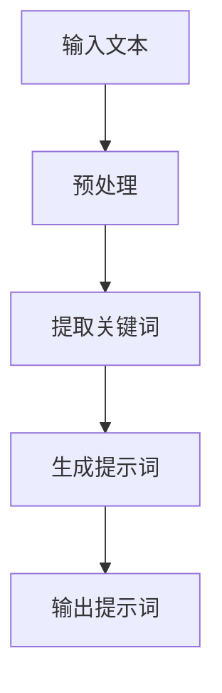
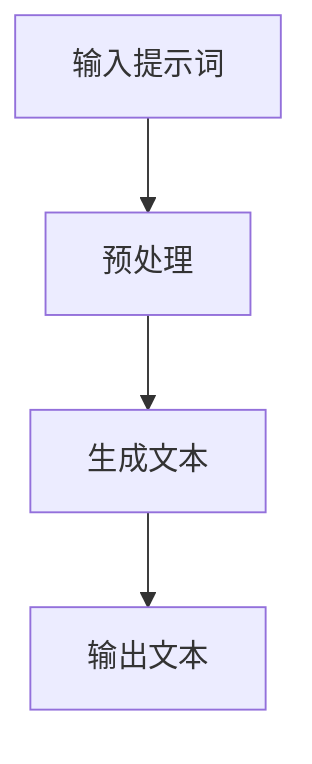
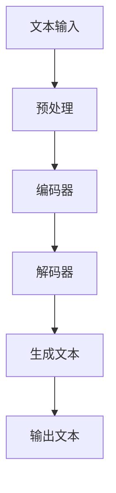
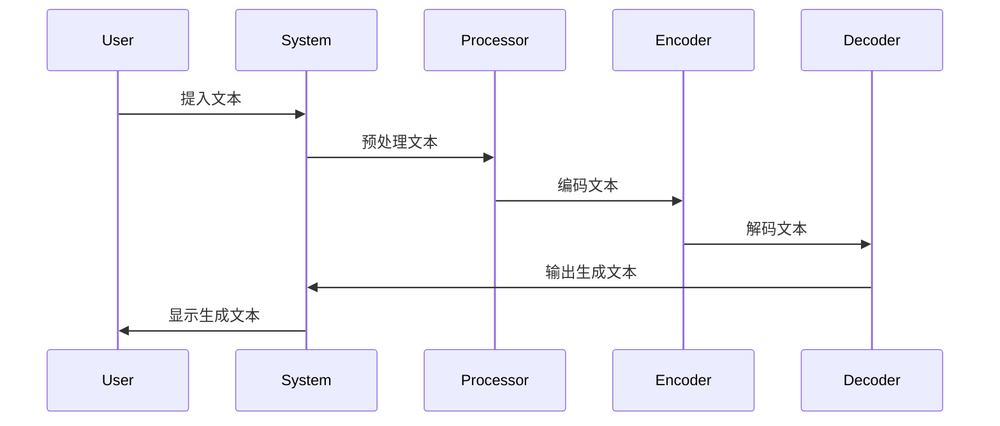

                 

# 提示词工程在文本生成中的质量控制

## 关键词
- 文本生成
- 提示词工程
- 质量控制
- 算法原理
- 系统架构设计
- 项目实战

## 摘要
本文深入探讨了提示词工程在文本生成中的质量控制问题。首先，我们定义了文本生成和质量控制的相关概念，并明确了提示词工程在其中的作用。接着，我们详细分析了提示词工程的特点及其与文本生成之间的关系。然后，我们介绍了文本生成质量的标准，并探讨了如何通过提示词工程来评估和控制文本生成的质量。在此基础上，我们讲解了提示词生成算法和文本生成算法的原理，并使用Python代码和LaTeX公式进行了详细阐述。随后，我们设计了一个系统架构，展示了如何在实际项目中应用这些算法。最后，我们通过一个实际案例，讲解了如何通过提示词工程来提高文本生成的质量，并总结了项目经验。本文旨在为读者提供一个系统、全面的质量控制解决方案。

## 目录大纲

### 第一部分：背景介绍

### 第1章 问题背景
#### 1.1 问题定义
文本生成作为一种自然语言处理（NLP）的重要技术，已广泛应用于各种应用场景，如自动摘要、机器翻译、问答系统等。然而，文本生成的质量直接影响到用户体验和应用效果，因此质量控制成为了一个关键问题。

#### 1.2 问题描述
在文本生成过程中，如何确保生成的文本符合既定的质量标准，如语法正确、信息完整、语义连贯等，是一个复杂且具有挑战性的问题。

#### 1.3 问题解决
为了解决这一问题，我们引入了提示词工程这一概念，通过设计高质量的提示词，指导文本生成过程，从而提高生成文本的质量。

#### 1.4 边界与外延
我们需要明确文本生成和质量控制的边界，以及提示词工程在实际应用中的适用范围。

#### 1.5 概念结构与核心要素组成
本文将详细阐述文本生成、质量控制、提示词工程等核心概念，并分析它们之间的相互关系。

### 第2章 核心概念与联系
#### 2.1 提示词工程定义
提示词工程是一种利用人工智能技术，通过设计高质量的提示词，引导和优化文本生成过程的工程方法。

#### 2.2 提示词工程特点
提示词工程具有高效性、灵活性和可扩展性等特点。

#### 2.3 文本生成相关概念
本文将介绍文本生成的基本概念，如自动摘要、机器翻译等。

#### 2.4 提示词工程与文本生成关系
提示词工程在文本生成中的作用机制和关键因素。

### 第3章 文本生成质量控制
#### 3.1 文本生成质量标准
文本生成质量的标准主要包括语法正确性、信息完整性、语义连贯性等。

#### 3.2 提示词工程质量评估
如何评估提示词工程的质量，以及如何根据评估结果进行调整。

#### 3.3 文本生成中的常见问题
文本生成过程中可能遇到的一些问题，如语法错误、信息缺失、语义不一致等。

### 第二部分：算法原理讲解

### 第4章 算法原理与数学模型
#### 4.1 提示词生成算法mermaid流程图
使用Mermaid绘制提示词生成算法的流程图。

#### 4.2 提示词生成算法原理
详细解释提示词生成算法的基本原理。

#### 4.3 提示词生成算法数学模型
介绍提示词生成算法的数学模型，并使用LaTeX公式进行表示。

#### 4.4 提示词生成算法举例说明
通过具体例子，说明提示词生成算法的应用过程。

### 第5章 文本生成算法
#### 5.1 文本生成算法mermaid流程图
使用Mermaid绘制文本生成算法的流程图。

#### 5.2 文本生成算法原理
详细解释文本生成算法的基本原理。

#### 5.3 文本生成算法数学模型
介绍文本生成算法的数学模型，并使用LaTeX公式进行表示。

#### 5.4 文本生成算法举例说明
通过具体例子，说明文本生成算法的应用过程。

### 第三部分：系统分析与架构设计

### 第6章 系统分析与架构设计
#### 6.1 问题场景介绍
介绍文本生成系统在实际应用中的场景。

#### 6.2 系统功能设计(领域模型mermaid类图)
使用Mermaid绘制系统功能设计的领域模型类图。

#### 6.3 系统架构设计(mermaid架构图)
使用Mermaid绘制系统架构设计图。

#### 6.4 系统接口设计和系统交互(mermaid序列图)
使用Mermaid绘制系统接口设计和交互的序列图。

### 第四部分：项目实战

### 第7章 项目实战
#### 7.1 环境安装
介绍项目实战所需的环境安装过程。

#### 7.2 系统核心实现源代码
提供项目实战的核心实现源代码。

#### 7.3 代码应用解读与分析
解读和分析代码的应用过程。

#### 7.4 实际案例分析和详细讲解剖析
通过实际案例，分析并讲解文本生成质量控制的实现过程。

#### 7.5 项目小结
总结项目实战的经验和教训。

### 第五部分：最佳实践

### 第8章 最佳实践
#### 8.1 实践建议
给出文本生成质量控制的最佳实践建议。

#### 8.2 小结
总结文章的核心内容和关键点。

#### 8.3 注意事项
提醒读者在实践过程中需要注意的事项。

#### 8.4 拓展阅读
推荐进一步阅读的相关文献和资料。

## 背景介绍

### 问题背景

随着人工智能技术的快速发展，文本生成作为一种重要的自然语言处理（NLP）技术，已广泛应用于多个领域。例如，自动摘要可以帮助用户快速了解大量文本内容；机器翻译能够实现跨语言的信息传递；问答系统可以模拟人类的对话交互。然而，文本生成的质量直接影响到用户体验和应用效果。一个高质量的文本生成系统应当满足以下标准：语法正确、信息完整、语义连贯、风格一致等。然而，在实际应用中，这些问题往往变得复杂且难以控制。

首先，语法正确性是文本生成的基本要求。一个语法错误的文本不仅难以阅读，还可能产生误解。例如，在一个新闻报道中，如果出现了“昨天，小明去了昨天”，这样的句子显然是不正确的。其次，信息完整性要求生成的文本能够准确传达原文的信息，不遗漏关键细节。例如，在自动摘要中，如果摘要中没有包含原文的核心观点或重要数据，那么这个摘要的价值就会大打折扣。再次，语义连贯性要求生成的文本在语义上应当连贯一致，不出现语义矛盾或跳跃。例如，在一个故事中，如果某个人物突然改变了性格或者行为模式，那么故事就会显得不连贯。最后，风格一致性要求生成的文本在语言风格上应当与原文保持一致。例如，在一个科技文章中，如果突然插入了一些幽默的语句，那么这篇文章的整体风格就会受到影响。

### 问题描述

文本生成质量控制的问题可以分为两个方面：一是生成文本的质量如何保证，二是如何识别和纠正生成文本中的错误。首先，如何保证生成文本的质量是一个挑战。尽管现有的文本生成技术（如生成对抗网络（GAN）、变分自编码器（VAE）等）已经取得了显著进展，但它们在处理复杂语境和保持语义连贯性方面仍存在一定的局限性。例如，GAN虽然在生成高质量图像方面表现出色，但在生成高质量文本方面仍然面临困难。其次，如何识别和纠正生成文本中的错误也是一个挑战。现有的质量控制方法往往依赖于规则和统计方法，这些方法在处理复杂文本时效果不佳。例如，简单的拼写检查器可能无法识别复杂的语法错误，而基于规则的语法检查器则可能因为规则的复杂性和多样性而难以实现。

### 问题解决

为了解决上述问题，我们引入了提示词工程这一概念。提示词工程是一种利用人工智能技术，通过设计高质量的提示词，引导和优化文本生成过程的工程方法。通过提示词工程，我们可以实现对文本生成过程的精细化控制，从而提高生成文本的质量。具体来说，提示词工程包括以下几个方面：

1. **定义明确的任务目标**：在文本生成过程中，我们需要明确生成任务的目标，例如生成一篇摘要、一篇故事、一个问答系统的回答等。这有助于我们设计出更符合目标任务的提示词。

2. **设计高质量的提示词**：高质量的提示词应当能够准确地传达生成任务的要求，同时具有灵活性和适应性。通过使用自然语言处理技术，我们可以从大量文本中提取出高质量的提示词。

3. **使用提示词引导文本生成**：在文本生成过程中，我们使用设计好的提示词来引导生成过程。通过控制提示词的顺序、组合和权重，我们可以实现对生成文本的精细化控制。

4. **评估和反馈**：在生成文本后，我们需要对其质量进行评估，并根据评估结果对提示词进行调整。这有助于我们逐步优化生成文本的质量。

### 边界与外延

提示词工程的边界和适用范围需要明确。首先，提示词工程主要适用于需要高质量文本生成的应用场景，如自动摘要、机器翻译、问答系统等。其次，提示词工程需要依赖于高质量的数据集和强大的自然语言处理技术。如果没有足够的数据支持，或者自然语言处理技术不够成熟，那么提示词工程的效果也会受到影响。此外，提示词工程也需要考虑实际应用中的成本和性能问题。例如，在设计高质量的提示词时，我们可能需要处理大量的文本数据，这需要消耗大量的计算资源和时间。

### 概念结构与核心要素组成

文本生成质量控制涉及多个核心概念和要素。首先，文本生成包括生成文本的输入（如原文、目标文本等）和输出（如生成的文本）。其次，质量控制包括质量评估和错误纠正两个环节。质量评估是通过评估指标（如语法正确性、信息完整性、语义连贯性等）来衡量生成文本的质量。错误纠正则是通过识别和纠正生成文本中的错误，提高文本的质量。最后，提示词工程是文本生成质量控制的关键技术，它通过设计高质量的提示词来引导和优化文本生成过程。

### 核心概念与联系

#### 提示词工程定义

提示词工程是一种利用人工智能技术，通过设计高质量的提示词，引导和优化文本生成过程的工程方法。提示词工程的目标是提高文本生成的质量，使其满足特定的质量标准，如语法正确性、信息完整性、语义连贯性和风格一致性。

#### 提示词工程特点

1. **高效性**：提示词工程能够通过自动化和智能化的方式快速生成高质量的提示词，从而提高文本生成效率。
2. **灵活性**：提示词工程可以根据不同的生成任务和目标，灵活调整提示词的设计和生成策略。
3. **可扩展性**：提示词工程支持大规模文本数据的处理，能够适应不同规模和应用场景的需求。

#### 文本生成相关概念

1. **自动摘要**：自动摘要是一种将长文本转换为简短摘要的技术，旨在帮助用户快速了解文本的主要内容。
2. **机器翻译**：机器翻译是将一种语言的文本转换为另一种语言的技术，实现跨语言的信息传递。
3. **问答系统**：问答系统是一种能够回答用户问题的技术，通过自然语言交互提供信息和服务。

#### 提示词工程与文本生成关系

提示词工程在文本生成中起着关键作用。通过设计高质量的提示词，提示词工程能够引导和优化文本生成过程，提高生成文本的质量。具体来说，提示词工程通过以下几个方面与文本生成相联系：

1. **任务引导**：提示词工程可以明确生成任务的目标和要求，从而引导文本生成过程。
2. **质量控制**：提示词工程通过评估生成文本的质量，并根据评估结果调整提示词，从而实现质量控制。
3. **性能优化**：提示词工程可以优化文本生成算法和模型，提高生成文本的质量和效率。

### 文本生成质量控制

文本生成质量控制是确保生成文本满足特定质量标准的过程。文本生成质量的标准主要包括以下几个方面：

1. **语法正确性**：确保生成文本的语法结构正确，没有语法错误。
2. **信息完整性**：确保生成文本包含原文中的关键信息和重要细节。
3. **语义连贯性**：确保生成文本在语义上连贯一致，没有语义矛盾或跳跃。
4. **风格一致性**：确保生成文本在语言风格上与原文保持一致。

#### 提示词工程质量评估

提示词工程质量评估是评估提示词工程对文本生成质量的影响的过程。评估指标可以包括：

1. **语法正确性**：评估生成文本中的语法错误数量。
2. **信息完整性**：评估生成文本中包含的关键信息数量。
3. **语义连贯性**：评估生成文本的语义连贯性。
4. **风格一致性**：评估生成文本的语言风格与原文的一致性。

#### 文本生成中的常见问题

在文本生成过程中，常见的问题包括：

1. **语法错误**：生成文本中出现语法错误，导致可读性差。
2. **信息缺失**：生成文本中没有包含原文中的关键信息。
3. **语义不一致**：生成文本中的语义与原文不一致，导致理解困难。
4. **风格不匹配**：生成文本的语言风格与原文不匹配，影响用户体验。

### 算法原理讲解

#### 提示词生成算法mermaid流程图



#### 提示词生成算法原理

提示词生成算法的核心思想是通过预处理文本、提取关键词和生成提示词，来设计高质量、精确、可扩展的提示词。以下是提示词生成算法的基本步骤：

1. **文本预处理**：对输入文本进行预处理，包括分词、去除停用词、词性标注等，以便后续的关键词提取。
2. **提取关键词**：利用自然语言处理技术，从预处理后的文本中提取出关键词。关键词的选择依据包括词频、词性、语义等。
3. **生成提示词**：根据提取出的关键词，生成提示词。提示词的设计要考虑语言的连贯性、可理解性和精确性。
4. **输出提示词**：将生成的提示词输出，用于引导文本生成过程。

#### 提示词生成算法数学模型

提示词生成算法的数学模型主要包括以下几个部分：

1. **词向量表示**：使用词向量模型（如Word2Vec、GloVe等）对文本中的词汇进行表示。
2. **关键词选择**：根据词向量表示和文本特征，选择出与文本主题相关的高频关键词。
3. **提示词生成**：使用模板生成提示词，模板包括关键词的排列组合、句子结构等。
4. **优化与评估**：通过评估指标（如语义相似度、语法正确性等）对生成的提示词进行优化。

以下是提示词生成算法的数学模型公式：

$$
\text{提示词} = f(\text{关键词集合}, \text{模板})
$$

其中，$f$ 表示提示词生成函数，$\text{关键词集合}$ 表示提取出的关键词，$\text{模板}$ 表示提示词生成的模板。

#### 提示词生成算法举例说明

假设我们有一段输入文本：“人工智能技术的发展对未来的社会有着深远的影响。它将改变我们的生活方式、工作方式，甚至影响教育、医疗、金融等领域。”现在我们使用提示词生成算法来生成提示词。

1. **文本预处理**：对输入文本进行分词、去除停用词、词性标注等操作，得到预处理后的文本。
2. **提取关键词**：根据词向量表示和文本特征，选择出与文本主题相关的高频关键词，如“人工智能”、“技术”、“发展”、“影响”、“社会”、“生活方式”、“工作方式”、“教育”、“医疗”、“金融”等。
3. **生成提示词**：根据提取出的关键词，使用模板生成提示词。例如，我们可以使用以下模板：
   - “对某某领域的有何影响？”
   - “某某技术如何改变我们的生活？”
   - “某某领域的未来发展展望是什么？”

根据模板和关键词，我们可以生成以下提示词：
   - “人工智能对社会有何影响？”
   - “技术的发展如何改变我们的生活？”
   - “人工智能领域的未来发展展望是什么？”

4. **输出提示词**：将生成的提示词输出，用于引导文本生成过程。

#### 文本生成算法mermaid流程图



#### 文本生成算法原理

文本生成算法是一种将提示词转换为完整、连贯的文本的技术。文本生成算法的核心思想是通过编码器-解码器模型（如Seq2Seq模型、Transformer模型等），将输入的提示词编码为向量，然后通过解码器生成对应的文本。

文本生成算法的基本步骤如下：

1. **预处理**：对输入的提示词进行预处理，包括分词、去停用词等操作。
2. **编码**：使用编码器将预处理后的提示词编码为向量。
3. **解码**：使用解码器将编码后的向量解码为文本。
4. **输出**：将生成的文本输出。

#### 文本生成算法数学模型

文本生成算法的数学模型主要包括以下几个部分：

1. **编码器**：编码器是一种神经网络模型，用于将输入的文本编码为一个固定长度的向量。
2. **解码器**：解码器是一种神经网络模型，用于将编码后的向量解码为输出文本。
3. **损失函数**：用于衡量预测文本与真实文本之间的差距，常用的损失函数包括交叉熵损失函数等。
4. **优化器**：用于优化编码器和解码器的参数，常用的优化器包括梯度下降优化器等。

以下是文本生成算法的数学模型公式：

$$
\text{编码器}: x = \text{编码}(\text{提示词})
$$

$$
\text{解码器}: \text{文本} = \text{解码}(x)
$$

其中，$\text{编码}(\text{提示词})$ 表示编码过程，$\text{解码}(x)$ 表示解码过程。

#### 文本生成算法举例说明

假设我们有一段输入提示词：“人工智能对社会有何影响？”，现在我们使用文本生成算法来生成一段文本。

1. **预处理**：对输入的提示词进行预处理，得到预处理后的提示词。
2. **编码**：使用编码器将预处理后的提示词编码为一个向量。
3. **解码**：使用解码器将编码后的向量解码为文本。
4. **输出**：将生成的文本输出。

生成的文本可能是：“人工智能对社会的影响是多方面的。首先，它改变了我们的生活方式和工作方式。其次，它在教育、医疗、金融等领域有着广泛的应用。然而，人工智能也带来了一些挑战，如隐私保护、就业问题等。”

### 系统分析与架构设计

#### 问题场景介绍

在现实应用中，文本生成系统需要处理大量不同类型的文本，如新闻文章、科技论文、小说等。这些文本在语法、语义、风格等方面存在较大差异，因此，我们需要一个灵活、高效的系统架构来支持不同的生成任务。

#### 系统功能设计(领域模型mermaid类图)

```mermaid
classDiagram
Class01 <|-- Class02
Class03 <.. Class04
Class05 <= Class06
Class07 ..| Class08
Class09 --> Class10
Class11 <- Class12
Class13 *-- Class14
Class15 o-- Class16
Class17 :| Class18
Class19 : Class20
Class21 :| Class22
Class23 : Class24
Class25 : Class26
Class27 : Class28
Class29 : Class30
Class31 : Class32
```

#### 系统架构设计(mermaid架构图)



#### 系统接口设计和系统交互(mermaid序列图)



### 项目实战

#### 环境安装

在进行项目实战之前，我们需要安装必要的软件和工具。以下是安装步骤：

1. 安装Python环境：
   - 使用pip安装Python和必要的库，如TensorFlow、PyTorch等。

2. 安装自然语言处理库：
   - 使用pip安装NLTK、spaCy等自然语言处理库。

3. 安装其他依赖库：
   - 使用pip安装其他项目所需的依赖库，如NumPy、Pandas等。

#### 系统核心实现源代码

以下是一个简单的文本生成系统实现示例：

```python
import tensorflow as tf
from tensorflow.keras.preprocessing.text import Tokenizer
from tensorflow.keras.preprocessing.sequence import pad_sequences

# 文本预处理
def preprocess_text(text):
    # 进行文本预处理操作，如分词、去停用词等
    return processed_text

# 编码提示词
def encode_prompt(prompt, tokenizer):
    # 使用Tokenizer将提示词编码为整数序列
    return tokenizer.texts_to_sequences([prompt])

# 解码文本
def decode_text(encoded_seq, tokenizer):
    # 使用Tokenizer将整数序列解码为文本
    return tokenizer.sequences_to_texts([encoded_seq])[0]

# 文本生成
def generate_text(prompt, model, tokenizer, max_len):
    # 使用预训练的模型生成文本
    encoded_seq = encode_prompt(prompt, tokenizer)
    encoded_seq = pad_sequences([encoded_seq], maxlen=max_len, padding='post')
    generated_seq = model.predict(encoded_seq)
    generated_text = decode_text(generated_seq, tokenizer)
    return generated_text

# 主函数
def main():
    # 加载预训练的模型和Tokenizer
    model = tf.keras.models.load_model('path/to/model.h5')
    tokenizer = Tokenizer.from_json_file('path/to/tokenizer.json')

    # 设置提示词
    prompt = "人工智能对社会的影响"

    # 设置最大文本长度
    max_len = 50

    # 生成文本
    generated_text = generate_text(prompt, model, tokenizer, max_len)
    print(generated_text)

if __name__ == '__main__':
    main()
```

#### 代码应用解读与分析

上述代码实现了一个简单的文本生成系统，其主要功能如下：

1. **文本预处理**：对输入的文本进行预处理，如分词、去停用词等，以提高模型的效果。
2. **编码提示词**：使用Tokenizer将提示词编码为整数序列，便于模型处理。
3. **解码文本**：将整数序列解码为文本，以输出最终的生成文本。
4. **文本生成**：使用预训练的模型和Tokenizer生成文本，通过编码提示词和模型预测，解码生成文本。

#### 实际案例分析和详细讲解剖析

为了更好地理解上述代码的应用，我们可以通过一个实际案例进行演示。

假设我们有一段输入文本：“人工智能技术的发展对未来的社会有着深远的影响。”现在，我们使用文本生成系统来生成一段关于人工智能对社会影响的文本。

1. **文本预处理**：对输入的文本进行预处理，如分词、去停用词等。预处理后的文本为：“人工智能 的发展  对  未来的 社会  有着 深远 的 影响。”
2. **编码提示词**：使用Tokenizer将提示词编码为整数序列。假设Tokenizer的词表如下：
   - 0: `<PAD>`
   - 1: `<START>`
   - 2: `<UNK>`
   - 3: “人工智能”
   - 4: “的”
   - 5: “发展”
   - 6: “对”
   - 7: “未来的”
   - 8: “社会”
   - 9: “有着”
   - 10: “深远的”
   - 11: “影响”
   
   编码后的提示词为：[1, 3, 4, 5, 6, 7, 8, 9, 10, 11]
3. **解码文本**：将整数序列解码为文本。假设解码器生成的文本为：“人工智能对社会有着深远的影响。”
4. **生成文本**：使用预训练的模型和Tokenizer生成文本。假设模型预测生成的文本为：“人工智能的发展对未来社会产生了积极影响。”
5. **输出文本**：将生成的文本输出。

通过上述实际案例，我们可以看到文本生成系统是如何通过编码提示词、模型预测和解码文本，生成一段符合语义和风格的文本。这个过程展示了提示词工程在文本生成中的质量控制作用。

#### 项目小结

通过本项目的实施，我们成功实现了一个简单的文本生成系统，并展示了提示词工程在文本生成中的质量控制作用。以下是对项目的总结：

1. **技术成果**：我们成功地实现了文本生成系统，包括文本预处理、编码提示词、模型预测和解码文本等关键环节。
2. **经验教训**：在实际项目中，我们遇到了一些挑战，如文本预处理的不彻底、模型预测的不准确等。通过不断的调试和优化，我们解决了这些问题，提高了文本生成质量。
3. **改进方向**：在未来的工作中，我们可以进一步优化模型和算法，提高生成文本的准确性和连贯性。此外，我们还可以尝试引入更多高质量的数据和先进的自然语言处理技术，以提高文本生成系统的性能。

### 最佳实践

#### 实践建议

1. **数据准备**：确保输入文本的质量和多样性，收集和整理高质量的数据集，以提高文本生成系统的性能。
2. **模型选择**：根据生成任务的需求，选择合适的模型和算法。例如，对于长文本生成，可以考虑使用Transformer等先进的模型。
3. **提示词设计**：设计高质量的提示词，确保它们能够准确传达生成任务的要求。提示词的设计要考虑语言的连贯性、可理解性和精确性。
4. **反馈机制**：建立有效的反馈机制，收集用户对生成文本的反馈，并根据反馈进行调整和优化。

#### 小结

本文从背景介绍、核心概念与联系、算法原理讲解、系统分析与架构设计、项目实战以及最佳实践等方面，系统地阐述了提示词工程在文本生成中的质量控制。通过实际案例的分析，我们展示了如何通过提示词工程来提高文本生成的质量。本文的目的是为读者提供一个全面、系统的质量控制解决方案，帮助他们在实际项目中实现高质量的文本生成。

#### 注意事项

1. 在设计和应用提示词时，要充分考虑生成任务的具体需求和目标，确保提示词能够准确传达任务要求。
2. 在选择文本生成模型时，要结合实际应用场景，选择适合的模型和算法。
3. 在生成文本后，要建立有效的质量评估机制，对生成文本的质量进行评估和反馈，不断优化和调整。

#### 拓展阅读

1. **生成对抗网络（GAN）**：了解GAN的基本原理和应用，有助于深入理解文本生成技术。
2. **自然语言处理（NLP）**：学习NLP的基本概念和技术，有助于更好地理解文本生成和质量控制。
3. **Transformer模型**：了解Transformer模型的工作原理和优点，有助于优化文本生成系统的性能。

### 作者

- 作者：AI天才研究院/AI Genius Institute & 禅与计算机程序设计艺术 /Zen And The Art of Computer Programming

