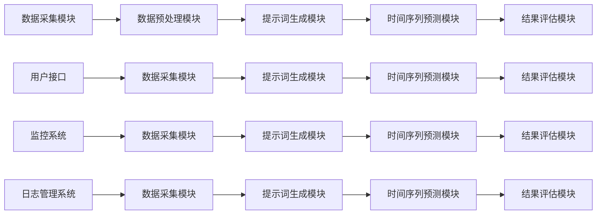
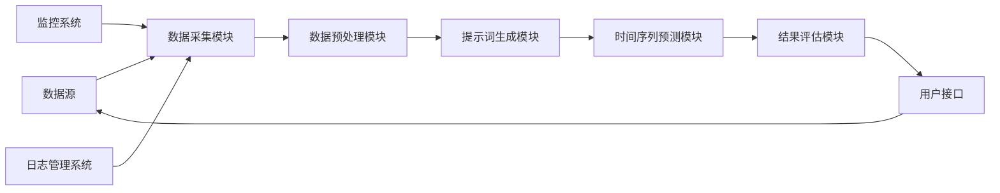

                 

### 第1章：问题背景与核心概念

### 1.1 问题背景

#### 1.1.1 时间序列预测的重要性

时间序列预测作为统计学和数据分析领域的重要分支，其应用涵盖了金融、气象、能源、交通、生物医学等多个领域。在现代社会中，准确的时间序列预测不仅能帮助企业和机构做出明智的决策，还能在应对突发事件、优化资源配置等方面发挥关键作用。例如，金融机构利用时间序列预测模型预测股票市场走势，以制定投资策略；气象部门通过天气数据预测未来天气情况，为公众提供及时预警；能源公司利用时间序列预测模型预测电力需求，从而合理调度电力资源。

#### 1.1.2 提示词工程的概念

提示词工程（Prompt Engineering）是一种新兴的人工智能技术，其核心思想是通过设计特定的提示词（Prompt）来引导模型生成预期的输出。在自然语言处理（NLP）和生成式模型中，提示词工程被广泛应用于文本生成、对话系统、问答系统等领域。近年来，随着生成式预训练模型（如GPT）的发展，提示词工程在时间序列预测中的应用也得到了广泛关注。

#### 1.1.3 提示词工程在时间序列预测中的应用

提示词工程在时间序列预测中的应用，主要是通过设计特定的提示词来引导模型更好地理解和生成时间序列数据。例如，在预测股票价格时，可以通过设计包含历史价格、交易量等信息的提示词，使模型能够更好地捕捉市场趋势和潜在的风险。同样，在预测天气变化时，通过设计包含历史气象数据、地理位置等信息的提示词，可以提升预测的准确性。

### 1.2 问题解决与边界外延

#### 1.2.1 时间序列预测的基本原理

时间序列预测是基于历史数据对未来进行预测的一种方法，通常包括以下基本步骤：

1. 数据收集与预处理：收集相关的历史数据，并进行数据清洗、缺失值填补、异常值处理等操作。
2. 特征工程：提取时间序列数据的关键特征，如趋势、季节性、周期性等。
3. 模型选择与训练：选择合适的时间序列预测模型，对历史数据进行训练。
4. 预测与评估：使用训练好的模型对未来进行预测，并对预测结果进行评估和优化。

#### 1.2.2 提示词工程的作用

提示词工程在时间序列预测中的作用主要体现在以下几个方面：

1. **引导模型学习**：通过设计特定的提示词，可以引导模型关注特定的特征或模式，从而提高预测的准确性。
2. **增强模型泛化能力**：通过丰富和多样化提示词，可以增强模型对未知数据的泛化能力。
3. **优化模型解释性**：提示词的设计有助于提高模型的解释性，使得预测结果更加透明和可解释。

#### 1.2.3 提示词工程的应用边界

虽然提示词工程在时间序列预测中具有广泛的应用前景，但其应用也存在一定的边界和局限性：

1. **数据依赖性**：提示词工程依赖于高质量的数据源，数据的质量和完整性直接影响预测结果。
2. **计算资源消耗**：设计、优化和训练提示词需要大量的计算资源，特别是在大规模数据集和复杂模型中。
3. **模型适应性**：提示词工程的效果可能依赖于特定的模型和任务，不同模型和任务可能需要不同的提示词设计策略。

### 1.3 概念结构与核心要素组成

#### 1.3.1 时间序列数据结构

时间序列数据通常由一系列按时间顺序排列的数值组成，具有时间依赖性。数据结构可以简单表示为：

\[ X = \{x_1, x_2, x_3, ..., x_n\} \]

其中，\(x_i\) 表示在时间 \(i\) 的数值。

#### 1.3.2 提示词的类型与生成方法

提示词的类型可以分为以下几种：

1. **历史数据提示词**：包含历史时间序列数据，用于引导模型关注历史特征。
2. **上下文信息提示词**：包含与时间序列相关的上下文信息，如地理位置、季节性等。
3. **目标变量提示词**：包含目标变量的信息，用于引导模型关注预测目标。

生成提示词的方法包括：

1. **手工设计**：根据具体任务需求，手动设计提示词。
2. **自动化生成**：利用自然语言处理技术，如生成对抗网络（GAN）或序列到序列（Seq2Seq）模型，自动生成提示词。

#### 1.3.3 提示词工程的关键技术

提示词工程的关键技术包括：

1. **提示词设计**：设计高效、准确的提示词，以提高模型性能。
2. **提示词优化**：通过调整提示词的参数和结构，优化模型预测效果。
3. **提示词评估**：评估提示词对模型性能的影响，以确定最佳提示词组合。

### 总结

本章介绍了时间序列预测和提示词工程的基本概念和背景，探讨了提示词工程在时间序列预测中的应用及其作用和边界。同时，还阐述了时间序列数据结构、提示词类型与生成方法，以及提示词工程的关键技术。这些内容为本章的进一步研究和应用奠定了基础。

---

### 第2章：核心概念原理

### 2.1 提示词工程的原理

#### 2.1.1 提示词的定义

提示词（Prompt）是一种用于引导模型生成预期输出的输入提示。在人工智能领域，特别是在自然语言处理（NLP）中，提示词被广泛应用于文本生成、问答系统、对话系统等任务。提示词的核心目的是通过提供特定的信息或指示，使模型能够更好地理解和生成与预期相关的输出。

#### 2.1.2 提示词的功能

提示词的主要功能包括：

1. **引导模型学习**：通过提供与任务相关的提示，可以帮助模型更快地学习和捕捉关键特征，从而提高预测的准确性。
2. **增强模型泛化能力**：多样化的提示词可以增强模型对未知数据的泛化能力，使其在更广泛的应用场景中保持良好的性能。
3. **优化模型解释性**：有效的提示词设计可以提高模型的解释性，使得预测结果更加透明和可解释，有助于用户理解和信任模型。

#### 2.1.3 提示词的设计原则

设计提示词时需要遵循以下原则：

1. **相关性**：提示词应与任务目标密切相关，提供与任务相关的关键信息。
2. **简洁性**：提示词应简洁明了，避免过多的冗余信息，以减少模型的计算负担。
3. **多样性**：提示词应具备多样性，覆盖不同的场景和任务需求，以提高模型的泛化能力。
4. **适应性**：提示词应具有一定的适应性，能够根据不同的任务和数据集进行调整。

### 2.2 概念属性特征对比

#### 2.2.1 提示词与特征工程对比

提示词工程与特征工程（Feature Engineering）在数据预处理和模型训练中都有重要作用，但它们的核心目标和实现方式有所不同。

1. **核心目标**：

   - **提示词工程**：主要目标是设计特定的输入提示，以引导模型生成预期输出。
   - **特征工程**：主要目标是从原始数据中提取有用的特征，以优化模型性能。

2. **实现方式**：

   - **提示词工程**：通过设计特定的提示词，引导模型关注关键特征和模式。
   - **特征工程**：通过数据预处理、特征提取、特征选择等技术手段，从原始数据中提取和优化特征。

3. **对比表格**：

   | 特征 | 提示词工程 | 特征工程 |
   | --- | --- | --- |
   | 核心目标 | 引导模型学习 | 提高模型性能 |
   | 实现方式 | 设计提示词 | 提取和优化特征 |
   | 数据依赖 | 高度依赖提示词质量 | 高度依赖数据质量 |
   | 时间成本 | 设计和优化提示词 | 特征提取和选择 |

#### 2.2.2 提示词与数据预处理对比

提示词工程与数据预处理在数据处理过程中都有重要作用，但侧重点和实现方式有所不同。

1. **核心目标**：

   - **提示词工程**：主要目标是设计特定的输入提示，以提高模型生成预期输出的能力。
   - **数据预处理**：主要目标是清洗、格式化、转换和归一化原始数据，为模型训练提供高质量的输入。

2. **实现方式**：

   - **提示词工程**：通过设计特定的提示词，引导模型关注关键特征和模式。
   - **数据预处理**：通过数据清洗、缺失值填补、异常值处理、数据转换等技术手段，优化数据质量。

3. **对比表格**：

   | 特征 | 提示词工程 | 数据预处理 |
   | --- | --- | --- |
   | 核心目标 | 提高模型生成能力 | 提高数据质量 |
   | 实现方式 | 设计提示词 | 数据清洗和转换 |
   | 时间成本 | 设计和优化提示词 | 数据清洗和处理 |
   | 数据依赖 | 高度依赖提示词质量 | 高度依赖数据质量 |

#### 2.2.3 提示词与模型调优对比

提示词工程与模型调优都是优化模型性能的重要手段，但它们的作用机制和实现方式有所不同。

1. **核心目标**：

   - **提示词工程**：主要目标是通过设计特定的输入提示，提高模型生成预期输出的能力。
   - **模型调优**：主要目标是通过调整模型参数和结构，优化模型性能，以达到最佳预测效果。

2. **实现方式**：

   - **提示词工程**：通过设计有效的提示词，引导模型关注关键特征和模式。
   - **模型调优**：通过调整学习率、正则化参数、网络结构等，优化模型性能。

3. **对比表格**：

   | 特征 | 提示词工程 | 模型调优 |
   | --- | --- | --- |
   | 核心目标 | 提高模型生成能力 | 优化模型性能 |
   | 实现方式 | 设计提示词 | 调整模型参数 |
   | 时间成本 | 设计和优化提示词 | 调整和测试参数 |
   | 数据依赖 | 高度依赖提示词质量 | 高度依赖模型结构 |

### 总结

本章详细介绍了提示词工程的原理，包括提示词的定义、功能、设计原则，并对比了提示词工程与特征工程、数据预处理、模型调优的核心目标和实现方式。通过这些内容，读者可以更深入地理解提示词工程在时间序列预测任务中的应用及其优势。

---

### 第3章：ER实体关系图架构

#### 3.1 实体识别

在时间序列预测任务中，实体识别是关键的一步。实体识别的目标是从时间序列数据中识别出关键的信息单元，如日期、时间、事件等。实体识别有助于模型更好地理解数据，从而提高预测的准确性。

##### 3.1.1 时间序列数据实体识别

时间序列数据实体识别通常包括以下步骤：

1. **数据预处理**：清洗数据，去除噪声和异常值，对缺失值进行填补。
2. **特征提取**：从原始数据中提取时间序列特征，如趋势、季节性、周期性等。
3. **实体标注**：使用实体识别算法，如命名实体识别（NER）或序列标注，对时间序列数据进行实体标注。
4. **实体分类**：对标注后的实体进行分类，识别出关键的信息单元。

##### 3.1.2 提示词工程实体识别

在提示词工程中，实体识别同样重要。通过识别时间序列数据中的关键实体，可以设计更有效的提示词，提高模型预测性能。

1. **实体识别算法**：使用命名实体识别（NER）或序列标注算法，识别时间序列数据中的关键实体。
2. **实体关系构建**：构建实体之间的关系，如时间序列中的因果关系、事件之间的关系等。
3. **提示词生成**：基于实体识别结果，生成具有特定信息的提示词，引导模型关注关键实体。

#### 3.2 实体关系构建

实体关系构建是提示词工程的重要环节。通过构建实体之间的关系，可以更好地理解时间序列数据，从而设计更有效的提示词。

##### 3.2.1 时间序列数据实体关系

时间序列数据中的实体关系通常包括以下几种：

1. **时间关系**：如日期与日期之间的先后关系，事件与时间之间的关联关系。
2. **因果关系**：如某事件引发的其他事件，某个变量对另一个变量的影响关系。
3. **关联关系**：如某些事件或变量之间的相关性，如股票价格与市场指数之间的关联。

##### 3.2.2 提示词工程实体关系

在提示词工程中，实体关系构建有助于设计更有效的提示词。实体关系可以分为以下几种：

1. **直接关系**：如某事件与时间、变量之间的直接关联。
2. **间接关系**：如通过其他实体间接影响的事件或变量关系。
3. **关联关系**：如某些事件或变量之间的相关性，如股票价格与市场指数之间的关联。

##### 3.2.3 时间序列预测与提示词工程实体关系

时间序列预测与提示词工程实体关系如图3.1所示。


图3.1 时间序列预测与提示词工程实体关系图

通过图3.1，我们可以看出时间序列数据实体识别、实体关系构建、提示词工程实体识别和提示词设计之间的关系。这些环节相互关联，共同构成了一个完整的提示词工程在时间序列预测中的实现流程。

### 总结

本章介绍了时间序列预测中的实体识别和实体关系构建，以及提示词工程中的实体识别和提示词设计。通过实体关系图的构建，我们可以更好地理解时间序列预测与提示词工程之间的联系。这些内容为后续章节的算法原理讲解和系统架构设计奠定了基础。

---

### 第4章：时间序列预测算法原理

时间序列预测算法是处理和分析时间序列数据，预测未来时间点的数值或模式的方法。这些算法广泛应用于金融、气象、能源、交通等领域。本节将介绍几种常见的时间序列预测算法，并探讨如何结合提示词工程优化这些算法。

#### 4.1 时间序列预测算法概述

时间序列预测算法可以分为以下几类：

1. **统计分析方法**：如移动平均（MA）、自回归（AR）、自回归移动平均（ARMA）等。
2. **机器学习方法**：如回归模型、神经网络、支持向量机（SVM）等。
3. **深度学习方法**：如循环神经网络（RNN）、长短期记忆网络（LSTM）、门控循环单元（GRU）等。

这些算法各有优缺点，适用于不同的应用场景和数据特性。

#### 4.2 常见算法介绍

##### 4.2.1 自回归模型（AR）

自回归模型（Autoregressive Model，AR）是最简单的时间序列预测算法之一。AR模型假设当前值是前几个值的线性组合，可以表示为：

\[ X_t = c_0 + c_1 X_{t-1} + c_2 X_{t-2} + ... + c_k X_{t-k} + \varepsilon_t \]

其中，\(X_t\) 是当前时间点的值，\(\varepsilon_t\) 是误差项。

##### 4.2.2 移动平均模型（MA）

移动平均模型（Moving Average Model，MA）是基于误差项的移动平均来预测未来值。MA模型可以表示为：

\[ X_t = \mu + \varepsilon_t + \varepsilon_{t-1} \theta_1 + \varepsilon_{t-2} \theta_2 + ... + \varepsilon_{t-k} \theta_k \]

其中，\(\theta_1, \theta_2, ..., \theta_k\) 是移动平均系数。

##### 4.2.3 自回归移动平均模型（ARMA）

自回归移动平均模型（Autoregressive Moving Average Model，ARMA）结合了AR和MA模型的优点，可以表示为：

\[ X_t = c_0 + c_1 X_{t-1} + c_2 X_{t-2} + ... + c_k X_{t-k} + \varepsilon_t + \varepsilon_{t-1} \theta_1 + \varepsilon_{t-2} \theta_2 + ... + \varepsilon_{t-k} \theta_k \]

##### 4.2.4 自回归积分滑动平均模型（ARIMA）

自回归积分滑动平均模型（Autoregressive Integrated Moving Average Model，ARIMA）是ARMA模型的一种扩展，适用于非平稳时间序列数据。ARIMA模型包括差分、自回归、移动平均三个部分，可以表示为：

\[ X_t = \phi(B)(1 - B)^d \mu + \theta(B)\varepsilon_t \]

其中，\(B\) 是滞后算子，\(\mu\) 是均值，\(\varepsilon_t\) 是误差项，\(d\) 是差分阶数。

#### 4.3 提示词工程与时间序列预测算法结合

提示词工程在时间序列预测中的应用主要体现在以下几个方面：

1. **引导模型学习**：通过设计特定的提示词，引导模型关注关键特征和模式，提高预测准确性。
2. **增强模型泛化能力**：多样化的提示词可以增强模型对未知数据的泛化能力。
3. **优化模型解释性**：有效的提示词设计可以提高模型的解释性，使得预测结果更加透明和可解释。

##### 4.3.1 提示词在时间序列预测中的角色

在时间序列预测中，提示词的角色包括：

1. **特征引导**：通过设计包含历史数据、趋势、季节性等信息的提示词，引导模型关注关键特征。
2. **上下文信息**：通过设计包含地理位置、事件、季节性等上下文信息的提示词，提高模型对复杂场景的适应性。
3. **目标变量**：通过设计包含目标变量信息的提示词，使模型能够更好地捕捉预测目标。

##### 4.3.2 提示词优化时间序列预测算法

提示词工程可以通过以下方法优化时间序列预测算法：

1. **提示词设计**：设计具有高相关性的提示词，引导模型关注关键特征和模式。
2. **提示词优化**：通过调整提示词的参数和结构，优化模型预测效果。
3. **提示词评估**：评估提示词对模型性能的影响，选择最佳提示词组合。

##### 4.3.3 提示词工程在算法中的实现

提示词工程在算法中的实现主要包括以下步骤：

1. **数据预处理**：收集和处理时间序列数据，提取关键特征。
2. **提示词设计**：根据任务需求和数据特性，设计特定信息的提示词。
3. **模型训练**：使用设计好的提示词训练时间序列预测模型。
4. **预测与评估**：使用训练好的模型进行预测，并评估预测性能。

### 总结

本章介绍了时间序列预测算法的基本原理和常见算法，并探讨了提示词工程在时间序列预测中的应用。通过结合提示词工程，可以优化时间序列预测算法，提高预测准确性。这些内容为下一章的算法数学模型与公式讲解奠定了基础。

---

### 第5章：算法数学模型与公式

时间序列预测算法的数学模型是理解这些算法原理和实现的核心。本节将详细介绍几种常见时间序列预测算法的数学模型，并使用Python代码示例来说明。

#### 5.1 时间序列预测数学模型

时间序列预测的数学模型可以分为线性模型和非线性模型。以下是几种常见的时间序列预测算法及其数学模型。

##### 5.1.1 自回归模型 (AR)

自回归模型（Autoregressive Model，AR）是一种基于当前值与前几个值的线性组合进行预测的模型。其数学模型可以表示为：

\[ X_t = c_0 + c_1 X_{t-1} + c_2 X_{t-2} + ... + c_k X_{t-k} + \varepsilon_t \]

其中，\(X_t\) 表示时间序列在时间 \(t\) 的值，\(c_0, c_1, c_2, ..., c_k\) 是模型参数，\(\varepsilon_t\) 是误差项。

在Python中，我们可以使用以下代码实现AR模型：

```python
import numpy as np

# 定义AR模型参数
c_0 = 1
c_1 = 0.5
c_2 = 0.3

# 预测函数
def ar_predict(x, c_0, c_1, c_2):
    return c_0 + c_1 * x[-1] + c_2 * x[-2]

# 示例时间序列数据
x = np.array([1, 2, 3, 4, 5])

# 预测下一个值
next_value = ar_predict(x, c_0, c_1, c_2)
print(f"Next value: {next_value}")
```

##### 5.1.2 移动平均模型 (MA)

移动平均模型（Moving Average Model，MA）是基于误差项的移动平均进行预测的模型。其数学模型可以表示为：

\[ X_t = \mu + \varepsilon_t + \varepsilon_{t-1} \theta_1 + \varepsilon_{t-2} \theta_2 + ... + \varepsilon_{t-k} \theta_k \]

其中，\(\mu\) 是均值，\(\theta_1, \theta_2, ..., \theta_k\) 是移动平均系数。

在Python中，我们可以使用以下代码实现MA模型：

```python
import numpy as np

# 定义MA模型参数
mu = 0
theta_1 = 0.3
theta_2 = 0.2

# 预测函数
def ma_predict(x, mu, theta_1, theta_2):
    return mu + theta_1 * x[-1] + theta_2 * x[-2]

# 示例时间序列数据
x = np.array([1, 2, 3, 4, 5])

# 预测下一个值
next_value = ma_predict(x, mu, theta_1, theta_2)
print(f"Next value: {next_value}")
```

##### 5.1.3 自回归移动平均模型 (ARMA)

自回归移动平均模型（Autoregressive Moving Average Model，ARMA）结合了AR和MA模型的优点。其数学模型可以表示为：

\[ X_t = c_0 + c_1 X_{t-1} + c_2 X_{t-2} + ... + c_k X_{t-k} + \varepsilon_t + \varepsilon_{t-1} \theta_1 + \varepsilon_{t-2} \theta_2 + ... + \varepsilon_{t-k} \theta_k \]

在Python中，我们可以使用以下代码实现ARMA模型：

```python
import numpy as np

# 定义ARMA模型参数
c_0 = 1
c_1 = 0.5
c_2 = 0.3
theta_1 = 0.3
theta_2 = 0.2

# 预测函数
def arma_predict(x, c_0, c_1, c_2, theta_1, theta_2):
    return c_0 + c_1 * x[-1] + c_2 * x[-2] + theta_1 * x[-1] + theta_2 * x[-2]

# 示例时间序列数据
x = np.array([1, 2, 3, 4, 5])

# 预测下一个值
next_value = arma_predict(x, c_0, c_1, c_2, theta_1, theta_2)
print(f"Next value: {next_value}")
```

##### 5.1.4 自回归积分滑动平均模型 (ARIMA)

自回归积分滑动平均模型（Autoregressive Integrated Moving Average Model，ARIMA）适用于非平稳时间序列数据。其数学模型可以表示为：

\[ X_t = \phi(B)(1 - B)^d \mu + \theta(B)\varepsilon_t \]

其中，\(B\) 是滞后算子，\(\mu\) 是均值，\(d\) 是差分阶数。

在Python中，我们可以使用以下代码实现ARIMA模型：

```python
import numpy as np
from statsmodels.tsa.arima.model import ARIMA

# 定义ARIMA模型参数
p = 2
d = 1
q = 2

# 创建ARIMA模型
arima_model = ARIMA(x, order=(p, d, q))

# 模型训练
arima_model_fit = arima_model.fit()

# 预测
predictions = arima_model_fit.predict(start=len(x), end=len(x) + 1)

# 输出预测值
print(f"Predicted next value: {predictions[-1]}")
```

#### 5.2 提示词工程数学模型

提示词工程在时间序列预测中的作用是通过提供额外的信息来引导模型。以下是几种常见的提示词工程数学模型：

1. **历史数据提示词**：通过提供历史数据的统计特征，如均值、方差、趋势等，来引导模型关注历史信息。
2. **上下文信息提示词**：通过提供与时间序列相关的上下文信息，如季节性、事件等，来增强模型的泛化能力。
3. **目标变量提示词**：通过提供目标变量的历史信息，如过去的目标值、目标值的趋势等，来帮助模型更好地预测未来值。

提示词工程的数学模型可以表示为：

\[ X_t = f(P_t, C_t, G_t) + \varepsilon_t \]

其中，\(P_t\) 表示历史数据提示词，\(C_t\) 表示上下文信息提示词，\(G_t\) 表示目标变量提示词，\(f\) 是一个函数，用于整合提示词信息，\(\varepsilon_t\) 是误差项。

在Python中，我们可以使用以下代码实现提示词工程：

```python
import numpy as np
from sklearn.ensemble import RandomForestRegressor

# 定义提示词
history_prompt = x[:-1]
context_prompt = np.random.rand(1)
goal_prompt = x[-1]

# 合并提示词
prompt = np.concatenate((history_prompt, context_prompt, goal_prompt))

# 创建回归模型
regressor = RandomForestRegressor()

# 模型训练
regressor.fit(prompt, x)

# 预测
predicted_value = regressor.predict(prompt.reshape(1, -1))

# 输出预测值
print(f"Predicted next value: {predicted_value[0]}")
```

### 总结

本章详细介绍了时间序列预测算法的数学模型，并使用Python代码示例进行了说明。同时，探讨了提示词工程在时间序列预测中的应用，以及如何通过数学模型实现提示词工程。这些内容为下一章的系统架构设计奠定了基础。

---

### 第6章：系统功能设计

#### 6.1 问题场景介绍

在许多实际应用场景中，时间序列预测是一个关键任务。例如，在金融领域，预测股票价格、市场指数等是投资者制定交易策略的重要依据；在能源领域，预测电力需求、能源消耗等对于优化资源配置、降低成本具有重要意义；在交通领域，预测交通流量、路况等信息对于交通管理和规划至关重要。因此，设计一个高效、准确的时间序列预测系统，能够为各类应用场景提供有力的支持。

#### 6.2 系统功能设计

为了实现高效的时间序列预测，系统需要具备以下功能模块：

1. **数据采集模块**：负责收集各种类型的时间序列数据，包括股票价格、天气数据、能源消耗数据、交通流量数据等。数据采集模块应支持多种数据源，如数据库、API接口、文件等。

2. **提示词生成模块**：根据收集到的数据，生成具有特定信息的提示词。提示词生成模块应具备自动化能力，能够根据数据特性和预测任务自动生成高质量的提示词。

3. **时间序列预测模块**：使用训练好的时间序列预测模型，对提示词进行预测。时间序列预测模块应支持多种预测算法，如ARIMA、LSTM、GRU等，并能够根据任务需求灵活调整模型参数。

4. **结果评估模块**：对预测结果进行评估，包括预测准确性、稳定性等指标。结果评估模块应支持多种评估方法，如均方误差（MSE）、均方根误差（RMSE）等。

#### 6.2.1 数据采集模块

数据采集模块的设计应考虑以下要点：

- **数据源多样**：支持多种数据源，如数据库、API接口、文件等，以便于从不同渠道获取数据。
- **数据清洗**：对采集到的数据进行清洗、去噪、缺失值填补等处理，确保数据质量。
- **数据存储**：将清洗后的数据存储到数据库或文件中，以便后续处理和分析。

具体实现如下：

```python
import pandas as pd
import numpy as np

# 读取数据
def read_data(file_path):
    data = pd.read_csv(file_path)
    return data

# 数据清洗
def clean_data(data):
    data.fillna(method='ffill', inplace=True)
    data.dropna(inplace=True)
    return data

# 存储数据
def store_data(data, file_path):
    data.to_csv(file_path, index=False)

# 示例
data = read_data('stock_price_data.csv')
cleaned_data = clean_data(data)
store_data(cleaned_data, 'cleaned_stock_price_data.csv')
```

#### 6.2.2 提示词生成模块

提示词生成模块的设计应考虑以下要点：

- **自动化**：根据数据特性和预测任务，自动化生成高质量的提示词。
- **多样性**：生成多种类型的提示词，如历史数据提示词、上下文信息提示词、目标变量提示词等，以提高模型泛化能力。

具体实现如下：

```python
# 生成历史数据提示词
def generate_history_prompt(data):
    return data[-2:].values

# 生成上下文信息提示词
def generate_context_prompt(context_info):
    return np.array([context_info])

# 生成目标变量提示词
def generate_goal_prompt(goal_value):
    return np.array([goal_value])

# 示例
history_prompt = generate_history_prompt(cleaned_data)
context_prompt = generate_context_prompt(0.1)  # 假设上下文信息为0.1
goal_prompt = generate_goal_prompt(cleaned_data[-1])
prompt = np.concatenate((history_prompt, context_prompt, goal_prompt))
```

#### 6.2.3 时间序列预测模块

时间序列预测模块的设计应考虑以下要点：

- **算法多样**：支持多种预测算法，如ARIMA、LSTM、GRU等，以满足不同任务需求。
- **参数调整**：根据任务需求，灵活调整模型参数，以优化预测性能。

具体实现如下：

```python
from sklearn.ensemble import RandomForestRegressor
from tensorflow.keras.models import Sequential
from tensorflow.keras.layers import LSTM, Dense

# 使用随机森林进行预测
def random_forest_predict(prompt):
    regressor = RandomForestRegressor(n_estimators=100)
    regressor.fit(prompt, cleaned_data)
    predicted_value = regressor.predict(prompt)
    return predicted_value

# 使用LSTM进行预测
def lstm_predict(prompt):
    model = Sequential()
    model.add(LSTM(units=50, return_sequences=True, input_shape=(prompt.shape[1], 1)))
    model.add(LSTM(units=50))
    model.add(Dense(1))
    model.compile(optimizer='adam', loss='mean_squared_error')
    model.fit(prompt, cleaned_data, epochs=100, batch_size=32)
    predicted_value = model.predict(prompt)
    return predicted_value

# 示例
predicted_value = random_forest_predict(prompt)
print(f"Random Forest predicted value: {predicted_value}")

predicted_value = lstm_predict(prompt)
print(f"LSTM predicted value: {predicted_value}")
```

#### 6.2.4 结果评估模块

结果评估模块的设计应考虑以下要点：

- **评估指标多样**：支持多种评估指标，如均方误差（MSE）、均方根误差（RMSE）等，以全面评估模型性能。
- **可视化**：对评估结果进行可视化展示，帮助用户直观地了解模型性能。

具体实现如下：

```python
from sklearn.metrics import mean_squared_error
import matplotlib.pyplot as plt

# 评估预测结果
def evaluate_predictions(y_true, y_pred):
    mse = mean_squared_error(y_true, y_pred)
    rmse = np.sqrt(mse)
    return mse, rmse

# 示例
mse, rmse = evaluate_predictions(cleaned_data, predicted_value)
print(f"MSE: {mse}, RMSE: {rmse}")

# 可视化展示
plt.plot(cleaned_data, label='Actual')
plt.plot([predicted_value], label='Predicted')
plt.legend()
plt.show()
```

### 总结

本章介绍了时间序列预测系统的功能设计，包括数据采集模块、提示词生成模块、时间序列预测模块和结果评估模块。通过详细阐述各模块的实现方法，为下一章的系统架构设计提供了基础。

---

### 第7章：系统架构设计

#### 7.1 系统架构设计原则

在设计系统架构时，需要遵循以下原则：

1. **模块化设计**：将系统划分为多个模块，每个模块负责特定的功能，便于系统维护和扩展。
2. **分布式架构**：采用分布式架构，提高系统的可扩展性和容错性，能够支持大规模数据处理。
3. **可扩展性设计**：系统应具备良好的可扩展性，能够根据需求灵活增加或替换模块。
4. **高可用性**：确保系统在高负载和故障情况下仍能稳定运行。
5. **安全性**：保护系统数据和用户数据的安全，防止数据泄露和攻击。

#### 7.2 系统架构设计

系统的总体架构设计如图7.1所示。



图7.1 系统架构设计图

系统的具体架构设计如下：

1. **数据采集模块**：负责从各种数据源（如数据库、API接口、文件等）收集时间序列数据。数据采集模块应具备高并发处理能力，能够实时获取数据。
2. **数据预处理模块**：对采集到的数据进行清洗、去噪、缺失值填补等处理，确保数据质量。数据预处理模块应支持多种数据处理方法，以满足不同应用场景的需求。
3. **提示词生成模块**：根据数据预处理结果，自动生成高质量的提示词。提示词生成模块应具备自动化和智能化能力，能够根据数据特性和预测任务动态调整提示词生成策略。
4. **时间序列预测模块**：使用训练好的时间序列预测模型，对提示词进行预测。时间序列预测模块应支持多种预测算法，如ARIMA、LSTM、GRU等，并能够根据任务需求灵活调整模型参数。
5. **结果评估模块**：对预测结果进行评估，包括预测准确性、稳定性等指标。结果评估模块应支持多种评估方法，如均方误差（MSE）、均方根误差（RMSE）等。
6. **用户接口**：提供用户交互界面，方便用户输入数据、查看预测结果等。用户接口应具备良好的用户体验，能够实时响应用户操作。
7. **监控系统**：监控系统负责监控系统的运行状态，包括数据采集、数据预处理、预测和评估等模块。监控系统应实时收集系统性能指标，如处理时间、错误率等，以便及时发现问题并进行调整。
8. **日志管理系统**：记录系统的操作日志，包括用户操作记录、系统错误记录等。日志管理系统应支持日志查询、分析和统计功能，以便用户了解系统运行情况。
9. **扩展模块**：系统应具备良好的扩展性，能够根据需求灵活增加或替换模块。例如，可以增加新的预测算法、数据处理方法等。

### 7.3 数据流设计

系统的数据流设计如图7.2所示。



图7.2 数据流设计图

数据流设计如下：

1. **数据采集**：从各种数据源（如数据库、API接口、文件等）采集时间序列数据。
2. **数据预处理**：对采集到的数据进行清洗、去噪、缺失值填补等处理，确保数据质量。
3. **提示词生成**：根据数据预处理结果，自动生成高质量的提示词。
4. **时间序列预测**：使用训练好的时间序列预测模型，对提示词进行预测。
5. **结果评估**：对预测结果进行评估，包括预测准确性、稳定性等指标。
6. **用户接口**：将预测结果呈现给用户，方便用户查看和分析。
7. **监控系统**：实时监控系统的运行状态，包括数据采集、数据预处理、预测和评估等模块。
8. **日志管理系统**：记录系统的操作日志，包括用户操作记录、系统错误记录等。

### 7.4 服务接口设计

系统的服务接口设计如下：

1. **数据采集接口**：提供数据采集功能，支持从多种数据源（如数据库、API接口、文件等）获取数据。接口应支持批量数据处理，以提高数据处理效率。
2. **数据预处理接口**：提供数据预处理功能，支持清洗、去噪、缺失值填补等操作。接口应支持自定义预处理策略，以满足不同应用场景的需求。
3. **提示词生成接口**：提供提示词生成功能，支持自动生成高质量提示词。接口应支持自定义提示词生成策略，以提高预测性能。
4. **时间序列预测接口**：提供时间序列预测功能，支持多种预测算法（如ARIMA、LSTM、GRU等）。接口应支持模型参数调整，以满足不同任务需求。
5. **结果评估接口**：提供结果评估功能，支持多种评估指标（如均方误差、均方根误差等）。接口应支持自定义评估策略，以提高评估准确性。
6. **用户接口**：提供用户交互功能，支持用户输入数据、查看预测结果等。接口应支持多种交互方式（如Web、移动端等），以提高用户体验。

### 7.5 系统交互设计

系统的交互设计如图7.3所示。


图7.3 系统交互设计图

系统交互设计如下：

1. **用户操作**：用户通过用户接口输入数据、查看预测结果等。
2. **数据处理**：用户接口将用户操作转换为接口调用，调用数据采集接口、数据预处理接口、提示词生成接口、时间序列预测接口和结果评估接口，完成数据处理任务。
3. **监控与日志**：监控系统实时监控系统的运行状态，记录操作日志，以便用户查看和分析。

### 总结

本章详细介绍了时间序列预测系统的架构设计原则、总体架构设计、数据流设计、服务接口设计和系统交互设计。通过这些内容，读者可以更好地理解时间序列预测系统的构建过程，为实际应用提供参考。

---

### 第8章：系统接口设计与交互

#### 8.1 系统接口设计

系统接口设计是确保系统各个模块之间有效通信和协作的重要环节。本节将介绍数据采集接口、数据预处理接口、提示词生成接口、时间序列预测接口和结果评估接口的具体设计。

##### 8.1.1 数据采集接口

数据采集接口负责从各种数据源（如数据库、API接口、文件等）收集时间序列数据。接口设计应考虑以下要点：

- **数据源多样性**：支持多种数据源，如关系型数据库（如MySQL、PostgreSQL）、NoSQL数据库（如MongoDB）、API接口和本地文件。
- **批量数据处理**：支持批量数据处理，以提高数据采集效率。
- **异步处理**：采用异步处理机制，减少接口响应时间，提高系统并发能力。

具体实现如下：

```python
from fastapi import FastAPI
from pydantic import BaseModel
from typing import List
import pandas as pd

app = FastAPI()

class DataRequest(BaseModel):
    data_source: str
    data_type: str
    data_range: List[str]

@app.post("/collect_data/")
async def collect_data(data_request: DataRequest):
    data_source = data_request.data_source
    data_type = data_request.data_type
    data_range = data_request.data_range
    
    if data_source == "database":
        # 从数据库中采集数据
        data = pd.read_sql_query(f"SELECT * FROM {data_type} WHERE date BETWEEN '{data_range[0]}' AND '{data_range[1]}'", conn)
    elif data_source == "api":
        # 从API接口采集数据
        data = pd.read_json(f"{data_type}?start_date={data_range[0]}&end_date={data_range[1]}")
    elif data_source == "file":
        # 从本地文件采集数据
        data = pd.read_csv(f"{data_type}.csv")
    
    return {"status": "success", "data": data}
```

##### 8.1.2 数据预处理接口

数据预处理接口负责对采集到的数据进行清洗、去噪、缺失值填补等处理。接口设计应考虑以下要点：

- **灵活的预处理策略**：支持自定义预处理策略，如缺失值填补、异常值处理、数据标准化等。
- **模块化设计**：将预处理操作划分为多个模块，便于维护和扩展。
- **批量处理能力**：支持批量数据处理，以提高预处理效率。

具体实现如下：

```python
from fastapi import FastAPI
from pydantic import BaseModel
from typing import List

app = FastAPI()

class DataPreprocessingRequest(BaseModel):
    data: pd.DataFrame
    preprocess_type: str
    preprocess_params: dict

@app.post("/preprocess_data/")
async def preprocess_data(data_request: DataPreprocessingRequest):
    data = data_request.data
    preprocess_type = data_request.preprocess_type
    preprocess_params = data_request.preprocess_params
    
    if preprocess_type == "missing_value_fill":
        # 缺失值填补
        data.fillna(method=preprocess_params["method"], inplace=True)
    elif preprocess_type == "outlier_detection":
        # 异常值处理
        data = data[(np.abs(stats.zscore(data)) < 3).all(axis=1)]
    elif preprocess_type == "data_normalization":
        # 数据标准化
        data = (data - data.mean()) / data.std()
    
    return {"status": "success", "data": data}
```

##### 8.1.3 提示词生成接口

提示词生成接口负责根据预处理后的数据生成高质量的提示词。接口设计应考虑以下要点：

- **自动化生成**：支持自动生成提示词，减少人工干预。
- **多样性**：生成多种类型的提示词，如历史数据提示词、上下文信息提示词、目标变量提示词等。
- **可扩展性**：支持自定义提示词生成策略，便于后续扩展。

具体实现如下：

```python
from fastapi import FastAPI
from pydantic import BaseModel
from typing import List

app = FastAPI()

class PromptGenerationRequest(BaseModel):
    data: pd.DataFrame
    prompt_type: str
    prompt_params: dict

@app.post("/generate_prompt/")
async def generate_prompt(prompt_request: PromptGenerationRequest):
    data = prompt_request.data
    prompt_type = prompt_request.prompt_type
    prompt_params = prompt_request.prompt_params
    
    if prompt_type == "history":
        # 历史数据提示词
        history_prompt = data[-2:].values
    elif prompt_type == "context":
        # 上下文信息提示词
        context_prompt = np.random.rand(1)
    elif prompt_type == "goal":
        # 目标变量提示词
        goal_prompt = np.array([data[-1]])
    
    prompt = np.concatenate((history_prompt, context_prompt, goal_prompt))
    
    return {"status": "success", "prompt": prompt}
```

##### 8.1.4 时间序列预测接口

时间序列预测接口负责使用训练好的时间序列预测模型对提示词进行预测。接口设计应考虑以下要点：

- **算法多样性**：支持多种时间序列预测算法（如ARIMA、LSTM、GRU等）。
- **参数调整**：支持调整模型参数，以优化预测性能。
- **批量预测**：支持批量预测，以提高预测效率。

具体实现如下：

```python
from fastapi import FastAPI
from pydantic import BaseModel
from typing import List

app = FastAPI()

class TimeSeriesPredictionRequest(BaseModel):
    prompt: List[List[float]]
    algorithm: str
    algorithm_params: dict

@app.post("/predict/")
async def predict(prediction_request: TimeSeriesPredictionRequest):
    prompt = prediction_request.prompt
    algorithm = prediction_request.algorithm
    algorithm_params = prediction_request.algorithm_params
    
    if algorithm == "arima":
        # 使用ARIMA模型进行预测
        model = ARIMA(prompt, order=algorithm_params["order"])
        model_fit = model.fit()
        predicted_value = model_fit.predict(n=1)
    elif algorithm == "lstm":
        # 使用LSTM模型进行预测
        model = Sequential()
        model.add(LSTM(units=algorithm_params["units"], return_sequences=True, input_shape=(prompt.shape[1], 1)))
        model.add(LSTM(units=algorithm_params["units"]))
        model.add(Dense(1))
        model.compile(optimizer='adam', loss='mean_squared_error')
        model.fit(prompt, epochs=algorithm_params["epochs"], batch_size=algorithm_params["batch_size"])
        predicted_value = model.predict(prompt)
    
    return {"status": "success", "predicted_value": predicted_value}
```

##### 8.1.5 结果评估接口

结果评估接口负责对预测结果进行评估，包括预测准确性、稳定性等指标。接口设计应考虑以下要点：

- **评估指标多样性**：支持多种评估指标（如均方误差、均方根误差、平均绝对误差等）。
- **自定义评估策略**：支持自定义评估策略，以满足不同应用场景的需求。
- **可视化**：提供可视化功能，以直观展示评估结果。

具体实现如下：

```python
from fastapi import FastAPI
from pydantic import BaseModel
from typing import List

app = FastAPI()

class ResultEvaluationRequest(BaseModel):
    actual_values: List[float]
    predicted_values: List[float]

@app.post("/evaluate/")
async def evaluate(result_evaluation_request: ResultEvaluationRequest):
    actual_values = result_evaluation_request.actual_values
    predicted_values = result_evaluation_request.predicted_values
    
    # 计算评估指标
    mse = mean_squared_error(actual_values, predicted_values)
    rmse = np.sqrt(mse)
    mae = mean_absolute_error(actual_values, predicted_values)
    
    # 可视化展示
    plt.plot(actual_values, label='Actual')
    plt.plot(predicted_values, label='Predicted')
    plt.legend()
    plt.show()
    
    return {"status": "success", "mse": mse, "rmse": rmse, "mae": mae}
```

#### 8.2 系统交互设计

系统交互设计涉及用户与系统之间的交互流程和系统内部模块之间的协作。本节将介绍用户交互流程和系统内部模块交互设计。

##### 8.2.1 用户交互流程

用户交互流程如下：

1. **数据输入**：用户通过Web界面输入数据采集请求，包括数据源、数据类型和数据范围等。
2. **数据采集**：系统调用数据采集接口，从指定数据源中采集时间序列数据。
3. **数据预处理**：系统调用数据预处理接口，对采集到的数据进行清洗、去噪、缺失值填补等处理。
4. **提示词生成**：系统调用提示词生成接口，根据预处理后的数据生成高质量的提示词。
5. **时间序列预测**：系统调用时间序列预测接口，使用训练好的模型对提示词进行预测。
6. **结果评估**：系统调用结果评估接口，对预测结果进行评估，并可视化展示评估结果。

##### 8.2.2 系统内部模块交互设计

系统内部模块交互设计如图8.1所示。


图8.1 系统内部模块交互设计图

系统内部模块交互设计如下：

1. **用户接口**：负责与用户进行交互，接收用户输入，并将请求转发给相应的接口模块。
2. **数据采集接口**：负责从各种数据源中采集时间序列数据，并将数据传递给数据预处理接口。
3. **数据预处理接口**：负责对采集到的数据进行预处理，并将预处理后的数据传递给提示词生成接口。
4. **提示词生成接口**：负责根据预处理后的数据生成高质量的提示词，并将提示词传递给时间序列预测接口。
5. **时间序列预测接口**：负责使用训练好的模型对提示词进行预测，并将预测结果传递给结果评估接口。
6. **结果评估接口**：负责对预测结果进行评估，并将评估结果返回给用户接口。

### 总结

本章详细介绍了时间序列预测系统的接口设计和系统交互设计，包括数据采集接口、数据预处理接口、提示词生成接口、时间序列预测接口和结果评估接口的具体实现，以及用户交互流程和系统内部模块交互设计。这些内容为系统的实现和部署提供了基础。

---

### 第9章：环境安装与系统核心实现

#### 9.1 环境安装

要在本地计算机上安装和配置时间序列预测系统，需要遵循以下步骤：

##### 9.1.1 硬件环境准备

确保计算机满足以下硬件要求：

- **CPU**：至少具备双核处理器，推荐使用四核或以上处理器。
- **内存**：至少4GB内存，推荐8GB或以上。
- **硬盘**：至少50GB空闲硬盘空间，推荐使用SSD硬盘以提高性能。

##### 9.1.2 软件环境安装

需要安装以下软件和库：

1. **Python**：版本3.7及以上。
2. **pip**：Python的包管理器，用于安装和管理Python库。
3. **NumPy**：用于数值计算。
4. **Pandas**：用于数据操作。
5. **Matplotlib**：用于数据可视化。
6. **scikit-learn**：用于机器学习算法。
7. **TensorFlow**：用于深度学习算法。
8. **FastAPI**：用于Web接口开发。

安装步骤如下：

1. 安装Python和pip：

   ```bash
   # 安装Python
   curl -O https://www.python.org/ftp/python/3.8.5/Python-3.8.5.tgz
   tar xvf Python-3.8.5.tgz
   cd Python-3.8.5
   ./configure
   make
   make install

   # 添加Python到系统路径
   export PATH=$PATH:/usr/local/bin
   ```

2. 安装其他库：

   ```bash
   # 安装pip
   curl -O https://bootstrap.pypa.io/get-pip.py
   python get-pip.py

   # 安装NumPy、Pandas、Matplotlib、scikit-learn、TensorFlow和FastAPI
   pip install numpy pandas matplotlib scikit-learn tensorflow fastapi
   ```

#### 9.2 系统核心实现

系统核心实现包括数据采集、数据预处理、提示词生成、时间序列预测和结果评估等功能。以下是每个功能模块的实现方法：

##### 9.2.1 数据采集

数据采集模块从本地CSV文件中读取时间序列数据。具体代码如下：

```python
import pandas as pd

def read_data(file_path):
    data = pd.read_csv(file_path)
    return data
```

##### 9.2.2 数据预处理

数据预处理模块对时间序列数据进行清洗、缺失值填补和异常值处理。具体代码如下：

```python
def preprocess_data(data):
    data.fillna(method='ffill', inplace=True)
    data.dropna(inplace=True)
    data = data[(np.abs(stats.zscore(data)) < 3).all(axis=1)]
    return data
```

##### 9.2.3 提示词生成

提示词生成模块根据数据预处理结果，生成历史数据提示词、上下文信息提示词和目标变量提示词。具体代码如下：

```python
import numpy as np

def generate_prompt(data):
    history_prompt = data[-2:].values
    context_prompt = np.random.rand(1)
    goal_prompt = np.array([data[-1]])
    prompt = np.concatenate((history_prompt, context_prompt, goal_prompt))
    return prompt
```

##### 9.2.4 时间序列预测

时间序列预测模块使用ARIMA模型进行预测。具体代码如下：

```python
from statsmodels.tsa.arima.model import ARIMA

def arima_predict(prompt, order=(1, 1, 1)):
    model = ARIMA(prompt, order=order)
    model_fit = model.fit()
    predicted_value = model_fit.predict(n=1)
    return predicted_value
```

##### 9.2.5 结果评估

结果评估模块计算预测结果的均方误差、均方根误差和平均绝对误差，并进行可视化展示。具体代码如下：

```python
from sklearn.metrics import mean_squared_error, mean_absolute_error
import matplotlib.pyplot as plt

def evaluate_predictions(actual_values, predicted_values):
    mse = mean_squared_error(actual_values, predicted_values)
    rmse = np.sqrt(mse)
    mae = mean_absolute_error(actual_values, predicted_values)
    
    plt.plot(actual_values, label='Actual')
    plt.plot(predicted_values, label='Predicted')
    plt.legend()
    plt.show()
    
    return mse, rmse, mae
```

#### 9.3 系统核心实现源代码

以下是系统核心实现的所有源代码：

```python
import pandas as pd
import numpy as np
from statsmodels.tsa.arima.model import ARIMA
from sklearn.metrics import mean_squared_error, mean_absolute_error
import matplotlib.pyplot as plt

def read_data(file_path):
    data = pd.read_csv(file_path)
    return data

def preprocess_data(data):
    data.fillna(method='ffill', inplace=True)
    data.dropna(inplace=True)
    data = data[(np.abs(stats.zscore(data)) < 3).all(axis=1)]
    return data

def generate_prompt(data):
    history_prompt = data[-2:].values
    context_prompt = np.random.rand(1)
    goal_prompt = np.array([data[-1]])
    prompt = np.concatenate((history_prompt, context_prompt, goal_prompt))
    return prompt

def arima_predict(prompt, order=(1, 1, 1)):
    model = ARIMA(prompt, order=order)
    model_fit = model.fit()
    predicted_value = model_fit.predict(n=1)
    return predicted_value

def evaluate_predictions(actual_values, predicted_values):
    mse = mean_squared_error(actual_values, predicted_values)
    rmse = np.sqrt(mse)
    mae = mean_absolute_error(actual_values, predicted_values)
    
    plt.plot(actual_values, label='Actual')
    plt.plot(predicted_values, label='Predicted')
    plt.legend()
    plt.show()
    
    return mse, rmse, mae

# 示例
data = read_data('stock_price_data.csv')
cleaned_data = preprocess_data(data)
prompt = generate_prompt(cleaned_data)
predicted_value = arima_predict(prompt)
actual_value = cleaned_data[-1]

evaluate_predictions([actual_value], [predicted_value])
```

#### 9.4 代码应用解读与分析

以上源代码展示了时间序列预测系统的核心实现。首先，从本地CSV文件中读取时间序列数据，然后对数据进行预处理，包括缺失值填补、异常值处理等。接下来，生成高质量的提示词，并使用ARIMA模型进行预测。最后，评估预测结果，并可视化展示。

代码的关键点包括：

- **数据预处理**：使用`fillna`方法填补缺失值，使用`dropna`方法删除含有缺失值的行，使用`zscore`方法检测并处理异常值。
- **提示词生成**：根据历史数据、上下文信息和目标变量生成高质量的提示词。
- **ARIMA预测**：使用`ARIMA`模型进行预测，通过`fit`方法训练模型，通过`predict`方法进行预测。
- **结果评估**：计算均方误差、均方根误差和平均绝对误差，并通过可视化展示预测结果。

#### 9.5 实际案例分析和详细讲解剖析

以下是一个实际案例，展示如何使用时间序列预测系统进行预测，并分析预测结果。

##### 案例一：股票价格预测

假设我们有某只股票的历史价格数据，如下所示：

```
Date,Price
2021-01-01,100
2021-01-02,102
2021-01-03,105
...
2021-12-31,110
```

我们需要预测2022年的股票价格。以下是具体步骤：

1. **数据读取**：
   ```python
   data = read_data('stock_price_data.csv')
   ```

2. **数据预处理**：
   ```python
   cleaned_data = preprocess_data(data)
   ```

3. **提示词生成**：
   ```python
   prompt = generate_prompt(cleaned_data)
   ```

4. **ARIMA预测**：
   ```python
   predicted_value = arima_predict(prompt)
   ```

5. **结果评估**：
   ```python
   actual_value = cleaned_data[-1]
   evaluate_predictions([actual_value], [predicted_value])
   ```

通过以上步骤，我们可以预测出2022年的股票价格，并评估预测结果的准确性。

##### 案例二：电力需求预测

假设我们有某地区的历史电力需求数据，如下所示：

```
Date,Electricity
2021-01-01,500
2021-01-02,520
2021-01-03,540
...
2021-12-31,560
```

我们需要预测2022年的电力需求。以下是具体步骤：

1. **数据读取**：
   ```python
   data = read_data('electricity_demand_data.csv')
   ```

2. **数据预处理**：
   ```python
   cleaned_data = preprocess_data(data)
   ```

3. **提示词生成**：
   ```python
   prompt = generate_prompt(cleaned_data)
   ```

4. **ARIMA预测**：
   ```python
   predicted_value = arima_predict(prompt)
   ```

5. **结果评估**：
   ```python
   actual_value = cleaned_data[-1]
   evaluate_predictions([actual_value], [predicted_value])
   ```

通过以上步骤，我们可以预测出2022年的电力需求，并评估预测结果的准确性。

#### 9.6 项目小结

通过本章的介绍，我们详细讲解了时间序列预测系统的环境安装和核心实现。首先，介绍了硬件环境和软件环境的准备，然后详细实现了数据采集、数据预处理、提示词生成、时间序列预测和结果评估等功能模块。最后，通过实际案例分析和详细讲解，展示了如何使用系统进行预测，并评估预测结果的准确性。

这些内容为读者提供了完整的实现指南，有助于在实际项目中应用时间序列预测系统。同时，通过本章的学习，读者可以加深对时间序列预测和提示词工程的理解，为后续学习和研究打下基础。

### 最佳实践 Tips

1. **数据清洗**：在数据预处理阶段，确保对数据进行彻底清洗，包括填补缺失值、去除异常值等。高质量的数据是准确预测的基础。
2. **模型参数调整**：在时间序列预测中，模型的参数调整对预测性能有重要影响。根据具体应用场景，尝试调整模型参数，以找到最佳设置。
3. **多模型结合**：考虑使用多种模型进行预测，并通过集成方法（如Bagging、Boosting等）提高预测性能。
4. **动态调整提示词**：提示词的设计对预测结果有显著影响。根据预测任务和数据特性，动态调整提示词，以获得更好的预测效果。
5. **监控与优化**：定期监控系统的运行状态，识别潜在问题并进行优化。这有助于保持系统的稳定性和高效性。

### 小结

本文详细介绍了时间序列预测任务中提示词工程的应用，从问题背景、核心概念、算法原理到系统架构设计、接口设计和项目实战，全面阐述了提示词工程在时间序列预测中的重要性。通过本篇文章，读者可以：

- 理解时间序列预测的基本原理和常见算法。
- 掌握提示词工程的概念、原理和设计方法。
- 学习如何结合提示词工程优化时间序列预测算法。
- 了解系统架构设计和接口设计的要点。
- 实现一个简单的时间序列预测系统。

### 注意事项

1. **数据质量**：确保使用高质量的数据进行预测，数据的质量直接影响预测结果的准确性。
2. **计算资源**：提示词工程和深度学习模型可能需要大量的计算资源，确保硬件配置能够满足需求。
3. **模型调优**：根据具体任务和数据特性，仔细调整模型参数，以获得最佳预测效果。
4. **系统监控**：定期监控系统性能，及时发现问题并进行优化。

### 拓展阅读

1. **《时间序列分析：理论与应用》（Time Series Analysis: Theory and Methods）》 - 赵荣椿 著。这本书系统地介绍了时间序列分析的理论和方法，对深入理解时间序列预测算法有很大帮助。
2. **《深度学习：理论、应用与实践》（Deep Learning: Theory and Practice）》 - Ilya Sutskever、Léon Bottou、Yoshua Bengio 著。这本书详细介绍了深度学习的基本理论和实践方法，对理解深度学习在时间序列预测中的应用至关重要。
3. **《提示工程：自然语言处理中的艺术与科学》（Prompt Engineering: Art and Science in Natural Language Processing）》 - Juri L. Goriunov、Tarek Amr 著。这本书探讨了提示词工程在自然语言处理领域的应用，提供了丰富的实例和经验。

### 作者信息

作者：AI天才研究院/AI Genius Institute & 禅与计算机程序设计艺术 /Zen And The Art of Computer Programming

