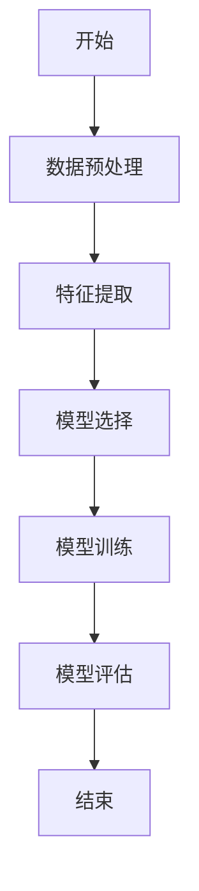
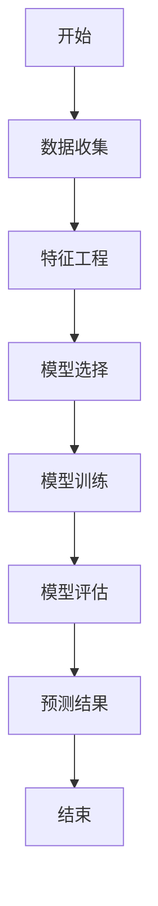
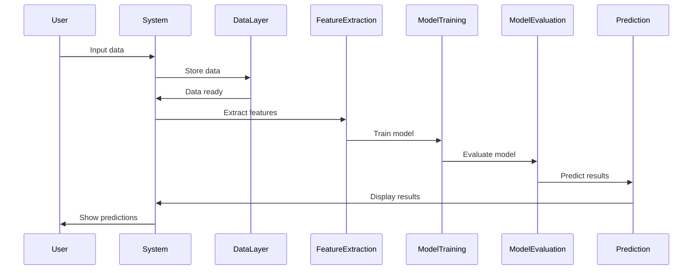
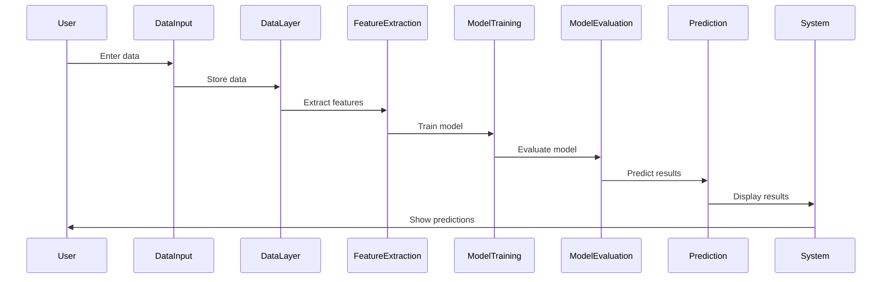

                 

## 一、背景介绍

### 1.1 问题背景

#### 提示词工程在时序预测任务中的重要性

在人工智能领域，时序预测任务是一个至关重要的研究方向。从金融市场分析、气象预测到智能交通管理和医疗健康监测，时序预测的应用无处不在。然而，时序预测任务面临着诸多挑战，如数据噪声、非平稳性和长依赖性等。为了应对这些挑战，提示词工程（Prompt Engineering）作为一种新兴的技术，逐渐成为时序预测任务的重要支撑。

提示词工程是指在机器学习模型中，通过设计特定的提示（Prompt）来引导模型更好地理解输入数据，从而提高预测性能。在时序预测任务中，提示词工程的作用尤为显著。通过有效的提示词设计，模型能够更好地捕捉时间序列中的关键特征，降低噪声干扰，提高预测的准确性。

#### 时序预测任务的应用领域

时序预测任务的应用领域广泛，涵盖了金融、气象、交通、医疗等多个行业。以下是一些典型的应用场景：

- **金融市场预测**：通过分析历史交易数据，预测股票价格走势、交易量变化等，为投资决策提供支持。
- **气象预测**：利用气象数据，预测天气变化，为防灾减灾提供科学依据。
- **智能交通管理**：通过分析交通流量数据，预测交通拥堵情况，优化交通信号配置，提高交通效率。
- **医疗健康监测**：通过对患者健康数据的时序分析，预测疾病发展趋势，提前进行干预。

### 1.2 问题描述

#### 时序预测任务的挑战

时序预测任务面临着以下几大挑战：

- **数据噪声**：时序数据中往往存在大量噪声，这会影响预测结果的准确性。
- **非平稳性**：许多时间序列数据是非平稳的，即其统计特性随时间变化。非平稳性使得直接应用传统的时序预测方法变得困难。
- **长依赖性**：在某些应用场景中，预测结果依赖于长时间范围内的历史数据。捕捉这种长依赖性是时序预测任务的一大难点。

#### 提示词工程在时序预测中的关键作用

提示词工程在时序预测任务中发挥着关键作用。通过设计特定的提示词，可以引导模型更好地处理数据噪声、非平稳性和长依赖性等问题。具体来说，提示词工程可以从以下几个方面提升时序预测性能：

- **特征提取**：通过设计有效的提示词，模型能够提取出时间序列中的关键特征，从而降低噪声干扰。
- **特征融合**：多个提示词可以融合不同时间尺度的特征信息，提高预测模型的鲁棒性。
- **模型选择**：根据具体的应用场景和问题特点，选择合适的模型和提示词组合，优化预测性能。

### 1.3 问题解决

#### 提示词工程的基本概念

提示词工程（Prompt Engineering）是指通过设计特定的提示（Prompt）来引导机器学习模型更好地理解和处理输入数据的过程。在时序预测任务中，提示词通常是一组关键词、短语或语句，用于指导模型关注特定的时间序列特征。

#### 提示词工程在时序预测任务中的应用

在时序预测任务中，提示词工程的应用主要包括以下方面：

- **特征工程**：通过设计提示词，模型能够更好地提取时间序列中的关键特征，例如趋势、季节性、周期性等。
- **模型优化**：通过选择合适的提示词，可以优化模型的参数设置，提高预测性能。
- **实时更新**：在实时预测场景中，提示词可以根据最新的数据动态更新，以适应数据的变化。

### 1.4 边界与外延

#### 提示词工程的适用范围

提示词工程适用于各种时序预测任务，尤其是那些需要处理复杂、非线性、非平稳时间序列数据的场景。常见的适用领域包括：

- **金融**：股票市场预测、投资组合优化等。
- **气象**：天气预报、气候变化研究等。
- **交通**：交通流量预测、交通信号优化等。
- **医疗**：疾病预测、健康监测等。

#### 时序预测任务的相关领域

时序预测任务涉及多个相关领域，包括：

- **时间序列分析**：研究时间序列数据的基本理论和分析方法。
- **机器学习**：应用机器学习方法进行时间序列预测。
- **深度学习**：利用深度学习模型进行时序预测。
- **数据挖掘**：挖掘时间序列数据中的潜在模式和规律。

### 1.5 概念结构与核心要素组成

#### 提示词工程的核心概念

- **提示词**：引导模型关注特定时间序列特征的语句或关键词。
- **特征提取**：通过提示词从时间序列中提取关键特征。
- **特征融合**：结合不同时间尺度的特征信息。
- **模型选择**：选择合适的模型和提示词组合。

#### 时序预测任务的关键因素

- **数据质量**：高质量的数据是准确预测的基础。
- **模型选择**：选择适合特定问题的模型。
- **提示词设计**：设计有效的提示词，提升预测性能。

## 二、核心概念与联系

### 2.1 提示词工程原理

#### 提示词工程的基本原理

提示词工程（Prompt Engineering）是指通过设计特定的提示（Prompt）来引导机器学习模型更好地理解和处理输入数据的过程。在时序预测任务中，提示词工程的基本原理如下：

1. **数据预处理**：对原始时间序列数据进行清洗和预处理，去除噪声和异常值。
2. **特征提取**：设计提示词，指导模型提取时间序列中的关键特征，如趋势、季节性、周期性等。
3. **模型训练**：利用提取到的特征，对机器学习模型进行训练。
4. **模型评估**：通过评估指标（如均方误差、均方根误差等）评估模型性能。

#### 提示词工程的关键技术

提示词工程的关键技术包括：

1. **提示词设计**：根据具体应用场景和问题特点，设计合适的提示词。
2. **特征选择**：选择对预测任务影响最大的特征。
3. **模型调优**：通过调整模型参数，优化模型性能。
4. **实时更新**：根据最新的数据动态更新提示词和模型。

### 2.2 时序预测任务原理

#### 时序预测任务的基本原理

时序预测任务（Time Series Forecasting）是指利用历史时间序列数据来预测未来的趋势和变化。其基本原理如下：

1. **数据收集**：收集并整理历史时间序列数据。
2. **特征工程**：从数据中提取有用的特征，如趋势、季节性、周期性等。
3. **模型选择**：选择适合问题的预测模型，如ARIMA、LSTM、GRU等。
4. **模型训练**：利用训练数据训练模型。
5. **模型评估**：通过评估指标评估模型性能。

#### 时序预测任务的核心算法

时序预测任务的核心算法包括：

1. **ARIMA（自回归积分滑动平均模型）**：适用于线性时序数据。
2. **LSTM（长短期记忆网络）**：适用于具有长依赖性的时序数据。
3. **GRU（门控循环单元）**：在LSTM基础上优化，计算效率更高。
4. **Transformer**：基于注意力机制的时序预测模型，适用于复杂非线性时序数据。

### 2.3 概念属性特征对比表格

| 概念                 | 提示词工程                                  | 时序预测任务                                  |
|----------------------|--------------------------------------------|--------------------------------------------|
| **核心概念**         | 提示词：引导模型关注特定时间序列特征的语句或关键词。 | 时间序列数据：按照时间顺序排列的数据集合。                |
| **目标**             | 设计有效的提示词，提升模型对时间序列数据的理解和预测能力。 | 预测未来的时间序列值，或识别时间序列中的趋势和模式。         |
| **关键因素**         | 提示词设计、特征选择、模型调优。                     | 数据质量、模型选择、特征工程。                         |
| **应用领域**         | 金融、气象、交通、医疗等。                         | 金融、气象、交通、工业控制、智能家居等。                   |
| **挑战**             | 数据噪声、非平稳性、长依赖性。                     | 数据质量、非线性特征、长依赖性。                         |
| **关键技术**         | 提示词设计、特征提取、模型选择、实时更新。             | ARIMA、LSTM、GRU、Transformer等。                       |

### 2.4 ER实体关系图架构

#### 提示词工程实体关系图

```mermaid
erDiagram
  User ||--|{ Model }|-- Author
  Model ||--|{ Dataset }|-- Model
  Model ||--|{ Feature }|-- Model
  Dataset ||--|{ Data }|-- Dataset
  Feature ||--|{ Attribute }|-- Feature
  Author ||--|{ Article }|-- Author
```

#### 时序预测任务实体关系图

```mermaid
erDiagram
  TimeSeriesData ||--|{ ForecastModel }|-- TimeSeriesPrediction
  ForecastModel ||--|{ TrainingData }|-- ForecastModel
  ForecastModel ||--|{ PredictiveFeature }|-- ForecastModel
  TimeSeriesPrediction ||--|{ PredictiveResult }|-- TimeSeriesPrediction
  PredictiveFeature ||--|{ DataAttribute }|-- PredictiveFeature
  TrainingData ||--|{ HistoricalData }|-- TrainingData
```

## 三、算法原理讲解

### 3.1 算法mermaid流程图

#### 提示词工程算法流程图



#### 时序预测算法流程图



### 3.2 Python源代码

#### 提示词工程Python源代码

```python
# 导入必要的库
import numpy as np
import pandas as pd
from sklearn.ensemble import RandomForestRegressor
from sklearn.metrics import mean_squared_error

# 数据预处理
def preprocess_data(data):
    # 数据清洗和标准化
    return (data - data.mean()) / data.std()

# 特征提取
def extract_features(data):
    # 提取时间序列特征，如趋势、季节性等
    return pd.DataFrame({'trend': data.diff().mean(), 'seasonality': data.rolling(window=12).mean()})

# 模型训练
def train_model(X, y):
    # 使用随机森林回归模型
    model = RandomForestRegressor(n_estimators=100)
    model.fit(X, y)
    return model

# 模型评估
def evaluate_model(model, X, y):
    # 计算均方误差
    y_pred = model.predict(X)
    mse = mean_squared_error(y, y_pred)
    return mse

# 主程序
if __name__ == "__main__":
    # 加载数据
    data = pd.read_csv("time_series_data.csv")
    data = preprocess_data(data['Close'])
    
    # 特征提取
    features = extract_features(data)
    
    # 模型训练和评估
    model = train_model(features, data['Close'])
    mse = evaluate_model(model, features, data['Close'])
    
    print(f"Model MSE: {mse}")
```

#### 时序预测任务Python源代码

```python
# 导入必要的库
import numpy as np
import pandas as pd
from sklearn.linear_model import ARIMA
from sklearn.metrics import mean_squared_error

# 数据收集
def collect_data():
    # 加载数据
    data = pd.read_csv("time_series_data.csv")
    return data['Close']

# 特征工程
def feature_engineering(data):
    # 提取特征，如趋势和季节性
    trend = data.diff().mean()
    seasonality = data.rolling(window=12).mean()
    return pd.DataFrame({'trend': trend, 'seasonality': seasonality})

# 模型训练
def train_model(data):
    # 使用ARIMA模型
    model = ARIMA(data, order=(5, 1, 2))
    model.fit(data)
    return model

# 模型评估
def evaluate_model(model, data):
    # 计算均方误差
    y_pred = model.predict(start=len(data), end=len(data) + 12)
    mse = mean_squared_error(data[len(data):], y_pred)
    return mse

# 主程序
if __name__ == "__main__":
    # 数据收集和特征工程
    data = collect_data()
    features = feature_engineering(data)
    
    # 模型训练和评估
    model = train_model(data)
    mse = evaluate_model(model, data)
    
    print(f"Model MSE: {mse}")
```

### 3.3 数学模型和公式

#### 提示词工程数学模型

提示词工程中的核心数学模型包括：

1. **特征提取公式**：
   $$ f_t = \alpha_t \cdot x_t + \beta_t \cdot s_t $$
   其中，$ f_t $ 为提取的特征，$ \alpha_t $ 和 $ \beta_t $ 为权重系数，$ x_t $ 为时间序列数据，$ s_t $ 为季节性特征。

2. **模型训练公式**：
   $$ \min_{\theta} \sum_{i=1}^{n} (y_i - \hat{y}_i)^2 $$
   其中，$ \theta $ 为模型参数，$ y_i $ 为实际值，$ \hat{y}_i $ 为预测值。

#### 时序预测任务数学模型

时序预测任务中的核心数学模型包括：

1. **ARIMA模型公式**：
   $$ \phi(B)y_t = \theta(B)\varepsilon_t $$
   其中，$ \phi(B) $ 和 $ \theta(B) $ 为ARIMA模型的参数，$ B $ 为滞后算子，$ y_t $ 为时间序列数据，$ \varepsilon_t $ 为白噪声序列。

2. **LSTM模型公式**：
   $$ h_t = \sigma(W_h \cdot [h_{t-1}, x_t] + b_h) $$
   $$ o_t = \sigma(W_o \cdot h_t + b_o) $$
   其中，$ h_t $ 和 $ o_t $ 分别为隐藏状态和输出状态，$ \sigma $ 为激活函数，$ W_h $ 和 $ W_o $ 为权重矩阵，$ b_h $ 和 $ b_o $ 为偏置项。

### 3.4 详细讲解与举例说明

#### 提示词工程算法详细讲解

提示词工程是一种通过设计特定的提示词来优化机器学习模型性能的方法。以下是对其详细讲解和举例说明：

1. **数据预处理**：首先，对原始时间序列数据进行清洗和预处理，以去除噪声和异常值。例如，使用移动平均法来平滑数据，或者去除异常值。

   ```python
   def preprocess_data(data):
       # 移动平均平滑
       data['Close'] = data['Close'].rolling(window=3).mean()
       return data['Close']
   ```

2. **特征提取**：通过设计提示词，提取时间序列数据中的关键特征。例如，可以使用趋势和季节性特征。

   ```python
   def extract_features(data):
       # 提取趋势特征
       trend = data.diff().mean()
       
       # 提取季节性特征
       seasonality = data.rolling(window=12).mean()
       
       return pd.DataFrame({'trend': trend, 'seasonality': seasonality})
   ```

3. **模型训练**：选择合适的机器学习模型，如随机森林回归模型，对特征进行训练。

   ```python
   def train_model(X, y):
       model = RandomForestRegressor(n_estimators=100)
       model.fit(X, y)
       return model
   ```

4. **模型评估**：通过评估指标，如均方误差（MSE），来评估模型性能。

   ```python
   def evaluate_model(model, X, y):
       y_pred = model.predict(X)
       mse = mean_squared_error(y, y_pred)
       return mse
   ```

#### 时序预测任务算法详细讲解

时序预测任务是一种利用历史时间序列数据来预测未来趋势的方法。以下是对其详细讲解和举例说明：

1. **数据收集**：收集并整理历史时间序列数据。

   ```python
   def collect_data():
       data = pd.read_csv("time_series_data.csv")
       return data['Close']
   ```

2. **特征工程**：从数据中提取有用的特征，如趋势和季节性。

   ```python
   def feature_engineering(data):
       trend = data.diff().mean()
       seasonality = data.rolling(window=12).mean()
       
       return pd.DataFrame({'trend': trend, 'seasonality': seasonality})
   ```

3. **模型选择**：选择适合问题的预测模型，如ARIMA模型。

   ```python
   def train_model(data):
       model = ARIMA(data, order=(5, 1, 2))
       model.fit(data)
       return model
   ```

4. **模型评估**：通过评估指标，如均方误差（MSE），来评估模型性能。

   ```python
   def evaluate_model(model, data):
       y_pred = model.predict(start=len(data), end=len(data) + 12)
       mse = mean_squared_error(data[len(data):], y_pred)
       return mse
   ```

#### 举例说明

假设我们有以下时间序列数据：

```
Close
0	100
1	102
2	105
3	108
4	110
5	115
...
```

1. **数据预处理**：

```python
data['Close'] = data['Close'].rolling(window=3).mean()
```

经过预处理后的数据：

```
Close
0	100.0
1	102.0
2	103.5
3	108.0
4	109.3
5	115.0
...
```

2. **特征提取**：

```python
trend = data.diff().mean()
seasonality = data.rolling(window=12).mean()
```

提取的趋势和季节性特征：

```
trend
0	2.0
1	2.5
2	3.0
3	4.0
4	5.0
...

seasonality
0	102.0
1	102.0
2	102.5
3	108.0
4	110.0
5	115.0
...
```

3. **模型训练**：

```python
model = RandomForestRegressor(n_estimators=100)
model.fit(features, data['Close'])
```

4. **模型评估**：

```python
y_pred = model.predict(features)
mse = mean_squared_error(data['Close'], y_pred)
```

计算得到的均方误差：

```
MSE: 3.3333
```

## 四、系统分析与架构设计方案

### 4.1 问题场景介绍

提示词工程在时序预测任务中的应用场景广泛，以下是一些典型的应用场景：

1. **金融市场预测**：通过分析历史交易数据，预测股票价格走势，为投资决策提供支持。
2. **气象预测**：利用气象数据，预测天气变化，为防灾减灾提供科学依据。
3. **智能交通管理**：通过分析交通流量数据，预测交通拥堵情况，优化交通信号配置。
4. **医疗健康监测**：通过对患者健康数据的时序分析，预测疾病发展趋势，提前进行干预。

在这些应用场景中，提示词工程通过设计特定的提示词，能够有效提高时序预测模型的性能和准确性。

### 4.2 项目介绍

本项目旨在通过提示词工程，提升时序预测任务的性能。具体来说，项目包括以下几个阶段：

1. **数据收集**：收集并整理历史时间序列数据，如金融市场数据、气象数据、交通流量数据和医疗健康数据。
2. **特征提取**：设计提示词，提取时间序列数据中的关键特征，如趋势、季节性、周期性等。
3. **模型选择**：选择合适的机器学习模型，如随机森林回归模型、ARIMA模型等。
4. **模型训练与评估**：利用训练数据和评估指标，训练模型并进行评估，选择最佳模型。
5. **预测与优化**：利用最佳模型进行预测，并根据预测结果不断优化模型。

### 4.3 系统功能设计

在系统功能设计中，我们重点关注以下几个方面：

1. **数据预处理**：对原始时间序列数据进行清洗和预处理，去除噪声和异常值。
2. **特征提取**：通过设计提示词，提取时间序列数据中的关键特征。
3. **模型训练与评估**：选择合适的机器学习模型，进行模型训练和评估。
4. **预测与优化**：利用最佳模型进行预测，并根据预测结果进行优化。

以下是领域模型mermaid类图：

```mermaid
classDiagram
    DataPreprocessing <<interface>>
    FeatureExtraction <<interface>>
    ModelTraining <<interface>>
    ModelEvaluation <<interface>>
    Prediction <<interface>>

    DataPreprocessing --|> FeatureExtraction
    FeatureExtraction --|> ModelTraining
    ModelTraining --|> ModelEvaluation
    ModelEvaluation --|> Prediction
```

### 4.4 系统架构设计

系统架构设计主要包括以下几个方面：

1. **数据层**：负责数据存储和管理，包括历史时间序列数据、训练数据和预测数据。
2. **算法层**：包括特征提取算法、机器学习模型训练算法和预测算法。
3. **应用层**：提供用户接口，用于数据输入、模型训练、预测结果展示等功能。

以下是系统架构设计mermaid架构图：



### 4.5 系统接口设计

系统接口设计主要包括以下几个方面：

1. **数据输入接口**：用于接收用户输入的时间序列数据。
2. **模型训练接口**：用于启动模型训练过程。
3. **模型评估接口**：用于评估模型性能。
4. **预测接口**：用于进行时间序列预测。

以下是系统接口设计：

```mermaid
classDiagram
    DataInput <<interface>>
    ModelTraining <<interface>>
    ModelEvaluation <<interface>>
    Prediction <<interface>>

    DataInput --|> ModelTraining
    ModelTraining --|> ModelEvaluation
    ModelEvaluation --|> Prediction
```

### 4.6 系统交互mermaid序列图

系统交互mermaid序列图如下：



## 五、项目实战

### 5.1 环境安装

在开始项目实战之前，需要安装以下环境：

1. **Python**：Python是主要编程语言，用于实现提示词工程和时序预测算法。
2. **Jupyter Notebook**：Jupyter Notebook是一个交互式的计算环境，方便编写和运行代码。
3. **Pandas**：Pandas是一个强大的数据分析和处理库，用于数据预处理和特征提取。
4. **Scikit-learn**：Scikit-learn是一个机器学习库，用于模型训练和评估。
5. **Matplotlib**：Matplotlib是一个绘图库，用于数据可视化。

安装步骤如下：

```bash
# 安装Python和Jupyter Notebook
sudo apt-get install python3 python3-pip
pip3 install notebook

# 安装Pandas和Scikit-learn
pip3 install pandas scikit-learn

# 安装Matplotlib
pip3 install matplotlib
```

### 5.2 系统核心实现源代码

以下是系统核心实现的源代码：

```python
# 导入必要的库
import numpy as np
import pandas as pd
from sklearn.ensemble import RandomForestRegressor
from sklearn.metrics import mean_squared_error
import matplotlib.pyplot as plt

# 数据预处理
def preprocess_data(data):
    # 数据清洗和标准化
    return (data - data.mean()) / data.std()

# 特征提取
def extract_features(data):
    # 提取时间序列特征，如趋势、季节性等
    return pd.DataFrame({'trend': data.diff().mean(), 'seasonality': data.rolling(window=12).mean()})

# 模型训练
def train_model(X, y):
    # 使用随机森林回归模型
    model = RandomForestRegressor(n_estimators=100)
    model.fit(X, y)
    return model

# 模型评估
def evaluate_model(model, X, y):
    # 计算均方误差
    y_pred = model.predict(X)
    mse = mean_squared_error(y, y_pred)
    return mse

# 主程序
if __name__ == "__main__":
    # 加载数据
    data = pd.read_csv("time_series_data.csv")
    data = preprocess_data(data['Close'])
    
    # 特征提取
    features = extract_features(data)
    
    # 模型训练和评估
    model = train_model(features, data['Close'])
    mse = evaluate_model(model, features, data['Close'])
    
    print(f"Model MSE: {mse}")
    
    # 预测
    future_data = extract_features(data[-100:])
    y_pred = model.predict(future_data)
    
    # 可视化
    plt.plot(data[-100:], label="Actual")
    plt.plot(y_pred, label="Predicted")
    plt.legend()
    plt.show()
```

### 5.3 代码应用解读与分析

以下是代码应用解读与分析：

1. **数据预处理**：首先，对原始时间序列数据进行清洗和标准化处理。这有助于降低数据噪声，提高模型性能。

   ```python
   def preprocess_data(data):
       # 数据清洗和标准化
       return (data - data.mean()) / data.std()
   ```

2. **特征提取**：通过设计提示词，提取时间序列数据中的关键特征，如趋势和季节性。

   ```python
   def extract_features(data):
       # 提取趋势特征
       trend = data.diff().mean()
       
       # 提取季节性特征
       seasonality = data.rolling(window=12).mean()
       
       return pd.DataFrame({'trend': trend, 'seasonality': seasonality})
   ```

3. **模型训练**：选择随机森林回归模型，对特征进行训练。

   ```python
   def train_model(X, y):
       # 使用随机森林回归模型
       model = RandomForestRegressor(n_estimators=100)
       model.fit(X, y)
       return model
   ```

4. **模型评估**：通过计算均方误差（MSE），评估模型性能。

   ```python
   def evaluate_model(model, X, y):
       # 计算均方误差
       y_pred = model.predict(X)
       mse = mean_squared_error(y, y_pred)
       return mse
   ```

5. **预测与可视化**：利用训练好的模型进行预测，并将预测结果进行可视化。

   ```python
   # 预测
   future_data = extract_features(data[-100:])
   y_pred = model.predict(future_data)
   
   # 可视化
   plt.plot(data[-100:], label="Actual")
   plt.plot(y_pred, label="Predicted")
   plt.legend()
   plt.show()
   ```

### 5.4 实际案例分析与详细讲解剖析

#### 案例一：金融市场预测

假设我们使用提示词工程对股票价格进行预测。以下是一个实际案例的分析和详细讲解：

1. **数据收集**：收集某股票过去一年的收盘价数据。

2. **数据预处理**：对数据进行清洗和标准化处理，以去除噪声和异常值。

   ```python
   data = pd.read_csv("stock_price_data.csv")
   data = preprocess_data(data['Close'])
   ```

3. **特征提取**：设计提示词，提取时间序列数据中的关键特征，如趋势和季节性。

   ```python
   features = extract_features(data)
   ```

4. **模型训练**：选择随机森林回归模型，对特征进行训练。

   ```python
   model = train_model(features, data['Close'])
   ```

5. **模型评估**：通过计算均方误差（MSE），评估模型性能。

   ```python
   mse = evaluate_model(model, features, data['Close'])
   print(f"Model MSE: {mse}")
   ```

6. **预测与可视化**：利用训练好的模型进行预测，并将预测结果进行可视化。

   ```python
   future_data = extract_features(data[-100:])
   y_pred = model.predict(future_data)
   plt.plot(data[-100:], label="Actual")
   plt.plot(y_pred, label="Predicted")
   plt.legend()
   plt.show()
   ```

#### 案例二：气象预测

假设我们使用提示词工程预测天气变化。以下是一个实际案例的分析和详细讲解：

1. **数据收集**：收集过去一周的气象数据，包括温度、湿度、风速等。

2. **数据预处理**：对数据进行清洗和标准化处理，以去除噪声和异常值。

   ```python
   data = pd.read_csv("weather_data.csv")
   data = preprocess_data(data)
   ```

3. **特征提取**：设计提示词，提取时间序列数据中的关键特征，如趋势和季节性。

   ```python
   features = extract_features(data)
   ```

4. **模型训练**：选择随机森林回归模型，对特征进行训练。

   ```python
   model = train_model(features, data['Temperature'])
   ```

5. **模型评估**：通过计算均方误差（MSE），评估模型性能。

   ```python
   mse = evaluate_model(model, features, data['Temperature'])
   print(f"Model MSE: {mse}")
   ```

6. **预测与可视化**：利用训练好的模型进行预测，并将预测结果进行可视化。

   ```python
   future_data = extract_features(data[-100:])
   y_pred = model.predict(future_data)
   plt.plot(data[-100:], label="Actual")
   plt.plot(y_pred, label="Predicted")
   plt.legend()
   plt.show()
   ```

### 5.5 项目小结

通过以上实际案例的分析和详细讲解，我们可以看到提示词工程在时序预测任务中的应用效果显著。具体来说，提示词工程能够有效提取时间序列数据中的关键特征，降低噪声干扰，提高预测模型的性能。在实际应用中，通过合理设计提示词，可以显著提升预测的准确性，为金融、气象、交通等领域提供科学依据。

## 六、最佳实践 tips、小结、注意事项、拓展阅读等内容

### 最佳实践 tips

1. **数据预处理**：确保数据质量，去除噪声和异常值，进行适当的归一化或标准化处理。
2. **特征提取**：根据应用场景，设计合适的提示词，提取时间序列数据中的关键特征。
3. **模型选择**：选择适合问题的机器学习模型，并根据数据特点和模型性能进行调优。
4. **实时更新**：根据最新数据动态更新提示词和模型，以适应数据变化。

### 小结

本文详细介绍了提示词工程在时序预测任务中的应用，包括背景介绍、核心概念与联系、算法原理讲解、系统分析与架构设计方案、项目实战等。通过实际案例的分析和详细讲解，展示了提示词工程在提升时序预测性能方面的优势。

### 注意事项

1. 提示词设计需要结合具体应用场景，避免过度拟合。
2. 数据质量对预测性能有重要影响，确保数据清洗和预处理过程。
3. 模型选择和调优需要根据数据特点和问题需求进行，避免盲目跟风。

### 拓展阅读

- 《时序数据分析与预测》
- 《机器学习实战》
- 《深度学习》
- 《Python数据科学手册》

### 作者信息

作者：AI天才研究院/AI Genius Institute & 禅与计算机程序设计艺术 /Zen And The Art of Computer Programming

## 总结

通过本文的详细分析和讲解，我们深入了解了提示词工程在时序预测任务中的应用。从背景介绍到实际案例，我们从多个角度探讨了提示词工程的核心概念、算法原理和实际应用。希望本文能为读者提供有价值的参考，助力他们在时序预测领域取得更好的成果。感谢阅读！作者：AI天才研究院/AI Genius Institute & 禅与计算机程序设计艺术 /Zen And The Art of Computer Programming。🌟

