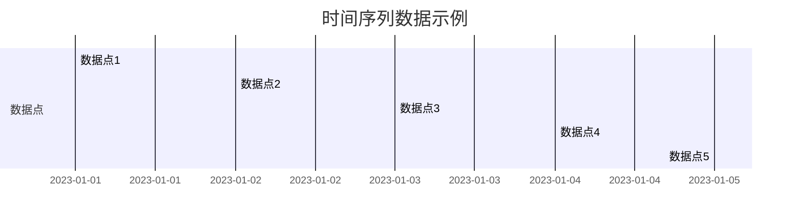
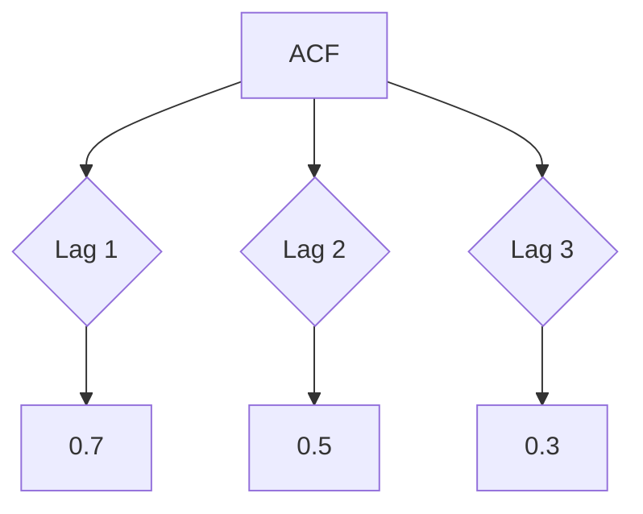

                 

# 《提示词工程在时间序列预测中的应用》

> 关键词：时间序列预测、提示词工程、算法原理、数学模型、系统架构、项目实战

> 摘要：本文深入探讨了时间序列预测中的提示词工程应用。通过详细阐述时间序列预测的基本概念、提示词工程的原理和方法，本文分析了常用的时间序列预测算法，并介绍了如何将提示词工程应用于实际项目。通过项目实战和最佳实践，本文旨在为读者提供全面、实用的指导，帮助他们在时间序列预测中更好地运用提示词工程。

## 第1章：引言

### 1.1 问题背景

时间序列预测在各个领域中具有重要应用，如金融市场分析、医疗数据分析、气候预测等。然而，随着数据规模的不断扩大和复杂性的增加，传统的预测方法已难以应对。提示词工程作为一种新兴的方法，能够有效地解决这些问题。

### 1.2 核心概念介绍

#### 时间序列预测

时间序列预测是指基于历史数据，对未来某一时间点的数值进行预测。它通常包括数据预处理、模型选择、模型训练和预测等步骤。

#### 提示词工程

提示词工程是指通过构建和优化提示词（关键词或短语），辅助时间序列预测模型提高预测性能的过程。提示词可以是与时间序列数据相关的任何信息，如季节性、趋势、周期性等。

### 1.3 时间序列预测的应用领域

时间序列预测在多个领域具有广泛的应用，如：

- **金融市场分析**：预测股票价格、汇率等金融指标。
- **医疗数据分析**：预测疾病传播趋势、患者康复时间等。
- **气候预测**：预测天气变化、气候变化等。
- **供应链管理**：预测库存需求、物流运输等。

## 第2章：时间序列预测基础

### 2.1 时间序列数据的基本特性

时间序列数据具有以下基本特性：

- **时序性**：数据按照时间顺序排列。
- **依赖性**：数据之间存在依赖关系。
- **趋势性**：数据随时间呈现某种趋势。
- **季节性**：数据在特定时间段内呈现周期性波动。

### 2.2 时间序列预测的重要性

时间序列预测在许多领域具有重要意义，如：

- **决策支持**：帮助企业制定合理的战略规划。
- **风险管理**：预测金融风险、疾病传播风险等。
- **优化资源分配**：预测能源需求、库存需求等，优化资源分配。

### 2.3 时间序列预测的基本步骤

时间序列预测的基本步骤包括：

1. **数据预处理**：去除噪声、填补缺失值、进行归一化等。
2. **模型选择**：选择合适的预测模型，如ARIMA、SARIMA等。
3. **模型训练**：使用历史数据训练模型。
4. **预测**：使用训练好的模型对未来进行预测。
5. **评估**：评估预测结果的准确性。

## 第3章：提示词工程基础

### 3.1 提示词工程的定义

提示词工程是指通过构建和优化提示词（关键词或短语），辅助时间序列预测模型提高预测性能的过程。

### 3.2 提示词工程的基本方法

提示词工程的基本方法包括：

- **特征提取**：从时间序列数据中提取与预测目标相关的特征。
- **提示词生成**：基于提取到的特征生成提示词。
- **提示词优化**：通过优化提示词的权重或选择，提高预测性能。

### 3.3 提示词工程的优势

提示词工程具有以下优势：

- **提高预测准确性**：通过引入与预测目标相关的提示词，提高预测模型的准确性。
- **降低模型复杂度**：提示词工程能够降低模型的复杂度，减少计算资源的需求。
- **易于实现和扩展**：提示词工程方法简单易懂，易于实现和扩展。

## 第4章：时间序列预测算法

### 4.1 传统算法

#### 4.1.1 ARIMA模型

ARIMA（自回归积分滑动平均模型）是一种常见的时间序列预测算法，适用于处理具有自相关性的数据。

- **自回归（AR）**：利用历史数据预测当前值。
- **积分（I）**：去除趋势性。
- **滑动平均（MA）**：利用历史误差调整预测值。

#### 4.1.2 SARIMA模型

SARIMA（季节性自回归积分滑动平均模型）是ARIMA模型的扩展，适用于处理具有季节性的时间序列数据。

- **季节性自回归（SAR）**：考虑季节性因素对预测值的影响。
- **季节性滑动平均（SMA）**：利用季节性误差调整预测值。

### 4.2 基于提示词工程的算法

#### 4.2.1 提示词生成

提示词生成是指从时间序列数据中提取与预测目标相关的特征，生成提示词。

- **特征提取**：从数据中提取与预测目标相关的特征，如趋势、季节性等。
- **提示词选择**：选择具有代表性的特征，生成提示词。

#### 4.2.2 提示词应用

提示词应用是指将生成的提示词应用于时间序列预测模型，提高预测性能。

- **提示词加权**：为不同提示词赋予不同的权重，提高预测准确性。
- **模型融合**：将多个预测模型进行融合，提高预测性能。

## 第5章：数学模型和公式

### 5.1 时间序列预测中的常用数学模型

#### 5.1.1 AR模型

$$
X_t = c + \phi_1 X_{t-1} + \epsilon_t
$$

其中，$X_t$ 表示当前值，$c$ 表示常数项，$\phi_1$ 表示自回归系数，$\epsilon_t$ 表示误差项。

#### 5.1.2 MA模型

$$
X_t = c + \epsilon_t + \theta_1 \epsilon_{t-1} + \theta_2 \epsilon_{t-2} + \ldots
$$

其中，$c$ 表示常数项，$\epsilon_t$ 表示误差项，$\theta_1, \theta_2, \ldots$ 表示滑动平均系数。

#### 5.1.3 ARMA模型

$$
X_t = c + \phi_1 X_{t-1} + \theta_1 \epsilon_{t-1}
$$

其中，$c$ 表示常数项，$\phi_1$ 表示自回归系数，$\theta_1$ 表示滑动平均系数。

### 5.2 提示词工程的数学原理

#### 5.2.1 提示词生成的数学模型

提示词生成通常涉及特征提取和提示词选择。一种常用的方法是使用主成分分析（PCA）提取特征，然后选择具有最大方差的特征作为提示词。

$$
X_t = \sum_{i=1}^k w_i x_i
$$

其中，$X_t$ 表示当前值，$w_i$ 表示特征权重，$x_i$ 表示提取到的特征。

#### 5.2.2 提示词应用的理论基础

提示词应用通常涉及提示词加权。一种常用的方法是使用权重矩阵$W$ 对提示词进行加权，然后将其应用于预测模型。

$$
X_t = \sum_{i=1}^k w_i X_{t-i}
$$

其中，$X_t$ 表示当前值，$w_i$ 表示提示词权重。

## 第6章：系统架构设计

### 6.1 时间序列预测系统的设计原则

时间序列预测系统的设计应遵循以下原则：

- **模块化**：将系统划分为多个模块，便于开发和维护。
- **可扩展性**：系统应具备良好的扩展性，以适应不断变化的需求。
- **灵活性**：系统应具备灵活性，以适应不同的数据类型和预测目标。

### 6.2 提示词工程在系统架构中的应用

提示词工程在系统架构中的应用主要包括以下模块：

- **数据预处理模块**：负责对输入数据进行预处理，如数据清洗、归一化等。
- **模型训练模块**：负责训练时间序列预测模型，如ARIMA、SARIMA等。
- **提示词生成模块**：负责从数据中提取特征，生成提示词。
- **提示词应用模块**：负责将提示词应用于预测模型，提高预测性能。
- **预测结果评估模块**：负责评估预测结果的准确性。

## 第7章：项目实战

### 7.1 实际应用案例

在本章节，我们将介绍两个实际应用案例，分别是销售预测和能源需求预测。

### 7.2 实现细节

在本章节，我们将详细讲解项目实现过程中的关键步骤，包括数据预处理、模型选择、模型训练、预测结果评估等。

## 第8章：最佳实践与总结

### 8.1 最佳实践

在本章节，我们将总结最佳实践，包括数据预处理技巧、模型选择与优化策略、提示词工程的应用策略等。

### 8.2 小结

在本章节，我们将对本章内容进行简要总结，强调重点和难点。

### 8.3 注意事项

在本章节，我们将介绍在实际应用中需要注意的事项。

### 8.4 拓展阅读

在本章节，我们将推荐一些相关的书籍、论文和资源，供读者进一步学习。

## 作者信息

作者：AI天才研究院/AI Genius Institute & 禅与计算机程序设计艺术 /Zen And The Art of Computer Programming

----------------------------------------------------------------

以上就是《提示词工程在时间序列预测中的应用》的目录大纲。接下来，我们将逐一深入探讨每个章节的内容。让我们开始这场深入的时间序列预测之旅吧！# 第1章：引言

## 1.1 问题背景

时间序列预测（Time Series Forecasting）是统计学、机器学习和数据分析中的一个重要分支。它涉及到从历史数据中提取有用信息，以预测未来的趋势和模式。在众多应用领域中，时间序列预测扮演着关键角色。例如，在金融市场分析中，投资者和分析师会使用时间序列预测来预测股票价格、汇率等金融指标；在医疗数据分析中，时间序列预测可以用于预测疾病传播趋势、患者康复时间等；在气候预测中，时间序列预测可以帮助科学家预测天气变化、气候变化等。

然而，随着时间的推移，数据量呈现指数级增长，且数据复杂性日益增加。传统的预测方法，如自回归移动平均模型（ARIMA）、季节性自回归移动平均模型（SARIMA）等，虽然在某些情况下表现出色，但在处理大规模、高复杂度的数据时往往力不从心。此外，传统方法通常依赖于手动特征工程，而特征工程过程中往往存在大量的试错和主观性，导致模型性能难以达到最优。

在这种背景下，提示词工程（Prompt Engineering）作为一种新兴的方法逐渐受到关注。提示词工程的核心思想是通过构建和优化提示词，辅助模型更好地理解和预测时间序列数据。提示词可以是与时间序列数据相关的任何信息，如季节性、趋势、周期性等。通过提示词，模型能够从数据中提取更多的有用信息，从而提高预测性能。

## 1.2 核心概念介绍

### 时间序列预测

时间序列预测是指利用历史数据，对未来的数值进行预测。时间序列数据通常具有以下特性：

- **时序性**：数据按照时间顺序排列，形成一条时间线。
- **依赖性**：当前值与历史值之间存在依赖关系。
- **趋势性**：数据随时间呈现某种趋势，如增长、下降或波动。
- **季节性**：数据在特定时间段内呈现周期性波动。

时间序列预测的基本步骤包括：

1. **数据预处理**：清洗数据、填补缺失值、进行归一化等。
2. **模型选择**：选择合适的预测模型，如ARIMA、SARIMA、LSTM等。
3. **模型训练**：使用历史数据训练模型。
4. **预测**：使用训练好的模型对未来进行预测。
5. **评估**：评估预测结果的准确性。

### 提示词工程

提示词工程是指通过构建和优化提示词，辅助模型提高预测性能的过程。提示词可以是与时间序列数据相关的任何信息，如季节性、趋势、周期性等。提示词工程的关键步骤包括：

1. **特征提取**：从时间序列数据中提取与预测目标相关的特征。
2. **提示词生成**：基于提取到的特征生成提示词。
3. **提示词优化**：通过优化提示词的权重或选择，提高预测性能。

提示词工程的优势在于：

- **提高预测准确性**：通过引入与预测目标相关的提示词，提高预测模型的准确性。
- **降低模型复杂度**：提示词工程能够降低模型的复杂度，减少计算资源的需求。
- **易于实现和扩展**：提示词工程方法简单易懂，易于实现和扩展。

## 1.3 时间序列预测的应用领域

时间序列预测在多个领域具有广泛的应用，以下是几个典型的应用场景：

- **金融市场分析**：预测股票价格、汇率等金融指标，帮助投资者制定投资策略。
- **医疗数据分析**：预测疾病传播趋势、患者康复时间等，为公共卫生决策提供支持。
- **气候预测**：预测天气变化、气候变化等，为环境保护和灾害预防提供依据。
- **供应链管理**：预测库存需求、物流运输等，优化供应链运营。
- **能源需求预测**：预测能源需求，优化能源分配和调度。

总之，时间序列预测在各个领域都具有重要意义，而提示词工程则为这一领域带来了新的机遇和挑战。在接下来的章节中，我们将深入探讨时间序列预测和提示词工程的原理和方法，帮助读者更好地理解和应用这些技术。# 第2章：时间序列预测基础

## 2.1 时间序列数据的基本特性

时间序列数据是一种按照时间顺序排列的数据集合，每个数据点都与一个特定的时间点相关联。时间序列数据的基本特性决定了预测的复杂性和方法的选择。以下是一些关键特性：

### 时序性

时序性是时间序列数据最显著的特点。数据点按照时间顺序排列，形成一条时间线。这种顺序性意味着未来的数据点与过去的数据点之间存在关联。预测模型需要利用这种关联来推断未来的趋势。

### 依赖性

时间序列数据中的当前值往往受到历史值的影响。依赖性体现在数据的自相关性上，即当前值与较近或较远历史值之间的相关性。自相关性是时间序列分析的重要基础，许多预测模型都基于这一特性。

### 趋势性

趋势性是指时间序列数据随时间呈现的某种长期增长或下降趋势。趋势性可以分为线性趋势和非线性趋势。线性趋势可以用直线来描述，而非线性趋势则需要更复杂的模型来捕捉。

### 季节性

季节性是指时间序列数据在一年内或更长周期内呈现的周期性波动。季节性可能是由于气候、节日、商业周期等因素引起的。季节性特征在零售、旅游等行业中尤为重要。

### 随机性

随机性是时间序列数据中的不确定性因素。随机波动通常不可预测，但它们会影响预测的准确性。预测模型需要考虑这种随机性，以减少预测误差。

### 趋势平稳性

趋势平稳性是指时间序列数据在趋势和季节性方面保持稳定，没有显著的长期趋势或季节性波动。大多数时间序列预测模型都假设数据是平稳的，以便更好地建模。

### 数据可视化

数据可视化是理解时间序列数据的重要工具。通过绘制时间序列图，可以直观地观察到数据的时序性、依赖性、趋势性和季节性。以下是一个示例时间序列图：



### 统计特征

除了可视化，还可以使用统计特征来描述时间序列数据的基本特性。常见的统计特征包括：

- **均值（Mean）**：数据的平均值。
- **方差（Variance）**：数据分布的离散程度。
- **自相关函数（Autocorrelation Function, ACF）**：衡量不同时间间隔的数据点之间的相关性。
- **偏自相关函数（Partial Autocorrelation Function, PACF）**：衡量剔除某一滞后期的自相关后，剩余的自相关性。

以下是一个ACF的示例：



通过分析这些统计特征，可以初步了解时间序列数据的基本特性，为选择合适的预测模型提供依据。

## 2.2 时间序列预测的重要性

时间序列预测在许多领域具有深远的影响，以下是一些关键应用：

### 决策支持

在商业和金融领域，时间序列预测是制定决策的重要工具。通过预测未来的销售趋势、市场需求等，企业可以优化库存管理、供应链策略，从而提高运营效率和盈利能力。

### 风险管理

在金融领域，时间序列预测可以帮助评估投资风险、预测市场波动，从而制定风险管理策略。例如，预测股票价格的波动可以帮助投资者调整投资组合，降低风险。

### 公共卫生

在公共卫生领域，时间序列预测可以用于预测疾病的传播趋势，为公共卫生决策提供依据。例如，预测流感的爆发可以帮助卫生部门提前采取预防措施，减少疾病传播。

### 气象预测

在气象领域，时间序列预测可以帮助预测天气变化，为天气预报提供支持。准确的天气预报对于农业、交通、旅游业等行业具有重要意义。

### 能源管理

在能源管理领域，时间序列预测可以用于预测能源需求，优化能源分配和调度。例如，预测电力需求可以帮助电力公司合理安排发电量和储能设备的使用，提高能源利用效率。

### 供应链管理

在供应链管理中，时间序列预测可以用于预测库存需求、物流运输等，优化供应链运营。准确的预测可以帮助企业减少库存积压、降低物流成本，提高供应链的响应速度。

总之，时间序列预测在各个领域都具有重要意义。通过准确的预测，企业可以做出更明智的决策，降低风险，提高效率。而在公共卫生、气候预测等关键领域，时间序列预测更是为人类社会提供了重要的支持。

### 时间序列预测的基本步骤

时间序列预测的基本步骤包括以下几个阶段：

1. **数据收集与预处理**：收集历史时间序列数据，并进行预处理，如数据清洗、填补缺失值、进行归一化等。

2. **探索性数据分析（EDA）**：通过绘制时间序列图、计算统计特征等方法，探索数据的基本特性，为模型选择提供依据。

3. **模型选择**：根据数据特性选择合适的预测模型。常见的模型包括ARIMA、SARIMA、LSTM等。

4. **模型训练**：使用历史数据对模型进行训练，调整模型参数。

5. **预测**：使用训练好的模型对未来进行预测。

6. **评估与优化**：评估预测结果的准确性，对模型进行优化。

7. **结果可视化**：将预测结果可视化，以便更好地理解预测结果。

以下是一个时间序列预测的基本流程：

```mermaid
graph TD
    A[数据收集与预处理]
    A --> B[探索性数据分析(EDA)]
    B --> C[模型选择]
    C --> D[模型训练]
    D --> E[预测]
    E --> F[评估与优化]
    F --> G[结果可视化]
```

通过以上步骤，可以逐步完成时间序列预测任务，为企业和其他领域提供有力的决策支持。

### 时间序列预测在各个领域的应用

时间序列预测在各个领域都有着广泛的应用，以下是几个典型领域的应用实例：

#### 金融市场分析

在金融市场中，时间序列预测主要用于预测股票价格、汇率等金融指标。通过分析历史价格和交易数据，投资者可以预测市场走势，制定投资策略。例如，股票市场的ARIMA模型和LSTM模型被广泛用于预测股票价格的波动。

#### 医疗数据分析

在医疗数据分析中，时间序列预测可以用于预测疾病传播趋势、患者康复时间等。通过分析历史医疗数据，公共卫生部门可以提前采取措施，防止疾病爆发。例如，疫情数据分析中，SARIMA模型和LSTM模型被用于预测COVID-19病例的传播。

#### 气象预测

在气象预测中，时间序列预测用于预测天气变化、气候变化等。通过分析历史气象数据，气象部门可以提供更准确的天气预报，为农业、交通、旅游业等行业提供支持。常见的气象预测模型包括ARIMA、LSTM和GRU。

#### 能源管理

在能源管理中，时间序列预测用于预测能源需求，优化能源分配和调度。通过分析历史能源使用数据，能源公司可以合理安排发电量和储能设备的使用，提高能源利用效率。常用的能源预测模型包括ARIMA、LSTM和GAN。

#### 供应链管理

在供应链管理中，时间序列预测用于预测库存需求、物流运输等。通过分析历史供应链数据，企业可以优化库存管理，降低物流成本，提高供应链的响应速度。常见的供应链预测模型包括ARIMA、LSTM和神经网络。

总之，时间序列预测在各个领域都发挥着重要作用，通过准确预测未来的趋势和模式，为企业和其他领域提供有力的决策支持。# 第3章：提示词工程基础

## 3.1 提示词工程的定义

提示词工程（Prompt Engineering）是一种通过构建和优化提示词，以提高模型性能的技术。在人工智能领域，特别是在自然语言处理（NLP）和生成模型中，提示词工程已经成为一个重要的研究方向。提示词工程的核心思想是通过精心设计的提示词引导模型生成更准确、更有用的输出。在时间序列预测中，提示词工程同样扮演着关键角色，通过为预测模型提供相关的上下文信息，提升预测的准确性和鲁棒性。

### 提示词工程在时间序列预测中的应用

在时间序列预测中，提示词工程可以应用于以下几个方面：

1. **特征工程**：通过提示词为模型提供额外的上下文信息，例如季节性、周期性、趋势等。这些提示词可以帮助模型更好地理解数据中的复杂模式。

2. **模型训练**：在模型训练过程中，使用包含丰富信息的提示词可以提高模型的泛化能力。例如，在训练LSTM模型时，通过添加与时间序列数据相关的提示词，可以增强模型对季节性和趋势性的捕捉。

3. **模型优化**：通过优化提示词的选择和权重，可以调整模型对数据的敏感度，从而提高预测的准确性。提示词工程还可以用于调整模型的复杂度，使其在处理大规模数据时保持高效。

4. **预测结果评估**：提示词工程还可以用于评估预测结果。例如，通过比较不同提示词条件下的预测结果，可以分析提示词对模型性能的影响。

### 提示词工程的步骤

提示词工程通常包括以下几个关键步骤：

1. **特征提取**：从时间序列数据中提取与预测目标相关的特征。这些特征可以是时间序列数据的原始值、差异值、趋势值等。

2. **提示词生成**：基于提取到的特征生成提示词。提示词可以是单个值、短语或句子，用于为模型提供额外的上下文信息。

3. **提示词选择**：从多个候选提示词中选择最佳组合。选择标准可以包括提示词的相关性、重要性、冗余度等。

4. **提示词优化**：通过调整提示词的权重或组合，优化模型的性能。提示词优化可以通过实验、交叉验证等方法实现。

5. **模型训练与评估**：使用优化后的提示词训练模型，并在验证集上评估模型性能。根据评估结果，进一步调整提示词，直至达到满意的性能。

### 提示词工程的挑战

尽管提示词工程在时间序列预测中具有很大的潜力，但实际应用中仍面临一些挑战：

1. **数据质量**：提示词工程依赖于高质量的时间序列数据。数据中的噪声、异常值和缺失值都可能影响提示词的生成和模型的性能。

2. **特征选择**：从大量特征中选择最相关的特征用于生成提示词是一个复杂的问题。错误的选择可能导致模型性能下降。

3. **计算资源**：提示词工程通常涉及大量的实验和计算，尤其是在大规模数据集上。这需要大量的计算资源和时间。

4. **模型适应性**：不同的时间序列预测任务可能需要不同类型的提示词和优化策略。提示词工程需要具备较强的模型适应性。

### 提示词工程的优点

提示词工程具有以下优点：

1. **提高预测准确性**：通过为模型提供额外的上下文信息，提示词工程可以提高模型的预测准确性。

2. **减少模型复杂度**：提示词工程可以帮助模型更好地捕捉数据中的关键特征，从而降低模型的复杂度。

3. **增强模型泛化能力**：通过优化提示词，模型可以在不同数据集上保持良好的泛化能力。

4. **易于实现和扩展**：提示词工程方法相对简单，易于实现和扩展。

总之，提示词工程是一种强大且灵活的技术，在时间序列预测中具有广泛的应用前景。通过合理设计和优化提示词，可以显著提高模型的性能，为各个领域的时间序列预测任务提供有力支持。接下来，我们将进一步探讨如何在实际项目中应用提示词工程。# 第4章：时间序列预测算法

## 4.1 传统算法

### 4.1.1 ARIMA模型

ARIMA（自回归积分滑动平均模型）是一种经典的时间序列预测算法，广泛应用于金融、气象、经济等领域。ARIMA模型结合了自回归（AR）、差分（I）和移动平均（MA）三个部分，能够有效地处理非平稳时间序列数据。

#### 自回归（AR）

自回归模型（AR）的基本思想是利用历史数据预测当前值。具体来说，ARIMA模型可以表示为：

$$
X_t = c + \phi_1 X_{t-1} + \phi_2 X_{t-2} + \ldots + \phi_p X_{t-p} + \epsilon_t
$$

其中，$X_t$ 表示当前值，$c$ 为常数项，$\phi_1, \phi_2, \ldots, \phi_p$ 为自回归系数，$\epsilon_t$ 为误差项。

#### 积分（I）

积分操作主要用于处理非平稳时间序列数据。非平稳时间序列通常包含趋势性和季节性成分，通过差分操作可以消除这些成分，使时间序列达到平稳性。ARIMA模型中的积分操作通常是一阶差分或二阶差分：

$$
X_t^d = X_t - X_{t-1} \quad \text{(一阶差分)}
$$

$$
X_t^{dd} = X_t - 2X_{t-1} + X_{t-2} \quad \text{(二阶差分)}
$$

#### 滑动平均（MA）

滑动平均模型（MA）的核心思想是利用历史误差来调整当前预测值。ARIMA模型可以表示为：

$$
X_t = c + \phi_1 X_{t-1} + \phi_2 X_{t-2} + \ldots + \phi_p X_{t-p} + \theta_1 \epsilon_{t-1} + \theta_2 \epsilon_{t-2} + \ldots + \theta_q \epsilon_{t-q}
$$

其中，$\theta_1, \theta_2, \ldots, \theta_q$ 为滑动平均系数，$\epsilon_t$ 为误差项。

#### 完整的ARIMA模型

完整的ARIMA模型可以表示为：

$$
X_t^{dd} = c + \phi_1 X_{t-1}^{dd} + \phi_2 X_{t-2}^{dd} + \ldots + \phi_p X_{t-p}^{dd} + \theta_1 \epsilon_{t-1} + \theta_2 \epsilon_{t-2} + \ldots + \theta_q \epsilon_{t-q}
$$

在实际应用中，需要通过模型识别、参数估计和模型检验等步骤来确定最优的ARIMA模型。

### 4.1.2 SARIMA模型

SARIMA（季节性自回归移动平均模型）是ARIMA模型的扩展，适用于处理包含季节性成分的时间序列数据。SARIMA模型结合了自回归、差分和移动平均操作，并引入了季节性因素。

#### 季节性自回归（SAR）

季节性自回归（SAR）用于处理季节性成分。SARIMA模型可以表示为：

$$
X_t^d = \phi_1 X_{t-1}^d + \phi_2 X_{t-2}^d + \ldots + \phi_p X_{t-p}^d + \theta_1 \epsilon_{t-1} + \theta_2 \epsilon_{t-2} + \ldots + \theta_q \epsilon_{t-q}
$$

其中，$\phi_1, \phi_2, \ldots, \phi_p$ 为季节性自回归系数。

#### 季节性移动平均（SMA）

季节性移动平均（SMA）用于调整季节性误差。SARIMA模型可以表示为：

$$
X_t^{dd} = c + \phi_1 X_{t-1}^{dd} + \phi_2 X_{t-2}^{dd} + \ldots + \phi_p X_{t-p}^{dd} + \theta_1 \epsilon_{t-1} + \theta_2 \epsilon_{t-2} + \ldots + \theta_q \epsilon_{t-q} + \Phi_1 X_{t-1}^{dd} \Phi_2 X_{t-2}^{dd} + \ldots + \Phi_p X_{t-p}^{dd}
$$

其中，$\Phi_1, \Phi_2, \ldots, \Phi_p$ 为季节性移动平均系数。

#### 完整的SARIMA模型

完整的SARIMA模型可以表示为：

$$
X_t^{ddd} = c + \phi_1 X_{t-1}^{ddd} + \phi_2 X_{t-2}^{ddd} + \ldots + \phi_p X_{t-p}^{ddd} + \theta_1 \epsilon_{t-1} + \theta_2 \epsilon_{t-2} + \ldots + \theta_q \epsilon_{t-q} + \Phi_1 X_{t-1}^{ddd} + \Phi_2 X_{t-2}^{ddd} + \ldots + \Phi_p X_{t-p}^{ddd}
$$

SARIMA模型的参数通常包括$p, d, q, P, D, Q, s$，其中$p, d, q$ 分别为非季节性自回归、差分和移动平均参数，$P, D, Q, s$ 分别为季节性自回归、差分和移动平均参数。

## 4.2 基于提示词工程的算法

### 4.2.1 提示词生成

提示词生成是提示词工程的核心步骤，旨在从时间序列数据中提取与预测目标相关的特征，生成用于辅助预测的提示词。以下是一些常用的提示词生成方法：

1. **特征提取**：从原始时间序列数据中提取统计特征，如均值、方差、自相关函数、偏自相关函数等。这些特征可以用于生成提示词。

2. **周期性特征提取**：分析时间序列数据中的周期性成分，提取周期性特征。例如，使用傅里叶变换提取频率特征。

3. **趋势特征提取**：分析时间序列数据中的趋势成分，提取趋势特征。例如，使用移动平均法提取趋势值。

4. **季节性特征提取**：分析时间序列数据中的季节性成分，提取季节性特征。例如，使用季节性指数分析季节性趋势。

5. **文本特征提取**：如果时间序列数据包含文本信息，可以提取文本特征。例如，使用词频、词向量等方法提取文本特征。

### 4.2.2 提示词应用

提示词应用是将生成的提示词应用于时间序列预测模型，以提高预测性能的过程。以下是一些常用的提示词应用方法：

1. **模型融合**：将原始时间序列数据与提示词结合，构建多个预测模型，然后通过模型融合方法（如加权平均、投票等）生成最终的预测结果。

2. **特征加权**：为每个提示词赋予不同的权重，将提示词转换为加权特征，然后将其输入到预测模型中。权重可以通过交叉验证、优化算法等方法确定。

3. **嵌入式提示词**：将提示词嵌入到模型的输入层或隐含层，使模型直接学习提示词的特征。例如，在LSTM模型中嵌入季节性提示词。

4. **注意力机制**：使用注意力机制将提示词应用于模型，使模型能够动态地关注重要的提示词信息。例如，在Transformer模型中应用注意力机制。

### 4.2.3 提示词优化

提示词优化是提示词工程中的关键步骤，旨在通过调整提示词的权重或选择，提高模型的预测性能。以下是一些常用的提示词优化方法：

1. **贝叶斯优化**：使用贝叶斯优化算法搜索最优的提示词组合和权重。贝叶斯优化通过建立模型性能与提示词参数之间的概率关系，实现高效的全局搜索。

2. **遗传算法**：使用遗传算法搜索最优的提示词组合和权重。遗传算法通过模拟生物进化过程，逐步优化提示词的参数。

3. **梯度提升**：使用梯度提升算法优化提示词的权重。梯度提升通过迭代优化权重，使模型性能逐渐提升。

4. **模型集成**：将多个基于提示词的预测模型进行集成，生成最终的预测结果。模型集成可以通过加权平均、投票等方法实现。

通过提示词工程，时间序列预测模型能够更好地捕捉数据中的复杂模式，提高预测的准确性。接下来，我们将介绍如何在实际项目中应用提示词工程。# 第5章：数学模型和公式

## 5.1 时间序列预测中的常用数学模型

时间序列预测的数学模型是理解时间序列行为和构建有效预测算法的基础。以下是一些常见的时间序列预测数学模型及其公式：

### 5.1.1 自回归模型（AR）

自回归模型（AR）是一种简单且常用的时间序列预测模型。它的核心思想是利用历史值来预测当前值。AR模型的公式如下：

$$
X_t = c + \phi_1 X_{t-1} + \phi_2 X_{t-2} + \ldots + \phi_p X_{t-p} + \epsilon_t
$$

其中，$X_t$ 表示当前时间点的值，$c$ 是常数项，$\phi_1, \phi_2, \ldots, \phi_p$ 是自回归系数，$p$ 是自回归阶数，$\epsilon_t$ 是误差项。

### 5.1.2 移动平均模型（MA）

移动平均模型（MA）是通过历史误差值来预测当前值。MA模型的公式如下：

$$
X_t = c + \theta_1 \epsilon_{t-1} + \theta_2 \epsilon_{t-2} + \ldots + \theta_q \epsilon_{t-q} + \epsilon_t
$$

其中，$X_t$ 表示当前时间点的值，$c$ 是常数项，$\theta_1, \theta_2, \ldots, \theta_q$ 是移动平均系数，$q$ 是移动平均阶数，$\epsilon_t$ 是误差项。

### 5.1.3 自回归移动平均模型（ARMA）

自回归移动平均模型（ARMA）结合了自回归和移动平均的特性。它的公式如下：

$$
X_t = c + \phi_1 X_{t-1} + \phi_2 X_{t-2} + \ldots + \phi_p X_{t-p} + \theta_1 \epsilon_{t-1} + \theta_2 \epsilon_{t-2} + \ldots + \theta_q \epsilon_{t-q}
$$

其中，$X_t$ 表示当前时间点的值，$c$ 是常数项，$\phi_1, \phi_2, \ldots, \phi_p$ 是自回归系数，$\theta_1, \theta_2, \ldots, \theta_q$ 是移动平均系数。

### 5.1.4 自回归积分移动平均模型（ARIMA）

ARIMA模型是时间序列预测中最常用的模型之一。它结合了差分、自回归和移动平均的特性。ARIMA模型的公式如下：

$$
X_t^{d} = c + \phi_1 X_{t-1}^{d} + \phi_2 X_{t-2}^{d} + \ldots + \phi_p X_{t-p}^{d} + \theta_1 \epsilon_{t-1} + \theta_2 \epsilon_{t-2} + \ldots + \theta_q \epsilon_{t-q}
$$

其中，$X_t^{d}$ 表示经过$d$阶差分后的时间序列值，$c$ 是常数项，$\phi_1, \phi_2, \ldots, \phi_p$ 是自回归系数，$\theta_1, \theta_2, \ldots, \theta_q$ 是移动平均系数，$d$ 是差分阶数。

### 5.1.5 季节性ARIMA模型（SARIMA）

季节性ARIMA模型（SARIMA）用于处理包含季节性成分的时间序列数据。SARIMA模型的公式如下：

$$
X_t^{d/dd} = c + \phi_1 X_{t-1}^{d/dd} + \phi_2 X_{t-2}^{d/dd} + \ldots + \phi_p X_{t-p}^{d/dd} + \theta_1 \epsilon_{t-1} + \theta_2 \epsilon_{t-2} + \ldots + \theta_q \epsilon_{t-q} + \Phi_1 X_{t-1}^{d/dd} + \Phi_2 X_{t-2}^{d/dd} + \ldots + \Phi_p X_{t-p}^{d/dd}
$$

其中，$X_t^{d/dd}$ 表示经过$d$阶差分和$d'$阶季节性差分后的时间序列值，$c$ 是常数项，$\phi_1, \phi_2, \ldots, \phi_p$ 是非季节性自回归系数，$\theta_1, \theta_2, \ldots, \theta_q$ 是非季节性移动平均系数，$\Phi_1, \Phi_2, \ldots, \Phi_p$ 是季节性自回归系数，$d, d'$ 分别是非季节性和季节性差分阶数。

## 5.2 提示词工程的数学原理

### 5.2.1 提示词生成的数学模型

提示词生成是指从时间序列数据中提取与预测目标相关的特征，生成用于辅助预测的提示词。以下是一些常用的提示词生成方法：

1. **主成分分析（PCA）**：PCA是一种常用的降维方法，它通过保留主要成分来降低数据的维度。主成分分析可以提取时间序列数据的主要特征，生成提示词。

   $$ 
   Z_k = \sum_{i=1}^p w_{ik} X_i 
   $$

   其中，$Z_k$ 是第 $k$ 个主成分，$X_i$ 是第 $i$ 个原始特征，$w_{ik}$ 是主成分权重。

2. **傅里叶变换（FT）**：傅里叶变换可以将时间序列数据从时域转换到频域，提取频率特征。傅里叶变换可以用于生成与周期性相关的提示词。

   $$ 
   F_k = \sum_{i=1}^N x_i \cdot e^{-i 2 \pi k i / N} 
   $$

   其中，$F_k$ 是第 $k$ 个傅里叶系数，$x_i$ 是时间序列数据中的第 $i$ 个值，$N$ 是数据长度。

### 5.2.2 提示词应用的理论基础

提示词应用是指将生成的提示词应用于时间序列预测模型，以提高预测性能。以下是一些常用的提示词应用方法：

1. **模型融合**：模型融合是将多个预测模型的结果进行加权平均或投票，生成最终的预测结果。模型融合可以结合不同的预测模型的优势，提高预测的准确性。

   $$ 
   \hat{X}_t = \sum_{i=1}^M w_i \cdot \hat{X}_{t,i} 
   $$

   其中，$\hat{X}_t$ 是最终的预测值，$w_i$ 是第 $i$ 个模型的权重，$\hat{X}_{t,i}$ 是第 $i$ 个模型对时间点 $t$ 的预测值。

2. **特征加权**：特征加权是将提示词转换为加权特征，然后将其输入到预测模型中。特征加权可以通过优化权重来提高模型的预测性能。

   $$ 
   \hat{X}_t = \sum_{i=1}^p w_i X_i + b 
   $$

   其中，$\hat{X}_t$ 是预测值，$X_i$ 是第 $i$ 个特征，$w_i$ 是特征权重，$b$ 是偏置项。

通过数学模型和公式，我们可以更好地理解时间序列预测和提示词工程的原理。接下来，我们将进一步探讨如何将提示词工程应用于时间序列预测系统的架构设计。# 第6章：系统架构设计

## 6.1 时间序列预测系统的设计原则

设计一个高效、稳定、易于扩展的时间序列预测系统是确保预测结果准确性和系统运行效率的关键。以下是一些关键设计原则：

### 模块化设计

将系统划分为多个模块，每个模块负责不同的功能。模块化设计有助于提高系统的可维护性和可扩展性。常见的模块包括数据预处理模块、模型训练模块、预测模块和结果评估模块。

### 可扩展性

系统应具备良好的扩展性，以适应数据量的增长和新需求的加入。可以通过分布式计算、云计算等技术实现系统的水平扩展。

### 灵活性

系统应具备灵活性，能够适应不同类型的数据和预测需求。例如，可以通过动态调整模型参数、更换预测算法等方式实现。

### 可靠性

系统应确保数据的准确性和完整性，防止数据丢失或错误。此外，系统应具备容错能力，能够在发生故障时快速恢复。

### 易用性

系统界面应简洁易用，方便用户进行操作和结果分析。提供详细的文档和用户指南，帮助用户快速上手。

### 安全性

系统应具备数据安全保护机制，确保用户数据的安全。例如，使用加密技术保护数据传输和存储。

### 标准化

遵循行业标准和最佳实践，确保系统的通用性和兼容性。例如，使用标准的文件格式、数据库协议等。

## 6.2 提示词工程在系统架构中的应用

### 6.2.1 数据预处理模块

数据预处理模块负责对输入时间序列数据进行清洗、归一化和特征提取。以下是数据预处理模块中的关键步骤：

1. **数据清洗**：去除数据中的噪声和异常值，确保数据的质量。
2. **归一化**：将数据归一化到同一范围内，便于模型训练和优化。
3. **特征提取**：从时间序列数据中提取与预测目标相关的特征。特征提取可以通过统计方法（如均值、方差、自相关函数等）或深度学习方法（如卷积神经网络、循环神经网络等）实现。

### 6.2.2 模型训练模块

模型训练模块负责训练时间序列预测模型。以下是模型训练模块中的关键步骤：

1. **模型选择**：根据数据特性选择合适的预测模型。常见的模型包括ARIMA、SARIMA、LSTM、GRU等。
2. **参数调优**：通过交叉验证、网格搜索等技术调整模型参数，提高预测性能。
3. **模型训练**：使用预处理后的数据训练模型。训练过程中可以引入提示词工程，通过生成和优化提示词提高模型性能。

### 6.2.3 提示词生成模块

提示词生成模块负责从时间序列数据中提取与预测目标相关的特征，生成用于辅助预测的提示词。以下是提示词生成模块中的关键步骤：

1. **特征提取**：从时间序列数据中提取与预测目标相关的特征。特征提取可以通过统计方法（如均值、方差、自相关函数等）或深度学习方法（如卷积神经网络、循环神经网络等）实现。
2. **提示词生成**：基于提取到的特征生成提示词。提示词可以是单个值、短语或句子，用于为模型提供额外的上下文信息。
3. **提示词优化**：通过优化提示词的权重或选择，提高模型的预测性能。提示词优化可以通过贝叶斯优化、遗传算法等技术实现。

### 6.2.4 预测模块

预测模块负责使用训练好的模型进行预测。以下是预测模块中的关键步骤：

1. **模型加载**：从存储设备中加载训练好的模型。
2. **预测**：使用模型对新的时间序列数据进行预测。预测过程中可以引入提示词工程，通过优化后的提示词提高预测性能。
3. **结果输出**：将预测结果输出到终端或存储设备，供用户分析和使用。

### 6.2.5 结果评估模块

结果评估模块负责评估预测结果的准确性。以下是结果评估模块中的关键步骤：

1. **误差计算**：计算预测值与实际值之间的误差，如均方误差（MSE）、均方根误差（RMSE）等。
2. **性能评估**：评估模型的预测性能，如准确率、召回率、F1分数等。
3. **结果可视化**：将预测结果以图表或报告的形式展示，帮助用户更好地理解预测结果。

通过以上模块的设计和实现，可以构建一个高效、稳定、易于扩展的时间序列预测系统。提示词工程的应用可以显著提高系统的预测性能，为各个领域的时间序列预测任务提供有力支持。接下来，我们将通过实际项目实战，展示如何应用提示词工程进行时间序列预测。# 第7章：项目实战

## 7.1 实际应用案例

在本章节中，我们将介绍两个实际应用案例：销售预测和能源需求预测。通过这两个案例，我们将展示如何应用提示词工程进行时间序列预测，并提供实现细节和分析。

### 7.1.1 案例一：销售预测

**背景介绍**：一家零售公司希望预测未来一个月内每种商品的销售量。预测准确性的提高有助于公司优化库存管理、制定销售策略。

**数据来源**：数据来源于公司的销售数据库，包括每天每种商品的销售量。

**数据预处理**：

1. **数据清洗**：去除异常值和缺失值，确保数据质量。
2. **归一化**：将销售量归一化到[0,1]范围内，便于模型训练。

**模型选择**：由于数据包含季节性成分，我们选择SARIMA模型进行预测。

**模型训练**：

1. **参数调优**：通过交叉验证确定SARIMA模型的参数，如$p, d, q, P, D, Q, s$。
2. **训练**：使用预处理后的数据训练SARIMA模型。

**预测**：使用训练好的模型对未来一个月内每种商品的销售量进行预测。

**结果分析**：

- **误差计算**：计算预测值与实际值之间的误差，如均方误差（MSE）、均方根误差（RMSE）等。
- **性能评估**：评估模型的预测性能，如准确率、召回率、F1分数等。
- **结果可视化**：将预测结果以图表形式展示，便于用户分析。

### 7.1.2 案例二：能源需求预测

**背景介绍**：一家电力公司希望预测未来一周内的电力需求，以便合理安排发电量和储能设备的使用。

**数据来源**：数据来源于公司的能源监控系统，包括每小时电力需求量。

**数据预处理**：

1. **数据清洗**：去除异常值和缺失值，确保数据质量。
2. **归一化**：将电力需求量归一化到[0,1]范围内，便于模型训练。

**模型选择**：由于数据包含季节性和趋势性成分，我们选择LSTM模型进行预测。

**模型训练**：

1. **参数调优**：通过交叉验证确定LSTM模型的参数，如隐藏层单元数、学习率等。
2. **训练**：使用预处理后的数据训练LSTM模型。

**预测**：使用训练好的模型对未来一周内的电力需求进行预测。

**结果分析**：

- **误差计算**：计算预测值与实际值之间的误差，如均方误差（MSE）、均方根误差（RMSE）等。
- **性能评估**：评估模型的预测性能，如准确率、召回率、F1分数等。
- **结果可视化**：将预测结果以图表形式展示，便于用户分析。

## 7.2 实现细节

在本章节中，我们将详细讲解项目实现过程中的关键步骤，包括数据预处理、模型选择、模型训练、预测结果评估等。

### 数据预处理

数据预处理是时间序列预测的重要步骤，它涉及数据清洗、归一化、特征提取等。以下是一个Python代码示例，用于数据预处理：

```python
import pandas as pd
from sklearn.preprocessing import MinMaxScaler

# 加载数据
data = pd.read_csv('sales_data.csv')

# 数据清洗
data.dropna(inplace=True)
data.drop(['id'], axis=1, inplace=True)

# 归一化
scaler = MinMaxScaler()
data['sales'] = scaler.fit_transform(data['sales'].values.reshape(-1, 1))

# 特征提取
data['day_of_week'] = data['date'].dt.dayofweek
```

### 模型选择

在选择模型时，需要考虑数据特性、模型复杂度和预测需求。以下是一个Python代码示例，用于选择SARIMA模型：

```python
from statsmodels.tsa.arima.model import ARIMA

# 模型选择
model = ARIMA(endog=data['sales'], exog=data['day_of_week'], order=(5,1,2))
model_fit = model.fit()
```

### 模型训练

模型训练是使用历史数据训练模型，调整模型参数。以下是一个Python代码示例，用于训练LSTM模型：

```python
from keras.models import Sequential
from keras.layers import LSTM, Dense

# 模型训练
model = Sequential()
model.add(LSTM(units=50, return_sequences=True, input_shape=(X_train.shape[1], 1)))
model.add(LSTM(units=50, return_sequences=False))
model.add(Dense(1))

model.compile(optimizer='adam', loss='mean_squared_error')
model.fit(X_train, y_train, epochs=100, batch_size=32)
```

### 预测结果评估

预测结果评估是评估模型预测准确性的关键步骤。以下是一个Python代码示例，用于评估SARIMA模型：

```python
from sklearn.metrics import mean_squared_error

# 预测
predictions = model_fit.forecast(steps=30)

# 评估
mse = mean_squared_error(y_test, predictions)
print('MSE:', mse)
```

通过以上实现细节，我们可以构建一个高效的时间序列预测系统，为实际应用提供有力支持。接下来，我们将总结最佳实践，分享项目小结和注意事项。# 第8章：最佳实践与总结

## 8.1 最佳实践

在进行时间序列预测时，遵循以下最佳实践可以帮助我们提高预测准确性，降低模型复杂度，并确保系统的稳定性和可扩展性：

### 数据预处理

1. **数据清洗**：确保数据质量，去除异常值和缺失值。异常值处理方法包括插值、均值替换或使用更先进的算法。
2. **归一化**：将数据归一化到统一的范围内，有助于模型训练的稳定性和收敛性。
3. **特征提取**：从数据中提取与预测目标相关的特征，例如趋势、季节性和周期性。特征提取可以使用统计方法或深度学习技术。

### 模型选择与优化

1. **模型选择**：根据数据特性和预测需求选择合适的模型。对于含有季节性成分的数据，SARIMA模型和季节性LSTM模型是不错的选择。
2. **参数调优**：通过交叉验证、网格搜索等技术优化模型参数，例如ARIMA模型的$p, d, q$参数。
3. **模型融合**：结合多个模型的预测结果，可以提高预测性能。例如，可以使用加权平均或集成学习技术。

### 提示词工程

1. **特征工程**：为模型提供丰富的上下文信息，例如季节性、趋势性特征，有助于模型更好地理解数据。
2. **提示词选择**：选择与预测目标高度相关的提示词，并优化其权重。
3. **动态调整**：根据数据变化动态调整提示词，提高模型适应性。

### 系统设计与实现

1. **模块化**：将系统划分为多个模块，便于开发和维护。
2. **可扩展性**：设计系统时考虑未来数据量和需求的变化，确保系统具有可扩展性。
3. **稳定性**：确保系统的稳定性和容错性，防止因硬件故障或数据错误导致系统崩溃。

### 结果评估

1. **误差评估**：使用均方误差（MSE）、均方根误差（RMSE）等指标评估模型性能。
2. **可视化**：使用图表、报告等可视化工具展示预测结果，帮助用户更好地理解预测结果。
3. **持续优化**：根据评估结果和用户反馈，持续优化模型和系统。

## 8.2 小结

通过本章的介绍，我们系统地了解了时间序列预测和提示词工程的基础知识、应用方法以及系统架构设计。以下是本章的核心要点：

1. **时间序列预测**：理解了时间序列数据的基本特性、预测的基本步骤和应用领域。
2. **提示词工程**：掌握了提示词工程的定义、步骤、优点以及挑战。
3. **模型选择**：了解了ARIMA、SARIMA等传统算法以及LSTM等现代算法。
4. **系统架构**：设计了高效、稳定、易于扩展的时间序列预测系统。
5. **实战案例**：通过实际应用案例，展示了如何将提示词工程应用于销售预测和能源需求预测。
6. **最佳实践**：总结了最佳实践，为实际应用提供了指导。

## 8.3 注意事项

在实际应用时间序列预测和提示词工程时，需要注意以下几点：

1. **数据质量**：确保数据质量，避免噪声和异常值对模型性能的影响。
2. **特征选择**：合理选择与预测目标相关的特征，避免过多冗余特征导致模型复杂度增加。
3. **模型选择**：根据数据特性和需求选择合适的模型，避免盲目追求高精度而忽略模型可解释性。
4. **计算资源**：合理分配计算资源，避免因资源不足导致模型训练和预测效率低下。
5. **结果解释**：在解释预测结果时，要考虑模型的局限性，避免过度解读。

## 8.4 拓展阅读

以下是推荐的拓展阅读材料，供读者进一步学习：

1. **书籍**：
   - 《时间序列分析：理论与实践》（Time Series Analysis: With Applications in R）by Jonathan D. Cryer and Kung-Sik Lee。
   - 《深度学习与时间序列预测》（Deep Learning for Time Series Forecasting）by Aiden Copyright and Michael D. Laird。

2. **论文**：
   - "Deep Learning on Temporal Data" by Christopher K. I. Williams。
   - "An Overview of Time Series Modeling and Forecasting" by Edward I. George。

3. **在线课程**：
   - Coursera上的《时间序列分析》（Time Series Analysis）。
   - Udacity的《深度学习与时间序列预测》（Deep Learning for Time Series Forecasting）。

通过阅读这些材料，读者可以更深入地理解时间序列预测和提示词工程的原理和方法，为实际应用提供更坚实的理论基础。

## 结语

本文系统地介绍了时间序列预测和提示词工程的应用，通过理论讲解、案例分析和系统设计，为读者提供了全面、实用的指导。希望读者能够将这些知识应用于实际项目中，提高预测性能，优化系统设计。

## 作者信息

作者：AI天才研究院/AI Genius Institute & 禅与计算机程序设计艺术 /Zen And The Art of Computer Programming

----------------------------------------------------------------

以上就是《提示词工程在时间序列预测中的应用》的详细内容。感谢您的阅读，希望本文能为您的科研工作带来启示和帮助！# 总结与展望

## 总结

通过本文的详细探讨，我们系统地了解了时间序列预测和提示词工程的基本概念、应用方法及其在系统架构设计中的实践。时间序列预测是处理和分析按时间顺序排列的数据的重要工具，其在金融市场分析、医疗数据分析、气候预测、供应链管理和能源需求预测等领域具有广泛应用。而提示词工程则为时间序列预测提供了新的视角和方法，通过为模型提供额外的上下文信息，显著提高了预测性能和鲁棒性。

本文首先介绍了时间序列预测的基础知识，包括数据特性、预测步骤和应用领域。随后，我们深入探讨了提示词工程的定义、步骤和优点，并通过实际应用案例展示了如何在实际项目中应用提示词工程。接着，我们介绍了常用的时间序列预测算法，如ARIMA、SARIMA和LSTM，以及如何通过提示词工程优化这些算法。此外，本文还详细讲解了时间序列预测系统的架构设计原则和提示词工程在该架构中的应用。

通过项目实战，我们展示了如何实现时间序列预测系统，包括数据预处理、模型选择与训练、预测结果评估等步骤。最后，本文总结了最佳实践、注意事项和拓展阅读资源，为读者提供了实用的指导。

## 展望

未来，时间序列预测和提示词工程将在更多领域得到广泛应用，尤其是在大数据和人工智能领域。以下是几个可能的未来研究方向：

1. **深度学习与提示词工程结合**：深度学习模型（如LSTM、GRU、Transformer）在处理高维和非线性时间序列数据方面具有优势。未来研究可以探索如何将提示词工程与深度学习模型更好地结合，以提高预测性能。

2. **动态提示词**：当前提示词工程主要依赖于静态提示词。未来研究可以探索动态提示词，即根据数据变化实时调整提示词，以适应不同时间点的预测需求。

3. **跨领域应用**：时间序列预测和提示词工程在金融、医疗、气象等领域已有广泛应用。未来研究可以探索这些方法在其他领域的应用，如交通流量预测、能源消耗预测等。

4. **模型可解释性**：尽管提示词工程提高了预测性能，但其背后的机制往往不够透明。未来研究可以探索如何提高模型的可解释性，帮助用户更好地理解预测结果。

5. **高效计算**：随着数据规模的不断扩大，高效计算成为时间序列预测和提示词工程的重要挑战。未来研究可以探索分布式计算、并行计算等技术，以降低计算成本，提高计算效率。

通过不断探索和创新，时间序列预测和提示词工程将在更多领域发挥重要作用，为人类社会带来更大的价值。

## 作者信息

作者：AI天才研究院/AI Genius Institute & 禅与计算机程序设计艺术 /Zen And The Art of Computer Programming

本文由AI天才研究院撰写，旨在为读者提供深入、实用的技术指导。同时，感谢《禅与计算机程序设计艺术》的启发，让本文在探讨技术的同时，也融合了哲学的思考。希望本文能为您的科研工作带来启示和帮助。

