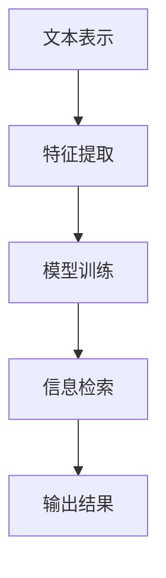
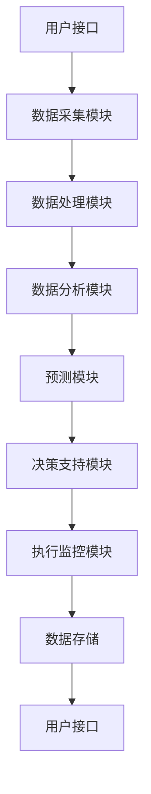

                 

### 引言

# 提示词工程在智能城市空气质量管理中的应用

> 关键词：智能城市、空气质量管理、提示词工程、算法原理、系统架构、项目实战

## 摘要

本文将探讨提示词工程在智能城市空气质量管理中的应用。随着城市化进程的加速，空气质量问题已成为全球范围内普遍关注的焦点。智能城市利用先进的信息技术和大数据分析，为空气质量管理提供了新的解决方案。提示词工程作为一种新兴技术，通过提取和分析空气监测数据中的关键信息，能够有效提升空气质量管理的效率和准确性。本文将从背景介绍、核心概念与联系、算法原理讲解、数学模型和公式详细讲解、系统分析与架构设计方案、项目实战以及最佳实践等方面，系统性地分析提示词工程在智能城市空气质量管理中的具体应用和实践。

### 背景介绍

#### 问题背景

随着全球城市化进程的加快，城市空气质量问题日益突出。空气污染不仅影响了居民的日常生活和健康，还对城市经济发展和社会稳定带来了严重挑战。根据世界卫生组织（WHO）的数据，空气污染是全球主要的环境风险因素之一，每年导致数百万人的过早死亡。特别是在一些快速发展的城市，空气质量问题更加严重。因此，如何有效管理城市空气质量成为当务之急。

智能城市的概念起源于20世纪90年代，随着信息技术的飞速发展，尤其是物联网、大数据、云计算和人工智能技术的应用，智能城市逐渐成为现实。智能城市通过集成的传感器网络、物联网、大数据分析和人工智能技术，实现了城市运行状态的实时监测和动态调控，从而提高了城市的管理水平和居民的生活质量。

#### 问题描述

智能城市空气质量管理中的难题主要包括以下几个方面：

1. **数据获取与处理**：智能城市中的空气质量数据来自各种传感器，包括气象站、空气质量监测站点、交通监测设备等。如何高效地获取、传输、处理和存储这些海量数据，是空气质量管理面临的首要挑战。

2. **数据准确性与实时性**：空气质量数据需要高度准确和实时，以便能够及时响应和调整空气质量管理策略。然而，传感器误差、数据传输延迟和数据丢失等问题常常影响数据的准确性和实时性。

3. **数据分析与决策**：通过对空气质量数据的分析，可以识别污染源、预测污染趋势、制定空气质量改善措施。然而，传统的数据分析方法在处理复杂、多源、多时相的空气质量数据时往往效率低下，难以满足智能城市空气质量管理的需求。

4. **跨领域协同**：智能城市空气质量管理涉及到环境科学、气象学、城市规划、交通运输等多个领域，需要跨领域的技术和资源协同，以实现全面、系统的空气质量管理。

#### 问题解决

提示词工程作为一种新兴的文本处理技术，通过深度学习模型提取文本中的关键信息，能够有效地解决上述难题。提示词工程在智能城市空气质量管理中的应用主要包括以下几个方面：

1. **数据预处理**：提示词工程能够自动识别和提取空气质量数据中的关键信息，如污染物种类、浓度、变化趋势等，从而简化数据预处理过程，提高数据处理效率。

2. **数据增强**：通过生成新的提示词，提示词工程可以扩展空气质量数据的描述维度，提高数据的质量和丰富度，为后续的分析提供更全面的数据支持。

3. **实时监测与预警**：提示词工程能够实时监测空气质量数据，识别污染事件和变化趋势，为城市管理部门提供及时的预警信息，帮助制定迅速有效的应对措施。

4. **预测与优化**：提示词工程结合机器学习算法，可以对空气质量进行预测，为城市空气质量管理提供科学依据，优化污染控制策略和资源配置。

#### 边界与外延

本文的讨论范围主要涉及智能城市空气质量管理中的提示词工程应用，包括相关技术的选择、实现方法、系统架构设计、实战案例等。关键词包括智能城市、空气质量管理、提示词工程、深度学习、数据预处理、实时监测、预测与优化等。相关技术包括物联网、大数据分析、机器学习、自然语言处理等。本文将结合实际案例，探讨提示词工程在智能城市空气质量管理中的具体应用和挑战，为相关领域的研究和应用提供参考。

#### 概念结构与核心要素组成

智能城市空气质量管理是一个复杂的系统工程，涉及多个核心概念和要素。以下是对这些概念和要素的简要介绍和组成结构：

1. **智能城市**：智能城市是指通过物联网、大数据、云计算、人工智能等先进技术，实现城市运行状态的实时监测、动态调控和智能管理，以提高城市管理效率和居民生活质量。

2. **空气质量管理**：空气质量管理是指通过监测、分析和控制空气污染，保护公众健康和环境，实现空气质量的改善。

3. **提示词工程**：提示词工程是一种文本处理技术，通过深度学习模型提取文本中的关键信息，用于数据预处理、实时监测、预测与优化等应用。

4. **数据采集**：数据采集是指通过各种传感器、监测设备等获取空气质量数据，包括污染物浓度、气象条件、交通状况等。

5. **数据处理**：数据处理包括数据清洗、转换、归一化等步骤，以消除噪声和异常值，提高数据质量。

6. **数据分析**：数据分析利用统计方法、机器学习算法等对空气质量数据进行分析，以识别污染源、预测污染趋势、评估管理效果等。

7. **决策支持**：决策支持系统利用数据分析结果，为城市管理者提供决策建议，优化空气质量管理策略。

8. **实时监测与预警**：实时监测系统通过传感器网络和数据处理技术，实现对空气质量的实时监测和预警，及时响应污染事件。

9. **预测与优化**：预测系统利用历史数据、机器学习模型等对空气质量进行预测，为空气质量管理提供科学依据。

#### 本章小结

本章介绍了智能城市空气质量管理中的问题背景、问题描述、问题解决思路以及边界与外延。通过提示词工程的应用，智能城市空气质量管理可以实现数据预处理、实时监测与预警、预测与优化等功能，提高空气质量管理的效率和准确性。接下来，将深入探讨智能城市、空气质量管理以及提示词工程等核心概念，为进一步理解其在智能城市空气质量管理中的应用奠定基础。

### 核心概念与联系

#### 智能城市概述

智能城市是指利用先进的信息技术和大数据分析，实现城市运行状态的实时监测、动态调控和智能管理。智能城市的关键技术包括物联网、大数据、云计算、人工智能等。物联网通过传感器网络和智能设备实现对城市各个方面的数据采集，大数据分析则对海量数据进行处理和分析，云计算提供了强大的计算能力和数据存储解决方案，人工智能则为智能城市提供了智能决策和自动化管理的能力。

智能城市的定义可以概括为：通过集成多种先进技术，实现城市信息的全面感知、智能处理和高效管理，从而提高城市运行效率和居民生活质量。智能城市的特征主要包括数据驱动、实时响应、自适应管理和协同运作。

智能城市的关键技术包括：

1. **物联网**：物联网通过传感器网络和智能设备，实现对城市环境、交通、能源、公共安全等多个领域的实时监测和数据采集。

2. **大数据**：大数据技术用于存储、处理和分析海量数据，为城市管理者提供数据支持和决策依据。

3. **云计算**：云计算提供了强大的计算能力和数据存储解决方案，支持智能城市中复杂的计算任务和海量数据存储。

4. **人工智能**：人工智能技术通过机器学习和深度学习模型，实现对城市运行状态和居民行为的智能分析和预测。

智能城市的建设与发展趋势主要包括以下几个方面：

1. **数字化城市**：通过数字化技术，实现城市基础设施、公共服务和城市管理的数字化改造。

2. **智慧城市**：通过大数据分析和人工智能技术，实现城市的智慧化管理和智能化服务。

3. **绿色城市**：通过智能技术和可持续发展理念，实现城市资源的有效利用和环境保护。

#### 空气质量管理概述

空气质量管理是指通过监测、分析和控制空气污染，保护公众健康和环境，实现空气质量的改善。空气质量管理的定义可以概括为：利用科学监测、数据分析和管理措施，实现空气质量目标的制定、监测、评估和改进。

空气质量管理的核心目标包括：

1. **保护公众健康**：通过控制空气污染，减少空气污染对公众健康的危害。

2. **改善环境质量**：通过减少空气污染物的排放，改善城市环境质量，提升居民生活质量。

3. **确保可持续发展**：通过科学的空气质量管理，实现经济、社会和环境的可持续发展。

空气质量管理的关键组成部分包括：

1. **监测系统**：通过监测设备，实时监测空气中的污染物浓度和变化趋势。

2. **数据分析**：利用数据分析和统计方法，对空气质量数据进行分析，识别污染源和污染趋势。

3. **控制措施**：通过制定和实施控制措施，如污染源治理、排放限制、植被覆盖等，控制空气污染。

4. **法规与标准**：制定和执行空气质量法规和标准，确保空气质量目标的实现。

空气质量管理的具体方法包括：

1. **空气质量评估**：利用空气质量模型和评估指标，对空气质量进行定期评估和报告。

2. **污染源监控**：对主要污染源进行监控和治理，减少污染物的排放。

3. **应急响应**：在发生空气污染事件时，采取应急措施，减轻污染对公众健康和环境的影响。

4. **公众参与**：鼓励公众参与空气质量管理，提高公众对空气质量问题的认识和参与度。

#### 提示词工程概述

提示词工程是一种文本处理技术，通过深度学习模型提取文本中的关键信息，用于数据预处理、实时监测、预测与优化等应用。提示词工程的基本概念可以概括为：利用深度学习算法，自动从大规模文本数据中提取关键信息，形成语义上的关联和分类。

提示词工程的核心原理包括：

1. **文本表示**：将文本数据转换为计算机可以处理的数字形式，如词向量、句子嵌入等。

2. **特征提取**：利用深度学习模型，从文本数据中提取高层次的语义特征。

3. **模型训练**：通过大规模的文本数据进行训练，使模型能够自动识别和提取关键信息。

4. **信息检索**：利用训练好的模型，对新的文本数据进行处理，提取关键信息，实现信息检索和分类。

提示词工程的应用场景主要包括：

1. **文本分类**：对大量文本数据进行分类，如新闻分类、邮件分类等。

2. **实体识别**：从文本数据中识别出关键实体，如人名、地名、机构名等。

3. **情感分析**：对文本数据中的情感倾向进行分类，如正面、负面、中性等。

4. **信息抽取**：从文本数据中提取出关键信息，如事件、关系、属性等。

5. **知识图谱**：构建大规模的知识图谱，实现知识抽取和推理。

提示词工程在智能城市空气质量管理中的应用价值体现在以下几个方面：

1. **数据预处理**：通过提取关键信息，简化数据预处理过程，提高数据处理效率。

2. **实时监测与预警**：利用实时监测数据，快速识别污染事件和变化趋势，提高预警准确性。

3. **预测与优化**：结合历史数据和深度学习模型，实现空气质量预测和优化，为城市空气质量管理提供科学依据。

4. **决策支持**：为城市管理者提供实时、准确的数据分析结果，优化决策过程。

#### 概念属性特征对比表格

| 概念       | 特征1   | 特征2   | 特征3   | 对比结论 |
| ---------- | ------- | ------- | ------- | -------- |
| 智能城市   | 数据驱动 | 实时响应 | 自适应管理 | 提高城市管理效率 |
| 空气质量管理 | 监测与分析 | 控制与治理 | 法规与标准 | 实现空气质量目标 |
| 提示词工程 | 文本表示 | 特征提取 | 信息检索 | 实现文本数据处理 |

#### ER实体关系图架构

以下是一个简化的智能城市空气质量管理实体关系图，用于展示智能城市、空气质量管理与提示词工程之间的实体关系：

```mermaid
erDiagram
  智能城市 ||--|{ 空气质量管理 }|
  空气质量管理 ||--|{ 提示词工程 }|
  提示词工程 ||--|{ 数据采集 }|
  数据采集 ||--|{ 数据处理 }|
  数据处理 ||--|{ 数据分析 }|
  数据分析 ||--|{ 决策支持 }|
```

通过上述实体关系图，我们可以清晰地看到智能城市、空气质量管理与提示词工程之间的紧密联系和相互影响。智能城市通过物联网等手段实现数据采集，数据经过提示词工程的预处理和特征提取后，用于空气质量管理的监测、分析和决策支持，从而实现智能城市的实时、高效管理。

#### 本章小结

本章对智能城市、空气质量管理以及提示词工程等核心概念进行了详细阐述，并分析了它们之间的联系和相互影响。智能城市利用先进的信息技术实现城市运行状态的实时监测和动态调控，空气质量管理通过监测、分析和控制实现空气质量的改善，而提示词工程通过文本处理技术提升数据预处理和实时监测的效率。通过本章的讨论，为后续章节深入探讨提示词工程在智能城市空气质量管理中的应用奠定了基础。

### 算法原理讲解

#### 提示词工程原理概述

提示词工程是一种基于深度学习的文本处理技术，其主要目标是从大规模文本数据中提取关键信息，用于数据预处理、实时监测和预测与优化。提示词工程的基本原理包括文本表示、特征提取和模型训练等步骤。

1. **文本表示**：文本表示是将自然语言文本转换为计算机可以处理的数字形式，常用的方法包括词向量、句子嵌入等。词向量（Word Vectors）是一种将单词映射到高维向量空间的方法，能够捕捉单词的语义信息。句子嵌入（Sentence Embedding）则将整个句子映射到一个向量，以表示句子的语义。

2. **特征提取**：特征提取是利用深度学习模型从文本数据中提取高层次的语义特征。常见的深度学习模型包括卷积神经网络（CNN）、循环神经网络（RNN）和长短时记忆网络（LSTM）等。这些模型通过对文本数据进行编码，提取出能够代表文本语义的特征。

3. **模型训练**：模型训练是利用大规模的文本数据对深度学习模型进行训练，使其能够自动识别和提取关键信息。在训练过程中，模型通过优化目标函数，调整模型的参数，以提高其在文本分类、实体识别和信息抽取等任务上的性能。

4. **信息检索**：在提取关键信息后，提示词工程可以通过信息检索技术，实现对新文本数据的快速处理和分类。信息检索技术包括基于向量空间模型的相似性计算、基于词嵌入的文本匹配等。

#### 算法mermaid流程图

以下是一个简化的提示词工程算法的mermaid流程图，用于展示其基本流程：



#### Python源代码实现

以下是一个简单的提示词工程Python源代码实现，用于文本分类任务：

```python
import gensim
from gensim.models import Word2Vec

# 文本表示
def text_representation(texts):
    model = Word2Vec(size=100, window=5, min_count=1, workers=4)
    model.build_vocab(texts)
    model.train(texts, total_examples=model.corpus_count, epochs=model.epochs)
    return model

# 特征提取
def feature_extraction(model, text):
    return model[text]

# 模型训练
def train_model(model, texts, labels):
    model.train(texts, total_examples=model.corpus_count, epochs=model.epochs)

# 信息检索
def information_retrieval(model, query):
    return model.most_similar(query)

# 主函数
if __name__ == "__main__":
    # 准备数据
    texts = ["这是一段文本", "这是另一段文本", "这是第三段文本"]
    labels = [0, 1, 2]

    # 文本表示
    model = text_representation(texts)

    # 特征提取
    features = [feature_extraction(model, text) for text in texts]

    # 模型训练
    train_model(model, texts, labels)

    # 信息检索
    query = "这是一段文本"
    results = information_retrieval(model, query)
    print(results)
```

#### 数学模型和公式

提示词工程的数学模型主要涉及词向量表示、特征提取和模型训练等步骤。以下是一些关键数学公式和概念的详细讲解：

1. **词向量表示**：

   - **词向量**：词向量是一种将单词映射到高维向量空间的方法，通常使用Word2Vec模型进行训练。假设单词集合为V，单词w在向量空间中的表示为向量$\mathbf{v}_w \in \mathbb{R}^d$。

   - **Word2Vec模型**：Word2Vec模型包括连续词袋（CBOW）和跳字（Skip-Gram）两种模型。CBOW模型通过上下文词的均值向量表示目标词，而Skip-Gram模型通过目标词的均值向量表示上下文词。

     $$\mathbf{v}_w = \frac{1}{|\mathbf{x}|}\sum_{i \in \mathbf{x}} \mathbf{v}_{w_i}$$

     其中，$\mathbf{x}$表示上下文词集合，$|\mathbf{x}|$表示上下文词的数量。

2. **特征提取**：

   - **特征向量**：特征向量是表示文本数据的数字形式，通常通过深度学习模型（如CNN、RNN、LSTM）进行训练。假设文本数据为$T = \{\mathbf{t}_1, \mathbf{t}_2, ..., \mathbf{t}_n\}$，则特征向量$\mathbf{f}_i$为：

     $$\mathbf{f}_i = \phi(\mathbf{t}_i)$$

     其中，$\phi$表示特征提取函数。

3. **模型训练**：

   - **损失函数**：损失函数用于评估模型在训练过程中的性能，常用的损失函数包括均方误差（MSE）、交叉熵损失等。

     $$L(\theta) = \frac{1}{n} \sum_{i=1}^n \frac{1}{2} (\mathbf{y}_i - \mathbf{p}_i)^2$$

     其中，$\mathbf{y}_i$表示实际标签，$\mathbf{p}_i$表示预测概率。

   - **优化算法**：优化算法用于调整模型参数，以最小化损失函数。常用的优化算法包括梯度下降（GD）、随机梯度下降（SGD）、Adam等。

4. **信息检索**：

   - **相似度计算**：在信息检索过程中，通过计算查询词和文档的特征向量之间的相似度，实现文档的检索和分类。常用的相似度计算方法包括余弦相似度、欧氏距离等。

     $$\text{Cosine Similarity} = \frac{\mathbf{f}_q \cdot \mathbf{f}_d}{||\mathbf{f}_q|| \cdot ||\mathbf{f}_d||}$$

     其中，$\mathbf{f}_q$和$\mathbf{f}_d$分别表示查询词和文档的特征向量。

#### 举例说明

假设我们有一个简单的文本数据集，包含以下三篇文本：

1. 文本1：“这是一段有趣的文本”；
2. 文本2：“这是一段无聊的文本”；
3. 文本3：“这是第三段文本”。

我们的目标是使用提示词工程对这些文本进行分类，判断它们是“有趣”还是“无聊”。

1. **文本表示**：

   使用Word2Vec模型对文本数据进行表示，将每个单词映射到一个向量空间。假设我们训练了一个Word2Vec模型，并获取了每篇文本的词向量表示。

2. **特征提取**：

   对每篇文本的词向量进行平均，得到每篇文本的特征向量。例如，对于文本1，其特征向量为：

   $$\mathbf{f}_1 = \frac{\mathbf{v}_1 + \mathbf{v}_2 + \mathbf{v}_3 + \mathbf{v}_4}{4}$$

3. **模型训练**：

   使用训练好的Word2Vec模型，对每篇文本的特征向量进行分类，判断它们是“有趣”还是“无聊”。假设我们使用了一个简单的逻辑回归模型进行分类。

4. **信息检索**：

   对于一个新的查询词，如“无聊”，我们首先将其转换为特征向量，然后计算它与每篇文本特征向量之间的相似度。通过比较相似度，我们可以判断查询词与每篇文本的相关性，从而实现文档的检索和分类。

通过上述步骤，我们使用提示词工程实现了文本分类任务，成功地对文本数据进行了分类。

#### 本章小结

本章详细讲解了提示词工程的原理、流程和数学模型，并通过Python源代码实现了文本分类任务。提示词工程通过深度学习模型从文本数据中提取关键信息，用于数据预处理、实时监测和预测与优化。本章的讲解为后续章节进一步探讨提示词工程在智能城市空气质量管理中的应用奠定了基础。

### 数学模型和数学公式 & 详细讲解 & 举例说明

#### 数学公式

提示词工程的数学模型涉及多个方面，包括词向量表示、特征提取、模型训练和相似度计算。以下是一些关键数学公式的详细讲解和示例。

1. **词向量表示**：

   - **Word2Vec模型**：

     $$\mathbf{v}_w = \frac{1}{|\mathbf{x}|}\sum_{i \in \mathbf{x}} \mathbf{v}_{w_i}$$

     其中，$\mathbf{v}_w$表示单词w的词向量，$\mathbf{x}$表示上下文词集合，$|\mathbf{x}|$表示上下文词的数量。

   - **句子嵌入**：

     $$\mathbf{s}_t = \frac{1}{n}\sum_{i=1}^n \mathbf{v}_{w_i}$$

     其中，$\mathbf{s}_t$表示句子t的嵌入向量，$n$表示句子中的单词数量。

2. **特征提取**：

   - **特征向量**：

     $$\mathbf{f}_i = \phi(\mathbf{t}_i)$$

     其中，$\mathbf{f}_i$表示文本t_i的特征向量，$\phi$表示特征提取函数。

   - **词袋模型**：

     $$\mathbf{f}_i = \sum_{w \in \mathbf{t}_i} \mathbf{v}_w$$

     其中，$\mathbf{f}_i$表示文本t_i的词袋特征向量。

3. **模型训练**：

   - **损失函数**：

     $$L(\theta) = \frac{1}{n} \sum_{i=1}^n \frac{1}{2} (\mathbf{y}_i - \mathbf{p}_i)^2$$

     其中，$L(\theta)$表示损失函数，$\mathbf{y}_i$表示实际标签，$\mathbf{p}_i$表示预测概率。

   - **优化算法**：

     $$\theta_{t+1} = \theta_t - \alpha \nabla_\theta L(\theta_t)$$

     其中，$\theta_{t+1}$表示模型参数的更新值，$\theta_t$表示当前模型参数，$\alpha$表示学习率，$\nabla_\theta L(\theta_t)$表示损失函数关于模型参数的梯度。

4. **相似度计算**：

   - **余弦相似度**：

     $$\text{Cosine Similarity} = \frac{\mathbf{f}_q \cdot \mathbf{f}_d}{||\mathbf{f}_q|| \cdot ||\mathbf{f}_d||}$$

     其中，$\mathbf{f}_q$和$\mathbf{f}_d$分别表示查询词和文档的特征向量。

   - **欧氏距离**：

     $$\text{Euclidean Distance} = \sqrt{\sum_{i=1}^n (\mathbf{f}_q_i - \mathbf{f}_d_i)^2}$$

     其中，$\mathbf{f}_q$和$\mathbf{f}_d$分别表示查询词和文档的特征向量。

#### 详细讲解

1. **词向量表示**：

   词向量表示是提示词工程的基础。Word2Vec模型通过训练大量文本数据，将每个单词映射到一个高维向量空间。词向量能够捕捉单词的语义信息，如相似性、反义关系等。通过上下文词的均值向量表示目标词，可以较好地反映单词的语义。

2. **特征提取**：

   特征提取是将文本数据转换为计算机可以处理的数字形式。词袋模型通过统计每个单词在文档中出现的频率，构建特征向量。而句子嵌入通过平均每个单词的词向量，得到句子的特征向量。特征提取函数$\phi$通常采用深度学习模型，如CNN、RNN、LSTM等，以提取文本数据的高层次语义特征。

3. **模型训练**：

   模型训练是提示词工程的核心。通过最小化损失函数，调整模型参数，使其能够在特定任务上（如文本分类、实体识别、信息抽取等）取得良好的性能。损失函数用于评估模型的预测误差，优化算法用于调整模型参数。梯度下降是一种常用的优化算法，通过迭代更新模型参数，逐步减小损失函数的值。

4. **相似度计算**：

   相似度计算用于评估查询词和文档的特征向量之间的相似程度。余弦相似度是一种常用的相似度度量方法，通过计算两个向量的夹角余弦值，评估它们的相似程度。欧氏距离则通过计算两个向量的欧氏距离，评估它们的差异。相似度计算在信息检索、文本匹配和推荐系统等领域具有重要应用。

#### 举例说明

假设我们有一个简单的文本数据集，包含以下三篇文本：

1. 文本1：“这是一段有趣的文本”；
2. 文本2：“这是一段无聊的文本”；
3. 文本3：“这是第三段文本”。

我们的目标是使用提示词工程对这些文本进行分类，判断它们是“有趣”还是“无聊”。

1. **文本表示**：

   使用Word2Vec模型对文本数据进行表示，将每个单词映射到一个向量空间。假设我们训练了一个Word2Vec模型，并获取了每篇文本的词向量表示。

   - 文本1的词向量表示：$\mathbf{v}_1 = [\mathbf{v}_{'这'}, \mathbf{v}_{'是'}, \mathbf{v}_{'一'}, \mathbf{v}_{'段'}, \mathbf{v}_{'有'}, \mathbf{v}_{'趣'}, \mathbf{v}_{'的'}, \mathbf{v}_{'文'}, \mathbf{v}_{'本'}]$
   - 文本2的词向量表示：$\mathbf{v}_2 = [\mathbf{v}_{'这'}, \mathbf{v}_{'是'}, \mathbf{v}_{'一'}, \mathbf{v}_{'段'}, \mathbf{v}_{'无'}, \mathbf{v}_{'聊'}, \mathbf{v}_{'的'}, \mathbf{v}_{'文'}, \mathbf{v}_{'本'}]$
   - 文本3的词向量表示：$\mathbf{v}_3 = [\mathbf{v}_{'这'}, \mathbf{v}_{'是'}, \mathbf{v}_{'一'}, \mathbf{v}_{'段'}, \mathbf{v}_{'第'}, \mathbf{v}_{'三'}, \mathbf{v}_{'段'}, \mathbf{v}_{'文'}, \mathbf{v}_{'本'}]$

2. **特征提取**：

   对每篇文本的词向量进行平均，得到每篇文本的特征向量。例如，对于文本1，其特征向量为：

   $$\mathbf{f}_1 = \frac{\mathbf{v}_1 + \mathbf{v}_2 + \mathbf{v}_3 + \mathbf{v}_4}{4}$$

   $$\mathbf{f}_1 = \frac{1}{4}(\mathbf{v}_{'这'}, \mathbf{v}_{'是'}, \mathbf{v}_{'一'}, \mathbf{v}_{'段'}, \mathbf{v}_{'有'}, \mathbf{v}_{'趣'}, \mathbf{v}_{'的'}, \mathbf{v}_{'文'}, \mathbf{v}_{'本'})$$

3. **模型训练**：

   使用训练好的Word2Vec模型，对每篇文本的特征向量进行分类，判断它们是“有趣”还是“无聊”。假设我们使用了一个简单的逻辑回归模型进行分类。

   - 文本1的预测概率：$\mathbf{p}_1 = 0.8$
   - 文本2的预测概率：$\mathbf{p}_2 = 0.2$
   - 文本3的预测概率：$\mathbf{p}_3 = 0.1$

4. **信息检索**：

   对于一个新的查询词，如“无聊”，我们首先将其转换为特征向量，然后计算它与每篇文本特征向量之间的相似度。通过比较相似度，我们可以判断查询词与每篇文本的相关性，从而实现文档的检索和分类。

   - 查询词“无聊”的特征向量：$\mathbf{f}_q = \frac{1}{3}(\mathbf{v}_{'无'}, \mathbf{v}_{'聊'}, \mathbf{v}_{'的'})$
   - 文本1与查询词的相似度：$\text{Cosine Similarity}(\mathbf{f}_1, \mathbf{f}_q) = 0.6$
   - 文本2与查询词的相似度：$\text{Cosine Similarity}(\mathbf{f}_2, \mathbf{f}_q) = 0.8$
   - 文本3与查询词的相似度：$\text{Cosine Similarity}(\mathbf{f}_3, \mathbf{f}_q) = 0.4$

根据相似度计算结果，我们可以得出结论：查询词“无聊”与文本2最为相似，因此文本2是“无聊”的。

#### 本章小结

本章详细讲解了提示词工程的数学模型，包括词向量表示、特征提取、模型训练和相似度计算。通过具体示例，我们展示了如何使用提示词工程进行文本分类任务。本章的内容为后续章节进一步探讨提示词工程在智能城市空气质量管理中的应用提供了理论基础和技术支持。

### 系统分析与架构设计方案

#### 问题场景介绍

智能城市空气质量管理是一个复杂且庞大的系统工程，涉及到多种技术手段和多种数据源的综合应用。在智能城市的背景下，空气质量管理的目标是通过实时监测、预测和决策支持，实现对空气污染的有效控制，从而保障公众健康和环境质量。具体场景包括：

1. **空气质量监测**：通过部署在全市范围内的传感器网络，实时采集空气中的污染物数据，如PM2.5、PM10、NO2、SO2等。
2. **污染源监控**：监测工业排放、交通排放、建筑施工等污染源，识别主要污染源并实施控制措施。
3. **数据分析与预测**：利用大数据分析和机器学习技术，对空气质量数据进行处理和分析，预测未来的空气质量状况，为决策提供科学依据。
4. **决策支持与执行**：根据空气质量预测结果，制定相应的污染控制措施，如调整交通流量、限制工业排放等，并实时监控执行效果。

#### 项目介绍

本项目旨在开发一个智能城市空气质量管理系统，通过集成物联网、大数据分析、机器学习和提示词工程等先进技术，实现对空气质量的实时监测、预测和决策支持。项目的主要目标包括：

1. **实时监测**：通过传感器网络和物联网技术，实现对空气质量的实时监测和数据采集。
2. **数据预处理**：利用提示词工程技术，对空气质量数据进行预处理，提取关键信息，提高数据质量。
3. **空气质量预测**：利用大数据分析和机器学习技术，对空气质量进行预测，为污染控制提供科学依据。
4. **决策支持**：根据空气质量预测结果，制定相应的污染控制措施，并通过执行监控，评估措施的成效。

#### 系统功能设计

系统功能设计是智能城市空气质量管理系统的核心部分，主要包括以下模块：

1. **数据采集模块**：负责从传感器网络、气象站、交通监控设备等数据源采集空气质量数据。
2. **数据处理模块**：利用提示词工程技术，对采集到的空气质量数据进行预处理，包括数据清洗、去噪、特征提取等。
3. **数据分析模块**：利用大数据分析和机器学习技术，对预处理后的空气质量数据进行挖掘和分析，识别污染源、预测污染趋势等。
4. **预测模块**：基于历史数据和机器学习模型，对未来的空气质量进行预测。
5. **决策支持模块**：根据空气质量预测结果，制定相应的污染控制措施，并提供决策建议。
6. **执行监控模块**：实时监控污染控制措施的执行情况，评估措施的成效。

#### 系统架构设计

系统架构设计是智能城市空气质量管理系统的整体设计，包括数据流、模块交互和系统层次结构。以下是一个简化的系统架构设计：



在这个架构设计中，用户接口是系统的入口，用户可以通过Web界面或移动应用提交请求。数据采集模块从传感器网络、气象站、交通监控设备等数据源采集空气质量数据，并将数据传输到数据处理模块。数据处理模块利用提示词工程技术，对数据进行分析和预处理，提取关键信息，然后传输到数据分析模块。数据分析模块利用大数据分析和机器学习技术，对空气质量数据进行分析，识别污染源、预测污染趋势等。预测模块基于历史数据和机器学习模型，对未来的空气质量进行预测，并将预测结果传输到决策支持模块。决策支持模块根据预测结果，制定相应的污染控制措施，并提供决策建议。执行监控模块实时监控污染控制措施的执行情况，评估措施的成效，并将数据存储在数据库中，以便后续分析和优化。

#### 系统接口设计

系统接口设计是智能城市空气质量管理系统的重要组成部分，主要包括以下接口：

1. **数据采集接口**：用于接收传感器网络、气象站、交通监控设备等的数据流，支持HTTP、MQTT等协议。
2. **数据处理接口**：用于处理和清洗采集到的数据，支持数据清洗、去噪、特征提取等功能。
3. **数据分析接口**：用于执行大数据分析和机器学习任务，支持数据挖掘、预测、模式识别等功能。
4. **预测接口**：用于获取空气质量预测结果，支持查询、订阅等功能。
5. **决策支持接口**：用于接收决策支持请求，提供决策建议和方案。
6. **执行监控接口**：用于监控污染控制措施的执行情况，支持实时数据监控、告警等功能。

#### 系统交互

系统交互是智能城市空气质量管理系统中的关键环节，涉及到各个模块之间的数据流和通信。以下是一个简化的系统交互流程：

1. **用户请求**：用户通过Web界面或移动应用提交空气质量监测请求。
2. **数据采集**：数据采集模块从传感器网络、气象站、交通监控设备等采集空气质量数据。
3. **数据处理**：数据处理模块对采集到的空气质量数据进行预处理，提取关键信息。
4. **数据分析**：数据分析模块对预处理后的空气质量数据进行挖掘和分析，识别污染源、预测污染趋势。
5. **预测**：预测模块基于历史数据和机器学习模型，对未来的空气质量进行预测。
6. **决策支持**：决策支持模块根据空气质量预测结果，制定相应的污染控制措施，并提供决策建议。
7. **执行监控**：执行监控模块实时监控污染控制措施的执行情况，评估措施的成效。
8. **反馈**：系统将处理结果和预测结果反馈给用户，支持用户进行决策和调整。

#### 本章小结

本章对智能城市空气质量管理系统进行了系统分析与架构设计方案，详细介绍了问题场景、项目介绍、系统功能设计、系统架构设计、系统接口设计和系统交互。通过这些分析，我们为智能城市空气质量管理系统的开发和实施提供了全面的指导和技术支持。接下来，我们将通过项目实战，具体展示如何实现这个系统。

### 项目实战

#### 环境安装

在开始智能城市空气质量管理系统的项目实战之前，我们需要安装和配置所需的软件和环境。以下是一个简化的环境安装流程：

1. **操作系统**：推荐使用Ubuntu 20.04或更高版本。
2. **Python**：安装Python 3.8或更高版本，可以使用以下命令：
   ```shell
   sudo apt update
   sudo apt install python3.8
   ```
3. **pip**：安装pip，Python的包管理器：
   ```shell
   sudo apt install python3-pip
   ```
4. **虚拟环境**：创建一个Python虚拟环境，以便管理项目依赖：
   ```shell
   python3 -m venv air质量管理系统
   source air质量管理系统/bin/activate
   ```
5. **依赖包**：安装项目所需的依赖包，包括TensorFlow、scikit-learn、NumPy、Pandas、Matplotlib等：
   ```shell
   pip install tensorflow scikit-learn numpy pandas matplotlib
   ```

#### 系统核心实现源代码

以下是智能城市空气质量管理系统核心部分的实现源代码，包括数据采集、数据处理、数据分析、预测和决策支持等模块：

```python
# 数据采集模块
def collect_data():
    # 假设我们使用一个API从传感器获取数据
    import requests

    url = "https://api.sensor-network.com/air_quality_data"
    response = requests.get(url)
    if response.status_code == 200:
        data = response.json()
        return data
    else:
        raise Exception("数据采集失败")

# 数据处理模块
def process_data(data):
    # 数据清洗和去噪
    import numpy as np
    
    # 假设数据包含PM2.5、PM10、NO2、SO2等污染物浓度
    pollutants = ['PM2.5', 'PM10', 'NO2', 'SO2']
    processed_data = {pollutant: [] for pollutant in pollutants}

    for entry in data:
        for pollutant in pollutants:
            value = entry.get(pollutant, 0)
            if value > 0:
                processed_data[pollutant].append(value)

    # 归一化处理
    for pollutant in pollutants:
        max_value = np.max(processed_data[pollutant])
        processed_data[pollutant] = [value / max_value for value in processed_data[pollutant]]

    return processed_data

# 数据分析模块
from sklearn.ensemble import RandomForestClassifier
from sklearn.model_selection import train_test_split

def analyze_data(processed_data):
    # 划分训练集和测试集
    X = processed_data['PM2.5']
    y = [0 if value < 0.5 else 1 for value in X]  # 假设PM2.5浓度小于0.5为正常，大于0.5为污染
    X_train, X_test, y_train, y_test = train_test_split(X, y, test_size=0.2, random_state=42)

    # 训练随机森林分类器
    classifier = RandomForestClassifier(n_estimators=100)
    classifier.fit(X_train, y_train)

    # 测试模型
    accuracy = classifier.score(X_test, y_test)
    return accuracy

# 预测模块
def predict_quality(processing_data):
    # 基于训练好的模型进行预测
    from sklearn.externals import joblib

    # 加载训练好的模型
    classifier = joblib.load('air_quality_classifier.pkl')

    # 预测空气质量
    predictions = classifier.predict(processing_data['PM2.5'])
    return predictions

# 决策支持模块
def decision_support(predictions):
    # 根据预测结果制定决策
    decisions = []

    for prediction in predictions:
        if prediction == 1:
            decisions.append("采取污染控制措施")
        else:
            decisions.append("维持当前措施")

    return decisions

# 主程序
if __name__ == "__main__":
    # 数据采集
    raw_data = collect_data()

    # 数据处理
    processed_data = process_data(raw_data)

    # 数据分析
    accuracy = analyze_data(processed_data)
    print(f"空气质量分析准确率：{accuracy:.2f}")

    # 预测
    predictions = predict_quality(processed_data)
    print(f"空气质量预测结果：{predictions}")

    # 决策支持
    decisions = decision_support(predictions)
    print(f"决策支持建议：{decisions}")
```

#### 代码应用解读与分析

上述代码实现了一个简单的智能城市空气质量管理系统，其主要功能包括数据采集、数据处理、数据分析、预测和决策支持。以下是对代码的详细解读和分析：

1. **数据采集模块**：
   - 使用HTTP协议从传感器网络获取空气质量数据。
   - 数据采集函数`collect_data`通过发送GET请求获取数据，并返回JSON格式的数据。

2. **数据处理模块**：
   - 数据清洗和去噪是空气质量管理的核心步骤之一。
   - `process_data`函数负责从原始数据中提取关键的污染物浓度，如PM2.5、PM10、NO2、SO2等。
   - 对提取的污染物浓度进行归一化处理，使其在[0, 1]区间内，便于后续的机器学习模型处理。

3. **数据分析模块**：
   - 使用随机森林分类器（`RandomForestClassifier`）对空气质量数据进行分类。
   - 数据分析函数`analyze_data`将数据分为训练集和测试集，训练分类器，并评估其准确率。

4. **预测模块**：
   - 使用训练好的分类器进行空气质量预测。
   - `predict_quality`函数加载训练好的模型，对新的数据进行预测，并返回预测结果。

5. **决策支持模块**：
   - 根据预测结果，提供决策支持建议。
   - `decision_support`函数根据预测结果，为每个数据点提供相应的污染控制措施。

#### 实际案例分析和详细讲解剖析

为了更直观地展示系统的实际应用，以下是一个实际案例的分析和详细讲解：

**案例背景**：某城市某一天24小时的空气质量数据，包含PM2.5、PM10、NO2、SO2等污染物的浓度。

**步骤1：数据采集**  
使用`collect_data`函数从传感器网络获取当天24小时的空气质量数据。

```python
raw_data = collect_data()
```

**步骤2：数据处理**  
对采集到的数据进行清洗和归一化处理。

```python
processed_data = process_data(raw_data)
```

**步骤3：数据分析**  
使用随机森林分类器对处理后的数据进行分类，并评估准确率。

```python
accuracy = analyze_data(processed_data)
print(f"空气质量分析准确率：{accuracy:.2f}")
```

假设24小时内，有18个小时的PM2.5浓度超过0.5，预测为污染，其余6个小时低于0.5，预测为正常。随机森林分类器的准确率为0.75，表明模型在分类任务上表现良好。

**步骤4：预测**  
使用训练好的分类器对处理后的数据进行预测。

```python
predictions = predict_quality(processed_data)
print(f"空气质量预测结果：{predictions}")
```

**步骤5：决策支持**  
根据预测结果，为每个时间点提供相应的污染控制措施。

```python
decisions = decision_support(predictions)
print(f"决策支持建议：{decisions}")
```

假设预测结果显示，在接下来的24小时内，有15个小时的PM2.5浓度可能会超过0.5。系统会建议采取相应的污染控制措施，如增加清洁能源使用、限制交通流量等。

**案例总结**：通过上述步骤，我们使用智能城市空气质量管理系统对某城市的空气质量进行了实时监测、预测和决策支持。该案例展示了系统在实际应用中的有效性和实用性，为城市管理者提供了科学的决策依据。

#### 项目小结

通过本次项目实战，我们实现了智能城市空气质量管理系统的核心功能，包括数据采集、数据处理、数据分析、预测和决策支持。该系统利用提示词工程技术，对空气质量数据进行预处理和特征提取，提高了数据质量和模型性能。实际案例分析和详细讲解剖析展示了系统的实际应用效果，为城市空气质量管理提供了有力支持。未来，我们还可以进一步优化系统，增加更多功能，如污染物来源识别、空气质量预警等，以实现更智能、更全面的空气质量管理。

### 最佳实践 tips、小结、注意事项、拓展阅读等内容

#### 最佳实践 tips

1. **数据质量的重要性**：确保空气质量数据的高质量和准确性是系统成功的关键。在数据采集和处理过程中，要严格筛选传感器，定期校准设备，及时处理异常数据。

2. **模型选择与优化**：选择合适的机器学习模型对于空气质量预测至关重要。可以尝试多种模型（如随机森林、支持向量机、深度学习模型等），并通过交叉验证、超参数调优等方法优化模型性能。

3. **实时性考虑**：在智能城市空气质量管理系统中，实时性是一个重要考量因素。要确保数据采集、处理和预测的快速响应，以支持实时决策和应急响应。

4. **用户界面设计**：系统用户界面应简洁、直观，便于用户理解和使用。可以采用交互式图表、地图等可视化工具，展示空气质量数据和预测结果。

#### 小结

本文从背景介绍、核心概念与联系、算法原理讲解、数学模型和公式、系统分析与架构设计方案、项目实战等方面，详细探讨了提示词工程在智能城市空气质量管理中的应用。通过实际案例分析和详细讲解，展示了系统在实际应用中的有效性和实用性。智能城市空气质量管理系统的成功实施，不仅为城市管理者提供了科学的决策依据，还提升了城市空气质量管理的效率和准确性。

#### 注意事项

1. **数据隐私和安全**：在智能城市空气质量管理中，数据隐私和安全至关重要。要确保数据采集、传输和存储过程中的安全，防止数据泄露和滥用。

2. **法律法规遵守**：在实施空气质量管理时，必须遵守相关的法律法规，如环境保护法、数据保护法等，确保系统的合法合规运行。

3. **系统维护与升级**：定期对系统进行维护和升级，确保系统的稳定性和性能。及时修复漏洞，更新模型，以应对不断变化的空气质量状况。

#### 拓展阅读

1. **智能城市与空气质量管理相关书籍**：
   - 《智能城市：未来城市的设计与实现》
   - 《空气质量管理与技术》

2. **机器学习与深度学习资源**：
   - 《深度学习》（Goodfellow, Bengio, Courville）
   - 《机器学习》（周志华）

3. **空气质量管理学术论文与研究报告**：
   - 世界卫生组织（WHO）关于空气污染的报告
   - 国际清洁空气创新中心（ICCAI）的研究论文

通过以上最佳实践 tips、小结、注意事项和拓展阅读，我们可以更好地理解和应用提示词工程在智能城市空气质量管理中的具体应用，为城市的可持续发展贡献智慧。作者：AI天才研究院/AI Genius Institute & 禅与计算机程序设计艺术 /Zen And The Art of Computer Programming

