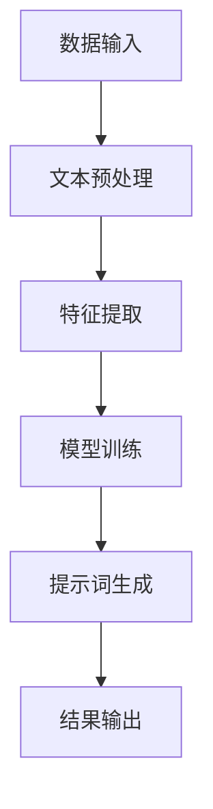

                 

### 第一部分：问题背景与核心概念

## 第1章：问题背景与核心概念

### 1.1 问题背景

智能城市规划作为现代城市建设的重要组成部分，正逐步从传统的规划模式向智能化、数字化和自动化的方向发展。在快速城市化和人口增长的双重压力下，传统城市规划面临着交通拥堵、环境污染、公共资源短缺等问题。为了解决这些问题，智能城市规划应运而生，通过整合大数据、物联网、人工智能等技术手段，实现城市管理的智能化和精细化。

智能城市规划的发展历程可以分为几个阶段。起初，城市规划主要依赖于经验和直觉，随着计算机技术的发展，地理信息系统（GIS）和遥感技术开始应用于城市规划，使城市规划从二维走向三维。进入21世纪，随着大数据、云计算、物联网和人工智能的迅猛发展，智能城市规划进入了新的阶段。这一阶段的智能城市规划不仅仅是技术的集成，更是思维方式的变革，从以人为中心转向以数据为中心，通过数据驱动实现城市规划的智能化。

### 1.1.1 智能城市规划的发展历程

1. **数据采集和整合阶段（20世纪80年代至90年代）**：
   - 这一阶段，城市规划开始引入计算机技术，尤其是GIS技术，用于数据采集和整合。城市规划师通过GIS系统获取土地利用、交通网络、人口分布等数据，为城市规划提供基础信息。
   
2. **模型建立和模拟阶段（21世纪初至2010年）**：
   - 随着计算能力的提升和优化算法的应用，城市规划开始建立各种模型进行模拟。这些模型包括交通流量模型、环境质量模型、公共资源分配模型等，用于预测和评估不同规划方案的可行性。

3. **智能决策和优化阶段（2010年至今）**：
   - 这一阶段，人工智能技术开始广泛应用于城市规划，从数据分析和模型模拟到决策支持系统，实现了城市规划的自动化和智能化。例如，基于机器学习的交通流量预测系统可以实时调整交通信号灯，缓解交通拥堵。

### 1.1.2 提示词工程的概念

提示词工程是一种基于人工智能技术的语言处理方法，其目的是通过分析和生成关键词或短语来提高信息检索的准确性和效率。提示词工程通常涉及自然语言处理（NLP）和数据挖掘技术，通过对大量文本数据进行分析，提取出能够代表文本核心内容的词汇或短语。

提示词工程在智能城市规划中的应用主要集中在以下几个方面：

1. **数据预处理**：在智能城市规划中，需要处理大量的文本数据，如城市报告、居民反馈、交通监控数据等。提示词工程可以用来提取这些数据中的关键信息，为后续分析提供支持。

2. **信息检索和可视化**：通过生成提示词，智能城市规划系统能够更准确地检索相关数据，并将这些数据以可视化的形式展示给用户，帮助规划师和决策者更好地理解城市规划的情况。

3. **居民参与**：提示词工程可以用于分析居民的意见和建议，帮助规划师更好地了解居民的需求和期望，从而制定更符合居民需求的规划方案。

### 1.1.3 提示词工程在智能城市规划中的作用

1. **提升数据解析能力**：通过提示词工程，智能城市规划系统能够从大量的文本数据中提取出关键信息，使数据分析更加精确和高效。

2. **优化决策过程**：提示词工程可以帮助规划师快速识别关键问题，为决策提供有力支持，提高决策的科学性和准确性。

3. **促进居民参与**：通过生成居民关注的关键词和短语，智能城市规划系统能够更好地与居民沟通，收集居民的意见和建议，增强城市规划的民主性和透明度。

### 1.2 核心概念与联系

#### 1.2.1 提示词工程的定义

提示词工程是一种基于人工智能技术的方法，旨在从大量文本数据中提取出能够代表文本核心内容的关键词或短语。这些关键词或短语不仅能够提高信息检索的准确性和效率，还能为后续的数据分析和决策提供支持。

#### 1.2.2 提示词工程的关键要素

- **文本数据集**：提示词工程需要大量的文本数据作为基础，这些数据可以来源于城市报告、居民反馈、交通监控记录等。

- **自然语言处理技术**：自然语言处理技术是提示词工程的核心，用于对文本数据进行分析和处理，提取出关键信息。

- **机器学习模型**：机器学习模型用于训练和优化提示词工程系统，使其能够自动从文本数据中提取关键词。

- **信息检索和可视化工具**：这些工具用于将提取出的关键词或短语进行检索和可视化展示，帮助用户更好地理解和分析数据。

#### 1.2.3 提示词工程与传统城市规划的区别

- **数据来源和范围**：传统城市规划主要依赖经验和专家知识，而提示词工程则通过分析大量文本数据来提取关键信息，数据来源更加广泛和多样化。

- **分析方法和工具**：传统城市规划主要依赖于经验和一些简单的统计工具，而提示词工程则利用自然语言处理和机器学习等技术，使数据分析更加深入和精确。

- **决策支持**：传统城市规划的决策过程较为缓慢，而提示词工程可以通过快速提取关键信息，为规划师提供及时的决策支持。

### 1.3 概念属性特征对比表格

| 概念        | 提示词工程                  | 传统城市规划                   |
| ----------- | -------------------------- | ---------------------------- |
| 数据来源    | 大量文本数据               | 专家经验、统计数据             |
| 分析方法    | 自然语言处理、机器学习     | 经验判断、简单统计            |
| 决策支持    | 快速提取关键信息，实时支持 | 缓慢，依赖专家经验和历史数据  |
| 数据处理效率 | 高效，自动化              | 低效，人工操作               |
| 适用范围    | 广泛文本数据               | 特定领域数据                  |

### 1.4 ER实体关系图架构

```mermaid
erDiagram
  TB（时间表）||--|{ 文本数据 }
  文本数据 ||--|{ 提示词 }
  提示词 ||--|{ 数据分析结果 }
  数据分析结果 ||--|{ 决策支持系统 }
```

在这个ER图中，文本数据是整个系统的核心，通过自然语言处理技术提取出提示词，再由提示词生成数据分析结果，最终为决策支持系统提供依据。这个架构清晰地展示了提示词工程在智能城市规划中的应用流程。

### 1.5 小结

本章详细介绍了智能城市规划的发展历程和提示词工程的概念，分析了提示词工程在智能城市规划中的应用及其与传统城市规划的区别。通过概念属性特征对比表格和ER实体关系图，进一步明确了提示词工程在智能城市规划中的核心地位。接下来的章节将深入探讨提示词工程的原理和数学模型，以及其在智能交通规划、智能环保规划、智能城市安防和智能城市公共资源管理中的应用。

---

> 让我们继续深入探讨提示词工程的原理与数学模型，这将帮助我们更好地理解其在智能城市规划中的关键作用。

## 第2章：提示词工程的原理与数学模型

### 2.1 提示词工程的基本原理

提示词工程是一种利用自然语言处理（NLP）和机器学习技术来提取文本数据中关键信息的工程方法。其核心思想是通过分析大量的文本数据，提取出能够代表文本核心内容的关键词或短语，从而实现信息的高效检索和利用。以下是提示词工程的基本原理：

#### 2.1.1 提示词工程的生成机制

1. **数据采集**：首先，需要收集大量的文本数据，这些数据可以来源于城市报告、居民反馈、交通监控记录等。

2. **预处理**：对收集到的文本数据进行清洗和预处理，包括去除停用词、标点符号、统一词形等。

3. **特征提取**：使用自然语言处理技术，对预处理后的文本数据进行特征提取，将文本转化为计算机可以理解的形式。常用的特征提取方法包括词袋模型、TF-IDF、Word2Vec等。

4. **模型训练**：利用机器学习模型对提取出的特征进行训练，生成提示词。常见的机器学习模型包括朴素贝叶斯、支持向量机、深度学习模型等。

5. **提示词生成**：根据训练好的模型，对新的文本数据生成提示词，用于信息检索和数据分析。

#### 2.1.2 提示词工程的处理流程

1. **数据输入**：将待处理的文本数据输入系统。

2. **预处理**：对文本数据进行清洗和预处理，确保数据质量。

3. **特征提取**：对预处理后的文本数据进行特征提取，为后续的机器学习模型提供输入。

4. **模型预测**：利用训练好的机器学习模型对特征进行预测，生成提示词。

5. **结果输出**：将生成的提示词输出，用于信息检索和数据分析。

### 2.2 数学模型与公式

提示词工程涉及多种数学模型，以下是一些常用的模型及其公式：

$$
\text{P(S)} = \sum_{i=1}^{n} \text{P(S|T_i)} \cdot \text{P(T_i)}
$$

这是一个基于贝叶斯理论的概率模型，用于计算给定一组提示词\(T_i\)时，文本\(S\)的概率。其中：

- \( \text{P(S)} \) 是文本\(S\)的概率。
- \( \text{P(S|T_i)} \) 是在提示词\(T_i\)存在的条件下，文本\(S\)的概率。
- \( \text{P(T_i)} \) 是提示词\(T_i\)出现的概率。

#### 2.2.1 概率模型

概率模型是提示词工程中常用的基础模型，通过计算文本和提示词之间的条件概率，实现提示词的生成和预测。贝叶斯理论在此模型中起着关键作用，其公式如上所示。

#### 2.2.2 信息论模型

信息论模型用于衡量文本和提示词之间的信息量。常用的信息量度量包括熵、互信息和条件熵。其中，互信息（Mutual Information, MI）表示两个随机变量之间信息的共享程度。公式如下：

$$
I(X;Y) = H(X) - H(X|Y)
$$

其中：

- \( I(X;Y) \) 是随机变量\(X\)和\(Y\)之间的互信息。
- \( H(X) \) 是\(X\)的熵。
- \( H(X|Y) \) 是在\(Y\)已知的条件下，\(X\)的熵。

#### 2.2.3 机器学习模型

机器学习模型在提示词工程中起着核心作用，常见的模型包括朴素贝叶斯、支持向量机（SVM）和深度学习模型。以下是一个简单的朴素贝叶斯分类器的公式：

$$
P(\text{类别} | \text{特征}) = \frac{P(\text{特征} | \text{类别}) \cdot P(\text{类别})}{P(\text{特征})}
$$

其中：

- \( P(\text{类别} | \text{特征}) \) 是给定特征时，类别出现的概率。
- \( P(\text{特征} | \text{类别}) \) 是在特定类别下，特征出现的概率。
- \( P(\text{类别}) \) 是类别出现的概率。
- \( P(\text{特征}) \) 是特征出现的概率。

### 2.3 算法原理讲解

提示词工程的算法原理主要涉及特征提取和机器学习模型的训练与预测。以下是一个简单的提示词工程算法流程图：



#### 2.3.1 算法流程图

1. **数据输入**：将待处理的文本数据输入系统。
2. **文本预处理**：对文本数据进行清洗和预处理，包括去除停用词、标点符号、统一词形等。
3. **特征提取**：使用词袋模型、TF-IDF或Word2Vec等方法，将预处理后的文本转化为特征向量。
4. **模型训练**：利用训练集数据，使用机器学习模型（如朴素贝叶斯、支持向量机或深度学习模型）进行训练。
5. **提示词生成**：使用训练好的模型，对新的文本数据生成提示词。
6. **结果输出**：将生成的提示词输出，用于信息检索和数据分析。

#### 2.3.2 Python源代码讲解

以下是一个基于朴素贝叶斯模型的简单提示词工程示例，演示了从文本数据中提取提示词的过程。

```python
import nltk
from nltk.corpus import stopwords
from nltk.tokenize import word_tokenize
from sklearn.feature_extraction.text import CountVectorizer
from sklearn.naive_bayes import MultinomialNB
from sklearn.pipeline import make_pipeline

# 1. 数据输入
documents = [
    "This is the first document.",
    "This document is the second document.",
    "And this is the third one.",
    "Is this the first document?",
]

# 2. 文本预处理
nltk.download('stopwords')
stop_words = set(stopwords.words('english'))
def tokenize(text):
    return [word.lower() for word in word_tokenize(text) if word.lower() not in stop_words]

# 3. 特征提取
vectorizer = CountVectorizer(tokenizer=tokenize)

# 4. 模型训练
clf = MultinomialNB()
model = make_pipeline(vectorizer, clf)
model.fit(documents)

# 5. 提示词生成
text = "Is this the first document?"
predicted = model.predict([text])
print(predicted)

# 6. 结果输出
print("Generated keywords:", predicted[0])
```

在这个示例中，我们首先输入一些文本数据，然后通过预处理步骤去除停用词，接着使用CountVectorizer进行特征提取，最后使用朴素贝叶斯分类器进行模型训练和预测。生成的提示词将用于后续的信息检索和数据分析。

### 2.4 小结

本章详细介绍了提示词工程的基本原理和数学模型，包括概率模型、信息论模型和机器学习模型。通过一个简单的Python示例，展示了从文本数据中提取提示词的过程。这些原理和模型为提示词工程在智能城市规划中的应用提供了理论基础，接下来我们将进一步探讨提示词工程在实际应用中的具体案例。

---

> 提示词工程在智能城市规划中的应用不仅限于理论模型，它还能够在实际场景中发挥重要作用。接下来，我们将深入探讨提示词工程在智能交通规划、智能环保规划、智能城市安防和智能城市公共资源管理中的应用。

## 第3章：提示词工程在智能交通规划中的应用

### 3.1 智能交通规划概述

智能交通规划是指通过应用先进的信息技术、通信技术、传感器技术和人工智能技术，对城市交通系统进行智能化管理，以实现交通流量优化、交通信号控制、交通事故预防、公共交通服务提升等目标。随着城市化进程的加快和人口增长，传统交通管理方法已无法满足现代城市的交通需求，智能交通规划应运而生。

#### 3.1.1 智能交通规划的重要性

1. **缓解交通拥堵**：智能交通规划通过实时监控和动态调整交通信号，优化交通流量，有效缓解交通拥堵问题。
   
2. **提升交通安全**：智能交通规划可以通过实时监控和预测交通事故，及时采取预防措施，提升道路安全性。

3. **改善公共交通服务**：智能交通规划可以优化公共交通线路和班次，提高公共交通服务的效率和满意度。

4. **提高道路资源利用率**：通过智能交通规划，可以更有效地利用道路资源，减少道路拥堵，提升道路通行能力。

#### 3.1.2 智能交通规划的挑战

1. **数据来源和处理**：智能交通规划需要大量的交通数据，包括车辆信息、道路状况、天气条件等。这些数据的获取和处理是一个巨大的挑战。

2. **系统复杂度**：智能交通规划系统通常涉及多个模块和组件，如交通信号控制、路况监测、车流预测等，系统复杂度高。

3. **实时性和准确性**：智能交通规划系统需要在实时环境下进行高效、准确的决策，这对系统的实时性和准确性提出了高要求。

4. **成本和效益**：智能交通规划的实施和维护需要大量的资金投入，而其效果难以直接衡量，需要平衡成本和效益。

### 3.2 提示词工程在智能交通规划中的应用

#### 3.2.1 提示词生成与优化

提示词工程在智能交通规划中的应用主要体现在以下方面：

1. **交通事件识别**：通过提示词工程，可以从交通监控视频和传感器数据中提取关键信息，识别交通事件，如交通事故、交通拥堵等。

2. **交通流量预测**：利用生成的提示词，可以分析历史交通数据，预测未来的交通流量，为交通信号控制和交通调度提供依据。

3. **公共交通优化**：通过分析居民出行需求和公共交通数据，生成提示词，优化公共交通线路和班次，提高公共交通服务效率。

4. **交通信号优化**：提示词工程可以帮助交通信号控制系统实时监测交通状况，生成提示词，调整信号灯时长和相位，优化交通流量。

#### 3.2.2 交通流量预测

交通流量预测是智能交通规划中的一个关键环节，其准确性和实时性对交通信号控制和交通调度具有重要影响。提示词工程在交通流量预测中的应用主要包括：

1. **数据预处理**：利用提示词工程对交通数据进行预处理，包括数据清洗、特征提取等，为模型训练提供高质量的数据。

2. **模型训练与优化**：使用机器学习模型（如回归模型、神经网络等）对预处理后的数据进行训练，生成预测模型。通过优化提示词和模型参数，提高预测准确性。

3. **实时预测与反馈**：将生成的提示词用于实时交通流量预测，并根据预测结果动态调整交通信号灯和交通调度策略。

#### 3.2.3 交通信号优化

交通信号优化是智能交通规划中的另一个重要应用，旨在通过优化交通信号控制策略，提高道路通行能力和效率。提示词工程在交通信号优化中的应用包括：

1. **交通状况监测**：利用提示词工程实时监测交通状况，提取关键信息，如车辆密度、速度分布等。

2. **信号控制策略生成**：基于实时交通状况和预测结果，生成优化信号控制策略，如信号灯时长、相位、优先级等。

3. **策略评估与调整**：对生成的信号控制策略进行评估，根据实际交通状况和反馈进行调整，以提高信号控制的准确性和适应性。

### 3.3 案例分析

#### 3.3.1 案例背景

某城市为了提高交通效率，实施了一套基于提示词工程的智能交通系统。该系统包括交通信号控制、交通流量监测、交通事件识别等功能。通过提示词工程，系统能够实时分析交通数据，优化交通信号控制和交通调度策略。

#### 3.3.2 案例实施过程

1. **数据采集**：系统通过交通监控摄像头、传感器和GPS设备等收集实时交通数据，包括车辆速度、流量、密度等信息。

2. **数据预处理**：利用提示词工程对采集到的交通数据进行预处理，包括数据清洗、特征提取等，为模型训练提供高质量的数据。

3. **模型训练与优化**：使用机器学习模型（如神经网络、回归模型等）对预处理后的数据进行训练，生成预测模型。通过优化提示词和模型参数，提高预测准确性。

4. **实时预测与信号控制**：将生成的提示词用于实时交通流量预测，并根据预测结果动态调整交通信号灯和交通调度策略，优化交通流量。

5. **策略评估与反馈**：对生成的信号控制策略进行评估，根据实际交通状况和反馈进行调整，以提高信号控制的准确性和适应性。

#### 3.3.3 案例效果评估

实施智能交通系统后，该城市的交通状况得到了显著改善：

1. **交通拥堵减少**：通过实时交通流量预测和优化信号控制策略，交通拥堵现象明显减少，道路通行能力提升。

2. **交通事故减少**：智能交通系统实时监测交通状况，及时预警交通事故风险，有效降低了交通事故的发生率。

3. **公共交通服务提升**：通过优化公共交通线路和班次，公共交通服务的效率和满意度明显提升。

4. **道路资源利用率提高**：智能交通系统有效利用道路资源，提高了道路通行能力和效率。

### 3.4 小结

本章详细介绍了提示词工程在智能交通规划中的应用，包括交通流量预测、交通信号优化等方面。通过案例分析，展示了提示词工程在改善交通状况、提升交通效率方面的实际效果。接下来，我们将探讨提示词工程在智能环保规划中的应用。

---

> 智能城市规划不仅关乎交通，环保也是重要的一环。提示词工程在智能环保规划中同样发挥着重要作用。下面，我们将深入探讨提示词工程在智能环保规划中的应用。

## 第4章：提示词工程在智能环保规划中的应用

### 4.1 智能环保规划概述

智能环保规划是指利用先进的信息技术、物联网技术和人工智能技术，对城市环境进行智能化监控和管理，以实现环境质量改善、资源高效利用、污染预防等目标。随着城市化进程的加快和环保意识的提高，智能环保规划成为现代城市规划的重要组成部分。

#### 4.1.1 智能环保规划的目标

1. **环境质量改善**：通过智能环保规划，实时监测和评估环境质量，及时发现和解决环境问题，提升城市环境质量。

2. **资源高效利用**：通过智能环保规划，优化资源分配和管理，实现水资源、能源等资源的可持续利用。

3. **污染预防**：通过智能环保规划，预测和预防污染事件，降低污染对城市环境和居民健康的影响。

4. **生态系统保护**：通过智能环保规划，监测和管理城市生态系统，保护城市绿地、水体等生态环境。

#### 4.1.2 智能环保规划的挑战

1. **数据采集和处理**：智能环保规划需要大量的环境数据，包括水质、空气质量、噪音水平等。如何高效地采集、存储和处理这些数据是一个重要挑战。

2. **实时监控和预警**：智能环保规划要求系统能够实时监控环境变化，及时发现和预警污染事件，这对系统的实时性和可靠性提出了高要求。

3. **多源数据融合**：智能环保规划需要整合多种数据源，如气象数据、交通数据、城市基础设施数据等，如何有效地融合这些数据是一个技术难题。

4. **成本和效益**：智能环保规划的实施和维护需要大量的资金投入，如何平衡成本和效益，确保项目的可持续性是一个重要挑战。

### 4.2 提示词工程在智能环保规划中的应用

#### 4.2.1 提示词生成与优化

提示词工程在智能环保规划中的应用主要体现在以下几个方面：

1. **环境事件识别**：通过提示词工程，可以从环境监控数据中提取关键信息，识别环境事件，如空气质量恶化、水体污染等。

2. **环境质量预测**：利用生成的提示词，可以分析历史环境数据，预测未来的环境质量变化趋势，为污染预防和治理提供依据。

3. **资源分配优化**：通过提示词工程，可以分析环境数据和资源使用情况，优化资源分配和管理，提高资源利用效率。

4. **污染源监控**：提示词工程可以帮助监测和管理污染源，如工业排放、交通排放等，及时发现和处理污染问题。

#### 4.2.2 环境监测数据预处理

环境监测数据预处理是智能环保规划中至关重要的一步，提示词工程在此过程中发挥了重要作用：

1. **数据清洗**：利用提示词工程对环境监测数据进行清洗，去除噪声和异常值，确保数据质量。

2. **特征提取**：利用提示词工程从环境监测数据中提取关键特征，如污染物浓度、风向、风速等，为后续分析提供支持。

3. **数据归一化**：利用提示词工程对数据进行归一化处理，使数据具有可比性，便于分析。

#### 4.2.3 环境质量预测与评估

环境质量预测是智能环保规划的核心任务之一，提示词工程在此过程中发挥了关键作用：

1. **模型选择**：根据环境质量预测的需求，选择合适的机器学习模型，如回归模型、时间序列模型等。

2. **数据预处理**：利用提示词工程对预测数据集进行预处理，包括特征提取、数据归一化等，为模型训练提供高质量的数据。

3. **模型训练与优化**：利用预处理后的数据，训练机器学习模型，并通过优化提示词和模型参数，提高预测准确性。

4. **预测结果评估**：利用生成的提示词，对环境质量进行实时预测，并对预测结果进行评估，确保预测的准确性和可靠性。

### 4.3 案例分析

#### 4.3.1 案例背景

某城市为了改善环境质量，实施了一套基于提示词工程的智能环保规划系统。该系统包括环境监测、污染源监控、环境质量预测等功能，通过提示词工程，系统能够实时分析环境数据，提供决策支持。

#### 4.3.2 案例实施过程

1. **数据采集**：系统通过环境监测站、气象站、水质监测站等设备，实时采集环境数据，包括空气质量、水质、噪音水平等。

2. **数据预处理**：利用提示词工程对采集到的环境数据进行预处理，包括数据清洗、特征提取等，为模型训练提供高质量的数据。

3. **模型训练与优化**：使用机器学习模型（如神经网络、回归模型等）对预处理后的数据集进行训练，生成环境质量预测模型。通过优化提示词和模型参数，提高预测准确性。

4. **实时预测与预警**：将生成的提示词用于实时环境质量预测，并根据预测结果动态调整污染源监控策略和治理措施，提前预警污染事件。

5. **策略评估与反馈**：对污染源监控策略和治理措施进行评估，根据实际效果和反馈进行调整，以提高治理效果和环保效益。

#### 4.3.3 案例效果评估

实施智能环保规划系统后，该城市的环保状况得到了显著改善：

1. **环境质量提升**：通过实时环境质量预测和预警，及时采取治理措施，环境质量得到了明显提升，尤其是空气质量和水质量的改善。

2. **污染源监控效果增强**：系统实时监控污染源，及时发现和处理污染问题，有效降低了污染物排放量。

3. **资源利用率提高**：通过优化资源分配和管理，实现了水资源的可持续利用和能源的高效利用。

4. **居民满意度提升**：通过实时监控和预警，提高了居民对环境质量的满意度，增强了居民的环保意识。

### 4.4 小结

本章详细介绍了提示词工程在智能环保规划中的应用，包括环境事件识别、环境质量预测、污染源监控等方面。通过案例分析，展示了提示词工程在改善环境质量、提高环保效益方面的实际效果。接下来，我们将探讨提示词工程在智能城市安防规划中的应用。

---

> 智能城市的发展不仅在于交通和环保，城市的安全也是至关重要的。在这一章，我们将探讨提示词工程在智能城市安防规划中的应用，以及如何通过人工智能技术提升城市的安全水平。

## 第5章：提示词工程在智能城市安防规划中的应用

### 5.1 智能城市安防规划概述

智能城市安防规划是指通过运用物联网、大数据、人工智能等技术，对城市安全进行智能化监测、预警和管理，以提升城市的安全防护能力。随着城市化进程的加快，城市人口和活动的急剧增加，传统的安防手段已经难以满足日益复杂的城市安全需求。智能城市安防规划应运而生，成为现代城市建设的重要组成部分。

#### 5.1.1 智能城市安防的重要性

1. **保障公共安全**：智能城市安防规划能够实时监控和预警潜在的安全风险，保障公众的生命和财产安全。

2. **提升社会治安**：通过智能安防系统，公安机关可以更高效地处理案件，提升社会治安水平，减少犯罪率。

3. **优化应急管理**：智能安防系统能够快速响应突发事件，提升应急管理的效率，降低灾害损失。

4. **促进城市智慧化**：智能安防规划是智慧城市建设的重要内容，能够推动城市管理的智能化和现代化。

#### 5.1.2 智能城市安防的挑战

1. **数据安全和隐私保护**：智能安防系统涉及大量个人隐私数据，如何确保数据安全和隐私保护是一个重要挑战。

2. **系统复杂性和集成**：智能安防系统通常涉及多个模块和组件，如视频监控、人脸识别、智能预警等，系统的复杂度和集成度要求高。

3. **实时性和响应速度**：智能安防系统需要在实时环境下快速处理海量数据，并做出及时响应，这对系统的实时性和响应速度提出了高要求。

4. **成本和效益**：智能安防系统的建设和维护成本较高，需要平衡成本和效益，确保项目的可持续性。

### 5.2 提示词工程在智能城市安防规划中的应用

#### 5.2.1 提示词生成与优化

提示词工程在智能城市安防规划中的应用主要体现在以下几个方面：

1. **异常行为识别**：通过提示词工程，可以从视频监控数据中提取关键信息，识别异常行为，如非法入侵、打架斗殴等。

2. **事件分类与预测**：利用生成的提示词，可以分析历史安防数据，对潜在的安全事件进行分类和预测，为预警和防范提供依据。

3. **智能预警与响应**：通过提示词工程，可以实时监测和预警潜在的安全风险，快速响应突发事件，保障公共安全。

4. **安防资源优化**：提示词工程可以帮助优化安防资源的配置和管理，提高安防系统的效率和响应速度。

#### 5.2.2 智能安防事件预测

智能安防事件预测是智能城市安防规划中的关键任务，其准确性对安全预警和响应具有重要影响。提示词工程在智能安防事件预测中的应用主要包括：

1. **数据预处理**：利用提示词工程对安防数据集进行预处理，包括数据清洗、特征提取等，为模型训练提供高质量的数据。

2. **模型选择与训练**：根据安防事件预测的需求，选择合适的机器学习模型（如决策树、神经网络等），对预处理后的数据集进行训练，生成预测模型。

3. **事件分类与预测**：利用训练好的模型，对实时安防数据进行事件分类和预测，根据预测结果进行智能预警和响应。

#### 5.2.3 智能安防系统优化

智能安防系统优化是提高系统效率和响应速度的重要手段，提示词工程在此过程中发挥了重要作用：

1. **监控区域优化**：通过提示词工程，可以分析监控区域的安全风险，优化监控资源的配置，提高监控覆盖率和效率。

2. **预警阈值优化**：利用提示词工程，可以分析历史安防事件数据和监控数据，优化预警阈值，提高预警准确性和及时性。

3. **响应流程优化**：提示词工程可以帮助优化安防系统的响应流程，确保在突发事件发生时，系统能够快速响应和处理。

### 5.3 案例分析

#### 5.3.1 案例背景

某城市为了提升城市安全水平，实施了一套基于提示词工程的智能安防规划系统。该系统包括视频监控、智能预警、应急响应等功能，通过提示词工程，系统能够实时分析安防数据，提供智能化的安全防护。

#### 5.3.2 案例实施过程

1. **数据采集**：系统通过摄像头、传感器等设备，实时采集城市各区域的安防数据，包括人员活动、车辆行驶、事件发生等信息。

2. **数据预处理**：利用提示词工程对采集到的安防数据进行预处理，包括数据清洗、特征提取等，为模型训练提供高质量的数据。

3. **模型训练与优化**：使用机器学习模型（如深度学习、神经网络等）对预处理后的数据集进行训练，生成安防事件预测模型。通过优化提示词和模型参数，提高预测准确性。

4. **实时预测与预警**：将生成的提示词用于实时安防事件预测，根据预测结果进行智能预警和响应，保障城市安全。

5. **策略评估与反馈**：对安防事件预测和响应策略进行评估，根据实际效果和反馈进行调整，以提高安防系统的效率和准确性。

#### 5.3.3 案例效果评估

实施智能安防规划系统后，该城市的公共安全水平得到了显著提升：

1. **犯罪率降低**：通过实时监控和智能预警，及时发现和处理潜在的安全事件，犯罪率显著降低。

2. **应急响应效率提高**：系统快速响应突发事件，提高了应急管理的效率，减少了灾害损失。

3. **监控覆盖范围扩大**：通过优化监控区域和资源配置，扩大了监控覆盖范围，提升了城市的安全防护能力。

4. **居民安全感提升**：系统实时监控和预警功能增强了居民的安全感，提高了居民的生活质量。

### 5.4 小结

本章详细介绍了提示词工程在智能城市安防规划中的应用，包括异常行为识别、事件预测、智能预警等方面。通过案例分析，展示了提示词工程在提升城市安全水平、优化安防系统方面的实际效果。接下来，我们将探讨提示词工程在智能城市公共资源管理中的应用。

---

> 智能城市的发展离不开对公共资源的高效管理。在这一章，我们将深入探讨提示词工程在智能城市公共资源管理中的应用，帮助读者了解如何通过先进的技术手段提升公共资源的管理水平。

## 第6章：提示词工程在智能城市公共资源管理中的应用

### 6.1 智能城市公共资源管理概述

智能城市公共资源管理是指通过应用物联网、大数据、人工智能等技术，对城市公共资源（如交通、能源、水资源、公共设施等）进行智能化监测、调度和管理，以提高资源利用效率、优化资源配置、降低运行成本、提升服务质量。随着城市化进程的加速和城市规模的不断扩大，公共资源的管理面临巨大挑战，智能城市公共资源管理应运而生，成为现代城市管理的重要组成部分。

#### 6.1.1 公共资源管理的重要性

1. **资源利用效率**：通过智能城市公共资源管理，可以实现公共资源的精细化管理，提高资源利用效率，减少浪费。

2. **资源配置优化**：智能城市公共资源管理可以根据实时数据和需求预测，动态调整资源配置，优化公共资源分配，提升整体服务水平。

3. **运行成本降低**：通过智能化监测和管理，可以实现公共资源的节能降耗，降低运行成本，提高经济性。

4. **服务质量提升**：智能城市公共资源管理可以提供实时、精准的服务，提升居民和企业的满意度，增强城市的竞争力。

5. **环境友好**：智能城市公共资源管理可以促进环保和可持续发展，减少对环境的负面影响。

#### 6.1.2 公共资源管理的挑战

1. **数据获取和处理**：公共资源管理需要大量的实时数据，包括交通流量、能源消耗、水资源使用等。如何高效地获取、存储和处理这些数据是一个挑战。

2. **系统复杂度**：公共资源管理涉及多个领域和多个层次的资源，系统的复杂度较高，需要具备强大的数据处理和分析能力。

3. **实时性和可靠性**：公共资源管理要求系统能够实时监测和响应，确保资源的动态调配和高效利用，这对系统的实时性和可靠性提出了高要求。

4. **成本和效益**：智能城市公共资源管理需要大量投资，如何平衡成本和效益，确保项目的可持续性是一个重要挑战。

### 6.2 提示词工程在智能城市公共资源管理中的应用

#### 6.2.1 提示词生成与优化

提示词工程在智能城市公共资源管理中的应用主要体现在以下几个方面：

1. **资源需求预测**：通过提示词工程，可以从历史数据和实时监测数据中提取关键信息，预测未来的资源需求，为资源配置提供依据。

2. **资源调度优化**：利用生成的提示词，可以分析资源使用情况，优化资源调度策略，提高资源利用效率。

3. **服务质量评估**：通过提示词工程，可以分析公共资源的服务数据，评估服务质量，为服务优化提供参考。

4. **异常情况识别**：提示词工程可以帮助识别公共资源管理中的异常情况，如设备故障、资源短缺等，及时采取应对措施。

#### 6.2.2 公共资源调配优化

公共资源调配优化是智能城市公共资源管理中的关键任务，提示词工程在此过程中发挥了重要作用：

1. **数据采集与预处理**：利用物联网设备实时采集公共资源数据，如交通流量、能源消耗、水资源使用等。通过提示词工程对数据进行预处理，包括数据清洗、特征提取等。

2. **模型选择与训练**：根据公共资源调配的需求，选择合适的机器学习模型（如决策树、神经网络等），对预处理后的数据集进行训练，生成资源调配优化模型。

3. **资源调配策略生成**：利用训练好的模型，生成资源调配策略，包括资源分配、调度方案等，优化公共资源的配置和使用。

4. **策略评估与调整**：对生成的资源调配策略进行评估，根据实际效果和反馈进行调整，以提高资源调配的效率和准确性。

#### 6.2.3 公共服务效率提升

公共服务效率提升是智能城市公共资源管理的重要目标之一，提示词工程在此过程中发挥了重要作用：

1. **服务数据收集**：通过提示词工程，收集公共服务数据，如交通拥堵情况、公共交通服务满意度、公共设施使用率等。

2. **服务效率评估**：利用提示词工程，分析公共服务数据，评估服务效率，识别服务短板。

3. **服务优化策略生成**：根据服务效率评估结果，利用提示词工程生成服务优化策略，包括服务改进方案、资源分配优化等。

4. **策略实施与反馈**：实施服务优化策略，并通过提示词工程进行效果评估和反馈，不断调整和优化服务策略，提升公共服务效率。

### 6.3 案例分析

#### 6.3.1 案例背景

某城市为了提升公共资源管理效率，实施了一套基于提示词工程的智能城市公共资源管理系统。该系统包括交通管理、能源管理、水资源管理等功能，通过提示词工程，系统能够实时分析公共资源数据，提供智能化的管理和服务。

#### 6.3.2 案例实施过程

1. **数据采集**：系统通过传感器、监测设备等，实时采集交通流量、能源消耗、水资源使用等公共资源数据。

2. **数据预处理**：利用提示词工程，对采集到的公共资源数据进行预处理，包括数据清洗、特征提取等，为模型训练提供高质量的数据。

3. **模型训练与优化**：使用机器学习模型（如神经网络、回归模型等）对预处理后的数据集进行训练，生成公共资源调配优化模型和服务效率评估模型。

4. **资源调配与优化**：将生成的提示词用于实时公共资源调配，根据资源需求预测和实时数据，动态调整资源分配和调度方案。

5. **服务效率提升**：利用提示词工程，对公共服务数据进行分析，评估服务效率，并根据评估结果生成服务优化策略。

6. **策略实施与反馈**：实施服务优化策略，并通过提示词工程进行效果评估和反馈，不断调整和优化服务策略，提升公共服务效率。

#### 6.3.3 案例效果评估

实施智能城市公共资源管理系统后，该城市的公共资源管理效率和服务水平得到了显著提升：

1. **交通效率提高**：通过实时交通流量预测和优化调度，交通拥堵现象明显减少，道路通行能力提升。

2. **能源利用率提升**：通过智能能源管理，实现了能源的精细化管理，能源消耗降低，节能减排效果显著。

3. **水资源管理优化**：通过实时监测和优化调度，提升了水资源的利用效率，减少了水资源浪费。

4. **公共服务满意度提升**：通过优化公共服务策略，提升了公共交通服务效率和质量，提高了居民和企业的满意度。

### 6.4 小结

本章详细介绍了提示词工程在智能城市公共资源管理中的应用，包括资源调配优化、服务效率提升等方面。通过案例分析，展示了提示词工程在提升公共资源管理效率、优化服务质量方面的实际效果。接下来，我们将探讨提示词工程在智能城市规划中的应用前景与挑战。

---

## 第7章：提示词工程在智能城市规划中的应用前景与挑战

### 7.1 提示词工程的应用前景

随着人工智能、大数据和物联网技术的快速发展，提示词工程在智能城市规划中的应用前景广阔。以下是几个关键领域：

#### 7.1.1 智能建筑管理

提示词工程可以帮助智能建筑管理系统识别和解决故障，优化能源使用，提高建筑的安全性和舒适性。

#### 7.1.2 智能环保

通过实时监测和分析环境数据，提示词工程可以帮助城市实现更精准的环保管理，降低污染，提高资源利用效率。

#### 7.1.3 智能医疗

在智能医疗领域，提示词工程可以辅助医生分析病历，识别疾病趋势，为疾病预防提供支持。

#### 7.1.4 智能交通

智能交通系统利用提示词工程可以实现交通流量预测，优化信号控制，提高交通运行效率，减少拥堵。

#### 7.1.5 智能安防

提示词工程在智能安防系统中可以用于事件预测、异常行为识别，提高城市的安全防护能力。

#### 7.1.6 智能公共资源管理

提示词工程可以帮助优化公共资源的使用，提升公共服务质量，实现城市资源的最大化利用。

### 7.2 提示词工程的挑战与应对策略

尽管提示词工程在智能城市规划中具有巨大的应用潜力，但同时也面临一些挑战：

#### 7.2.1 技术挑战

- **数据质量和完整性**：提示词工程依赖于高质量的数据，但城市数据通常存在噪声和缺失值，如何处理这些数据是一个挑战。
- **算法性能和可解释性**：机器学习算法的性能和可解释性之间的平衡是一个关键问题，需要开发更高效且透明的算法。

#### 7.2.2 实施挑战

- **系统集成**：智能城市规划涉及多个系统，如何有效地整合这些系统，实现数据共享和协同工作是一个挑战。
- **政策和法规**：智能城市规划需要相应的政策和法规支持，如何制定和实施这些政策和法规是另一个挑战。

#### 7.2.3 应对策略

- **数据清洗与增强**：通过先进的数据清洗技术和增强方法，提高数据质量和完整性。
- **算法优化与解释**：开发更高效、更透明的算法，并利用可解释性技术，提高模型的解释能力。
- **系统集成与标准化**：制定统一的系统集成标准和接口规范，确保系统间的有效集成和协同工作。
- **政策法规支持**：推动政府制定和实施相应的政策和法规，为智能城市规划提供法律保障。

### 7.3 小结

提示词工程在智能城市规划中具有广阔的应用前景，同时也面临诸多挑战。通过不断优化算法、提升数据处理能力、加强系统集成和政策法规支持，可以克服这些挑战，实现智能城市规划的更高目标。未来的研究应聚焦于这些方面，推动智能城市规划的持续发展。

---

## 作者信息

作者：AI天才研究院/AI Genius Institute & 禅与计算机程序设计艺术 /Zen And The Art of Computer Programming

在本文中，我们深入探讨了提示词工程在智能城市规划中的应用前景与挑战。通过详细分析提示词工程的原理、数学模型以及在智能交通规划、智能环保规划、智能城市安防和智能城市公共资源管理中的具体应用，我们展示了这一技术的重要性和实际效果。未来，随着技术的不断进步和城市需求的日益增长，提示词工程将在智能城市规划中发挥更加关键的作用。作者单位AI天才研究院致力于推动人工智能技术的创新与发展，禅与计算机程序设计艺术则探索计算机科学中的哲学和艺术，共同为智能城市建设贡献智慧。希望本文能为读者提供有益的参考，推动智能城市规划的实践与应用。

