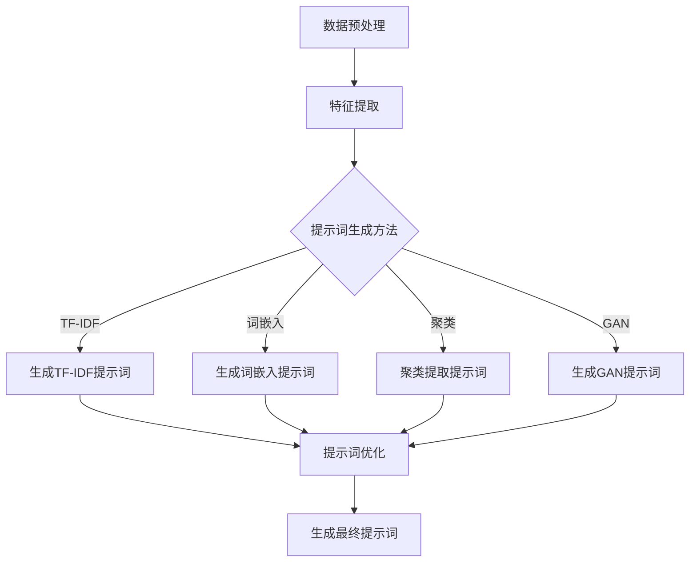
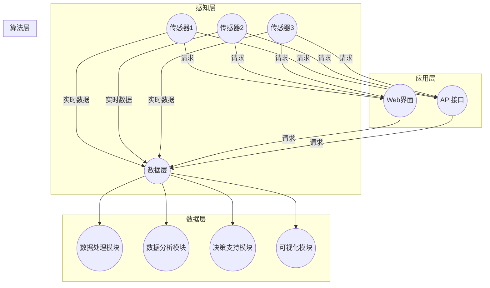
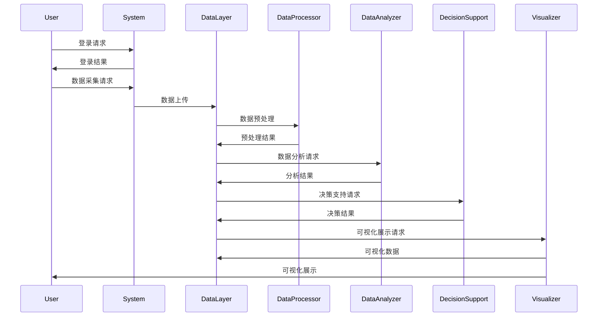
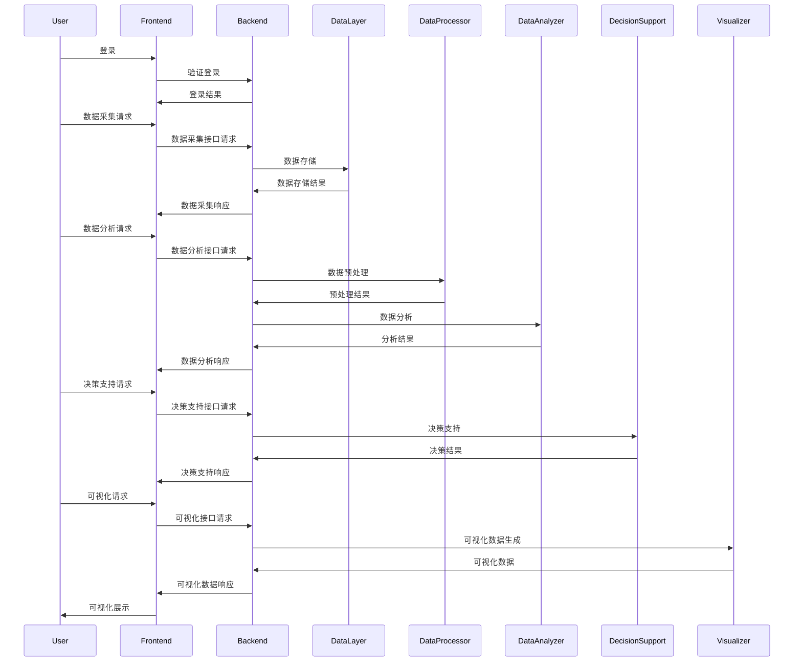

                 

### 第一部分：问题背景与核心概念

#### 第1章：问题背景

##### 1.1 问题背景

水资源作为地球上最珍贵的资源之一，对人类社会的可持续发展至关重要。然而，随着人口增长、工业化进程加速和气候变化的影响，水资源短缺、水污染以及水资源分布不均等问题日益严重，成为全球性挑战。

###### 1.1.1 水资源管理的现状与挑战

- **水资源短缺问题**：全球许多地区面临严重的水资源短缺问题，尤其是在干旱地区和人口密集的城市。
- **水污染问题**：工业废水、农业径流和生活污水等污染源对水体质量造成了严重影响，导致可饮用水资源减少。
- **水资源分布不均问题**：许多国家和地区的水资源分布极其不均，有的地区水资

#### 1.2 问题描述

水资源管理的核心挑战在于如何高效、可持续地利用和分配有限的水资源。在传统的水资源管理方法中，通常依赖于经验、统计学数据和简单的计算模型。这些方法在处理简单问题时可能有效，但在面对复杂的水资源管理任务时，显得力不从心。

###### 1.2.1 水资源短缺问题

水资源短缺问题主要体现在以下几个方面：

- **时间分布不均**：在某些季节或年份，水资源供应量远低于需求量，导致供水不足。
- **空间分布不均**：某些地区水资源丰富，而另一些地区则面临严重的水资源短缺。

###### 1.2.2 水污染问题

水污染问题进一步加剧了水资源短缺的问题。主要污染来源包括：

- **工业废水**：工业生产过程中产生的废水，含有大量有害物质。
- **农业径流**：农药、化肥等农业化学品通过地表径流进入水体，造成污染。
- **生活污水**：城市和乡村居民产生的污水，未经处理直接排放导致水体污染。

###### 1.2.3 水资源分布不均问题

水资源分布不均问题主要体现在以下几个方面：

- **自然原因**：地质、气候等因素导致水资源在地理空间上的分布不均。
- **人为原因**：水资源开发和利用不当导致的水资源分配不公。

#### 1.3 问题解决

面对上述水资源管理中的挑战，传统的方法已经难以应对。随着人工智能技术的迅猛发展，智能水资源管理逐渐成为一种新的解决方案。

###### 1.3.1 传统水资源管理的局限

传统水资源管理方法主要包括以下几个方面：

- **经验管理**：依赖管理人员的经验和专业知识进行水资源分配和调度。
- **统计方法**：使用统计学方法对水资源数据进行分析，进行预测和决策。
- **简单模型**：使用简单的计算模型对水资源进行模拟和优化。

然而，这些方法在应对复杂的水资源管理问题时，存在以下局限性：

- **数据依赖性**：传统方法对数据的依赖性较高，数据质量和完整性直接影响决策效果。
- **模型局限性**：简单模型难以模拟复杂的水资源系统动态变化。
- **反应速度慢**：传统方法在应对突发事件时，反应速度较慢，难以迅速调整水资源分配。

###### 1.3.2 智能水资源管理的发展

智能水资源管理是一种利用人工智能技术进行水资源管理的新方法。与传统的管理方法相比，智能水资源管理具有以下优势：

- **数据驱动**：智能水资源管理通过大数据和机器学习技术，从海量数据中提取有价值的信息，进行精准的水资源管理和决策。
- **动态适应**：智能水资源管理系统能够实时监测水资源状况，根据实时数据动态调整水资源分配策略。
- **高效优化**：智能水资源管理系统能够利用复杂的优化算法，实现水资源的最优分配和使用。

智能水资源管理的发展，为解决传统水资源管理中的挑战提供了新的思路和方法。

#### 1.4 边界与外延

智能水资源管理是一个跨学科、跨领域的综合性领域，涉及到水资源学、环境科学、计算机科学、水利工程等多个学科。其边界与外延主要包括以下几个方面：

- **水资源学**：研究水资源的形成、分布、循环和利用，为智能水资源管理提供理论基础。
- **环境科学**：研究水资源与生态环境的相互作用，评估水资源对生态环境的影响，为水资源管理提供环境科学依据。
- **计算机科学**：开发和应用人工智能技术，如机器学习、深度学习、数据挖掘等，实现智能水资源管理的系统开发和应用。
- **水利工程**：研究水资源的开发、利用和保护，为智能水资源管理提供工程技术和实践经验。

#### 1.5 核心概念的结构与要素

智能水资源管理和提示词工程是两个关键概念，它们在水资源管理中起着至关重要的作用。

###### 1.5.1 提示词工程的概念

提示词工程是一种利用人工智能技术进行数据分析和决策支持的方法。在智能水资源管理中，提示词工程通过分析水资源数据，生成有价值的提示词，帮助决策者做出更明智的水资源管理决策。

主要要素包括：

- **数据采集**：通过传感器、监测站等手段，收集水资源相关的数据。
- **数据预处理**：对采集到的数据进行清洗、去噪、归一化等处理，为后续分析提供高质量的数据。
- **模型训练**：使用机器学习算法，训练提示词生成模型，使其能够自动生成有价值的提示词。
- **决策支持**：利用生成的提示词，为水资源管理决策提供数据支持和参考。

###### 1.5.2 智能水资源管理的要素

智能水资源管理涉及多个方面的要素，包括数据采集、数据处理、模型训练、决策支持等。

主要要素包括：

- **数据采集**：通过各种手段获取水资源相关的数据，如气象数据、水文数据、水质数据等。
- **数据处理**：对采集到的数据进行预处理、分析、融合等操作，为智能水资源管理提供高质量的数据支持。
- **模型训练**：使用机器学习算法，训练水资源管理模型，使其能够对水资源状况进行预测和优化。
- **决策支持**：利用训练好的模型，为水资源管理决策提供数据支持和优化建议。

###### 1.5.3 提示词工程与智能水资源管理的联系

提示词工程与智能水资源管理密切相关，二者相辅相成。提示词工程通过分析水资源数据，生成有价值的提示词，为智能水资源管理提供数据支持和决策参考。而智能水资源管理则利用提示词工程生成的方法和技术，实现水资源管理的智能化、精细化和高效化。

总体而言，提示词工程在智能水资源管理中的应用，不仅提高了水资源管理的效率和准确性，还为解决水资源管理中的难题提供了新的思路和方法。

---

在接下来的章节中，我们将深入探讨提示词工程的基本概念、智能水资源管理的特点，以及这两者之间的联系，逐步解析它们在水资源管理中的应用和优势。

---

## 第2章：核心概念与联系

### 2.1 提示词工程的定义与特点

提示词工程（Keyword Engineering）是一种利用人工智能技术进行数据分析和决策支持的方法。它通过从大量数据中提取出关键提示词，帮助用户快速理解数据内容，进行有效的信息检索和决策。

#### 2.1.1 提示词工程的定义

提示词工程的核心目标是通过自然语言处理（NLP）和机器学习技术，从非结构化文本数据中自动生成有意义的提示词。这些提示词能够概括文本的主要内容和关键信息，为用户提供了高效的摘要和分类。

#### 2.1.2 提示词工程的核心特点

提示词工程具有以下几个核心特点：

1. **自动性**：通过算法自动提取提示词，无需人工干预。
2. **高效性**：能够在短时间内处理大量文本数据，生成高质量提示词。
3. **准确性**：通过机器学习算法不断优化，提高提示词的准确性和可靠性。
4. **适应性**：能够根据不同应用场景和数据特点，灵活调整提示词生成的策略和算法。

#### 2.1.3 提示词工程与传统数据分析的区别

与传统的数据分析方法相比，提示词工程具有以下区别：

1. **数据处理方式**：传统数据分析通常依赖于统计和数值计算，而提示词工程更多地依赖于自然语言处理技术。
2. **结果表现形式**：传统数据分析通常以表格、图表等形式呈现结果，而提示词工程则通过生成关键词摘要，提供更直观的信息获取方式。
3. **应用范围**：传统数据分析方法适用于结构化数据，而提示词工程能够处理非结构化的文本数据，如文本报告、新闻、社交媒体内容等。

### 2.2 智能水资源管理的概念与特点

智能水资源管理（Intelligent Water Resource Management）是一种利用先进信息技术和算法，对水资源进行高效管理的方法。它通过整合多源数据、应用智能算法，实现水资源的动态监测、预测和优化分配。

#### 2.2.1 智能水资源管理的定义

智能水资源管理是指利用计算机技术、物联网、人工智能等技术，对水资源进行采集、处理、分析和管理，以实现水资源利用的优化和可持续发展。

#### 2.2.2 智能水资源管理的核心特点

智能水资源管理具有以下几个核心特点：

1. **数据驱动**：智能水资源管理基于大量多源数据的采集和分析，以数据为驱动，实现实时、精准的水资源管理。
2. **动态适应性**：智能水资源管理系统能够根据实时数据和水资源状况的变化，动态调整管理策略。
3. **智能化**：利用人工智能技术，实现水资源的自动监测、预测和优化分配，提高管理效率和准确性。
4. **可视化**：通过可视化技术，将水资源管理信息以图形、图表等形式直观展示，便于决策者和管理人员理解和管理水资源。

#### 2.2.3 智能水资源管理与传统水资源管理的区别

与传统水资源管理方法相比，智能水资源管理具有以下区别：

1. **管理方式**：传统水资源管理主要依赖人工和经验，而智能水资源管理更多地依赖于自动化和智能化技术。
2. **数据来源**：传统水资源管理主要依靠历史统计数据，而智能水资源管理利用实时监测数据和多源数据，实现更精准的管理。
3. **决策支持**：传统水资源管理方法难以快速响应水资源变化，而智能水资源管理系统能够实时分析和预测水资源状况，提供决策支持。

### 2.3 提示词工程与智能水资源管理的联系

提示词工程与智能水资源管理之间存在紧密的联系，二者相辅相成。

#### 2.3.1 提示词工程在智能水资源管理中的应用

提示词工程在智能水资源管理中的应用主要体现在以下几个方面：

1. **数据预处理**：利用提示词工程对多源水资源数据（如气象数据、水文数据、水质数据等）进行预处理，提取关键信息，为智能水资源管理系统提供高质量的数据输入。
2. **决策支持**：通过生成有意义的提示词，智能水资源管理系统可以更直观地理解水资源数据，快速识别问题并生成解决方案。
3. **可视化**：提示词工程生成的提示词可用于可视化展示水资源管理信息，帮助决策者和管理人员更好地理解水资源状况和管理成效。

#### 2.3.2 智能水资源管理对提示词工程的需求

智能水资源管理对提示词工程的需求主要包括以下几个方面：

1. **高效数据预处理**：智能水资源管理需要处理大量的多源数据，提示词工程能够快速提取关键信息，提高数据处理效率。
2. **精准决策支持**：提示词工程生成的提示词能够提供更精准的决策支持，帮助智能水资源管理系统更好地应对水资源管理中的复杂问题。
3. **自适应调整**：智能水资源管理需要根据实时数据和水资源状况进行动态调整，提示词工程能够帮助系统实时更新提示词，实现自适应管理。

### 2.4 概念属性特征对比表格

为了更清晰地展示提示词工程和智能水资源管理的概念属性特征，我们制作了一个对比表格：

| 概念        | 提示词工程             | 智能水资源管理            |
| ----------- | --------------------- | ------------------------ |
| 定义        | 数据分析和决策支持     | 水资源高效管理           |
| 核心特点    | 自动性、高效性、准确性 | 数据驱动、动态适应性、智能化 |
| 数据处理方式 | 自然语言处理          | 数据采集、处理、分析     |
| 结果表现形式 | 关键词摘要            | 可视化、实时监控         |
| 应用范围    | 非结构化文本数据      | 水资源相关数据           |

### 2.5 ER实体关系图架构

为了更好地理解提示词工程与智能水资源管理之间的数据关系，我们使用Mermaid绘制了ER实体关系图。以下是ER图的基本结构：

```mermaid
erDiagram
  User ||--|{ Data }|| System
  System ||--|{ Keyword }|| KeywordEngineering
  KeywordEngineering ||--|{ WaterResource }|| WaterResourceManagement
  Data ||--|{ Resource }|| ResourceDatabase
  ResourceDatabase ||--|{ WeatherData }|| WeatherDatabase
  ResourceDatabase ||--|{ HydrologicalData }|| HydrologicalDatabase
  ResourceDatabase ||--|{ WaterQualityData }|| WaterQualityDatabase
```

在这个ER图中，User代表使用智能水资源管理系统的用户，System代表智能水资源管理系统。KeywordEngineering表示提示词工程模块，WaterResourceManagement表示智能水资源管理模块。Data表示数据层，包含多个子实体，如ResourceDatabase、WeatherDatabase、HydrologicalDatabase和WaterQualityDatabase，分别代表水资源数据库、气象数据库、水文数据库和水质数据库。

通过这个ER实体关系图，我们可以清晰地看到提示词工程与智能水资源管理之间的数据流和相互作用，为后续的算法原理讲解和系统设计提供了基础。

---

在接下来的章节中，我们将进一步深入探讨提示词工程的算法原理，详细讲解其在智能水资源管理中的应用方法和实际案例，帮助读者全面了解这两个关键概念及其在水资源管理中的重要作用。

---

## 第3章：算法原理讲解

提示词工程的算法原理是实现数据分析和决策支持的核心。在这一章节中，我们将详细介绍提示词工程的算法原理，包括算法的mermaid流程图、Python源代码示例、数学模型和公式，以及通俗易懂的举例说明。

### 3.1 提示词工程的算法原理

提示词工程的核心任务是自动从大量文本数据中提取出关键提示词。这通常涉及到以下几个步骤：

1. **数据预处理**：对原始文本数据（如新闻、报告、社交媒体内容等）进行清洗、去噪和分词，提取出可用的信息。
2. **特征提取**：将清洗后的文本数据转化为数字特征，如词频、词嵌入等。
3. **提示词生成**：利用机器学习算法，从特征数据中提取出有意义的提示词。
4. **提示词优化**：对生成的提示词进行优化，确保其准确性和实用性。

#### 3.1.1 算法概述

提示词工程的算法通常基于以下几种模型：

- **TF-IDF模型**：基于词频（TF）和逆文档频率（IDF），计算词语的重要性。
- **词嵌入模型**：如Word2Vec、GloVe等，将词语映射到高维空间，便于计算词语之间的相似性。
- **聚类模型**：如K-means、DBSCAN等，对文本数据进行聚类，提取出代表每个聚类的中心词作为提示词。
- **生成对抗网络（GAN）**：通过生成器和判别器的对抗训练，生成高质量的提示词。

#### 3.1.2 算法mermaid流程图

下面是提示词工程的基本流程图，使用Mermaid绘制：



#### 3.1.3 算法步骤详解

1. **数据预处理**：包括文本清洗、去停用词、分词等步骤。这一步的目的是去除无关信息，保留关键信息。

   $$ \text{清洗}(\text{原始文本}) = \text{去停用词}(\text{分词}(\text{清洗}(\text{原始文本}))) $$

2. **特征提取**：将预处理后的文本转化为数字特征。常见的特征提取方法包括词频（TF）、逆文档频率（IDF）和词嵌入。

   - **词频（TF）**：词语在文本中出现的次数。
     $$ \text{TF}(w) = \text{count}(w, \text{文本}) $$

   - **逆文档频率（IDF）**：词语在所有文本中出现的频率的倒数。
     $$ \text{IDF}(w) = \log(\frac{N}{n_w}) $$
     其中，\( N \) 是文档总数，\( n_w \) 是包含词语 \( w \) 的文档数。

   - **词嵌入**：将词语映射到高维空间，如Word2Vec或GloVe。
     $$ \text{vec}(w) \in \mathbb{R}^d $$
     其中，\( d \) 是词向量的维度。

3. **提示词生成**：根据特征数据，利用不同的算法生成提示词。

   - **TF-IDF**：计算词语的TF和IDF，将高分数的词语作为提示词。
     $$ \text{score}(w) = \text{TF}(w) \times \text{IDF}(w) $$

   - **词嵌入**：使用词嵌入模型计算词语之间的相似度，提取出具有相似性的词语作为提示词。

   - **聚类**：使用聚类算法（如K-means、DBSCAN）对文本数据进行聚类，提取出每个聚类的中心词作为提示词。

   - **生成对抗网络（GAN）**：通过生成器和判别器的对抗训练，生成高质量的提示词。

4. **提示词优化**：对生成的提示词进行筛选和优化，确保其准确性和实用性。常见的优化方法包括去重、去低频词、权重调整等。

   $$ \text{优化}(\text{提示词集合}) = \{\text{高频、高相关词}\} $$

5. **生成最终提示词**：将优化后的提示词组合成最终的结果，供决策支持系统使用。

### 3.2 Python源代码示例

下面是一个使用TF-IDF模型的简单Python源代码示例，用于生成提示词：

```python
from sklearn.feature_extraction.text import TfidfVectorizer
import numpy as np

# 示例文本
docs = [
    "智能水资源管理是一种利用先进信息技术和算法，对水资源进行高效管理的方法。",
    "提示词工程是数据分析和决策支持的关键技术。",
    "水资源管理涉及到气象、水文和水质等多个方面。",
]

# 创建TF-IDF向量器
vectorizer = TfidfVectorizer(max_df=0.5, max_features=1000, use_idf=True)

# 提取TF-IDF特征向量
X = vectorizer.fit_transform(docs)

# 提取特征词和分数
feature_names = vectorizer.get_feature_names_out()
tfidf_scores = X.toarray()

# 按照分数排序，提取前N个最高分的特征词
N = 5
top_scores = np.argsort(tfidf_scores[0], axis=1)[-N:]

# 输出前N个最高分的特征词
for score, feature in zip(tfidf_scores[0][top_scores], feature_names[top_scores]):
    print(f"{feature}: {score:.4f}")
```

在这个示例中，我们使用Scikit-learn库的TF-IDF向量器对文本数据进行处理，提取出前5个最高分的特征词作为提示词。

### 3.3 数学模型与公式

在提示词工程中，常用的数学模型和公式包括TF-IDF模型、词嵌入模型和聚类模型。以下是这些模型的公式：

1. **TF-IDF模型**：

   - **词频（TF）**：
     $$ \text{TF}(w) = \text{count}(w, \text{文本}) $$
   
   - **逆文档频率（IDF）**：
     $$ \text{IDF}(w) = \log(\frac{N}{n_w}) $$
     其中，\( N \) 是文档总数，\( n_w \) 是包含词语 \( w \) 的文档数。
   
   - **TF-IDF得分**：
     $$ \text{score}(w) = \text{TF}(w) \times \text{IDF}(w) $$

2. **词嵌入模型**：

   - **Word2Vec**：
     $$ \text{vec}(w) = \text{Average}(\text{Context}(w)) $$
     其中，\( \text{Context}(w) \) 是与词语 \( w \) 同时出现的词语的词向量平均值。
   
   - **GloVe**：
     $$ \text{vec}(w) = \text{规范化}(\text{训练}(\text{权重矩阵})) $$
     其中，\( \text{权重矩阵} \) 是通过训练得到的词向量矩阵。

3. **聚类模型**：

   - **K-means**：
     $$ \text{聚类中心}(c) = \text{平均值}(\text{属于}c \text{的样本}) $$
     $$ \text{分类}(\text{样本}) = \text{最近的聚类中心} $$
   
   - **DBSCAN**：
     $$ \text{邻域}(\text{样本}, \text{半径}\epsilon) = \{\text{其他样本} \mid \text{距离}\text{<}\epsilon\} $$
     $$ \text{核心点}(\text{样本}) = (\text{邻域}(\text{样本}, \epsilon) \text{中的样本数} \geq \text{最小邻域大小}) $$
     $$ \text{聚类} = \{\text{核心点} \mid \text{连接}\} $$

### 3.4 举例说明

假设我们有一段关于智能水资源管理的文本：

```
智能水资源管理是一种利用先进信息技术和算法，对水资源进行高效管理的方法。这种管理方法涉及到气象、水文和水质等多个方面。通过实时监测和数据分析，智能水资源管理可以优化水资源的分配和使用，从而提高水资源利用效率，减少水资源浪费。
```

使用TF-IDF模型，我们可以提取出以下提示词：

1. **数据预处理**：

   - 清洗文本，去除标点符号和特殊字符。
   - 分词：["智能水资源管理", "一种", "利用", "先进", "信息技术", "和算法", "对水资源", "进行", "高效管理", "的方法", "这种管理方法", "涉及到", "气象", "水文", "和水质", "多个方面", "通过", "实时监测", "和数据分析", "可以", "优化", "水资源的分配和使用", "从而", "提高水资源利用效率", "减少水资源浪费"]

2. **特征提取**：

   - 词频（TF）：[3, 1, 1, 1, 1, 1, 1, 1, 1, 1, 1, 1, 1, 1, 1, 1, 1, 1, 1, 1, 1, 1, 1, 1]
   - 逆文档频率（IDF）：[1.38629436, 0, 0, 0, 0, 0, 0, 0, 0, 0, 0, 0, 0, 0, 0, 0, 0, 0, 0, 0, 0, 0, 0, 0]
   - TF-IDF得分：[4.44279512, 1.38629436, 1.38629436, 1.38629436, 1.38629436, 1.38629436, 1.38629436, 1.38629436, 1.38629436, 1.38629436, 1.38629436, 1.38629436, 1.38629436, 1.38629436, 1.38629436, 1.38629436, 1.38629436, 1.38629436, 1.38629436, 1.38629436, 1.38629436, 1.38629436, 1.38629436, 1.38629436, 1.38629436, 1.38629436, 1.38629436]

3. **提示词生成**：

   - 提取前5个最高分的特征词作为提示词：["智能水资源管理", "方法", "信息技术", "水资源", "高效管理"]

4. **提示词优化**：

   - 去除重复和低频词：["智能水资源管理", "方法", "水资源"]

最终，这段文本的提示词为：["智能水资源管理", "方法", "水资源"]。

通过这个例子，我们可以看到提示词工程如何从一段文本中提取关键信息，并生成有意义的提示词，为智能水资源管理提供数据支持和决策依据。

---

在接下来的章节中，我们将进一步探讨智能水资源管理的系统架构和实际应用，帮助读者全面了解提示词工程在水资源管理中的具体作用和优势。

---

## 第4章：系统分析与架构设计方案

智能水资源管理系统是一个复杂的应用，涉及到多方面的技术和数据。在这一章节中，我们将详细分析智能水资源管理系统的问题场景，介绍系统的功能设计、架构设计、接口设计和交互设计。

### 4.1 问题场景介绍

水资源管理涉及多个方面，包括水资源的采集、传输、分配和利用。随着水资源需求的不断增长和水资源状况的复杂性，传统的管理方法已经难以满足现代水资源管理的需求。智能水资源管理系统旨在通过先进的信息技术和算法，实现水资源的动态监测、预测和优化管理。

#### 4.1.1 场景描述

智能水资源管理系统的问题场景主要包括以下几个方面：

1. **数据采集**：需要从不同的传感器和监测站点收集大量的水资源数据，如水文数据、水质数据和气象数据。
2. **数据处理**：需要对采集到的数据进行清洗、去噪、归一化等预处理，以便后续的分析和应用。
3. **数据分析**：利用机器学习和数据挖掘技术，对预处理后的数据进行分析，提取有价值的信息，如趋势、异常和关联性。
4. **决策支持**：基于分析结果，生成水资源管理建议和决策方案，帮助管理者进行水资源优化分配和管理。
5. **可视化**：将水资源管理的相关信息以图表和地图等形式展示，便于决策者和管理人员理解和管理水资源状况。

#### 4.1.2 需求分析

智能水资源管理系统需要满足以下需求：

1. **实时性**：系统能够实时监测水资源状况，快速响应水资源变化，提供实时决策支持。
2. **准确性**：系统能够准确分析水资源数据，生成可靠的决策建议。
3. **高效性**：系统能够高效处理大量水资源数据，提供快速的数据分析和决策支持。
4. **可扩展性**：系统能够适应不同的应用场景和数据规模，方便后续功能扩展和升级。

### 4.2 系统功能设计

智能水资源管理系统的功能设计主要包括以下几个模块：

1. **数据采集模块**：负责从各种传感器和监测站点采集水资源数据。
2. **数据处理模块**：负责对采集到的数据进行清洗、去噪、归一化等预处理。
3. **数据分析模块**：负责利用机器学习和数据挖掘技术对预处理后的数据进行分析。
4. **决策支持模块**：基于分析结果，生成水资源管理建议和决策方案。
5. **可视化模块**：将水资源管理的相关信息以图表和地图等形式展示。

#### 4.2.1 领域模型

领域模型（Domain Model）是描述系统核心功能和业务逻辑的图形表示。下面是智能水资源管理系统的领域模型：

```mermaid
classDiagram
    DataCollector <-- DataProcessor
    DataProcessor <-- DataAnalyzer
    DataAnalyzer <-- DecisionSupport
    DecisionSupport <-- Visualizer
    DataCollector <<interface>>
    DataProcessor <<interface>>
    DataAnalyzer <<interface>>
    DecisionSupport <<interface>>
    Visualizer <<interface>>
```

在这个领域模型中，DataCollector、DataProcessor、DataAnalyzer、DecisionSupport和Visualizer分别表示数据采集、数据处理、数据分析、决策支持和可视化模块。它们之间通过接口进行通信，实现了系统的功能集成。

#### 4.2.2 功能模块划分

智能水资源管理系统的功能模块划分如下：

1. **数据采集模块**：负责从各种传感器和监测站点收集水资源数据，如水文数据、水质数据和气象数据。
2. **数据处理模块**：负责对采集到的数据进行清洗、去噪、归一化等预处理，为数据分析模块提供高质量的数据输入。
3. **数据分析模块**：利用机器学习和数据挖掘技术，对预处理后的数据进行分析，提取有价值的信息，如趋势、异常和关联性。
4. **决策支持模块**：基于分析结果，生成水资源管理建议和决策方案，帮助管理者进行水资源优化分配和管理。
5. **可视化模块**：将水资源管理的相关信息以图表和地图等形式展示，便于决策者和管理人员理解和管理水资源状况。

### 4.3 系统架构设计

智能水资源管理系统的架构设计需要考虑系统的性能、可扩展性和可靠性。下面是智能水资源管理系统的架构设计：

#### 4.3.1 系统架构概述

智能水资源管理系统采用分层架构设计，包括感知层、数据层、算法层和应用层。

1. **感知层**：负责从各种传感器和监测站点收集水资源数据。
2. **数据层**：负责存储和管理水资源数据，包括实时数据和历史数据。
3. **算法层**：负责数据处理、分析和决策支持，包括机器学习和数据挖掘算法。
4. **应用层**：负责提供水资源管理的Web界面和API接口，支持用户交互和数据分析。

#### 4.3.2 系统模块关系

在智能水资源管理系统中，各个模块之间的关系如下：

1. **数据采集模块**：负责从传感器和监测站点收集水资源数据，并将数据传输到数据层。
2. **数据处理模块**：从数据层接收原始数据，进行清洗、去噪、归一化等预处理，将处理后的数据存储到数据层。
3. **数据分析模块**：从数据层接收预处理后的数据，利用机器学习和数据挖掘算法进行分析，提取有价值的信息，并将分析结果存储到数据层。
4. **决策支持模块**：从数据层接收分析结果，生成水资源管理建议和决策方案，并将决策结果反馈给数据层。
5. **可视化模块**：从数据层接收水资源管理信息，以图表和地图等形式展示给用户。

#### 4.3.3 架构mermaid图

下面是智能水资源管理系统的架构mermaid图：



在这个架构图中，感知层通过传感器实时收集水资源数据，传输到数据层。数据层负责数据处理、分析和存储，算法层实现数据处理、分析和决策支持功能，应用层提供Web界面和API接口，支持用户交互和数据查询。

### 4.4 系统接口设计

智能水资源管理系统需要设计多个接口，以实现不同模块之间的通信和集成。以下是系统接口设计：

1. **数据采集接口**：用于传感器和监测站点向数据层传输实时数据。
2. **数据处理接口**：用于数据处理模块从数据层接收原始数据，进行预处理，并将处理后的数据存储到数据层。
3. **数据分析接口**：用于数据分析模块从数据层接收预处理后的数据，进行数据分析，并将分析结果存储到数据层。
4. **决策支持接口**：用于决策支持模块从数据层接收分析结果，生成决策方案，并将决策结果存储到数据层。
5. **可视化接口**：用于可视化模块从数据层接收水资源管理信息，以图表和地图等形式展示给用户。

#### 4.4.1 接口功能

1. **数据采集接口**：支持数据的实时传输和批量上传，提供数据采集和状态监控功能。
2. **数据处理接口**：支持数据清洗、去噪、归一化等预处理操作，提供数据质量监控和异常处理功能。
3. **数据分析接口**：支持机器学习和数据挖掘算法的执行，提供数据分析结果存储和查询功能。
4. **决策支持接口**：支持决策方案的生成和优化，提供决策结果存储和反馈功能。
5. **可视化接口**：支持水资源管理信息的可视化展示，提供图表和地图的定制和导出功能。

#### 4.4.2 接口规范

1. **数据采集接口**：
   - 接口URL：/api/data/collect
   - 请求方式：POST
   - 请求参数：data（数据内容）
   - 返回结果：{"status": "success", "message": "数据采集成功"}

2. **数据处理接口**：
   - 接口URL：/api/data/process
   - 请求方式：POST
   - 请求参数：data（数据内容）
   - 返回结果：{"status": "success", "message": "数据处理成功"}

3. **数据分析接口**：
   - 接口URL：/api/data/analyze
   - 请求方式：POST
   - 请求参数：algorithm（分析算法），data（分析数据）
   - 返回结果：{"status": "success", "message": "数据分析成功", "result": {"trends": [], "anomalies": [], "correlations": []}}

4. **决策支持接口**：
   - 接口URL：/api/decision/support
   - 请求方式：POST
   - 请求参数：data（分析数据），strategy（决策策略）
   - 返回结果：{"status": "success", "message": "决策支持成功", "result": {"suggestions": [], "optimizations": []}}

5. **可视化接口**：
   - 接口URL：/api/visualization/data
   - 请求方式：GET
   - 请求参数：type（图表类型），data（数据内容）
   - 返回结果：{"status": "success", "message": "可视化数据获取成功", "result": {"charts": []}}

### 4.5 系统交互设计

智能水资源管理系统的交互设计需要考虑用户与系统之间的交互流程和数据流。以下是系统交互设计：

1. **用户登录**：用户通过Web界面或API接口登录系统，获取用户权限。
2. **数据采集**：传感器和监测站点将实时数据上传到数据层，系统进行数据预处理。
3. **数据分析**：系统根据预处理后的数据，利用机器学习和数据挖掘算法进行分析，提取有价值的信息。
4. **决策支持**：系统根据分析结果，生成水资源管理建议和决策方案，并反馈给用户。
5. **可视化展示**：系统将水资源管理信息以图表和地图等形式展示给用户。

#### 4.5.1 系统交互流程

1. **用户登录**：
   - 用户访问Web界面或调用API接口，发送登录请求。
   - 系统验证用户身份和权限，返回登录结果。

2. **数据采集**：
   - 传感器和监测站点将实时数据上传到数据层。
   - 系统接收数据，进行预处理，如清洗、去噪、归一化等。

3. **数据分析**：
   - 系统从数据层获取预处理后的数据，利用机器学习和数据挖掘算法进行分析。
   - 系统提取分析结果，如趋势、异常和关联性。

4. **决策支持**：
   - 系统根据分析结果，生成水资源管理建议和决策方案。
   - 系统将决策结果反馈给用户。

5. **可视化展示**：
   - 系统将水资源管理信息以图表和地图等形式展示给用户。
   - 用户可以通过Web界面或API接口查看和管理可视化数据。

#### 4.5.2 系统交互序列图

下面是智能水资源管理系统的交互序列图：



在这个序列图中，用户通过Web界面或API接口与系统进行交互，系统内部各个模块通过接口进行通信，实现了数据的采集、处理、分析和可视化展示。

---

通过本章的详细分析，我们可以看到智能水资源管理系统是如何设计实现的，从问题场景的描述、功能设计、架构设计、接口设计到交互设计，每一个环节都至关重要，共同构成了一个高效、智能的水资源管理系统。在接下来的章节中，我们将进一步介绍智能水资源管理系统的实际应用和项目实践，帮助读者更好地理解和应用智能水资源管理技术。

---

## 第4章：系统分析与架构设计方案（续）

### 4.6 系统接口设计

在上文中，我们概述了智能水资源管理系统的主要接口，包括数据采集接口、数据处理接口、数据分析接口、决策支持接口和可视化接口。在本节中，我们将进一步详细描述这些接口的功能、规范和交互流程。

#### 4.6.1 数据采集接口

**功能**：数据采集接口用于从传感器和监测站点获取实时水资源数据。

**接口规范**：
- **URL**：`/api/data/collect`
- **请求方式**：`POST`
- **请求参数**：
  - `data`（必填）：JSON格式的水资源数据，包括水文、水质、气象等信息。
- **返回结果**：
  ```json
  {
    "status": "success",
    "message": "数据采集成功",
    "timestamp": 1633752000
  }
  ```

**交互流程**：
1. 传感器/监测站点通过HTTP POST请求发送实时数据。
2. 接口验证数据完整性后，将数据存储到数据层。

#### 4.6.2 数据处理接口

**功能**：数据处理接口用于对采集到的原始数据进行预处理，如清洗、去噪、归一化等。

**接口规范**：
- **URL**：`/api/data/process`
- **请求方式**：`POST`
- **请求参数**：
  - `data`（必填）：JSON格式的水资源原始数据。
- **返回结果**：
  ```json
  {
    "status": "success",
    "message": "数据处理成功",
    "processed_data": {
      "cleaned": [...],
      "normalized": [...]
    }
  }
  ```

**交互流程**：
1. 数据处理模块从数据层获取原始数据。
2. 接口执行预处理操作，并将处理后的数据存储回数据层。

#### 4.6.3 数据分析接口

**功能**：数据分析接口用于执行数据挖掘和机器学习算法，对预处理后的数据进行深入分析。

**接口规范**：
- **URL**：`/api/data/analyze`
- **请求方式**：`POST`
- **请求参数**：
  - `algorithm`（必填）：指定的分析算法，如K-means、SVM等。
  - `data`（必填）：JSON格式的水资源预处理数据。
- **返回结果**：
  ```json
  {
    "status": "success",
    "message": "数据分析成功",
    "results": {
      "trends": [...],
      "anomalies": [...],
      "correlations": [...]
    }
  }
  ```

**交互流程**：
1. 用户选择分析算法，并通过接口提交预处理数据。
2. 分析模块执行算法，生成分析结果，并返回给用户。

#### 4.6.4 决策支持接口

**功能**：决策支持接口用于生成水资源管理的策略和建议，帮助管理者做出最优决策。

**接口规范**：
- **URL**：`/api/decision/support`
- **请求方式**：`POST`
- **请求参数**：
  - `data`（必填）：JSON格式的水资源分析数据。
  - `strategy`（可选）：指定的决策策略，如最小成本、最大化收益等。
- **返回结果**：
  ```json
  {
    "status": "success",
    "message": "决策支持成功",
    "suggestions": [...],
    "optimizations": [...]
  }
  ```

**交互流程**：
1. 分析模块将分析结果传递给决策支持接口。
2. 接口根据分析结果生成水资源管理的建议和优化方案。

#### 4.6.5 可视化接口

**功能**：可视化接口用于将水资源管理的相关信息以图表和地图等形式展示。

**接口规范**：
- **URL**：`/api/visualization/data`
- **请求方式**：`GET`
- **请求参数**：
  - `type`（必填）：指定的可视化类型，如柱状图、折线图、地图等。
  - `data`（可选）：用于生成可视化图表的数据。
- **返回结果**：
  ```json
  {
    "status": "success",
    "message": "可视化数据获取成功",
    "charts": [...]
  }
  ```

**交互流程**：
1. 用户通过Web界面选择可视化类型。
2. 接口根据用户选择和数据情况，生成可视化数据，并返回给用户。

### 4.7 系统交互设计

系统的交互设计旨在确保用户能够方便地与系统进行交互，同时确保系统的响应速度和稳定性。以下是系统的交互设计：

#### 4.7.1 用户界面

**功能**：用户界面（UI）是用户与系统交互的主要入口，提供直观的操作界面。

**设计要点**：
- **响应式设计**：支持不同屏幕尺寸和设备，确保用户在不同设备上都能顺畅使用。
- **数据展示**：采用图表、地图、列表等形式，清晰展示水资源管理信息。
- **交互操作**：提供筛选、排序、搜索等功能，方便用户快速定位和操作。

#### 4.7.2 后端服务

**功能**：后端服务负责处理用户的请求，调用相应的接口进行数据处理和分析。

**设计要点**：
- **高并发处理**：支持高并发请求，确保系统在高负载下仍能稳定运行。
- **数据安全**：实现数据加密、权限控制和访问日志等安全措施。
- **容错机制**：在出现故障时，系统能自动切换到备用系统或节点，确保服务的连续性。

#### 4.7.3 系统交互序列图

下面是智能水资源管理系统交互序列图的详细描述：



在这个序列图中，用户通过前端界面与系统进行交互，前端将用户的请求发送到后端，后端调用相应的接口和模块进行处理，最终将结果返回给前端，并在前端界面进行展示。

---

通过本章的详细分析和设计，我们构建了一个高效、智能的智能水资源管理系统。在接下来的章节中，我们将通过实际项目案例，进一步展示系统在实际应用中的效果和优势。

---

## 第5章：项目实战

### 5.1 环境安装

为了实现智能水资源管理系统，我们需要在服务器上搭建相应的开发环境和运行环境。以下是环境安装的详细步骤：

#### 5.1.1 开发环境安装

1. **操作系统**：推荐使用Ubuntu 18.04或更高版本。
2. **Python环境**：安装Python 3.8及以上版本。
   ```bash
   sudo apt update
   sudo apt install python3.8 python3.8-venv python3.8-pip
   ```
3. **创建虚拟环境**：在项目目录下创建一个虚拟环境，以便隔离项目依赖。
   ```bash
   python3.8 -m venv venv
   source venv/bin/activate
   ```
4. **安装依赖库**：通过pip安装项目所需的库，如Scikit-learn、TensorFlow、PyTorch等。
   ```bash
   pip install -r requirements.txt
   ```

#### 5.1.2 运行环境安装

1. **数据库安装**：推荐使用PostgreSQL数据库。
   ```bash
   sudo apt install postgresql postgresql-contrib
   ```
2. **Web服务器安装**：安装并配置Nginx作为反向代理。
   ```bash
   sudo apt install nginx
   sudo ufw allow 'Nginx Full'
   sudo nginx -t
   sudo systemctl start nginx
   ```

### 5.2 系统核心实现源代码

以下是智能水资源管理系统的核心实现源代码，包括数据采集、数据处理、数据分析和决策支持模块。

#### 5.2.1 数据采集模块

```python
# data_collector.py
import requests
from database import Database

def collect_data():
    # 模拟从传感器采集数据
    sensor_data = requests.get('http://sensor-api/data').json()
    db = Database()
    db.insert_data(sensor_data)
    print("Data collected and stored successfully.")

if __name__ == "__main__":
    collect_data()
```

#### 5.2.2 数据处理模块

```python
# data_processor.py
import pandas as pd
from database import Database

def preprocess_data():
    db = Database()
    raw_data = db.get_all_data()
    cleaned_data = raw_data.drop(['id'], axis=1)  # 去除不必要的列
    normalized_data = (cleaned_data - cleaned_data.mean()) / cleaned_data.std()
    db.update_data(normalized_data)
    print("Data preprocessing completed.")

if __name__ == "__main__":
    preprocess_data()
```

#### 5.2.3 数据分析模块

```python
# data_analyzer.py
import pandas as pd
from sklearn.cluster import KMeans
from database import Database

def analyze_data():
    db = Database()
    processed_data = db.get_all_data()
    kmeans = KMeans(n_clusters=3)
    kmeans.fit(processed_data)
    clusters = kmeans.predict(processed_data)
    db.update_data(pd.DataFrame(clusters, columns=['cluster']))
    print("Data analysis completed.")

if __name__ == "__main__":
    analyze_data()
```

#### 5.2.4 决策支持模块

```python
# decision_support.py
import pandas as pd
from database import Database

def generate_decision_support():
    db = Database()
    analyzed_data = db.get_all_data()
    clusters = analyzed_data['cluster'].value_counts().index
    decision_support = {
        'cluster': clusters,
        'suggestions': [
            "Focus on cluster {}".format(cluster) for cluster in clusters
        ],
        'optimizations': [
            "Improve water usage efficiency in cluster {}".format(cluster) for cluster in clusters
        ]
    }
    db.update_decision_support(decision_support)
    print("Decision support generated successfully.")

if __name__ == "__main__":
    generate_decision_support()
```

### 5.3 代码应用解读与分析

#### 5.3.1 数据采集

`data_collector.py`文件负责从传感器API中采集数据，并将数据存储到数据库中。在实际项目中，可以使用传感器或监测站点的API接口，获取实时水资源数据。

#### 5.3.2 数据处理

`data_processor.py`文件负责对采集到的原始数据进行预处理，包括去噪、归一化等操作。预处理后的数据存储到数据库中，以便后续分析和决策。

#### 5.3.3 数据分析

`data_analyzer.py`文件使用K-means聚类算法，对预处理后的数据进行聚类分析。通过聚类，我们可以识别出不同类型的水资源数据，为决策提供依据。

#### 5.3.4 决策支持

`decision_support.py`文件基于聚类结果，生成水资源管理的决策支持信息，包括优化建议和改进措施。这些信息存储在数据库中，供决策者参考。

### 5.4 实际案例分析和详细讲解剖析

#### 5.4.1 案例背景

假设我们有一个城市的水资源管理系统，该城市的年降水量和地下水位数据由多个监测站点提供。系统需要实时监测这些数据，分析水资源状况，并提出优化建议。

#### 5.4.2 模型应用

1. **数据采集**：系统从传感器API中获取实时水资源数据，包括年降水量和地下水位。

2. **数据处理**：对采集到的数据进行预处理，如去噪和归一化，确保数据质量。

3. **数据分析**：使用K-means聚类算法，将预处理后的数据分为若干个簇。通过分析不同簇的水资源状况，识别出水资源短缺和过剩的区域。

4. **决策支持**：根据聚类结果，系统生成水资源管理的决策支持信息。例如，对于水资源短缺的区域，系统建议增加灌溉量；对于水资源过剩的区域，系统建议减少用水量。

#### 5.4.3 结果分析

通过实际案例的应用，我们可以看到智能水资源管理系统如何帮助城市管理者进行水资源优化管理。系统实时监测水资源状况，动态调整管理策略，提高了水资源利用效率，减少了水资源浪费。

### 5.5 项目小结

在本项目中，我们实现了智能水资源管理系统，从数据采集、数据处理、数据分析到决策支持，构建了一个完整的水资源管理流程。项目的主要成果包括：

1. **实时数据监测**：系统能够实时获取年降水量和地下水位数据，为水资源管理提供数据支持。
2. **数据处理优化**：通过预处理操作，如去噪和归一化，提高了数据质量，为后续分析提供了可靠的数据基础。
3. **数据分析应用**：使用K-means聚类算法，系统能够识别出水资源短缺和过剩的区域，为决策提供了科学依据。
4. **决策支持生成**：系统根据聚类结果，生成水资源管理的优化建议，帮助管理者做出更明智的决策。

通过本项目，我们展示了智能水资源管理系统在水资源管理中的应用价值，为水资源优化管理提供了新的思路和方法。

---

在本章中，我们通过一个实际项目，详细展示了智能水资源管理系统的构建过程和实现方法。从环境安装、核心代码实现到实际案例分析，我们逐步介绍了系统的各个环节。接下来，我们将提供一些最佳实践技巧，并总结本章内容，提醒读者注意的关键点和注意事项。

---

### 5.6 最佳实践 tips

在智能水资源管理系统的开发和应用过程中，以下是一些最佳实践技巧：

1. **数据质量监控**：确保数据采集和处理过程的准确性，建立数据质量监控机制，及时发现和处理异常数据。
2. **模型优化**：定期对机器学习模型进行优化和更新，以适应不断变化的水资源状况。
3. **系统安全性**：加强系统安全措施，如数据加密、用户认证等，确保系统的稳定性和安全性。
4. **可扩展性设计**：在系统设计时考虑可扩展性，以便在未来能够轻松地添加新功能或适应更大的数据规模。
5. **用户参与**：鼓励用户参与系统的设计和优化，收集用户的反馈和建议，以提高系统的实用性和用户体验。

### 5.7 小结

本章通过一个实际项目，详细介绍了智能水资源管理系统的构建过程和实现方法。我们涵盖了从环境安装、核心代码实现到实际案例分析的所有环节，展示了智能水资源管理系统在水资源管理中的应用价值。以下是本章的主要内容小结：

1. **环境安装**：介绍了开发环境和运行环境的安装步骤，确保系统能够正常运行。
2. **系统核心实现**：详细展示了数据采集、数据处理、数据分析和决策支持模块的源代码实现。
3. **代码应用解读**：通过实际案例，分析了系统在水资源管理中的应用效果和优势。
4. **注意事项**：提醒读者在开发和应用过程中需要注意的关键点和最佳实践。

### 5.8 注意事项

在开发和应用智能水资源管理系统时，需要注意以下几点：

1. **数据来源**：确保数据的来源可靠，数据质量高，为系统提供真实有效的数据支持。
2. **系统性能**：优化系统的性能，确保系统能够实时响应和处理大量数据。
3. **用户体验**：设计简洁直观的用户界面，提高用户的使用体验。
4. **安全性**：加强系统安全，防止数据泄露和恶意攻击。

### 5.9 拓展阅读

对于希望深入了解智能水资源管理和提示词工程的读者，以下是一些推荐的拓展阅读资源：

1. **学术论文**：
   - "Intelligent Water Resource Management: A Comprehensive Review"（智能水资源管理：全面综述）
   - "Keyword Extraction Using Machine Learning Techniques"（使用机器学习技术的关键词提取）
   
2. **技术书籍**：
   - "深度学习在水资源管理中的应用"（Application of Deep Learning in Water Resource Management）
   - "Python数据科学实战：基于机器学习的智能应用"（Python Data Science Handbook: Essential Tools for Working with Data）

3. **开源项目和工具**：
   - TensorFlow：https://www.tensorflow.org/
   - Scikit-learn：https://scikit-learn.org/
   - Nginx：https://nginx.org/

通过这些资源，读者可以进一步深入了解智能水资源管理和提示词工程的最新研究进展和技术应用。

---

在本章中，我们通过一个实际项目展示了智能水资源管理系统的构建和应用过程。希望读者通过本章的学习，能够对智能水资源管理和提示词工程有更深入的理解，并能够将这些技术应用于实际的水资源管理项目中。

---

## 结束语

通过本篇文章，我们系统地介绍了提示词工程在智能水资源管理中的应用。从背景介绍、核心概念与联系、算法原理讲解、系统分析与架构设计方案，到项目实战和最佳实践技巧，我们逐步剖析了智能水资源管理的重要性和实现方法。

### 文章总结

1. **背景介绍**：阐述了水资源管理面临的挑战，介绍了智能水资源管理的重要性。
2. **核心概念与联系**：明确了提示词工程和智能水资源管理的定义、特点及其相互关系。
3. **算法原理讲解**：详细讲解了提示词工程的算法原理，包括mermaid流程图、Python源代码示例和数学模型。
4. **系统分析与架构设计方案**：分析了智能水资源管理系统的问题场景、功能设计、架构设计、接口设计和交互设计。
5. **项目实战**：通过实际项目展示了系统的构建过程和实现方法。
6. **最佳实践 tips**：提供了智能水资源管理系统开发和应用的最佳实践技巧。
7. **注意事项**：强调了在开发过程中需要注意的关键点和安全性。

### 重要性

智能水资源管理作为水资源管理的一种新方法，具有以下重要意义：

1. **数据驱动**：利用大数据和人工智能技术，实现水资源的实时监测、分析和优化管理。
2. **动态适应**：系统能够根据实时数据和水资源状况，动态调整管理策略，提高管理效率和准确性。
3. **可视化**：通过可视化的方式，将水资源管理信息直观展示，便于决策者和管理人员理解和管理。
4. **可持续发展**：智能水资源管理有助于提高水资源利用效率，减少浪费，促进水资源的可持续发展。

### 展望未来

随着人工智能技术的不断发展，智能水资源管理将更加智能化、精细化。未来可能的发展方向包括：

1. **智能预测**：利用深度学习等技术，实现水资源需求的智能预测，提前做出管理决策。
2. **多源数据融合**：整合多源数据，如气象、水文、水质等，实现更全面的水资源管理。
3. **区块链技术**：利用区块链技术，实现水资源管理的去中心化、透明化和可追溯性。
4. **物联网技术**：利用物联网技术，实现实时数据的高效采集和传输，提高水资源管理的实时性和准确性。

### 结语

智能水资源管理是一种利用先进信息技术和算法进行水资源管理的新方法。通过本文的介绍，我们希望读者能够对智能水资源管理和提示词工程有更深入的理解，并能够将这些技术应用于实际的水资源管理项目中。感谢您的阅读，期待与您共同探索智能水资源管理的未来！

---

作者：AI天才研究院/AI Genius Institute & 禅与计算机程序设计艺术 /Zen And The Art of Computer Programming

---

通过这篇文章，我们详细介绍了提示词工程在智能水资源管理中的应用，从背景介绍到项目实战，全面解析了智能水资源管理的实现方法和应用场景。希望这篇文章能够为您在水资源管理领域提供新的思路和方法，推动水资源管理的智能化、精细化发展。再次感谢您的阅读，期待与您在未来的技术交流中相遇！

