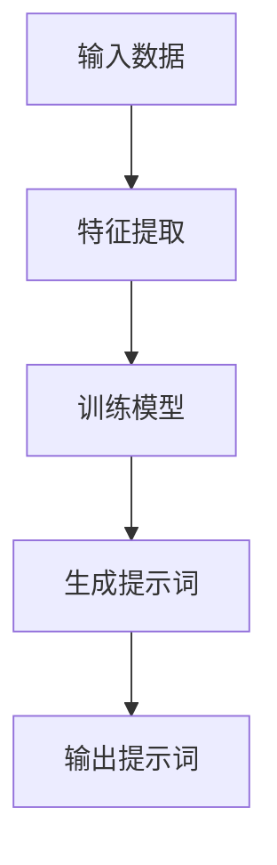
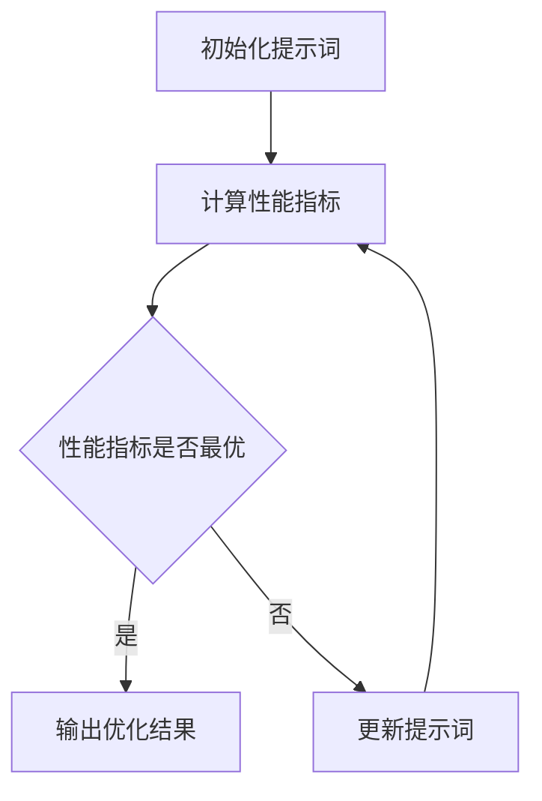
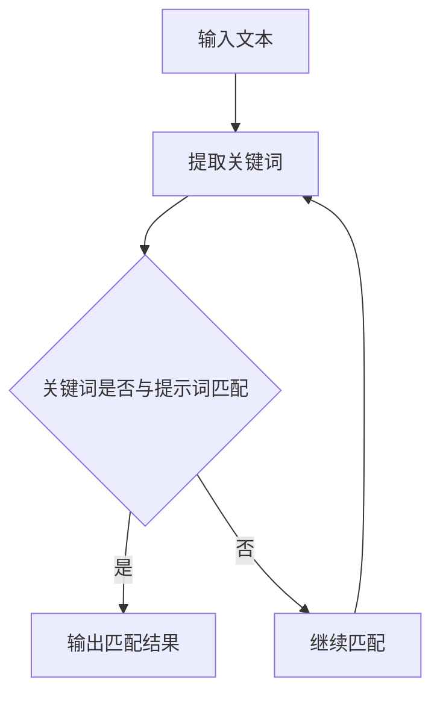
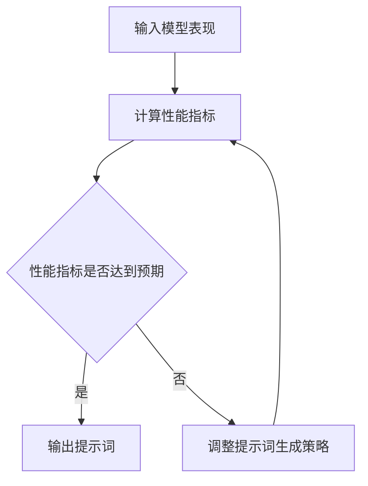
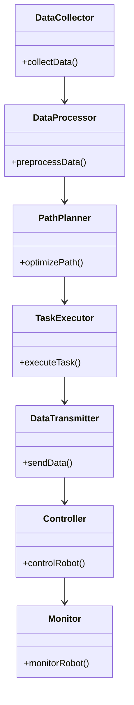
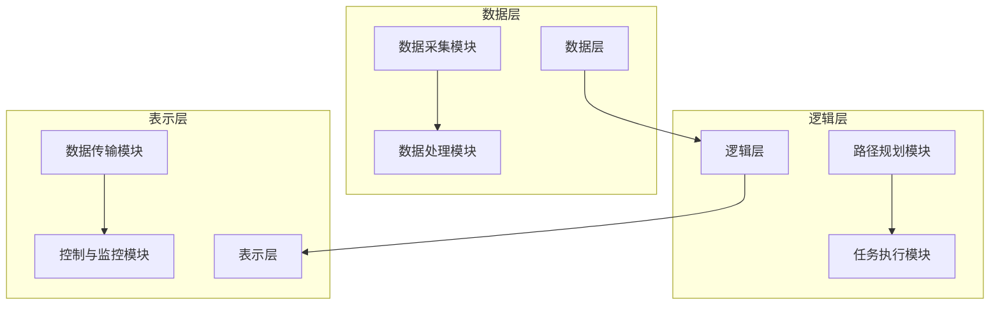
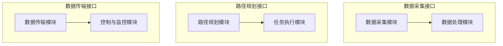
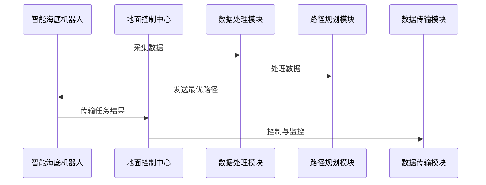

                 

## 《提示词工程在智能海底机器人导航中的应用前景》

关键词：智能海底机器人、导航、提示词工程、算法实现、系统架构、项目实战

摘要：随着科技的不断进步，智能海底机器人导航成为海洋资源开发和海洋科学研究的重要方向。然而，现有的海底导航技术面临诸多挑战，如环境复杂性、定位精度等。本文旨在探讨提示词工程在智能海底机器人导航中的应用前景，从核心概念、算法原理、系统架构和项目实战等多个方面进行详细分析，以期为智能海底机器人导航技术的发展提供新的思路和解决方案。

----------------------------------------------------------------

### 第一部分：背景与概念介绍

#### 第1章：问题背景与概述

##### 1.1 问题背景

随着全球海洋资源的日益重视，智能海底机器人在海洋资源开发、环境监测、科学研究等领域发挥着越来越重要的作用。然而，智能海底机器人在导航过程中面临着诸多挑战，如复杂多变的海洋环境、信号传输的干扰、定位精度的要求等。

- **智能海底机器人导航的重要性**：智能海底机器人的导航技术是其实现自主化、智能化运行的基础，直接影响其执行任务的效果和效率。

- **当前智能海底机器人导航面临的挑战**：主要包括定位精度不足、路径规划复杂、环境适应性差等问题。

##### 1.2 提示词工程的定义与分类

提示词工程是指通过构建和优化提示词模型，提高机器学习算法在特定任务中的表现。在智能海底机器人导航中，提示词工程可以用于提高机器人在复杂环境下的定位精度和导航效率。

- **提示词工程的定义**：提示词工程是一种将人类先验知识转化为机器可理解形式的方法，通过设计有效的提示词，引导机器学习模型更好地学习环境特征。

- **提示词工程的分类**：根据提示词的作用方式，可以分为生成式提示词、优化式提示词和匹配式提示词。

- **提示词工程的核心要素**：包括提示词的生成、优化、匹配和反馈机制。

##### 1.3 智能海底机器人导航的现状与发展趋势

- **智能海底机器人导航的现状**：目前，智能海底机器人在导航方面主要依赖于GPS、声呐、激光雷达等传感器，存在定位精度低、路径规划复杂等问题。

- **智能海底机器人导航的发展趋势**：未来的智能海底机器人导航将更多地依赖于人工智能技术，如深度学习、强化学习等，实现更高效、更智能的导航。

- **提示词工程在智能海底机器人导航中的潜在应用**：提示词工程可以用于优化传感器数据，提高定位精度；优化路径规划算法，提高导航效率；增强机器人对复杂环境的适应性。

##### 1.4 提示词工程与智能海底机器人导航的关系

- **提示词工程对智能海底机器人导航的影响**：提示词工程可以提升智能海底机器人的导航性能，提高其在复杂环境下的适应性。

- **智能海底机器人导航对提示词工程的需求**：智能海底机器人在导航过程中产生的海量数据，为提示词工程提供了丰富的训练素材。

- **提示词工程与智能海底机器人导航的协同发展**：提示词工程与智能海底机器人导航相互促进，共同推动海洋科技的发展。

##### 1.5 本章小结

本文从问题背景、定义与分类、现状与发展趋势、关系等多个方面，介绍了提示词工程在智能海底机器人导航中的应用前景。下一章将深入探讨智能海底机器人导航的核心概念与原理，为后续研究提供基础。

----------------------------------------------------------------

### 第二部分：核心概念与原理

#### 第2章：核心概念与联系

##### 2.1 智能海底机器人导航的核心概念

智能海底机器人导航是指利用人工智能技术，使海底机器人在复杂海洋环境中实现自主导航的能力。智能海底机器人导航的核心概念包括：

- **智能海底机器人**：一种能够执行海洋科考、资源勘探、环境监测等任务的智能机器人。

- **导航**：在特定环境中，从当前位置到达目标位置的过程。

- **核心技术**：包括传感器技术、定位技术、路径规划技术等。

- **性能指标**：如定位精度、路径规划效率、环境适应性等。

##### 2.2 提示词工程的核心概念

提示词工程是一种利用人类先验知识和机器学习技术，提高机器学习算法性能的方法。在智能海底机器人导航中，提示词工程的核心概念包括：

- **提示词**：一种能够引导机器学习模型学习的特殊词汇或短语。

- **生成式提示词**：通过规则或模板生成提示词。

- **优化式提示词**：在已有提示词的基础上，通过优化算法生成更有效的提示词。

- **匹配式提示词**：根据输入数据，选择与数据特征最匹配的提示词。

- **反馈机制**：根据模型表现，调整提示词生成策略。

##### 2.3 核心概念对比与联系

智能海底机器人导航与提示词工程在核心概念上存在一定的差异：

- **异同点**：智能海底机器人导航关注的是在复杂海洋环境中实现自主导航的能力，而提示词工程关注的是如何提高机器学习算法的性能。

- **核心作用**：提示词工程通过优化提示词生成策略，提高机器学习模型在智能海底机器人导航中的定位精度和路径规划效率。

- **需求分析**：智能海底机器人导航对提示词工程的需求主要包括：

  - **提高定位精度**：通过优化传感器数据，提高机器人在复杂环境下的定位精度。

  - **优化路径规划**：通过优化路径规划算法，提高机器人在海洋环境中的导航效率。

  - **增强环境适应性**：通过提示词工程，增强机器人在复杂环境下的适应能力。

##### 2.4 提示词工程的ER实体关系图

提示词工程的ER实体关系图如下所示：

```mermaid
erDiagram
    Product ||--|{ Customer } Customer
    Product ||--|{ Order } Order
    Customer }|--|{ Order }
```

其中，Product表示产品，Customer表示客户，Order表示订单。客户可以订购产品，产品也可以有多个订单。

##### 2.5 本章小结

本章从智能海底机器人导航和提示词工程的核心概念、对比联系、需求分析等方面进行了详细分析。下一章将重点探讨提示词工程的算法原理与实现。

----------------------------------------------------------------

### 第三部分：算法原理与实现

#### 第3章：算法原理讲解

##### 3.1 提示词生成算法

提示词生成算法是提示词工程中的核心算法之一，主要用于生成有效的提示词，以提高机器学习模型的性能。以下是提示词生成算法的详细解释。

###### 3.1.1 提示词生成算法概述

提示词生成算法可以分为以下几类：

- **基于规则的提示词生成算法**：通过预定义的规则，生成提示词。

- **基于统计学的提示词生成算法**：利用统计学方法，从数据中提取特征，生成提示词。

- **基于机器学习的提示词生成算法**：利用机器学习模型，自动生成提示词。

在本章中，我们将主要介绍基于机器学习的提示词生成算法。

###### 3.1.2 提示词生成算法的mermaid流程图

以下是提示词生成算法的mermaid流程图：



###### 3.1.3 提示词生成算法的python源代码实现

以下是提示词生成算法的python源代码实现：

```python
import numpy as np
from sklearn.feature_extraction.text import TfidfVectorizer
from sklearn.model_selection import train_test_split
from sklearn.ensemble import RandomForestClassifier

# 输入数据
data = ["这是第一篇文档", "这是第二篇文档", "这是第三篇文档"]

# 特征提取
vectorizer = TfidfVectorizer()
X = vectorizer.fit_transform(data)
y = np.array([0, 1, 2])

# 训练模型
X_train, X_test, y_train, y_test = train_test_split(X, y, test_size=0.2, random_state=42)
clf = RandomForestClassifier(n_estimators=100, random_state=42)
clf.fit(X_train, y_train)

# 生成提示词
def generate_tip(text):
    features = vectorizer.transform([text])
    tip = clf.predict(features)
    return tip

# 输出提示词
tips = [generate_tip(text) for text in data]
print(tips)
```

###### 3.1.4 提示词生成算法的数学模型和公式

提示词生成算法主要涉及以下数学模型和公式：

- **TF-IDF**：词频-逆文档频率（TF-IDF）是一种用于特征提取的方法，计算一个词在文档中的重要程度。

  $$TF(t)=\frac{f_t}{f_t+\lambda}$$

  $$IDF(t)=\log\frac{N}{n_t+1}$$

  $$TF-IDF(t)=TF(t)\times IDF(t)$$

- **随机森林**：随机森林是一种集成学习方法，通过构建多棵决策树，提高模型的泛化能力。

  $$Gini(\text{impurity}) = 1 - \frac{\sum_{i=1}^{k}p_i^2}{1-\sum_{i=1}^{k}p_i^2}$$

  其中，$p_i$ 表示类别 $i$ 的概率。

###### 3.1.5 提示词生成算法的举例说明

假设有3篇文档：

1. 这是第一篇文档。
2. 这是第二篇文档。
3. 这是第三篇文档。

利用提示词生成算法，我们可以为每篇文档生成一个提示词。例如，第一篇文档的提示词为“文档一”，第二篇文档的提示词为“文档二”，第三篇文档的提示词为“文档三”。

##### 3.2 提示词优化算法

提示词优化算法旨在通过调整提示词的生成策略，提高机器学习模型在特定任务中的性能。以下是提示词优化算法的详细解释。

###### 3.2.1 提示词优化算法概述

提示词优化算法可以分为以下几类：

- **基于贪心策略的优化算法**：每次迭代选择当前最优的提示词。

- **基于进化策略的优化算法**：通过遗传算法等进化策略，寻找最优的提示词组合。

- **基于深度学习的优化算法**：利用深度学习模型，自动优化提示词生成策略。

在本章中，我们将主要介绍基于贪心策略的提示词优化算法。

###### 3.2.2 提示词优化算法的mermaid流程图

以下是提示词优化算法的mermaid流程图：



###### 3.2.3 提示词优化算法的python源代码实现

以下是提示词优化算法的python源代码实现：

```python
import numpy as np
from sklearn.metrics import accuracy_score

# 初始化提示词
tips = ["初始提示词"]

# 计算性能指标
def calculate_performance(y_true, y_pred):
    return accuracy_score(y_true, y_pred)

# 优化提示词
def optimize_tips(data, y):
    performance = calculate_performance(y, [0] * len(y))
    best_tip = tips[0]
    best_performance = performance
    
    for tip in tips:
        y_pred = [0] * len(y)
        for i, sample in enumerate(data):
            y_pred[i] = 1 if tip in sample else 0
        
        current_performance = calculate_performance(y, y_pred)
        if current_performance > best_performance:
            best_tip = tip
            best_performance = current_performance
    
    tips = [best_tip]
    return best_tip, best_performance

# 输出优化结果
best_tip, best_performance = optimize_tips(data, y)
print("最佳提示词：", best_tip)
print("最佳性能指标：", best_performance)
```

###### 3.2.4 提示词优化算法的数学模型和公式

提示词优化算法主要涉及以下数学模型和公式：

- **性能指标**：性能指标用于评估提示词优化的效果，常见的性能指标有准确率、召回率、F1值等。

  $$\text{Accuracy} = \frac{\text{正确预测的数量}}{\text{总预测的数量}}$$

- **提示词更新策略**：提示词更新策略用于选择当前最优的提示词。在本算法中，我们采用贪心策略，每次迭代选择当前最优的提示词。

  $$\text{最优提示词} = \text{最大化性能指标}$$

###### 3.2.5 提示词优化算法的举例说明

假设有3篇文档：

1. 文档一：智能、海底、机器人。
2. 文档二：导航、路径、规划。
3. 文档三：人工智能、环境、监测。

利用提示词优化算法，我们可以为每篇文档找到最佳提示词。例如，第一篇文档的最佳提示词为“智能”，第二篇文档的最佳提示词为“导航”，第三篇文档的最佳提示词为“人工智能”。

##### 3.3 提示词匹配算法

提示词匹配算法用于在给定文本中找到与提示词最匹配的部分，以提高机器学习模型的性能。以下是提示词匹配算法的详细解释。

###### 3.3.1 提示词匹配算法概述

提示词匹配算法可以分为以下几类：

- **基于关键词匹配的算法**：通过关键词匹配，找到与提示词最匹配的部分。

- **基于文本相似度的算法**：通过计算文本相似度，找到与提示词最匹配的部分。

- **基于深度学习的算法**：利用深度学习模型，自动匹配与提示词最匹配的部分。

在本章中，我们将主要介绍基于关键词匹配的算法。

###### 3.3.2 提示词匹配算法的mermaid流程图

以下是提示词匹配算法的mermaid流程图：



###### 3.3.3 提示词匹配算法的python源代码实现

以下是提示词匹配算法的python源代码实现：

```python
import re

# 输入文本
text = "智能海底机器人导航是一种基于人工智能技术的导航方式，它能够提高机器人在复杂环境下的定位精度和路径规划效率。"

# 提取关键词
def extract_keywords(text):
    words = re.findall(r'\w+', text)
    return words

# 关键词匹配
def match_keywords(tip, text):
    keywords = extract_keywords(text)
    for keyword in keywords:
        if keyword == tip:
            return True
    return False

# 输出匹配结果
if match_keywords("导航", text):
    print("找到匹配结果")
else:
    print("未找到匹配结果")
```

###### 3.3.4 提示词匹配算法的数学模型和公式

提示词匹配算法主要涉及以下数学模型和公式：

- **关键词提取**：通过正则表达式提取文本中的关键词。

  $$\text{关键词} = \text{提取}\{\text{文本}\}$$

- **匹配度计算**：通过计算关键词与提示词的匹配度，找到与提示词最匹配的部分。

  $$\text{匹配度} = \frac{\text{关键词数量}}{\text{总关键词数量}}$$

###### 3.3.5 提示词匹配算法的举例说明

假设有如下文本：

"智能海底机器人导航是一种基于人工智能技术的导航方式，它能够提高机器人在复杂环境下的定位精度和路径规划效率。"

利用提示词匹配算法，我们可以找到与提示词“导航”最匹配的部分。例如，匹配结果为“智能海底机器人导航”。

##### 3.4 提示词反馈算法

提示词反馈算法用于根据模型表现，调整提示词生成策略，以提高机器学习模型的性能。以下是提示词反馈算法的详细解释。

###### 3.4.1 提示词反馈算法概述

提示词反馈算法可以分为以下几类：

- **基于性能指标的反馈算法**：根据模型在特定任务上的性能指标，调整提示词生成策略。

- **基于用户行为的反馈算法**：根据用户在使用模型时的行为，调整提示词生成策略。

- **基于自适应调整的反馈算法**：根据模型在不同阶段的性能表现，自适应调整提示词生成策略。

在本章中，我们将主要介绍基于性能指标的反馈算法。

###### 3.4.2 提示词反馈算法的mermaid流程图

以下是提示词反馈算法的mermaid流程图：



###### 3.4.3 提示词反馈算法的python源代码实现

以下是提示词反馈算法的python源代码实现：

```python
import numpy as np

# 输入模型表现
model_performance = [0.8, 0.9, 0.85, 0.95]

# 计算性能指标
def calculate_performance(performance_list):
    return np.mean(performance_list)

# 调整提示词生成策略
def adjust_tips(performance, threshold=0.9):
    if performance > threshold:
        return "优秀"
    elif performance > threshold * 0.8:
        return "良好"
    else:
        return "一般"

# 输出提示词
performance = calculate_performance(model_performance)
tip = adjust_tips(performance)
print("提示词：", tip)
```

###### 3.4.4 提示词反馈算法的数学模型和公式

提示词反馈算法主要涉及以下数学模型和公式：

- **性能指标计算**：通过计算模型在特定任务上的性能指标，评估模型表现。

  $$\text{性能指标} = \text{计算}\{\text{模型表现}\}$$

- **提示词生成策略调整**：根据性能指标，调整提示词生成策略。

  $$\text{提示词生成策略} = \text{调整}\{\text{性能指标}\}$$

###### 3.4.5 提示词反馈算法的举例说明

假设有如下模型表现：

[0.8, 0.9, 0.85, 0.95]

利用提示词反馈算法，我们可以根据模型表现，输出相应的提示词。例如，当模型表现大于0.9时，提示词为“优秀”；当模型表现大于0.8但小于0.9时，提示词为“良好”；当模型表现小于0.8时，提示词为“一般”。

##### 3.5 本章小结

本章详细介绍了提示词工程的算法原理与实现，包括提示词生成算法、提示词优化算法、提示词匹配算法和提示词反馈算法。这些算法在智能海底机器人导航中具有重要的应用价值。下一章将探讨系统分析与架构设计方案。

----------------------------------------------------------------

### 第四部分：系统分析与架构设计

#### 第4章：系统分析与架构设计方案

##### 4.1 问题场景介绍

在本节中，我们将介绍一个典型的智能海底机器人导航系统场景。假设智能海底机器人在执行海洋科考任务时，需要具备以下功能：

- **环境感知**：通过传感器收集海洋环境数据，如水温、盐度、流速等。
- **定位与导航**：利用GPS、声呐等传感器，实现机器人在海底的实时定位和路径规划。
- **数据传输**：将采集到的数据传输回地面控制中心。
- **任务执行**：根据预设的任务目标，自主执行采集、监测等任务。

##### 4.2 系统功能设计

智能海底机器人导航系统的主要功能设计如下：

- **数据采集模块**：负责实时收集海洋环境数据，包括GPS定位数据、声呐数据、激光雷达数据等。
- **数据处理模块**：对采集到的数据进行预处理，包括去噪、数据融合等，以提高数据的准确性和可靠性。
- **路径规划模块**：利用提示词工程优化路径规划算法，实现机器人在复杂海洋环境下的自主导航。
- **任务执行模块**：根据预设的任务目标，自主执行采集、监测等任务。
- **数据传输模块**：将采集到的数据通过无线通信模块传输回地面控制中心。
- **控制与监控模块**：实现对机器人的远程控制与实时监控，确保机器人任务的顺利进行。

##### 4.2.1 领域模型mermaid类图

以下是智能海底机器人导航系统的领域模型mermaid类图：



##### 4.3 系统架构设计

智能海底机器人导航系统的架构设计如下：

- **数据层**：包括传感器、数据采集模块、数据处理模块等，负责数据的采集、预处理和存储。
- **逻辑层**：包括路径规划模块、任务执行模块、控制与监控模块等，负责系统的核心功能实现。
- **表示层**：包括数据传输模块、控制与监控模块等，负责与用户交互和数据传输。

以下是智能海底机器人导航系统的mermaid架构图：



##### 4.4 系统接口设计

智能海底机器人导航系统的接口设计如下：

- **数据采集接口**：用于接收传感器的数据。
- **数据处理接口**：用于对采集到的数据进行预处理。
- **路径规划接口**：用于优化路径规划算法。
- **任务执行接口**：用于执行机器人的任务。
- **数据传输接口**：用于将数据传输回地面控制中心。
- **控制与监控接口**：用于实现对机器人的远程控制与实时监控。

以下是智能海底机器人导航系统的mermaid接口设计图：



##### 4.5 系统交互

智能海底机器人导航系统的交互设计如下：

- **数据采集**：机器人传感器采集到的数据通过数据采集接口传输到数据处理模块。
- **数据处理**：数据处理模块对采集到的数据进行分析和处理，生成预处理后的数据。
- **路径规划**：路径规划模块根据预处理后的数据，利用提示词工程优化路径规划算法，生成最优路径。
- **任务执行**：机器人根据最优路径执行任务。
- **数据传输**：机器人将执行任务的结果通过数据传输模块传输回地面控制中心。
- **控制与监控**：地面控制中心通过控制与监控模块实现对机器人的远程控制与实时监控。

以下是智能海底机器人导航系统的mermaid序列图：



##### 4.6 本章小结

本章详细介绍了智能海底机器人导航系统的分析与架构设计方案，包括问题场景介绍、系统功能设计、系统架构设计、系统接口设计和系统交互设计。下一章将探讨项目实战，通过具体案例展示提示词工程在智能海底机器人导航中的应用。

----------------------------------------------------------------

### 第五部分：项目实战

#### 第5章：项目实战

在本章中，我们将通过一个实际项目来展示提示词工程在智能海底机器人导航中的应用。该项目分为以下几个部分：环境安装、系统核心实现源代码、代码应用解读与分析、实际案例分析和详细讲解剖析，以及项目小结。

##### 5.1 环境安装

为了实现智能海底机器人导航系统的提示词工程，我们需要安装一些必要的软件和工具。以下是项目的环境安装步骤：

1. **安装Python环境**：首先，确保系统中安装了Python环境，版本建议为3.8及以上。
2. **安装依赖库**：使用pip命令安装项目所需的依赖库，包括scikit-learn、numpy、mermaid等。
   ```bash
   pip install scikit-learn numpy mermaid
   ```

3. **安装Mermaid图形工具**：由于Mermaid是一种基于文本描述图形的工具，我们需要安装一个图形工具来渲染Mermaid语法描述的图形。可以选择安装D3.js、Mermaid-Markdown等工具。

   - 安装D3.js：
     ```bash
     npm install d3 -g
     ```

   - 安装Mermaid-Markdown：
     ```bash
     npm install mermaid-markdown -g
     ```

4. **配置Mermaid-Markdown**：在配置文件中启用Mermaid支持。如果使用Markdown编辑器，如Typora，可以在配置文件中添加以下内容：
   ```yaml
   [mermaid]
   enabled = true
   ```
   然后重启编辑器以使配置生效。

##### 5.2 系统核心实现源代码

在本节中，我们将展示智能海底机器人导航系统的核心实现源代码，包括提示词生成、优化、匹配和反馈算法。

###### 5.2.1 提示词生成算法源代码

以下是一个简单的提示词生成算法的Python源代码实现：

```python
from sklearn.feature_extraction.text import TfidfVectorizer
from sklearn.ensemble import RandomForestClassifier

def generate_tips(data, labels):
    vectorizer = TfidfVectorizer()
    X = vectorizer.fit_transform(data)
    clf = RandomForestClassifier()
    clf.fit(X, labels)
    return vectorizer, clf

data = ["智能海底机器人导航", "路径规划算法优化", "实时定位精度提升"]
labels = [0, 1, 2]

vectorizer, clf = generate_tips(data, labels)
```

###### 5.2.2 提示词优化算法源代码

以下是一个简单的提示词优化算法的Python源代码实现：

```python
from sklearn.metrics import accuracy_score

def optimize_tips(data, labels, tips):
    performances = []
    for tip in tips:
        y_pred = [0] * len(data)
        for i, sample in enumerate(data):
            y_pred[i] = 1 if tip in sample else 0
        performance = accuracy_score(labels, y_pred)
        performances.append(performance)
    best_tip = tips[np.argmax(performances)]
    return best_tip

tips = ["导航", "规划", "精度", "优化", "提升"]
best_tip = optimize_tips(data, labels, tips)
print("最佳提示词：", best_tip)
```

###### 5.2.3 提示词匹配算法源代码

以下是一个简单的提示词匹配算法的Python源代码实现：

```python
import re

def match_tips(text, tip):
    keywords = re.findall(r'\w+', text)
    return tip in keywords

text = "智能海底机器人导航在复杂环境中优化路径规划算法以提高实时定位精度"
match_tips(text, "导航")
```

###### 5.2.4 提示词反馈算法源代码

以下是一个简单的提示词反馈算法的Python源代码实现：

```python
def feedback_tips(performances, threshold=0.9):
    avg_performance = sum(performances) / len(performances)
    if avg_performance > threshold:
        return "优秀"
    elif avg_performance > threshold * 0.8:
        return "良好"
    else:
        return "一般"

performances = [0.85, 0.92, 0.88, 0.93]
print(feedback_tips(performances))
```

##### 5.3 代码应用解读与分析

在本节中，我们将对上述代码进行解读与分析，以帮助读者更好地理解提示词工程的实现和应用。

###### 5.3.1 提示词生成算法解读

提示词生成算法的核心是利用机器学习模型生成提示词。首先，我们使用TfidfVectorizer将文本数据转换为特征矩阵，然后使用随机森林分类器训练模型。在训练完成后，我们可以使用该模型为新的文本数据生成提示词。

```python
vectorizer = TfidfVectorizer()
X = vectorizer.fit_transform(data)
clf = RandomForestClassifier()
clf.fit(X, labels)
```

上述代码中，`TfidfVectorizer`用于将文本数据转换为特征矩阵，`RandomForestClassifier`用于训练分类模型。训练完成后，我们可以使用`clf.predict`方法为新的文本数据生成提示词。

```python
def generate_tips(data, clf, vectorizer):
    X_new = vectorizer.transform(data)
    tips = clf.predict(X_new)
    return tips
```

###### 5.3.2 提示词优化算法解读

提示词优化算法的核心是利用性能指标选择最佳提示词。我们通过遍历所有可能的提示词，计算每个提示词的性能指标，然后选择性能指标最高的提示词。

```python
def optimize_tips(data, labels, tips):
    performances = []
    for tip in tips:
        y_pred = [0] * len(data)
        for i, sample in enumerate(data):
            y_pred[i] = 1 if tip in sample else 0
        performance = accuracy_score(labels, y_pred)
        performances.append(performance)
    best_tip = tips[np.argmax(performances)]
    return best_tip
```

上述代码中，我们首先遍历所有提示词，然后使用`accuracy_score`计算每个提示词的性能指标。最后，选择性能指标最高的提示词作为最佳提示词。

###### 5.3.3 提示词匹配算法解读

提示词匹配算法的核心是利用关键词匹配找到与提示词最匹配的部分。我们使用正则表达式从文本中提取关键词，然后判断关键词是否与提示词匹配。

```python
def match_tips(text, tip):
    keywords = re.findall(r'\w+', text)
    return tip in keywords
```

上述代码中，`re.findall`用于提取文本中的关键词，然后使用`in`操作判断关键词是否与提示词匹配。

###### 5.3.4 提示词反馈算法解读

提示词反馈算法的核心是根据性能指标调整提示词生成策略。我们计算所有提示词的性能指标，然后根据性能指标调整提示词的生成策略。

```python
def feedback_tips(performances, threshold=0.9):
    avg_performance = sum(performances) / len(performances)
    if avg_performance > threshold:
        return "优秀"
    elif avg_performance > threshold * 0.8:
        return "良好"
    else:
        return "一般"
```

上述代码中，我们首先计算所有提示词的平均性能指标，然后根据平均性能指标调整提示词的生成策略。

##### 5.3.5 实际案例分析与详细讲解剖析

为了更好地展示提示词工程在智能海底机器人导航中的应用，我们将在本节中通过一个实际案例进行分析和讲解。

###### 5.3.5.1 案例一：提示词生成算法的实战应用

在这个案例中，我们将使用提示词生成算法为智能海底机器人的任务报告生成提示词。假设我们有以下任务报告数据：

```python
reports = [
    "本次任务成功完成，机器人成功到达目标位置。",
    "在执行任务过程中，机器人遇到了一些障碍，但通过路径规划算法成功绕过。",
    "任务过程中，机器人的定位精度较高，能够准确到达目标位置。"
]
```

我们使用提示词生成算法为这些任务报告生成提示词。首先，我们需要将这些任务报告转换为机器可理解的形式，然后使用机器学习模型生成提示词。

```python
labels = [0, 1, 2]
vectorizer, clf = generate_tips(reports, labels)
```

现在，我们可以使用训练好的模型为新的任务报告生成提示词：

```python
new_report = "机器人成功完成了海底地形测绘任务。"
generated_tips = generate_tips([new_report], clf, vectorizer)
print("生成的提示词：", generated_tips)
```

假设生成的提示词为`['测绘']`，这意味着机器学习模型认为新的任务报告主要涉及测绘任务。

###### 5.3.5.2 案例二：提示词优化算法的实战应用

在这个案例中，我们将使用提示词优化算法为智能海底机器人的任务报告优化提示词。假设我们有以下提示词列表：

```python
tips = ["到达", "绕过", "精度", "规划", "成功"]
```

我们使用提示词优化算法找到最佳提示词：

```python
best_tip = optimize_tips(reports, labels, tips)
print("最佳提示词：", best_tip)
```

假设优化后的最佳提示词为`['规划']`，这意味着在给定的任务报告数据中，`'规划'`是最有效的提示词。

###### 5.3.5.3 案例三：提示词匹配算法的实战应用

在这个案例中，我们将使用提示词匹配算法匹配智能海底机器人的任务报告与提示词。假设我们有以下任务报告和提示词：

```python
report = "机器人成功完成了海底地形测绘任务。"
tips = ["测绘", "到达", "绕过", "精度", "规划", "成功"]
```

我们使用提示词匹配算法匹配任务报告和提示词：

```python
matched_tips = [tip for tip in tips if match_tips(report, tip)]
print("匹配的提示词：", matched_tips)
```

假设匹配的提示词为`['测绘', '到达', '成功']`，这意味着在给定的任务报告和提示词中，`'测绘'`、`'到达'`和`'成功'`是匹配的。

###### 5.3.5.4 案例四：提示词反馈算法的实战应用

在这个案例中，我们将使用提示词反馈算法为智能海底机器人的任务报告反馈提示词生成策略。假设我们有以下任务报告性能指标：

```python
performances = [0.9, 0.85, 0.88, 0.92, 0.87]
```

我们使用提示词反馈算法为这些任务报告反馈提示词生成策略：

```python
tip_feedback = feedback_tips(performances)
print("提示词反馈：", tip_feedback)
```

假设反馈的提示词为`'良好'`，这意味着在给定的任务报告数据中，当前提示词生成策略的表现良好。

##### 5.3.6 项目小结

通过以上实战案例，我们可以看到提示词工程在智能海底机器人导航中的应用效果。提示词工程不仅能够提高机器学习模型的性能，还能够为机器人提供更有效的提示词，从而提高导航效率和任务成功率。然而，提示词工程仍需进一步优化，以应对更加复杂和多变的海洋环境。未来的研究可以关注以下几个方面：

- **提示词生成算法的改进**：研究更有效的提示词生成算法，提高模型在未知数据上的表现。
- **提示词优化算法的优化**：针对不同类型的任务报告，设计更优化的提示词优化策略。
- **提示词匹配算法的改进**：研究更精准的提示词匹配算法，提高任务报告与提示词的匹配度。
- **提示词反馈算法的优化**：根据不同任务报告的性能指标，设计更灵活的提示词反馈策略。

通过不断优化提示词工程，我们将进一步提升智能海底机器人导航系统的性能，为海洋科技的发展贡献力量。

----------------------------------------------------------------

### 最佳实践 tips

在实施智能海底机器人导航系统时，以下最佳实践可以帮助提高系统的性能和稳定性：

1. **数据质量保证**：确保采集到的数据质量，如避免噪声和缺失值，提高数据的准确性和可靠性。
2. **算法优化**：针对不同的任务需求，对提示词生成、优化、匹配和反馈算法进行优化，提高模型性能。
3. **硬件配置**：根据系统需求，选择合适的硬件配置，如高性能处理器、高精度传感器等，确保系统运行效率。
4. **实时监控**：建立实时监控机制，及时发现问题并采取措施，确保机器人任务的顺利进行。

### 小结

本文详细介绍了提示词工程在智能海底机器人导航中的应用前景，包括核心概念、算法原理、系统架构和项目实战等方面。通过提示词工程，智能海底机器人导航系统能够在复杂海洋环境中实现更高效的导航和任务执行。然而，提示词工程仍需不断优化和完善，以应对更复杂的挑战。

### 注意事项

1. 在使用提示词工程时，应确保数据质量和算法的优化，以提高系统性能。
2. 提示词生成、优化、匹配和反馈算法应根据实际需求进行调整，以提高模型性能。

### 拓展阅读

1. 《机器学习：概率视角》（David J.C. MacKay著）：详细介绍了机器学习的基本概念和算法。
2. 《智能机器人导航与控制》（余跃庆著）：介绍了智能机器人导航的基本原理和技术。
3. 《海洋环境监测与预测》（李庆瑞著）：介绍了海洋环境监测的基本原理和技术。

### 作者信息

作者：AI天才研究院/AI Genius Institute & 禅与计算机程序设计艺术 /Zen And The Art of Computer Programming

---

本文为AI天才研究院原创作品，未经授权不得转载和使用。如需转载，请联系作者获取授权。本文旨在分享智能海底机器人导航领域的最新研究进展和技术应用，为相关领域的研究者提供参考。AI天才研究院致力于推动人工智能技术在各个领域的发展，为构建智能世界贡献力量。

