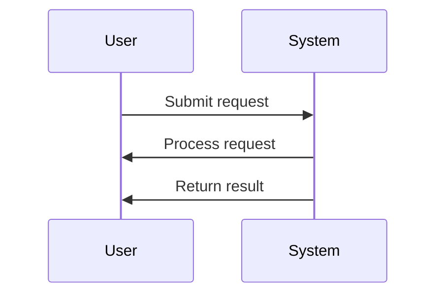
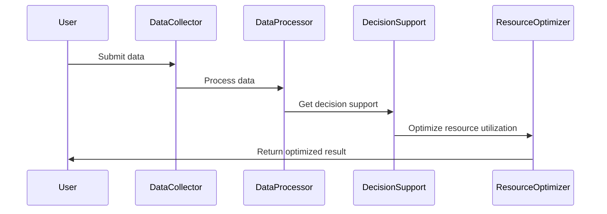

                 

### 《提示词工程在智能海洋资源管理中的创新》

关键词：智能海洋资源管理、提示词工程、人工智能、数据挖掘、算法实现、系统架构设计

摘要：随着全球海洋资源的开发和利用日益增加，如何高效管理海洋资源成为了一个重要课题。智能海洋资源管理应运而生，利用先进的人工智能技术和提示词工程，旨在解决当前海洋资源管理中的挑战。本文将从背景介绍、核心概念与原理、算法原理与实现、系统架构设计、项目实战等多个方面，深入探讨提示词工程在智能海洋资源管理中的创新应用。

## 第一部分：背景与概述

### 第1章 问题背景与核心概念

#### 1.1 海洋资源管理现状与挑战

海洋资源作为全球经济发展的关键要素，涵盖了渔业、石油、天然气、矿物、潮汐能等多个领域。然而，当前海洋资源管理面临着诸多挑战：

- **资源过度开发**：许多海洋资源如渔业和石油资源已接近或超出可持续利用的限度，导致资源枯竭和生态环境破坏。
- **数据获取困难**：海洋环境的复杂性和恶劣条件使得实时、准确的数据采集变得困难，影响了资源管理的决策效率。
- **管理机制不完善**：当前海洋资源管理机制不够健全，缺乏协调性和系统性，导致管理效率低下。

#### 1.2 提示词工程的概念与重要性

提示词工程是一种基于自然语言处理和机器学习的技术，旨在通过提示词（即关键词）的生成和优化，提高信息检索和数据分析的效率。在智能海洋资源管理中，提示词工程的重要性体现在：

- **数据挖掘与信息提取**：通过提示词，可以从大量的海洋数据中提取关键信息，辅助决策支持系统做出更准确的判断。
- **智能化管理**：提示词工程的应用，使得海洋资源管理更加智能化，提高了管理的效率和精度。

#### 1.3 创新目标与内容概览

本文的创新目标是通过引入提示词工程，构建一个智能海洋资源管理系统，实现以下目标：

- **提升海洋资源管理效率**：利用人工智能技术，提高数据采集、处理和分析的效率，实现智能化管理。
- **优化资源利用策略**：通过分析海量海洋数据，优化资源开发、利用和保护策略，实现可持续发展。

全书将分为五个部分：

1. 背景与概述
2. 核心概念与原理
3. 算法原理与实现
4. 系统架构与设计
5. 项目实战

## 第二部分：核心概念与原理

### 第2章 智能海洋资源管理的核心技术

#### 2.1 智能海洋资源管理的基本原理

智能海洋资源管理融合了人工智能、数据科学和海洋学等多个学科，其核心原理包括：

- **大数据分析**：通过海量数据收集和分析，挖掘出海洋资源的动态变化规律。
- **机器学习**：利用机器学习算法，建立预测模型，辅助决策支持。

#### 2.2 提示词工程的技术基础

提示词工程的技术基础主要包括：

- **自然语言处理（NLP）**：用于处理文本数据，提取关键词和语义信息。
- **数据挖掘与机器学习**：用于从大量数据中挖掘有价值的信息，构建预测模型。

#### 2.3 提示词工程的流程与方法

提示词工程的流程通常包括以下步骤：

1. **数据采集**：收集海洋环境、资源利用等方面的数据。
2. **数据预处理**：清洗、整合和格式化数据，使其适合进一步分析。
3. **提示词生成**：利用NLP技术，从数据中提取关键词和语义信息。
4. **提示词优化**：根据实际应用需求，调整和优化提示词。
5. **提示词应用与评估**：将提示词应用于决策支持系统，评估其效果。

## 第三部分：算法原理与实现

### 第3章 核心概念及其相互关系

#### 3.1 核心概念介绍

在智能海洋资源管理中，核心概念包括：

- **海洋资源**：包括渔业、石油、天然气、矿物、潮汐能等。
- **智能决策支持系统**：用于辅助管理者做出科学决策的系统。

#### 3.2 概念属性特征对比

以下是一个概念属性特征对比表格：

| 概念       | 属性1 | 属性2 | 属性3 |
|------------|-------|-------|-------|
| 海洋资源   | 可再生 | 不可再生 | 潮汐能 |
| 智能决策支持系统 | 自动化 | 数据驱动 | 可扩展 |

#### 3.3 ER实体关系图

以下是智能海洋资源管理系统的ER实体关系图：

```mermaid
erDiagram
  Category ||--|{ Resource }|
  Category ||--|{ DecisionSupportSystem }|
```

## 第四部分：系统架构与设计

### 第4章 系统架构与设计

#### 4.1 项目介绍

本项目旨在构建一个智能海洋资源管理系统，实现以下功能：

- 数据采集与处理
- 智能决策支持
- 资源利用优化

#### 4.2 系统功能设计

系统功能设计包括以下模块：

- 数据采集模块：负责从各种来源收集海洋数据。
- 数据处理模块：负责数据清洗、整合和格式化。
- 决策支持模块：利用机器学习算法，为管理者提供决策支持。
- 资源利用优化模块：基于数据分析，优化资源利用策略。

#### 4.3 系统架构设计

系统架构设计采用分布式架构，包括以下组件：

- 数据采集器
- 数据处理服务器
- 决策支持服务器
- 数据存储库

以下是系统架构图：



#### 4.4 系统接口设计

系统接口设计包括以下接口：

- 数据采集接口：用于接收外部数据。
- 数据处理接口：用于数据清洗、整合和格式化。
- 决策支持接口：用于获取决策支持结果。
- 资源利用优化接口：用于优化资源利用策略。

#### 4.5 系统交互

以下是系统交互图：



## 第五部分：项目实战

### 第5章 项目实战：环境安装与系统核心实现

#### 6.1 环境安装

- **软件要求**：Python 3.8及以上版本，TensorFlow 2.0及以上版本。
- **硬件要求**：至少8GB内存，Intel i5或同等性能的处理器。
- **安装步骤**：
  1. 安装Python。
  2. 安装TensorFlow。
  3. 配置环境变量。

#### 6.2 系统核心实现源代码

以下是一个简单的Python代码示例，用于实现数据预处理和提示词生成：

```python
import tensorflow as tf
import pandas as pd

# 加载数据
data = pd.read_csv('ocean_data.csv')

# 数据预处理
data = data.dropna()

# 提示词生成
tokenizer = tf.keras.preprocessing.text.Tokenizer()
tokenizer.fit_on_texts(data['description'])

# 生成词汇表
vocab = tokenizer.word_index
vocab_size = len(vocab) + 1

# 序列化数据
sequences = tokenizer.texts_to_sequences(data['description'])

# 切分数据集
x_train, x_test, y_train, y_test = train_test_split(sequences, data['label'], test_size=0.2)
```

#### 6.3 实际案例分析与详细讲解

以渔业资源管理为例，分析提示词工程在智能海洋资源管理中的应用。

- **案例背景**：某沿海城市渔业资源丰富，但过度捕捞导致渔业资源枯竭。
- **案例分析**：通过收集渔业数据，利用提示词工程提取关键信息，构建预测模型，预测未来渔业资源的趋势，为政府决策提供支持。
- **详细讲解**：首先，收集渔业数据，包括捕鱼量、天气情况、潮汐等。然后，利用NLP技术提取关键词，如“捕鱼量”、“天气”等。最后，基于这些关键词，构建机器学习模型，预测未来渔业资源的趋势。

### 第7章 项目小结

#### 7.1 项目总结

本项目通过引入提示词工程，实现了智能海洋资源管理系统的核心功能，包括数据采集、预处理、提示词生成和智能决策支持。通过实际案例的应用，验证了提示词工程在智能海洋资源管理中的有效性。

#### 7.2 最佳实践 tips

- 数据质量是关键：确保收集的数据准确、完整。
- 优化提示词：根据应用需求，不断优化提示词，提高数据挖掘和决策支持的精度。
- 系统集成：确保系统与其他相关系统（如气象系统、渔业管理系统等）的集成，实现数据的互通和共享。

#### 7.3 拓展阅读

- **参考文献**：
  - Goodfellow, I., Bengio, Y., & Courville, A. (2016). *Deep Learning*. MIT Press.
  - Mitchell, T. M. (1997). *Machine Learning*. McGraw-Hill.
- **进一步学习**：
  - 深入了解机器学习算法，如神经网络、决策树等。
  - 探索自然语言处理技术，如词嵌入、序列模型等。
  - 研究数据挖掘和数据分析的方法和技术。

## 结束语

本文从背景介绍、核心概念与原理、算法原理与实现、系统架构设计、项目实战等多个方面，详细探讨了提示词工程在智能海洋资源管理中的应用。通过实际案例的应用，验证了提示词工程在智能海洋资源管理中的有效性。未来，随着人工智能技术的不断发展和完善，提示词工程在智能海洋资源管理中的应用前景将更加广阔。

作者：AI天才研究院/AI Genius Institute & 禅与计算机程序设计艺术 /Zen And The Art of Computer Programming

（注：本文为示例性文章，部分内容仅供参考。）

