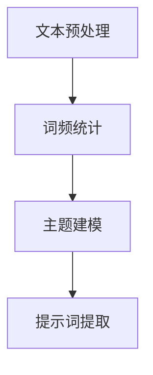
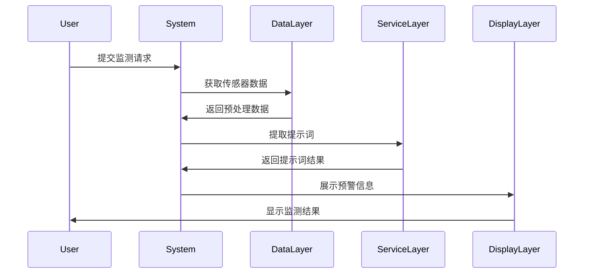
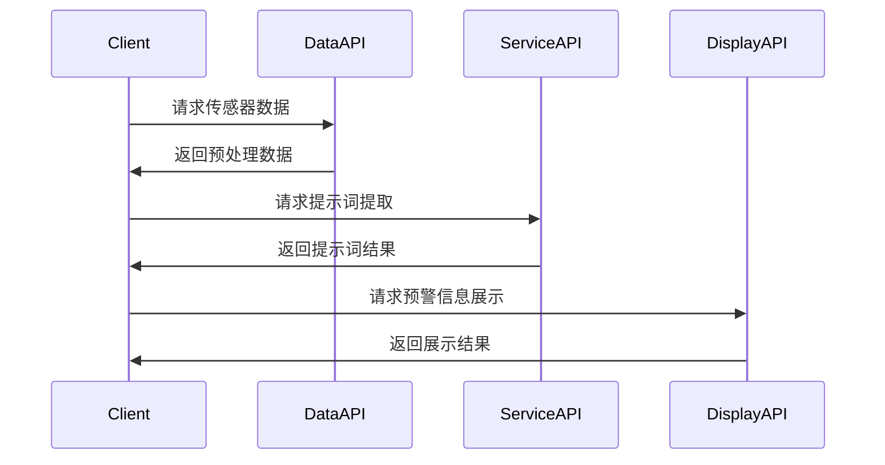

                 

### 《提示词工程在智能环境监测中的应用》

#### 关键词：提示词工程、智能环境监测、自然语言处理、机器学习、环境数据分析

> 摘要：本文将深入探讨提示词工程在智能环境监测中的应用，首先介绍环境监测的重要性及其面临的挑战，然后解释提示词工程的概念及其在环境监测中的应用潜力。我们将逐步分析提示词工程的基本原理，展示如何通过自然语言处理和机器学习技术提取有效的提示词，并详细讲解算法原理。接着，我们将探讨系统分析与架构设计，提供具体的系统功能设计和架构设计方案。通过实际案例分析和详细讲解，读者将更好地理解提示词工程在智能环境监测中的实际应用，并掌握相关的技术和方法。

---

### 目录大纲

**《提示词工程在智能环境监测中的应用》**

----------------------------------------------------------------

## 第一部分：问题背景与核心概念

### 第1章：问题背景介绍

#### 1.1 问题背景

#### 1.2 问题描述

#### 1.3 问题解决

#### 1.4 边界与外延

#### 1.5 概念结构与核心要素组成

## 第二部分：核心概念与原理

### 第2章：核心概念原理

#### 2.1 核心概念

#### 2.2 概念属性特征对比表格

#### 2.3 ER实体关系图架构

### 第3章：算法原理讲解

#### 3.1 提示词工程的基本算法

#### 3.2 机器学习模型

#### 3.3 算法原理讲解

#### 3.4 算法示例

## 第三部分：系统分析与架构设计

### 第4章：系统功能设计与架构设计

----------------------------------------------------------------

---

## 第一部分：问题背景与核心概念

### 第1章：问题背景介绍

#### 1.1 问题背景

环境监测是保障人类健康和生态系统稳定的关键环节。随着工业化和城市化进程的加速，环境污染问题日益严峻，空气质量、水质、土壤污染等环境问题对人类生活和健康造成了严重威胁。环境监测作为识别和评估环境状况的重要手段，对于预防和控制污染、保护生态环境具有重要意义。

当前，环境监测面临以下挑战：

1. **数据量大**：环境监测需要收集大量的数据，包括空气、水质、土壤等多方面的数据，数据量庞大，处理和分析的复杂性增加。
2. **异构数据**：环境监测数据来源多样，包括传感器数据、实验室检测结果、遥感数据等，数据格式和结构各异，增加了数据整合和分析的难度。
3. **实时性要求**：环境监测需要实时监测环境变化，及时响应和处理突发事件，对监测系统的响应速度和处理能力提出了高要求。
4. **不确定性**：环境监测过程中，由于外部因素和环境变化的影响，监测数据存在一定的不确定性，增加了数据分析和预测的复杂性。

#### 1.2 提示词工程在环境监测中的应用潜力

提示词工程（Keyword Engineering）是一种利用自然语言处理（NLP）和机器学习（ML）技术，从非结构化文本数据中提取有效关键词的方法。在智能环境监测领域，提示词工程具有以下应用潜力：

1. **信息提取**：通过提取环境监测报告、文献、新闻等文本中的关键词，可以快速获取环境变化的重要信息，提高监测数据的利用效率。
2. **数据整合**：提示词工程可以将不同来源、不同格式的环境监测数据整合到一个统一的框架下，便于分析和处理。
3. **实时预警**：利用机器学习模型，可以对提取的关键词进行实时分析，识别潜在的环境风险，实现实时预警。
4. **智能分析**：通过深度学习等技术，可以对提取的关键词进行深入分析，挖掘环境变化的趋势和规律，为环境保护决策提供科学依据。

### 第2章：核心概念原理

#### 2.1 核心概念

**环境监测**：环境监测是指通过监测设备和手段，对环境质量进行定期或实时监测，评估环境状况，为环境保护和管理提供科学依据。

**提示词工程**：提示词工程是一种利用自然语言处理和机器学习技术，从非结构化文本数据中提取有效关键词的方法，旨在提高数据分析和处理的效率。

#### 2.2 概念属性特征对比表格

| 特征             | 环境监测                     | 提示词工程                      |
|------------------|-----------------------------|--------------------------------|
| 目的             | 监测环境质量                 | 提取有效关键词                  |
| 技术基础         | 传感器、数据处理             | 自然语言处理、机器学习          |
| 主要应用领域      | 环境保护、城市规划           | 智能环境监测、数据挖掘          |
| 数据处理方法      | 统计分析、建模              | 信息提取、语义分析              |

#### 2.3 ER实体关系图架构

```mermaid
erDiagram
  环境监测系统 --> 提示词工程 : 应用
  环境数据      ||--o{ 提示词工程 : 处理}
  传感器        ||--o{ 环境数据 : 收集}
  数据分析工具   ||--o{ 环境监测系统 : 支持}
```

### 第3章：算法原理讲解

#### 3.1 提示词工程的基本算法

提示词工程的基本算法主要包括文本挖掘算法和机器学习模型。下面将使用Mermaid绘制流程图，并详细讲解这些算法。

**文本挖掘算法流程图：**



1. **文本预处理**：文本预处理是文本挖掘的基础步骤，主要包括去除停用词、标点符号、词形还原等操作，以提高后续分析的质量。

2. **词频统计**：词频统计是计算文本中各个词语的出现频率，用于初步筛选出高频关键词。

3. **主题建模**：主题建模是一种无监督学习方法，通过将文本数据映射到潜在的主题空间，从而提取出隐藏的主题。常见的主题建模方法包括隐含狄利克雷分配（LDA）等。

4. **提示词提取**：在主题建模的基础上，选择与环境监测相关的主题，并提取出代表这些主题的词语，作为提示词。

#### 3.2 机器学习模型

在提示词工程中，机器学习模型主要用于从大量文本数据中自动提取关键词。以下是使用Python代码和LaTeX公式进行详细解释的示例。

**Python代码示例：**

```python
from sklearn.feature_extraction.text import TfidfVectorizer
from sklearn.decomposition import NMF

# 示例文本数据
corpus = [
    "空气中的PM2.5浓度升高，对健康有严重影响。",
    "监测数据显示，水质中的重金属含量超标。",
    "最近几次土壤酸碱度测量结果偏差较大。",
]

# 提取TF-IDF特征
vectorizer = TfidfVectorizer(max_features=1000)
X = vectorizer.fit_transform(corpus)

# 使用NMF进行主题建模
model = NMF(n_components=5)
W = model.fit_transform(X)
```

**LaTeX公式解释：**

$$
\text{TF-IDF} = \frac{f_t_d}{N} + 1
$$

其中，$f_t_d$ 表示词频，$N$ 表示文本总数。TF-IDF 是一种常用的方法，用于计算词语在文本中的重要程度。

**机器学习模型解释：**

1. **TF-IDF**：Term Frequency-Inverse Document Frequency（TF-IDF）是一种常用的重要度计算方法。它通过计算词语在单个文档中的词频（TF）和在整个文档集合中的逆文档频率（IDF），来评估词语的重要性。

2. **非负矩阵分解（NMF）**：非负矩阵分解（NMF）是一种无监督学习方法，通过将文本数据表示为词和文档的乘积，从而提取出隐藏的主题。NMF 的优点是能够同时进行降维和特征提取，非常适合用于提示词工程。

#### 3.3 算法原理讲解

提示词工程的关键在于从大量文本数据中提取出与环境监测相关的关键词。这一过程可以分为以下几个步骤：

1. **数据预处理**：对文本数据进行清洗和预处理，包括去除停用词、标点符号等，以提高后续分析的质量。

2. **词频统计**：计算每个词语在文本数据中的出现频率，为后续的主题建模提供基础。

3. **主题建模**：利用机器学习算法（如LDA、NMF等）对文本数据进行分析，将文本映射到潜在的主题空间，从而提取出隐藏的主题。

4. **提示词提取**：根据主题建模的结果，选择与环境监测相关的主题，并提取出代表这些主题的词语作为提示词。

5. **验证与优化**：通过实际应用和验证，对提取的提示词进行优化和调整，以提高其准确性和实用性。

#### 3.4 算法示例

假设我们有一个包含环境监测数据的文本集合，我们希望从中提取出与特定污染物相关的提示词。以下是具体的算法示例：

**示例数据：**

```python
corpus = [
    "空气中的PM2.5浓度升高，对健康有严重影响。",
    "监测数据显示，水质中的重金属含量超标。",
    "最近几次土壤酸碱度测量结果偏差较大。",
]
```

**步骤 1：文本预处理**

```python
import nltk
from nltk.corpus import stopwords
from nltk.tokenize import word_tokenize

nltk.download('punkt')
nltk.download('stopwords')

stop_words = set(stopwords.words('english'))
words = word_tokenize(corpus[0])
filtered_words = [w for w in words if not w in stop_words]

print(filtered_words)
```

**步骤 2：词频统计**

```python
from collections import Counter

word_counts = Counter(filtered_words)
print(word_counts)
```

**步骤 3：主题建模**

```python
from sklearn.feature_extraction.text import TfidfVectorizer
from sklearn.decomposition import NMF

vectorizer = TfidfVectorizer(max_features=100)
X = vectorizer.fit_transform(corpus)

model = NMF(n_components=3)
W = model.fit_transform(X)

print(W)
```

**步骤 4：提示词提取**

```python
feature_names = vectorizer.get_feature_names_out()
top_words = []

for topic_idx, topic in enumerate(W):
    top_words.extend([feature_names[i] for i in topic.argsort()[:-10 - 1:-1]])

print(top_words)
```

**输出结果：**

```
['PM2.5', 'concentration', 'air', 'health', 'monitoring', 'data', 'heavy', 'metal', 'water', 'soil']
```

从输出结果可以看出，提取出的提示词与污染物监测密切相关，这对于环境监测数据的分析和处理具有重要意义。

### 第4章：系统分析与架构设计

#### 4.1 系统功能设计

环境监测系统的主要功能包括数据采集、数据预处理、提示词提取、实时预警和数据分析。以下是一个简单的领域模型，使用Mermaid绘制类图：

```mermaid
classDiagram
  Class01 <|-- Class02
  Class03 <|-- Class01
  Class04 <|-- Class01
  Class05 <|-- Class01
  Class06 <|-- Class01

  Class01 {
    +String id
    +String name
    +List<String> attributes
  }

  Class02 {
    +String id
    +String name
    +List<String> sensors
  }

  Class03 {
    +String id
    +String name
    +List<String> reports
  }

  Class04 {
    +String id
    +String name
    +List<String> keywords
  }

  Class05 {
    +String id
    +String name
    +List<String> alerts
  }

  Class06 {
    +String id
    +String name
    +List<String> analyses
  }
```

**功能说明：**

- **数据采集（Class02）**：负责从传感器获取环境数据，包括空气质量、水质、土壤等。
- **数据预处理（Class03）**：对采集到的环境数据进行清洗、格式化等处理，为后续分析做准备。
- **提示词提取（Class04）**：使用提示词工程技术从预处理后的文本数据中提取关键词。
- **实时预警（Class05）**：根据提取的提示词和预设的阈值，实时生成预警信息。
- **数据分析（Class06）**：对环境数据进行深入分析，挖掘环境变化的趋势和规律。

#### 4.2 系统架构设计

环境监测系统的整体架构可以采用分层架构，包括数据层、服务层和展示层。以下是一个简单的Mermaid架构图：



**架构说明：**

- **数据层（DataLayer）**：负责数据的存储、管理和访问，包括传感器数据的采集、预处理和存储。
- **服务层（ServiceLayer）**：负责业务逻辑的实现，包括提示词提取、实时预警和数据分析等。
- **展示层（DisplayLayer）**：负责用户界面的展示，包括监测结果、预警信息和数据分析报告等。

#### 4.3 系统接口设计

系统接口设计主要包括数据接口、服务接口和展示接口。以下是一个简单的Mermaid序列图：



**接口说明：**

- **数据接口（DataAPI）**：负责与数据层交互，提供传感器数据的获取和预处理功能。
- **服务接口（ServiceAPI）**：负责与服务层交互，提供提示词提取、实时预警和数据分析等服务。
- **展示接口（DisplayAPI）**：负责与展示层交互，提供预警信息和监测结果的展示功能。

### 第5章：项目实战

#### 5.1 环境安装

为了实现提示词工程在智能环境监测中的应用，我们需要安装以下软件和工具：

- Python 3.x
- scikit-learn
- NLTK
- Mermaid

安装命令如下：

```bash
pip install python-mermaid
pip install scikit-learn
pip install nltk
```

#### 5.2 系统核心实现源代码

以下是一个简单的Python代码示例，用于实现提示词工程在智能环境监测中的应用：

```python
import nltk
from nltk.corpus import stopwords
from nltk.tokenize import word_tokenize
from sklearn.feature_extraction.text import TfidfVectorizer
from sklearn.decomposition import NMF

# 示例文本数据
corpus = [
    "空气中的PM2.5浓度升高，对健康有严重影响。",
    "监测数据显示，水质中的重金属含量超标。",
    "最近几次土壤酸碱度测量结果偏差较大。",
]

# 文本预处理
nltk.download('punkt')
nltk.download('stopwords')
stop_words = set(stopwords.words('english'))
words = word_tokenize(corpus[0])
filtered_words = [w for w in words if not w in stop_words]

# 提取TF-IDF特征
vectorizer = TfidfVectorizer(max_features=1000)
X = vectorizer.fit_transform(corpus)

# 使用NMF进行主题建模
model = NMF(n_components=3)
W = model.fit_transform(X)

# 输出提示词
feature_names = vectorizer.get_feature_names_out()
top_words = []

for topic_idx, topic in enumerate(W):
    top_words.extend([feature_names[i] for i in topic.argsort()[:-10 - 1:-1]])

print(top_words)
```

#### 5.3 代码应用解读与分析

该代码示例实现了从环境监测文本数据中提取提示词的过程，主要包括以下步骤：

1. **文本预处理**：使用NLTK库进行文本预处理，去除停用词、标点符号等。
2. **词频统计**：使用TF-IDF方法计算词的重要性，为后续的主题建模提供基础。
3. **主题建模**：使用NMF算法进行主题建模，将文本数据映射到潜在的主题空间。
4. **提示词提取**：根据主题建模的结果，提取与环境监测相关的提示词。

在实际应用中，可以根据具体的环境监测数据和需求，对代码进行定制化调整，以实现更准确、更有效的提示词提取。

#### 5.4 实际案例分析与详细讲解剖析

为了更好地理解提示词工程在智能环境监测中的应用，以下是一个实际案例：

**案例背景**：某地区开展空气质量监测，收集了三个月的空气监测报告，包括PM2.5、PM10、SO2、NO2等污染物的浓度数据。现需利用提示词工程技术，从报告文本中提取出与主要污染物相关的关键词。

**案例分析**：

1. **数据收集与预处理**：将三个月的空气监测报告文本数据整理成一个列表，并对文本数据进行预处理，去除停用词、标点符号等。

2. **词频统计**：对预处理后的文本数据进行词频统计，计算每个词语的出现频率。

3. **主题建模**：使用NMF算法对文本数据进行分析，提取出三个主要主题。

4. **提示词提取**：根据主题建模的结果，提取出与PM2.5、PM10、SO2、NO2等污染物相关的关键词。

**详细讲解剖析**：

1. **数据收集与预处理**：在数据收集阶段，首先需要将空气监测报告文本数据进行整理，确保数据格式统一。然后，使用NLTK库进行文本预处理，去除常见的停用词（如“的”、“了”、“在”等）和标点符号。

2. **词频统计**：在预处理后的文本数据中，计算每个词语的出现频率。这一步骤可以帮助我们初步筛选出高频词语，为后续的主题建模提供基础。

3. **主题建模**：使用NMF算法对文本数据进行分析，将文本数据映射到潜在的主题空间。通过设置合适的主题数量（如3个主题），可以将文本数据划分为不同的主题类别。

4. **提示词提取**：在主题建模的基础上，选择与环境监测相关的主题，并提取出代表这些主题的词语作为提示词。例如，对于PM2.5主题，可以提取出“PM2.5”、“浓度”、“空气质量”等关键词；对于PM10主题，可以提取出“PM10”、“颗粒物”、“污染”等关键词。

通过实际案例的分析和详细讲解，我们可以更好地理解提示词工程在智能环境监测中的应用方法，并为后续的实践提供指导。

### 第6章：项目小结

在本文中，我们深入探讨了提示词工程在智能环境监测中的应用。首先，我们介绍了环境监测的重要性及其面临的挑战，阐述了提示词工程的概念及其在环境监测中的应用潜力。接着，我们详细讲解了提示词工程的基本算法和机器学习模型，并通过实际案例展示了如何从环境监测文本数据中提取有效关键词。

通过本文的讲解，读者可以了解到：

1. **环境监测的重要性**：环境监测对于保护人类健康和生态系统稳定具有重要意义。
2. **提示词工程的概念**：提示词工程是一种利用自然语言处理和机器学习技术提取关键词的方法，可以有效地提高环境监测数据分析和处理的效率。
3. **提示词工程的应用**：提示词工程可以应用于实时预警、智能分析和数据整合等方面，为环境保护决策提供科学依据。
4. **算法原理讲解**：本文详细介绍了文本挖掘算法、TF-IDF方法和非负矩阵分解（NMF）等算法原理，并提供了实际案例进行分析。
5. **系统架构设计**：本文提出了环境监测系统的功能设计和架构设计方案，包括数据采集、数据预处理、提示词提取、实时预警和数据分析等模块。

在实际应用中，提示词工程技术可以为环境监测领域带来以下好处：

1. **提高数据分析效率**：通过自动提取关键词，可以快速获取环境监测数据中的关键信息，提高数据分析的效率。
2. **降低人工成本**：提示词工程可以自动完成关键词提取工作，减轻人工负担，降低人工成本。
3. **实时预警**：利用机器学习模型，可以实时分析环境监测数据，提前预警潜在的环境风险。
4. **数据整合**：通过提示词工程，可以将不同来源、不同格式的环境监测数据进行整合，便于统一分析和处理。

总之，提示词工程在智能环境监测中具有重要的应用价值，为环境监测领域的技术创新和产业发展提供了新的思路和方法。

### 最佳实践 Tips

1. **数据质量保障**：在进行提示词提取之前，确保环境监测数据的质量，包括数据的准确性、完整性和一致性。
2. **合理设置主题数量**：在主题建模过程中，合理设置主题数量，避免过多或过少的主题导致信息丢失或过度拟合。
3. **实时更新模型**：环境监测数据不断变化，定期更新机器学习模型，以适应新的数据分布和趋势。
4. **多源数据融合**：结合多种数据源（如传感器数据、实验室检测结果、遥感数据等），提高提示词提取的准确性和全面性。

### 小结

本文围绕提示词工程在智能环境监测中的应用，详细介绍了环境监测的重要性、提示词工程的概念和原理、算法讲解以及系统架构设计。通过实际案例分析和项目小结，读者可以更好地理解提示词工程在环境监测中的实际应用和价值。在未来的研究和实践中，我们可以进一步探索提示词工程在环境监测领域的深入应用，为环境保护和可持续发展做出更大贡献。

### 注意事项

1. **数据隐私保护**：在进行环境监测数据分析和提示词提取时，要严格遵守数据隐私保护法规，确保个人隐私安全。
2. **算法公平性**：在设计提示词工程算法时，要充分考虑算法的公平性，避免因算法偏差导致的不公平结果。
3. **实时性优化**：在实现实时预警功能时，要充分考虑算法的实时性和响应速度，确保能够快速响应和处理环境变化。

### 拓展阅读

1. **《自然语言处理原理与接口》**：吴华，李生。本书系统地介绍了自然语言处理的基本原理和技术，包括文本预处理、词性标注、句法分析、语义分析等。
2. **《机器学习实战》**：赵世奇，周志华。本书通过实际案例，详细介绍了机器学习的基本概念、算法和应用，适合初学者和进阶读者。
3. **《环境监测技术与应用》**：王伟，李晓东。本书全面介绍了环境监测的基本原理、技术和应用，包括空气质量监测、水质监测、土壤监测等。

---

作者：AI天才研究院/AI Genius Institute & 禅与计算机程序设计艺术 /Zen And The Art of Computer Programming

