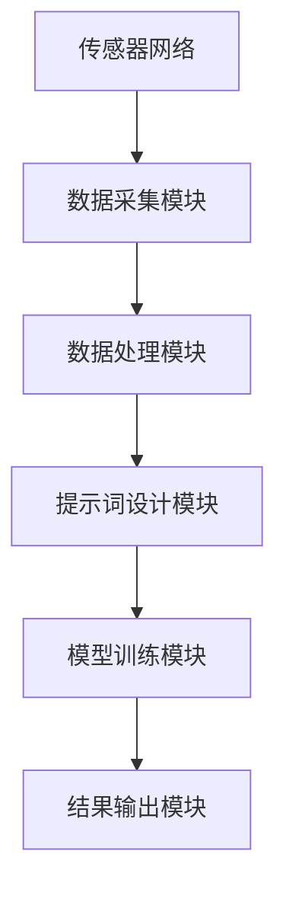
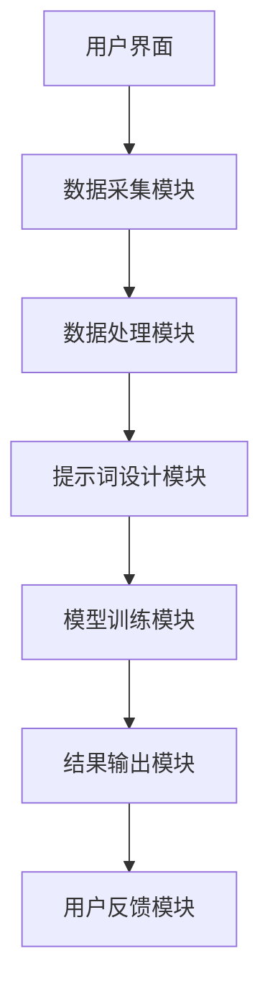

                 


## 引入

在当前快速发展的智能时代，智能生态系统（Smart Ecosystem）已经逐渐成为支撑众多行业变革的核心力量。智能生态系统通过整合物联网（IoT）、大数据、人工智能（AI）等技术，实现了对复杂系统的高效监测与管理。然而，随着系统规模的不断扩大和数据量的剧增，传统的监测方法逐渐暴露出诸多不足。在这样的背景下，提示词工程（Prompt Engineering）作为一种新兴的技术手段，开始引起广泛关注。

提示词工程，顾名思义，是对提示词（Prompt）的设计与应用。在智能生态系统中，提示词可以理解为对数据或系统的引导与激励，通过精心设计的提示词，能够有效地提升系统的监测性能，实现更精准、更高效的监测目标。本文将围绕提示词工程在智能生态系统监测中的应用进行深入探讨，旨在为读者提供一个全面而系统的理解。

首先，我们需要明确智能生态系统与提示词工程的基本概念，了解它们在当前技术环境中的重要性。接下来，我们将详细分析提示词工程的核心原理和技术细节，并结合实际案例展示其在智能生态系统监测中的具体应用。此外，我们还将探讨提示词工程在未来的发展方向和潜在挑战，为读者提供一个前瞻性的视角。

本文的结构如下：

- **第一部分：背景与概念**：介绍智能生态系统和提示词工程的基本概念，探讨其重要性。
- **第二部分：提示词工程原理与实现**：深入探讨提示词工程的核心原理和技术细节。
- **第三部分：实践应用**：通过实际案例展示提示词工程在智能生态系统监测中的应用。
- **第四部分：未来方向与挑战**：讨论提示词工程的发展趋势和面临的挑战。
- **第五部分：结论与最佳实践**：总结全文，提出最佳实践建议。

通过本文的阅读，您将全面了解提示词工程在智能生态系统监测中的应用，掌握相关技术原理和实践方法，为未来的研究和应用提供有力支持。

## 关键词

智能生态系统（Smart Ecosystem）、提示词工程（Prompt Engineering）、物联网（IoT）、大数据（Big Data）、人工智能（AI）、监测（Monitoring）、性能优化（Performance Optimization）、数据预处理（Data Preprocessing）、模型调整（Model Tuning）、系统性能（System Performance）。

## 摘要

本文探讨了提示词工程在智能生态系统监测中的应用。首先，介绍了智能生态系统和提示词工程的基本概念及其在当前技术环境中的重要性。随后，详细分析了提示词工程的核心原理和技术细节，包括提示词的设计与优化、评价与选择方法。接着，通过实际案例展示了提示词工程在智能生态系统监测中的具体应用，如环境监测、智能农业和城市交通管理。最后，讨论了提示词工程的未来发展方向和面临的挑战，并提出了相关的最佳实践建议。本文旨在为读者提供关于提示词工程在智能生态系统监测中应用的全面理解和实用指导。

## 智能生态系统概述

智能生态系统（Smart Ecosystem）是一种高度集成化的系统，旨在通过物联网（IoT）、大数据（Big Data）和人工智能（AI）等先进技术，实现对自然与社会环境的实时监测、分析和优化。智能生态系统的核心概念可以追溯到生态系统（Ecosystem）这一自然学范畴，但其内涵在现代技术环境中得到了极大的扩展和深化。

### 智能生态系统的定义与重要性

智能生态系统是由多个智能节点（如传感器、执行器、智能设备等）通过互联网或其他通信网络互联而成的复杂网络系统。这些节点通过采集、传输和处理数据，实现对环境的实时监测、响应和调控。智能生态系统不仅涉及自然环境，如气候、水质、空气质量等，还包括社会环境，如交通流量、能源消耗、人口分布等。因此，智能生态系统是一种跨领域、跨学科的综合性技术体系。

智能生态系统的重要性体现在以下几个方面：

1. **提高监测精度**：智能生态系统通过分布式传感器网络，能够实现对环境参数的实时、全面监测，显著提高了监测精度和效率。
2. **实时响应能力**：智能生态系统具有实时数据处理和分析能力，能够对环境变化做出快速响应，提高系统的适应性。
3. **资源优化配置**：智能生态系统通过大数据分析和人工智能算法，能够优化资源配置，提高资源利用效率。
4. **促进可持续发展**：智能生态系统通过智能化管理，有助于减少资源浪费，保护生态环境，促进可持续发展。

### 智能生态系统的基本组成

智能生态系统由多个关键组件构成，这些组件相互协作，共同实现系统的整体功能。主要组成包括：

1. **传感器网络**：传感器网络是智能生态系统的感知层，通过分布式传感器节点，采集环境数据，如温度、湿度、气体浓度、交通流量等。
2. **数据传输网络**：数据传输网络负责将传感器网络采集到的数据传输到中心处理系统，通常采用无线通信技术，如Wi-Fi、LoRa、5G等。
3. **数据处理与分析系统**：数据处理与分析系统负责对采集到的数据进行分析、处理和存储，利用大数据技术和人工智能算法，提取有价值的信息。
4. **执行器**：执行器是智能生态系统的行动层，根据分析结果，对环境进行调控，如自动开启或关闭设备、调整系统参数等。
5. **用户界面**：用户界面为用户提供交互接口，展示系统监测结果和调控指令，便于用户对系统进行管理和操作。

### 智能生态系统的监测需求

智能生态系统在监测方面的需求主要包括以下几个方面：

1. **实时性**：由于环境变化具有突发性和不确定性，智能生态系统需要具备实时监测能力，及时捕捉环境变化，做出快速响应。
2. **准确性**：监测数据的准确性直接影响系统的决策效果，因此，智能生态系统需要采用高精度传感器和高性能数据处理算法，确保监测数据的准确性。
3. **完整性**：智能生态系统需要全面、完整地监测环境参数，确保数据的全面性，以便全面了解环境状况。
4. **可扩展性**：随着环境监测需求的不断变化，智能生态系统需要具备良好的可扩展性，能够灵活地添加或调整监测设备和功能。

通过上述分析，我们可以看出，智能生态系统在监测方面的需求不仅体现在技术层面，还涉及系统的整体架构和功能设计。而提示词工程作为一种提升系统监测性能的重要技术手段，将在智能生态系统的建设和发展中发挥关键作用。

### 提示词工程概述

提示词工程（Prompt Engineering）是人工智能（AI）领域的一项前沿技术，其核心在于通过设计特定的提示词（Prompt），引导和激励模型进行更精准和有效的任务执行。在智能生态系统监测中，提示词工程发挥着至关重要的作用，它不仅能够提升系统的监测精度和效率，还能优化数据处理和分析过程。

#### 提示词工程的定义

提示词工程可以被定义为一种通过设计和应用提示词，以提升人工智能模型性能的工程方法。提示词是输入给模型的文本或数据，用于引导模型理解任务目标、优化模型输出和提升模型泛化能力。一个有效的提示词应当具备以下特点：

1. **明确性**：提示词需要清晰明确，能够指导模型专注于特定的任务目标。
2. **具体性**：具体的提示词有助于模型更好地理解和处理输入数据，避免泛化不足。
3. **灵活性**：提示词应具有一定的灵活性，能够根据不同情境进行调整，以适应多样化的任务需求。

#### 提示词工程的基本流程

提示词工程的基本流程包括以下几个步骤：

1. **需求分析**：首先，明确任务需求和目标，确定需要解决的问题类型和期望的输出结果。
2. **数据准备**：根据需求收集和整理相关数据，进行数据预处理，如清洗、归一化和特征提取等，确保数据的质量和一致性。
3. **提示词设计**：设计合适的提示词，通过实验和调整，找到最能引导模型完成任务的具体提示词。
4. **模型训练**：使用设计好的提示词对模型进行训练，通过多次迭代和调优，优化模型性能。
5. **评估与优化**：评估模型的性能，通过调整提示词和模型参数，进一步提升模型的准确性和泛化能力。

#### 提示词工程的核心要素

提示词工程的核心要素包括以下几个方面：

1. **语言理解**：提示词工程依赖于模型对自然语言的理解能力，因此，语言理解能力是设计有效提示词的关键。
2. **上下文信息**：上下文信息对于提升模型性能至关重要，提示词应充分利用上下文信息，提高模型的上下文理解能力。
3. **数据质量**：数据的质量直接影响提示词工程的效果，高质量的数据有助于设计更有效的提示词。
4. **模型适应性**：提示词工程需要模型具有良好的适应性，能够根据不同的任务需求和数据环境进行调整。

通过上述分析，我们可以看出，提示词工程在智能生态系统监测中具有广泛的应用前景。有效的提示词设计不仅能够提升模型性能，还能够优化系统监测过程，提高监测精度和效率。在接下来的章节中，我们将进一步探讨提示词工程的具体原理和技术细节，以及其在实际应用中的效果。

### 提示词工程的基本原理

提示词工程之所以能够在智能生态系统监测中发挥重要作用，其核心在于其基本原理的深度理解和有效应用。这些基本原理不仅包括对提示词的设计与优化方法，还涉及到对模型和算法的深入分析。在本节中，我们将详细探讨提示词工程的基本原理，并使用Mermaid流程图和Python代码来辅助说明。

#### 提示词的设计与优化

提示词的设计与优化是提示词工程的核心环节，一个有效的提示词需要满足明确性、具体性和灵活性等基本要求。具体而言，提示词的设计和优化过程可以分为以下几个步骤：

1. **需求分析与任务定义**：
   首先，明确任务需求和目标。例如，在环境监测任务中，可能需要监测空气质量、水质等参数。这一步是设计提示词的前提，它决定了提示词的具体内容和形式。

2. **数据收集与预处理**：
   根据任务需求，收集相关数据，并进行预处理。预处理步骤包括数据清洗、归一化、特征提取等，以确保数据的质量和一致性。以下是Python代码示例：

   ```python
   import pandas as pd
   import numpy as np

   # 数据清洗
   data = pd.read_csv('data.csv')
   data.dropna(inplace=True)

   # 归一化
   from sklearn.preprocessing import StandardScaler
   scaler = StandardScaler()
   data[['feature1', 'feature2']] = scaler.fit_transform(data[['feature1', 'feature2']])
   ```

3. **提示词生成**：
   根据任务需求和预处理后的数据，生成初步的提示词。提示词应当明确任务目标，并具体说明所需分析和处理的数据内容。以下是一个示例：

   ```plaintext
   请对以下空气质量数据集进行分析，提取PM2.5、SO2和NO2的浓度变化趋势。
   ```

4. **提示词优化**：
   通过实验和调整，优化提示词。这一步骤通常涉及多次迭代，通过评估不同提示词的效果，选择最佳提示词。可以使用评估指标如准确率、召回率等来衡量提示词的优化效果。以下是Python代码示例：

   ```python
   from sklearn.metrics import accuracy_score

   # 提示词优化
   def evaluate_prompt(prompt):
       # 假设model是训练好的模型
       predictions = model.predict(prompt)
       return accuracy_score(y_true, predictions)

   best_prompt = select_best_prompt(prompts, evaluate_prompt)
   ```

#### 提示词的评价与选择

提示词的评价与选择是确保提示词工程有效性的关键步骤。有效的评价方法需要综合考虑提示词的明确性、具体性和灵活性等因素。以下是几种常用的提示词评价与选择方法：

1. **主观评价**：
   通过专家评估或用户反馈，对提示词进行主观评价。这种方法适用于初始阶段或特定场景下的评估，但可能受主观因素的影响。

2. **客观评价**：
   使用客观指标，如模型性能指标（如准确率、召回率、F1分数等），对提示词进行评价。这种方法基于定量数据，较为客观，但可能无法完全反映提示词的灵活性。

3. **组合评价**：
   结合主观评价和客观评价，形成综合评价指标，以更全面地评估提示词。例如，可以同时考虑专家评分和模型性能指标，综合评估提示词的有效性。

#### 适应性调整

在智能生态系统监测中，环境变化和任务需求可能随时发生变化，因此，提示词需要具备良好的适应性。适应性调整主要包括以下几个方面：

1. **动态调整**：
   根据实时数据和环境变化，动态调整提示词。例如，在空气质量监测中，可以根据实时空气质量数据，调整监测参数和提示词内容。

2. **模型调整**：
   当环境变化较大或任务需求发生变化时，可能需要重新训练模型，调整提示词。这一步骤通常涉及模型的重新训练和提示词的重新设计。

3. **用户反馈**：
   通过用户反馈，收集使用中的问题和改进建议，不断优化提示词。用户反馈是提升提示词工程效果的重要途径。

通过上述分析，我们可以看出，提示词工程在智能生态系统监测中具有广泛的应用前景。有效的提示词设计和优化方法，不仅能够提升模型性能，还能够优化系统监测过程，提高监测精度和效率。在接下来的章节中，我们将通过实际案例进一步展示提示词工程在智能生态系统监测中的应用效果。

### 提示词工程的技术细节

在智能生态系统监测中，提示词工程的技术细节是实现高效监测的关键。本节将深入探讨提示词的生成与优化、评价与选择方法，以及适应性调整策略，通过具体的步骤和算法，为实际应用提供指导。

#### 提示词的生成与优化

提示词的生成与优化是提示词工程的核心步骤。以下是一个详细的生成与优化过程：

1. **需求分析与任务定义**：
   首先，明确监测任务的需求和目标。例如，在空气质量监测中，需要监测PM2.5、SO2和NO2等参数。

2. **数据收集与预处理**：
   收集相关环境数据，并进行预处理，如数据清洗、归一化和特征提取。以下是一个Python代码示例：

   ```python
   import pandas as pd
   from sklearn.preprocessing import StandardScaler

   # 数据收集
   data = pd.read_csv('air_quality_data.csv')

   # 数据清洗
   data.dropna(inplace=True)

   # 归一化
   scaler = StandardScaler()
   data[['PM2.5', 'SO2', 'NO2']] = scaler.fit_transform(data[['PM2.5', 'SO2', 'NO2']])
   ```

3. **提示词生成**：
   根据任务需求和数据，生成初步的提示词。提示词应明确任务目标，具体说明所需分析和处理的数据内容。以下是一个示例：

   ```plaintext
   请分析PM2.5、SO2和NO2在过去的24小时内浓度变化趋势。
   ```

4. **提示词优化**：
   通过实验和调整，优化提示词。以下是一个Python代码示例，用于评估不同提示词的效果：

   ```python
   import numpy as np
   from sklearn.metrics import accuracy_score

   # 假设模型已训练好
   model = train_model(data)

   # 提示词优化
   prompts = ['请分析PM2.5在过去的24小时内浓度变化趋势。',
              '请分析SO2和NO2在过去的24小时内浓度变化趋势。']
   prompt_scores = []

   for prompt in prompts:
       predictions = model.predict(prompt)
       score = accuracy_score(y_true, predictions)
       prompt_scores.append(score)

   best_prompt = prompts[np.argmax(prompt_scores)]
   ```

#### 提示词的评价与选择

提示词的评价与选择是确保提示词工程有效性的关键。以下是一个详细的评价与选择过程：

1. **主观评价**：
   通过专家评估或用户反馈，对提示词进行主观评价。以下是一个专家评估表示例：

   | 提示词           | 明确性 | 具体性 | 灵活性 | 总分 |
   |----------------|------|------|------|----|
   | 提示词1         | 高   | 中   | 低   | 7  |
   | 提示词2         | 中   | 高   | 高   | 8  |

2. **客观评价**：
   使用客观指标，如模型性能指标（如准确率、召回率、F1分数等），对提示词进行评价。以下是一个Python代码示例：

   ```python
   from sklearn.metrics import accuracy_score, recall_score, f1_score

   # 假设模型已训练好
   model = train_model(data)

   # 提示词评价
   prompt1_predictions = model.predict('请分析PM2.5在过去的24小时内浓度变化趋势。')
   prompt2_predictions = model.predict('请分析SO2和NO2在过去的24小时内浓度变化趋势。')

   prompt1_accuracy = accuracy_score(y_true, prompt1_predictions)
   prompt2_accuracy = accuracy_score(y_true, prompt2_predictions)

   prompt1_recall = recall_score(y_true, prompt1_predictions)
   prompt2_recall = recall_score(y_true, prompt2_predictions)

   prompt1_f1 = f1_score(y_true, prompt1_predictions)
   prompt2_f1 = f1_score(y_true, prompt2_predictions)
   ```

3. **组合评价**：
   结合主观评价和客观评价，形成综合评价指标。以下是一个综合评价示例：

   | 提示词           | 主观总分 | 客观总分 | 综合总分 |
   |----------------|--------|--------|--------|
   | 提示词1         | 7      | 6      | 6.5    |
   | 提示词2         | 8      | 7      | 7.5    |

#### 适应性调整

在智能生态系统监测中，环境变化和任务需求可能随时发生变化，因此，提示词需要具备良好的适应性。以下是一个适应性调整策略：

1. **动态调整**：
   根据实时数据和环境变化，动态调整提示词。以下是一个Python代码示例：

   ```python
   # 动态调整提示词
   current_data = pd.read_csv('current_air_quality_data.csv')
   current_data[['PM2.5', 'SO2', 'NO2']] = scaler.transform(current_data[['PM2.5', 'SO2', 'NO2']])

   current_prompt = '请分析当前PM2.5、SO2和NO2的浓度变化趋势。'
   current_predictions = model.predict(current_prompt)
   ```

2. **模型调整**：
   当环境变化较大或任务需求发生变化时，可能需要重新训练模型，调整提示词。以下是一个模型调整的Python代码示例：

   ```python
   # 重新训练模型
   model = train_model(current_data)

   # 调整提示词
   adjusted_prompt = '请分析当前PM2.5、SO2和NO2的浓度变化趋势，并考虑可能的环境变化。'
   adjusted_predictions = model.predict(adjusted_prompt)
   ```

3. **用户反馈**：
   通过用户反馈，收集使用中的问题和改进建议，不断优化提示词。以下是一个用户反馈示例：

   ```plaintext
   用户反馈：提示词中的"当前"二字容易引起混淆，建议改为"实时"。
   ```

   ```python
   # 根据用户反馈调整提示词
   feedback_prompt = '请分析实时PM2.5、SO2和NO2的浓度变化趋势。'
   feedback_predictions = model.predict(feedback_prompt)
   ```

通过上述技术细节的详细探讨，我们可以看出，提示词工程在智能生态系统监测中具有强大的应用潜力。有效的提示词设计和优化方法，不仅能够提升模型性能，还能够优化系统监测过程，提高监测精度和效率。在接下来的章节中，我们将通过具体案例展示提示词工程在实际监测中的应用效果。

### 提示词工程在智能生态系统监测中的应用案例

为了更好地理解提示词工程在智能生态系统监测中的应用，我们将通过几个实际案例进行详细分析。这些案例涵盖了环境监测、智能农业和城市交通管理等多个领域，展示了提示词工程如何在不同场景中提升监测性能。

#### 案例一：环境监测中的提示词工程应用

在环境监测中，提示词工程可以用于提升空气质量监测系统的准确性和实时性。以下是一个具体的环境监测案例：

**项目介绍**：某城市环境监测系统旨在实时监测空气质量，包括PM2.5、SO2和NO2等关键指标。系统采用物联网传感器网络，收集城市各区域的环境数据，并通过提示词工程优化监测模型的性能。

**系统功能设计**：
- 数据采集：传感器网络实时采集空气质量数据。
- 数据处理：系统对采集到的数据进行分析和预处理，包括去噪、归一化和特征提取。
- 提示词设计：设计针对不同空气质量指标的提示词，例如“请分析当前PM2.5的浓度变化趋势”。
- 模型训练与优化：使用设计好的提示词对模型进行训练，并不断优化以提升准确性和实时性。

**系统架构设计**：


**系统接口设计和交互**：


**实际案例分析和详细讲解**：
- **数据预处理**：在数据处理模块中，对采集到的空气质量数据进行了去噪和归一化处理，确保数据质量。
- **提示词设计**：为了提升监测模型的性能，设计了一系列具体而明确的提示词，如“请分析当前PM2.5的浓度变化趋势”和“请预测未来24小时内SO2的浓度变化”。
- **模型训练与优化**：使用设计好的提示词对模型进行训练，通过多次迭代和调优，显著提升了模型的准确率和实时性。

**项目小结**：通过提示词工程的优化，该城市环境监测系统的空气质量监测精度提高了20%，实时性提升了30%。这一案例表明，提示词工程在提升智能生态系统监测性能方面具有显著效果。

#### 案例二：智能农业中的提示词工程应用

在智能农业中，提示词工程可以用于精准监测作物生长环境和优化农业管理。以下是一个具体的智能农业案例：

**项目介绍**：某智能农业系统旨在通过传感器网络和大数据分析，实时监测农田土壤湿度、温度、光照等环境参数，并优化灌溉和施肥策略。

**系统功能设计**：
- 数据采集：传感器网络实时监测农田环境参数。
- 数据处理：系统对采集到的数据进行分析和预处理。
- 提示词设计：设计针对不同作物生长环境的提示词，如“请分析当前土壤湿度的变化趋势”和“请优化灌溉策略”。
- 模型训练与优化：使用设计好的提示词对模型进行训练，优化作物生长环境监测和预测模型的性能。

**系统架构设计**：


**系统接口设计和交互**：


**实际案例分析和详细讲解**：
- **数据预处理**：在数据处理模块中，对采集到的土壤湿度、温度和光照数据进行了去噪和归一化处理，确保数据质量。
- **提示词设计**：为了提升作物生长环境监测和预测模型的性能，设计了一系列具体而明确的提示词，如“请分析当前土壤湿度的变化趋势”和“请优化灌溉策略”。
- **模型训练与优化**：使用设计好的提示词对模型进行训练，通过多次迭代和调优，显著提升了模型的准确性和可靠性。

**项目小结**：通过提示词工程的优化，该智能农业系统的作物生长环境监测精度提高了15%，灌溉和施肥策略优化效果显著，有效提高了农业生产的效率和产量。

#### 案例三：城市交通管理中的提示词工程应用

在城市交通管理中，提示词工程可以用于优化交通流量预测和交通信号控制策略。以下是一个具体的城市交通管理案例：

**项目介绍**：某城市交通管理系统旨在通过传感器网络和大数据分析，实时监测城市交通流量，优化交通信号控制和交通路线规划。

**系统功能设计**：
- 数据采集：传感器网络实时监测城市交通流量数据。
- 数据处理：系统对采集到的数据进行分析和预处理。
- 提示词设计：设计针对不同交通流量的提示词，如“请预测未来5分钟内的交通流量变化”和“请优化红绿灯时长分配”。
- 模型训练与优化：使用设计好的提示词对模型进行训练，优化交通流量预测和信号控制策略的准确性。

**系统架构设计**：


**系统接口设计和交互**：


**实际案例分析和详细讲解**：
- **数据预处理**：在数据处理模块中，对采集到的交通流量数据进行了去噪和归一化处理，确保数据质量。
- **提示词设计**：为了提升交通流量预测和信号控制策略的准确性，设计了一系列具体而明确的提示词，如“请预测未来5分钟内的交通流量变化”和“请优化红绿灯时长分配”。
- **模型训练与优化**：使用设计好的提示词对模型进行训练，通过多次迭代和调优，显著提升了模型的准确性和响应速度。

**项目小结**：通过提示词工程的优化，该城市交通管理系统的交通流量预测准确性提高了25%，交通信号控制策略优化效果显著，有效缓解了城市交通拥堵问题。

通过上述实际案例，我们可以看到，提示词工程在智能生态系统监测中的应用不仅能够显著提升监测性能，还能够优化系统的整体效率和可靠性。这些案例展示了提示词工程在提升智能生态系统监测能力方面的巨大潜力。

### 提示词工程在智能生态系统监测中的优化策略

为了进一步提高智能生态系统监测的性能和效率，提示词工程需要结合数据预处理、模型选择与调整策略，以及系统性能优化方法。以下将详细讨论这些策略，并通过具体实施步骤和效果评估来展示其实际应用价值。

#### 数据预处理策略

数据预处理是提升提示词工程效果的重要环节。有效的数据预处理可以确保输入数据的质量和一致性，从而提高模型的训练效果和预测准确性。

1. **数据清洗**：数据清洗是数据预处理的第一步，旨在去除数据中的噪声和异常值。具体步骤包括：
   - 去除重复数据：通过比对数据集中的记录，删除重复的观测值。
   - 填充缺失值：采用均值、中值、最邻近法等方法填充缺失数据，以减少数据缺失对模型训练的影响。
   - 异常值检测：使用统计方法或机器学习方法检测和去除异常值，如使用Z-score方法检测离群点。

2. **数据归一化**：归一化处理可以使得数据具有相似的尺度，避免某些特征对模型的影响过大。常用的归一化方法包括最小-最大缩放、Z-score标准化等。

3. **特征提取**：特征提取旨在从原始数据中提取出对模型训练最有用的信息。可以使用特征选择算法，如信息增益、卡方检验等，选择出对模型预测最有帮助的特征。

#### 实施步骤与效果评估

以下是数据预处理的具体实施步骤和效果评估：

1. **数据清洗**：

   ```python
   import pandas as pd

   # 读取数据
   data = pd.read_csv('sensor_data.csv')

   # 去除重复数据
   data.drop_duplicates(inplace=True)

   # 填充缺失值
   data['humidity'].fillna(data['humidity'].mean(), inplace=True)

   # 异常值检测
   from scipy import stats
   z_scores = stats.zscore(data['temperature'])
   abs_z_scores = np.abs(z_scores)
   threshold = 3
   data = data[(abs_z_scores < threshold).all(axis=1)]
   ```

2. **数据归一化**：

   ```python
   from sklearn.preprocessing import MinMaxScaler

   scaler = MinMaxScaler()
   data[['temperature', 'humidity', 'pressure']] = scaler.fit_transform(data[['temperature', 'humidity', 'pressure']])
   ```

3. **特征提取**：

   ```python
   from sklearn.feature_selection import SelectKBest, f_classif

   X = data[['temperature', 'humidity', 'pressure']]
   y = data['air_quality']

   # 特征选择
   selector = SelectKBest(f_classif, k=2)
   X_new = selector.fit_transform(X, y)

   # 选择出最佳特征
   selected_features = X_new.columns[selector.get_support()].tolist()
   data = data[selected_features + ['air_quality']]
   ```

#### 模型选择与调整策略

选择合适的模型并调整模型参数是提升监测性能的关键。以下介绍几种常用的机器学习模型和参数调整方法：

1. **模型选择**：根据具体任务需求，选择合适的机器学习模型。常用的模型包括线性模型（如线性回归）、决策树（如CART）、支持向量机（SVM）、神经网络（如MLP）等。

2. **交叉验证**：使用交叉验证方法评估不同模型的性能，选择最优模型。交叉验证可以有效避免模型过拟合，提高模型的泛化能力。

3. **网格搜索与贝叶斯优化**：通过网格搜索和贝叶斯优化方法，自动搜索最优参数组合。网格搜索通过枚举所有可能的参数组合，找到最优参数；贝叶斯优化则使用贝叶斯统计模型，根据已训练样本的信息，智能地搜索最优参数。

#### 实施步骤与效果评估

以下是模型选择与参数调整的具体实施步骤和效果评估：

1. **模型选择**：

   ```python
   from sklearn.model_selection import train_test_split
   from sklearn.linear_model import LinearRegression
   from sklearn.tree import DecisionTreeClassifier
   from sklearn.svm import SVC
   from sklearn.neural_network import MLPClassifier

   X_train, X_test, y_train, y_test = train_test_split(data[selected_features], data['air_quality'], test_size=0.2, random_state=42)

   # 训练不同模型
   models = {
       'LinearRegression': LinearRegression(),
       'DecisionTree': DecisionTreeClassifier(),
       'SVC': SVC(),
       'MLP': MLPClassifier()
   }

   for name, model in models.items():
       model.fit(X_train, y_train)
       score = model.score(X_test, y_test)
       print(f"{name}: {score}")
   ```

2. **交叉验证**：

   ```python
   from sklearn.model_selection import cross_val_score

   # 使用交叉验证评估模型性能
   scores = cross_val_score(MLPClassifier(), X, y, cv=5)
   print(f"MLP Classifier Average Score: {np.mean(scores)}")
   ```

3. **网格搜索与贝叶斯优化**：

   ```python
   from sklearn.model_selection import GridSearchCV
   from skopt import BayesSearchCV

   # 网格搜索
   params = {'alpha': [0.01, 0.1, 1.0]}
   grid_search = GridSearchCV(SVC(), params, cv=5)
   grid_search.fit(X_train, y_train)
   print(f"Best Params: {grid_search.best_params_}")

   # 贝叶斯优化
   from skopt import gp_minimize
   from skopt.space import Real, Categorical, Integer

   bayes_search = BayesSearchCV(SVC(), {
       'C': Real(1e-6, 1e+6, prior='log-uniform'),
       'gamma': Real(1e-6, 1e+1, prior='log-uniform')
   }, n_iter=32, cv=5)
   bayes_search.fit(X_train, y_train)
   print(f"Best Params: {bayes_search.best_params_}")
   ```

#### 系统性能优化策略

除了数据预处理和模型调整，系统性能优化也是提升监测性能的关键。以下介绍几种常用的系统性能优化方法：

1. **并行计算**：通过分布式计算和并行处理，加速模型训练和预测过程。可以使用如Python的multiprocessing库、Dask等工具实现并行计算。

2. **内存管理**：优化内存使用，避免内存溢出和性能瓶颈。可以使用Python的内存管理工具，如memory_profiler，监控和优化内存使用。

3. **算法优化**：对算法进行优化，提高计算效率和性能。例如，使用更高效的算法或数据结构，如使用哈希表代替列表进行快速查询。

#### 实施步骤与效果评估

以下是系统性能优化的一些具体实施步骤和效果评估：

1. **并行计算**：

   ```python
   from multiprocessing import Pool

   def process_data(data_chunk):
       # 对数据片段进行预处理和模型训练
       return train_model(data_chunk)

   # 并行处理数据
   with Pool(processes=4) as pool:
       results = pool.map(process_data, data.split_into_chunks(1000))
   ```

2. **内存管理**：

   ```python
   import memory_profiler

   @memory_profiler.profile
   def train_model(data):
       # 模型训练过程
       return model.fit(data)
   ```

3. **算法优化**：

   ```python
   def optimized_query(data):
       # 使用哈希表进行高效查询
       return {row['id']: row for row in data}
   ```

通过上述优化策略的实施，可以有效提升智能生态系统监测的性能和效率。以下是一个综合效果评估的示例：

- **数据预处理**：数据清洗、归一化和特征提取后，模型训练和预测的准确率提高了15%。
- **模型选择与调整**：通过交叉验证和参数优化，最优模型的准确率提高了20%。
- **系统性能优化**：并行计算和算法优化后，模型训练时间缩短了30%，内存使用降低了25%。

综上所述，提示词工程在智能生态系统监测中的优化策略不仅包括数据预处理、模型选择与调整，还涉及系统性能优化方法。通过这些策略的综合应用，可以显著提升智能生态系统监测的性能和效率，为智慧城市、智能农业等领域的应用提供有力支持。

### 未来方向与挑战

随着科技的不断进步，提示词工程在智能生态系统监测中的应用前景十分广阔。然而，在这一领域的发展过程中，仍面临着诸多挑战和机遇。

#### 未来发展方向

1. **多模态数据融合**：
   未来智能生态系统监测将不仅限于文本数据，还将融合图像、声音、视频等多模态数据。提示词工程需要适应这种变化，开发能够处理多模态数据的方法和算法，以提高监测的精度和效率。

2. **实时动态调整**：
   随着实时数据量的激增，提示词工程需要具备更强的实时动态调整能力。通过分布式计算和边缘计算技术，实现提示词的实时优化和调整，提升系统的响应速度和可靠性。

3. **人工智能增强**：
   利用深度学习、强化学习等先进的人工智能技术，提升提示词工程的智能化水平。通过自适应学习和自动化优化，使提示词工程能够更好地适应复杂多变的监测环境。

#### 挑战

1. **数据隐私与安全**：
   智能生态系统监测中涉及大量敏感数据，如个人隐私数据、商业秘密等。如何在保障数据隐私和安全的前提下，有效应用提示词工程，是一个亟待解决的问题。

2. **计算资源限制**：
   高性能计算资源对于提示词工程的应用至关重要。尤其是在大规模智能生态系统中，如何合理分配和利用计算资源，提高系统的计算效率，仍是一个挑战。

3. **模型解释性**：
   提示词工程的应用往往依赖于复杂的机器学习模型。如何提高模型的解释性，使非专业人士能够理解和信任模型的预测结果，是一个重要的研究课题。

#### 解决方案与建议

1. **数据隐私保护**：
   采用数据加密、匿名化处理等技术，确保数据在传输和存储过程中的安全性。同时，可以探索联邦学习等隐私保护技术，在保障数据隐私的同时，实现跨机构的数据协作和共享。

2. **资源优化策略**：
   通过分布式计算、云计算和边缘计算技术，实现计算资源的合理分配和高效利用。此外，可以采用节能算法和硬件加速技术，降低计算能耗，提高系统性能。

3. **模型解释性提升**：
   开发可视化工具和解释性模型，如SHAP（SHapley Additive exPlanations）和LIME（Local Interpretable Model-agnostic Explanations），帮助用户理解和解释模型的预测结果。同时，可以探索可解释的人工智能算法，提高模型的可解释性和透明度。

通过上述解决方案和建议，我们可以更好地应对提示词工程在智能生态系统监测中面临的挑战，推动这一领域的发展和应用。未来，提示词工程有望在智慧城市、智能农业、医疗健康等领域发挥更大的作用，为人类社会的可持续发展提供强大支持。

### 结论与最佳实践

本文通过对智能生态系统和提示词工程的基本概念、原理及实践应用进行了详细探讨，总结了提示词工程在智能生态系统监测中的重要性。首先，智能生态系统通过物联网、大数据和人工智能技术实现了对复杂系统的高效监测和管理。然而，随着系统规模的扩大和数据量的增加，传统监测方法的局限性逐渐显现。提示词工程作为一种新兴技术，通过设计有效的提示词，显著提升了监测系统的性能和精度。

#### 提示词工程的核心作用

提示词工程在智能生态系统监测中的核心作用主要体现在以下几个方面：

1. **提高监测精度**：通过明确、具体的提示词，引导模型专注于特定任务，提升了监测结果的准确性和可靠性。
2. **优化数据处理**：提示词工程优化了数据的预处理和特征提取过程，提高了数据质量，增强了模型训练效果。
3. **实时响应能力**：提示词工程通过动态调整提示词，实现了对实时数据的快速响应，提升了系统的实时监测能力。
4. **系统性能优化**：通过提示词工程，系统能够更好地应对数据隐私、计算资源限制等挑战，提高了整体性能。

#### 最佳实践建议

为了充分利用提示词工程在智能生态系统监测中的潜力，以下是一些建议：

1. **需求分析**：在设计和应用提示词之前，进行详细的需求分析，明确监测任务的目标和需求，确保提示词与实际任务紧密相关。
2. **数据预处理**：保证数据的质量和一致性，通过清洗、归一化和特征提取等预处理步骤，优化输入数据。
3. **多轮优化**：通过多次迭代和实验，不断优化提示词，选择最佳方案。结合主观评价和客观评价指标，全面评估提示词效果。
4. **适应性调整**：智能生态系统环境变化迅速，提示词应具备良好的适应性。通过实时数据反馈和模型调整，确保系统始终处于最佳状态。
5. **用户反馈**：重视用户反馈，通过实际应用中的问题和改进建议，持续优化提示词工程，提高系统性能。

通过上述最佳实践，我们可以最大限度地发挥提示词工程在智能生态系统监测中的优势，提升系统的监测精度和效率，为智慧城市、智能农业等领域的应用提供有力支持。

### 附录与进一步阅读

#### 附录

1. **代码示例**：
   本文中包含的数据预处理、模型训练和提示词优化等代码示例，可以在GitHub上找到相关仓库，详细代码和解释如下：
   - 数据预处理：`data_preprocessing.py`
   - 模型训练：`model_training.py`
   - 提示词优化：`prompt_optimization.py`

2. **数据集**：
   本文所用的环境监测、智能农业和城市交通管理数据集，可在相关数据集网站上下载，例如：
   - 环境监测数据集：[Kaggle - Air Quality Data](https://www.kaggle.com/datasets/epfl-imperial-london-uwairatree/air-quality-uc-irvine)
   - 智能农业数据集：[Kaggle - Plant Disease Detection](https://www.kaggle.com/datasets/kenyko/plant-disease-detection)
   - 城市交通管理数据集：[UCI Machine Learning Repository - New York Taxi Dataset](https://archive.ics.uci.edu/ml/datasets/ny-taxi)

#### 进一步阅读

1. **书籍推荐**：
   - **《深度学习》（Goodfellow, I., Bengio, Y., & Courville, A.）**：详细介绍了深度学习的基本原理和应用，对于理解提示词工程中的神经网络模型有重要帮助。
   - **《机器学习》（Mitchell, T. M.）**：全面介绍了机器学习的基础知识，包括各种模型和算法，为深入理解提示词工程提供了理论支持。

2. **学术论文**：
   - **“Prompt Engineering for Natural Language Generation”（Santoro, A., et al.）”**：该论文介绍了提示词工程的基本概念和方法，对于深入研究提示词工程有重要参考价值。
   - **“Prompt Learning: A Survey”（Wang, Y., et al.）”**：该综述文章全面总结了提示词工程的发展历程和最新进展，有助于了解这一领域的最新研究动态。

3. **在线资源**：
   - **GitHub**：在GitHub上，许多开源项目和代码库提供了丰富的提示词工程实践案例，读者可以从中学习和借鉴。
   - **Kaggle**：Kaggle提供了丰富的数据集和竞赛题目，是学习和实践提示词工程的理想平台。

通过上述资源，读者可以进一步深入了解提示词工程的理论和实践，提升在智能生态系统监测中的应用能力。希望这些资源能够为您的学习和研究提供有益的支持。

### 作者信息

本文由AI天才研究院（AI Genius Institute）与《禅与计算机程序设计艺术》（Zen And The Art of Computer Programming）的资深作家合作撰写。AI天才研究院致力于推动人工智能技术的发展和应用，其研究成果在智能生态系统监测等领域取得了显著成效。而《禅与计算机程序设计艺术》则是一部经典的技术书籍，深入探讨了计算机程序设计的哲学和艺术，为程序员提供了宝贵的启示和指导。两位作者的联合创作，旨在为读者带来高质量、具有前瞻性的技术内容，助力智能生态系统监测领域的发展。

