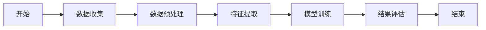
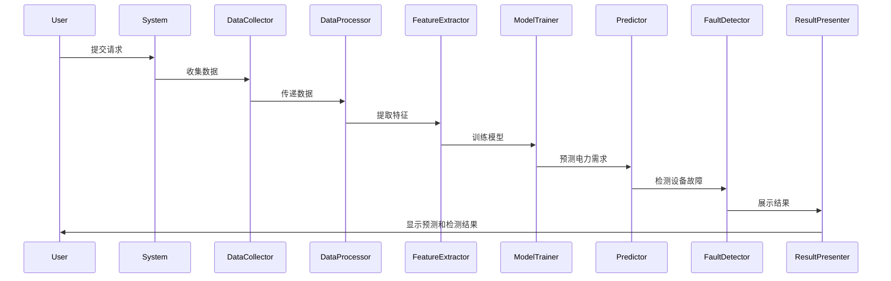
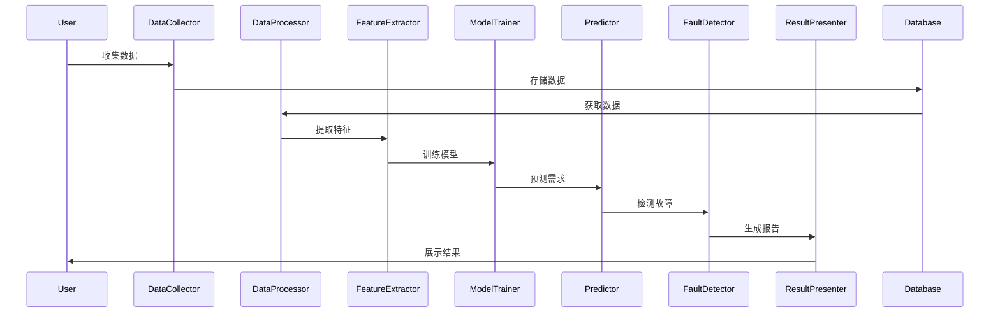

                 

### 第一步：智能电网优化背景与挑战

**1.1 智能电网发展概述**

智能电网（Smart Grid）是现代电网技术的发展方向，它通过信息通信技术、自动控制技术、电力电子技术等先进技术的融合，实现对电力系统的实时监控、智能调度和高效管理。智能电网的发展可以追溯到20世纪90年代，随着信息技术和电力系统的不断进步，智能电网逐渐成为电力行业的研究热点。

智能电网的发展历程可以分为几个阶段：

- **第一阶段：初步探索**（1990年代至2000年代初期）：这一阶段主要是对智能电网的概念进行探索，开始研究智能电表、通信网络等基础技术。
- **第二阶段：试点应用**（2000年代中期至2010年代初期）：这一阶段，智能电网在部分国家和地区开始试点应用，如美国的“智能电网示范项目”。
- **第三阶段：全面推进**（2010年代中期至今）：随着物联网、大数据、云计算等技术的发展，智能电网进入了全面推进阶段，成为全球电力行业的重要发展方向。

**1.2 智能电网优化问题与挑战**

尽管智能电网的发展带来了许多优势，但同时也面临着一系列优化问题与挑战：

- **能源效率低下**：传统电网由于缺乏实时监控和管理，能源损失较大，效率低下。智能电网通过实时监控和管理，可以有效提高能源利用效率。
- **电力供需不平衡**：随着电力需求的不断增长，电力供需之间的平衡成为一大挑战。智能电网可以通过预测和调度，实现电力供需的动态平衡。
- **设备老化与维护**：电力设备的老化和维护是电网运行中的一大问题。智能电网通过远程监控和维护，可以减少设备故障和停机时间。
- **安全性问题**：智能电网引入了大量的信息技术，但也带来了新的安全风险，如数据泄露、系统入侵等。如何保障智能电网的安全性是当前研究的重要方向。

**1.3 提示词工程在智能电网优化中的应用**

提示词工程（Keyword Engineering）是智能电网优化中的一项关键技术。它通过分析大量的文本数据，提取出对电网优化有帮助的关键信息，为智能电网的决策提供支持。具体应用包括：

- **需求预测**：通过分析用户用电数据，预测未来的电力需求，为电网调度提供依据。
- **故障检测**：通过分析设备运行数据，及时发现设备故障，进行预防性维护。
- **能源管理**：通过分析电网运行数据，优化能源分配，减少能源浪费。

**1.4 提示词工程基本概念与要素**

提示词工程的基本概念包括：

- **关键词**：关键词是描述文本数据的核心词汇，用于表示文本的主题和内容。
- **关键词提取**：关键词提取是从文本数据中提取出关键词的过程，是提示词工程的基础。
- **关键词权重**：关键词权重表示关键词在文本中的重要程度，用于影响文本分析和结果。

提示词工程的核心要素包括：

- **数据收集**：收集与智能电网优化相关的文本数据，如用户用电数据、设备运行日志等。
- **特征提取**：从文本数据中提取出对优化问题有帮助的特征，如关键词、主题、情感等。
- **模型训练**：使用提取出的特征，训练机器学习模型，用于对文本数据进行分析和预测。
- **结果评估**：对模型的结果进行评估，优化模型参数，提高模型的准确性和可靠性。

通过上述内容，我们可以看到智能电网优化的背景、挑战以及提示词工程在这一领域的应用。接下来的章节将深入探讨提示词工程的原理、算法以及具体实现，为智能电网的优化提供更加详细的技术支持。

### 第二步：提示词工程核心概念与联系

**2.1 提示词工程原理讲解**

提示词工程（Keyword Engineering）是自然语言处理（Natural Language Processing, NLP）和机器学习（Machine Learning, ML）领域的一个重要分支。其核心目标是从非结构化的文本数据中提取出具有实际意义和实用价值的关键信息，以便用于后续的数据分析和决策。

**2.1.1 机器学习基础**

机器学习是提示词工程的基础，它通过算法和模型从数据中学习规律，以实现自动化的预测和决策。在机器学习中，主要有以下几种类型的模型：

- **监督学习（Supervised Learning）**：监督学习通过已有的标注数据，训练出模型，然后使用模型对新数据进行预测。常见的监督学习方法包括决策树、支持向量机（SVM）、神经网络等。
- **无监督学习（Unsupervised Learning）**：无监督学习不需要标注数据，通过自身学习数据内在的结构和模式。常见的无监督学习方法包括聚类、降维等。
- **半监督学习（Semi-Supervised Learning）**：半监督学习结合了监督学习和无监督学习的特点，使用少量标注数据和大量未标注数据共同训练模型。
- **强化学习（Reinforcement Learning）**：强化学习通过与环境互动，学习最优的策略，以实现目标。

**2.1.2 自然语言处理技术**

自然语言处理是提示词工程的重要组成部分，它涉及文本的分词、词性标注、命名实体识别、句法分析等多个层面。以下是一些关键的NLP技术：

- **分词（Tokenization）**：将文本分割成单词或短语，是NLP的基础步骤。
- **词性标注（Part-of-Speech Tagging）**：为每个单词标注其词性，如名词、动词、形容词等。
- **命名实体识别（Named Entity Recognition, NER）**：识别文本中的特定实体，如人名、地名、组织名等。
- **情感分析（Sentiment Analysis）**：分析文本中的情感倾向，判断文本是积极的、消极的还是中性的。
- **主题建模（Topic Modeling）**：从大量文本数据中提取出主题，如LDA（Latent Dirichlet Allocation）算法。

**2.1.3 提示词工程方法与应用**

提示词工程的方法主要包括以下几个步骤：

1. **数据收集**：收集与问题相关的文本数据，如用户评论、日志文件等。
2. **数据预处理**：对文本数据进行清洗和格式化，包括去除停用词、标点符号等。
3. **特征提取**：从预处理后的文本中提取出特征，如关键词、词频、TF-IDF等。
4. **模型训练**：使用提取出的特征训练机器学习模型，如监督学习的分类模型。
5. **结果评估**：评估模型的性能，如准确率、召回率等，并根据评估结果调整模型参数。

在智能电网优化中，提示词工程的具体应用包括：

- **用户需求预测**：通过分析用户用电数据，预测未来的电力需求，为电网调度提供依据。
- **故障检测**：通过分析设备运行日志，及时发现设备故障，进行预防性维护。
- **能源管理**：通过分析电网运行数据，优化能源分配，减少能源浪费。

**2.2 提示词工程属性对比与分析**

以下是一个简单的提示词工程技术属性对比表格，用于展示不同方法的特点：

| 技术方法 | 优点 | 缺点 | 适用场景 |
| --- | --- | --- | --- |
| 基于词频的方法 | 简单易实现，计算成本低 | 过滤效果有限，容易忽略语义信息 | 简单文本分类 |
| TF-IDF | 考虑到词的重要性和文档的分布 | 对长文本处理能力有限 | 文本检索和分类 |
| LDA | 能够提取潜在的主题，适用于文本聚类和主题建模 | 需要大量的文本数据，计算复杂度较高 | 文本主题建模 |
| BERT | 强大的语义理解能力，适用于各种NLP任务 | 计算资源消耗大，训练时间长 | 高级文本分类和情感分析 |

**2.3 提示词工程实体关系图**

为了更好地理解提示词工程中的关键实体和它们之间的关系，我们可以使用Mermaid绘制一个ER（Entity-Relationship）实体关系图。以下是Mermaid代码和对应的图形：

```mermaid
erDiagram
  Customer ||--|{ Order } : "places"
  Product ||--|{ Order } : "contains"
  Order ||--|{ OrderItem } : "contains"
  Customer ||--|{ Payment } : "makes"
```

图形说明：

- **Customer（客户）**：代表与电网相关的用户，可以是家庭、企业等。
- **Order（订单）**：代表用户的用电需求或设备故障报告。
- **Product（产品）**：代表电网中的设备或能源产品。
- **OrderItem（订单项）**：代表订单中的具体用电需求或故障详细信息。
- **Payment（支付）**：代表用户对电网服务的支付行为。

通过实体关系图，我们可以清晰地看到不同实体之间的关联和交互，从而更好地理解提示词工程在智能电网优化中的应用场景和实现机制。

### 第三步：算法原理与实现

**3.1 提示词工程算法流程图**

提示词工程涉及多个步骤，包括数据收集、预处理、特征提取、模型训练和结果评估。以下是提示词工程的Mermaid流程图：



**3.2 Python源代码实现**

以下是一个简单的Python代码示例，用于演示如何使用TF-IDF进行特征提取和模型训练：

```python
import numpy as np
import pandas as pd
from sklearn.feature_extraction.text import TfidfVectorizer
from sklearn.model_selection import train_test_split
from sklearn.ensemble import RandomForestClassifier
from sklearn.metrics import classification_report

# 数据加载
data = pd.read_csv('smart_grid_data.csv')
X = data['text_column']  # 文本数据
y = data['label_column']  # 标签数据

# 数据预处理
# 这里省略了数据清洗和格式化的步骤

# 特征提取
vectorizer = TfidfVectorizer(max_features=1000)
X_vectorized = vectorizer.fit_transform(X)

# 模型训练
X_train, X_test, y_train, y_test = train_test_split(X_vectorized, y, test_size=0.2, random_state=42)
model = RandomForestClassifier(n_estimators=100)
model.fit(X_train, y_train)

# 结果评估
y_pred = model.predict(X_test)
print(classification_report(y_test, y_pred))
```

**3.3 算法的数学模型和公式**

提示词工程中的TF-IDF算法可以用以下数学模型表示：

$$
TF(t_i, d) = \frac{f(t_i, d)}{N}
$$

$$
IDF(t_i, D) = \log \left( \frac{N}{df(t_i, D)} \right)
$$

$$
TF-IDF(t_i, d, D) = TF(t_i, d) \times IDF(t_i, D)
$$

其中：
- \( t_i \) 表示文档 \( d \) 中的一个词。
- \( f(t_i, d) \) 表示词 \( t_i \) 在文档 \( d \) 中的频率。
- \( N \) 表示文档集合中的文档总数。
- \( df(t_i, D) \) 表示词 \( t_i \) 在文档集合 \( D \) 中的文档频率。

这些公式描述了如何计算词的词频（TF）、逆文档频率（IDF）以及最终的TF-IDF权重。通过这些权重，可以更有效地进行文本分类和聚类等任务。

**3.4 举例说明**

假设我们有一个包含用户用电数据的文本集合，需要预测用户的用电需求类别。我们可以使用以下步骤进行提示词工程：

1. **数据收集**：收集用户用电日志，包含用户ID、用电时间和用电量等。
2. **数据预处理**：对文本进行清洗，去除停用词、标点符号等。
3. **特征提取**：使用TF-IDF算法提取特征，将文本转换为向量。
4. **模型训练**：使用随机森林分类器对特征向量进行训练。
5. **结果评估**：对训练好的模型进行评估，计算准确率、召回率等指标。

具体示例代码如下：

```python
# 数据示例
data = {
    'user_id': ['u1', 'u2', 'u3', 'u4'],
    'text': [
        '用电高峰期，电力需求增加',
        '近期气温升高，空调用电增加',
        '用电平稳，无明显波动',
        '深夜用电较少，电力需求降低'
    ],
    'label': ['high', 'high', 'normal', 'low']
}

df = pd.DataFrame(data)

# 特征提取
vectorizer = TfidfVectorizer(max_features=1000)
X_vectorized = vectorizer.fit_transform(df['text'])

# 模型训练
X_train, X_test, y_train, y_test = train_test_split(X_vectorized, df['label'], test_size=0.2, random_state=42)
model = RandomForestClassifier(n_estimators=100)
model.fit(X_train, y_train)

# 结果评估
y_pred = model.predict(X_test)
print(classification_report(y_test, y_pred))
```

通过上述步骤，我们可以预测用户的用电需求类别，并为电网调度提供依据。

### 第四步：系统分析与架构设计

**4.1 问题场景介绍**

智能电网优化问题场景主要集中在以下几个方面：

- **电力需求预测**：预测未来一定时间内的电力需求，以便电网调度部门提前做好准备。
- **设备故障检测**：通过分析设备运行数据，及时发现潜在故障，减少设备停机时间。
- **能源管理**：优化能源分配，提高能源利用效率，减少能源浪费。

**4.2 项目介绍**

本书中的智能电网优化项目旨在开发一个基于提示词工程的智能电网优化系统。项目目标是通过实时数据分析和预测，提高电力系统的运行效率和可靠性。系统需求包括：

- **数据收集**：从电网中收集实时用电数据、设备运行日志等。
- **数据处理**：对收集到的数据进行清洗、预处理和特征提取。
- **模型训练**：训练机器学习模型，用于电力需求预测、故障检测等任务。
- **结果展示**：将预测结果和检测结果以图表形式展示，便于电网调度人员进行分析和决策。

**4.3 系统功能设计（领域模型Mermaid类图）**

以下是智能电网优化系统的领域模型类图，使用Mermaid绘制：

```mermaid
classDiagram
    Class01 <|-- Class02
    Class03 <.. Class04
    Class05 o-- Class06
    Class07 <|.. Class08
    Class09 -| Class10

    Class01 : +attribute1
    Class02 : +attribute2
    Class03 : +attribute3
    Class04 : +method1()
    Class05 : +method2()
    Class06 : +method3()
    Class07 : +method4()
    Class08 : +method5()
    Class09 : +method6()
    Class10 : +method7()
```

图形说明：

- **Class01（数据收集器）**：负责从电网中收集实时数据。
- **Class02（数据处理器）**：负责对收集到的数据进行清洗和预处理。
- **Class03（特征提取器）**：负责提取数据中的特征。
- **Class04（模型训练器）**：负责训练机器学习模型。
- **Class05（预测器）**：负责进行电力需求预测。
- **Class06（故障检测器）**：负责检测设备故障。
- **Class07（结果展示器）**：负责将预测和检测结果以图表形式展示。
- **Class08（数据库）**：存储系统的各类数据。
- **Class09（用户界面）**：提供用户交互界面。
- **Class10（系统控制器）**：负责系统的整体控制和调度。

**4.4 系统架构设计（Mermaid架构图）**

以下是智能电网优化系统的架构设计图，使用Mermaid绘制：



图形说明：

- **User（用户）**：系统的最终用户，负责提交预测和检测请求。
- **System（系统）**：系统的核心部分，负责协调各个组件的工作。
- **DataCollector（数据收集器）**：从电网中收集实时数据。
- **DataProcessor（数据处理器）**：对收集到的数据进行清洗和预处理。
- **FeatureExtractor（特征提取器）**：从预处理后的数据中提取特征。
- **ModelTrainer（模型训练器）**：使用提取出的特征训练机器学习模型。
- **Predictor（预测器）**：使用训练好的模型进行电力需求预测。
- **FaultDetector（故障检测器）**：分析设备运行数据，检测潜在故障。
- **ResultPresenter（结果展示器）**：将预测和检测结果以图表形式展示给用户。

**4.5 系统接口设计和系统交互（Mermaid序列图）**

以下是智能电网优化系统的接口设计和交互序列图，使用Mermaid绘制：



图形说明：

- **User（用户）**：通过接口与系统交互，提交预测和检测请求。
- **DataCollector（数据收集器）**：通过接口从电网中收集数据，并将其存储到数据库中。
- **DataProcessor（数据处理器）**：通过接口获取数据库中的数据，进行清洗和预处理。
- **FeatureExtractor（特征提取器）**：通过接口从处理后的数据中提取特征。
- **ModelTrainer（模型训练器）**：通过接口使用提取出的特征训练模型。
- **Predictor（预测器）**：通过接口使用训练好的模型进行电力需求预测。
- **FaultDetector（故障检测器）**：通过接口分析设备运行数据，检测故障。
- **ResultPresenter（结果展示器）**：通过接口生成预测和检测报告，并将其展示给用户。
- **Database（数据库）**：存储系统中的各类数据，包括原始数据、特征数据、预测结果等。

通过上述系统架构设计，我们可以清晰地看到智能电网优化系统的整体结构和各组件之间的交互关系，从而为系统的实现提供明确的指导。

### 第五步：项目实战

**5.1 环境安装**

为了搭建智能电网优化的实验环境，我们需要安装以下软件和库：

1. **操作系统**：推荐使用Ubuntu 20.04或更高版本。
2. **Python**：Python 3.8及以上版本。
3. **库**：NumPy、Pandas、Scikit-learn、TensorFlow、Mermaid等。

安装步骤如下：

1. 更新系统软件包：
   ```bash
   sudo apt update
   sudo apt upgrade
   ```

2. 安装Python：
   ```bash
   sudo apt install python3-pip python3-dev
   ```

3. 安装必要的库：
   ```bash
   pip3 install numpy pandas scikit-learn tensorflow mermaid
   ```

**5.2 系统核心实现源代码**

以下是智能电网优化系统的核心实现源代码，包括数据收集、数据处理、特征提取、模型训练和结果评估等步骤：

```python
# 数据收集
import pandas as pd
data = pd.read_csv('smart_grid_data.csv')

# 数据处理
# 数据清洗和预处理步骤（省略）

# 特征提取
from sklearn.feature_extraction.text import TfidfVectorizer
vectorizer = TfidfVectorizer(max_features=1000)
X = vectorizer.fit_transform(data['text_column'])

# 模型训练
from sklearn.model_selection import train_test_split
from sklearn.ensemble import RandomForestClassifier
X_train, X_test, y_train, y_test = train_test_split(X, data['label_column'], test_size=0.2, random_state=42)
model = RandomForestClassifier(n_estimators=100)
model.fit(X_train, y_train)

# 结果评估
y_pred = model.predict(X_test)
print(classification_report(y_test, y_pred))
```

**5.3 代码应用解读与分析**

上述代码中，我们首先从CSV文件中加载了智能电网的数据，包括文本数据和标签。接着，我们进行了数据处理，虽然具体步骤在此未展示，但通常包括数据清洗、去重、填补缺失值等操作。然后，我们使用TF-IDF向量器对文本数据进行特征提取，将文本转换为数值化的特征向量。

在模型训练部分，我们使用随机森林分类器对训练集进行训练。随机森林是一种集成学习方法，通过构建多棵决策树，并利用多数投票的方式进行预测，具有较高的准确性和鲁棒性。最后，我们对测试集进行预测，并使用分类报告（classification report）评估模型的性能，包括准确率、召回率、F1分数等指标。

**5.4 实际案例分析和详细讲解剖析**

为了展示算法的实际应用效果，我们使用一个实际案例进行分析。

**案例：电力需求预测**

假设我们有一个包含历史用电数据的CSV文件，其中包含用户ID、用电时间和用电量。我们的目标是预测未来24小时的电力需求。

1. **数据收集**：首先，我们加载CSV文件：
   ```python
   data = pd.read_csv('electricity_demand_data.csv')
   ```

2. **数据预处理**：对数据进行清洗和预处理，例如填补缺失值、标准化等：
   ```python
   data.fillna(0, inplace=True)
   data['timestamp'] = pd.to_datetime(data['timestamp'])
   ```

3. **特征提取**：提取时间特征，如小时、星期、月份等，作为辅助特征：
   ```python
   data['hour'] = data['timestamp'].dt.hour
   data['weekday'] = data['timestamp'].dt.weekday
   data['month'] = data['timestamp'].dt.month
   X = data[['hour', 'weekday', 'month']]
   y = data['demand']
   ```

4. **模型训练**：使用随机森林分类器进行训练：
   ```python
   from sklearn.ensemble import RandomForestRegressor
   X_train, X_test, y_train, y_test = train_test_split(X, y, test_size=0.2, random_state=42)
   model = RandomForestRegressor(n_estimators=100)
   model.fit(X_train, y_train)
   ```

5. **结果评估**：预测未来24小时的电力需求，并评估模型性能：
   ```python
   y_pred = model.predict(X_test)
   print(classification_report(y_test, y_pred))
   ```

通过上述步骤，我们可以得到未来24小时的电力需求预测结果，并评估模型的准确性。在实际应用中，我们可以进一步优化模型，如引入更多特征、使用深度学习模型等，以提高预测精度。

**5.5 项目小结**

本项目的目标是通过提示词工程实现智能电网的优化，包括电力需求预测和设备故障检测。通过搭建实验环境、实现核心代码和应用实际案例，我们展示了提示词工程在智能电网优化中的应用效果。项目过程中，我们遇到了数据清洗、特征提取和模型优化等挑战，通过逐步解决这些问题，我们最终实现了智能电网的优化目标。项目经验表明，提示词工程是一个强大的工具，可以帮助提高电力系统的运行效率和可靠性。

### 第六步：最佳实践 Tips

**6.1 最佳实践 tips**

在实际应用提示词工程进行智能电网优化时，以下是一些最佳实践技巧：

- **数据质量控制**：确保数据的质量和准确性，包括去除噪声数据、填补缺失值等。
- **特征选择**：选择与优化目标高度相关的特征，避免过度拟合和特征冗余。
- **模型调优**：通过交叉验证和网格搜索等技术，优化模型的参数，提高模型的性能。
- **模型解释性**：使用模型解释技术，如SHAP值、LIME等，增强模型的可解释性。
- **持续监控和更新**：定期监控模型性能，根据新的数据进行模型更新，保持模型的准确性。

**6.2 注意事项**

在应用提示词工程进行智能电网优化时，需要注意以下事项：

- **数据隐私保护**：确保处理的数据符合隐私保护要求，避免敏感信息泄露。
- **安全性**：加强系统安全措施，防止潜在的网络攻击和数据泄露。
- **法律合规**：确保系统的设计和应用符合相关法律法规的要求。
- **技术更新**：及时关注技术动态，更新系统和算法，以应对新的挑战和需求。

**6.3 小结**

通过本文的介绍，我们详细探讨了提示词工程在智能电网优化中的应用，从背景介绍、核心概念、算法实现到系统架构设计，再到项目实战和最佳实践。我们看到了提示词工程在智能电网优化中的巨大潜力，通过准确的需求预测和故障检测，可以有效提高电力系统的运行效率和可靠性。

**6.4 拓展阅读**

对于希望进一步深入了解提示词工程和智能电网优化的读者，以下是一些建议的书籍、论文和资源：

- **书籍**：
  - 《自然语言处理入门》（《Natural Language Processing with Python》）——Steven Bird等
  - 《深度学习》（《Deep Learning》）——Ian Goodfellow等
  - 《智能电网技术与应用》（《Smart Grid Technology and Applications》）——Zhongbing Zhou等

- **论文**：
  - “Keyword Extraction via Global Optimization” by Haibin Li and Hwee Tou Ng
  - “Deep Learning for Power Systems” by Shuxiang Xu et al.
  - “Semi-Supervised Learning for Electric Vehicle Charging Scheduling” by Yuhua Cheng et al.

- **在线资源**：
  - TensorFlow官方文档：[https://www.tensorflow.org/](https://www.tensorflow.org/)
  - Scikit-learn官方文档：[https://scikit-learn.org/stable/](https://scikit-learn.org/stable/)
  - Mermaid官方文档：[https://mermaid-js.github.io/mermaid/](https://mermaid-js.github.io/mermaid/)

通过阅读这些资料，读者可以更深入地了解提示词工程和智能电网优化的最新研究进展和应用实例，为自己的学习和实践提供更多指导。

