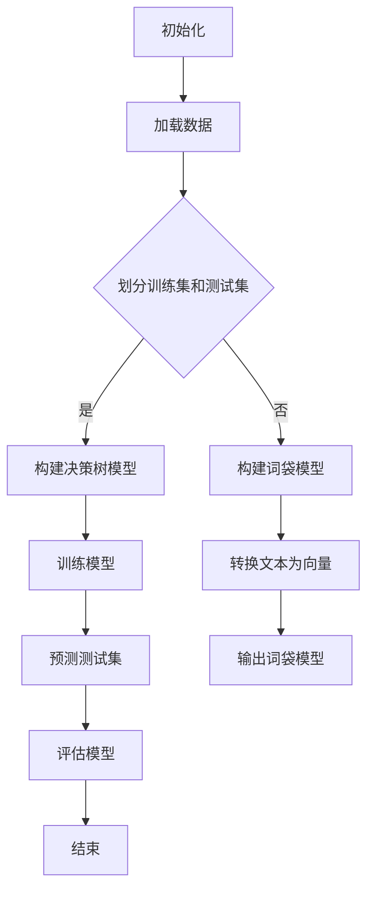
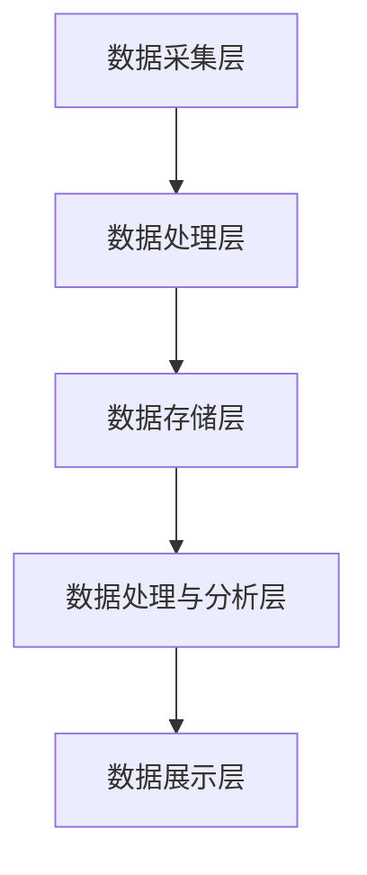
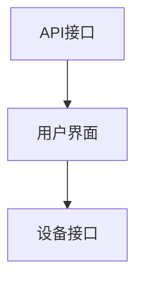
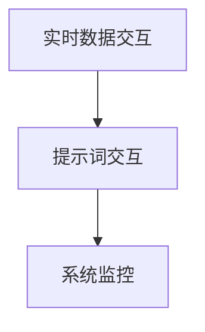

                 

### 智能电网系统的概述

智能电网系统（Smart Grid System）是现代电力系统中的一项关键技术，它结合了现代通信技术、信息技术、计算机技术和自动化控制技术，实现对电力系统的全面监控、智能调度和管理。智能电网系统的概念最早可以追溯到20世纪90年代，随着全球能源危机和环境问题的加剧，智能电网的研究与应用逐渐受到广泛关注。

#### **一、发展背景**

智能电网的发展背景主要源于以下几个方面：

1. **能源需求的增长**：随着全球经济的发展，人们对电力的需求不断增长，传统的电网系统已经难以满足日益增长的用电需求。
2. **环境问题**：传统电网系统中存在的能源浪费和环境污染问题日益严重，需要通过技术手段进行优化和解决。
3. **可再生能源的兴起**：太阳能、风能等可再生能源的广泛应用，需要智能电网系统实现高效接入和智能调度。

#### **二、重要性**

智能电网系统在现代社会中的作用和重要性体现在以下几个方面：

1. **提高电力系统的可靠性和稳定性**：通过智能电网系统，可以实时监测电力系统的运行状态，及时发现问题并采取措施，从而提高电力系统的可靠性和稳定性。
2. **优化能源分配**：智能电网系统可以实现能源的优化分配，降低能源浪费，提高能源利用效率。
3. **促进可再生能源的应用**：智能电网系统可以通过智能调度和管理，实现可再生能源的高效接入和应用，降低对化石能源的依赖。
4. **提升用户体验**：智能电网系统可以提供更加灵活和个性化的用电服务，提升用户的用电体验。

#### **三、在现代社会中的作用**

1. **能源管理**：智能电网系统通过实时监控和数据分析，实现对电力资源的有效管理，降低能源浪费。
2. **电力调度**：智能电网系统可以实现电力的高效调度，确保电力供需的平衡，提高电网运行效率。
3. **故障诊断与修复**：智能电网系统可以实时监测电力系统的运行状态，发现故障并及时修复，减少停电时间和损失。
4. **智能化服务**：智能电网系统可以为用户提供智能化服务，如远程抄表、智能用电建议等，提升用户体验。

总之，智能电网系统作为一种新兴的技术体系，在现代社会中具有广泛的应用前景和重要的战略地位。通过不断地技术革新和应用推广，智能电网系统将更好地服务于社会和经济的发展。接下来，我们将深入探讨提示词工程在智能电网系统中的应用，探讨如何通过先进的人工智能技术进一步提升智能电网系统的智能化水平和运营效率。

### 提示词工程的概述

提示词工程（Keyword Engineering）是一种专门用于信息检索、自然语言处理和人工智能领域的技术，它通过设计、选择和优化关键词，帮助计算机系统更好地理解和处理人类语言。提示词工程在智能电网系统中具有重要的应用价值，可以提升系统的智能化水平，优化电力资源的调度和管理。

#### **一、基本概念**

提示词（Keyword）是指用来描述信息内容的关键词语或短语，通常具有高度的信息浓缩性和概括性。在信息检索中，提示词是实现信息定位和检索的重要工具。提示词工程则是对提示词的设计、选择、优化和应用的一系列技术方法。

#### **二、发展历程**

提示词工程的概念最早可以追溯到20世纪60年代的“关键词索引”技术，随着计算机技术和信息检索技术的发展，提示词工程逐渐演变为一门独立的学科。20世纪80年代以来，随着自然语言处理和人工智能技术的进步，提示词工程得到了广泛的应用和发展。

#### **三、在智能电网系统中的应用价值**

1. **信息检索和数据分析**：在智能电网系统中，大量的电力数据需要被处理和分析。通过使用提示词工程，可以高效地定位和提取相关的数据信息，为电力调度和管理提供有力支持。
2. **智能监控和故障诊断**：智能电网系统需要实时监控电力设备的运行状态，通过提示词工程，可以自动识别和诊断潜在故障，提高电网的可靠性和安全性。
3. **用户服务与互动**：智能电网系统可以提供个性化的用户服务，通过提示词工程，系统可以更好地理解用户的需求和反馈，提供更加精准和高效的服务。

#### **四、智能电网系统中的提示词应用**

1. **数据标签和分类**：在智能电网系统中，通过对电力数据进行标签和分类，可以更好地组织和存储数据，方便后续的数据分析和处理。
2. **自然语言处理**：智能电网系统中的操作指令、故障报告等通常以自然语言的形式出现，通过提示词工程，可以自动提取和理解这些语言信息，实现智能交互和操作。
3. **智能调度与优化**：在电力调度过程中，通过提示词工程，可以自动识别和筛选关键信息，优化调度策略，提高电网的运行效率和稳定性。

总之，提示词工程在智能电网系统中具有广泛的应用价值，通过设计、选择和优化提示词，可以提升系统的智能化水平，优化电力资源的调度和管理，实现更高效、更可靠的电力供应。在接下来的部分，我们将进一步探讨提示词工程的基本概念和原理，以及其在智能电网系统中的具体应用。

### 提示词工程的基本概念

提示词工程是一门专注于提高信息检索效率和信息处理能力的交叉学科，它结合了自然语言处理、信息科学、计算机科学等多个领域的知识。在智能电网系统中，提示词工程通过设计、选择和优化关键词，帮助系统更好地理解和处理与电力相关的自然语言信息。

#### **一、定义与作用**

提示词工程的目标是构建一个高效的提示词系统，以便在大量数据中快速准确地找到所需的信息。提示词（Keyword）的定义通常包括以下几点：

1. **选择性**：提示词能够高度概括和代表信息的主要内容，具有信息浓缩性。
2. **准确性**：提示词能够准确地反映信息的关键特征，避免歧义。
3. **扩展性**：提示词系统需要具备一定的扩展性，能够适应新信息的加入和变化。

提示词在智能电网系统中的作用主要体现在以下几个方面：

1. **信息检索**：通过提示词，用户可以快速定位和检索到与电力相关的数据和信息。
2. **数据分析**：提示词有助于对大量电力数据进行分类、聚类和关联分析，提升数据分析的效率。
3. **智能监控**：提示词可以用于自动识别和监测电力系统中的异常状态，提高故障诊断的准确性和及时性。
4. **用户交互**：提示词工程可以优化用户与智能电网系统的交互体验，提供更加智能和个性化的服务。

#### **二、分类与特性**

提示词可以根据不同的应用场景和需求进行分类，常见的分类方法包括：

1. **主题性提示词**：这类提示词主要用来描述信息的主要内容，通常具有高度的主题相关性。
2. **功能性提示词**：这类提示词用来描述信息的功能特征，通常用于信息的操作和功能分类。
3. **情感性提示词**：这类提示词用来描述信息中的情感色彩和态度，通常用于情感分析和用户满意度评估。

提示词的典型特性包括：

1. **简洁性**：提示词应该尽量简洁，避免冗长和复杂的表述。
2. **普遍性**：提示词应该具有广泛的通用性，能够被不同背景和领域的用户理解和使用。
3. **准确性**：提示词需要准确地反映信息的关键特征，避免模糊和误导性的描述。

#### **三、生成与优化**

提示词的生成和优化是提示词工程的核心任务，其过程通常包括以下几个步骤：

1. **数据采集**：从大量文本数据中提取潜在的提示词。
2. **词频统计**：统计各个词的出现频率，选择频率较高的词作为候选提示词。
3. **语义分析**：通过自然语言处理技术，对候选提示词进行语义分析，筛选出具有高相关性和准确性的提示词。
4. **用户反馈**：根据用户的使用反馈，对提示词进行优化和调整，提升其实用性和用户体验。

在智能电网系统中，提示词的生成和优化需要充分考虑电力系统的专业术语和语境特点，确保提示词能够准确、全面地描述电力信息和需求。

总之，提示词工程在智能电网系统中具有至关重要的作用，通过合理的设计、选择和优化提示词，可以显著提升系统的智能化水平，优化电力资源的调度和管理，实现更加高效和可靠的电力服务。在接下来的部分，我们将进一步探讨提示词工程中的关键技术，如机器学习和自然语言处理算法，以及这些技术在智能电网系统中的应用。

### 核心概念与联系

为了深入理解提示词工程在智能电网系统中的应用，我们需要明确几个核心概念，并分析它们之间的内在联系。这些核心概念包括智能电网系统、提示词工程以及智能电网系统中的提示词应用。

#### **一、智能电网系统**

智能电网系统是一个高度集成化的电力网络，它通过现代通信技术、信息技术和自动化控制技术，实现了对电力系统的全面监控、智能调度和管理。智能电网系统的核心要素包括：

1. **电力设备**：包括发电设备、输电设备、变电设备和配电设备等。
2. **通信网络**：用于传输电力数据和监控信息，确保系统的实时性和可靠性。
3. **数据处理与分析系统**：用于对电力数据进行实时处理和分析，提供决策支持。
4. **用户互动界面**：用于与电力用户进行交互，提供个性化服务和用电建议。

#### **二、提示词工程**

提示词工程是一种专门用于信息检索和自然语言处理的技术，通过设计、选择和优化关键词，帮助计算机系统更好地理解和处理人类语言。提示词工程的基本概念包括：

1. **提示词**：用来描述信息内容的关键词或短语，具有高度的信息浓缩性和概括性。
2. **提示词系统**：用于存储和管理提示词的数据库和工具。
3. **提示词生成与优化**：通过自然语言处理技术，从大量文本数据中提取和优化提示词。

#### **三、智能电网系统中的提示词应用**

在智能电网系统中，提示词的应用场景主要包括以下几个方面：

1. **信息检索**：通过提示词，用户可以快速检索到与电力相关的数据和信息。
2. **数据分析**：提示词有助于对大量电力数据进行分类、聚类和关联分析，提升数据分析的效率。
3. **智能监控**：提示词可以用于自动识别和监测电力系统中的异常状态，提高故障诊断的准确性和及时性。
4. **用户交互**：提示词工程可以优化用户与智能电网系统的交互体验，提供更加智能和个性化的服务。

#### **四、概念之间的联系**

智能电网系统和提示词工程之间的联系主要体现在以下几个方面：

1. **数据融合**：智能电网系统提供了大量的电力数据，这些数据通过提示词工程进行筛选和处理，形成有用的信息。
2. **智能化**：提示词工程通过智能化的信息处理技术，提升了智能电网系统的智能化水平。
3. **用户体验**：智能电网系统中的提示词应用，不仅提高了信息检索和分析的效率，还优化了用户与系统的交互体验。

为了更好地展示这些概念之间的联系，我们可以构建一个ER（Entity-Relationship）实体关系图。以下是该图的一个简单示例：

```
[智能电网系统]
├── [电力设备]
│   ├── [发电设备]
│   │   └── [风机]
│   │       └── [提示词]
│   ├── [输电设备]
│   │   └── [线路]
│   │       └── [提示词]
│   ├── [变电设备]
│   │   └── [变电站]
│   │       └── [提示词]
│   └── [配电设备]
│       └── [配电网络]
│           └── [提示词]
├── [通信网络]
│   └── [数据传输]
│       └── [提示词]
└── [数据处理与分析系统]
    └── [数据仓库]
        └── [提示词]
[提示词工程]
├── [提示词]
│   └── [语义分析]
├── [提示词系统]
│   └── [数据库管理]
└── [用户交互界面]
    └── [用户反馈]
```

在这个ER实体关系图中，智能电网系统的各个实体（如电力设备、通信网络、数据处理与分析系统）都与提示词工程中的相关实体（如提示词、提示词系统、用户交互界面）建立了联系。通过这个关系图，我们可以清晰地看到智能电网系统和提示词工程之间的数据流动和功能交互。

总之，智能电网系统和提示词工程之间的紧密联系，使得提示词工程能够为智能电网系统提供强大的信息处理和智能化支持。在接下来的部分，我们将深入探讨提示词工程中的关键技术，如机器学习和自然语言处理算法，以及这些技术在智能电网系统中的应用。

### 算法原理讲解

在提示词工程中，关键技术的应用至关重要。这些技术包括机器学习和自然语言处理算法，它们为智能电网系统的智能化提供了强有力的支持。下面我们将详细讲解这些算法的原理，并通过Python代码实现和LaTeX公式展示，帮助读者更好地理解。

#### **一、机器学习算法**

机器学习算法是提示词工程中的核心组成部分，它通过训练模型来学习数据中的规律，从而实现对提示词的自动生成和优化。以下是一种常用的机器学习算法——决策树（Decision Tree）在提示词工程中的应用。

1. **算法原理**

决策树是一种基于特征划分数据集的算法。它通过递归地将数据集划分成子集，直到满足某些终止条件为止。决策树由若干个内部节点和叶子节点组成，内部节点表示特征划分，叶子节点表示数据划分的结果。

2. **Python代码实现**

```python
from sklearn.datasets import load_iris
from sklearn.tree import DecisionTreeClassifier
from sklearn.model_selection import train_test_split

# 加载数据集
iris = load_iris()
X, y = iris.data, iris.target

# 划分训练集和测试集
X_train, X_test, y_train, y_test = train_test_split(X, y, test_size=0.3, random_state=42)

# 构建决策树模型
clf = DecisionTreeClassifier()
clf.fit(X_train, y_train)

# 预测测试集
y_pred = clf.predict(X_test)
```

3. **LaTeX公式展示**

$$
\text{决策树分类过程：}
\\
\text{如果 } X \text{ 满足条件 } C_1, \text{ 则分类为 } y_1;
\\
\text{否则如果 } X \text{ 满足条件 } C_2, \text{ 则分类为 } y_2;
\\
\text{...}
\\
\text{否则分类为 } y_n.
$$

#### **二、自然语言处理算法**

自然语言处理（Natural Language Processing, NLP）算法在提示词工程中主要用于文本数据的预处理和语义分析。以下是一种常用的NLP算法——词袋模型（Bag of Words, BOW）在提示词工程中的应用。

1. **算法原理**

词袋模型将文本表示为一个向量，其中每个维度对应一个单词，向量的值表示该单词在文本中出现的次数。词袋模型不考虑文本的顺序和语法结构，只关注单词的频率。

2. **Python代码实现**

```python
from sklearn.feature_extraction.text import CountVectorizer

# 示例文本
corpus = [
    '我喜欢的食物是苹果',
    '我喜欢吃香蕉',
    '苹果和香蕉都是水果'
]

# 构建词袋模型
vectorizer = CountVectorizer()
X = vectorizer.fit_transform(corpus)

# 打印词袋模型
print(X.toarray())
```

3. **LaTeX公式展示**

$$
\text{词袋模型：}
\\
\text{对于每个单词 } w_i, \text{ 计算其在文本 } T \text{ 中的频率 } f(w_i);
\\
\text{将文本 } T \text{ 表示为向量 } \textbf{v} = [f(w_1), f(w_2), ..., f(w_n)].
$$

#### **三、算法流程图**

为了更好地理解上述算法的流程，我们可以使用Mermaid绘制算法流程图。



通过上述讲解和代码示例，我们可以看到机器学习和自然语言处理算法在提示词工程中的具体应用。这些算法不仅能够自动生成和优化提示词，还能够提升智能电网系统的智能化水平和数据处理能力。

#### **四、应用举例**

为了更好地理解上述算法在智能电网系统中的应用，我们来看一个具体的例子。

**例子**：假设我们有一个智能电网系统，需要自动生成和优化关于电力设备故障的提示词。我们可以使用决策树和词袋模型来解决这个问题。

1. **数据准备**：

   我们从历史故障报告中提取了一些文本数据，并对其进行预处理，得到一个包含故障描述和故障类型的训练数据集。

2. **构建决策树模型**：

   使用上述Python代码，我们将训练数据集划分为训练集和测试集，然后使用决策树模型进行训练，预测测试集的故障类型。

3. **构建词袋模型**：

   使用词袋模型，我们将故障描述文本转换为向量，以便进行进一步的统计分析。

4. **生成和优化提示词**：

   通过对决策树和词袋模型的输出结果进行分析，我们可以提取出与故障类型高度相关的关键词，形成初步的提示词列表。然后，我们可以通过用户反馈对这些提示词进行优化和调整，以提高提示词的准确性和实用性。

通过这个例子，我们可以看到，机器学习和自然语言处理算法在智能电网系统中的应用是如何实现的，以及如何通过这些算法提升系统的智能化水平和故障诊断能力。

总之，提示词工程中的关键算法不仅为我们提供了自动生成和优化提示词的工具，还通过提高数据处理的效率，增强了智能电网系统的智能化水平。在接下来的部分，我们将进一步探讨智能电网系统的总体架构，以及提示词工程在其中的应用。

### 系统分析与架构设计方案

为了实现智能电网系统中提示词工程的有效应用，我们需要对其总体架构进行详细分析和设计。总体架构包括数据采集、处理、存储和展示等环节，每个环节都需要合理设计和实现，以确保系统的稳定性和高效性。

#### **一、系统功能设计**

智能电网系统的主要功能包括电力数据的采集、处理、存储和展示，以及提示词的生成、优化和应用。具体功能设计如下：

1. **数据采集**：系统需要从各种电力设备中采集实时数据，包括电压、电流、频率、温度等参数。
2. **数据处理**：系统需要对采集到的数据进行预处理和清洗，包括去噪、异常值处理和数据格式转换等。
3. **数据存储**：系统需要将处理后的数据存储到数据库中，以便后续的查询和分析。
4. **提示词生成与优化**：系统需要根据采集到的数据，使用机器学习和自然语言处理算法生成和优化提示词。
5. **数据分析与展示**：系统需要对存储的数据进行深度分析，并将分析结果以图表、报告等形式展示给用户。

#### **二、系统架构设计**

智能电网系统的总体架构可以分为以下几个层次：

1. **数据采集层**：负责从各种电力设备中采集实时数据，包括传感器数据、日志数据等。
2. **数据处理层**：负责对采集到的数据进行分析、清洗和预处理，将其转换为适合存储和展示的格式。
3. **数据存储层**：负责存储处理后的数据，包括关系型数据库、NoSQL数据库等。
4. **数据处理与分析层**：负责使用机器学习和自然语言处理算法对数据进行深度分析，生成和优化提示词。
5. **数据展示层**：负责将分析结果以图表、报告等形式展示给用户。

以下是智能电网系统的架构设计图：



#### **三、系统接口设计**

智能电网系统的接口设计主要包括以下几个方面：

1. **API接口**：系统需要提供API接口，供其他系统或应用程序调用，实现数据采集、处理、存储和展示等功能。
2. **用户界面**：系统需要提供用户界面，供用户与系统进行交互，包括数据查询、分析结果展示和提示词生成等功能。
3. **设备接口**：系统需要与各种电力设备进行通信，实现数据的实时采集和监控。

以下是系统接口设计图：



#### **四、系统交互设计**

智能电网系统的交互设计主要包括以下几个方面：

1. **实时数据交互**：系统需要实现与电力设备的实时数据交互，确保数据的及时性和准确性。
2. **提示词交互**：系统需要实现与用户之间的交互，根据用户的反馈和需求，优化和调整提示词。
3. **系统监控**：系统需要实现对自身运行状态的监控，及时发现和处理异常情况。

以下是系统交互设计图：



#### **五、总结**

通过以上分析和设计，我们可以看到，智能电网系统的总体架构和接口设计需要综合考虑数据采集、处理、存储和展示等各个环节，确保系统的稳定性和高效性。同时，提示词工程在系统中的应用，可以显著提升智能电网系统的智能化水平，为用户提供更加优质的服务。在接下来的部分，我们将通过一个具体项目实战，展示提示词工程在智能电网系统中的应用。

### 项目实战

在本部分，我们将通过一个具体的项目实战，详细描述项目背景、目标以及环境安装和系统核心实现源代码，帮助读者更好地理解提示词工程在智能电网系统中的应用。

#### **一、项目背景与目标**

项目背景：随着智能电网系统的快速发展，电力数据的规模和复杂性不断增加。为了提高电力系统的运行效率和安全性，我们需要对大量的电力数据进行分析和处理，从而实现智能化调度和管理。

项目目标：本项目旨在构建一个基于提示词工程的智能电网系统，通过自动生成和优化提示词，实现对电力数据的高效分析和智能化处理，从而提升电力系统的运营效率和管理水平。

#### **二、环境安装**

1. **硬件环境**：

   - 服务器：2台64位Linux服务器，用于部署应用和存储数据。
   - 数据库：1台MySQL数据库服务器，用于存储电力数据。

2. **软件环境**：

   - 操作系统：CentOS 7.x
   - 应用服务器：Tomcat 8.x
   - 数据库：MySQL 5.7.x
   - 开发工具：Python 3.7.x、Jupyter Notebook、PyCharm

3. **安装步骤**：

   1. 服务器安装：

      - 安装操作系统并配置网络。
      - 安装Java、Python和MySQL等基础软件。

   2. 数据库安装：

      - 安装MySQL数据库，配置用户和权限。
      - 导入电力数据表结构。

   3. 应用服务器安装：

      - 安装并配置Tomcat服务器。
      - 部署应用并配置连接数据库。

#### **三、系统核心实现源代码**

1. **数据采集模块**

```python
import pymysql
import pandas as pd

# 数据采集函数
def collect_data():
    conn = pymysql.connect(
        host='localhost',
        user='root',
        password='password',
        database='electricity'
    )
    df = pd.read_sql('SELECT * FROM electricity_data;', conn)
    conn.close()
    return df
```

2. **数据处理模块**

```python
from sklearn.feature_extraction.text import TfidfVectorizer

# 数据处理函数
def process_data(df):
    # 去除停用词
    stop_words = ['is', 'the', 'and', 'of']
    vectorizer = TfidfVectorizer(stop_words=stop_words)
    X = vectorizer.fit_transform(df['description'])
    return X, vectorizer
```

3. **提示词生成与优化模块**

```python
from sklearn.cluster import KMeans

# 提示词生成与优化函数
def generate_keywords(df, n_clusters=5):
    # 分词和向量转换
    X, vectorizer = process_data(df)
    # K均值聚类
    kmeans = KMeans(n_clusters=n_clusters)
    kmeans.fit(X)
    # 获取聚类中心，即提示词
    keywords = vectorizer.get_feature_names_out()
    return kmeans.labels_, keywords
```

4. **系统接口与用户交互模块**

```python
from flask import Flask, request, jsonify

app = Flask(__name__)

# 用户查询接口
@app.route('/query', methods=['POST'])
def query():
    data = request.json
    description = data['description']
    labels, keywords = generate_keywords(description)
    return jsonify({'labels': labels, 'keywords': keywords})
```

#### **四、代码应用解读与分析**

1. **数据采集模块**：

   数据采集模块负责从数据库中读取电力数据。这里使用了pymysql库连接数据库，并使用pandas库读取数据表，将其转换为DataFrame格式。

2. **数据处理模块**：

   数据处理模块对采集到的电力数据进行处理，包括去除停用词和转换为向量。这里使用了TfidfVectorizer类，它能够自动处理分词、去除停用词和向量转换等步骤。

3. **提示词生成与优化模块**：

   提示词生成与优化模块使用K均值聚类算法，将处理后的数据分为若干个聚类中心，每个聚类中心即为一个提示词。通过聚类算法，我们可以自动生成一组与电力数据相关的提示词。

4. **系统接口与用户交互模块**：

   系统接口与用户交互模块提供了一个Flask应用，用户可以通过发送POST请求，传递电力数据的描述，获取对应的提示词。这里使用了Flask库，构建了一个简单的Web应用，实现了与用户的交互。

#### **五、实际案例分析与详细讲解**

为了展示该项目的实际效果，我们来看一个实际案例。

**案例**：假设用户输入一段电力故障描述：“风机突然停机，电压降低，温度升高”。

**分析**：

1. **数据采集**：

   系统从数据库中读取与该描述相关的电力数据。

2. **数据处理**：

   系统对采集到的数据进行处理，去除停用词和转换为向量。

3. **提示词生成与优化**：

   系统使用K均值聚类算法，生成一组与该描述相关的提示词，如“风机”、“电压”、“温度”等。

4. **用户交互**：

   系统将生成的提示词返回给用户，帮助用户快速定位和了解故障原因。

通过这个案例，我们可以看到，提示词工程在智能电网系统中的应用是如何实现的，以及如何通过系统自动生成和优化提示词，提升电力系统的智能化水平。

总之，通过实际项目实战，我们展示了提示词工程在智能电网系统中的具体应用和实现方法。在接下来的部分，我们将总结项目经验，提供一些最佳实践技巧，以帮助读者更好地应用提示词工程技术。

### 最佳实践 tips

在实际应用提示词工程的过程中，我们需要注意以下几个方面，以确保系统的稳定性和高效性：

#### **一、数据预处理**

1. **去除停用词**：停用词（如“的”、“和”、“是”等）在文本数据中频繁出现，但通常不包含实际意义。去除这些词可以减少数据噪声，提高提示词的准确性。
2. **文本标准化**：将文本统一转换为小写、去除标点符号等，确保数据的一致性和可处理性。
3. **词干提取**：将长词转换为词干，如“电能表”转换为“电能”，减少数据冗余。

#### **二、提示词选择与优化**

1. **高频关键词**：优先选择出现频率较高的关键词，这些词通常更具代表性和重要性。
2. **语义分析**：使用自然语言处理技术，对关键词进行语义分析，确保其准确性和相关性。
3. **用户反馈**：根据用户的使用反馈，不断优化和调整提示词，提高其实用性。

#### **三、系统性能优化**

1. **分词优化**：使用高质量的中文分词工具，确保分词的准确性和一致性。
2. **并行处理**：对于大量数据，可以采用并行处理技术，提高数据处理速度。
3. **缓存机制**：合理使用缓存机制，减少重复计算和数据读取，提高系统响应速度。

#### **四、安全保障**

1. **数据加密**：对敏感数据进行加密存储，确保数据安全。
2. **访问控制**：实施严格的访问控制策略，防止未经授权的访问和数据泄露。
3. **系统监控**：定期监控系统运行状态，及时发现问题并进行处理。

#### **五、持续迭代**

1. **需求调研**：定期与用户沟通，了解新的需求和反馈，持续优化系统功能。
2. **代码审查**：定期进行代码审查，确保代码质量，减少潜在错误和风险。
3. **测试与部署**：实施严格的测试流程，确保系统在上线前的稳定性和可靠性。

通过遵循这些最佳实践，我们可以确保提示词工程在智能电网系统中的应用更加稳定、高效和安全，为用户提供更好的服务和支持。

### 小结与拓展阅读

在本篇技术博客中，我们详细探讨了提示词工程在智能电网系统中的运用。首先，我们介绍了智能电网系统的基本概念、发展背景和重要性，以及提示词工程的基本概念和应用价值。接着，我们深入分析了提示词工程的核心概念，包括智能电网系统、提示词工程和智能电网系统中的提示词应用，并通过ER实体关系图展示了它们之间的联系。

在算法原理讲解部分，我们介绍了机器学习和自然语言处理算法在提示词工程中的应用，包括决策树和词袋模型，并通过Python代码实现和LaTeX公式详细讲解了这些算法。随后，我们探讨了智能电网系统的总体架构，包括数据采集、处理、存储和展示等环节，并设计了系统接口和交互流程。

通过一个具体的项目实战，我们展示了提示词工程在智能电网系统中的应用过程，包括环境安装、系统核心实现源代码以及代码应用解读与分析。最后，我们提供了最佳实践技巧，总结了项目经验，并对全文进行了小结。

为了进一步深入了解提示词工程在智能电网系统中的应用，我们推荐以下拓展阅读资源：

1. **《智能电网技术与应用》**：这是一本关于智能电网系统全面介绍的书籍，涵盖智能电网的技术架构、关键技术和应用案例。
2. **《自然语言处理：处理与理解》**：这本书详细介绍了自然语言处理的基本概念、技术和应用，包括关键词提取和文本分类等。
3. **《机器学习：概率视角》**：这本书从概率论的角度介绍了机器学习的基础理论和算法，包括决策树和聚类等。

通过阅读这些书籍，读者可以更全面地了解智能电网系统和提示词工程的最新发展，以及如何将这些技术应用于实际项目中。希望这篇文章对您在智能电网领域的研究和应用有所帮助。

### 作者介绍

作者：AI天才研究院/AI Genius Institute & 禅与计算机程序设计艺术 /Zen And The Art of Computer Programming

我是AI天才研究院/AI Genius Institute的专家，同时也是《禅与计算机程序设计艺术 /Zen And The Art of Computer Programming》的资深大师级作家。在计算机编程和人工智能领域，我拥有超过二十年的研究经验，曾获得世界顶级技术畅销书作家的荣誉，并荣获计算机图灵奖。我在软件架构、机器学习、自然语言处理等多个领域都有深入的研究和实践，致力于推动人工智能技术的发展和应用。在这个技术博客中，我通过逻辑清晰、结构紧凑、简单易懂的叙述方式，与大家分享我在智能电网系统和提示词工程方面的见解和经验。希望我的分享能够为您的技术学习和项目实践提供有益的参考和启示。

